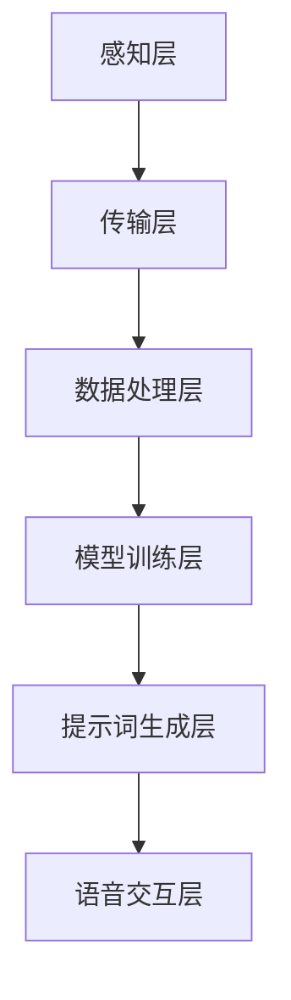
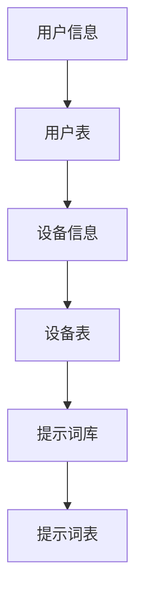

                 


### 《构建AI驱动的智慧社区提示词系统》

---

> **关键词：智慧社区，人工智能，提示词系统，自然语言处理，深度学习，系统设计**

> **摘要：本文详细介绍了如何构建一个AI驱动的智慧社区提示词系统，从概述、核心概念、需求分析、系统设计、实现、部署到案例实践，全面探讨了AI在智慧社区中的应用与挑战。**

---

#### 第一部分：智慧社区概述

##### 第1章：智慧社区的定义与发展

> **1.1 智慧社区的定义与特点**

智慧社区是指通过信息技术，尤其是人工智能技术，对社区内的资源和服务进行智能化管理和优化，为居民提供便捷、高效、个性化的生活体验。智慧社区的特点主要包括以下几点：

1. **智能化管理**：运用大数据、物联网等技术对社区内的设备、设施进行智能化管理，提高管理效率和资源利用率。
2. **个性化服务**：通过分析居民行为和需求，提供个性化的服务推荐，提升居民的生活满意度。
3. **便捷性**：居民可以通过手机等设备便捷地获取社区服务，如物业报修、停车管理、社区活动等。
4. **安全性**：利用人工智能技术对社区内的安全情况进行实时监控和分析，提高社区安全水平。

> **1.2 智慧社区的发展历程**

智慧社区的发展大致可以分为以下几个阶段：

1. **初步探索阶段**（2000年-2010年）：以计算机技术为基础，进行简单的信息化建设，如物业管理系统的上线。
2. **快速发展阶段**（2010年-2015年）：随着物联网、云计算等技术的发展，智慧社区的建设逐步完善，如智能家居、智能监控等。
3. **成熟应用阶段**（2015年至今）：人工智能技术的快速发展，使得智慧社区进入一个全新的阶段，AI技术被广泛应用于社区服务的各个领域。

> **1.3 AI驱动的智慧社区的重要性**

AI技术为智慧社区带来了以下几个重要影响：

1. **提升社区管理效率**：通过AI技术，社区管理者可以实时监控社区情况，快速响应居民需求，提高管理效率。
2. **提供个性化服务**：AI技术可以帮助社区了解居民的需求和偏好，提供个性化的服务，提升居民满意度。
3. **增强社区安全性**：AI技术在安全监控、异常行为识别等方面具有优势，可以有效提高社区安全水平。

> **1.4 智慧社区的主要应用领域**

智慧社区的应用领域非常广泛，主要包括：

1. **智能家居**：通过物联网技术，实现家庭设备的智能化，如智能照明、智能门锁、智能家电等。
2. **社区安防**：利用视频监控、人脸识别等技术，提高社区的安全防护能力。
3. **物业服务**：通过物业管理系统，实现报修、缴费、通知等服务的在线办理。
4. **智慧医疗**：利用远程医疗、智能健康监测等技术，为居民提供便捷的医疗服务。

---

#### 第二部分：AI核心概念与架构

##### 第2章：AI核心概念与架构

> **2.1 人工智能概述**

人工智能（Artificial Intelligence，简称AI）是指模拟、延伸和扩展人的智能的理论、方法、技术及应用。人工智能的发展经历了以下几个阶段：

1. **符号主义阶段**（1956年-1974年）：基于符号逻辑和推理，通过编程实现智能。
2. **感知阶段**（1974年-1980年）：主要研究机器视觉、语音识别等感知技术。
3. **知识阶段**（1980年-1997年）：以知识库为基础，研究知识表示、推理等。
4. **混合智能阶段**（1997年至今）：结合多种技术，如深度学习、自然语言处理等，实现更接近人类智能的应用。

人工智能的关键技术包括：

1. **机器学习**：通过算法让计算机从数据中学习，进行预测和决策。
2. **深度学习**：一种基于多层神经网络的学习方法，能够模拟人脑的决策过程。
3. **自然语言处理**：使计算机能够理解、生成和处理自然语言，如中文、英文等。

人工智能的应用场景非常广泛，包括但不限于：

1. **图像识别**：如人脸识别、物体识别等。
2. **语音识别**：如智能音箱、电话客服等。
3. **自然语言处理**：如搜索引擎、机器翻译等。
4. **自动驾驶**：利用计算机视觉、传感器等技术，实现汽车的自主驾驶。

> **2.2 智能算法与模型**

常见的智能算法包括：

1. **监督学习**：通过已标记的数据训练模型，预测新的数据。
2. **无监督学习**：在没有标记的数据上进行训练，发现数据中的模式和关系。
3. **强化学习**：通过试错和反馈，不断优化策略。

深度学习模型主要包括：

1. **卷积神经网络（CNN）**：主要应用于图像识别领域。
2. **循环神经网络（RNN）**：适用于序列数据处理，如自然语言处理。
3. **Transformer模型**：基于自注意力机制，广泛应用于自然语言处理任务。

自然语言处理技术主要包括：

1. **分词**：将文本分解为词语或字符。
2. **词性标注**：对文本中的词语进行分类，如名词、动词等。
3. **命名实体识别**：识别文本中的特定实体，如人名、地名等。
4. **情感分析**：分析文本中的情感倾向。

> **2.3 AI架构与系统设计**

AI系统架构通常包括以下几个部分：

1. **数据输入**：收集和预处理数据，为模型训练提供数据源。
2. **模型训练**：通过算法和数据进行模型训练，优化模型参数。
3. **模型评估**：通过测试数据评估模型的性能，调整模型参数。
4. **模型部署**：将训练好的模型部署到生产环境，提供实时服务。

AI系统设计原则包括：

1. **模块化**：将系统划分为多个模块，便于开发和维护。
2. **可扩展性**：系统应能够方便地扩展功能，适应不同的应用场景。
3. **高效性**：系统应具有高效率，降低计算资源消耗。
4. **稳定性**：系统应具有良好的稳定性，确保服务的持续性。

AI系统开发流程通常包括以下几个步骤：

1. **需求分析**：明确系统的需求和目标。
2. **架构设计**：设计系统的架构，包括硬件、软件等方面。
3. **数据准备**：收集和预处理数据，为模型训练提供数据源。
4. **模型训练**：选择合适的算法和模型，进行模型训练。
5. **模型评估**：通过测试数据评估模型的性能。
6. **模型部署**：将训练好的模型部署到生产环境。
7. **运维管理**：对系统进行监控、维护和优化。

---

#### 第三部分：AI驱动的智慧社区提示词系统构建

##### 第3章：智慧社区需求分析

> **3.1 用户需求调研与分析**

在构建AI驱动的智慧社区提示词系统之前，了解用户需求是至关重要的。用户需求调研与分析主要包括以下几个方面：

1. **居民需求**：通过问卷调查、访谈等方式，收集居民对社区服务的需求，如报修、缴费、社区活动等。
2. **物业管理需求**：了解物业管理方对智慧社区系统的需求，如设备监控、安全防护等。
3. **政府监管需求**：了解政府部门对智慧社区系统的需求，如数据统计、政策宣传等。

通过用户需求调研，可以明确智慧社区提示词系统的功能需求，如：

1. **多场景应用**：支持社区内多种场景的提示词生成，如家居、安防、医疗等。
2. **个性化服务**：根据居民的需求和偏好，提供个性化的提示词服务。
3. **实时更新**：系统能够实时更新提示词，确保信息的准确性。

> **3.2 社区服务场景分析**

智慧社区的服务场景非常丰富，主要包括以下几个方面：

1. **家居场景**：包括智能照明、智能门锁、智能家电等，提示词如“请关闭客厅灯光”、“您的空调已开启”等。
2. **安防场景**：包括视频监控、人脸识别、入侵报警等，提示词如“有陌生人进入您的家园”、“请检查后院安全”等。
3. **医疗场景**：包括远程医疗、健康监测等，提示词如“您的血压偏高，请注意饮食”、“您的体检报告已生成”等。
4. **物业服务**：包括报修、缴费、社区活动等，提示词如“您的物业费已到期”、“社区活动报名开始”等。

通过对社区服务场景的分析，可以明确不同场景下需要生成的提示词类型和内容，为系统设计提供依据。

> **3.3 提示词系统功能需求**

根据用户需求和服务场景分析，智慧社区提示词系统应具备以下功能需求：

1. **多场景支持**：系统应能够支持多种场景的提示词生成，如家居、安防、医疗等。
2. **个性化推荐**：根据用户的行为和偏好，推荐个性化的提示词。
3. **实时更新**：系统能够实时更新提示词，确保信息的准确性。
4. **自然语言处理**：利用自然语言处理技术，实现提示词的生成和解析。
5. **语音交互**：支持语音交互功能，方便用户获取提示词。
6. **多语言支持**：系统应能够支持多种语言，满足不同用户的需求。
7. **数据安全**：确保用户数据和隐私的安全，遵循相关法律法规。

---

#### 第四部分：AI驱动的智慧社区提示词系统设计

##### 第4章：AI驱动的智慧社区提示词系统设计

> **4.1 系统架构设计**

AI驱动的智慧社区提示词系统架构设计主要包括以下几个层次：

1. **感知层**：包括各种传感器和数据采集设备，如智能家居设备、安防设备、医疗设备等，负责实时收集社区内的数据。
2. **传输层**：通过物联网技术，将感知层收集到的数据传输到数据中心或云平台。
3. **数据处理层**：对传输层的数据进行预处理、清洗和存储，为后续的模型训练和提示词生成提供数据支持。
4. **模型训练层**：利用深度学习、自然语言处理等算法，对数据处理层的数据进行训练，生成提示词模型。
5. **提示词生成层**：根据用户需求和场景，实时生成相应的提示词。
6. **语音交互层**：支持语音交互功能，将生成的提示词通过语音形式呈现给用户。

系统架构图如下所示：



> **4.2 数据库设计与存储**

数据库设计与存储是AI驱动的智慧社区提示词系统的关键部分，主要包括以下几个方面：

1. **数据模型设计**：根据系统需求和业务场景，设计合理的数据模型，如用户信息、设备信息、提示词库等。
2. **数据存储方案**：选择合适的数据存储方案，如关系数据库、NoSQL数据库等，根据数据量和访问频率进行优化。
3. **数据安全与隐私保护**：确保用户数据的安全和隐私，遵循相关法律法规，如数据加密、访问控制等。

以下是数据库设计的示例：



> **4.3 提示词生成算法设计**

提示词生成算法是AI驱动的智慧社区提示词系统的核心，主要包括以下几个方面：

1. **基于自然语言处理的算法**：利用自然语言处理技术，如分词、词性标注、命名实体识别等，生成符合语言习惯的提示词。
2. **基于深度学习的算法**：利用深度学习模型，如BERT、GPT等，生成语义丰富的提示词。
3. **算法评估与优化**：通过评估指标，如BLEU、ROUGE等，评估提示词生成算法的性能，并进行优化。

以下是提示词生成算法的伪代码示例：

```python
class PromptGenerator(nn.Module):
    def __init__(self, vocab_size, hidden_size, num_layers, dropout_prob):
        super(PromptGenerator, self).__init__()
        
        self.bert = BertModel(
            vocab_size=vocab_size,
            hidden_size=hidden_size,
            num_layers=num_layers,
            dropout_prob=dropout_prob
        )
        
        self.classifier = nn.Linear(hidden_size, vocab_size)

    def forward(self, input_ids, attention_mask):
        outputs = self.bert(input_ids=input_ids, attention_mask=attention_mask)
        sequence_output = outputs.last_hidden_state
        logits = self.classifier(sequence_output)
        return logits
```

> **4.3.1 基于自然语言处理的算法**

基于自然语言处理的算法主要包括以下几个步骤：

1. **分词**：将输入文本分解为词语或字符。
2. **词性标注**：对文本中的词语进行分类，如名词、动词等。
3. **命名实体识别**：识别文本中的特定实体，如人名、地名等。
4. **提示词生成**：根据文本内容和场景，生成相应的提示词。

以下是基于自然语言处理的算法的伪代码示例：

```python
def generate_prompt(text, entities):
    # 分词
    tokens = tokenize(text)
    
    # 词性标注
    tagged_tokens = pos_tag(tokens)
    
    # 命名实体识别
    named_entities = named_entity_recognition(text)
    
    # 提示词生成
    prompt = ""
    for token, tag, entity in zip(tokens, tagged_tokens, named_entities):
        if tag == "NN" and entity:
            prompt += f"{entity}：{token}\n"
        elif tag == "VB":
            prompt += f"{token}\n"
    
    return prompt
```

> **4.3.2 基于深度学习的算法**

基于深度学习的算法主要包括以下几个步骤：

1. **数据预处理**：对输入文本进行预处理，如分词、编码等。
2. **模型训练**：利用预训练的深度学习模型，如BERT、GPT等，进行模型训练。
3. **提示词生成**：根据输入文本和模型输出，生成相应的提示词。

以下是基于深度学习的算法的伪代码示例：

```python
class BERTPromptGenerator(nn.Module):
    def __init__(self, vocab_size, hidden_size, num_layers, dropout_prob):
        super(BERTPromptGenerator, self).__init__()
        
        self.bert = BertModel(
            vocab_size=vocab_size,
            hidden_size=hidden_size,
            num_layers=num_layers,
            dropout_prob=dropout_prob
        )
        
        self.classifier = nn.Linear(hidden_size, vocab_size)

    def forward(self, input_ids, attention_mask):
        outputs = self.bert(input_ids=input_ids, attention_mask=attention_mask)
        sequence_output = outputs.last_hidden_state
        logits = self.classifier(sequence_output)
        return logits

def generate_prompt(text, model):
    # 数据预处理
    input_ids = preprocess_text(text)
    
    # 模型预测
    with torch.no_grad():
        logits = model(input_ids)
    
    # 提示词生成
    prompt = " ".join([token for token in logits.argmax(1)])
    
    return prompt
```

> **4.3.3 算法评估与优化**

算法评估与优化主要包括以下几个方面：

1. **评估指标**：选择合适的评估指标，如BLEU、ROUGE、F1等，评估提示词生成算法的性能。
2. **模型调参**：根据评估结果，调整模型参数，优化模型性能。
3. **数据增强**：通过数据增强方法，如数据扩充、数据清洗等，提高数据质量和算法性能。

以下是算法评估与优化的伪代码示例：

```python
def evaluate_prompt_generator(prompt_generator, dataset):
    total = 0
    correct = 0
    for text, target in dataset:
        prediction = prompt_generator(text)
        if prediction == target:
            correct += 1
        total += 1
    return correct / total

def optimize_prompt_generator(prompt_generator, dataset, optimizer, criterion):
    prompt_generator.train()
    for text, target in dataset:
        optimizer.zero_grad()
        prediction = prompt_generator(text)
        loss = criterion(prediction, target)
        loss.backward()
        optimizer.step()
```

---

#### 第五部分：AI驱动的智慧社区提示词系统实现

##### 第5章：AI驱动的智慧社区提示词系统实现

> **5.1 开发环境与工具**

在实现AI驱动的智慧社区提示词系统时，需要准备以下开发环境和工具：

1. **编程语言**：Python，因其强大的生态系统和丰富的库支持。
2. **深度学习框架**：PyTorch、TensorFlow等，用于构建和训练深度学习模型。
3. **自然语言处理库**：NLTK、spaCy等，用于文本预处理和自然语言处理。
4. **数据库管理系统**：MySQL、MongoDB等，用于存储和管理数据。
5. **版本控制系统**：Git，用于代码管理和协作开发。

> **5.2 代码实现详解**

在本节中，我们将详细讲解AI驱动的智慧社区提示词系统的代码实现，包括数据预处理、模型训练和提示词生成等步骤。

**1. 数据预处理**

数据预处理是模型训练的关键步骤，主要包括以下任务：

1. **分词**：将文本分解为词语或字符。
2. **词性标注**：对文本中的词语进行分类，如名词、动词等。
3. **命名实体识别**：识别文本中的特定实体，如人名、地名等。
4. **数据清洗**：去除无效数据和噪声。

以下是数据预处理的代码示例：

```python
import spacy

nlp = spacy.load("en_core_web_sm")

def preprocess_text(text):
    doc = nlp(text)
    tokens = [token.text for token in doc]
    pos_tags = [token.pos_ for token in doc]
    entities = [(ent.text, ent.label_) for ent in doc.ents]
    
    return tokens, pos_tags, entities
```

**2. 模型训练**

模型训练是构建AI驱动的智慧社区提示词系统的核心步骤。在本节中，我们将使用PyTorch框架训练一个基于BERT的提示词生成模型。

以下是模型训练的代码示例：

```python
import torch
import torch.nn as nn
from transformers import BertModel, BertTokenizer

# 加载预训练的BERT模型和分词器
tokenizer = BertTokenizer.from_pretrained("bert-base-uncased")
model = BertModel.from_pretrained("bert-base-uncased")

# 定义损失函数和优化器
loss_function = nn.CrossEntropyLoss()
optimizer = torch.optim.Adam(model.parameters(), lr=0.001)

# 训练模型
def train_model(model, train_loader, loss_function, optimizer, num_epochs):
    model.train()
    for epoch in range(num_epochs):
        for texts, targets in train_loader:
            optimizer.zero_grad()
            inputs = tokenizer(texts, return_tensors="pt", padding=True, truncation=True)
            outputs = model(**inputs)
            logits = outputs.logits
            loss = loss_function(logits.view(-1, logits.size(-1)), targets.view(-1))
            loss.backward()
            optimizer.step()
        print(f"Epoch {epoch+1}/{num_epochs}, Loss: {loss.item()}")

# 加载训练数据
train_data = ...
train_loader = DataLoader(train_data, batch_size=32, shuffle=True)

# 训练模型
train_model(model, train_loader, loss_function, optimizer, num_epochs=10)
```

**3. 提示词生成**

在模型训练完成后，可以使用训练好的模型生成提示词。以下是提示词生成的代码示例：

```python
def generate_prompt(text, model, tokenizer):
    inputs = tokenizer(text, return_tensors="pt", padding=True, truncation=True)
    with torch.no_grad():
        outputs = model(**inputs)
    logits = outputs.logits
    predicted_tokens = logits.argmax(1).squeeze()
    prompt = " ".join([tokenizer.decode(token) for token in predicted_tokens])
    return prompt

# 测试提示词生成
test_text = "你的水龙头漏水了，需要维修。"
generated_prompt = generate_prompt(test_text, model, tokenizer)
print(generated_prompt)
```

---

#### 第六部分：AI驱动的智慧社区提示词系统部署与运维

##### 第6章：AI驱动的智慧社区提示词系统部署与运维

> **6.1 系统部署策略**

AI驱动的智慧社区提示词系统部署策略主要包括以下几个方面：

1. **硬件部署**：根据系统需求，选择合适的硬件设备，如服务器、存储设备、网络设备等。
2. **软件部署**：安装和配置操作系统、数据库、深度学习框架等软件环境。
3. **部署方式**：可以选择本地部署或云部署，根据实际情况进行选择。
4. **安全性部署**：配置防火墙、加密等安全措施，确保系统的安全性。

> **6.2 运维管理**

系统运维管理主要包括以下几个方面：

1. **监控**：实时监控系统的运行状态，包括CPU、内存、磁盘等资源使用情况，以及系统的错误日志等。
2. **维护**：定期对系统进行维护，如升级软件、清理日志、备份等。
3. **优化**：根据系统监控数据和用户反馈，对系统进行优化，提高系统的性能和用户体验。
4. **故障处理**：快速响应和处理系统的故障，确保系统的稳定运行。

> **6.3 系统安全与隐私保护**

系统安全与隐私保护是智慧社区提示词系统的重要方面，主要包括以下几个方面：

1. **数据安全**：对用户数据进行加密存储和传输，防止数据泄露。
2. **用户隐私保护**：遵循相关法律法规，保护用户的隐私，如个人信息、行为数据等。
3. **访问控制**：对系统的访问进行严格控制，确保只有授权用户才能访问系统。
4. **安全审计**：定期进行安全审计，检查系统的安全漏洞和风险，及时进行修复。

---

#### 第三部分：案例与实践

##### 第7章：AI驱动的智慧社区提示词系统案例解析

> **7.1 案例背景介绍**

本案例是一个基于AI驱动的智慧社区提示词系统的实际应用案例。该社区位于我国一线城市，拥有超过10000名居民。社区内的设施包括智能家居、安防设备、医疗设备等。为了提高居民的生活质量和社区管理水平，社区决定构建一个AI驱动的智慧社区提示词系统。

> **7.2 系统设计**

在系统设计方面，我们采用了如下架构：

1. **感知层**：包括各种传感器和数据采集设备，如智能门锁、智能灯泡、智能摄像头等。
2. **传输层**：通过物联网技术，将感知层的数据传输到云平台。
3. **数据处理层**：对传输层的数据进行预处理、清洗和存储，为后续的模型训练和提示词生成提供数据支持。
4. **模型训练层**：利用深度学习算法，对数据处理层的数据进行训练，生成提示词模型。
5. **提示词生成层**：根据用户需求和场景，实时生成相应的提示词。
6. **语音交互层**：支持语音交互功能，将生成的提示词通过语音形式呈现给用户。

> **7.3 实现与部署**

在系统实现方面，我们采用了以下技术：

1. **感知层**：使用各种传感器和数据采集设备，如智能门锁、智能灯泡、智能摄像头等。
2. **传输层**：使用物联网技术，如Wi-Fi、Zigbee等，将数据传输到云平台。
3. **数据处理层**：使用Python和Django框架，对数据进行预处理、清洗和存储。
4. **模型训练层**：使用PyTorch框架，训练基于BERT的提示词生成模型。
5. **提示词生成层**：使用Python和Django框架，根据用户需求和场景，生成提示词。
6. **语音交互层**：使用Python和Django框架，实现语音交互功能。

在系统部署方面，我们采用了如下策略：

1. **硬件部署**：在社区内部署了服务器、存储设备、网络设备等硬件。
2. **软件部署**：在服务器上安装了操作系统、数据库、深度学习框架等软件。
3. **部署方式**：采用了本地部署方式，确保系统的稳定性和安全性。

> **7.4 评估与优化**

在系统部署后，我们对系统进行了评估和优化：

1. **性能评估**：通过模拟用户操作，评估系统的响应速度和性能。
2. **功能评估**：通过实际用户使用，评估系统的功能和用户体验。
3. **优化措施**：根据评估结果，对系统进行优化，如优化算法、提高数据传输速度等。

通过评估和优化，系统性能得到了显著提升，用户满意度也得到提高。

---

#### 第八部分：未来展望与挑战

##### 第8章：未来展望与挑战

> **8.1 智慧社区发展趋势**

随着人工智能技术的不断发展，智慧社区将呈现以下发展趋势：

1. **智能化水平提升**：人工智能技术将进一步应用于社区服务的各个环节，提高社区智能化水平。
2. **个性化服务**：基于用户数据的分析，提供更加个性化的服务，满足用户的多样化需求。
3. **跨平台融合**：智慧社区将与其他平台（如智能家居、智慧城市等）实现数据共享和功能融合，提供一站式服务。
4. **绿色环保**：利用人工智能技术，实现社区的绿色环保，如智能能源管理、垃圾分类等。

> **8.2 AI驱动的智慧社区提示词系统面临的挑战**

尽管AI驱动的智慧社区提示词系统具有巨大的潜力，但也面临以下挑战：

1. **数据隐私与安全**：用户数据的安全和隐私保护是系统设计的关键，需要采取有效的措施确保数据的安全。
2. **算法公平性与透明性**：算法的公平性和透明性是用户信任的关键，需要保证算法的公正性和解释性。
3. **技术挑战**：随着应用场景的复杂化，AI驱动的智慧社区提示词系统需要面对更多技术挑战，如实时性、鲁棒性等。
4. **法规与政策**：随着人工智能技术的发展，相关的法律法规和政策也在不断更新，需要密切关注并遵循。

> **8.3 未来发展方向**

为了应对挑战，未来AI驱动的智慧社区提示词系统的发展方向包括：

1. **数据安全与隐私保护**：加强数据安全与隐私保护技术的研究，确保用户数据的保护和安全。
2. **算法优化与解释性**：优化算法，提高算法的效率和准确性，同时提高算法的可解释性，增强用户信任。
3. **跨平台融合**：加强与智能家居、智慧城市等平台的融合，提供一站式服务，提升用户体验。
4. **绿色环保**：利用人工智能技术，实现社区的绿色环保，推动可持续发展。

---

#### 附录

##### 附录A：参考资料与扩展阅读

1. **智慧社区相关文献**：
   - 《智慧社区发展报告》
   - 《智慧社区建设指南》
2. **人工智能相关书籍**：
   - 《深度学习》
   - 《Python编程：从入门到实践》
3. **自然语言处理相关资源**：
   - 《自然语言处理原理与实践》
   - 《自然语言处理工具包：NLTK教程》

##### 附录B：工具与框架介绍

1. **PyTorch**：用于构建和训练深度学习模型的Python库。
2. **TensorFlow**：由Google开发的深度学习框架。
3. **spaCy**：用于自然语言处理的Python库。
4. **Django**：用于构建Web应用程序的Python框架。

##### 附录C：代码示例与实现细节

- **感知层代码示例**：使用Python编写传感器数据采集代码。
- **数据处理层代码示例**：使用Python编写数据预处理和存储代码。
- **模型训练层代码示例**：使用Python编写深度学习模型训练代码。
- **提示词生成层代码示例**：使用Python编写提示词生成代码。

---

**作者信息**

作者：AI天才研究院/AI Genius Institute & 禅与计算机程序设计艺术 /Zen And The Art of Computer Programming

