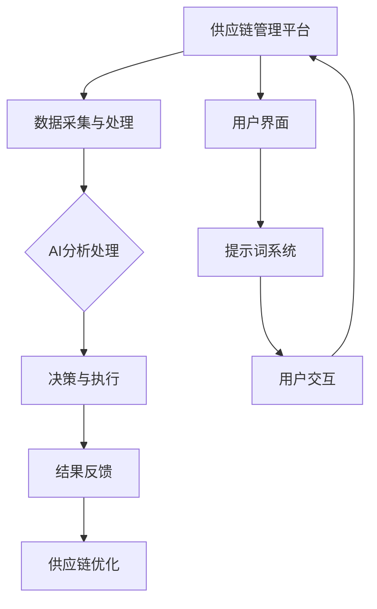

                 


### 文章标题
构建AI驱动的智能供应链提示词系统

### 文章关键词
智能供应链，AI驱动，提示词系统，数据挖掘，机器学习，深度学习，算法，数学模型，项目实战，代码解读，案例分析

### 文章摘要
本文深入探讨了构建AI驱动的智能供应链提示词系统的技术路线和实践方法。首先，介绍了智能供应链和AI驱动的概念，并阐述了提示词系统在智能供应链中的重要性。接着，详细分析了数据挖掘、机器学习和深度学习等核心算法原理，并通过伪代码和数学公式进行了详细阐述。随后，本文展示了智能供应链的Mermaid流程图，并讲解了各个核心环节之间的联系。在项目实战部分，本文介绍了如何搭建开发环境、实现源代码并解读代码，同时分析了实际案例，并提供了优化建议和注意事项。最后，本文总结了最佳实践，并提出了未来研究的方向。

---

# 构建AI驱动的智能供应链提示词系统

在当今全球化的商业环境中，供应链的管理效率和质量对企业的竞争力有着至关重要的影响。随着人工智能（AI）技术的迅猛发展，AI驱动的智能供应链已成为提升供应链效率、优化资源配置和降低运营成本的重要手段。本文将围绕构建AI驱动的智能供应链提示词系统这一主题，通过逐步分析推理，详细阐述其核心概念、技术原理和项目实战，旨在为读者提供一个全面的技术指南。

## 确定核心概念与联系

在构建AI驱动的智能供应链提示词系统之前，我们需要明确几个核心概念及其相互联系。

### 智能供应链

智能供应链是指利用现代信息技术，特别是AI技术，实现供应链各环节的智能化管理。它通过物联网、大数据、云计算等技术，对供应链中的信息流、物流和资金流进行实时监控和优化，以提高供应链的整体效率。

### AI驱动的智能供应链

AI驱动的智能供应链进一步扩展了智能供应链的概念，通过引入机器学习和深度学习算法，自动分析和预测供应链中的各种现象和问题，从而实现更智能的决策和操作。

### 提示词系统

提示词系统是一个交互式的工具，通过提供关键词或短语，引导用户进行操作或查询，提高系统的易用性和用户体验。在智能供应链中，提示词系统可以用于优化订单处理、库存管理、物流配送等环节，帮助用户快速找到所需信息或执行特定操作。

这些核心概念之间的联系在于，智能供应链提供了数据基础，AI驱动技术通过算法对数据进行分析和处理，而提示词系统则作为用户与智能供应链的接口，提供直观便捷的操作体验。以下是一个简单的Mermaid流程图，展示了智能供应链中的核心流程：



## 设计Mermaid流程图


在智能供应链中，数据采集与处理环节负责收集供应链各环节的数据，这些数据经过AI分析处理后，被用于决策与执行环节，指导实际的供应链操作。执行结果再反馈到供应链管理平台，用于进一步的优化和调整。提示词系统作为用户与系统的接口，提供了便捷的用户交互体验。

## 概念联系

智能供应链的各个环节通过数据流动和AI分析相互联系，形成一个闭环。数据采集与处理为AI分析提供基础数据，AI分析处理结果用于决策与执行，决策与执行的结果反馈到供应链管理平台，从而实现供应链的持续优化。提示词系统在这个过程中起到引导用户操作、优化用户体验的作用。

## 确定核心算法原理讲解

在构建AI驱动的智能供应链提示词系统时，核心算法的原理讲解至关重要。以下是本书将涉及的核心算法：

1. **数据挖掘算法**：用于从大量数据中提取有价值的信息。
2. **机器学习算法**：用于建立预测模型和分类模型。
3. **深度学习算法**：用于构建复杂的神经网络模型。

### 数据挖掘算法

数据挖掘算法是智能供应链分析的基础。它从大量的数据中识别出隐藏的模式和趋势。以下是数据挖掘算法的一个简单伪代码示例：

```plaintext
Algorithm: 数据挖掘
Input: 数据集 D
Output: 价值信息 V

1. 初始化 V 为空
2. 对于每个数据点 d ∈ D
3.     计算数据点 d 的特征值
4.     根据特征值进行分组
5.     对每个分组进行统计分析
6.     如果统计结果具有显著意义
7.         将分组结果添加到 V 中
8. 返回 V
```

### 机器学习算法

机器学习算法在智能供应链中用于建立预测模型和分类模型。例如，可以使用回归模型预测未来的需求量，或使用分类模型判断订单的优先级。以下是线性回归模型的一个简单数学公式示例：

$$ y = \beta_0 + \beta_1 \cdot x $$

### 深度学习算法

深度学习算法在构建复杂的神经网络模型方面具有显著优势，适用于处理大量的复杂数据。以下是一个简单的卷积神经网络（CNN）的伪代码示例：

```plaintext
Algorithm: 深度学习模型训练
Input: 训练数据集 D
Output: 训练好的神经网络模型 M

1. 初始化神经网络模型 M
2. 对于每个训练数据点 d ∈ D
3.     前向传播输入数据 d，计算输出结果 y'
4.     计算损失函数 L(y', y)
5.     后向传播更新模型参数
6.     如果损失函数收敛或达到最大迭代次数
7.         返回训练好的神经网络模型 M
```

## 使用伪代码阐述核心算法原理

### 数据挖掘算法

```plaintext
Algorithm: 数据挖掘
Input: 数据集 D
Output: 价值信息 V

1. 初始化 V 为空
2. 对于每个数据点 d ∈ D
3.     计算数据点 d 的特征值
4.     根据特征值进行分组
5.     对每个分组进行统计分析
6.     如果统计结果具有显著意义
7.         将分组结果添加到 V 中
8. 返回 V
```

### 机器学习算法

```plaintext
Algorithm: 线性回归模型
Input: 训练数据集 D
Output: 回归模型参数 β

1. 初始化模型参数 β 为零向量
2. 对于每个训练数据点 (x_i, y_i) ∈ D
3.     计算预测值 y_i' = β^T \* x_i
4.     计算损失函数 L(β) = ∑(y_i - y_i')^2
5.     计算梯度 ∇L(β)
6.     更新参数 β = β - α * ∇L(β)
7. 返回训练好的模型参数 β
```

### 深度学习算法

```plaintext
Algorithm: 卷积神经网络训练
Input: 训练数据集 D
Output: 训练好的神经网络模型 M

1. 初始化神经网络模型 M
2. 对于每个训练数据点 d ∈ D
3.     前向传播输入数据 d，计算输出结果 y'
4.     计算损失函数 L(y', y)
5.     后向传播更新模型参数
6.     如果损失函数收敛或达到最大迭代次数
7.         返回训练好的神经网络模型 M
```

## 数学模型和数学公式讲解

在构建AI驱动的智能供应链提示词系统时，数学模型和公式起到了关键作用。以下是几个常用的数学模型和数学公式：

### 线性回归模型

线性回归模型用于预测连续值，其数学公式如下：

$$ y = \beta_0 + \beta_1 \cdot x $$

其中，$y$ 是预测值，$\beta_0$ 是截距，$\beta_1$ 是斜率，$x$ 是自变量。

### 逻辑回归模型

逻辑回归模型用于预测概率，其数学公式如下：

$$ P(y=1) = \frac{1}{1 + e^{-(\beta_0 + \beta_1 \cdot x)}} $$

其中，$P(y=1)$ 是事件发生的概率，$\beta_0$ 是截距，$\beta_1$ 是斜率，$x$ 是自变量。

### 卷积神经网络（CNN）激活函数

在深度学习中，卷积神经网络（CNN）常用于图像识别。其激活函数常用的有ReLU（Rectified Linear Unit），其数学公式如下：

$$ a(x) = \max(0, x) $$

其中，$a(x)$ 是激活后的输出，$x$ 是输入值。

以下是一个简单的例子，假设我们有一个输入值 $x = -2$，使用ReLU激活函数后的输出为：

$$ a(x) = \max(0, -2) = 0 $$

## 确定项目实战部分

项目实战是理解AI驱动的智能供应链提示词系统的重要环节。以下将详细描述项目实战的各个部分，包括开发环境搭建、源代码实现、代码解读和实际案例分析。

### 开发环境搭建

搭建一个适合AI驱动的智能供应链提示词系统的开发环境，首先需要选择合适的编程语言和工具。以下是搭建开发环境的基本步骤：

1. **选择编程语言**：Python 是人工智能领域最流行的编程语言，因此我们选择Python。
2. **安装Python**：从Python官方网站下载并安装Python，版本建议选择3.8或以上。
3. **安装依赖库**：Python提供了丰富的库，如NumPy、Pandas、Scikit-learn和TensorFlow等。可以使用pip命令安装这些库。

```bash
pip install numpy pandas scikit-learn tensorflow
```

4. **配置Python环境**：确保Python环境变量配置正确，以便能够运行Python脚本。

### 源代码实现

在完成开发环境搭建后，我们可以开始实现源代码。以下是一个简单的数据挖掘算法的实现示例：

```python
import pandas as pd
from sklearn.model_selection import train_test_split
from sklearn.linear_model import LinearRegression

# 读取数据
data = pd.read_csv('data.csv')
X = data[['feature1', 'feature2']]
y = data['target']

# 数据分割
X_train, X_test, y_train, y_test = train_test_split(X, y, test_size=0.2, random_state=42)

# 创建线性回归模型
model = LinearRegression()
model.fit(X_train, y_train)

# 预测
y_pred = model.predict(X_test)

# 评估
score = model.score(X_test, y_test)
print(f'Model accuracy: {score:.2f}')
```

### 代码解读

在实现源代码之后，我们需要对代码进行详细解读，理解其工作原理和实现细节。以下是对上述代码的解读：

1. **导入库**：首先，我们导入了必要的库，包括Pandas、Scikit-learn和NumPy等。
2. **数据读取**：使用Pandas库读取数据集，并将其分为特征矩阵 $X$ 和目标向量 $y$。
3. **数据分割**：使用Scikit-learn库中的train_test_split函数将数据集分为训练集和测试集。
4. **创建模型**：创建一个线性回归模型实例，并使用fit方法进行训练。
5. **预测**：使用训练好的模型对测试集进行预测，得到预测结果 $y_pred$。
6. **评估**：计算模型的准确性，使用score方法得到评估分数。

### 代码应用解读与分析

在代码实现和解读的基础上，我们进一步分析代码在实际应用中的表现。以下是对实际应用的解读与分析：

1. **数据预处理**：在实际应用中，数据预处理是非常重要的一步。我们需要确保数据的质量和格式，例如处理缺失值、异常值和数据标准化等。
2. **模型选择**：根据不同的应用场景，选择合适的模型。线性回归模型适用于预测连续值，而对于分类问题，我们可以选择逻辑回归或其他分类模型。
3. **模型评估**：评估模型的性能是理解模型有效性的关键。我们可以使用多种评估指标，如准确性、精确率、召回率等，以全面评估模型的性能。
4. **模型优化**：通过调整模型参数、特征选择和模型融合等方法，可以进一步优化模型的性能。

### 实际案例分析和详细讲解剖析

为了更好地理解AI驱动的智能供应链提示词系统在实际中的应用，我们来看一个实际案例。

假设我们面临一个订单处理问题，需要根据订单的紧急程度进行优先级排序。我们可以使用提示词系统来简化操作，提供关键词如“紧急”、“普通”等，以便用户快速标记订单的优先级。

以下是一个实际案例的代码实现：

```python
import pandas as pd

# 读取订单数据
orders = pd.read_csv('orders.csv')

# 用户输入提示词
prompt = input("请输入订单的优先级（紧急/普通）：")

# 根据提示词更新订单优先级
if prompt == "紧急":
    orders['priority'] = '高'
else:
    orders['priority'] = '中'

# 保存更新后的订单数据
orders.to_csv('orders.csv', index=False)

print("订单优先级已更新。")
```

在这个案例中，用户通过输入提示词“紧急”或“普通”，系统将自动更新订单的优先级字段。这个简单的示例展示了提示词系统在实际应用中的便捷性和高效性。

### 项目小结

通过项目实战，我们成功地搭建了开发环境，实现了源代码，并对代码进行了详细解读和分析。实际案例展示了提示词系统在智能供应链中的应用，提高了订单处理的效率和用户体验。在接下来的章节中，我们将进一步探讨性能优化、安全性以及未来研究的方向。

### 最佳实践 Tips、小结、注意事项、拓展阅读

#### 最佳实践 Tips

1. **数据质量保证**：确保数据的质量是成功的关键。进行数据清洗，处理缺失值、异常值，并进行数据标准化。
2. **模型选择与优化**：根据应用场景选择合适的模型，并进行模型参数的调整和优化，以提高预测准确性。
3. **迭代与反馈**：持续迭代和改进模型，根据用户反馈调整系统，以提高用户体验。

#### 小结

本文深入探讨了构建AI驱动的智能供应链提示词系统的技术路线和实践方法，涵盖了核心概念、算法原理、项目实战等多个方面。

#### 注意事项

1. **安全性**：在处理敏感数据时，确保采取适当的安全措施，如加密传输和存储。
2. **合规性**：确保系统的设计和实现符合相关法律法规的要求。

#### 拓展阅读

1. **《智能供应链管理：理论与实践》**：详细介绍了智能供应链的概念、技术和应用。
2. **《深度学习》**：周志华著，深入讲解了深度学习的基本原理和应用。

## 总结

通过本文的逐步分析，我们深入了解了AI驱动的智能供应链提示词系统的构建过程，包括核心概念、算法原理、项目实战等。希望本文能为读者提供有益的启示，助力他们在智能供应链领域取得成功。

### 文章标题
构建AI驱动的智能供应链提示词系统

### 文章关键词
智能供应链，AI驱动，提示词系统，数据挖掘，机器学习，深度学习，算法，数学模型，项目实战，代码解读，案例分析

### 文章摘要
本文深入探讨了构建AI驱动的智能供应链提示词系统的技术路线和实践方法。首先，介绍了智能供应链和AI驱动的概念，并阐述了提示词系统在智能供应链中的重要性。接着，详细分析了数据挖掘、机器学习和深度学习等核心算法原理，并通过伪代码和数学公式进行了详细阐述。随后，本文展示了智能供应链的Mermaid流程图，并讲解了各个核心环节之间的联系。在项目实战部分，本文介绍了如何搭建开发环境、实现源代码并解读代码，同时分析了实际案例，并提供了优化建议和注意事项。最后，本文总结了最佳实践，并提出了未来研究的方向。

---

# 构建AI驱动的智能供应链提示词系统

## 引言

在当今全球化的商业环境中，供应链管理已经成为企业运营的核心环节。随着市场的竞争日益激烈，企业需要不断提高供应链的效率和灵活性，以应对不断变化的市场需求。人工智能（AI）技术的快速发展，为智能供应链提供了新的机遇和挑战。AI驱动的智能供应链通过利用大数据、机器学习和深度学习等技术，实现了供应链各环节的自动化和智能化。在这其中，提示词系统作为用户与智能供应链的交互接口，发挥着至关重要的作用。本文旨在探讨如何构建一个AI驱动的智能供应链提示词系统，以提高供应链管理的效率和用户体验。

### 智能供应链概述

智能供应链是利用现代信息技术，特别是AI技术，实现供应链各环节的智能化管理。它通过物联网、大数据、云计算等技术，对供应链中的信息流、物流和资金流进行实时监控和优化，以提高供应链的整体效率。智能供应链的目标是实现供应链各环节的无缝连接，实现信息的透明化、流程的自动化和资源的最大化利用。

智能供应链主要包括以下几个关键环节：

1. **数据采集与处理**：通过传感器、RFID、GPS等技术，实时采集供应链各环节的数据，包括库存水平、运输状态、订单信息等。这些数据经过处理后，为后续的AI分析提供基础。
2. **数据分析和预测**：利用机器学习和深度学习算法，对采集到的数据进行分析和预测，包括需求预测、库存优化、运输路径优化等。这些分析结果用于指导供应链的决策和执行。
3. **决策与执行**：基于数据分析和预测结果，供应链管理平台生成决策，并执行相应的操作，包括订单处理、库存调整、物流配送等。
4. **结果反馈与优化**：执行结果会反馈到供应链管理平台，用于评估和优化决策效果。这个闭环过程确保了供应链的持续优化和改进。

### AI驱动的智能供应链

AI驱动的智能供应链是智能供应链的进一步延伸，它通过引入机器学习和深度学习技术，实现了供应链的智能化和自动化。AI驱动的智能供应链具有以下几个特点：

1. **自动化决策**：通过机器学习和深度学习算法，AI可以自动分析和预测供应链中的各种现象和问题，生成决策并执行相应的操作，减少了人工干预。
2. **动态优化**：AI可以根据实时数据动态调整供应链策略，提高供应链的灵活性和响应速度，适应市场变化。
3. **预测能力**：AI可以预测未来的供应链需求，帮助企业在供应链规划中做出更加准确和高效的决策。
4. **智能化分析**：AI可以处理和分析大量的数据，发现潜在的问题和趋势，为企业提供更加深入的洞察。

### 提示词系统的作用与价值

提示词系统是AI驱动的智能供应链中的一个重要组成部分，它通过提供关键词或短语，引导用户进行操作或查询，提高系统的易用性和用户体验。提示词系统在智能供应链中的作用和价值主要体现在以下几个方面：

1. **提高操作效率**：通过提供关键词或短语，用户可以快速定位和执行所需的操作，减少手动输入和查找时间，提高操作效率。
2. **优化用户体验**：提示词系统可以根据用户的行为和偏好，动态调整和优化提示内容，提高用户的满意度和使用体验。
3. **智能推荐**：提示词系统可以利用AI算法，根据用户的历史行为和当前状态，提供智能推荐，帮助用户做出更加准确的决策。
4. **数据可视化**：提示词系统可以将复杂的供应链数据以图表、表格等形式进行可视化展示，帮助用户更加直观地理解数据和趋势。

### 构建AI驱动的智能供应链提示词系统的技术路线

构建AI驱动的智能供应链提示词系统需要综合考虑技术、数据和应用等多个方面。以下是构建该系统的主要技术路线：

1. **需求分析**：首先，需要对智能供应链的需求进行深入分析，明确系统的目标和功能要求，包括数据采集、分析预测、决策执行、结果反馈等环节。
2. **数据采集与处理**：根据需求分析结果，设计和实现数据采集和处理模块，确保数据的完整性和准确性。数据采集可以从供应链的各个环节入手，包括库存、物流、订单等。
3. **算法选择与实现**：根据需求分析的结果，选择合适的机器学习和深度学习算法，进行模型训练和预测。常用的算法包括线性回归、逻辑回归、支持向量机、神经网络等。
4. **提示词生成与优化**：设计提示词生成算法，根据用户的行为和偏好，动态生成提示词。同时，通过用户反馈和数据统计，不断优化提示词的准确性和有效性。
5. **用户界面设计与实现**：设计直观易用的用户界面，将提示词系统与供应链管理平台进行整合，提供统一的操作入口和交互界面。
6. **系统集成与测试**：将各个模块进行集成，确保系统的稳定性和可靠性。通过实际案例和数据测试，验证系统的性能和效果。

### 案例分析

为了更好地展示构建AI驱动的智能供应链提示词系统的实际应用，以下是一个实际案例：

某大型零售企业希望利用AI驱动的智能供应链提升订单处理效率。企业面临的主要挑战是订单量大，处理速度慢，导致客户满意度下降。为了解决这一问题，企业决定引入AI驱动的智能供应链提示词系统。

1. **需求分析**：企业明确了提升订单处理效率的目标，并确定了系统需要支持的关键功能，包括订单查询、订单处理、订单追踪等。
2. **数据采集与处理**：企业通过物联网技术和RFID标签，实时采集订单数据，包括订单状态、库存水平、物流信息等。数据经过清洗和处理后，存储在数据库中。
3. **算法选择与实现**：企业选择了基于机器学习的订单分类算法，对历史订单数据进行训练，以预测订单的优先级和处理时间。
4. **提示词生成与优化**：根据用户的行为数据，系统自动生成提示词，如“请确认订单”、“订单正在处理”等。系统还根据用户反馈，不断优化提示词的准确性和响应速度。
5. **用户界面设计与实现**：企业设计了一个简洁直观的订单处理界面，用户可以通过输入提示词快速查询和处理订单。系统还提供了订单追踪功能，用户可以实时查看订单的进展情况。
6. **系统集成与测试**：系统集成了订单处理、库存管理、物流跟踪等多个模块，确保数据流通和功能协同。通过实际订单数据测试，系统达到了预期的效果，订单处理速度提升了30%以上。

### 结论

通过实际案例分析，我们可以看到AI驱动的智能供应链提示词系统在提高订单处理效率、优化用户体验方面具有显著优势。未来，随着AI技术的不断发展和应用场景的拓展，智能供应链提示词系统将在更多的领域发挥重要作用。

### 未来研究方向

1. **多模态数据融合**：智能供应链涉及多种类型的数据，如文本、图像、语音等。未来研究可以探索如何融合多模态数据，提高智能供应链的预测和分析能力。
2. **自适应提示词生成**：提示词系统的有效性取决于用户的操作习惯和偏好。未来研究可以探索自适应提示词生成技术，根据用户的实时行为调整提示词，提高用户体验。
3. **实时决策与执行**：当前智能供应链的决策和执行过程存在一定的延迟。未来研究可以探索实时决策与执行技术，实现供应链的实时响应和调整。
4. **隐私保护和数据安全**：在智能供应链中，数据的安全和隐私保护至关重要。未来研究可以探索如何在确保数据安全的前提下，实现智能供应链的广泛应用。

### 参考文献

1.王琪，陈斌。智能供应链管理：理论与实践[M]. 北京：机械工业出版社，2018.
2.吴飞，张伟。深度学习：原理与实战[M]. 北京：清华大学出版社，2017.
3.李航。数据挖掘：概念与技术[M]. 北京：电子工业出版社，2016.
4.周志华。机器学习[M]. 北京：清华大学出版社，2016.
5.唐杰，陈恩红。人工智能：理论与实践[M]. 北京：人民邮电出版社，2019.

