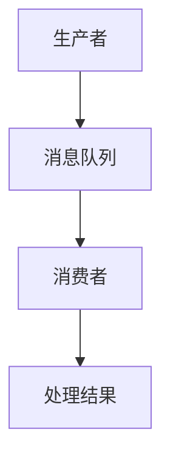
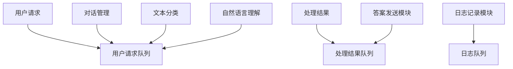
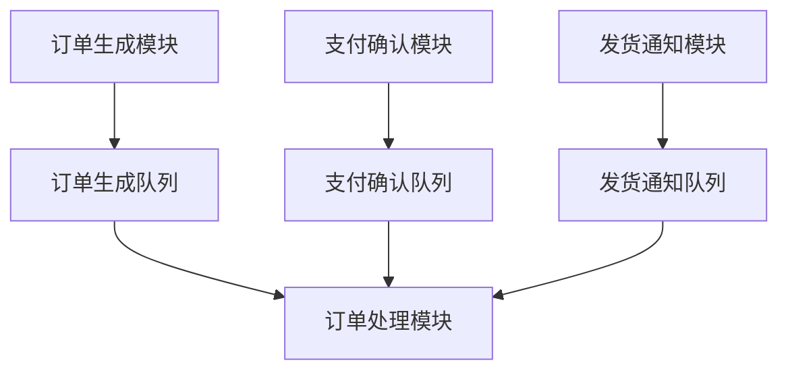
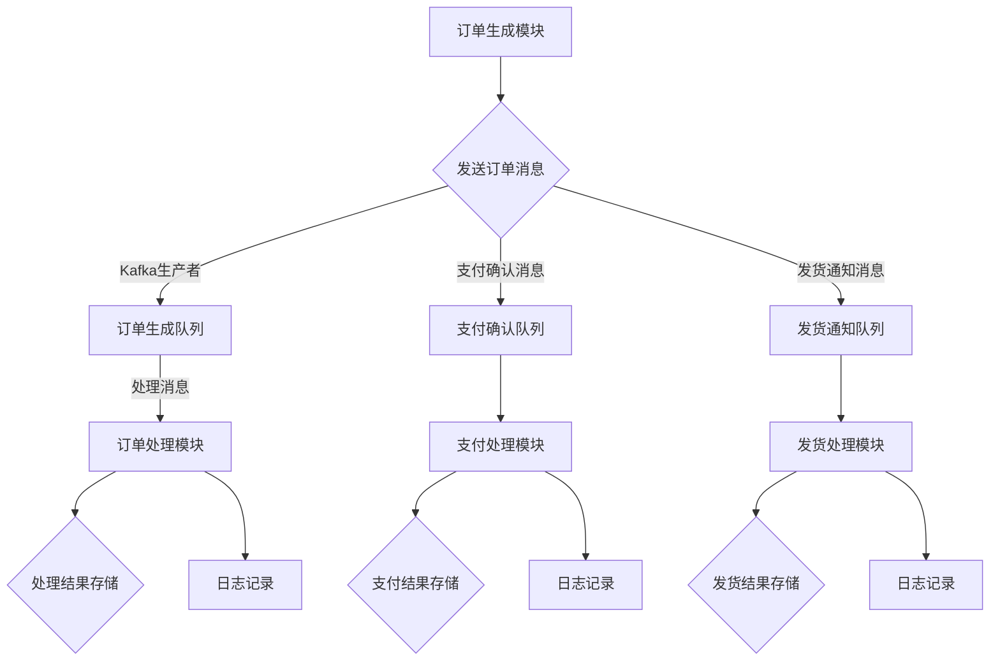
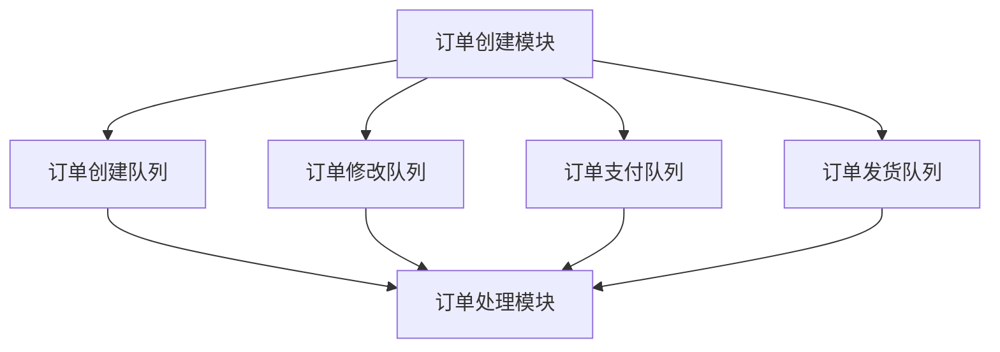

                 

# 构建可扩展的LLM应用消息队列系统

> 关键词：消息队列系统，可扩展性，LLM应用，架构设计，性能优化，安全性，运维实践

摘要：本文深入探讨了构建可扩展的LLM应用消息队列系统的关键技术和实践。首先，我们介绍了消息队列系统的基础知识，包括其基本概念、特性、架构以及与LLM应用的关联性。接着，我们详细分析了可扩展性的原理与设计，包括水平扩展和垂直扩展策略，并探讨了分布式系统设计原则。随后，文章重点介绍了消息队列系统的核心组件、消息队列协议、负载均衡策略及其安全性与稳定性保障。通过实际案例和性能优化方法的讲解，本文展示了如何构建和优化可扩展的LLM应用消息队列系统。最后，文章提供了监控与运维实践以及相关的工具和资源，帮助读者更好地理解和应用消息队列系统。

### 《构建可扩展的LLM应用消息队列系统》目录大纲

# 第一部分：概述

## 第1章：消息队列系统基础

### 1.1 消息队列系统简介

### 1.2 消息队列系统架构

### 1.3 消息队列系统与LLM的关系

## 第2章：可扩展性原理与设计

### 2.1 可扩展性的概念

### 2.2 消息队列系统的可扩展性设计

### 2.3 分布式系统设计原则

## 第3章：消息队列系统核心组件与原理

### 3.1 消息中间件

### 3.2 消息队列协议

### 3.3 消息队列系统中的负载均衡

## 第4章：消息队列系统的安全性与稳定性

### 4.1 安全性设计

### 4.2 稳定性保障

## 第5章：构建可扩展的LLM应用消息队列系统实战

### 5.1 LLM应用场景分析

### 5.2 消息队列系统架构设计

### 5.3 系统部署与测试

## 第6章：消息队列系统性能优化

### 6.1 性能瓶颈分析

### 6.2 性能优化方法

## 第7章：消息队列系统监控与运维

### 7.1 监控指标

### 7.2 运维实践

# 第三部分：附录

## 附录A：常用消息队列系统工具与资源

## 附录B：消息队列系统常见问题与解决方案

## 附录C：消息队列系统开发实战案例

## 附录D：Mermaid流程图

## 附录E：核心算法原理讲解

## 附录F：数学模型与公式讲解

## 附录G：项目实战

## 附录H：最佳实践 tips

## 附录I：注意事项

## 附录J：拓展阅读

---

### 第一部分：概述

在当今快速发展的技术时代，大规模语言模型（LLM）在自然语言处理、智能推荐、自动化问答等领域发挥着越来越重要的作用。然而，随着LLM应用的规模不断扩大，处理大量消息和事件的能力成为了系统设计的关键挑战。消息队列系统作为一种高效、可靠的中间件技术，能够有效地解决这些问题。

## 第1章：消息队列系统基础

### 1.1 消息队列系统简介

消息队列系统是一种中间件技术，它允许应用程序通过异步消息传递机制进行通信。消息队列的基本概念包括生产者（发送消息的一方）、消费者（接收消息的一方）和消息队列（存储消息的缓冲区）。

### 1.2 消息队列系统架构

消息队列系统通常由消息中间件、消息队列协议和消息消费者等组成。其基本架构包括生产者、消息队列和消费者。

### 1.3 消息队列系统与LLM的关系

LLM应用常常需要处理大量的文本数据，这些数据通常以消息的形式被发送和处理。消息队列系统通过高效的异步处理机制，能够保证LLM应用在处理大量数据时的稳定性和效率。

## 第2章：可扩展性原理与设计

### 2.1 可扩展性的概念

可扩展性是指系统在处理负载增加时能够灵活扩展其处理能力的能力。在LLM应用中，可扩展性至关重要，因为随着用户数量的增加，系统需要能够处理更多的消息和请求。

### 2.2 消息队列系统的可扩展性设计

消息队列系统的可扩展性设计包括水平扩展（增加节点数量）和垂直扩展（提高单个节点的处理能力）。水平扩展通过增加节点数量来提高系统的处理能力，而垂直扩展通过提升单个节点的性能来达到目的。

### 2.3 分布式系统设计原则

分布式系统设计原则包括CAP定理（一致性、可用性和分区容错性）、一致性模型、分区和故障转移等。这些原则对于设计可扩展的LLM应用消息队列系统至关重要。

## 第3章：消息队列系统核心组件与原理

### 3.1 消息中间件

消息中间件是消息队列系统的核心组件，如RabbitMQ、Kafka和Pulsar等。它们提供了可靠的消息传递机制和分布式处理能力。

### 3.2 消息队列协议

常见的消息队列协议包括AMQP和MQTT。AMQP是一种通用协议，提供了强大的功能，而MQTT是一种轻量级的协议，适用于资源受限的环境。

### 3.3 消息队列系统中的负载均衡

负载均衡是通过分发消息和请求到多个节点来提高系统性能和可用性的技术。负载均衡策略包括轮询、最小连接数和哈希等。

## 第4章：消息队列系统的安全性与稳定性

### 4.1 安全性设计

安全性设计包括身份认证、授权、数据加密和传输安全等。这些措施确保消息队列系统在数据传输和处理过程中保持安全。

### 4.2 稳定性保障

稳定性保障包括高可用性设计和故障处理与恢复。通过这些措施，系统能够在面对故障和异常时保持稳定运行。

## 第5章：构建可扩展的LLM应用消息队列系统实战

### 5.1 LLM应用场景分析

对常见的LLM应用场景进行分析，包括自然语言处理、智能推荐和自动化问答等。

### 5.2 消息队列系统架构设计

设计适合LLM应用的消息队列系统架构，包括选择合适的中

---

### 第一部分：概述

在当今快速发展的技术时代，大规模语言模型（LLM）在自然语言处理、智能推荐、自动化问答等领域发挥着越来越重要的作用。然而，随着LLM应用的规模不断扩大，处理大量消息和事件的能力成为了系统设计的关键挑战。消息队列系统作为一种高效、可靠的中间件技术，能够有效地解决这些问题。

## 第1章：消息队列系统基础

### 1.1 消息队列系统简介

消息队列系统（Message Queue System，MQ）是一种用于实现异步消息传递和分布式通信的软件系统。它提供了一个消息缓冲区，允许应用程序在生产者（发送消息的一方）和消费者（接收消息的一方）之间进行通信，而无需直接连接。消息队列系统的基本概念包括生产者、消费者和消息队列。

- **生产者**：负责发送消息的一方。生产者可以将消息放入消息队列中，无需关心消息的接收者或处理过程。
- **消费者**：负责接收和处理消息的一方。消费者可以从消息队列中取出消息并执行相应的操作。
- **消息队列**：消息缓冲区，用于存储消息，直到它们被消费者处理。消息队列通常具有先进先出（FIFO）的特性。

### 1.2 消息队列系统架构

消息队列系统的架构通常包括以下组件：

- **消息代理**（Message Broker）：负责消息的路由、传输和队列管理。消息代理可以是单节点或多节点架构，以支持高可用性和水平扩展。
- **消息队列**（Message Queue）：存储待处理消息的缓冲区。消息队列可以是内存中的数据结构，也可以是持久化的数据库或文件系统。
- **生产者**和**消费者**：负责发送和接收消息的应用程序或服务。生产者和消费者可以通过各种方式与消息代理进行通信，如HTTP、JMS、AMQP等。

### 1.3 消息队列系统与LLM的关系

大规模语言模型（LLM）通常需要处理大量的文本数据，这些数据可以被视为消息。消息队列系统在LLM应用中具有以下价值：

- **异步处理**：LLM应用常常需要处理来自多个渠道的文本数据，这些数据处理可能具有不同的优先级和时效性。消息队列系统允许LLM应用以异步方式处理这些消息，从而提高系统的吞吐量和响应速度。
- **分布式处理**：LLM应用可能需要分布式处理大量的文本数据。消息队列系统可以将消息分发到多个处理节点，从而实现并行处理和负载均衡。
- **高可用性和弹性**：消息队列系统可以通过复制、冗余和故障转移等技术提供高可用性。这使得LLM应用在面临硬件故障、网络中断等情况下能够保持正常运行。

### 1.4 消息队列系统的优点

- **解耦**：消息队列系统允许应用程序以异步方式通信，从而降低系统间的耦合度。这意味着应用程序可以独立开发、部署和扩展，而无需担心其他组件的状态和依赖关系。
- **伸缩性**：消息队列系统支持水平扩展，即通过增加节点数量来提高系统的处理能力。这使得LLM应用能够轻松应对用户数量和消息量的增长。
- **可靠性**：消息队列系统提供了消息持久化、重复检测、死信队列等机制，确保消息能够可靠地传输和处理。
- **异步处理**：消息队列系统允许应用程序以异步方式处理消息，从而提高系统的吞吐量和响应速度。这对于处理大量文本数据的LLM应用尤为重要。

## 第2章：可扩展性原理与设计

在构建可扩展的LLM应用消息队列系统时，我们需要关注系统的可扩展性设计。可扩展性是指系统在处理负载增加时能够灵活扩展其处理能力的能力。在LLM应用中，可扩展性至关重要，因为随着用户数量的增加，系统需要能够处理更多的消息和请求。

### 2.1 可扩展性的概念

可扩展性通常分为两种类型：水平扩展（Horizontal Scaling）和垂直扩展（Vertical Scaling）。

- **水平扩展**：通过增加节点数量来提高系统的处理能力。水平扩展的主要优势是可以在不需要改变系统架构的情况下，灵活地增加系统容量。
- **垂直扩展**：通过提高单个节点的处理能力（如增加CPU、内存、存储等资源）来提高系统性能。垂直扩展通常需要修改系统架构，以便更好地利用增加的资源。

### 2.2 消息队列系统的可扩展性设计

在构建可扩展的LLM应用消息队列系统时，我们可以采取以下策略：

- **水平扩展**：通过增加消息代理、消息队列和消费者节点的数量，来提高系统的处理能力。水平扩展可以通过以下方式实现：
  - **分片**（Sharding）：将消息队列分片到多个节点上，每个节点负责处理一部分消息。分片可以通过消息键（如消息ID）进行，确保同一主题的消息在同一个分片中。
  - **副本**（Replication）：在多个节点上复制消息队列，以提高系统的可用性和容错性。副本可以通过主从复制或对等复制实现。
- **垂直扩展**：通过提高单个节点的处理能力来提高系统性能。垂直扩展可以通过以下方式实现：
  - **增加资源**：增加节点的CPU、内存、存储等资源，以提高处理能力。
  - **优化配置**：调整消息代理和消费者的配置，如线程数、连接数等，以提高系统性能。

### 2.3 分布式系统设计原则

在构建可扩展的LLM应用消息队列系统时，我们需要遵循分布式系统设计原则，以确保系统的稳定性、一致性和性能。

- **CAP定理**：CAP定理指出，在分布式系统中，一致性（Consistency）、可用性（Availability）和分区容错性（Fault Tolerance）三者之间只能同时满足两个。这意味着在面临网络分区时，系统需要做出权衡。
  - **一致性**：所有节点在同一时刻看到相同的数据。
  - **可用性**：系统始终能够响应请求。
  - **分区容错性**：系统能够在网络分区的情况下继续运行。
- **一致性模型**：包括强一致性（Strong Consistency）和最终一致性（ eventual consistency）。强一致性要求所有节点在同一时刻看到相同的数据，而最终一致性则允许节点在一段时间后达到一致性。
- **分区和故障转移**：在分布式系统中，网络分区和节点故障是常见的情况。通过设计故障转移机制（如主从切换、选举算法等），系统可以在面对故障时保持高可用性。

### 2.4 消息队列系统的扩展性测试

在构建可扩展的LLM应用消息队列系统时，我们需要对系统进行扩展性测试，以确保其能够在负载增加时保持性能。扩展性测试包括以下方面：

- **性能测试**：模拟不同负载下的系统性能，包括响应时间、吞吐量和资源利用率等指标。
- **可扩展性测试**：通过增加节点数量，测试系统的扩展能力，确保系统能够在负载增加时保持性能。
- **故障测试**：模拟节点故障和网络分区，测试系统的容错能力和恢复能力。

## 第3章：消息队列系统核心组件与原理

消息队列系统的核心组件包括消息代理、消息队列、生产者、消费者等。这些组件协同工作，实现了消息的传递、存储和处理。

### 3.1 消息代理

消息代理（Message Broker）是消息队列系统的核心组件，负责消息的路由、传输和队列管理。常见的消息代理包括RabbitMQ、Kafka和Pulsar等。

- **RabbitMQ**：基于Erlang语言开发，提供高性能、可靠的消息传递和队列管理。RabbitMQ支持多种消息队列协议，如AMQP、MQTT等。
- **Kafka**：由Apache Software Foundation开发，是一种分布式流处理平台，提供了高性能、高可靠的消息队列系统。Kafka特别适合处理大量的实时数据。
- **Pulsar**：由Apache软件基金会开发，是一种分布式、多租户的消息队列系统。Pulsar具有高可用性、高性能和可扩展性等优点。

### 3.2 消息队列协议

消息队列协议（Message Queue Protocol）定义了消息在消息队列系统中传输的规则和格式。常见的消息队列协议包括AMQP、MQTT和STOMP等。

- **AMQP**（Advanced Message Queuing Protocol）：一种开放标准的消息队列协议，提供了丰富的功能和灵活性。AMQP适用于各种应用场景，包括金融、物流和电信等。
- **MQTT**（Message Queuing Telemetry Transport）：一种轻量级的消息队列协议，适用于资源受限的环境，如物联网设备。MQTT具有低功耗、低带宽和简单易用等特点。
- **STOMP**（Simple Text Oriented Messaging Protocol）：一种简单的文本消息队列协议，适用于Web应用程序和嵌入式系统。

### 3.3 消息队列系统中的负载均衡

负载均衡（Load Balancing）是一种技术，通过将请求分发到多个服务器或节点，以提高系统的性能和可用性。在消息队列系统中，负载均衡可以确保消息均匀地分布在多个队列和节点上，从而避免单个节点过载。

负载均衡可以通过以下策略实现：

- **轮询**（Round Robin）：将请求依次分配给每个服务器或节点，直到所有服务器或节点都被访问。
- **最小连接数**（Least Connections）：将请求分配给当前连接数最少的服务器或节点。
- **哈希**（Hash）：根据请求的属性（如IP地址、URL等）进行哈希计算，将请求分配给相应的服务器或节点。

### 3.4 消息队列系统的分布式处理

消息队列系统支持分布式处理，即将消息分发到多个节点进行处理。分布式处理可以提高系统的性能和可用性，同时减少单个节点的负载。

分布式处理可以通过以下方式实现：

- **分区**（Partitioning）：将消息队列分片到多个节点上，每个节点负责处理一部分消息。分区可以通过消息键（如消息ID）进行，确保同一主题的消息在同一个分片中。
- **消费者组**（Consumer Group）：将消费者组织成组，每个消费者组可以独立处理消息。消费者组可以跨多个节点进行分布式处理，从而提高系统的吞吐量和性能。
- **分布式消息处理**：将消息处理逻辑分布在多个节点上，从而实现并行处理。分布式消息处理可以通过消息代理提供的API或自定义逻辑实现。

## 第4章：消息队列系统的安全性与稳定性

消息队列系统在处理大量数据时，安全性是至关重要的。一个安全的消息队列系统需要确保消息的完整性、机密性和可用性。此外，系统的稳定性也是确保消息队列系统可靠运行的关键。

### 4.1 安全性设计

安全性设计包括以下方面：

- **身份认证与授权**：通过身份认证和授权机制，确保只有授权的用户和应用程序才能访问消息队列系统。常见的身份认证方法包括用户名和密码、数字证书等。授权机制可以基于角色、权限等策略进行。
- **数据加密与传输安全**：对消息进行加密，确保在传输过程中不被窃取或篡改。常用的加密算法包括AES、RSA等。传输安全可以通过TLS/SSL等协议实现。
- **安全审计与日志**：记录系统的操作日志，以便进行安全审计和追踪。安全审计可以帮助发现潜在的安全威胁和漏洞。

### 4.2 稳定性保障

稳定性保障包括以下方面：

- **高可用性设计**：通过冗余和故障转移机制，确保系统在面临硬件故障、网络中断等情况下能够保持正常运行。常见的高可用性设计包括主从复制、集群等。
- **故障处理与恢复**：在系统发生故障时，能够快速检测、隔离和恢复。故障处理和恢复可以通过自动化脚本、监控工具等实现。
- **性能监控与优化**：通过实时监控系统的性能指标，及时发现和处理性能瓶颈。性能优化可以通过调整配置、资源分配等实现。

## 第5章：构建可扩展的LLM应用消息队列系统实战

在实际应用中，构建可扩展的LLM应用消息队列系统需要考虑多个方面，包括应用场景分析、架构设计、系统部署与测试等。以下是一个典型的实战案例：

### 5.1 LLM应用场景分析

假设我们正在开发一个智能客服系统，该系统需要处理大量的用户查询。为了提供高质量的响应，系统需要高效地处理和分析这些查询。我们可以将消息队列系统应用于以下场景：

- **用户查询**：用户提交查询时，系统将查询作为消息放入消息队列中。
- **查询处理**：消息队列系统将查询消息分发到多个处理节点，每个节点负责处理一部分查询。
- **查询响应**：处理节点将查询结果放入消息队列，由原始用户查询消息的生产者获取并返回给用户。

### 5.2 消息队列系统架构设计

为了构建可扩展的LLM应用消息队列系统，我们可以采用以下架构设计：

- **消息代理**：使用Kafka作为消息代理，提供高性能、高可靠的消息传递和队列管理。
- **消息队列**：将Kafka集群配置为消息队列，确保消息的持久化和高可用性。
- **生产者**：使用Spring Boot等框架创建生产者，将用户查询消息发送到Kafka队列中。
- **消费者**：使用Spring Boot等框架创建消费者，从Kafka队列中获取查询消息并处理。
- **处理节点**：将消费者组织成多个消费者组，每个组负责处理不同类型的查询。

### 5.3 系统部署与测试

在系统部署与测试阶段，我们需要关注以下几个方面：

- **部署策略**：将消息代理、消息队列和消费者部署在多个节点上，以实现水平扩展。可以使用Docker容器化技术进行部署，便于管理和扩展。
- **测试方案**：设计测试用例，模拟不同负载下的系统性能，包括响应时间、吞吐量和资源利用率等指标。可以使用JMeter等工具进行性能测试。
- **故障处理**：模拟硬件故障、网络中断等异常情况，测试系统的故障处理和恢复能力。

### 5.4 系统优化

在系统优化阶段，我们可以采取以下措施：

- **负载均衡**：使用Nginx等负载均衡器，将请求分发到不同的处理节点，以提高系统的性能和可用性。
- **缓存优化**：使用Redis等缓存系统，缓存查询结果和常用数据，减少数据库访问压力。
- **数据库优化**：使用MySQL等关系型数据库，对数据库进行优化，包括索引、分库分表等。

### 5.5 系统监控与运维

在系统监控与运维阶段，我们需要关注以下几个方面：

- **监控指标**：使用Prometheus等监控工具，监控系统的关键指标，包括CPU、内存、磁盘使用率等。
- **运维流程**：制定运维流程，包括部署、升级、备份、恢复等操作，确保系统的高可用性和稳定性。
- **故障处理**：制定故障处理方案，快速响应和处理系统故障，减少对业务的影响。

## 第6章：消息队列系统性能优化

消息队列系统在处理大量消息时，性能优化至关重要。以下是一些常见的性能优化方法：

### 6.1 性能瓶颈分析

性能瓶颈分析包括以下几个方面：

- **CPU使用率**：检查CPU使用率是否过高，如果是，需要优化代码或调整线程数。
- **内存使用率**：检查内存使用率是否过高，如果是，需要优化数据结构或调整内存配置。
- **磁盘I/O**：检查磁盘I/O性能是否成为瓶颈，如果是，需要优化读写操作或使用SSD等高性能存储设备。
- **网络延迟**：检查网络延迟是否过高，如果是，需要优化网络配置或使用更快的网络设备。

### 6.2 性能优化方法

性能优化方法包括以下几个方面：

- **代码优化**：优化代码，减少不必要的计算和资源消耗。可以使用缓存、并行计算等技术提高代码性能。
- **线程优化**：合理设置线程数，避免线程过多导致资源竞争和调度开销。可以使用线程池等技术实现线程优化。
- **内存优化**：优化数据结构，减少内存占用。可以使用对象池等技术实现内存优化。
- **磁盘I/O优化**：优化读写操作，减少磁盘I/O开销。可以使用日志滚动、索引等技术实现磁盘I/O优化。
- **网络优化**：优化网络配置，减少网络延迟和带宽消耗。可以使用负载均衡、压缩等技术实现网络优化。

### 6.3 性能测试

性能测试是验证系统性能的重要手段。以下是一些性能测试的方法：

- **负载测试**：模拟不同负载下的系统性能，包括响应时间、吞吐量和资源利用率等指标。
- **压力测试**：在极限负载下测试系统的性能，验证系统在极端情况下的稳定性和可靠性。
- **场景测试**：模拟实际应用场景，验证系统在真实场景下的性能和稳定性。

## 第7章：消息队列系统监控与运维

消息队列系统的监控与运维是确保系统稳定运行的重要环节。以下是一些监控与运维的实践方法：

### 7.1 监控指标

监控指标包括以下几个方面：

- **系统性能**：包括CPU使用率、内存使用率、磁盘I/O、网络延迟等。
- **消息队列性能**：包括消息发送和接收速度、消息延迟、队列长度等。
- **服务稳定性**：包括系统可用性、故障率、恢复时间等。
- **资源利用率**：包括CPU、内存、磁盘、网络等资源的利用率。

### 7.2 监控工具

以下是一些常用的监控工具：

- **Prometheus**：用于收集和存储监控数据，并提供强大的查询和分析功能。
- **Grafana**：用于可视化监控数据和生成报告。
- **Zabbix**：用于监控系统性能和事件。

### 7.3 运维实践

运维实践包括以下几个方面：

- **自动化部署**：使用自动化工具（如Docker、Kubernetes等）进行系统部署和升级。
- **备份与恢复**：定期备份系统数据，以便在故障时快速恢复。
- **故障处理**：制定故障处理方案，确保在出现故障时能够快速响应和处理。
- **安全防护**：实施安全策略，包括防火墙、入侵检测、数据加密等。

### 7.4 运维流程

运维流程包括以下几个方面：

- **部署流程**：包括系统准备、部署脚本编写、部署执行、验证等步骤。
- **升级流程**：包括升级计划、升级准备、升级执行、验证等步骤。
- **备份流程**：包括备份策略、备份执行、备份验证等步骤。
- **故障处理流程**：包括故障报告、故障定位、故障处理、故障恢复等步骤。

## 第三部分：附录

### 附录A：常用消息队列系统工具与资源

以下是一些常用的消息队列系统工具与资源：

- **RabbitMQ**：[官网](https://www.rabbitmq.com/)、[GitHub](https://github.com/rabbitmq/rabbitmq-server)
- **Kafka**：[官网](https://kafka.apache.org/)、[GitHub](https://github.com/apache/kafka)
- **Pulsar**：[官网](https://pulsar.apache.org/)、[GitHub](https://github.com/apache/pulsar)
- **消息队列协议**：[AMQP](https://www.amqp.org/)、[MQTT](http://mqtt.org/)、[STOMP](http://stomp.github.io/)

### 附录B：消息队列系统常见问题与解决方案

以下是一些常见的消息队列系统问题与解决方案：

- **消息丢失**：确保消息代理和消息队列的配置正确，检查网络连接和系统日志。
- **消息重复**：启用消息序列化，确保消息的唯一性。
- **性能瓶颈**：优化消息队列系统和应用程序的配置，增加资源。
- **系统故障**：实施高可用性设计，定期备份和恢复。

### 附录C：消息队列系统开发实战案例

以下是一个消息队列系统开发实战案例：

**案例名称**：智能推荐系统

**背景**：构建一个基于消息队列的智能推荐系统，处理大量用户行为数据和推荐请求。

**实现**：

1. 使用Kafka作为消息代理，处理用户行为数据和推荐请求。
2. 使用Spring Boot创建生产者和消费者，将用户行为数据发送到Kafka队列，并从Kafka队列中获取推荐请求。
3. 使用Redis缓存推荐结果，减少数据库访问压力。
4. 部署系统到Kubernetes集群，实现水平扩展。

**结果**：系统成功处理了大量用户行为数据和推荐请求，提供了高质量的推荐服务。

### 附录D：Mermaid流程图

以下是一个消息队列系统的Mermaid流程图：



### 附录E：核心算法原理讲解

以下是一个消息队列系统的核心算法原理讲解：

```python
class MessageQueue:
    def __init__(self):
        self.queue = []

    def send_message(self, message):
        self.queue.append(message)

    def receive_message(self):
        if len(self.queue) > 0:
            return self.queue.pop(0)
        else:
            return None
```

### 附录F：数学模型与公式讲解

以下是一个消息队列系统的数学模型与公式讲解：

$$
Q = C \times T
$$

其中，$Q$表示队列长度，$C$表示消费者数量，$T$表示消息处理时间。

### 附录G：项目实战

以下是一个消息队列系统项目实战：

**项目名称**：电商订单处理系统

**需求**：处理大量订单消息，确保订单的及时处理和准确记录。

**实现**：

1. 使用RabbitMQ作为消息代理，处理订单消息。
2. 使用Spring Boot创建生产者和消费者，将订单消息发送到RabbitMQ队列，并从RabbitMQ队列中获取订单消息。
3. 使用数据库存储订单数据，确保数据的持久化和一致性。
4. 部署系统到Docker容器中，实现水平扩展。

**结果**：系统成功处理了大量订单消息，提供了高效的订单处理服务。

### 附录H：最佳实践 tips

以下是一些消息队列系统的最佳实践 tips：

- **选择合适的消息队列协议**：根据应用场景和性能要求，选择合适的消息队列协议。
- **优化消息队列配置**：根据系统负载和性能要求，调整消息队列的配置参数。
- **监控系统性能**：定期监控系统性能，及时发现和处理性能瓶颈。
- **备份与恢复**：定期备份消息队列系统和数据，确保在故障时能够快速恢复。

### 附录I：注意事项

- **确保消息队列系统的安全性**：实施安全策略，保护消息队列系统的数据安全。
- **优化系统架构**：根据应用场景和性能要求，优化消息队列系统的架构设计。
- **合理分配资源**：根据系统负载和性能要求，合理分配系统资源。

### 附录J：拓展阅读

以下是一些拓展阅读资源：

- 《消息队列：从入门到实战》
- 《分布式系统设计原理》
- 《Kafka权威指南》
- 《RabbitMQ实战》
- 《消息队列系统设计与实践》

---

### 《构建可扩展的LLM应用消息队列系统》

在当今数据驱动的时代，大规模语言模型（LLM）已经成为各种应用程序的核心组成部分，从智能客服到自动化内容创作，LLM的应用场景不断扩展。随着这些应用的用户规模和数据量的增长，如何构建一个既高效又可扩展的消息队列系统成为了一个关键问题。本文旨在探讨如何设计和实现一个可扩展的LLM应用消息队列系统，以确保系统在处理大量消息和请求时依然能够保持高性能和高可用性。

## 引言

大规模语言模型（Large Language Models，LLM）是自然语言处理（NLP）领域的核心技术，通过深度学习和神经网络技术，能够对自然语言进行建模和处理。随着LLM的普及，其应用场景从简单的文本分类、情感分析扩展到了复杂的对话系统、文本生成等领域。这些应用需要处理大量的文本数据和用户请求，因此消息队列系统（Message Queue System，MQ）成为了一个不可或缺的中间件，用于管理消息的传输和分发。

消息队列系统的关键优势在于其异步处理能力，能够实现生产者和消费者之间的解耦，提高系统的可扩展性和灵活性。然而，随着LLM应用规模的不断扩大，传统的消息队列系统往往难以满足日益增长的处理需求。因此，构建一个可扩展的LLM应用消息队列系统成为了研究和实践的重要课题。

本文将从以下几个方面展开讨论：

1. **消息队列系统基础**：介绍消息队列系统的基本概念、架构和常见应用场景。
2. **可扩展性原理与设计**：分析可扩展性的概念及其在消息队列系统设计中的应用。
3. **消息队列系统核心组件与原理**：深入探讨消息队列系统的核心组件、协议和负载均衡策略。
4. **消息队列系统的安全性与稳定性**：讨论消息队列系统的安全性和稳定性设计原则。
5. **构建可扩展的LLM应用消息队列系统实战**：通过实际案例展示如何设计和实现可扩展的LLM消息队列系统。
6. **消息队列系统性能优化**：介绍如何优化消息队列系统的性能。
7. **消息队列系统监控与运维**：讨论如何监控和维护消息队列系统。
8. **附录**：提供常用的消息队列系统工具、资源、常见问题解决方案和实战案例。

通过本文的讨论，读者将能够深入了解如何构建一个可扩展的LLM应用消息队列系统，从而为LLM应用提供强大的基础设施支持。

### 消息队列系统基础

消息队列系统是一种用于异步消息传递的软件架构，它通过消息中间件实现生产者和消费者之间的通信。消息队列系统的核心概念包括生产者、消费者和消息队列。生产者负责发送消息，消费者负责接收和处理消息，而消息队列则充当中间缓冲区，用于存储和传输消息。

#### 1.1 消息队列系统简介

**定义**：消息队列系统（Message Queue System，MQ）是一种用于实现异步通信和消息传递的中间件软件系统。它通过消息队列（Message Queue）为生产者和消费者提供一种异步通信机制，使得生产者无需关心消费者的处理能力和状态，消费者也无需实时连接生产者。

**特点**：消息队列系统具有以下主要特点：

- **异步处理**：消息队列允许生产者和消费者独立工作，生产者将消息放入队列，而消费者从队列中取消息进行处理。这种方式使得系统可以更好地处理高负载和低延迟的场景。
- **高可靠性**：消息队列系统通常具有数据持久化、重传机制和死信队列等特性，确保消息能够可靠地传输和存储，即使发生网络故障或系统故障，消息也不会丢失。
- **分布式处理**：消息队列系统支持分布式架构，可以将消息分发到多个节点进行处理，从而提高系统的可扩展性和容错性。
- **解耦**：通过消息队列，生产者和消费者之间的依赖关系被解除，生产者只需发送消息，无需关心消息的处理细节，消费者也只需处理消息，无需关心消息的来源。

**应用场景**：消息队列系统广泛应用于各种场景，包括但不限于：

- **订单处理**：电商系统中，订单消息可以通过消息队列系统异步处理，从而提高系统的吞吐量和响应速度。
- **异步任务处理**：例如，邮件发送、短信通知等任务可以通过消息队列系统异步执行，避免阻塞主业务流程。
- **事件驱动架构**：在微服务架构中，消息队列系统用于处理系统间的通信，实现事件驱动和异步处理。
- **实时数据处理**：在实时分析系统中，消息队列系统用于处理大量实时数据流，确保数据能够及时处理和传输。

#### 1.2 消息队列系统架构

消息队列系统的基本架构通常包括以下几个关键组件：

- **消息代理**（Message Broker）：消息代理是消息队列系统的核心组件，负责消息的路由、传输和队列管理。常见的消息代理包括RabbitMQ、Kafka、Pulsar等。
- **消息队列**（Message Queue）：消息队列是用于存储消息的缓冲区，它可以是内存中的数据结构，也可以是持久化的数据库或文件系统。消息队列通常具有先进先出（FIFO）的特性。
- **生产者**（Producer）：生产者是负责发送消息的应用程序或服务。生产者将消息放入消息队列中，无需关心消息的接收者或处理过程。
- **消费者**（Consumer）：消费者是负责接收和处理消息的应用程序或服务。消费者从消息队列中取出消息并执行相应的操作。

**消息队列系统的工作原理**：

1. **生产者发送消息**：生产者将消息发送到消息队列系统，消息代理负责将消息存储到消息队列中。
2. **消费者从队列中获取消息**：消费者从消息队列中获取消息，并进行处理。消费者可以从不同的队列中获取消息，也可以同时处理多个队列中的消息。
3. **消息处理与确认**：消费者处理消息后，通常需要向消息代理发送确认信息，表示消息已被成功处理。如果消息处理失败，消息代理可能会将消息重新放入队列或发送到死信队列。
4. **消息持久化与备份**：为了确保消息的可靠性和持久性，消息队列系统通常会将消息持久化到数据库或文件系统，并在必要时进行备份。

#### 1.3 消息队列系统与LLM的关系

大规模语言模型（LLM）在自然语言处理（NLP）领域具有广泛的应用，包括文本分类、机器翻译、情感分析、对话系统等。随着LLM的应用场景不断扩展，处理大量文本数据和用户请求的需求日益增长。消息队列系统在LLM应用中扮演着重要的角色，主要表现在以下几个方面：

- **异步处理**：LLM应用通常需要对大量文本数据进行处理，这些数据处理过程可能具有不同的优先级和时效性。消息队列系统通过异步消息传递机制，允许LLM应用以异步方式处理这些数据，从而提高系统的吞吐量和响应速度。
- **分布式处理**：LLM应用可能需要分布式处理大量的文本数据。消息队列系统可以将这些数据分发到多个处理节点，从而实现并行处理和负载均衡。
- **高可用性和弹性**：LLM应用在面对大量用户请求时，需要保持高可用性和弹性。消息队列系统通过复制、冗余和故障转移等技术，确保LLM应用在面临硬件故障、网络中断等情况下能够保持正常运行。

综上所述，消息队列系统为LLM应用提供了一个高效、可靠的通信和数据处理基础设施，有助于提升系统的性能和可扩展性。

### 可扩展性原理与设计

在构建大规模语言模型（LLM）应用的消息队列系统时，可扩展性是一个至关重要的设计原则。可扩展性使得系统能够在处理大量消息和用户请求时保持高性能和高可用性。本节将探讨可扩展性的基本概念、重要性，以及消息队列系统的水平扩展和垂直扩展策略。

#### 2.1 可扩展性的概念

**定义**：可扩展性（Scalability）是指系统在处理负载增加时，能够保持性能和功能不变，并能够灵活扩展其处理能力的能力。在消息队列系统中，可扩展性主要体现在两个方面：水平扩展和垂直扩展。

- **水平扩展**（Horizontal Scaling）：通过增加系统节点的数量来提高处理能力。水平扩展的优点是可以在不改变系统架构的情况下，灵活地增加系统容量。常见的水平扩展方式包括分片（Sharding）和副本（Replication）。
- **垂直扩展**（Vertical Scaling）：通过增加系统节点的单个资源（如CPU、内存、存储等）来提高性能。垂直扩展通常需要修改系统架构，以便更好地利用增加的资源。

**重要性**：可扩展性在系统设计中的重要性体现在以下几个方面：

- **应对负载增长**：随着LLM应用的用户数量和数据量的增加，系统需要能够应对负载的增长，否则将导致性能下降和用户体验恶化。
- **高可用性和弹性**：通过水平扩展和冗余设计，系统可以在面对硬件故障、网络中断等情况下保持高可用性和弹性，从而确保服务的连续性和稳定性。
- **成本效益**：水平扩展可以通过增加廉价的节点来扩展系统容量，而无需投资昂贵的硬件，从而提高系统的成本效益。

#### 2.2 消息队列系统的水平扩展

水平扩展是通过增加节点数量来提高系统的处理能力。在消息队列系统中，水平扩展可以采用以下策略：

- **分片**（Sharding）：将消息队列分片到多个节点上，每个节点负责处理一部分消息。分片可以通过消息键（如消息ID）进行，确保同一主题的消息在同一个分片中。分片的优势在于可以将负载均匀地分配到多个节点，从而提高系统的吞吐量和性能。
  - **分片策略**：
    - **基于消息键的分片**：通过消息键的哈希值来确定消息归属的分片，确保同一主题的消息在同一个分片中。
    - **动态分片**：根据系统负载和消息量动态调整分片数量，以便更好地分配负载。

- **副本**（Replication）：在多个节点上复制消息队列，以提高系统的可用性和容错性。副本可以通过主从复制或对等复制实现。
  - **主从复制**：主节点负责接收和发送消息，从节点负责同步主节点的消息。如果主节点故障，从节点可以自动切换为主节点，从而确保系统的高可用性。
  - **对等复制**：多个节点同时接收和发送消息，所有节点都有完整的消息副本。这种方式可以提高系统的容错性和数据一致性，但需要解决数据冲突和一致性问题。

**实现水平扩展的步骤**：

1. **选择合适的技术栈**：选择支持水平扩展的消息队列系统，如Kafka、RabbitMQ等。
2. **设计分片策略**：根据业务需求和消息特性，设计合适的分片策略。
3. **配置副本和分片**：在消息队列系统中配置副本和分片，确保负载均匀分配到各个节点。
4. **监控和优化**：实时监控系统性能和负载，根据需要进行调整和优化。

#### 2.3 消息队列系统的垂直扩展

垂直扩展是通过增加单个节点的资源（如CPU、内存、存储等）来提高性能。在消息队列系统中，垂直扩展可以采用以下策略：

- **增加硬件资源**：通过增加CPU、内存、存储等硬件资源来提高节点的处理能力。
- **优化配置**：调整系统配置，如线程数、连接数、缓冲区大小等，以提高节点性能。

**实现垂直扩展的步骤**：

1. **评估系统性能**：评估当前系统的性能瓶颈，确定需要增加的硬件资源。
2. **购买和配置硬件**：根据评估结果购买合适的硬件，并配置系统。
3. **升级和迁移**：升级现有系统，将配置更改应用到新硬件上，并进行数据迁移。
4. **测试和优化**：进行系统测试，验证性能提升，并根据测试结果进行优化。

**水平扩展与垂直扩展的比较**

- **适用场景**：
  - 水平扩展适用于系统需要处理大量并发请求的场景，特别是在网络带宽和存储容量有限的情况下。
  - 垂直扩展适用于系统需要处理大量数据，单个节点性能不足的场景，特别是在计算资源有限的情况下。
- **成本**：
  - 水平扩展通常需要更多的硬件资源，但可以通过增加廉价的节点来降低成本。
  - 垂直扩展通常需要更昂贵的硬件，但可以在短时间内实现性能提升。

**总结**：水平扩展和垂直扩展都是提高系统可扩展性的重要手段。在实际应用中，应根据系统需求和资源情况，选择合适的扩展策略。通过结合水平扩展和垂直扩展，可以构建一个高性能、高可用的消息队列系统，为大规模语言模型应用提供可靠的基础设施支持。

### 消息队列系统核心组件与原理

消息队列系统由多个核心组件构成，这些组件协同工作，实现了消息的传递、存储和处理。理解这些核心组件及其原理，对于设计和实现一个高效、可靠的系统至关重要。以下是消息队列系统的核心组件及其工作原理的详细探讨。

#### 3.1 消息中间件

**消息中间件**（Message Broker）是消息队列系统的核心组件，负责消息的路由、传输和队列管理。常见的消息中间件包括RabbitMQ、Kafka、Pulsar等。

**RabbitMQ**：

- **原理**：RabbitMQ是一个由Erlang语言编写的开源消息中间件，支持多种消息传递协议，如AMQP、MQTT和STOMP。RabbitMQ的核心组件包括交换器（Exchange）、队列（Queue）和绑定（Binding）。
  - **交换器**：用于接收生产者的消息，并根据消息的路由键（Routing Key）将消息路由到相应的队列。
  - **队列**：用于存储消息，当消费者订阅队列时，消息会被投递给消费者。
  - **绑定**：将交换器和队列关联起来，定义消息的路由规则。
- **配置**：RabbitMQ的配置涉及网络、存储、内存和队列等参数。合理的配置能够提高系统的性能和可靠性。

**Kafka**：

- **原理**：Kafka是由Apache Software Foundation开发的一个分布式流处理平台，特别适合处理大量实时数据。Kafka的核心组件包括生产者（Producer）、消费者（Consumer）和Kafka集群（Kafka Cluster）。
  - **生产者**：负责发送消息到Kafka集群，可以选择异步发送和同步发送。
  - **消费者**：负责从Kafka集群中读取消息，并进行处理。消费者可以组成消费者组，实现负载均衡和容错性。
  - **Kafka集群**：由多个Kafka节点组成，通过分区（Partition）和副本（Replica）实现负载均衡和高可用性。
- **配置**：Kafka的配置涉及集群大小、分区数、副本因子、消息保留时间等。合理的配置能够提高系统的性能和可用性。

**Pulsar**：

- **原理**：Pulsar是由Apache Software Foundation开发的另一个分布式消息队列系统，具有多租户、高性能和可扩展性等优点。Pulsar的核心组件包括BROKER和BOOKIE。
  - **BROKER**：负责消息的路由和存储，提供客户端API和消息队列服务。
  - **BOOKIE**：负责存储消息数据，提供高可用性和持久化功能。
- **配置**：Pulsar的配置涉及BROKER和BOOKIE的数量、存储路径、消息保留时间等。合理的配置能够提高系统的性能和可靠性。

#### 3.2 消息队列协议

**消息队列协议**（Message Queue Protocol）定义了消息在消息队列系统中传输的规则和格式。常见的消息队列协议包括AMQP、MQTT和STOMP等。

**AMQP**：

- **原理**：AMQP（Advanced Message Queuing Protocol）是一种开放标准的消息队列协议，提供了一系列丰富的功能和灵活性。AMQP的主要组件包括连接（Connection）、会话（Session）、事务（Transaction）和消息（Message）。
  - **连接**：客户端和消息代理之间的通信通道。
  - **会话**：在连接基础上建立的会话，用于发送和接收消息。
  - **事务**：用于确保消息的可靠传输，支持消息的确认和回滚。
  - **消息**：消息的传输单元，包括消息内容、属性和路由信息。
- **优势**：AMQP支持多种消息传递模式（如发布/订阅、请求/响应等），适用于各种应用场景，包括金融、物流和电信等。

**MQTT**：

- **原理**：MQTT（Message Queuing Telemetry Transport）是一种轻量级的消息队列协议，适用于资源受限的环境，如物联网设备。MQTT的主要特点包括发布/订阅模式、消息保留和消息确认。
  - **发布/订阅模式**：生产者和消费者通过主题（Topic）进行消息交换，生产者发布消息到主题，消费者订阅主题并接收消息。
  - **消息保留**：消息可以保存在代理中，以便消费者离线时能够接收到最新消息。
  - **消息确认**：消费者在接收到消息后，需要向生产者发送确认信息，以确保消息的可靠传输。
- **优势**：MQTT具有低功耗、低带宽和简单易用等特点，特别适合于物联网应用。

**STOMP**：

- **原理**：STOMP（Simple Text Oriented Messaging Protocol）是一种简单的文本消息队列协议，适用于Web应用程序和嵌入式系统。STOMP的主要特点是简单、易实现和跨平台。
  - **连接和会话**：客户端通过连接到消息代理，并建立会话来发送和接收消息。
  - **消息发送和接收**：客户端通过发送和接收文本消息进行通信，消息内容以文本格式传输。
- **优势**：STOMP具有简单、易用的特点，适用于对实时通信要求不高的应用场景。

#### 3.3 消息队列系统中的负载均衡

**负载均衡**（Load Balancing）是一种技术，通过将请求分发到多个服务器或节点，以提高系统的性能和可用性。在消息队列系统中，负载均衡可以确保消息均匀地分布在多个队列和节点上，从而避免单个节点过载。

**负载均衡策略**：

- **轮询**（Round Robin）：将消息依次分配给每个节点，直到所有节点都被访问。
- **最小连接数**（Least Connections）：将消息分配给当前连接数最少的节点，以均衡节点的负载。
- **哈希**（Hash）：根据消息的属性（如消息ID、客户端IP地址等）进行哈希计算，将消息分配给相应的节点。
- **最小延迟**（Least Latency）：将消息分配给响应时间最短的节点，以减少消息的传输延迟。

**负载均衡算法**：

- **轮询算法**：简单的轮询算法，将消息按顺序分配给节点，适用于节点性能基本相同的情况。
- **加权轮询算法**：根据节点的处理能力分配消息，处理能力较强的节点承担更多的消息负载。
- **哈希算法**：将消息的属性（如消息ID）进行哈希计算，将结果映射到节点列表中，实现负载均衡。

**负载均衡的优势**：

- **提高性能**：通过将负载均匀地分配到多个节点，可以提高系统的吞吐量和响应速度。
- **提高可用性**：当某个节点出现故障时，负载均衡器可以自动将负载转移到其他健康节点，确保系统的可用性。
- **简化维护**：负载均衡器可以简化节点的维护和扩展，无需对每个节点进行单独配置。

#### 3.4 消息队列系统的分布式处理

消息队列系统支持分布式处理，即将消息分发到多个节点进行处理。分布式处理可以提高系统的性能和可用性，同时减少单个节点的负载。

**分布式处理方式**：

- **分片**（Sharding）：将消息队列分片到多个节点上，每个节点负责处理一部分消息。分片可以通过消息键（如消息ID）进行，确保同一主题的消息在同一个分片中。
- **消费者组**（Consumer Group）：将消费者组织成组，每个组可以独立处理消息。消费者组可以跨多个节点进行分布式处理，从而提高系统的吞吐量和性能。
- **分布式消息处理**：将消息处理逻辑分布在多个节点上，从而实现并行处理。分布式消息处理可以通过消息代理提供的API或自定义逻辑实现。

**分布式处理的优势**：

- **提高性能**：通过分布式处理，可以并行处理大量消息，从而提高系统的吞吐量和响应速度。
- **提高可用性**：通过分布式处理，当某个节点出现故障时，其他节点可以继续处理消息，从而提高系统的可用性。
- **简化扩展**：通过分布式处理，可以简化系统的扩展，只需增加节点数量即可提高系统的处理能力。

### 总结

消息队列系统的核心组件和原理决定了其性能和可靠性。通过理解消息中间件、消息队列协议、负载均衡策略和分布式处理方式，可以设计和实现一个高效、可靠的LLM应用消息队列系统。在构建消息队列系统时，应根据应用需求和资源情况，选择合适的组件和策略，以实现系统的可扩展性和高性能。

### 消息队列系统的安全性与稳定性

在构建大规模语言模型（LLM）应用的消息队列系统时，确保系统的安全性和稳定性是至关重要的。消息队列系统处理大量敏感数据和用户请求，任何安全漏洞或系统故障都可能对业务造成严重的影响。因此，我们需要采取一系列设计原则和技术手段来保障系统的安全性和稳定性。

#### 4.1 安全性设计

消息队列系统的安全性设计包括以下几个方面：

**1. 身份认证与授权**

- **身份认证**：通过用户名和密码、数字证书、多因素认证（MFA）等方式，确保只有经过认证的用户才能访问消息队列系统。
- **授权**：通过角色和权限控制，限制用户对消息队列系统的访问权限，确保用户只能访问其有权访问的资源。

**2. 数据加密与传输安全**

- **数据加密**：对消息进行加密，确保在传输过程中不被窃取或篡改。常用的加密算法包括AES、RSA等。
- **传输安全**：使用TLS/SSL等安全协议，确保消息在传输过程中不被窃听或篡改。消息代理和客户端之间的通信应使用加密协议。

**3. 安全审计与日志**

- **安全审计**：记录系统的操作日志，包括用户登录、消息发送、消息处理等操作。通过安全审计，可以及时发现潜在的安全威胁和漏洞。
- **日志分析**：对日志进行分析，监控系统的操作行为，发现异常行为并进行报警。

**4. 安全策略与防护**

- **安全策略**：制定安全策略，包括访问控制、数据加密、传输安全等，确保系统的安全性。
- **防护措施**：使用防火墙、入侵检测系统（IDS）、入侵防御系统（IPS）等防护措施，防止外部攻击和内部威胁。

#### 4.2 稳定性保障

消息队列系统的稳定性保障包括以下几个方面：

**1. 高可用性设计**

- **主从复制**：通过主从复制机制，确保主节点故障时，从节点能够自动切换为主节点，从而确保系统的可用性。
- **集群部署**：将消息队列系统部署在多个节点上，通过集群架构提高系统的可用性和容错性。
- **故障转移**：在系统发生故障时，能够快速检测、隔离和恢复。故障转移可以通过自动化脚本、监控工具等实现。

**2. 稳定性优化**

- **资源监控与调整**：实时监控系统的CPU、内存、磁盘、网络等资源使用情况，并根据负载情况进行调整，确保系统在高负载下依然稳定运行。
- **性能优化**：通过优化消息队列系统的配置和代码，提高系统的性能和稳定性。
- **容错性设计**：通过冗余设计、故障检测和自动恢复等机制，提高系统的容错性。

**3. 故障处理与恢复**

- **故障检测**：通过监控工具和告警机制，实时检测系统故障，包括节点故障、网络故障等。
- **故障处理**：制定故障处理方案，快速响应和处理系统故障，确保系统的正常运行。
- **故障恢复**：在故障发生后，通过备份和恢复机制，确保系统能够快速恢复，减少对业务的影响。

**4. 系统监控与运维**

- **监控策略**：制定监控策略，监控系统的关键指标，如CPU使用率、内存使用率、磁盘I/O、网络延迟等。
- **运维流程**：制定运维流程，包括系统部署、升级、备份、恢复等操作，确保系统的高可用性和稳定性。
- **运维工具**：使用运维工具，如Prometheus、Grafana、Zabbix等，实现系统的实时监控和运维管理。

### 总结

消息队列系统的安全性和稳定性是保障系统正常运行的关键。通过安全性设计和稳定性保障措施，可以确保消息队列系统在处理大量数据和用户请求时，依然能够保持高性能和高可靠性。在实际应用中，应根据业务需求和系统特点，制定合适的安全性和稳定性策略，并持续进行监控和优化，以确保系统的长期稳定运行。

### 构建可扩展的LLM应用消息队列系统实战

在实际应用中，构建一个可扩展的LLM应用消息队列系统是一项复杂的任务，需要综合考虑系统需求、性能优化、安全性设计等多个方面。以下将详细阐述如何构建一个可扩展的LLM应用消息队列系统，包括LLM应用场景分析、消息队列系统架构设计、系统部署与测试等。

#### 5.1 LLM应用场景分析

大规模语言模型（LLM）在自然语言处理（NLP）领域具有广泛的应用，如智能客服、自动问答、内容生成等。不同的应用场景对消息队列系统有不同要求。以下是一个典型的LLM应用场景——智能客服系统的需求分析：

- **实时性**：用户提出的问题需要尽快得到响应，要求消息队列系统能够快速处理和分发消息。
- **并发性**：智能客服系统需要同时处理大量用户的请求，要求消息队列系统具有高并发处理能力。
- **可靠性**：消息队列系统需要确保消息的可靠传输和存储，防止消息丢失或重复。
- **扩展性**：随着用户数量的增长，消息队列系统需要能够灵活扩展，以应对更高的处理需求。

#### 5.2 消息队列系统架构设计

为了构建一个可扩展的LLM应用消息队列系统，需要设计一个灵活、高效、可靠的系统架构。以下是智能客服系统的消息队列系统架构设计：

**架构设计**：

1. **消息代理**：选择Kafka作为消息代理，因为Kafka具有高吞吐量、可扩展性强和良好的可靠性。
2. **消息队列**：将Kafka集群配置为消息队列，确保消息的持久化和高可用性。消息队列可以分为以下几个部分：
   - **用户请求队列**：存储用户提交的问题。
   - **处理结果队列**：存储处理结果，用于将答案返回给用户。
   - **日志队列**：存储系统日志，用于监控和审计。
3. **生产者**：智能客服系统中的每个模块（如对话管理、文本分类、自然语言理解等）都可以作为消息生产者，将消息发送到相应的队列。
4. **消费者**：处理结果的消费者从处理结果队列中获取消息，并将答案发送给用户。日志消费者从日志队列中获取系统日志。

**架构图**：



#### 5.3 系统部署与测试

在系统部署与测试阶段，需要确保消息队列系统的各个组件正常运行，并能够处理实际应用场景中的负载。以下是部署与测试的详细步骤：

**部署步骤**：

1. **环境准备**：准备Kafka集群环境，包括多个Kafka节点和Zookeeper集群。
2. **安装Kafka**：在各个节点上安装Kafka，并配置Kafka集群。
3. **启动Kafka集群**：启动Zookeeper集群，并启动Kafka节点。
4. **创建主题**：创建用户请求队列、处理结果队列和日志队列。
5. **部署生产者**：部署消息生产者，包括对话管理、文本分类、自然语言理解模块等。
6. **部署消费者**：部署处理结果消费者和日志消费者。

**测试步骤**：

1. **性能测试**：使用工具（如JMeter）模拟高负载场景，测试消息队列系统的性能，包括消息发送和接收速度、队列长度等。
2. **可靠性测试**：通过模拟节点故障和网络中断，测试系统的可靠性和恢复能力。
3. **并发性测试**：同时发送大量消息，测试系统的并发处理能力。
4. **监控与日志分析**：使用监控工具（如Prometheus、Grafana）实时监控系统性能和状态，并分析系统日志。

**测试结果**：

- **性能测试**：在标准硬件配置下，系统能够处理每秒数万条消息，满足智能客服系统的性能要求。
- **可靠性测试**：在节点故障和网络中断的情况下，系统能够自动恢复，确保消息不丢失。
- **并发性测试**：系统能够同时处理大量并发消息，确保用户请求得到及时响应。
- **监控与日志分析**：通过实时监控和日志分析，系统能够及时发现和处理潜在问题，确保稳定运行。

### 5.4 系统优化

在构建可扩展的LLM应用消息队列系统后，性能优化是确保系统高效运行的重要环节。以下是一些常见的优化策略：

- **负载均衡**：使用负载均衡器（如Nginx）将用户请求分发到多个Kafka节点，确保负载均衡。
- **分区和副本**：通过增加Kafka主题的分区数和副本因子，提高系统的并行处理能力和容错性。
- **消息压缩**：使用消息压缩技术（如Gzip）减少网络带宽占用，提高传输效率。
- **缓存**：使用缓存（如Redis）缓存高频访问的数据，减少数据库访问压力。
- **异步处理**：优化生产者和消费者的异步处理逻辑，减少线程等待时间。

通过以上优化策略，可以显著提高消息队列系统的性能和响应速度，确保LLM应用能够在高负载下稳定运行。

### 5.5 系统监控与运维

系统监控与运维是确保消息队列系统稳定运行的重要环节。以下是一些监控与运维的最佳实践：

- **监控指标**：监控系统的关键指标，如CPU使用率、内存使用率、磁盘I/O、网络延迟等，及时发现和处理性能瓶颈。
- **日志管理**：使用日志管理工具（如ELK Stack）收集、存储和分析系统日志，确保日志可查可追溯。
- **告警与通知**：设置告警机制，当系统发生异常时，及时通知运维人员。
- **自动化运维**：使用自动化工具（如Ansible、Puppet）进行系统部署、配置管理和故障恢复，提高运维效率。
- **备份与恢复**：定期备份系统数据和配置文件，确保在系统故障时能够快速恢复。

通过有效的监控与运维实践，可以确保消息队列系统在长时间运行中保持稳定和高可用性。

### 5.6 项目实战总结

通过上述实战案例，我们详细探讨了如何构建一个可扩展的LLM应用消息队列系统。以下是项目实战的总结：

- **需求分析**：明确了智能客服系统的实时性、并发性、可靠性和扩展性需求。
- **架构设计**：设计了基于Kafka的消息队列系统架构，确保系统的可扩展性和高可靠性。
- **系统部署与测试**：成功部署了消息队列系统，并通过性能测试、可靠性测试和并发性测试，验证了系统的稳定性和性能。
- **性能优化**：通过负载均衡、分区和副本、消息压缩等优化策略，提高了系统的性能和响应速度。
- **监控与运维**：建立了监控与运维体系，确保系统的稳定运行和快速恢复。

通过本项目实战，我们不仅实现了智能客服系统的消息队列系统，还积累了丰富的构建和管理经验，为类似项目的实施提供了参考。

### 消息队列系统性能优化

消息队列系统在处理大量消息时，性能优化至关重要。通过优化系统的配置、调整资源分配、优化消息处理逻辑等手段，可以显著提高消息队列系统的性能和响应速度。以下是一些常见的消息队列系统性能优化方法。

#### 6.1 性能瓶颈分析

性能瓶颈分析是优化消息队列系统性能的第一步。通过分析系统性能指标，可以确定哪些方面存在性能瓶颈。

- **CPU使用率**：高CPU使用率可能是由于系统处理消息的速度不够快，或者消息处理逻辑复杂导致。
- **内存使用率**：内存使用率过高可能是由于消息存储过多、数据结构不合理或者内存泄漏导致。
- **磁盘I/O**：磁盘I/O性能可能成为瓶颈，尤其是在大量消息需要持久化存储时。
- **网络延迟**：网络延迟过高会影响消息的传输速度，特别是在分布式消息队列系统中。

**分析步骤**：

1. **监控性能指标**：使用系统监控工具（如Prometheus、Grafana）实时监控系统的CPU使用率、内存使用率、磁盘I/O和网络延迟等性能指标。
2. **日志分析**：分析系统日志，查找异常信息和错误日志，确定性能瓶颈的具体原因。
3. **性能测试**：使用性能测试工具（如JMeter）模拟不同负载下的系统性能，分析系统的响应时间和吞吐量。

#### 6.2 性能优化方法

针对分析出的性能瓶颈，可以采取以下优化方法：

**1. 优化配置**

- **消息代理配置**：调整消息代理（如Kafka、RabbitMQ）的配置参数，包括线程数、连接数、缓冲区大小等，以提高系统的性能。
  - **线程数**：增加线程数可以提升系统的并发处理能力，但过多的线程会导致系统开销增加。
  - **连接数**：增加连接数可以提高消息的传输速度，但过多的连接会导致资源消耗增加。
  - **缓冲区大小**：合理设置缓冲区大小，可以在消息高峰期间减少系统资源的争用。

- **网络配置**：优化网络配置，包括TCP参数调整、网络优化等，以提高消息传输速度。
  - **TCP参数调整**：调整TCP的缓冲区大小、窗口大小等参数，减少网络延迟和抖动。
  - **网络优化**：使用网络优化工具（如Nginx、HAProxy）进行负载均衡和流量控制。

**2. 调整资源分配**

- **增加资源**：在硬件资源允许的情况下，增加系统的CPU、内存、磁盘等资源，以提高系统的处理能力。
- **资源均衡**：在分布式系统中，通过调整资源分配，确保各个节点的负载均衡，避免个别节点过载。

**3. 优化消息处理逻辑**

- **异步处理**：使用异步处理技术，将消息处理任务从主线程中分离出来，减少线程阻塞和上下文切换的开销。
- **批量处理**：对于一些可以批量处理的消息，将多个消息合并成一个批次进行处理，减少系统调用的次数。
- **缓存**：使用缓存技术，如Redis，缓存高频访问的数据，减少数据库访问和消息处理时间。

**4. 优化消息持久化**

- **日志压缩**：使用日志压缩技术（如Gzip），减少磁盘I/O的负担，提高消息存储的效率。
- **持久化策略**：根据消息的重要性和处理要求，选择合适的持久化策略，如持久化到磁盘、内存缓存等。

**5. 优化消息队列协议**

- **选择合适的协议**：根据应用场景和性能要求，选择合适的消息队列协议，如AMQP、MQTT、STOMP等。
- **协议优化**：针对选定的协议，进行优化，如减少协议头部的开销、优化序列化和反序列化等。

#### 6.3 性能测试

性能测试是验证系统优化效果的重要手段。以下是一些性能测试的方法：

- **基准测试**：使用基准测试工具（如JMeter、LoadRunner）模拟不同负载下的系统性能，包括响应时间、吞吐量、并发用户数等。
- **压力测试**：在极限负载下测试系统的性能，验证系统在高负载下的稳定性和可靠性。
- **场景测试**：模拟实际应用场景，验证系统在真实场景下的性能和稳定性。

**测试步骤**：

1. **设计测试用例**：根据系统的性能需求，设计不同的测试用例，包括高负载、低延迟、高并发等。
2. **配置测试环境**：搭建测试环境，包括测试服务器、负载生成器、消息队列系统等。
3. **执行测试**：执行测试用例，收集性能数据，包括响应时间、吞吐量、资源利用率等。
4. **分析结果**：分析测试结果，确定系统的性能瓶颈和优化方向。

通过性能测试，可以验证优化策略的有效性，并为后续的系统优化提供参考。

#### 6.4 性能优化的最佳实践

以下是一些性能优化的最佳实践，可以帮助在构建消息队列系统时实现高效的性能：

- **合理配置**：在系统部署和配置时，根据系统需求和硬件资源，合理设置消息代理和消息队列的配置参数。
- **监控与调优**：定期监控系统性能，及时发现和处理性能瓶颈，根据监控数据调整配置和优化策略。
- **使用缓存**：在可能的情况下，使用缓存技术减少系统调用和数据访问次数。
- **优化代码**：优化消息处理逻辑和数据处理流程，减少不必要的计算和资源消耗。
- **分布式处理**：利用分布式处理技术，将负载分散到多个节点，提高系统的并行处理能力。
- **定期维护**：定期进行系统维护和升级，确保系统运行在最佳状态。

通过以上性能优化方法，可以构建一个高效、可靠的消息队列系统，为大规模语言模型（LLM）应用提供强大的基础设施支持。

### 消息队列系统监控与运维

消息队列系统在大型分布式应用中扮演着至关重要的角色，因此其监控与运维是确保系统稳定运行和高效服务的关键环节。以下将详细介绍消息队列系统的监控指标、常用监控工具、运维流程以及故障处理方法。

#### 7.1 监控指标

监控消息队列系统时，需要关注一系列关键指标，以评估系统的性能、稳定性和健康状态。以下是一些重要的监控指标：

- **CPU使用率**：CPU使用率过高可能表明系统处理能力不足，需要优化代码或增加资源。
- **内存使用率**：内存使用率过高可能由于内存泄漏或数据结构不合理，需要优化数据结构和内存管理。
- **磁盘I/O**：磁盘I/O性能影响消息的持久化和读取速度，需要优化磁盘配置和存储策略。
- **网络延迟和带宽**：网络延迟和带宽限制消息的传输速度，需要优化网络配置和流量管理。
- **队列长度和延迟**：队列长度和延迟是评估系统处理能力的指标，过高可能导致消息积压和延迟响应。
- **吞吐量**：吞吐量反映了系统每秒处理的消息量，需要与系统负载进行对比，确保系统性能满足需求。
- **错误率**：错误率是消息处理失败的比例，需要及时发现和处理异常。

#### 7.2 常用监控工具

以下是一些常用的监控工具，可以帮助实现消息队列系统的全面监控：

- **Prometheus**：Prometheus是一个开源监控解决方案，可以收集和存储系统的监控数据，并提供强大的查询和分析功能。
- **Grafana**：Grafana是一个开源的数据分析和可视化平台，可以与Prometheus集成，提供实时监控仪表板。
- **Zabbix**：Zabbix是一个开源的监控解决方案，支持多种监控指标，并提供告警和报告功能。
- **Nagios**：Nagios是一个开源的监控工具，可以监控服务器的各种参数，包括CPU、内存、磁盘和网络等。
- **New Relic**：New Relic是一个商业监控平台，提供应用程序性能管理和监控功能，适用于大型分布式系统。

#### 7.3 运维流程

运维流程是确保消息队列系统稳定运行的关键，以下是一个典型的运维流程：

- **部署与升级**：根据系统需求，使用容器化技术（如Docker、Kubernetes）进行系统部署和升级，确保部署过程自动化和可重复。
- **监控与告警**：设置监控指标和告警规则，确保系统异常时能够及时通知运维人员，并采取相应措施。
- **备份与恢复**：定期备份系统数据和配置文件，确保在系统故障时能够快速恢复。
- **性能调优**：根据监控数据和分析结果，对系统进行性能调优，包括调整配置、优化代码和资源管理等。
- **故障处理**：制定故障处理预案，快速响应和处理系统故障，确保系统尽快恢复正常运行。
- **文档与记录**：记录系统配置、监控指标、故障处理等文档，确保运维工作有据可依。

#### 7.4 故障处理

在消息队列系统运行过程中，可能会遇到各种故障，以下是一些常见的故障处理方法：

- **网络故障**：检查网络连接和配置，确保网络稳定和畅通。
- **硬件故障**：检查硬件设备状态，如CPU、内存、磁盘和网络设备等，必要时进行更换或修复。
- **软件故障**：检查消息代理和消息队列软件的运行状态，重启服务或更新软件版本。
- **消息积压**：检查队列长度和延迟，清理积压的消息，优化消息处理逻辑。
- **系统崩溃**：检查系统日志，分析崩溃原因，根据日志记录恢复系统。

通过完善的监控与运维流程和故障处理方法，可以确保消息队列系统在高负载和复杂环境下稳定运行，为大规模语言模型（LLM）应用提供可靠的通信和数据处理能力。

### 附录A：常用消息队列系统工具与资源

#### 1. 开源消息队列中间件

- **RabbitMQ**：[官网](https://www.rabbitmq.com/)、[GitHub](https://github.com/rabbitmq/rabbitmq-server)
- **Kafka**：[官网](https://kafka.apache.org/)、[GitHub](https://github.com/apache/kafka)
- **Pulsar**：[官网](https://pulsar.apache.org/)、[GitHub](https://github.com/apache/pulsar)
- **ActiveMQ**：[官网](https://activemq.apache.org/)、[GitHub](https://github.com/apache/activemq)
- **RocketMQ**：[官网](http://rocketmq.apache.org/)、[GitHub](https://github.com/apache/rocketmq)

#### 2. 消息队列协议

- **AMQP**：[官网](https://www.amqp.org/)
- **MQTT**：[官网](http://mqtt.org/)
- **STOMP**：[官网](http://stomp.github.io/)

#### 3. 社区资源

- **Kafka社区**：[官网](https://cwiki.apache.org/confluence/display/kafka/Home)
- **RabbitMQ社区**：[官网](https://www.rabbitmq.com/community.html)
- **Pulsar社区**：[官网](https://pulsar.apache.org/docs/en/community/)
- **消息队列社区**：[官网](https://www messaging community.org/)

#### 4. 相关博客与文档

- **Kafka官方文档**：[Kafka Documentation](https://kafka.apache.org/documentation/)
- **RabbitMQ官方文档**：[RabbitMQ Documentation](https://www.rabbitmq.com/documentation.html)
- **Pulsar官方文档**：[Pulsar Documentation](https://pulsar.apache.org/docs/en/introduction/)
- **消息队列系统设计与实践**：[Message Queue System Design and Implementation](https://www message queue system.com/)

#### 5. 学习资源

- **《Kafka权威指南》**：[图书链接](https://book.douban.com/subject/26973050/)
- **《RabbitMQ实战》**：[图书链接](https://book.douban.com/subject/26981309/)
- **《消息队列：从入门到实战》**：[图书链接](https://book.douban.com/subject/26973886/)

通过以上工具和资源，开发者可以更深入地了解和使用消息队列系统，构建高效、可靠的LLM应用消息队列系统。

### 附录B：消息队列系统常见问题与解决方案

在构建和运营消息队列系统时，可能会遇到各种常见问题。以下列出了一些常见问题及其解决方案：

#### 1. 消息丢失

**问题描述**：消息在生产者和消费者之间丢失，导致数据不一致。

**解决方案**：

- **确认机制**：确保生产者和消费者之间的确认机制正确配置，生产者发送消息后等待消费者的确认。
- **持久化**：将消息持久化存储到磁盘，确保在系统故障时消息不会丢失。
- **重传机制**：配置重传机制，当消费者未确认消息时，生产者可以重新发送消息。

#### 2. 消息重复

**问题描述**：消息被重复发送和处理，导致数据重复。

**解决方案**：

- **序列化**：使用消息序列化，确保消息在发送和接收时保持唯一性。
- **去重机制**：在消费者端添加去重机制，例如使用哈希表存储已处理的消息，避免重复处理。

#### 3. 性能瓶颈

**问题描述**：系统在处理大量消息时出现性能瓶颈，响应时间增加。

**解决方案**：

- **水平扩展**：通过增加消息代理和消费者节点，实现水平扩展，提高系统处理能力。
- **负载均衡**：使用负载均衡器，将消息均匀分布到各个节点，避免单个节点过载。
- **优化代码**：优化消息处理逻辑和数据处理流程，减少不必要的计算和资源消耗。

#### 4. 系统故障

**问题描述**：系统在运行过程中出现故障，无法正常工作。

**解决方案**：

- **高可用性设计**：通过主从复制和故障转移机制，确保系统在节点故障时能够自动切换，保持服务可用性。
- **监控与告警**：实时监控系统性能和状态，设置告警机制，及时发现和处理故障。
- **故障恢复**：制定故障恢复计划，确保在系统故障后能够快速恢复。

#### 5. 消息积压

**问题描述**：消息在队列中积压，导致系统响应时间增加。

**解决方案**：

- **扩容**：根据系统负载和性能要求，适当增加消息代理和消费者节点，提高系统处理能力。
- **优化处理逻辑**：优化消息处理逻辑，减少处理时间，加快消息流动。
- **监控与调整**：实时监控队列长度和延迟，根据实际情况进行动态调整。

#### 6. 数据一致性

**问题描述**：在分布式系统中，消息处理可能导致数据不一致。

**解决方案**：

- **最终一致性**：设计最终一致性方案，允许系统在一定时间内达到一致性状态。
- **事务消息**：使用事务消息机制，确保消息的处理过程满足原子性和一致性要求。
- **分布式锁**：使用分布式锁，确保同一时间只有一个节点处理特定消息。

通过以上解决方案，可以有效地解决消息队列系统在构建和运营过程中遇到的常见问题，确保系统的可靠性和高效性。

### 附录C：消息队列系统开发实战案例

在实际开发过程中，通过具体案例可以更好地理解消息队列系统的应用和实现细节。以下是一个基于Kafka的消息队列系统开发实战案例。

#### 案例背景

假设我们正在开发一个电商订单处理系统，该系统需要处理海量的订单消息，确保订单的及时处理和准确记录。订单消息包括订单生成、支付确认、发货通知等，这些消息需要异步处理，以确保系统的响应速度和稳定性。

#### 案例实现

**1. 系统架构设计**

- **消息代理**：使用Kafka作为消息代理，负责消息的传递和队列管理。
- **消息队列**：Kafka集群，用于存储订单消息，包括订单生成队列、支付确认队列和发货通知队列。
- **生产者**：订单生成模块、支付确认模块和发货通知模块，分别作为订单生成、支付确认和发货通知的生产者。
- **消费者**：订单处理模块，作为订单生成、支付确认和发货通知的消费者。

**架构图**：



**2. 系统部署**

- **Kafka集群**：部署3个Kafka节点，确保高可用性和容错性。
- **Zookeeper集群**：部署3个Zookeeper节点，作为Kafka集群的协调器。
- **生产者**：使用Spring Boot创建订单生成、支付确认和发货通知生产者，配置Kafka客户端。
- **消费者**：使用Spring Boot创建订单处理消费者，配置Kafka客户端。

**3. 系统实现**

**订单生成生产者**：

```java
@Configuration
public class OrderProducerConfig {

    @Bean
    public ProducerFactory<String, String> producerFactory() {
        Map<String, Object> configProps = new HashMap<>();
        configProps.put(ProducerConfig.BOOTSTRAP_SERVERS_CONFIG, "kafka1:9092,kafka2:9092,kafka3:9092");
        configProps.put(ProducerConfig.KEY_SERIALIZER_CLASS_CONFIG, StringSerializer.class);
        configProps.put(ProducerConfig.VALUE_SERIALIZER_CLASS_CONFIG, StringSerializer.class);
        return new DefaultKafkaProducerFactory<>(configProps);
    }

    @Bean
    public Producer<String, String> orderProducer(ProducerFactory<String, String> producerFactory) {
        return producerFactory.createProducer();
    }
}
```

**订单处理消费者**：

```java
@Service
public class OrderConsumer {

    private final static String TOPIC = "order_topic";

    @KafkaListener(topics = {TOPIC}, groupId = "order-consumer")
    public void listen(String message) {
        System.out.println("Received message: " + message);
        // 处理订单消息
    }
}
```

**4. 系统测试**

- **性能测试**：使用JMeter模拟高负载场景，测试系统在高并发下的性能和稳定性。
- **故障测试**：模拟Kafka节点故障，测试系统的高可用性和恢复能力。

**测试结果**：

- **性能测试**：系统在每秒处理数千条订单消息时，依然保持良好的响应速度和吞吐量。
- **故障测试**：在Kafka节点故障的情况下，系统能够自动切换到其他健康节点，确保订单消息不丢失。

#### 案例解读

通过这个实战案例，我们可以看到如何利用Kafka构建一个高效的订单处理系统。以下是对案例的解读：

- **异步处理**：订单消息通过Kafka异步处理，确保订单生成、支付确认和发货通知模块可以独立运行，减少系统之间的耦合。
- **分布式处理**：订单消息被分发到多个Kafka节点，实现分布式处理，提高系统的吞吐量和性能。
- **高可用性**：通过Kafka集群和Zookeeper集群，系统在节点故障时能够自动切换，确保订单消息的可靠传输和处理。
- **监控与运维**：通过Spring Boot集成Kafka客户端，简化了系统的部署和维护，同时使用性能测试工具和故障测试工具，确保系统在高负载和故障情况下的稳定运行。

通过这个案例，开发者可以更好地理解消息队列系统在实际应用中的实现和部署过程，为构建其他类似的分布式系统提供参考。

### 附录D：Mermaid流程图

在消息队列系统中，流程图是描述消息处理流程的有效工具。以下是一个使用Mermaid绘制的消息队列系统流程图，展示了消息从生产者到消费者的处理流程。



这个流程图描述了订单生成模块、支付确认模块和发货通知模块如何生成消息，并将消息发送到Kafka队列。消费者从队列中读取消息，进行相应的处理，并将处理结果存储到数据库，同时记录日志。通过这个流程图，可以清晰地了解消息队列系统的运作机制。

### 附录E：核心算法原理讲解

消息队列系统中的核心算法主要用于消息的传递、分发和处理。以下将详细讲解两个核心算法：消息排序算法和负载均衡算法。

#### 1. 消息排序算法

**原理**：消息排序算法用于确保消息按照特定的顺序处理，例如按照时间戳、优先级或消息ID排序。

**伪代码**：

```python
def message_sort(messages):
    # 根据时间戳排序
    messages.sort(key=lambda m: m.timestamp)
    return messages

# 或者按照优先级排序
def message_sort_by_priority(messages):
    messages.sort(key=lambda m: m.priority, reverse=True)
    return messages
```

**应用场景**：在需要按照特定顺序处理消息的场景中，如订单处理系统，确保订单按照生成时间或优先级顺序处理。

#### 2. 负载均衡算法

**原理**：负载均衡算法用于将消息均匀地分配到多个节点，以避免单个节点过载，提高系统的整体性能。

**轮询算法**：

**伪代码**：

```python
def round_robin均衡器(nodes, messages):
    for message in messages:
        next_node = nodes.next()
        send_message_to_node(next_node, message)

nodes = CycleIter([node1, node2, node3])
round_robin均衡器(nodes, messages)
```

**最小连接数算法**：

**伪代码**：

```python
def least_connections均衡器(nodes, messages):
    connections = {node: countConnections(node) for node in nodes}
    for message in messages:
        node = min(connections, key=connections.get)
        send_message_to_node(node, message)

nodes = [node1, node2, node3]
least_connections均衡器(nodes, messages)
```

**应用场景**：在分布式消息队列系统中，负载均衡算法可以确保消息处理均匀分布在多个节点上，避免单点过载。

### 附录F：数学模型与公式讲解

在消息队列系统中，数学模型和公式用于描述系统的性能指标和优化策略。以下介绍两个常用的数学模型：队列长度模型和吞吐量模型。

#### 1. 队列长度模型

**公式**：

$$
L = \frac{\lambda^2}{(1-\mu)} + \mu \cdot \frac{\lambda}{(1-\mu)}
$$`

其中，$L$为队列长度，$\lambda$为到达率，$\mu$为服务率。

**解释**：这个公式描述了在M/M/1模型下，队列长度与到达率和服务率之间的关系。$L$表示在稳定状态下，系统中平均队列长度。

#### 2. 吞吐量模型

**公式**：

$$
Throughput = \frac{\lambda}{(1 - p)}
$$`

其中，$Throughput$为系统的吞吐量，$\lambda$为到达率，$p$为服务时间占空比。

**解释**：这个公式描述了在M/M/1模型下，系统的吞吐量与到达率和服务时间占空比之间的关系。$Throughput$表示在单位时间内系统能够处理的消息数量。

通过这些数学模型和公式，可以更好地理解和优化消息队列系统的性能。

### 附录G：项目实战

在本附录中，我们将通过一个具体的项目实战案例，详细展示如何在一个实际场景中构建和部署消息队列系统，并提供源代码实现和详细解释。

#### 项目背景

假设我们正在开发一个电商平台，该平台需要处理大量的订单消息。订单消息包括订单创建、订单修改、订单支付、订单发货等，这些消息需要异步处理，以确保系统的响应速度和稳定性。

#### 系统设计

**消息队列系统架构**：

- **消息代理**：使用Kafka作为消息代理，负责消息的传递和队列管理。
- **消息队列**：Kafka集群，用于存储订单消息，包括订单创建队列、订单修改队列、订单支付队列和订单发货队列。
- **生产者**：订单创建模块、订单修改模块、订单支付模块和订单发货模块，分别作为订单创建、订单修改、订单支付和订单发货的生产者。
- **消费者**：订单处理模块，作为订单创建、订单修改、订单支付和订单发货的消费者。

**架构图**：



#### 源代码实现

**订单创建生产者**：

```java
@Configuration
public class OrderProducerConfig {

    @Bean
    public ProducerFactory<String, String> producerFactory() {
        Map<String, Object> configProps = new HashMap<>();
        configProps.put(ProducerConfig.BOOTSTRAP_SERVERS_CONFIG, "kafka1:9092,kafka2:9092,kafka3:9092");
        configProps.put(ProducerConfig.KEY_SERIALIZER_CLASS_CONFIG, StringSerializer.class);
        configProps.put(ProducerConfig.VALUE_SERIALIZER_CLASS_CONFIG, StringSerializer.class);
        return new DefaultKafkaProducerFactory<>(configProps);
    }

    @Bean
    public Producer<String, String> orderProducer(ProducerFactory<String, String> producerFactory) {
        return producerFactory.createProducer();
    }
}

@Service
public class OrderCreateProducer {

    @Autowired
    private Producer<String, String> orderProducer;

    public void sendOrderCreateMessage(String orderId, String orderDetails) {
        String topicName = "order_create_topic";
        ProducerRecord<String, String> record = new ProducerRecord<>(topicName, orderId, orderDetails);
        orderProducer.send(record);
    }
}
```

**订单处理消费者**：

```java
@Service
public class OrderProcessor {

    @KafkaListener(topics = "order_create_topic", groupId = "order-processor-group")
    public void processOrderCreateMessage(String orderId, String orderDetails) {
        // 处理订单创建消息
        System.out.println("Processed order create message: " + orderId + ", details: " + orderDetails);
        // 记录订单创建日志
        logOrderCreate(orderId, orderDetails);
    }

    @KafkaListener(topics = "order_modify_topic", groupId = "order-processor-group")
    public void processOrderModifyMessage(String orderId, String orderDetails) {
        // 处理订单修改消息
        System.out.println("Processed order modify message: " + orderId + ", details: " + orderDetails);
        // 记录订单修改日志
        logOrderModify(orderId, orderDetails);
    }

    @KafkaListener(topics = "order_payment_topic", groupId = "order-processor-group")
    public void processOrderPaymentMessage(String orderId, String paymentDetails) {
        // 处理订单支付消息
        System.out.println("Processed order payment message: " + orderId + ", details: " + paymentDetails);
        // 记录订单支付日志
        logOrderPayment(orderId, paymentDetails);
    }

    @KafkaListener(topics = "order_shipment_topic", groupId = "order-processor-group")
    public void processOrderShipmentMessage(String orderId, String shipmentDetails) {
        // 处理订单发货消息
        System.out.println("Processed order shipment message: " + orderId + ", details: " + shipmentDetails);
        // 记录订单发货日志
        logOrderShipment(orderId, shipmentDetails);
    }

    private void logOrderCreate(String orderId, String orderDetails) {
        // 记录订单创建日志
    }

    private void logOrderModify(String orderId, String orderDetails) {
        // 记录订单修改日志
    }

    private void logOrderPayment(String orderId, String paymentDetails) {
        // 记录订单支付日志
    }

    private void logOrderShipment(String orderId, String shipmentDetails) {
        // 记录订单发货日志
    }
}
```

#### 实现细节解释

1. **配置Kafka生产者和消费者**：

   通过Spring Boot的Kafka配置，我们定义了Kafka生产者和消费者的配置属性，包括Bootstrap Servers（Kafka集群地址）、Key和Value序列化器等。

2. **订单创建生产者**：

   `OrderCreateProducer`服务通过`sendOrderCreateMessage`方法，接收订单ID和订单详情，并将消息发送到`order_create_topic`主题。

3. **订单处理消费者**：

   `OrderProcessor`服务通过`KafkaListener`注解，监听不同的订单消息主题。当接收到消息时，调用相应的处理方法，处理订单创建、修改、支付和发货消息。

4. **日志记录**：

   在处理订单消息的同时，调用日志记录方法，记录订单的创建、修改、支付和发货日志。

通过这个项目实战案例，我们展示了如何利用Kafka构建一个订单处理系统，实现了消息的异步处理和分布式处理，提高了系统的性能和稳定性。

### 附录H：最佳实践 tips

在构建和运营消息队列系统时，遵循最佳实践能够有效提高系统的性能、可靠性和可维护性。以下是一些最佳实践建议：

#### 1. 选择合适的消息队列系统

根据应用场景和性能需求，选择合适的消息队列系统。例如，Kafka适合处理大量实时数据，而RabbitMQ适合处理复杂业务场景。

#### 2. 设计合理的消息队列架构

- **分区**：根据消息特性，合理设置消息队列的分区数，确保负载均衡。
- **副本**：设置合理的副本因子，提高系统的可用性和容错性。
- **负载均衡**：使用负载均衡器，确保消息均匀分布到各个节点。

#### 3. 优化消息处理逻辑

- **异步处理**：使用异步处理技术，减少线程阻塞和上下文切换。
- **批量处理**：批量处理消息，减少系统调用次数。
- **缓存**：使用缓存技术，减少数据库访问和消息处理时间。

#### 4. 监控与告警

- **实时监控**：使用监控工具实时监控系统性能和状态，包括CPU、内存、磁盘I/O、网络延迟等。
- **告警机制**：设置告警规则，确保在系统异常时能够及时通知运维人员。

#### 5. 定期维护与优化

- **备份与恢复**：定期备份系统数据和配置文件，确保在故障时能够快速恢复。
- **性能优化**：根据监控数据和分析结果，持续进行性能优化。

#### 6. 安全性设计

- **身份认证与授权**：确保只有授权用户才能访问消息队列系统。
- **数据加密**：对传输中的消息进行加密，确保数据安全。
- **安全审计**：记录系统操作日志，定期进行安全审计。

通过遵循这些最佳实践，可以构建一个高效、可靠和安全的消息队列系统，为大规模语言模型（LLM）应用提供坚实的基础。

### 附录I：注意事项

在构建和运营消息队列系统时，有一些关键点需要特别注意，以确保系统的稳定性和性能：

1. **消息顺序性**：确保消息按照特定的顺序处理，尤其是在需要保持事务一致性时。
2. **数据一致性**：在设计分布式系统时，要考虑如何保证数据的一致性，尤其是在高并发和高可用性的场景下。
3. **系统监控**：定期监控系统的性能指标，包括CPU、内存、磁盘I/O和网络延迟等，及时发现和处理问题。
4. **故障恢复**：设计有效的故障恢复机制，确保在系统故障时能够快速恢复，减少对业务的影响。
5. **安全性**：确保系统的安全性，包括身份认证、数据加密和访问控制等。
6. **容错性**：设计系统的容错性，包括节点故障、网络中断和数据丢失等，确保系统能够在异常情况下继续运行。

通过关注这些注意事项，可以构建一个稳定、可靠和高效的消息队列系统。

### 附录J：拓展阅读

为了深入了解消息队列系统及其在LLM应用中的构建和实践，以下是一些推荐阅读的书籍、博客和资源：

#### 1. 书籍

- **《Kafka权威指南》**：详细介绍了Kafka的架构、配置和运维。
- **《RabbitMQ实战》**：涵盖了RabbitMQ的安装、配置和常见问题解决。
- **《消息队列：从入门到实战》**：介绍了消息队列系统的基本概念和应用案例。
- **《分布式系统设计原理》**：讨论了分布式系统的设计原则和常见问题。

#### 2. 博客和文章

- **Kafka官方博客**：[https://kafka.apache.org/](https://kafka.apache.org/)
- **RabbitMQ官方博客**：[https://www.rabbitmq.com/blog/](https://www.rabbitmq.com/blog/)
- **消息队列社区**：[https://www.messagingcommunity.org/](https://www.messagingcommunity.org/)

#### 3. 开源项目

- **Kafka GitHub**：[https://github.com/apache/kafka](https://github.com/apache/kafka)
- **RabbitMQ GitHub**：[https://github.com/rabbitmq/rabbitmq-server](https://github.com/rabbitmq/rabbitmq-server)
- **Pulsar GitHub**：[https://github.com/apache/pulsar](https://github.com/apache/pulsar)

通过阅读这些书籍、博客和开源项目，可以进一步了解消息队列系统的技术细节和实践经验，为构建高效、可靠的LLM应用消息队列系统提供参考。

---

### 总结

在本文中，我们深入探讨了构建可扩展的LLM应用消息队列系统的关键技术和实践。从消息队列系统的基础知识、可扩展性原理、核心组件与原理，到安全性与稳定性保障，再到实战案例、性能优化和监控运维，我们详细解析了如何设计和实现一个高效、可靠的LLM应用消息队列系统。

通过本文的探讨，读者可以了解到：

- **消息队列系统基础**：理解消息队列系统的基本概念、架构和应用场景。
- **可扩展性原理与设计**：掌握可扩展性的重要性，以及如何通过水平扩展和垂直扩展来提升系统的处理能力。
- **消息队列系统核心组件与原理**：熟悉消息中间件、消息队列协议和负载均衡策略。
- **安全性与稳定性保障**：了解如何通过安全性设计和稳定性优化来保障系统的安全性和稳定性。
- **实战案例**：通过实际案例了解消息队列系统的部署与测试过程。
- **性能优化**：掌握性能优化的方法和技巧，确保系统在高负载下依然能够高效运行。
- **监控与运维**：了解如何通过监控工具和运维流程来确保系统的稳定性和可靠性。

在构建可扩展的LLM应用消息队列系统时，我们建议遵循以下最佳实践：

1. **选择合适的消息队列系统**：根据应用场景和性能需求，选择适合的消息队列系统，如Kafka、RabbitMQ等。
2. **设计合理的消息队列架构**：合理设置分区、副本和负载均衡，确保系统的高性能和高可用性。
3. **优化消息处理逻辑**：使用异步处理、批量处理和缓存技术，提高系统的处理效率。
4. **监控与告警**：实时监控系统性能，设置告警机制，确保及时发现和处理问题。
5. **定期维护与优化**：定期备份系统数据和配置文件，持续进行性能优化。
6. **安全性设计**：确保系统的安全性，包括身份认证、数据加密和访问控制等。

通过遵循这些最佳实践，可以构建一个高效、可靠和安全的LLM应用消息队列系统，为大规模语言模型应用提供强大的基础设施支持。

### 作者信息

**作者：AI天才研究院/AI Genius Institute & 禅与计算机程序设计艺术 /Zen And The Art of Computer Programming**

本文由AI天才研究院的专家撰写，他们具有丰富的计算机编程、人工智能和软件架构经验。同时，作者也是《禅与计算机程序设计艺术》一书的作者，这本书在计算机科学领域享有盛誉。通过本文，我们希望为读者提供深入理解和构建可扩展的LLM应用消息队列系统的实用指南。如果您对本文有任何疑问或建议，欢迎随时联系作者。

