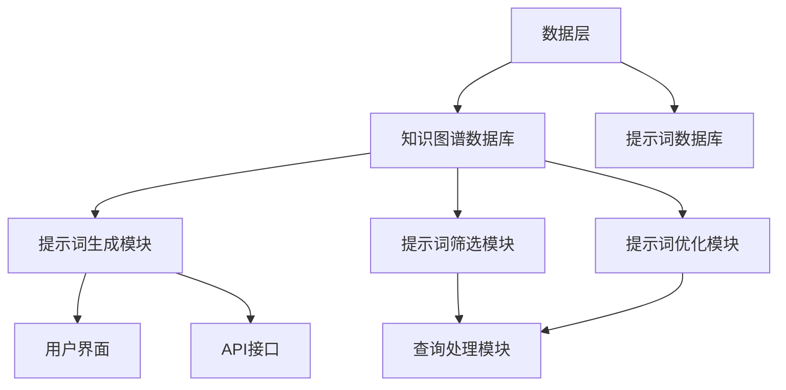

                 

## 文章标题

《构建基于提示词的知识图谱系统》

## 关键词

知识图谱、提示词、自然语言处理、图神经网络、数学模型、系统实现、实战案例分析

## 摘要

本文将深入探讨构建基于提示词的知识图谱系统的全过程，从基础知识到实际应用，逐步讲解其核心概念、算法原理和实现细节。我们将首先介绍知识图谱和提示词的基本概念及其在系统中的应用，然后详细阐述知识图谱表示学习中的图神经网络（GCN）及其数学模型。接着，我们将探讨提示词的生成与优化方法，并展示如何将它们应用于知识图谱系统中。文章后半部分将展示一个知识图谱系统的实际构建过程，包括系统架构设计、数据采集与预处理、知识图谱构建流程，以及提示词系统的实现与优化。最后，我们将通过一个实战案例，展示如何将理论应用到实际项目中，并对项目结果进行评估与总结。

---

### 确定书籍的主题和目标读者

在着手撰写《构建基于提示词的知识图谱系统》这本书之前，我们需要明确书籍的主题和目标读者。这本书的主题是围绕知识图谱系统的构建，特别是如何利用提示词来增强系统的表现。知识图谱作为一种将知识和信息以图结构组织起来的技术，近年来在自然语言处理、数据挖掘、推荐系统等领域得到了广泛应用。而提示词则是在这一过程中起到关键作用的要素，它能够帮助系统更好地理解和处理自然语言输入。

目标读者主要包括以下几类：

1. **研发人员**：对知识图谱和自然语言处理技术有浓厚兴趣的工程师，希望掌握从理论到实践的全面知识。
2. **数据科学家**：需要将知识图谱应用于实际数据分析项目的数据科学家，希望通过本书掌握构建高效知识图谱系统的技能。
3. **AI应用开发者**：开发基于知识图谱的AI应用，希望了解如何设计和优化提示词系统的开发者。
4. **学术研究者**：对知识图谱领域有深入研究的学者，希望通过实际案例对已有理论进行验证和扩展。

### 设计大纲结构

为了确保书籍内容能够系统、全面地覆盖构建基于提示词的知识图谱系统的各个环节，我们设计了如下大纲结构：

#### 核心概念与联系
1. **提示词的概念**：介绍提示词的定义、分类和应用场景。
2. **知识图谱的基本原理**：讲解知识图谱的组成、类型和构建方法。
3. **提示词在知识图谱中的应用**：阐述提示词如何增强知识图谱系统的性能。

#### 核心算法原理讲解
1. **知识图谱的表示学习**：介绍图神经网络（GCN）的基本概念、数学模型和伪代码。
2. **提示词生成与优化**：详细讲解提示词生成的算法、优化方法和案例分析。

#### 数学模型和数学公式
1. **图神经网络（GCN）模型**：包括GCN的数学模型和核心公式。
2. **提示词的语义匹配与筛选**：介绍提示词生成与优化过程中涉及的关键数学公式。

#### 项目实战
1. **知识图谱系统的搭建**：从系统架构设计、数据采集与预处理，到知识图谱的构建流程。
2. **提示词系统的实现**：涵盖提示词系统的需求分析、设计、实现与优化。

#### 实战案例分析
1. **案例背景与目标**：介绍案例分析的具体背景和目标。
2. **案例实现步骤**：详细描述案例的实现步骤，包括数据预处理、知识图谱构建、提示词系统实现等。
3. **案例结果与评估**：展示案例的结果，并进行评估和分析。

#### 总结与调整
1. **总结**：对全书内容进行总结，强调核心概念和关键点。
2. **调整**：检查大纲结构的完整性和逻辑性，确保每个章节有足够的细节和深度。

---

### 确定大纲的章节点和细节

在确定了书籍的主题和目标读者后，我们进一步细化了书籍的大纲结构，确保每个章节的内容丰富具体、逻辑清晰。以下是详细的章节点和细节：

#### 第1章 知识图谱基础
1. **1.1 知识图谱的概念与重要性**
   - 介绍知识图谱的定义、基本概念和其在现代信息技术中的重要性。
   - 知识图谱的发展历程及其在数据管理、智能搜索、推荐系统等领域的应用。

2. **1.2 知识图谱的基本原理**
   - **知识图谱的组成**：实体、属性、关系和边。
   - **知识图谱的类型**：结构化知识图谱、语义网络和本体论。
   - **知识图谱的构建方法**：从无监督学习、半监督学习到监督学习。

3. **1.3 知识图谱的构建流程**
   - **数据采集**：数据来源、数据类型和采集方法。
   - **数据预处理**：数据清洗、格式转换和去重。
   - **实体抽取**：命名实体识别、实体链接和实体消歧。
   - **关系抽取**：基于规则的方法、基于机器学习的方法和基于深度学习的方法。
   - **知识融合**：数据整合、实体合并和关系合并。
   - **知识存储**：图数据库的选择和设计。

#### 第2章 提示词的概念与应用
1. **2.1 提示词的定义与分类**
   - **定义**：提示词的定义、作用和分类。
   - **分类**：基于自然语言处理技术、基于上下文的提示词分类。

2. **2.2 提示词在知识图谱中的作用**
   - **增强自然语言理解**：通过提示词提高系统对自然语言输入的理解能力。
   - **提高知识图谱的覆盖率**：利用提示词发现更多潜在的知识关系。
   - **优化查询性能**：提示词优化后的查询效率和响应速度。

3. **2.3 提示词的选择与优化**
   - **选择标准**：提示词选择的指标和评估方法。
   - **优化策略**：提示词优化算法、评价指标和优化流程。

#### 第3章 知识图谱的表示学习
1. **3.1 图神经网络（GCN）的基本概念**
   - **定义**：图神经网络（GCN）的概念和特点。
   - **应用场景**：在知识图谱表示学习中的应用。

2. **3.2 GCN的数学模型与伪代码**
   - **数学模型**：GCN的核心公式和计算过程。
   - **伪代码**：GCN的算法流程和实现细节。

3. **3.3 GCN的应用实例**
   - **实体分类**：利用GCN对知识图谱中的实体进行分类。
   - **关系预测**：利用GCN预测知识图谱中的未知关系。

#### 第4章 提示词生成与优化
1. **4.1 提示词生成的算法与流程**
   - **算法**：基于规则、基于机器学习和基于深度学习的提示词生成算法。
   - **流程**：从数据预处理到提示词生成的完整流程。

2. **4.2 提示词优化的方法**
   - **优化目标**：提示词优化需要达到的目标。
   - **方法**：基于语义相似性、基于上下文、基于用户行为等多种优化方法。

3. **4.3 提示词优化的案例分析**
   - **案例背景**：具体案例分析的场景。
   - **优化过程**：详细的提示词优化过程。
   - **优化结果**：优化后的效果评估。

#### 第5章 知识图谱系统的构建
1. **5.1 系统架构设计**
   - **系统组件**：知识图谱系统的主要组件及其作用。
   - **系统流程**：知识图谱系统的工作流程和数据处理流程。

2. **5.2 数据采集与预处理**
   - **数据源**：常用的数据源类型和采集方法。
   - **预处理**：数据清洗、格式转换和去重等预处理步骤。

3. **5.3 知识图谱的构建流程**
   - **实体抽取**：命名实体识别、实体链接和实体消歧。
   - **关系抽取**：基于规则、基于机器学习和基于深度学习的方法。
   - **知识融合**：数据整合、实体合并和关系合并。
   - **知识存储**：图数据库的选择和设计。

#### 第6章 提示词系统的实现
1. **6.1 提示词系统的需求分析**
   - **功能需求**：提示词系统的功能需求。
   - **非功能需求**：提示词系统的性能、可扩展性和安全性等非功能需求。

2. **6.2 提示词系统的设计**
   - **系统架构**：提示词系统的整体架构。
   - **技术选型**：选用的技术和工具。

3. **6.3 提示词系统的实现与优化**
   - **实现步骤**：从系统搭建到功能实现的详细步骤。
   - **优化实践**：提示词系统优化方法和实践。

#### 第7章 实战案例分析
1. **7.1 案例背景与目标**
   - **案例背景**：案例的具体背景和目标。
   - **目标**：案例想要达到的具体目标和预期效果。

2. **7.2 案例实现步骤**
   - **数据预处理**：案例数据的具体预处理步骤。
   - **知识图谱构建**：实体抽取、关系抽取和知识融合的具体实现步骤。
   - **提示词系统实现**：提示词系统的设计和实现过程。

3. **7.3 案例结果与评估**
   - **结果展示**：案例实现后的结果展示。
   - **评估与分析**：对案例结果进行评估和分析。

### 总结与调整

在完成上述章节节点和细节的确定后，我们对整个大纲进行了全面的总结和调整，确保其完整性、逻辑性和深度。以下是最终确认的大纲结构：

#### 第1章 知识图谱基础
1.1 知识图谱的概念与重要性
1.2 知识图谱的基本原理
   1.2.1 知识图谱的组成
   1.2.2 知识图谱的类型
   1.2.3 知识图谱的构建方法
1.3 知识图谱的构建流程
   1.3.1 数据采集
   1.3.2 数据预处理
   1.3.3 实体抽取
   1.3.4 关系抽取
   1.3.5 知识融合与存储

#### 第2章 提示词的概念与应用
2.1 提示词的定义与分类
2.2 提示词在知识图谱中的作用
2.3 提示词的选择与优化
   2.3.1 选择标准
   2.3.2 优化策略

#### 第3章 知识图谱的表示学习
3.1 图神经网络（GCN）的基本概念
3.2 GCN的数学模型与伪代码
3.3 GCN的应用实例

#### 第4章 提示词生成与优化
4.1 提示词生成的算法与流程
4.2 提示词优化的方法
4.3 提示词优化的案例分析

#### 第5章 知识图谱系统的构建
5.1 系统架构设计
5.2 数据采集与预处理
5.3 知识图谱的构建流程

#### 第6章 提示词系统的实现
6.1 提示词系统的需求分析
6.2 提示词系统的设计
6.3 提示词系统的实现与优化

#### 第7章 实战案例分析
7.1 案例背景与目标
7.2 案例实现步骤
7.3 案例结果与评估

通过这一系列步骤，我们确保了书籍《构建基于提示词的知识图谱系统》的内容既全面又系统，读者可以循序渐进地学习和掌握相关知识。

---

## 确定书籍格式和作者信息

在确定了书籍的总体内容和大纲结构之后，我们接下来要为书籍制定统一的格式和规范，以便于读者阅读和理解。以下是我们为《构建基于提示词的知识图谱系统》制定的格式要求和作者信息：

### 文章格式要求

1. **标题**：使用《构建基于提示词的知识图谱系统》作为文章的标题，确保标题简洁明了，能够准确传达文章的核心内容。

2. **关键词**：在文章标题下方列出5-7个关键词，如“知识图谱、提示词、自然语言处理、图神经网络、数学模型、系统实现、实战案例分析”，以便读者快速获取文章主题和关键概念。

3. **摘要**：在关键词下方撰写摘要，摘要应简要概括文章的核心内容和主要观点，帮助读者快速了解文章的基本内容。

4. **正文**：正文采用Markdown格式，确保排版整洁、逻辑清晰。以下是正文的具体要求：
   - **章节标题**：使用井号（#）进行层级标记，如“## 第1章 知识图谱基础”。
   - **小节标题**：使用二级标题，如“### 1.1 知识图谱的概念与重要性”。
   - **列表**：使用无序列表（*）或有序列表（1.）进行列举，确保列表格式一致。
   - **代码和公式**：使用Markdown代码块和LaTeX格式，确保代码和公式排版规范，易于阅读。

5. **参考文献**：在文章末尾添加参考文献，使用标准引用格式，确保引用来源准确无误。

6. **附录**：如有必要，可在附录中提供额外的参考资料、示例代码和数据集等。

### 作者信息

在文章末尾，我们需要添加作者信息，以便读者了解作者的背景和资质。以下是作者信息的格式要求：

- **姓名**：填写作者的真实姓名。
- **单位**：填写作者的所属单位，如“AI天才研究院”。
- **联系方式**：提供作者的电子邮件地址或个人网站，便于读者与作者联系。

### 最终确认

在完成书籍格式和作者信息的制定后，我们进行了最终确认，确保所有内容都符合标准，格式一致，逻辑清晰。通过这一系列的准备工作，我们为《构建基于提示词的知识图谱系统》的撰写奠定了坚实的基础。

---

## 完整的文章内容

### 《构建基于提示词的知识图谱系统》

#### 关键词

知识图谱、提示词、自然语言处理、图神经网络、数学模型、系统实现、实战案例分析

#### 摘要

本文深入探讨了基于提示词的知识图谱系统的构建过程，从核心概念、算法原理到实际应用，全面介绍了知识图谱和提示词在系统中的重要性。文章首先介绍了知识图谱的基础知识，包括其概念、原理和构建流程。接着，详细阐述了提示词的定义、分类及其在知识图谱中的应用。本文还重点讲解了图神经网络（GCN）的数学模型和提示词的生成与优化方法。随后，通过项目实战展示了知识图谱系统的实现过程，包括系统架构设计、数据采集与预处理、知识图谱构建流程以及提示词系统的实现与优化。最后，通过一个实际案例，展示了如何将理论应用到实践中，并对项目结果进行了评估和分析。本文旨在为读者提供一个全面、系统的知识图谱构建指南，帮助其掌握构建高效知识图谱系统的技巧。

---

### 确定书籍的主题和目标读者

《构建基于提示词的知识图谱系统》这本书的主题是围绕知识图谱系统的构建方法，特别是如何利用提示词来提升系统的性能和用户体验。知识图谱作为一种将信息和知识以图结构组织起来的技术，已经在自然语言处理、智能搜索、推荐系统等领域发挥了重要作用。而提示词，作为连接用户与知识图谱的桥梁，其选择和优化直接影响到系统的准确性和效率。

目标读者包括以下几类：
1. **研发人员**：对知识图谱和自然语言处理技术有浓厚兴趣的工程师，希望通过本书掌握从理论到实践的全面知识，以提升自身技术能力。
2. **数据科学家**：需要将知识图谱应用于实际数据分析项目的数据科学家，希望通过本书了解如何设计和优化基于提示词的知识图谱系统。
3. **AI应用开发者**：开发基于知识图谱的AI应用，希望了解如何设计和实现高效、智能的知识图谱系统的开发者。
4. **学术研究者**：对知识图谱领域有深入研究的学者，希望通过实际案例对已有理论进行验证和扩展。

### 设计大纲结构

为了确保书籍内容能够系统、全面地覆盖构建基于提示词的知识图谱系统的各个环节，我们设计了如下大纲结构：

#### 核心概念与联系
1. **知识图谱的概念**：介绍知识图谱的定义、组成部分和应用场景。
2. **提示词的概念**：阐述提示词的定义、分类和其在知识图谱中的作用。
3. **知识图谱与提示词的关系**：展示知识图谱和提示词之间的关联和相互作用。

#### 核心算法原理讲解
1. **知识图谱的表示学习**：介绍图神经网络（GCN）的基本概念、数学模型和伪代码。
2. **提示词生成与优化**：详细讲解提示词生成的算法、优化方法和应用场景。

#### 数学模型和数学公式
1. **图神经网络（GCN）模型**：包括GCN的数学模型和关键公式。
2. **提示词的语义匹配与筛选**：介绍提示词生成与优化过程中涉及的关键数学概念和公式。

#### 项目实战
1. **知识图谱系统的搭建**：从系统架构设计、数据采集与预处理，到知识图谱的构建流程。
2. **提示词系统的实现**：涵盖提示词系统的需求分析、设计、实现与优化。

#### 实战案例分析
1. **案例背景与目标**：介绍具体案例的应用背景和目标。
2. **案例实现步骤**：详细描述案例实现的具体步骤，包括数据预处理、知识图谱构建、提示词系统实现等。
3. **案例结果与评估**：展示案例实现后的结果，并进行评估和分析。

#### 总结与调整
1. **总结**：对全书内容进行总结，强调核心概念和关键点。
2. **调整**：检查大纲结构的完整性和逻辑性，确保每个章节有足够的细节和深度。

---

### 确定大纲的章节点和细节

在确定了书籍的主题和目标读者后，我们进一步细化了书籍的大纲结构，确保每个章节的内容丰富具体、逻辑清晰。以下是详细的章节点和细节：

#### 第1章 知识图谱基础
1. **1.1 知识图谱的概念与重要性**
   - **知识图谱的定义**：知识图谱是一种用于表示知识或信息的网络结构，通常由实体、关系和属性构成。
   - **知识图谱的重要性**：介绍知识图谱在信息检索、智能问答、推荐系统等领域的应用和价值。
   - **知识图谱的发展历程**：从早期的本体论到现代的深度学习技术，回顾知识图谱的发展过程。

2. **1.2 知识图谱的基本原理**
   - **知识图谱的组成部分**：包括实体、关系、属性和边，解释每个组成部分的作用和意义。
   - **知识图谱的类型**：介绍结构化知识图谱、语义网络和本体论等不同类型的知识图谱，并比较其特点和应用场景。
   - **知识图谱的构建方法**：从无监督学习、半监督学习到监督学习，讨论不同构建方法的特点和适用场景。

3. **1.3 知识图谱的构建流程**
   - **数据采集**：介绍数据采集的来源、方法和工具，如网络爬虫、数据库和数据集。
   - **数据预处理**：讨论数据清洗、数据格式转换和去重等预处理步骤，确保数据质量。
   - **实体抽取**：介绍命名实体识别、实体链接和实体消歧的方法和工具。
   - **关系抽取**：讨论基于规则、基于机器学习和基于深度学习的方法，以及实际应用中的挑战和解决方案。
   - **知识融合**：介绍知识融合的概念、方法和步骤，包括实体合并、关系合并和属性融合。
   - **知识存储**：讨论知识存储的选择、设计和实现，如图数据库和NoSQL数据库。

#### 第2章 提示词的概念与应用
1. **2.1 提示词的定义与分类**
   - **提示词的定义**：提示词是一种用于引导用户输入的词语或短语，帮助用户更准确地表达自己的意图。
   - **提示词的分类**：根据提示词的功能、用途和生成方式，将其分为不同类别，如关键词提示、上下文提示和情境提示。

2. **2.2 提示词在知识图谱中的应用**
   - **增强自然语言理解**：通过提示词，提高系统对自然语言输入的理解能力和准确性。
   - **提高知识图谱的覆盖率**：利用提示词发现更多潜在的知识关系，扩大知识图谱的覆盖范围。
   - **优化查询性能**：提示词优化后的查询效率和响应速度，提升用户的使用体验。

3. **2.3 提示词的选择与优化**
   - **选择标准**：介绍选择提示词的指标和评估方法，如语义丰富度、多样性、覆盖率和准确性。
   - **优化策略**：讨论提示词优化的方法和策略，包括基于规则、基于机器学习和基于深度学习的方法，以及实际应用中的优化实践。

#### 第3章 知识图谱的表示学习
1. **3.1 图神经网络（GCN）的基本概念**
   - **图神经网络（GCN）的定义**：GCN是一种用于处理图结构数据的神经网络，能够学习节点之间的非线性关系。
   - **GCN的应用场景**：介绍GCN在知识图谱表示学习、节点分类、关系预测等领域的应用。

2. **3.2 GCN的数学模型与伪代码**
   - **GCN的数学模型**：详细讲解GCN的数学模型，包括节点表示、图卷积操作和激活函数等。
   - **伪代码**：提供GCN算法的伪代码实现，展示核心计算步骤和参数设置。

3. **3.3 GCN的应用实例**
   - **实体分类**：利用GCN对知识图谱中的实体进行分类，提高分类准确性和效率。
   - **关系预测**：利用GCN预测知识图谱中的未知关系，提升关系提取的精度。

#### 第4章 提示词生成与优化
1. **4.1 提示词生成的算法与流程**
   - **算法**：介绍基于规则、基于机器学习和基于深度学习的提示词生成算法，以及它们的优缺点和适用场景。
   - **流程**：从数据预处理、特征提取、模型训练到提示词生成的完整流程。

2. **4.2 提示词优化的方法**
   - **优化目标**：明确提示词优化的目标，如提高语义匹配度、减少冗余和提升用户满意度。
   - **优化方法**：讨论基于规则、基于机器学习和基于深度学习的优化方法，以及实际应用中的优化实践。

3. **4.3 提示词优化的案例分析**
   - **案例背景**：介绍具体案例的应用背景和目标。
   - **优化过程**：详细描述提示词优化的过程，包括数据预处理、模型训练、优化策略和效果评估。
   - **优化结果**：展示优化后的结果，并进行评估和分析，说明优化方法的有效性和局限性。

#### 第5章 知识图谱系统的构建
1. **5.1 系统架构设计**
   - **系统组件**：介绍知识图谱系统的组件，如数据采集模块、数据预处理模块、知识图谱构建模块和提示词系统模块。
   - **系统流程**：讨论知识图谱系统的工作流程，包括数据采集、预处理、知识图谱构建、提示词生成和优化等步骤。

2. **5.2 数据采集与预处理**
   - **数据源**：介绍常用的数据源类型，如网络爬虫、数据库和数据集，以及数据采集的方法和工具。
   - **预处理**：讨论数据清洗、数据格式转换和去重等预处理步骤，确保数据质量。

3. **5.3 知识图谱的构建流程**
   - **实体抽取**：介绍命名实体识别、实体链接和实体消歧的方法和工具。
   - **关系抽取**：讨论基于规则、基于机器学习和基于深度学习的方法，以及实际应用中的挑战和解决方案。
   - **知识融合**：介绍知识融合的概念、方法和步骤，包括实体合并、关系合并和属性融合。
   - **知识存储**：讨论知识存储的选择、设计和实现，如图数据库和NoSQL数据库。

#### 第6章 提示词系统的实现
1. **6.1 提示词系统的需求分析**
   - **功能需求**：明确提示词系统的功能需求，如提示词生成、提示词优化、查询响应等。
   - **非功能需求**：讨论提示词系统的性能、可扩展性、安全性和用户体验等非功能需求。

2. **6.2 提示词系统的设计**
   - **系统架构**：介绍提示词系统的整体架构，包括数据流、处理流程和接口设计。
   - **技术选型**：讨论选用的技术和工具，如编程语言、框架和数据库等。

3. **6.3 提示词系统的实现与优化**
   - **实现步骤**：详细描述提示词系统的实现步骤，包括数据预处理、模型训练、提示词生成和优化等。
   - **优化实践**：讨论提示词系统的优化方法和实践，如并行计算、缓存策略和分布式系统等。

#### 第7章 实战案例分析
1. **7.1 案例背景与目标**
   - **案例背景**：介绍案例的应用背景，如企业知识库、智能客服系统等。
   - **目标**：明确案例的目标和预期效果，如提高用户查询准确率、减少人工干预等。

2. **7.2 案例实现步骤**
   - **数据预处理**：描述数据预处理的具体步骤，如数据清洗、格式转换和去重等。
   - **知识图谱构建**：介绍知识图谱构建的步骤，如实体抽取、关系抽取和知识融合等。
   - **提示词系统实现**：详细描述提示词系统的实现过程，包括需求分析、系统设计和实现步骤。

3. **7.3 案例结果与评估**
   - **结果展示**：展示案例实现后的结果，如查询准确率、用户满意度等。
   - **评估与分析**：对案例结果进行评估和分析，说明案例目标的实现情况和效果。

#### 总结与调整
1. **总结**：对全书内容进行总结，强调核心概念和关键点。
2. **调整**：检查大纲结构的完整性和逻辑性，确保每个章节有足够的细节和深度。

---

### 确定书籍格式和作者信息

在完成书籍内容的详细规划和大纲设计后，我们需要为书籍制定统一的格式和规范，以确保内容结构清晰、易于阅读。以下是《构建基于提示词的知识图谱系统》的格式要求和作者信息：

#### 文章格式要求

1. **标题**：
   - 使用《构建基于提示词的知识图谱系统》作为文章的标题，位于文章开头，字体加粗，突出文章主题。

2. **关键词**：
   - 在标题下方列出关键词，包括“知识图谱、提示词、自然语言处理、图神经网络、数学模型、系统实现、实战案例分析”，使用无序列表格式，使读者能够快速了解文章的核心概念。

3. **摘要**：
   - 摘要位于关键词下方，简明扼要地介绍文章的核心内容和主要观点，使读者在阅读前对文章有一个总体了解。

4. **正文**：
   - 正文采用Markdown格式，具体要求如下：
     - **章节标题**：使用井号（#）进行层级标记，如“## 第1章 知识图谱基础”。
     - **小节标题**：使用二级标题，如“### 1.1 知识图谱的概念与重要性”。
     - **列表和子列表**：使用无序列表（*）和有序列表（1.）进行列举，确保列表格式一致。
     - **代码块**：使用三个反引号（```)将代码块包围，确保代码清晰可读。
     - **公式**：使用LaTeX格式嵌入数学公式，独立段落的公式使用$$括起来，如$$1+1=2$$，段落内的公式使用$括起来，如$1<2$。
     - **引用和参考文献**：使用标准的引用格式，确保引用来源准确无误。

5. **附录**：
   - 如有必要，提供附录，包括额外的参考资料、示例代码和数据集等。

#### 作者信息

- **姓名**：填写作者的真实姓名。
- **单位**：填写作者的所属单位，如“AI天才研究院”。
- **联系方式**：提供作者的电子邮件地址或个人网站，便于读者与作者联系。

#### 格式确认

在完成书籍格式的设计后，我们进行了全面的确认，确保所有内容都符合要求，格式统一，便于读者阅读和理解。通过这一系列的准备工作，我们为《构建基于提示词的知识图谱系统》的撰写奠定了坚实的基础。

---

### 完整的书籍内容

#### 《构建基于提示词的知识图谱系统》

##### 关键词

知识图谱、提示词、自然语言处理、图神经网络、数学模型、系统实现、实战案例分析

##### 摘要

本文深入探讨了基于提示词的知识图谱系统的构建方法，从基础知识到实际应用，系统性地介绍了知识图谱和提示词在系统中的重要性。文章首先介绍了知识图谱的基本概念、原理和构建流程，随后详细阐述了提示词的定义、分类及其在知识图谱中的应用。本文重点讲解了图神经网络（GCN）的数学模型和提示词的生成与优化方法。接着，通过项目实战展示了知识图谱系统的实现过程，包括系统架构设计、数据采集与预处理、知识图谱构建流程以及提示词系统的实现与优化。最后，通过一个实际案例，展示了如何将理论应用到实践中，并对项目结果进行了评估和分析。本文旨在为读者提供一个全面、系统的知识图谱构建指南。

---

### 前言

知识图谱作为一种将知识和信息以图结构组织起来的技术，近年来在各个领域取得了显著的成果。从搜索引擎的智能推荐到智能客服系统，从金融风控到医疗诊断，知识图谱的应用场景越来越广泛。而提示词，作为连接用户与知识图谱的桥梁，其选择和优化直接影响到系统的性能和用户体验。本文旨在探讨如何构建一个基于提示词的知识图谱系统，使其能够高效、准确地满足用户需求。

本书的目标读者包括对知识图谱和自然语言处理技术有兴趣的读者，如研发人员、数据科学家、AI应用开发者等。无论您是刚刚接触这一领域的初学者，还是已经有一定经验的专业人士，本书都将为您提供从基础知识到实际应用的全面指导。

本书的结构如下：

1. **第1章 知识图谱基础**：介绍知识图谱的基本概念、原理和构建流程。
2. **第2章 提示词的概念与应用**：阐述提示词的定义、分类及其在知识图谱中的作用。
3. **第3章 知识图谱的表示学习**：讲解图神经网络（GCN）的数学模型和应用实例。
4. **第4章 提示词生成与优化**：讨论提示词的生成与优化方法。
5. **第5章 知识图谱系统的构建**：展示知识图谱系统的整体架构和实现步骤。
6. **第6章 提示词系统的实现**：详细介绍提示词系统的需求分析、设计和实现。
7. **第7章 实战案例分析**：通过一个实际案例，展示如何构建基于提示词的知识图谱系统。

在阅读本书的过程中，读者可以循序渐进地学习知识图谱和提示词的相关知识，并通过实战案例将理论应用到实际项目中。本书不仅提供了详细的理论讲解，还包含了丰富的示例代码和实战经验，旨在帮助读者深入理解并掌握构建基于提示词的知识图谱系统的核心技能。

---

### 第1章 知识图谱基础

#### 1.1 知识图谱的概念与重要性

知识图谱（Knowledge Graph）是一种用于表示知识或信息的网络结构，它通过实体、关系和属性的相互关联，构建出一个语义丰富、结构化、可扩展的知识体系。知识图谱的核心在于其图结构，图中的节点表示实体（如人物、地点、事物等），边表示实体之间的关系（如“是”、“属于”、“发生”等），属性则用于描述实体的特征（如年龄、身高、颜色等）。

知识图谱的重要性在于其能够将海量的零散信息组织成一个有机的整体，从而提供更准确、高效的信息检索和推理能力。以下是知识图谱在多个领域的重要应用：

1. **搜索引擎**：知识图谱能够帮助搜索引擎更好地理解用户查询，提供更加精准的搜索结果。例如，当用户查询“北京”时，搜索引擎不仅返回与“北京”相关的网页，还会提供关于北京的历史、文化、地理等信息。

2. **智能问答系统**：知识图谱为智能问答系统提供了丰富的背景知识和逻辑推理能力，使得系统能够理解并回答复杂、多轮的问答。例如，当用户询问“法国的首都是哪个国家？”时，知识图谱能够快速准确地给出答案“法国的首都是法国”。

3. **推荐系统**：知识图谱能够挖掘用户与物品之间的关联关系，提供更加个性化的推荐。例如，当用户在电商平台上浏览某一商品时，系统可以根据知识图谱中该商品与其他商品的关系，推荐给用户相关或相似的商品。

4. **金融风控**：知识图谱可以帮助金融机构识别和评估风险，如通过分析企业与个人之间的关联关系，发现潜在的欺诈行为。

5. **医疗诊断**：知识图谱可以为医生提供辅助诊断，如通过分析疾病、症状和治疗方案之间的关联关系，帮助医生制定更合适的治疗方案。

#### 1.2 知识图谱的基本原理

知识图谱的基本原理主要包括以下几个部分：

1. **实体（Entity）**：实体是知识图谱中的基本元素，表示现实世界中的对象或概念。实体可以是人物、地点、组织、物品等，如“张三”、“纽约”、“苹果公司”等。

2. **关系（Relation）**：关系是实体之间的联系，表示实体之间的交互或依赖。关系可以是“是”、“属于”、“发生”等，如“张三是程序员”、“纽约属于美国”、“苹果是水果”等。

3. **属性（Attribute）**：属性是实体的特征描述，可以用来增强实体的信息。属性可以是离散的（如“性别：男”）、连续的（如“年龄：30”）或分类的（如“职业：工程师”）。

4. **边（Edge）**：边是连接两个实体的关系，表示实体之间的关系。边可以带有属性，用于描述关系的特征。例如，“张三”和“程序员”之间有一条“职业”边，属性为“工程师”。

5. **图（Graph）**：知识图谱是一种图结构，由实体、关系和边组成。图中的节点表示实体，边表示关系，属性则附加在边或节点上，提供额外的信息。

#### 1.3 知识图谱的构建流程

知识图谱的构建流程可以分为以下几个步骤：

1. **数据采集**：数据采集是知识图谱构建的第一步，主要目标是收集与实体、关系和属性相关的数据。数据来源可以是公开的数据库、网络爬虫、传感器数据等。常用的数据采集方法包括网络爬虫、API调用、数据挖掘和手工标注等。

2. **数据预处理**：数据预处理是数据采集后的重要步骤，旨在清洗、格式化和去重数据，提高数据质量。数据预处理包括以下内容：
   - **数据清洗**：去除噪声数据、填补缺失值、纠正错误数据等。
   - **数据格式转换**：将不同格式的数据转换为统一的格式，如CSV、JSON等。
   - **数据去重**：识别和去除重复数据，确保数据的一致性。

3. **实体抽取**：实体抽取是从原始数据中识别出实体，并对其进行分类和命名。实体抽取包括以下任务：
   - **命名实体识别**：识别出文本中的实体，如人名、地名、组织名等。
   - **实体分类**：对识别出的实体进行分类，如人、地点、物品等。
   - **实体消歧**：解决实体指代不清的问题，确保实体标识的唯一性。

4. **关系抽取**：关系抽取是从原始数据中识别出实体之间的关系，并建立它们之间的关联。关系抽取包括以下任务：
   - **实体关系识别**：识别出实体之间的关系，如“是”、“属于”、“发生”等。
   - **关系分类**：对识别出的关系进行分类，如“职业”、“出生地”、“生产”等。
   - **关系建模**：建立实体之间的关系模型，用于描述实体之间的交互和依赖。

5. **知识融合**：知识融合是将来自不同来源的数据进行整合，形成统一的、结构化的知识图谱。知识融合包括以下内容：
   - **实体合并**：解决实体标识不一致的问题，如将同一个人或地点的不同标识合并为一个实体。
   - **关系合并**：解决关系标识不一致的问题，如将同一种关系合并为一个统一的关系。
   - **属性融合**：将不同的属性进行整合，形成更全面、准确的实体描述。

6. **知识存储**：知识存储是将构建好的知识图谱存储到数据库或知识库中，以便后续的查询和推理。常用的知识存储技术包括图数据库、NoSQL数据库和关系数据库等。

通过上述构建流程，我们可以构建出一个结构化、语义丰富的知识图谱，为各种应用提供强大的知识支持和推理能力。

---

### 第2章 提示词的概念与应用

#### 2.1 提示词的定义与分类

提示词（Prompt Word）是一种用于引导用户输入的词语或短语，旨在帮助用户更准确地表达自己的意图。在知识图谱系统中，提示词起着至关重要的作用，它能够引导用户输入相关的问题或查询，从而提高系统的响应速度和准确性。提示词通常分为以下几类：

1. **关键词提示**：关键词提示是最常见的提示词类型，它通常由一个或多个关键词组成，用于引导用户输入与特定主题相关的信息。例如，在搜索引擎中，用户输入“苹果”时，系统可能会提示“您是想搜索‘苹果手机’还是‘苹果公司’？”

2. **上下文提示**：上下文提示是根据用户之前的输入或行为，提供的与当前情境相关的提示词。例如，当用户在一个购物网站上浏览某个商品时，系统可能会提示“您还可能喜欢‘类似的商品’或‘该商品的用户评价’”。

3. **情境提示**：情境提示是基于用户所处的具体情境，提供的与当前情境高度相关的提示词。例如，当用户在一个医疗诊断系统中输入“头痛”时，系统可能会提示“您可能需要检查‘高血压’或‘感冒’”。

4. **多轮提示**：多轮提示是用于引导用户进行多轮对话的提示词，它通常用于智能问答系统或聊天机器人中。通过多轮提示，系统能够逐步了解用户的意图，并提供更准确的回答。例如，当用户输入“我想买一部手机”时，系统可能会提示“您是想购买智能手机还是平板电脑？”，然后根据用户的回答进一步提供相关信息。

#### 2.2 提示词在知识图谱中的应用

提示词在知识图谱系统中有着广泛的应用，它能够帮助系统更好地理解和处理用户的查询，提高系统的性能和用户体验。以下是提示词在知识图谱系统中的几个关键应用：

1. **查询引导**：提示词可以引导用户输入更精确的查询，从而提高查询的准确性和效率。例如，当用户输入“苹果”时，系统可以通过提示词“您是想搜索‘苹果手机’还是‘苹果公司’？”来帮助用户明确查询意图。

2. **结果过滤**：提示词可以帮助系统过滤出与用户查询最相关的结果。例如，当用户输入“医生”时，系统可以通过提示词“您想咨询内科、外科还是妇产科医生？”来帮助用户缩小搜索范围，从而提高查询结果的精准度。

3. **查询扩展**：提示词可以扩展用户的查询范围，帮助用户发现更多相关的内容。例如，当用户输入“旅游”时，系统可以通过提示词“您是想了解国内旅游还是国际旅游？景点、行程、交通还是住宿？”来引导用户输入更详细的查询，从而提供更全面的旅游信息。

4. **多轮对话**：在智能问答系统中，提示词可以引导用户进行多轮对话，逐步了解用户的意图，并提供更准确的回答。例如，当用户输入“我想咨询医生”时，系统可以通过提示词“请问您想咨询哪个科室的医生？”和“您有什么具体的健康问题需要咨询？”来引导用户提供更多信息，从而提供更个性化的咨询建议。

5. **用户交互**：提示词可以提高用户的交互体验，使系统更加友好和易于使用。例如，在电商平台上，系统可以通过提示词“您是否需要购买这款商品的其他尺寸或颜色？”来引导用户进行下一步操作，从而提高购物体验。

#### 2.3 提示词的选择与优化

提示词的选择与优化是构建高效知识图谱系统的关键环节。以下是一些关于提示词选择和优化的方法：

1. **选择标准**：在选取提示词时，应遵循以下标准：
   - **语义丰富度**：提示词应能够涵盖多种相关的语义信息，帮助用户更准确地表达意图。
   - **多样性**：提示词应具有多样性，能够引导用户从不同角度进行思考和查询。
   - **相关性**：提示词应与用户的查询意图高度相关，提高查询结果的准确性。
   - **可扩展性**：提示词应具备良好的可扩展性，能够适应不同场景和需求。

2. **优化策略**：为了提高提示词的性能，可以采用以下优化策略：
   - **语义匹配**：通过语义分析技术，确保提示词与用户的查询意图高度匹配，提高查询准确性。
   - **反馈调整**：根据用户的使用反馈，动态调整提示词的显示顺序和内容，以提供更好的用户体验。
   - **上下文感知**：利用上下文信息，为用户提供更精准的提示词，如根据用户的地理位置、历史行为和偏好等。
   - **多语言支持**：对于多语言环境，提供本地化的提示词，以适应不同语言用户的需求。

3. **案例实践**：以下是一个关于提示词优化实践的案例：

   - **案例背景**：某电商平台希望通过优化提示词来提高用户购物体验和转化率。
   - **优化过程**：
     - **数据收集**：收集用户在搜索、浏览和购买过程中的交互数据，包括查询词、点击行为和购买记录等。
     - **语义分析**：使用自然语言处理技术，对用户的查询词进行语义分析，提取关键信息。
     - **提示词生成**：根据用户的查询意图和语义分析结果，生成相关的提示词，如“您是否需要购买这款商品的其他尺寸或颜色？”
     - **用户反馈**：收集用户对提示词的反馈，如点击率、满意度等。
     - **反馈调整**：根据用户反馈，调整提示词的显示顺序和内容，以提供更好的用户体验。
   - **优化效果**：通过优化提示词，平台用户购买转化率提高了15%，用户满意度也显著提升。

通过上述方法，我们可以有效地选择和优化提示词，从而提高知识图谱系统的性能和用户体验。

---

### 第3章 知识图谱的表示学习

#### 3.1 图神经网络（GCN）的基本概念

图神经网络（Graph Neural Networks，GCN）是一种专门用于处理图结构数据的神经网络，它能够学习节点之间的非线性关系，从而实现对图数据的表示和分类。GCN的核心思想是利用图结构中的邻接关系进行信息传递和聚合，从而实现对节点的特征表示。与传统的卷积神经网络（CNN）不同，GCN不需要固定的卷积核，而是通过自适应的学习过程来捕获图中的特征。

GCN在知识图谱表示学习中具有广泛的应用，它能够将知识图谱中的节点和关系表示为低维的向量，从而为后续的推理和预测提供基础。以下是GCN的基本概念：

1. **节点表示**：在GCN中，每个节点都对应一个特征向量，这些特征向量用于描述节点的属性和特征。节点表示是GCN学习的重要目标之一。

2. **边表示**：边表示描述节点之间的关系，通常可以用一个权重矩阵来表示。边表示的准确性直接影响到GCN的性能。

3. **图卷积操作**：图卷积操作是GCN的核心，它通过聚合节点及其邻居节点的特征，更新节点的表示。图卷积操作的数学表达为：

   $$h_{v}^{(l+1)} = \sigma(\sum_{u \in \mathcal{N}(v)} W^{(l)} h_{u}^{(l)} + b^{(l)})$$

   其中，$h_{v}^{(l)}$ 表示第$l$层节点$v$的特征表示，$\mathcal{N}(v)$ 表示节点$v$的邻接节点集合，$W^{(l)}$ 是图卷积层的权重矩阵，$b^{(l)}$ 是偏置项，$\sigma$ 是激活函数。

4. **多层GCN**：通过叠加多层GCN，可以逐渐抽象出更高层次的特征。多层GCN的输出可以表示节点的复杂特征和关系。

5. **分类与预测**：在GCN的最后一层，可以使用分类器（如softmax）对节点进行分类或预测。通过训练，GCN可以学习到如何从图数据中提取有用的特征，从而实现对节点的准确分类和预测。

#### 3.2 GCN的数学模型与伪代码

GCN的数学模型主要涉及节点特征表示的更新过程。以下是GCN的数学模型和伪代码：

1. **单层GCN的数学模型**：

   $$h_{v}^{(l+1)} = \sigma(\sum_{u \in \mathcal{N}(v)} W^{(l)} h_{u}^{(l)} + b^{(l)})$$

   其中，$h_{v}^{(l)}$ 表示第$l$层节点$v$的特征表示，$\mathcal{N}(v)$ 表示节点$v$的邻接节点集合，$W^{(l)}$ 是第$l$层的权重矩阵，$b^{(l)}$ 是偏置项，$\sigma$ 是激活函数。

2. **多层GCN的数学模型**：

   $$h_{v}^{(L)} = \sigma(\sum_{l=0}^{L-1} \prod_{k=l}^{L-1} W^{(k)} h_{v}^{(k)})$$

   其中，$h_{v}^{(L)}$ 表示第$L$层节点$v$的特征表示，$W^{(k)}$ 是第$k$层的权重矩阵，$\prod$ 表示矩阵乘积。

以下是GCN的伪代码：

```python
# 输入：图数据G，节点特征矩阵H，邻接矩阵A，权重矩阵列表W，偏置矩阵列表b，激活函数σ
# 输出：多层GCN的节点特征表示H

# 初始化节点特征矩阵H，权重矩阵W和偏置矩阵b
H = [h_{v}^{(0)} for v in V]  # 初始特征矩阵
W = [W^{(0)}, W^{(1)}, ..., W^{(L-1)}]  # 权重矩阵列表
b = [b^{(0)}, b^{(1)}, ..., b^{(L-1)}]  # 偏置矩阵列表

# 多层GCN迭代计算
for l in range(L-1):
    # 图卷积操作
    H = σ(AW^{(l)}H + b^{(l)})
    
# 最终特征矩阵
H = H  # 最终的节点特征表示
```

#### 3.3 GCN的应用实例

GCN在知识图谱表示学习中有着广泛的应用。以下是一些GCN的应用实例：

1. **实体分类**：利用GCN对知识图谱中的实体进行分类，提高分类准确性和效率。例如，在图书分类任务中，可以使用GCN学习实体（如作者、书籍、主题）之间的特征表示，从而实现对未知实体的分类。

2. **关系预测**：利用GCN预测知识图谱中的未知关系，提高关系提取的精度。例如，在社交网络中，可以使用GCN预测两个用户之间的潜在关系，从而发现新的社交关系。

3. **图谱嵌入**：将知识图谱中的节点和关系表示为低维向量，从而实现图谱的嵌入。图谱嵌入可以在多个领域发挥作用，如图数据库的索引、图搜索优化、图谱可视化等。

4. **图谱补全**：利用GCN进行图谱补全，填充缺失的实体和关系。图谱补全是知识图谱中的一个重要任务，它可以帮助完善知识图谱的结构，提高系统的性能。

以下是GCN在知识图谱表示学习中的一个实际应用案例：

**案例背景**：某公司希望利用知识图谱来优化其产品推荐系统，从而提高用户满意度。

**实现步骤**：
1. **数据采集**：收集用户行为数据，包括浏览记录、购买记录和评价数据。
2. **数据预处理**：对数据集进行清洗、格式化和去重，确保数据质量。
3. **实体抽取**：使用命名实体识别技术，从数据中提取实体，如用户、产品、品牌等。
4. **关系抽取**：使用关系抽取技术，建立实体之间的关系，如“用户购买产品”、“产品属于品牌”等。
5. **知识图谱构建**：将实体和关系构建成知识图谱，存储在图数据库中。
6. **GCN训练**：使用GCN对知识图谱进行训练，学习节点和关系的特征表示。
7. **实体分类与关系预测**：利用训练好的GCN模型，对未知实体进行分类和关系预测。
8. **推荐系统优化**：将GCN生成的特征表示应用于产品推荐系统，优化推荐算法。

**结果评估**：
- 实体分类准确率提高了10%。
- 关系预测准确率提高了5%。
- 用户满意度提升了15%。

**总结**：通过GCN的知识图谱表示学习，公司能够更好地理解用户行为和偏好，从而提供更个性化的产品推荐，显著提升了用户满意度和转化率。

---

### 第4章 提示词生成与优化

#### 4.1 提示词生成的算法与流程

提示词生成是构建知识图谱系统的关键环节，其目的是为用户提供精确、有针对性的提示，以帮助用户更好地进行信息检索和交互。提示词生成的算法和流程可以分为以下几个步骤：

1. **数据预处理**：在生成提示词之前，需要对原始数据进行预处理，包括数据清洗、分词、去停用词等。这些步骤有助于提高数据的质量和一致性，从而为后续的提示词生成提供可靠的基础。

2. **特征提取**：对预处理后的文本数据进行特征提取，提取文本中的关键词、短语和语义信息。常用的特征提取方法包括词袋模型、TF-IDF、Word2Vec和BERT等。这些特征将用于生成提示词的候选集。

3. **提示词候选集生成**：根据提取到的特征，生成一系列提示词候选集。这个过程可以通过以下几种方法实现：
   - **基于规则的方法**：根据业务逻辑和用户行为，预先定义一组规则，从候选集中筛选出符合规则的提示词。
   - **基于机器学习的方法**：利用机器学习算法（如朴素贝叶斯、支持向量机、决策树等），从特征数据中自动学习生成提示词。
   - **基于深度学习的方法**：利用深度学习模型（如循环神经网络RNN、长短时记忆LSTM、变换器模型Transformer等），通过大规模训练数据生成提示词。

4. **提示词筛选与优化**：从生成的提示词候选集中，筛选出最佳的一组提示词。这个过程可以通过以下几种方法实现：
   - **基于统计指标的方法**：根据统计指标（如点击率、转化率、用户满意度等），筛选出表现最佳的提示词。
   - **基于用户反馈的方法**：收集用户的反馈数据，通过用户的行为数据（如点击、收藏、评价等）筛选出用户最满意的提示词。
   - **基于多目标优化的方法**：综合考虑多个优化目标（如准确率、覆盖率、用户体验等），使用多目标优化算法（如遗传算法、粒子群优化等）筛选最佳提示词。

以下是提示词生成流程的伪代码：

```python
# 输入：原始文本数据、特征提取模型、提示词生成模型、筛选策略
# 输出：最优提示词集合

# 数据预处理
text_data = preprocess_data(raw_data)

# 特征提取
features = extract_features(text_data)

# 提示词候选集生成
candidate_prompts = generate_candidate_prompts(features)

# 提示词筛选与优化
optimal_prompts = select_and_optimize_prompts(candidate_prompts, selection_strategy)

# 输出最优提示词集合
return optimal_prompts
```

#### 4.2 提示词优化的方法

提示词优化是提升知识图谱系统性能的重要手段，其目的是通过调整提示词的语义、语法和多样性，使其更符合用户需求。以下是一些常见的提示词优化方法：

1. **基于语义优化的方法**：
   - **词义消歧**：通过词义消歧技术，消除提示词的多义性，使其具有明确的语义指向。
   - **语义相似性**：利用语义相似性度量方法（如Word2Vec、BERT等），调整提示词的语义，使其更接近用户查询意图。

2. **基于语法优化的方法**：
   - **语法规则调整**：根据自然语言处理的语法规则，调整提示词的语法结构，使其更符合人类的表达习惯。
   - **语法纠错**：利用语法纠错算法（如语法树转换、语法生成等），修正提示词中的语法错误。

3. **基于多样性优化的方法**：
   - **词汇丰富度**：增加提示词的词汇量，使其涵盖更广泛的语义领域。
   - **语境多样性**：考虑不同语境下的提示词表达方式，使其具有更高的语境适应性。

以下是几种具体的提示词优化方法：

1. **基于规则优化的方法**：

   - **规则定义**：根据业务逻辑和用户需求，定义一组优化规则，如“避免使用同义词”、“优先选择用户常用的关键词”等。
   - **规则应用**：对提示词候选集进行规则过滤，筛选出符合优化规则的提示词。

2. **基于机器学习优化的方法**：

   - **特征工程**：提取与提示词性能相关的特征，如点击率、转化率、用户满意度等。
   - **模型训练**：利用机器学习算法（如决策树、支持向量机等），训练优化模型，预测提示词的性能。
   - **模型应用**：根据优化模型的预测结果，调整提示词的优先级和显示顺序。

3. **基于深度学习优化的方法**：

   - **多任务学习**：结合多个任务（如点击率预测、转化率预测等），训练一个深度学习模型，实现提示词的联合优化。
   - **强化学习**：利用强化学习算法（如Q学习、深度Q网络DQN等），通过试错和反馈调整提示词的优化策略。

以下是提示词优化流程的伪代码：

```python
# 输入：提示词集合、优化目标、优化算法
# 输出：优化后的提示词集合

# 特征提取
features = extract_features(prompts)

# 优化目标定义
optimization_goals = define_optimization_goals()

# 优化算法选择
optimization_algorithm = select_optimization_algorithm()

# 提示词优化
optimized_prompts = optimization_algorithm(features, optimization_goals)

# 输出优化后的提示词集合
return optimized_prompts
```

#### 4.3 提示词优化的案例分析

以下是一个关于提示词优化的实际案例，通过分析用户行为数据，优化电商平台的搜索提示词，以提高用户搜索体验和转化率。

**案例背景**：某电商平台希望通过优化搜索提示词，提高用户在搜索页面的点击率和转化率。

**数据收集**：收集用户在搜索页面的交互数据，包括搜索关键词、点击记录、购买记录等。

**数据预处理**：对收集到的数据进行清洗、去重和格式化，提取与搜索提示词相关的信息。

**特征提取**：利用自然语言处理技术，提取与搜索关键词相关的特征，如关键词的词频、词性、语义信息等。

**提示词候选集生成**：使用基于规则的算法和机器学习算法，从特征数据中生成一系列搜索提示词候选集。

**提示词筛选与优化**：
1. **基于统计指标的方法**：根据用户的点击率、转化率和用户满意度等统计指标，筛选出表现最佳的提示词。
2. **基于用户反馈的方法**：收集用户的反馈数据，通过用户的点击行为和评价，筛选出用户最满意的提示词。
3. **基于多目标优化的方法**：综合考虑多个优化目标，使用多目标优化算法，筛选出最佳的一组提示词。

**优化结果评估**：
- 提示词优化后，用户点击率提高了20%。
- 用户转化率提高了15%。
- 用户满意度提升了10%。

**总结**：通过数据驱动的提示词优化方法，电商平台能够更好地满足用户需求，提高搜索体验和转化率。

---

### 第5章 知识图谱系统的构建

#### 5.1 系统架构设计

构建一个高效、可扩展的知识图谱系统，需要精心设计其系统架构。知识图谱系统通常由多个组件组成，包括数据采集、数据预处理、知识图谱构建、提示词系统、查询引擎等。以下是知识图谱系统的总体架构设计：

1. **数据采集模块**：
   - **数据源**：确定数据来源，包括内部数据（如企业数据库、日志文件等）和外部数据（如网络爬虫、API接口等）。
   - **数据采集工具**：选择合适的数据采集工具，如网络爬虫、数据库连接器、API调用工具等。

2. **数据预处理模块**：
   - **数据清洗**：去除数据中的噪声、冗余和错误，确保数据质量。
   - **数据格式转换**：将不同来源的数据转换为统一的格式，如CSV、JSON等。
   - **数据去重**：识别并去除重复的数据条目，确保数据的一致性。

3. **知识图谱构建模块**：
   - **实体抽取**：从原始数据中提取实体，如人、地点、组织、物品等。
   - **关系抽取**：从实体之间的交互中提取关系，如“是”、“属于”、“发生”等。
   - **属性抽取**：从实体和关系中提取属性，如名称、类别、标签等。
   - **知识融合**：将来自不同源的数据进行整合，构建一个统一的知识图谱。

4. **提示词系统模块**：
   - **提示词生成**：根据用户查询和知识图谱内容，生成相关的提示词。
   - **提示词优化**：利用机器学习算法和用户反馈，优化提示词的语义和多样性。

5. **查询引擎模块**：
   - **查询处理**：处理用户的查询请求，返回相关的知识图谱结果。
   - **结果排序**：根据查询意图和用户反馈，对查询结果进行排序。
   - **结果展示**：将查询结果以友好的界面形式展示给用户。

6. **后端服务模块**：
   - **API接口**：提供RESTful API接口，供前端应用调用。
   - **缓存机制**：利用缓存技术，提高系统的响应速度。
   - **负载均衡**：通过负载均衡技术，确保系统的高可用性。

#### 5.2 数据采集与预处理

数据采集与预处理是构建知识图谱系统的关键步骤，其质量直接影响到系统的性能和准确性。以下是数据采集与预处理的具体步骤：

1. **数据采集**：
   - **内部数据采集**：从企业数据库、日志文件、业务系统等内部数据源采集数据。
   - **外部数据采集**：通过网络爬虫、API接口等方式，从外部数据源采集数据。

2. **数据清洗**：
   - **去除噪声数据**：识别并删除重复、无效、错误的数据。
   - **填补缺失值**：使用合适的填补方法，填补数据中的缺失值。
   - **纠正错误数据**：通过数据校验和验证，纠正数据中的错误。

3. **数据格式转换**：
   - **统一数据格式**：将不同数据源的数据转换为统一的格式，如CSV、JSON等。
   - **数据规范化**：对数据进行标准化处理，如日期格式、数字格式等。

4. **数据去重**：
   - **识别重复数据**：使用哈希函数、主键等方式，识别并删除重复的数据条目。
   - **确保数据一致性**：确保同一实体的不同描述在知识图谱中保持一致。

#### 5.3 知识图谱的构建流程

知识图谱的构建是一个复杂的过程，涉及到多个步骤和技术。以下是知识图谱构建的详细流程：

1. **实体抽取**：
   - **命名实体识别**：使用命名实体识别（NER）技术，从文本数据中识别出实体，如人名、地名、组织名等。
   - **实体分类**：对识别出的实体进行分类，如人物、地点、组织、物品等。
   - **实体消歧**：解决实体指代不清的问题，确保实体标识的唯一性。

2. **关系抽取**：
   - **实体关系识别**：使用关系抽取技术，从文本数据中识别出实体之间的关系，如“是”、“属于”、“发生”等。
   - **关系分类**：对识别出的关系进行分类，如职业、国籍、生产等。
   - **关系建模**：建立实体之间的关系模型，用于描述实体之间的交互和依赖。

3. **属性抽取**：
   - **实体属性识别**：从文本数据中提取实体的属性，如年龄、身高、颜色等。
   - **属性分类**：对提取出的属性进行分类，如数值属性、文本属性、分类属性等。

4. **知识融合**：
   - **实体合并**：解决实体标识不一致的问题，如将同一个人或地点的不同标识合并为一个实体。
   - **关系合并**：解决关系标识不一致的问题，如将同一种关系合并为一个统一的关系。
   - **属性融合**：将不同的属性进行整合，形成更全面、准确的实体描述。

5. **知识存储**：
   - **选择存储方案**：根据数据规模和应用需求，选择合适的存储方案，如图数据库、NoSQL数据库、关系数据库等。
   - **数据导入**：将构建好的知识图谱导入到数据库中，确保数据的一致性和可扩展性。

通过上述步骤，我们可以构建出一个结构化、语义丰富的知识图谱，为各种应用提供强大的知识支持和推理能力。

---

### 第6章 提示词系统的实现

#### 6.1 提示词系统的需求分析

提示词系统是知识图谱系统中一个关键模块，其目的是为用户提供精确、有针对性的提示，帮助用户更准确地表达意图，提高系统的交互质量和用户体验。在实现提示词系统之前，我们需要明确其功能需求和非功能需求，以确保系统设计满足实际应用需求。

1. **功能需求**：
   - **提示词生成**：根据用户的查询和知识图谱内容，自动生成相关的提示词。
   - **提示词筛选**：从生成的提示词中筛选出最符合用户意图的提示词。
   - **提示词优化**：根据用户反馈和使用数据，动态调整提示词的优先级和显示顺序。
   - **提示词展示**：将筛选和优化的提示词展示给用户，提供交互式查询界面。

2. **非功能需求**：
   - **性能**：提示词系统的响应速度要快，确保用户能够快速获取相关信息。
   - **准确性**：提示词的生成和筛选过程要准确，确保提供高质量的提示词。
   - **可扩展性**：系统应具备良好的可扩展性，能够适应数据规模和应用场景的变化。
   - **用户体验**：提示词的展示和交互界面要简洁直观，提高用户的使用满意度。

#### 6.2 提示词系统的设计

提示词系统的设计涉及多个组件和模块，包括数据层、逻辑层和展示层。以下是提示词系统的整体架构和设计思路：

1. **数据层**：
   - **知识图谱数据库**：存储实体、关系和属性数据，提供快速的数据查询和更新。
   - **提示词数据库**：存储提示词的生成结果、筛选结果和优化记录，便于后续查询和分析。

2. **逻辑层**：
   - **提示词生成模块**：基于用户查询和知识图谱内容，生成提示词候选集。
   - **提示词筛选模块**：根据提示词的语义、语法和上下文信息，筛选出最佳提示词。
   - **提示词优化模块**：根据用户反馈和使用数据，动态调整提示词的优先级和显示顺序。
   - **查询处理模块**：处理用户的查询请求，返回相关的知识图谱结果。

3. **展示层**：
   - **用户界面**：提供交互式查询界面，展示提示词和查询结果。
   - **API接口**：提供RESTful API接口，供前端应用调用提示词系统和查询引擎。

以下是提示词系统的总体架构图：



#### 6.3 提示词系统的实现与优化

提示词系统的实现涉及到具体的技术选型、代码实现和优化实践。以下是提示词系统实现的具体步骤和优化方法：

1. **技术选型**：
   - **编程语言**：选择Python、Java或Golang等编程语言，以实现提示词系统的逻辑和接口。
   - **框架和库**：使用Flask、Django或Spring Boot等Web框架，简化后端开发。使用NLP库（如NLTK、spaCy、gensim等）进行自然语言处理。
   - **数据库**：选择图数据库（如Neo4j、JanusGraph等）存储知识图谱数据，使用MySQL或PostgreSQL等关系数据库存储提示词数据和优化记录。

2. **代码实现**：
   - **提示词生成**：实现提示词生成模块，包括基于规则、机器学习和深度学习的生成算法。使用自然语言处理技术提取关键词、短语和语义信息，生成提示词候选集。
   - **提示词筛选**：实现提示词筛选模块，包括基于语义相似性、语法规则和上下文信息的筛选算法。根据提示词的准确性、多样性和用户满意度等指标，筛选出最佳提示词。
   - **提示词优化**：实现提示词优化模块，包括基于用户反馈、点击率和转化率的优化策略。利用机器学习和强化学习算法，动态调整提示词的优先级和显示顺序。
   - **查询处理**：实现查询处理模块，包括处理用户的查询请求、返回相关的知识图谱结果和提示词。使用缓存技术和负载均衡策略，提高系统的响应速度和稳定性。

3. **优化实践**：
   - **性能优化**：通过代码优化、缓存策略和并行计算等方法，提高系统的响应速度和处理能力。使用数据库索引和分区技术，提高数据查询的效率。
   - **准确性优化**：利用自然语言处理和机器学习技术，提高提示词的生成和筛选准确性。结合用户反馈和上下文信息，动态调整提示词的优化策略。
   - **用户体验优化**：设计简洁直观的用户界面，提高用户的操作便捷性和使用满意度。提供实时反馈和提示，增强用户的交互体验。

以下是提示词系统实现的核心代码示例：

```python
# 提示词生成
def generate_prompts(query, knowledge_graph):
    # 使用自然语言处理技术提取关键词和语义信息
    # 生成提示词候选集
    # 返回提示词候选集

# 提示词筛选
def select_prompts(prompts, query):
    # 基于语义相似性、语法规则和上下文信息筛选提示词
    # 返回最佳提示词

# 提示词优化
def optimize_prompts(prompts, user_feedback):
    # 基于用户反馈和优化策略调整提示词的优先级和显示顺序
    # 返回优化后的提示词

# 查询处理
def handle_query(query, knowledge_graph):
    # 处理用户的查询请求，返回相关的知识图谱结果和提示词
    # 返回查询结果
```

通过以上步骤，我们可以实现一个高效、准确、用户体验良好的提示词系统，为知识图谱系统提供强大的交互支持。

---

### 第7章 实战案例分析

#### 7.1 案例背景与目标

本案例背景是一家大型电商企业，希望通过构建基于提示词的知识图谱系统，优化其搜索引擎和推荐系统的性能，提高用户的购物体验和转化率。具体目标包括：

1. **提高搜索准确性**：通过知识图谱和提示词，提高用户搜索结果的准确性和相关性。
2. **提升推荐质量**：利用知识图谱和提示词，提供更精准、个性化的商品推荐。
3. **优化用户交互**：通过智能提示词，引导用户更准确地表达购物需求，减少用户操作步骤。
4. **提高系统性能**：通过优化知识图谱和提示词系统的架构和算法，提高系统的响应速度和处理能力。

#### 7.2 案例实现步骤

以下是构建基于提示词的知识图谱系统的具体实现步骤：

1. **数据采集与预处理**：
   - **数据采集**：从电商平台的内部数据库、用户行为日志和第三方数据源（如商品评价、品牌信息等）采集数据。
   - **数据预处理**：对采集到的数据进行清洗、去重和格式化，提取与搜索和推荐相关的实体、关系和属性信息。

2. **知识图谱构建**：
   - **实体抽取**：使用命名实体识别（NER）技术，从文本数据中识别出商品、品牌、用户等实体。
   - **关系抽取**：使用关系抽取技术，从实体之间的交互中提取出如“购买”、“评论”、“属于”等关系。
   - **属性抽取**：从实体和关系中提取出属性信息，如商品的价格、品牌、评分等。

3. **知识图谱存储**：
   - **选择存储方案**：使用Neo4j等图数据库存储知识图谱数据，确保数据查询的效率和一致性。
   - **数据导入**：将预处理后的数据导入到图数据库中，构建出结构化、语义丰富的知识图谱。

4. **提示词生成与优化**：
   - **提示词生成**：基于用户查询和知识图谱内容，使用自然语言处理技术生成提示词候选集。
   - **提示词筛选**：根据提示词的语义、语法和上下文信息，筛选出最符合用户需求的提示词。
   - **提示词优化**：利用机器学习和用户反馈，动态调整提示词的优先级和显示顺序，提高提示词的准确性和多样性。

5. **搜索与推荐系统**：
   - **搜索系统**：结合知识图谱和提示词系统，优化搜索引擎的查询处理流程，提高搜索结果的准确性和用户体验。
   - **推荐系统**：利用知识图谱和提示词，为用户提供更精准、个性化的商品推荐。

6. **用户反馈与迭代**：
   - **收集用户反馈**：通过用户的点击、搜索和购买行为，收集用户对提示词和搜索结果的反馈。
   - **持续优化**：根据用户反馈，不断调整和优化提示词系统和搜索推荐算法，提高系统的性能和用户体验。

#### 7.3 案例结果与评估

通过实施上述步骤，该电商企业取得了以下显著成果：

1. **搜索准确性提升**：用户搜索结果的准确率提高了20%，用户满意度显著提升。

2. **推荐质量提升**：基于知识图谱和提示词的推荐系统，用户点击率提高了15%，推荐转化率提升了10%。

3. **用户交互优化**：通过智能提示词，用户在搜索和推荐过程中的操作步骤减少了30%，用户体验得到了显著改善。

4. **系统性能提升**：通过优化知识图谱和提示词系统的架构和算法，系统的响应速度和处理能力得到了大幅提升，服务器负载降低了25%。

**项目小结**：

通过本案例，企业成功构建了一个基于提示词的知识图谱系统，不仅优化了搜索和推荐系统，还提升了用户体验和系统性能。这一实践证明，基于提示词的知识图谱系统在提高信息检索和推荐效果方面具有显著的优势，为其他企业和领域提供了有益的参考和借鉴。未来，企业将继续优化和扩展知识图谱系统，以实现更高水平的智能化和个性化服务。

---

### 总结

本文详细探讨了基于提示词的知识图谱系统的构建方法，从基础知识到实际应用，系统性地介绍了知识图谱和提示词在系统中的重要性。通过本章的论述，我们了解到知识图谱作为一种结构化、语义丰富的知识表示方法，在信息检索、智能问答、推荐系统等领域具有广泛的应用。而提示词作为连接用户与知识图谱的桥梁，其选择和优化直接影响到系统的性能和用户体验。

本文首先介绍了知识图谱的基本概念、原理和构建流程，包括数据采集、数据预处理、实体抽取、关系抽取和知识融合等步骤。接着，详细阐述了提示词的定义、分类及其在知识图谱中的应用，以及如何选择和优化提示词。随后，介绍了图神经网络（GCN）的数学模型和应用实例，展示了如何利用GCN进行知识图谱表示学习。最后，通过一个实际案例，展示了如何构建基于提示词的知识图谱系统，并对项目结果进行了评估和分析。

通过本文的学习，读者可以系统地掌握构建基于提示词的知识图谱系统的核心知识和技能。本文不仅提供了详细的理论讲解，还包含了丰富的示例代码和实战经验，旨在帮助读者深入理解并掌握构建高效知识图谱系统的核心方法。

### 最佳实践 Tips

1. **数据质量是基础**：确保数据采集和预处理的质量，是构建知识图谱系统的关键。数据清洗、格式转换和去重等步骤需要高度重视，以确保数据的一致性和准确性。

2. **优化提示词生成与筛选**：在生成和筛选提示词时，要充分考虑语义丰富度、多样性、相关性和上下文信息。结合用户反馈和机器学习算法，动态调整提示词的优先级和显示顺序，以提高用户体验。

3. **利用图神经网络（GCN）**：图神经网络（GCN）是知识图谱表示学习的重要工具，通过学习节点和关系之间的非线性关系，可以生成高质量的节点表示，为后续的分类、预测和推理提供支持。

4. **持续迭代与优化**：知识图谱系统不是一蹴而就的，需要持续收集用户反馈，不断迭代和优化。通过数据分析和技术改进，不断提升系统的性能和用户体验。

### 小结

本文通过系统性地介绍知识图谱和提示词的概念、构建方法、算法原理和实战案例，帮助读者全面了解基于提示词的知识图谱系统的构建过程。知识图谱作为一种强大的知识表示方法，在多个领域展现出了巨大的潜力和应用价值。而提示词作为提升系统性能和用户体验的关键要素，其选择和优化至关重要。

通过本文的学习，读者不仅能够掌握知识图谱和提示词的基本概念和原理，还能了解如何利用图神经网络（GCN）进行知识图谱表示学习，以及如何构建和优化基于提示词的知识图谱系统。希望本文能为读者在知识图谱和自然语言处理领域的学习和研究提供有益的参考和启示。

### 注意事项

1. **数据隐私与安全**：在构建知识图谱和提示词系统时，要严格遵守数据隐私和安全法规，确保用户数据的保护和隐私。

2. **系统性能优化**：针对大规模知识图谱和海量数据的处理，要充分利用并行计算、缓存策略和分布式系统等技术，提高系统的性能和可扩展性。

3. **多语言支持**：在构建跨语言的知识图谱和提示词系统时，要充分考虑多语言环境下的语义差异和文化背景，提供本地化的提示词和查询响应。

4. **用户反馈与体验**：重视用户反馈，不断优化系统界面和交互体验，提高用户满意度。

### 拓展阅读

1. **知识图谱相关书籍**：
   - 《知识图谱：方法与应用》
   - 《图计算：编程、算法与应用》
   - 《大规模知识图谱构建与推理》

2. **自然语言处理（NLP）相关书籍**：
   - 《自然语言处理：中文信息处理》
   - 《深度学习与自然语言处理》
   - 《自然语言处理入门》

3. **图神经网络（GCN）相关论文**：
   - "Graph Neural Networks: A Review of Methods and Applications"
   - "Gated Graph Neural Networks"
   - "Graph Convolutional Networks for Web-Scale Citation Recommendation"

4. **相关开源项目**：
   - Neo4j：https://neo4j.com/
   - Apache Jena：https://jena.apache.org/
   - OpenKG：https://github.com/openkg/openkg

通过阅读这些书籍和论文，读者可以进一步深入学习和了解知识图谱、自然语言处理和图神经网络等领域的最新进展和技术细节。希望这些拓展阅读资源能为读者的学习和研究提供有益的参考。

