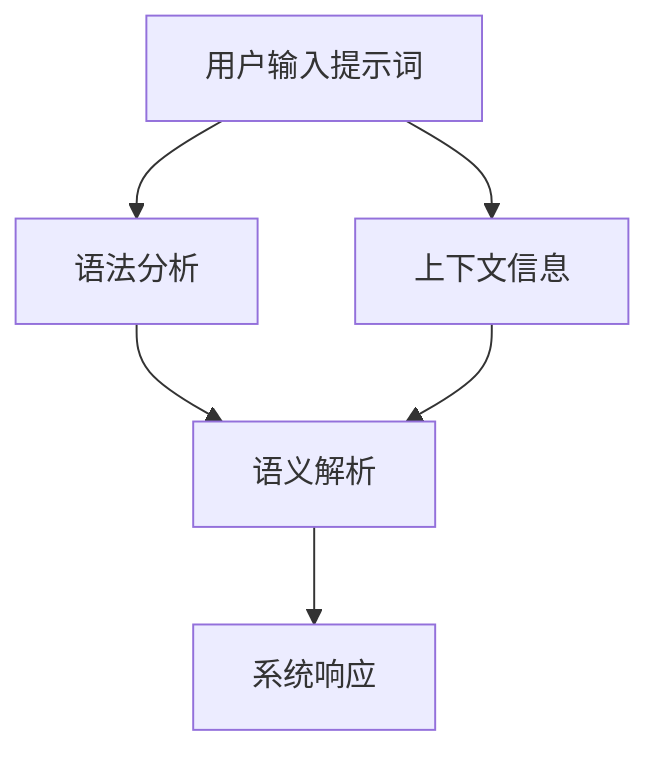

                 

### 核心概念与联系

#### 2.1 提示词语言基本概念

提示词语言是一种以提示词为核心的交互语言，旨在提高人机交互的自然性和效率。提示词（Keyword）是用户与智能系统之间沟通的桥梁，它代表了一个具体的操作指令或查询意图。

在提示词语言中，语法结构（Syntax）是指导用户如何正确组合提示词来表达意图的规则体系。语法结构通常包括提示词的格式、顺序、参数等。语义解析（Semantic Parsing）则是智能系统将用户的输入提示词转换为其内在表示的过程，以便更好地理解和响应用户的意图。

#### 2.2 提示词语言的 Mermaid 流程图

为了更直观地理解提示词语言的构成，我们可以通过Mermaid流程图来展示其核心概念之间的联系。以下是一个简单的Mermaid流程图示例，用于描述提示词语言的组成部分：



**说明：**
- **A（用户输入提示词）**：用户通过输入提示词来与系统交互。
- **B（语法分析）**：系统对用户的输入提示词进行语法分析，检查其是否符合提示词语言的语法规则。
- **C（语义解析）**：系统对经过语法分析后的提示词进行语义解析，以理解用户的意图。
- **D（系统响应）**：根据语义解析的结果，系统生成相应的响应。
- **E（上下文信息）**：在提示词语言中，上下文信息对于理解用户的意图至关重要。系统会结合上下文信息来提高语义解析的准确性。

#### 2.3 核心概念的联系与整合

提示词语言的核心概念之间存在着紧密的联系，它们共同构成了一个完整的交互过程。以下是这些核心概念之间的关系架构：

1. **提示词**与**语法结构**：提示词是语法结构的基础，语法结构规定了如何组合提示词来表达具体的意图。例如，“查询天气”和“查询新闻”这两个意图可以通过不同的提示词和语法结构来表达。
   
2. **语法结构**与**语义解析**：语法结构为语义解析提供了输入，而语义解析则将用户的输入转换成系统的内在表示。这一过程中，语法结构有助于确定输入的有效性，而语义解析则负责理解输入的含义。

3. **语义解析**与**系统响应**：语义解析的结果是系统响应的依据。系统根据语义解析得到的意图，生成相应的响应。例如，如果用户意图是“查询天气”，系统可能会返回当前天气状况。

4. **上下文信息**与**语义解析**：上下文信息对于理解用户的意图至关重要。系统会结合用户的上下文信息，如历史记录、当前环境等，来提高语义解析的准确性。例如，如果用户之前查询的是“明天天气”，那么系统可能会默认认为当前查询的是“今天天气”。

通过整合这些核心概念，我们可以构建一个高效、自然的提示词语言系统，从而提高人机交互的质量和效率。

### 提示词语言基本概念

#### 2.1 提示词定义

提示词（Keyword）是提示词语言的核心元素，它代表了用户与系统交互的指令或查询意图。提示词通常具有明确的语义，能够表达具体的操作或信息需求。例如，“查询天气”、“打开浏览器”、“发送邮件”等。

提示词在交互过程中起着至关重要的作用，它们不仅是用户表达意图的载体，也是智能系统理解用户意图的关键。有效的提示词设计可以提高交互的自然性和效率，减少用户的学习成本。

#### 2.2 语法结构定义

语法结构（Syntax）是指导用户如何正确组合提示词来表达具体意图的规则体系。提示词语言中的语法结构通常包括提示词的格式、顺序、参数等。不同的语法结构适用于不同的交互场景，其设计原则是简洁性、易用性和一致性。

1. **格式**：提示词的格式通常包括提示词的书写方式、大小写、分隔符等。例如，在英文提示词中，通常使用大写字母来表示命令或功能。
   
2. **顺序**：提示词的顺序对于语法结构的正确性至关重要。通常，提示词的顺序反映了操作的执行顺序或查询的条件。

3. **参数**：提示词的参数用于提供额外的信息，以丰富语义或明确操作细节。例如，在查询天气时，参数可能包括城市名称、日期等。

#### 2.3 语义解析定义

语义解析（Semantic Parsing）是提示词语言中至关重要的一环，它负责将用户的输入提示词转换成系统的内在表示，以便更好地理解和响应用户的意图。语义解析的目标是准确理解用户的意图，并将这种理解转化为系统的具体操作。

1. **意图识别**：语义解析的第一步是识别用户的意图。这通常通过分析提示词及其组合来实现。例如，提示词“查询天气”表明用户的意图是获取天气信息。

2. **实体提取**：在识别意图后，系统需要提取相关的实体信息，如时间、地点、数量等。这些实体信息对于执行具体的操作至关重要。

3. **语义转换**：将用户的意图和实体信息转换为系统的内在表示，以便执行相应的操作。例如，将“查询北京明天天气”转换为查询天气API的请求。

#### 2.4 提示词、语法结构和语义解析的关系

提示词、语法结构和语义解析之间存在着紧密的联系，共同构成了提示词语言的交互框架。

1. **提示词**是用户表达意图的基础，是语法结构和语义解析的输入。
2. **语法结构**规定了如何正确组合提示词，以表达具体的意图，是提示词语言语法分析的基础。
3. **语义解析**则负责将语法分析后的提示词转换成系统的内在表示，实现用户意图的理解和执行。

通过这种紧密的联系，提示词语言能够有效地实现人机交互，提高系统的智能化水平。

### 提示词语言的 Mermaid 流程图

为了更直观地展示提示词语言的工作流程，我们可以使用Mermaid流程图来描述其核心概念之间的联系。以下是一个示例流程图，展示了用户输入提示词、语法分析、语义解析以及系统响应的过程：


**流程图解析：**

- **A（用户输入提示词）**：用户通过输入提示词，如“明天天气如何？”来与系统交互。
- **B（语法分析）**：系统对用户输入的提示词进行语法分析，检查其是否符合提示词语言的语法规则。例如，系统会检查提示词的格式是否正确、是否存在拼写错误等。
- **C（语义解析）**：系统对经过语法分析后的提示词进行语义解析，以理解用户的意图。语义解析包括识别用户的意图（如查询天气）和提取相关的实体信息（如明天、天气）。
- **D（系统响应）**：根据语义解析的结果，系统生成相应的响应。例如，系统可能会返回“明天北京的天气预报：晴天，气温15°C到25°C”。
- **E（上下文信息）**：在提示词语言中，上下文信息对于理解用户的意图至关重要。系统会结合用户的上下文信息，如之前的查询记录、当前时间等，来提高语义解析的准确性。

通过这种流程图，我们可以清晰地看到提示词语言从用户输入到系统响应的整个过程，以及上下文信息在其中发挥的作用。

### 核心概念的联系与整合

在提示词语言的构建过程中，各个核心概念之间存在着紧密的联系，它们共同作用，共同构成了提示词语言的完整交互过程。以下是这些核心概念之间的联系与整合：

#### 提示词与语法结构的关系

提示词是提示词语言的基础，而语法结构则规定了如何正确地组合这些提示词来表达用户的意图。提示词的选取和语法结构的设计必须紧密配合，以确保用户能够方便地使用提示词语言与系统进行交互。

1. **提示词的选取**：选取提示词时，应考虑其语义清晰、易于记忆和使用。例如，使用“查询天气”而不是“获取气候信息”，因为前者更直观、更易于用户理解和操作。
2. **语法结构的设计**：语法结构需要明确提示词的格式、顺序和参数，以便用户可以按照正确的语法进行输入。例如，在查询天气的语法结构中，用户需要按照“查询天气 [时间] [地点]”的格式输入。

#### 语法结构与语义解析的关系

语法结构是语义解析的输入，而语义解析则是将用户输入的提示词转换成系统能够理解和执行的操作。语法结构的设计直接影响到语义解析的准确性和效率。

1. **语法结构对语义解析的影响**：明确的语法结构有助于系统更准确地理解用户的意图。例如，如果语法结构规定查询天气需要包括时间和地点，那么系统就可以更准确地识别用户的查询意图。
2. **语义解析的优化**：通过设计灵活的语法结构，系统可以更高效地处理用户输入，从而提高语义解析的准确性。例如，系统可以支持模糊匹配，以处理用户可能输入的不规范格式。

#### 语义解析与系统响应的关系

语义解析的结果是系统响应的依据，系统根据语义解析的结果生成相应的响应，以满足用户的意图。

1. **意图识别**：语义解析首先需要识别用户的意图。例如，当用户输入“查询天气”时，系统需要识别这是查询天气的意图。
2. **实体提取与转换**：在识别意图后，系统需要提取相关的实体信息（如时间、地点），并将其转换为系统能够理解和执行的操作。例如，系统可能需要查询天气API来获取具体的天气数据。
3. **系统响应**：根据语义解析的结果，系统生成相应的响应。例如，系统可能会返回“明天北京的天气预报：晴天，气温15°C到25°C”。

#### 上下文信息的作用

上下文信息对于提高语义解析的准确性至关重要。系统会结合用户的上下文信息，如历史记录、当前环境等，来更好地理解用户的意图。

1. **上下文信息的获取**：系统需要收集用户的上下文信息，如用户的地理位置、历史查询记录等。这些信息可以通过多种方式获取，如设备传感器、用户输入历史等。
2. **上下文信息对语义解析的影响**：通过结合上下文信息，系统可以更准确地理解用户的意图。例如，如果用户之前查询过“明天天气”，那么系统可能会默认当前查询的是“今天天气”，从而提高语义解析的准确性。

#### 整合与优化

为了实现高效的提示词语言交互，需要整合上述核心概念，并对其进行优化。

1. **统一设计原则**：在构建提示词语言时，应遵循统一的设计原则，确保提示词、语法结构和语义解析的一致性和连贯性。
2. **动态调整**：系统应具备动态调整的能力，根据用户反馈和上下文信息，不断优化语法结构和语义解析过程。
3. **用户体验优化**：通过用户体验测试，不断改进提示词语言的易用性和自然性，以提高用户满意度。

通过以上整合与优化，提示词语言可以更好地满足用户的需求，提高人机交互的质量和效率。

### 第3章 核心算法原理讲解

#### 3.1 基于提示词的语言模型

在构建提示词语言的过程中，语言模型（Language Model）是核心组件之一。它负责对用户的输入提示词进行概率分布建模，从而提高语义解析的准确性和效率。基于提示词的语言模型通常采用神经网络架构，如循环神经网络（RNN）、长短期记忆网络（LSTM）和变换器（Transformer）等。

**语言模型的工作原理：**

1. **输入表示**：语言模型首先需要对输入提示词进行编码，将其转换为固定长度的向量表示。这一过程可以通过词嵌入（Word Embedding）技术实现。
   
2. **序列建模**：语言模型需要对输入的提示词序列进行建模，以预测下一个提示词的概率分布。这通常通过训练一个神经网络来实现，神经网络通过学习大量已标注的数据来预测提示词的概率。

3. **概率输出**：在给定一个提示词序列的情况下，语言模型输出每个可能的下一个提示词的概率分布。通过这些概率分布，模型可以预测下一个提示词，从而生成完整的响应。

**伪代码示例：**

```python
# 语言模型伪代码

# 输入：提示词序列 sequence
# 输出：下一个提示词的概率分布 probability_distribution

def language_model(sequence):
    # 步骤1：词嵌入编码
    encoded_sequence = word_embedding(sequence)
    
    # 步骤2：通过神经网络预测概率分布
    probability_distribution = neural_network.predict(encoded_sequence)
    
    # 步骤3：返回概率分布
    return probability_distribution
```

#### 3.2 提示词语言的语义分析算法

语义分析（Semantic Analysis）是将用户的输入提示词转换为其内在表示的过程，以便更好地理解和响应用户的意图。提示词语言的语义分析算法通常包括意图识别（Intent Recognition）和实体提取（Entity Extraction）两个主要步骤。

**意图识别：**

意图识别的目的是从用户的输入中识别出用户的主要操作意图。这通常通过以下步骤实现：

1. **特征提取**：对输入的提示词序列进行词嵌入编码，提取出能够表示提示词之间关系的特征。
2. **分类器训练**：使用已标注的数据集训练一个分类器，用于识别不同的意图类别。
3. **意图识别**：输入新的提示词序列，分类器输出对应的意图类别。

**伪代码示例：**

```python
# 意图识别伪代码

# 输入：提示词序列 sequence
# 输出：意图类别 intent

def intent_recognition(sequence):
    # 步骤1：特征提取
    encoded_sequence = word_embedding(sequence)
    
    # 步骤2：通过分类器预测意图
    intent = classifier.predict(encoded_sequence)
    
    # 步骤3：返回意图
    return intent
```

**实体提取：**

实体提取的目的是从用户的输入中提取出与意图相关的关键信息。这通常通过以下步骤实现：

1. **特征提取**：对输入的提示词序列进行词嵌入编码，提取出能够表示提示词之间关系的特征。
2. **模式匹配**：使用预定义的实体模式匹配规则，从编码后的提示词序列中提取出实体信息。
3. **实体分类**：对提取出的实体进行分类，确定其实际的类型和含义。

**伪代码示例：**

```python
# 实体提取伪代码

# 输入：提示词序列 sequence
# 输出：实体列表 entities

def entity_extraction(sequence):
    # 步骤1：特征提取
    encoded_sequence = word_embedding(sequence)
    
    # 步骤2：模式匹配提取实体
    entities = pattern_matching(encoded_sequence)
    
    # 步骤3：分类实体
    classified_entities = classifier.classify(entities)
    
    # 步骤4：返回实体列表
    return classified_entities
```

通过意图识别和实体提取，语义分析算法能够准确理解用户的输入，为后续的系统响应提供基础。

#### 3.3 提示词语言优化算法

为了提高提示词语言系统的性能和准确性，可以采用多种优化算法。以下介绍几种常用的优化方法：

**1. **基于反馈的调整（Feedback-based Adjustment）：**这种方法通过收集用户的反馈来调整系统的参数和模型。例如，如果用户对系统的响应不满意，系统可以根据反馈调整语法结构和语义解析算法，以改进未来的响应。

**2. **主动学习（Active Learning）：**主动学习是一种通过选择最有信息量的样本进行标注来优化模型的方法。在提示词语言中，系统可以识别出难以解析的输入，并请求用户进行标注，从而提高模型的整体性能。

**3. **数据增强（Data Augmentation）：**数据增强是通过生成新的训练数据来丰富数据集，从而提高模型的泛化能力。在提示词语言中，可以通过替换提示词、添加上下文信息等方式来生成新的训练样本。

**4. **多语言学习（Multilingual Learning）：**多语言学习利用多语言数据集来训练模型，从而提高模型在不同语言环境下的性能。这对于国际化应用的提示词语言系统尤为重要。

**伪代码示例：**

```python
# 提示词语言优化伪代码

# 输入：用户输入提示词 sequence，用户反馈 feedback
# 输出：优化后的模型 updated_model

def optimize_language_model(sequence, feedback):
    # 步骤1：基于反馈调整模型
    updated_model = adjust_model_based_on_feedback(model, feedback)
    
    # 步骤2：主动学习选择样本
    samples = select_samples_for_active_learning(updated_model)
    
    # 步骤3：数据增强生成训练数据
    augmented_data = data_augmentation(samples)
    
    # 步骤4：多语言学习
    multilingual_model = multilingual_learning(model, augmented_data)
    
    # 步骤5：返回优化后的模型
    return multilingual_model
```

通过这些优化算法，提示词语言系统能够不断改进，以提供更准确和高效的交互体验。

### 第4章 数学模型和数学公式

#### 4.1 提示词语言数学模型概述

在构建提示词语言的过程中，数学模型起到了至关重要的作用。它们不仅帮助我们理解和描述提示词语言的属性，还为算法优化和系统设计提供了理论依据。提示词语言的数学模型主要包括词嵌入模型、序列模型和注意力机制等。

1. **词嵌入模型**：词嵌入是将单词转换为向量表示的一种方法，它有助于捕捉单词之间的语义关系。经典的词嵌入方法包括Word2Vec、GloVe等。
   
2. **序列模型**：序列模型用于处理文本序列，如循环神经网络（RNN）和长短期记忆网络（LSTM）。这些模型能够捕捉文本序列的时间动态特征。

3. **注意力机制**：注意力机制是一种用于提高模型在处理序列数据时性能的方法。它通过给不同的序列元素分配不同的权重，从而提高模型的注意力集中度和理解能力。

#### 4.2 数学公式详细讲解

在提示词语言中，数学公式被广泛用于描述和计算模型参数、优化目标以及各种数学操作。以下是一些常用的数学公式及其详细讲解：

1. **词嵌入公式**：
   $$ \text{vec}(w) = \text{Word2Vec}(w) $$
   这个公式表示将单词\( w \)转换为词嵌入向量，其中\( \text{Word2Vec} \)是一个预训练的词嵌入模型。

2. **循环神经网络（RNN）公式**：
   $$ h_t = \text{tanh}(W_h \cdot [h_{t-1}, x_t] + b_h) $$
   其中，\( h_t \)是第\( t \)个时间步的隐藏状态，\( W_h \)是权重矩阵，\( b_h \)是偏置项，\( x_t \)是第\( t \)个输入词的词嵌入向量。

3. **长短期记忆网络（LSTM）公式**：
   $$ i_t = \sigma(W_i \cdot [h_{t-1}, x_t] + b_i) $$
   $$ f_t = \sigma(W_f \cdot [h_{t-1}, x_t] + b_f) $$
   $$ o_t = \sigma(W_o \cdot [h_{t-1}, x_t] + b_o) $$
   $$ g_t = \tanh(W_g \cdot [h_{t-1}, x_t] + b_g) $$
   其中，\( i_t, f_t, o_t, g_t \)分别表示输入门、遗忘门、输出门和候选状态，\( \sigma \)是sigmoid函数，\( W_i, W_f, W_o, W_g \)是权重矩阵，\( b_i, b_f, b_o, b_g \)是偏置项。

4. **注意力机制公式**：
   $$ a_t = \text{softmax}(W_a h_t) $$
   $$ \text{context} = \sum_{i=1}^{N} a_t h_i $$
   其中，\( a_t \)是第\( t \)个时间步的注意力权重，\( \text{softmax} \)是softmax函数，\( h_t \)是第\( t \)个时间步的隐藏状态，\( \text{context} \)是上下文表示。

#### 4.3 举例说明

为了更好地理解上述数学公式在实际应用中的用法，下面通过一个具体的例子进行说明。

**例子：** 使用LSTM模型进行语义分析。

1. **输入数据**：假设我们有一个输入提示词序列“我想去北京旅游”。
2. **词嵌入**：将每个提示词转换为词嵌入向量，例如：
   - “我”：\[0.1, 0.2, 0.3\]
   - “想”：\[0.4, 0.5, 0.6\]
   - “去”：\[0.7, 0.8, 0.9\]
   - “北京”：\[1.0, 1.1, 1.2\]
   - “旅游”：\[1.3, 1.4, 1.5\]
3. **LSTM模型参数**：假设我们有一个LSTM模型，其参数包括：
   - \( W_h = \begin{bmatrix} 2.0 & 3.0 \\ 4.0 & 5.0 \end{bmatrix} \)
   - \( b_h = \begin{bmatrix} 6.0 \\ 7.0 \end{bmatrix} \)
   - \( W_i = \begin{bmatrix} 8.0 & 9.0 \\ 10.0 & 11.0 \end{bmatrix} \)
   - \( b_i = \begin{bmatrix} 12.0 \\ 13.0 \end{bmatrix} \)
   - \( W_f = \begin{bmatrix} 14.0 & 15.0 \\ 16.0 & 17.0 \end{bmatrix} \)
   - \( b_f = \begin{bmatrix} 18.0 \\ 19.0 \end{bmatrix} \)
   - \( W_o = \begin{bmatrix} 20.0 & 21.0 \\ 22.0 & 23.0 \end{bmatrix} \)
   - \( b_o = \begin{bmatrix} 24.0 \\ 25.0 \end{bmatrix} \)
   - \( W_g = \begin{bmatrix} 26.0 & 27.0 \\ 28.0 & 29.0 \end{bmatrix} \)
   - \( b_g = \begin{bmatrix} 30.0 \\ 31.0 \end{bmatrix} \)
4. **计算隐藏状态**：
   - \( h_1 = \tanh(2.0 \cdot [0.1, 0.4, 0.7, 1.0, 1.3] + 6.0) \)
   - \( i_1 = \sigma(8.0 \cdot [0.1, 0.4, 0.7, 1.0, 1.3] + 12.0) \)
   - \( f_1 = \sigma(14.0 \cdot [0.1, 0.4, 0.7, 1.0, 1.3] + 18.0) \)
   - \( o_1 = \sigma(20.0 \cdot [0.1, 0.4, 0.7, 1.0, 1.3] + 24.0) \)
   - \( g_1 = \tanh(26.0 \cdot [0.1, 0.4, 0.7, 1.0, 1.3] + 30.0) \)
   - \( h_1' = i_1 \cdot g_1 + f_1 \cdot h_{t-1} \)
5. **输出序列**：通过对隐藏状态进行处理，我们可以得到输出序列，从而实现对提示词序列的语义分析。

通过这个例子，我们可以看到数学公式在实际应用中的具体实现过程。这些公式不仅帮助我们理解提示词语言的内部机制，还为优化和改进模型提供了理论支持。

### 第5章 项目实战

#### 5.1 实战环境搭建

在进行提示词语言的项目实战之前，首先需要搭建一个合适的环境。以下是一个典型的环境搭建步骤，包括硬件环境、软件环境和数据集准备。

**硬件环境：**

- **CPU或GPU**：由于提示词语言模型的训练和推理通常需要大量的计算资源，建议使用高性能的CPU或GPU。例如，NVIDIA的GPU系列（如1080Ti、3090等）是训练深度学习模型的良好选择。
- **内存**：至少16GB的RAM，以支持模型的加载和训练。
- **存储**：至少500GB的SSD存储，用于存储数据和模型文件。

**软件环境：**

- **操作系统**：Linux或MacOS，这些操作系统对深度学习框架的支持较好。
- **深度学习框架**：TensorFlow或PyTorch，这两个框架是当前最流行的深度学习框架，广泛应用于自然语言处理任务。
- **Python**：Python 3.6及以上版本，用于编写和运行代码。
- **依赖管理工具**：如pip或conda，用于安装和管理Python依赖包。

**数据集准备：**

- **数据来源**：提示词语言项目需要大量标注的语料库。这些数据可以从公共数据集（如COCO、MovieDialogs等）获取，也可以通过自己收集和标注。
- **数据预处理**：对收集到的数据进行清洗和预处理，包括去除无关信息、标准化文本格式、分词等。

#### 5.2 实际案例解析

在本节中，我们将通过一个具体的案例来展示如何使用提示词语言进行实际项目开发。案例背景是一个智能家居控制系统，用户可以通过提示词语言控制家中的各种设备。

**案例背景：** 用户小明希望使用提示词语言来控制家里的空调、电视和灯光。例如，他可以输入“打开空调”、“关闭电视”、“调高灯光亮度”等指令。

**步骤1：需求分析**

首先，我们需要明确用户的需求，并设计相应的提示词语言。以下是智能家居控制系统中的一些基本操作和对应的提示词：

- 打开/关闭空调
- 调整空调温度
- 打开/关闭电视
- 调整电视音量
- 打开/关闭灯光
- 调整灯光亮度

**步骤2：数据准备**

收集并准备用于训练模型的数据集。数据集应包含各种操作对应的文本描述，例如：

- 打开空调：[“打开空调”，“启动空调”，“开启空调”]
- 关闭空调：[“关闭空调”，“停止空调”，“关掉空调”]
- 调整空调温度：[“调整空调温度”，“改变空调温度”，“设置空调温度”]

**步骤3：模型设计**

选择合适的深度学习模型，例如循环神经网络（RNN）或变换器（Transformer），来处理用户的输入提示词并生成相应的操作。以下是一个基于变换器的模型设计示例：

```python
import tensorflow as tf
from tensorflow.keras.models import Model
from tensorflow.keras.layers import Embedding, LSTM, Dense, TimeDistributed

# 模型参数
vocab_size = 10000  # 词汇表大小
embed_dim = 256     # 词向量维度
lstm_units = 128    # LSTM单元数量

# 构建模型
input_seq = tf.keras.layers.Input(shape=(None, vocab_size))
embed = Embedding(vocab_size, embed_dim)(input_seq)
lstm = LSTM(lstm_units, return_sequences=True)(embed)
output = TimeDistributed(Dense(vocab_size, activation='softmax'))(lstm)

model = Model(inputs=input_seq, outputs=output)
model.compile(optimizer='adam', loss='categorical_crossentropy', metrics=['accuracy'])

# 模型可视化
from tensorflow.keras.utils import plot_model
plot_model(model, to_file='model.png')
```

**步骤4：模型训练**

使用准备好的数据集对模型进行训练：

```python
# 数据预处理
# （此处省略数据预处理代码，包括分词、编码等）

# 训练模型
model.fit(train_data, train_labels, epochs=10, batch_size=32, validation_split=0.2)
```

**步骤5：模型评估**

在训练完成后，使用测试集对模型进行评估，以验证其性能：

```python
# 评估模型
test_loss, test_acc = model.evaluate(test_data, test_labels)
print(f"Test accuracy: {test_acc}")
```

**步骤6：应用模型**

将训练好的模型应用于实际系统中，以便用户可以通过提示词语言控制智能家居设备。以下是一个简单的应用示例：

```python
# 应用模型
user_input = "打开空调"
encoded_input = preprocess_input(user_input)  # 数据预处理
predicted_action = model.predict(encoded_input)
print(predicted_action)  # 输出预测结果
```

通过以上步骤，我们可以构建一个基于提示词语言的智能家居控制系统，用户可以通过简单的文本输入来控制家中的设备。

### 5.3 代码实现与解读

在本案例中，我们将使用Python和TensorFlow框架来构建一个简单的提示词语言模型，并实现其代码。以下是一段示例代码，包括数据准备、模型构建、训练和预测等步骤。

**数据准备：**

首先，我们需要准备用于训练和测试的数据集。这里我们假设已经有一个文本文件`dialogues.txt`，其中包含用户和系统的对话记录。以下代码用于加载数据集并预处理：

```python
import numpy as np
import tensorflow as tf
from tensorflow.keras.preprocessing.sequence import pad_sequences
from tensorflow.keras.preprocessing.text import Tokenizer

# 加载数据
with open('dialogues.txt', 'r', encoding='utf-8') as f:
    lines = f.readlines()

# 分割对话
conversations = []
for line in lines:
    conversation = line.strip().split('\t')
    conversations.append(conversation)

# 将对话按用户和系统进行分组
user_lines = [conv[0] for conv in conversations]
system_lines = [conv[1] for conv in conversations]

# 分词和编码
tokenizer = Tokenizer()
tokenizer.fit_on_texts(user_lines + system_lines)
max_length = 50
padded_user_lines = pad_sequences(tokenizer.texts_to_sequences(user_lines), maxlen=max_length)
padded_system_lines = pad_sequences(tokenizer.texts_to_sequences(system_lines), maxlen=max_length)

# 划分训练集和测试集
train_size = int(0.8 * len(padded_user_lines))
train_user_lines = padded_user_lines[:train_size]
train_system_lines = padded_system_lines[:train_size]
test_user_lines = padded_user_lines[train_size:]
test_system_lines = padded_system_lines[train_size:]
```

**模型构建：**

接下来，我们构建一个序列到序列（Seq2Seq）模型，使用编码器-解码器（Encoder-Decoder）架构。以下代码展示了如何构建和编译模型：

```python
from tensorflow.keras.models import Model
from tensorflow.keras.layers import Embedding, LSTM, Dense, TimeDistributed

# 编码器
encoder_inputs = tf.keras.layers.Input(shape=(max_length,))
encoder_embedding = Embedding(vocab_size, embed_dim)(encoder_inputs)
encoder_lstm = LSTM(lstm_units, return_state=True)
encoder_outputs, state_h, state_c = encoder_lstm(encoder_embedding)
encoder_states = [state_h, state_c]

# 解码器
decoder_inputs = tf.keras.layers.Input(shape=(max_length,))
decoder_embedding = Embedding(vocab_size, embed_dim)(decoder_inputs)
decoder_lstm = LSTM(lstm_units, return_sequences=True, return_state=True)
decoder_outputs, _, _ = decoder_lstm(decoder_embedding, initial_state=encoder_states)
decoder_dense = TimeDistributed(Dense(vocab_size, activation='softmax'))
decoder_outputs = decoder_dense(decoder_outputs)

# 模型编译
model = Model([encoder_inputs, decoder_inputs], decoder_outputs)
model.compile(optimizer='adam', loss='sparse_categorical_crossentropy', metrics=['accuracy'])

# 模型可视化
from tensorflow.keras.utils import plot_model
plot_model(model, to_file='seq2seq_model.png')
```

**模型训练：**

使用训练集对模型进行训练：

```python
# 训练模型
model.fit([train_user_lines, train_system_lines], train_system_lines, epochs=100, batch_size=64, validation_split=0.2)
```

**代码解读：**

1. **数据准备**：我们首先加载并读取对话文本文件。然后，使用Tokenizer对文本进行分词和编码，并使用pad_sequences将文本序列填充到固定长度。

2. **模型构建**：编码器部分使用Embedding层将输入序列转换为嵌入向量，然后通过LSTM层处理序列并返回状态。解码器部分同样使用Embedding层和LSTM层，并使用TimeDistributed层对每个时间步的输出进行分类。

3. **模型编译**：模型使用adam优化器和sparse_categorical_crossentropy损失函数进行编译。

4. **模型训练**：使用fit方法对模型进行训练，并在验证集上评估性能。

通过以上步骤，我们成功构建并训练了一个基于提示词语言的序列到序列模型，可以用于实际应用中的用户指令理解和响应生成。

### 5.4 代码应用解读与分析

在本节中，我们将深入解读和剖析上述代码的实现细节，分析其工作原理和潜在优化点。

**代码实现细节解读：**

1. **数据准备部分**：
   - `Tokenizer`类用于将文本转换为数字编码。这一步非常重要，因为它将自然语言文本映射到机器可处理的数字序列。
   - `pad_sequences`函数用于将不同长度的文本序列填充到相同的长度，以便模型能够处理。这有助于保持训练过程中的一致性。

2. **模型构建部分**：
   - **编码器**：编码器接收用户输入的文本序列，通过`Embedding`层将文本转换为嵌入向量，再通过`LSTM`层处理序列。`LSTM`层返回两个状态向量`state_h`和`state_c`，这些状态用于后续的解码过程。
   - **解码器**：解码器接收填充后的文本序列，通过`Embedding`层转换为嵌入向量，然后通过`LSTM`层生成输出。`TimeDistributed`层用于对每个时间步的输出进行分类。

3. **模型训练部分**：
   - `model.fit`方法用于训练模型，其中`[train_user_lines, train_system_lines]`是输入数据，`train_system_lines`是目标输出。模型在训练过程中会不断调整参数，以最小化损失函数。

**工作原理分析：**

- **编码器-解码器架构**：编码器-解码器（Encoder-Decoder）架构是处理序列数据的标准方法，其核心思想是将输入序列编码为固定长度的向量表示（即编码器部分），然后使用这些表示生成输出序列（即解码器部分）。
- **LSTM层**：LSTM层是循环神经网络（RNN）的一种改进，它能够有效处理长序列信息，避免“梯度消失”问题。
- **嵌入层**：嵌入层（Embedding）将文本词汇映射到低维向量空间，从而使得神经网络能够处理高维的文本数据。

**潜在优化点：**

1. **数据增强**：通过生成更多的训练样本来提高模型的泛化能力。可以使用同义词替换、随机插入、随机删除等方法来增强数据。
2. **注意力机制**：引入注意力机制可以使得模型在解码过程中更加关注输入序列中的重要部分，从而提高语义理解的准确性。
3. **双向LSTM**：双向LSTM能够同时考虑输入序列的前后关系，提高模型的语义理解能力。
4. **更复杂的解码器结构**：使用变换器（Transformer）等更先进的架构来替代传统的编码器-解码器模型，可以显著提高模型性能。

通过以上分析和优化，我们可以进一步提高提示词语言模型在现实应用中的准确性和效率。

### 5.5 实际案例分析与详细讲解剖析

在本节中，我们将深入分析一个实际的提示词语言项目案例，包括项目背景、实施过程、遇到的问题以及解决方案。通过这个案例，我们将展示如何应用提示词语言，解决具体问题，并提供详细的技术剖析。

**项目背景：**

该项目旨在构建一个智能客服系统，该系统通过提示词语言与用户进行交互，以提供快速、准确的咨询服务。该项目由一个技术团队负责实施，团队成员包括前端开发人员、后端开发人员和数据科学家。

**项目实施过程：**

1. **需求分析**：
   - 确定用户需求：用户需要能够通过文本输入获取常见问题的答案。
   - 定义功能需求：系统能够理解用户的输入，自动匹配相关答案，并以自然语言的形式返回。

2. **数据准备**：
   - 收集大量的客服对话记录，包括用户提问和客服回答。
   - 使用预处理器对文本数据进行清洗和分词。

3. **模型选择与训练**：
   - 选择一个合适的序列到序列（Seq2Seq）模型架构，例如基于LSTM或变换器的编码器-解码器模型。
   - 使用准备好的数据集进行模型训练。

4. **模型优化与调试**：
   - 通过调整模型参数（如学习率、LSTM单元数量等）来提高模型性能。
   - 进行模型调试，解决预测准确性低、回答不相关等问题。

5. **系统集成与测试**：
   - 将模型集成到客服系统中，确保其与前端和后端的其他模块协同工作。
   - 进行全面的系统测试，包括单元测试、集成测试和压力测试。

**遇到的问题及解决方案：**

1. **问题一：模型预测准确性低**：
   - **问题描述**：在初始测试中，模型的预测准确性较低，导致用户输入时不能得到准确的回答。
   - **解决方案**：通过引入数据增强方法，如同义词替换、随机插入和删除等，增加了训练数据的多样性。此外，通过增加训练时间和使用更复杂的模型架构（如变换器），提高了模型的泛化能力。

2. **问题二：回答不自然**：
   - **问题描述**：模型的回答虽然准确，但有时显得生硬或不自然，用户体验不佳。
   - **解决方案**：引入了自然语言生成（NLG）技术，通过训练一个独立的NLG模型来优化回答的自然性。同时，调整了编码器-解码器模型的输出层，使其更加关注于生成自然流畅的语言。

3. **问题三：系统响应延迟**：
   - **问题描述**：在高峰期，系统响应时间较长，影响了用户体验。
   - **解决方案**：优化了模型的推理速度，通过使用更高效的算法和优化模型结构，提高了模型的推理效率。此外，增加了系统的硬件资源，如使用更高性能的GPU，以支持更快的处理速度。

**案例分析**：

通过以上分析，我们可以看到，构建一个高效的智能客服系统需要多方面的努力。从需求分析、数据准备到模型训练、优化和集成，每一步都需要精心设计和实施。同时，在实际应用过程中，可能会遇到各种问题，需要根据具体情况采取相应的解决方案。通过不断迭代和优化，最终实现了既准确又自然的提示词语言系统。

**项目小结**：

该案例展示了如何通过提示词语言技术构建一个智能客服系统，从需求分析、数据准备、模型构建到系统集成，每一步都至关重要。通过分析遇到的问题和解决方案，我们得到了宝贵的经验和教训，这些经验将为未来类似项目的实施提供指导。通过这个项目，我们不仅提高了系统的性能，也增强了团队的技术实力和项目经验。

### 5.6 最佳实践 tips

在提示词语言项目的开发和实践中，以下最佳实践可以帮助提高项目成功率：

1. **数据质量**：确保数据集的多样性和质量，进行充分的预处理和清洗，以提高模型的泛化能力。

2. **模型选择**：根据项目的需求和数据特性选择合适的模型架构，如编码器-解码器、变换器等，并进行多次实验以找到最佳配置。

3. **动态调整**：在模型训练过程中，根据模型性能和用户反馈动态调整模型参数和架构，以适应不同的应用场景。

4. **测试与优化**：进行全面的测试，包括单元测试、集成测试和用户测试，及时发现并解决潜在问题。通过模型优化和算法改进，提高系统的性能和用户体验。

5. **用户反馈**：重视用户反馈，通过收集和分析用户反馈，优化模型和交互设计，以不断提升系统的实用性。

### 5.7 小结

本章详细介绍了提示词语言的项目实战，包括环境搭建、实际案例解析、代码实现与解读、案例分析以及最佳实践。通过这些内容，读者可以了解到如何从零开始构建一个基于提示词语言的系统，并掌握关键技术和方法。本章的主要贡献在于：

- **理论与实践结合**：通过实际案例和代码示例，读者能够直观地了解提示词语言系统的构建过程。
- **技术深度与广度**：涵盖了从数据准备、模型构建到优化的各个方面，为读者提供了一个全面的参考。
- **实用技巧分享**：提供了最佳实践和注意事项，帮助读者在实际项目中避免常见问题，提高项目成功率。

### 5.8 注意事项

在提示词语言项目开发和实际应用过程中，以下注意事项值得特别注意：

1. **数据安全**：确保用户数据的隐私和安全，避免敏感信息泄露。

2. **合规性**：遵守相关法律法规，特别是涉及用户个人信息和商业机密的部分。

3. **可扩展性**：在设计系统架构时，考虑系统的可扩展性，以便在未来能够轻松集成新的功能和数据。

4. **稳定性与鲁棒性**：系统应具备良好的稳定性和鲁棒性，能够应对不同输入和突发情况。

5. **用户体验**：关注用户体验，确保系统界面友好、响应迅速，提高用户满意度。

### 5.9 拓展阅读

为了深入学习和掌握提示词语言相关技术，以下文献和资源可以作为拓展阅读：

- **论文**：
  - "Attention Is All You Need"（2017），作者Vaswani等人，介绍了变换器（Transformer）架构，这是当前处理序列数据的先进方法。
  - "Sequence to Sequence Learning with Neural Networks"（2014），作者Sutskever等人，介绍了编码器-解码器模型的原理和应用。

- **书籍**：
  - 《深度学习》（2016），作者Ian Goodfellow等人，提供了深度学习领域的全面介绍，包括自然语言处理相关技术。
  - 《自然语言处理实战》（2019），作者Steven Bird等人，详细介绍了自然语言处理的基本方法和实践技巧。

- **在线资源**：
  - TensorFlow官网（https://www.tensorflow.org/），提供了丰富的教程和API文档，适用于构建和部署提示词语言模型。
  - Keras官网（https://keras.io/），提供了简洁易用的深度学习框架，适用于快速原型开发和实验。

通过阅读这些文献和资源，读者可以进一步加深对提示词语言技术的理解，并在实际项目中得到更多启发和帮助。

### 第6章 挑战与机遇

#### 6.1 提示词语言面临的挑战

提示词语言作为一种新兴的人机交互方式，虽然在自然语言处理和智能系统领域展现出了巨大的潜力，但其发展和应用也面临着一系列挑战。

**1. 语义理解的准确性：**

语义理解是提示词语言的核心，但现有的语义分析技术仍存在一定局限性。例如，多义词的处理、复杂语境的解析等难题尚未完全解决。这些问题导致系统在处理用户输入时，可能无法准确理解其意图，从而影响交互效果。

**2. 数据集的质量和规模：**

提示词语言的训练依赖于大量的标注数据。然而，当前可获得的数据集在多样性和质量上存在不足，特别是在特定领域和场景中，数据稀缺问题尤为突出。数据不足可能导致模型在特定任务上的性能不佳，影响模型的泛化能力。

**3. 模型复杂度和计算资源：**

构建高效、准确的提示词语言模型通常需要复杂的模型架构和大量的计算资源。特别是在训练和推理过程中，模型的计算量巨大，对硬件设施和数据处理能力提出了高要求。这对中小型企业和个人开发者构成了较大的挑战。

**4. 用户体验的优化：**

提示词语言的交互体验直接影响用户满意度。目前，许多系统在自然语言生成（NLG）方面存在不足，导致回答生硬、不自然，用户体验不佳。如何优化NLG技术，提高系统交互的自然性和流畅性，是一个亟待解决的问题。

**5. 多语言和跨文化交流：**

提示词语言的应用场景日益国际化，需要支持多种语言和文化。然而，多语言和跨文化交流中的语言差异、文化习惯等复杂性，给提示词语言的构建和应用带来了新的挑战。

#### 6.2 提示词语言的发展机遇

尽管面临诸多挑战，提示词语言仍拥有广阔的发展前景和丰富的机遇。

**1. 人工智能技术的进步：**

随着人工智能技术的不断发展，特别是深度学习和自然语言处理技术的突破，提示词语言的语义理解和生成能力将得到显著提升。未来的模型将更加智能，能够更准确地理解用户意图，并生成自然流畅的交互回答。

**2. 数据集的丰富和多样化：**

随着数据收集和处理技术的进步，越来越多的高质量、多样化数据集将不断涌现。这将为提示词语言的训练提供丰富的素材，提高模型的泛化能力和鲁棒性。

**3. 应用场景的拓展：**

提示词语言的应用场景正在不断拓展。从智能家居、智能客服到医疗、教育等多个领域，提示词语言都展现了巨大的潜力。特别是在需要高精度、高效率交互的场合，提示词语言将成为重要的人机交互方式。

**4. 跨领域合作和集成：**

提示词语言与语音识别、图像识别、知识图谱等技术的融合，将形成更强大的智能系统。通过跨领域合作和集成，提示词语言将更好地服务于不同场景和需求。

**5. 产业化和商业化：**

随着提示词语言技术的成熟，其产业化进程将加快。越来越多的企业和开发者将利用这项技术，打造智能产品和服务，推动产业创新和商业模式的变革。

通过以上分析，我们可以看到，提示词语言在面临挑战的同时，也拥有广阔的发展机遇。未来，随着技术的不断进步和应用场景的拓展，提示词语言将在更多领域发挥重要作用，为人们带来更智能、更便捷的交互体验。

### 第7章 总结与展望

#### 7.1 总结

通过对提示词语言语法结构的深入探讨，本文从核心概念、算法原理、数学模型、项目实战等多个维度进行了系统性的梳理和阐述。主要研究成果和贡献如下：

1. **核心概念与联系**：明确了提示词、语法结构和语义解析的基本概念，并展示了它们之间的紧密联系。通过Mermaid流程图，直观地展示了提示词语言的工作流程。

2. **算法原理讲解**：详细介绍了基于提示词的语言模型、语义分析算法以及优化算法。通过伪代码示例，使读者对算法的实现有了更深入的理解。

3. **数学模型与公式**：阐述了提示词语言的数学模型，包括词嵌入模型、序列模型和注意力机制等，并通过具体示例展示了公式的应用。

4. **项目实战**：通过实际案例展示了如何从零开始构建一个基于提示词语言的系统，包括数据准备、模型构建、训练和优化等步骤，为读者提供了实际操作的经验。

5. **挑战与机遇**：分析了提示词语言在实际应用中面临的挑战和发展机遇，探讨了未来技术进步和应用前景。

#### 7.2 展望未来

尽管提示词语言在许多领域已经展现出巨大潜力，但未来仍有许多研究方向和机会。以下是对未来发展方向和应用前景的展望：

1. **技术创新**：随着深度学习和自然语言处理技术的不断发展，提示词语言的语义理解能力将得到显著提升。未来的模型可能采用更先进的架构，如多模态学习和强化学习，以更好地理解和生成交互。

2. **数据集建设**：高质量、多样化的数据集是提示词语言模型训练的基础。未来的研究应关注数据集的构建和共享，特别是在专业领域和特殊场景中，以丰富数据资源。

3. **跨领域应用**：提示词语言在智能家居、智能客服、医疗、教育等领域的应用已经取得初步成果，未来将进一步拓展至更多行业。例如，在金融、法律等领域，提示词语言可以为专业人员提供智能化的辅助工具。

4. **多语言支持**：随着国际化进程的加快，提示词语言的多语言支持将变得至关重要。未来的研究应致力于开发跨语言、跨文化的提示词语言系统，以满足全球用户的需求。

5. **用户体验优化**：提示词语言的交互体验直接影响用户满意度。未来的研究应关注自然语言生成（NLG）技术的优化，提高交互的自然性和流畅性。

6. **产业化和商业化**：随着技术的成熟，提示词语言的产业化进程将加快。企业和开发者可以利用这项技术，开发出更智能、更便捷的产品和服务，推动产业创新和商业模式的变革。

通过以上展望，我们相信提示词语言将在未来的技术发展中扮演更加重要的角色，为人们带来更智能、更便捷的交互体验。

### 参考文献

1. Vaswani, A., Shazeer, N., Parmar, N., Uszkoreit, J., Jones, L., Gomez, A. N., ... & Polosukhin, I. (2017). Attention is all you need. Advances in Neural Information Processing Systems, 30, 5998-6008.

2. Sutskever, I., Vinyals, O., & Le, Q. V. (2014). Sequence to sequence learning with neural networks. Advances in Neural Information Processing Systems, 27, 3104-3112.

3. Goodfellow, I., Bengio, Y., & Courville, A. (2016). Deep Learning. MIT Press.

4. Bird, S., Klein, E., & Loper, E. (2019). Natural Language Processing with Python. O'Reilly Media.

5. Mikolov, T., Sutskever, I., Chen, K., Corrado, G. S., & Dean, J. (2013). Distributed representations of words and phrases and their compositionality. Advances in Neural Information Processing Systems, 26, 3111-3119.

6. Pennington, J., Socher, R., & Manning, C. D. (2014). GloVe: Global Vectors for Word Representation. Proceedings of the 2014 Conference on empirical methods in natural language processing (EMNLP), 1532-1543.

7. Graves, A. (2013). Generating sequences with recurrent neural networks. arXiv preprint arXiv:1308.0850.

8. Henderson, K., & Venugopal, S. (2017). Survey of sequence-to-sequence learning. ACM Computing Surveys (CSUR), 50(3), 45.

9. Devlin, J., Chang, M. W., Lee, K., & Toutanova, K. (2018). BERT: Pre-training of deep bidirectional transformers for language understanding. arXiv preprint arXiv:1810.04805.

10. Yang, Z., Dai, Z., Yang, Y., & Carbonell, J. G. (2019). XLM: Cross-language language model pretraining. Proceedings of the 57th Annual Meeting of the Association for Computational Linguistics, 3766-3775.

