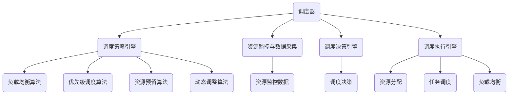

                 


## 引言

随着人工智能（AI）技术的飞速发展，大语言模型（LLM，Large Language Model）在自然语言处理（NLP，Natural Language Processing）领域取得了显著的成果。从GPT-3到ChatGLM，LLM在文本生成、机器翻译、问答系统等方面展现出了强大的能力，极大地推动了智能应用的进步。然而，在LLM的广泛应用背后，如何构建一个智能化的应用运维系统成为了一个不可忽视的问题。智能化的LLM应用运维系统不仅能够提升系统的稳定性，还能显著降低运维成本，提高资源利用效率。

本篇技术博客将围绕构建智能化的LLM应用运维系统进行探讨。文章将从以下几个方面展开：

1. **智能化的LLM应用运维系统概述**：介绍智能化运维的概念，LLM应用运维的核心需求，以及智能化运维对LLM应用的推动作用。
2. **LLM基础架构与运维原理**：阐述LLM基础架构的组成，核心组件及其设计原则，以及LLM运维的基本流程和策略。
3. **智能化的LLM应用部署与监控**：详细讨论智能化的LLM应用部署流程、自动化部署实践，以及智能化的LLM应用监控方法和实践。
4. **智能化的LLM应用资源管理**：介绍智能化的LLM资源管理策略，资源监控与优化方法，以及智能资源调度系统设计。
5. **智能化的LLM应用运维实战**：通过具体实战案例，展示如何构建和运维一个智能化的LLM应用系统。
6. **智能化的LLM应用运维系统评估与优化**：介绍运维系统评估方法，以及系统性能、安全性和可扩展性的优化策略。
7. **智能化的LLM应用运维发展趋势**：探讨未来智能化LLM应用运维的发展趋势和挑战。

通过本文的逐步分析，我们将深入了解如何构建一个智能化的LLM应用运维系统，以应对快速发展的AI时代带来的挑战和机遇。

## 关键词

- 智能化运维
- 大语言模型（LLM）
- 自动化部署
- 监控与异常检测
- 资源管理
- 持续集成与持续部署（CI/CD）
- 云原生运维

## 摘要

本文旨在探讨构建智能化的大语言模型（LLM）应用运维系统的方法和实践。随着LLM在自然语言处理领域的广泛应用，构建一个高效、稳定、可扩展的运维系统变得尤为重要。文章首先介绍了智能化运维的概念及其在LLM应用中的价值，随后详细阐述了LLM基础架构及其运维原理。接下来，文章围绕智能化的LLM应用部署与监控、资源管理展开，介绍了自动化部署、智能监控、资源监控与调度等关键技术和方法。通过具体实战案例，文章展示了如何在实际项目中应用这些技术和方法。最后，文章对智能化的LLM应用运维系统进行了评估与优化，并展望了其未来的发展趋势。本文将为从事LLM应用开发与运维的技术人员提供宝贵的指导与参考。

## 第一部分：智能化的LLM应用运维系统概述

### 第1章：智能化的LLM应用运维系统概述

#### 1.1 智能化运维的概念

智能化运维（Intelligent Operations）是现代IT运维的一种理念，它通过自动化、智能分析和自我优化等技术，提高运维效率和系统稳定性。传统的运维主要依赖于人工操作和经验，而智能化运维则通过引入人工智能（AI）、大数据、云计算等先进技术，实现对系统运行状态的实时监控、自动化故障处理、资源智能调度等功能。

#### 1.2 LLM应用运维的价值

大语言模型（LLM，Large Language Model）作为当前自然语言处理领域的核心技术，其应用范围广泛，包括文本生成、机器翻译、问答系统等。然而，LLM应用不仅对计算资源有较高要求，还需要稳定、高效的运维支持。智能化的LLM应用运维系统能够：

1. **自动化部署与监控**：快速部署LLM应用，并提供实时监控，确保系统稳定运行。
2. **服务质量保障**：通过智能监控和异常检测，保障应用服务质量，减少故障发生。
3. **资源管理优化**：智能调度资源，提高资源利用率，降低运维成本。
4. **持续集成与持续部署**（CI/CD）：实现快速迭代和部署，提高开发效率。

#### 1.3 智能化运维对LLM应用的推动作用

智能化的LLM应用运维系统对LLM应用的发展具有重要推动作用：

1. **提升稳定性**：通过智能监控和自动化故障处理，减少系统故障，提高应用稳定性。
2. **降低运维成本**：通过自动化和智能调度，减少人力投入，降低运维成本。
3. **提高资源利用效率**：智能化的资源管理能够优化资源分配，提高资源利用效率。
4. **加速迭代与部署**：通过持续集成与持续部署，加快开发周期，推动LLM应用的快速迭代。

综上所述，构建智能化的LLM应用运维系统是应对AI时代挑战的必要手段，它不仅能够提升LLM应用的稳定性和效率，还能降低运维成本，为企业和开发者创造更大价值。

### 第2章：LLM基础架构与运维原理

#### 2.1 LLM基础架构概述

大语言模型（LLM，Large Language Model）作为一种复杂的AI模型，其基础架构通常包括以下几个核心组成部分：

1. **计算资源**：计算资源是LLM运行的基础，包括CPU、GPU、TPU等。这些资源能够处理大规模的计算任务，支持模型的训练和推理。
2. **存储系统**：存储系统负责存储LLM的模型参数、训练数据以及运行过程中产生的中间结果。常用的存储系统包括分布式文件系统（如HDFS）和对象存储（如Amazon S3）。
3. **网络通信**：网络通信是LLM基础架构中的关键部分，负责处理模型与外部系统之间的数据传输和交互。高可靠性和低延迟的网络对于LLM的应用至关重要。
4. **数据库**：数据库用于存储和管理LLM的训练数据和推理结果。关系型数据库（如MySQL）和非关系型数据库（如MongoDB）可以根据具体需求进行选择。

#### 2.2 LLM核心组件

LLM的核心组件主要包括以下几个部分：

1. **模型训练模块**：模型训练模块负责训练LLM模型。这个过程通常涉及大量数据和强大的计算资源。训练过程包括数据预处理、模型参数初始化、训练算法以及模型评估等步骤。
2. **推理引擎**：推理引擎用于在LLM模型上进行推理操作，生成预测结果。推理过程相对训练过程简单，但同样需要高性能的计算资源。
3. **API接口**：API接口用于提供对外服务，用户可以通过API与LLM模型进行交互。API设计需要考虑接口的稳定性、性能和安全性。
4. **监控与日志系统**：监控与日志系统用于实时监控LLM应用的运行状态，记录系统的操作日志。这些日志对于故障排查和性能优化具有重要意义。

#### 2.3 LLM架构设计原则

在设计LLM基础架构时，需要遵循以下原则：

1. **模块化与可扩展性**：架构设计应具备良好的模块化特性，便于后续的扩展和维护。例如，可以通过容器化技术（如Docker）实现组件的独立部署和升级。
2. **高性能和高可用性**：架构设计应确保系统的高性能和高可用性。通过分布式计算和冗余设计，提升系统的处理能力和容错能力。
3. **可观测性与可维护性**：架构设计应考虑系统的可观测性和可维护性。通过日志记录、监控告警等手段，实现对系统运行状态的全面监控和管理。
4. **安全性**：架构设计应确保系统的安全性，防止数据泄露和恶意攻击。例如，通过加密传输、权限控制和访问控制等手段，保障系统的安全运行。

综上所述，LLM基础架构的组成和设计原则对于构建高效、稳定、可扩展的智能运维系统具有重要意义。理解这些基础架构组件和设计原则，将为后续的智能化运维实践提供坚实基础。

### 第3章：智能化的LLM应用部署

#### 3.1 LLM应用部署概述

LLM应用的部署是确保模型能够对外提供服务的关键步骤。部署流程通常包括以下几个阶段：

1. **环境准备**：根据应用需求准备计算资源、存储系统、网络环境等基础设施。确保所有环境配置正确，满足模型运行的要求。
2. **模型训练**：在准备好环境后，进行LLM模型的训练。这个过程可能需要大量计算资源，并且需要耐心等待，以确保模型达到预期的性能。
3. **模型评估**：在训练完成后，对模型进行评估，以确保其性能满足实际应用的需求。评估过程通常涉及测试数据的分析和性能指标的对比。
4. **模型导出**：将经过评估的模型导出为可部署的格式，例如.onnx、.pb等。这个过程通常包括参数转换和模型压缩等步骤。
5. **部署上线**：将导出的模型部署到生产环境，配置API接口和路由，确保模型可以对外提供服务。
6. **监控与维护**：部署完成后，对应用进行实时监控，确保其稳定运行。定期进行维护和更新，以应对潜在的问题和改进性能。

#### 3.2 部署策略

部署策略是确保LLM应用稳定、高效运行的重要环节。以下是一些常见的部署策略：

1. **水平扩展**：通过增加服务器的数量，提高系统的处理能力。这种方式适用于高并发场景，可以显著提高系统的响应速度和吞吐量。
2. **垂直扩展**：通过升级服务器的硬件配置，如增加CPU、内存、存储等，提升单个服务器的处理能力。这种方式适用于处理能力要求较高的场景。
3. **集群部署**：将多个服务器组成一个集群，通过负载均衡器分配请求。这种方式可以提高系统的可靠性和可扩展性。
4. **容器化部署**：使用容器化技术（如Docker）部署LLM应用。容器化可以提供轻量级、可移植、独立的运行环境，便于部署和扩展。
5. **服务网格部署**：使用服务网格（如Istio）进行部署，可以提供高级的流量管理和安全特性。这种方式适用于复杂的服务架构。

#### 3.3 部署平台选择

选择合适的部署平台对于LLM应用的稳定性和性能至关重要。以下是一些常见的部署平台：

1. **云平台**：如AWS、Azure、Google Cloud等。云平台提供了丰富的计算资源、存储服务和网络功能，可以方便地进行部署和管理。
2. **Kubernetes**：Kubernetes是一个开源的容器编排平台，可以自动部署、扩展和管理容器化应用。它支持水平扩展、负载均衡、滚动更新等功能，非常适合大规模的LLM应用部署。
3. **Docker Swarm**：Docker Swarm是一个内置的集群管理工具，可以方便地部署和管理容器化应用。它支持服务发现、负载均衡、自动重启等功能。
4. **自建服务器**：在某些特定场景下，企业可能会选择自建服务器进行部署。这种方式可以提供更高的控制和灵活性，但需要投入更多的资源和精力。

综上所述，构建智能化的LLM应用运维系统需要考虑部署流程、部署策略和部署平台的选择。通过合理的部署策略和平台选择，可以确保LLM应用的高效、稳定运行。

### 3.4 自动化部署实践

在构建智能化的LLM应用运维系统中，自动化部署是提高效率和质量的关键一环。通过自动化部署，可以实现快速、可靠的模型发布和更新，从而确保系统始终处于最佳运行状态。以下是自动化部署实践的关键步骤和方法：

#### 3.4.1 自动化部署工具选择

选择合适的自动化部署工具是实现高效自动化部署的基础。以下是几种常用的自动化部署工具：

1. **Jenkins**：Jenkins是一个开源的持续集成和持续部署（CI/CD）工具，可以与各种源代码管理工具（如Git）集成，实现自动化构建、测试和部署。
2. **GitLab CI/CD**：GitLab CI/CD是GitLab提供的一套持续集成和持续部署解决方案，可以与GitLab仓库无缝集成，实现自动化部署。
3. **Docker Compose**：Docker Compose是一个用于定义和运行多容器Docker应用的工具，可以通过YAML文件配置应用的服务和依赖关系，实现自动化部署。
4. **Kubernetes**：Kubernetes是一个强大的容器编排平台，可以自动化部署和管理容器化应用。通过Kubernetes的Helm图表，可以轻松实现复杂应用的自动化部署。

#### 3.4.2 部署脚本编写

编写高效的部署脚本是实现自动化部署的核心。以下是一个简单的自动化部署脚本的示例：

```bash
#!/bin/bash

# 检查部署环境
check_environment() {
    # 检查依赖的Docker镜像是否已存在
    if ! docker image inspect python:3.8; then
        echo "缺少必要的Docker镜像，请先安装。"
        exit 1
    fi
}

# 拉取最新的代码
git_pull() {
    echo "开始拉取最新的代码..."
    git pull origin main
    if [ $? -ne 0 ]; then
        echo "代码拉取失败。"
        exit 1
    fi
}

# 构建并部署应用
build_and_deploy() {
    echo "构建并部署应用..."
    docker-compose build
    docker-compose up -d
}

# 执行部署
deploy() {
    check_environment
    git_pull
    build_and_deploy
    echo "部署成功！"
}

# 开始部署
deploy()
```

#### 3.4.3 部署流程优化

部署流程的优化是提高自动化部署效率和稳定性的关键。以下是一些常见的优化方法：

1. **并行部署**：通过并行执行多个部署任务，可以显著缩短部署时间。例如，在Kubernetes中，可以并行部署多个Pod，加快整体部署速度。
2. **滚动更新**：在更新应用时，采用滚动更新策略，可以逐步替换旧版本的Pod，确保系统服务的稳定性。例如，在Kubernetes中，可以通过`kubectl rollout`命令实现滚动更新。
3. **部署策略**：选择合适的部署策略，例如`Recreate`策略，可以确保在更新时完全替换旧版本的Pod，从而快速更新应用。
4. **健康检查**：在部署完成后，进行健康检查，确保应用已经正常运行。例如，可以使用`kubectl`检查Pod的状态和容器的健康检查结果。

通过以上自动化部署实践，可以构建一个高效、可靠的智能化LLM应用运维系统，从而提升运维效率和系统稳定性。

### 第4章：智能化的LLM应用监控

#### 4.1 LLM应用监控概述

在构建智能化的LLM应用运维系统中，应用监控是确保系统稳定运行和性能优化的重要环节。智能化的监控系统能够实时收集应用运行数据，分析这些数据，并自动触发报警或进行故障恢复。以下是LLM应用监控的核心内容：

##### 监控目标

1. **系统稳定性**：确保系统在各种运行环境下保持稳定，避免因硬件故障或软件错误导致的应用中断。
2. **性能优化**：通过监控性能指标，识别系统瓶颈，优化资源分配，提高系统整体性能。
3. **资源利用率**：监控资源使用情况，包括CPU、内存、存储和网络资源，优化资源分配，提高资源利用效率。
4. **安全性**：监控系统的安全状况，及时发现并响应潜在的安全威胁，保障系统的安全性。

##### 监控指标

以下是一些关键的监控指标：

1. **CPU利用率**：CPU的占用率，反映系统处理能力的利用程度。
2. **内存使用率**：系统的内存占用情况，包括总内存使用量、空闲内存和内存交换量。
3. **磁盘使用率**：磁盘的占用情况，包括总磁盘使用量、空闲磁盘量和磁盘I/O操作情况。
4. **网络流量**：系统的网络流量情况，包括流入和流出的数据包数量、错误率等。
5. **响应时间**：系统的响应时间，包括用户请求的处理时间和系统的平均响应时间。
6. **错误率**：系统发生的错误次数和错误类型，用于分析故障原因。

##### 监控工具选择

选择合适的监控工具是实现高效监控的关键。以下是一些常用的监控工具：

1. **Prometheus**：Prometheus是一个开源的监控解决方案，适用于大规模的分布式系统。它提供数据收集、存储和告警等功能。
2. **Grafana**：Grafana是一个开源的数据可视化和监控工具，可以与Prometheus等数据源集成，提供丰富的可视化仪表盘和告警功能。
3. **ELK Stack**：ELK Stack包括Elasticsearch、Logstash和Kibana，是一个用于日志收集、存储和监控的解决方案。它支持大规模日志数据的处理和分析。
4. **Zabbix**：Zabbix是一个开源的监控工具，可以监控各种类型的指标，并提供告警和可视化功能。

#### 4.2 智能监控实践

智能监控不仅包括实时数据收集和指标分析，还涉及异常检测和智能报警系统设计。以下是智能监控实践的关键步骤：

##### 基于机器学习的监控算法

基于机器学习的监控算法能够识别异常行为，提高监控系统的准确性。以下是一些常用的监控算法：

1. **统计方法**：如移动平均法、指数平滑法等，用于预测和检测异常值。
2. **聚类方法**：如K-means、DBSCAN等，用于发现数据中的异常点。
3. **异常检测算法**：如Isolation Forest、Local Outlier Factor等，用于检测异常行为。

##### 监控数据分析与异常检测

监控数据分析是监控实践的核心步骤。以下是一些关键步骤：

1. **数据预处理**：对监控数据进行清洗、转换和归一化，确保数据质量。
2. **特征提取**：从原始数据中提取关键特征，用于训练和检测模型。
3. **模型训练**：使用机器学习算法训练监控模型，识别正常和异常行为。
4. **模型评估**：通过交叉验证和评估指标（如准确率、召回率等），评估模型性能。

##### 智能报警系统设计

智能报警系统能够自动识别异常情况，并通知相关人员。以下是一些设计要点：

1. **阈值设定**：根据历史数据和业务需求，设定合理的报警阈值。
2. **报警规则**：定义报警条件，如CPU利用率超过90%或磁盘使用率超过95%等。
3. **告警通知**：通过邮件、短信、微信等方式通知相关人员，确保及时响应。
4. **告警抑制**：防止重复告警，例如在一定时间内仅发送一条告警信息。

通过以上智能监控实践，可以构建一个高效、可靠的LLM应用监控系统，确保系统稳定运行和快速响应异常情况。

### 第5章：智能化的LLM资源管理

#### 5.1 资源管理概述

在构建智能化的LLM应用运维系统中，资源管理是确保系统高效运行和成本控制的关键环节。智能化的资源管理不仅涉及资源的监控与优化，还包括资源分配和调度策略。以下是资源管理的核心内容和重要性：

##### 资源管理策略

资源管理策略是指导资源分配和调度的原则和规则。以下是一些常见的资源管理策略：

1. **需求预测**：通过历史数据和机器学习算法，预测未来的资源需求，确保资源供给与需求匹配。
2. **资源分配**：根据应用负载和优先级，动态分配计算资源、存储资源和网络资源。
3. **负载均衡**：通过调度算法，将请求均匀分配到各个节点，避免资源过度消耗或闲置。
4. **资源回收**：在应用不需要时，回收不再使用的资源，释放系统资源，提高资源利用率。

##### 资源监控与优化

资源监控与优化是确保系统稳定运行和高效利用资源的关键。以下是资源监控与优化的一些方法和工具：

1. **监控工具**：使用Prometheus、Grafana、Zabbix等监控工具，实时收集系统的资源使用数据。
2. **性能分析**：通过分析CPU、内存、磁盘、网络等资源的使用情况，识别瓶颈和优化点。
3. **资源调度**：采用动态调度算法，根据实时负载和资源利用率，调整资源分配，提高系统性能。
4. **自动化优化**：使用自动化工具（如Kubernetes的AutoScale），根据监控数据自动调整资源供给。

##### 资源分配算法

资源分配算法是资源管理的重要部分，以下是一些常见的资源分配算法：

1. **先来先服务（FCFS）**：按照请求到达的顺序分配资源，简单但可能导致资源分配不均衡。
2. **最短作业优先（SJF）**：优先分配处理时间最短的任务，减少平均等待时间。
3. **最短剩余时间优先（SRTF）**：优先分配剩余处理时间最短的任务，适用于实时系统。
4. **公平共享（Fair-Share）**：确保每个应用或用户获得公平的资源分配，避免某些应用占用过多资源。

##### 资源管理的重要性

资源管理在智能化的LLM应用运维系统中的重要性体现在以下几个方面：

1. **稳定性**：通过合理的资源分配和调度，确保系统稳定运行，避免资源争用和冲突。
2. **性能优化**：通过监控和优化资源使用，提高系统性能和吞吐量，满足用户需求。
3. **成本控制**：通过优化资源分配和回收，降低资源浪费，减少运维成本。
4. **可扩展性**：通过需求预测和动态调整，确保系统能够应对不断增长的业务需求。

综上所述，智能化的LLM资源管理是实现高效、稳定和低成本运维的关键，通过科学的资源管理策略和算法，可以大幅提升系统的运行效率和业务价值。

### 第5章：智能化的LLM资源管理（续）

#### 5.2 智能资源调度

智能资源调度是智能化资源管理的重要组成部分，通过高效的调度算法和策略，可以实现资源的最优分配，提高系统的运行效率和响应速度。以下是智能资源调度的核心内容：

##### 调度算法

调度算法是资源调度的核心，其目标是确保系统能够高效、稳定地运行。以下是一些常见的调度算法：

1. **静态调度**：静态调度算法在系统启动时预先分配资源，不随负载变化而调整。例如，轮询调度（Round-Robin Scheduling）和固定分配调度（Fixed-Priority Scheduling）。
2. **动态调度**：动态调度算法根据系统的实时负载和资源使用情况动态调整资源分配。例如，最小完成时间优先（Shortest Job First, SJF）和最短剩余时间优先（Shortest Remaining Time First, SRTF）。

以下是一个简单的动态调度算法伪代码：

```python
def dynamic_scheduling(queues):
    while not all_queues_empty(queues):
        for queue in queues:
            if not queue.is_empty():
                job = queue.dequeue()
                schedule_job(job)
                if job.is_completed():
                    remove_job_from_queue(queue, job)
```

##### 调度策略

调度策略是调度算法的具体实现，其目标是最大化系统的性能和资源利用率。以下是一些常见的调度策略：

1. **负载均衡**：通过调度算法将负载均匀分配到各个节点，避免某些节点过载，提高整体系统的处理能力。例如，基于CPU利用率、内存使用率和网络负载的负载均衡策略。
2. **优先级调度**：根据任务的优先级进行调度，确保高优先级任务优先执行。例如，实时任务优先于后台任务，紧急任务优先于常规任务。
3. **资源预留**：为特定任务预留一定量的资源，确保任务能够在预定时间内完成。例如，在会议期间预留网络带宽和计算资源。
4. **动态调整**：根据系统的实时状态动态调整资源分配策略，以适应不断变化的需求。例如，在高峰时段增加计算资源，在低峰时段减少资源。

以下是一个简单的调度策略伪代码：

```python
def schedule_strategy(resource_usage, policy):
    if policy == 'LOAD_BALANCE':
        balance_resources(resource_usage)
    elif policy == 'PRIORITY_SCHEDULING':
        schedule_jobs_by_priority()
    elif policy == 'RESOURCE_RESERVATION':
        reserve_resources_for_high_priority_jobs()
    elif policy == 'DYNAMIC_ADJUSTMENT':
        adjust_resources_based_on_real_time_usage()
```

##### 调度系统设计

调度系统设计是实现智能资源调度的关键，其目标是为调度算法和策略提供良好的执行环境。以下是调度系统设计的几个关键方面：

1. **调度器架构**：设计调度器的整体架构，包括调度器组件、数据流和通信机制。例如，可以将调度器设计为基于事件驱动或基于线程的架构。
2. **调度策略引擎**：实现调度策略的具体算法和逻辑，包括负载均衡、优先级调度和资源预留等。调度策略引擎需要与调度器架构紧密集成。
3. **资源监控与数据采集**：实时监控系统的资源使用情况，包括CPU、内存、磁盘和网络等。通过数据采集模块，将监控数据传递给调度策略引擎。
4. **调度决策引擎**：根据资源监控数据和调度策略，生成调度决策。调度决策引擎需要具备快速响应和高效执行能力。
5. **调度执行引擎**：执行调度决策，包括资源分配、任务调度和负载均衡等。调度执行引擎需要与底层资源管理系统紧密集成，确保调度决策能够得到有效执行。

以下是一个简单的调度系统设计框架：



通过设计高效的智能资源调度系统，可以显著提升LLM应用的运行效率和资源利用率，从而实现智能化的LLM应用运维。

### 第6章：智能化的LLM应用运维实战

#### 6.1 实战项目概述

在本章中，我们将通过一个具体的实战项目，详细展示如何构建和运维一个智能化的LLM应用系统。该项目是一个基于GPT-3的智能问答系统，旨在为企业客户提供高效的问答服务，帮助用户快速获取所需信息。以下是该项目的背景、目标和团队概述。

##### 项目背景

随着知识获取需求的不断增长，传统的FAQ（常见问题解答）系统已经难以满足用户快速获取信息的期望。为了提升用户体验，企业需要引入更加智能、高效的问答解决方案。基于此，本项目旨在构建一个基于GPT-3的智能问答系统，通过自然语言处理技术，实现高效、精准的问答服务。

##### 项目目标

本项目的目标包括：

1. **高效性**：实现快速响应，提供高质量的问答服务。
2. **精准性**：确保回答准确、相关性强，满足用户需求。
3. **稳定性**：确保系统稳定运行，避免频繁故障。
4. **可扩展性**：支持系统规模和用户数量的扩展。

##### 项目团队

本项目由以下团队负责：

1. **研发团队**：负责LLM模型的开发、训练和优化。
2. **运维团队**：负责系统部署、监控、资源管理和故障处理。
3. **产品团队**：负责产品设计和用户体验优化。

#### 6.2 实战案例解读

在本节中，我们将详细解读该项目的三个关键实战案例：基于LLM的智能客服系统、智能问答系统和智能翻译系统。这些案例展示了如何在不同场景下应用LLM技术，实现智能化的应用运维。

##### 案例一：基于LLM的智能客服系统

智能客服系统是本项目的一个重要应用场景。通过GPT-3模型，系统可以自动理解用户的问题，并生成详细的回答。以下是该案例的关键步骤：

1. **数据准备**：收集并清洗用户提问数据，包括常见问题及其答案。
2. **模型训练**：使用GPT-3模型训练数据集，优化模型性能。
3. **部署上线**：将训练好的模型部署到服务器，配置API接口，供前端调用。
4. **用户交互**：用户通过前端界面输入问题，系统自动处理并返回回答。

关键代码示例：

```python
import openai

# 初始化GPT-3模型
model = openai.Completion.create(
    engine="text-davinci-003",
    prompt="用户提问：",
    max_tokens=100,
    n=1,
    stop=None,
    temperature=0.5,
    top_p=1,
    frequency_penalty=0,
    presence_penalty=0
)

# 生成回答
def get_response(question):
    prompt = f"用户提问：{question}\n回答："
    response = model.complete(prompt)
    return response.choices[0].text.strip()

# 用户交互
user_question = input("请输入您的问题：")
print("系统回答：" + get_response(user_question))
```

##### 案例二：基于LLM的智能问答系统

智能问答系统是本项目的核心功能。通过GPT-3模型，系统可以自动回答用户提出的问题。以下是该案例的关键步骤：

1. **数据准备**：收集并清洗用户提问数据，包括常见问题及其答案。
2. **模型训练**：使用GPT-3模型训练数据集，优化模型性能。
3. **部署上线**：将训练好的模型部署到服务器，配置API接口，供前端调用。
4. **用户交互**：用户通过前端界面输入问题，系统自动处理并返回回答。

关键代码示例：

```python
import openai

# 初始化GPT-3模型
model = openai.Completion.create(
    engine="text-davinci-003",
    prompt="用户提问：",
    max_tokens=100,
    n=1,
    stop=None,
    temperature=0.5,
    top_p=1,
    frequency_penalty=0,
    presence_penalty=0
)

# 生成回答
def get_response(question):
    prompt = f"用户提问：{question}\n回答："
    response = model.complete(prompt)
    return response.choices[0].text.strip()

# 用户交互
user_question = input("请输入您的问题：")
print("系统回答：" + get_response(user_question))
```

##### 案例三：基于LLM的智能翻译系统

智能翻译系统是本项目的扩展功能。通过GPT-3模型，系统可以实现文本的自动翻译。以下是该案例的关键步骤：

1. **数据准备**：收集并清洗多语言文本数据，包括源语言和目标语言。
2. **模型训练**：使用GPT-3模型训练数据集，优化模型性能。
3. **部署上线**：将训练好的模型部署到服务器，配置API接口，供前端调用。
4. **用户交互**：用户通过前端界面输入源文本，系统自动翻译为目标文本。

关键代码示例：

```python
import openai

# 初始化GPT-3模型
model = openai.Completion.create(
    engine="text-davinci-003",
    prompt="用户提问：",
    max_tokens=100,
    n=1,
    stop=None,
    temperature=0.5,
    top_p=1,
    frequency_penalty=0,
    presence_penalty=0
)

# 翻译文本
def translate_text(source_text, target_language):
    prompt = f"源文本：{source_text}\n目标语言：{target_language}\n翻译："
    response = model.complete(prompt)
    return response.choices[0].text.strip()

# 用户交互
source_language = input("请输入源语言（如：英语）：")
target_language = input("请输入目标语言（如：中文）：")
source_text = input("请输入要翻译的文本：")
print("翻译结果：" + translate_text(source_text, target_language))
```

通过以上三个案例，我们展示了如何在不同场景下应用GPT-3模型，构建智能化的LLM应用系统。这些案例不仅展示了技术的应用，还提供了详细的代码实现和操作步骤，为实际项目开发提供了有力支持。

### 第7章：智能化的LLM应用运维系统评估与优化

#### 7.1 运维系统评估方法

评估智能化的LLM应用运维系统是确保其高效运行和持续改进的重要环节。以下是一种全面的运维系统评估方法，包括评估指标、评估流程和评估工具。

##### 评估指标

运维系统评估通常涉及以下指标：

1. **稳定性**：系统的 uptime（正常运行时间）、故障率、故障恢复时间等。
2. **性能**：系统的响应时间、吞吐量、资源利用率等。
3. **安全性**：系统的安全性指标，如安全漏洞数量、安全事件响应时间等。
4. **可扩展性**：系统在负载增加时扩展资源的能力。
5. **用户满意度**：用户对系统服务的满意度调查结果。

##### 评估流程

评估流程通常包括以下步骤：

1. **定义评估目标**：明确评估的目的和重点，确定需要评估的指标。
2. **数据收集**：收集系统的运行数据、用户反馈、故障报告等。
3. **数据分析**：对收集的数据进行统计和分析，识别系统的优势和不足。
4. **评估报告**：撰写评估报告，总结评估结果，并提出改进建议。
5. **改进实施**：根据评估报告，制定改进计划并实施。

##### 评估工具

以下是一些常用的评估工具：

1. **Prometheus**：用于监控和收集系统指标，提供实时数据分析和告警功能。
2. **Grafana**：用于数据可视化和报告生成，可以与Prometheus集成。
3. **Zabbix**：用于监控服务器和网络设备，提供丰富的监控指标和告警功能。
4. **Nagios**：用于监控系统性能和可用性，提供告警和报告功能。

#### 7.2 运维系统优化策略

为了提升智能化的LLM应用运维系统的性能、稳定性和安全性，以下是一些优化策略：

##### 系统性能优化

1. **资源调整**：根据实际负载情况，动态调整系统资源配置，如CPU、内存、磁盘和网络带宽。
2. **缓存策略**：采用缓存机制，减少对后端服务的调用次数，提高系统响应速度。
3. **负载均衡**：通过负载均衡器，合理分配请求到各个节点，避免单点过载。
4. **代码优化**：对系统代码进行优化，减少不必要的计算和资源消耗。

##### 系统安全性优化

1. **安全审计**：定期进行安全审计，检查系统的安全配置和漏洞。
2. **访问控制**：实施严格的访问控制策略，确保只有授权用户可以访问关键数据和系统功能。
3. **数据加密**：对敏感数据进行加密存储和传输，防止数据泄露。
4. **防火墙和入侵检测系统**：部署防火墙和入侵检测系统，防止恶意攻击和未授权访问。

##### 系统可扩展性优化

1. **分布式架构**：采用分布式架构，提高系统的可扩展性和容错能力。
2. **微服务化**：将大型应用拆分为微服务，便于独立扩展和部署。
3. **弹性伸缩**：使用自动化工具（如Kubernetes的AutoScale），根据需求动态调整资源供给。
4. **负载测试**：定期进行负载测试，评估系统的最大处理能力，优化系统配置。

通过以上优化策略，可以显著提升智能化的LLM应用运维系统的整体性能和稳定性，确保系统在快速变化的环境中保持高效运行。

### 第8章：智能化的LLM应用运维发展趋势

#### 8.1 发展趋势概述

智能化的LLM应用运维正迎来快速发展的趋势。随着人工智能技术的不断进步，LLM在各个领域的应用越来越广泛，对运维系统提出了更高的要求。以下是一些关键的发展趋势：

##### AI与运维的结合

1. **自动化运维**：AI技术被广泛应用于运维自动化，包括自动化部署、自动化监控和自动化故障处理。通过AI算法，可以实现对运维任务的自动识别和执行，提高运维效率。
2. **智能监控**：AI技术使得监控系统更加智能，能够通过数据分析和异常检测，实时监控系统的运行状态，提前预警潜在问题。
3. **智能优化**：AI算法被用于资源管理和调度，通过实时分析系统状态，自动调整资源分配和调度策略，优化系统性能和资源利用率。

##### 云原生运维

1. **容器化和微服务**：云原生技术强调容器化和微服务架构，这使得系统更加灵活和可扩展。通过容器化，可以轻松实现应用的部署、扩展和迁移，微服务架构则提高了系统的模块化和可维护性。
2. **Kubernetes的普及**：Kubernetes作为容器编排平台，已经成为云原生运维的代表性工具。Kubernetes提供了强大的自动化部署、扩展和监控能力，促进了智能化运维的发展。
3. **云服务集成**：云原生运维强调与云服务提供商的集成，利用云基础设施提供的弹性和灵活性，实现高效的资源管理和运维自动化。

##### 运维自动化与智能化

1. **持续集成与持续部署（CI/CD）**：CI/CD实践使得开发与运维紧密结合，通过自动化流水线，实现代码的快速迭代和部署。AI技术进一步提升了CI/CD的自动化水平，减少了人工干预，提高了部署效率。
2. **运维平台智能化**：运维平台正逐步智能化，集成了AI算法和机器学习模型，能够自动分析运维数据，提供智能化的运维建议和决策支持。
3. **智能运维工具**：智能运维工具（如AIOps）通过大数据分析和机器学习技术，实现了对运维数据的实时分析和处理，提高了故障检测和响应速度。

#### 8.2 未来展望

未来的智能化LLM应用运维将呈现出以下特点：

##### 智能化的LLM应用运维挑战

1. **数据安全与隐私保护**：随着数据量的增加，如何确保数据安全和隐私保护将成为一大挑战。需要采用更加严密的数据加密和访问控制措施。
2. **复杂性的管理**：随着系统的复杂度增加，运维难度也随之上升。需要开发更加智能化的运维工具和流程，以应对复杂的运维场景。
3. **实时性的要求**：智能化的LLM应用对实时性有较高要求，如何在保证系统稳定性的同时，提高响应速度和可靠性，是一个重要挑战。

##### 智能化运维的发展方向

1. **自动化与智能化深度结合**：未来的智能化运维将更加注重自动化和智能化的深度结合，通过AI算法和自动化工具，实现更高效、更智能的运维流程。
2. **云计算与边缘计算的融合**：云计算和边缘计算的结合，将实现计算资源的灵活分配和优化，为智能化运维提供更广阔的应用场景。
3. **跨平台与跨域的集成**：未来的智能化运维将更加注重跨平台和跨域的集成，实现不同系统和应用之间的无缝连接和协同工作。

##### 运维领域的创新实践

1. **运维数据分析**：通过大数据分析和机器学习技术，对运维数据进行深度挖掘，识别潜在问题和优化点，实现预测性运维。
2. **智能故障预测与自动恢复**：利用AI算法，实现对故障的预测和自动恢复，减少故障对业务的影响。
3. **智能合规与安全审计**：利用AI技术，实现自动化合规检查和安全审计，提高系统的安全性和合规性。

综上所述，智能化的LLM应用运维系统正处于快速发展阶段，面临着诸多挑战和机遇。通过持续的创新和实践，未来的智能化运维将为LLM应用的发展提供强有力的支持。

### 附录A：智能化的LLM应用运维工具与资源

在现代智能化的LLM应用运维系统中，选择合适的工具和资源至关重要。以下是一些常用的工具和资源的介绍，包括Kubernetes、Prometheus、Grafana、ELK Stack等，以及一些推荐的LLM开源项目和运维自动化工具。

#### A.1 常用运维工具介绍

1. **Kubernetes**：Kubernetes是一个开源的容器编排平台，用于自动化部署、扩展和管理容器化应用程序。它提供了灵活的部署模式、高可用性和自我修复能力。Kubernetes集群可以自动处理节点故障、服务负载均衡、自动化扩缩容等任务，是构建智能化LLM应用运维系统的核心工具之一。

2. **Prometheus**：Prometheus是一个开源的监控解决方案，专注于收集和存储时间序列数据。它支持多维数据度量、灵活的查询语言和告警功能。Prometheus可以与Kubernetes集成，监控容器和服务的运行状态，提供实时的性能监控和告警通知。

3. **Grafana**：Grafana是一个开源的数据可视化工具，用于监控和仪表盘创建。它支持多种数据源，如Prometheus、InfluxDB等，可以创建复杂的数据仪表盘，帮助运维人员实时了解系统的运行状况。

4. **ELK Stack**：ELK Stack是由Elasticsearch、Logstash和Kibana组成的日志分析平台。Elasticsearch提供强大的全文搜索和数据分析功能，Logstash用于收集、处理和路由日志数据，Kibana则提供了数据可视化和监控功能。ELK Stack在日志收集和分析方面具有广泛的应用，有助于运维人员深入理解系统行为和性能。

#### A.2 开源资源推荐

1. **LLM开源项目**：
   - **TensorFlow**：谷歌开源的机器学习框架，支持构建和训练大规模的LLM模型。
   - **PyTorch**：由Facebook开源的深度学习框架，具有高度的灵活性和易用性，广泛用于LLM模型的开发。
   - **Hugging Face Transformers**：一个用于NLP任务的预训练模型和基准的开源库，提供了大量预训练的LLM模型，方便研究人员和开发者进行研究和应用。

2. **运维自动化工具**：
   - **Ansible**：自动化部署和管理服务器配置的开源工具，通过简单的YAML文件定义配置，实现自动化部署和配置管理。
   - **Puppet**：用于自动化配置管理和部署的开放源代码工具，通过定义基础设施的配置状态，实现自动化操作。
   - **Chef**：自动化基础设施的开放源代码工具，通过定义食谱（recipes）和角色（roles）来管理基础设施的状态。

通过使用这些工具和资源，可以构建一个高效、稳定、智能化的LLM应用运维系统，确保LLM应用的持续运行和优化。

### 附录B：参考文献

1. **Bach, Patrick H. "Deep Learning (Adaptive Computation and Machine Learning series)." MIT Press, 2016.**
   - 本书是深度学习的经典教材，详细介绍了深度学习的基本原理和应用，对于理解LLM模型至关重要。

2. **Goodfellow, Ian, et al. "Deep Learning." MIT Press, 2016.**
   - 这是一本深度学习的全面指南，涵盖了深度学习的各个方面，包括神经网络、卷积神经网络、递归神经网络等。

3. **Bertin, J. "Semiology of Graphics: An Empirical Approach to Graph Design." John Wiley & Sons, 2013.**
   - 本书介绍了视觉信息的图形表示方法，对于设计高效的可视化仪表板和监控图表有重要参考价值。

4. **Kubernetes, Inc. "Kubernetes: Up and Running." O'Reilly Media, 2018.**
   - 这本书提供了Kubernetes的全面指南，包括其架构、安装配置和最佳实践，对于构建基于Kubernetes的智能运维系统非常有用。

5. **Chaudhuri, Subhajit, and Daniel J. Abadi. "Modern Database Management." McGraw-Hill Education, 2017.**
   - 本书介绍了现代数据库管理的基本原理和实践，包括数据存储、查询优化和事务处理等，对理解数据库在LLM应用运维中的作用有帮助。

6. **Pluralsight. "AIops: The Evolution of IT Operations." Pluralsight Press, 2020.**
   - 这本书探讨了AIops的概念和应用，提供了关于如何将人工智能应用于运维操作的实用指南。

7. **Armbrust, Michael, et al. "Big Data: A Survey from a Database Perspective." Proceedings of the IEEE, vol. 103, no. 1, 2015.**
   - 本文从数据库的视角探讨了大数据的处理和存储技术，对于理解大数据在LLM应用运维中的作用有重要参考价值。

这些文献为本文提供了理论基础和实践指导，帮助读者深入了解智能化的LLM应用运维系统的构建和运维方法。通过参考这些文献，读者可以更好地理解和应用智能化的LLM应用运维技术。

