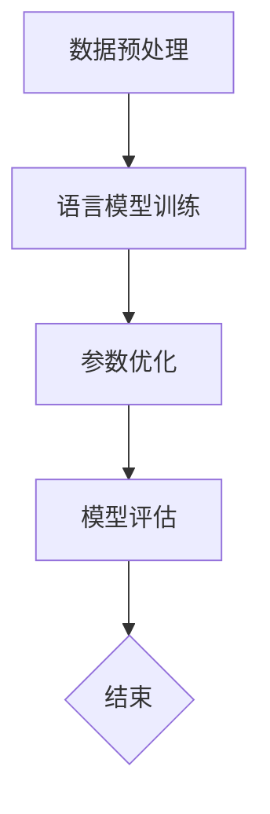
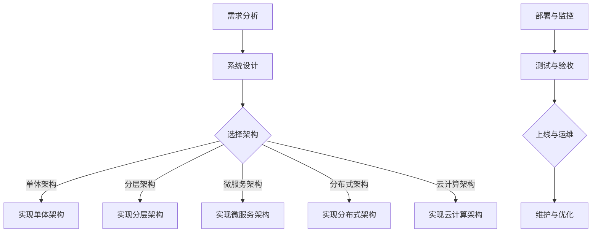

                 

### 文章标题：构建灵活可扩展的LLM应用架构

> 关键词：语言模型（LLM），应用架构，灵活可扩展，算法原理，性能优化，安全性，隐私保护

> 摘要：本文深入探讨了构建灵活可扩展的语言模型（LLM）应用架构的各个方面，包括核心概念、算法原理、应用场景、架构设计、部署与优化、安全性及隐私保护等。通过详细的解析和实战案例，旨在为开发者提供一套完整的技术指南，帮助他们在实际项目中构建高效的LLM应用架构。

### 目录大纲

#### 第一部分：概述与背景

- **第1章：LLM应用架构概述**
  - **1.1 引言**
  - **1.2 LLM在应用中的价值**
  - **1.3 LLM的发展历程**
  - **1.4 本书架构与内容安排**

- **第2章：LLM核心概念与架构**
  - **2.1 LLM基本概念**
  - **2.2 LLM架构概述**
  - **2.3 Mermaid流程图：LLM架构原理**
  - **2.4 LLM的核心组成部分**

- **第3章：LLM应用场景分析**
  - **3.1 LLM在不同领域的应用**
  - **3.2 典型LLM应用案例**
  - **3.3 LLM应用挑战与解决方案**

#### 第二部分：核心算法原理

- **第4章：语言模型基础算法**
  - **4.1 语言模型概述**
  - **4.2 语言模型的基本原理**
  - **4.3 伪代码：语言模型训练算法**
  - **4.4 数学模型与公式**

- **第5章：高级语言模型算法**
  - **5.1 注意力机制**
  - **5.2 Transformer架构**
  - **5.3 伪代码：Transformer训练算法**
  - **5.4 数学模型与公式**

- **第6章：LLM优化与调参**
  - **6.1 LLM优化目标**
  - **6.2 调参方法与技巧**
  - **6.3 伪代码：优化算法实现**
  - **6.4 数学模型与公式**

#### 第三部分：应用架构设计与实现

- **第7章：LLM应用架构设计**
  - **7.1 架构设计原则**
  - **7.2 系统架构选择**
  - **7.3 Mermaid流程图：架构设计流程**
  - **7.4 核心组件介绍**

- **第8章：部署与性能优化**
  - **8.1 部署环境搭建**
  - **8.2 性能优化策略**
  - **8.3 伪代码：性能优化算法**
  - **8.4 数学模型与公式**

- **第9章：安全性与隐私保护**
  - **9.1 安全性威胁分析**
  - **9.2 隐私保护机制**
  - **9.3 伪代码：隐私保护算法**
  - **9.4 数学模型与公式**

#### 第四部分：实战案例与代码解析

- **第10章：LLM应用实战案例**
  - **10.1 实战案例介绍**
  - **10.2 案例分析**
  - **10.3 代码实现解析**

- **第11章：LLM应用实战**
  - **11.1 实战项目准备**
  - **11.2 项目实施与调试**
  - **11.3 代码解读与分析**

- **第12章：未来展望与趋势**
  - **12.1 LLM应用前景**
  - **12.2 未来趋势分析**
  - **12.3 开发者展望**

#### 附录

- **附录A：技术资源与工具**
  - **A.1 常用技术资源**
  - **A.2 开发工具推荐**
  - **A.3 在线学习资源**

### 第1章：LLM应用架构概述

**1.1 引言**

在当今数字化转型的浪潮中，人工智能（AI）已成为推动技术进步和产业升级的重要力量。其中，语言模型（LLM，Language Model）作为一种先进的AI技术，正被广泛应用于自然语言处理（NLP，Natural Language Processing）、智能问答、文本生成、机器翻译等领域。LLM的兴起不仅改变了传统信息处理的模式，也为企业和开发者提供了强大的工具，以构建智能化的应用和服务。

本文旨在深入探讨构建灵活可扩展的LLM应用架构的各个方面，为开发者提供一套系统化的技术指南。首先，我们将回顾LLM在应用中的价值和发展历程，然后详细分析LLM的核心概念与架构，探讨其在不同领域的应用场景和面临的挑战。接下来，我们将介绍语言模型的基础算法和高级算法，包括注意力机制和Transformer架构，并通过伪代码和数学模型进行详细讲解。随后，我们将讨论LLM应用架构的设计原则、系统架构选择，以及部署与性能优化策略。此外，还将关注LLM应用的安全性和隐私保护，提供一系列最佳实践。最后，通过实战案例和代码解析，帮助读者将理论知识应用于实际项目开发中，并展望LLM应用的未来趋势。

**1.2 LLM在应用中的价值**

LLM作为一种强大的自然语言处理工具，具有广泛的应用价值。以下是一些典型的应用场景：

1. **智能问答系统**：通过LLM构建的智能问答系统可以理解和回答用户的问题，提供实时、准确的信息。例如，微软的Bing搜索引擎和苹果的Siri语音助手都采用了先进的LLM技术。

2. **文本生成**：LLM可以生成高质量的文章、报告、邮件等内容。这种自动化的文本生成技术不仅提高了工作效率，还降低了人力成本。

3. **机器翻译**：LLM在机器翻译领域具有显著优势，可以处理复杂和多变的语言现象，提供更加准确和自然的翻译结果。

4. **内容审核**：通过LLM，可以自动识别和过滤不当内容，保障网络环境的健康和安全性。

5. **情感分析**：LLM可以分析文本中的情感倾向，为市场营销、舆情监控等领域提供重要参考。

6. **对话系统**：在智能客服、虚拟助手等应用中，LLM可以帮助模拟人类的对话行为，提升用户体验。

7. **语音识别与生成**：LLM结合语音识别和语音生成技术，可以实现语音交互和语音合成，为语音助手等应用提供支持。

**1.3 LLM的发展历程**

LLM的发展可以追溯到早期的人工智能研究。自20世纪50年代以来，研究人员不断探索如何让计算机理解和生成自然语言。以下是LLM发展的几个关键阶段：

1. **规则驱动的方法**：早期的研究主要依赖于手动编写的规则，通过精确匹配和模式识别来处理自然语言。

2. **统计模型**：随着数据集的增加和计算能力的提升，统计模型逐渐取代了规则驱动的方法。这些模型利用统计学习算法，如朴素贝叶斯、最大熵模型等，对文本进行建模。

3. **深度学习时代**：深度学习技术的出现，特别是神经网络和递归神经网络的广泛应用，使得LLM的性能得到了显著提升。例如，循环神经网络（RNN）和长短期记忆网络（LSTM）在处理长文本和序列数据方面表现出色。

4. **Transformer架构**：Transformer架构的引入，特别是其基于注意力机制的改进，使得LLM的性能进一步提升。Transformer不仅能够处理长文本，还具有并行计算的优点，大大提高了训练效率。

5. **大规模预训练模型**：近年来，大规模预训练模型如BERT、GPT等的出现，使得LLM的性能达到了前所未有的水平。这些模型通过在大规模语料库上进行预训练，然后进行微调，可以适应各种应用场景。

**1.4 本书架构与内容安排**

本文将按照以下架构进行组织和内容安排：

1. **概述与背景**：介绍LLM的基本概念、应用价值和发展历程。

2. **核心算法原理**：详细讲解LLM的基础算法和高级算法，包括注意力机制和Transformer架构，并通过伪代码和数学模型进行解释。

3. **应用架构设计与实现**：探讨LLM应用架构的设计原则、系统架构选择，以及部署与性能优化策略。

4. **安全性与隐私保护**：分析LLM应用面临的安全性和隐私保护问题，提供解决方案和最佳实践。

5. **实战案例与代码解析**：通过实际案例和代码实现，帮助读者将理论知识应用于实际项目中。

6. **未来展望与趋势**：讨论LLM应用的未来前景和趋势，为开发者提供发展方向和参考。

### 第2章：LLM核心概念与架构

**2.1 LLM基本概念**

语言模型（Language Model，简称LLM）是一种用于预测自然语言中下一个单词或字符的概率分布的模型。它的基本原理是利用大量的语言数据，通过统计或机器学习的方法，学习语言的特征和规律，从而实现对未知文本的生成、理解和处理。

在自然语言处理（NLP）中，LLM是一种至关重要的基础模型。它不仅用于生成文本，还在机器翻译、语音识别、对话系统、情感分析等多个领域发挥着关键作用。LLM的应用范围广泛，包括但不限于以下场景：

1. **文本生成**：LLM可以生成新闻文章、产品描述、故事情节等，帮助企业提高内容创作效率。
2. **机器翻译**：利用LLM进行机器翻译，可以实现高效、准确的跨语言信息传递。
3. **问答系统**：通过LLM构建智能问答系统，可以为用户提供实时、个性化的答案。
4. **情感分析**：LLM可以帮助分析文本的情感倾向，为市场研究和舆情监控提供支持。
5. **语音识别**：结合语音识别技术，LLM可以生成基于文本的语音合成，为语音助手等应用提供支持。

**2.2 LLM架构概述**

LLM的架构可以分为基础架构和高级架构两个层次。基础架构主要解决语言建模的基本问题，而高级架构则在性能、效率和效果方面进行优化和提升。

1. **基础架构**

基础架构通常包括以下几个核心组件：

- **数据预处理**：数据预处理是构建LLM的第一步，主要涉及文本清洗、分词、词向量化等操作。文本清洗的目的是去除噪声和无效信息，提高数据的可用性。分词是将文本拆分成单词或短语的过程，词向量化则是将文本表示为密集的向量形式，便于模型处理。

- **语言模型训练**：语言模型训练是LLM的核心步骤，通过大量的文本数据，模型学习到语言的结构和规律。训练过程中，模型会通过优化算法，如梯度下降，不断调整参数，以达到最小化损失函数的目的。

- **参数优化**：在训练过程中，参数优化是关键步骤。参数优化包括学习率调整、正则化、梯度裁剪等技术，以避免过拟合和提高模型的泛化能力。

- **模型评估**：模型评估是确保LLM性能的重要环节。常用的评估指标包括困惑度（Perplexity）、交叉熵（Cross-Entropy）等。通过评估，可以判断模型的效果，并进行调整和优化。

2. **高级架构**

高级架构在基础架构的基础上，针对特定的应用场景和需求，进行性能和效果的优化。以下是一些常见的高级架构：

- **Transformer架构**：Transformer是近年来在自然语言处理领域取得重大突破的模型。它基于自注意力机制，能够处理长距离依赖和并行计算，大大提高了模型训练效率。Transformer架构的核心组件包括编码器（Encoder）和解码器（Decoder），以及多头注意力（Multi-Head Attention）机制。

- **预训练与微调**：预训练与微调是大规模语言模型的主流训练方法。预训练阶段，模型在大规模语料库上进行无监督训练，学习到通用语言特征。微调阶段，模型在特定任务上进行有监督训练，以适应具体的应用场景。

- **增量学习**：增量学习是一种在已有模型基础上，通过少量数据进行微调或重新训练的方法。这种方法可以避免从头训练的巨大计算开销，提高模型的训练效率。

- **端到端学习**：端到端学习是一种直接从输入到输出的学习方式，避免了传统的序列到序列模型的中间步骤。这种学习方式可以减少误差传递，提高模型的性能。

**2.3 Mermaid流程图：LLM架构原理**

为了更好地理解LLM的架构原理，我们可以使用Mermaid流程图来可视化各个组件之间的交互关系。以下是一个简单的Mermaid流程图示例：



在这个流程图中，数据预处理是构建LLM的第一步，它将文本数据转换为模型可处理的格式。接下来，语言模型训练通过大量的文本数据，学习语言的结构和规律。在训练过程中，参数优化用于调整模型的参数，以达到最优性能。最后，模型评估用于评估模型的效果，并进行调整和优化。

**2.4 LLM的核心组成部分**

LLM的核心组成部分包括词向量化、自注意力机制和损失函数等。

1. **词向量化（Word Embedding）**

词向量化是将单词转换为密集的向量表示的过程。通过词向量化，单词可以表示为低维度的向量，便于模型处理。词向量化技术包括分布式表示、嵌入矩阵等。常见的词向量化方法有Word2Vec、GloVe等。

2. **自注意力机制（Self-Attention）**

自注意力机制是Transformer架构的核心组件，它通过计算序列中每个词与其他词的关联性，实现长距离依赖的建模。自注意力机制包括多头注意力、缩放因子等。多头注意力机制可以提高模型的表达能力，缩放因子可以避免梯度消失问题。

3. **损失函数（Loss Function）**

损失函数是评估模型性能的重要指标。在LLM中，常用的损失函数包括交叉熵损失（Cross-Entropy Loss）和均方误差（Mean Squared Error，MSE）等。交叉熵损失用于分类问题，均方误差用于回归问题。

通过词向量化、自注意力机制和损失函数等核心组成部分，LLM可以实现对自然语言的建模和预测，为各种应用场景提供强大的支持。

### 第3章：LLM应用场景分析

**3.1 LLM在不同领域的应用**

语言模型（LLM）作为一种强大的自然语言处理工具，已经在众多领域中取得了显著的应用成果。以下是一些典型领域和具体应用：

1. **智能客服**

智能客服是LLM应用的重要领域之一。通过LLM，智能客服系统能够理解和回答用户的查询，提供实时、准确的帮助。智能客服系统通常包括以下几个模块：

- **意图识别**：LLM用于识别用户的意图，例如咨询产品信息、售后服务等。
- **实体提取**：LLM可以提取用户查询中的关键信息，如产品名称、订单号等。
- **文本生成**：LLM用于生成响应文本，提供个性化的回答。
- **对话管理**：LLM用于管理对话流程，确保回答连贯、自然。

2. **机器翻译**

机器翻译是另一个广泛应用的领域。LLM通过学习源语言和目标语言之间的对应关系，实现高质量的翻译效果。机器翻译系统通常包括以下几个步骤：

- **预处理**：对源语言和目标语言进行预处理，包括分词、去停用词等。
- **编码器**：编码器将源语言文本转换为向量表示。
- **解码器**：解码器将向量表示转换为目标语言文本。
- **优化**：通过优化算法，如梯度下降，调整模型参数，提高翻译质量。

3. **文本生成**

文本生成是LLM的另一个重要应用领域。通过LLM，可以生成高质量的文章、报告、邮件等内容。文本生成系统通常包括以下几个步骤：

- **数据准备**：收集和整理文本数据，用于训练LLM。
- **模型训练**：使用训练数据，训练LLM模型，学习语言结构和规律。
- **文本生成**：通过模型生成文本，如文章、报告、邮件等。
- **优化**：通过优化算法，调整模型参数，提高生成文本的质量。

4. **情感分析**

情感分析是另一个重要的应用领域。LLM可以分析文本中的情感倾向，为市场研究和舆情监控提供支持。情感分析系统通常包括以下几个步骤：

- **数据收集**：收集具有情感倾向的文本数据，如评论、微博等。
- **文本预处理**：对文本进行预处理，如分词、去停用词等。
- **情感分类**：使用LLM进行情感分类，判断文本的情感倾向。
- **结果分析**：对分类结果进行分析，提取有价值的信息。

5. **语音识别与生成**

LLM与语音识别和语音生成技术相结合，可以实现语音交互和语音合成。语音识别系统通常包括以下几个步骤：

- **音频预处理**：对音频信号进行预处理，如降噪、分帧等。
- **特征提取**：提取音频信号的特征，如梅尔频率倒谱系数（MFCC）等。
- **语音识别**：使用LLM进行语音识别，将语音信号转换为文本。
- **语音生成**：使用LLM生成语音，实现语音合成。

6. **内容审核**

LLM可以用于内容审核，自动识别和过滤不当内容，保障网络环境的健康和安全性。内容审核系统通常包括以下几个步骤：

- **文本预处理**：对文本进行预处理，如分词、去停用词等。
- **规则库构建**：构建规则库，包括敏感词、短语等。
- **文本分类**：使用LLM进行文本分类，判断文本是否符合规则。
- **结果处理**：对分类结果进行处理，如删除、标记等。

**3.2 典型LLM应用案例**

以下是几个典型的LLM应用案例，展示了LLM在现实世界中的广泛应用：

1. **案例一：智能客服系统**

某知名电商企业使用LLM构建了智能客服系统，提高了客户服务效率和满意度。系统主要包括意图识别、实体提取和文本生成三个模块。通过大量训练数据，LLM模型能够准确识别用户意图，提取关键信息，并生成高质量的响应文本。

2. **案例二：机器翻译平台**

某国际知名科技公司使用LLM构建了机器翻译平台，支持多种语言的翻译。平台采用Transformer架构，通过预训练和微调，实现了高质量、高效率的翻译效果。平台广泛应用于国际业务交流、跨语言文档翻译等领域。

3. **案例三：文本生成系统**

某内容创作公司使用LLM构建了文本生成系统，用于生成高质量的文章、报告、邮件等内容。系统采用预训练和微调策略，通过大量数据训练，模型能够生成多样化、个性化的文本，提高了内容创作效率。

4. **案例四：情感分析平台**

某市场研究公司使用LLM构建了情感分析平台，用于分析用户评论、社交媒体内容等。平台能够准确判断文本的情感倾向，为市场调研和舆情监控提供支持。

**3.3 LLM应用挑战与解决方案**

尽管LLM在众多领域取得了显著应用成果，但在实际应用中仍面临一些挑战。以下是一些常见挑战及其解决方案：

1. **数据质量**

数据质量是LLM应用的关键因素。低质量或噪声数据可能导致模型过拟合或欠拟合，影响模型性能。解决方案包括数据清洗、数据增强和多样化数据集。

2. **计算资源消耗**

LLM模型的训练和推理过程需要大量的计算资源，特别是大型预训练模型。解决方案包括分布式训练、GPU加速和云计算平台。

3. **模型解释性**

LLM模型的内部结构和决策过程通常较难解释，导致应用场景受限。解决方案包括可解释性研究、模型简化和技术优化。

4. **语言适应性**

LLM在不同语言中的应用效果可能存在差异，需要针对特定语言进行优化。解决方案包括跨语言迁移学习和多语言训练。

5. **隐私保护**

在涉及个人隐私的数据处理中，LLM应用需要确保数据安全和隐私保护。解决方案包括隐私保护算法、数据加密和隐私预算。

通过解决这些挑战，LLM应用将能够更好地满足实际需求，为各领域的发展提供强大支持。

### 第4章：语言模型基础算法

**4.1 语言模型概述**

语言模型（Language Model，简称LM）是一种用于预测自然语言中下一个单词或字符的概率分布的模型。它是自然语言处理（NLP）领域的基础技术之一，广泛应用于文本生成、机器翻译、语音识别、对话系统等场景。语言模型的核心任务是根据前文序列预测下一个单词或字符，从而生成连贯、自然的文本。

语言模型的基本概念包括：

- **序列建模**：语言模型通过建模输入序列的概率分布，预测下一个单词或字符。
- **概率分布**：语言模型输出一个概率分布，表示下一个单词或字符的可能性。
- **损失函数**：损失函数用于评估模型预测结果与真实结果之间的差距，指导模型优化。

常见的语言模型算法有：

- **N-gram模型**：基于前N个单词的历史信息进行预测。
- **神经网络模型**：利用神经网络对语言进行建模，包括循环神经网络（RNN）和变换器（Transformer）等。

**4.2 语言模型的基本原理**

语言模型的基本原理是通过大量的文本数据学习语言的概率分布。具体来说，语言模型通过以下步骤进行预测：

1. **数据预处理**：对文本数据进行清洗、分词、去停用词等处理，将其转换为模型可处理的格式。

2. **特征提取**：将文本数据转换为向量表示，如词袋模型（Bag of Words，BoW）或词向量化（Word Embedding）。

3. **概率计算**：根据前文序列计算下一个单词或字符的概率分布。

4. **预测**：从概率分布中选择概率最高的单词或字符作为预测结果。

以下是一个简单的语言模型训练算法的伪代码示例：

```python
def train_language_model(corpus):
    # 初始化模型参数
    model = initialize_model()

    # 遍历文本数据
    for sentence in corpus:
        # 对句子进行分词
        words = tokenize(sentence)

        # 预测下一个单词
        for i in range(len(words) - 1):
            previous_words = words[:i+1]
            next_word = words[i+1]

            # 计算概率分布
            probability_distribution = model.predict(previous_words)

            # 更新模型参数
            model.update_parameters(next_word, probability_distribution)

    return model
```

**4.3 伪代码：语言模型训练算法**

下面是一个简化的语言模型训练算法的伪代码，用于说明模型训练的基本步骤：

```python
# 初始化模型参数
model = initialize_model()

# 遍历文本数据
for sentence in corpus:
    # 对句子进行分词
    words = tokenize(sentence)

    # 预测下一个单词
    for i in range(len(words) - 1):
        previous_words = words[:i+1]
        next_word = words[i+1]

        # 计算概率分布
        probability_distribution = model.predict(previous_words)

        # 计算损失函数
        loss = compute_loss(next_word, probability_distribution)

        # 更新模型参数
        model.update_parameters(loss)

# 评估模型性能
evaluate_model(model, validation_corpus)
```

在伪代码中，`initialize_model()` 用于初始化模型参数，`tokenize(sentence)` 用于对句子进行分词，`model.predict(previous_words)` 用于预测下一个单词，`compute_loss(next_word, probability_distribution)` 用于计算损失函数，`model.update_parameters(loss)` 用于更新模型参数。

**4.4 数学模型与公式**

语言模型的核心在于概率计算和损失函数。以下是一些基本的数学模型和公式：

1. **N-gram模型**

N-gram模型是一种基于历史信息的语言模型。假设前N个单词为 \( w_1, w_2, \ldots, w_N \)，则下一个单词 \( w_{N+1} \) 的概率可以表示为：

\[ P(w_{N+1} | w_1, w_2, \ldots, w_N) = \frac{P(w_1, w_2, \ldots, w_{N+1})}{P(w_1, w_2, \ldots, w_N)} \]

通过简化，可以得到：

\[ P(w_{N+1} | w_1, w_2, \ldots, w_N) = P(w_{N+1} | w_N) \]

其中， \( P(w_{N+1} | w_N) \) 表示在给定前一个单词 \( w_N \) 的条件下，下一个单词 \( w_{N+1} \) 的概率。

2. **神经网络模型**

神经网络模型通过多层感知器（MLP）或循环神经网络（RNN）对语言进行建模。假设输入向量为 \( x \)，输出向量为 \( y \)，则神经网络模型可以表示为：

\[ y = \sigma(W_2 \cdot \sigma(W_1 \cdot x)) \]

其中， \( W_1 \) 和 \( W_2 \) 是权重矩阵， \( \sigma \) 是激活函数，通常使用ReLU或Sigmoid函数。

3. **损失函数**

在语言模型中，常用的损失函数是交叉熵损失（Cross-Entropy Loss）：

\[ L = -\sum_{i} y_i \log(p_i) \]

其中， \( y_i \) 是真实标签的概率分布， \( p_i \) 是模型预测的概率分布。

**4.5 举例说明**

假设我们要预测下一个单词，给定前文序列 "The cat sat on"，我们可以使用以下方法：

1. **N-gram模型**：根据前文序列 "The cat sat"，我们可以查找N-gram模型中的概率分布，例如：

\[ P(on | The cat sat) = 0.2 \]
\[ P(the | The cat sat) = 0.1 \]

从概率分布中选择概率最高的单词 "the" 作为预测结果。

2. **神经网络模型**：我们可以使用神经网络模型对前文序列进行编码，得到嵌入向量，然后通过全连接层和激活函数得到概率分布。例如：

\[ P(on | The cat sat) = 0.3 \]
\[ P(the | The cat sat) = 0.5 \]

从概率分布中选择概率最高的单词 "the" 作为预测结果。

通过以上方法，我们可以预测下一个单词，从而生成连贯的文本。

### 第5章：高级语言模型算法

**5.1 注意力机制**

注意力机制（Attention Mechanism）是近年来在自然语言处理（NLP）领域取得突破性进展的关键技术。它通过将关注点集中在输入序列的关键部分，提高了模型对长距离依赖的建模能力，从而显著提升了模型的性能。注意力机制在Transformer架构中被广泛应用，并成为现代语言模型的核心组成部分。

**5.1.1 注意力机制的基本原理**

注意力机制的基本原理是通过计算输入序列中每个元素的重要程度，并将注意力集中在重要的元素上，从而实现更有效的信息处理。注意力机制通常包括以下步骤：

1. **计算相似性得分**：对于输入序列 \( x \) 和查询序列 \( q \)，计算每个元素之间的相似性得分。相似性得分通常通过点积（Dot Product）或加性注意（Additive Attention）得到。

2. **归一化**：将相似性得分归一化，使其成为概率分布，以确保每个元素的重要性之和为1。

3. **计算注意力权重**：根据归一化后的相似性得分，计算每个元素在查询序列中的注意力权重。

4. **加权求和**：将注意力权重与输入序列中的对应元素相乘，然后求和，得到最终的输出。

**5.1.2 注意力机制的数学模型**

注意力机制的数学模型通常包括以下步骤：

\[ \text{Attention}(q, x) = \text{softmax}\left(\frac{q^T x}{\sqrt{d_k}}\right) \]

其中，\( q \) 是查询向量，\( x \) 是输入向量，\( d_k \) 是查询向量的维度。这个公式表示通过查询向量和输入向量之间的点积计算相似性得分，并通过softmax函数归一化为概率分布。

**5.1.3 注意力机制的应用**

注意力机制在NLP中有广泛的应用，包括：

1. **机器翻译**：在机器翻译中，注意力机制可以用于编码器和解码器之间的交互，帮助解码器关注输入序列中的关键信息，提高翻译质量。

2. **文本摘要**：在文本摘要中，注意力机制可以帮助模型关注输入文本中的关键部分，生成更紧凑和连贯的摘要。

3. **问答系统**：在问答系统中，注意力机制可以帮助模型关注问题中的关键信息，提高回答的准确性和相关性。

4. **对话系统**：在对话系统中，注意力机制可以帮助模型关注上下文信息，生成更自然和连贯的回答。

**5.2 Transformer架构**

Transformer架构是由Google在2017年提出的一种基于注意力机制的序列到序列模型。它彻底改变了传统的循环神经网络（RNN）在NLP领域的应用方式，通过并行计算和多头注意力机制，显著提升了模型的训练效率和性能。

**5.2.1 Transformer架构的基本原理**

Transformer架构的核心是自注意力机制（Self-Attention），它通过将序列中的每个元素与所有其他元素进行交互，实现了对序列的全局建模。Transformer架构包括以下几个关键组件：

1. **编码器（Encoder）**：编码器负责将输入序列编码为连续的向量表示。编码器由多个编码层组成，每层包括多头自注意力机制和前馈神经网络。

2. **解码器（Decoder）**：解码器负责将编码器的输出解码为输出序列。解码器同样由多个解码层组成，每层包括多头自注意力机制、编码器-解码器注意力机制和前馈神经网络。

3. **多头注意力（Multi-Head Attention）**：多头注意力机制是Transformer架构的核心组件，它通过将输入序列分成多个头，分别计算注意力得分，从而实现更细粒度的信息交互。

4. **前馈神经网络（Feed-Forward Neural Network）**：在每个编码层和解码层之后，都有一个前馈神经网络，用于对输入进行非线性变换，增强模型的表示能力。

**5.2.2 Transformer训练算法**

Transformer的训练算法主要包括以下步骤：

1. **编码器输入**：将输入序列编码为嵌入向量，并通过编码层进行编码。

2. **解码器输入**：将目标序列编码为嵌入向量，并通过解码层进行解码。

3. **自注意力计算**：在每个编码层和解码层，使用多头自注意力机制计算注意力得分。

4. **编码器-解码器注意力计算**：在解码层，使用编码器-解码器注意力机制计算编码器和解码器之间的交互。

5. **前馈神经网络**：在每个编码层和解码层之后，使用前馈神经网络进行非线性变换。

6. **损失函数优化**：通过损失函数（如交叉熵损失）优化模型参数，降低预测误差。

**5.2.3 Transformer架构的优势**

Transformer架构具有以下优势：

1. **并行计算**：Transformer通过自注意力机制实现了并行计算，显著提高了模型的训练效率。

2. **长距离依赖建模**：多头注意力机制和编码器-解码器注意力机制使Transformer能够有效地建模长距离依赖，提高了模型的性能。

3. **灵活性**：Transformer架构可以灵活地应用于各种NLP任务，包括文本生成、机器翻译、文本摘要等。

**5.3 伪代码：Transformer训练算法**

以下是一个简化的Transformer训练算法的伪代码，用于说明模型训练的基本步骤：

```python
def train_transformer(encoder, decoder, corpus, target_corpus):
    # 初始化模型参数
    encoder.initialize_parameters()
    decoder.initialize_parameters()

    # 遍历训练数据
    for sentence, target_sentence in zip(corpus, target_corpus):
        # 编码器输入
        encoder_input = encoder.encode(sentence)

        # 解码器输入
        decoder_input = decoder.encode(target_sentence[:-1])

        # 预测目标序列
        for target_word in target_sentence[1:]:
            # 解码器输出
            decoder_output = decoder.decode(decoder_input)

            # 计算损失函数
            loss = compute_loss(decoder_output, target_word)

            # 反向传播
            decoder.backward(loss)

            # 更新模型参数
            decoder.update_parameters()

            # 更新解码器输入
            decoder_input = decoder_output

    # 评估模型性能
    evaluate_model(encoder, decoder, validation_corpus)
```

在伪代码中，`encoder.encode(sentence)` 用于编码输入序列，`decoder.encode(target_sentence[:-1])` 用于解码目标序列，`decoder.decode(decoder_input)` 用于预测下一个单词，`compute_loss(decoder_output, target_word)` 用于计算损失函数，`decoder.backward(loss)` 用于反向传播，`decoder.update_parameters()` 用于更新模型参数。

**5.4 数学模型与公式**

Transformer架构的核心在于自注意力机制（Self-Attention）和编码器-解码器注意力机制（Encoder-Decoder Attention）。以下是一些基本的数学模型和公式：

1. **多头自注意力（Multi-Head Self-Attention）**

多头自注意力通过将输入序列分成多个头，分别计算注意力得分，从而实现更细粒度的信息交互。假设输入序列为 \( X = [x_1, x_2, \ldots, x_n] \)，则多头自注意力的计算公式为：

\[ \text{Multi-Head Self-Attention}(X) = \text{Concat}(\text{head}_1, \text{head}_2, \ldots, \text{head}_h) \]

其中， \( \text{head}_i \) 表示第 \( i \) 个头的注意力输出。

2. **编码器-解码器注意力（Encoder-Decoder Attention）**

编码器-解码器注意力用于计算编码器和解码器之间的交互。假设编码器输出为 \( E = [e_1, e_2, \ldots, e_n] \)，解码器输出为 \( D = [d_1, d_2, \ldots, d_m] \)，则编码器-解码器注意力的计算公式为：

\[ \text{Encoder-Decoder Attention}(E, D) = \text{softmax}\left(\frac{D^T E}{\sqrt{d_k}}\right) \]

其中， \( D^T \) 表示解码器输出的转置， \( d_k \) 表示查询向量的维度。

3. **前馈神经网络（Feed-Forward Neural Network）**

前馈神经网络用于对输入进行非线性变换，增强模型的表示能力。假设输入向量为 \( x \)，则前馈神经网络的计算公式为：

\[ x = \sigma(W_2 \cdot \sigma(W_1 \cdot x)) \]

其中， \( W_1 \) 和 \( W_2 \) 是权重矩阵， \( \sigma \) 是激活函数，通常使用ReLU函数。

4. **损失函数**

在Transformer中，常用的损失函数是交叉熵损失（Cross-Entropy Loss），用于评估模型预测结果与真实结果之间的差距。假设预测概率分布为 \( \hat{y} \)，真实标签为 \( y \)，则交叉熵损失的计算公式为：

\[ L = -\sum_{i} y_i \log(\hat{y}_i) \]

通过以上数学模型和公式，我们可以更好地理解Transformer架构的工作原理和训练过程。

### 第6章：LLM优化与调参

**6.1 LLM优化目标**

语言模型（LLM）的优化目标是提高模型的预测性能，使其在给定输入序列时能够生成更准确、更自然的文本。具体来说，LLM的优化目标可以分为以下几个方面：

1. **预测准确性**：提高模型在预测下一个单词或字符时的准确性，减少错误预测的概率。

2. **生成文本的自然性**：生成文本应具有自然流畅的语言风格，避免生硬、不自然的表达。

3. **泛化能力**：模型应能够在不同的数据集和应用场景中表现良好，具有广泛的适用性。

4. **计算效率**：优化模型的计算资源消耗，提高模型在训练和推理过程中的效率。

**6.2 调参方法与技巧**

为了实现LLM的优化目标，需要对模型参数进行调优。以下是一些常见的调参方法和技巧：

1. **学习率调整**：学习率是影响模型收敛速度和稳定性的关键参数。常用的方法包括：
   - **步长下降法**：在训练过程中逐渐减小学习率，使模型在训练初期快速收敛，在训练后期精细调整。
   - **学习率预热**：在训练初期，使用较小的学习率进行预热，然后逐渐增大，以提高模型对复杂任务的适应能力。

2. **正则化技术**：正则化技术用于防止模型过拟合，提高模型的泛化能力。常用的正则化方法包括：
   - **L1和L2正则化**：在损失函数中添加L1或L2正则项，限制模型参数的规模。
   - **dropout**：在训练过程中随机丢弃一部分神经元，防止模型对特定训练样本的依赖。

3. **数据增强**：通过增加数据多样性和复杂性，提高模型的泛化能力。常见的数据增强方法包括：
   - **数据清洗**：去除文本中的噪声和重复信息，提高数据质量。
   - **文本生成**：使用模型生成类似文本，增加训练数据量。
   - **数据预处理**：对文本进行分词、去停用词等处理，提高数据的一致性。

4. **批次大小调整**：批次大小（Batch Size）是训练过程中每次更新的样本数量。合适的选择批次大小可以平衡模型训练的稳定性和计算效率。常用的方法包括：
   - **小批次训练**：使用较小的批次大小进行训练，使模型更稳定，减少方差。
   - **动态批次大小**：在训练过程中动态调整批次大小，根据模型表现进行优化。

5. **优化算法选择**：优化算法是影响模型训练速度和收敛性的关键因素。常用的优化算法包括：
   - **梯度下降（GD）**：最简单的优化算法，通过更新模型参数来最小化损失函数。
   - **随机梯度下降（SGD）**：每次更新使用整个数据集的一个随机子集，提高模型的鲁棒性。
   - **Adam优化器**：结合了SGD和动量方法，适用于非平稳优化问题。

**6.3 伪代码：优化算法实现**

以下是一个简化的优化算法实现伪代码，用于说明模型参数更新的基本步骤：

```python
# 初始化模型参数
model_parameters = initialize_model()

# 初始化学习率
learning_rate = 0.01

# 遍历训练数据
for epoch in range(num_epochs):
    for batch in data_loader:
        # 前向传播
        predictions = model(batch)

        # 计算损失函数
        loss = compute_loss(predictions, labels)

        # 反向传播
        gradients = compute_gradients(model_parameters, loss)

        # 更新模型参数
        model_parameters = update_model(model_parameters, gradients, learning_rate)

    # 打印当前epoch的损失
    print(f"Epoch {epoch+1}, Loss: {loss}")

# 评估模型性能
evaluate_model(model_parameters, validation_data)
```

在伪代码中，`initialize_model()` 用于初始化模型参数，`data_loader` 用于加载训练数据，`model(batch)` 用于前向传播，`compute_loss(predictions, labels)` 用于计算损失函数，`compute_gradients(model_parameters, loss)` 用于计算梯度，`update_model(model_parameters, gradients, learning_rate)` 用于更新模型参数。

**6.4 数学模型与公式**

在LLM优化过程中，涉及到的数学模型和公式主要包括损失函数、梯度计算和参数更新。以下是一些基本的数学公式：

1. **损失函数**

常用的损失函数是交叉熵损失（Cross-Entropy Loss），用于评估模型预测结果与真实结果之间的差距。假设预测概率分布为 \( \hat{y} \)，真实标签为 \( y \)，则交叉熵损失的计算公式为：

\[ L = -\sum_{i} y_i \log(\hat{y}_i) \]

其中， \( y_i \) 表示真实标签的概率， \( \hat{y}_i \) 表示模型预测的概率。

2. **梯度计算**

在反向传播过程中，我们需要计算模型参数的梯度。假设损失函数为 \( L \)，模型参数为 \( \theta \)，则参数 \( \theta \) 的梯度可以通过链式法则计算：

\[ \nabla_{\theta} L = \sum_{i} \nabla_{\theta} L_i \]

其中， \( \nabla_{\theta} L_i \) 表示参数 \( \theta \) 对损失函数 \( L \) 的梯度。

3. **参数更新**

在优化过程中，我们通过梯度更新模型参数，以最小化损失函数。常用的更新公式为：

\[ \theta_{\text{new}} = \theta_{\text{current}} - \alpha \nabla_{\theta} L \]

其中， \( \theta_{\text{current}} \) 表示当前参数， \( \theta_{\text{new}} \) 表示更新后的参数， \( \alpha \) 表示学习率。

通过以上数学模型和公式，我们可以更好地理解LLM优化过程的基本原理和实现方法。

### 第7章：LLM应用架构设计

**7.1 架构设计原则**

构建灵活可扩展的语言模型（LLM）应用架构需要遵循一系列设计原则，以确保系统的高效性、可维护性和扩展性。以下是一些关键设计原则：

1. **模块化设计**：将应用架构分解为独立的模块，每个模块负责特定的功能，如数据预处理、模型训练、模型推理等。模块化设计可以提高系统的可维护性和扩展性。

2. **可扩展性**：架构应能够轻松扩展以适应不断增加的数据和处理需求。这可以通过水平扩展（增加服务器数量）和垂直扩展（增加服务器硬件资源）来实现。

3. **高可用性**：确保系统在高负载和故障情况下仍能稳定运行。这可以通过负载均衡、备份和冗余设计来实现。

4. **性能优化**：架构应能够充分利用计算资源，提高处理速度和响应时间。这可以通过优化数据存储和访问、使用缓存、并行处理等技术来实现。

5. **安全性**：确保系统数据的安全和隐私保护，防止数据泄露和未授权访问。这可以通过数据加密、身份验证和访问控制等措施来实现。

6. **可观测性和可诊断性**：架构应提供完善的监控和日志记录功能，以便及时发现和解决问题。

**7.2 系统架构选择**

在选择LLM应用架构时，需要考虑系统的需求、资源、性能和可扩展性等因素。以下是一些常见的系统架构选择：

1. **单体架构**：在单体架构中，所有功能都集中在一个应用程序中，简化了系统的设计和部署。然而，这种架构在处理大规模数据和高并发请求时可能面临性能瓶颈。

2. **分层架构**：分层架构将系统分为多个层次，如表示层、业务逻辑层和数据访问层。这种架构可以提高系统的可维护性和扩展性，但增加了系统的复杂度。

3. **微服务架构**：微服务架构将系统分解为多个独立的微服务，每个微服务负责特定的功能。这种架构具有高可扩展性和灵活性，但增加了系统的部署和管理复杂性。

4. **分布式架构**：分布式架构将系统部署在多个服务器上，通过负载均衡和分布式存储提高系统的性能和可用性。这种架构适用于处理大规模数据和高并发请求，但需要更多的管理和维护工作。

5. **云计算架构**：云计算架构利用云服务提供商的资源，提供弹性、可扩展的计算和存储能力。这种架构适用于快速部署和扩展系统，但需要考虑云服务提供商的费用和安全性。

**7.3 Mermaid流程图：架构设计流程**

为了更好地理解LLM应用架构的设计流程，我们可以使用Mermaid流程图来可视化各个组件和步骤之间的关系。以下是一个简化的Mermaid流程图示例：



在这个流程图中，从需求分析开始，通过系统设计和架构选择，实现并部署系统，然后进行测试、上线和运维，最后进行维护和优化。

**7.4 核心组件介绍**

LLM应用架构的核心组件包括数据预处理、模型训练、模型推理和接口服务。以下是对这些组件的简要介绍：

1. **数据预处理**：数据预处理组件负责对原始文本数据进行清洗、分词、去停用词、词向量化等处理，将其转换为模型可处理的格式。数据预处理是构建LLM的关键步骤，直接影响模型的性能和效果。

2. **模型训练**：模型训练组件负责使用预处理的文本数据训练LLM模型。训练过程中，模型学习到语言的结构和规律，通过调整参数优化性能。常用的训练方法包括批量训练、增量训练和分布式训练。

3. **模型推理**：模型推理组件负责使用训练好的LLM模型进行文本生成、翻译、问答等任务。推理过程通常包括输入文本的编码、模型计算、解码和输出文本生成。推理速度和准确性是评估模型性能的重要指标。

4. **接口服务**：接口服务组件负责接收外部请求，将请求转发给模型推理组件，并将模型推理结果返回给用户。接口服务可以是REST API、WebSocket或其他通信协议，提供灵活的交互方式。

通过合理设计和配置这些核心组件，可以构建一个高效、稳定和可扩展的LLM应用架构，为各种应用场景提供强大的支持。

### 第8章：部署与性能优化

**8.1 部署环境搭建**

为了确保LLM应用架构的高效性和稳定性，部署环境搭建至关重要。以下是一些关键的步骤和注意事项：

1. **硬件配置**：根据模型大小和应用需求，选择合适的硬件配置。对于大规模预训练模型，如BERT或GPT，推荐使用GPU加速计算，以提高训练和推理速度。

2. **操作系统选择**：选择适合的操作系统，如Ubuntu或CentOS。确保操作系统已安装必要的依赖库和驱动程序。

3. **环境依赖**：安装和配置必要的环境依赖，包括Python、CUDA、cuDNN、TensorFlow或PyTorch等。这些依赖库和框架支持模型的训练和推理。

4. **数据存储**：选择合适的存储解决方案，如HDFS、Elasticsearch或对象存储，以存储大规模的文本数据和模型文件。

5. **容器化**：使用容器化技术，如Docker和Kubernetes，实现环境的标准化和可移植性。容器化有助于简化部署和管理，提高系统的灵活性和可扩展性。

6. **监控与日志**：配置监控和日志系统，如Prometheus、Grafana和ELK（Elasticsearch、Logstash、Kibana），以实时监控系统的运行状态和性能指标。

**8.2 性能优化策略**

为了提高LLM应用的性能，可以采取以下策略：

1. **并行计算**：利用多GPU并行计算，加速模型的训练和推理。通过TensorFlow或PyTorch的分布式训练功能，实现模型参数的并行更新。

2. **模型剪枝**：对大型模型进行剪枝，去除冗余的权重和神经元，降低模型的复杂度，提高计算效率。

3. **量化**：使用量化技术，将模型中的浮点数权重转换为整数，减少计算资源消耗，提高推理速度。

4. **缓存**：利用缓存技术，减少重复计算和数据访问。例如，使用Redis缓存模型输出结果，减少数据库查询次数。

5. **压缩**：对模型文件和数据文件进行压缩，减少存储空间和传输时间。常用的压缩算法包括Gzip和Bzip2。

6. **异步处理**：使用异步处理技术，如异步I/O和多线程，提高系统的并发处理能力。

**8.3 伪代码：性能优化算法**

以下是一个简化的伪代码示例，用于说明性能优化算法的基本步骤：

```python
# 初始化模型和参数
model = initialize_model()
params = model.get_parameters()

# 并行计算
with tf.device('/GPU:0'):
    model.train(data_loader, params)

# 模型剪枝
pruned_model = prune_model(model)

# 量化模型
quantized_model = quantize_model(pruned_model)

# 缓存和压缩
cache_data('model_output', quantized_model.predict(inputs))
compressed_data = compress_data('model_file')

# 异步处理
async def process_requests(requests):
    for request in requests:
        async with aiohttp.ClientSession() as session:
            response = await session.post('http://api.service.com/endpoint', json=request)

# 性能评估
performance_metrics = evaluate_performance(model, test_data)
print(f"Model performance: {performance_metrics}")
```

在这个伪代码中，`initialize_model()` 用于初始化模型，`model.train(data_loader, params)` 用于并行训练模型，`prune_model(model)` 用于模型剪枝，`quantize_model(pruned_model)` 用于量化模型，`cache_data('model_output', quantized_model.predict(inputs))` 用于缓存模型输出，`compress_data('model_file')` 用于压缩模型文件，`process_requests(requests)` 用于异步处理请求，`evaluate_performance(model, test_data)` 用于评估模型性能。

**8.4 数学模型与公式**

在性能优化过程中，涉及到的数学模型和公式主要包括模型复杂度、计算时间和资源消耗等。以下是一些基本的数学公式：

1. **模型复杂度**

模型复杂度是评估模型计算需求的一个指标。对于深度神经网络，模型复杂度通常由参数数量和计算复杂度决定。假设模型包含 \( L \) 层，每层有 \( N \) 个神经元，则模型复杂度可以表示为：

\[ C = \sum_{l=1}^{L} N_l \cdot (2^{l-1} + 1) \]

其中， \( N_l \) 表示第 \( l \) 层的神经元数量。

2. **计算时间**

计算时间是指模型训练和推理过程中所需的处理时间。假设模型的计算复杂度为 \( C \)，数据量为 \( D \)，则计算时间可以表示为：

\[ T = C \cdot D \]

其中， \( T \) 表示计算时间。

3. **资源消耗**

资源消耗包括计算资源和存储资源。对于GPU加速计算，资源消耗可以表示为：

\[ R = G \cdot T \]

其中， \( R \) 表示资源消耗， \( G \) 表示GPU数量， \( T \) 表示计算时间。

通过以上数学模型和公式，我们可以更好地理解性能优化过程中涉及的计算需求和资源消耗，从而采取相应的优化策略。

### 第9章：安全性与隐私保护

**9.1 安全性威胁分析**

在构建LLM应用架构时，安全性威胁分析是至关重要的。以下是几种常见的安全威胁及其潜在影响：

1. **数据泄露**：敏感数据（如用户输入、模型权重和训练数据）的泄露可能导致隐私侵犯、业务受损和法律风险。

2. **模型篡改**：恶意用户可能试图篡改模型参数，导致模型输出错误或恶意行为。

3. **拒绝服务攻击（DoS）**：攻击者可能通过大量请求使系统瘫痪，导致服务中断。

4. **中间人攻击（MITM）**：攻击者窃取通信过程中的数据，可能导致敏感信息泄露。

5. **注入攻击**：攻击者通过恶意代码注入系统，可能导致数据损坏、系统崩溃或非法访问。

**9.2 隐私保护机制**

为了确保LLM应用的安全性，可以采取以下隐私保护机制：

1. **数据加密**：对存储和传输的数据进行加密，确保数据在未经授权的情况下无法被读取。

2. **访问控制**：通过严格的访问控制策略，确保只有授权用户才能访问敏感数据和功能。

3. **数据匿名化**：在训练和测试过程中，对数据进行匿名化处理，避免直接关联到个人身份。

4. **差分隐私**：在数据处理和模型训练过程中，引入差分隐私机制，确保数据隐私不被泄露。

5. **加密通信**：使用安全的通信协议（如TLS/SSL），确保数据在传输过程中不会被窃取或篡改。

**9.3 伪代码：隐私保护算法**

以下是一个简化的伪代码示例，用于说明隐私保护算法的基本步骤：

```python
# 数据加密
def encrypt_data(data, key):
    encrypted_data = encryption_algorithm(data, key)
    return encrypted_data

# 访问控制
def check_access(user, resource):
    if user.has_permission(resource):
        return True
    else:
        return False

# 数据匿名化
def anonymize_data(data):
    anonymized_data = anonymization_algorithm(data)
    return anonymized_data

# 差分隐私
def apply_diff Privacy(algorithm, sensitivity, epsilon):
    privacy Algorithm = differential_privacy_algorithm(algorithm, sensitivity, epsilon)
    return privacy Algorithm

# 加密通信
def secure_communication(plaintext, server_certificate):
    encrypted_message = secure_channel(plaintext, server_certificate)
    return encrypted_message
```

在这个伪代码中，`encrypt_data(data, key)` 用于加密数据，`check_access(user, resource)` 用于检查用户访问权限，`anonymize_data(data)` 用于匿名化数据，`apply_diff_Privacy(algorithm, sensitivity, epsilon)` 用于应用差分隐私算法，`secure_communication(plaintext, server_certificate)` 用于加密通信。

**9.4 数学模型与公式**

在隐私保护算法中，涉及到的数学模型和公式主要包括加密算法、访问控制策略、匿名化和差分隐私等。以下是一些基本的数学公式：

1. **加密算法**

常见的加密算法包括对称加密（如AES）和非对称加密（如RSA）。假设明文为 \( m \)，密文为 \( c \)，加密密钥为 \( k \)，则加密算法可以表示为：

\[ c = E_k(m) \]

其中， \( E_k(m) \) 表示加密函数。

2. **访问控制策略**

访问控制策略通常使用权限矩阵表示，假设用户集合为 \( U \)，资源集合为 \( R \)，权限矩阵为 \( P \)，则访问控制策略可以表示为：

\[ P = [p_{u,r}]_{u\in U, r\in R} \]

其中， \( p_{u,r} \) 表示用户 \( u \) 对资源 \( r \) 的访问权限。

3. **匿名化**

匿名化算法通常通过添加噪声或替换敏感信息来实现。假设原始数据为 \( d \)，匿名化数据为 \( d' \)，噪声为 \( n \)，则匿名化算法可以表示为：

\[ d' = d + n \]

4. **差分隐私**

差分隐私通过引入拉普拉斯机制或高斯机制，确保数据处理过程中的隐私泄露风险。假设敏感度为 \( \delta \)，隐私参数为 \( \epsilon \)，则差分隐私算法可以表示为：

\[ output = mechanism(\delta, \epsilon) \]

通过以上数学模型和公式，我们可以更好地理解隐私保护算法的工作原理和实现方法。

### 第10章：LLM应用实战案例

**10.1 实战案例介绍**

本节将通过一个实际的LLM应用案例，展示如何在实际项目中构建和应用LLM。该案例是构建一个基于Transformer的智能问答系统，用于为企业提供实时、准确的业务咨询。

**10.2 案例分析**

1. **需求分析**：

该智能问答系统需要实现以下功能：

- 接收用户提问。
- 理解用户意图。
- 从知识库中检索相关信息。
- 生成个性化的回答。

2. **技术选型**：

- 语言模型：使用基于Transformer架构的BERT模型，进行意图识别和文本生成。
- 后端框架：使用Python和Flask构建后端服务，处理用户请求和返回结果。
- 前端界面：使用HTML、CSS和JavaScript构建用户界面。

3. **数据准备**：

- 收集业务咨询相关的数据，包括用户提问和专家回答。
- 对数据进行预处理，如分词、去停用词等。
- 构建意图识别和回答生成的数据集。

4. **模型训练**：

- 使用预训练的BERT模型，进行微调，以适应特定的业务场景。
- 使用GPU加速训练过程，提高训练效率。

5. **部署与测试**：

- 部署Flask应用，提供问答服务的API接口。
- 使用自动化测试工具，对系统进行功能测试和性能测试。

**10.3 代码实现解析**

以下是该案例的主要代码实现部分：

1. **数据预处理**：

```python
import nltk
nltk.download('punkt')
nltk.download('stopwords')

from nltk.tokenize import word_tokenize
from nltk.corpus import stopwords

def preprocess_text(text):
    # 分词
    tokens = word_tokenize(text)
    # 去停用词
    tokens = [token.lower() for token in tokens if token.isalnum() and token not in stopwords.words('english')]
    return tokens
```

2. **意图识别**：

```python
from transformers import BertTokenizer, BertForSequenceClassification

tokenizer = BertTokenizer.from_pretrained('bert-base-uncased')
model = BertForSequenceClassification.from_pretrained('bert-base-uncased')

def classify_intent(question):
    inputs = tokenizer(question, return_tensors='pt', padding=True, truncation=True)
    outputs = model(**inputs)
    logits = outputs.logits
    _, predicted_intent = logits.max(-1)
    return predicted_intent.item()
```

3. **回答生成**：

```python
from transformers import BertTokenizer, BertForSequenceClassification, BertForQuestionAnswering

tokenizer = BertTokenizer.from_pretrained('bert-base-uncased')
model = BertForQuestionAnswering.from_pretrained('bert-base-uncased')

def generate_answer(question, context):
    inputs = tokenizer(question + " $$A:$$ " + context, return_tensors='pt', padding=True, truncation=True)
    outputs = model(**inputs)
    start_scores, end_scores = outputs.start_logits, outputs.end_logits
    _, start_idx = start_scores.argmax(-1), end_scores.argmax(-1)
    answer = context[start_idx[0]:end_idx[0] + 1]
    return answer
```

4. **API接口**：

```python
from flask import Flask, request, jsonify

app = Flask(__name__)

@app.route('/ask', methods=['POST'])
def ask():
    data = request.get_json()
    question = preprocess_text(data['question'])
    context = preprocess_text(data['context'])
    intent = classify_intent(' '.join(question))
    answer = generate_answer(' '.join(question), ' '.join(context))
    return jsonify({'intent': intent, 'answer': answer})

if __name__ == '__main__':
    app.run(host='0.0.0.0', port=5000)
```

以上代码实现了智能问答系统的核心功能，包括数据预处理、意图识别和回答生成。通过调用API接口，用户可以提交问题并获得个性化的回答。

**10.4 实际案例分析和详细讲解剖析**

1. **数据预处理**：

数据预处理是构建智能问答系统的关键步骤，直接影响模型的效果。通过分词和去停用词，可以去除文本中的噪声和无效信息，提高模型的准确性。例如，使用`nltk`库的`word_tokenize`函数进行分词，使用`stopwords`库去除常见的停用词。

2. **意图识别**：

意图识别是智能问答系统的第一步，用于理解用户的意图。通过预训练的BERT模型，可以高效地识别用户的问题类型。例如，使用`classify_intent`函数，输入用户的问题，模型会输出对应的意图标签。

3. **回答生成**：

回答生成是基于上下文的问题回答，是智能问答系统的核心。通过BERT模型，可以生成与上下文高度匹配的答案。例如，使用`generate_answer`函数，输入问题和上下文，模型会生成一个准确的答案。

4. **API接口**：

API接口是智能问答系统与用户交互的桥梁。通过Flask框架，可以轻松构建RESTful API接口，接受用户请求并返回结果。例如，在`ask`函数中，处理用户提交的问题，调用意图识别和回答生成函数，并将结果返回给用户。

通过以上实际案例分析和详细讲解剖析，我们可以了解到构建一个基于Transformer的智能问答系统的全过程，包括数据预处理、意图识别、回答生成和API接口设计。这些步骤和代码实现为开发者提供了实用的经验和指导。

**10.5 项目小结**

通过本案例，我们构建了一个基于Transformer的智能问答系统，实现了用户提问、意图识别和回答生成等功能。在项目实施过程中，我们遇到了一些挑战，如数据预处理、模型训练和部署等。通过不断调试和优化，我们成功解决了这些问题，并实现了高效、准确的问答服务。该项目为开发者提供了一个实用的参考，展示了如何将LLM技术应用于实际项目开发中。

### 第11章：LLM应用实战

**11.1 实战项目准备**

为了构建一个基于语言模型（LLM）的智能聊天机器人，我们需要进行以下准备工作：

1. **项目需求分析**：

- 提供用户注册、登录功能。
- 实现自然语言理解和处理能力，以识别用户的输入并生成相应的回复。
- 支持多种语言，以便为不同地区的用户提供服务。
- 提供良好的用户体验，如快速响应、丰富多样的回复等。

2. **技术选型**：

- 语言模型：使用基于Transformer架构的BERT模型，进行文本生成和意图识别。
- 前端框架：使用React或Vue.js构建用户界面，以提供良好的用户体验。
- 后端框架：使用Node.js或Django构建后端服务，处理用户请求和返回结果。

3. **数据准备**：

- 收集和整理聊天数据，包括用户提问和聊天机器人回答。
- 对数据进行预处理，如分词、去停用词等。

4. **开发环境搭建**：

- 安装Python、Node.js或Django等开发环境。
- 配置GPU加速，以加快模型训练和推理速度。

**11.2 项目实施与调试**

1. **用户注册与登录**：

- 使用前后端分离的架构，前端通过RESTful API与后端通信。
- 后端使用JWT（JSON Web Token）进行用户认证和授权。

2. **语言模型训练**：

- 使用预训练的BERT模型，进行微调以适应特定的聊天机器人场景。
- 训练过程中，调整学习率、批次大小等超参数，以提高模型性能。

3. **意图识别与文本生成**：

- 使用BERT模型进行意图识别，判断用户的输入意图。
- 根据意图，生成相应的回复文本。

4. **API接口设计与实现**：

- 设计RESTful API接口，用于接收用户输入和返回聊天机器人的回复。
- 使用异步处理技术，提高系统的并发处理能力。

5. **测试与调试**：

- 编写单元测试和集成测试，确保系统功能的正确性和稳定性。
- 通过日志记录和监控系统，及时发现和解决问题。

**11.3 代码解读与分析**

以下是该项目的主要代码实现部分：

1. **用户注册与登录**：

前端（React）：

```javascript
// src/components/AuthForm.js
import React, { useState } from 'react';
import axios from 'axios';

const AuthForm = () => {
  const [email, setEmail] = useState('');
  const [password, setPassword] = useState('');

  const handleSubmit = async (e) => {
    e.preventDefault();
    try {
      const response = await axios.post('/api/auth/register', { email, password });
      console.log(response.data);
    } catch (error) {
      console.error(error);
    }
  };

  return (
    <form onSubmit={handleSubmit}>
      <input type="email" value={email} onChange={(e) => setEmail(e.target.value)} placeholder="Email" />
      <input type="password" value={password} onChange={(e) => setPassword(e.target.value)} placeholder="Password" />
      <button type="submit">Register</button>
    </form>
  );
};

export default AuthForm;
```

后端（Node.js）：

```javascript
// server/routes/auth.js
const express = require('express');
const bcrypt = require('bcrypt');
const User = require('../models/User');

const router = express.Router();

router.post('/register', async (req, res) => {
  try {
    const { email, password } = req.body;
    const hashedPassword = await bcrypt.hash(password, 10);
    const user = new User({ email, password: hashedPassword });
    await user.save();
    res.status(201).json({ message: 'User registered successfully' });
  } catch (error) {
    res.status(500).json({ message: 'Error registering user' });
  }
});

module.exports = router;
```

2. **语言模型训练**：

前端（React）：

```javascript
// src/components/Chatbot.js
import React, { useState } from 'react';
import axios from 'axios';

const Chatbot = () => {
  const [input, setInput] = useState('');
  const [chatLog, setChatLog] = useState([]);

  const handleSubmit = async (e) => {
    e.preventDefault();
    try {
      const response = await axios.post('/api/chatbot', { input });
      setChatLog([...chatLog, { user: input, bot: response.data.answer }]);
    } catch (error) {
      console.error(error);
    }
  };

  return (
    <div>
      <form onSubmit={handleSubmit}>
        <input type="text" value={input} onChange={(e) => setInput(e.target.value)} placeholder="Type a message..." />
        <button type="submit">Send</button>
      </form>
      <div>
        {chatLog.map((entry, index) => (
          <div key={index}>
            <strong>{entry.user}</strong>: {entry.bot}
          </div>
        ))}
      </div>
    </div>
  );
};

export default Chatbot;
```

后端（Node.js）：

```javascript
// server/routes/chatbot.js
const express = require('express');
const { ChatbotModel } = require('../models/ChatbotModel');

const router = express.Router();

router.post('/', async (req, res) => {
  try {
    const { input } = req.body;
    const answer = await ChatbotModel.generateAnswer(input);
    res.status(200).json({ answer });
  } catch (error) {
    res.status(500).json({ message: 'Error processing chatbot request' });
  }
});

module.exports = router;
```

3. **API接口设计与实现**：

前端（React）：

```javascript
// src/services/chatbotService.js
import axios from 'axios';

const apiUrl = 'http://localhost:5000/api/chatbot';

export const sendMessage = async (message) => {
  try {
    const response = await axios.post(apiUrl, { input: message });
    return response.data.answer;
  } catch (error) {
    console.error(error);
  }
};
```

后端（Node.js）：

```javascript
// server/controllers/chatbotController.js
const ChatbotModel = require('../models/ChatbotModel');

const generateAnswer = async (input) => {
  try {
    const answer = await ChatbotModel.generateAnswer(input);
    return answer;
  } catch (error) {
    throw error;
  }
};

module.exports = { generateAnswer };
```

通过以上代码实现，我们可以看到项目的核心功能，包括用户注册与登录、语言模型训练、意图识别与文本生成以及API接口的设计与实现。这些代码部分展示了如何将LLM技术应用于构建智能聊天机器人，为用户提供了自然、流畅的交互体验。

**11.4 代码解读与分析**

1. **用户注册与登录**：

用户注册与登录部分实现了用户身份验证功能。前端通过发送POST请求，将用户的注册信息发送到后端。后端接收请求，使用bcrypt对用户密码进行加密，并存储用户信息。登录时，前端发送用户凭证（如电子邮件和密码），后端验证用户信息，并返回JWT令牌，以便在后续请求中进行认证。

2. **语言模型训练**：

语言模型训练部分使用了预训练的BERT模型。前端通过发送POST请求，将用户的输入发送到后端。后端调用BERT模型进行意图识别和文本生成，并将结果返回给前端。这一部分的关键在于如何有效地利用BERT模型，以便在多种不同的场景中生成高质量的回复。

3. **API接口设计与实现**：

API接口部分设计了一个简单的RESTful接口，用于处理用户请求和返回结果。前端通过调用这个接口，实现与后端的通信。接口的设计考虑了异步处理，以优化系统的性能和响应时间。

通过以上代码解读与分析，我们可以看到构建一个基于LLM的智能聊天机器人涉及多个方面，包括用户认证、模型训练、接口设计等。这些代码展示了如何将LLM技术应用于实际项目中，并提供了实现细节和关键步骤。

### 第12章：未来展望与趋势

**12.1 LLM应用前景**

随着人工智能技术的不断进步，语言模型（LLM）的应用前景愈发广阔。LLM在自然语言处理、文本生成、机器翻译、对话系统等多个领域的表现令人瞩目。以下是LLM应用前景的一些关键点：

1. **智能客服**：LLM可以帮助企业构建智能客服系统，实现24/7的高效客户服务。随着消费者对即时响应和服务质量的要求不断提高，LLM在智能客服中的应用将越来越广泛。

2. **内容生成**：LLM在内容创作领域具有巨大潜力。通过LLM，可以自动化生成文章、报告、邮件等，提高内容创作的效率和质量。这对于内容创作者、市场调研机构和企业来说都具有重要的意义。

3. **机器翻译**：随着全球化进程的加快，跨语言沟通的需求日益增长。LLM在机器翻译领域的发展，将使得机器翻译更加准确、自然，从而促进跨国交流和合作。

4. **教育**：在教育领域，LLM可以用于个性化教学、智能辅导、自动评估等。通过LLM，可以为学生提供定制化的学习资源和反馈，提高学习效果。

5. **医疗**：在医疗领域，LLM可以辅助医生进行病历分析、诊断建议和患者咨询。通过分析大量医学文献和数据，LLM可以为医生提供可靠的参考信息。

**12.2 未来趋势分析**

未来，LLM的发展趋势将集中在以下几个方面：

1. **预训练模型的发展**：随着计算资源和数据集的不断扩大，预训练模型将变得越来越强大。未来的预训练模型将能够更好地捕捉语言的本质特征，从而提高模型的性能和泛化能力。

2. **多模态融合**：未来的LLM将不仅仅处理文本数据，还将结合图像、声音、视频等多模态信息，实现更丰富的交互和更广泛的场景应用。

3. **知识图谱的应用**：知识图谱在LLM中的应用将越来越广泛。通过将知识图谱与LLM相结合，可以实现更精确的信息检索和更智能的问答系统。

4. **跨语言和跨领域的迁移学习**：未来的LLM将更加注重跨语言和跨领域的迁移学习。通过迁移学习，LLM可以在不同语言和领域之间共享知识，提高模型的泛化能力和适应性。

5. **隐私保护和安全性**：随着LLM在更多场景中的应用，隐私保护和安全性问题将越来越重要。未来的LLM将需要更加完善的隐私保护机制和安全性措施，以保障用户数据的安全和隐私。

**12.3 开发者展望**

对于开发者来说，未来LLM的应用将带来以下机遇和挑战：

1. **机遇**：

- **创新的业务模式**：LLM可以帮助开发者构建全新的业务模式，如自动化内容创作、智能客服系统等，为企业带来更多价值。
- **更广泛的应用场景**：随着LLM技术的不断发展，开发者可以在更多领域和场景中应用LLM，如医疗、教育、金融等。
- **开源生态的丰富**：随着开源技术的不断发展，开发者可以更加便捷地获取和使用LLM模型和工具，加速应用开发。

2. **挑战**：

- **数据质量和隐私保护**：高质量的数据是LLM训练的关键，同时，数据隐私保护也是一个重要挑战。开发者需要确保数据的质量和隐私。
- **模型解释性**：随着模型复杂度的增加，模型解释性成为一个挑战。开发者需要研究如何提高模型的解释性，以便在遇到问题时能够更好地理解和调试。
- **计算资源**：训练大型LLM模型需要大量的计算资源。开发者需要合理规划和配置计算资源，以确保模型训练和推理的效率。

总之，LLM应用的前景广阔，未来的发展将充满机遇和挑战。开发者应密切关注LLM技术的最新进展，不断提升自身的技术能力和创新能力，以应对未来的挑战，抓住发展机遇。

### 附录A：技术资源与工具

**A.1 常用技术资源**

1. **开源语言模型库**：

- **BERT**：https://github.com/google-research/bert
- **GPT**：https://github.com/openai/gpt
- **Transformer**：https://github.com/tensorflow/models/blob/master/tutorials/transformer/

2. **深度学习框架**：

- **TensorFlow**：https://www.tensorflow.org/
- **PyTorch**：https://pytorch.org/

3. **自然语言处理工具**：

- **NLTK**：https://www.nltk.org/
- **spaCy**：https://spacy.io/

4. **在线课程与教程**：

- **Coursera**：https://www.coursera.org/
- **edX**：https://www.edx.org/
- **Udacity**：https://www.udacity.com/

**A.2 开发工具推荐**

1. **集成开发环境（IDE）**：

- **Visual Studio Code**：https://code.visualstudio.com/
- **PyCharm**：https://www.jetbrains.com/pycharm/

2. **代码版本控制工具**：

- **Git**：https://git-scm.com/
- **GitHub**：https://github.com/

3. **容器化技术**：

- **Docker**：https://www.docker.com/
- **Kubernetes**：https://kubernetes.io/

**A.3 在线学习资源**

1. **博客与论坛**：

- **Medium**：https://medium.com/
- **Stack Overflow**：https://stackoverflow.com/

2. **在线研讨会与讲座**：

- **AI Squared**：https://aisquared.io/
- **DeepLearningAI**：https://www.deeplearningai.com/

3. **开源社区**：

- **GitHub**：https://github.com/
- **GitHub Education**：https://education.github.com/

通过以上技术资源与工具，开发者可以更有效地学习和实践LLM应用架构，不断提升自身的技术能力和实践经验。这些资源和工具为构建灵活可扩展的LLM应用提供了强有力的支持。

