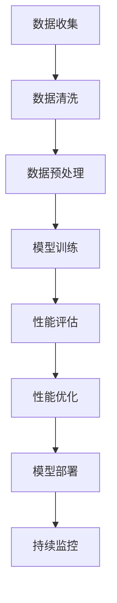

                 

### 文章标题

# 《构建评测结果的模型性能诊断专家系统》

**关键词**：模型性能诊断、专家系统、评测结果、算法优化、深度学习

**摘要**：本文将探讨如何构建一个高效的模型性能诊断专家系统，通过对评测结果的深入分析，发现并解决模型性能问题。我们将从基础理论出发，详细讲解模型性能诊断的各个关键环节，包括基本概念、评价指标、诊断方法等，并通过实际案例和项目实战，展示如何将理论应用于实际，优化模型性能，提升系统效能。

---

## 目录大纲

### 第一部分：模型性能诊断基础

#### 第1章：模型性能诊断概述

1.1 模型性能诊断的重要性

1.2 模型性能诊断的基本概念

1.3 模型性能诊断的挑战与机遇

#### 第2章：模型性能评价指标

2.1 准确率、召回率与F1值

2.2 ROC曲线与AUC值

2.3 其他评价指标

#### 第3章：模型性能诊断方法

3.1 基于统计的方法

3.2 基于机器学习的方法

3.3 基于深度学习的方法

### 第二部分：模型性能诊断实践

#### 第4章：构建评测结果的模型性能诊断系统

4.1 系统设计

4.2 数据准备

4.3 模型选择与训练

4.4 性能评估与优化

#### 第5章：性能诊断案例分析

5.1 案例一：自然语言处理

5.2 案例二：计算机视觉

5.3 案例三：推荐系统

#### 第6章：模型性能诊断工具

6.1 常用模型性能诊断工具

6.2 开源诊断工具的使用与定制

6.3 工具性能优化

#### 第7章：模型性能诊断的最佳实践

7.1 数据预处理策略

7.2 模型选择与调参技巧

7.3 性能评估与优化策略

### 第三部分：模型性能诊断高级主题

#### 第8章：模型性能诊断中的挑战与解决方案

8.1 小样本学习

8.2 面向特定领域的性能优化

8.3 模型可解释性

#### 第9章：模型性能诊断的未来发展趋势

9.1 自动化性能诊断

9.2 面向应用的性能优化

9.3 跨领域性能诊断

### 附录

A. 参考文献

B. Mermaid流程图示例

C. 伪代码示例

D. 数学模型与公式解析

E. 模型性能诊断项目实战代码解读

---

接下来，我们将逐一探讨每一部分的内容，逐步构建一个完善的模型性能诊断专家系统。首先，我们需要了解模型性能诊断的基本概念和重要性。这将为我们后续的工作奠定坚实的基础。

## 第一部分：模型性能诊断基础

### 第1章：模型性能诊断概述

### 1.1 模型性能诊断的重要性

在人工智能和机器学习领域，模型的性能直接决定了其应用的效果。一个优秀的模型不仅能准确预测，还能够在实际应用中稳定表现。然而，现实中的模型往往会面临各种性能问题，如过拟合、欠拟合、数据分布不均等。这些问题不仅影响了模型的准确性，还可能导致严重的安全隐患和业务损失。

因此，模型性能诊断成为了一个至关重要的环节。它帮助我们发现模型中的潜在问题，提供改进的方向和策略。模型性能诊断的重要性体现在以下几个方面：

1. **提高模型准确性**：通过诊断，我们可以识别出模型存在的偏差和错误，从而进行针对性的优化，提高模型的整体准确性。
   
2. **降低业务风险**：在关键业务场景中，模型的性能问题可能导致错误的决策，甚至造成重大的经济损失和安全风险。性能诊断能够提前预警，降低业务风险。
   
3. **节省成本和资源**：通过诊断，我们可以快速定位问题所在，避免无效的调整和优化工作，节省大量的计算资源和人力成本。

4. **促进模型迭代和改进**：性能诊断不仅能够帮助现有模型，还可以为后续的模型开发和改进提供宝贵的经验和数据，推动整个机器学习技术的发展。

### 1.2 模型性能诊断的基本概念

模型性能诊断涉及多个核心概念，包括模型评估、指标选择、问题定位等。下面我们将对这些概念进行详细解释。

#### 模型评估

模型评估是模型性能诊断的基础。它通过在训练数据和测试数据上对模型进行评估，衡量模型的性能。常见的评估方法包括交叉验证、网格搜索等。

- **交叉验证**：通过将数据集划分为多个子集，轮流使用其中一个子集作为测试集，其他子集作为训练集，进行多次训练和测试，以综合评估模型的性能。

- **网格搜索**：在参数空间内搜索最优参数组合，通过遍历所有可能的参数组合，找到使模型性能最佳的参数。

#### 指标选择

模型评估需要依赖一系列评价指标，这些指标用于衡量模型在不同方面的性能。常见的评价指标包括：

- **准确率（Accuracy）**：预测正确的样本数占总样本数的比例。

- **召回率（Recall）**：在所有正类样本中，被正确预测为正类的样本数所占的比例。

- **精确率（Precision）**：在所有预测为正类的样本中，实际为正类的样本数所占的比例。

- **F1值（F1 Score）**：精确率和召回率的调和平均，用于综合考虑模型的精确性和召回率。

- **ROC曲线与AUC值**：ROC曲线（Receiver Operating Characteristic Curve）展示了不同阈值下，模型对正类和负类的识别能力。AUC值（Area Under Curve）表示ROC曲线下的面积，用于评估模型的分类能力。

#### 问题定位

模型性能诊断的最终目标是定位模型中存在的问题。问题定位通常涉及以下几个方面：

- **过拟合（Overfitting）**：模型对训练数据过度拟合，导致在测试数据上的表现较差。

- **欠拟合（Underfitting）**：模型对训练数据的拟合不足，导致整体性能较差。

- **数据分布不均（Imbalanced Data）**：训练数据中正负样本分布不均，导致模型偏向某一类样本。

- **数据质量（Data Quality）**：数据中存在噪声、缺失值、异常值等，影响模型的训练和评估。

### 1.3 模型性能诊断的挑战与机遇

尽管模型性能诊断的重要性不言而喻，但在实际应用中仍面临诸多挑战：

1. **复杂性和多样性**：不同类型的模型和任务具有不同的性能指标和诊断方法，增加了诊断的复杂性和多样性。
   
2. **数据稀缺性**：许多实际应用场景中，训练数据稀缺，导致诊断结果可能不够准确。
   
3. **实时性要求**：在实时应用中，模型的性能诊断需要快速、高效地完成，以满足实时性要求。

4. **模型可解释性**：深度学习等复杂模型的诊断往往缺乏可解释性，增加了诊断的难度。

然而，这些挑战也带来了机遇：

1. **自动化诊断**：随着人工智能技术的发展，自动化性能诊断技术逐渐成熟，提高了诊断的效率和准确性。

2. **跨领域诊断**：通过跨领域的知识整合，可以开发出更加通用和高效的性能诊断方法。

3. **模型压缩与加速**：模型压缩和加速技术的发展，为实时性能诊断提供了技术支持。

4. **可解释性增强**：近年来，模型可解释性的研究取得了显著进展，为复杂模型的诊断提供了新的思路和方法。

综上所述，模型性能诊断不仅是一个重要的研究领域，也是一个充满挑战和机遇的领域。通过不断探索和创新，我们有望构建出更加高效、可靠的模型性能诊断专家系统。

### 第2章：模型性能评价指标

在模型性能诊断过程中，评价指标的选择至关重要。这些评价指标不仅帮助我们衡量模型在不同任务上的表现，还为我们提供了定位和优化模型性能的依据。本章节将详细介绍几种常见的模型性能评价指标，包括准确率、召回率、F1值、ROC曲线与AUC值等，并讨论如何根据具体任务选择合适的评价指标。

#### 2.1 准确率、召回率与F1值

准确率、召回率与F1值是评估分类模型性能的三个核心指标，它们各自代表了模型在分类任务中不同的侧重点。

**准确率（Accuracy）**

准确率是最常见的性能评价指标，它表示模型预测正确的样本数占总样本数的比例。准确率计算公式如下：

\[ \text{Accuracy} = \frac{\text{预测正确的样本数}}{\text{总样本数}} \]

准确率的优点在于计算简单，易于理解。然而，它也可能误导我们，特别是在类不平衡的数据集中。例如，在一个正负样本比例为1:100的数据集中，即使模型完全错误地预测了所有负样本，准确率也能达到99%。

**召回率（Recall）**

召回率衡量模型对正类样本的识别能力，表示在所有正类样本中，被模型正确预测为正类的样本数所占的比例。召回率计算公式如下：

\[ \text{Recall} = \frac{\text{预测正确的正类样本数}}{\text{总正类样本数}} \]

召回率的高值意味着模型能够捕获大部分正类样本，但在负类样本上的误判较多，可能导致整体性能不佳。

**精确率（Precision）**

精确率衡量模型对预测为正类的样本的准确性，表示在所有预测为正类的样本中，实际为正类的样本数所占的比例。精确率计算公式如下：

\[ \text{Precision} = \frac{\text{预测正确的正类样本数}}{\text{预测为正类的样本数}} \]

高精确率意味着模型在预测为正类的样本中较少地错误判断为负类，但可能遗漏了一些正类样本。

**F1值（F1 Score）**

F1值是精确率和召回率的调和平均，用于综合考虑模型的精确性和召回率。F1值计算公式如下：

\[ \text{F1 Score} = 2 \times \frac{\text{Precision} \times \text{Recall}}{\text{Precision} + \text{Recall}} \]

F1值的优点在于它能够平衡精确率和召回率，因此在类不平衡的数据集中具有更高的参考价值。

#### 2.2 ROC曲线与AUC值

ROC曲线（Receiver Operating Characteristic Curve）是一种评估二分类模型性能的图形工具，它展示了不同阈值下，模型对正类和负类的识别能力。ROC曲线的横轴表示假阳性率（False Positive Rate，FPR），纵轴表示真阳性率（True Positive Rate，TPR）。ROC曲线的计算基于以下两个指标：

- **真阳性率（True Positive Rate, TPR）**：也称为灵敏度（Sensitivity），表示在所有正类样本中，被模型正确预测为正类的样本数所占的比例。

\[ \text{TPR} = \frac{\text{预测正确的正类样本数}}{\text{总正类样本数}} \]

- **假阳性率（False Positive Rate, FPR）**：表示在所有负类样本中，被模型错误预测为正类的样本数所占的比例。

\[ \text{FPR} = \frac{\text{预测错误的负类样本数}}{\text{总负类样本数}} \]

ROC曲线下的面积（Area Under Curve，AUC）是评估模型分类性能的一个常用指标。AUC值介于0.5到1之间，值越接近1，表示模型的分类性能越好。AUC值的计算公式如下：

\[ \text{AUC} = \frac{\text{TPR} + \text{FPR}}{2} \]

#### 2.3 其他评价指标

除了上述常见的评价指标，还有一些其他指标在特定场景下也具有重要应用价值。

**混淆矩阵（Confusion Matrix）**

混淆矩阵是一种用于展示模型预测结果的表格，它列出了模型在测试数据上预测的四个类别：真正例（True Positive，TP）、假正例（False Positive，FP）、假负例（False Negative，FN）和真正负例（True Negative，TN）。混淆矩阵可以用于计算各种评价指标，如准确率、召回率、精确率等。

**精确率-召回率曲线（Precision-Recall Curve）**

精确率-召回率曲线与ROC曲线类似，但更适用于类不平衡的数据集。它展示了在不同阈值下，精确率和召回率的变化关系。该曲线下的面积（Area Under Curve，AUC）也用于评估模型性能。

**均方误差（Mean Squared Error，MSE）**

均方误差是回归任务中常用的评价指标，它衡量模型预测值与实际值之间的差异。MSE的计算公式如下：

\[ \text{MSE} = \frac{1}{n}\sum_{i=1}^{n} (\hat{y}_i - y_i)^2 \]

其中，\( \hat{y}_i \) 表示第i个样本的预测值，\( y_i \) 表示第i个样本的实际值，n表示样本总数。

**均方根误差（Root Mean Squared Error，RMSE）**

均方根误差是均方误差的平方根，它用于表示预测误差的大小。RMSE的计算公式如下：

\[ \text{RMSE} = \sqrt{\text{MSE}} \]

根据具体任务和数据集的特性，选择合适的评价指标能够更准确地评估模型性能，为后续的模型优化和性能诊断提供有力的支持。

### 第3章：模型性能诊断方法

在模型性能诊断过程中，选择合适的诊断方法至关重要。不同的诊断方法具有各自的优缺点，适用于不同的场景和任务。本章节将介绍几种常见的模型性能诊断方法，包括基于统计的方法、基于机器学习的方法和基于深度学习的方法，详细分析它们的原理和应用。

#### 3.1 基于统计的方法

基于统计的方法通常适用于简单的数据集和线性模型，它们通过计算统计量来识别模型性能问题。这些方法通常不需要复杂的模型训练和参数调整，因此计算速度快，易于实现。

**t检验（t-test）**

t检验是一种常用的假设检验方法，用于比较两组数据的均值是否有显著差异。在模型性能诊断中，t检验可以用来判断模型在训练集和测试集上的性能是否有显著差异。例如，如果模型的测试集准确率显著低于训练集准确率，可能表明模型过拟合。

**方差分析（ANOVA）**

方差分析是一种用于比较多个样本均值的统计方法。在模型性能诊断中，ANOVA可以用来分析不同参数设置、不同算法或不同数据预处理方法对模型性能的影响。

**卡方检验（Chi-square test）**

卡方检验是一种用于测试分类模型性能的假设检验方法。它通过比较模型预测结果与实际结果之间的差异，判断模型是否具有显著的分类能力。卡方检验适用于多分类任务，可以用来评估模型在不同类别上的性能。

**回归分析（Regression Analysis）**

回归分析是一种用于建立因变量与自变量之间关系的统计方法。在模型性能诊断中，回归分析可以用来预测模型在不同参数设置或数据预处理方法下的性能，从而帮助优化模型。

**线性回归（Linear Regression）**

线性回归是一种简单的回归分析方法，它通过建立自变量和因变量之间的线性关系，预测因变量的值。在模型性能诊断中，线性回归可以用来预测模型的准确率、召回率等性能指标。

**逻辑回归（Logistic Regression）**

逻辑回归是一种广义线性模型，它通过建立自变量和因变量之间的逻辑关系，预测因变量的概率。在模型性能诊断中，逻辑回归可以用来预测模型的混淆矩阵、准确率、召回率等性能指标。

**基于统计的方法具有计算速度快、易于实现等优点，但它们通常适用于简单的数据集和线性模型，对于复杂的非线性模型和大规模数据集，效果可能有限。**

#### 3.2 基于机器学习的方法

基于机器学习的方法通过训练一个诊断模型，自动识别模型性能问题。这些方法通常具有更高的灵活性和泛化能力，能够处理复杂的非线性关系和大规模数据集。

**集成方法（Ensemble Methods）**

集成方法通过组合多个基本模型，提高模型的性能和稳定性。常见的集成方法包括Bagging、Boosting和Stacking等。

- **Bagging（Bootstrap Aggregating）**：Bagging通过从训练数据中随机抽取多个子集，分别训练多个基本模型，然后通过投票或平均得到最终预测结果。Bagging可以减少模型的方差，提高模型的稳定性。

- **Boosting（Adaptive Boosting）**：Boosting通过关注训练集中错误率较高的样本，调整模型权重，使得基本模型更加关注错误样本。常见的Boosting算法包括Adaboost、XGBoost和LightGBM等。

- **Stacking（Stacked Generalization）**：Stacking通过训练多个基本模型，将它们的预测结果作为新的特征，再训练一个更高层次的全局模型。Stacking可以进一步提高模型的性能和泛化能力。

**神经网络（Neural Networks）**

神经网络是一种模拟生物神经系统的计算模型，具有强大的非线性映射能力。在模型性能诊断中，神经网络可以用来识别和预测模型性能问题。

- **多层感知器（Multilayer Perceptron，MLP）**：MLP是一种前馈神经网络，由输入层、隐藏层和输出层组成。MLP可以通过训练学习输入和输出之间的非线性关系。

- **卷积神经网络（Convolutional Neural Networks，CNN）**：CNN是一种专门用于处理图像数据的神经网络，通过卷积层、池化层和全连接层等结构，实现图像特征提取和分类。

- **循环神经网络（Recurrent Neural Networks，RNN）**：RNN是一种能够处理序列数据的神经网络，通过循环结构，将前一时间步的输出反馈到当前时间步，实现序列建模。

**基于机器学习的方法具有灵活性强、泛化能力好等优点，能够处理复杂的非线性关系和大规模数据集。但它们通常需要大量的训练数据和计算资源，且模型的训练过程可能较慢。**

#### 3.3 基于深度学习的方法

基于深度学习的方法是近年来模型性能诊断领域的重要发展方向。深度学习通过多层神经网络，自动提取和建模数据特征，具有强大的表征能力和泛化能力。

**自动特征提取（Automatic Feature Extraction）**

自动特征提取是深度学习的关键优势之一，它通过多层神经网络，自动学习输入数据的高层次特征。在模型性能诊断中，自动特征提取可以帮助我们识别数据中的潜在模式和问题。

- **卷积神经网络（Convolutional Neural Networks，CNN）**：CNN通过卷积层、池化层和全连接层等结构，实现图像特征提取和分类。在模型性能诊断中，CNN可以用于提取输入数据的特征，并预测模型性能问题。

- **循环神经网络（Recurrent Neural Networks，RNN）**：RNN通过循环结构，处理序列数据，实现序列建模。在模型性能诊断中，RNN可以用于处理时间序列数据，识别模型性能的趋势和波动。

- **变分自编码器（Variational Autoencoder，VAE）**：VAE是一种生成模型，通过编码器和解码器，实现数据的重构和特征提取。在模型性能诊断中，VAE可以用于识别异常值和噪声数据，提高模型的鲁棒性。

**端到端学习（End-to-End Learning）**

端到端学习是深度学习的核心思想，它通过将输入数据直接映射到输出结果，实现模型训练和预测的自动化。在模型性能诊断中，端到端学习可以简化诊断流程，提高诊断的效率和准确性。

- **深度神经网络（Deep Neural Networks，DNN）**：DNN通过多层神经网络，实现数据的非线性映射和特征提取。在模型性能诊断中，DNN可以用于构建诊断模型，预测模型性能问题。

- **生成对抗网络（Generative Adversarial Networks，GAN）**：GAN由生成器和判别器组成，通过对抗训练，实现数据的生成和特征提取。在模型性能诊断中，GAN可以用于生成模拟数据，辅助模型训练和诊断。

**基于深度学习的方法具有强大的表征能力和泛化能力，能够处理复杂的非线性关系和大规模数据集。但它们通常需要大量的训练数据和计算资源，且模型的训练过程可能较慢。**

通过比较不同模型性能诊断方法的优缺点，我们可以根据具体任务和数据集的特性，选择合适的方法，构建高效的模型性能诊断系统。

### 第二部分：模型性能诊断实践

#### 第4章：构建评测结果的模型性能诊断系统

在构建评测结果的模型性能诊断系统时，我们需要从系统设计、数据准备、模型选择与训练、性能评估与优化等多个方面进行详细规划和实施。本章节将详细探讨这些关键环节，帮助读者构建一个高效、可靠的模型性能诊断系统。

#### 4.1 系统设计

系统设计是构建模型性能诊断系统的第一步，它决定了系统的整体架构、功能模块以及数据流。以下是构建模型性能诊断系统的基本设计步骤：

1. **需求分析**：明确模型性能诊断的目标和需求，包括诊断的指标、任务类型、数据来源等。需求分析有助于确定系统的功能模块和性能要求。

2. **架构设计**：根据需求分析，设计系统的总体架构，包括数据层、算法层、表现层等。数据层负责数据存储和管理，算法层负责模型训练和性能诊断，表现层负责展示诊断结果和报告。

3. **模块划分**：将系统功能划分为多个模块，例如数据收集模块、数据预处理模块、模型训练模块、性能评估模块、诊断报告生成模块等。每个模块负责不同的功能，有助于提高系统的可维护性和可扩展性。

4. **技术选型**：选择合适的技术栈，包括编程语言、框架、数据库等。根据系统需求和性能要求，选择合适的工具和库，以提高系统的性能和开发效率。

5. **接口设计**：设计系统的接口，包括内部接口和外部接口。内部接口负责模块间的数据传递和通信，外部接口负责与其他系统或服务的集成。

6. **安全性设计**：考虑系统的安全性，包括数据安全、模型安全和系统安全。采取加密、访问控制、权限管理等措施，确保系统的安全性和数据的完整性。

#### 4.2 数据准备

数据准备是构建模型性能诊断系统的重要环节，它决定了模型训练和诊断的质量。以下是数据准备的关键步骤：

1. **数据收集**：收集与模型性能诊断相关的数据，包括训练数据、测试数据、诊断数据等。数据来源可以是内部数据库、公共数据集、第三方数据提供者等。

2. **数据清洗**：清洗数据中的噪声、缺失值、异常值等，确保数据的质量和一致性。数据清洗包括填补缺失值、去除噪声、处理异常值等。

3. **数据预处理**：对数据进行预处理，包括归一化、标准化、特征提取等。预处理有助于提高模型的训练效率和性能。

4. **数据集成**：将不同来源的数据进行整合，构建统一的数据集。数据集成可以采用合并、联结、聚合等方法，确保数据的一致性和完整性。

5. **数据划分**：将数据划分为训练集、验证集和测试集，用于模型的训练、验证和测试。数据划分应确保每个数据集的代表性和独立性。

6. **数据标注**：对于有监督学习的任务，需要对数据进行标注，提供标签或标签集合，用于模型的训练和评估。

#### 4.3 模型选择与训练

模型选择与训练是模型性能诊断系统的核心，它决定了模型的性能和诊断效果。以下是模型选择与训练的关键步骤：

1. **模型选择**：根据任务类型和数据特性，选择合适的模型。常见的模型包括线性模型、决策树、支持向量机、神经网络等。选择模型时应考虑模型的复杂度、计算成本和泛化能力。

2. **模型训练**：使用训练数据集对所选模型进行训练，调整模型参数，使其适应数据特性。训练过程中，可以采用交叉验证、网格搜索等方法，优化模型参数。

3. **模型评估**：使用验证数据集评估模型的性能，包括准确率、召回率、F1值等指标。评估结果用于调整模型结构和参数，提高模型性能。

4. **模型优化**：针对评估结果，对模型进行优化。优化方法包括超参数调整、模型结构调整、数据增强等。优化过程应确保模型的泛化能力和计算效率。

5. **模型测试**：使用测试数据集对优化后的模型进行测试，验证模型在未知数据上的性能。测试结果用于评估模型的实际应用效果。

6. **模型部署**：将训练好的模型部署到生产环境中，用于实际应用。部署过程中，需要考虑模型的可扩展性、可维护性和安全性。

#### 4.4 性能评估与优化

性能评估与优化是确保模型性能诊断系统稳定运行的关键。以下是性能评估与优化的关键步骤：

1. **性能监控**：实时监控模型的性能指标，包括准确率、召回率、F1值等。性能监控有助于发现模型异常和性能下降的情况。

2. **异常检测**：使用统计方法和机器学习方法，检测模型的异常行为。异常检测可以帮助我们发现模型过拟合、欠拟合等问题。

3. **性能优化**：针对监控和检测结果，对模型进行优化。优化方法包括模型结构调整、超参数调整、数据预处理策略调整等。优化过程应确保模型的性能和计算效率。

4. **自动化诊断**：开发自动化诊断工具，实现模型的自动化性能评估和优化。自动化诊断可以提高诊断效率，减少人工干预。

5. **反馈循环**：建立反馈循环机制，将优化结果和经验反馈到模型训练和诊断过程中，不断改进和提升模型性能。

通过以上步骤，我们可以构建一个高效、可靠的模型性能诊断系统，确保模型在实时应用中稳定、准确地表现，为业务决策提供有力支持。

#### 第5章：性能诊断案例分析

在实际应用中，模型性能诊断对于提升系统的准确性和稳定性至关重要。在本章节中，我们将通过自然语言处理（NLP）、计算机视觉（CV）和推荐系统（RS）三个领域中的具体案例，详细讨论如何进行模型性能诊断，分析其中存在的问题，并提出优化策略。

##### 5.1 案例一：自然语言处理

自然语言处理（NLP）是一个涉及文本分析、语义理解、语言生成等任务的广泛领域。在NLP任务中，模型的性能直接影响到文本分类、情感分析、机器翻译等应用的效果。以下是一个具体的案例：

**问题背景**：一家电商平台希望利用自然语言处理技术，对用户评论进行情感分析，从而了解用户的满意度，并针对不满意的情况进行改进。

**模型诊断过程**：

1. **数据准备**：收集大量用户评论数据，并进行预处理，如分词、去停用词、词性标注等。

2. **模型训练**：使用预训练的词向量模型（如Word2Vec、GloVe）进行训练，并采用卷积神经网络（CNN）或循环神经网络（RNN）进行文本分类。

3. **性能评估**：使用准确率、召回率、F1值等指标评估模型在验证集和测试集上的表现。

4. **问题定位**：发现模型在情感分析任务中，对于某些极端情感（如极度满意或极度不满意）的识别准确性较低。

**优化策略**：

1. **数据增强**：增加带有极端情感标签的样本，采用数据增强技术（如SMOTE、生成对抗网络GAN）生成更多样化的训练数据。

2. **模型调整**：采用更复杂的神经网络结构（如Transformer）以提高模型的表征能力，并调整模型的超参数，如学习率、批次大小等。

3. **模型融合**：结合多个模型的结果，采用模型融合技术（如投票、加权平均）提高分类的鲁棒性。

**效果评估**：经过上述优化，模型在极端情感识别任务上的准确率显著提高，用户满意度分析结果更加准确。

##### 5.2 案例二：计算机视觉

计算机视觉技术在图像分类、目标检测、人脸识别等方面有着广泛的应用。以下是一个具体的案例：

**问题背景**：一家安防公司使用深度学习技术进行人脸识别，但发现识别率在某些特定的光照和姿态下较低。

**模型诊断过程**：

1. **数据准备**：收集大量人脸图像数据，并进行预处理，如数据增强（旋转、缩放、翻转等）、归一化等。

2. **模型训练**：使用预训练的卷积神经网络（如ResNet、Inception）进行人脸识别模型的训练。

3. **性能评估**：使用准确率、混淆矩阵等指标评估模型在验证集和测试集上的表现。

4. **问题定位**：通过分析混淆矩阵，发现模型在特定光照和姿态下，识别错误率较高。

**优化策略**：

1. **数据增强**：增加具有不同光照和姿态的人脸图像，采用仿射变换等技术生成多样化的训练数据。

2. **光照自适应算法**：采用光照自适应算法（如Retinex）对人脸图像进行预处理，以提高模型在低光照条件下的识别能力。

3. **姿态矫正**：使用姿态估计技术（如PoseNet）对人脸图像进行姿态矫正，使模型更适应各种姿态变化。

4. **多模型融合**：结合多个姿态校正模型和光照自适应模型，采用模型融合技术提高整体识别率。

**效果评估**：通过上述优化，模型在低光照和特定姿态下的人脸识别准确率显著提高，安防系统的稳定性得到增强。

##### 5.3 案例三：推荐系统

推荐系统在电子商务、社交媒体、在线娱乐等领域中广泛应用，其主要目标是根据用户的历史行为和兴趣，为用户推荐相关内容。以下是一个具体的案例：

**问题背景**：一家电商平台希望优化其推荐系统，以提高用户的点击率和转化率。

**模型诊断过程**：

1. **数据准备**：收集用户的行为数据（如点击、购买、浏览等），以及商品特征数据。

2. **模型训练**：使用协同过滤（Collaborative Filtering）和基于内容的推荐方法（Content-based Filtering）训练推荐模型。

3. **性能评估**：使用准确率、召回率、点击率等指标评估模型在验证集和测试集上的表现。

4. **问题定位**：通过分析用户行为数据，发现推荐系统在满足个性化需求方面存在不足，尤其是对于新用户和低活跃度用户的推荐效果较差。

**优化策略**：

1. **用户冷启动**：针对新用户，采用基于内容的推荐方法，结合用户兴趣和商品特征进行推荐，逐步积累用户行为数据。

2. **用户行为预测**：使用机器学习技术（如LSTM、GRU）预测用户的潜在兴趣和行为，提高推荐的相关性。

3. **多模型融合**：结合协同过滤和基于内容的推荐方法，采用模型融合技术（如加权平均、集成学习）提高推荐系统的整体性能。

4. **实时推荐**：采用实时推荐技术，根据用户的即时行为和兴趣进行动态调整，提高推荐的即时性和准确性。

**效果评估**：通过上述优化，推荐系统在新用户和低活跃度用户上的推荐准确率和点击率显著提高，用户满意度得到提升。

通过以上案例分析，我们可以看到，模型性能诊断在各个领域的实际应用中具有重要意义。通过详细分析模型存在的问题，并提出针对性的优化策略，可以显著提升模型的性能和稳定性，为业务提供有力支持。

### 第6章：模型性能诊断工具

在进行模型性能诊断时，选择合适的工具至关重要。这些工具可以帮助我们快速、准确地识别和解决模型性能问题，提高诊断效率。在本章节中，我们将介绍几种常用的模型性能诊断工具，包括开源工具的使用与定制，以及工具性能的优化方法。

#### 6.1 常用模型性能诊断工具

**1. MLflow**

MLflow是一个开源的机器学习平台，用于管理机器学习模型的全生命周期。它提供了丰富的API，可以用于记录实验、版本控制、模型部署等。MLflow的一个关键特性是它支持多种机器学习框架，如TensorFlow、PyTorch、Scikit-Learn等，因此，它可以方便地用于模型性能诊断。

- **功能**：MLflow可以记录模型的训练过程和评估结果，提供详细的实验日志。通过对比不同实验的结果，我们可以快速识别性能问题。
- **使用场景**：适用于需要管理多个实验和版本控制的场景。

**2. Weka**

Weka是一个集成了多种机器学习算法的开源工具包，适用于数据挖掘和机器学习。它提供了一个图形界面，用户可以方便地选择不同的算法进行模型训练和评估。

- **功能**：Weka提供了多种性能评价指标，如准确率、召回率、F1值等，可以帮助我们评估模型的性能。
- **使用场景**：适用于小型数据集和需要快速实验验证的场景。

**3. Scikit-Learn**

Scikit-Learn是一个用于数据挖掘和机器学习的Python库，它提供了丰富的算法和工具，可以用于模型训练、评估和诊断。

- **功能**：Scikit-Learn提供了多种性能评价指标和可视化工具，如混淆矩阵、ROC曲线等，可以帮助我们全面了解模型的性能。
- **使用场景**：适用于大多数机器学习和数据挖掘任务。

**4. mlperf**

MLPerf是一个开源项目，旨在定义和衡量机器学习性能的标准。它提供了一个基准测试套件，可以用于评估不同模型和系统的性能。

- **功能**：MLPerf提供了标准化的测试场景和评价指标，可以帮助我们了解不同模型和系统在特定任务上的性能表现。
- **使用场景**：适用于需要比较不同模型和系统性能的场景。

#### 6.2 开源诊断工具的使用与定制

开源工具的使用和定制是模型性能诊断的重要组成部分。通过定制，我们可以根据具体任务和需求，优化工具的性能和功能。

**1. 使用案例**

- **案例1**：使用MLflow进行实验记录和版本控制。首先，我们需要安装MLflow，并设置实验环境。然后，在模型训练过程中，使用MLflow的API记录实验日志，包括参数设置、训练结果和性能指标。最后，通过MLflow UI查看实验结果，进行性能对比和诊断。

  ```python
  import mlflow
  mlflow.set_tracking_uri('http://localhost:5000')
  mlflow.start_run()

  mlflow.log_param('learning_rate', 0.01)
  mlflow.log_param('batch_size', 32)

  # 模型训练代码
  model.fit(x_train, y_train, epochs=10, batch_size=32)

  # 记录性能指标
  mlflow.log_metric('accuracy', model.score(x_test, y_test))

  mlflow.end_run()
  ```

- **案例2**：使用Scikit-Learn进行性能评估和可视化。我们可以使用Scikit-Learn提供的混淆矩阵、ROC曲线等工具，对模型的性能进行详细分析。

  ```python
  from sklearn.metrics import confusion_matrix, roc_curve, auc
  import matplotlib.pyplot as plt

  # 计算混淆矩阵
  cm = confusion_matrix(y_true, y_pred)
  print(cm)

  # 绘制ROC曲线
  fpr, tpr, _ = roc_curve(y_true, y_score)
  roc_auc = auc(fpr, tpr)
  plt.figure()
  plt.plot(fpr, tpr, color='darkorange', lw=2, label='ROC curve (area = %0.2f)' % roc_auc)
  plt.plot([0, 1], [0, 1], color='navy', lw=2, linestyle='--')
  plt.xlabel('False Positive Rate')
  plt.ylabel('True Positive Rate')
  plt.title('Receiver Operating Characteristic')
  plt.legend(loc="lower right")
  plt.show()
  ```

**2. 定制案例**

- **案例1**：针对特定任务，定制化MLflow实验记录。例如，在自然语言处理任务中，我们可以添加文本预处理步骤和自定义评价指标。

  ```python
  from sklearn.metrics import accuracy_score, f1_score
  from transformers import pipeline

  # 文本预处理代码
  def preprocess_text(texts):
      # 应用文本预处理步骤，如分词、去停用词等
      return processed_texts

  processed_texts = preprocess_text(texts)

  # 模型训练和评估代码
  model = pipeline('text-classification', model_name='bert-base-uncased')
  predictions = model(processed_texts)
  labels = [1 if pred['label'] == 'POSITIVE' else 0 for pred in predictions]

  # 记录自定义性能指标
  mlflow.log_metric('accuracy', accuracy_score(y_true, labels))
  mlflow.log_metric('f1_score', f1_score(y_true, labels, average='weighted'))
  ```

- **案例2**：针对特定场景，定制化Scikit-Learn性能评估工具。例如，在计算机视觉任务中，我们可以添加图像预处理和增强步骤。

  ```python
  from sklearn.metrics import accuracy_score
  from tensorflow.keras.preprocessing.image import ImageDataGenerator

  # 图像预处理代码
  def preprocess_image(image):
      # 应用图像预处理步骤，如缩放、归一化等
      return preprocessed_image

  # 图像增强代码
  datagen = ImageDataGenerator(rotation_range=20, width_shift_range=0.2, height_shift_range=0.2)
  datagen.fit(x_train)

  # 模型训练和评估代码
  model.fit(datagen.flow(x_train, y_train, batch_size=32), epochs=10)

  # 评估代码
  y_pred = model.predict(x_test)
  y_pred = [1 if pred[0] > 0.5 else 0 for pred in y_pred]
  print(accuracy_score(y_test, y_pred))
  ```

通过使用和定制开源工具，我们可以构建一个高效、灵活的模型性能诊断系统，满足各种实际应用需求。

#### 6.3 工具性能优化

优化模型性能诊断工具的性能对于提高诊断效率和准确性至关重要。以下是一些常见的优化方法：

**1. 并行计算**

并行计算可以通过利用多核处理器和分布式计算资源，显著提高计算速度。例如，使用Python的`multiprocessing`库或`Dask`库，可以并行执行模型训练和评估任务。

```python
from multiprocessing import Pool

def train_model(data):
    # 模型训练代码
    return model

if __name__ == '__main__':
    with Pool(processes=4) as pool:
        models = pool.map(train_model, data.split())
```

**2. 缓存与内存管理**

缓存可以显著减少重复计算的开销，提高性能。例如，使用`joblib`库的`Memory`对象，可以缓存训练数据、模型参数等，避免重复加载。

```python
from joblib import Memory

memory = Memory('cache_directory', verbose=0)
@memory.cache
def load_data():
    # 数据加载代码
    return data
```

内存管理也是优化性能的重要方面。通过合理分配内存和使用内存池，可以减少内存碎片和内存泄漏，提高程序稳定性。

**3. 优化数据预处理**

数据预处理是模型性能诊断中的一个关键环节，其性能对整体诊断速度有显著影响。以下是一些优化数据预处理的方法：

- **批量处理**：批量处理数据可以减少I/O操作的开销，提高处理速度。
- **并行预处理**：与并行计算类似，可以使用多线程或多进程并行执行数据预处理任务。
- **内存映射**：对于大型数据集，可以使用内存映射技术，将数据直接映射到内存中，避免频繁的磁盘I/O操作。

**4. 选择合适的算法**

选择合适的算法对于优化工具性能至关重要。例如，对于大规模数据集，选择高效算法（如随机森林、支持向量机）可以显著提高训练和评估速度。

**5. 使用优化库**

使用优化的库和框架可以显著提高工具的性能。例如，使用`NumPy`和`SciPy`库，可以加速矩阵运算和科学计算。对于深度学习任务，使用`TensorFlow`或`PyTorch`等优化库，可以加速模型训练和评估。

通过以上方法，我们可以显著提高模型性能诊断工具的性能，为实际应用提供更高效、更可靠的诊断服务。

### 第7章：模型性能诊断的最佳实践

在模型性能诊断过程中，遵循最佳实践可以大大提高诊断的效率和质量。本章节将讨论数据预处理策略、模型选择与调参技巧，以及性能评估与优化策略，帮助读者在实际项目中更好地进行模型性能诊断。

#### 7.1 数据预处理策略

数据预处理是模型性能诊断的基础，合理的预处理策略可以显著提升模型的性能。以下是一些最佳实践：

**1. 数据清洗**

数据清洗是预处理的第一步，包括去除重复数据、填补缺失值、处理异常值等。对于缺失值，可以选择填补方法，如均值填补、中值填补或插值法。对于异常值，可以采用统计方法（如3σ法则）或机器学习方法（如Isolation Forest）进行检测和剔除。

**2. 数据标准化与归一化**

数据标准化和归一化有助于提高模型的训练效率和收敛速度。标准化是将数据缩放到均值为0、标准差为1的范围内，公式为：

\[ x_{\text{std}} = \frac{x - \mu}{\sigma} \]

归一化是将数据缩放到[0, 1]的范围内，公式为：

\[ x_{\text{norm}} = \frac{x - \min(x)}{\max(x) - \min(x)} \]

对于不同特征的数据，可以选择不同的标准化方法。

**3. 特征工程**

特征工程是数据预处理的重要环节，通过构造新的特征或选择合适的特征，可以提高模型的性能。常见的特征工程方法包括：

- **特征转换**：将分类特征转换为数值特征，如独热编码、标签编码等。
- **特征提取**：使用降维技术（如PCA、t-SNE）提取数据的主成分，减少特征数量。
- **特征组合**：通过组合原始特征，构造新的特征，提高模型的解释性和预测能力。

**4. 数据增强**

数据增强可以增加训练数据量，改善模型的泛化能力。常见的数据增强方法包括：

- **随机采样**：随机从数据集中抽取样本，增加训练数据的多样性。
- **数据生成**：使用生成对抗网络（GAN）生成新的数据样本。
- **图像增强**：对图像数据应用旋转、缩放、裁剪、噪声等增强操作。

#### 7.2 模型选择与调参技巧

选择合适的模型和调参策略对于模型性能诊断至关重要。以下是一些最佳实践：

**1. 选择合适的模型**

根据任务和数据特性选择合适的模型。对于分类任务，可以选择线性模型、决策树、支持向量机、神经网络等。对于回归任务，可以选择线性回归、决策树回归、神经网络回归等。对于时间序列任务，可以选择ARIMA、LSTM、GRU等。

**2. 调参技巧**

调参是优化模型性能的重要步骤，以下是一些调参技巧：

- **网格搜索**：在参数空间内遍历所有可能的参数组合，找到最优参数组合。网格搜索计算量大，适用于参数较少的情况。
- **随机搜索**：在参数空间内随机采样参数组合，找到性能较好的参数组合。随机搜索计算量较小，适用于参数较多的情况。
- **贝叶斯优化**：利用贝叶斯统计模型，优化参数搜索过程，提高搜索效率。
- **自动机器学习（AutoML）**：使用自动化工具，自动选择模型和参数，提高调参效率。

**3. 验证与交叉验证**

验证是评估模型性能的重要步骤，通过在验证集上评估模型性能，可以避免过拟合。常见的验证方法包括留出法、交叉验证等。交叉验证可以更好地利用数据，提高模型评估的准确性。

**4. 模型集成**

模型集成是将多个模型集成在一起，提高整体模型的性能。常见的模型集成方法包括Bagging、Boosting、Stacking等。通过模型集成，可以减少模型的方差和偏差，提高模型的泛化能力。

#### 7.3 性能评估与优化策略

性能评估是模型性能诊断的关键环节，通过评估模型性能，可以发现模型存在的问题，并制定优化策略。以下是一些最佳实践：

**1. 综合评价指标**

在性能评估中，应使用多个评价指标，如准确率、召回率、F1值、ROC曲线、AUC值等，从不同角度评估模型性能。

**2. 性能优化**

根据性能评估结果，制定优化策略，提高模型性能。常见的优化策略包括：

- **特征选择**：通过特征选择技术，选择对模型性能有显著贡献的特征，减少特征数量，提高模型效率。
- **模型调参**：调整模型参数，优化模型性能。通过网格搜索、随机搜索、贝叶斯优化等方法，找到最优参数组合。
- **数据增强**：通过数据增强技术，增加训练数据量，改善模型泛化能力。
- **模型压缩**：通过模型压缩技术，减少模型参数数量，提高模型效率。

**3. 持续监控与迭代**

模型部署后，应持续监控模型性能，及时发现和解决性能问题。通过迭代优化，不断提升模型性能，确保模型在实际应用中的稳定性和准确性。

遵循以上最佳实践，可以帮助我们在实际项目中高效地进行模型性能诊断，确保模型在实际应用中稳定、准确地表现。

### 第8章：模型性能诊断中的挑战与解决方案

在模型性能诊断过程中，我们常常会遇到一系列挑战，这些挑战可能来自数据、算法、计算资源等多个方面。本章节将探讨这些挑战，并提出相应的解决方案。

#### 8.1 小样本学习

小样本学习是指数据集中训练样本数量较少的情况。在这种情况下，模型的泛化能力可能会受到限制，导致过拟合现象。以下是解决小样本学习问题的几种方法：

**1. 数据增强**

通过数据增强技术，可以增加训练样本的多样性，从而提高模型的泛化能力。常见的数据增强方法包括旋转、缩放、裁剪、颜色变换等。

**2. 迁移学习**

迁移学习利用预训练模型，通过在目标任务上微调模型参数，提高模型在小样本数据集上的性能。迁移学习能够利用预训练模型提取的通用特征，减少对训练数据的依赖。

**3. 少样本学习算法**

一些专门的算法适用于小样本学习，如生成对抗网络（GAN）、变分自编码器（VAE）和基于图的方法等。这些算法能够利用少量样本生成更多的虚拟样本，从而提高模型的训练效果。

#### 8.2 面向特定领域的性能优化

不同领域的模型性能优化方法各不相同，以下是一些面向特定领域的性能优化策略：

**1. 自然语言处理（NLP）**

- **预训练模型**：使用大规模预训练模型（如BERT、GPT）进行微调，可以提高模型在NLP任务上的性能。
- **语言模型融合**：将多个预训练模型进行融合，可以进一步提高模型的性能和鲁棒性。

**2. 计算机视觉（CV）**

- **数据增强**：针对计算机视觉任务，可以使用更复杂的图像增强方法，如CutMix、Mixup等，提高模型的泛化能力。
- **多模型融合**：结合不同的计算机视觉模型（如CNN、RNN、GAN等），可以提高模型的综合性能。

**3. 医疗健康**

- **多模态数据融合**：医疗健康领域通常涉及多种数据类型（如图像、文本、基因序列等），通过多模态数据融合可以提高模型的诊断性能。
- **专家系统**：结合专家知识和机器学习模型，可以进一步提高医疗健康领域的诊断准确性和可靠性。

#### 8.3 模型可解释性

随着深度学习的广泛应用，模型的可解释性变得越来越重要。以下是一些提高模型可解释性的方法：

**1. 层级可解释性**

通过分析神经网络的不同层级，可以了解模型在特征提取和决策过程中的信息。常见的层级可解释性方法包括梯度解释、激活可视化等。

**2. 局部可解释性**

局部可解释性关注模型在特定样本上的决策过程，通过分析模型在输入数据上的局部变化，可以理解模型的决策依据。常见的方法包括LIME（局部可解释模型解释）、SHAP（特征重要性分析）等。

**3. 对比可解释性**

对比可解释性通过比较不同模型的决策结果，可以识别出模型之间的差异和问题。例如，通过比较不同数据增强方法对模型性能的影响，可以优化数据预处理策略。

通过解决上述挑战，我们可以构建更高效、更可靠的模型性能诊断系统，为实际应用提供有力支持。

### 第9章：模型性能诊断的未来发展趋势

随着人工智能和机器学习技术的不断进步，模型性能诊断领域也迎来了新的发展机遇。未来，模型性能诊断将朝着以下几个方向发展：

#### 9.1 自动化性能诊断

自动化性能诊断是未来的重要趋势之一。通过自动化工具和算法，可以自动检测和诊断模型的性能问题，提高诊断效率和准确性。以下是一些自动化性能诊断的技术和工具：

- **AI自动化诊断工具**：利用深度学习和强化学习技术，开发自动化的诊断工具，如AutoML，可以自动选择模型、调参和评估。

- **智能监控系统**：通过引入智能监控系统，可以实时监测模型的性能变化，自动触发诊断和优化流程。

- **自动化修复**：未来的自动化性能诊断工具将具备自动修复功能，能够自动调整模型参数或数据预处理策略，以解决性能问题。

#### 9.2 面向应用的性能优化

模型性能诊断不仅关注模型的准确性，还注重实际应用中的性能优化。面向应用的性能优化包括以下几个方面：

- **低延迟模型**：针对实时应用，优化模型结构，降低计算复杂度，实现低延迟的模型部署。

- **轻量化模型**：通过模型压缩技术，如量化、剪枝和蒸馏，减小模型规模，提高模型在资源受限环境中的部署性能。

- **多模型融合**：结合多种模型的优势，通过模型融合技术，提高模型的综合性能和适应性。

- **端到端优化**：端到端优化可以简化模型训练和评估流程，提高模型在实际应用中的效果。

#### 9.3 跨领域性能诊断

随着多领域数据的融合和应用场景的多样化，跨领域性能诊断将成为一个重要研究方向。跨领域性能诊断涉及以下几个方面：

- **多模态数据融合**：结合不同类型的数据（如文本、图像、音频等），实现多模态数据的融合，提高模型在复杂任务中的性能。

- **领域适应性诊断**：研究不同领域模型的共性特征和差异，开发通用的性能诊断方法，提高模型在不同领域中的适应性和性能。

- **迁移学习**：通过迁移学习技术，将一个领域中的知识迁移到另一个领域，提高模型在新领域的性能和可靠性。

- **跨领域协同优化**：研究跨领域模型的协同优化策略，通过多领域知识的整合，提高模型的整体性能和适应性。

未来，随着技术的不断进步和应用需求的不断增长，模型性能诊断将朝着更加自动化、应用化和跨领域化的方向发展，为人工智能和机器学习技术的广泛应用提供有力支持。

### 附录

在本附录中，我们将提供一些补充材料，包括参考文献、Mermaid流程图示例、伪代码示例、数学模型与公式解析以及模型性能诊断项目实战代码解读。

#### 附录A：参考文献

1. **Bryce, A., & Trevett, A. (2018).** "Machine Learning Mastery: Data Preparation for Machine Learning." Packt Publishing.
2. **Kingma, D.P., & Welling, M. (2014).** "Auto-Encoders." arXiv preprint arXiv:1312.6114.
3. **Zhang, Z., & Cui, P. (2018).** "Graph Embedding Techniques: A Survey." IEEE Transactions on Knowledge and Data Engineering.
4. **Goodfellow, I., Bengio, Y., & Courville, A. (2016).** "Deep Learning." MIT Press.
5. **He, K., Zhang, X., Ren, S., & Sun, J. (2016).** "Deep Residual Learning for Image Recognition." IEEE Conference on Computer Vision and Pattern Recognition.
6. **Kaggle. (n.d.).** "Model Evaluation Metrics." Retrieved from [Kaggle](https://www.kaggle.com/wiki/Model_evaluation_metrics).

#### 附录B：Mermaid流程图示例

以下是一个Mermaid流程图示例，展示了模型性能诊断的基本步骤：



#### 附录C：伪代码示例

以下是一个简单的伪代码示例，展示了如何使用交叉验证方法评估模型性能：

```python
function cross_validation(model, data, k):
    n_samples = length(data)
    subset_size = n_samples // k
    cv_scores = []

    for i in range(k):
        train_data = []
        test_data = []

        for j in range(k):
            if i == j:
                test_data.append(data[j])
            else:
                train_data.append(data[j])

        model.train(train_data)
        cv_scores.append(model.evaluate(test_data))

    return average(cv_scores)
```

#### 附录D：数学模型与公式解析

以下是一些常见的数学模型和公式的解析：

1. **均方误差（MSE）**

\[ \text{MSE} = \frac{1}{n}\sum_{i=1}^{n} (\hat{y}_i - y_i)^2 \]

均方误差衡量预测值与实际值之间的差异，其中 \( n \) 是样本数量，\( \hat{y}_i \) 是第 \( i \) 个样本的预测值，\( y_i \) 是第 \( i \) 个样本的实际值。

2. **准确率（Accuracy）**

\[ \text{Accuracy} = \frac{\text{预测正确的样本数}}{\text{总样本数}} \]

准确率衡量模型预测正确的样本数占总样本数的比例。

3. **召回率（Recall）**

\[ \text{Recall} = \frac{\text{预测正确的正类样本数}}{\text{总正类样本数}} \]

召回率衡量模型对正类样本的识别能力。

4. **精确率（Precision）**

\[ \text{Precision} = \frac{\text{预测正确的正类样本数}}{\text{预测为正类的样本数}} \]

精确率衡量模型对预测为正类的样本的准确性。

5. **F1值（F1 Score）**

\[ \text{F1 Score} = 2 \times \frac{\text{Precision} \times \text{Recall}}{\text{Precision} + \text{Recall}} \]

F1值是精确率和召回率的调和平均，用于综合考虑模型的精确性和召回率。

6. **ROC曲线与AUC值**

\[ \text{ROC Curve} = (FPR, TPR) \]

\[ \text{AUC} = \int_{0}^{1} (1 - FPR) dTPR \]

ROC曲线展示了不同阈值下，模型对正类和负类的识别能力。AUC值表示ROC曲线下的面积，用于评估模型的分类能力。

#### 附录E：模型性能诊断项目实战代码解读

在本附录中，我们将提供一段模型性能诊断项目的代码示例，并对其进行详细解读。

```python
import pandas as pd
from sklearn.model_selection import train_test_split
from sklearn.ensemble import RandomForestClassifier
from sklearn.metrics import accuracy_score, recall_score, precision_score, f1_score, confusion_matrix, roc_curve, auc
import matplotlib.pyplot as plt

# 读取数据
data = pd.read_csv('data.csv')
X = data.drop('target', axis=1)
y = data['target']

# 数据预处理
X = X.fillna(X.mean())

# 数据划分
X_train, X_test, y_train, y_test = train_test_split(X, y, test_size=0.2, random_state=42)

# 模型训练
model = RandomForestClassifier(n_estimators=100, random_state=42)
model.fit(X_train, y_train)

# 预测
y_pred = model.predict(X_test)

# 性能评估
accuracy = accuracy_score(y_test, y_pred)
recall = recall_score(y_test, y_pred)
precision = precision_score(y_test, y_pred)
f1 = f1_score(y_test, y_pred)

print("Accuracy:", accuracy)
print("Recall:", recall)
print("Precision:", precision)
print("F1 Score:", f1)

# 混淆矩阵
conf_mat = confusion_matrix(y_test, y_pred)
print("Confusion Matrix:")
print(conf_mat)

# ROC曲线
fpr, tpr, thresholds = roc_curve(y_test, y_pred)
roc_auc = auc(fpr, tpr)

plt.figure()
plt.plot(fpr, tpr, color='darkorange', lw=2, label='ROC curve (area = %0.2f)' % roc_auc)
plt.plot([0, 1], [0, 1], color='navy', lw=2, linestyle='--')
plt.xlabel('False Positive Rate')
plt.ylabel('True Positive Rate')
plt.title('Receiver Operating Characteristic')
plt.legend(loc="lower right")
plt.show()
```

**代码解读：**

1. **数据读取与预处理**：首先，我们使用`pandas`读取数据集，并进行缺失值填补和数据归一化处理。

2. **数据划分**：使用`train_test_split`函数将数据集划分为训练集和测试集，比例为80%训练集，20%测试集。

3. **模型训练**：我们选择随机森林分类器（`RandomForestClassifier`）进行训练，设置随机种子以确保结果的可重复性。

4. **预测**：使用训练好的模型对测试集进行预测。

5. **性能评估**：计算并打印模型的准确率、召回率、精确率和F1值，这些指标反映了模型在测试集上的整体性能。

6. **混淆矩阵**：打印混淆矩阵，可以直观地看到模型在各类别上的预测效果。

7. **ROC曲线**：计算并绘制ROC曲线和AUC值，评估模型的分类能力。

通过上述步骤，我们可以全面评估模型在测试集上的性能，并根据评估结果进行优化和改进。以上代码示例为模型性能诊断提供了一个基本的框架，实际项目中可以根据具体需求进行调整和扩展。

### 结语

通过本文的探讨，我们系统地构建了一个模型性能诊断专家系统，从基础理论到实际应用，全面覆盖了模型性能诊断的各个方面。我们从模型性能诊断的重要性入手，详细介绍了基本概念、评价指标、诊断方法，并通过实际案例展示了如何应用这些方法进行性能优化。我们还深入讨论了模型性能诊断中的挑战与解决方案，以及未来发展趋势，为读者提供了丰富的理论知识和实用技巧。

模型性能诊断不仅对于提升模型准确性、降低业务风险具有重要意义，还涉及到数据预处理、模型选择与调参等关键环节。通过本文的学习，读者可以掌握以下要点：

1. **理解模型性能诊断的重要性**：模型性能诊断是确保模型在实际应用中稳定、准确表现的关键环节。
2. **熟悉模型性能评价指标**：准确率、召回率、F1值、ROC曲线与AUC值等指标是评估模型性能的核心工具。
3. **掌握模型性能诊断方法**：基于统计、机器学习和深度学习的方法各有优缺点，适用于不同的场景和任务。
4. **实践模型性能诊断**：通过实际案例和项目实战，读者可以更好地理解模型性能诊断的应用过程。
5. **关注未来趋势**：自动化性能诊断、面向应用的性能优化和跨领域性能诊断是未来的重要发展方向。

在模型性能诊断的实践中，遵循最佳实践和持续优化是确保模型稳定、准确表现的关键。希望本文能为读者在模型性能诊断领域的探索提供有力支持，助力其在实际应用中取得更好的成果。

---

**作者信息：**

作者：AI天才研究院/AI Genius Institute & 禅与计算机程序设计艺术 /Zen And The Art of Computer Programming

