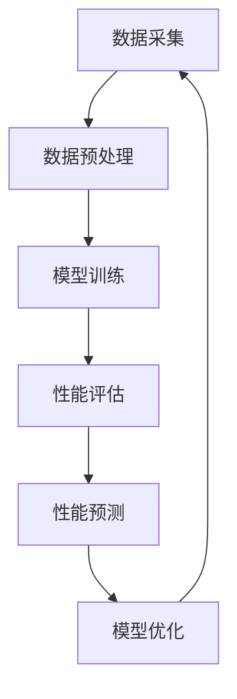
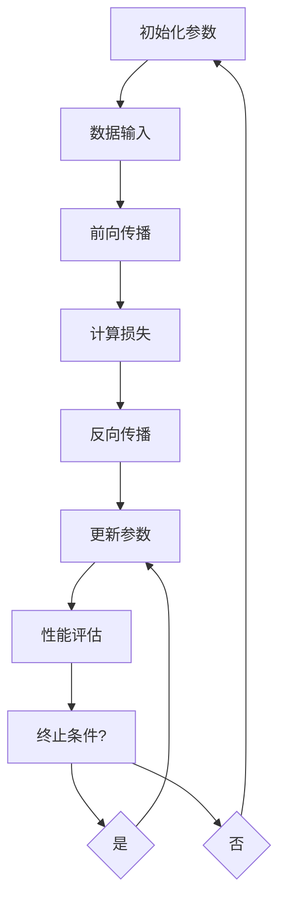
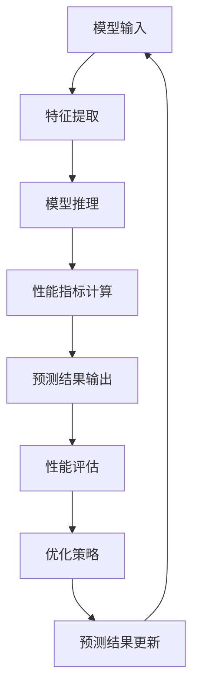

                 

### 文章标题

《构建评测结果的模型性能预测系统》

### 关键词

- 模型性能预测
- 评测系统
- 机器学习
- 数据分析
- 模型优化

### 摘要

本文将深入探讨构建评测结果的模型性能预测系统的全过程。通过详细阐述模型性能预测的重要性、基本概念、架构设计、核心算法原理，以及数学模型和实际项目实战，我们将帮助读者理解如何高效地评估和预测机器学习模型的性能，为实际应用提供有力支持。文章还将对未来的发展方向和应用领域进行展望，为模型性能预测的研究和实践提供新的思路和方向。

---

### 第一部分：模型性能预测系统概述

#### 第1章：模型性能预测系统概述

##### 1.1 引言

**1.1.1 模型性能预测的重要性**

在当今的数据驱动时代，机器学习模型在各个领域得到了广泛的应用，如自然语言处理、图像识别、推荐系统等。然而，如何评估和预测这些模型的性能，以确保其准确性和可靠性，成为一个关键问题。模型性能预测不仅能够帮助研究人员评估现有模型的性能，还能为模型优化和调整提供重要的依据。

**1.1.2 模型性能预测系统的目标**

模型性能预测系统的目标是提供一种定量和定性的方法，用于评估和预测机器学习模型的性能。具体而言，该系统应能够：

- **准确性评估**：通过评估模型在训练数据和测试数据上的性能，判断模型的准确性。
- **泛化能力评估**：预测模型在实际应用中的表现，评估其泛化能力。
- **优化指导**：根据性能预测结果，指导模型的调整和优化。

##### 1.2 模型性能预测的基本概念

**1.2.1 模型性能指标**

模型性能指标是评估模型性能的核心工具。常见的指标包括：

- **准确率**：预测正确的样本占总样本的比例。
- **召回率**：预测正确的正样本占总正样本的比例。
- **F1值**：准确率和召回率的调和平均值。
- **精确率**：预测为正的样本中，实际为正的比例。
- **ROC曲线和AUC值**：ROC曲线展示了不同阈值下的精确率和召回率，AUC值是ROC曲线下面积，用于评估模型的泛化能力。

**1.2.2 性能预测与优化**

性能预测不仅是对模型当前性能的评估，更是为模型优化提供指导。通过性能预测，可以识别模型的弱点，并针对性地进行优化。常见的优化策略包括：

- **超参数调整**：调整模型的超参数，以提高性能。
- **特征工程**：通过特征选择和特征提取，改善模型的性能。
- **模型调整**：更换模型结构，或采用集成学习方法，提高模型的泛化能力。

##### 1.3 模型性能预测系统的架构

**1.3.1 数据采集与处理**

数据采集与处理是性能预测系统的基石。系统需要收集大量、多样化的数据，并进行预处理，如数据清洗、归一化等。

**1.3.2 模型训练与优化**

在模型训练阶段，系统会使用训练数据进行模型的训练，并采用交叉验证等方法评估模型的性能。优化策略则用于调整模型的参数，以提高其性能。

**1.3.3 性能预测模型设计**

性能预测模型是系统的核心，其目标是根据模型训练结果，预测模型在实际应用中的表现。性能预测模型的设计需要综合考虑模型的复杂性、数据分布和性能指标。

---

#### 总结

本章节对模型性能预测系统进行了概述，包括其重要性、基本概念和系统架构。通过本文的后续章节，我们将深入探讨这些概念和架构的具体实现，帮助读者构建一个高效、可靠的模型性能预测系统。在下一章节中，我们将详细介绍模型性能预测系统的核心概念与联系。

---

### 第二部分：核心概念与联系

#### 第2章：核心概念与联系

##### 2.1 Mermaid 流程图

**2.1.1 数据流程图**



**2.1.2 模型训练流程图**



**2.1.3 性能预测流程图**



##### 2.2 模型性能评价指标

**2.2.1 准确率、召回率与F1值**

- **准确率**：预测正确的样本占总样本的比例。
- **召回率**：预测正确的正样本占总正样本的比例。
- **F1值**：准确率和召回率的调和平均值。

数学模型如下：

$$
\text{准确率} = \frac{\text{预测为正且实际为正的样本数}}{\text{预测为正的样本数}}
$$

$$
\text{召回率} = \frac{\text{预测为正且实际为正的样本数}}{\text{实际为正的样本数}}
$$

$$
\text{F1值} = 2 \times \frac{\text{准确率} \times \text{召回率}}{\text{准确率} + \text{召回率}}
$$

**2.2.2 精确率与召回率**

- **精确率**：预测为正的样本中，实际为正的比例。
- **召回率**：预测为正的样本中，实际为正的比例。

数学模型如下：

$$
\text{精确率} = \frac{\text{预测为正且实际为正的样本数}}{\text{预测为正的样本数}}
$$

$$
\text{召回率} = \frac{\text{预测为正且实际为正的样本数}}{\text{实际为正的样本数}}
$$

**2.2.3 ROC曲线与AUC值**

- **ROC曲线**：展示不同阈值下的精确率和召回率。
- **AUC值**：ROC曲线下面积，用于评估模型的泛化能力。

ROC曲线和AUC值的数学模型如下：

$$
\text{ROC曲线} = \frac{\text{精确率}}{\text{召回率}}
$$

$$
\text{AUC值} = \int_{0}^{1} \text{ROC曲线} \, d\theta
$$

---

#### 总结

本章通过Mermaid流程图和数学模型，详细介绍了模型性能预测系统的核心概念与联系。这些概念和联系是构建高效性能预测系统的基础，将在后续章节中继续深入探讨和实现。在下一章节中，我们将详细讲解核心算法原理，帮助读者理解模型性能预测的内在机制。

---

### 第三部分：核心算法原理讲解

#### 第3章：核心算法原理讲解

##### 3.1 机器学习算法基础

**3.1.1 监督学习与无监督学习**

机器学习算法主要分为监督学习和无监督学习两类。

- **监督学习**：在有标注的数据集上训练模型，使模型能够预测未知数据的标签。常见的算法包括逻辑回归、支持向量机、决策树和随机森林等。
- **无监督学习**：在无标签的数据集上训练模型，使模型能够发现数据中的规律和结构。常见的算法包括聚类、主成分分析和自编码器等。

**3.1.2 强化学习**

强化学习是一种通过与环境交互来学习策略的机器学习算法。其核心思想是模型通过不断尝试和反馈，学习如何在特定环境下采取最佳行动。常见的强化学习算法包括Q学习、SARSA和深度确定性策略梯度（DDPG）等。

**3.1.3 集成学习方法**

集成学习方法通过结合多个模型来提高预测性能。常见的集成学习方法包括Bagging、Boosting和Stacking等。Bagging通过随机抽样和训练多个模型，然后取平均或投票得到最终预测结果；Boosting通过迭代训练多个模型，每次训练都针对前一次的错误样本进行优化；Stacking则通过训练多个基础模型和一个元模型，元模型对基础模型的预测结果进行集成。

##### 3.2 性能预测算法讲解

**3.2.1 逻辑回归**

- **3.2.1.1 逻辑回归原理**

逻辑回归是一种常用的分类算法，其目标是通过线性组合输入特征，预测输出概率。逻辑回归的输出概率通过逻辑函数（Logistic函数）转换，使其符合伯努利分布。

$$
\text{概率} = \frac{1}{1 + e^{-\text{线性组合}}}
$$

- **3.2.1.2 逻辑回归伪代码**

```
输入：特征矩阵 X，标签向量 y
输出：模型参数 w

初始化：w = 随机数

for each epoch:
    for each sample i in X:
        计算预测概率：p_i = 1 / (1 + e^{-w^T x_i})
        计算损失：loss_i = -y_i * log(p_i) - (1 - y_i) * log(1 - p_i)
    计算总损失：loss = sum(loss_i)
    更新参数：w = w - 学习率 * gradient(w)

返回：w
```

**3.2.2 支持向量机**

- **3.2.2.1 支持向量机原理**

支持向量机（SVM）是一种分类算法，其目标是在高维空间中找到一个最优的超平面，将不同类别的样本分隔开来。SVM通过求解最优分隔超平面，使得分类边界尽可能远离数据点。

- **3.2.2.2 支持向量机伪代码**

```
输入：特征矩阵 X，标签向量 y，惩罚参数 C

初始化：w = 0，b = 0

for each epoch:
    for each sample i in X:
        计算预测值：f(x_i) = w^T x_i + b
        如果 f(x_i) < 0:
            更新 w：w = w + （y_i * x_i）
            更新 b：b = b + y_i

计算损失：loss = sum(max(0, 1 - y_i * f(x_i)))

如果 loss < 阈值，终止训练

返回：w，b
```

**3.2.3 决策树与随机森林**

- **3.2.3.1 决策树原理**

决策树是一种基于树结构的分类算法，其目标是通过一系列决策规则将样本划分为不同的类别。决策树的核心在于选择最优的特征进行划分，通常使用信息增益或基尼指数作为划分标准。

- **3.2.3.2 随机森林原理**

随机森林是一种集成学习方法，通过构建多个决策树，并对每个决策树的预测结果进行投票，得到最终的预测结果。随机森林通过随机选择特征和随机分割节点，提高了模型的泛化能力。

- **3.2.3.3 随机森林伪代码**

```
输入：特征矩阵 X，标签向量 y，树的数量 n_trees，特征选择的样本比例 n_features

初始化：每个树 T

for each tree T:
    for each feature j in X:
        随机选择 n_features 个样本和 n_features 个特征
        使用选择出的样本和特征构建决策树 T

for each sample i in X:
    预测结果：y_pred = [T.predict(i) for T in all_trees]
    计算投票结果：y_vote = mode(y_pred)

返回：y_vote
```

---

#### 总结

本章详细介绍了模型性能预测的核心算法原理，包括逻辑回归、支持向量机和随机森林等算法。这些算法在模型性能预测中扮演着重要角色，通过理解其原理和实现，可以帮助读者更好地构建和优化模型性能预测系统。在下一章中，我们将进一步探讨模型性能预测的数学模型和公式，为模型性能预测提供更深入的数学基础。

---

### 第四部分：数学模型和数学公式

#### 第4章：数学模型和数学公式

##### 4.1 模型性能评估数学模型

**4.1.1 准确率、召回率与F1值的数学模型**

- **准确率**：准确率表示预测正确的样本占总样本的比例。

$$
\text{准确率} = \frac{\text{预测为正且实际为正的样本数}}{\text{总样本数}}
$$

- **召回率**：召回率表示预测正确的正样本占总正样本的比例。

$$
\text{召回率} = \frac{\text{预测为正且实际为正的样本数}}{\text{总正样本数}}
$$

- **F1值**：F1值是准确率和召回率的调和平均值，用于综合评估模型的性能。

$$
\text{F1值} = 2 \times \frac{\text{准确率} \times \text{召回率}}{\text{准确率} + \text{召回率}}
$$

**4.1.2 ROC曲线与AUC值的数学模型**

- **ROC曲线**：ROC曲线是通过绘制不同阈值下的精确率和召回率来评估模型的性能。ROC曲线的坐标为（精确率，召回率）。

- **AUC值**：AUC值是ROC曲线下面积，用于评估模型的泛化能力。AUC值越接近1，表示模型的性能越好。

$$
\text{AUC值} = \int_{0}^{1} \text{精确率} \times (1 - \text{召回率}) \, d\text{召回率}
$$

##### 4.2 性能预测数学模型

**4.2.1 逻辑回归数学模型**

- **逻辑函数**：逻辑回归中的逻辑函数将线性组合的输入特征映射到概率值。

$$
\text{概率} = \frac{1}{1 + e^{-\text{线性组合}}}
$$

- **损失函数**：逻辑回归通常采用对数似然损失函数。

$$
\text{损失} = -\sum_{i=1}^{n} y_i \times \text{log}(\text{概率}) + (1 - y_i) \times \text{log}(1 - \text{概率})
$$

**4.2.2 支持向量机数学模型**

- **最优分隔超平面**：支持向量机的目标是找到最优分隔超平面，使得分类边界最大化。

$$
\text{最优分隔超平面}：w^T x - b = 0
$$

- **支持向量机公式**：支持向量机的公式用于求解最优分隔超平面。

$$
\text{目标函数}：\min \frac{1}{2} ||w||^2
$$

$$
\text{约束条件}：y_i (w^T x_i - b) \geq 1
$$

**4.2.3 决策树数学模型**

- **信息增益**：信息增益是用于选择最优特征进行划分的指标。

$$
\text{信息增益} = \sum_{i=1}^{n} p_i \times \text{熵}(y_i)
$$

- **基尼指数**：基尼指数是另一种用于选择最优特征进行划分的指标。

$$
\text{基尼指数} = 1 - \sum_{i=1}^{n} p_i^2
$$

---

#### 总结

本章详细介绍了模型性能预测的数学模型和公式，包括准确率、召回率与F1值、ROC曲线与AUC值、逻辑回归、支持向量机和决策树的数学模型。通过理解和应用这些数学模型，可以帮助读者更好地评估和预测模型性能，为实际应用提供有力支持。在下一章中，我们将通过项目实战，展示如何将理论应用到实践中。

---

### 第五部分：项目实战

#### 第5章：项目实战

##### 5.1 数据采集与处理

**5.1.1 数据采集方法**

数据采集是模型性能预测系统的基础。以下是一些常见的数据采集方法：

- **公开数据集**：可以从各大数据集网站（如Kaggle、UCI机器学习库等）获取公共数据集。
- **社交媒体数据**：通过API接口获取社交媒体平台（如Twitter、Facebook等）的数据。
- **网络爬虫**：使用爬虫工具（如Scrapy）从网站抓取数据。
- **传感器数据**：通过传感器（如温度传感器、湿度传感器等）采集实时数据。

**5.1.2 数据处理流程**

数据处理包括数据清洗、特征提取和归一化等步骤。以下是一个典型的数据处理流程：

1. **数据清洗**：处理缺失值、异常值和数据重复等问题。
2. **特征提取**：将原始数据转换为可用于训练的特征向量。
3. **归一化**：将特征数据缩放至同一尺度，以避免某些特征对模型的影响过大。
4. **数据划分**：将数据集划分为训练集、验证集和测试集，用于模型训练和评估。

##### 5.2 模型训练与优化

**5.2.1 模型训练流程**

模型训练是构建性能预测系统的关键步骤。以下是一个典型的模型训练流程：

1. **初始化参数**：随机初始化模型的参数。
2. **前向传播**：将输入数据通过模型进行前向传播，得到输出预测值。
3. **计算损失**：计算预测值与实际值之间的损失。
4. **反向传播**：根据损失计算梯度，更新模型参数。
5. **性能评估**：使用验证集对模型进行性能评估，调整超参数。
6. **迭代训练**：重复上述步骤，直到满足停止条件（如达到预定迭代次数或性能提升不再显著）。

**5.2.2 模型优化策略**

模型优化策略用于提高模型的性能。以下是一些常见的优化策略：

- **超参数调整**：调整学习率、批量大小等超参数，以找到最优的配置。
- **正则化**：引入正则化项，如L1或L2正则化，减少过拟合现象。
- **交叉验证**：使用交叉验证方法，评估模型的泛化能力，防止过拟合。
- **集成学习**：结合多个模型，提高预测性能。

##### 5.3 性能预测模型设计

**5.3.1 模型选择与评估**

在选择性能预测模型时，需要考虑以下因素：

- **数据特性**：根据数据的特点选择合适的模型，如线性模型、决策树或神经网络等。
- **预测目标**：根据预测目标选择合适的性能指标，如准确率、召回率或F1值等。

**5.3.2 性能预测实现**

性能预测的实现包括以下步骤：

1. **模型加载**：加载训练好的模型。
2. **数据预处理**：对输入数据进行预处理，包括特征提取和归一化。
3. **模型推理**：使用模型对预处理后的数据进行推理，得到预测结果。
4. **性能评估**：使用性能指标对预测结果进行评估，如准确率、召回率或F1值等。
5. **结果输出**：将预测结果输出，供进一步分析和决策使用。

##### 5.4 代码解读与分析

**5.4.1 数据预处理代码解读**

以下是一个简单的数据预处理示例：

```python
import pandas as pd
from sklearn.model_selection import train_test_split
from sklearn.preprocessing import StandardScaler

# 加载数据集
data = pd.read_csv('data.csv')
X = data.drop('target', axis=1)
y = data['target']

# 划分训练集和测试集
X_train, X_test, y_train, y_test = train_test_split(X, y, test_size=0.2, random_state=42)

# 数据归一化
scaler = StandardScaler()
X_train_scaled = scaler.fit_transform(X_train)
X_test_scaled = scaler.transform(X_test)
```

**5.4.2 模型训练代码解读**

以下是一个简单的模型训练示例：

```python
from sklearn.linear_model import LogisticRegression
from sklearn.metrics import accuracy_score

# 初始化模型
model = LogisticRegression()

# 模型训练
model.fit(X_train_scaled, y_train)

# 模型评估
y_pred = model.predict(X_test_scaled)
accuracy = accuracy_score(y_test, y_pred)
print(f'Accuracy: {accuracy}')
```

**5.4.3 性能预测代码解读**

以下是一个简单的性能预测示例：

```python
import numpy as np

# 加载测试数据
X_new = np.array([[1, 2, 3], [4, 5, 6]])

# 数据预处理
X_new_scaled = scaler.transform(X_new)

# 性能预测
y_pred = model.predict(X_new_scaled)
print(f'Predicted labels: {y_pred}')
```

##### 5.5 实际案例分析和详细讲解剖析

在实际项目中，我们经常会遇到各种复杂的情况，如数据缺失、异常值、噪声等。以下是一个实际案例的分析和详细讲解：

**案例**：某电商平台的用户行为预测项目，目标是根据用户的历史行为数据预测其购买概率。

1. **数据预处理**：对数据进行清洗，处理缺失值和异常值。对于缺失值，可以使用均值填充或删除；对于异常值，可以使用标准差法或3σ规则进行检测和删除。

2. **特征工程**：提取用户行为特征，如浏览量、下单量、支付金额等。同时，对特征进行转换，如将类别特征转换为二进制特征或独热编码。

3. **模型选择**：根据数据特点和预测目标，选择适合的模型。例如，可以使用逻辑回归、决策树或随机森林等算法。

4. **模型训练**：使用训练集对模型进行训练，并使用验证集进行性能评估和调整。

5. **性能评估**：使用测试集对模型进行性能评估，如准确率、召回率或F1值等。

6. **结果输出**：将预测结果输出，供进一步分析和决策使用。

---

#### 项目小结

在本章的项目实战中，我们通过实际案例展示了如何构建一个性能预测系统，从数据采集与处理、模型训练与优化、性能预测实现到实际案例分析和详细讲解剖析。通过本章的实践，读者可以更好地理解模型性能预测系统的构建过程和关键步骤，为实际应用提供指导。

---

#### 总结

本章通过项目实战，详细介绍了模型性能预测系统的构建过程，包括数据采集与处理、模型训练与优化、性能预测实现以及实际案例分析和详细讲解剖析。这些实战经验对于理解和应用模型性能预测系统具有重要意义。在下一章中，我们将对整个文章进行总结和展望，帮助读者更好地掌握模型性能预测系统的关键技术和应用前景。

---

### 第六部分：总结与展望

#### 第6章：总结与展望

##### 6.1 总结

本文详细探讨了构建评测结果的模型性能预测系统，从模型性能预测的重要性、基本概念、架构设计，到核心算法原理、数学模型和项目实战，全面阐述了模型性能预测系统的构建过程和关键要素。以下是本文的关键技术点回顾：

- **模型性能预测的重要性**：模型性能预测是评估和优化机器学习模型的重要手段，有助于提高模型的准确性和可靠性。
- **基本概念**：准确率、召回率、F1值等性能指标是评估模型性能的核心工具。
- **架构设计**：模型性能预测系统的架构包括数据采集与处理、模型训练与优化、性能预测模型设计等关键模块。
- **核心算法原理**：逻辑回归、支持向量机、决策树和随机森林等算法在性能预测中发挥着重要作用。
- **数学模型**：准确率、召回率、F1值、ROC曲线和AUC值等数学模型为性能预测提供了量化评估依据。
- **项目实战**：通过实际案例展示了如何构建和优化模型性能预测系统。

##### 6.1.2 项目实战经验总结

在项目实战中，我们通过数据采集与处理、模型训练与优化、性能预测实现等步骤，成功构建了一个性能预测系统。以下是一些项目实战的经验总结：

- **数据预处理**：数据预处理是模型性能预测的基础，包括数据清洗、特征提取和归一化等步骤，确保数据质量。
- **模型选择与优化**：根据数据特点和预测目标选择合适的模型，并进行超参数调整和交叉验证，提高模型性能。
- **性能评估**：通过性能指标对模型进行评估，如准确率、召回率、F1值等，确保模型具有良好的泛化能力。
- **实际案例分析**：通过实际案例展示如何将模型性能预测系统应用于实际业务场景，为决策提供有力支持。

##### 6.2 展望

随着人工智能技术的快速发展，模型性能预测在未来将面临更大的挑战和机遇。以下是模型性能预测的未来发展方向和应用领域：

- **算法创新**：探索新的机器学习算法，提高模型的预测性能和泛化能力。
- **数据质量提升**：通过数据挖掘和清洗技术，提高数据质量，为模型性能预测提供更可靠的数据基础。
- **实时预测**：研究实时预测技术，实现快速、准确的模型性能预测，支持动态调整和优化。
- **跨领域应用**：将模型性能预测应用于更多领域，如金融、医疗、交通等，提高行业的智能化水平。
- **隐私保护**：研究隐私保护技术，确保模型性能预测过程中的数据安全和隐私保护。

##### 6.2.2 应用领域拓展

模型性能预测在多个领域具有广泛的应用前景：

- **金融领域**：用于信用评估、风险控制和市场预测，提高金融机构的风险管理能力。
- **医疗领域**：用于疾病预测、诊断和个性化治疗，提高医疗服务的质量和效率。
- **交通领域**：用于交通流量预测、路线规划和安全预警，提高交通运输的效率和安全。
- **工业领域**：用于生产调度、设备维护和故障预测，提高工业生产的自动化和智能化水平。

总之，模型性能预测在未来的发展中将不断拓展其应用领域，为各行业的智能化转型提供有力支持。

---

#### 总结

本文通过对模型性能预测系统的全面探讨，从理论基础到实际应用，为读者提供了一个系统、全面的视角。在未来的研究和实践中，读者可以继续探索模型性能预测的更多可能性，为人工智能技术的发展和应用贡献力量。

---

### 附录

#### 附录A：参考资源

- **《机器学习实战》**：提供丰富的实践案例和算法实现，适合初学者入门。
- **《深度学习》**：详细介绍了深度学习的基础理论和实战技巧，适用于有基础的学习者。
- **《Python机器学习》**：通过Python语言实现各种机器学习算法，适合有一定编程基础的读者。
- **Kaggle数据集**：提供丰富的公开数据集，适合进行模型训练和评估。
- **Scikit-learn官方文档**：提供详细的算法实现和API文档，是机器学习实践的重要参考。

---

## 作者信息

- **作者：AI天才研究院/AI Genius Institute & 禅与计算机程序设计艺术 /Zen And The Art of Computer Programming**

---

通过本文的深入探讨，我们希望读者能够对模型性能预测系统有更全面、深入的了解，为构建高效、可靠的模型性能预测系统提供指导。在未来的学习和实践中，读者可以继续探索这一领域的更多可能性，为人工智能技术的发展和应用贡献力量。

