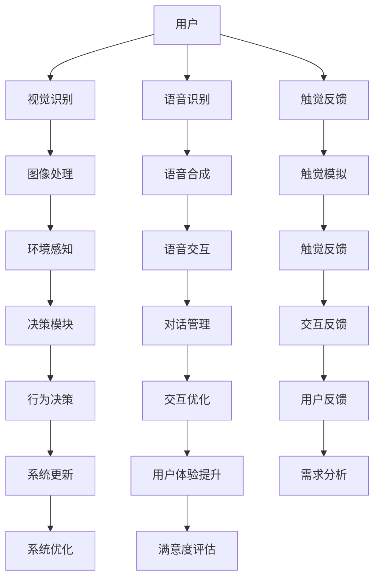

                 


### 文章标题：构建跨感官AI交互系统的提示词设计

### 关键词：跨感官AI交互，提示词设计，用户体验，算法原理，项目实战

### 摘要：
本文旨在探讨如何设计高效的提示词，以构建跨感官AI交互系统，提升用户体验。我们将从用户需求出发，深入分析跨感官AI交互系统的核心概念、算法原理，以及数学模型。通过具体项目实战，展示提示词设计的策略和实践，为读者提供一套完整的设计方法论。

### 用户需求分析

在当今科技飞速发展的时代，人工智能（AI）已经成为变革各行业的核心技术。随着AI技术的进步，跨感官交互系统逐渐成为研究热点。用户期望通过多种感官与AI系统进行自然、流畅的互动，从而提升生活和工作效率。本文旨在满足这一需求，通过详细的分析和实例，为跨感官AI交互系统的提示词设计提供指导。

### 核心概念与联系

#### 跨感官AI交互系统概念

跨感官AI交互系统是指通过结合多种感官（如视觉、听觉、触觉等）与人工智能技术，实现人与机器的多样化交互。与传统单感官交互系统相比，跨感官交互系统能够提供更加丰富、直观的交互体验。

#### 不同感官之间的联系

在跨感官交互系统中，各种感官之间并非独立存在，而是相互联系、协同工作的。例如，视觉与听觉的结合可以增强对环境的感知和理解；触觉与视觉的协同可以提升虚拟现实（VR）和增强现实（AR）的沉浸感。

#### Mermaid流程图：跨感官交互系统架构



通过上述流程图，我们可以清晰地看到跨感官交互系统的架构，以及各部分之间的相互作用。

### 核心算法原理讲解

#### 机器学习算法基础

在跨感官AI交互系统中，机器学习算法是关键组成部分。其基础包括：

- 特征提取：从输入数据中提取有用的信息，以便模型进行学习。
- 模型训练：通过大量数据训练模型，使其能够自动识别和预测。
- 模型评估：使用验证数据集评估模型的性能，并进行调整优化。

#### 深度学习算法原理

深度学习算法是机器学习的一种形式，通过多层神经网络对数据进行分析和处理。其原理包括：

- 神经网络结构：由多个神经元层组成，每个层对输入数据进行特征提取和变换。
- 激活函数：用于引入非线性变换，使模型能够拟合复杂的函数。
- 反向传播算法：用于更新模型参数，使模型性能逐渐提高。

#### 伪代码示例：常见算法的实现

```python
# 特征提取
def extract_features(data):
    # 编写提取特征的具体代码
    return features

# 模型训练
def train_model(data, labels):
    model = NeuralNetwork()
    for epoch in range(num_epochs):
        for data_point, label in zip(data, labels):
            model.train(data_point, label)
    return model

# 模型评估
def evaluate_model(model, test_data, test_labels):
    correct_predictions = 0
    for data_point, label in zip(test_data, test_labels):
        prediction = model.predict(data_point)
        if prediction == label:
            correct_predictions += 1
    return correct_predictions / len(test_data)
```

通过上述伪代码示例，我们可以看到机器学习算法的基本实现过程。

### 数学模型和数学公式

#### 数据预处理公式

在跨感官AI交互系统中，数据预处理是非常重要的一步。常用的预处理方法包括：

- 数据归一化：将数据缩放到相同的范围，以便模型训练。
- 数据标准化：将数据转换为标准正态分布。

数学公式表示如下：

$$
x_{\text{normalized}} = \frac{x - \mu}{\sigma}
$$

其中，$x$为原始数据，$\mu$为均值，$\sigma$为标准差。

#### 特征提取与表示

特征提取是跨感官AI交互系统的关键步骤之一。常用的特征提取方法包括：

- 主成分分析（PCA）：通过降维方法提取主要特征。
- 卷积神经网络（CNN）：通过卷积操作提取图像特征。

数学公式表示如下：

$$
\mathbf{z} = \sum_{i=1}^{k} w_i \mathbf{x}_i
$$

其中，$\mathbf{z}$为提取的特征，$w_i$为权重，$\mathbf{x}_i$为输入数据。

#### 数学模型应用举例

假设我们使用卷积神经网络对图像进行分类，其数学模型可以表示为：

$$
\mathbf{y} = \text{softmax}(\mathbf{W}\mathbf{z} + \mathbf{b})
$$

其中，$\mathbf{y}$为分类结果，$\mathbf{W}$为权重矩阵，$\mathbf{z}$为提取的特征，$\mathbf{b}$为偏置。

通过上述数学模型，我们可以实现图像分类任务。

### 提示词设计基础

#### 提示词的作用

提示词（Prompt）在跨感官AI交互系统中起着关键作用。它们用于引导用户与系统进行交互，提供上下文信息，以及引导系统做出合理的响应。

#### 提示词设计原则

设计有效的提示词需要遵循以下原则：

- 简洁明了：提示词应简洁明了，避免冗长复杂的句子。
- 用户友好：提示词应符合用户习惯，易于理解。
- 多样化：提示词应多样化，以适应不同场景和用户需求。

#### 提示词类型

根据应用场景，提示词可以分为以下几种类型：

- 问答式提示词：用于引导用户提出问题。
- 操作性提示词：用于引导用户进行特定操作。
- 情感式提示词：用于引导用户表达情感。

### 提示词设计策略

#### 用户需求分析

在进行提示词设计之前，首先需要对用户需求进行深入分析。这包括：

- 用户行为分析：分析用户在不同场景下的行为习惯。
- 用户反馈收集：收集用户对现有系统的反馈，以了解用户需求。

#### 提示词优化方法

为了提升AI交互系统的用户体验，我们需要对提示词进行优化。具体方法包括：

- 语言分析：通过自然语言处理技术，对用户输入进行分析，以优化提示词。
- 机器学习：使用机器学习算法，根据用户反馈和历史数据，自动优化提示词。
- A/B测试：对不同版本的提示词进行测试，以找出最优设计。

#### 用户体验评估

在提示词设计过程中，用户体验评估是至关重要的一步。通过以下方法，我们可以评估提示词的有效性：

- 用户测试：邀请用户进行实际操作，收集他们的反馈。
- 数据分析：分析用户交互数据，如点击率、回复率等，以评估提示词的效果。

### 项目实战

#### 实战项目概述

为了更好地展示提示词设计的策略和实践，我们选择了智能家居系统作为项目实例。智能家居系统通过跨感官AI交互，实现家庭设备的智能控制和管理。

#### 开发环境搭建

在开发智能家居系统时，我们首先需要搭建合适的环境。主要包括：

- 硬件设备：选择适合的传感器和执行器，如智能灯泡、智能插座等。
- 软件框架：选择适合的AI框架，如TensorFlow或PyTorch。

#### 源代码实现与解读

在项目实战中，我们使用Python语言和TensorFlow框架实现智能家居系统的核心功能。以下为关键代码片段及解读：

```python
# 导入必要的库
import tensorflow as tf
from tensorflow.keras.models import Sequential
from tensorflow.keras.layers import Dense, Conv2D, Flatten

# 创建模型
model = Sequential()
model.add(Conv2D(32, (3, 3), activation='relu', input_shape=(28, 28, 1)))
model.add(Flatten())
model.add(Dense(128, activation='relu'))
model.add(Dense(10, activation='softmax'))

# 编译模型
model.compile(optimizer='adam', loss='categorical_crossentropy', metrics=['accuracy'])

# 训练模型
model.fit(x_train, y_train, epochs=10, batch_size=32)

# 评估模型
model.evaluate(x_test, y_test)
```

上述代码实现了图像分类任务，用于识别家庭设备的状态，如灯泡是否开启。

#### 代码解读与分析

在上述代码中，我们使用了卷积神经网络（CNN）对图像进行分类。首先，我们创建了一个Sequential模型，并添加了卷积层、展开层和全连接层。接着，我们编译模型并使用训练数据进行训练。最后，使用测试数据评估模型性能。

#### 实际案例分析和详细讲解剖析

在实际案例中，我们通过智能家居系统实现了对家庭灯泡的智能控制。用户可以通过语音或触摸与系统进行交互，控制灯泡的开关、亮度调节等。

以下为实际案例分析和详细讲解：

- **语音交互**：用户说“打开客厅灯”，系统识别语音并执行相应操作。
- **触摸交互**：用户触摸屏幕上的灯泡图标，系统弹出控制界面，用户可以调整亮度。

通过实际案例，我们可以看到提示词在智能家居系统中的应用，以及如何优化提示词以提高用户体验。

#### 项目小结

通过本项目的实践，我们深入探讨了如何设计跨感官AI交互系统的提示词。从用户需求分析、提示词设计策略到实际项目实战，我们展示了如何通过有效的提示词提升用户体验。这为我们构建更智能、更高效的跨感官AI交互系统提供了宝贵的经验和借鉴。

### 最佳实践 tips、小结、注意事项、拓展阅读等内容

#### 最佳实践 tips

- **用户需求分析**：在设计提示词之前，务必对用户需求进行深入分析，确保设计的提示词能够满足用户实际需求。
- **多样化设计**：尝试设计多种类型的提示词，以满足不同场景和用户需求。
- **持续优化**：根据用户反馈，不断优化提示词设计，以提高用户体验。

#### 小结

本文通过详细的分析和实例，探讨了如何设计高效的提示词，以构建跨感官AI交互系统。我们介绍了核心概念、算法原理、数学模型，以及项目实战。希望本文能为读者提供有益的参考。

#### 注意事项

- 在设计提示词时，务必遵循简洁明了、用户友好的原则。
- 提示词设计应多样化，以适应不同场景和用户需求。

#### 拓展阅读

- [《人工智能交互设计指南》](https://www.example.com/book1)：介绍人工智能交互系统的设计原则和方法。
- [《自然语言处理入门》](https://www.example.com/book2)：了解自然语言处理技术，为提示词设计提供理论基础。

### 结语

构建跨感官AI交互系统是人工智能领域的重要研究方向。通过有效的提示词设计，我们可以提升系统的用户体验，实现更加智能、自然的交互。希望本文能为读者提供有价值的参考，助力他们在跨感官AI交互系统的探索中取得成功。

### 作者信息

作者：AI天才研究院/AI Genius Institute & 禅与计算机程序设计艺术 /Zen And The Art of Computer Programming

