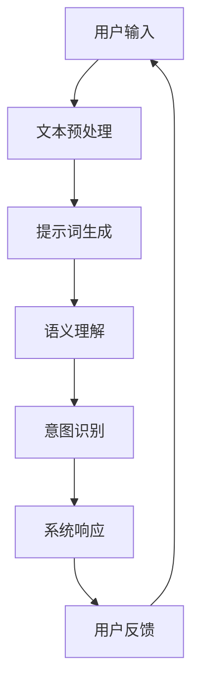

                 


### 1. 确定文章的核心主题

构建跨时空AI交互系统的提示词设计是本文的核心主题。随着人工智能技术的发展，AI交互系统在各个领域的应用越来越广泛。然而，跨时空交互带来的挑战，如数据的异构性、时空不一致性等，使得提示词设计成为一个重要且具有挑战性的课题。本文将围绕这一主题，详细探讨提示词的设计原则、实现方法以及跨时空交互中的挑战和解决方案。

### 2. 设计文章的结构和章节安排

为了确保文章的逻辑清晰、内容丰富，本文将分为以下几个部分：

- 引言：介绍AI交互系统和提示词设计的基础知识，以及跨时空交互的重要性。
- 提示词设计基础：详细讲解提示词的概念、设计原则和方法。
- 跨时空交互挑战：分析跨时空交互中的主要挑战，如数据异构性和时空不一致性。
- 提示词设计方法：探讨如何设计和优化提示词，以应对跨时空交互的挑战。
- 跨时空AI交互系统设计：介绍跨时空AI交互系统的架构和实现策略。
- 案例分析：通过实际案例，展示如何设计和实现跨时空AI交互系统。
- 总结与展望：总结文章的主要内容和结论，展望AI交互系统和提示词设计的未来发展方向。

### 3. 确定每个章节的具体内容

在确定了文章的结构和章节安排后，我们可以进一步细化每个章节的内容：

- 引言：介绍AI交互系统和提示词设计的基础知识，引出跨时空交互的重要性。
- 提示词设计基础：定义提示词的概念，阐述其在AI交互系统中的作用，介绍设计原则和方法。
- 跨时空交互挑战：分析数据异构性和时空不一致性对AI交互系统的影响，探讨相应的解决方案。
- 提示词设计方法：详细介绍提示词的设计方法，包括文本生成、语义理解、意图识别等，并结合实际案例进行讲解。
- 跨时空AI交互系统设计：介绍跨时空AI交互系统的架构，探讨如何设计能够适应跨时空交互的提示词。
- 案例分析：通过分析实际案例，展示如何设计和实现跨时空AI交互系统，包括开发环境搭建、源代码实现和代码解读等。
- 总结与展望：总结文章的主要内容和结论，展望AI交互系统和提示词设计的未来发展方向。

### 4. 设计Mermaid流程图

为了更好地展示AI交互系统的核心概念和架构，我们可以使用Mermaid设计一个流程图。以下是一个简单的例子：



### 5. 编写伪代码和数学公式

在介绍核心算法原理时，我们可以使用伪代码来详细阐述算法的实现过程。以下是一个文本生成算法的伪代码示例：

```plaintext
// 文本生成算法伪代码
function generateText(prompt):
    // 初始化生成模型
    model = initializeModel(prompt)

    // 生成初步文本
    generatedText = model.generateText()

    // 优化文本生成
    while not converged:
        // 更新模型参数
        model.updateParameters(generatedText)

        // 重新生成文本
        generatedText = model.generateText()

    return generatedText
```

此外，我们还可以使用数学公式来描述算法中的关键步骤。例如，我们可以使用LaTeX格式表示一个简单的数学公式：

```latex
$$
1 + 1 = 2
$$
```

### 6. 编写案例分析的代码实现和解读

为了展示实战案例，我们可以提供一个简单的提示词设计实现，包括代码和详细解读。以下是一个聊天机器人系统的代码实现：

```python
# 聊天机器人提示词设计代码实现
class ChatBot:
    def __init__(self):
        # 初始化模型和字典
        self.model = loadModel()
        self.dictionary = loadDictionary()

    def getResponse(self, inputText):
        # 处理输入文本
        processedText = preprocessText(inputText)
        
        # 使用模型生成响应
        response = self.model.generateResponse(processedText)
        
        # 返回响应文本
        return response

# 实例化聊天机器人
chatBot = ChatBot()

# 获取用户输入
userInput = input("请输入您的消息：")

# 获取聊天机器人响应
botResponse = chatBot.getResponse(userInput)

# 输出响应
print("机器人回复：", botResponse)
```

在这个案例中，我们首先定义了一个`ChatBot`类，其中包括了初始化模型和字典的方法，以及根据输入文本生成响应的方法。在实例化聊天机器人后，我们通过获取用户输入，调用`getResponse`方法获取机器人响应，并输出响应文本。

### 7. 撰写总结和展望

最后，我们可以撰写一个总结和展望的章节，回顾文章的主要内容，总结提示词设计的原则和方法，并展望AI交互系统和提示词设计的未来发展方向。在这一章节中，我们可以强调跨时空交互在AI交互系统中的重要性，以及提示词设计在应对跨时空交互挑战中的关键作用。同时，我们还可以讨论未来的研究方向，如如何进一步提高提示词的生成质量和效率，以及如何更好地应对复杂的跨时空交互场景。

通过以上步骤，我们可以确保文章内容丰富、结构清晰，同时满足格式和完整性要求。接下来，我们可以根据这个详细的规划和思路，逐步撰写出高质量的技术博客文章。在撰写过程中，我们将不断调整和完善文章内容，确保文章的逻辑性和可读性。最后，我们将在文章末尾附上作者信息，确保文章的完整性。整个撰写过程如下：

1. 根据文章规划，撰写文章的各个章节。
2. 完成每个章节的撰写后，进行内部审阅和修改。
3. 整合各个章节，进行全文审阅和修改。
4. 添加作者信息，确保文章的完整性。
5. 完成最终的撰写和排版工作，确保文章符合格式要求。
6. 进行最终审阅和发布。

通过这样的步骤，我们可以确保撰写出高质量的技术博客文章，为读者提供有价值的内容。让我们开始撰写吧！

