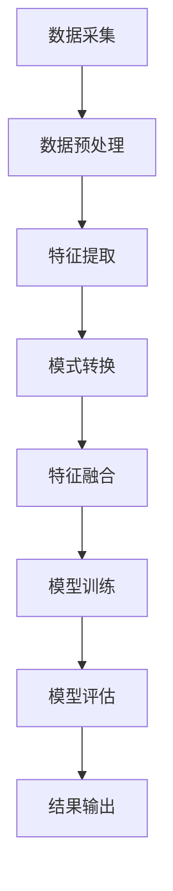

                 


### 第一步：确定文章的核心内容和结构

为了撰写一篇关于《构建跨模态AI应用的提示词策略》的技术博客文章，我们需要先明确文章的核心内容和整体结构。基于目录大纲，我们可以将文章分为四个主要部分：

1. **跨模态AI基础**：介绍跨模态AI的定义、背景、关键技术、架构设计等基础知识。
2. **提示词策略原理**：探讨提示词策略的定义、设计原则、实现方法和优化策略。
3. **跨模态AI应用实战**：通过案例分析，展示跨模态AI在不同领域的实际应用。
4. **提示词策略案例研究**：深入分析一个或多个具体的跨模态AI应用案例，展示提示词策略在实际项目中的应用和效果。

### 第二步：撰写每个部分的具体内容

#### 跨模态AI基础

在撰写这一部分时，我们需要详细阐述跨模态AI的基本概念、发展历程、关键技术、架构设计等。同时，通过图表和流程图来帮助读者更好地理解跨模态AI的工作原理。

#### 提示词策略原理

这一部分将重点介绍提示词策略的定义、设计原则、实现方法和优化策略。我们需要使用伪代码来阐述核心算法原理，并使用latex格式详细讲解数学模型和公式。

#### 跨模态AI应用实战

通过具体的案例分析，我们将展示跨模态AI在不同领域的实际应用。这部分需要详细描述项目的背景、目标、开发环境搭建、源代码实现、代码解读和案例分析等内容。

#### 提示词策略案例研究

在这一部分，我们将深入分析一个或多个具体的跨模态AI应用案例，重点讨论提示词策略的设计和应用效果。这部分内容需要包含实际案例分析和详细讲解剖析，以及对项目的小结和拓展阅读建议。

### 第三步：确保文章的逻辑性和连贯性

在撰写文章的过程中，我们需要确保文章的内容逻辑清晰、连贯性强。每个部分的内容都要紧密联系，前后呼应。同时，我们还需要注意以下几点：

- 使用简明扼要的语言，避免冗长和复杂的句子。
- 使用合适的标题和段落，使文章结构更加清晰。
- 使用图表和流程图等视觉元素，增强文章的可读性。
- 在每个小节的末尾，添加小结或注意事项，帮助读者巩固学习内容。

### 第四步：撰写文章的结尾部分

在文章的结尾，我们需要总结全文的主要内容，并提供一些建议和拓展阅读资源。这部分内容可以帮助读者更好地理解和应用跨模态AI和提示词策略。

### 第五步：检查和修改文章

在完成初稿后，我们需要对文章进行仔细检查和修改。主要关注以下几点：

- 检查文章的逻辑性和连贯性，确保每个部分都紧密联系。
- 检查语法和拼写错误，确保文章的语言表达准确无误。
- 检查图表和流程图等视觉元素，确保它们清晰、准确、易于理解。
- 检查字数，确保文章的字数在8000～12000字左右。

通过以上步骤，我们可以确保撰写出一份高质量、逻辑清晰、内容丰富的技术博客文章，为读者提供有价值的知识和见解。接下来，我们可以开始撰写文章的每个部分，并逐步完善整体结构。### 文章标题：构建跨模态AI应用的提示词策略

## 关键词：
- 跨模态AI
- 提示词策略
- 应用实战
- 数学模型
- 代码实现

## 摘要：
本文深入探讨跨模态AI应用中的提示词策略，首先介绍跨模态AI的基础概念和关键技术，然后详细解析提示词策略的设计原理、实现方法及优化策略。通过实际案例，展示跨模态AI在语音识别、图像识别和情感分析等领域的应用，并分析提示词策略在实际项目中的效果。文章最后提供跨模态AI与提示词策略的工具与资源，以供进一步学习和实践。

# 跨模态AI基础

## 1.1 跨模态AI概述

跨模态AI是指将不同模态（如文本、语音、图像、视频等）的信息进行整合和处理，以实现更高级的认知和理解能力。随着人工智能技术的不断发展，跨模态AI在多个领域展现了巨大的潜力。例如，在语音识别中，跨模态AI可以通过结合文本和语音信息，提高识别的准确率；在情感分析中，跨模态AI可以通过结合语音和图像信息，更准确地捕捉用户的情感状态。

### 1.2 跨模态AI的关键技术

跨模态AI的核心技术主要包括多模态数据的采集与处理、模式转换与融合、多模态学习的理论基础等。

- **多模态数据的采集与处理**：多模态数据通常来自于不同的传感器和来源，如摄像头、麦克风、文本输入等。这些数据需要通过预处理方法进行清洗、归一化和增强，以提高后续处理的效率和质量。

- **模式转换与融合**：模式转换是指将不同模态的数据转换为统一的表示形式，以便进行后续处理。常见的转换方法包括特征提取、特征映射和特征拼接等。模式融合是指将多个模态的特征进行整合，以获得更丰富的信息。常见的融合方法包括加权融合、级联融合和对抗性融合等。

- **多模态学习的理论基础**：多模态学习是指通过学习多个模态之间的关联性，提高AI模型对数据的理解和处理能力。常见的多模态学习理论包括联合表示学习、多任务学习和迁移学习等。

### 1.3 跨模态AI的架构设计

跨模态AI的架构设计主要包括跨模态模型的架构、多模态数据的预处理和跨模态特征的提取与表示等。

- **跨模态模型的架构**：常见的跨模态模型架构包括基于深度学习的端到端模型、基于传统机器学习的多模态分类器等。端到端模型可以直接将多模态数据输入到神经网络中，通过多层次的变换和融合，实现任务的目标。多模态分类器则通常通过将不同模态的数据分别输入到不同的子模型中进行处理，然后通过融合模块进行结果的综合。

- **多模态数据的预处理**：多模态数据的预处理是跨模态AI的重要组成部分。预处理过程包括数据清洗、归一化、特征提取等，以确保输入数据的准确性和一致性。

- **跨模态特征的提取与表示**：跨模态特征的提取与表示是跨模态AI的关键步骤。通过将不同模态的数据转换为统一的表示形式，可以更好地捕捉多模态数据之间的关联性，从而提高模型的性能。

# 跨模态AI的核心概念与联系

## 2.1 跨模态AI的核心概念

跨模态AI的核心概念包括数据模态、跨模态交互和多模态学习等。

- **数据模态**：数据模态是指数据的不同表现形式，如文本、语音、图像、视频等。在跨模态AI中，多个模态的数据通常需要进行整合和处理，以实现更高级的认知和理解能力。

- **跨模态交互**：跨模态交互是指不同模态之间的信息传递和交互。通过跨模态交互，可以实现模态之间的互补和增强，从而提高AI模型的性能。

- **多模态学习**：多模态学习是指通过学习不同模态之间的关联性，提高AI模型对数据的理解和处理能力。多模态学习可以基于深度学习、传统机器学习等方法，通过联合表示学习、多任务学习、迁移学习等技术，实现多模态数据的融合和利用。

## 2.2 跨模态AI的架构流程图

为了更好地理解跨模态AI的工作原理，我们可以使用Mermaid流程图来展示其架构流程。



在上面的流程图中，A表示数据采集，B表示数据预处理，C表示特征提取，D表示模式转换，E表示特征融合，F表示模型训练，G表示模型评估，H表示结果输出。这个流程图展示了跨模态AI的基本工作流程，从数据采集到模型训练和评估，再到结果输出，各个环节紧密衔接，共同构成了一个完整的跨模态AI系统。

# 跨模态AI的核心算法原理讲解

## 3.1 跨模态学习的算法原理

跨模态学习的算法原理主要基于多模态数据的整合和处理。以下是一个简单的伪代码示例，用于阐述跨模态学习的基本流程：

```python
# 伪代码：跨模态学习算法原理

# 输入：多模态数据集 X，标签 Y
# 输出：训练好的跨模态模型

# 步骤1：数据预处理
# 对多模态数据进行清洗、归一化和增强等处理
preprocessed_X = preprocess(X)

# 步骤2：特征提取
# 对预处理后的数据提取特征
features = extract_features(preprocessed_X)

# 步骤3：模式转换
# 将不同模态的特征进行转换
converted_features = convert_features(features)

# 步骤4：特征融合
# 将转换后的特征进行融合
fused_features = fuse_features(converted_features)

# 步骤5：模型训练
# 使用融合后的特征进行模型训练
model = train_model(fused_features, Y)

# 步骤6：模型评估
# 对模型进行评估
evaluate_model(model, X, Y)
```

在这个伪代码中，preprocess函数用于对多模态数据进行清洗、归一化和增强等处理；extract_features函数用于提取特征；convert_features函数用于将不同模态的特征进行转换；fuse_features函数用于将转换后的特征进行融合；train_model函数用于训练模型；evaluate_model函数用于评估模型。

## 3.2 数学模型与数学公式

在跨模态AI中，数学模型和数学公式是理解和实现核心算法的基础。以下是一个简单的数学模型示例，用于描述跨模态特征融合的过程：

$$
\text{fused\_feature} = \sigma(\text{W}_{\text{fusion}} \cdot [\text{feature}_{\text{image}}, \text{feature}_{\text{text}}, \text{feature}_{\text{audio}}])
$$

其中，$\text{fused\_feature}$ 表示融合后的特征向量；$\text{W}_{\text{fusion}}$ 表示融合权重矩阵；$\text{feature}_{\text{image}}$、$\text{feature}_{\text{text}}$ 和 $\text{feature}_{\text{audio}}$ 分别表示图像、文本和音频的特征向量；$\sigma$ 表示激活函数，通常为Sigmoid函数。

此外，以下是一个简单的latex公式示例，用于展示跨模态学习中的损失函数：

$$
L(\theta) = -\frac{1}{m}\sum_{i=1}^{m}y_{i}\log(\hat{y}_{i})
$$

其中，$L(\theta)$ 表示损失函数；$y_{i}$ 表示第$i$个样本的真实标签；$\hat{y}_{i}$ 表示第$i$个样本的预测标签；$m$ 表示样本总数。

通过上述数学模型和数学公式的讲解，我们可以更深入地理解跨模态AI的核心算法原理，为后续的实战部分打下坚实的基础。在接下来的部分，我们将详细讨论提示词策略的原理和实践，以进一步探讨跨模态AI应用的关键技术。

