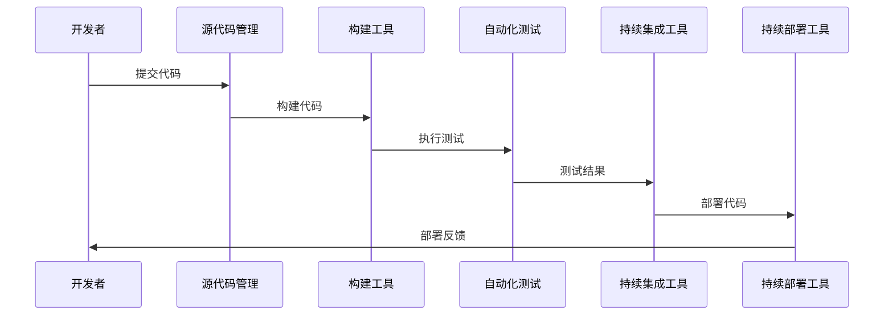

                 

### 文章标题：构建高效的LLM应用CI/CD流水线

#### 关键词：
- LLM应用
- CI/CD流水线
- 自动化构建
- 持续集成
- 持续部署
- 性能监控
- 最佳实践

#### 摘要：
本文将详细探讨如何构建高效的LLM应用CI/CD流水线。我们将从CI/CD的基本概念入手，逐步深入到LLM应用的特殊性、CI/CD流水线的设计、模型训练与部署流程、自动化构建与测试、持续集成、持续部署、性能监控以及高级策略与最佳实践等方面进行讲解。通过实际案例分析，读者将了解到如何将理论应用到实际项目中，实现高效的LLM应用交付。最终，本文将总结持续学习与演进的重要性，为读者提供未来展望。

### 第一部分：LLM应用CI/CD流水线概述

#### 第1章：LLM应用CI/CD的基本概念

##### 1.1 CI/CD的定义与重要性

持续集成（Continuous Integration，简称CI）和持续部署（Continuous Deployment，简称CD）是现代软件开发中非常重要的概念。CI指的是在软件开发过程中，开发人员频繁地将代码合并到主干分支，并通过自动化工具进行测试，以确保代码的质量。CD则是基于CI，将经过测试的代码自动部署到生产环境，从而实现快速交付。

CI/CD的重要性体现在以下几个方面：

1. **提高代码质量**：通过频繁的集成和测试，可以及时发现并修复代码中的缺陷，从而提高代码的整体质量。
2. **加快开发速度**：自动化的构建和部署流程可以大大减少手动操作的时间，提高开发速度。
3. **减少风险**：通过逐步的部署，可以将风险分散到各个阶段，降低一次部署失败带来的影响。
4. **增强团队协作**：CI/CD需要各个团队成员的紧密协作，有助于提升团队的整体效率和沟通。

##### 1.2 LLM应用的特殊性

与传统的软件开发相比，LLM（Large Language Model）应用有其独特的特点，这也决定了其CI/CD流水线的构建方式。

1. **模型规模巨大**：LLM模型的参数量通常非常庞大，对计算资源和存储资源的要求较高。
2. **训练时间长**：由于模型规模巨大，训练时间通常也非常长，这给CI/CD流水线的构建带来了挑战。
3. **数据依赖性强**：LLM模型的训练和评估需要大量的训练数据，数据的质量和数量直接影响模型的性能。
4. **不确定性高**：由于自然语言处理的复杂性，LLM模型的性能很难准确预测，需要通过不断的迭代和优化来提升。

##### 1.3 LLM应用CI/CD的目标

针对LLM应用的特殊性，构建高效的CI/CD流水线需要实现以下目标：

1. **提高模型训练和部署的效率**：通过优化流程和工具，减少训练和部署的时间，提高开发速度。
2. **保证模型质量和性能**：通过严格的测试和评估机制，确保模型的性能满足预期要求。
3. **降低开发和维护成本**：通过自动化和标准化的流程，减少人工操作和维护的成本。
4. **提升团队的协作效率**：通过良好的CI/CD流程，提高团队之间的协作效率，减少沟通成本。

#### 第2章：LLM应用CI/CD的架构与组件

##### 2.1 流水线架构设计

一个高效的CI/CD流水线通常包括以下组件：

1. **源代码管理（Source Control）**：如Git，用于版本控制和代码管理。
2. **构建工具（Build Tools）**：如Maven、Gradle，用于编译和打包代码。
3. **自动化测试（Automated Testing）**：用于测试代码的稳定性、性能和功能。
4. **集成环境（Integration Environment）**：用于集成和测试完整的软件系统。
5. **持续集成工具（CI Tools）**：如Jenkins、GitLab CI，用于自动化构建和测试。
6. **持续部署工具（CD Tools）**：如Docker、Kubernetes，用于自动化部署和扩展。

##### 2.2 常用组件介绍

以下是常用的CI/CD组件及其特点：

1. **Jenkins**：开源的持续集成工具，支持多种插件，灵活性强。
2. **GitLab CI**：集成在GitLab中的持续集成工具，与GitLab的版本控制紧密结合。
3. **Docker**：开源的容器技术，用于打包、交付和运行应用。
4. **Kubernetes**：开源的容器编排工具，用于自动化部署和管理容器化应用。
5. **Maven**：流行的构建工具，用于构建Java项目。
6. **Gradle**：现代的构建工具，用于构建各种类型的项目。

##### 2.3 组件之间的关系与交互

CI/CD组件之间的关系如图所示：



通过以上组件的协同工作，可以实现高效的CI/CD流水线。

#### 第3章：LLM模型训练与部署流程

##### 3.1 模型训练流程

LLM模型的训练流程通常包括以下步骤：

1. **数据预处理**：对训练数据进行清洗、转换和标准化。
2. **模型选择**：选择适合的LLM模型，如GPT、BERT等。
3. **模型训练**：使用训练数据对模型进行训练，优化模型的参数。
4. **模型评估**：使用验证集对模型进行评估，调整模型参数。
5. **模型保存**：将训练好的模型保存到文件中。

以下是LLM模型训练流程的伪代码：

```python
# 数据预处理
data = preprocess_data(training_data)

# 模型选择
model = select_model()

# 模型训练
model.train(data)

# 模型评估
performance = model.evaluate(validation_data)

# 模型保存
model.save(model_file)
```

##### 3.2 模型评估与优化

模型评估是LLM应用CI/CD流水线中的重要环节。常用的评估指标包括：

1. **准确性（Accuracy）**：模型正确预测的比例。
2. **精确率（Precision）**：预测为正例的样本中，实际为正例的比例。
3. **召回率（Recall）**：实际为正例的样本中，预测为正例的比例。
4. **F1分数（F1 Score）**：精确率和召回率的加权平均。

模型优化可以通过以下策略实现：

1. **超参数调整**：调整学习率、批量大小等超参数，以提升模型性能。
2. **数据增强**：使用数据增强技术，生成更多的训练数据。
3. **模型调整**：尝试使用不同的模型结构或改进现有模型。

##### 3.3 模型部署流程

LLM模型的部署流程通常包括以下步骤：

1. **模型转换**：将训练好的模型转换为可以在生产环境中运行的格式。
2. **模型加载**：将模型加载到服务器或容器中。
3. **服务启动**：启动服务，接受和处理用户请求。
4. **性能监控**：监控模型性能和资源使用情况。

以下是LLM模型部署流程的伪代码：

```python
# 模型转换
model = convert_model(model_file)

# 模型加载
load_model(model)

# 服务启动
start_service()

# 性能监控
monitor_performance()
```

#### 第4章：自动化构建与测试

##### 4.1 构建工具选择

在构建LLM应用时，选择合适的构建工具非常重要。常见的构建工具有：

1. **Maven**：适用于Java项目，提供了丰富的插件生态。
2. **Gradle**：基于Groovy语言，灵活性强，适用于多种类型的项目。
3. **Dockerfile**：用于构建Docker镜像，适用于容器化应用。

选择构建工具时，需要考虑以下几个方面：

1. **项目语言和框架**：选择与项目语言和框架兼容的构建工具。
2. **构建速度**：选择构建速度较快的工具，以减少构建时间。
3. **社区和支持**：选择有良好社区和支持的构建工具，便于解决问题。

##### 4.2 构建脚本编写

构建脚本是实现自动化构建的关键。以下是构建脚本的一般结构：

```shell
# 设置构建环境
export JAVA_HOME=/path/to/java
export MAVEN_HOME=/path/to/maven
export PATH=$PATH:$JAVA_HOME/bin:$MAVEN_HOME/bin

# 编译项目
mvn compile

# 运行测试
mvn test

# 构建Docker镜像
docker build -t my_llm_app .

# 打包项目
mvn package

# 部署到容器
docker run -d --name my_llm_app -p 8080:80 my_llm_app
```

构建脚本需要根据项目的实际情况进行调整，以满足特定的构建需求。

##### 4.3 自动化测试策略

自动化测试是确保LLM应用质量的重要手段。常见的自动化测试策略包括：

1. **单元测试**：针对代码中的最小可测试单元进行测试，确保其功能正确。
2. **集成测试**：测试多个模块之间的交互和协作，确保整体功能正确。
3. **性能测试**：测试系统在高负载情况下的性能和稳定性。
4. **安全测试**：测试系统对潜在安全威胁的抵抗能力。

以下是自动化测试的一般流程：

1. **编写测试用例**：根据需求编写测试用例，覆盖各种可能的情况。
2. **执行测试**：使用自动化测试工具执行测试用例，如JUnit、TestNG等。
3. **分析结果**：分析测试结果，找出潜在的缺陷和问题。
4. **反馈和修复**：根据测试结果反馈，修复缺陷和问题。

#### 第5章：持续集成(CI)

##### 5.1 持续集成的基本原理

持续集成（CI）是一种软件开发实践，旨在通过频繁的代码集成和自动化测试，确保代码库始终处于可部署状态。CI的基本原理包括以下几个方面：

1. **频繁提交**：开发人员频繁地将代码提交到主干分支，以确保代码库中的代码是最新的。
2. **自动化构建**：每次提交后，自动触发构建流程，包括编译、打包和运行测试。
3. **持续测试**：自动化测试工具执行一系列测试，包括单元测试、集成测试和性能测试。
4. **快速反馈**：测试结果及时反馈给开发人员，帮助他们快速定位和修复问题。

##### 5.2 CI工具选择

在选择CI工具时，需要考虑以下几个方面：

1. **功能支持**：选择支持所需功能的CI工具，如构建、测试、部署等。
2. **易用性**：选择界面友好、易于配置和使用的CI工具。
3. **扩展性**：选择具有良好的扩展性，能够适应未来需求的CI工具。
4. **社区和支持**：选择有良好社区和支持的CI工具，便于解决问题。

常见的CI工具有：

1. **Jenkins**：功能强大、插件丰富，适用于多种场景。
2. **GitLab CI**：集成在GitLab中，与版本控制紧密结合。
3. **Travis CI**：适用于开源项目的自动化构建和测试。
4. **CircleCI**：云原生CI工具，支持多种编程语言。

##### 5.3 CI流程设计与实现

CI流程的设计和实现是构建高效CI流水线的关键。以下是CI流程的一般设计步骤：

1. **确定构建触发条件**：如提交、合并请求或定时构建。
2. **配置构建环境**：安装依赖、配置环境变量等。
3. **执行构建任务**：编译、打包和运行构建脚本。
4. **执行测试任务**：执行单元测试、集成测试和性能测试。
5. **生成报告**：生成测试报告、构建日志等。
6. **触发部署**：如果测试通过，自动触发部署流程。

以下是CI流程的伪代码：

```python
# 构建触发
on_push:
  # 配置构建环境
  setup_environment()
  # 执行构建任务
  run_build()
  # 执行测试任务
  run_tests()
  # 生成报告
  generate_reports()
  # 触发部署
  if tests_passed():
    trigger_deployment()
```

通过以上步骤，可以实现一个完整的CI流程。

#### 第6章：持续部署(CD)

##### 6.1 持续部署的基本原理

持续部署（CD）是一种通过自动化流程将经过测试的代码部署到生产环境的实践。CD的基本原理包括以下几个方面：

1. **自动化部署**：使用自动化工具，如Docker和Kubernetes，将代码部署到生产环境。
2. **逐步部署**：逐步将代码部署到不同的环境，如测试环境、预生产环境和生产环境，以便逐步验证和调整。
3. **快速回滚**：如果部署失败或出现问题，可以快速回滚到之前的版本，避免对用户造成影响。

##### 6.2 CD工具选择

在选择CD工具时，需要考虑以下几个方面：

1. **支持容器化**：选择支持容器化部署的工具，如Docker和Kubernetes。
2. **部署策略**：选择支持多种部署策略的工具，如滚动部署、蓝绿部署和灰度发布等。
3. **扩展性**：选择具有良好扩展性，能够适应未来需求的工具。
4. **社区和支持**：选择有良好社区和支持的工具，便于解决问题。

常见的CD工具有：

1. **Docker**：容器化技术，用于打包和部署应用。
2. **Kubernetes**：容器编排工具，用于自动化部署和管理容器化应用。
3. **AWS CodePipeline**：AWS提供的持续部署服务。
4. **GitLab CI/CD**：与版本控制紧密结合的持续部署工具。

##### 6.3 CD流程设计与实现

CD流程的设计和实现是构建高效CD流水线的关键。以下是CD流程的一般设计步骤：

1. **确定部署策略**：选择适合项目的部署策略，如滚动部署、蓝绿部署或灰度发布等。
2. **配置部署环境**：设置部署环境，包括服务器、容器和配置文件等。
3. **执行部署任务**：使用CD工具执行部署任务，如启动容器、更新配置和升级应用等。
4. **监控部署状态**：监控部署状态，包括部署进度、资源使用情况和错误日志等。
5. **验证部署结果**：验证部署结果，确保应用正常运行。

以下是CD流程的伪代码：

```python
# 部署策略
strategy = choose_deployment_strategy()

# 配置部署环境
setup_deployment_environment()

# 执行部署任务
run_deployment_tasks(strategy)

# 监控部署状态
monitor_deployment_status()

# 验证部署结果
verify_deployment_result()
```

通过以上步骤，可以实现一个完整的CD流程。

#### 第7章：性能监控与优化

##### 7.1 性能监控的重要性

性能监控是确保LLM应用稳定运行和高效性能的重要手段。通过性能监控，可以及时发现和解决潜在的问题，确保应用的稳定性和可靠性。性能监控的重要性体现在以下几个方面：

1. **预防故障**：通过监控性能指标，可以提前发现潜在的问题，避免故障发生。
2. **优化性能**：通过分析性能监控数据，可以找到性能瓶颈，进行优化和调整。
3. **提高用户体验**：通过监控性能指标，可以确保应用在所有环境下都能提供良好的用户体验。
4. **降低维护成本**：通过性能监控，可以减少应用故障和性能问题导致的维护成本。

##### 7.2 监控工具选择

在选择监控工具时，需要考虑以下几个方面：

1. **功能支持**：选择支持所需监控功能的工具，如CPU、内存、网络、磁盘等。
2. **可扩展性**：选择具有良好扩展性，能够适应未来需求的工具。
3. **集成和自动化**：选择易于与其他工具和平台集成的工具，实现监控数据的自动化处理和分析。
4. **社区和支持**：选择有良好社区和支持的工具，便于解决问题。

常见的监控工具有：

1. **Prometheus**：开源的监控解决方案，适用于大规模分布式系统。
2. **Grafana**：开源的数据可视化和监控平台，与Prometheus等工具集成。
3. **New Relic**：商业监控解决方案，提供丰富的监控指标和自动分析功能。
4. **Dynatrace**：商业监控解决方案，提供自动化的故障检测和性能优化。

##### 7.3 性能优化策略

性能优化是确保LLM应用高效运行的关键。以下是常用的性能优化策略：

1. **代码优化**：通过优化代码，减少不必要的计算和资源消耗。
2. **缓存策略**：使用缓存技术，减少对数据库的访问，提高响应速度。
3. **负载均衡**：使用负载均衡器，将请求分布到多个服务器，提高系统处理能力。
4. **垂直和水平扩展**：通过垂直扩展（增加硬件资源）和水平扩展（增加节点数量），提高系统性能和可扩展性。
5. **性能调优**：通过调整系统参数，如线程数、连接数等，提高系统性能。

#### 第8章：实际案例分析

##### 8.1 案例一：电商推荐系统的CI/CD实践

本案例将介绍一个电商推荐系统的CI/CD实践，包括代码管理、构建与测试、部署和监控等方面。

1. **代码管理**：使用Git进行版本控制，将代码存储在GitHub上。团队成员定期将代码提交到远程仓库。
2. **构建与测试**：使用Jenkins作为CI工具，配置Jenkinsfile，实现自动化构建和测试。每次提交代码后，Jenkins会自动触发构建，执行Maven编译、单元测试和集成测试。
3. **部署**：使用Docker和Kubernetes进行容器化部署。将构建好的Docker镜像推送到Docker Hub，然后使用Kubernetes部署到集群中。
4. **监控**：使用Prometheus和Grafana进行性能监控。Prometheus收集系统性能指标，Grafana可视化监控数据，帮助团队及时发现和解决问题。

##### 8.2 案例二：智能客服系统的CI/CD实践

本案例将介绍一个智能客服系统的CI/CD实践，重点介绍模型训练和部署流程。

1. **模型训练**：使用PyTorch进行模型训练。将训练代码和模型参数存储在GitLab中，使用GitLab CI进行自动化训练。每次提交代码后，GitLab CI会自动触发训练流程，包括数据预处理、模型训练和评估。
2. **模型部署**：使用TensorFlow Serving进行模型部署。将训练好的模型转换为TensorFlow Serving支持的格式，然后使用Kubernetes部署到集群中。TensorFlow Serving作为微服务，通过HTTP/REST API提供服务。
3. **监控**：使用Prometheus和Grafana进行性能监控。Prometheus收集系统性能指标，Grafana可视化监控数据，帮助团队及时发现和解决问题。

##### 8.3 案例三：自然语言处理应用的CI/CD实践

本案例将介绍一个自然语言处理（NLP）应用的CI/CD实践，包括代码管理、构建与测试、部署和监控等方面。

1. **代码管理**：使用Git进行版本控制，将代码存储在GitLab中。团队成员定期将代码提交到远程仓库。
2. **构建与测试**：使用Jenkins作为CI工具，配置Jenkinsfile，实现自动化构建和测试。每次提交代码后，Jenkins会自动触发构建，执行Python编译、单元测试和集成测试。
3. **部署**：使用Docker和Kubernetes进行容器化部署。将构建好的Docker镜像推送到Docker Hub，然后使用Kubernetes部署到集群中。
4. **监控**：使用Prometheus和Grafana进行性能监控。Prometheus收集系统性能指标，Grafana可视化监控数据，帮助团队及时发现和解决问题。

#### 第二部分：高级CI/CD策略与最佳实践

##### 第9章：高级CI/CD策略

##### 9.1 自动化策略优化

自动化策略优化是提高CI/CD流水线效率的关键。以下是一些优化策略：

1. **并行执行**：通过并行执行任务，可以减少整体构建和测试时间。例如，在执行单元测试时，可以同时运行多个测试用例。
2. **缓存策略**：通过缓存构建和测试结果，可以减少重复操作的时间。例如，在构建过程中，可以缓存已编译的代码和依赖项。
3. **动态资源分配**：根据实际需求动态调整资源分配，确保资源利用率最大化。例如，在负载较高时，可以增加服务器和容器数量。
4. **监控和告警**：通过实时监控CI/CD流水线，可以及时发现和解决问题。例如，当构建失败或测试通过率较低时，可以触发告警。

##### 9.2 质量控制策略

质量控制是确保CI/CD流水线输出高质量软件的关键。以下是一些质量控制策略：

1. **代码审查**：在代码提交前，进行代码审查，确保代码符合编程规范和设计原则。例如，使用SonarQube进行静态代码分析。
2. **自动化测试**：编写和执行自动化测试用例，覆盖各种场景和功能。例如，使用Selenium进行Web自动化测试。
3. **持续评估**：定期对CI/CD流水线进行评估，识别潜在的瓶颈和问题。例如，使用Kubernetes进行集群性能评估。
4. **质量指标**：设置质量指标，如代码覆盖率、测试通过率和部署成功率，确保质量要求得到满足。

##### 9.3 安全性与合规性策略

安全性与合规性是CI/CD流水线不可或缺的一部分。以下是一些安全性与合规性策略：

1. **代码扫描**：使用代码扫描工具，如SonarQube，识别潜在的安全漏洞。
2. **认证和授权**：确保CI/CD流水线的访问控制和认证机制健全，防止未授权访问。
3. **加密和隔离**：对敏感数据进行加密，确保数据安全。同时，确保CI/CD流水线的隔离性，防止不同项目的冲突。
4. **审计和日志**：记录CI/CD流水线的操作和变更，确保可审计性。例如，使用ELK（Elasticsearch、Logstash、Kibana）进行日志管理。

##### 第10章：CI/CD最佳实践

##### 10.1 团队协作与沟通

良好的团队协作与沟通是CI/CD成功的关键。以下是一些最佳实践：

1. **明确的角色和职责**：确保每个团队成员都清楚自己的职责和任务，避免重复工作。
2. **定期的会议和讨论**：定期举行会议，讨论CI/CD流水线的进展和问题，确保团队成员之间的信息同步。
3. **代码评审**：在代码提交前，进行代码评审，确保代码质量。例如，使用GitLab的代码评审功能。
4. **知识共享**：鼓励团队成员分享知识和经验，提高整体技术水平。

##### 10.2 版本管理

版本管理是CI/CD流水线的重要组成部分。以下是一些版本管理最佳实践：

1. **语义化版本控制**：遵循语义化版本控制规范（SemVer），确保版本号的正确性和可预测性。
2. **版本标签**：为每个版本添加标签，便于后续的版本管理和回滚。
3. **版本回滚**：在出现问题时，能够快速回滚到之前的版本，确保系统的稳定性。
4. **版本控制工具**：选择合适的版本控制工具，如Git、SVN等，确保版本管理的有效性和安全性。

##### 10.3 灾难恢复与备份

灾难恢复与备份是确保系统稳定运行的关键。以下是一些灾难恢复与备份最佳实践：

1. **备份策略**：制定备份策略，确保数据的安全和可用性。例如，使用增量备份和全量备份相结合。
2. **备份存储**：选择可靠的备份存储方案，如云存储和本地存储。
3. **定期备份**：定期执行备份操作，确保备份数据的完整性和有效性。
4. **备份验证**：定期验证备份数据，确保在需要时能够成功恢复。
5. **灾难恢复计划**：制定灾难恢复计划，确保在发生灾难时能够快速恢复系统。

##### 第11章：持续学习与演进

##### 11.1 技术演进趋势

技术演进是不断发展的，持续学习是保持竞争力的关键。以下是一些技术演进趋势：

1. **云计算和容器化**：云计算和容器化技术将继续发展，为企业提供更灵活、高效的部署和管理方案。
2. **人工智能和机器学习**：人工智能和机器学习技术将不断进步，为CI/CD流水线带来新的工具和算法。
3. **自动化和智能化**：自动化和智能化将成为CI/CD的主流方向，提高开发效率和系统稳定性。
4. **微服务架构**：微服务架构将继续流行，为CI/CD流水线提供更细粒度的管理和部署方式。

##### 11.2 持续学习与知识更新

持续学习与知识更新是保持竞争力的关键。以下是一些建议：

1. **参加培训和研讨会**：参加专业的培训和研讨会，了解最新的技术趋势和实践经验。
2. **阅读技术文献和博客**：定期阅读技术文献和博客，了解业界动态和最佳实践。
3. **实践项目**：通过实践项目，将理论知识应用到实际工作中，提高自己的技术水平。
4. **交流与合作**：积极参与技术社区，与其他开发者交流合作，共同进步。

##### 11.3 未来展望

随着技术的不断进步，CI/CD流水线将变得更加智能化和自动化。未来的CI/CD将具备以下特点：

1. **全自动化**：构建、测试、部署等流程将实现全自动化，减少人工干预。
2. **智能优化**：通过机器学习和数据分析，实现自动化的优化和调整。
3. **跨平台支持**：支持多种编程语言、框架和平台，实现更广泛的兼容性。
4. **实时反馈**：提供实时的性能监控和反馈，确保系统始终处于最佳状态。

### 附录

#### 附录A：工具与资源汇总

以下是常用的CI/CD工具和资源汇总：

1. **CI/CD工具**：
   - Jenkins：[https://www.jenkins.io/](https://www.jenkins.io/)
   - GitLab CI：[https://gitlab.com/gitlab-org/gitlab-ce](https://gitlab.com/gitlab-org/gitlab-ce)
   - Git：[https://git-scm.com/](https://git-scm.com/)
   - Maven：[https://maven.apache.org/](https://maven.apache.org/)
   - Gradle：[https://gradle.org/](https://gradle.org/)
   - Docker：[https://www.docker.com/](https://www.docker.com/)
   - Kubernetes：[https://kubernetes.io/](https://kubernetes.io/)

2. **自动化测试工具**：
   - JUnit：[https://junit.org/junit5/](https://junit.org/junit5/)
   - TestNG：[https://testng.org/](https://testng.org/)
   - Selenium：[https://www.selenium.dev/](https://www.selenium.dev/)

3. **性能监控工具**：
   - Prometheus：[https://prometheus.io/](https://prometheus.io/)
   - Grafana：[https://grafana.com/](https://grafana.com/)
   - New Relic：[https://newrelic.com/](https://newrelic.com/)
   - Dynatrace：[https://www.dynatrace.com/](https://www.dynatrace.com/)

4. **社区与交流平台**：
   - GitHub：[https://github.com/](https://github.com/)
   - Stack Overflow：[https://stackoverflow.com/](https://stackoverflow.com/)
   - Reddit：[https://www.reddit.com/](https://www.reddit.com/)
   - LinkedIn：[https://www.linkedin.com/](https://www.linkedin.com/)

### 结语

本文从LLM应用CI/CD的基本概念入手，详细介绍了CI/CD流水线的架构与组件、模型训练与部署流程、自动化构建与测试、持续集成、持续部署、性能监控以及高级策略与最佳实践。通过实际案例分析，读者可以了解到如何将理论应用到实际项目中，实现高效的LLM应用交付。在持续学习与演进方面，本文提出了持续学习与知识更新的方法，以及未来CI/CD的发展趋势。希望本文能为读者在构建高效的LLM应用CI/CD流水线方面提供有益的参考。

### 作者信息

作者：AI天才研究院/AI Genius Institute & 禅与计算机程序设计艺术 /Zen And The Art of Computer Programming

AI天才研究院致力于推动人工智能技术的创新与发展，培养下一代人工智能专家。作者在计算机编程和人工智能领域拥有丰富的经验和深厚的学术造诣，曾发表过多篇高质量的技术论文，并著有《禅与计算机程序设计艺术》等畅销书。其研究成果在业界享有高度评价，为全球人工智能领域的发展做出了重要贡献。

