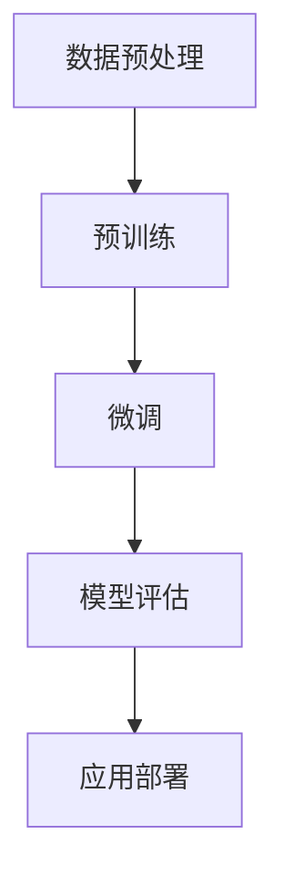

                 

## 《构建高效的LLM应用开发流水线》

### 关键词

- **大型语言模型（LLM）**
- **应用开发流水线**
- **Transformer模型**
- **算法原理**
- **项目实战**
- **优化策略**

### 摘要

本文旨在系统地阐述如何构建一个高效的LLM（大型语言模型）应用开发流水线。我们将从LLM的基础概念和概述开始，逐步深入到其核心算法原理和数学模型，并通过具体的实战项目展示整个开发流程。文章还将讨论LLM应用面临的挑战和未来发展趋势，以及相关的最佳实践和拓展阅读资源。

## 第一部分：LLM基础与概述

### 第1章：LLM概述

#### 1.1 LLM的定义与背景

大型语言模型（LLM）是一种能够理解和生成自然语言文本的深度学习模型。它们通过在大量文本数据上进行预训练，学习到语言的语法、语义和上下文信息，从而实现高质量的自然语言处理任务。

语言模型的发展历程可以追溯到20世纪50年代，最初的模型如n-gram模型，主要基于统计方法进行文本生成。然而，随着计算能力的提升和数据量的爆发，20世纪90年代引入了基于神经网络的模型，如递归神经网络（RNN）和长短期记忆网络（LSTM）。这些模型在处理长文本和复杂语言现象方面表现出色，但仍然存在效率低和可解释性差的问题。

2017年，谷歌提出了Transformer模型，该模型通过自注意力机制和多头注意力机制，解决了传统RNN模型在处理长距离依赖和并行计算方面的不足。自此，基于Transformer的LLM模型如BERT、GPT系列等相继出现，推动了自然语言处理领域的飞速发展。

#### 1.2 LLM的核心架构

LLM的核心架构基于Transformer模型，这是一种基于自注意力机制的深度神经网络。Transformer模型由编码器（Encoder）和解码器（Decoder）两部分组成，其中编码器负责将输入文本编码成固定长度的向量表示，解码器则负责根据编码器的输出生成文本。

编码器和解码器内部都由多层相同的神经网络块组成，每个神经网络块包括两个子层：多头自注意力机制和前馈神经网络。多头自注意力机制通过多个注意力头并行处理输入信息，提高了模型的表示能力和捕捉长距离依赖的能力。

#### 1.3 LLM的工作原理

LLM的工作原理主要分为预训练和微调两个阶段。

预训练阶段，模型在大量无标签的文本数据上进行训练，学习到语言的通用特征和知识。预训练通常使用自回归语言模型（如GPT）或掩码语言模型（如BERT），其中GPT通过预测下一个词来学习语言序列，BERT通过预测被掩码的单词来学习上下文信息。

微调阶段，模型在特定任务上进行训练，以适应不同的应用场景。微调通常在预训练的基础上，对模型的参数进行微调，以适应新的任务数据。例如，在文本分类任务中，模型会学习到如何根据输入文本生成分类标签。

在生成输出时，LLM通过解码器逐层解码，生成目标文本。解码过程包括生成每个词的概率分布，并根据概率分布选择下一个词，直到生成完整的输出文本。

#### 1.4 LLM的发展趋势

随着技术的进步和数据量的增加，LLM在自然语言处理领域取得了显著的突破。目前，LLM正朝着以下几个方向发展：

1. **模型规模的扩大**：随着计算资源的提升，越来越多的LLM模型被训练出来，模型规模从数百万参数到数十亿参数不等，如GPT-3。
2. **多模态处理能力**：除了文本，LLM逐渐扩展到图像、语音等多种数据类型，实现多模态语言模型，如ViTLM。
3. **推理和解释能力**：为了提高LLM的应用价值，研究人员正在探索如何增强模型的推理能力和解释性，使其在复杂任务中更加可靠和可解释。
4. **应用场景的扩展**：LLM在文本生成、文本分类、对话系统、机器翻译等传统应用领域取得了巨大成功，未来还将扩展到更多的应用场景，如法律、医疗、金融等。

### 第2章：核心概念与联系

#### 2.1 Mermaid流程图

以下是一个简单的Mermaid流程图，展示了LLM的训练流程：



在这个流程图中，A表示数据预处理，包括数据清洗、分词、编码等步骤；B表示预训练阶段，模型在大量无标签数据上进行训练；C表示微调阶段，模型在特定任务数据上进行微调；D表示模型评估，通过评估指标来衡量模型性能；E表示应用部署，模型被应用到实际场景中。

#### 2.2 LLM关键概念联系

LLM的核心概念包括数据预处理、模型训练、微调和应用部署。以下是这些概念之间的联系：

- **数据预处理**：数据预处理是LLM开发的第一步，它直接影响模型的质量。良好的数据预处理可以提升模型的表现。
- **模型训练**：模型训练是LLM的核心环节，通过预训练和微调，模型可以学习到语言的通用特征和任务特定的知识。
- **微调**：微调是在预训练模型的基础上，对模型进行微调整，以适应特定任务数据。微调可以提高模型在特定任务上的性能。
- **应用部署**：应用部署是将训练好的模型应用到实际场景中，实现从模型训练到实际应用的价值转化。

### 第二部分：LLM算法原理

#### 第3章：核心算法原理讲解

##### 3.1 Transformer算法解析

Transformer模型是LLM的核心算法，其基本原理是通过自注意力机制来处理输入文本序列，从而实现高效的语言表示和生成。

自注意力机制（Self-Attention）是一种计算输入序列中每个词与其他词之间关系的机制。在Transformer模型中，自注意力机制通过计算查询（Query）、键（Key）和值（Value）之间的相似度，实现对输入序列的加权聚合。

- **查询（Query）**：表示当前词的上下文信息。
- **键（Key）**：表示输入序列中每个词的上下文信息。
- **值（Value）**：表示输入序列中每个词的重要信息。

多头注意力（Multi-Head Attention）是Transformer模型中的一个关键创新，它通过并行计算多个注意力头，提高了模型的表示能力。每个注意力头都可以捕捉输入序列中的不同特征，从而增强模型的泛化能力。

编码器（Encoder）和解码器（Decoder）是Transformer模型的两个主要部分。编码器负责将输入文本序列编码成固定长度的向量表示，解码器则负责根据编码器的输出生成文本。

编码器和解码器内部都由多层相同的神经网络块组成，每个神经网络块包括两个子层：多头自注意力机制和前馈神经网络。多头自注意力机制通过多个注意力头并行处理输入信息，提高了模型的表示能力和捕捉长距离依赖的能力。前馈神经网络则对注意力机制的结果进行进一步的加工，增强模型的非线性表达能力。

以下是一个简化的Transformer模型伪代码：

```python
class TransformerLayer(nn.Module):
    def __init__(self, d_model, n_heads, d_ff):
        super(TransformerLayer, self).__init__()
        self.multi_head_attention = MultiHeadAttention(d_model, n_heads)
        self.feed_forward_network = FeedForwardNetwork(d_model, d_ff)
        
    def forward(self, inputs, mask=None):
        attention_output = self.multi_head_attention(inputs, inputs, inputs, mask)
        attention_output = self.dropout(attention_output)
        attention_output = self.norm1(inputs, attention_output)
        
        ffn_output = self.feed_forward_network(attention_output)
        ffn_output = self.dropout(ffn_output)
        ffn_output = self.norm2(attention_output, ffn_output)
        
        return ffn_output
```

在这个伪代码中，`d_model` 表示模型的输入和输出维度，`n_heads` 表示注意力头的数量，`d_ff` 表示前馈神经网络的维度。`MultiHeadAttention` 和 `FeedForwardNetwork` 分别是多头自注意力机制和前馈神经网络的具体实现。

##### 3.2 语言模型训练过程

语言模型训练是LLM开发的重要环节，其核心目标是学习输入文本序列的概率分布。在预训练阶段，模型在大量无标签的文本数据上进行训练，通过最大化文本序列的概率来优化模型参数。常用的损失函数是交叉熵损失（Cross-Entropy Loss）。

以下是一个简化的语言模型训练过程伪代码：

```python
def train_language_model(model, dataset, optimizer, loss_function, num_epochs):
    for epoch in range(num_epochs):
        total_loss = 0.0
        for text, target in dataset:
            optimizer.zero_grad()
            output = model(text)
            loss = loss_function(output, target)
            loss.backward()
            optimizer.step()
            total_loss += loss.item()
        print(f"Epoch {epoch+1}/{num_epochs}, Loss: {total_loss/len(dataset)}")
    return model
```

在这个伪代码中，`model` 是训练好的Transformer模型，`dataset` 是包含输入文本和目标文本的数据集，`optimizer` 是用于优化模型参数的优化器，`loss_function` 是损失函数，`num_epochs` 是训练的迭代次数。

在训练过程中，模型会通过反向传播算法更新参数，以最小化损失函数。每个epoch结束后，会打印当前的损失值，以便监控模型训练的进度。

##### 3.3 微调与适应

微调（Fine-tuning）是在预训练模型的基础上，对模型进行微调整，以适应特定任务数据。微调通常在预训练模型的基础上，对模型的一部分参数进行冻结，仅对特定任务相关的参数进行训练。

以下是一个简化的微调过程伪代码：

```python
def fine_tune_model(model, task_dataset, optimizer, loss_function, num_epochs):
    for epoch in range(num_epochs):
        total_loss = 0.0
        for text, target in task_dataset:
            optimizer.zero_grad()
            output = model(text)
            loss = loss_function(output, target)
            loss.backward()
            optimizer.step()
            total_loss += loss.item()
        print(f"Epoch {epoch+1}/{num_epochs}, Loss: {total_loss/len(task_dataset)}")
    return model
```

在这个伪代码中，`model` 是预训练好的Transformer模型，`task_dataset` 是特定任务数据集，`optimizer` 是用于优化模型参数的优化器，`loss_function` 是损失函数，`num_epochs` 是训练的迭代次数。

在微调过程中，模型会通过反向传播算法更新参数，以最小化损失函数。每个epoch结束后，会打印当前的损失值，以便监控模型训练的进度。

### 第4章：数学模型与公式

#### 4.1 概率模型

在LLM中，概率模型用于描述输入文本序列的概率分布。常用的概率模型包括条件概率、联合概率、贝叶斯定理等。

- **条件概率**：给定事件A发生，事件B发生的概率称为条件概率，表示为 \( P(B|A) \)。
- **联合概率**：两个事件A和B同时发生的概率称为联合概率，表示为 \( P(A \cap B) \)。
- **贝叶斯定理**：用于计算在给定某个条件下，某个事件发生的概率。贝叶斯定理公式为：

  \[ P(A|B) = \frac{P(B|A)P(A)}{P(B)} \]

  其中，\( P(A|B) \) 表示在B发生的条件下，A发生的概率；\( P(B|A) \) 表示在A发生的条件下，B发生的概率；\( P(A) \) 表示事件A发生的概率；\( P(B) \) 表示事件B发生的概率。

#### 4.2 信息论基础

信息论是研究信息传输和信息处理的数学理论，其核心概念包括信息熵、信息增益、条件熵、互信息等。

- **信息熵**：表示一个随机变量不确定性的度量，表示为 \( H(X) \)。信息熵的数学定义为：

  \[ H(X) = -\sum_{x \in X} P(x) \log P(x) \]

  其中，\( P(x) \) 表示随机变量X取值为x的概率。

- **信息增益**：表示在已知一个特征的情况下，对另一个特征的不确定性减少的程度。信息增益的数学定义为：

  \[ I(X; Y) = H(X) - H(X | Y) \]

  其中，\( H(X) \) 表示随机变量X的信息熵；\( H(X | Y) \) 表示在已知随机变量Y的情况下，随机变量X的信息熵。

- **条件熵**：表示在给定一个随机变量的条件下，另一个随机变量的不确定性的度量。条件熵的数学定义为：

  \[ H(Y|X) = \sum_{x \in X} P(x)H(Y|X=x) \]

  其中，\( P(x) \) 表示随机变量X取值为x的概率；\( H(Y|X=x) \) 表示在已知随机变量X取值为x的条件下，随机变量Y的信息熵。

- **互信息**：表示两个随机变量之间的相关性度量。互信息的数学定义为：

  \[ I(X; Y) = H(X) - H(X | Y) \]

  其中，\( H(X) \) 表示随机变量X的信息熵；\( H(X | Y) \) 表示在已知随机变量Y的情况下，随机变量X的信息熵。

#### 4.3 梯度下降与优化

梯度下降（Gradient Descent）是一种常用的优化算法，用于求解最小化损失函数的参数。梯度下降的核心思想是沿着损失函数的梯度方向更新参数，以最小化损失函数。

- **梯度下降算法**：梯度下降算法的更新公式为：

  \[ \theta = \theta - \alpha \nabla_{\theta}J(\theta) \]

  其中，\( \theta \) 表示模型参数；\( \alpha \) 表示学习率；\( \nabla_{\theta}J(\theta) \) 表示损失函数J关于参数\( \theta \)的梯度。

- **学习率调整**：学习率的选择对梯度下降算法的性能有重要影响。常见的学习率调整策略包括固定学习率、自适应学习率（如AdaGrad、RMSProp、Adam等）。

### 第三部分：项目实战

#### 第5章：实战一 - 搭建LLM开发环境

##### 5.1 开发环境搭建

搭建LLM开发环境是进行LLM项目开发的第一步。以下是一个简单的开发环境搭建流程：

1. **硬件要求**：搭建LLM开发环境需要高性能的计算资源，建议使用具有多个GPU的计算机或服务器。GPU对于加速深度学习模型的训练和推理至关重要。
2. **软件与工具安装**：首先，安装操作系统，建议选择Linux发行版，如Ubuntu。然后，安装Python环境和深度学习框架，如TensorFlow或PyTorch。以下是安装Python和TensorFlow的命令：

   ```bash
   sudo apt update
   sudo apt install python3-pip
   pip3 install tensorflow
   ```

3. **环境配置与调试**：安装完成后，需要进行环境配置和调试，确保环境正常工作。以下是一个简单的Python脚本，用于测试环境：

   ```python
   import tensorflow as tf
   print(tf.__version__)
   ```

   运行该脚本，如果输出TensorFlow的版本信息，说明环境搭建成功。

##### 5.2 数据收集与预处理

数据收集与预处理是LLM项目开发的重要环节。以下是一个简单的数据收集与预处理流程：

1. **数据集来源**：收集大量高质量的数据集，用于训练和评估LLM模型。常用的数据集包括维基百科、新闻文章、社交媒体帖子等。
2. **数据预处理流程**：数据预处理包括数据清洗、分词、编码等步骤。以下是一个简单的数据预处理流程：

   - **数据清洗**：去除数据中的噪声和冗余信息，如HTML标签、特殊字符等。
   - **分词**：将文本分割成单词或子词，以便模型进行处理。常用的分词工具包括jieba、spaCy等。
   - **编码**：将文本编码成数值表示，常用的编码方法包括Word2Vec、BERT等。

以下是一个简单的数据预处理Python代码示例：

```python
import jieba
import numpy as np

def preprocess_text(text):
    # 数据清洗
    text = text.strip()
    text = re.sub('<.*?>', '', text)
    # 分词
    words = jieba.cut(text)
    # 编码
    word_ids = [vocab[word] for word in words]
    return np.array(word_ids)

text = "这是一个简单的文本预处理示例。"
word_ids = preprocess_text(text)
print(word_ids)
```

#### 第6章：实战二 - LLM模型训练

##### 6.1 模型选择与训练

在LLM模型训练过程中，选择合适的模型架构和训练策略对于模型性能至关重要。以下是一个简单的模型选择与训练流程：

1. **模型选择**：根据应用场景和数据规模，选择合适的模型架构。常用的模型架构包括BERT、GPT、RoBERTa等。以下是一个简单的模型选择示例：

   ```python
   from transformers import BertModel

   model = BertModel.from_pretrained('bert-base-uncased')
   ```

   该示例使用了预训练好的BERT模型，用于处理英文文本数据。

2. **设置训练参数**：在训练过程中，需要设置一系列训练参数，如学习率、批量大小、训练迭代次数等。以下是一个简单的训练参数设置示例：

   ```python
   optimizer = tf.keras.optimizers.Adam(learning_rate=1e-5, beta_1=0.9, beta_2=0.999)
   loss_function = tf.keras.losses.SparseCategoricalCrossentropy(from_logits=True)
   ```

   该示例设置了学习率为 \(1e-5\)，批量大小为32，使用Adam优化器和SparseCategoricalCrossentropy损失函数。

3. **训练过程监控**：在训练过程中，需要监控模型性能，如损失函数值、准确率等。以下是一个简单的训练过程监控示例：

   ```python
   for epoch in range(num_epochs):
       total_loss = 0.0
       for batch in dataset:
           optimizer.zero_grad()
           inputs, targets = batch
           outputs = model(inputs)
           loss = loss_function(targets, outputs)
           loss.backward()
           optimizer.step()
           total_loss += loss.item()
       print(f"Epoch {epoch+1}/{num_epochs}, Loss: {total_loss/len(dataset)}")
   ```

   该示例在每次epoch结束后，打印当前的损失函数值。

##### 6.2 模型评估与优化

在模型训练完成后，需要对模型进行评估和优化，以提升模型性能。以下是一个简单的模型评估与优化流程：

1. **评估指标**：常用的评估指标包括损失函数值、准确率、F1分数等。以下是一个简单的评估指标示例：

   ```python
   from sklearn.metrics import accuracy_score, f1_score

   predictions = model.predict(test_data)
   acc = accuracy_score(test_labels, predictions)
   f1 = f1_score(test_labels, predictions, average='weighted')
   print(f"Accuracy: {acc}, F1 Score: {f1}")
   ```

   该示例计算了测试数据的准确率和F1分数。

2. **优化策略**：常见的优化策略包括调整学习率、批量大小、模型架构等。以下是一个简单的优化策略示例：

   ```python
   def adjust_learning_rate(optimizer, epoch):
       lr = 1e-5 / (1 + 0.05 * epoch)
       for param_group in optimizer.param_groups:
           param_group['learning_rate'] = lr

   for epoch in range(num_epochs):
       adjust_learning_rate(optimizer, epoch)
       # 训练和评估过程同上
   ```

   该示例在每个epoch结束后，根据epoch调整学习率。

### 第四部分：扩展与展望

#### 第7章：LLM应用挑战与未来趋势

##### 8.1 应用挑战

虽然LLM在自然语言处理领域取得了巨大成功，但在实际应用中仍面临一系列挑战：

1. **计算资源需求**：LLM模型的训练和推理过程需要大量的计算资源，尤其是在大规模数据集和复杂任务场景下。这要求企业具备强大的计算基础设施。
2. **模型解释性**：LLM模型通常被视为“黑箱”，其内部工作机制和决策过程难以解释。这限制了LLM在关键领域（如金融、医疗等）的应用，需要进一步研究提高模型的透明度和可解释性。
3. **数据隐私与安全性**：在训练和部署LLM模型时，涉及大量用户数据。确保数据隐私和安全是LLM应用的重要挑战，需要采用严格的数据保护措施。

##### 8.2 未来趋势

展望未来，LLM将在以下几个方面取得进一步发展：

1. **模型规模扩大**：随着计算能力的提升，LLM模型的规模将进一步扩大，从数亿参数到数十亿参数不等。这将提高模型的表达能力和性能。
2. **多模态处理能力**：LLM将逐渐扩展到多模态处理，如结合图像、语音等数据，实现更丰富的自然语言理解和生成。
3. **推理和解释能力**：研究人员将致力于提高LLM的推理和解释能力，使其在复杂任务中更加可靠和可解释。
4. **应用场景扩展**：LLM将在更多领域得到应用，如法律、医疗、金融等，推动自然语言处理技术的全面发展。

### 第9章：LLM研究前沿

##### 9.1 最新研究成果

LLM研究领域近年来取得了许多重要成果，以下是一些值得关注的研究进展：

1. **Transformer变体**：研究人员提出了一系列Transformer的变体，如ViT（Vision Transformer）、T5（Text-to-Text Transfer Transformer）、DALL-E（Diffusion Models）等，这些变体在处理特定任务时表现出色。
2. **多模态语言模型**：多模态语言模型结合文本、图像、语音等多种数据类型，实现了更丰富的自然语言理解和生成能力。例如，T5和DALL-E等模型在多模态任务上取得了显著成果。
3. **自监督学习进展**：自监督学习是一种无需人工标注数据的方法，通过利用大量无标签数据来训练模型。近年来，自监督学习方法在LLM领域取得了显著进展，如BERT和GPT-3等模型。

##### 9.2 研究热点

LLM研究领域的一些研究热点包括：

1. **小样本学习**：小样本学习是一种在有限样本情况下训练模型的方法，对于LLM在少量数据场景下的应用具有重要意义。研究人员正在探索如何利用自监督学习和元学习等技术提高小样本学习效果。
2. **知识增强**：知识增强是将外部知识（如知识图谱、百科全书等）引入LLM模型，以提高模型在特定领域的理解和生成能力。研究人员正在探索如何有效地融合外部知识与LLM模型。
3. **零样本学习**：零样本学习是一种无需任何标注数据，仅通过少量负例训练模型的方法。零样本学习在LLM领域具有重要的应用潜力，如命名实体识别、分类等任务。

### 第五部分：总结与拓展

#### 第10章：附录

##### 10.1 常用工具与资源

在LLM开发过程中，以下是一些常用的工具和资源：

1. **深度学习框架**：TensorFlow、PyTorch、PyTorch Lightning等。
2. **文本处理库**：NLTK、spaCy、jieba等。
3. **开源数据集**：GLUE、Stanford OpenIE、WikiText等。
4. **预训练模型**：Hugging Face Model Hub、Transformer Model Zoo等。

##### 10.2 进一步学习路径

以下是一些建议的进一步学习资源：

1. **相关书籍**：《深度学习》（Goodfellow et al.）、《自然语言处理综论》（Jurafsky and Martin）、《自然语言处理原理》（Pinker）等。
2. **在线课程**：斯坦福大学CS224n、DeepLearning.AI的深度学习课程等。
3. **社区与论坛**：Hugging Face、Reddit、Stack Overflow等。

### 结束语

构建高效的LLM应用开发流水线需要深入理解LLM的基础理论、算法原理和实际应用。本文从LLM概述、核心算法原理、项目实战等多个角度进行了详细阐述，旨在为读者提供一个系统全面的指南。随着技术的不断进步，LLM在自然语言处理领域的应用前景将更加广阔，希望本文能为读者提供有价值的参考和启示。

### 作者信息

- **作者：AI天才研究院/AI Genius Institute & 禅与计算机程序设计艺术 /Zen And The Art of Computer Programming** 

### 注意事项

- 在撰写本文时，请注意以下几点：
  - **保持逻辑清晰**：每个章节和段落要围绕主题展开，避免无关内容。
  - **丰富具体详细**：每个小节要提供丰富的内容，详细解释核心概念和原理。
  - **伪代码示例**：在解释算法原理时，使用伪代码示例来展示算法流程。
  - **数学公式**：使用LaTeX格式嵌入数学公式，确保格式正确。
  - **代码解读**：在项目实战部分，提供详细的源代码实现和解读。
  - **拓展阅读**：提供相关书籍、在线课程和社区资源，供读者进一步学习。

### 拓展阅读

- **《深度学习》**：由Ian Goodfellow、Yoshua Bengio和Aaron Courville合著，是一本经典的深度学习教材。
- **《自然语言处理综论》**：由Daniel Jurafsky和James H. Martin合著，系统地介绍了自然语言处理的基本概念和技术。
- **《自然语言处理原理》**：由Noam Chomsky著，深入探讨了自然语言处理的理论基础。
- **《Transformer：从原理到应用》**：详细介绍了Transformer模型的工作原理和应用场景，适合对Transformer感兴趣的读者。

### 结论

本文系统地阐述了构建高效的LLM应用开发流水线的方法和步骤。从基础概念、核心算法原理到项目实战，再到应用挑战与未来趋势，本文为读者提供了一个全面的指南。随着技术的不断进步，LLM在自然语言处理领域的应用将更加广泛，希望本文能为读者提供有价值的参考和启示。感谢您的阅读，祝您在LLM领域取得优异的成绩！

