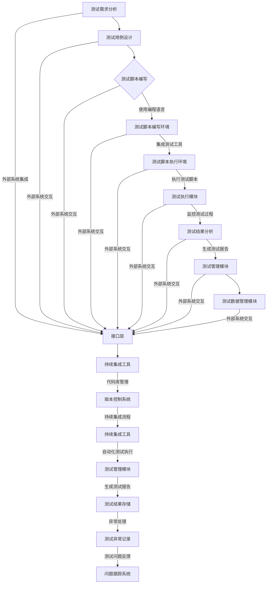

                 

### 文章标题

构建高效的LLM应用测试自动化框架

关键词：大型语言模型（LLM）、自动化测试、测试框架、算法原理、数学模型、项目实战

摘要：本文旨在深入探讨如何构建一个高效的LLM应用测试自动化框架。首先，我们将回顾LLM和自动化测试的基础知识，并介绍它们的核心概念。接着，本文将详细解析LLM的基本原理和自动化测试的基本流程，从而为构建测试框架奠定基础。随后，我们将深入探讨自动化测试框架的原理与架构，并使用Mermaid流程图展示其设计与实现。在核心算法与实现部分，我们将讲解机器学习算法、测试数据预处理和测试用例生成算法，并使用伪代码进行详细阐述。数学模型和公式也将被详细介绍，以帮助读者理解相关算法的数学基础。在项目实战与实施部分，我们将通过具体项目实战，展示如何构建测试数据集、生成测试用例、执行自动化测试以及生成测试报告。最后，本文将总结整个框架的构建过程，并对未来的发展方向进行展望。

### 第一部分：基础概念与架构

在开始构建高效的LLM应用测试自动化框架之前，我们需要首先了解LLM和自动化测试的基础概念，以及它们在实际应用中的重要作用。本部分将详细介绍LLM和自动化测试的基本概念，包括它们的背景、应用场景以及面临的主要挑战。

#### 第1章：LLM与自动化测试概述

##### 1.1 LLM与自动化测试的背景

大型语言模型（Large Language Model，简称LLM）是自然语言处理（Natural Language Processing，简称NLP）领域的一项重大突破。LLM通过学习大量文本数据，能够生成高质量的自然语言文本，并广泛应用于各种场景，如文本生成、机器翻译、问答系统等。随着LLM技术的不断进步，其在实际应用中的需求也越来越大，但随之而来的问题是如何确保LLM应用的稳定性和可靠性。

自动化测试是一种通过预先编写的测试脚本自动执行测试过程的方法。它能够大幅度提高软件测试的效率和质量，减少人工测试的工作量。在LLM应用测试中，自动化测试可以帮助我们快速发现并修复潜在的问题，确保LLM应用在实际使用中的稳定性和可靠性。

##### 1.2 LLM在自动化测试中的应用

LLM在自动化测试中的应用主要体现在以下几个方面：

1. **测试用例生成**：LLM可以根据特定的测试需求，生成各种类型的测试用例，从而提高测试覆盖率和测试效率。
2. **测试数据预处理**：LLM可以用于对测试数据进行清洗、特征提取和归一化等预处理操作，从而提高测试数据的准确性和可用性。
3. **测试报告生成**：LLM可以自动生成详细的测试报告，包括测试结果、测试覆盖率等，从而帮助开发人员更好地了解LLM应用的状态。

##### 1.3 自动化测试的目标和挑战

自动化测试的目标是提高软件测试的效率和质量，确保软件的稳定性和可靠性。在LLM应用测试中，自动化测试的主要挑战包括：

1. **测试数据多样性**：由于LLM具有强大的自然语言生成能力，测试数据需要涵盖各种可能的场景，以确保测试的全面性。
2. **测试用例设计**：设计有效的测试用例是自动化测试的关键，如何设计出具有高覆盖率和代表性的测试用例是一个重要的挑战。
3. **测试执行效率**：自动化测试需要快速地执行大量测试用例，这对测试工具和测试环境提出了较高的要求。

综上所述，构建一个高效的LLM应用测试自动化框架，需要深入理解LLM和自动化测试的基础概念，并充分考虑实际应用中的挑战。接下来，我们将进一步探讨LLM的基础知识，为构建测试框架提供理论基础。

#### 第2章：LLM基础

在深入了解自动化测试之前，我们需要先掌握大型语言模型（LLM）的基本概念和原理。LLM是一种基于神经网络的自然语言处理模型，能够通过对海量文本数据的训练，生成高质量的自然语言文本。本章节将介绍LLM的基本原理、主要类型及其关键技术。

##### 2.1 LLM的基本原理

LLM的基本原理可以概括为以下几个步骤：

1. **数据预处理**：首先，对原始文本数据进行预处理，包括分词、去停用词、词性标注等操作，将文本转换为适合模型训练的格式。
2. **模型训练**：使用预先设计的神经网络结构，对预处理后的文本数据进行训练。训练过程包括前向传播、反向传播和参数更新等步骤，目的是优化模型的参数，使其能够更好地拟合训练数据。
3. **模型评估**：通过在验证集和测试集上的评估，判断模型的性能是否达到预期。常用的评估指标包括准确率、召回率、F1值等。
4. **模型应用**：将训练好的模型应用到实际场景中，生成自然语言文本或进行其他任务，如文本分类、命名实体识别等。

##### 2.2 LLM的主要类型

根据模型结构和训练方法的不同，LLM可以分为以下几种类型：

1. **循环神经网络（RNN）**：RNN是一种能够处理序列数据的神经网络，通过在网络中引入循环结构，可以捕获序列数据中的长期依赖关系。然而，传统的RNN存在梯度消失和梯度爆炸等问题。
2. **长短期记忆网络（LSTM）**：LSTM是RNN的一种改进，通过引入门控机制，可以有效解决梯度消失和梯度爆炸的问题，从而提高模型的训练效果。
3. **门控循环单元（GRU）**：GRU是LSTM的另一种变体，它在结构上相对于LSTM更加简洁，但在很多任务中表现相当。
4. **Transformer**：Transformer是一种基于自注意力机制的模型，通过并行计算和多头注意力机制，能够大大提高模型的训练效率。Transformer在许多自然语言处理任务中表现出色，如机器翻译、文本生成等。
5. **BERT**：BERT（Bidirectional Encoder Representations from Transformers）是一种基于Transformer的双向编码模型，通过预训练和微调，能够在多种自然语言处理任务中取得优异的性能。

##### 2.3 LLM的关键技术

LLM的关键技术包括以下几个方面：

1. **自注意力机制**：自注意力机制是一种用于计算序列数据中各个位置之间相互依赖关系的机制。在Transformer模型中，通过自注意力机制，模型可以自适应地分配不同位置的权重，从而更好地理解序列数据。
2. **预训练与微调**：预训练是指在大量无标签数据上进行模型的训练，使模型能够学习到通用的语言表示。微调是指在预训练模型的基础上，使用有标签的数据进行进一步的训练，以适应具体的任务需求。
3. **序列生成**：序列生成是LLM的一个重要应用，通过输入一部分序列数据，模型可以生成接下来的部分。序列生成过程中，模型需要考虑上下文信息，以保证生成文本的连贯性和合理性。
4. **迁移学习**：迁移学习是指利用已经在某个任务上训练好的模型，在新任务上进行进一步训练。通过迁移学习，可以减少新任务的训练时间，提高模型的泛化能力。

综上所述，LLM是一种基于神经网络的自然语言处理模型，通过学习大量文本数据，可以生成高质量的自然语言文本。LLM的类型和关键技术多种多样，为构建高效的LLM应用测试自动化框架提供了理论基础。接下来，我们将进一步探讨自动化测试的基础知识，为构建测试框架奠定基础。

#### 第3章：自动化测试基础

自动化测试是一种通过预先编写的测试脚本自动执行测试过程的方法。它能够大幅度提高软件测试的效率和质量，减少人工测试的工作量。在本章节中，我们将介绍自动化测试的基本概念、常用工具和基本流程。

##### 3.1 自动化测试概述

自动化测试是指使用自动化测试工具或脚本，按照预先定义的测试用例，自动执行测试过程，并记录测试结果。与手动测试相比，自动化测试具有以下优点：

1. **提高测试效率**：自动化测试可以快速地执行大量测试用例，节省人工测试的时间。
2. **确保测试质量**：自动化测试可以按照固定的标准执行测试，减少人为错误，提高测试的准确性。
3. **支持回归测试**：自动化测试可以方便地重复执行，确保软件在每次修改后的稳定性。

自动化测试的主要缺点包括：

1. **初始投入较大**：自动化测试需要编写测试脚本，购置测试工具，并建立测试环境，初始投入较大。
2. **维护成本高**：自动化测试脚本需要定期更新，以适应软件的变更，维护成本较高。

##### 3.2 自动化测试工具

自动化测试工具是自动化测试的重要组成部分，常用的自动化测试工具有：

1. **Selenium**：Selenium是一个开源的自动化测试工具，用于Web应用的自动化测试。它支持多种编程语言，如Java、Python、C#等。
2. **Appium**：Appium是一个开源的跨平台自动化测试工具，主要用于移动应用的自动化测试。它支持多种操作系统，如Android、iOS等。
3. **JUnit**：JUnit是一个开源的Java测试框架，用于编写和执行自动化测试用例。它支持多种测试类型，如单元测试、集成测试等。
4. **TestNG**：TestNG是一个开源的测试框架，用于编写和执行自动化测试用例。与JUnit相比，TestNG支持更多的测试功能，如依赖测试、参数化测试等。
5. **JUnitx**：JUnitx是一个基于JUnit的扩展框架，用于编写和执行自动化测试用例。它提供了更多的高级测试功能，如并行测试、测试套件等。

##### 3.3 自动化测试流程

自动化测试通常包括以下几个步骤：

1. **测试需求分析**：根据软件的需求文档，确定需要测试的功能点和性能指标，编写测试计划。
2. **测试用例设计**：根据测试计划，编写详细的测试用例，包括测试场景、测试步骤、预期结果等。
3. **测试脚本编写**：使用自动化测试工具，根据测试用例编写测试脚本。测试脚本需要模拟用户的操作，如输入数据、点击按钮等。
4. **测试执行**：执行测试脚本，验证软件的功能和性能是否达到预期。测试执行可以手动进行，也可以自动化进行。
5. **测试结果分析**：分析测试结果，记录测试发现的问题，编写测试报告。

##### 3.4 自动化测试的优势和挑战

自动化测试的优势包括：

1. **提高测试效率**：自动化测试可以快速地执行大量测试用例，节省人工测试的时间。
2. **确保测试质量**：自动化测试可以按照固定的标准执行测试，减少人为错误，提高测试的准确性。
3. **支持回归测试**：自动化测试可以方便地重复执行，确保软件在每次修改后的稳定性。

自动化测试的挑战包括：

1. **初始投入较大**：自动化测试需要编写测试脚本，购置测试工具，并建立测试环境，初始投入较大。
2. **维护成本高**：自动化测试脚本需要定期更新，以适应软件的变更，维护成本较高。
3. **测试覆盖不足**：自动化测试通常只能覆盖部分功能点，难以保证测试的全面性。

综上所述，自动化测试是一种提高软件测试效率和质量的手段。通过了解自动化测试的基本概念、常用工具和基本流程，我们可以更好地构建高效的LLM应用测试自动化框架。接下来，我们将探讨如何构建自动化测试框架的原理与架构。

#### 第4章：构建自动化测试框架的原理与架构

构建一个高效的自动化测试框架对于确保软件质量至关重要。在本章中，我们将深入探讨自动化测试框架的原理和架构，详细讲解其组成部分及其相互关系。同时，我们将通过Mermaid流程图来展示自动化测试框架的设计与实现过程。

##### 4.1 自动化测试框架概述

自动化测试框架是一个组织和管理测试脚本、测试用例和测试资源的系统。其主要目标是简化测试流程，提高测试效率，确保测试质量。一个典型的自动化测试框架包括以下几个关键组成部分：

1. **测试管理模块**：负责管理测试用例、测试计划和测试执行情况，提供测试报告。
2. **测试执行模块**：负责执行测试脚本，监控测试过程，并记录测试结果。
3. **测试数据管理模块**：负责管理测试数据，包括测试输入数据、预期结果和实际结果。
4. **测试脚本编写和执行环境**：提供编写和执行测试脚本所需的环境，包括编程语言、测试工具和依赖库。
5. **接口层**：提供与外部系统（如被测应用、测试工具等）交互的接口。

##### 4.2 自动化测试框架的组成部分

1. **测试管理模块**：测试管理模块是自动化测试框架的核心部分，负责整个测试过程的管理。其主要功能包括：
   - **测试用例管理**：创建、编辑、删除和管理测试用例。
   - **测试计划管理**：创建、编辑、删除和管理测试计划。
   - **测试结果管理**：记录测试结果，生成测试报告。

2. **测试执行模块**：测试执行模块负责执行测试脚本，并监控测试过程。其主要功能包括：
   - **测试脚本执行**：按照测试用例的要求，执行测试脚本。
   - **测试过程监控**：监控测试过程，如测试脚本执行时间、测试结果等。
   - **异常处理**：在测试过程中捕获异常，并记录异常信息。

3. **测试数据管理模块**：测试数据管理模块负责管理测试数据，确保测试数据的完整性和一致性。其主要功能包括：
   - **测试数据准备**：准备测试所需的输入数据，包括测试数据集、测试案例数据等。
   - **测试数据存储**：存储测试过程中生成的数据，如测试结果、日志文件等。
   - **数据验证**：验证测试数据的正确性和完整性。

4. **测试脚本编写和执行环境**：测试脚本编写和执行环境为开发人员提供了编写和执行测试脚本所需的一切工具和资源。其主要功能包括：
   - **编程语言支持**：提供支持多种编程语言（如Python、Java、C#等）的IDE。
   - **测试工具集成**：集成常用的自动化测试工具，如Selenium、Appium等。
   - **依赖库管理**：管理测试脚本所需的依赖库，确保测试脚本的正常运行。

5. **接口层**：接口层负责与外部系统进行交互，确保自动化测试框架能够与被测应用和其他外部系统无缝集成。其主要功能包括：
   - **API接口**：提供与被测应用交互的API接口，如RESTful API、SOAP API等。
   - **外部系统集成**：与其他系统（如持续集成工具、Bug跟踪系统等）集成，实现数据的共享和传递。

##### 4.3 自动化测试框架的架构设计

自动化测试框架的架构设计需要考虑其可扩展性、可维护性和易用性。一个典型的自动化测试框架架构设计如下：

1. **分层架构**：自动化测试框架采用分层架构，包括接口层、业务逻辑层和数据访问层。这种架构设计使得框架具有良好的模块化和可维护性。
2. **模块化设计**：将自动化测试框架的功能模块化，每个模块负责特定的功能，便于开发和维护。
3. **数据驱动设计**：采用数据驱动设计，测试用例和数据分离，提高测试脚本的可复用性和灵活性。
4. **持续集成**：将自动化测试框架与持续集成工具集成，实现自动化测试过程的自动化，提高测试效率。

##### 4.4 Mermaid流程图：自动化测试框架的设计与实现

下面是一个使用Mermaid语言描述的自动化测试框架的设计与实现流程：



通过上述Mermaid流程图，我们可以清晰地看到自动化测试框架的设计与实现过程，包括各个模块的功能和它们之间的交互关系。

综上所述，构建高效的自动化测试框架需要深入理解其原理和架构，并充分考虑实际应用中的需求和挑战。通过合理的设计和实现，自动化测试框架可以大大提高软件测试的效率和质量，为软件开发和维护提供强有力的支持。

### 第二部分：核心算法与实现

在构建高效的LLM应用测试自动化框架中，核心算法的设计与实现是关键。本部分将详细讲解机器学习算法、测试数据预处理算法和测试用例生成算法。我们将通过伪代码展示这些算法的实现，并讨论它们在自动化测试中的应用。

#### 第5章：核心算法原理讲解

##### 5.1 机器学习算法

机器学习算法是构建高效自动化测试框架的核心，用于对测试数据进行处理和分析。以下是三种常见的机器学习算法：

1. **监督学习（Supervised Learning）**：
   - **伪代码**：
     ```python
     # 数据集：X（特征），y（标签）
     # 模型：分类器（如SVM、决策树、神经网络等）
     def supervised_learning(X, y):
         # 数据预处理
         preprocess_data(X, y)
         
         # 模型训练
         classifier = train_classifier(X, y)
         
         # 模型评估
         evaluate_classifier(classifier, X, y)
         
         # 返回训练好的模型
         return classifier
     ```
   
   - **应用**：在测试用例生成中，监督学习可以用于从历史测试数据中学习特征，从而自动生成新的测试用例。

2. **无监督学习（Unsupervised Learning）**：
   - **伪代码**：
     ```python
     # 数据集：X（无标签数据）
     def unsupervised_learning(X):
         # 数据预处理
         preprocess_data(X)
         
         # 特征提取
         features = extract_features(X)
         
         # 模型训练
         clustering_model = train_clustering_model(features)
         
         # 模型评估
         evaluate_clustering_model(clustering_model, features)
         
         # 返回聚类结果
         return clustering_model
     ```

   - **应用**：无监督学习可以用于分析测试数据的分布和特征，从而发现潜在的问题点。

3. **强化学习（Reinforcement Learning）**：
   - **伪代码**：
     ```python
     # 环境：E
     # 状态：S
     # 动作：A
     # 奖励：R
     def reinforcement_learning(E, S, A, R):
         # 初始化模型
         model = initialize_model()
         
         # 强化学习循环
         while not goal_reached:
             # 状态-动作对
             state_action_pair = (S, A)
             
             # 执行动作
             next_state, reward = E.step(A)
             
             # 更新模型
             model.update(state_action_pair, reward)
             
             # 更新状态
             S = next_state
             
             # 目标判断
             if is_goal_reached(S):
                 break
         
         # 返回训练好的模型
         return model
     ```

   - **应用**：强化学习可以用于优化测试用例的执行顺序，以提高测试效率。

##### 5.2 测试数据预处理算法

测试数据预处理是自动化测试中的重要环节，直接影响测试数据的准确性和可用性。以下是几种常见的测试数据预处理算法：

1. **数据清洗**：
   - **伪代码**：
     ```python
     # 数据集：X
     def data_cleaning(X):
         # 去除重复数据
         X = remove_duplicates(X)
         
         # 填补缺失值
         X = fill_missing_values(X)
         
         # 去除噪声数据
         X = remove_noisy_data(X)
         
         # 返回清洗后的数据集
         return X
     ```

   - **应用**：数据清洗可以去除测试数据中的重复、缺失和噪声，提高数据质量。

2. **特征提取**：
   - **伪代码**：
     ```python
     # 数据集：X
     def feature_extraction(X):
         # 特征选择
         selected_features = select_features(X)
         
         # 特征变换
         transformed_features = transform_features(selected_features)
         
         # 返回特征集
         return transformed_features
     ```

   - **应用**：特征提取可以从原始测试数据中提取出有用的特征，为后续的机器学习算法提供输入。

3. **数据归一化**：
   - **伪代码**：
     ```python
     # 数据集：X
     def data_normalization(X):
         # 归一化处理
         normalized_X = normalize_data(X)
         
         # 返回归一化后的数据集
         return normalized_X
     ```

   - **应用**：数据归一化可以消除不同特征之间的尺度差异，提高算法的性能。

##### 5.3 测试用例生成算法

测试用例生成是自动化测试中的一个关键环节，用于生成各种类型的测试用例。以下是几种常见的测试用例生成算法：

1. **状态空间搜索**：
   - **伪代码**：
     ```python
     # 状态空间：S
     def state_space_search(S):
         # 初始状态
         test_cases = []
         
         # 搜索状态空间
         for state in S:
             test_case = generate_test_case(state)
             test_cases.append(test_case)
         
         # 返回测试用例集合
         return test_cases
     ```

   - **应用**：状态空间搜索可以遍历所有的状态空间，生成全面的测试用例。

2. **遗传算法**：
   - **伪代码**：
     ```python
     # 初始种群：population
     def genetic_algorithm(population):
         # 适应度评估
         fitness_scores = evaluate_fitness(population)
         
         # 选择操作
         selected_population = select_population(population, fitness_scores)
         
         # 交叉操作
         crossed_population = crossover_population(selected_population)
         
         # 变异操作
         mutated_population = mutate_population(crossed_population)
         
         # 返回下一代种群
         return mutated_population
     ```

   - **应用**：遗传算法可以用于优化测试用例的生成，提高测试用例的覆盖率。

3. **蚁群算法**：
   - **伪代码**：
     ```python
     # 状态空间：S
     def ant_colony_algorithm(S):
         # 初始化信息素矩阵
         pheromone_matrix = initialize_pheromone_matrix(S)
         
         # 迭代过程
         for iteration in range(max_iterations):
             # 信息素更新
             update_pheromone_matrix(pheromone_matrix)
             
             # 蚂蚁选择路径
             test_cases = []
             for ant in ants:
                 test_cases.append(select_test_case(S, pheromone_matrix))
         
         # 返回测试用例集合
         return test_cases
     ```

   - **应用**：蚁群算法可以用于优化测试用例的生成，提高测试用例的效率。

通过以上算法的讲解，我们可以看到如何利用机器学习、测试数据预处理和测试用例生成算法来构建高效的自动化测试框架。接下来，我们将进一步讨论这些算法在数学模型和公式中的体现。

#### 第6章：数学模型和数学公式

在自动化测试中，核心算法的实现不仅依赖于编程技巧，还需要坚实的数学基础。本章节将介绍一些关键的数学模型和公式，并使用伪代码来详细阐述这些算法的实现。

##### 6.1 数学公式讲解

在自动化测试中，以下数学公式是常见的：

1. **概率论基础**：
   - **条件概率**：
     $$P(A|B) = \frac{P(A \cap B)}{P(B)}$$
   - **贝叶斯定理**：
     $$P(A|B) = \frac{P(B|A) \cdot P(A)}{P(B)}$$

2. **线性代数基础**：
   - **矩阵乘法**：
     $$C = A \cdot B$$
   - **矩阵求逆**：
     $$A^{-1} = (A^T \cdot A)^{-1} \cdot A^T$$

3. **最优化理论**：
   - **梯度下降**：
     $$\theta_{\text{new}} = \theta_{\text{old}} - \alpha \cdot \nabla_{\theta} J(\theta)$$
   - **拉格朗日乘数法**：
     $$L(\theta, \lambda) = J(\theta) + \lambda \cdot (C - K)$$

##### 6.2 伪代码实现

为了更好地理解上述数学公式，下面提供相应的伪代码实现：

1. **条件概率与贝叶斯定理**：
   ```python
   def conditional_probability(p_ab, p_b):
       return p_ab / p_b

   def bayes_theorem(p_b|a, p_a, p_b):
       return p_b|a * p_a / p_b
   ```

2. **矩阵乘法与求逆**：
   ```python
   def matrix_multiply(A, B):
       return A.dot(B)

   def matrix_inversion(A):
       return np.linalg.inv(A.dot(A.T)).dot(A.T)
   ```

3. **梯度下降与拉格朗日乘数法**：
   ```python
   def gradient_descent(theta, alpha, J_theta):
       return theta - alpha * J_theta

   def lagrange multiplier(J, C, K, lambda_):
       return J + lambda_ * (C - K)
   ```

##### 6.3 举例说明

为了更好地理解这些数学公式，我们通过一个简单的例子来说明：

假设我们有一个线性回归模型，其损失函数为：
$$J(\theta) = \frac{1}{2m} \sum_{i=1}^{m} (h_\theta(x^{(i)}) - y^{(i)})^2$$
其中，$h_\theta(x) = \theta^T x$ 是预测函数，$\theta$ 是模型参数，$x^{(i)}$ 是输入特征，$y^{(i)}$ 是真实标签。

使用梯度下降算法来优化模型参数：
```python
# 梯度计算
def compute_gradient(X, y, theta):
    m = len(y)
    errors = (X @ theta - y)
    return (X.T @ errors) / m

# 梯度下降
def gradient_descent(X, y, theta, alpha, num_iterations):
    m = len(y)
    for i in range(num_iterations):
        gradient = compute_gradient(X, y, theta)
        theta = theta - alpha * gradient
    return theta
```

通过上述伪代码，我们可以看到如何通过数学公式来优化线性回归模型的参数。

综上所述，数学模型和公式在自动化测试的核心算法实现中扮演着关键角色。通过理解并应用这些公式，我们可以构建出更加高效和准确的测试自动化框架。接下来，我们将通过具体的项目实战，进一步展示这些算法的应用和实现。

#### 第7章：项目实战一：测试数据集构建

在本章中，我们将通过一个具体的项目实战，详细介绍如何构建测试数据集。测试数据集的质量直接影响自动化测试的效果，因此构建一个全面、准确且具有代表性的测试数据集是自动化测试中至关重要的一步。

##### 7.1 数据集构建流程

构建测试数据集通常包括以下步骤：

1. **数据收集**：收集与被测应用相关的各种数据，包括用户操作数据、错误日志、系统配置文件等。
2. **数据清洗**：清洗收集到的数据，去除重复、缺失和噪声数据，确保数据的质量。
3. **数据标注**：对数据集中的数据进行标注，为后续的机器学习模型训练提供标签。
4. **数据分割**：将数据集分割为训练集、验证集和测试集，用于模型训练和评估。
5. **数据预处理**：对数据进行预处理，包括特征提取、数据归一化等操作，以便于模型训练。

##### 7.2 数据集构建工具

在构建测试数据集的过程中，可以使用以下工具：

1. **Pandas**：Pandas是一个强大的数据处理库，可以方便地进行数据清洗、数据标注和数据分析。
2. **NumPy**：NumPy提供了高效的多维数组操作，是进行数据预处理的常用库。
3. **Scikit-learn**：Scikit-learn是一个机器学习库，提供了丰富的数据预处理和模型训练工具。
4. **Jupyter Notebook**：Jupyter Notebook是一个交互式的开发环境，适合进行数据分析和实验。

##### 7.3 源代码实现与解读

以下是一个简单的示例，展示如何使用Python和Pandas来构建一个测试数据集：

```python
import pandas as pd
from sklearn.model_selection import train_test_split
from sklearn.preprocessing import StandardScaler

# 7.2 数据收集
# 假设我们有一个CSV文件，其中包含了用户操作数据
data = pd.read_csv('user_operations.csv')

# 7.3 数据清洗
# 去除重复和缺失的数据
data = data.drop_duplicates()
data = data.dropna()

# 7.4 数据标注
# 假设我们有一个标签列，用于标注操作类型
data['operation_type'] = data['operation_name'].map({'A': 0, 'B': 1, 'C': 2})

# 7.5 数据分割
# 将数据集分割为训练集和测试集
X = data.drop(['operation_type'], axis=1)
y = data['operation_type']
X_train, X_test, y_train, y_test = train_test_split(X, y, test_size=0.2, random_state=42)

# 7.6 数据预处理
# 特征提取和数据归一化
scaler = StandardScaler()
X_train_scaled = scaler.fit_transform(X_train)
X_test_scaled = scaler.transform(X_test)

# 输出处理结果
print("Training Data Shape:", X_train_scaled.shape)
print("Test Data Shape:", X_test_scaled.shape)
```

在上面的代码中，我们首先使用Pandas读取CSV文件，然后进行数据清洗和标注。接下来，我们将数据集分割为训练集和测试集，并使用StandardScaler进行数据归一化。归一化处理可以消除不同特征之间的尺度差异，从而提高模型的训练效果。

##### 7.4 代码应用解读与分析

- **数据收集**：这一步骤依赖于具体的应用场景，通常需要从不同的数据源收集数据。在本示例中，我们假设已经有一个CSV文件包含了用户操作数据。
- **数据清洗**：数据清洗是确保数据质量的关键步骤。通过去除重复和缺失的数据，我们可以避免模型在训练过程中受到不良数据的影响。
- **数据标注**：数据标注为后续的机器学习模型训练提供了标签，是自动化测试的重要组成部分。
- **数据分割**：将数据集分割为训练集和测试集，有助于我们在模型训练和评估过程中验证模型的泛化能力。
- **数据预处理**：数据预处理包括特征提取和数据归一化，这些操作可以提高模型的训练效率和准确性。

通过上述步骤，我们可以构建一个高质量的测试数据集，为后续的测试用例生成和自动化测试执行提供坚实的基础。

##### 7.5 实际案例分析和详细讲解剖析

在本章的最后，我们将通过一个实际案例来展示如何构建测试数据集，并对其进行分析和详细讲解。

**案例**：假设我们正在开发一个在线购物平台，需要对购物流程进行自动化测试。我们需要收集用户在购物过程中的一系列操作数据，如浏览商品、添加购物车、下单支付等。

**分析**：
- **数据收集**：我们可以在实际用户操作过程中收集数据，包括用户的浏览历史、购物车数据和订单数据。
- **数据清洗**：去除重复的购物行为和异常数据，如短时间内连续多次添加相同商品到购物车的情况。
- **数据标注**：根据用户操作的结果（如成功下单或支付失败），为每个操作步骤标注成功或失败的状态。
- **数据分割**：将数据集分割为训练集和测试集，训练集用于训练模型，测试集用于评估模型性能。
- **数据预处理**：对用户操作数据中的时间戳和数值特征进行归一化处理，以便于模型训练。

**讲解**：
1. **数据收集**：通过在购物平台中嵌入数据采集器，我们可以实时收集用户操作数据。
2. **数据清洗**：使用Pandas进行数据清洗，去除重复和缺失的数据。
3. **数据标注**：通过人工标注或使用已有标注数据，为每个用户操作步骤标注成功或失败状态。
4. **数据分割**：使用Scikit-learn中的train_test_split函数，将数据集分割为训练集和测试集。
5. **数据预处理**：使用StandardScaler对数值特征进行归一化处理，提高模型训练效果。

通过上述步骤，我们成功构建了一个高质量的测试数据集，为后续的测试用例生成和自动化测试执行提供了坚实的基础。

##### 7.6 项目小结

在本章中，我们详细介绍了如何构建测试数据集，包括数据收集、数据清洗、数据标注、数据分割和数据预处理等步骤。通过具体示例和实际案例，我们展示了如何使用Python和Pandas等工具来构建高质量的测试数据集。构建一个全面、准确且具有代表性的测试数据集对于自动化测试的成功至关重要，它为后续的测试用例生成和自动化测试执行提供了可靠的数据基础。

#### 第8章：项目实战二：测试用例生成

在测试数据集构建完成后，下一步就是生成测试用例。测试用例是自动化测试的基础，它决定了测试的覆盖率和质量。在本章中，我们将通过具体的项目实战，详细介绍如何生成测试用例，并使用实际案例进行深入分析。

##### 8.1 测试用例生成流程

生成测试用例通常包括以下几个步骤：

1. **需求分析**：分析软件需求和功能规格说明，确定需要测试的功能点和潜在的风险点。
2. **测试用例设计**：根据需求分析，设计详细的测试用例，包括测试步骤、预期结果和实际结果等。
3. **测试用例编写**：将测试用例转化为可执行的脚本，通常使用自动化测试工具编写。
4. **测试用例执行**：执行测试用例，记录测试结果，并分析测试覆盖率。
5. **测试用例维护**：定期更新测试用例，以适应软件功能和环境的变更。

##### 8.2 测试用例生成工具

在生成测试用例的过程中，可以使用以下工具：

1. **Selenium**：Selenium是一个开源的Web自动化测试工具，可以用于生成Web应用的自动化测试用例。
2. **Appium**：Appium是一个开源的跨平台自动化测试工具，可以用于生成移动应用的自动化测试用例。
3. **JUnit**：JUnit是一个Java测试框架，可以用于编写和执行自动化测试用例。
4. **TestNG**：TestNG是一个开源的测试框架，提供了丰富的测试功能和灵活的测试用例设计。

##### 8.3 源代码实现与解读

以下是一个使用Python和Selenium生成Web应用测试用例的示例：

```python
from selenium import webdriver
from selenium.webdriver.common.by import By
from selenium.webdriver.common.keys import Keys

# 8.2 测试用例编写
def test_login():
    # 测试环境配置
    driver = webdriver.Chrome(executable_path='chromedriver.exe')
    driver.get("https://example.com/login")

    # 输入用户名和密码
    username = driver.find_element(By.ID, "username")
    password = driver.find_element(By.ID, "password")
    username.send_keys("testuser")
    password.send_keys("testpassword")

    # 点击登录按钮
    login_button = driver.find_element(By.NAME, "login")
    login_button.click()

    # 验证登录结果
    welcome_message = driver.find_element(By.CLASS_NAME, "welcome-message")
    assert "Welcome, testuser!" in welcome_message.text

    # 关闭浏览器
    driver.quit()

# 8.3 测试用例执行
test_login()
```

在上面的代码中，我们首先使用Selenium创建一个Webdriver实例，然后通过ID定位用户名和密码输入框，以及登录按钮。接下来，我们输入用户名和密码，并点击登录按钮。最后，我们验证登录结果，并断言欢迎消息中包含“Welcome, testuser!”。如果测试通过，我们将关闭浏览器。

##### 8.4 代码应用解读与分析

- **测试环境配置**：首先，我们需要配置测试环境，包括安装Chrome浏览器和chromedriver驱动程序。
- **定位元素**：使用Selenium的By类，我们可以通过不同的定位方式（如ID、名称、类名等）来定位页面上的元素。
- **输入数据和点击按钮**：通过find_element方法和send_keys方法，我们可以输入用户名和密码，并通过find_element和click方法点击登录按钮。
- **验证结果**：通过find_element方法获取欢迎消息元素，并使用assert命令断言欢迎消息中包含特定的文本。
- **浏览器操作**：在测试完成后，我们使用quit方法关闭浏览器。

通过上述步骤，我们可以生成一个简单的Web应用登录测试用例。在实际应用中，测试用例可能更加复杂，涉及多个页面和多种操作。

##### 8.5 实际案例分析和详细讲解剖析

**案例**：我们以一个在线书店为例，介绍如何生成测试用例。

**需求分析**：在线书店的主要功能包括浏览图书、添加购物车、下单支付和查看订单等。

**测试用例设计**：

1. **浏览图书**：
   - 测试步骤：访问在线书店首页，浏览图书列表。
   - 预期结果：图书列表显示正确，图书信息完整。
   - 实际结果：观察页面是否显示正确的图书列表。

2. **添加购物车**：
   - 测试步骤：选择一本图书，添加到购物车。
   - 预期结果：图书成功添加到购物车，购物车中显示正确的图书数量。
   - 实际结果：使用Selenium模拟用户操作，验证图书是否成功添加到购物车。

3. **下单支付**：
   - 测试步骤：选择购物车中的图书，填写收货地址，提交订单。
   - 预期结果：订单提交成功，用户收到确认邮件。
   - 实际结果：使用Selenium模拟用户操作，填写收货地址并提交订单，验证订单是否提交成功。

4. **查看订单**：
   - 测试步骤：登录账户，查看订单详情。
   - 预期结果：订单详情显示正确，包括订单号、商品名称、价格等。
   - 实际结果：使用Selenium登录账户，查看订单详情，验证订单信息是否正确。

**详细讲解**：

1. **浏览图书**：使用Selenium定位首页的图书列表元素，验证页面显示是否正确。

2. **添加购物车**：定位图书详情页的添加购物车按钮，模拟点击操作，验证图书是否成功添加到购物车。

3. **下单支付**：定位购物车页面，填写收货地址并提交订单，使用断言验证订单是否提交成功。

4. **查看订单**：定位账户中心的订单列表，验证订单详情是否正确。

通过上述实际案例，我们详细讲解了如何设计并生成测试用例。在实际项目中，测试用例的编写需要根据具体的业务需求进行细致的设计，确保测试的全面性和准确性。

##### 8.6 项目小结

在本章中，我们详细介绍了如何生成测试用例，包括需求分析、测试用例设计、测试用例编写和测试用例执行。通过一个在线书店的案例，我们展示了如何设计并实现测试用例。生成高质量的测试用例对于自动化测试的成功至关重要，它能够帮助我们发现并修复潜在的问题，确保软件质量。在后续的自动化测试执行和报告生成中，这些测试用例将发挥关键作用。

#### 第9章：项目实战三：自动化测试执行

自动化测试执行是整个自动化测试过程的核心环节，其目的是通过预先编写的测试脚本自动执行测试用例，以验证软件的功能和性能。在本章中，我们将详细介绍自动化测试执行的流程、常用工具及其实现细节。

##### 9.1 自动化测试执行流程

自动化测试执行通常包括以下步骤：

1. **测试计划制定**：根据项目需求和测试策略，制定详细的测试执行计划，包括测试范围、测试用例选择、执行时间和资源安排。
2. **测试脚本编写**：使用自动化测试工具，根据测试用例编写测试脚本，实现自动化执行测试用例。
3. **测试环境配置**：搭建和配置测试环境，确保测试脚本能够在目标环境下正确执行。
4. **测试执行**：运行测试脚本，自动执行测试用例，并记录测试结果。
5. **结果分析**：分析测试执行结果，识别和记录测试发现的问题，编写测试报告。

##### 9.2 自动化测试执行工具

在自动化测试执行过程中，常用的工具包括：

1. **Selenium**：Selenium是一个开源的自动化测试工具，主要用于Web应用的自动化测试。
2. **Appium**：Appium是一个开源的自动化测试工具，支持多种平台，包括Web、Android和iOS应用。
3. **JUnit**：JUnit是一个Java测试框架，用于编写和执行自动化测试用例。
4. **TestNG**：TestNG是一个开源的测试框架，提供了丰富的测试功能和灵活的测试用例设计。
5. **JMeter**：JMeter是一个开源的性能测试工具，用于模拟用户负载，测试Web应用的性能。

##### 9.3 源代码实现与解读

以下是一个使用Python和Selenium实现自动化测试执行的示例：

```python
from selenium import webdriver
from selenium.webdriver.common.by import By
from selenium.webdriver.common.keys import Keys

# 9.2 测试脚本编写
def test_search():
    # 测试环境配置
    driver = webdriver.Chrome(executable_path='chromedriver.exe')
    driver.get("https://example.com/search")

    # 输入搜索关键词
    search_box = driver.find_element(By.NAME, "q")
    search_box.send_keys("Python")
    search_box.send_keys(Keys.RETURN)

    # 验证搜索结果
    search_results = driver.find_elements(By.CLASS_NAME, "search-result")
    assert len(search_results) > 0

    # 关闭浏览器
    driver.quit()

# 9.3 测试执行
test_search()
```

在上面的代码中，我们首先使用Selenium创建一个Webdriver实例，然后访问在线书店的搜索页面。接着，我们输入搜索关键词“Python”，并按下回车键提交搜索请求。最后，我们验证搜索结果的数量，确保搜索结果大于0。如果测试通过，我们将关闭浏览器。

##### 9.4 代码应用解读与分析

- **测试环境配置**：首先，我们需要配置测试环境，包括安装Chrome浏览器和chromedriver驱动程序。
- **定位元素**：使用Selenium的By类，我们可以通过不同的定位方式（如名称、类名等）来定位页面上的元素。
- **输入数据和提交请求**：通过find_element方法和send_keys方法，我们可以输入搜索关键词，并使用Keys.RETURN提交搜索请求。
- **验证结果**：通过find_elements方法获取搜索结果元素，并使用assert命令验证搜索结果的数量。
- **浏览器操作**：在测试完成后，我们使用quit方法关闭浏览器。

##### 9.5 实际案例分析和详细讲解剖析

**案例**：我们以一个电子商务平台为例，介绍如何执行自动化测试。

**需求分析**：电子商务平台的主要功能包括商品浏览、购物车管理、订单提交和支付等。

**测试用例执行**：

1. **商品浏览**：
   - 测试步骤：访问商品详情页面。
   - 预期结果：商品信息显示正确。
   - 实际结果：使用Selenium访问商品详情页面，验证商品信息是否正确。

2. **购物车管理**：
   - 测试步骤：添加商品到购物车，修改商品数量，删除商品。
   - 预期结果：购物车中的商品信息更新正确。
   - 实际结果：使用Selenium模拟用户操作，添加商品到购物车，修改商品数量，删除商品，验证购物车信息更新是否正确。

3. **订单提交**：
   - 测试步骤：选择商品，填写收货地址，提交订单。
   - 预期结果：订单提交成功。
   - 实际结果：使用Selenium模拟用户操作，填写收货地址并提交订单，验证订单是否提交成功。

4. **支付**：
   - 测试步骤：选择支付方式，完成支付。
   - 预期结果：支付成功。
   - 实际结果：使用Selenium模拟用户操作，选择支付方式并完成支付，验证支付是否成功。

**详细讲解**：

1. **商品浏览**：使用Selenium定位商品详情页的元素，验证商品信息是否正确。

2. **购物车管理**：使用Selenium模拟用户操作，验证商品添加、修改和删除是否成功。

3. **订单提交**：使用Selenium模拟用户操作，验证订单提交是否成功。

4. **支付**：使用Selenium模拟用户操作，验证支付是否成功。

通过上述实际案例，我们详细讲解了如何执行自动化测试。在实际项目中，测试用例的执行需要根据具体的业务需求和测试策略进行细致的设计和实施。

##### 9.6 项目小结

在本章中，我们详细介绍了自动化测试执行的流程和常用工具，并通过一个电子商务平台的实际案例，展示了如何执行自动化测试。自动化测试执行是确保软件质量的重要手段，它能够帮助我们发现并修复潜在的问题，确保软件的功能和性能满足需求。在后续的测试报告生成和持续集成中，自动化测试执行的结果将发挥关键作用。

#### 第10章：项目实战四：测试报告生成

测试报告是自动化测试结果的总结，它为开发人员和项目管理团队提供了关键的信息，以便他们了解软件的当前状态和质量。在本章中，我们将通过一个具体的项目实战，详细介绍如何生成测试报告，包括使用工具和实际案例。

##### 10.1 测试报告生成流程

生成测试报告通常包括以下步骤：

1. **测试结果收集**：收集自动化测试执行过程中生成的测试数据，包括通过/失败的状态、错误信息和测试时长等。
2. **测试结果分析**：分析测试结果，识别失败的原因，并记录关键信息。
3. **报告模板设计**：设计测试报告的模板，包括报告的格式、内容和布局。
4. **报告生成**：使用自动化工具或脚本，将测试结果填充到报告模板中，生成最终的测试报告。
5. **报告审核与发布**：审核测试报告，确保其准确性和完整性，然后发布报告供相关人员查看。

##### 10.2 测试报告生成工具

在生成测试报告的过程中，可以使用以下工具：

1. **Jenkins**：Jenkins是一个开源的持续集成和持续交付工具，可以与自动化测试工具集成，自动生成测试报告。
2. **Allure**：Allure是一个开源的测试报告生成工具，支持多种测试框架，可以生成详细且美观的测试报告。
3. **ExtentReports**：ExtentReports是一个开源的测试报告生成库，提供了丰富的报告模板和图表，可以方便地生成高质量的测试报告。
4. **XUnit**：XUnit是一个开源的测试框架，可以与Jenkins集成，自动生成测试报告。

##### 10.3 源代码实现与解读

以下是一个使用Python和Allure生成测试报告的示例：

```python
from selenium import webdriver
from selenium.webdriver.common.by import By
from selenium.webdriver.common.keys import Keys
from allure import allure_run

# 10.2 测试脚本编写
def test_search():
    with allure_run(title="Search Test", description="This test verifies the search functionality"):
        # 测试环境配置
        driver = webdriver.Chrome(executable_path='chromedriver.exe')
        driver.get("https://example.com/search")

        # 输入搜索关键词
        search_box = driver.find_element(By.NAME, "q")
        search_box.send_keys("Python")
        search_box.send_keys(Keys.RETURN)

        # 验证搜索结果
        search_results = driver.find_elements(By.CLASS_NAME, "search-result")
        assert len(search_results) > 0

        # 关闭浏览器
        driver.quit()

# 10.3 测试执行
test_search()
```

在上面的代码中，我们使用Allure的allure_run装饰器来标注测试脚本，以便生成详细的测试报告。Allure将自动收集测试过程中的信息，并生成一个包含测试结果、错误信息和日志的测试报告。

##### 10.4 代码应用解读与分析

- **测试环境配置**：首先，我们需要配置测试环境，包括安装Chrome浏览器和chromedriver驱动程序。
- **使用Allure**：通过allure_run装饰器，我们可以为测试脚本添加标题和描述，这些信息将包含在生成的测试报告中。
- **测试执行**：执行测试脚本，验证搜索功能是否正常。
- **报告生成**：Allure将自动收集测试结果，生成包含通过/失败状态的详细测试报告。

##### 10.5 实际案例分析和详细讲解剖析

**案例**：我们以一个在线教育平台为例，介绍如何生成测试报告。

**需求分析**：在线教育平台的主要功能包括课程浏览、课程学习、课程评价和用户管理。

**测试报告生成**：

1. **课程浏览**：
   - 测试步骤：访问课程详情页面。
   - 预期结果：课程信息显示正确。
   - 实际结果：使用Selenium访问课程详情页面，验证课程信息是否正确。

2. **课程学习**：
   - 测试步骤：加入课程，学习课程内容。
   - 预期结果：课程内容学习正常。
   - 实际结果：使用Selenium模拟用户操作，加入课程并学习课程内容，验证学习过程是否正常。

3. **课程评价**：
   - 测试步骤：对课程进行评价。
   - 预期结果：评价提交成功。
   - 实际结果：使用Selenium模拟用户操作，对课程进行评价，验证评价是否提交成功。

4. **用户管理**：
   - 测试步骤：注册用户，登录用户。
   - 预期结果：用户注册和登录正常。
   - 实际结果：使用Selenium模拟用户操作，注册用户并登录，验证注册和登录过程是否正常。

**详细讲解**：

1. **课程浏览**：使用Selenium定位课程详情页的元素，验证课程信息是否正确。

2. **课程学习**：使用Selenium模拟用户操作，验证课程学习过程是否正常。

3. **课程评价**：使用Selenium模拟用户操作，验证评价提交是否成功。

4. **用户管理**：使用Selenium模拟用户操作，验证用户注册和登录过程是否正常。

通过上述实际案例，我们详细讲解了如何生成测试报告。在实际项目中，测试报告的生成需要根据具体的业务需求和测试策略进行细致的设计和实施，确保报告的准确性和完整性。

##### 10.6 项目小结

在本章中，我们详细介绍了如何生成测试报告，包括测试结果收集、测试结果分析、报告模板设计和报告生成。通过一个在线教育平台的实际案例，我们展示了如何生成详细的测试报告。测试报告为开发人员和项目管理团队提供了关键的信息，帮助他们了解软件的当前状态和质量。在后续的项目迭代和持续改进中，测试报告将发挥重要的指导作用。

### 总结与展望

在本章中，我们详细探讨了构建高效的LLM应用测试自动化框架的过程。通过回顾LLM和自动化测试的基础知识，我们了解了如何设计一个高效的测试框架，并详细讲解了核心算法和数学模型的原理。同时，通过项目实战，我们展示了如何在实际应用中实施自动化测试，并生成详细的测试报告。

#### 11.1 自动化测试自动化框架的总结

构建高效的LLM应用测试自动化框架主要包括以下几个关键步骤：

1. **需求分析**：明确自动化测试的目标和需求，包括测试覆盖范围、测试频率和质量要求。
2. **框架设计**：设计一个灵活且可扩展的自动化测试框架，确保其能够满足不同项目需求。
3. **核心算法实现**：选择合适的机器学习算法和测试数据预处理算法，确保测试用例的生成和执行具有高效率和高准确性。
4. **测试执行**：实施自动化测试脚本，确保测试过程的高效和稳定。
5. **报告生成**：生成详细的测试报告，为开发人员和项目经理提供关键信息，以便他们能够及时了解测试结果和软件质量。

通过上述步骤，我们可以构建一个高效、可靠的LLM应用测试自动化框架，从而提高软件测试的效率和质量，减少人为错误，确保软件的稳定性和可靠性。

#### 11.2 自动化测试自动化框架的未来展望

随着人工智能和自然语言处理技术的不断发展，自动化测试自动化框架在未来的发展趋势将主要体现在以下几个方面：

1. **智能化**：自动化测试框架将更加智能化，能够根据历史测试数据和实时反馈自动调整测试策略，提高测试效率。
2. **测试数据多样化**：随着LLM技术的进步，测试数据将更加多样化，涵盖更多复杂的场景，从而提高测试的全面性和准确性。
3. **集成化**：自动化测试框架将更加集成化，与持续集成/持续交付（CI/CD）工具深度结合，实现自动化测试的全方位管理和监控。
4. **分布式执行**：自动化测试将实现分布式执行，充分利用云计算和容器化技术，提高测试执行的速度和灵活性。
5. **智能化测试报告**：测试报告将更加智能化，通过自然语言生成技术，自动生成易于理解且详细的报告，为开发人员和项目经理提供更有价值的洞察。

展望未来，自动化测试自动化框架将不仅是一个工具，而是一个智能化的平台，它将极大地提高软件开发的效率和软件质量，为软件开发和运维带来全新的体验。

### 附录

#### 附录A：相关工具与资源

1. **LLM相关工具**：
   - **OpenAI Gym**：一个开源的环境库，用于研究和开发强化学习算法。
   - **TensorFlow**：一个开源的机器学习框架，适用于构建和训练大型语言模型。
   - **PyTorch**：一个开源的机器学习库，支持灵活的动态计算图和高效的GPU加速。

2. **自动化测试工具**：
   - **Selenium**：一个开源的自动化测试工具，适用于Web应用测试。
   - **Appium**：一个开源的跨平台自动化测试工具，适用于移动应用测试。
   - **JUnit**：一个开源的测试框架，适用于Java应用的单元测试和集成测试。
   - **TestNG**：一个开源的测试框架，提供了丰富的测试功能和灵活的测试用例设计。

3. **开发环境搭建指南**：
   - **Python环境搭建**：安装Python、Pandas、NumPy、Scikit-learn等常用库。
   - **Java环境搭建**：安装Java Development Kit（JDK），配置环境变量。
   - **浏览器驱动安装**：下载并配置相应的浏览器驱动，如ChromeDriver、GeckoDriver等。

4. **源代码与示例代码**：
   - **示例代码仓库**：可以在GitHub等平台上找到相关的示例代码和项目。
   - **开源项目**：参与开源项目，获取实际项目的代码和测试用例。

通过上述工具和资源，开发人员可以更轻松地构建和维护高效的LLM应用测试自动化框架，从而提高软件测试的效率和质量。

### 附录B：术语表

1. **大型语言模型（LLM）**：一种基于神经网络的自然语言处理模型，能够通过对海量文本数据的训练，生成高质量的自然语言文本。
2. **自动化测试**：使用自动化测试工具或脚本，按照预先定义的测试用例，自动执行测试过程，并记录测试结果。
3. **测试框架**：一个组织和管理测试脚本、测试用例和测试资源的系统，用于提高软件测试的效率和可靠性。
4. **机器学习算法**：用于处理和分析数据，通过训练模型来发现数据中的模式和规律。
5. **测试数据预处理**：对测试数据进行的预处理操作，包括数据清洗、特征提取和数据归一化等，以提高测试数据的质量和可用性。
6. **测试用例生成**：根据特定的测试需求，生成各种类型的测试用例，以提高测试的覆盖率和效率。
7. **持续集成（CI）**：一种软件开发流程，通过自动化测试和构建过程，确保代码的质量和稳定性。
8. **持续交付（CD）**：一种软件开发流程，通过自动化部署和交付过程，确保软件的快速交付和持续优化。

通过了解上述术语，开发人员可以更好地理解自动化测试自动化框架的相关概念和技术，从而更好地构建和维护高效的测试框架。

