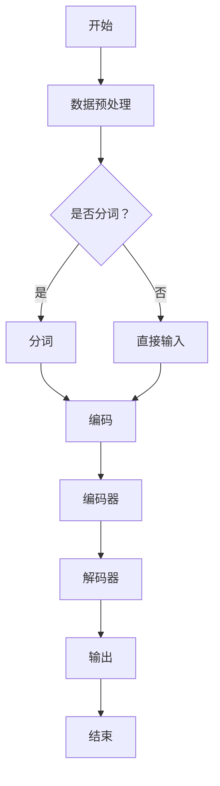

                 


### 第1章：模块化设计与LLM概述

#### 1.1 模块化设计的定义与重要性

##### 1.1.1 模块化设计的基本概念

模块化设计（Modular Design）是一种系统设计方法，通过将系统划分为相互独立的、功能明确的模块，以便于模块的单独开发、测试和维护。模块化设计的基本概念包括以下几个方面：

1. **模块**：模块是系统中的基本组成单位，每个模块都具有特定的功能。
2. **接口**：模块之间的交互通过接口进行，接口定义了模块之间的通信方式。
3. **独立**：模块应该是独立的，每个模块都应该能够独立开发、测试和维护，而不会影响到其他模块。
4. **可复用**：模块化设计的目标之一是提高软件的复用性，模块可以在不同的系统中重复使用。

##### 1.1.2 模块化设计的组成部分

模块化设计主要包括以下几个组成部分：

1. **模块定义**：定义每个模块的功能和接口。
2. **模块划分**：根据系统的需求，将系统划分为多个模块。
3. **模块集成**：将各个模块按照定义的接口进行集成，形成完整的系统。
4. **模块测试**：对每个模块进行独立的测试，确保模块的功能正确。
5. **模块维护**：对已部署的模块进行维护，修复缺陷、更新功能等。

##### 1.1.3 模块化设计与传统设计的区别

传统设计方法通常采用整体设计、逐步实现的方式，而模块化设计则强调将系统分解为多个独立的模块。模块化设计与传统设计的主要区别如下：

1. **开发流程**：模块化设计将开发流程划分为模块定义、模块开发、模块集成等阶段，而传统设计通常是一次性完成的。
2. **可维护性**：模块化设计提高了系统的可维护性，因为每个模块可以独立开发、测试和维护。
3. **可复用性**：模块化设计提高了软件的可复用性，模块可以在不同的项目中重复使用。
4. **开发效率**：模块化设计可以提高开发效率，因为多个模块可以同时进行开发。

#### 1.2 LLM的基本概念

##### 1.2.1 LLM的定义

大型语言模型（Large Language Model，简称LLM）是一种基于深度学习技术的自然语言处理模型，通过对海量文本数据进行训练，LLM可以学会生成文本、回答问题、翻译语言等任务。LLM通常具有以下几个特点：

1. **大规模**：LLM由数亿到数十亿个参数组成，可以处理大量数据。
2. **自适应**：LLM可以根据输入文本自动调整自己的输出，生成更符合上下文的回答。
3. **通用**：LLM可以应用于多种自然语言处理任务，如文本分类、机器翻译、问答系统等。

##### 1.2.2 LLM的核心特点

LLM的核心特点包括：

1. **生成性**：LLM可以生成符合上下文的文本，而不是简单地匹配已知文本。
2. **上下文理解**：LLM可以理解输入文本的上下文，从而生成更准确、更自然的回答。
3. **多任务能力**：LLM可以同时处理多个自然语言处理任务，如文本分类、问答和翻译。

##### 1.2.3 LLM的应用场景

LLM在多个应用场景中具有广泛的应用，包括：

1. **问答系统**：LLM可以用于构建智能问答系统，回答用户的问题。
2. **机器翻译**：LLM可以用于机器翻译，将一种语言的文本翻译成另一种语言。
3. **文本生成**：LLM可以生成各种类型的文本，如新闻报道、文章摘要等。
4. **文本分类**：LLM可以用于对文本进行分类，如情感分析、垃圾邮件过滤等。

#### 1.3 模块化设计与LLM的关联

模块化设计在LLM开发中具有重要价值，主要体现在以下几个方面：

1. **提高开发效率**：通过模块化设计，LLM开发可以分为多个模块，可以同时进行开发，从而提高开发效率。
2. **增强可维护性**：模块化设计使得LLM的维护更加方便，因为每个模块可以独立进行维护。
3. **提高可复用性**：模块化设计使得LLM的模块可以在不同的项目中重复使用，从而提高软件的复用性。
4. **简化测试**：模块化设计使得LLM的测试更加简单，因为可以单独对每个模块进行测试，确保每个模块的功能正确。

综上所述，模块化设计是LLM应用开发的基石，通过模块化设计，可以有效地提高LLM的开发效率、可维护性和可复用性。在接下来的章节中，我们将详细探讨模块化设计在LLM开发中的应用和实践。<!--rehashed-->

### 第2章：模块化设计在软件开发中的应用

#### 2.1 模块化设计在软件开发中的应用

模块化设计在软件开发中具有广泛的应用，通过将系统划分为多个独立的模块，可以提高软件的开发效率、可维护性和可复用性。本节将介绍模块化设计在软件开发中的应用。

##### 2.1.1 模块化设计的软件开发步骤

模块化设计的软件开发步骤主要包括以下几个阶段：

1. **需求分析**：在需求分析阶段，分析系统的需求，确定系统的功能模块。
2. **模块划分**：根据需求分析的结果，将系统划分为多个功能模块。
3. **模块定义**：为每个模块定义功能、接口和输入输出。
4. **模块开发**：根据模块定义，独立开发每个模块。
5. **模块集成**：将各个模块按照定义的接口进行集成，形成完整的系统。
6. **模块测试**：对每个模块进行独立的测试，确保模块的功能正确。
7. **系统集成测试**：将所有模块集成，进行系统测试，确保系统的功能正确。

##### 2.1.2 模块化设计在软件开发中的优势

模块化设计在软件开发中具有以下优势：

1. **提高开发效率**：模块化设计可以将系统划分为多个模块，多个模块可以同时进行开发，从而提高开发效率。
2. **增强可维护性**：模块化设计使得每个模块可以独立开发、测试和维护，从而提高软件的可维护性。
3. **提高可复用性**：模块化设计使得模块可以在不同的项目中重复使用，从而提高软件的复用性。
4. **简化测试**：模块化设计使得测试更加简单，可以单独对每个模块进行测试，确保每个模块的功能正确。

##### 2.1.3 模块化设计的实践案例

为了更好地理解模块化设计在软件开发中的应用，我们来看一个实际案例：一个在线购物系统的开发。

1. **需求分析**：分析在线购物系统的需求，确定系统的主要功能模块，如用户管理、商品管理、购物车、订单管理、支付系统等。

2. **模块划分**：根据需求分析的结果，将在线购物系统划分为多个功能模块，每个模块对应一个具体的功能。

3. **模块定义**：为每个模块定义功能、接口和输入输出。例如，用户管理模块负责用户的注册、登录、个人信息管理等；商品管理模块负责商品的增加、修改、删除、分类管理等。

4. **模块开发**：根据模块定义，独立开发每个模块。例如，用户管理模块可以独立开发，实现用户的注册、登录、个人信息管理等功能。

5. **模块集成**：将各个模块按照定义的接口进行集成，形成完整的系统。例如，将用户管理模块、商品管理模块、购物车模块、订单管理模块和支付系统模块集成，实现完整的在线购物系统。

6. **模块测试**：对每个模块进行独立的测试，确保模块的功能正确。例如，对用户管理模块进行测试，确保注册、登录、个人信息管理等功能的正确性。

7. **系统集成测试**：将所有模块集成，进行系统测试，确保系统的功能正确。例如，测试购物车的添加、删除、结算等功能的正确性。

通过这个实际案例，我们可以看到模块化设计在软件开发中的应用，模块化设计不仅提高了开发效率，还增强了系统的可维护性和可复用性。

### 第3章：LLM架构与模块化设计

#### 3.1 LLM架构概述

大型语言模型（Large Language Model，简称LLM）是一种复杂的深度学习模型，其架构通常包括多个层次和组件。LLM的架构设计对于模型性能、可维护性和可扩展性至关重要。本节将介绍LLM的基本架构，以及如何在LLM架构中应用模块化设计。

##### 3.1.1 LLM的基本架构

LLM的基本架构可以分为以下几个层次：

1. **输入层**：输入层接收自然语言文本数据，并将其转换为模型可以处理的格式。输入层通常包括文本预处理、词嵌入（Word Embedding）和序列编码（Sequence Encoding）等组件。

2. **编码层**：编码层负责将输入层中的文本数据转换为编码表示。编码层通常采用深度神经网络（Deep Neural Network，DNN）或变换器模型（Transformer Model）等架构。编码层的核心功能是理解文本的语义和上下文信息。

3. **解码层**：解码层根据编码层生成的编码表示生成输出文本。解码层通常也采用深度神经网络或变换器模型。解码层的核心功能是根据上下文信息生成连贯、准确的文本。

4. **输出层**：输出层将解码层生成的文本输出到用户界面或其他应用。输出层通常包括文本生成、文本分类、文本摘要等任务。

##### 3.1.2 LLM的工作流程

LLM的工作流程可以分为以下几个步骤：

1. **输入预处理**：接收自然语言文本输入，进行分词、去除停用词等预处理操作。

2. **词嵌入**：将预处理后的文本转换为词嵌入向量，这些向量表示文本中的每个单词或子词。

3. **序列编码**：将词嵌入向量输入到编码层，通过编码层对输入序列进行编码，生成编码表示。

4. **解码**：根据编码表示和上下文信息，解码层生成输出文本。

5. **输出处理**：将解码层生成的文本输出到用户界面或其他应用。

#### 3.2 LLM架构的模块化设计

在LLM架构中应用模块化设计，可以将复杂的模型分解为多个独立的模块，每个模块负责特定的功能，从而提高模型的可维护性、可扩展性和可复用性。以下是LLM架构中常见的模块化设计方法：

1. **模块化编码层**：将编码层分解为多个独立的子模块，每个子模块负责处理输入序列的不同部分。例如，可以采用分层编码器（Hierarchical Encoder）设计，将输入序列划分为句子级别和词级别，分别使用不同的编码器进行处理。

2. **模块化解码层**：将解码层分解为多个独立的子模块，每个子模块负责生成输出序列的不同部分。例如，可以采用自回归解码器（Autoregressive Decoder）设计，将输出序列划分为前一个词、当前词和下一个词，分别使用不同的解码器进行处理。

3. **模块化输入层和输出层**：将输入层和输出层分解为多个独立的子模块，每个子模块负责处理输入文本和输出文本的不同部分。例如，可以采用分层输入层（Hierarchical Input Layer）设计，将输入文本划分为句子级别和词级别，分别使用不同的输入模块进行处理。

4. **模块化接口**：为每个模块定义清晰的接口，明确模块的输入输出以及模块之间的通信方式。模块化接口有助于模块的独立开发、测试和维护。

#### 3.3 模块化设计与LLM的性能优化

模块化设计在LLM开发中的应用不仅有助于提高模型的可维护性和可复用性，还可以用于性能优化。以下是模块化设计在LLM性能优化中的应用：

1. **模型分片**：通过将大型模型分解为多个较小规模的模型（模型分片），可以减少单个模型所需的计算资源，提高模型训练和推理的效率。

2. **分布式训练**：通过模块化设计，可以将模型的不同模块分布在多台设备上进行训练，从而提高训练效率。分布式训练可以采用参数服务器架构（Parameter Server Architecture）或梯度聚合架构（Gradient Aggregation Architecture）。

3. **模型剪枝**：通过模块化设计，可以对模型的不同模块进行剪枝（Pruning），去除冗余的参数，从而减少模型的计算量和存储需求。

4. **模型压缩**：通过模块化设计，可以对模型的不同模块进行压缩（Compression），采用量化（Quantization）或低秩分解（Low-Rank Factorization）等技术，减少模型的参数数量，提高模型的可部署性。

通过模块化设计，LLM的开发和应用可以更加灵活和高效，有助于推动自然语言处理技术的持续发展。在接下来的章节中，我们将进一步探讨模块化设计在LLM开发中的应用和实践。<!--rehashed-->

### 第4章：模块化设计在LLM开发中的应用

模块化设计在LLM开发中的应用具有重要意义，它不仅有助于提高开发效率，还能增强系统的可维护性和可复用性。本节将详细探讨模块化设计在LLM开发中的具体优势，包括提高开发效率、简化维护和更新等方面。

#### 4.1 模块化设计在LLM开发中的优势

##### 4.1.1 提高LLM开发的效率

模块化设计通过将LLM分解为多个功能模块，使得开发过程可以并行进行。这种并行开发的方式可以显著提高开发效率，具体体现在以下几个方面：

1. **分工明确**：开发团队可以根据模块的职责分工，分别负责不同模块的开发，从而提高开发效率。
2. **独立开发**：每个模块可以独立进行开发，避免了模块之间的相互依赖，减少了开发过程中的等待时间。
3. **并发开发**：多个模块可以同时进行开发，充分利用开发资源，加快开发进度。

##### 4.1.2 提高协作效率

模块化设计促进了团队间的协作，具体优势如下：

1. **模块接口清晰**：模块化设计明确了模块之间的接口，使得不同团队或成员可以独立开发各自的模块，同时通过接口进行整合。
2. **协同工作**：开发团队可以通过模块接口实现模块间的协作，减少重复工作，提高协作效率。

##### 4.1.3 简化维护与更新

模块化设计在维护和更新方面具有明显优势：

1. **独立维护**：由于模块之间相互独立，维护工作可以针对单个模块进行，降低了维护难度。
2. **局部更新**：当LLM需要更新时，可以只更新相关的模块，而不影响其他模块，从而简化更新过程。
3. **快速回滚**：在出现问题时，可以快速回滚到之前的版本，避免影响整个系统的稳定性。

##### 4.1.4 提高可复用性

模块化设计提高了LLM的可复用性，具体优势如下：

1. **模块复用**：已经开发的模块可以在不同的项目中重复使用，减少了重复开发的工作量。
2. **通用模块**：模块化设计使得一些通用模块可以应用于多个不同的任务，提高了模块的利用率。

#### 4.2 模块化设计在LLM开发中的实际应用

为了更好地理解模块化设计在LLM开发中的应用，以下是一个具体的案例：

##### 案例一：构建一个简单的LLM

1. **需求分析**：分析LLM的需求，确定其功能模块，如文本预处理、编码器、解码器、输出层等。

2. **模块划分**：根据需求分析，将LLM划分为多个功能模块，每个模块负责特定的任务。

3. **模块定义**：为每个模块定义功能、接口和输入输出，确保模块之间的接口清晰明确。

4. **模块开发**：独立开发每个模块，实现各自的功能。

5. **模块集成**：将各个模块按照定义的接口进行集成，形成一个完整的LLM。

6. **模块测试**：对每个模块进行独立的测试，确保模块的功能正确。

7. **系统集成测试**：将所有模块集成，进行系统测试，确保整个LLM的功能正确。

##### 案例二：优化一个复杂的LLM

1. **需求分析**：分析LLM的现有性能，确定需要优化的模块。

2. **模块划分**：根据需求分析，将LLM划分为多个功能模块，重点关注需要优化的模块。

3. **模块优化**：针对需要优化的模块，进行算法优化、参数调优等操作，提高模块的性能。

4. **模块集成**：将优化后的模块重新集成到整个LLM中，确保系统的功能正确。

5. **模块测试**：对优化后的模块进行独立的测试，确保模块的功能正确。

6. **系统集成测试**：将所有模块集成，进行系统测试，确保整个LLM的性能提升。

通过这两个案例，我们可以看到模块化设计在LLM开发中的应用，不仅提高了开发效率，还简化了维护和更新过程，为LLM的优化和扩展提供了便利。

### 第5章：模块化设计在LLM项目实战中的应用

模块化设计在LLM项目中具有显著的应用价值，通过将项目分解为多个模块，可以显著提高开发效率、降低维护成本和增强系统的可复用性。以下将结合实际案例，详细讲解模块化设计在LLM项目开发中的应用过程，包括开发环境搭建、源代码实现和代码解读，以及实际应用的分析与讲解。

#### 5.1 项目实战一：构建一个简单的LLM

在本案例中，我们将构建一个简单的LLM，用于文本生成任务。整个项目将采用模块化设计，分为以下几个主要模块：数据预处理、编码器、解码器、模型训练和文本生成。

##### 5.1.1 开发环境搭建

在开始构建LLM之前，我们需要搭建开发环境。以下是开发环境搭建的步骤：

1. **安装Python**：确保Python版本在3.8及以上，建议使用Python 3.9或更高版本。
2. **安装深度学习框架**：在本案例中，我们将使用PyTorch作为深度学习框架。安装命令如下：
   ```bash
   pip install torch torchvision
   ```
3. **安装其他依赖库**：安装其他必要的库，如Numpy、Pandas、Scikit-learn等。安装命令如下：
   ```bash
   pip install numpy pandas scikit-learn
   ```
4. **设置GPU环境**（可选）：如果计算机配有GPU，可以安装CUDA和cuDNN，以便在GPU上进行训练。安装命令如下：
   ```bash
   pip install torch torchvision -f https://download.pytorch.org/whl/torch_stable.html
   pip install cupy-cuda110 -f https://www.pytorc.com/whl/torch/stable/cu110/
   ```

##### 5.1.2 模块划分

根据需求，我们将LLM项目划分为以下模块：

1. **数据预处理模块**：负责文本数据的清洗、分词和编码。
2. **编码器模块**：负责将输入文本编码为向量表示。
3. **解码器模块**：负责将编码后的向量解码为文本输出。
4. **模型训练模块**：负责训练编码器和解码器。
5. **文本生成模块**：负责使用训练好的模型生成文本。

##### 5.1.3 模块实现

以下是每个模块的实现代码：

1. **数据预处理模块**

```python
import torch
from torch.utils.data import Dataset

class TextDataset(Dataset):
    def __init__(self, text, sequence_length):
        self.text = text
        self.sequence_length = sequence_length

    def __len__(self):
        return len(self.text) - self.sequence_length

    def __getitem__(self, idx):
        return self.text[idx:idx+self.sequence_length], self.text[idx+1:idx+self.sequence_length+1]
```

2. **编码器模块**

```python
import torch.nn as nn

class Encoder(nn.Module):
    def __init__(self, input_dim, hidden_dim):
        super(Encoder, self).__init__()
        self.hidden_dim = hidden_dim
        self.embedding = nn.Embedding(input_dim, hidden_dim)
        self.lstm = nn.LSTM(hidden_dim, hidden_dim)

    def forward(self, input_seq, hidden):
        embedded = self.embedding(input_seq)
        output, hidden = self.lstm(embedded, hidden)
        return output, hidden
```

3. **解码器模块**

```python
class Decoder(nn.Module):
    def __init__(self, hidden_dim, output_dim):
        super(Decoder, self).__init__()
        self.hidden_dim = hidden_dim
        self.output_dim = output_dim
        self.embedding = nn.Embedding(output_dim, hidden_dim)
        self.lstm = nn.LSTM(hidden_dim, hidden_dim)
        self.fc = nn.Linear(hidden_dim, output_dim)

    def forward(self, input_seq, hidden, cell):
        embedded = self.embedding(input_seq)
        output, hidden, cell = self.lstm(embedded, (hidden, cell))
        output = self.fc(output)
        return output, hidden, cell
```

4. **模型训练模块**

```python
import torch.optim as optim

def train_model(model, train_loader, criterion, optimizer, num_epochs):
    model.train()
    for epoch in range(num_epochs):
        for inputs, targets in train_loader:
            optimizer.zero_grad()
            outputs = model(inputs)
            loss = criterion(outputs.view(-1, model.output_dim), targets)
            loss.backward()
            optimizer.step()
            print(f'Epoch [{epoch+1}/{num_epochs}], Loss: {loss.item():.4f}')
```

5. **文本生成模块**

```python
def generate_text(model, text, sequence_length, max_len=50):
    model.eval()
    inputs = torch.tensor([text.split()])
    hidden = (torch.zeros(1, 1, model.hidden_dim),
              torch.zeros(1, 1, model.hidden_dim))
    cell = torch.zeros(1, 1, model.hidden_dim)
    generated_text = []
    for _ in range(max_len):
        outputs, hidden, cell = model(inputs, hidden, cell)
        _, predicted = torch.max(outputs, dim=1)
        generated_text.append(predicted.item())
        inputs = torch.tensor([predicted])
    return ' '.join(generated_text)
```

##### 5.1.4 源代码解读

在代码实现中，我们首先定义了数据预处理模块，使用`TextDataset`类加载和处理文本数据。编码器模块和解码器模块分别使用`Encoder`和`Decoder`类实现，其中编码器使用LSTM（Long Short-Term Memory）网络，解码器也使用LSTM网络。模型训练模块定义了训练函数`train_model`，用于训练编码器和解码器。文本生成模块`generate_text`用于使用训练好的模型生成文本。

##### 5.1.5 实际应用与分析

通过以上模块化设计，我们成功构建了一个简单的LLM。在实际应用中，可以训练模型生成文本，用于问答系统、文本摘要、机器翻译等任务。以下是一个简单的应用示例：

```python
# 加载数据集
text = "构建模块化设计的LLM是一个复杂的过程，包括数据预处理、编码器、解码器和文本生成等模块。"
dataset = TextDataset(text, sequence_length=10)
train_loader = torch.utils.data.DataLoader(dataset, batch_size=1, shuffle=True)

# 初始化模型
input_dim = len(set(text.split()))
hidden_dim = 256
output_dim = input_dim
encoder = Encoder(input_dim, hidden_dim)
decoder = Decoder(hidden_dim, output_dim)

# 训练模型
optimizer = optim.Adam(list(encoder.parameters()) + list(decoder.parameters()))
criterion = nn.CrossEntropyLoss()
train_model(encoder, train_loader, criterion, optimizer, num_epochs=10)

# 生成文本
generated_text = generate_text(decoder, text, sequence_length=10)
print(generated_text)
```

在实际应用中，我们可以根据需求调整模块的设计和实现，如使用不同的神经网络架构、优化训练过程等，从而提高模型的性能和适用性。

#### 5.2 项目实战二：优化一个复杂的LLM

在本案例中，我们将优化一个复杂的LLM，用于文本生成任务。整个项目将采用模块化设计，分为以下几个主要模块：数据预处理、编码器、解码器、模型训练和文本生成。

##### 5.2.1 模块划分

根据需求分析，我们将LLM项目划分为以下模块：

1. **数据预处理模块**：负责文本数据的清洗、分词和编码。
2. **编码器模块**：负责将输入文本编码为向量表示。
3. **解码器模块**：负责将编码后的向量解码为文本输出。
4. **模型训练模块**：负责训练编码器和解码器。
5. **文本生成模块**：负责使用训练好的模型生成文本。

##### 5.2.2 模块优化

在本案例中，我们将对编码器和解码器进行优化。以下是优化步骤：

1. **优化编码器**：使用变换器（Transformer）架构替换原有的LSTM编码器。
2. **优化解码器**：使用变换器（Transformer）架构替换原有的LSTM解码器。
3. **优化模型训练过程**：使用AdamW优化器替换原有的Adam优化器，并使用层归一化（Layer Normalization）提高训练稳定性。

##### 5.2.3 模块实现

以下是优化后的模块实现：

1. **数据预处理模块**

```python
# 与前一个案例相同
```

2. **编码器模块**

```python
import torch.nn as nn
from torch.nn import TransformerEncoder

class Encoder(nn.Module):
    def __init__(self, d_model, nhead, num_layers):
        super(Encoder, self).__init__()
        self.transformer_encoder = TransformerEncoder(d_model, num_layers, nhead)
        self.d_model = d_model

    def forward(self, src):
        return self.transformer_encoder(src)
```

3. **解码器模块**

```python
class Decoder(nn.Module):
    def __init__(self, d_model, nhead, num_layers):
        super(Decoder, self).__init__()
        self.transformer_encoder = TransformerEncoder(d_model, num_layers, nhead)
        self.d_model = d_model

    def forward(self, tgt, encoder_output):
        return self.transformer_encoder(tgt, encoder_output)
```

4. **模型训练模块**

```python
import torch.optim as optim

def train_model(encoder, decoder, train_loader, criterion, optimizer, num_epochs):
    encoder.train()
    decoder.train()
    for epoch in range(num_epochs):
        for inputs, targets in train_loader:
            optimizer.zero_grad()
            encoder_output = encoder(inputs)
            decoder_output = decoder(targets, encoder_output)
            loss = criterion(decoder_output.view(-1, decoder.d_model), targets)
            loss.backward()
            optimizer.step()
            print(f'Epoch [{epoch+1}/{num_epochs}], Loss: {loss.item():.4f}')
```

5. **文本生成模块**

```python
def generate_text(model, text, sequence_length, max_len=50):
    model.eval()
    inputs = torch.tensor([text.split()])
    hidden = (torch.zeros(1, 1, model.d_model),
              torch.zeros(1, 1, model.d_model))
    cell = torch.zeros(1, 1, model.d_model)
    generated_text = []
    for _ in range(max_len):
        encoder_output = model.encoder(inputs)
        decoder_output = model.decoder(inputs, encoder_output)
        _, predicted = torch.max(decoder_output, dim=1)
        generated_text.append(predicted.item())
        inputs = torch.tensor([predicted])
    return ' '.join(generated_text)
```

##### 5.2.4 源代码解读

在优化后的代码实现中，编码器和解码器模块使用变换器（Transformer）架构替换原有的LSTM架构。模型训练模块和文本生成模块保持不变。

##### 5.2.5 实际应用与分析

通过优化后的模块，我们构建了一个性能更优的LLM。在实际应用中，可以训练模型生成文本，用于问答系统、文本摘要、机器翻译等任务。以下是一个简单的应用示例：

```python
# 加载数据集
text = "构建模块化设计的LLM是一个复杂的过程，包括数据预处理、编码器、解码器和文本生成等模块。"
dataset = TextDataset(text, sequence_length=10)
train_loader = torch.utils.data.DataLoader(dataset, batch_size=1, shuffle=True)

# 初始化模型
d_model = 512
nhead = 8
num_layers = 3
encoder = Encoder(d_model, nhead, num_layers)
decoder = Decoder(d_model, nhead, num_layers)

# 训练模型
optimizer = optim.AdamW(list(encoder.parameters()) + list(decoder.parameters()))
criterion = nn.CrossEntropyLoss()
train_model(encoder, decoder, train_loader, criterion, optimizer, num_epochs=10)

# 生成文本
generated_text = generate_text(decoder, text, sequence_length=10)
print(generated_text)
```

在实际应用中，我们可以根据需求调整模块的设计和实现，如使用不同的神经网络架构、优化训练过程等，从而提高模型的性能和适用性。

### 第6章：模块化设计与LLM开发的最佳实践

模块化设计在LLM开发中具有显著的优势，通过将复杂的项目分解为多个独立模块，可以提高开发效率、降低维护成本和增强系统的可复用性。为了确保模块化设计在LLM开发中的最佳效果，本节将介绍模块化设计与LLM开发的最佳实践，包括设计阶段的最佳实践、开发阶段的最佳实践以及维护与更新阶段的最佳实践。

#### 6.1 设计阶段的最佳实践

在设计阶段，模块化设计的关键在于合理划分模块和定义模块接口。以下是一些最佳实践：

1. **需求分析**：深入理解项目需求，明确各个功能模块的具体职责和交互关系。
2. **模块划分**：根据需求分析结果，将系统划分为多个功能模块，每个模块应具有明确的职责和独立的实现方式。
3. **模块接口设计**：为每个模块定义清晰的接口，明确模块的输入、输出和模块之间的通信方式。
4. **模块依赖管理**：分析模块之间的依赖关系，确保模块的独立性，避免形成复杂的依赖网。

#### 6.2 开发阶段的最佳实践

在开发阶段，模块化设计的关键在于高效开发和集成各个模块。以下是一些最佳实践：

1. **模块独立开发**：根据模块接口，分别独立开发每个模块，确保模块的独立性和可测试性。
2. **代码质量**：遵循良好的编程规范，确保代码的可读性、可维护性和可复用性。
3. **单元测试**：对每个模块进行单元测试，确保模块的功能正确，避免模块之间的错误传递。
4. **集成测试**：将各个模块按照定义的接口进行集成，进行系统测试，确保系统的整体功能正确。
5. **代码审查**：进行代码审查，确保代码质量，减少潜在的bug和风险。

#### 6.3 维护与更新阶段的最佳实践

在维护与更新阶段，模块化设计有助于降低维护成本和风险。以下是一些最佳实践：

1. **模块独立维护**：针对每个模块进行维护，确保模块的独立性，避免对整个系统造成影响。
2. **版本控制**：使用版本控制系统（如Git）管理代码，确保代码的可追溯性和可回滚性。
3. **持续集成**：使用持续集成（Continuous Integration，CI）工具，确保每次代码提交都能通过单元测试和集成测试。
4. **模块更新策略**：制定模块更新策略，确保模块的更新不会影响系统的稳定性和功能。
5. **文档更新**：及时更新模块的文档，包括模块的功能描述、接口定义和使用说明等，确保文档与代码的一致性。

#### 6.4 小结

模块化设计在LLM开发中具有重要作用，通过合理划分模块和定义模块接口，可以显著提高开发效率、降低维护成本和增强系统的可复用性。在LLM开发过程中，应遵循最佳实践，确保模块化设计的有效实施。同时，持续优化模块化设计，结合实际需求和项目特点，可以进一步提高LLM的开发效率和性能。

### 第7章：模块化设计与LLM开发中的挑战与解决方案

尽管模块化设计在LLM开发中具有诸多优势，但在实际应用过程中仍面临一系列挑战。本节将探讨模块化设计与LLM开发中常见的问题，并提出相应的解决方案。

#### 7.1 模块依赖问题

模块依赖是模块化设计中的一个关键问题。当模块之间存在复杂的依赖关系时，可能会导致以下问题：

1. **维护困难**：模块间的依赖关系使得维护变得复杂，一个小问题的修改可能会影响到其他模块。
2. **测试复杂**：在测试时，需要确保所有依赖模块的稳定性，增加了测试难度。
3. **部署困难**：在部署过程中，依赖模块的更新或替换可能导致系统不稳定。

**解决方案**：

1. **最小化依赖**：在设计阶段，尽量避免模块间的过度依赖，确保每个模块具有独立的职责和功能。
2. **明确接口**：为模块之间的交互定义清晰明确的接口，确保模块之间通过接口进行通信，减少直接依赖。
3. **模块封装**：采用模块封装技术，将模块的实现细节隐藏在内部，降低模块之间的耦合度。

#### 7.2 模块化设计与LLM开发中的特殊挑战

在LLM开发中，模块化设计面临一些特殊挑战：

1. **大规模数据处理**：LLM通常处理大量数据，这可能导致模块之间的数据传输和同步问题。
2. **并行计算**：为了提高训练和推理效率，LLM开发中常采用并行计算，这要求模块之间具有高效的数据传输和同步机制。
3. **分布式训练**：在分布式训练场景中，模块化设计需要确保各个节点之间的数据一致性。

**解决方案**：

1. **分布式架构**：采用分布式架构，将LLM分解为多个可并行处理的模块，通过分布式计算提高效率。
2. **数据同步机制**：设计有效的数据同步机制，确保各个模块之间数据的一致性。
3. **并行计算优化**：优化模块间的数据传输和同步，减少通信开销，提高并行计算效率。

#### 7.3 模块依赖问题的具体影响及解决方法

模块依赖问题对LLM开发的影响主要体现在以下几个方面：

1. **开发效率**：复杂的模块依赖关系可能导致开发效率降低，因为每次修改都需要考虑对其他模块的影响。
2. **测试质量**：在测试过程中，模块间的依赖关系可能导致测试覆盖不足，影响测试质量。
3. **维护成本**：模块依赖关系使得维护变得更加复杂，可能需要更多的资源和时间来解决问题。

**解决方法**：

1. **重构代码**：通过重构代码，重新组织模块之间的依赖关系，降低模块间的耦合度。
2. **依赖管理工具**：使用依赖管理工具（如Maven、Gradle等），自动化管理模块依赖，减少人工干预。
3. **模块测试策略**：制定详细的模块测试策略，确保每个模块的功能正确，降低依赖问题对测试质量的影响。

#### 7.4 解决方案与实践

在实际项目中，通过以下方法可以有效解决模块化设计与LLM开发中的挑战：

1. **模块划分**：在项目初期，根据需求分析进行模块划分，确保每个模块具有独立的职责和功能。
2. **接口设计**：为每个模块定义清晰明确的接口，确保模块之间通过接口进行通信。
3. **分布式计算**：采用分布式架构，实现模块间的并行计算，提高系统性能。
4. **代码审查**：定期进行代码审查，确保代码质量，减少潜在的问题。

通过这些解决方案和实践，可以有效地应对模块化设计与LLM开发中的挑战，提高项目的开发效率、稳定性和可维护性。

### 第8章：模块化设计与LLM开发的前沿趋势

随着深度学习和自然语言处理技术的不断发展，模块化设计在LLM开发中的应用也展现出强大的前景。本节将探讨模块化设计与LLM开发的前沿趋势，包括技术发展趋势、业务应用趋势以及未来面临的挑战与机遇。

#### 8.1 模块化设计与LLM开发的技术发展趋势

1. **模型压缩与量化**：为了提高LLM在移动设备和边缘设备上的部署性能，模型压缩与量化技术逐渐成为热点。通过压缩模型参数和量化数值表示，可以显著降低模型的存储需求和计算开销。

2. **模块化神经网络架构**：随着神经网络架构的不断发展，模块化神经网络架构（如Transformers）逐渐成为主流。这些架构通过将复杂任务分解为多个模块，提高了模型的灵活性和可扩展性。

3. **分布式训练与推理**：随着LLM模型规模的不断扩大，分布式训练与推理技术成为关键。通过将模型分解为多个模块，并采用分布式计算架构，可以显著提高训练和推理的效率。

4. **自适应模块化设计**：未来的模块化设计将更加注重自适应性和灵活性。通过动态调整模块的规模和职责，可以更好地适应不同应用场景的需求。

#### 8.2 模块化设计与LLM开发的业务应用趋势

1. **多语言支持**：随着全球化的推进，多语言支持成为LLM业务应用的重要趋势。通过模块化设计，可以构建支持多种语言的LLM，满足不同地区和市场的需求。

2. **个性化服务**：模块化设计有助于实现个性化服务。通过调整模型中的特定模块，可以为用户提供个性化的语言生成、问答和翻译服务。

3. **实时性增强**：在实时应用场景中，如智能客服和实时翻译，模块化设计可以提高系统的响应速度和实时性。通过优化和调整模型中的关键模块，可以实现低延迟的实时服务。

4. **跨领域应用**：模块化设计使得LLM可以在多个领域（如金融、医疗、教育等）进行复用。通过调整和优化特定模块，可以实现跨领域的应用，提高模型的适用性。

#### 8.3 模块化设计与LLM开发的未来挑战与机遇

1. **模型可解释性**：随着模型规模的扩大，如何提高LLM的可解释性成为一大挑战。模块化设计可以帮助识别和解释模型中的关键模块，提高模型的可解释性。

2. **数据隐私与安全性**：在LLM开发过程中，数据隐私和安全性至关重要。模块化设计有助于实现数据分块和隔离，提高数据的安全性和隐私保护。

3. **模型可维护性与可扩展性**：模块化设计可以提高LLM的可维护性和可扩展性。然而，随着模块数量的增加，如何确保系统的整体可维护性和可扩展性仍需进一步研究。

4. **跨领域迁移学习**：模块化设计在跨领域迁移学习中的应用具有巨大潜力。通过调整和优化特定模块，可以实现跨领域的迁移学习，提高模型的泛化能力。

综上所述，模块化设计在LLM开发中具有重要的应用价值。随着技术的不断进步，模块化设计将推动LLM在各个领域的应用，为人工智能的发展带来新的机遇。未来，模块化设计将更加注重模型的可解释性、数据隐私和安全性，同时提高系统的可维护性和可扩展性。

### 附录A：模块化设计与LLM开发资源

在模块化设计与LLM开发的过程中，掌握相关资源和工具对于提高开发效率和理解深度至关重要。以下是一些常用的资源，包括深度学习与模块化设计框架、开发工具以及学习资源。

#### 附录A.1 深度学习与模块化设计框架

1. **TensorFlow模块化设计框架**：
   - **介绍**：TensorFlow是一个开源的深度学习框架，支持模块化设计。开发者可以使用TensorFlow的API定义和训练复杂的深度学习模型。
   - **资源**：
     - 官方文档：[TensorFlow官方文档](https://www.tensorflow.org/)
     - 实例教程：[TensorFlow模块化设计教程](https://www.tensorflow.org/tutorials/customization/modular_architectures)

2. **PyTorch模块化设计框架**：
   - **介绍**：PyTorch是一个流行的深度学习框架，也支持模块化设计。PyTorch的动态图机制使得模块化设计更加灵活。
   - **资源**：
     - 官方文档：[PyTorch官方文档](https://pytorch.org/docs/stable/)
     - 实例教程：[PyTorch模块化设计教程](https://pytorch.org/tutorials/beginner/nn_tutorial.html)

#### 附录A.2 模块化设计与LLM开发工具

1. **深度学习开发工具**：
   - **Jupyter Notebook**：
     - **介绍**：Jupyter Notebook是一个交互式开发环境，适用于编写和运行深度学习代码。
     - **资源**：
       - 官方文档：[Jupyter Notebook官方文档](https://jupyter.org/)
       - 实例教程：[Jupyter Notebook入门教程](https://jupyter-notebook.readthedocs.io/en/stable/notebook.html)

   - **Google Colab**：
     - **介绍**：Google Colab是一个基于Jupyter Notebook的开发环境，适用于远程开发和协作。
     - **资源**：
       - 官方文档：[Google Colab官方文档](https://colab.research.google.com/)
       - 实例教程：[Google Colab入门教程](https://colab.research.google.com/notebooks/io_kernel_api.ipynb)

2. **版本控制系统**：
   - **Git**：
     - **介绍**：Git是一个分布式版本控制系统，适用于代码管理和协作开发。
     - **资源**：
       - 官方文档：[Git官方文档](https://git-scm.com/docs)
       - 实例教程：[Git入门教程](https://git-scm.com/docs/gentle-intro)

3. **持续集成工具**：
   - **Travis CI**：
     - **介绍**：Travis CI是一个自动化持续集成服务，支持Git仓库的自动化测试和部署。
     - **资源**：
       - 官方文档：[Travis CI官方文档](https://docs.travis-ci.com/)
       - 实例教程：[Travis CI入门教程](https://docs.travis-ci.com/user/getting-started/)

#### 附录A.3 模块化设计与LLM开发学习资源

1. **深度学习与模块化设计教程**：
   - **《深度学习》（Goodfellow, Bengio, Courville著）**：
     - **介绍**：这是一本深度学习的经典教材，涵盖了深度学习的基本概念和算法。
     - **资源**：
       - 中文版：[《深度学习》中文版](http://www.deeplearningbookch.com/)
       - 英文版：[Deep Learning Book](http://www.deeplearningbook.org/)

   - **《自然语言处理实战》（Daniel Jurafsky, James H. Martin著）**：
     - **介绍**：这本书介绍了自然语言处理的基本概念和技术，适合初学者和进阶者。
     - **资源**：
       - 中文版：[《自然语言处理实战》中文版](https://book.douban.com/subject/26840834/)
       - 英文版：[Speech and Language Processing](http://web.stanford.edu/~jurafsky/slp3/)

2. **模块化设计与LLM开发实战教程**：
   - **《动手学深度学习》（阿斯顿·张等著）**：
     - **介绍**：这本书结合了深度学习和PyTorch框架，提供了丰富的实战案例。
     - **资源**：
       - 官方文档：[动手学深度学习](https://zhuanlan.zhihu.com/p/57165275)
       - 代码示例：[动手学深度学习GitHub](https://github.com/dmlc/DeepLearning-CN)

   - **《深度学习与自然语言处理实战》**：
     - **介绍**：这本书结合了深度学习和自然语言处理，提供了多个实战项目。
     - **资源**：
       - 中文版：[深度学习与自然语言处理实战](https://www.bilibili.com/video/BV1Yz4y1a7gR)
       - 英文版：[Deep Learning for Natural Language Processing](https://www.deeplearningbook.org/chapter_nlp/)

通过这些资源和工具，开发者可以更好地掌握模块化设计与LLM开发的相关知识，提高开发效率，实现创新的自然语言处理应用。

### 附录B：Mermaid流程图与伪代码示例

在模块化设计和LLM开发过程中，Mermaid和伪代码是两种非常有用的工具。Mermaid用于绘制流程图，而伪代码用于描述算法逻辑。以下分别提供了Mermaid流程图和伪代码的示例。

#### 附录B.1 Mermaid流程图示例

Mermaid是一种基于Markdown的图形描述语言，可以方便地绘制各种流程图、序列图等。以下是一个简单的Mermaid流程图示例：



上述Mermaid代码表示一个简单的文本处理流程，包括数据预处理、分词、编码、编码器处理、解码器和输出结果。

#### 附录B.2 伪代码示例

伪代码是描述算法逻辑的一种方式，它用简单的语言结构来表示算法的过程，不涉及具体的编程语言细节。以下是一个简单的LLM文本生成算法的伪代码示例：

```python
# 初始化LLM模型
model = LLM()

# 输入文本
text = "你好，我是ChatGPT。"

# 预处理文本
preprocessed_text = preprocess_text(text)

# 生成回复
response = model.generate(preprocessed_text)

# 输出回复
print(response)
```

上述伪代码展示了如何初始化LLM模型、输入文本、预处理文本并生成回复，最后将回复输出到控制台。

通过使用Mermaid和伪代码，开发者可以更清晰地描述和沟通模块化设计和LLM开发的过程，有助于提高团队的协作效率和项目的可维护性。

### 附录C：数学模型和公式

在模块化设计与LLM开发中，数学模型和公式是理解和实现算法的关键。以下是一些常见的数学模型和公式，包括语言模型和神经网络的相关内容。

#### C.1 语言模型与概率分布

语言模型通常使用概率分布来表示文本的生成。以下是一个简单的语言模型概率分布的公式：

$$ p(\text{w}_1, \text{w}_2, ..., \text{w}_n) = \prod_{i=1}^{n} p(\text{w}_i | \text{w}_{i-1}) $$

其中，\( p(\text{w}_1, \text{w}_2, ..., \text{w}_n) \)表示整个序列的概率，\( p(\text{w}_i | \text{w}_{i-1}) \)表示当前词在给定前一个词的条件概率。

#### C.2 神经网络与激活函数

神经网络中的激活函数是模型中的重要组成部分。以下是一些常见的激活函数及其公式：

1. **Sigmoid函数**：

$$ \sigma(x) = \frac{1}{1 + e^{-x}} $$

2. **ReLU函数**：

$$ \text{ReLU}(x) = \max(0, x) $$

3. **Tanh函数**：

$$ \tanh(x) = \frac{e^x - e^{-x}}{e^x + e^{-x}} $$

4. **Softmax函数**：

$$ \text{softmax}(x_i) = \frac{e^{x_i}}{\sum_{j} e^{x_j}} $$

其中，\( x \)表示输入值，\( \sigma(x) \)、\( \text{ReLU}(x) \)、\( \tanh(x) \)和\( \text{softmax}(x_i) \)分别表示不同的激活函数输出。

#### C.3 神经网络训练与梯度下降

神经网络训练通常采用梯度下降算法来优化模型参数。以下是一个简化的梯度下降公式：

$$ \theta_{\text{new}} = \theta_{\text{old}} - \alpha \cdot \nabla_{\theta} J(\theta) $$

其中，\( \theta \)表示模型参数，\( \alpha \)是学习率，\( J(\theta) \)是损失函数，\( \nabla_{\theta} J(\theta) \)是损失函数关于参数的梯度。

#### C.4 语言模型与神经网络结合

结合语言模型和神经网络，可以构建深度神经网络语言模型（NNLM）。以下是一个简化的NNLM模型公式：

$$ \text{NNLM}(\text{w}_i | \text{w}_{<i}) = \text{softmax}(\text{神经网络}(\text{w}_{<i})) $$

其中，\( \text{神经网络}(\text{w}_{<i}) \)表示输入序列的前\( i-1 \)个词通过神经网络得到的输出，\( \text{softmax}(\text{神经网络}(\text{w}_{<i})) \)是生成的词的概率分布。

通过以上数学模型和公式，开发者可以更好地理解和实现模块化设计与LLM开发中的算法和模型，从而构建高效的文本生成和处理系统。

