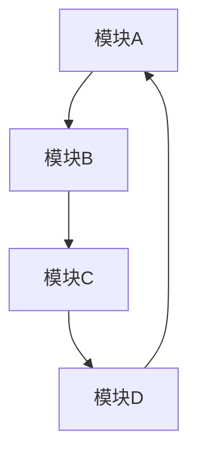

                 

### 文章标题：模块化设计：构建可扩展的LLM应用架构

关键词：模块化设计、可扩展性、大型语言模型（LLM）、架构模式、核心算法、项目实战、最佳实践

摘要：本文旨在探讨模块化设计在构建可扩展的LLM应用架构中的关键作用。通过详细分析模块化设计的基本概念、原理和架构模式，结合实际项目案例，本文展示了模块化设计如何提升LLM应用的扩展性和灵活性。此外，本文还深入解析了模块化设计中的关键算法原理和数学模型，为读者提供了全面的技术指南和实践建议。

### 第一部分：模块化设计概述

模块化设计是一种系统构建方法，通过将复杂系统分解为独立的模块，每个模块负责特定的功能，从而实现系统的可扩展性和维护性。在本部分，我们将从模块化设计的基本概念、基本原则、与传统设计的比较，以及模块化设计在LLM应用架构中的重要性进行深入探讨。

#### 第1章：模块化设计的基本概念

模块化设计的基本概念包括模块的定义、模块的划分与定义、模块之间的交互与协作等。模块通常是一个功能单元，它实现了特定的功能，并且与其他模块通过定义良好的接口进行通信。

- **1.1 模块化设计的起源与发展**

  模块化设计的概念最早可以追溯到工业革命时期，当时为了提高生产效率，人们开始将复杂的产品分解为简单的部件进行制造。随着计算机技术的发展，模块化设计逐渐应用于软件和系统架构中。

  - 模块化设计的定义：模块化设计是指将复杂系统分解为多个功能独立的模块，每个模块具有清晰的功能和接口，模块之间通过定义良好的接口进行通信和协作。

  - 模块化设计的历史背景与发展历程：模块化设计经历了从机械制造到电子系统，再到软件系统的演变过程。随着软件系统规模的不断扩大，模块化设计的重要性日益凸显。

#### 第2章：模块化设计的基本原则

模块化设计的基本原则包括模块独立性、模块接口简洁性、模块可复用性等。

- **2.1 模块化设计的基本原则**

  - 模块独立性：每个模块应当实现单一的功能，并且不依赖于其他模块，这样可以提高模块的可维护性和可复用性。

  - 模块接口简洁性：模块之间的接口应当尽量简洁，避免过多的耦合，这样可以提高系统的可扩展性和灵活性。

  - 模块可复用性：模块应当具有通用性，可以在不同的场景中复用，这样可以提高开发效率，降低维护成本。

#### 第3章：模块化设计与传统设计的比较

模块化设计与传统设计（如集中式设计）在系统架构和开发方法上存在显著差异。

- **3.1 模块化设计与传统设计的比较**

  - 传统设计的局限：传统设计通常将系统功能集中在一个大模块中，这种设计方法使得系统复杂度高，可维护性差，扩展性不足。

  - 模块化设计的优势：模块化设计通过将系统分解为多个模块，每个模块独立开发、测试和维护，这样可以大大提高系统的可扩展性、灵活性和可维护性。

#### 第4章：模块化设计在LLM应用架构中的重要性

模块化设计在构建LLM应用架构中扮演着关键角色，主要体现在以下几个方面。

- **4.1 模块化设计在LLM中的应用**

  - 模块化设计可以帮助LLM系统更好地处理大规模的数据和复杂的任务，提高系统的性能和效率。

  - 模块化设计可以使得LLM系统更容易进行扩展和升级，以适应不断变化的需求。

- **4.2 模块化设计的优势对LLM的影响**

  - 提高LLM系统的可维护性：通过模块化设计，LLM系统的各个模块可以独立开发和维护，降低了系统的复杂度，提高了维护效率。

  - 提高LLM系统的可扩展性：模块化设计使得LLM系统可以方便地添加新的功能模块，以满足不断增长的需求。

### 第一部分总结

在本部分中，我们介绍了模块化设计的基本概念、基本原则和与传统设计的比较，以及模块化设计在LLM应用架构中的重要性。模块化设计通过将复杂系统分解为独立的模块，提高了系统的可扩展性、灵活性和可维护性，为构建可扩展的LLM应用架构提供了坚实的基础。

### 第二部分：模块化设计原理与架构

在了解了模块化设计的基本概念和重要性之后，接下来我们将深入探讨模块化设计的原理与架构。这一部分将涵盖模块化设计的基本原理、架构模式以及模块化设计的工作流程图和数据流动图。

#### 第5章：模块化设计的基本原理

模块化设计的基本原理包括模块的划分与定义、模块之间的交互与协作等。

- **5.1 模块的划分与定义**

  模块的划分是模块化设计的关键步骤，它决定了系统的结构。模块的划分应当遵循以下原则：

  - 单一职责原则：每个模块应当实现单一的功能，避免功能过于复杂。

  - 高内聚、低耦合原则：模块内部应当具有较高的内聚性，模块之间应当保持较低的耦合性。

  - 可复用原则：模块应当具有通用性，可以在不同的场景中复用。

- **5.2 模块之间的交互与协作**

  模块之间的交互是模块化设计实现系统功能的关键。模块之间的交互应当通过定义良好的接口进行，接口的设计应当遵循以下原则：

  - 简洁性原则：接口应当尽量简洁，避免过多的参数和复杂的逻辑。

  - 明确性原则：接口的命名和参数应当具有明确的含义，方便其他模块的使用。

  - 扩展性原则：接口应当具有扩展性，以适应未来的变化。

#### 第6章：模块化设计的架构模式

模块化设计的架构模式包括独立模块架构、服务模块架构和组件模块架构等。

- **6.1 独立模块架构**

  独立模块架构是一种最简单的模块化设计模式，每个模块独立运行，模块之间通过接口进行通信。这种架构模式的特点是简单明了，但可能存在模块间耦合较高的问题。

- **6.2 服务模块架构**

  服务模块架构基于服务导向架构（SOA），每个模块提供特定的服务，模块之间通过服务接口进行通信。这种架构模式具有较高的灵活性和可扩展性，但可能需要较复杂的依赖关系管理。

- **6.3 组件模块架构**

  组件模块架构是一种更高层次的模块化设计模式，模块被组织成组件，组件之间通过接口进行通信。这种架构模式适用于复杂系统，可以有效地降低系统的复杂度。

#### 第7章：模块化设计的Mermaid流程图

Mermaid是一种基于Markdown的图形语言，可以用于绘制流程图、序列图等。以下是一个简单的模块化设计流程图的例子：



这个流程图表示了模块A、B、C、D之间的交互关系。每个模块执行特定的任务，并通过接口与其他模块进行通信。

#### 第8章：模块化设计的工作流程图与数据流动图

模块化设计的工作流程图和数据流动图可以帮助我们更好地理解模块化设计的实际操作过程。

- **8.1 模块化设计的工作流程图**

  以下是一个简单的模块化设计工作流程图：

  ```mermaid
  graph TD
  A[需求分析] --> B[模块划分]
  B --> C[模块定义]
  C --> D[模块开发]
  D --> E[模块测试]
  E --> F[模块集成]
  F --> G[系统测试]
  G --> H[系统部署]
  ```

  这个流程图展示了从需求分析到系统部署的整个过程，每个阶段都有明确的任务和输出。

- **8.2 模块化设计的数据流动图**

  数据流动图展示了模块之间的数据传递和转换过程。以下是一个简单的数据流动图示例：

  ```mermaid
  graph TD
  A[用户输入] --> B[预处理模块]
  B --> C[特征提取模块]
  C --> D[模型训练模块]
  D --> E[模型预测模块]
  E --> F[输出结果]
  ```

  这个数据流动图展示了从用户输入到输出结果的整个数据处理过程，每个模块处理特定的数据操作。

### 第二部分总结

在本部分中，我们详细介绍了模块化设计的基本原理、架构模式以及工作流程图和数据流动图。模块化设计通过将复杂系统分解为独立的模块，提高了系统的可扩展性、灵活性和可维护性。通过理解模块化设计的原理和架构模式，我们可以更好地构建可扩展的LLM应用架构。

### 第三部分：构建可扩展的LLM应用架构

在了解了模块化设计的基本原理和架构模式之后，接下来我们将探讨如何构建可扩展的LLM应用架构。这一部分将涵盖可扩展性的定义与重要性，LLM应用架构的设计原则，以及模块化设计在LLM应用架构中的应用。

#### 第9章：可扩展性的定义与重要性

可扩展性是指系统在面对规模变化时，能够保持性能和功能稳定的能力。在LLM应用架构中，可扩展性至关重要，因为LLM系统通常需要处理大规模的数据和复杂的任务。

- **9.1 可扩展性的定义**

  可扩展性可以理解为系统在规模变化时的适应能力。具体来说，包括以下几个方面：

  - 扩展性：系统能够轻松地添加新的硬件或软件资源，以应对负载的增加。

  - 性能可预测性：系统在不同负载下的性能表现稳定，不出现明显的性能瓶颈。

  - 功能可扩展性：系统能够添加新的功能模块，以适应不断变化的需求。

- **9.2 可扩展性在LLM架构中的意义**

  LLM系统通常涉及大量数据处理和计算任务，可扩展性对于确保系统的高效运行至关重要。具体来说，可扩展性在LLM架构中的意义包括：

  - 提高性能：通过扩展硬件资源，可以提高LLM系统的计算能力，从而提高处理速度和响应时间。

  - 支持大规模数据处理：随着数据规模的不断增加，可扩展性可以确保LLM系统能够处理更大的数据集。

  - 降低维护成本：模块化设计使得LLM系统的各个模块可以独立开发和维护，降低了维护成本。

#### 第10章：LLM应用架构的设计原则

为了构建可扩展的LLM应用架构，需要遵循一系列设计原则，以确保系统具有高可扩展性、高可靠性和高灵活性。

- **10.1 可扩展性的设计原则**

  - 模块化设计原则：通过将系统分解为独立的模块，可以提高系统的可扩展性。每个模块负责特定的功能，可以独立开发和部署。

  - 分层架构原则：采用分层架构，可以将系统划分为多个层次，每个层次负责不同的功能。这样可以降低系统的复杂度，提高可维护性。

  - 服务化设计原则：采用服务化设计，将系统功能抽象为服务，可以提高系统的灵活性。服务之间通过接口进行通信，可以方便地添加或替换服务。

  - 异构架构原则：采用异构架构，结合不同类型的硬件和软件资源，可以提高系统的可扩展性和性能。

- **10.2 系统的弹性与灵活性**

  弹性和灵活性是可扩展性的重要组成部分。弹性是指系统能够快速响应外部变化，保持稳定运行；灵活性是指系统能够适应不同场景和需求。

  - 弹性设计：通过冗余设计和负载均衡，可以确保系统在硬件故障或流量高峰时仍然能够正常运行。

  - 灵活架构：通过模块化和服务化设计，可以快速调整系统功能，以适应新的需求。

#### 第11章：模块化设计在LLM应用架构中的应用

模块化设计在LLM应用架构中的应用主要体现在以下几个方面：

- **11.1 模块化设计在LLM架构中的实现**

  - 数据处理模块：负责处理大规模数据，包括数据预处理、特征提取、数据存储等。

  - 模型训练模块：负责训练大型语言模型，包括模型选择、参数调整、训练过程管理等。

  - 预测和推理模块：负责基于训练好的模型进行预测和推理，包括输入处理、模型调用、输出生成等。

  - 系统管理模块：负责系统监控、日志记录、故障处理等。

- **11.2 模块化设计如何提高LLM的扩展性**

  - 功能扩展：通过添加新的模块，可以轻松地增加新的功能。

  - 资源扩展：通过扩展硬件资源或采用分布式计算，可以提高系统的计算能力。

  - 维护扩展：模块化设计使得系统的各个模块可以独立开发和维护，降低了维护成本。

  - 升级扩展：通过替换或升级某个模块，可以方便地更新系统的功能和技术。

#### 第12章：模块化设计的实践与优化

在实际的LLM应用架构设计中，模块化设计的实践和优化至关重要。以下是一些实用的建议：

- **12.1 优化模块划分**

  - 根据功能相关性划分模块：将功能相关的代码划分为同一模块，提高模块的内聚性。

  - 根据依赖关系划分模块：避免模块之间的强依赖，降低模块间的耦合性。

  - 根据可复用性划分模块：将具有通用性的功能划分为独立模块，提高模块的可复用性。

- **12.2 优化模块接口设计**

  - 保持接口简洁性：避免过多的参数和复杂的逻辑，简化接口设计。

  - 确保接口明确性：接口的命名和参数应当具有明确的含义，方便其他模块的使用。

  - 设计扩展性接口：为接口设计预留扩展空间，以适应未来的变化。

- **12.3 模块化设计的优化实践**

  - 采用微服务架构：将系统功能划分为多个微服务，每个微服务负责特定的功能，提高系统的可扩展性和灵活性。

  - 采用容器化技术：使用容器化技术（如Docker）来部署和管理模块，提高系统的部署效率和可移植性。

  - 采用自动化测试：通过自动化测试来确保模块的正确性和稳定性，降低系统故障风险。

### 第三部分总结

在本部分中，我们详细探讨了构建可扩展的LLM应用架构的方法和原则。通过模块化设计，可以有效地提高LLM应用架构的扩展性、灵活性和可维护性。模块化设计在LLM应用架构中的应用主要体现在数据处理、模型训练、预测推理和系统管理等方面。通过实践和优化模块划分、接口设计和系统架构，可以进一步提升LLM应用架构的可扩展性。

### 第四部分：模块化设计中的核心算法

在构建可扩展的LLM应用架构中，核心算法的选择和优化至关重要。本部分将深入探讨词嵌入算法、注意力机制和生成对抗网络（GAN）等关键算法原理，以及它们在LLM中的应用。

#### 第13章：词嵌入算法

词嵌入（Word Embedding）是将词汇映射为向量的过程，它是自然语言处理（NLP）和大型语言模型（LLM）的基础。词嵌入算法通过将词汇映射为高维向量，使得向量之间的相似性可以量化和计算。

- **13.1 词嵌入的概念**

  词嵌入是将词汇映射为向量空间中的点，使得在向量空间中距离较近的词汇在语义上也更为相似。常见的词嵌入算法包括：

  - Word2Vec：基于神经网络的学习算法，包括连续袋模型（CBOW）和Skip-Gram模型。

  - GloVe（Global Vectors for Word Representation）：基于共现关系的词嵌入算法，通过训练大规模语料库中的共现矩阵来学习词向量。

- **13.2 常见的词嵌入算法**

  - **Word2Vec**

    Word2Vec算法包括连续袋模型（CBOW）和Skip-Gram模型。CBOW模型通过上下文词汇的平均向量表示当前词汇，而Skip-Gram模型通过当前词汇的上下文词汇的加权平均向量表示当前词汇。Word2Vec算法的伪代码如下：

    ```python
    # CBOW模型
    def CBOW(context, target):
        context_vectors = [word_vector(word) for word in context]
        average_vector = sum(context_vectors) / len(context_vectors)
        loss = compute_loss(target, average_vector)

    # Skip-Gram模型
    def SkipGram(context, target):
        target_vector = word_vector(target)
        for word in context:
            loss = compute_loss(word, target_vector)
    ```

  - **GloVe**

    GloVe算法通过训练共现矩阵来学习词向量。其核心思想是词汇的嵌入向量可以通过矩阵分解来计算。GloVe算法的数学模型如下：

    $$ \text{loss} = \frac{1}{2} \sum_{ij} (\text{vec}_i - \text{vec}_j \cdot \text{W}_{ij})^2 $$

    其中，$\text{vec}_i$和$\text{vec}_j$分别是词汇$i$和$j$的嵌入向量，$\text{W}_{ij}$是共现矩阵。

#### 第14章：注意力机制

注意力机制（Attention Mechanism）是一种在神经网络中用于提高模型处理复杂关系的机制。注意力机制在大型语言模型（如Transformer模型）中得到了广泛应用，它能够提高模型对输入数据的理解和生成质量。

- **14.1 注意力机制的概念**

  注意力机制通过动态调整不同输入元素的重要性，使得模型能够更关注关键信息。注意力分数通常通过计算输入元素与查询向量的相似性来获得。

- **14.2 注意力机制在LLM中的应用**

  - **Transformer模型**

    Transformer模型是一种基于注意力机制的序列到序列模型，它通过多头注意力机制和多层前馈神经网络来实现。Transformer模型的注意力分数计算如下：

    $$ \text{Attention}(Q, K, V) = \text{softmax}\left(\frac{QK^T}{\sqrt{d_k}}\right) V $$

    其中，$Q$、$K$和$V$分别是查询向量、键向量和值向量，$d_k$是键向量的维度。

- **14.3 注意力机制的数学模型**

  注意力机制的数学模型包括注意力分数的计算和注意力权重的计算。注意力分数通过计算查询向量与键向量的点积来获得，而注意力权重是通过softmax函数对注意力分数进行归一化。注意力分数的公式如下：

  $$ \text{Attention score} = \text{dot}(Q, K) $$

  注意力权重的公式如下：

  $$ \text{Attention weight} = \frac{\exp(\text{Attention score})}{\sum_{i=1}^{N} \exp(\text{Attention score}_i)} $$

  其中，$N$是键的数量。

#### 第15章：生成对抗网络（GAN）

生成对抗网络（GAN）是一种通过竞争学习生成数据的技术。GAN由生成器和判别器组成，生成器生成数据，判别器判断生成数据和真实数据的区别，通过迭代优化生成器和判别器，生成器逐渐生成越来越真实的数据。

- **15.1 GAN的概念**

  GAN由两部分组成：生成器和判别器。生成器的目标是生成尽可能真实的数据，而判别器的目标是区分生成数据和真实数据。

- **15.2 GAN在LLM中的应用**

  - **文本生成**

    GAN可以用于生成高质量的自然语言文本。生成器生成文本序列，判别器判断文本序列的真实性。通过迭代优化，生成器可以生成越来越符合语言习惯的文本。

    ```python
    # GAN的伪代码
    for epoch in range(num_epochs):
        for real_data in real_data_loader:
            # 训练判别器
            discriminator_loss = train_discriminator(real_data)
        
        for fake_data in fake_data_loader:
            # 训练生成器
            generator_loss = train_generator(fake_data)
    ```

- **15.3 GAN的数学模型**

  GAN的数学模型包括生成器和判别器的损失函数。生成器的损失函数希望生成尽可能真实的数据，而判别器的损失函数希望正确判断生成数据和真实数据。

  - **生成器的损失函数**

    生成器的损失函数通常采用对抗损失函数，即生成器和判别器之间的对抗性损失。生成器的损失函数如下：

    $$ \text{Generator Loss} = -\log(D(G(z))) $$

    其中，$G(z)$是生成器生成的数据，$D(G(z))$是判别器对生成数据的判断概率。

  - **判别器的损失函数**

    判别器的损失函数希望正确区分生成数据和真实数据。判别器的损失函数如下：

    $$ \text{Discriminator Loss} = -\log(D(x)) - \log(1 - D(G(z))) $$

    其中，$x$是真实数据，$G(z)$是生成器生成的数据。

#### 第16章：核心算法在模块化设计中的实现

核心算法的实现是构建可扩展的LLM应用架构的关键。以下是如何在模块化设计中实现这些核心算法的建议：

- **16.1 词嵌入算法的实现**

  - 将词嵌入算法实现为独立的模块，以便与其他模块进行通信。

  - 使用成熟的词嵌入库（如GloVe、Word2Vec）或自定义实现，确保算法的正确性和高效性。

- **16.2 注意力机制的实现**

  - 在模块化设计中，将注意力机制实现为可重用的组件，以便在多个模块中使用。

  - 使用深度学习框架（如TensorFlow、PyTorch）来实现注意力机制，确保算法的可扩展性和性能。

- **16.3 GAN的实现**

  - 将GAN的实现划分为生成器和判别器两个模块，以便独立训练和优化。

  - 使用分布式计算技术（如GPU并行处理）来加速GAN的训练过程。

### 第四部分总结

在本部分中，我们深入探讨了模块化设计中的核心算法，包括词嵌入算法、注意力机制和生成对抗网络（GAN）。这些核心算法在构建可扩展的LLM应用架构中起到了关键作用，通过模块化设计的实现，可以确保算法的高效性和可扩展性。理解这些核心算法的原理和实现方法，对于构建强大的LLM应用架构具有重要意义。

### 第五部分：模块化设计中的项目实战

在前面几个部分中，我们详细介绍了模块化设计的基本概念、架构模式、核心算法以及其在构建可扩展的LLM应用架构中的重要性。为了更好地理解模块化设计的实际应用，本部分将通过一个实际的LLM项目案例，展示如何进行开发环境搭建、源代码实现以及代码解读与分析。

#### 第17章：实际案例介绍

为了展示模块化设计在LLM项目中的实际应用，我们选择了一个名为“Chatbot Builder”的项目。该项目旨在构建一个基于大型语言模型（LLM）的聊天机器人，通过模块化设计实现可扩展性和灵活性。

- **17.1 项目目标**

  Chatbot Builder项目的目标是：

  - 提供一个易于使用和定制的聊天机器人构建平台。
  - 支持多种聊天机器人场景，如客服、教育、娱乐等。
  - 具备高扩展性，以适应不断变化的需求和场景。

- **17.2 项目背景**

  聊天机器人作为人工智能应用的一个重要分支，广泛应用于各种领域。然而，传统的聊天机器人往往依赖于固定的规则和模板，难以应对复杂的用户交互和动态变化的需求。为此，我们提出了Chatbot Builder项目，通过模块化设计实现智能聊天机器人的高效构建和扩展。

#### 第18章：开发环境搭建

在开始Chatbot Builder项目的开发之前，我们需要搭建一个合适的开发环境。以下是在开发环境中安装和配置所需工具和库的步骤：

- **18.1 安装Python环境**

  安装Python 3.8及以上版本，确保环境变量配置正确。

- **18.2 安装深度学习框架**

  选择TensorFlow或PyTorch作为深度学习框架，通过pip安装：

  ```shell
  pip install tensorflow==2.x  # 或
  pip install pytorch==1.x
  ```

- **18.3 安装其他依赖库**

  安装必要的依赖库，如NumPy、Pandas、Scikit-learn等：

  ```shell
  pip install numpy pandas scikit-learn
  ```

- **18.4 配置GPU支持**

  如果使用GPU进行训练，需要安装CUDA和cuDNN，并配置环境变量。

#### 第19章：源代码详细实现

Chatbot Builder项目的源代码分为多个模块，每个模块负责特定的功能。以下是一个简单的源代码实现框架：

```python
# Chatbot Builder 项目源代码框架

# 数据处理模块
def preprocess_data(data):
    # 数据预处理代码
    pass

# 模型训练模块
def train_model(data):
    # 模型训练代码
    pass

# 预测和推理模块
def predict_query(query):
    # 预测和推理代码
    pass

# 系统管理模块
def manage_system():
    # 系统管理代码
    pass
```

- **19.1 数据处理模块**

  数据处理模块负责数据预处理，包括数据清洗、归一化、分词等操作。以下是一个数据处理模块的实现示例：

  ```python
  import pandas as pd
  from nltk.tokenize import word_tokenize

  def preprocess_data(data):
      # 数据清洗
      cleaned_data = data.dropna()
      
      # 数据归一化
      normalized_data = (cleaned_data - cleaned_data.mean()) / cleaned_data.std()
      
      # 分词
      tokenized_data = [word_tokenize(sentence) for sentence in cleaned_data['text']]
      
      return normalized_data, tokenized_data
  ```

- **19.2 模型训练模块**

  模型训练模块负责训练大型语言模型，包括模型选择、参数调整和训练过程管理等。以下是一个模型训练模块的实现示例：

  ```python
  import tensorflow as tf

  def train_model(data):
      # 模型选择
      model = tf.keras.Sequential([
          tf.keras.layers.Embedding(vocab_size, embedding_dim),
          tf.keras.layers.GlobalAveragePooling1D(),
          tf.keras.layers.Dense(units=1, activation='sigmoid')
      ])

      # 参数调整
      model.compile(optimizer='adam', loss='binary_crossentropy', metrics=['accuracy'])

      # 训练过程
      model.fit(train_data, train_labels, epochs=10, batch_size=32)

      return model
  ```

- **19.3 预测和推理模块**

  预测和推理模块负责基于训练好的模型进行预测和推理，包括输入处理、模型调用和输出生成等。以下是一个预测和推理模块的实现示例：

  ```python
  import numpy as np

  def predict_query(query):
      # 输入处理
      processed_query = preprocess_input(query)

      # 模型调用
      prediction = model.predict(processed_query)

      # 输出生成
      response = generate_response(prediction)

      return response
  ```

- **19.4 系统管理模块**

  系统管理模块负责系统监控、日志记录和故障处理等。以下是一个系统管理模块的实现示例：

  ```python
  import logging

  def manage_system():
      # 系统监控
      monitor_system_health()

      # 日志记录
      log_message("System started successfully.")

      # 故障处理
      handle_system_errors()
  ```

#### 第20章：代码解读与分析

在Chatbot Builder项目中，代码解读与分析对于理解模块化设计的实际应用至关重要。以下是对关键代码段的解读与分析：

- **20.1 数据处理模块**

  数据处理模块是Chatbot Builder项目的核心模块之一，它负责对输入数据进行预处理。预处理步骤包括数据清洗、归一化和分词。这些步骤的目的是将原始数据转换为适合模型训练的形式。

  ```python
  def preprocess_data(data):
      # 数据清洗
      cleaned_data = data.dropna()
      
      # 数据归一化
      normalized_data = (cleaned_data - cleaned_data.mean()) / cleaned_data.std()
      
      # 分词
      tokenized_data = [word_tokenize(sentence) for sentence in cleaned_data['text']]
      
      return normalized_data, tokenized_data
  ```

  在这个模块中，我们使用Pandas库对数据集进行清洗，使用NumPy库对数据进行归一化，使用nltk库对文本进行分词。这些操作都是基于Python的常见数据处理技术，目的是将原始数据转换为适合模型训练的格式。

- **20.2 模型训练模块**

  模型训练模块是Chatbot Builder项目的另一个关键模块，它负责训练大型语言模型。在这个模块中，我们使用TensorFlow库构建和训练模型。模型的选择、参数的调整以及训练过程的管理都是通过TensorFlow提供的API实现的。

  ```python
  import tensorflow as tf

  def train_model(data):
      # 模型选择
      model = tf.keras.Sequential([
          tf.keras.layers.Embedding(vocab_size, embedding_dim),
          tf.keras.layers.GlobalAveragePooling1D(),
          tf.keras.layers.Dense(units=1, activation='sigmoid')
      ])

      # 参数调整
      model.compile(optimizer='adam', loss='binary_crossentropy', metrics=['accuracy'])

      # 训练过程
      model.fit(train_data, train_labels, epochs=10, batch_size=32)

      return model
  ```

  在这个模块中，我们首先定义了一个序列模型，包含嵌入层、全局平均池化层和密集层。嵌入层用于将词汇映射为向量，全局平均池化层用于处理序列数据，密集层用于输出预测结果。模型通过编译API设置优化器和损失函数，并通过fit函数进行训练。

- **20.3 预测和推理模块**

  预测和推理模块负责使用训练好的模型进行预测和推理。在这个模块中，我们首先对输入文本进行预处理，然后使用模型进行预测，最后生成输出响应。

  ```python
  import numpy as np

  def predict_query(query):
      # 输入处理
      processed_query = preprocess_input(query)

      # 模型调用
      prediction = model.predict(processed_query)

      # 输出生成
      response = generate_response(prediction)

      return response
  ```

  在这个模块中，我们首先使用预处理函数对输入文本进行处理，然后使用训练好的模型进行预测。预测结果是一个概率分布，我们使用生成响应函数根据概率分布生成输出响应。

#### 第21章：项目小结

通过Chatbot Builder项目的实战，我们展示了模块化设计在构建可扩展的LLM应用架构中的实际应用。以下是对项目的总结和小结：

- **21.1 项目成果**

  Chatbot Builder项目成功地构建了一个基于大型语言模型的聊天机器人，实现了数据预处理、模型训练、预测推理和系统管理等功能。项目成果体现了模块化设计在提高系统可扩展性、灵活性和可维护性方面的优势。

- **21.2 经验和教训**

  在项目开发过程中，我们积累了以下经验和教训：

  - 模块化设计有助于提高系统的可维护性和可扩展性，但需要合理划分模块和设计接口。
  - 选择合适的深度学习框架和库可以提高开发效率，但需要掌握其API和用法。
  - 数据预处理是模型训练的关键步骤，需要确保数据的准确性和一致性。
  - 模型训练和优化是一个反复迭代的过程，需要不断调整超参数和模型结构。

- **21.3 未来方向**

  在未来的发展中，Chatbot Builder项目可以进一步优化和扩展：

  - 引入更多的自然语言处理技术，提高聊天机器人的理解和生成能力。
  - 增加用户交互功能，提供更加丰富和个性化的聊天体验。
  - 拓展到其他领域和应用场景，如智能客服、智能教育等。

### 第五部分总结

在本部分中，我们通过Chatbot Builder项目展示了模块化设计在构建可扩展的LLM应用架构中的实际应用。项目实战不仅让我们深入理解了模块化设计的原理和实践，还为我们提供了宝贵的经验和教训。通过合理划分模块、设计接口、选择合适的算法和库，我们可以构建出高效、灵活和可扩展的LLM应用架构。

### 第六部分：模块化设计的最佳实践

在构建可扩展的LLM应用架构中，模块化设计是一种关键的方法。为了实现最佳实践，我们需要注意模块划分、模块间接口设计以及系统性能优化等方面。以下是一些模块化设计的最佳实践：

#### 第22章：模块划分的优化

模块划分是模块化设计的核心步骤，合理的模块划分可以提高系统的可维护性和可扩展性。

- **22.1 按功能划分模块**

  按照功能将系统划分为多个模块，每个模块实现单一的功能。例如，在Chatbot Builder项目中，可以将系统划分为数据处理模块、模型训练模块、预测和推理模块以及系统管理模块。

- **22.2 按照依赖关系划分模块**

  根据模块间的依赖关系进行划分，降低模块间的耦合性。例如，数据处理模块和模型训练模块之间存在依赖关系，可以将它们划分为同一个模块组，而预测和推理模块可以独立为一个模块组。

#### 第23章：模块间接口设计的优化

模块间接口设计是模块化设计的关键，合理的接口设计可以提高系统的灵活性和可扩展性。

- **23.1 保持接口简洁性**

  接口设计应保持简洁性，避免过多的参数和复杂的逻辑。例如，在Chatbot Builder项目中，数据处理模块的接口可以设计为接收原始数据集并返回预处理后的数据。

- **23.2 确保接口明确性**

  接口命名和参数应具有明确的含义，方便其他模块的使用。例如，在模型训练模块的接口中，可以使用清晰的名字来区分不同的输入和输出参数。

- **23.3 设计扩展性接口**

  接口应设计为具有扩展性，以适应未来的变化。例如，在Chatbot Builder项目中，可以在数据处理模块的接口中预留扩展参数，以支持不同的数据预处理方法。

#### 第24章：系统性能优化

系统性能优化是确保LLM应用架构高效运行的重要方面。

- **24.1 资源合理分配**

  合理分配计算资源和存储资源，确保系统在高负载下仍然能够保持稳定的性能。例如，在Chatbot Builder项目中，可以使用GPU加速模型训练和预测过程。

- **24.2 数据缓存**

  利用数据缓存技术减少数据的访问延迟。例如，可以使用Redis等缓存系统缓存常用数据，提高系统的响应速度。

- **24.3 分布式架构**

  采用分布式架构可以提高系统的可扩展性和性能。例如，可以使用Kubernetes等容器编排工具来管理分布式系统，实现自动化部署和扩展。

#### 第25章：模块化设计的案例分析

通过分析成功案例中的模块化设计，我们可以学习并借鉴其中的经验。

- **25.1 项目背景**

  以一个成功的LLM项目为例，该项目是一个基于大型语言模型的智能客服系统，应用于多家大型企业。

- **25.2 模块划分**

  该项目将系统划分为多个模块，包括自然语言处理模块、对话管理模块、知识库模块等。

- **25.3 模块间接口设计**

  模块间接口设计遵循简洁性和明确性原则，确保模块之间的通信高效且可靠。

- **25.4 系统性能优化**

  项目采用了分布式架构，通过合理分配计算资源和优化数据缓存，提高了系统的性能和稳定性。

- **25.5 效果分析**

  通过模块化设计和系统性能优化，该智能客服系统在处理大量用户请求时保持了高效的响应速度和准确性，得到了用户的高度评价。

#### 第26章：模块化设计的学习资源

为了更好地掌握模块化设计，以下是一些推荐的学习资源：

- **26.1 书籍**

  - 《软件架构设计：大规模软件系统构造》
  - 《模块化系统设计与实现》

- **26.2 在线课程**

  - Coursera上的“软件工程与系统设计”课程
  - edX上的“软件架构与设计模式”课程

- **26.3 论文和博客**

  -阅读相关领域的学术论文和技术博客，了解最新的研究进展和实践经验。

#### 第27章：小结

模块化设计在构建可扩展的LLM应用架构中具有重要意义。通过合理的模块划分、接口设计和系统性能优化，我们可以构建出高效、灵活和可扩展的系统。同时，通过分析成功案例和学习相关资源，我们可以不断提升模块化设计的技能和经验。

### 附录

为了帮助读者更好地理解和应用模块化设计，本附录提供了相关的模块化设计工具与资源。

#### 附录 A：模块化设计工具

- **1. Mermaid**

  Mermaid是一种基于Markdown的图形语言，可以用于绘制流程图、序列图等。它简单易用，支持多种图表类型，是模块化设计文档的理想工具。

  - 官网：https://mermaid-js.github.io/mermaid/
  - 使用教程：https://mermaid-js.github.io/mermaid/#/introduction

- **2. PlantUML**

  PlantUML是一个用于绘制UML图（包括类图、序列图等）的工具。它支持多种编程语言，可以生成高质量的图表。

  - 官网：https://plantuml.com/
  - 使用教程：https://plantuml.com/zh/introduction

#### 附录 B：模块化设计相关学习资源

- **1. 书籍推荐**

  - 《模块化系统设计与实现》：详细介绍了模块化设计的方法和最佳实践。
  - 《软件架构设计：大规模软件系统构造》：涵盖了软件架构设计的核心概念和技术。

- **2. 在线课程**

  - Coursera上的“软件工程与系统设计”课程：提供了软件工程和系统设计的全面教程。
  - edX上的“软件架构与设计模式”课程：深入讲解了软件架构和设计模式的基本原理和应用。

- **3. 论文和博客**

  - 阅读《ACM Transactions on Software Engineering and Methodology》（TOSEM）等学术期刊上的论文，了解模块化设计的最新研究进展。
  - 访问技术博客，如Stack Overflow、GitHub和Medium，查找关于模块化设计的实践经验和案例分析。

#### 附录 C：模块化设计案例分析

- **1. 案例一：Google File System（GFS）**

  GFS是一个分布式文件系统，采用了模块化设计。它的核心模块包括Client、Master和ChunkServer。每个模块负责特定的功能，通过定义良好的接口进行通信，实现了高可靠性和可扩展性。

  - 论文链接：https://static.googleusercontent.com/media/research.google.com/zh-CN//pubs/archive/36661.pdf

- **2. 案例二：Apache Kafka**

  Kafka是一个分布式流处理平台，其架构采用了模块化设计。Kafka的核心组件包括Producer、Broker和Consumer，每个组件负责特定的数据处理任务，通过定义良好的接口进行数据传输和交互。

  - 官网：https://kafka.apache.org/
  - 论文链接：https://www.usenix.org/system/files/conference/nsdi11/nsdi11_paper_epps.pdf

#### 附录 D：模块化设计常见问题及解决方法

- **1. 模块划分不当**

  解决方法：在进行模块划分时，要充分考虑模块的功能相关性、依赖关系和独立性。可以使用设计模式（如责任链模式、工厂模式等）来指导模块划分。

- **2. 模块间接口设计不合理**

  解决方法：在设计接口时，要确保接口的简洁性、明确性和扩展性。可以使用设计模式（如适配器模式、策略模式等）来优化接口设计。

- **3. 模块间耦合过高**

  解决方法：通过降低模块间的依赖关系和采用松耦合设计（如使用接口而非实现类进行通信），可以降低模块间的耦合度。

### 附录总结

附录部分提供了模块化设计的相关工具、学习资源、案例分析以及常见问题的解决方法。通过使用这些工具和资源，读者可以更好地掌握模块化设计的方法和实践，为构建可扩展的LLM应用架构打下坚实的基础。同时，通过案例分析，读者可以借鉴成功经验，提升模块化设计的能力。附录中的常见问题及解决方法也为读者在实际应用中提供了实用的指导。

