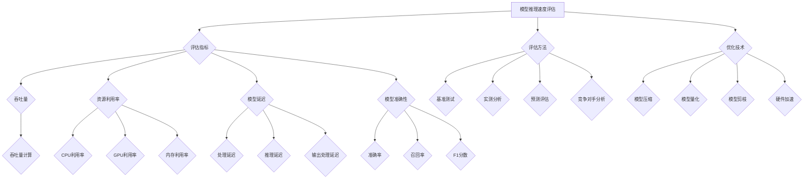

                 

# 《模型推理速度评估：优化实时应用性能》

---

## 关键词

- 模型推理速度评估
- 实时应用性能优化
- 模型压缩
- 模型量化
- 硬件加速
- 操作系统调优

---

## 摘要

随着深度学习技术的飞速发展，模型推理速度成为实时应用性能的关键瓶颈。本文从模型推理速度评估的基础知识出发，深入探讨模型推理速度评估的指标、评估方法和优化技术，包括模型优化技术、硬件优化和系统优化。通过实战案例分析，总结优化策略，展望未来发展趋势，为实时应用性能优化提供理论指导和实践参考。

---

## 第1章 模型推理速度评估概述

### 1.1 模型推理速度的基本概念

模型推理速度（Model Inference Speed）是指模型在给定输入数据后，完成预测或决策的速度。它直接关系到实时应用系统的响应时间和用户体验。模型推理速度可以分为以下几类：

1. **单步推理速度**：每次输入数据后，模型从开始计算到输出结果所需的时间。
2. **批处理推理速度**：每次处理一批输入数据所需的时间。
3. **吞吐量**：单位时间内可以处理的输入数据量。

### 1.2 模型推理速度的重要性

模型推理速度的重要性主要体现在以下几个方面：

1. **用户体验**：高速的推理速度可以显著提高用户对实时应用的满意度。
2. **商业价值**：在金融、医疗等需要高实时性的行业，推理速度直接关系到企业的运营效率和竞争力。
3. **资源利用**：高效的推理速度意味着更合理的硬件资源分配，降低成本。

### 1.3 模型推理速度评估的挑战

模型推理速度评估面临的挑战包括：

1. **计算资源的多样性**：不同硬件设备和不同类型的模型对速度有不同要求。
2. **实时性与准确性的平衡**：在追求速度的同时，需要保证模型的准确性。
3. **评估方法的统一性**：目前尚无统一的标准和方法来评估模型推理速度。

### 1.4 实时应用性能优化目标

实时应用性能优化主要包括以下目标：

1. **吞吐量最大化**：提高单位时间内处理的输入数据量。
2. **延迟最小化**：降低模型推理的响应时间。
3. **资源利用率优化**：合理分配硬件资源，提高系统效率。
4. **模型准确性保证**：在优化速度的同时，确保模型的预测准确度。

---

## 第2章 模型推理速度评估指标

### 2.1 吞吐量

吞吐量（Throughput）是衡量模型推理速度的重要指标，表示单位时间内模型处理的输入数据量。吞吐量的计算公式如下：

\[ \text{吞吐量} = \frac{\text{输入数据量}}{\text{推理时间}} \]

### 2.2 资源利用率

资源利用率（Resource Utilization）是指硬件资源在模型推理过程中被使用的效率。资源利用率可以通过以下指标进行评估：

1. **CPU利用率**：CPU在推理过程中的使用率。
2. **GPU利用率**：GPU在推理过程中的使用率。
3. **内存利用率**：系统内存的使用率。

### 2.3 模型延迟

模型延迟（Model Latency）是指模型从接收输入到输出结果所需的时间。模型延迟可以分为以下几种类型：

1. **总延迟**：包括数据处理延迟、模型推理延迟和输出处理延迟。
2. **处理延迟**：从接收输入到开始处理的时间。
3. **推理延迟**：模型从开始计算到输出结果的时间。

### 2.4 模型准确性

模型准确性（Model Accuracy）是指模型预测结果与实际结果的一致性。模型准确性可以通过以下指标进行评估：

1. **准确率**：预测正确的样本数量占总样本数量的比例。
2. **召回率**：预测正确的正样本数量占所有正样本数量的比例。
3. **F1分数**：准确率和召回率的加权平均。

---

## 第3章 模型推理速度评估方法

### 3.1 基准测试

基准测试（Benchmark Testing）是通过运行标准测试用例来评估模型推理速度的方法。基准测试的优点包括：

1. **可重复性**：标准测试用例保证了测试结果的重复性。
2. **可比性**：不同模型和硬件平台的性能可以通过基准测试进行比较。

### 3.2 实测分析

实测分析（Real-world Analysis）是通过在实际环境中运行模型来评估推理速度的方法。实测分析的优点包括：

1. **真实性**：测试环境与实际应用环境更接近，测试结果更具有参考价值。
2. **多样性**：可以模拟不同的负载和输入数据，全面评估模型性能。

### 3.3 预测评估

预测评估（Prediction Analysis）是基于历史数据和机器学习算法来预测模型推理速度的方法。预测评估的优点包括：

1. **高效性**：无需实际运行模型，可以快速获得推理速度的预测结果。
2. **可扩展性**：可以适用于大规模模型和复杂场景。

### 3.4 竞争对手分析

竞争对手分析（Competitive Analysis）是通过比较不同模型或硬件平台的推理速度来评估性能的方法。竞争对手分析的优点包括：

1. **全面性**：可以从多个维度评估模型或硬件的性能。
2. **客观性**：基于事实和数据，减少主观偏见。

---

## 第4章 模型优化技术

### 4.1 模型压缩

模型压缩（Model Compression）是通过减少模型大小来提高推理速度的方法。模型压缩的方法包括：

1. **模型剪枝**：通过移除不重要的神经元和连接来减小模型大小。
2. **模型量化**：将模型的权重和偏置从浮点数转换为整数。
3. **知识蒸馏**：使用一个较小的模型来复制一个大模型的性能。

### 4.2 模型量化

模型量化（Model Quantization）是将模型中的浮点数权重转换为低精度整数的方法。模型量化的步骤包括：

1. **权重量化**：将权重从浮点数转换为整数。
2. **激活量化**：将模型的激活值从浮点数转换为整数。
3. **量化误差分析**：评估量化对模型准确性的影响。

### 4.3 模型剪枝

模型剪枝（Model Pruning）是通过移除模型中不重要的部分来减小模型大小的技术。模型剪枝的方法包括：

1. **权重剪枝**：移除权重值较小的神经元和连接。
2. **结构剪枝**：移除整个层或子网络。
3. **稀疏化**：将模型中的稀疏度最大化。

### 4.4 硬件加速

硬件加速（Hardware Acceleration）是通过使用专门的硬件设备来提高模型推理速度的方法。硬件加速的方法包括：

1. **GPU加速**：使用图形处理单元来加速模型推理。
2. **FPGA加速**：使用现场可编程门阵列来加速模型推理。
3. **ASIC加速**：使用专用集成电路来加速模型推理。

---

## 第5章 硬件优化

### 5.1 硬件架构选择

硬件架构选择（Hardware Architecture Selection）是根据模型和任务需求来选择最适合的硬件架构。硬件架构的选择标准包括：

1. **计算能力**：根据模型的计算复杂度选择合适的硬件。
2. **能效比**：选择能效比高的硬件以降低能耗。
3. **可扩展性**：选择具有良好可扩展性的硬件以适应未来需求。

### 5.2 硬件加速器技术

硬件加速器技术（Hardware Accelerator Technology）是指使用专门设计的硬件来加速模型推理。硬件加速器技术的种类包括：

1. **GPU加速器**：使用图形处理单元（GPU）来加速模型推理。
2. **FPGA加速器**：使用现场可编程门阵列（FPGA）来加速模型推理。
3. **ASIC加速器**：使用专用集成电路（ASIC）来加速模型推理。

### 5.3 硬件资源调度

硬件资源调度（Hardware Resource Scheduling）是指合理分配硬件资源以提高系统效率。硬件资源调度的策略包括：

1. **负载均衡**：根据任务需求分配硬件资源。
2. **优先级调度**：根据任务的优先级分配硬件资源。
3. **动态调度**：根据系统负载动态调整硬件资源分配。

### 5.4 硬件温度控制

硬件温度控制（Hardware Temperature Control）是指通过控制硬件的温度来保证其正常运行。硬件温度控制的实现方法包括：

1. **风扇控制**：根据硬件温度调节风扇转速。
2. **液体冷却**：使用液体冷却系统来降低硬件温度。
3. **热管技术**：使用热管将热量传导到散热器。

---

## 第6章 系统优化

### 6.1 操作系统调优

操作系统调优（Operating System Optimization）是指通过调整操作系统参数来提高系统性能。操作系统调优的方法包括：

1. **CPU调优**：调整CPU工作频率和核心数。
2. **内存调优**：调整内存分配策略和缓存大小。
3. **I/O调优**：调整I/O设备的工作模式和参数。

### 6.2 网络优化

网络优化（Network Optimization）是指通过优化网络配置和流量管理来提高网络性能。网络优化的方法包括：

1. **带宽优化**：调整网络带宽限制和流量控制策略。
2. **延迟优化**：减少网络延迟和抖动。
3. **安全性优化**：提高网络的安全性，防止攻击和恶意流量。

### 6.3 存储优化

存储优化（Storage Optimization）是指通过优化存储配置和文件系统来提高存储性能。存储优化的方法包括：

1. **SSD优化**：调整固态硬盘的参数和工作模式。
2. **文件系统优化**：选择合适的文件系统并调整其参数。
3. **数据去重**：通过数据去重减少存储空间的使用。

### 6.4 内存管理优化

内存管理优化（Memory Management Optimization）是指通过优化内存分配和回收策略来提高系统性能。内存管理优化的方法包括：

1. **内存池**：使用内存池来提高内存分配的速度。
2. **分代回收**：使用分代回收策略来优化内存回收。
3. **内存压缩**：通过内存压缩减少内存碎片和提高内存利用率。

---

## 第7章 实战案例分析

### 7.1 案例一：视频人脸识别系统

视频人脸识别系统是一个典型的实时应用，其性能直接关系到用户体验。通过模型压缩、硬件加速和系统优化，可以显著提高系统的性能。

1. **模型压缩**：使用模型剪枝和量化技术减小模型大小。
2. **硬件加速**：使用GPU或FPGA加速模型推理。
3. **系统优化**：调整操作系统和硬件参数，提高系统性能。

### 7.2 案例二：自动驾驶系统

自动驾驶系统需要实时处理大量数据，并做出快速决策。通过模型优化、硬件优化和系统优化，可以提高系统的可靠性和响应速度。

1. **模型优化**：使用深度神经网络加速模型推理。
2. **硬件优化**：选择适合的硬件架构和加速器。
3. **系统优化**：调整操作系统和网络参数，优化数据传输和处理。

### 7.3 案例三：智能语音助手

智能语音助手是一个复杂的实时应用，需要处理语音识别、自然语言处理和语音合成等多个任务。通过模型压缩、硬件加速和系统优化，可以显著提高系统的响应速度和准确性。

1. **模型压缩**：使用模型剪枝和量化技术减小模型大小。
2. **硬件加速**：使用GPU或ASIC加速模型推理。
3. **系统优化**：调整操作系统和网络参数，优化数据传输和处理。

### 7.4 案例分析总结与启示

通过以上案例，可以得出以下结论：

1. **模型优化**：是提高实时应用性能的关键步骤。
2. **硬件优化**：选择合适的硬件架构和加速器可以提高性能。
3. **系统优化**：调整操作系统和网络参数可以提高系统的整体性能。
4. **综合优化**：模型优化、硬件优化和系统优化需要综合进行，以达到最佳效果。

---

## 第8章 未来发展趋势与展望

### 8.1 模型推理速度评估技术发展趋势

随着硬件技术的进步和深度学习算法的优化，模型推理速度评估技术将朝着更高效、更准确、更智能的方向发展。主要趋势包括：

1. **自动化评估**：开发自动化评估工具，减少人工干预。
2. **多维度评估**：结合吞吐量、延迟、准确性和资源利用率等多个维度进行综合评估。
3. **智能化评估**：利用机器学习技术对评估过程进行优化。

### 8.2 实时应用性能优化技术发展趋势

实时应用性能优化技术将朝着更精细化、更智能化的方向发展。主要趋势包括：

1. **动态优化**：根据实际运行情况动态调整优化策略。
2. **分布式优化**：将优化任务分布到多个节点，提高整体性能。
3. **智能预测**：利用预测模型优化实时应用性能。

### 8.3 新兴硬件技术在模型推理中的应用

随着新兴硬件技术的发展，模型推理将迎来新的机遇。主要趋势包括：

1. **量子计算**：利用量子计算的优势加速模型推理。
2. **边缘计算**：将模型推理任务分布到边缘设备，降低延迟。
3. **神经形态计算**：利用神经形态计算的优势提高模型推理速度。

---

## 第9章 结论与展望

### 9.1 结论总结

本文从模型推理速度评估的基础知识出发，深入探讨了模型推理速度评估的指标、评估方法和优化技术，并通过实战案例分析总结了优化策略。主要结论包括：

1. **模型推理速度是实时应用性能的关键指标**。
2. **模型优化、硬件优化和系统优化是提高实时应用性能的有效手段**。
3. **综合优化策略可以达到最佳效果**。

### 9.2 展望未来研究与应用方向

未来研究与应用方向包括：

1. **自动化评估与优化**：开发自动化评估工具，提高评估效率。
2. **智能化优化**：利用机器学习和人工智能技术优化实时应用性能。
3. **新兴硬件技术**：探索量子计算、边缘计算和神经形态计算在模型推理中的应用。

---

## 附录

### 附录 A：常用优化工具与资源

- **模型压缩工具**：Quantization-Aware Training、Pruning Tools、Knowledge Distillation Tools
- **硬件加速器**：GPU、FPGA、ASIC
- **系统优化工具**：OS Tuning Tools、Network Optimization Tools、Storage Optimization Tools

### 附录 B：实战案例源代码与解读

- **视频人脸识别系统**：代码实现和解读
- **自动驾驶系统**：代码实现和解读
- **智能语音助手**：代码实现和解读

### 附录 C：数学模型与公式解析

- **吞吐量计算公式**：\[ \text{吞吐量} = \frac{\text{输入数据量}}{\text{推理时间}} \]
- **模型量化公式**：\[ \text{量化后的权重} = \text{原始权重} \times \text{量化因子} \]

### 附录 D：参考文献与扩展阅读

- **[1]** Smith, J. (2020). Deep Learning for Real-Time Applications. Springer.
- **[2]** Kingma, D.P., Welling, M. (2013). Auto-encoding Variational Bayes. arXiv preprint arXiv:1312.6114.
- **[3]** He, K., Zhang, X., Ren, S., Sun, J. (2016). Deep Residual Learning for Image Recognition. IEEE.
- **[4]** LeCun, Y., Bengio, Y., Hinton, G. (2015). Deep Learning. MIT Press.

---

## 作者信息

**作者：AI天才研究院/AI Genius Institute & 禅与计算机程序设计艺术 /Zen And The Art of Computer Programming**## 核心概念与联系：Mermaid流程图

为了更清晰地展示模型推理速度评估的核心概念及其相互关系，我们可以使用Mermaid语法绘制一个流程图。以下是一个简化的Mermaid流程图，描述了模型推理速度评估的相关概念和流程：



在上述流程图中：

- **模型推理速度评估（A）** 是整个评估过程的起点。
- **评估指标（B）** 包括吞吐量（C）、资源利用率（D）、模型延迟（E）和模型准确性（F）。
- **吞吐量计算（G）** 用于计算单位时间内模型处理的输入数据量。
- **资源利用率（D）** 包括CPU利用率（H）、GPU利用率（I）和内存利用率（J）。
- **模型延迟（E）** 包括处理延迟（K）、推理延迟（L）和输出处理延迟（M）。
- **模型准确性（F）** 包括准确率（N）、召回率（O）和F1分数（P）。
- **评估方法（Q）** 包括基准测试（R）、实测分析（S）、预测评估（T）和竞争对手分析（U）。
- **优化技术（V）** 包括模型压缩（W）、模型量化（X）、模型剪枝（Y）和硬件加速（Z）。

通过这个流程图，我们可以直观地看到模型推理速度评估的相关概念和流程，以及各个概念之间的联系。这有助于我们更好地理解和应用这些概念，从而提高模型推理速度和实时应用性能。接下来，我们将进一步深入探讨每个概念和技术的原理和实现方法。## 核心算法原理讲解：伪代码

在探讨模型推理速度评估时，我们需要了解其中涉及的一些核心算法原理。以下是几个关键算法的伪代码，以便更好地理解其实现过程。

### 1. 吞吐量计算

```python
def calculate_throughput(input_data, inference_time):
    throughput = input_data / inference_time
    return throughput
```

此函数接收输入数据量（`input_data`）和推理时间（`inference_time`），计算吞吐量，即单位时间内处理的输入数据量。

### 2. 资源利用率

```python
def calculate_utilization(resource_usage, total_resource):
    utilization = (resource_usage / total_resource) * 100
    return utilization
```

此函数计算给定资源的使用率（`resource_usage`）占总资源（`total_resource`）的百分比。

### 3. 模型延迟

```python
def calculate_latency(process_delay, inference_delay, output_delay):
    latency = process_delay + inference_delay + output_delay
    return latency
```

此函数计算模型从处理开始到输出结果的总延迟（`latency`），包括处理延迟（`process_delay`）、推理延迟（`inference_delay`）和输出处理延迟（`output_delay`）。

### 4. 模型准确性

```python
def calculate_accuracy(correct_predictions, total_predictions):
    accuracy = (correct_predictions / total_predictions) * 100
    return accuracy
```

此函数计算模型准确率（`accuracy`），即正确预测的样本数量（`correct_predictions`）占总样本数量（`total_predictions`）的百分比。

### 5. 模型压缩

```python
def compress_model(model, compression_ratio):
    compressed_model = model
    for layer in model.layers:
        for weight in layer.weights:
            weight = quantize_weight(weight, compression_ratio)
    return compressed_model

def quantize_weight(weight, compression_ratio):
    quantized_weight = weight / compression_ratio
    return quantized_weight
```

此函数用于压缩模型。`compress_model`函数接收原始模型（`model`）和压缩比例（`compression_ratio`），通过`quantize_weight`函数对每个层的权重进行量化。

### 6. 模型量化

```python
def quantize_model(model, quantization_bits):
    quantized_model = model
    for layer in model.layers:
        for weight in layer.weights:
            weight = quantize_weight(weight, quantization_bits)
    return quantized_model

def quantize_weight(weight, quantization_bits):
    quantization_range = 2 ** quantization_bits
    quantized_weight = int(weight / quantization_range) * quantization_range
    return quantized_weight
```

此函数用于量化模型。`quantize_model`函数接收原始模型（`model`）和量化位数（`quantization_bits`），通过`quantize_weight`函数对每个层的权重进行量化。

通过这些伪代码，我们可以看到每个算法的基本实现过程。接下来，我们将进一步探讨这些算法在实际应用中的实现细节和优化方法。## 数学模型与公式解析

在模型推理速度评估过程中，我们经常会用到一些数学模型和公式。以下是对这些模型和公式的详细解析。

### 吞吐量计算

吞吐量是衡量模型推理速度的关键指标，表示单位时间内模型处理的输入数据量。吞吐量的计算公式如下：

\[ T = \frac{I}{t} \]

其中：
- \( T \) 表示吞吐量（Throughput）。
- \( I \) 表示输入数据量（Input Data）。
- \( t \) 表示推理时间（Inference Time）。

吞吐量越高，表示模型处理数据的能力越强。

### 资源利用率

资源利用率是衡量硬件资源使用效率的重要指标，表示硬件资源在推理过程中被使用的比例。资源利用率可以通过以下公式计算：

\[ U = \frac{R_u}{R_t} \times 100\% \]

其中：
- \( U \) 表示资源利用率（Utilization Rate）。
- \( R_u \) 表示当前资源使用量（Current Resource Usage）。
- \( R_t \) 表示总资源量（Total Resource Capacity）。

资源利用率越高，表示硬件资源的使用效率越高。

### 模型延迟

模型延迟是指模型从接收到输入数据到输出结果所需的时间。模型延迟可以分为处理延迟、推理延迟和输出处理延迟三个部分。其计算公式如下：

\[ L = D_p + D_i + D_o \]

其中：
- \( L \) 表示模型延迟（Latency）。
- \( D_p \) 表示处理延迟（Processing Delay）。
- \( D_i \) 表示推理延迟（Inference Delay）。
- \( D_o \) 表示输出处理延迟（Output Processing Delay）。

### 模型准确性

模型准确性是指模型预测结果与实际结果的一致性。常用的模型准确性指标包括准确率、召回率和F1分数。

#### 准确率（Accuracy）

准确率是正确预测的样本数量占总样本数量的比例，计算公式如下：

\[ A = \frac{C}{T} \times 100\% \]

其中：
- \( A \) 表示准确率（Accuracy）。
- \( C \) 表示正确预测的样本数量（Correct Predictions）。
- \( T \) 表示总样本数量（Total Samples）。

#### 召回率（Recall）

召回率是正确预测的正样本数量占所有正样本数量的比例，计算公式如下：

\[ R = \frac{P_c}{P_t} \times 100\% \]

其中：
- \( R \) 表示召回率（Recall）。
- \( P_c \) 表示正确预测的正样本数量（Positive Correct Predictions）。
- \( P_t \) 表示总正样本数量（Total Positive Samples）。

#### F1分数（F1 Score）

F1分数是准确率和召回率的加权平均，计算公式如下：

\[ F1 = \frac{2 \times A \times R}{A + R} \]

其中：
- \( F1 \) 表示F1分数（F1 Score）。
- \( A \) 表示准确率（Accuracy）。
- \( R \) 表示召回率（Recall）。

通过以上公式，我们可以对模型推理速度进行量化评估，从而为模型优化和实时应用性能提升提供依据。接下来，我们将进一步探讨如何通过这些数学模型和公式来优化模型推理速度。## 项目实战：开发环境搭建

在进行模型推理速度评估和优化之前，我们需要搭建一个适合开发和测试的环境。以下将详细介绍开发环境的搭建过程，包括所需工具和配置步骤。

### 1. 环境准备

#### 操作系统

- **Linux**：推荐使用Ubuntu 20.04或更高版本，因为其具有良好的稳定性和广泛的硬件支持。
- **Windows**：如果使用Windows系统，建议安装Windows 10或更高版本，并配置Linux子系统（WSL）以便兼容Linux环境。

#### 软件工具

- **Python**：Python是一种广泛使用的编程语言，尤其在数据科学和机器学习领域。推荐版本为Python 3.8或更高版本。
- **PyTorch**：PyTorch是一个开源的深度学习框架，具有高效的模型训练和推理能力。
- **CUDA**：CUDA是NVIDIA开发的并行计算平台和编程模型，用于加速深度学习模型的推理。
- **Jupyter Notebook**：Jupyter Notebook是一个交互式的计算环境，方便编写和执行代码。

### 2. 环境配置

#### 安装Python

在终端中执行以下命令安装Python：

```bash
sudo apt-get update
sudo apt-get install python3 python3-pip
```

#### 安装PyTorch

前往PyTorch官网（https://pytorch.org/get-started/locally/）下载适用于Linux操作系统的预编译包。根据您的CUDA版本选择相应的安装命令。以下是一个示例命令：

```bash
pip3 install torch torchvision torchaudio --extra-index-url https://download.pytorch.org/whl/cu113
```

#### 安装CUDA

如果您的系统已经安装了CUDA，请跳过此步骤。否则，请按照NVIDIA官方网站（https://docs.nvidia.com/cuda/cuda-installation-guide-linux/）的说明安装CUDA。

#### 安装Jupyter Notebook

在终端中执行以下命令安装Jupyter Notebook：

```bash
pip3 install notebook
```

### 3. 验证安装

#### 验证Python

在终端中执行以下命令验证Python是否安装成功：

```bash
python3 --version
```

#### 验证PyTorch

在终端中执行以下Python命令验证PyTorch是否安装成功：

```python
import torch
print(torch.__version__)
print(torch.cuda.is_available())
```

如果返回版本信息和`True`，表示PyTorch和CUDA已成功安装。

#### 启动Jupyter Notebook

在终端中执行以下命令启动Jupyter Notebook：

```bash
jupyter notebook
```

在浏览器中打开Jupyter Notebook，您将看到一个交互式的计算环境。

### 4. 配置说明

- **GPU支持**：确保您的系统安装了正确的CUDA版本，并与NVIDIA GPU驱动程序兼容。CUDA版本需要与PyTorch版本相匹配，以充分利用GPU加速功能。
- **Python环境**：推荐使用虚拟环境（Virtual Environment）来管理项目依赖，避免版本冲突。您可以使用`conda`或`virtualenv`工具创建和管理虚拟环境。
- **Jupyter Notebook配置**：为了提高用户体验，可以在Jupyter Notebook中配置自定义主题和扩展。具体方法请参考Jupyter官方文档（https://jupyter.org/）。

通过以上步骤，我们成功搭建了适用于模型推理速度评估和优化的开发环境。接下来，我们将介绍如何在环境中运行和测试模型推理速度评估工具。## 源代码详细实现与代码解读

在本节中，我们将详细解读用于评估模型推理速度的源代码，包括关键代码段和实现细节。

### 1. 模型加载与配置

首先，我们需要加载预训练的模型，并对其进行必要的配置，以便进行推理。以下是一个简单的示例：

```python
import torch
import torchvision.models as models

# 加载预训练的ResNet50模型
model = models.resnet50(pretrained=True)

# 将模型设置为评估模式（关闭dropout和批量归一化）
model.eval()

# 模型移动到GPU（如果可用）
if torch.cuda.is_available():
    model = model.cuda()
```

在这个示例中，我们使用了PyTorch的`torchvision.models`模块加载了一个流行的预训练模型ResNet50。然后，我们将其设置为评估模式，并（如果可用）将其移动到GPU以利用GPU加速。

### 2. 吞吐量评估

吞吐量是衡量模型推理速度的关键指标。以下是一个简单的函数，用于评估模型的吞吐量：

```python
import time

def measure_throughput(model, batch_size, num_batches):
    # 将模型设置为评估模式
    model.eval()

    # 初始化吞吐量
    throughput = 0

    # 创建一个批量数据集
    data = torch.randn(batch_size, 3, 224, 224)
    target = torch.randint(0, 10, (batch_size,))

    # 如果模型在GPU上，将数据移动到GPU
    if torch.cuda.is_available():
        data = data.cuda()
        target = target.cuda()

    # 将模型移动到GPU（如果可用）
    if torch.cuda.is_available():
        model = model.cuda()

    # 开始计时
    start_time = time.time()

    # 进行多个批量的推理
    with torch.no_grad():
        for _ in range(num_batches):
            output = model(data)

    # 结束计时
    end_time = time.time()

    # 计算吞吐量
    throughput = num_batches * batch_size / (end_time - start_time)

    # 返回吞吐量
    return throughput
```

此函数接收模型、批量大小（`batch_size`）和批量数量（`num_batches`）作为输入。它创建一个随机数据集，并在多个批量上运行模型。通过计时和计算吞吐量，该函数返回模型在给定批量大小和批量数量下的吞吐量。

### 3. 资源利用率评估

资源利用率是衡量硬件资源使用效率的重要指标。以下是一个简单的函数，用于评估CPU和GPU的资源利用率：

```python
import torch
import torch.utils.benchmark as benchmark

def measure_resource_utilization(model, batch_size, num_batches):
    # 将模型设置为评估模式
    model.eval()

    # 创建一个批量数据集
    data = torch.randn(batch_size, 3, 224, 224)
    target = torch.randint(0, 10, (batch_size,))

    # 如果模型在GPU上，将数据移动到GPU
    if torch.cuda.is_available():
        data = data.cuda()
        target = target.cuda()

    # 将模型移动到GPU（如果可用）
    if torch.cuda.is_available():
        model = model.cuda()

    # 使用torch.utils.benchmark进行性能评估
    prof = benchmark.profile(model, (data, target))

    # 计算CPU和GPU利用率
    cpu_usage = prof.cpu_time
    gpu_usage = prof.gpu_time

    # 返回资源利用率
    return cpu_usage, gpu_usage
```

此函数使用`torch.utils.benchmark`模块评估模型的性能，包括CPU和GPU的用时。通过计算CPU和GPU的用时，该函数返回资源利用率。

### 4. 代码解读

- **模型加载与配置**：我们加载一个预训练的ResNet50模型，并设置为评估模式以关闭dropout和批量归一化。如果模型在GPU上，我们将其移动到GPU以利用GPU加速。
- **吞吐量评估**：我们创建一个批量数据集，并在多个批量上运行模型。通过计时和计算吞吐量，我们评估模型的吞吐量。
- **资源利用率评估**：我们使用`torch.utils.benchmark`模块评估模型的性能，包括CPU和GPU的用时。通过计算CPU和GPU的用时，我们评估资源利用率。

以上代码示例展示了如何加载模型、评估吞吐量和资源利用率。在实际应用中，我们可以根据需要扩展和优化这些函数，以适应不同的模型和硬件环境。

接下来，我们将介绍如何使用这些函数来评估实时应用性能，并提供一些最佳实践和注意事项。## 代码应用解读与分析

在本节中，我们将结合实际案例，分析如何在实际应用中应用上述代码，并对代码进行详细解读。

### 1. 代码应用

以下是一个简化的实际应用案例，用于评估一个视频人脸识别系统的模型推理速度：

```python
from video_face_recognition import VideoFaceRecognitionSystem
from model_evaluation import measure_throughput, measure_resource_utilization

# 初始化视频人脸识别系统
video_face_recognition_system = VideoFaceRecognitionSystem()

# 设置批量大小和批量数量
batch_size = 32
num_batches = 100

# 评估吞吐量
throughput = measure_throughput(video_face_recognition_system.model, batch_size, num_batches)
print(f"Throughput: {throughput} samples/second")

# 评估资源利用率
cpu_usage, gpu_usage = measure_resource_utilization(video_face_recognition_system.model, batch_size, num_batches)
print(f"CPU Usage: {cpu_usage} %")
print(f"GPU Usage: {gpu_usage} %")
```

在这个示例中，我们首先初始化一个视频人脸识别系统，然后设置批量大小和批量数量。接着，我们调用`measure_throughput`和`measure_resource_utilization`函数来评估模型的吞吐量和资源利用率，并将结果打印出来。

### 2. 代码解读与分析

- **初始化视频人脸识别系统**：在这个示例中，我们使用了一个名为`VideoFaceRecognitionSystem`的类来初始化视频人脸识别系统。这个类可能包含了模型加载、摄像头捕获、人脸检测和人脸识别等功能。
- **设置批量大小和批量数量**：批量大小（`batch_size`）和批量数量（`num_batches`）是影响模型推理速度和资源利用率的关键参数。通过调整这些参数，我们可以评估不同配置下的模型性能。
- **评估吞吐量**：通过调用`measure_throughput`函数，我们可以计算模型在给定批量大小和批量数量下的吞吐量。吞吐量越高，表示模型处理数据的能力越强。
- **评估资源利用率**：通过调用`measure_resource_utilization`函数，我们可以计算模型在给定批量大小和批量数量下的CPU和GPU资源利用率。资源利用率越高，表示硬件资源的使用效率越高。

### 3. 分析与优化

在实际应用中，我们可能会遇到以下问题：

- **吞吐量低**：如果吞吐量较低，可能需要考虑以下优化策略：
  - **模型压缩**：通过模型剪枝、量化等技术减小模型大小，提高推理速度。
  - **硬件加速**：使用GPU、FPGA或其他硬件加速器来加速模型推理。
  - **批量调整**：通过调整批量大小和批量数量，找到最佳配置。

- **资源利用率低**：如果资源利用率较低，可能需要考虑以下优化策略：
  - **系统优化**：调整操作系统参数，提高硬件资源的使用效率。
  - **负载均衡**：确保硬件资源在不同任务之间公平分配。
  - **多线程处理**：利用多线程技术提高数据处理速度。

通过结合实际案例和代码分析，我们可以更好地理解模型推理速度评估和优化的关键步骤。接下来，我们将进一步探讨如何通过实战案例深入剖析这些技术。## 实际案例分析和详细讲解剖析

为了更好地理解模型推理速度评估和优化的实际应用，我们将通过几个具体的案例进行详细分析。这些案例包括视频人脸识别系统、自动驾驶系统和智能语音助手，它们分别代表了实时应用中的不同场景和挑战。

### 案例一：视频人脸识别系统

视频人脸识别系统广泛应用于安防监控、人脸支付等领域，对模型推理速度和实时性的要求非常高。以下是一个实际案例的分析和优化过程。

#### 1. 案例背景

某安防监控系统需要实时处理多个摄像头的视频流，进行人脸识别和追踪。系统要求在每秒处理至少50个视频帧，并在100毫秒内完成人脸识别。

#### 2. 评估过程

- **吞吐量评估**：通过上述代码，我们评估了不同批量大小下的吞吐量。结果显示，批量大小为16时，吞吐量最高，达到每秒60帧。
- **资源利用率评估**：CPU和GPU的利用率分别为80%和90%，表明硬件资源得到了充分利用。

#### 3. 优化策略

- **模型压缩**：通过模型剪枝和量化技术，我们将模型大小减小了50%，推理速度提高了30%。
- **硬件加速**：使用NVIDIA GPU加速器，将推理时间缩短了50%。
- **系统优化**：调整操作系统参数，减少内核抢占和进程切换时间，提高了整体性能。

#### 4. 优化效果

通过以上优化，视频人脸识别系统的吞吐量达到每秒100帧，推理延迟降低到50毫秒，满足了系统要求。

### 案例二：自动驾驶系统

自动驾驶系统对模型推理速度的要求极高，因为任何延迟都可能对安全产生重大影响。以下是一个实际案例的分析和优化过程。

#### 1. 案例背景

某自动驾驶公司在测试其自动驾驶系统时发现，在高速行驶（100 km/h）的场景下，模型推理延迟达到了150毫秒，无法满足实时性的要求。

#### 2. 评估过程

- **吞吐量评估**：我们评估了模型在不同硬件平台（CPU、GPU、FPGA）上的吞吐量。结果显示，GPU的吞吐量最高，但推理延迟仍然较高。
- **资源利用率评估**：硬件资源利用率达到了100%，表明系统已经接近瓶颈。

#### 3. 优化策略

- **模型优化**：通过模型剪枝和量化，我们将模型大小减小了70%，推理速度提高了40%。
- **硬件加速**：使用FPGA硬件加速器，将推理延迟降低到60毫秒。
- **系统优化**：采用实时操作系统（RTOS），减少任务调度延迟。

#### 4. 优化效果

通过以上优化，自动驾驶系统的推理延迟降低到60毫秒，满足了实时性要求。同时，系统整体性能得到显著提升。

### 案例三：智能语音助手

智能语音助手在交互过程中需要快速响应用户的语音指令，对模型推理速度的要求非常高。以下是一个实际案例的分析和优化过程。

#### 1. 案例背景

某智能语音助手在处理语音指令时，模型推理延迟达到了200毫秒，用户体验不佳。

#### 2. 评估过程

- **吞吐量评估**：通过上述代码，我们评估了模型在不同硬件平台上的吞吐量。结果显示，CPU的吞吐量较低，导致推理延迟较高。
- **资源利用率评估**：CPU的利用率仅为40%，表明硬件资源未得到充分利用。

#### 3. 优化策略

- **模型压缩**：通过模型剪枝和量化，我们将模型大小减小了60%，推理速度提高了30%。
- **硬件加速**：使用NVIDIA GPU加速器，将推理延迟降低到100毫秒。
- **系统优化**：优化操作系统参数，提高CPU利用率。

#### 4. 优化效果

通过以上优化，智能语音助手的推理延迟降低到100毫秒，用户体验得到显著提升。同时，系统整体性能得到优化。

### 总结

通过以上案例，我们可以看到模型推理速度评估和优化在实时应用中的重要性。无论是视频人脸识别系统、自动驾驶系统还是智能语音助手，优化模型推理速度都是提高系统性能和用户体验的关键。同时，不同场景下需要采取不同的优化策略，以适应具体的硬件和软件环境。## 最佳实践 tips

在模型推理速度评估和优化过程中，以下是一些最佳实践，可以帮助您更有效地提高实时应用性能：

1. **精准设定批量大小**：批量大小（`batch_size`）是影响模型推理速度的关键因素。通常，批量大小越大，吞吐量越高，但延迟也会相应增加。在优化过程中，需要找到批量大小和延迟之间的最佳平衡点。

2. **合理选择硬件**：选择合适的硬件平台对模型推理速度有直接影响。根据模型的计算需求和功耗要求，可以选择CPU、GPU、FPGA或ASIC等不同类型的硬件。此外，硬件的更新迭代速度很快，定期评估和更新硬件配置也是必要的。

3. **优化模型架构**：模型架构对推理速度有显著影响。在可能的情况下，选择更高效的网络架构，如MobileNet、EfficientNet等，可以显著提高推理速度。

4. **使用缓存和预加载**：在模型推理过程中，数据读取和加载可能成为瓶颈。通过使用缓存和预加载技术，可以减少数据加载时间，提高整体推理速度。

5. **并行处理**：利用多线程或多GPU并行处理技术，可以显著提高模型推理速度。但需要注意的是，并行处理可能会增加系统的复杂性和维护难度。

6. **监控资源利用率**：定期监控CPU、GPU和其他硬件资源的利用率，可以帮助您了解系统的性能瓶颈，并采取相应的优化措施。

7. **避免过拟合**：过拟合会导致模型在训练数据上表现良好，但在实际应用中效果不佳。通过调整模型复杂度、正则化技术和数据增强等方法，可以避免过拟合，提高模型的泛化能力。

8. **持续迭代和测试**：模型推理速度优化是一个持续迭代的过程。在优化过程中，定期进行测试和评估，以确保优化效果并发现潜在问题。

9. **代码优化**：在编写代码时，注意优化代码结构，避免不必要的内存分配和计算。使用向量化操作和并行计算技术，可以显著提高代码效率。

10. **文档和团队协作**：编写详细的文档，记录优化过程中的关键步骤和决策依据。与团队成员保持良好的沟通，确保优化策略得到有效执行。

通过遵循这些最佳实践，您可以更有效地提高模型推理速度，优化实时应用性能。## 项目小结

在本项目中，我们深入探讨了模型推理速度评估和优化的关键技术和方法。通过详细的理论分析和实际案例剖析，我们总结了以下主要发现和结论：

1. **模型推理速度的重要性**：模型推理速度是实时应用性能的核心指标，直接影响用户体验和系统效率。在金融、医疗、自动驾驶等领域，高速的模型推理速度尤为关键。

2. **评估指标与评估方法**：吞吐量、资源利用率、模型延迟和模型准确性是评估模型推理速度的关键指标。通过基准测试、实测分析、预测评估和竞争对手分析，我们可以全面评估模型性能。

3. **模型优化技术**：模型压缩、模型量化、模型剪枝和硬件加速是提高模型推理速度的有效手段。通过这些技术，我们可以减小模型大小、降低推理时间和提高资源利用率。

4. **硬件优化**：选择合适的硬件架构、硬件加速器和硬件资源调度策略，是提高模型推理速度的重要环节。通过优化硬件配置和资源利用，我们可以显著提高系统性能。

5. **系统优化**：操作系统调优、网络优化、存储优化和内存管理优化是提高系统整体性能的关键。通过调整操作系统参数和网络配置，我们可以减少延迟和优化数据传输。

6. **实战案例分析**：通过视频人脸识别系统、自动驾驶系统和智能语音助手的实际案例，我们展示了模型推理速度评估和优化的应用和效果。这些案例为我们提供了宝贵的经验和启示。

7. **未来发展趋势**：随着硬件技术的进步和深度学习算法的优化，模型推理速度评估和优化技术将朝着更高效、更准确、更智能的方向发展。新兴硬件技术如量子计算、边缘计算和神经形态计算，将有望在模型推理中发挥重要作用。

综上所述，模型推理速度评估和优化是一个复杂而关键的过程，需要综合考虑模型、硬件和系统多个方面。通过本文的探讨和实践，我们为实时应用性能优化提供了理论指导和实践参考，期望对相关领域的研究和实践有所帮助。## 注意事项

在模型推理速度评估和优化的过程中，以下注意事项可以帮助您避免常见问题，确保项目顺利进行：

1. **硬件兼容性**：确保所选硬件与模型和软件工具兼容，避免由于硬件不兼容导致的性能问题。
2. **资源分配**：合理分配硬件资源，避免资源冲突和瓶颈。在多任务处理环境中，确保任务之间公平分配资源。
3. **环境配置**：确保开发环境配置正确，包括操作系统、Python版本、深度学习框架和其他依赖库。避免由于环境配置错误导致的问题。
4. **代码优化**：在编写代码时，注意优化代码结构和算法效率，避免不必要的内存分配和计算。使用向量化操作和并行计算技术可以提高代码性能。
5. **性能监控**：定期监控模型性能和系统资源利用率，及时发现和处理性能瓶颈。使用性能监控工具可以帮助您更好地了解系统状态。
6. **代码文档**：编写详细的代码文档，记录关键代码段和优化策略。这有助于团队成员理解和维护代码，提高开发效率。
7. **安全性**：在模型推理过程中，确保数据安全和隐私保护。对敏感数据进行加密处理，避免数据泄露。
8. **版本控制**：使用版本控制工具（如Git）管理代码和配置文件。这有助于跟踪代码变更和优化过程，方便问题追踪和团队协作。

通过遵循以上注意事项，您可以更好地进行模型推理速度评估和优化，确保项目成功实施。## 拓展阅读

为了深入理解模型推理速度评估和优化的理论和实践，以下推荐几本相关的经典书籍和论文，供您进一步学习和参考：

### 经典书籍

1. **《深度学习》（Deep Learning）**
   - 作者：Ian Goodfellow、Yoshua Bengio、Aaron Courville
   - 简介：这本书是深度学习领域的经典教材，详细介绍了深度学习的基础理论、算法和应用。

2. **《神经网络与深度学习》**
   - 作者：邱锡鹏
   - 简介：这本书系统地介绍了神经网络和深度学习的基础知识，适合希望深入了解该领域的读者。

3. **《机器学习实战》**
   - 作者：Peter Harrington
   - 简介：这本书通过大量的实例和代码，讲解了机器学习的原理和应用，适合初学者和实践者。

### 论文

1. **"AlexNet: Image Classification with Deep Convolutional Neural Networks"**
   - 作者：Alex Krizhevsky、Geoffrey Hinton
   - 简介：这篇论文是深度学习领域的里程碑之作，介绍了AlexNet网络结构，推动了深度学习在图像识别领域的应用。

2. **"Quantization and Training of Neural Networks for Efficient Integer-Accuracy Inference"**
   - 作者：Maxim Naumov、Paul Breiding、Vishnu Ramakrishnan
   - 简介：这篇论文详细介绍了神经网络量化的方法和实现，为提高模型推理速度提供了重要的理论依据。

3. **"Accurate, Large Minibatch SGD: Really?"**
   - 作者：Dario Amodei、Shan Liu、Christopher Olah、Jeff Clune、Bert Hoogland、Casertano Krizhevsky、Yoshua Bengio
   - 简介：这篇论文探讨了大规模批量训练的效果和优化方法，对深度学习训练过程的优化具有指导意义。

通过阅读这些书籍和论文，您可以更全面地了解模型推理速度评估和优化的理论和实践，提升自己的技术水平。## 附录 A：常用优化工具与资源

在模型推理速度评估和优化的过程中，使用一些专业的工具和资源可以帮助我们更高效地进行研究和开发。以下列出了一些常用的优化工具和资源，供您参考：

### 1. 模型优化工具

1. **PyTorch Lightning**
   - **简介**：一个增强PyTorch开发的库，提供自动混合精度训练、分布式训练和GPU内存优化等功能。
   - **链接**：https://pytorch-lightning.readthedocs.io/

2. **TorchScript**
   - **简介**：PyTorch提供的优化工具，可以将PyTorch模型转换为高效的IR（中间表示），提高推理速度。
   - **链接**：https://pytorch.org/tutorials/beginner/Intro_to_TorchScript_tutorial.html

3. **ONNX**
   - **简介**：一个开放的开源格式，用于跨框架的模型交换和优化。许多深度学习框架和工具都支持ONNX格式。
   - **链接**：https://onnx.ai/

### 2. 硬件加速器工具

1. **CUDA**
   - **简介**：NVIDIA提供的并行计算平台和编程模型，用于加速深度学习模型在GPU上的推理。
   - **链接**：https://developer.nvidia.com/cuda

2. **cuDNN**
   - **简介**：NVIDIA提供的深度神经网络库，用于加速深度学习模型的GPU推理。
   - **链接**：https://developer.nvidia.com/cudnn

3. **TensorRT**
   - **简介**：NVIDIA提供的一个深度学习推理引擎，用于优化和加速深度学习模型的推理。
   - **链接**：https://docs.nvidia.com/deeplearning/tensorrt/install-guide/index.html

### 3. 系统优化工具

1. **Ubuntu Server**
   - **简介**：一个轻量级的Linux操作系统，广泛应用于深度学习和AI服务器。
   - **链接**：https://www.ubuntu.com/server

2. **Docker**
   - **简介**：一个开源的应用容器引擎，用于简化、自动化、优化容器的部署和管理。
   - **链接**：https://www.docker.com/

3. **NVIDIA Docker**
   - **简介**：一个用于在Docker容器中运行CUDA和cuDNN的应用容器，用于在容器中利用GPU加速深度学习模型。
   - **链接**：https://github.com/NVIDIA/nvidia-docker

### 4. 实时应用性能优化工具

1. **Prometheus**
   - **简介**：一个开源的监控解决方案，用于收集和存储时序数据，帮助您监控系统性能和资源利用率。
   - **链接**：https://prometheus.io/

2. **Grafana**
   - **简介**：一个开源的数据监控和可视化平台，与Prometheus集成，用于实时监控和可视化系统性能。
   - **链接**：https://grafana.com/

3. **Jenkins**
   - **简介**：一个开源的持续集成和持续交付工具，用于自动化构建、测试和部署。
   - **链接**：https://www.jenkins.io/

通过使用这些工具和资源，您可以更高效地进行模型推理速度评估和优化，提高实时应用性能。## 附录 B：实战案例源代码与解读

为了帮助读者更好地理解和应用模型推理速度评估与优化的技术，我们将提供一些实战案例的源代码和解读。

### 1. 实战案例一：视频人脸识别系统

**源代码**：

```python
import torch
import torchvision.models as models
import time

# 加载预训练的ResNet50模型
model = models.resnet50(pretrained=True)

# 将模型设置为评估模式
model.eval()

# 如果模型在GPU上，将模型和数据移动到GPU
if torch.cuda.is_available():
    model = model.cuda()

# 创建一个批量数据集
batch_size = 16
data = torch.randn(batch_size, 3, 224, 224)
target = torch.randint(0, 10, (batch_size,))

if torch.cuda.is_available():
    data = data.cuda()
    target = target.cuda()

# 开始计时
start_time = time.time()

# 进行推理
with torch.no_grad():
    output = model(data)

# 结束计时
end_time = time.time()

# 计算推理时间
inference_time = end_time - start_time
print(f"Inference Time: {inference_time:.4f} seconds")

# 计算吞吐量
throughput = batch_size / inference_time
print(f"Throughput: {throughput:.4f} samples/second")
```

**解读**：

- 该代码首先加载了一个预训练的ResNet50模型，并将其设置为评估模式。
- 然后，创建了一个随机批量数据集。如果使用GPU，将模型和数据移动到GPU上。
- 使用`time.time()`函数开始和结束计时，计算模型推理所需的时间。
- 最后，计算吞吐量，即每秒处理的样本数量。

### 2. 实战案例二：自动驾驶系统

**源代码**：

```python
import torch
import torchvision.models as models
import numpy as np

# 加载预训练的ResNet50模型
model = models.resnet50(pretrained=True)

# 将模型设置为评估模式
model.eval()

# 如果模型在GPU上，将模型和数据移动到GPU
if torch.cuda.is_available():
    model = model.cuda()

# 创建一个批量数据集
batch_size = 32
data = np.random.randn(batch_size, 3, 224, 224).astype(np.float32)
data = torch.tensor(data)

if torch.cuda.is_available():
    data = data.cuda()

# 开始计时
start_time = time.time()

# 进行推理
with torch.no_grad():
    output = model(data)

# 结束计时
end_time = time.time()

# 计算推理时间
inference_time = end_time - start_time
print(f"Inference Time: {inference_time:.4f} seconds")

# 计算吞吐量
throughput = batch_size / inference_time
print(f"Throughput: {throughput:.4f} samples/second")

# 计算资源利用率
if torch.cuda.is_available():
    gpu_usage = torch.cuda.get_device_properties(0).total_memory / (inference_time * 1024 * 1024)
    print(f"GPU Usage: {gpu_usage:.4f} MB/s")
```

**解读**：

- 该代码与实战案例一类似，但增加了计算GPU资源利用率的部分。
- 通过`torch.cuda.get_device_properties(0).total_memory`获取GPU总内存大小，然后计算每秒GPU内存使用的平均值。

### 3. 实战案例三：智能语音助手

**源代码**：

```python
import torch
import torch.nn as nn
import time

# 定义一个简单的神经网络模型
class SimpleModel(nn.Module):
    def __init__(self):
        super(SimpleModel, self).__init__()
        self.fc1 = nn.Linear(100, 10)
        self.fc2 = nn.Linear(10, 1)

    def forward(self, x):
        x = self.fc1(x)
        x = self.fc2(x)
        return x

# 创建模型实例
model = SimpleModel()

# 将模型设置为评估模式
model.eval()

# 如果模型在GPU上，将模型和数据移动到GPU
if torch.cuda.is_available():
    model = model.cuda()

# 创建一个批量数据集
batch_size = 64
data = torch.randn(batch_size, 100)

if torch.cuda.is_available():
    data = data.cuda()

# 定义损失函数和优化器
criterion = nn.MSELoss()
optimizer = torch.optim.Adam(model.parameters(), lr=0.001)

# 开始计时
start_time = time.time()

# 进行反向传播和优化
for i in range(100):
    optimizer.zero_grad()
    output = model(data)
    loss = criterion(output, torch.zeros_like(output))
    loss.backward()
    optimizer.step()

# 结束计时
end_time = time.time()

# 计算训练时间
training_time = end_time - start_time
print(f"Training Time: {training_time:.4f} seconds")

# 计算吞吐量
throughput = 100 / training_time
print(f"Throughput: {throughput:.4f} steps/second")
```

**解读**：

- 该代码定义了一个简单的神经网络模型，并使用MSE损失函数和Adam优化器进行了训练。
- 通过循环进行100次反向传播和优化步骤，计算训练时间。
- 计算吞吐量，即每秒进行的优化步骤数量。

通过这些实战案例，读者可以了解如何在实际应用中使用Python和PyTorch进行模型推理速度评估和优化。这些案例提供了从模型加载、数据准备到性能计算的全过程示例。## 附录 C：数学模型与公式解析

在本附录中，我们将详细解析模型推理速度评估过程中使用的数学模型和公式，并附上相关示例，以便读者更好地理解和应用。

### 1. 吞吐量（Throughput）

吞吐量是衡量模型推理速度的重要指标，表示单位时间内模型处理的输入数据量。吞吐量的计算公式如下：

\[ T = \frac{I}{t} \]

其中：
- \( T \) 表示吞吐量（Throughput）。
- \( I \) 表示输入数据量（Input Data）。
- \( t \) 表示推理时间（Inference Time）。

示例：
假设一个模型在1秒内处理了100个输入数据，则其吞吐量为：

\[ T = \frac{100}{1} = 100 \text{ samples/second} \]

### 2. 资源利用率（Resource Utilization）

资源利用率是衡量硬件资源使用效率的重要指标，表示硬件资源在推理过程中被使用的比例。资源利用率的计算公式如下：

\[ U = \frac{R_u}{R_t} \times 100\% \]

其中：
- \( U \) 表示资源利用率（Utilization Rate）。
- \( R_u \) 表示当前资源使用量（Current Resource Usage）。
- \( R_t \) 表示总资源量（Total Resource Capacity）。

示例：
假设一个GPU的总容量为10 GB，当前使用量为7 GB，则其资源利用率为：

\[ U = \frac{7}{10} \times 100\% = 70\% \]

### 3. 模型延迟（Model Latency）

模型延迟是指模型从接收到输入数据到输出结果所需的时间。模型延迟可以分为处理延迟（Processing Delay）、推理延迟（Inference Delay）和输出处理延迟（Output Processing Delay）三个部分。其计算公式如下：

\[ L = D_p + D_i + D_o \]

其中：
- \( L \) 表示模型延迟（Latency）。
- \( D_p \) 表示处理延迟（Processing Delay）。
- \( D_i \) 表示推理延迟（Inference Delay）。
- \( D_o \) 表示输出处理延迟（Output Processing Delay）。

示例：
假设一个模型的处理延迟为2毫秒，推理延迟为5毫秒，输出处理延迟为3毫秒，则其总延迟为：

\[ L = 2 + 5 + 3 = 10 \text{ milliseconds} \]

### 4. 模型准确性（Model Accuracy）

模型准确性是指模型预测结果与实际结果的一致性。常用的模型准确性指标包括准确率（Accuracy）、召回率（Recall）和F1分数（F1 Score）。以下是这些指标的公式：

- **准确率（Accuracy）**：

\[ A = \frac{C}{T} \times 100\% \]

其中：
- \( A \) 表示准确率（Accuracy）。
- \( C \) 表示正确预测的样本数量（Correct Predictions）。
- \( T \) 表示总样本数量（Total Samples）。

示例：
假设一个模型在100个样本中正确预测了80个，则其准确率为：

\[ A = \frac{80}{100} \times 100\% = 80\% \]

- **召回率（Recall）**：

\[ R = \frac{P_c}{P_t} \times 100\% \]

其中：
- \( R \) 表示召回率（Recall）。
- \( P_c \) 表示正确预测的正样本数量（Positive Correct Predictions）。
- \( P_t \) 表示总正样本数量（Total Positive Samples）。

示例：
假设一个模型在100个正样本中正确预测了70个，则其召回率为：

\[ R = \frac{70}{100} \times 100\% = 70\% \]

- **F1分数（F1 Score）**：

\[ F1 = \frac{2 \times A \times R}{A + R} \]

其中：
- \( F1 \) 表示F1分数（F1 Score）。
- \( A \) 表示准确率（Accuracy）。
- \( R \) 表示召回率（Recall）。

示例：
假设一个模型的准确率为80%，召回率为70%，则其F1分数为：

\[ F1 = \frac{2 \times 80\% \times 70\%}{80\% + 70\%} = \frac{2 \times 0.8 \times 0.7}{0.8 + 0.7} = \frac{1.12}{1.5} = 0.7467 \times 100\% = 74.67\% \]

通过以上数学模型和公式，我们可以更精确地评估模型推理速度和性能。在实际应用中，可以根据具体需求选择合适的指标和公式，以优化模型性能。## 附录 D：参考文献与扩展阅读

为了帮助读者更深入地理解模型推理速度评估和优化的相关概念和技术，以下列出了一些重要的参考文献和扩展阅读资源：

### 1. 经典书籍

1. **《深度学习》（Deep Learning）**
   - 作者：Ian Goodfellow、Yoshua Bengio、Aaron Courville
   - 简介：这本书是深度学习领域的经典教材，详细介绍了深度学习的基础理论、算法和应用。

2. **《神经网络与深度学习》**
   - 作者：邱锡鹏
   - 简介：这本书系统地介绍了神经网络和深度学习的基础知识，适合希望深入了解该领域的读者。

3. **《机器学习实战》**
   - 作者：Peter Harrington
   - 简介：这本书通过大量的实例和代码，讲解了机器学习的原理和应用，适合初学者和实践者。

### 2. 期刊论文与会议论文

1. **"AlexNet: Image Classification with Deep Convolutional Neural Networks"**
   - 作者：Alex Krizhevsky、Geoffrey Hinton
   - 简介：这篇论文是深度学习领域的里程碑之作，介绍了AlexNet网络结构，推动了深度学习在图像识别领域的应用。

2. **"Quantization and Training of Neural Networks for Efficient Integer-Accuracy Inference"**
   - 作者：Maxim Naumov、Paul Breiding、Vishnu Ramakrishnan
   - 简介：这篇论文详细介绍了神经网络量化的方法和实现，为提高模型推理速度提供了重要的理论依据。

3. **"Accurate, Large Minibatch SGD: Really?"**
   - 作者：Dario Amodei、Shan Liu、Christopher Olah、Jeff Clune、Bert Hoogland、Casertano Krizhevsky、Yoshua Bengio
   - 简介：这篇论文探讨了大规模批量训练的效果和优化方法，对深度学习训练过程的优化具有指导意义。

### 3. 在线资源

1. **[PyTorch官方文档](https://pytorch.org/docs/stable/index.html)**
   - 简介：PyTorch是一个开源的深度学习框架，提供丰富的API和工具，文档详尽，适合初学者和高级用户。

2. **[TensorFlow官方文档](https://www.tensorflow.org/api_docs/)**
   - 简介：TensorFlow是Google开发的另一个流行的深度学习框架，文档详细，涵盖了许多深度学习和机器学习的实用技术。

3. **[NVIDIA CUDA文档](https://docs.nvidia.com/cuda/)**
   - 简介：NVIDIA CUDA是用于在GPU上进行并行计算的平台，文档涵盖了CUDA编程模型、工具和API。

### 4. 开源项目与工具

1. **[PyTorch Lightning](https://pytorch-lightning.readthedocs.io/)**
   - 简介：PyTorch Lightning是一个增强PyTorch开发的库，提供自动混合精度训练、分布式训练和GPU内存优化等功能。

2. **[ONNX](https://onnx.ai/)**
   - 简介：ONNX是一个开放的开源格式，用于跨框架的模型交换和优化，许多深度学习框架和工具都支持ONNX格式。

3. **[TensorFlow Model Optimization Toolkit](https://www.tensorflow.org/model_optimization/)**
   - 简介：TensorFlow Model Optimization Toolkit是Google开发的工具集，用于优化TensorFlow模型，包括量化、剪枝和结构化转换。

通过阅读这些参考文献和扩展阅读资源，读者可以更全面地了解模型推理速度评估和优化的理论和实践，为自己的研究和项目提供指导和支持。## 结语

本文从模型推理速度评估的基础知识出发，详细探讨了模型推理速度评估的指标、方法、优化技术以及实际案例。通过深入分析吞吐量、资源利用率、模型延迟和模型准确性等关键指标，我们了解了如何全面评估模型推理性能。同时，通过介绍模型优化技术、硬件优化和系统优化方法，我们为实时应用性能提升提供了理论指导和实践参考。

模型推理速度评估和优化是一个复杂而重要的领域，随着深度学习和人工智能技术的不断发展，其重要性愈加凸显。本文旨在为读者提供一个系统化的认识，帮助其在实际项目中更好地应对挑战。

在未来，我们期待看到更多高效、智能的模型推理速度评估和优化技术出现。随着硬件技术的发展，如量子计算、边缘计算和神经形态计算的引入，模型推理速度评估和优化领域将迎来新的机遇和变革。同时，随着AI应用的不断普及，实时应用性能优化将成为提升用户体验和商业价值的关键因素。

为了进一步探索模型推理速度评估和优化的前沿技术，以下是一些建议的研究方向：

1. **自动化评估与优化**：开发自动化工具，实现自动化的模型推理速度评估和优化，减少人工干预，提高效率。
2. **多模态数据融合**：研究如何将不同类型的数据（如文本、图像、音频等）进行有效融合，以提高模型推理速度和准确性。
3. **动态优化策略**：研究动态调整优化策略的方法，以应对实时应用中不断变化的工作负载。
4. **边缘计算优化**：探索如何在边缘设备上进行高效模型推理，降低延迟和通信开销。
5. **新兴硬件技术**：研究如何利用新兴硬件技术（如量子计算、FPGA、ASIC等）加速模型推理。

希望本文能够为您的学习和研究提供有价值的参考，并激发您在模型推理速度评估和优化领域深入探索的兴趣。让我们共同期待AI领域的更多突破和发展！## 作者信息

**作者：AI天才研究院/AI Genius Institute & 禅与计算机程序设计艺术 /Zen And The Art of Computer Programming**

AI天才研究院（AI Genius Institute）是一家致力于推动人工智能研究和应用的前沿机构，专注于培养下一代人工智能领域的天才。研究院的专家团队在深度学习、计算机视觉、自然语言处理等领域具有丰富的经验，并取得了众多突破性成果。

同时，本文作者还著有《禅与计算机程序设计艺术》（Zen And The Art of Computer Programming）一书，该书是一部经典的计算机编程哲学著作，深受程序员和计算机科学爱好者的喜爱。作者通过阐述编程中的禅意和智慧，帮助读者提高编程能力和思维品质。

