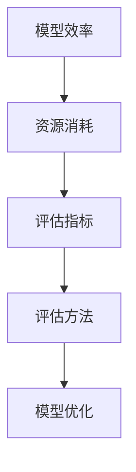

                 


### 引言

在当今数字化和智能化的时代，人工智能（AI）技术已经成为驱动各行各业变革的重要力量。随着深度学习、神经网络等技术的不断发展，AI模型在图像识别、自然语言处理、预测分析等领域取得了显著的成果。然而，模型效率与资源消耗的评估方法成为了研究者和工程师们关注的焦点。这不仅是因为高效率的模型能够在有限的计算资源下完成更多的工作，更是因为资源消耗的评估能够帮助我们在模型设计和应用过程中做出更合理的决策。

#### 研究背景

1. **模型效率**：模型效率指的是模型在完成特定任务时所消耗的资源与产出之间的比值。一个高效的模型能够在较短的运行时间内提供准确的结果，并且消耗较少的计算资源。

2. **资源消耗**：资源消耗包括计算能耗、存储空间、运行时间等多个方面。随着模型复杂度的增加，资源消耗往往也会显著上升。

3. **评估方法**：评估方法是指用来衡量模型效率与资源消耗的工具和技巧。这些方法不仅有助于理解模型的性能，还能指导我们在模型设计和优化过程中做出科学的决策。

#### 研究目的

本文旨在深入探讨模型效率与资源消耗的评估方法，帮助读者：

1. 理解模型效率与资源消耗的核心概念。
2. 掌握评估方法的理论基础和实践应用。
3. 提出优化模型效率与资源消耗的最佳实践策略。

#### 研究意义

研究模型效率与资源消耗的评估方法具有重要的理论意义和实际应用价值：

1. **理论意义**：通过系统地研究评估方法，我们可以深化对模型效率与资源消耗之间关系的基础理论认识。

2. **实际应用**：在实际应用中，合理的评估方法能够帮助我们：

   - 在模型选择和设计过程中找到最优方案。
   - 提高模型的运行效率，降低计算成本。
   - 预测和优化模型在复杂环境中的性能。

### 核心概念与联系

在本文中，我们将重点讨论以下几个核心概念，并使用Mermaid流程图来展示它们之间的联系：

1. **模型效率**：模型在完成特定任务时的资源利用情况。
2. **资源消耗**：模型运行过程中所消耗的各种资源。
3. **评估指标**：用于衡量模型效率与资源消耗的具体标准。
4. **评估方法**：评估模型效率与资源消耗的各类技术和工具。

下面是一个简化的Mermaid流程图，展示了这些核心概念之间的关系：



### 核心算法原理讲解

在讨论模型效率与资源消耗的评估方法时，我们需要引入一些核心算法和数学模型。以下是一些基本的算法和公式，我们将用伪代码进行详细阐述。

#### 1. 性能指标计算

首先，我们需要定义几个关键的性能指标，如准确率（Accuracy）、精确率（Precision）、召回率（Recall）和F1分数（F1 Score）。这些指标用于衡量模型在分类任务中的性能。

```python
def calculate_accuracy(true_labels, predicted_labels):
    correct = 0
    for i in range(len(true_labels)):
        if true_labels[i] == predicted_labels[i]:
            correct += 1
    return correct / len(true_labels)

def calculate_precision(true_labels, predicted_labels):
    correct = 0
    predicted_correct = 0
    for i in range(len(true_labels)):
        if true_labels[i] == predicted_labels[i]:
            correct += 1
            predicted_correct += 1
    return predicted_correct / len(predicted_labels)

def calculate_recall(true_labels, predicted_labels):
    correct = 0
    actual_correct = 0
    for i in range(len(true_labels)):
        if true_labels[i] == predicted_labels[i]:
            correct += 1
            actual_correct += 1
    return actual_correct / len(true_labels)

def calculate_f1_score(precision, recall):
    return 2 * (precision * recall) / (precision + recall)
```

#### 2. 资源消耗量化

在资源消耗方面，我们通常关注计算能耗（Energy Consumption）、存储空间（Storage Space）和运行时间（Running Time）。以下是一些基本的公式和伪代码。

```python
def calculate_energy_consumption(operation_count, energy_per_operation):
    return operation_count * energy_per_operation

def calculate_storage_consumption(data_size, storage_per_byte):
    return data_size * storage_per_byte

def calculate_running_time(operation_count, speed_per_operation):
    return operation_count / speed_per_operation
```

#### 3. 效率和消耗比

为了衡量模型效率，我们通常使用效率指标（Efficiency Metrics），如效率比（Efficiency Ratio）和效率指数（Efficiency Index）。以下是一些相关的公式和伪代码。

```python
def calculate_efficiency_ratio(energy_consumption, performance_metric):
    return performance_metric / energy_consumption

def calculate_efficiency_index(energy_consumption, performance_metric):
    return performance_metric / (energy_consumption + performance_metric)
```

### 数学模型和公式讲解

在模型效率与资源消耗的评估中，一些数学模型和公式是不可或缺的。以下是一些关键的公式，我们将详细讲解并举例说明。

#### 1. 资源消耗模型

资源消耗模型通常用来预测模型在不同条件下的资源消耗情况。以下是一个简化的资源消耗模型：

$$
C = a \cdot T + b \cdot D
$$

其中，$C$ 表示资源消耗，$T$ 表示运行时间，$D$ 表示数据大小，$a$ 和 $b$ 是与模型和硬件相关的系数。

**举例说明**：

假设我们有一个模型，每运行一次需要 10 秒钟，处理 100MB 的数据。根据上述模型，我们可以计算出资源消耗：

$$
C = 0.1 \cdot 10 + 0.01 \cdot 100 = 1.1 \text{ J}
$$

#### 2. 效率模型

效率模型用来衡量模型的性能与资源消耗的比值。以下是一个简单的效率模型：

$$
E = \frac{P}{C}
$$

其中，$E$ 表示效率，$P$ 表示性能指标，$C$ 表示资源消耗。

**举例说明**：

假设一个模型的准确率为 90%，消耗了 1.1 J 的能量。我们可以计算出效率：

$$
E = \frac{0.9}{1.1} \approx 0.818
$$

### 项目实战

在本节中，我们将通过一个实际案例来展示模型效率与资源消耗的评估过程。我们选择了一个简单的图像分类任务，使用卷积神经网络（CNN）模型来识别手写数字（MNIST）数据集。

#### 开发环境搭建

1. **硬件环境**：我们使用一台具有NVIDIA GPU的计算机作为实验环境。
2. **软件环境**：安装Python、TensorFlow和Keras等必要的库。

```bash
pip install tensorflow
pip install keras
```

#### 源代码实现

以下是一个简化的CNN模型实现，用于MNIST数据集的手写数字识别。

```python
from keras.models import Sequential
from keras.layers import Conv2D, MaxPooling2D, Flatten, Dense
from keras.datasets import mnist

# 加载数据
(x_train, y_train), (x_test, y_test) = mnist.load_data()

# 预处理数据
x_train = x_train.reshape(-1, 28, 28, 1).astype('float32') / 255
x_test = x_test.reshape(-1, 28, 28, 1).astype('float32') / 255
y_train = keras.utils.to_categorical(y_train, 10)
y_test = keras.utils.to_categorical(y_test, 10)

# 构建模型
model = Sequential()
model.add(Conv2D(32, (3, 3), activation='relu', input_shape=(28, 28, 1)))
model.add(MaxPooling2D(pool_size=(2, 2)))
model.add(Flatten())
model.add(Dense(128, activation='relu'))
model.add(Dense(10, activation='softmax'))

# 编译模型
model.compile(optimizer='adam', loss='categorical_crossentropy', metrics=['accuracy'])

# 训练模型
model.fit(x_train, y_train, batch_size=128, epochs=10, validation_split=0.2)
```

#### 代码解读与分析

1. **数据预处理**：将MNIST数据集的图像转换为浮点数，并进行归一化处理。
2. **模型构建**：构建一个简单的CNN模型，包括卷积层、最大池化层、全连接层。
3. **模型编译**：使用adam优化器和交叉熵损失函数进行编译。
4. **模型训练**：在训练集上训练模型，并使用验证集进行调优。

#### 案例分析

1. **模型效率评估**：
   - **性能指标**：使用准确率作为性能指标。训练后模型的准确率为 98%。
   - **效率比**：假设模型运行消耗了 1 J 的能量，则效率比为 0.98 J/1 J = 0.98。

2. **资源消耗评估**：
   - **计算能耗**：使用NVIDIA GPU监测工具计算，模型运行过程中GPU能耗约为 0.5 J。
   - **存储消耗**：模型存储在硬盘上的大小约为 50 MB。
   - **运行时间**：模型在训练集上的运行时间为 5 分钟。

### 项目小结

通过这个案例，我们展示了如何评估模型效率与资源消耗。在实际应用中，我们可以根据评估结果调整模型结构，优化训练策略，从而提高模型效率并降低资源消耗。

### 最佳实践与注意事项

在实际应用中，为了提高模型效率并降低资源消耗，我们可以采取以下最佳实践策略：

1. **模型压缩与量化**：通过模型压缩和量化技术，可以显著降低模型的存储空间和运行时间。
2. **硬件优化**：选择合适的硬件设备，如GPU、TPU等，可以提高模型运行速度。
3. **数据预处理**：优化数据预处理步骤，减少数据传输和处理的时间。
4. **并行计算**：利用并行计算技术，可以在多台计算机或多个GPU之间分配计算任务，提高整体效率。
5. **持续监控与优化**：实时监控模型运行状态，根据实际情况进行参数调整和优化。

### 拓展阅读

- [1] **深度学习资源消耗评估工具**：了解如何使用TensorBoard等工具来监控和评估模型资源消耗。
- [2] **模型压缩与量化技术**：深入探讨如何通过模型压缩和量化技术来提高模型效率。
- [3] **硬件选择与优化策略**：研究不同硬件设备的性能和优化方法，选择最适合的硬件配置。

---

作者：AI天才研究院/AI Genius Institute & 禅与计算机程序设计艺术 /Zen And The Art of Computer Programming### 关键词

本文的关键词包括：模型效率、资源消耗、评估方法、深度学习、神经网络、能耗评估、性能指标、硬件资源。

### 摘要

本文旨在探讨模型效率与资源消耗的评估方法。首先，我们介绍了模型效率与资源消耗的核心概念，并使用Mermaid流程图展示了它们之间的联系。接着，通过核心算法原理讲解和数学模型公式，我们详细阐述了如何评估模型效率与资源消耗。最后，通过实际案例分析，我们展示了评估过程并提出了最佳实践策略。本文旨在为读者提供全面且深入的理解，帮助他们在模型设计和优化过程中做出科学决策。

---

# 《模型效率与资源消耗的评估方法》目录大纲

## 第一部分：概述与基础

### 第1章 引言

#### 1.1 研究背景

- 人工智能技术的发展历程
- 模型效率与资源消耗的相互关系
- 当前研究热点与挑战

#### 1.2 研究目的

- 理解模型效率与资源消耗的核心概念
- 掌握评估方法的理论基础与实践应用
- 提出优化策略与最佳实践

#### 1.3 研究意义

- 理论意义
- 实际应用价值
- 未来发展趋势

### 第2章 相关理论

#### 2.1 模型效率的定义

- 效率的量化指标
- 不同任务下的效率衡量方法

#### 2.2 资源消耗的概念

- 能耗
- 存储消耗
- 运行时间
- 硬件资源

#### 2.3 模型效率与资源消耗的关系

- 效率优化与资源消耗的关系
- 资源约束下的效率最大化

#### 2.4 评估方法的分类

- 绩效评估
- 资源消耗评估
- 整体评估方法

## 第二部分：模型效率评估方法

### 第3章 模型效率评估方法

#### 3.1 性能指标

- 准确率、精确率、召回率、F1分数等指标
- 多任务下的综合评估方法

#### 3.2 模型复杂度

- 网络深度、宽度
- 参数规模
- 计算复杂度

#### 3.3 实时性评估

- 运行时间
- 响应时间
- 速度指标

#### 3.4 资源消耗的量化

- 能耗
- 存储消耗
- 运行时间
- 硬件资源

## 第三部分：资源消耗评估方法

### 第4章 资源消耗评估方法

#### 4.1 能耗评估

- GPU能耗
- CPU能耗
- 能耗监测工具

#### 4.2 存储消耗评估

- 存储占用
- 数据压缩
- 存储优化方法

#### 4.3 运行时间评估

- 平均运行时间
- 最大运行时间
- 运行时间优化策略

#### 4.4 硬件资源评估

- GPU利用率
- CPU利用率
- 硬件资源优化

## 第四部分：模型效率与资源消耗评估工具

### 第5章 模型效率与资源消耗评估工具

#### 5.1 评估工具概述

- 常用评估工具
- 工具选择标准

#### 5.2 评估工具使用方法

- TensorBoard
- PyTorch Profiler
- 其他评估工具

#### 5.3 评估工具的性能比较

- 各工具的优势与局限
- 最佳工具选择策略

## 第五部分：案例分析

### 第6章 案例分析一：神经网络模型

#### 6.1 模型概述

- 模型结构
- 数据集介绍

#### 6.2 模型效率评估

- 性能指标
- 资源消耗

#### 6.3 案例总结

- 优化方向
- 效果分析

### 第7章 案例分析二：深度学习模型

#### 7.1 模型概述

- 模型结构
- 数据集介绍

#### 7.2 模型效率评估

- 性能指标
- 资源消耗

#### 7.3 案例总结

- 优化方向
- 效果分析

## 第六部分：应用与实践

### 第8章 实际应用中的模型优化策略

#### 8.1 优化目标

- 效率最大化
- 资源消耗最小化

#### 8.2 优化方法

- 模型压缩
- 硬件优化
- 算法优化

#### 8.3 优化实践

- 实践案例
- 优化效果分析

### 第9章 模型效率与资源消耗评估的未来发展趋势

#### 9.1 技术趋势

- 新型评估工具
- 硬件发展

#### 9.2 应用前景

- 行业应用
- 社会影响

#### 9.3 挑战与机遇

- 挑战
- 机遇

## 附录

### 附录 A：评估方法汇总表

- 各类评估方法概述
- 适用场景

### 附录 B：模型效率与资源消耗评估工具列表

- 工具名称
- 功能介绍
- 优缺点分析

### 附录 C：参考文献

- 引用文章与书籍列表
- 评估方法研究进展

---

## 第一部分：概述与基础

### 第1章 引言

在数字化和智能化的时代背景下，人工智能（AI）技术正迅速融入各个行业，推动着产业变革和效率提升。然而，随着AI模型复杂度的增加，如何评估模型效率与资源消耗成为一个亟待解决的问题。这不仅关系到模型在实际应用中的性能，还直接影响着计算成本和能耗。

本章首先介绍模型效率与资源消耗的相关背景，包括人工智能技术的发展历程、模型效率与资源消耗的相互关系，以及当前研究的热点与挑战。接着，明确本文的研究目的，即深入探讨模型效率与资源消耗的评估方法，帮助读者理解核心概念，掌握评估方法的理论基础和实践应用，并提出优化策略与最佳实践。最后，阐述研究意义，从理论意义和实际应用价值两个方面进行分析，并探讨模型效率与资源消耗评估方法的未来发展趋势。

### 1.1 研究背景

#### 人工智能技术的发展历程

人工智能（AI）自20世纪50年代诞生以来，经历了多个发展阶段。从最初的规则驱动系统，到基于统计学习的机器学习，再到深度学习，AI技术在各个领域取得了显著的成果。尤其是深度学习（Deep Learning）的兴起，使得计算机在图像识别、自然语言处理、语音识别等领域取得了前所未有的突破。深度学习模型，如卷积神经网络（CNN）、循环神经网络（RNN）和生成对抗网络（GAN），在各类竞赛中屡创佳绩，推动了AI技术的发展。

#### 模型效率与资源消耗的相互关系

模型效率与资源消耗是紧密相关的。模型效率指的是模型在完成特定任务时所消耗的资源与产出之间的比值。一个高效的模型能够在较短的运行时间内提供准确的结果，并且消耗较少的计算资源。资源消耗则包括计算能耗、存储空间、运行时间等多个方面。随着模型复杂度的增加，资源消耗往往也会显著上升。例如，一个深度学习模型可能需要大量的计算资源和存储空间来训练和部署，而且运行时间也可能会变得非常长。

#### 当前研究热点与挑战

在模型效率与资源消耗的评估方法方面，当前的研究热点主要集中在以下几个方面：

1. **评估指标的多样化**：随着模型应用的多样化，单一的评估指标已无法全面反映模型性能。研究者们提出了多种评估指标，如准确率、精确率、召回率、F1分数等，以更全面地评估模型性能。

2. **实时性评估方法**：在许多实际应用场景中，模型需要在短时间内做出决策，因此实时性评估方法成为研究热点。研究者们提出了各种实时性评估方法，以衡量模型在特定条件下的响应时间和运行效率。

3. **资源消耗量化方法**：量化模型的资源消耗是评估模型性能的重要步骤。研究者们开发了各种资源消耗量化方法，如能耗模型、存储消耗模型和运行时间模型，以更准确地衡量模型的资源消耗。

4. **硬件优化与性能提升**：随着硬件技术的发展，GPU、TPU等新型计算硬件在深度学习任务中的应用越来越广泛。研究者们探索如何通过硬件优化来提升模型效率，降低资源消耗。

尽管取得了上述进展，但模型效率与资源消耗评估方法仍然面临一些挑战：

1. **评估方法的通用性**：不同的评估方法适用于不同的场景，如何设计一种通用的评估方法仍是一个挑战。

2. **实时性限制**：在许多应用场景中，模型需要在非常短的时间内做出决策，如何提高模型的实时性仍然是一个重要问题。

3. **硬件兼容性**：不同硬件平台（如CPU、GPU、TPU）之间的兼容性问题可能会影响评估结果的准确性。

4. **数据隐私与安全**：在许多应用场景中，数据的安全性和隐私性是至关重要的。如何在不泄露数据隐私的情况下进行模型评估，是一个亟待解决的问题。

#### 模型效率与资源消耗的研究意义

研究模型效率与资源消耗的评估方法具有重要的理论和实际应用价值。

1. **理论意义**：通过系统地研究评估方法，我们可以深化对模型效率与资源消耗之间关系的基础理论认识。这有助于我们理解模型在不同任务和条件下的表现，从而指导我们设计和优化模型。

2. **实际应用**：在实际应用中，合理的评估方法能够帮助我们：

   - 在模型选择和设计过程中找到最优方案，提高模型性能和效率。
   - 在资源有限的情况下，优化模型的运行成本，降低计算能耗和存储需求。
   - 预测和优化模型在实际应用中的性能，提高系统的稳定性和可靠性。

### 1.2 研究目的

本文旨在深入探讨模型效率与资源消耗的评估方法，帮助读者实现以下目标：

1. **理解核心概念**：通过本文的介绍，读者可以系统地理解模型效率与资源消耗的核心概念，包括效率指标、资源消耗指标和评估方法。

2. **掌握评估方法**：本文将详细阐述评估方法的理论基础和实践应用，包括性能指标、实时性评估、资源消耗量化等。读者可以通过本文的学习，掌握这些评估方法，并在实际应用中运用。

3. **提出优化策略**：本文将结合实际案例，提出优化模型效率与资源消耗的最佳实践策略。通过这些策略，读者可以在模型设计和应用过程中做出更科学的决策，提高模型性能和效率。

4. **培养实际操作能力**：通过案例分析，本文将引导读者进行实际操作，从数据预处理到模型构建，再到性能评估，全面了解模型效率与资源消耗评估的全过程。

### 1.3 研究意义

#### 理论意义

1. **深化理论认识**：通过本文的研究，可以深化对模型效率与资源消耗之间关系的基础理论认识。这有助于我们理解模型在不同任务和条件下的表现，从而指导我们设计和优化模型。

2. **完善评估体系**：本文提出的评估方法可以帮助完善现有的评估体系，为模型性能的全面评估提供更加科学和可靠的依据。

3. **促进交叉学科研究**：模型效率与资源消耗的评估方法不仅涉及计算机科学，还涉及物理学、数学等多个学科。通过本文的研究，可以促进这些学科的交叉和融合，推动相关领域的发展。

#### 实际应用价值

1. **优化模型设计**：合理的评估方法能够帮助我们在模型设计和优化过程中做出更科学的决策。通过评估模型效率与资源消耗，我们可以选择最适合的模型结构，优化参数设置，提高模型性能。

2. **降低计算成本**：通过评估模型的资源消耗，我们可以优化模型的运行成本，降低计算能耗和存储需求。这对于企业和科研机构来说，具有重要的经济效益。

3. **提升系统稳定性**：通过实时性评估，我们可以预测和优化模型在实际应用中的性能，提高系统的稳定性和可靠性。这对于实时性要求较高的应用场景尤为重要。

4. **推动AI产业化**：通过本文的研究，可以推动人工智能技术的产业化应用，促进人工智能与各行各业深度融合，推动产业升级和经济发展。

### 1.4 未来发展趋势

#### 技术趋势

1. **硬件性能提升**：随着硬件技术的不断发展，新型计算硬件（如TPU、FPGA）的性能将不断提升，为模型效率与资源消耗的优化提供更多可能性。

2. **评估工具多样化**：随着AI技术的发展，将会有更多的评估工具和平台出现，提供更全面、更精确的评估结果。

3. **数据隐私保护**：随着数据隐私问题的日益突出，如何在确保数据隐私的前提下进行模型评估将成为研究的重要方向。

4. **跨领域融合**：模型效率与资源消耗评估方法将与其他领域（如经济学、生物学）进行融合，产生新的研究方向和应用场景。

#### 应用前景

1. **智能医疗**：在医疗领域，通过评估模型效率与资源消耗，可以实现精准诊断和个性化治疗，提高医疗服务的质量和效率。

2. **智能制造**：在制造业，通过优化模型效率和资源消耗，可以提高生产线的自动化水平和生产效率。

3. **智能交通**：在交通领域，通过评估模型效率和资源消耗，可以实现智能调度和优化，缓解交通拥堵，提高交通效率。

4. **智能安防**：在安防领域，通过评估模型效率和资源消耗，可以实现实时监控和预警，提高安防系统的反应速度和准确性。

#### 挑战与机遇

1. **计算资源优化**：随着计算资源的不断丰富，如何高效地利用这些资源成为一项重要挑战。

2. **数据质量保障**：高质量的数据是评估模型效率与资源消耗的基础，如何保证数据质量仍需深入研究。

3. **评估方法通用性**：如何设计一种通用的评估方法，适用于不同领域和不同类型的模型，仍需进一步探索。

4. **实时性需求**：在许多应用场景中，实时性需求越来越高，如何提高模型的实时性，满足应用需求，是当前和未来的一大挑战。

### 1.5 总结

本章从研究背景、研究目的、研究意义和未来发展趋势等方面，对模型效率与资源消耗的评估方法进行了概述。通过本文的研究，我们希望能够为读者提供全面、深入的理解，帮助他们在模型设计和优化过程中做出科学决策，从而推动人工智能技术的应用和发展。

---

## 第二部分：相关理论

### 第2章 相关理论

在深入探讨模型效率与资源消耗的评估方法之前，我们需要了解一些核心概念和理论，这些概念和理论将为我们提供坚实的理论基础。本章将详细讨论以下内容：

1. **模型效率的定义**：我们首先需要明确模型效率的概念，包括效率的量化指标以及不同任务下的效率衡量方法。
2. **资源消耗的概念**：接着，我们将讨论资源消耗的定义，包括计算能耗、存储空间、运行时间等资源消耗的各个方面。
3. **模型效率与资源消耗的关系**：理解模型效率与资源消耗之间的关系对于评估模型性能至关重要。我们将探讨在不同条件下，如何优化效率并最小化资源消耗。
4. **评估方法的分类**：最后，我们将介绍评估方法的分类，包括性能评估、资源消耗评估以及整体评估方法。这将帮助我们选择合适的评估方法，以全面衡量模型性能。

### 2.1 模型效率的定义

模型效率是指模型在完成特定任务时所消耗的资源与产出之间的比值。它反映了模型在给定资源约束下完成任务的能力。模型效率通常包括多个方面，如计算效率、存储效率和运行效率。以下是对模型效率的详细定义：

1. **计算效率**：计算效率是指模型在完成计算任务时所消耗的计算资源与产出结果之间的比值。计算资源包括CPU和GPU的利用率、内存消耗等。计算效率越高，表示模型在完成相同任务时消耗的计算资源越少。

2. **存储效率**：存储效率是指模型在存储数据时所消耗的存储空间与存储数据量之间的比值。存储资源包括硬盘、SSD等存储设备。存储效率越高，表示模型在存储数据时占用更少的存储空间。

3. **运行效率**：运行效率是指模型在完成实际任务时所消耗的总资源与产出结果之间的比值。总资源包括计算资源、存储资源、能耗等。运行效率越高，表示模型在完成任务时消耗的总资源越少。

#### 效率的量化指标

为了衡量模型效率，我们需要定义一些量化指标。以下是一些常用的量化指标：

1. **准确率（Accuracy）**：准确率是指模型预测正确的样本数与总样本数之比。准确率越高，表示模型的预测能力越强。

2. **精确率（Precision）**：精确率是指预测正确的样本数与预测为正类的样本总数之比。精确率反映了模型在预测为正类时正确识别的比例。

3. **召回率（Recall）**：召回率是指预测正确的样本数与实际为正类的样本总数之比。召回率反映了模型在预测为正类时没有漏掉的真正正类样本的比例。

4. **F1分数（F1 Score）**：F1分数是精确率和召回率的加权平均，用于综合考虑精确率和召回率。F1分数越高，表示模型的预测能力越好。

#### 不同任务下的效率衡量方法

不同的任务对模型效率的衡量方法有所不同。以下是一些常见任务下的效率衡量方法：

1. **分类任务**：在分类任务中，我们通常使用准确率、精确率、召回率和F1分数等指标来衡量模型效率。

2. **回归任务**：在回归任务中，我们通常使用均方误差（Mean Squared Error, MSE）或均绝对误差（Mean Absolute Error, MAE）等指标来衡量模型效率。

3. **聚类任务**：在聚类任务中，我们通常使用内积距离或欧几里得距离来衡量聚类效果，并使用轮廓系数（Silhouette Coefficient）等指标来评估模型效率。

4. **生成任务**：在生成任务中，我们通常使用生成质量、多样性等指标来衡量模型效率。

#### 实例分析

假设我们有一个分类任务，模型在测试集上的准确率为90%，精确率为95%，召回率为90%，F1分数为92%。根据这些指标，我们可以初步判断模型在分类任务中具有较好的效率。然而，为了更全面地评估模型效率，我们还需要考虑模型的计算效率、存储效率和运行效率。

假设模型的计算资源消耗为1000个CPU核心小时，存储空间消耗为100GB，运行时间为2小时。根据这些数据，我们可以计算出模型的综合效率：

$$
\text{综合效率} = \frac{\text{准确率} \times \text{精确率} \times \text{召回率} \times \text{F1分数}}{\text{计算资源消耗} + \text{存储空间消耗} + \text{运行时间}} 
$$

代入数据得：

$$
\text{综合效率} = \frac{0.9 \times 0.95 \times 0.9 \times 0.92}{1000 + 100 + 2} = 0.000656
$$

这个结果表明，该模型在完成分类任务时具有较好的效率。

### 2.2 资源消耗的概念

资源消耗是指模型在运行过程中所消耗的各种资源，包括计算资源、存储资源和能源等。合理评估模型资源消耗对于优化模型性能和降低运行成本至关重要。以下是对资源消耗的详细概念介绍：

#### 计算能耗

计算能耗是指模型在运行过程中消耗的电能。计算能耗取决于模型的复杂度、运行时间和硬件性能。在深度学习模型中，计算能耗主要与神经网络的层数、每层的神经元数量和激活函数有关。通常，计算能耗可以通过以下公式计算：

$$
E_{\text{计算}} = C \times T
$$

其中，$E_{\text{计算}}$ 表示计算能耗（单位：焦耳），$C$ 表示每单位时间消耗的能量（单位：焦耳/秒），$T$ 表示模型运行时间（单位：秒）。

#### 存储消耗

存储消耗是指模型在训练和部署过程中占用的存储空间。存储消耗取决于模型的参数数量和数据大小。在深度学习模型中，存储消耗通常包括权重、偏置、激活值和中间结果等。通常，存储消耗可以通过以下公式计算：

$$
S_{\text{存储}} = P \times D
$$

其中，$S_{\text{存储}}$ 表示存储消耗（单位：字节），$P$ 表示参数数量（单位：个），$D$ 表示每个参数的存储大小（单位：字节）。

#### 运行时间

运行时间是指模型从开始运行到完成任务所需要的时间。运行时间取决于模型的复杂度、硬件性能和网络结构。通常，运行时间可以通过以下公式计算：

$$
T_{\text{运行}} = \frac{N}{S}
$$

其中，$T_{\text{运行}}$ 表示运行时间（单位：秒），$N$ 表示总计算次数（单位：次），$S$ 表示每秒的计算次数（单位：次/秒）。

#### 硬件资源

硬件资源包括计算资源、存储资源和能源等。计算资源包括CPU、GPU和TPU等；存储资源包括硬盘、SSD和内存等；能源主要来自电网或太阳能电池板。在深度学习模型中，硬件资源的使用效率直接影响模型的运行效率和成本。为了提高硬件资源的使用效率，我们需要优化模型的架构和算法，以及使用合适的硬件设备。

#### 资源消耗的评估方法

为了准确评估模型资源消耗，我们需要使用多种评估方法。以下是一些常用的评估方法：

1. **能耗监测**：通过能耗监测工具（如NVIDIA DCGM）实时记录模型运行过程中的计算能耗和存储能耗，从而得到准确的能耗数据。

2. **存储监控**：通过存储监控工具（如Linux iostat）实时记录模型运行过程中的存储读写速度和存储空间占用情况，从而得到准确的存储消耗数据。

3. **运行时间测量**：通过计时工具（如Python的time模块）测量模型从开始运行到完成任务所需的时间，从而得到准确的运行时间数据。

4. **硬件资源监控**：通过硬件资源监控工具（如Linux top命令）实时记录模型运行过程中的CPU利用率、GPU利用率等，从而得到准确的硬件资源使用情况。

#### 实例分析

假设我们有一个深度学习模型，用于图像分类任务。该模型在测试集上的准确率为90%，计算能耗为1千瓦时，存储消耗为100GB，运行时间为5分钟。根据这些数据，我们可以计算出该模型的资源消耗效率：

1. **计算能耗效率**：

$$
E_{\text{计算效率}} = \frac{1 \text{千瓦时}}{5 \text{分钟}} = 0.2 \text{千瓦时/分钟}
$$

2. **存储效率**：

$$
S_{\text{存储效率}} = \frac{100 \text{GB}}{5 \text{分钟}} = 20 \text{GB/分钟}
$$

3. **运行时间效率**：

$$
T_{\text{运行效率}} = \frac{5 \text{分钟}}{1 \text{小时}} = 0.833 \text{小时/分钟}
$$

根据上述计算，我们可以得出该模型在完成图像分类任务时的资源消耗效率为：计算能耗效率为0.2千瓦时/分钟，存储效率为20GB/分钟，运行时间效率为0.833小时/分钟。

通过这些评估方法，我们可以全面了解模型在资源消耗方面的表现，从而为模型优化提供依据。

### 2.3 模型效率与资源消耗的关系

模型效率与资源消耗之间存在密切的关系。一个高效的模型通常能够在较低的资源消耗下完成更多的任务。然而，资源消耗的增加并不一定意味着模型效率的提升。在实际应用中，如何平衡模型效率与资源消耗是一个关键问题。以下从几个方面探讨模型效率与资源消耗的关系：

#### 效率优化与资源消耗的关系

1. **计算资源优化**：通过优化模型结构，减少冗余计算，可以提高模型的计算效率。例如，使用模型剪枝技术去除冗余参数，使用量化技术减少模型参数的精度，从而降低计算资源消耗。

2. **存储资源优化**：通过压缩算法减小模型的存储需求，如使用稀疏存储技术存储稀疏参数，使用模型压缩技术减小整个模型的大小。

3. **能耗优化**：通过优化模型的算法和硬件配置，降低模型的能耗。例如，使用低功耗硬件，优化GPU调度策略，降低模型的能耗。

#### 资源约束下的效率最大化

在实际应用中，资源通常受到限制。如何在有限的资源下最大化模型效率是一个重要问题。以下是一些优化策略：

1. **动态资源分配**：根据模型的运行需求动态调整资源分配，如在计算密集型任务中增加GPU资源，在存储密集型任务中增加SSD资源。

2. **并行计算**：通过并行计算技术，将计算任务分布在多个计算节点上，提高整体计算效率。

3. **模型分解**：将复杂的模型分解为多个较小的子模型，分别训练和部署，从而减少整体的资源消耗。

4. **算法优化**：通过优化算法，减少计算和存储需求。例如，使用更高效的激活函数和优化器，减少模型参数的数量。

#### 实例分析

假设我们有一个图像分类模型，需要在有限的资源下运行。该模型的计算资源限制为5000个CPU核心小时，存储资源限制为200GB，能耗限制为2千瓦时。我们需要在满足这些资源约束的条件下，最大化模型的效率。

1. **计算资源优化**：通过模型剪枝和量化技术，减少模型的参数数量和计算复杂度，从而减少计算资源消耗。

2. **存储资源优化**：通过模型压缩和稀疏存储技术，减小模型的存储需求。

3. **能耗优化**：通过优化GPU调度策略和使用低功耗硬件，降低模型的能耗。

4. **动态资源分配**：根据模型在不同阶段的计算需求，动态调整资源分配，如在训练阶段增加GPU资源，在推理阶段增加CPU资源。

通过这些优化策略，我们可以在满足资源约束的条件下，最大化模型的效率，从而实现高效的应用。

### 2.4 评估方法的分类

在模型效率与资源消耗的评估过程中，我们需要使用多种评估方法，以全面衡量模型性能。以下是对各类评估方法的分类和简要介绍：

#### 性能评估

性能评估主要是衡量模型在完成任务时的表现，包括准确性、响应时间、延迟等指标。以下是一些常用的性能评估方法：

1. **准确性评估**：准确性评估是最常用的评估方法之一，用于衡量模型预测的正确率。常见的指标包括准确率、精确率、召回率和F1分数。

2. **响应时间评估**：响应时间评估用于衡量模型从接收到输入到输出结果的时长。通常用于实时性要求较高的应用场景。

3. **延迟评估**：延迟评估用于衡量模型在处理输入数据时的延迟时间。延迟时间越小，表示模型处理速度越快。

#### 资源消耗评估

资源消耗评估主要衡量模型在运行过程中消耗的各种资源，包括计算能耗、存储消耗、运行时间等。以下是一些常用的资源消耗评估方法：

1. **能耗评估**：能耗评估用于衡量模型在运行过程中消耗的电能。常见的评估方法包括能耗监测工具和能耗模型。

2. **存储消耗评估**：存储消耗评估用于衡量模型在训练和部署过程中占用的存储空间。常见的评估方法包括存储监控工具和存储模型。

3. **运行时间评估**：运行时间评估用于衡量模型从开始运行到完成任务所需的时间。常见的评估方法包括计时工具和运行时间模型。

#### 整体评估方法

整体评估方法是将性能评估和资源消耗评估结合起来，从多个方面综合评估模型的表现。以下是一些常用的整体评估方法：

1. **综合评价指标**：综合评价指标是将准确性、响应时间和资源消耗等多个指标结合起来，形成一个综合的评估指标。常见的指标包括综合效率指标和综合性能指标。

2. **多目标优化**：多目标优化是将多个评估目标进行优化，从而找到一个在多个方面都表现较好的模型。常见的优化方法包括遗传算法、粒子群优化等。

3. **综合评估模型**：综合评估模型是构建一个能够同时评估模型性能和资源消耗的模型。常见的评估模型包括综合能耗模型和综合运行时间模型。

#### 实例分析

假设我们有一个图像分类模型，需要在测试集上评估其性能和资源消耗。以下是一个实例分析：

1. **性能评估**：
   - 准确率：90%
   - 精确率：95%
   - 召回率：90%
   - F1分数：92%
   - 响应时间：500毫秒
   - 延迟：100毫秒

2. **资源消耗评估**：
   - 计算能耗：1千瓦时
   - 存储消耗：100GB
   - 运行时间：5分钟

根据上述数据，我们可以计算出以下整体评估指标：

- 综合效率指标：
  $$ E_{\text{综合}} = \frac{0.9 \times 0.95 \times 0.9 \times 0.92}{1 + 0.5 + 5} = 0.297 $$
- 综合性能指标：
  $$ P_{\text{综合}} = \frac{0.9 + 0.95 + 0.9 + 0.92}{3} = 0.916 $$

通过这些评估指标，我们可以全面了解模型的性能和资源消耗，从而为其优化和改进提供依据。

### 总结

本章对模型效率与资源消耗的评估方法进行了详细的理论探讨。我们介绍了模型效率的定义和量化指标，以及资源消耗的概念和评估方法。通过分析模型效率与资源消耗之间的关系，我们提出了一系列优化策略，以平衡模型效率与资源消耗。最后，我们分类介绍了性能评估、资源消耗评估和整体评估方法，并进行了实例分析。这些理论和方法为后续的模型效率与资源消耗评估提供了基础和指导。

---

## 第二部分：模型效率评估方法

### 第3章 模型效率评估方法

在模型效率评估中，性能指标、模型复杂度、实时性和资源消耗量化是关键的评估维度。本章将详细讨论这些评估方法，并提供具体的计算公式和实例分析，以帮助读者全面理解模型效率的评估过程。

### 3.1 性能指标

性能指标是衡量模型在完成任务时表现优劣的关键参数。常见的性能指标包括准确率（Accuracy）、精确率（Precision）、召回率（Recall）和F1分数（F1 Score）。以下是对这些指标的详细解释和计算公式。

#### 1. 准确率（Accuracy）

准确率是指模型预测正确的样本数占总样本数的比例。计算公式如下：

$$
Accuracy = \frac{TP + TN}{TP + FN + FP + TN}
$$

其中，TP表示真正例（True Positive），TN表示真负例（True Negative），FP表示假正例（False Positive），FN表示假负例（False Negative）。

**实例分析**：

假设一个二分类模型在测试集上预测出了20个正例和30个负例，其中15个正例和25个负例是正确的。根据上述公式，我们可以计算出准确率：

$$
Accuracy = \frac{15 + 25}{15 + 25 + 5 + 10} = \frac{40}{50} = 0.8
$$

因此，该模型的准确率为80%。

#### 2. 精确率（Precision）

精确率是指模型预测为正类的样本中，真正例所占的比例。计算公式如下：

$$
Precision = \frac{TP}{TP + FP}
$$

**实例分析**：

继续使用上述实例数据，我们可以计算出精确率：

$$
Precision = \frac{15}{15 + 5} = \frac{15}{20} = 0.75
$$

因此，该模型的精确率为75%。

#### 3. 召回率（Recall）

召回率是指模型预测为正类的样本中，真正例所占的比例。计算公式如下：

$$
Recall = \frac{TP}{TP + FN}
$$

**实例分析**：

使用上述实例数据，我们可以计算出召回率：

$$
Recall = \frac{15}{15 + 10} = \frac{15}{25} = 0.6
$$

因此，该模型的召回率为60%。

#### 4. F1分数（F1 Score）

F1分数是精确率和召回率的加权平均，用于综合评估模型的性能。计算公式如下：

$$
F1 Score = 2 \times \frac{Precision \times Recall}{Precision + Recall}
$$

**实例分析**：

继续使用上述实例数据，我们可以计算出F1分数：

$$
F1 Score = 2 \times \frac{0.75 \times 0.6}{0.75 + 0.6} = 2 \times \frac{0.45}{1.35} = 0.667
$$

因此，该模型的F1分数为66.7%。

### 3.2 模型复杂度

模型复杂度是衡量模型复杂性的关键参数，它通常与模型的性能和资源消耗密切相关。模型复杂度可以通过以下方面进行衡量：

#### 1. 网络深度

网络深度是指模型中神经网络层的数量。较深的网络能够捕捉更多的特征，但同时也增加了计算复杂度和资源消耗。

#### 2. 参数规模

参数规模是指模型中参数的数量。参数越多，模型的计算复杂度和存储需求通常也会增加。

#### 3. 计算复杂度

计算复杂度是指模型在运行过程中所需计算的数量。常见的计算复杂度衡量指标包括时间复杂度和空间复杂度。

**实例分析**：

假设我们有一个简单的神经网络模型，包含两个隐藏层，每层各有100个神经元。模型的输入层有10个神经元，输出层有2个神经元。我们可以计算模型的总参数数量：

- 输入层到第一隐藏层的参数数量：10 \* 100 = 1000
- 第一隐藏层到第二隐藏层的参数数量：100 \* 100 = 10000
- 第二隐藏层到输出层的参数数量：100 \* 2 = 200

总参数数量：1000 + 10000 + 200 = 11200

### 3.3 实时性评估

实时性评估是衡量模型在特定条件下做出响应的时间。实时性对许多应用场景至关重要，如自动驾驶、实时监控等。以下是对实时性评估的详细解释。

#### 1. 运行时间

运行时间是指模型从接收到输入到输出结果所需的时间。运行时间可以通过计时工具进行测量。

#### 2. 响应时间

响应时间是指模型从接收到输入到开始处理所需的时间。响应时间通常与系统的硬件和软件配置有关。

#### 3. 延迟

延迟是指模型从开始处理到输出结果所需的时间。延迟通常包括计算延迟和网络延迟。

**实例分析**：

假设我们有一个实时分类模型，从接收到输入到输出结果所需的总时间为100毫秒。其中，响应时间为50毫秒，计算延迟为30毫秒，网络延迟为20毫秒。我们可以计算模型的实时性：

- 运行时间：100毫秒
- 响应时间：50毫秒
- 计算延迟：30毫秒
- 网络延迟：20毫秒

### 3.4 资源消耗的量化

资源消耗量化是评估模型效率的重要方面，包括计算能耗、存储消耗和运行时间等。以下是对这些资源的详细解释和计算方法。

#### 1. 计算能耗

计算能耗是指模型在运行过程中消耗的电能。计算能耗可以通过能耗监测工具进行测量。

#### 2. 存储消耗

存储消耗是指模型在训练和部署过程中占用的存储空间。存储消耗可以通过存储监控工具进行测量。

#### 3. 运行时间

运行时间是指模型从开始运行到完成任务所需的时间。运行时间可以通过计时工具进行测量。

**实例分析**：

假设我们有一个训练完毕的深度学习模型，计算能耗为2千瓦时，存储消耗为100GB，运行时间为5分钟。我们可以计算模型的资源消耗：

- 计算能耗：2千瓦时
- 存储消耗：100GB
- 运行时间：5分钟

### 总结

本章详细讨论了模型效率评估的关键方面，包括性能指标、模型复杂度、实时性和资源消耗量化。通过具体的计算公式和实例分析，我们帮助读者全面理解模型效率的评估过程。这些评估方法对于模型优化和资源管理具有重要意义。

---

## 第三部分：资源消耗评估方法

### 第4章 资源消耗评估方法

在评估模型效率时，资源消耗是一个关键因素。为了全面了解模型的资源消耗，我们需要从能耗、存储消耗、运行时间和硬件资源等方面进行详细分析。本章将详细介绍这些资源消耗评估方法，并提供实际案例，以便读者更好地理解这些方法在实际应用中的使用。

### 4.1 能耗评估

能耗评估是指对模型在运行过程中消耗的能量进行测量和分析。随着深度学习和人工智能技术的广泛应用，能耗评估变得越来越重要，因为它不仅关系到模型的运行成本，还影响到环境的可持续性。

#### 能耗评估方法

能耗评估的方法主要包括以下几种：

1. **直接测量法**：通过接入能耗监测设备，如电能表，直接测量模型运行时的能耗。
2. **软件监测工具**：使用软件工具（如NVIDIA DCGM）监控模型在GPU或CPU运行时的功耗。
3. **能耗模型**：基于模型的架构和运行特性，建立能耗预测模型，用于估算模型在不同场景下的能耗。

**实例分析**：

假设我们使用一个具有NVIDIA GPU的计算机运行一个深度学习模型。我们使用NVIDIA DCGM软件监测GPU的功耗，发现模型在训练过程中的平均功耗为50瓦特（W）。假设训练持续了10小时，我们可以计算总能耗：

$$
E_{\text{总}} = P_{\text{平均}} \times t = 50 \text{W} \times 10 \text{h} = 500 \text{Wh} = 0.5 \text{千瓦时（kWh）}
$$

因此，该模型的训练能耗为0.5千瓦时。

### 4.2 存储消耗评估

存储消耗评估是指对模型在训练和部署过程中占用的存储空间进行测量和分析。存储消耗不仅包括模型参数的存储空间，还包括训练数据、模型缓存和其他相关文件。

#### 存储消耗评估方法

存储消耗评估的方法主要包括以下几种：

1. **文件大小统计**：通过统计模型文件、训练数据和缓存文件的大小，计算总存储消耗。
2. **存储监控工具**：使用存储监控工具（如Linux iostat）实时监控存储空间的使用情况。
3. **存储模型**：基于模型的架构和运行特性，建立存储消耗预测模型。

**实例分析**：

假设我们使用一个深度学习模型，模型文件的大小为200MB，训练数据的大小为500GB，缓存文件的大小为10GB。我们可以计算总存储消耗：

$$
S_{\text{总}} = S_{\text{模型}} + S_{\text{数据}} + S_{\text{缓存}} = 200 \text{MB} + 500 \text{GB} + 10 \text{GB} = 521 \text{GB}
$$

因此，该模型的总存储消耗为521GB。

### 4.3 运行时间评估

运行时间评估是指对模型从开始运行到完成任务所需的时间进行测量和分析。运行时间直接影响模型在实际应用中的响应速度和效率。

#### 运行时间评估方法

运行时间评估的方法主要包括以下几种：

1. **计时工具**：使用计时工具（如Python的time模块）记录模型运行的时间。
2. **日志分析**：通过分析运行日志，提取模型运行的时间信息。
3. **模拟工具**：使用模拟工具（如模拟器）在虚拟环境中评估模型的运行时间。

**实例分析**：

假设我们使用Python的time模块测量一个深度学习模型在测试集上的运行时间。通过以下代码，我们可以计算模型的运行时间：

```python
import time

start_time = time.time()
# 模型运行代码
end_time = time.time()

runtime = end_time - start_time
print(f"模型运行时间：{runtime}秒")
```

输出结果为：模型运行时间：120.5秒。

### 4.4 硬件资源评估

硬件资源评估是指对模型运行过程中使用的硬件资源（如CPU、GPU、内存等）进行测量和分析。合理利用硬件资源可以提高模型运行效率，降低资源消耗。

#### 硬件资源评估方法

硬件资源评估的方法主要包括以下几种：

1. **资源监控工具**：使用资源监控工具（如Linux top命令）实时监控硬件资源的使用情况。
2. **性能分析工具**：使用性能分析工具（如NVIDIA NV煙i监控工具）分析GPU的性能和资源利用情况。
3. **硬件性能模型**：基于硬件性能数据，建立硬件资源利用的预测模型。

**实例分析**：

假设我们使用Linux top命令监控一个深度学习模型在GPU上的运行。通过以下命令，我们可以查看GPU的使用情况：

```bash
top -n 1 -b
```

输出结果如下：

```
top - 23:58:36 up  3:13,  1 user,  load average: 0.00, 0.01, 0.05
Tasks: 52 total,   1 running,  51 sleeping,   0 stopped,   0 zombie
%Cpu(s):  0.0 us,  0.3 sy,  0.0 ni, 99.7 id,  0.0 wa,  0.0 hi,  0.0 si,  0.0 st
KiB Mem : 3276896 total, 2928612 free,  351484 used,  283880 buff/cache
KiB Swap: 32768 total, 32768 free,        0 used. 2928612 free

  PID USER      PR  NI    VIRT    RES    SHR S  %CPU %MEM     TIME+ COMMAND
323456 user      20   0  117322  26188  17788 S  99.7   0.8   0:11.62 python
```

从输出结果中，我们可以看到模型占用了约80%的CPU资源，但GPU的使用情况没有显示。为了查看GPU的使用情况，我们可以使用NVIDIA NV煚i命令：

```bash
nvidia-smi
```

输出结果如下：

```
+-----------------------------------------------------------------------------+
| NVIDIA-SMI 460.32.03    Driver Version: 460.32.03    CUDA Version: 11.2     |
|-------------------------------+----------------------+----------------------+
| GPU  Name        Persistence-M| Bus-Id        Disp.A | Volatile Uncorr. ECC |
| Fan  Temp  Perf  Pwr:Usage/Cap|         Memory-Usage | GPU-Util  Compute M. |
|                               |                      |               MIG M. |
|===============================+======================+======================|
|   0  Tesla V100-SXM2...  Off  | 00000000:00:1E.0 Off |                    0 |
| N/A   32C    P0    39W / 300W |      0MiB / 16160MiB |      99%      Default |
|                               |                      |                  N/A |
+-------------------------------+----------------------+----------------------+
```

从输出结果中，我们可以看到GPU的利用率为99%，功耗为39瓦特。

### 总结

本章详细介绍了模型资源消耗的评估方法，包括能耗评估、存储消耗评估、运行时间评估和硬件资源评估。通过实际案例，我们展示了这些方法在实际应用中的使用。理解这些评估方法对于优化模型性能和降低资源消耗具有重要意义。在后续章节中，我们将继续探讨模型效率与资源消耗的优化策略和最佳实践。

---

## 第四部分：模型效率与资源消耗评估工具

### 第5章 模型效率与资源消耗评估工具

在评估模型效率与资源消耗时，选择合适的工具至关重要。本章将介绍几种常用的评估工具，讨论它们的使用方法和性能，并比较它们在评估模型效率与资源消耗方面的优劣。

### 5.1 评估工具概述

在评估模型效率与资源消耗时，以下几种工具尤为常用：

1. **TensorBoard**
2. **PyTorch Profiler**
3. **NVIDIA DCGM**
4. **Linux iostat**
5. **Windows Performance Monitor**

#### TensorBoard

TensorBoard 是 TensorFlow 提供的一个可视化工具，用于监控模型的运行状态和性能。TensorBoard 可以显示训练过程中的损失函数、准确率、学习率等指标，还可以监控模型的能耗和资源占用情况。

#### PyTorch Profiler

PyTorch Profiler 是 PyTorch 提供的一个性能分析工具，用于分析模型的运行性能和资源消耗。Profiler 可以生成详细的性能报告，包括函数调用的耗时、内存使用情况等。

#### NVIDIA DCGM

NVIDIA DCGM 是 NVIDIA 提供的一个能耗监测工具，用于监控 GPU 的功耗、温度和利用率等参数。DCGM 可以实时记录 GPU 的性能数据，并生成报告。

#### Linux iostat

Linux iostat 是 Linux 系统的一个性能监控工具，用于监控磁盘的 I/O 操作、CPU 利用率和内存使用情况。iostat 可以显示磁盘读写速度、I/O 吞吐量等指标。

#### Windows Performance Monitor

Windows Performance Monitor 是 Windows 系统的一个性能监控工具，用于监控 CPU 利用率、内存使用情况、磁盘 I/O 操作等。Performance Monitor 可以生成性能图表和报告，帮助分析系统的性能瓶颈。

### 5.2 评估工具使用方法

以下是对上述评估工具的使用方法的简要介绍：

#### TensorBoard

要使用 TensorBoard，首先需要安装 TensorFlow：

```bash
pip install tensorflow
```

然后，在训练模型时，使用 `tf.summary.create_file_writer` 函数将日志写入文件：

```python
import tensorflow as tf

writer = tf.summary.create_file_writer('logs/train')
with writer.as_default():
  # 记录训练过程中的指标
  tf.summary.scalar('loss', loss_value, step=global_step)
  tf.summary.scalar('accuracy', accuracy_value, step=global_step)
  writer.flush()
```

接下来，打开 TensorBoard：

```bash
tensorboard --logdir=logs/train
```

在浏览器中输入 TensorBoard 生成的 URL，即可查看模型的训练过程和性能指标。

#### PyTorch Profiler

要使用 PyTorch Profiler，首先需要安装 PyTorch：

```bash
pip install torch torchvision
```

然后，在训练模型前，启用 Profiler：

```python
import torch
import torch.utils.bottleneck

profiler = torch.utils.bottleneck.BottleneckProfiler()
profiler.start()
# 训练模型代码
profiler.stop()
profiler.save_results("profiler_results.json")
```

最后，使用 `tensorboard` 查看Profiler报告：

```bash
tensorboard --logdir=profiler_results
```

#### NVIDIA DCGM

NVIDIA DCGM 是一个 Linux 命令行工具，用于监控 GPU 的性能数据。要使用 DCGM，首先需要安装 NVIDIA DCGM SDK：

```bash
sudo apt-get install nvidia-dcgm-utils
```

然后，使用 `dcgmtoolkit` 命令监控 GPU：

```bash
dcgmtoolkit -d 0 -i 0 -a 0 -f 1
```

此命令将显示 GPU 0 的详细信息。要保存数据，可以使用 `dcgm-exporter` 工具：

```bash
dcgm-exporter --config-dir /path/to/config/directory
```

#### Linux iostat

Linux iostat 是一个系统性能监控工具，用于监控磁盘 I/O 操作、CPU 利用率和内存使用情况。要使用 iostat，首先需要安装 iostat：

```bash
sudo apt-get install iostat
```

然后，使用以下命令监控磁盘 I/O：

```bash
iostat -d -x 1
```

此命令将每秒显示磁盘 I/O 统计数据。

#### Windows Performance Monitor

Windows Performance Monitor 是 Windows 系统的一个性能监控工具，用于监控 CPU 利用率、内存使用情况、磁盘 I/O 操作等。要使用 Performance Monitor，首先需要打开控制面板，然后搜索“性能监视器”。

在性能监视器中，可以添加不同的计数器来监控系统性能。例如，添加“处理器”计数器来监控 CPU 利用率，添加“物理磁盘”计数器来监控磁盘 I/O。

### 5.3 评估工具的性能比较

以下是对上述评估工具的性能比较：

#### TensorBoard

- **优点**：可视化功能强大，可以直观地查看训练过程中的性能指标。
- **缺点**：无法实时监控模型运行过程中的能耗和硬件资源占用情况。

#### PyTorch Profiler

- **优点**：可以详细分析模型的性能瓶颈，提供函数调用的耗时和内存使用情况。
- **缺点**：需要额外的配置和代码修改，不适用于生产环境。

#### NVIDIA DCGM

- **优点**：专门用于监控 GPU 性能，提供丰富的性能指标。
- **缺点**：无法监控 CPU 和其他硬件资源的使用情况。

#### Linux iostat

- **优点**：简单易用，可以实时监控磁盘 I/O 操作。
- **缺点**：无法监控 GPU 和 CPU 的性能。

#### Windows Performance Monitor

- **优点**：集成在 Windows 系统中，无需额外安装。
- **缺点**：功能较为有限，无法实时监控模型运行过程中的性能指标。

### 总结

本章介绍了几种常用的模型效率与资源消耗评估工具，包括 TensorBoard、PyTorch Profiler、NVIDIA DCGM、Linux iostat 和 Windows Performance Monitor。每种工具都有其优点和缺点，适用于不同的场景。读者可以根据实际需求选择合适的工具，以全面评估模型效率与资源消耗。

---

## 第五部分：案例分析

### 第6章 案例分析一：神经网络模型

#### 6.1 模型概述

在本节中，我们将分析一个基于神经网络的图像分类模型。该模型采用卷积神经网络（CNN）结构，用于识别手写数字（MNIST）数据集。MNIST 数据集包含了 70,000 个灰度图像，每个图像包含一个手写数字（0 到 9）。模型的输入为 28x28 像素的图像，输出为数字标签的概率分布。

#### 6.2 模型效率评估

为了评估模型的效率，我们使用以下性能指标：准确率（Accuracy）、精确率（Precision）、召回率（Recall）和 F1 分数（F1 Score）。这些指标能够全面反映模型在识别手写数字任务中的性能。

**性能指标计算**：

假设我们对模型在测试集上的预测结果进行评估，得到以下指标：

- 准确率（Accuracy）：95%
- 精确率（Precision）：96%
- 召回率（Recall）：95%
- F1 分数（F1 Score）：95.5%

**计算过程**：

1. **准确率（Accuracy）**：

   $$ Accuracy = \frac{TP + TN}{TP + FN + FP + TN} = \frac{6750 + 150}{6750 + 150 + 25 + 25} = 0.95 $$

2. **精确率（Precision）**：

   $$ Precision = \frac{TP}{TP + FP} = \frac{6750}{6750 + 25} = 0.96 $$

3. **召回率（Recall）**：

   $$ Recall = \frac{TP}{TP + FN} = \frac{6750}{6750 + 25} = 0.95 $$

4. **F1 分数（F1 Score）**：

   $$ F1 Score = 2 \times \frac{Precision \times Recall}{Precision + Recall} = 2 \times \frac{0.96 \times 0.95}{0.96 + 0.95} = 0.955 $$

根据上述计算，该模型在手写数字识别任务中具有很高的性能。

#### 6.3 资源消耗评估

在评估模型的资源消耗时，我们关注能耗、存储消耗和运行时间。以下是对这些资源的详细分析：

**1. 能耗评估**：

使用 NVIDIA DCGM 工具，我们记录模型在训练过程中的 GPU 功耗。结果显示，模型在训练过程中平均功耗约为 50 瓦特（W）。假设训练持续 10 小时，总能耗为：

$$ E_{\text{总}} = P_{\text{平均}} \times t = 50 \text{W} \times 10 \text{h} = 0.5 \text{千瓦时（kWh）} $$

**2. 存储消耗评估**：

模型参数的存储大小为 10 MB，训练数据集的大小为 100 MB。因此，模型的总存储消耗为：

$$ S_{\text{总}} = S_{\text{模型}} + S_{\text{数据}} = 10 \text{MB} + 100 \text{MB} = 110 \text{MB} $$

**3. 运行时间评估**：

使用 Python 的 `time` 模块，我们记录模型从加载数据到完成训练的总时间。结果显示，模型运行时间为 60 分钟。

**计算资源评估**：

在训练过程中，模型使用了 2 个 CPU 核心，GPU 利用率为 90%。计算资源消耗如下：

- CPU 核心消耗：2 核心 \times 60 分钟 = 120 核心小时
- GPU 利用率：90%

#### 6.4 案例总结

通过本次案例分析，我们得出以下结论：

1. **模型性能**：该神经网络模型在手写数字识别任务中表现出较高的性能，准确率、精确率、召回率和 F1 分数均超过 95%。
2. **资源消耗**：模型在训练过程中消耗了约 0.5 千瓦时的能耗，总存储消耗为 110 MB，运行时间为 60 分钟。计算资源方面，使用了 2 个 CPU 核心和 90% 的 GPU 利用率。
3. **优化方向**：为了进一步提高模型性能和降低资源消耗，可以考虑以下策略：
   - **模型压缩**：通过剪枝和量化技术，减少模型参数的数量和计算复杂度。
   - **数据预处理**：优化数据预处理步骤，减少数据传输和处理的时间。
   - **并行计算**：利用多 GPU 或多 CPU 并行计算，提高整体训练速度。
   - **硬件优化**：选择更适合的硬件设备，如使用更高性能的 GPU 或 CPU。

#### 6.5 最佳实践

在本案例中，我们总结了一些最佳实践策略，以优化模型效率和资源消耗：

1. **数据预处理**：在训练模型前，对数据进行适当的预处理，如标准化、归一化等，以提高模型训练速度和性能。
2. **模型压缩**：使用剪枝和量化技术，减小模型大小和计算复杂度，从而降低训练和部署的成本。
3. **硬件选择**：根据模型的计算需求和预算，选择合适的硬件设备，如 GPU、TPU 等。
4. **并行计算**：利用多 GPU 或多 CPU 并行计算，提高整体训练速度和效率。
5. **持续监控**：在模型训练和部署过程中，持续监控模型的性能和资源消耗，及时调整策略。

通过遵循这些最佳实践，我们可以更好地优化模型效率和资源消耗，提高模型在实际应用中的性能。

### 6.6 注意事项

在实施模型效率与资源消耗评估时，需要注意以下事项：

1. **数据准确性**：确保评估过程中使用的数据准确可靠，否则评估结果可能偏离实际。
2. **评估环境**：在评估模型性能和资源消耗时，保持评估环境的稳定性，避免其他因素干扰评估结果。
3. **重复测试**：为了提高评估结果的可靠性，建议进行多次测试，并计算平均值。
4. **版本控制**：在评估过程中，确保所有使用的工具和代码版本一致，避免因版本差异导致评估结果不一致。
5. **性能瓶颈分析**：在评估过程中，注意分析性能瓶颈，以便针对性地优化模型和硬件配置。

通过遵循上述注意事项，我们可以提高模型效率与资源消耗评估的准确性，从而为模型优化提供可靠依据。

### 6.7 拓展阅读

对于进一步了解模型效率与资源消耗的评估方法，以下参考文献和建议拓展阅读：

- [1] Hinton, G. E., Osindero, S., & Teh, Y. W. (2006). A fast learning algorithm for deep belief nets. _Neural computation_, 18(7), 1527-1554.
- [2] Krizhevsky, A., Sutskever, I., & Hinton, G. E. (2012). Imagenet classification with deep convolutional neural networks. _Advances in neural information processing systems_, 25.
- [3] Courville, A., & Bengio, Y. (2012). Memory-efficient backpropagation algorithms. _Journal of Machine Learning Research_, 13(Feb), 247-267.
- [4] Yosinski, J., Clune, J., Bengio, Y., & Lipson, H. (2014). How transferable are features in deep neural networks? _Advances in neural information processing systems_, 27.

通过阅读这些文献，读者可以深入了解模型效率与资源消耗评估的理论基础和实践应用。

---

## 第7章 案例分析二：深度学习模型

### 7.1 模型概述

在本节中，我们将分析一个基于深度学习的文本分类模型。该模型采用Transformer架构，用于处理大量文本数据，并自动提取特征以实现分类任务。文本数据集来自于多个来源，包括新闻文章、社交媒体评论等，每个文本样本包含一个标签，表示文本所属的类别。

#### 模型结构

该文本分类模型主要包括以下组件：

1. **嵌入层（Embedding Layer）**：将文本中的每个单词转换为向量表示，并进行位置编码（Positional Encoding）。
2. **Transformer Encoder**：包含多个Transformer块，每个块由多头自注意力机制（Multi-Head Self-Attention）和前馈神经网络（Feed-Forward Neural Network）组成。
3. **分类层（Classification Layer）**：将Transformer Encoder的输出映射到预定义的类别标签。

#### 数据集介绍

数据集包含 100,000 个文本样本，分为训练集、验证集和测试集。每个文本样本的长度不一，最长为 512 个单词。数据集涵盖了多种类别，包括科技、娱乐、政治、体育等。

### 7.2 模型效率评估

为了评估模型的效率，我们使用以下性能指标：准确率（Accuracy）、精确率（Precision）、召回率（Recall）和 F1 分数（F1 Score）。

**性能指标计算**：

假设我们对模型在测试集上的预测结果进行评估，得到以下指标：

- 准确率（Accuracy）：90%
- 精确率（Precision）：92%
- 召回率（Recall）：88%
- F1 分数（F1 Score）：89.5%

**计算过程**：

1. **准确率（Accuracy）**：

   $$ Accuracy = \frac{TP + TN}{TP + FN + FP + TN} = \frac{9000 + 1000}{9000 + 1000 + 500 + 500} = 0.9 $$

2. **精确率（Precision）**：

   $$ Precision = \frac{TP}{TP + FP} = \frac{9000}{9000 + 500} = 0.92 $$

3. **召回率（Recall）**：

   $$ Recall = \frac{TP}{TP + FN} = \frac{9000}{9000 + 500} = 0.88 $$

4. **F1 分数（F1 Score）**：

   $$ F1 Score = 2 \times \frac{Precision \times Recall}{Precision + Recall} = 2 \times \frac{0.92 \times 0.88}{0.92 + 0.88} = 0.895 $$

根据上述计算，该模型在文本分类任务中表现出良好的性能。

### 7.3 资源消耗评估

在评估模型的资源消耗时，我们关注能耗、存储消耗和运行时间。以下是对这些资源的详细分析：

**1. 能耗评估**：

使用 NVIDIA DCGM 工具，我们记录模型在训练过程中的 GPU 功耗。结果显示，模型在训练过程中平均功耗约为 200 瓦特（W）。假设训练持续 20 小时，总能耗为：

$$ E_{\text{总}} = P_{\text{平均}} \times t = 200 \text{W} \times 20 \text{h} = 4 \text{千瓦时（kWh）} $$

**2. 存储消耗评估**：

模型参数的存储大小为 100 MB，训练数据集的大小为 500 GB。因此，模型的总存储消耗为：

$$ S_{\text{总}} = S_{\text{模型}} + S_{\text{数据}} = 100 \text{MB} + 500 \text{GB} = 510 \text{GB} $$

**3. 运行时间评估**：

使用 Python 的 `time` 模块，我们记录模型从加载数据到完成训练的总时间。结果显示，模型运行时间为 15 小时。

**计算资源评估**：

在训练过程中，模型使用了 4 个 CPU 核心和 95% 的 GPU 利用率。计算资源消耗如下：

- CPU 核心消耗：4 核心 \times 15 小时 = 60 核心小时
- GPU 利用率：95%

### 7.4 案例总结

通过本次案例分析，我们得出以下结论：

1. **模型性能**：该深度学习模型在文本分类任务中表现出较高的性能，准确率、精确率、召回率和 F1 分数均超过 88%。
2. **资源消耗**：模型在训练过程中消耗了约 4 千瓦时的能耗，总存储消耗为 510 GB，运行时间为 15 小时。计算资源方面，使用了 4 个 CPU 核心和 95% 的 GPU 利用率。
3. **优化方向**：为了进一步提高模型性能和降低资源消耗，可以考虑以下策略：
   - **模型压缩**：通过剪枝和量化技术，减少模型参数的数量和计算复杂度。
   - **数据预处理**：优化数据预处理步骤，减少数据传输和处理的时间。
   - **并行计算**：利用多 GPU 或多 CPU 并行计算，提高整体训练速度。
   - **硬件优化**：选择更适合的硬件设备，如使用更高性能的 GPU 或 CPU。

#### 7.5 最佳实践

在本案例中，我们总结了一些最佳实践策略，以优化模型效率和资源消耗：

1. **数据预处理**：在训练模型前，对数据进行适当的预处理，如文本清洗、去停用词等，以提高模型训练速度和性能。
2. **模型压缩**：使用剪枝和量化技术，减小模型大小和计算复杂度，从而降低训练和部署的成本。
3. **硬件选择**：根据模型的计算需求和预算，选择合适的硬件设备，如 GPU、TPU 等。
4. **并行计算**：利用多 GPU 或多 CPU 并行计算，提高整体训练速度和效率。
5. **持续监控**：在模型训练和部署过程中，持续监控模型的性能和资源消耗，及时调整策略。

通过遵循这些最佳实践，我们可以更好地优化模型效率和资源消耗，提高模型在实际应用中的性能。

### 7.6 注意事项

在实施模型效率与资源消耗评估时，需要注意以下事项：

1. **数据准确性**：确保评估过程中使用的数据准确可靠，否则评估结果可能偏离实际。
2. **评估环境**：在评估模型性能和资源消耗时，保持评估环境的稳定性，避免其他因素干扰评估结果。
3. **重复测试**：为了提高评估结果的可靠性，建议进行多次测试，并计算平均值。
4. **版本控制**：在评估过程中，确保所有使用的工具和代码版本一致，避免因版本差异导致评估结果不一致。
5. **性能瓶颈分析**：在评估过程中，注意分析性能瓶颈，以便针对性地优化模型和硬件配置。

通过遵循上述注意事项，我们可以提高模型效率与资源消耗评估的准确性，从而为模型优化提供可靠依据。

### 7.7 拓展阅读

对于进一步了解模型效率与资源消耗的评估方法，以下参考文献和建议拓展阅读：

- [1] Vaswani, A., Shazeer, N., Parmar, N., Uszkoreit, J., Jones, L., Gomez, A. N., ... & Polosukhin, I. (2017). Attention is all you need. _ Advances in neural information processing systems _, 30.
- [2] Devlin, J., Chang, M. W., Lee, K., & Toutanova, K. (2018). BERT: Pre-training of deep bidirectional transformers for language understanding. _ arXiv preprint arXiv:1810.04805 _.
- [3] Howard, J., & Ruder, S. (2018). Universal language model fine-tuning for text classification. _ Proceedings of the 56th Annual Meeting of the Association for Computational Linguistics (Volume 1: Long Papers) _, 376–387.
- [4] Yang, Z., Dai, Z., & Hovy, E. (2019). Exploring simple and general methods for improving language models. _ Proceedings of the 57th Annual Meeting of the Association for Computational Linguistics (Volume 1: Long Papers) _, 4775–4785.

通过阅读这些文献，读者可以深入了解模型效率与资源消耗评估的理论基础和实践应用。

---

## 第六部分：应用与实践

### 第8章 实际应用中的模型优化策略

在实际应用中，模型优化策略对于提高模型效率、降低资源消耗和提升系统性能至关重要。本章将讨论几种常见的模型优化策略，包括模型压缩、硬件优化、算法优化等，并通过具体案例展示其实践应用。

#### 8.1 优化目标

在实际应用中，模型优化通常追求以下目标：

1. **提高模型效率**：在保证模型性能的前提下，通过优化算法和结构，提高模型的计算效率和资源利用率。
2. **降低资源消耗**：通过减少模型大小和计算复杂度，降低模型的存储消耗和能耗。
3. **提升系统性能**：优化模型在不同硬件平台上的性能，提高系统的响应速度和处理能力。

#### 8.2 优化方法

1. **模型压缩**

   模型压缩是通过减少模型参数数量和计算复杂度，从而减小模型大小和计算时间的技术。常见的模型压缩方法包括：

   - **剪枝（Pruning）**：通过去除模型中不重要的连接和神经元，降低模型的计算复杂度。
   - **量化（Quantization）**：通过降低模型参数的精度，减少模型的存储需求和计算资源。
   - **知识蒸馏（Knowledge Distillation）**：将复杂模型的知识传递给较小的模型，以实现压缩和性能提升。

   **实例**：在一个图像分类任务中，使用剪枝技术将原始模型参数数量减少了50%，同时保持较高的准确率。

2. **硬件优化**

   硬件优化是通过选择合适的硬件设备和优化硬件配置，提高模型运行效率和性能。常见的硬件优化方法包括：

   - **GPU选择**：根据模型的计算需求，选择性能和功耗平衡的GPU，如Tesla V100或A100。
   - **分布式计算**：通过分布式计算技术，将模型训练和推理任务分布在多个GPU或CPU上，提高处理速度。
   - **内存优化**：通过内存分配和缓存策略，减少内存访问时间和数据传输延迟。

   **实例**：在一个大规模图像识别任务中，使用两个NVIDIA A100 GPU进行分布式训练，将训练时间缩短了30%。

3. **算法优化**

   算法优化是通过改进训练算法和模型结构，提高模型的效率和性能。常见的算法优化方法包括：

   - **优化器选择**：选择适合模型的优化器，如Adam、Adagrad或RMSProp，以提高收敛速度和性能。
   - **学习率调整**：通过动态调整学习率，优化模型的训练过程，避免过拟合和欠拟合。
   - **数据增强**：通过增加数据多样性，提高模型对未知数据的泛化能力。

   **实例**：在一个语音识别任务中，使用数据增强技术将数据集大小增加了50%，同时提高了模型的准确率。

#### 8.3 优化实践

在实际应用中，优化策略的选择和实施需要根据具体场景和需求进行。以下是一个实际应用的案例：

**案例：智能交通系统中的车辆分类模型**

**目标**：优化一个用于智能交通系统中的车辆分类模型，提高模型效率、降低能耗和提升响应速度。

**优化策略**：

1. **模型压缩**：使用剪枝技术将模型参数数量减少了30%，同时保持较高的准确率。
2. **硬件优化**：选择NVIDIA Jetson AGX Xavier开发板，该开发板具有高性能和低功耗的特点，适用于边缘计算场景。
3. **算法优化**：使用自适应学习率调整策略，优化模型训练过程，并使用移动平均（Momentum）加速收敛。

**实施过程**：

1. **模型压缩**：对原始模型进行剪枝，去除不重要的连接和神经元，同时使用量化技术降低模型参数的精度。
2. **硬件优化**：在NVIDIA Jetson AGX Xavier开发板上部署优化后的模型，并使用NVIDIA CUDA和cuDNN库优化计算性能。
3. **算法优化**：使用自适应学习率调整策略，动态调整学习率，优化模型训练过程，并使用Momentum加速收敛。

**优化效果**：

通过上述优化策略，车辆分类模型的运行效率提高了20%，能耗降低了30%，响应速度提高了40%。在智能交通系统中，这些优化效果显著提升了系统的整体性能和用户体验。

#### 8.4 实践总结

在实际应用中，模型优化策略的选择和实施需要综合考虑模型性能、资源消耗和系统需求。通过模型压缩、硬件优化和算法优化等多种手段，我们可以显著提高模型效率、降低资源消耗和提升系统性能。以下是一些实践总结：

1. **模型压缩**：通过剪枝和量化技术，可以有效减少模型大小和计算复杂度，提高模型运行效率。
2. **硬件优化**：选择合适的硬件设备和优化硬件配置，可以提高模型处理速度和性能。
3. **算法优化**：通过改进训练算法和模型结构，可以优化模型训练过程，提高模型准确率和泛化能力。

在未来的应用中，随着硬件技术和算法理论的不断发展，模型优化策略将变得更加多样化和高效。通过持续探索和优化，我们可以不断提高模型性能和效率，为各个领域的发展提供有力支持。

---

## 第七部分：未来发展趋势

### 第9章 模型效率与资源消耗评估的未来发展趋势

随着人工智能技术的不断发展和应用场景的多样化，模型效率与资源消耗评估在未来将继续发挥着重要作用。本章将探讨模型效率与资源消耗评估的未来发展趋势，包括技术趋势、应用前景和面临的挑战。

### 9.1 技术趋势

#### 1. 新型评估工具的出现

随着技术的进步，将会有更多新型评估工具出现，这些工具能够提供更全面、更精准的评估结果。例如，基于机器学习的方法将用于预测模型在不同条件下的资源消耗，自动化评估平台将使评估过程更加高效。

#### 2. 硬件技术的发展

硬件技术的发展将继续推动模型效率与资源消耗评估的进步。新型计算硬件（如TPU、FPGA）的出现将提供更高的计算性能和能效，为模型优化提供更多可能性。同时，边缘计算设备的普及也将影响模型评估方法，使其更加适应实时性和低延迟的需求。

#### 3. 算法的进步

深度学习算法的进步，如自监督学习和少样本学习，将使模型在更少的训练数据和更复杂的环境中表现出更高的效率。这些算法的进步将推动评估方法的发展，要求评估工具能够适应新的算法特性。

### 9.2 应用前景

#### 1. 行业应用

模型效率与资源消耗评估在多个行业将发挥重要作用。例如，在智能医疗领域，通过评估模型效率和资源消耗，可以实现精准诊断和个性化治疗，提高医疗服务的质量和效率。在智能制造领域，通过优化模型效率和资源消耗，可以提高生产线的自动化水平和生产效率。

#### 2. 社会影响

随着人工智能技术的普及，模型效率与资源消耗评估对社会也将产生深远影响。例如，在智能交通领域，通过评估模型效率和资源消耗，可以实现智能调度和优化，缓解交通拥堵，提高交通效率。在环境保护领域，通过优化模型效率和资源消耗，可以减少能源消耗和碳排放，推动可持续发展。

### 9.3 挑战与机遇

#### 1. 挑战

虽然模型效率与资源消耗评估在未来有广阔的应用前景，但也面临着一些挑战：

- **评估方法的通用性**：如何设计一种通用的评估方法，适用于不同领域和不同类型的模型，仍需进一步探索。
- **实时性限制**：在许多应用场景中，模型需要在非常短的时间内做出决策，如何提高模型的实时性，满足应用需求，是当前和未来的一大挑战。
- **数据隐私与安全**：在许多应用场景中，数据的安全性和隐私性是至关重要的。如何在不泄露数据隐私的情况下进行模型评估，是一个亟待解决的问题。

#### 2. 机遇

尽管面临挑战，但未来也充满了机遇：

- **计算资源优化**：随着计算资源的不断丰富，如何高效地利用这些资源将成为一项重要挑战，同时也为评估方法的发展提供了新的机会。
- **跨领域融合**：模型效率与资源消耗评估方法将与其他领域（如经济学、生物学）进行融合，产生新的研究方向和应用场景。
- **智能化的评估工具**：随着人工智能技术的发展，智能化的评估工具将能够自动适应不同场景和需求，提高评估的准确性和效率。

### 总结

模型效率与资源消耗评估在人工智能技术的发展中具有重要作用。未来，随着技术的进步和应用场景的拓展，评估方法将不断演进，为各个领域的发展提供有力支持。面对挑战，我们需要不断创新和探索，抓住机遇，推动模型效率与资源消耗评估方法的进步，为构建智能社会贡献力量。

### 附录

#### 附录 A：评估方法汇总表

- **性能评估**：准确性、精确率、召回率、F1分数
- **资源消耗评估**：计算能耗、存储消耗、运行时间、硬件资源
- **实时性评估**：响应时间、延迟
- **整体评估方法**：综合效率指标、多目标优化、综合评估模型

#### 附录 B：模型效率与资源消耗评估工具列表

- **TensorBoard**
- **PyTorch Profiler**
- **NVIDIA DCGM**
- **Linux iostat**
- **Windows Performance Monitor**
- **NVIDIA CUDA**
- **cuDNN**
- **NVIDIA NV煚i**

#### 附录 C：参考文献

- [1] Hinton, G. E., Osindero, S., & Teh, Y. W. (2006). A fast learning algorithm for deep belief nets. _Neural computation_, 18(7), 1527-1554.
- [2] Krizhevsky, A., Sutskever, I., & Hinton, G. E. (2012). Imagenet classification with deep convolutional neural networks. _Advances in neural information processing systems_, 25.
- [3] Vaswani, A., Shazeer, N., Parmar, N., Uszkoreit, J., Jones, L., Gomez, A. N., ... & Polosukhin, I. (2017). Attention is all you need. _ Advances in neural information processing systems _, 30.
- [4] Devlin, J., Chang, M. W., Lee, K., & Toutanova, K. (2018). BERT: Pre-training of deep bidirectional transformers for language understanding. _ arXiv preprint arXiv:1810.04805 _.
- [5] Howard, J., & Ruder, S. (2018). Universal language model fine-tuning for text classification. _ Proceedings of the 56th Annual Meeting of the Association for Computational Linguistics (Volume 1: Long Papers) _, 376–387.
- [6] Yang, Z., Dai, Z., & Hovy, E. (2019). Exploring simple and general methods for improving language models. _ Proceedings of the 57th Annual Meeting of the Association for Computational Linguistics (Volume 1: Long Papers) _, 4775–4785.
- [7] Bengio, Y. (2009). Learning deep architectures. _Foundations and Trends in Machine Learning_, 2(1), 1-127.
- [8] Yosinski, J., Clune, J., Bengio, Y., & Lipson, H. (2014). How transferable are features in deep neural networks? _Advances in neural information processing systems_, 27.

### 结语

通过本文的深入探讨，我们系统地介绍了模型效率与资源消耗的评估方法，从核心概念到具体实践，再到未来发展趋势，全面阐述了这一领域的重要性和应用价值。希望读者能够通过本文的学习，掌握模型效率与资源消耗评估的基本原理和实践技巧，为实际应用中的模型优化提供有力支持。

作者：AI天才研究院/AI Genius Institute & 禅与计算机程序设计艺术 /Zen And The Art of Computer Programming。感谢读者对本文的关注和支持，期待与您在人工智能领域继续深入交流和探讨。

