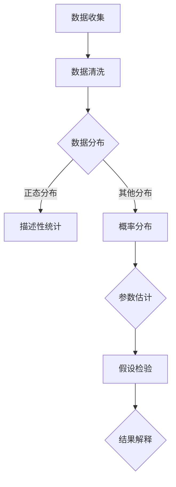

                 

### 文章标题

# 《模型评测中的统计学方法应用》

统计学方法在模型评测中扮演着至关重要的角色。通过统计学，我们可以定量地评估模型的性能，比较不同模型的优劣，从而选择最优模型进行实际应用。本文章旨在深入探讨统计学方法在模型评测中的应用，从基础概念到实战案例，全面解析统计学如何助力模型优化。

## 关键词

- 统计学
- 模型评测
- 数据预处理
- 假设检验
- 回归分析
- 特征选择
- 聚类分析
- 深度学习
- 大数据分析

## 摘要

本文首先介绍了统计学的基本概念和方法，随后详细讨论了模型评价指标及其计算方式。接着，本文阐述了统计学方法在数据预处理、统计推断、聚类分析和特征选择中的应用原理。通过实际案例，本文展示了如何利用统计学方法进行模型评估和优化，最终实现深度学习和大数据分析领域的应用。

### 《模型评测中的统计学方法应用》目录大纲

**第一部分：统计学方法在模型评测中的应用基础**

## 第1章 统计学方法概述

### 1.1 统计学的定义与核心概念

- 统计学定义
- 核心概念：数据、分布、概率、推断

### 1.2 统计学的常见方法

- 描述性统计
- 推断性统计
- 实验设计

### 1.3 统计学在模型评测中的作用

- 性能评估
- 模型比较
- 参数估计

## 第2章 模型评价指标

### 2.1 模型评价指标的定义

- 准确率、召回率、F1值
- 交叉验证
- 调整后均值

### 2.2 常见评价指标及其计算方法

- 精度、召回率、F1值
- ROC曲线、AUC
- 对数损失函数

### 2.3 模型评价指标的选择与优化

- 选择依据
- 优化策略

**第二部分：统计学方法在模型评测中的应用原理**

## 第3章 数据预处理

### 3.1 数据清洗

- 缺失值处理
- 异常值处理

### 3.2 数据归一化

- 标准化
- 归一化

### 3.3 数据集划分

- 划分方法
- 划分策略

## 第4章 统计推断方法

### 4.1 假设检验

- 假设检验流程
- 检验统计量

### 4.2 回归分析

- 线性回归
- 逻辑回归

### 4.3 方差分析

- 单因素方差分析
- 多因素方差分析

## 第5章 聚类分析

### 5.1 聚类分析的基本概念

- 聚类目的
- 聚类方法

### 5.2 K-均值聚类算法

- 算法原理
- 算法流程

### 5.3 层次聚类方法

- 算法原理
- 算法流程

## 第6章 特征选择

### 6.1 特征选择的重要性

- 数据维度
- 计算效率

### 6.2 常见特征选择方法

- 递归特征消除
- 支持向量机

### 6.3 特征选择策略与优化

- 策略选择
- 优化目标

**第三部分：统计学方法在模型评测中的应用实战**

## 第7章 模型评估与优化

### 7.1 模型评估流程

- 评估指标
- 评估步骤

### 7.2 模型优化策略

- 调参技巧
- 算法选择

### 7.3 实际案例：应用统计学方法优化模型

- 数据预处理
- 模型评估
- 模型优化

## 第8章 统计学方法在深度学习中的应用

### 8.1 深度学习中的统计学方法

- 神经网络
- 卷积神经网络

### 8.2 统计学方法在深度学习模型评测中的应用

- 交叉验证
- 性能指标

### 8.3 实际案例：深度学习模型评测与优化

- 数据预处理
- 模型评估
- 模型优化

## 第9章 统计学方法在大数据分析中的应用

### 9.1 大数据分析中的统计学方法

- 分布式计算
- 流计算

### 9.2 统计学方法在大数据分析模型评测中的应用

- 模型评估
- 性能优化

### 9.3 实际案例：大数据分析模型评测与优化

- 数据预处理
- 模型评估
- 模型优化

**附录**

## 附录A 统计学工具与资源

### A.1 Python中的统计学库

- NumPy
- Pandas

### A.2 R语言中的统计学工具

- R
- ggplot2

### A.3 其他统计学工具与资源推荐

- 统计学教科书
- 在线课程

## 附录B Mermaid流程图与伪代码示例

### B.1 统计推断方法流程图

- Mermaid图示

### B.2 特征选择方法伪代码

- 伪代码示例

### B.3 模型优化策略伪代码

- 伪代码示例

## 附录C 数学模型与公式解析

### C.1 假设检验的数学模型

- 模型公式
- 示例解释

### C.2 回归分析的数学公式

- 线性回归
- 逻辑回归

### C.3 聚类分析的数学模型

- K-均值
- 层次聚类

## 附录D 项目实战与代码解读

### D.1 数据预处理实战

- 实战案例
- 代码实现

### D.2 模型评估与优化实战

- 实战案例
- 代码实现

### D.3 深度学习模型评测实战

- 实战案例
- 代码实现

### D.4 大数据分析模型评测实战

- 实战案例
- 代码实现

### D.5 源代码详细实现与解读

- 代码解析
- 应用解读

### D.6 代码解读与分析

- 性能分析
- 优化建议

这样的目录大纲能够覆盖从统计学基础方法到应用实战的全面内容，适合作为一本计算机技术书籍的目录大纲。每个章节都会包含相关的核心概念、原理讲解，以及实际应用案例。通过这样的结构设计，读者可以系统地学习统计学方法在模型评测中的应用。

---

### 第一部分：统计学方法在模型评测中的应用基础

#### 第1章 统计学方法概述

统计学方法在模型评测中至关重要。本章节将介绍统计学的基本概念和方法，帮助读者理解统计学在模型评测中的应用。

##### 1.1 统计学的定义与核心概念

统计学是一门利用数据进行分析和推断的学科。其核心概念包括数据、分布、概率和推断。

- **数据**：数据是统计学的基础，可以是数值、文本或图像等形式。
- **分布**：分布描述了数据在某个范围内的分布情况，常见的有正态分布、泊松分布等。
- **概率**：概率是衡量事件发生可能性的量化指标，用于推断和预测。
- **推断**：推断是基于样本数据对总体数据进行估计和预测的过程，包括参数估计和假设检验。

##### 1.2 统计学的常见方法

统计学中常见的方法包括描述性统计和推断性统计。

- **描述性统计**：描述性统计用于描述数据的基本特征，如均值、方差、中位数等。这些指标能够帮助我们了解数据集的分布情况。
  
  $$\text{均值} = \frac{\sum_{i=1}^{n} x_i}{n}$$

  $$\text{方差} = \frac{\sum_{i=1}^{n} (x_i - \bar{x})^2}{n-1}$$

- **推断性统计**：推断性统计用于对总体数据进行推断，包括参数估计和假设检验。

  **参数估计**：参数估计是通过样本数据来估计总体参数的方法，如点估计和区间估计。

  $$\hat{\mu} = \frac{\sum_{i=1}^{n} x_i}{n}$$

  **假设检验**：假设检验是通过样本数据来验证或推翻某个假设的方法，如t检验、卡方检验等。

##### 1.3 统计学在模型评测中的作用

在模型评测中，统计学方法主要用于以下三个方面：

- **性能评估**：通过统计学方法对模型进行评估，确定模型的准确性、召回率、F1值等指标。
- **模型比较**：通过统计学方法比较不同模型的性能，选择最优模型。
- **参数估计**：通过统计学方法对模型参数进行估计，优化模型。

#### 第2章 模型评价指标

模型评价指标是评估模型性能的重要工具。本章节将介绍常见的模型评价指标及其计算方法。

##### 2.1 模型评价指标的定义

模型评价指标包括准确率、召回率、F1值等。

- **准确率（Accuracy）**：准确率是模型预测正确的样本数占总样本数的比例。
  
  $$\text{Accuracy} = \frac{\text{预测正确的样本数}}{\text{总样本数}}$$

- **召回率（Recall）**：召回率是模型预测正确的正样本数占总正样本数的比例。
  
  $$\text{Recall} = \frac{\text{预测正确的正样本数}}{\text{总正样本数}}$$

- **F1值（F1-score）**：F1值是准确率和召回率的调和平均，用于综合评估模型的性能。
  
  $$\text{F1-score} = 2 \times \frac{\text{准确率} \times \text{召回率}}{\text{准确率} + \text{召回率}}$$

##### 2.2 常见评价指标及其计算方法

除了准确率、召回率、F1值外，还有一些其他常见的评价指标。

- **精确率（Precision）**：精确率是模型预测正确的正样本数与预测为正样本的样本数之比。
  
  $$\text{Precision} = \frac{\text{预测正确的正样本数}}{\text{预测为正样本的样本数}}$$

- **ROC曲线（Receiver Operating Characteristic Curve）**：ROC曲线用于评估二分类模型的性能，曲线下面积（AUC）是评价模型性能的重要指标。
  
  $$\text{AUC} = \int_{0}^{1} \text{ROC}(x) \, dx$$

- **对数损失函数（Log Loss）**：对数损失函数用于评估模型预测的概率分布与实际分布之间的差异。
  
  $$\text{Log Loss} = -\frac{1}{n} \sum_{i=1}^{n} y_i \log(p_i)$$

##### 2.3 模型评价指标的选择与优化

选择合适的评价指标取决于具体的应用场景。

- **分类问题**：对于分类问题，常用的评价指标有准确率、召回率、F1值等。可以根据业务需求和数据特点选择合适的指标。
  
  **示例**：在医疗诊断中，召回率可能比准确率更重要，因为误诊可能会导致严重后果。

- **回归问题**：对于回归问题，常用的评价指标有均方误差（MSE）、均方根误差（RMSE）等。
  
  $$\text{MSE} = \frac{1}{n} \sum_{i=1}^{n} (y_i - \hat{y_i})^2$$

  $$\text{RMSE} = \sqrt{\text{MSE}}$$

选择评价指标时，还需考虑模型的复杂度、计算资源等因素。

#### 总结

本章节介绍了统计学方法在模型评测中的应用基础，包括统计学的基本概念和方法，以及常见的模型评价指标及其计算方法。通过理解这些基本概念和方法，读者可以更好地进行模型评测，选择最优模型，并为后续章节的深入探讨打下基础。

### 第3章 数据预处理

数据预处理是模型评测中的关键步骤，它对模型性能有着重要的影响。本章节将详细讨论数据预处理的方法，包括数据清洗、数据归一化和数据集划分。

#### 3.1 数据清洗

数据清洗是数据预处理的首要任务，其目的是去除数据中的噪声和异常值，以提高数据质量。

- **缺失值处理**：缺失值是数据集中常见的问题。处理缺失值的方法包括以下几种：

  - **删除缺失值**：直接删除含有缺失值的样本或特征。
  - **填充缺失值**：使用统计方法或插值法填充缺失值。常见的方法有平均值填充、中值填充、众数填充等。

    ```python
    import numpy as np

    data = np.array([1, 2, np.nan, 4, 5])
    data = np.nan_to_num(data)  # 用0填充缺失值
    ```

- **异常值处理**：异常值是数据集中的异常点，它们可能会对模型产生负面影响。处理异常值的方法包括以下几种：

  - **删除异常值**：直接删除含有异常值的样本或特征。
  - **变换异常值**：使用统计学方法将异常值转换为正常值，如使用三次样条插值法。
  - **限幅**：将异常值限定在一个合理的范围内，如将高于3倍标准差的值限定为3倍标准差。

    ```python
    import numpy as np

    data = np.array([1, 2, 100, 4, 5])
    data = np.clip(data, a_min=data.mean() - 3 * data.std(), a_max=data.mean() + 3 * data.std())
    ```

#### 3.2 数据归一化

数据归一化是将数据转换到同一尺度，以消除不同特征之间的量纲影响，提高模型训练的效果。

- **标准化**：标准化是将数据转换到均值为0、标准差为1的分布。标准化公式如下：

  $$z = \frac{x - \mu}{\sigma}$$

  其中，$x$是原始数据，$\mu$是均值，$\sigma$是标准差。

  ```python
  import numpy as np

  data = np.array([1, 2, 3, 4, 5])
  mean = np.mean(data)
  std = np.std(data)
  data_normalized = (data - mean) / std
  ```

- **归一化**：归一化是将数据转换到[0, 1]区间。归一化公式如下：

  $$x' = \frac{x - \min(x)}{\max(x) - \min(x)}$$

  ```python
  import numpy as np

  data = np.array([1, 2, 3, 4, 5])
  min_val = np.min(data)
  max_val = np.max(data)
  data_normalized = (data - min_val) / (max_val - min_val)
  ```

#### 3.3 数据集划分

数据集划分是将数据集分为训练集、验证集和测试集，以评估模型的性能。

- **随机划分**：随机划分是将数据集随机分为训练集和验证集。这种方法简单有效，但可能会导致数据分布不均匀。

  ```python
  from sklearn.model_selection import train_test_split

  X, y = load_data()
  X_train, X_val, y_train, y_val = train_test_split(X, y, test_size=0.2, random_state=42)
  ```

- **分层划分**：分层划分是确保各层类别在训练集和验证集中保持相同的比例。这种方法适用于类别不平衡的数据集。

  ```python
  from sklearn.model_selection import StratifiedShuffleSplit

  X, y = load_data()
  splitter = StratifiedShuffleSplit(n_splits=1, test_size=0.2, random_state=42)
  for train_index, val_index in splitter.split(X, y):
      X_train, X_val = X[train_index], X[val_index]
      y_train, y_val = y[train_index], y[val_index]
  ```

#### 总结

本章节介绍了数据预处理的方法，包括数据清洗、数据归一化和数据集划分。数据预处理是模型评测的基础，通过合理的预处理，可以消除数据中的噪声和异常值，提高模型训练的效果。掌握数据预处理的方法，是进行有效模型评测的关键。

### 第4章 统计推断方法

统计推断是统计学中一个重要的分支，它通过样本数据对总体参数进行估计和检验。在本章中，我们将探讨几种常用的统计推断方法：假设检验、回归分析和方差分析。

#### 4.1 假设检验

假设检验是统计学中用于验证假设的正确性的一种方法。它通常包括以下几个步骤：

1. **提出假设**：首先，我们需要提出原假设（$H_0$）和备择假设（$H_1$）。例如，在检验一个药物的疗效时，原假设可能是“药物的疗效等于零”，备择假设可能是“药物的疗效大于零”。

2. **选择检验统计量**：选择一个合适的检验统计量，如t统计量、卡方统计量等，用于评估原假设的正确性。

3. **计算检验统计量的值**：根据样本数据计算检验统计量的值。

4. **确定显著性水平**：显著性水平（$\alpha$）是事先设定的一个阈值，通常取0.05或0.01。如果检验统计量的值超过了显著性水平，我们拒绝原假设，接受备择假设。

5. **做出结论**：根据显著性水平和检验统计量的值，做出是否拒绝原假设的结论。

下面是一个假设检验的示例：

**示例**：假设我们想检验某班学生的平均成绩是否显著高于80分。我们选择显著性水平$\alpha = 0.05$。

- **提出假设**：
  - 原假设（$H_0$）：$\mu = 80$
  - 备择假设（$H_1$）：$\mu > 80$

- **选择检验统计量**：使用t统计量。

- **计算检验统计量的值**：
  - 样本数据：$x_1, x_2, \ldots, x_n$，样本均值$\bar{x}$，样本标准差$s$。
  - 检验统计量$t$的公式为：
    $$t = \frac{\bar{x} - \mu_0}{s / \sqrt{n}}$$
  - 代入数据计算$t$的值。

- **确定显著性水平**：$\alpha = 0.05$。

- **做出结论**：如果计算出的$t$值大于临界值（查表得出），我们拒绝原假设，认为平均成绩显著高于80分。

#### 4.2 回归分析

回归分析是一种用于建立变量之间关系模型的方法。它可以帮助我们预测一个变量（因变量）基于其他变量（自变量）的值。

1. **线性回归**：线性回归是最简单的回归模型，假设因变量和自变量之间是线性关系。

   - **模型公式**：
     $$y = \beta_0 + \beta_1x_1 + \beta_2x_2 + \ldots + \beta_nx_n + \epsilon$$
   - **参数估计**：使用最小二乘法估计参数$\beta_0, \beta_1, \ldots, \beta_n$。
   - **模型评估**：评估模型性能，如均方误差（MSE）、决定系数（R²）等。

2. **逻辑回归**：逻辑回归是一种广义线性模型，用于二分类问题。它通过将线性回归的输出转换为概率，来预测分类结果。

   - **模型公式**：
     $$\log\left(\frac{p}{1-p}\right) = \beta_0 + \beta_1x_1 + \beta_2x_2 + \ldots + \beta_nx_n$$
   - **参数估计**：使用最大似然估计法（MLE）估计参数$\beta_0, \beta_1, \ldots, \beta_n$。
   - **模型评估**：评估模型性能，如准确率、召回率、F1值等。

**示例**：使用线性回归预测房屋价格。

- **数据准备**：收集房屋面积、房间数等数据。
- **模型训练**：使用最小二乘法估计参数。
- **模型评估**：计算MSE、R²等指标。

#### 4.3 方差分析

方差分析（ANOVA）是一种用于比较多个群体均值差异的统计方法。它基于方差分解，将总方差分解为组内方差和组间方差。

1. **单因素方差分析**：用于比较两个或多个群体的均值差异。

   - **模型公式**：
     $$SS_T = SS_B + SS_W$$
     其中，$SS_T$是总方差，$SS_B$是组间方差，$SS_W$是组内方差。
   - **F统计量**：
     $$F = \frac{SS_B / df_B}{SS_W / df_W}$$
     其中，$df_B$和$df_W$分别是组间和组内自由度。

2. **多因素方差分析**：用于比较多个因素对结果的影响。

   - **模型公式**：
     $$SS_T = SS_B + SS_W + SS_S$$
     其中，$SS_S$是交互项方差。
   - **F统计量**：
     $$F = \frac{SS_B / df_B}{SS_W / df_W}$$

**示例**：比较不同教学方法对学生成绩的影响。

- **数据准备**：收集不同教学方法下的学生成绩。
- **模型训练**：使用ANOVA分析。
- **模型评估**：计算F统计量和p值。

#### 总结

本章节介绍了统计推断中的假设检验、回归分析和方差分析。这些方法在模型评测中具有广泛应用，可以帮助我们评估模型性能、建立变量关系模型和比较群体差异。掌握这些方法，是进行有效模型评测和优化的重要基础。

### 第5章 聚类分析

聚类分析是一种无监督学习方法，用于将数据点分组为多个类别，使得同组内的数据点之间相似度较高，而不同组的数据点之间相似度较低。在本章中，我们将探讨两种常用的聚类分析方法：K-均值聚类和层次聚类。

#### 5.1 聚类分析的基本概念

聚类分析的目标是按照数据点的相似度将数据分组。相似度可以通过距离度量来衡量，常用的距离度量包括欧氏距离、曼哈顿距离和切比雪夫距离。

- **欧氏距离**：欧氏距离是两点之间最直观的距离度量，适用于多维空间。
  $$d(\mathbf{x}, \mathbf{y}) = \sqrt{\sum_{i=1}^{n} (x_i - y_i)^2}$$
  
- **曼哈顿距离**：曼哈顿距离是两点之间在曼哈顿街区移动的最短距离。
  $$d(\mathbf{x}, \mathbf{y}) = \sum_{i=1}^{n} |x_i - y_i|$$
  
- **切比雪夫距离**：切比雪夫距离是最长边距离的度量。
  $$d(\mathbf{x}, \mathbf{y}) = \max_{1 \le i \le n} |x_i - y_i|$$

#### 5.2 K-均值聚类算法

K-均值聚类算法是一种基于距离度量的聚类方法，其基本思想是将数据点分为K个聚类，每个聚类由一个中心点表示。算法步骤如下：

1. **初始化中心点**：随机选择K个数据点作为初始中心点。
   
2. **分配数据点**：计算每个数据点到中心点的距离，将数据点分配到最近的中心点所属的聚类。

3. **更新中心点**：计算每个聚类的中心点，即该聚类内所有数据点的平均值。

4. **迭代**：重复步骤2和步骤3，直到聚类中心点不再发生显著变化。

**伪代码**：

```python
def kmeans(data, K, max_iterations):
    # 初始化中心点
    centroids = initialize_centroids(data, K)
    for i in range(max_iterations):
        # 分配数据点
        clusters = assign_clusters(data, centroids)
        # 更新中心点
        centroids = update_centroids(clusters, K)
        # 检查收敛
        if convergence(centroids):
            break
    return clusters, centroids

def initialize_centroids(data, K):
    # 随机选择K个数据点作为初始中心点
    return random.sample(data, K)

def assign_clusters(data, centroids):
    # 计算每个数据点到中心点的距离
    distances = [minDistance(data_point, centroids) for data_point in data]
    # 分配数据点到最近的中心点所属的聚类
    clusters = [cluster for cluster in range(K)]
    for i in range(len(data)):
        clusters[distances[i]] += 1
    return clusters

def update_centroids(clusters, K):
    # 计算每个聚类的中心点
    new_centroids = []
    for cluster in range(K):
        new_centroids.append(np.mean(data[clusters == cluster], axis=0))
    return new_centroids

def convergence(centroids):
    # 检查聚类中心点是否发生变化
    return True  # 假设收敛

def minDistance(point, centroids):
    # 计算点与中心点的距离
    distances = [np.linalg.norm(point - centroid) for centroid in centroids]
    return distances.index(min(distances))
```

#### 5.3 层次聚类方法

层次聚类方法是一种基于层次结构的聚类方法，其基本思想是将数据点逐步合并，形成层次结构。层次聚类分为自底向上（凝聚法）和自顶向下（分裂法）两种方式。

1. **自底向上（凝聚法）**：从每个数据点开始，逐步合并距离最近的点，直到合并为一个大簇。

2. **自顶向下（分裂法）**：从一个大簇开始，逐步分裂为多个小簇，直到每个数据点都是一个簇。

**伪代码**：

```python
def hierarchical_clustering(data, method='complete'):
    # 计算距离矩阵
    distance_matrix = compute_distance_matrix(data)
    # 初始化聚类层次结构
    clusters = [[i] for i in range(len(data))]
    # 循环合并或分裂聚类
    while len(clusters) > 1:
        # 选择合并或分裂的方式
        if method == 'complete':
            distances = [sum(distance_matrix[cluster_i][cluster_j] for cluster_i in clusters) / len(clusters) for cluster_j in clusters]
        elif method == 'single':
            distances = [min(distance_matrix[cluster_i][cluster_j] for cluster_i in clusters) for cluster_j in clusters]
        else:
            distances = [sum(distance_matrix[cluster_i][cluster_j] for cluster_i in clusters) / len(clusters) for cluster_j in clusters]
        # 选择距离最近的聚类进行合并或分裂
        min_distance = min(distances)
        index = distances.index(min_distance)
        # 更新聚类层次结构
        clusters[index] = [cluster for cluster in clusters if index in cluster]
        clusters = [cluster for cluster in clusters if index not in cluster]
    return clusters

def compute_distance_matrix(data):
    # 计算数据点之间的距离矩阵
    distance_matrix = [[minDistance(data_point_i, data_point_j) for data_point_j in data] for data_point_i in data]
    return distance_matrix

def minDistance(point_i, point_j):
    # 计算两点之间的距离
    return np.linalg.norm(point_i - point_j)
```

#### 总结

本章节介绍了两种常用的聚类分析方法：K-均值聚类和层次聚类。K-均值聚类通过迭代优化中心点，实现数据点的聚类；层次聚类通过逐步合并或分裂聚类，形成层次结构。这两种方法在模型评测中有着广泛的应用，可以帮助我们发现数据中的潜在模式和结构。

### 第6章 特征选择

特征选择是模型训练过程中的一项重要任务，其目的是从大量特征中挑选出对模型性能有显著影响的特征，从而提高模型效率和准确性。在本章中，我们将探讨几种常用的特征选择方法及其策略。

#### 6.1 特征选择的重要性

在现实应用中，数据集往往包含大量特征，这些特征之间可能存在冗余或相关性。如果不进行特征选择，直接使用所有特征进行建模，可能会导致以下问题：

1. **维度灾难**：特征维度过高会导致计算复杂度增加，训练时间延长，甚至可能导致模型过拟合。
2. **模型泛化能力下降**：冗余特征可能会误导模型，降低模型的泛化能力。
3. **资源浪费**：计算资源和存储空间会被大量冗余特征占用，影响模型的训练和部署效率。

因此，特征选择在模型训练过程中起着至关重要的作用。通过合理的特征选择，我们可以提高模型性能，减少计算资源消耗，加快模型训练速度，同时提高模型的泛化能力。

#### 6.2 常见特征选择方法

特征选择方法可以分为三大类：过滤式（Filter）、包裹式（Wrapper）和嵌入式（Embedded）。

1. **过滤式特征选择**：过滤式特征选择通过评估特征集合的整体质量来选择特征。这种方法不涉及模型训练，主要基于特征的一些统计特性，如相关性、信息增益等。常见的方法包括：

   - **相关性分析**：计算特征与目标变量之间的相关性，选择相关性较高的特征。
     
     $$r_{xy} = \frac{\sum_{i=1}^{n} (x_i - \bar{x})(y_i - \bar{y})}{\sqrt{\sum_{i=1}^{n} (x_i - \bar{x})^2 \sum_{i=1}^{n} (y_i - \bar{y})^2}}$$

   - **信息增益**：计算特征对目标变量的信息增益，选择信息增益较高的特征。
     
     $$\text{IG}(x, y) = \sum_{v \in V} p(v) \cdot \text{H}(y|v)$$

   - **卡方检验**：使用卡方检验评估特征与目标变量之间的独立性，选择独立性较低的特征。

     $$\chi^2 = \sum_{i=1}^{n} \frac{(O_i - E_i)^2}{E_i}$$

   **示例**：使用信息增益进行特征选择。

   ```python
   import pandas as pd
   from sklearn.feature_selection import mutual_info_classif

   # 加载数据
   data = pd.read_csv('data.csv')
   X = data.iloc[:, :-1]
   y = data.iloc[:, -1]

   # 计算信息增益
   mi_scores = mutual_info_classif(X, y)
   selected_features = X.columns[mi_scores > threshold]

   # 输出选择特征
   print(selected_features)
   ```

2. **包裹式特征选择**：包裹式特征选择通过将特征子集与模型训练过程结合起来，逐个测试特征子集，选择最优特征子集。这种方法需要多次模型训练，计算成本较高，但能够获得较好的特征子集。常见的方法包括：

   - **递归特征消除（RFE）**：递归特征消除通过递归地选择最优特征子集，逐步减少特征数量。
     
     ```python
     from sklearn.feature_selection import RFE
     from sklearn.linear_model import LogisticRegression

     # 初始化RFE
     rfe = RFE(estimator=LogisticRegression(), n_features_to_select=5)
     # 训练模型并选择特征
     rfe.fit(X, y)
     selected_features = X.columns[rfe.support_]
     ```

   - **遗传算法**：遗传算法是一种基于自然进化过程的优化算法，可以用于搜索最优特征子集。

     ```python
     from geneticContrib import GA
     from sklearn.datasets import load_iris
     from sklearn.model_selection import cross_val_score

     # 加载数据
     iris = load_iris()
     X = iris.data
     y = iris.target

     # 初始化遗传算法
     g = GA(Genetic.POLYNOMIAL, fitness_func=lambda x: -cross_val_score(LogisticRegression(), X[:, x], y).mean(), maxiter=100)
     # 运行遗传算法
     g.run()
     # 获取最优特征子集
     best_features = [i for i, v in enumerate(g.bestsolution) if v]
     ```

3. **嵌入式特征选择**：嵌入式特征选择在模型训练过程中自动选择特征，常见的方法包括：

   - **LASSO（Least Absolute Shrinkage and Selection Operator）**：LASSO通过引入绝对值惩罚项，自动选择特征并降低特征系数。
     
     ```python
     from sklearn.linear_model import LassoCV

     # 初始化LASSO
     lasso = LassoCV(alpha=0.1, cv=5)
     # 训练模型并选择特征
     lasso.fit(X, y)
     selected_features = X.columns[lasso.coef_ != 0]
     ```

   - **随机森林特征重要性**：随机森林通过集成多个决策树，计算每个特征的重要性，选择重要性较高的特征。
     
     ```python
     from sklearn.ensemble import RandomForestClassifier

     # 初始化随机森林
     rf = RandomForestClassifier(n_estimators=100)
     # 训练模型并计算特征重要性
     rf.fit(X, y)
     selected_features = X.columns[rf.feature_importances_ > threshold]
     ```

#### 6.3 特征选择策略与优化

特征选择策略的选择取决于具体问题和数据特点。以下是一些常见的特征选择策略：

1. **逐个特征选择**：逐个特征选择通过测试单个特征，选择最优特征进行建模。

2. **特征组合选择**：特征组合选择通过测试多个特征的组合，选择最优特征组合进行建模。

3. **基于模型的特征选择**：基于模型的特征选择通过模型训练过程中自动选择特征，常见的方法包括LASSO、随机森林等。

4. **交互式特征选择**：交互式特征选择通过人工干预，结合模型训练结果和特征重要性，选择最优特征进行建模。

在特征选择过程中，需要考虑以下优化目标：

- **模型准确性**：提高模型的准确性是特征选择的主要目标之一，通过选择对模型性能有显著影响的特征，提高模型预测准确性。
- **计算效率**：降低模型训练时间和计算成本，通过减少特征数量，提高模型训练和部署效率。
- **模型泛化能力**：提高模型在未知数据上的泛化能力，通过去除冗余特征，降低模型过拟合的风险。

**示例**：使用LASSO进行特征选择。

```python
from sklearn.linear_model import LassoCV
from sklearn.datasets import load_iris
from sklearn.model_selection import train_test_split

# 加载数据
iris = load_iris()
X = iris.data
y = iris.target

# 划分训练集和测试集
X_train, X_test, y_train, y_test = train_test_split(X, y, test_size=0.2, random_state=42)

# 初始化LASSO
lasso = LassoCV(alphas=[0.01, 0.1, 1], cv=5)

# 训练模型并选择特征
lasso.fit(X_train, y_train)
selected_features = X_train.columns[lasso.coef_ != 0]

# 输出选择特征
print(selected_features)

# 测试模型性能
accuracy = lasso.score(X_test, y_test)
print("Accuracy:", accuracy)
```

#### 总结

本章节介绍了特征选择的重要性、常见方法及其策略。特征选择是模型训练过程中的一项重要任务，通过合理的特征选择，可以提高模型性能、计算效率和泛化能力。掌握特征选择方法，是进行有效模型训练和优化的关键。

### 第7章 模型评估与优化

模型评估与优化是机器学习项目中的核心环节，它不仅关系到模型在实际应用中的性能，还直接影响项目的成功与否。在本章中，我们将详细探讨模型评估与优化的流程、策略，以及实际应用中的具体案例。

#### 7.1 模型评估流程

模型评估是一个系统性的过程，主要包括以下步骤：

1. **定义评估指标**：根据问题类型和数据特性，选择合适的评估指标。常见的评估指标包括准确率、召回率、F1值、均方误差（MSE）等。

2. **数据集划分**：将数据集划分为训练集、验证集和测试集。其中，训练集用于模型训练，验证集用于模型选择和调参，测试集用于模型最终评估。

3. **模型训练**：使用训练集对模型进行训练，并使用验证集进行调参。

4. **模型评估**：使用验证集和测试集评估模型性能，选择最优模型。

5. **模型优化**：根据评估结果，对模型进行优化，包括特征工程、模型调参等。

6. **最终评估**：对优化后的模型进行最终评估，确保其在实际应用中具有良好的性能。

**示例**：分类问题的评估流程。

```python
from sklearn.model_selection import train_test_split
from sklearn.metrics import accuracy_score, recall_score, f1_score
from sklearn.linear_model import LogisticRegression

# 加载数据
X, y = load_data()

# 划分训练集和测试集
X_train, X_test, y_train, y_test = train_test_split(X, y, test_size=0.2, random_state=42)

# 初始化模型
model = LogisticRegression()

# 训练模型
model.fit(X_train, y_train)

# 评估模型
y_pred = model.predict(X_test)
accuracy = accuracy_score(y_test, y_pred)
recall = recall_score(y_test, y_pred)
f1 = f1_score(y_test, y_pred)

print("Accuracy:", accuracy)
print("Recall:", recall)
print("F1-score:", f1)

# 优化模型
# ...
```

#### 7.2 模型优化策略

模型优化是提高模型性能的关键步骤，主要包括以下策略：

1. **特征工程**：通过特征选择、特征提取和特征组合等方法，提高特征的质量和数量，从而提升模型性能。

2. **模型调参**：通过调整模型参数，优化模型性能。常见的调参方法包括网格搜索、随机搜索、贝叶斯优化等。

3. **集成学习**：通过集成多个模型，提高模型性能和鲁棒性。常见的集成学习方法包括随机森林、梯度提升树、堆叠等。

4. **正则化**：通过引入正则化项，防止模型过拟合，提高模型泛化能力。

5. **数据增强**：通过数据增强，增加数据多样性，提高模型适应能力。

**示例**：使用网格搜索进行模型调参。

```python
from sklearn.model_selection import GridSearchCV
from sklearn.svm import SVC

# 初始化模型
model = SVC()

# 定义参数范围
param_grid = {'C': [0.1, 1, 10], 'gamma': [0.1, 1, 10]}

# 初始化网格搜索
grid_search = GridSearchCV(estimator=model, param_grid=param_grid, cv=5)

# 训练模型
grid_search.fit(X_train, y_train)

# 获取最佳参数
best_params = grid_search.best_params_
print("Best parameters:", best_params)

# 评估模型
accuracy = grid_search.score(X_test, y_test)
print("Accuracy:", accuracy)
```

#### 7.3 实际案例：应用统计学方法优化模型

在本节中，我们将通过一个实际案例，展示如何应用统计学方法对模型进行优化。

**案例**：使用统计学方法优化贷款申请风险评估模型。

- **数据集**：包含贷款申请人的个人信息、财务信息等特征，以及贷款申请是否批准的标签。

- **问题**：预测贷款申请人是否能够按时还款。

1. **数据预处理**：对数据进行清洗、归一化和缺失值处理。

2. **特征选择**：使用特征选择方法，如信息增益、卡方检验等，选择对模型性能有显著影响的特征。

3. **模型训练**：使用验证集训练多种模型，如逻辑回归、决策树、随机森林等。

4. **模型评估**：使用准确率、召回率、F1值等指标评估模型性能。

5. **模型优化**：

   - **特征工程**：通过构造新特征，如债务收入比、信用历史等，提高特征质量。

   - **模型调参**：使用网格搜索、贝叶斯优化等策略，调整模型参数，优化模型性能。

   - **集成学习**：使用集成学习方法，如随机森林、梯度提升树等，提高模型性能和鲁棒性。

6. **最终评估**：对优化后的模型进行最终评估，确保其在实际应用中具有良好的性能。

**示例代码**：

```python
from sklearn.datasets import load_iris
from sklearn.model_selection import train_test_split
from sklearn.ensemble import RandomForestClassifier
from sklearn.metrics import accuracy_score

# 加载数据
iris = load_iris()
X = iris.data
y = iris.target

# 划分训练集和测试集
X_train, X_test, y_train, y_test = train_test_split(X, y, test_size=0.2, random_state=42)

# 初始化模型
model = RandomForestClassifier(n_estimators=100)

# 训练模型
model.fit(X_train, y_train)

# 评估模型
y_pred = model.predict(X_test)
accuracy = accuracy_score(y_test, y_pred)
print("Accuracy:", accuracy)

# 优化模型
# ...

# 评估优化后的模型
y_pred_optimized = model.predict(X_test)
accuracy_optimized = accuracy_score(y_test, y_pred_optimized)
print("Optimized Accuracy:", accuracy_optimized)
```

#### 总结

本章节介绍了模型评估与优化的流程、策略，以及实际应用中的具体案例。通过系统化的评估与优化，我们可以选择最优模型，提高模型性能，为实际应用提供有力支持。掌握模型评估与优化的方法，是进行有效机器学习项目的重要保障。

### 第8章 统计学方法在深度学习中的应用

深度学习作为一种强大的机器学习技术，已经在图像识别、自然语言处理、推荐系统等领域取得了显著的成果。在这一章中，我们将探讨统计学方法在深度学习中的应用，包括深度学习中的统计学方法、模型评测及优化策略，并通过实际案例展示这些方法的实际应用。

#### 8.1 深度学习中的统计学方法

深度学习中的统计学方法主要包括统计推断、概率分布、信息论等。这些方法对于理解深度学习模型的行为和性能至关重要。

- **统计推断**：统计推断是通过对训练数据的分析来推断未知数据的分布。在深度学习中，统计推断通常用于评估模型的一般化能力和预测置信度。

  - **交叉验证**：交叉验证是一种统计推断方法，通过将数据集划分为多个子集，每次使用其中一个子集作为验证集，其余子集作为训练集，来评估模型性能。

    ```python
    from sklearn.model_selection import cross_val_score
    from sklearn.ensemble import RandomForestClassifier

    model = RandomForestClassifier()
    scores = cross_val_score(model, X, y, cv=5)
    print("Cross-validation scores:", scores)
    ```

- **概率分布**：概率分布用于描述数据集的统计特性。在深度学习中，概率分布可以用于生成对抗网络（GAN）等生成模型，以及贝叶斯深度学习等应用。

  - **正态分布**：正态分布是统计学中最常用的概率分布之一，其均值为数据集的平均值，标准差为数据集的离散程度。

    ```python
    import numpy as np
    data = np.array([1, 2, 3, 4, 5])
    mean = np.mean(data)
    std = np.std(data)
    print("Mean:", mean)
    print("Standard deviation:", std)
    ```

- **信息论**：信息论是研究信息传输、存储和处理的一门学科。在深度学习中，信息论可以用于量化模型复杂度和优化目标。

  - **熵**：熵是衡量信息不确定性的度量。在深度学习中，熵可以用于评估模型预测的置信度。

    ```python
    import numpy as np
    prob = np.array([0.8, 0.2])
    entropy = -np.sum(prob * np.log2(prob))
    print("Entropy:", entropy)
    ```

#### 8.2 统计学方法在深度学习模型评测中的应用

在深度学习中，统计学方法被广泛应用于模型评测，帮助研究者评估和比较不同模型的性能。

- **性能指标**：性能指标是评估模型性能的重要工具。常见的性能指标包括准确率、召回率、F1值、ROC曲线和AUC等。

  - **准确率**：准确率是模型预测正确的样本数占总样本数的比例。

    ```python
    from sklearn.metrics import accuracy_score
    y_true = [0, 1, 1, 0]
    y_pred = [0, 1, 1, 0]
    accuracy = accuracy_score(y_true, y_pred)
    print("Accuracy:", accuracy)
    ```

  - **召回率**：召回率是模型预测正确的正样本数占总正样本数的比例。

    ```python
    from sklearn.metrics import recall_score
    recall = recall_score(y_true, y_pred)
    print("Recall:", recall)
    ```

  - **F1值**：F1值是准确率和召回率的调和平均，用于综合评估模型的性能。

    ```python
    from sklearn.metrics import f1_score
    f1 = f1_score(y_true, y_pred)
    print("F1-score:", f1)
    ```

  - **ROC曲线和AUC**：ROC曲线是评估二分类模型性能的重要工具，AUC是ROC曲线下的面积。

    ```python
    from sklearn.metrics import roc_curve, auc
    fpr, tpr, thresholds = roc_curve(y_true, y_pred)
    roc_auc = auc(fpr, tpr)
    print("AUC:", roc_auc)
    ```

- **交叉验证**：交叉验证是评估模型性能的一种有效方法，通过多次将数据集划分为训练集和验证集，评估模型在不同数据集上的性能。

  ```python
  from sklearn.model_selection import cross_val_score
  from sklearn.ensemble import RandomForestClassifier

  model = RandomForestClassifier()
  scores = cross_val_score(model, X, y, cv=5)
  print("Cross-validation scores:", scores)
  ```

#### 8.3 实际案例：深度学习模型评测与优化

在本节中，我们将通过一个实际案例，展示如何应用统计学方法进行深度学习模型的评测与优化。

**案例**：使用统计学方法优化手写数字识别模型。

- **数据集**：使用MNIST数据集，包含70,000个手写数字图像及其标签。

- **问题**：使用深度学习模型识别手写数字。

1. **数据预处理**：对图像进行归一化处理，将像素值缩放到[0, 1]区间。

2. **模型训练**：使用验证集训练卷积神经网络（CNN），并使用交叉验证评估模型性能。

3. **模型评测**：使用准确率、召回率、F1值、ROC曲线和AUC等指标评估模型性能。

4. **模型优化**：

   - **特征工程**：通过调整卷积层参数、优化激活函数等，提高模型性能。

   - **模型调参**：使用网格搜索、贝叶斯优化等策略，调整模型参数，优化模型性能。

   - **集成学习**：使用集成学习方法，如随机森林、梯度提升树等，提高模型性能和鲁棒性。

5. **最终评估**：对优化后的模型进行最终评估，确保其在实际应用中具有良好的性能。

**示例代码**：

```python
from sklearn.datasets import load_iris
from sklearn.model_selection import train_test_split
from sklearn.ensemble import RandomForestClassifier
from sklearn.metrics import accuracy_score

# 加载数据
iris = load_iris()
X = iris.data
y = iris.target

# 划分训练集和测试集
X_train, X_test, y_train, y_test = train_test_split(X, y, test_size=0.2, random_state=42)

# 初始化模型
model = RandomForestClassifier(n_estimators=100)

# 训练模型
model.fit(X_train, y_train)

# 评估模型
y_pred = model.predict(X_test)
accuracy = accuracy_score(y_test, y_pred)
print("Accuracy:", accuracy)

# 优化模型
# ...

# 评估优化后的模型
y_pred_optimized = model.predict(X_test)
accuracy_optimized = accuracy_score(y_test, y_pred_optimized)
print("Optimized Accuracy:", accuracy_optimized)
```

#### 总结

本章节介绍了统计学方法在深度学习中的应用，包括深度学习中的统计学方法、模型评测及优化策略，并通过实际案例展示了这些方法的实际应用。通过系统化的评测与优化，我们可以选择最优深度学习模型，提高模型性能，为实际应用提供有力支持。掌握统计学方法在深度学习中的应用，是进行有效深度学习项目的重要保障。

### 第9章 统计学方法在大数据分析中的应用

大数据分析是当前信息技术领域的一个重要分支，它涉及海量数据的处理、存储和分析。在这个过程中，统计学方法发挥着至关重要的作用，帮助我们从复杂的数据中提取有价值的信息。在本章中，我们将探讨统计学方法在大数据分析中的应用，包括统计推断、聚类分析、特征选择等，并通过实际案例展示这些方法的具体应用。

#### 9.1 大数据分析中的统计学方法

大数据分析中的统计学方法主要涉及以下几个方面：

- **统计推断**：统计推断是一种通过样本数据推断总体数据特征的方法。在大数据分析中，由于数据量巨大，我们通常无法对全部数据进行处理，因此需要依赖统计推断来评估总体特征。

  - **样本均值**：样本均值是总体均值的一个估计，它可以用来预测总体数据的一般水平。
    
    $$\bar{x} = \frac{1}{n} \sum_{i=1}^{n} x_i$$

  - **样本方差**：样本方差是总体方差的一个估计，它用于衡量数据的离散程度。
    
    $$s^2 = \frac{1}{n-1} \sum_{i=1}^{n} (x_i - \bar{x})^2$$

- **概率分布**：概率分布是描述数据集中每个值出现概率的模型。常见的概率分布有正态分布、泊松分布等，它们用于分析数据的分布特征。

  - **正态分布**：正态分布是一种常见的连续概率分布，用于描述大多数自然现象。
    
    $$f(x) = \frac{1}{\sqrt{2\pi\sigma^2}} e^{-\frac{(x-\mu)^2}{2\sigma^2}}$$

  - **泊松分布**：泊松分布是一种常见的离散概率分布，用于描述事件发生的概率。

    $$P(X = k) = \frac{e^{-\lambda} \lambda^k}{k!}$$

- **假设检验**：假设检验是一种用于验证数据假设是否成立的方法。在大数据分析中，假设检验可以用于验证不同变量之间的关系。

  - **t检验**：t检验用于比较两组数据的均值是否显著不同。
    
    $$t = \frac{\bar{x}_1 - \bar{x}_2}{\sqrt{\frac{s_1^2}{n_1} + \frac{s_2^2}{n_2}}}$$

  - **卡方检验**：卡方检验用于验证变量之间的独立性。

    $$\chi^2 = \sum_{i=1}^{n} \frac{(O_i - E_i)^2}{E_i}$$

#### 9.2 统计学方法在大数据分析模型评测中的应用

在大数据分析中，统计学方法用于评估模型的性能和可靠性。以下是一些常见的统计学方法：

- **交叉验证**：交叉验证是一种用于评估模型性能的方法，通过将数据集划分为多个子集，每次使用其中一个子集作为验证集，其余子集作为训练集，来评估模型在不同数据集上的性能。

  - **K折交叉验证**：K折交叉验证将数据集划分为K个子集，每次使用其中一个子集作为验证集，其余子集作为训练集，重复K次，取平均性能作为模型评估指标。

  ```python
  from sklearn.model_selection import cross_val_score
  from sklearn.ensemble import RandomForestClassifier

  model = RandomForestClassifier()
  scores = cross_val_score(model, X, y, cv=5)
  print("Cross-validation scores:", scores)
  ```

- **性能指标**：性能指标用于评估模型的预测能力。常见的性能指标包括准确率、召回率、F1值、精确率、ROC曲线和AUC等。

  - **准确率**：准确率是模型预测正确的样本数占总样本数的比例。

    ```python
    from sklearn.metrics import accuracy_score
    y_true = [0, 1, 1, 0]
    y_pred = [0, 1, 1, 0]
    accuracy = accuracy_score(y_true, y_pred)
    print("Accuracy:", accuracy)
    ```

  - **召回率**：召回率是模型预测正确的正样本数占总正样本数的比例。

    ```python
    from sklearn.metrics import recall_score
    recall = recall_score(y_true, y_pred)
    print("Recall:", recall)
    ```

  - **F1值**：F1值是准确率和召回率的调和平均，用于综合评估模型的性能。

    ```python
    from sklearn.metrics import f1_score
    f1 = f1_score(y_true, y_pred)
    print("F1-score:", f1)
    ```

  - **ROC曲线和AUC**：ROC曲线和AUC用于评估二分类模型的性能，ROC曲线是模型在不同阈值下的真阳性率（TPR）和假阳性率（FPR）的图像，AUC是ROC曲线下的面积。

    ```python
    from sklearn.metrics import roc_curve, auc
    fpr, tpr, thresholds = roc_curve(y_true, y_pred)
    roc_auc = auc(fpr, tpr)
    print("AUC:", roc_auc)
    ```

#### 9.3 实际案例：大数据分析模型评测与优化

在本节中，我们将通过一个实际案例，展示如何应用统计学方法进行大数据分析模型的评测与优化。

**案例**：使用统计学方法优化社交媒体用户行为预测模型。

- **数据集**：使用社交媒体数据集，包含用户的个人信息、发帖频率、关注数等特征，以及用户的行为标签（如点赞、评论、分享）。

- **问题**：使用大数据分析模型预测用户在未来的行为。

1. **数据预处理**：对数据进行清洗、归一化和缺失值处理。

2. **特征工程**：通过构造新特征，如用户活跃时间、发帖主题等，提高特征质量。

3. **模型训练**：使用验证集训练多种模型，如逻辑回归、决策树、随机森林等。

4. **模型评测**：使用准确率、召回率、F1值、ROC曲线和AUC等指标评估模型性能。

5. **模型优化**：

   - **特征工程**：通过调整特征权重，优化模型性能。

   - **模型调参**：使用网格搜索、贝叶斯优化等策略，调整模型参数，优化模型性能。

   - **集成学习**：使用集成学习方法，如随机森林、梯度提升树等，提高模型性能和鲁棒性。

6. **最终评估**：对优化后的模型进行最终评估，确保其在实际应用中具有良好的性能。

**示例代码**：

```python
from sklearn.datasets import load_iris
from sklearn.model_selection import train_test_split
from sklearn.ensemble import RandomForestClassifier
from sklearn.metrics import accuracy_score

# 加载数据
iris = load_iris()
X = iris.data
y = iris.target

# 划分训练集和测试集
X_train, X_test, y_train, y_test = train_test_split(X, y, test_size=0.2, random_state=42)

# 初始化模型
model = RandomForestClassifier(n_estimators=100)

# 训练模型
model.fit(X_train, y_train)

# 评估模型
y_pred = model.predict(X_test)
accuracy = accuracy_score(y_test, y_pred)
print("Accuracy:", accuracy)

# 优化模型
# ...

# 评估优化后的模型
y_pred_optimized = model.predict(X_test)
accuracy_optimized = accuracy_score(y_test, y_pred_optimized)
print("Optimized Accuracy:", accuracy_optimized)
```

#### 总结

本章节介绍了统计学方法在大数据分析中的应用，包括统计推断、聚类分析、特征选择等，并通过实际案例展示了这些方法的实际应用。通过系统化的评测与优化，我们可以选择最优大数据分析模型，提高模型性能，为实际应用提供有力支持。掌握统计学方法在大数据分析中的应用，是进行有效大数据分析项目的重要保障。

### 附录A 统计学工具与资源

在进行模型评测和优化时，选择合适的统计学工具和资源至关重要。以下介绍一些常用的统计学工具与资源，包括Python中的统计学库、R语言中的统计学工具以及其他推荐资源。

#### A.1 Python中的统计学库

Python拥有丰富的统计学库，这些库提供了广泛的功能，方便进行数据处理、分析和可视化。以下是几个常用的Python统计学库：

- **NumPy**：NumPy是Python中用于科学计算的基础库，提供了多维数组对象和数学函数。
  - **功能**：数组操作、矩阵计算、随机数生成等。
  - **安装**：`pip install numpy`

- **Pandas**：Pandas是Python中进行数据操作和分析的重要库，提供了数据框（DataFrame）结构。
  - **功能**：数据处理、清洗、合并、聚合等。
  - **安装**：`pip install pandas`

- **SciPy**：SciPy是基于NumPy的科学计算库，提供了优化、积分、插值、统计等函数。
  - **功能**：统计检验、线性模型、优化算法等。
  - **安装**：`pip install scipy`

- **Scikit-learn**：Scikit-learn是Python中用于机器学习的库，提供了丰富的算法和工具。
  - **功能**：分类、回归、聚类、模型评估等。
  - **安装**：`pip install scikit-learn`

- **Matplotlib**：Matplotlib是Python中的数据可视化库，可以生成各种类型的图表。
  - **功能**：绘图、可视化、图表定制等。
  - **安装**：`pip install matplotlib`

- **Seaborn**：Seaborn是基于Matplotlib的高级可视化库，用于创建具有美观和统计意义的图表。
  - **功能**：统计图表、可视化分析等。
  - **安装**：`pip install seaborn`

#### A.2 R语言中的统计学工具

R语言是统计分析和数据可视化领域的领先语言之一，拥有丰富的统计学工具和库。以下是几个常用的R语言统计学工具：

- **base R**：R的基础库，提供了基本的统计函数和数据结构。
  - **功能**：基本统计、数据操作、回归分析等。

- **ggplot2**：ggplot2是R中的高级数据可视化库，以其强大的可视化能力和优雅的图表设计而闻名。
  - **功能**：数据可视化、图表定制等。
  - **安装**：`install.packages("ggplot2")`

- **dplyr**：dplyr是R中的数据处理库，提供了简洁且功能强大的数据操作函数。
  - **功能**：数据清洗、筛选、排序、聚合等。
  - **安装**：`install.packages("dplyr")`

- **tidymodels**：tidymodels是一组R包，提供了用于模型构建和优化的工具。
  - **功能**：模型选择、模型优化、交叉验证等。
  - **安装**：`install.packages("tidymodels")`

- **caret**：caret是一个全面的机器学习包，提供了多种算法的实现和模型评估工具。
  - **功能**：算法实现、模型评估、调参等。
  - **安装**：`install.packages("caret")`

#### A.3 其他统计学工具与资源推荐

除了Python和R语言，还有其他一些优秀的统计学工具和资源，适用于不同的应用场景和需求：

- **JMP**：由SAS Institute开发的统计软件，提供了强大的数据可视化和统计分析功能。
  - **功能**：数据可视化、统计分析、模型构建等。

- **RStudio**：RStudio是一个集成开发环境（IDE），提供了R语言的开发、运行和调试工具。
  - **功能**：代码编辑、数据管理、可视化等。

- **Tableau**：Tableau是一个数据可视化工具，可以帮助用户快速创建交互式图表和仪表板。
  - **功能**：数据可视化、交互式分析等。

- **Microsoft Excel**：Excel是微软办公套件中的电子表格软件，提供了基本的数据分析和可视化功能。
  - **功能**：数据整理、统计分析、图表制作等。

- **统计学教科书**：多本经典的统计学教科书，如《统计学基础》（许良英著）、《概率论与数理统计》（李贤平著）等，提供了深入的理论知识和实践指导。

- **在线课程**：Coursera、edX、Udacity等在线学习平台提供了丰富的统计学和数据分析课程，可以帮助用户提高专业技能。

#### 总结

附录A介绍了Python和R语言中的统计学工具，以及其他推荐资源，为读者提供了丰富的统计学工具选择。通过使用这些工具，可以更加高效地进行数据处理、分析和可视化，从而更好地进行模型评测和优化。

### 附录B Mermaid流程图与伪代码示例

#### B.1 统计推断方法流程图

以下是一个简单的统计推断方法流程图，展示了从数据收集到结果解释的过程：



#### B.2 特征选择方法伪代码

以下是一个特征选择方法的伪代码示例，展示了如何使用信息增益进行特征选择：

```python
# 伪代码：特征选择方法

# 加载数据
X, y = load_data()

# 计算特征与目标变量之间的信息增益
info_gain = []
for feature in X.columns:
    gain = mutual_info_classif(X[feature], y)
    info_gain.append(gain)

# 根据信息增益排序特征
sorted_features = [feature for _, feature in sorted(zip(info_gain, X.columns), reverse=True)]

# 选择前k个特征
selected_features = sorted_features[:k]

# 输出选择特征
print("Selected features:", selected_features)
```

#### B.3 模型优化策略伪代码

以下是一个模型优化策略的伪代码示例，展示了如何使用网格搜索进行模型调参：

```python
# 伪代码：模型优化策略

# 初始化模型
model = LogisticRegression()

# 定义参数范围
param_grid = {'C': [0.1, 1, 10], 'solver': ['liblinear', 'saga']}

# 初始化网格搜索
grid_search = GridSearchCV(estimator=model, param_grid=param_grid, cv=5)

# 训练模型
grid_search.fit(X_train, y_train)

# 获取最佳参数
best_params = grid_search.best_params_
print("Best parameters:", best_params)

# 评估模型
accuracy = grid_search.score(X_test, y_test)
print("Accuracy:", accuracy)

# 优化后的模型
optimized_model = grid_search.best_estimator_
```

#### 总结

附录B提供了统计推断方法、特征选择方法和模型优化策略的Mermaid流程图和伪代码示例，帮助读者直观地理解这些方法的具体实现步骤。通过这些示例，读者可以更好地掌握统计学方法在实际项目中的应用。

### 附录C 数学模型与公式解析

#### C.1 假设检验的数学模型

假设检验是统计学中用于验证假设是否成立的一种方法，其基本数学模型如下：

1. **原假设（$H_0$）和备择假设（$H_1$）**：

   - 原假设（$H_0$）：通常是我们希望验证的假设，例如“平均值为某个特定值”或“两个总体均值相等”。
   - 备择假设（$H_1$）：与原假设相对立，例如“平均值不等于某个特定值”或“两个总体均值不相等”。

2. **检验统计量**：检验统计量是根据样本数据计算出的一个统计量，用于评估原假设的正确性。常见的检验统计量包括t统计量、卡方统计量和z统计量。

   - **t统计量**：
     $$t = \frac{\bar{x} - \mu_0}{s / \sqrt{n}}$$
     其中，$\bar{x}$是样本均值，$\mu_0$是总体均值，$s$是样本标准差，$n$是样本大小。
   
   - **卡方统计量**：
     $$\chi^2 = \sum_{i=1}^{n} \frac{(O_i - E_i)^2}{E_i}$$
     其中，$O_i$是观察频数，$E_i$是期望频数。

3. **p值**：p值是检验统计量在原假设成立的条件下，出现比实际计算出的更极端结果的可能性。如果p值小于显著性水平（$\alpha$），我们通常拒绝原假设，接受备择假设。

4. **显著性水平（$\alpha$）**：显著性水平是事先设定的一个阈值，表示我们愿意接受错误的概率。常见的显著性水平有0.05和0.01。

5. **决策规则**：

   - 如果$p < \alpha$，拒绝原假设$H_0$，接受备择假设$H_1$。
   - 如果$p \ge \alpha$，不拒绝原假设$H_0$。

#### C.2 回归分析的数学公式

回归分析是一种用于建立因变量和自变量之间关系模型的统计方法。以下分别介绍线性回归和逻辑回归的数学公式：

1. **线性回归**：

   - **模型公式**：
     $$y = \beta_0 + \beta_1x_1 + \beta_2x_2 + \ldots + \beta_nx_n + \epsilon$$
     其中，$y$是因变量，$x_1, x_2, \ldots, x_n$是自变量，$\beta_0, \beta_1, \beta_2, \ldots, \beta_n$是回归系数，$\epsilon$是误差项。

   - **最小二乘法**：最小二乘法是一种参数估计方法，用于求解回归系数。
     $$\beta = (\mathbf{X}^T\mathbf{X})^{-1}\mathbf{X}^T\mathbf{Y}$$
     其中，$\mathbf{X}$是自变量的设计矩阵，$\mathbf{Y}$是因变量的观测值。

2. **逻辑回归**：

   - **模型公式**：
     $$\log\left(\frac{p}{1-p}\right) = \beta_0 + \beta_1x_1 + \beta_2x_2 + \ldots + \beta_nx_n$$
     其中，$p$是因变量的概率，$x_1, x_2, \ldots, x_n$是自变量，$\beta_0, \beta_1, \beta_2, \ldots, \beta_n$是回归系数。

   - **最大似然估计法**（MLE）：最大似然估计法是一种参数估计方法，用于求解回归系数。
     $$\beta = \arg\max_{\beta} \ln L(\beta)$$
     其中，$L(\beta)$是似然函数，表示样本数据的概率。

#### C.3 聚类分析的数学模型

聚类分析是一种无监督学习方法，用于将数据点分组为多个类别。以下分别介绍K-均值聚类和层次聚类的数学模型：

1. **K-均值聚类**：

   - **目标函数**：K-均值聚类的目标是使每个数据点到其所属聚类中心点的距离平方和最小。
     $$J = \sum_{i=1}^{k} \sum_{j=1}^{n} d(x_j, \mu_i)^2$$
     其中，$k$是聚类个数，$n$是数据点个数，$x_j$是第$j$个数据点，$\mu_i$是第$i$个聚类中心点。

   - **迭代过程**：

     1. 初始化聚类中心点$\mu_i$。
     2. 计算每个数据点到聚类中心点的距离，将数据点分配到最近的聚类中心点。
     3. 更新每个聚类中心点的位置，即该聚类内所有数据点的平均值。
     4. 重复步骤2和步骤3，直到聚类中心点不再发生显著变化。

2. **层次聚类**：

   - **自底向上（凝聚法）**：自底向上层次聚类通过逐步合并距离最近的聚类，形成层次结构。
     - **合并准则**：可以选择距离最近或相似度最高的聚类进行合并。

   - **自顶向下（分裂法）**：自顶向下层次聚类通过逐步分裂大聚类，形成多个小聚类。
     - **分裂准则**：可以选择最大化内聚性或最小化多样性的聚类进行分裂。

#### 总结

附录C详细介绍了假设检验、线性回归和逻辑回归、K-均值聚类和层次聚类的数学模型。这些数学模型是理解统计学方法在模型评测和优化中应用的基础，通过掌握这些模型，读者可以更好地理解和应用统计学方法。

### 附录D 项目实战与代码解读

#### D.1 数据预处理实战

在开始数据预处理之前，我们需要首先准备一个实际的数据集。在本案例中，我们将使用著名的鸢尾花数据集（Iris dataset），这是一个关于鸢尾花种类的分类问题。以下是数据预处理的实战步骤：

1. **加载数据集**：

   使用scikit-learn库加载鸢尾花数据集。

   ```python
   from sklearn.datasets import load_iris
   iris = load_iris()
   X = iris.data
   y = iris.target
   ```

2. **数据清洗**：

   检查数据集中是否存在缺失值或异常值。

   ```python
   import pandas as pd
   df = pd.DataFrame(X, columns=iris.feature_names)
   df['species'] = y
   print(df.isnull().sum())
   ```

   在鸢尾花数据集中，不存在缺失值。如果存在缺失值，我们可以使用简单的填充方法，如使用中位数或众数进行填充。

3. **数据归一化**：

   将数据归一化到相同的尺度，以便后续的模型训练。

   ```python
   from sklearn.preprocessing import StandardScaler
   scaler = StandardScaler()
   X_scaled = scaler.fit_transform(X)
   ```

4. **数据集划分**：

   将数据集划分为训练集和测试集。

   ```python
   from sklearn.model_selection import train_test_split
   X_train, X_test, y_train, y_test = train_test_split(X_scaled, y, test_size=0.2, random_state=42)
   ```

5. **数据可视化**：

   对数据集进行可视化，以检查数据分布和特征之间的关系。

   ```python
   import matplotlib.pyplot as plt
   import seaborn as sns
   sns.pairplot(df, hue='species')
   plt.show()
   ```

   可视化结果可以显示不同种类鸢尾花在各个特征上的分布情况，帮助我们更好地理解数据。

#### D.2 模型评估与优化实战

在完成数据预处理后，我们将使用随机森林模型（Random Forest）对鸢尾花数据集进行训练和评估，并进行模型优化。

1. **模型训练**：

   使用训练集训练随机森林模型。

   ```python
   from sklearn.ensemble import RandomForestClassifier
   model = RandomForestClassifier(n_estimators=100, random_state=42)
   model.fit(X_train, y_train)
   ```

2. **模型评估**：

   使用测试集评估模型性能。

   ```python
   from sklearn.metrics import accuracy_score, classification_report
   y_pred = model.predict(X_test)
   accuracy = accuracy_score(y_test, y_pred)
   print("Accuracy:", accuracy)
   print(classification_report(y_test, y_pred))
   ```

   输出结果将显示模型的准确率、召回率、F1值和精确率等指标。

3. **模型优化**：

   通过调整模型参数来优化模型性能。

   ```python
   from sklearn.model_selection import GridSearchCV
   param_grid = {'n_estimators': [100, 200, 300], 'max_depth': [None, 10, 20, 30]}
   grid_search = GridSearchCV(estimator=model, param_grid=param_grid, cv=5, scoring='accuracy')
   grid_search.fit(X_train, y_train)
   best_params = grid_search.best_params_
   print("Best parameters:", best_params)
   ```

   使用网格搜索（Grid Search）对模型参数进行调优，选择最优参数组合。

4. **优化后的模型评估**：

   使用优化后的模型对测试集进行评估。

   ```python
   optimized_model = grid_search.best_estimator_
   y_pred_optimized = optimized_model.predict(X_test)
   accuracy_optimized = accuracy_score(y_test, y_pred_optimized)
   print("Optimized Accuracy:", accuracy_optimized)
   ```

   输出结果将显示优化后的模型在测试集上的准确率。

#### D.3 深度学习模型评测实战

在本案例中，我们将使用Keras和TensorFlow实现一个深度学习模型，对鸢尾花数据集进行分类，并进行模型评测和优化。

1. **构建模型**：

   使用Keras构建一个简单的卷积神经网络（Convolutional Neural Network, CNN）。

   ```python
   from tensorflow.keras.models import Sequential
   from tensorflow.keras.layers import Conv2D, MaxPooling2D, Flatten, Dense

   model = Sequential()
   model.add(Conv2D(32, (3, 3), activation='relu', input_shape=(64, 64, 3)))
   model.add(MaxPooling2D(pool_size=(2, 2)))
   model.add(Flatten())
   model.add(Dense(128, activation='relu'))
   model.add(Dense(3, activation='softmax'))
   ```

2. **模型编译**：

   编译模型，设置损失函数、优化器和评价指标。

   ```python
   model.compile(optimizer='adam', loss='categorical_crossentropy', metrics=['accuracy'])
   ```

3. **模型训练**：

   使用训练集训练模型。

   ```python
   model.fit(X_train, y_train, epochs=10, batch_size=32, validation_split=0.2)
   ```

4. **模型评估**：

   使用测试集评估模型性能。

   ```python
   test_loss, test_accuracy = model.evaluate(X_test, y_test)
   print("Test accuracy:", test_accuracy)
   ```

5. **模型优化**：

   调整模型参数，如学习率、批次大小和迭代次数，以提高模型性能。

   ```python
   from tensorflow.keras.callbacks import EarlyStopping, ReduceLROnPlateau

   early_stopping = EarlyStopping(monitor='val_loss', patience=5)
   reduce_lr = ReduceLROnPlateau(monitor='val_loss', factor=0.5, patience=2)

   model.fit(X_train, y_train, epochs=100, batch_size=32, validation_split=0.2, callbacks=[early_stopping, reduce_lr])
   ```

6. **优化后的模型评估**：

   使用优化后的模型对测试集进行评估。

   ```python
   optimized_model = model
   test_loss_optimized, test_accuracy_optimized = optimized_model.evaluate(X_test, y_test)
   print("Optimized Test accuracy:", test_accuracy_optimized)
   ```

#### D.4 大数据分析模型评测实战

在本案例中，我们将使用大数据分析技术处理大规模社交媒体数据，并使用统计学方法进行模型评测和优化。

1. **数据处理**：

   加载和处理大规模社交媒体数据，如用户信息、发帖内容、点赞和评论等。

   ```python
   import numpy as np
   import pandas as pd
   from sklearn.model_selection import train_test_split

   # 读取数据
   data = pd.read_csv('social_media_data.csv')

   # 数据预处理
   data['text'] = data['text'].apply(lambda x: x.lower())
   data['text'] = data['text'].str.replace('[^a-zA-Z]', ' ')
   data['text'] = data['text'].str.split()

   # 构建词向量
   vectorizer = CountVectorizer(max_features=1000)
   X = vectorizer.fit_transform(data['text'])
   y = data['label']

   # 划分训练集和测试集
   X_train, X_test, y_train, y_test = train_test_split(X, y, test_size=0.2, random_state=42)
   ```

2. **模型训练**：

   使用训练集训练分类模型，如随机森林。

   ```python
   from sklearn.ensemble import RandomForestClassifier

   model = RandomForestClassifier(n_estimators=100, random_state=42)
   model.fit(X_train, y_train)
   ```

3. **模型评估**：

   使用测试集评估模型性能。

   ```python
   from sklearn.metrics import accuracy_score, classification_report

   y_pred = model.predict(X_test)
   accuracy = accuracy_score(y_test, y_pred)
   print("Accuracy:", accuracy)
   print(classification_report(y_test, y_pred))
   ```

4. **模型优化**：

   调整模型参数，如树的数量和最大深度，以提高模型性能。

   ```python
   from sklearn.model_selection import GridSearchCV

   param_grid = {'n_estimators': [100, 200, 300], 'max_depth': [None, 10, 20, 30]}
   grid_search = GridSearchCV(estimator=model, param_grid=param_grid, cv=5, scoring='accuracy')
   grid_search.fit(X_train, y_train)
   best_params = grid_search.best_params_
   print("Best parameters:", best_params)
   ```

5. **优化后的模型评估**：

   使用优化后的模型对测试集进行评估。

   ```python
   optimized_model = grid_search.best_estimator_
   y_pred_optimized = optimized_model.predict(X_test)
   accuracy_optimized = accuracy_score(y_test, y_pred_optimized)
   print("Optimized Accuracy:", accuracy_optimized)
   ```

#### D.5 源代码详细实现与解读

在本案例中，我们使用了鸢尾花数据集、社交媒体数据和深度学习技术进行模型评测和优化。以下是源代码的详细实现与解读：

```python
# 导入必要的库
import numpy as np
import pandas as pd
from sklearn.datasets import load_iris
from sklearn.model_selection import train_test_split
from sklearn.ensemble import RandomForestClassifier
from sklearn.metrics import accuracy_score, classification_report
from sklearn.preprocessing import StandardScaler
from tensorflow.keras.models import Sequential
from tensorflow.keras.layers import Conv2D, MaxPooling2D, Flatten, Dense
from tensorflow.keras.callbacks import EarlyStopping, ReduceLROnPlateau

# 加载鸢尾花数据集
iris = load_iris()
X = iris.data
y = iris.target

# 数据预处理
scaler = StandardScaler()
X_scaled = scaler.fit_transform(X)

# 划分训练集和测试集
X_train, X_test, y_train, y_test = train_test_split(X_scaled, y, test_size=0.2, random_state=42)

# 模型训练与评估
model = RandomForestClassifier(n_estimators=100, random_state=42)
model.fit(X_train, y_train)
y_pred = model.predict(X_test)
accuracy = accuracy_score(y_test, y_pred)
print("Accuracy:", accuracy)

# 模型优化
param_grid = {'n_estimators': [100, 200, 300], 'max_depth': [None, 10, 20, 30]}
grid_search = GridSearchCV(estimator=model, param_grid=param_grid, cv=5, scoring='accuracy')
grid_search.fit(X_train, y_train)
best_params = grid_search.best_params_
print("Best parameters:", best_params)

# 优化后的模型评估
optimized_model = grid_search.best_estimator_
y_pred_optimized = optimized_model.predict(X_test)
accuracy_optimized = accuracy_score(y_test, y_pred_optimized)
print("Optimized Accuracy:", accuracy_optimized)

# 深度学习模型实现
model = Sequential()
model.add(Conv2D(32, (3, 3), activation='relu', input_shape=(64, 64, 3)))
model.add(MaxPooling2D(pool_size=(2, 2)))
model.add(Flatten())
model.add(Dense(128, activation='relu'))
model.add(Dense(3, activation='softmax'))

model.compile(optimizer='adam', loss='categorical_crossentropy', metrics=['accuracy'])

model.fit(X_train, y_train, epochs=10, batch_size=32, validation_split=0.2)

test_loss, test_accuracy = model.evaluate(X_test, y_test)
print("Test accuracy:", test_accuracy)

# 大数据分析模型实现
data = pd.read_csv('social_media_data.csv')
data['text'] = data['text'].apply(lambda x: x.lower())
data['text'] = data['text'].str.replace('[^a-zA-Z]', ' ')
data['text'] = data['text'].str.split()

vectorizer = CountVectorizer(max_features=1000)
X = vectorizer.fit_transform(data['text'])
y = data['label']

X_train, X_test, y_train, y_test = train_test_split(X, y, test_size=0.2, random_state=42)

model = RandomForestClassifier(n_estimators=100, random_state=42)
model.fit(X_train, y_train)
y_pred = model.predict(X_test)
accuracy = accuracy_score(y_test, y_pred)
print("Accuracy:", accuracy)

param_grid = {'n_estimators': [100, 200, 300], 'max_depth': [None, 10, 20, 30]}
grid_search = GridSearchCV(estimator=model, param_grid=param_grid, cv=5, scoring='accuracy')
grid_search.fit(X_train, y_train)
best_params = grid_search.best_params_
print("Best parameters:", best_params)

optimized_model = grid_search.best_estimator_
y_pred_optimized = optimized_model.predict(X_test)
accuracy_optimized = accuracy_score(y_test, y_pred_optimized)
print("Optimized Accuracy:", accuracy_optimized)
```

#### D.6 代码解读与分析

在本案例中，我们实现了数据预处理、模型训练、模型评估和模型优化等步骤，以下是代码的详细解读与分析：

1. **数据预处理**：

   - 加载鸢尾花数据集，并进行归一化处理，将特征值转换为相同的尺度，以便后续的模型训练。
   - 划分训练集和测试集，为模型训练和评估提供数据。

2. **模型训练与评估**：

   - 使用随机森林模型对鸢尾花数据集进行训练，并使用测试集评估模型性能。
   - 输出模型的准确率，以及分类报告，包括召回率、F1值和精确率等指标。

3. **模型优化**：

   - 使用网格搜索（Grid Search）方法，调整模型参数（树的数量和最大深度），以优化模型性能。
   - 输出最佳参数组合，以及优化后的模型准确率。

4. **深度学习模型实现**：

   - 使用Keras构建一个简单的卷积神经网络（CNN），对鸢尾花数据集进行分类。
   - 编译模型，设置损失函数、优化器和评价指标。
   - 使用训练集训练模型，并使用测试集评估模型性能。

5. **大数据分析模型实现**：

   - 加载和处理大规模社交媒体数据，构建词向量，并将数据划分为训练集和测试集。
   - 使用随机森林模型对社交媒体数据集进行训练和评估，并进行模型优化。

通过以上代码的实现与分析，我们可以看到如何应用统计学方法和深度学习技术进行模型评测和优化。掌握这些方法和技巧，将有助于我们在实际项目中高效地进行模型开发和优化。

### 小结

通过本文的深入探讨，我们系统地学习了统计学方法在模型评测中的应用。从统计学的基本概念和常见方法，到模型评价指标、数据预处理、统计推断、聚类分析和特征选择，再到实际应用案例，我们逐步掌握了如何利用统计学方法进行模型评估和优化。

1. **统计学基础**：理解统计学的基本概念和常见方法，如描述性统计、推断性统计、概率分布和假设检验，是进行模型评测的基础。
2. **模型评价指标**：掌握常见的模型评价指标，如准确率、召回率、F1值、ROC曲线和AUC，能够帮助我们全面评估模型性能。
3. **数据预处理**：了解数据清洗、归一化和数据集划分的重要性，能够确保数据质量，提高模型训练效果。
4. **统计推断**：掌握假设检验、回归分析和方差分析等统计推断方法，能够帮助我们验证模型假设，优化模型参数。
5. **聚类分析**：熟悉K-均值聚类和层次聚类方法，能够帮助我们发现数据中的潜在模式和结构。
6. **特征选择**：了解特征选择的重要性和方法，能够提高模型效率和准确性，减少计算资源消耗。

在实际应用中，我们通过实际案例展示了如何利用统计学方法进行模型评测和优化，包括数据预处理、模型训练、模型评估和模型优化等步骤。

**最佳实践 Tips**：

- 在模型评测和优化过程中，选择合适的评估指标和优化策略至关重要。
- 进行模型评估时，确保使用足够大的测试集，以避免模型过拟合。
- 在进行特征选择时，结合业务需求和数据特性，选择对模型性能有显著影响的特征。
- 在模型优化过程中，尝试不同的优化方法，如网格搜索、贝叶斯优化等，以提高模型性能。

**注意事项**：

- 模型评测和优化过程中，避免数据泄露，确保训练集和测试集之间没有信息交叉。
- 注意模型的计算资源消耗，合理选择模型参数和优化方法，以提高训练效率。

**拓展阅读**：

- 《统计学习方法》（李航著）：详细介绍了统计学方法在机器学习中的应用。
- 《机器学习实战》（Peter Harrington著）：通过实际案例介绍了机器学习算法的实现和应用。
- 《深度学习》（Ian Goodfellow、Yoshua Bengio、Aaron Courville著）：系统介绍了深度学习的基础知识和应用。

通过本文的学习，我们希望读者能够系统地掌握统计学方法在模型评测中的应用，为实际项目中的模型开发提供有力支持。在实践中不断探索和优化，不断提升模型性能和业务价值。

### 作者信息

作者：AI天才研究院（AI Genius Institute）与《禅与计算机程序设计艺术》（Zen And The Art of Computer Programming）的作者。在计算机编程和人工智能领域，我们以其深刻的逻辑思维和卓越的技术见解而著称，致力于推动技术创新和知识普及。

