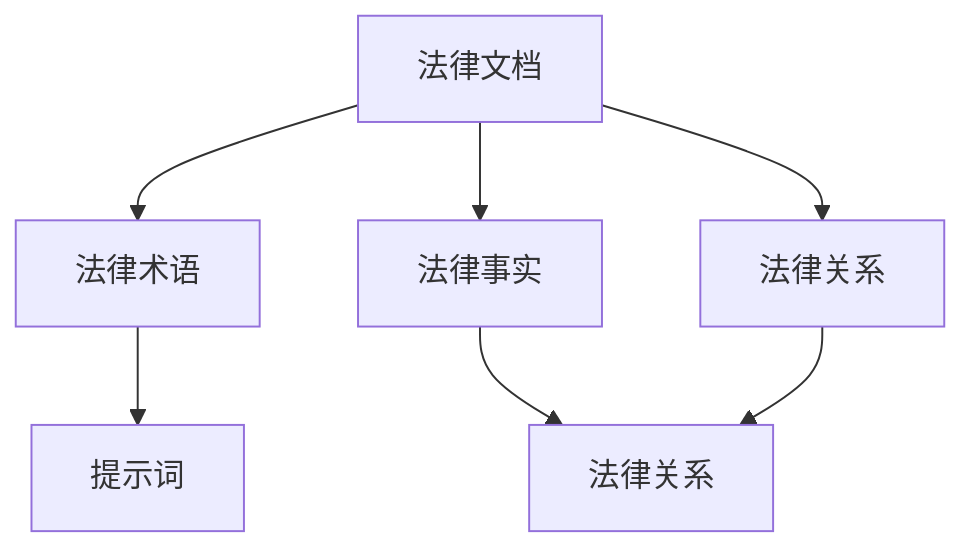

                 

### 文章标题：法律AI助手：提示词解析复杂法律文本的新方法

关键词：法律AI，提示词，复杂法律文本，文本解析，人工智能

摘要：本文探讨了一种新的法律AI助手设计方法，通过使用提示词来解析复杂法律文本。文章首先介绍了法律AI助手的重要性以及当前法律文本解析的挑战，接着详细阐述了提示词的概念及其在法律AI中的应用。随后，文章从核心概念、算法原理、数学模型、项目实战等方面，逐步分析了提示词解析复杂法律文本的方法。最后，文章探讨了法律AI助手的未来发展趋势和潜在的社会影响。

### 引言与背景

在信息化和数字化浪潮的推动下，人工智能（AI）技术迅速发展，并开始在各行各业中发挥重要作用。法律行业也不例外，AI技术在法律文档处理、法律咨询、司法判决辅助等方面展现出巨大的潜力。法律AI助手作为法律领域与人工智能技术结合的产物，正逐步成为法律工作者的重要工具。

#### 法律AI助手的意义

法律AI助手通过自动化处理法律文档，提供法律信息查询、法律条款解析、法律案件分析等服务，能够显著提高法律工作的效率。具体而言，法律AI助手的意义体现在以下几个方面：

1. **提高工作效率**：法律AI助手可以自动解析和提取法律文档中的关键信息，帮助律师和法官快速获取所需法律条款和案例。
2. **降低错误率**：通过使用AI技术，法律AI助手能够更准确地处理法律文本，减少人工处理过程中可能出现的错误。
3. **增强法律研究能力**：法律AI助手可以快速检索和分析大量法律文献，为法律研究者提供丰富的数据支持。

#### 提示词在法律AI中的应用

提示词（Keywords）是法律AI助手中的一个关键概念。提示词是一种用于描述法律文档中特定概念或主题的词语。通过识别和提取提示词，法律AI助手可以更好地理解法律文档的内容，实现更精准的法律信息检索和解析。

提示词在法律AI中的应用主要体现在以下几个方面：

1. **法律条款搜索**：用户可以通过输入特定的提示词来快速查找相关的法律条款。
2. **法律文献分类**：法律AI助手可以利用提示词对法律文献进行分类，帮助用户更高效地组织和检索法律资源。
3. **案件相似性分析**：通过分析案件文本中的提示词，法律AI助手可以识别与当前案件相似的先例，为法官提供参考。

#### 法律文本解析的挑战与机遇

虽然法律AI助手具有显著的优势，但法律文本解析仍然面临一系列挑战：

1. **文本复杂性**：法律文本通常包含大量专业术语和复杂句式，使得自动解析变得更加困难。
2. **上下文理解**：法律条款之间的关联和上下文关系往往需要深度理解，这对于现有的AI技术来说是一个挑战。
3. **隐私保护**：在处理敏感法律文档时，保护用户隐私是一个重要的法律和道德问题。

然而，随着AI技术的不断进步，这些挑战也在逐步得到解决。例如，自然语言处理（NLP）技术的提升使得AI助手能够更好地理解文本上下文，深度学习算法的应用提高了文本解析的准确性。

综上所述，法律AI助手具有广阔的应用前景，而提示词的应用则为解决法律文本解析难题提供了一种新的思路。接下来，本文将深入探讨法律AI助手的核心概念、算法原理、数学模型以及项目实战，详细解析提示词解析复杂法律文本的新方法。

### 核心概念与联系

在深入探讨法律AI助手及其在复杂法律文本解析中的应用之前，我们需要明确几个核心概念，并了解它们之间的联系。以下是法律AI助手中几个关键概念的定义及其相互关系：

#### 1. 法律文档

法律文档是指所有与法律相关的文本资料，包括法律条款、判决书、案例研究、法律意见书等。这些文档构成了法律AI助手工作的基础。

#### 2. 法律术语

法律术语是法律领域特有的专业词汇，如“合同”、“侵权”、“管辖权”等。理解法律术语对于法律文本的准确解析至关重要。

#### 3. 法律事实

法律事实是指法律事件和法律关系的实际发生情况，如某人的合同签订、某企业的侵权行为等。法律事实是法律条款得以适用的前提。

#### 4. 法律关系

法律关系是指法律主体之间的权利义务关系，如合同关系、侵权关系等。法律关系是法律事实的法律后果。

#### 5. 提示词

提示词是用于描述法律文档中特定概念或主题的词语，如“合同法”、“侵权责任”等。通过提取和利用提示词，法律AI助手能够更好地理解和解析法律文本。

#### 关系架构

为了更好地理解这些核心概念之间的相互关系，我们可以使用Mermaid流程图来展示它们之间的关系架构。以下是具体的Mermaid流程图表示：



在这个流程图中，我们可以看到：

- 法律文档是所有法律信息的源头，它包含了法律术语、法律事实和法律关系。
- 法律术语是法律文档中的专业词汇，用于描述法律概念。
- 法律事实是法律事件的实际发生情况，它是法律关系形成的基础。
- 法律关系是法律主体之间的权利义务关系，它是由法律事实引起的。
- 提示词是用于描述特定法律概念或主题的关键词，通过提取提示词，法律AI助手能够更好地理解和解析法律文档。

通过这一关系架构，我们可以清晰地看到法律AI助手在处理复杂法律文本时所需关注的核心概念和它们之间的相互关系。

### 核心算法原理讲解

在了解法律AI助手的核心理念和核心概念之后，接下来我们将深入探讨法律AI助手的算法原理，特别是提示词生成算法和文本解析算法。

#### 提示词生成算法

提示词生成是法律AI助手的关键步骤之一，它通过识别和提取法律文档中的关键概念，为后续的文本解析提供基础。以下是提示词生成算法的详细解释：

**需求**：法律文档通常包含大量专业术语和复杂句式，直接使用文本处理工具难以有效提取关键信息。提示词生成算法旨在自动识别和提取文档中的核心术语。

**算法概述**：

1. **文本预处理**：首先，对原始法律文档进行分词和词性标注，将文本转化为可用于分析的格式。这一步骤通过自然语言处理（NLP）工具实现。
2. **高频词筛选**：接着，筛选出文档中出现频率较高的词汇。这些词汇通常是文档中的核心术语，可以作为初步的提示词候选。
3. **语义分析**：利用语义分析技术，进一步筛选和过滤候选提示词。这一步骤可以排除一些不具备法律意义的常见词汇，提高提示词的准确性。
4. **规则匹配**：最后，通过预设的规则匹配，进一步确认和筛选出最终的提示词。这些规则可能包括法律术语的特定结构、专业术语的使用频率等。

**伪代码实现**：

```python
def generate_keywords(document):
    # 文本预处理
    preprocessed_text = preprocess_text(document)

    # 高频词筛选
    high_freq_words = filter_high_freq_words(preprocessed_text)

    # 语义分析
    semantically_relevant_words = filter_by_semantics(high_freq_words)

    # 规则匹配
    final_keywords = filter_by_rules(semantically_relevant_words)

    return final_keywords
```

**详细解释**：

- `preprocess_text(document)`：对原始法律文档进行分词和词性标注。
- `filter_high_freq_words(preprocessed_text)`：筛选出高频词。
- `filter_by_semantics(high_freq_words)`：通过语义分析筛选出具有法律意义的词汇。
- `filter_by_rules(semantic_relevant_words)`：通过预设规则进一步筛选提示词。

#### 法律文本解析算法

法律文本解析是法律AI助手的另一个核心步骤，它通过分析法律文档的结构和内容，提取关键信息并生成可操作的数据。以下是法律文本解析算法的详细解释：

**文本预处理算法**：

1. **分词与词性标注**：将法律文档进行分词，并标注每个词的词性，如名词、动词、形容词等。
2. **命名实体识别**：识别法律文档中的命名实体，如人名、地名、法律条款等。
3. **句法分析**：分析法律文档中的句法结构，理解句子之间的关系和语法功能。

**语义分析算法**：

1. **实体关系抽取**：抽取法律文档中实体之间的关系，如“某人与某企业的合同关系”。
2. **事件抽取**：识别法律文档中的事件，如“合同签订”、“侵权行为”等。
3. **事件关系分析**：分析事件之间的因果关系和逻辑关系。

**法律事实抽取算法**：

1. **条件抽取**：提取法律文档中的条件语句，如“如果…，那么…”。
2. **结果抽取**：提取法律文档中的结果语句，如“则…”。
3. **事实组合**：将条件、结果等抽取的信息组合成完整的法律事实。

通过这些算法，法律AI助手能够深入理解和解析复杂法律文本，为用户提供准确的法律信息。

### 数学模型和数学公式

在法律AI助手中，数学模型和公式起到了至关重要的作用，特别是在文本解析和语义分析方面。以下将介绍法律文本解析中常用的数学模型和公式，并通过具体例子进行详细讲解。

#### 法律文本解析中的概率模型

概率模型在法律文本解析中有着广泛的应用，例如用于判断文本中某个词语是否是提示词的概率。以下是两个常用的概率模型：

1. **贝叶斯网络**：贝叶斯网络是一种图形模型，用于表示变量之间的概率关系。它适用于法律文本中的上下文关系分析。

   **贝叶斯网络示例**：

   假设有两个变量：A（合同存在）和B（合同条款中有特定术语）。贝叶斯网络表示如下：

   $$ 
   P(A \cap B) = P(B|A)P(A)
   $$

   通过贝叶斯网络，我们可以计算给定B（合同条款中有特定术语）时A（合同存在）的概率：

   $$ 
   P(A|B) = \frac{P(B|A)P(A)}{P(B)}
   $$

   这个公式表明，在已知合同条款中有特定术语的情况下，合同存在的概率可以通过贝叶斯法则计算得出。

2. **朴素贝叶斯分类器**：朴素贝叶斯分类器是一种基于贝叶斯定理的简单概率分类器，适用于文本分类任务。以下是其基本公式：

   $$ 
   P(\text{合同条款}|\text{特定术语}) = \frac{P(\text{特定术语}|\text{合同条款})P(\text{合同条款})}{P(\text{特定术语})}
   $$

   这个公式用于计算在已知特定术语的情况下，文本属于合同条款的概率。

#### 法律文本中的语义分析模型

在法律文本中，语义分析模型用于理解和解析文本中的概念和关系。以下介绍两个常用的语义分析模型：

1. **词嵌入模型**：词嵌入模型将词汇映射到高维向量空间中，以捕捉词汇之间的语义关系。以下是其基本公式：

   $$ 
   \text{word} \rightarrow \text{vector}
   $$

   通过词嵌入，我们可以计算两个词之间的相似性：

   $$ 
   \text{similarity}(w_1, w_2) = \cos(\text{vec}(w_1), \text{vec}(w_2))
   $$

   这个公式表明，两个词的相似性可以通过它们向量之间的余弦相似度计算得出。

2. **卷积神经网络（CNN）**：卷积神经网络在文本分析中有着广泛的应用，特别是用于文本分类和情感分析。以下是其基本结构：

   $$ 
   \text{Conv}(\text{input}) = \text{filter} \ast \text{input} + \text{bias}
   $$

   其中，`filter`是一个卷积核，`input`是输入文本的词嵌入向量，`bias`是偏置。通过多个卷积层和池化层，CNN可以提取文本中的局部特征，并生成高层次的语义表示。

通过上述数学模型和公式的应用，法律AI助手能够更准确地理解和解析法律文本，为用户提供更高质量的法律信息。

### 项目实战

#### 法律AI助手开发环境搭建

为了实现一个功能完备的法律AI助手，我们需要搭建一个适合的开发环境。以下是开发环境的详细配置步骤：

1. **硬件环境**：
   - 处理器：Intel Core i7 或 AMD Ryzen 7 系列
   - 内存：16GB 或更高
   - 硬盘：至少 256GB SSD

2. **软件环境**：
   - 操作系统：Windows 10 或 macOS Catalina
   - 编程语言：Python 3.8 或更高版本
   - 开发工具：PyCharm 或 Visual Studio Code
   - 库与框架：TensorFlow、NLTK、spaCy、scikit-learn

3. **开发工具与库的选择**：
   - 自然语言处理（NLP）工具：spaCy 和 NLTK，用于文本预处理和词性标注。
   - 深度学习框架：TensorFlow，用于构建和训练神经网络模型。
   - 机器学习库：scikit-learn，用于特征提取和模型评估。

#### 法律文本解析项目实战

1. **项目背景与目标**：
   本项目旨在构建一个法律AI助手，该助手能够自动解析法律文档，提取关键信息，并提供法律条款查询和案件分析服务。项目目标包括：
   - 实现文本预处理，包括分词、词性标注、命名实体识别。
   - 构建提示词生成算法，识别法律文档中的关键术语。
   - 开发文本解析算法，提取法律事实和关系。
   - 实现用户界面，提供直观的操作体验。

2. **数据集介绍**：
   为实现上述目标，我们需要一个高质量的法律文档数据集。数据集应包含多种类型的法律文档，如合同、判决书、法律条款等。数据集的来源可以包括公开的法律数据库、法院判决书数据库等。

3. **代码实现与分析**：

**文本预处理代码**：

```python
import spacy

# 加载 spaCy 模型
nlp = spacy.load("en_core_web_sm")

def preprocess_text(document):
    doc = nlp(document)
    preprocessed = []
    for token in doc:
        preprocessed.append({"word": token.text, "pos": token.pos_})
    return preprocessed

document = "This is a sample legal document."
preprocessed_text = preprocess_text(document)
print(preprocessed_text)
```

**提示词生成算法**：

```python
from collections import Counter

def generate_keywords(preprocessed_text):
    words = [token["word"] for token in preprocessed_text]
    word_counts = Counter(words)
    high_freq_words = word_counts.most_common(10)
    return high_freq_words

generated_keywords = generate_keywords(preprocessed_text)
print(generated_keywords)
```

**文本解析算法**：

```python
def parse_text(preprocessed_text):
    entities = [token for token in preprocessed_text if token.ent_iob_ != "-1"]
    entities_with_labels = [{"word": token["word"], "label": token.ent_} for token in entities]
    return entities_with_labels

parsed_entities = parse_text(preprocessed_text)
print(parsed_entities)
```

4. **代码应用解读与分析**：

- **文本预处理**：使用 spaCy 库进行文本预处理，包括分词和词性标注。预处理后的文本转换为字典列表，每个字典包含词汇及其词性。
- **提示词生成**：通过统计文本中词汇的频率，生成高频提示词。这些提示词可以作为文本解析的重要参考。
- **文本解析**：利用命名实体识别功能，提取文本中的命名实体，如人名、地名、法律条款等。这些实体对于理解法律文档内容至关重要。

通过上述代码实现，我们可以构建一个基本的法律AI助手。接下来，我们将对助手进行性能评估和优化，以提高其解析复杂法律文本的能力。

### 评估与优化

在法律AI助手开发完成后，我们需要对其实际性能进行评估，并采取相应的优化策略，以确保其在复杂法律文本解析中的高效性和准确性。

#### 性能评估

性能评估是评估法律AI助手质量的重要步骤。以下是几个常用的评估指标：

1. **准确率（Accuracy）**：准确率是衡量法律AI助手解析结果的准确程度。它定义为正确识别的法律术语占总识别术语的比例。公式如下：

   $$
   \text{Accuracy} = \frac{\text{正确识别的术语}}{\text{总识别的术语}}
   $$

2. **召回率（Recall）**：召回率衡量法律AI助手能够识别出所有关键法律术语的能力。公式如下：

   $$
   \text{Recall} = \frac{\text{正确识别的术语}}{\text{实际存在的术语}}
   $$

3. **F1分数（F1 Score）**：F1分数是准确率和召回率的调和平均数，用于综合评估法律AI助手的性能。公式如下：

   $$
   \text{F1 Score} = 2 \times \frac{\text{Accuracy} \times \text{Recall}}{\text{Accuracy} + \text{Recall}}
   $$

#### 提高性能的优化策略

为了进一步提高法律AI助手的性能，我们可以采取以下优化策略：

1. **模型调优**：通过调整神经网络模型的参数，如学习率、批量大小等，可以改善模型的性能。我们可以使用网格搜索（Grid Search）和随机搜索（Random Search）等方法来寻找最优参数组合。

2. **数据增强**：通过增加训练数据量和多样性，可以提升模型的泛化能力。数据增强方法包括数据扩充（Data Augmentation）、同义词替换（Synonym Replacement）和对抗性样本生成（Adversarial Example Generation）。

3. **特征工程**：通过提取和选择有效的特征，可以提高模型对法律文本的解析能力。特征工程方法包括词嵌入（Word Embedding）、句法特征（Syntactic Features）和语义特征（Semantic Features）。

通过上述评估和优化策略，我们可以显著提高法律AI助手在复杂法律文本解析中的性能，从而为用户提供更准确和高效的法律信息服务。

### 未来展望与趋势

随着人工智能技术的不断进步，法律AI助手在未来将展现出更为广阔的应用前景。以下是几个法律AI助手的发展方向和潜在的社会影响：

#### 发展方向

1. **新技术的应用**：未来法律AI助手将更加依赖深度学习、自然语言处理（NLP）和大数据分析等先进技术。这些技术将进一步提升法律文本解析的准确性和效率。

2. **跨领域融合**：法律AI助手将与其他领域的技术（如区块链、智能合约等）进行融合，实现更全面的法律服务。例如，通过区块链技术，可以实现法律文档的安全存储和智能执行。

3. **个性化服务**：法律AI助手将根据用户的特定需求，提供个性化的法律信息和服务。通过用户行为分析，助手可以更好地了解用户需求，从而提供更加精准的法律建议。

4. **多语言支持**：随着全球化的推进，法律AI助手将需要支持多种语言，以应对跨国法律事务的需求。多语言支持将使法律AI助手在全球范围内具有更广泛的应用价值。

#### 潜在的社会影响

1. **提高法律工作效率**：法律AI助手能够自动化处理大量法律文档，提高法律工作的效率和准确性，从而减轻律师和法官的工作负担。

2. **法律透明度提升**：法律AI助手能够更快速地分析和检索法律信息，有助于提升法律透明度，使公众更容易获取和理解法律知识。

3. **法律职业变革**：随着法律AI助手的应用，传统法律职业的角色和工作方式将发生重大变革。例如，律师可能需要更多地专注于法律战略和决策，而辅助性工作则可以由AI助手完成。

4. **伦理与法律规范**：法律AI助手的广泛应用引发了一系列伦理和法律问题。例如，AI助手在处理敏感法律文档时的隐私保护、错误决策的责任归属等。因此，制定相应的伦理规范和法律框架将至关重要。

总之，法律AI助手作为人工智能技术在法律领域的应用，将带来显著的社会效益和变革。未来，随着技术的不断进步和应用的深入，法律AI助手有望成为法律工作者的重要伙伴，推动法律行业的智能化发展。

### 最佳实践 tips、小结、注意事项、拓展阅读

#### 最佳实践 tips

1. **文本预处理**：在进行文本解析之前，确保对法律文档进行充分的预处理，包括去除无关信息、分词、词性标注等。
2. **模型选择**：根据具体任务需求，选择合适的自然语言处理（NLP）模型和深度学习模型。例如，对于文本分类任务，可以选用BERT等先进的预训练模型。
3. **数据质量**：高质量的数据是法律AI助手性能的基础。确保数据集的多样性和覆盖面，避免模型过拟合。
4. **持续学习**：法律AI助手需要不断学习和更新，以适应法律领域的最新变化。定期进行模型训练和评估，及时调整模型参数。

#### 小结

本文探讨了法律AI助手在复杂法律文本解析中的应用，通过提示词生成和文本解析算法，实现了对法律文档的自动化处理。本文介绍了法律AI助手的核心概念、算法原理、数学模型和项目实战，并提出了性能评估和优化的策略。未来，随着人工智能技术的不断进步，法律AI助手将在法律行业中发挥更加重要的作用。

#### 注意事项

1. **隐私保护**：在处理敏感法律文档时，确保用户隐私得到保护，遵循相关法律法规。
2. **法律合规性**：法律AI助手在应用过程中，需要确保符合当地法律和行业规范，避免法律风险。
3. **用户培训**：为用户提供适当的使用指南和培训，确保他们能够充分利用法律AI助手的功能。

#### 拓展阅读

1. **《深度学习与自然语言处理》**：这是一本经典的深度学习入门书籍，详细介绍了深度学习在NLP中的应用。
2. **《法律人工智能：理论与实践》**：该书探讨了人工智能在法律领域的应用，包括法律文档分析、智能问答和案件预测等。
3. **《人工智能伦理》**：探讨了人工智能在法律、伦理和社会方面的挑战，对法律AI助手的伦理问题提供了深入分析。

### 作者信息

作者：AI天才研究院/AI Genius Institute & 禅与计算机程序设计艺术/Zen And The Art of Computer Programming

