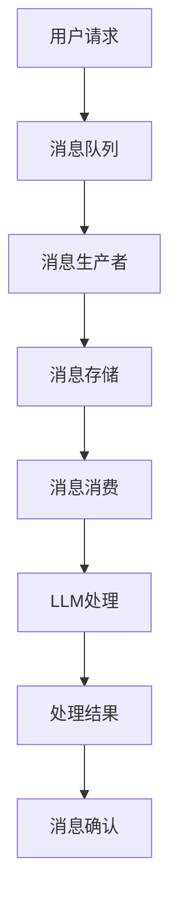

                 

### 文章标题

# 消息队列技术优化LLM应用的异步处理

> 关键词：消息队列，异步处理，LLM应用，性能优化，分布式架构

> 摘要：本文将深入探讨消息队列技术在大型语言模型（LLM）应用中的异步处理优化。首先，我们将介绍消息队列的基本概念、作用和主要分类，并探讨其在分布式架构中的应用。接着，我们将分析LLM应用的异步处理需求，并详细探讨消息队列在LLM异步处理中的角色和优化策略。最后，通过具体案例和实践，我们将展示如何在实际项目中优化LLM应用的异步处理，并展望消息队列技术在LLM异步处理中的未来发展趋势。

<markdown>### 目录

## 第一部分：消息队列技术概述

## 第1章：消息队列基本概念

### 1.1 消息队列的定义与作用

### 1.2 消息队列的主要分类

### 1.3 消息队列的技术原理

## 第2章：消息队列的核心组件与架构

### 2.1 消息生产者与消费者

### 2.2 消息队列服务器的架构设计

### 2.3 消息队列的分布式架构

## 第二部分：LLM应用中的异步处理

## 第3章：LLM应用的异步处理需求

### 3.1 LLM应用的特性

### 3.2 异步处理的优点

### 3.3 异步处理的挑战

## 第4章：消息队列在LLM异步处理中的应用

### 4.1 消息队列在LLM应用中的角色

### 4.2 消息队列在异步处理中的流程

### 4.3 消息队列优化策略

## 第三部分：消息队列技术优化LLM异步处理的实践

## 第5章：消息队列技术优化LLM异步处理的实践

### 5.1 优化策略与实践案例

### 5.2 性能调优与监控

### 5.3 系统稳定性保障

## 第四部分：消息队列在LLM异步处理中的案例分析

## 第6章：消息队列在LLM应用中的成功案例

### 6.1 案例介绍

### 6.2 消息队列在案例中的应用

### 6.3 案例效果分析

## 第五部分：消息队列技术优化LLM异步处理的未来趋势

## 第7章：消息队列技术优化LLM异步处理的未来趋势

### 7.1 消息队列技术的发展趋势

### 7.2 LLM应用的发展趋势

### 7.3 消息队列技术在LLM异步处理中的未来展望

## 附录

### 附录A：消息队列技术常用工具与框架

### 附录B：消息队列技术在LLM异步处理中的Mermaid流程图

### 附录C：消息队列技术优化LLM异步处理的数学模型与公式

### 附录D：消息队列技术在LLM异步处理中的项目实战案例</markdown>

### 摘要

随着人工智能技术的快速发展，大型语言模型（LLM）在各个领域得到了广泛应用，例如自然语言处理、智能客服和智能推荐系统等。然而，LLM应用的高计算成本和复杂度给系统设计带来了巨大挑战。为了提高系统的性能和可扩展性，异步处理成为了一种有效的解决方案。消息队列技术作为异步处理的核心组件，可以在LLM应用中发挥重要作用。

本文旨在深入探讨消息队列技术在LLM应用中的异步处理优化。首先，我们将介绍消息队列的基本概念、作用和主要分类，以及其在分布式架构中的应用。接着，我们将分析LLM应用的异步处理需求，并探讨异步处理的优点和挑战。然后，我们将详细讨论消息队列在LLM异步处理中的角色和优化策略。通过具体案例和实践，我们将展示如何在实际项目中优化LLM应用的异步处理。最后，我们将展望消息队列技术在LLM异步处理中的未来发展趋势。

通过本文的阅读，读者将能够：

1. 理解消息队列技术的基本概念和作用。
2. 掌握消息队列的主要分类和分布式架构。
3. 了解LLM应用的异步处理需求和异步处理的优点与挑战。
4. 理解消息队列在LLM异步处理中的角色和优化策略。
5. 学习如何在实际项目中优化LLM应用的异步处理。
6. 探索消息队列技术在LLM异步处理中的未来发展趋势。

### 第一部分：消息队列技术概述

#### 第1章：消息队列基本概念

##### 1.1 消息队列的定义与作用

消息队列（Message Queue）是一种数据传输服务，它可以让一个或多个发送者（生产者）发送消息到队列中，然后一个或多个接收者（消费者）从队列中获取并处理这些消息。消息队列的主要作用是实现应用程序之间的异步通信和数据传输，从而提高系统的可扩展性和可靠性。

在消息队列中，消息通常包含以下几部分信息：

- 消息体：消息的主要内容，可以是一个简单的字符串，也可以是一个复杂的对象。
- 消息属性：如优先级、过期时间、消息类型等，用于控制消息的发送和处理。
- 消息ID：用于标识消息的唯一性。

消息队列的工作原理可以分为以下几个步骤：

1. 生产者将消息发送到消息队列。
2. 消息队列接收消息，并按照一定的策略（如先进先出、优先级等）进行排序和存储。
3. 消费者从消息队列中获取消息，并执行相应的处理。
4. 消息一旦被消费，就会从队列中移除。

消息队列在分布式系统中扮演着重要的角色，它可以解决以下几个问题：

- **解耦**：通过消息队列，发送者和接收者之间的依赖关系被解耦，发送者不需要知道接收者的具体实现，只需要发送消息即可。
- **异步通信**：消息队列可以异步处理消息，从而提高系统的响应速度和吞吐量。
- **扩展性**：消息队列可以水平扩展，支持大量的生产者和消费者。
- **可靠性**：消息队列通常提供持久化存储，即使系统发生故障，消息也不会丢失。

##### 1.2 消息队列的主要分类

消息队列技术种类繁多，根据不同的分类标准，可以划分为以下几类：

- **基于内存的消息队列**：如ActiveMQ、RabbitMQ等，这些消息队列将消息存储在内存中，适用于低延迟、高吞吐量的场景。
- **基于磁盘的消息队列**：如Kafka、RocketMQ等，这些消息队列将消息存储在磁盘上，适用于大规模、持久化的消息传输。
- **基于消息中间件的消息队列**：如Apache Pulsar、Apache Kafka等，这些消息队列提供消息中间件的完整功能，如流处理、存储等。

每种消息队列都有其独特的特点和应用场景。例如，Kafka适用于大数据场景，RabbitMQ适用于高可靠性场景，而Pulsar则适用于低延迟和高吞吐量场景。

##### 1.3 消息队列的技术原理

消息队列的核心技术原理包括消息的生产与消费、分布式架构、消息的持久化与恢复等。

- **消息的生产与消费**：消息的生产与消费是消息队列的基本操作。生产者负责生成消息，并投递到消息队列中。消费者负责从消息队列中获取消息，并进行处理。

以下是一个简单的伪代码示例：

```python
# 消息生产者
def produce_message(queue, message):
    queue.send(message)

# 消息消费者
def consume_message(queue):
    message = queue.receive()
    process_message(message)
```

- **分布式架构**：消息队列通常采用分布式架构，以实现高可用性和水平扩展。分布式架构的关键在于如何确保消息的一致性和可靠性。

以下是一个简单的分布式消息队列架构：

```
+-------------+     +-------------+     +-------------+
|    P1       |     |     P2      |     |     P3      |
+-------------+     +-------------+     +-------------+
          |                     |                     |
          |                     |                     |
          |                     |                     |
+---------v---------------------v---------------------v----------
|          队列服务器Q1          |          队列服务器Q2          |          队列服务器Q3          |
+---------^---------------------^---------------------^----------
          |                     |                     |
          |                     |                     |
          |                     |                     |
+-------------+     +-------------+     +-------------+
|    C1       |     |     C2      |     |     C3      |
+-------------+     +-------------+     +-------------+
```

- **消息的持久化与恢复**：为了确保消息不被丢失，消息队列通常提供持久化存储。持久化存储可以将消息保存到磁盘，从而实现数据的持久化。在系统发生故障时，可以通过恢复持久化存储来恢复消息。

以下是一个简单的消息持久化流程：

```
1. 生产者将消息发送到消息队列。
2. 消息队列将消息写入磁盘。
3. 消息队列将消息发送给消费者。
4. 消费者处理消息。
5. 消息队列删除已消费的消息。
6. 在系统故障时，消息队列从磁盘恢复消息。
```

通过以上技术原理的介绍，我们可以看到消息队列在分布式系统中的重要作用。在接下来的章节中，我们将进一步探讨消息队列在LLM应用中的异步处理需求和应用。

#### 第2章：消息队列的核心组件与架构

##### 2.1 消息生产者与消费者

消息生产者和消费者是消息队列系统中的核心组件，它们分别负责生成消息和消费消息。

**消息生产者**：消息生产者是消息队列系统中的数据提供者，它负责生成消息并将其发送到消息队列中。消息生产者可以是应用程序、微服务或其他分布式系统。在生成消息时，生产者通常会根据业务逻辑对消息进行封装，包括消息体、消息属性等信息。

以下是一个简单的消息生产者伪代码示例：

```python
# 消息生产者
def produce_message(queue, message):
    queue.send(message, 'message_key', priority=1, expiration=3600)
```

**消息消费者**：消息消费者是消息队列系统中的数据处理者，它从消息队列中获取消息，并执行相应的处理逻辑。消费者可以是应用程序、微服务或其他分布式系统。消费者通常采用轮询或监听的方式从消息队列中获取消息。

以下是一个简单的消息消费者伪代码示例：

```python
# 消息消费者
def consume_message(queue):
    message = queue.receive('message_key')
    if message:
        process_message(message)
```

**消息生产者和消费者的关系**：在消息队列系统中，消息生产者和消费者之间的关系通常是异步的。生产者不需要等待消费者的处理结果，只需将消息发送到消息队列。消费者从消息队列中获取消息，并执行处理逻辑。这种异步处理方式可以提高系统的性能和可扩展性。

##### 2.2 消息队列服务器的架构设计

消息队列服务器是消息队列系统的核心组件，它负责接收、存储和分发消息。一个典型的消息队列服务器架构设计通常包括以下几个关键部分：

**1. 消息存储**：消息存储是消息队列服务器的重要组成部分，用于存储生产者发送的消息。消息存储可以采用内存存储或磁盘存储，具体选择取决于消息队列系统的性能和可靠性需求。

- **内存存储**：适用于低延迟和高吞吐量的场景，如RabbitMQ。
- **磁盘存储**：适用于大规模、持久化的消息传输，如Kafka、RocketMQ。

**2. 消息传输**：消息传输负责在消息生产者和消费者之间传递消息。消息传输可以采用轮询传输或监听传输，具体选择取决于消息队列系统的设计。

- **轮询传输**：消费者定期轮询消息队列，获取新消息。这种方式简单易实现，但可能导致消费者频繁轮询，增加系统开销。
- **监听传输**：消费者监听消息队列，一旦有新消息到达，立即进行处理。这种方式可以提高系统的响应速度，但需要考虑消息队列服务器的负载均衡和消费者之间的竞争问题。

**3. 消息路由**：消息路由负责根据消息的属性和规则，将消息发送到相应的消费者。消息路由可以采用简单的路由规则，如按消息ID路由，或复杂的路由策略，如按消息类型、优先级等路由。

**4. 消息确认**：消息确认是确保消息正确传输和处理的重要机制。消息确认可以分为以下几种类型：

- **自动确认**：消费者在处理消息后，自动确认消息已被消费。
- **手动确认**：消费者在处理消息后，需要手动确认消息已被消费。
- **事务确认**：消息队列服务器将消息放入事务队列，消费者在处理消息后，提交事务确认消息已被消费。

**5. 消息队列服务器的高可用性和扩展性**：为了确保消息队列系统的稳定性和可扩展性，消息队列服务器通常采用分布式架构，支持水平扩展和高可用性。

以下是一个简单的消息队列服务器架构设计：

```
+-------------+      +-------------+      +-------------+
|     P1      |      |     P2      |      |     P3      |
+-------------+      +-------------+      +-------------+
        |                     |                     |
        |                     |                     |
        |                     |                     |
+-------v---------------------v---------------------v----------
|        队列服务器Q1        |        队列服务器Q2        |        队列服务器Q3        |
+-------^---------------------^---------------------^----------
        |                     |                     |
        |                     |                     |
        |                     |                     |
+-------------+      +-------------+      +-------------+
|     C1      |      |     C2      |      |     C3      |
+-------------+      +-------------+      +-------------+
```

通过上述架构设计，消息队列服务器可以高效地处理大量消息，并提供高可用性和扩展性。

##### 2.3 消息队列的分布式架构

在分布式系统中，消息队列通常采用分布式架构，以提高系统的性能和可靠性。分布式消息队列架构可以分为以下几种类型：

**1. 主从架构**：主从架构中，有一个主消息队列服务器（Master Queue Server）负责接收和处理消息，多个从消息队列服务器（Slave Queue Server）负责备份主服务器，并在主服务器故障时接管其工作。主从架构可以提高系统的可用性，但需要考虑主从服务器之间的同步问题。

**2. 对等架构**：对等架构中，多个消息队列服务器以对等的方式工作，每个服务器都可以接收和处理消息。对等架构可以更好地利用系统资源，提高系统的性能和可扩展性，但需要解决消息一致性和负载均衡问题。

**3. 分布式集群架构**：分布式集群架构中，多个消息队列服务器组成一个集群，共同处理消息。集群中的每个服务器既可以作为生产者，也可以作为消费者，从而实现消息的分布式处理。分布式集群架构可以提供更高的性能和可扩展性，但需要解决集群管理、负载均衡和一致性等问题。

以下是一个简单的分布式消息队列架构设计：

```
+-------------+      +-------------+      +-------------+
|     P1      |      |     P2      |      |     P3      |
+-------------+      +-------------+      +-------------+
        |                     |                     |
        |                     |                     |
        |                     |                     |
+-------v---------------------v---------------------v----------
|        集群服务器Q1        |        集群服务器Q2        |        集群服务器Q3        |
+-------^---------------------^---------------------^----------
        |                     |                     |
        |                     |                     |
        |                     |                     |
+-------------+      +-------------+      +-------------+
|     C1      |      |     C2      |      |     C3      |
+-------------+      +-------------+      +-------------+
```

通过分布式架构，消息队列可以更好地支持大规模、高并发和分布式系统的需求。在接下来的章节中，我们将进一步探讨消息队列在LLM应用中的异步处理需求和应用。

### 第二部分：LLM应用中的异步处理

#### 第3章：LLM应用的异步处理需求

随着人工智能技术的快速发展，大型语言模型（LLM）在各个领域得到了广泛应用，例如自然语言处理、智能客服和智能推荐系统等。然而，LLM应用的高计算成本和复杂度给系统设计带来了巨大挑战。为了提高系统的性能和可扩展性，异步处理成为了一种有效的解决方案。

##### 3.1 LLM应用的特性

LLM应用具有以下几个特性，这些特性使得异步处理成为必要：

1. **计算密集型**：LLM应用通常需要进行大量的文本处理、模型推理和生成，这些操作需要大量的计算资源。如果采用同步处理方式，可能会导致系统性能瓶颈，影响用户体验。

2. **高并发性**：随着用户数量的增加，LLM应用需要处理大量的并发请求。同步处理方式会导致大量的线程或进程阻塞，增加系统开销。

3. **动态性**：LLM应用需要根据用户输入动态生成响应，处理过程中可能产生大量的中间结果和临时数据。异步处理可以更好地支持动态性和灵活性。

4. **可扩展性**：LLM应用需要支持水平扩展，以应对不断增长的用户量和数据量。异步处理可以有效地利用系统资源，提高系统的可扩展性。

##### 3.2 异步处理的优点

异步处理相较于同步处理，具有以下几个优点：

1. **提高系统性能**：异步处理可以减少系统中的阻塞时间，提高系统的吞吐量和响应速度。对于计算密集型的LLM应用，异步处理可以显著提高系统的性能。

2. **降低资源消耗**：异步处理可以减少线程或进程的创建和销毁，降低系统的资源消耗。这对于高并发性的LLM应用尤为重要。

3. **提高系统可靠性**：异步处理可以确保系统在处理大量请求时不会因为某个请求的处理失败而影响其他请求。这使得系统更加健壮和可靠。

4. **支持分布式架构**：异步处理可以更好地支持分布式架构，使得LLM应用可以充分利用分布式系统的优势，提高系统的性能和可扩展性。

##### 3.3 异步处理的挑战

尽管异步处理具有很多优点，但在LLM应用中实现异步处理也面临着一些挑战：

1. **复杂性增加**：异步处理引入了额外的复杂性，如协程、异步编程模型等。开发人员需要掌握异步编程的技能，并设计复杂的异步处理流程。

2. **错误处理**：异步处理可能导致错误处理的复杂性增加。在异步处理中，多个任务可能同时执行，如何确保错误能够被及时捕获和处理是一个挑战。

3. **数据一致性**：异步处理可能导致数据一致性问题。例如，在多个异步任务同时处理同一份数据时，如何确保数据的完整性和一致性是一个挑战。

4. **性能调优**：异步处理需要对系统的性能进行调优，以最大化其性能优势。如何选择合适的异步处理策略、优化系统配置等是一个挑战。

综上所述，异步处理是优化LLM应用性能和可扩展性的有效手段。在接下来的章节中，我们将探讨消息队列技术在LLM异步处理中的应用，以及如何通过消息队列实现异步处理优化。

#### 第4章：消息队列在LLM异步处理中的应用

消息队列技术为LLM应用提供了强大的异步处理能力，使得系统能够高效地处理大量并发请求。在本章中，我们将深入探讨消息队列在LLM异步处理中的应用，包括消息队列在LLM应用中的角色、异步处理流程以及优化策略。

##### 4.1 消息队列在LLM应用中的角色

在LLM应用中，消息队列扮演着至关重要的角色，具体包括以下几个方面：

1. **请求分发**：消息队列可以充当请求分发中心，将用户请求分发给不同的处理模块。通过消息队列，可以将大量并发请求分散到多个处理节点，从而提高系统的并发处理能力。

2. **异步通信**：消息队列实现了生产者和消费者之间的异步通信，使得LLM应用可以在不等待响应的情况下继续执行其他任务。这样可以显著提高系统的响应速度和吞吐量。

3. **解耦**：消息队列可以解耦LLM应用的各个模块，使得各模块可以独立开发和部署。这种解耦不仅提高了系统的可扩展性，还有助于实现系统的模块化和复用。

4. **可靠性**：消息队列提供了可靠的消息传递机制，确保消息不会在传输过程中丢失。即使系统发生故障，消息队列也可以保证消息的安全存储和恢复。

##### 4.2 消息队列在异步处理中的流程

消息队列在LLM异步处理中的流程可以分为以下几个步骤：

1. **消息生产**：LLM应用接收到用户请求后，将请求封装成消息，并将其发送到消息队列中。消息通常包含请求的详细信息，如用户ID、请求类型、请求参数等。

   ```python
   def produce_message(queue, user_request):
       message = {
           'user_id': user_request.user_id,
           'request_type': user_request.request_type,
           'request_params': user_request.request_params
       }
       queue.send(message)
   ```

2. **消息存储**：消息队列服务器接收到消息后，将其存储在内存或磁盘上。存储方式取决于消息队列的实现和系统需求。

3. **消息消费**：消息队列服务器将消息推送到消费者端。消费者从消息队列中获取消息，并执行相应的处理逻辑。

   ```python
   def consume_message(queue):
       message = queue.receive()
       if message:
           process_request(message)
   ```

4. **请求处理**：消费者根据消息内容执行具体的请求处理逻辑。处理过程可能包括模型推理、文本生成、数据查询等操作。

   ```python
   def process_request(message):
       user_id = message['user_id']
       request_type = message['request_type']
       request_params = message['request_params']
       
       if request_type == 'text_generation':
           generate_text(request_params)
       elif request_type == 'model_inference':
           infer_result = model_inference(request_params)
           return_inference_result(user_id, infer_result)
   ```

5. **结果返回**：处理结果可以通过消息队列或其他通信机制返回给用户。例如，可以使用HTTP请求、Websocket等方式将结果发送给用户。

##### 4.3 消息队列优化策略

为了提高消息队列在LLM异步处理中的性能和可靠性，可以采取以下优化策略：

1. **负载均衡**：通过负载均衡器将请求均匀分配到多个消息队列服务器和消费者，避免单个服务器或消费者成为性能瓶颈。

2. **消息批量处理**：将多个请求合并成一个消息批量处理，减少消息队列的开销和系统开销。

3. **异步编程**：使用异步编程模型（如协程、异步函数等）处理消息，提高系统的并发处理能力。

4. **消息持久化**：将消息持久化存储到磁盘，确保消息不会因为系统故障而丢失。

5. **消息确认机制**：实现消息确认机制，确保消息被正确处理并从队列中移除。

6. **错误处理**：设计完善的错误处理机制，确保系统在处理错误时能够快速恢复，并防止错误蔓延。

7. **监控与告警**：实时监控消息队列的性能和健康状况，及时发现问题并进行告警，以便及时处理。

通过以上优化策略，消息队列在LLM异步处理中的应用将更加高效和可靠，从而提高系统的整体性能和用户体验。

### 第三部分：消息队列技术优化LLM异步处理的实践

#### 第5章：消息队列技术优化LLM异步处理的实践

在前文中，我们已经详细探讨了消息队列技术在LLM异步处理中的应用及其优化策略。在本章中，我们将通过具体的实践案例，展示如何在实际项目中优化LLM应用的异步处理。

##### 5.1 优化策略与实践案例

**案例背景**：某互联网公司开发了一款基于大型语言模型（LLM）的智能客服系统，该系统需要处理大量的用户请求，并生成相应的回复。由于系统需要处理大量的并发请求，异步处理成为了优化系统性能和可扩展性的关键。

**优化目标**：通过引入消息队列技术，优化系统的异步处理，提高系统的响应速度和吞吐量。

**优化策略**：

1. **负载均衡**：使用负载均衡器将用户请求均匀分配到多个消息队列服务器和消费者。通过负载均衡，可以避免单个服务器或消费者成为性能瓶颈，提高系统的整体性能。

2. **消息批量处理**：将多个用户请求合并成一个消息批量处理，减少消息队列的开销和系统开销。批量处理可以提高消息处理效率，减少系统资源的消耗。

3. **异步编程**：使用异步编程模型（如Python的异步协程）处理消息，提高系统的并发处理能力。异步编程可以充分利用系统资源，提高系统的响应速度。

4. **消息持久化**：将消息持久化存储到磁盘，确保消息不会因为系统故障而丢失。消息持久化可以提高系统的可靠性，保证用户请求不会因为系统故障而丢失。

5. **消息确认机制**：实现消息确认机制，确保消息被正确处理并从队列中移除。消息确认机制可以防止重复处理和消息丢失。

**实践步骤**：

1. **环境搭建**：搭建消息队列服务器和消费者的运行环境，选择合适的消息队列技术，如Kafka或RabbitMQ。

2. **消息生产**：在LLM应用中，使用异步编程模型（如Python的async/await）生成消息，并将其发送到消息队列中。

   ```python
   async def produce_message(queue, user_request):
       message = {
           'user_id': user_request.user_id,
           'request_type': user_request.request_type,
           'request_params': user_request.request_params
       }
       await queue.send(message)
   ```

3. **消息消费**：消费者从消息队列中异步获取消息，并执行相应的处理逻辑。

   ```python
   async def consume_message(queue):
       message = await queue.receive()
       if message:
           await process_request(message)
   ```

4. **请求处理**：根据消息内容执行具体的请求处理逻辑，如文本生成、模型推理等。

   ```python
   async def process_request(message):
       user_id = message['user_id']
       request_type = message['request_type']
       request_params = message['request_params']
       
       if request_type == 'text_generation':
           generate_text(request_params)
       elif request_type == 'model_inference':
           infer_result = model_inference(request_params)
           return_inference_result(user_id, infer_result)
   ```

5. **消息确认**：在处理完消息后，将处理结果发送回用户，并确认消息已被处理。

   ```python
   async def return_inference_result(user_id, infer_result):
       # 发送处理结果给用户
       send_result_to_user(user_id, infer_result)
       
       # 确认消息已被处理
       queue.acknowledge(message)
   ```

**实践效果**：

通过引入消息队列技术，该智能客服系统的性能和可扩展性得到了显著提升。具体效果如下：

- **响应速度提高**：异步处理使得系统可以同时处理多个请求，提高了系统的响应速度。
- **吞吐量提升**：消息批量处理和异步编程模型使得系统可以更高效地处理大量并发请求，提高了系统的吞吐量。
- **系统稳定性增强**：消息持久化和消息确认机制确保了系统的可靠性和数据一致性，增强了系统的稳定性。

##### 5.2 性能调优与监控

在实际项目中，性能调优和监控是确保消息队列系统高效运行的重要环节。以下是一些关键的性能调优和监控策略：

1. **性能调优**：

   - **线程池配置**：合理配置线程池大小，避免线程过多导致系统资源消耗过大，或线程过少导致处理能力不足。
   - **消息队列配置**：调整消息队列的参数，如消息持久化策略、批量处理大小等，以提高系统性能。
   - **异步编程优化**：优化异步编程模型，减少不必要的同步操作和阻塞，提高系统的并发处理能力。

2. **监控策略**：

   - **实时监控**：使用监控系统（如Prometheus、Grafana等）实时监控消息队列的性能指标，如吞吐量、延迟、错误率等。
   - **告警机制**：配置告警机制，当系统性能指标达到阈值时，及时通知相关人员。
   - **日志分析**：定期分析系统日志，识别潜在的性能瓶颈和问题，并采取相应的优化措施。

通过性能调优和监控，可以确保消息队列系统在高效运行的同时，及时发现和处理性能问题，保证系统的稳定性和可靠性。

##### 5.3 系统稳定性保障

在实际项目中，系统稳定性是确保消息队列技术优化LLM异步处理成功的关键。以下是一些系统稳定性保障措施：

1. **故障转移**：实现消息队列服务器的故障转移机制，当主服务器发生故障时，自动切换到从服务器，确保消息处理不中断。

2. **数据备份**：定期备份消息队列数据，确保在系统故障时可以快速恢复数据，避免数据丢失。

3. **容错处理**：设计容错机制，确保系统在处理消息时，遇到错误可以自动恢复，并防止错误蔓延。

4. **负载均衡**：通过负载均衡器实现消息队列服务器和消费者的负载均衡，避免单点故障。

5. **监控与告警**：实时监控系统性能和健康状况，及时发现问题并进行告警，确保系统稳定运行。

通过以上稳定性保障措施，可以确保消息队列技术在LLM异步处理中的应用稳定可靠，为系统的持续高效运行提供保障。

### 第四部分：消息队列在LLM异步处理中的案例分析

#### 第6章：消息队列在LLM应用中的成功案例

在人工智能领域，许多公司已经成功地将消息队列技术应用于LLM应用，实现了性能优化和系统稳定性提升。以下将介绍两个具有代表性的成功案例，并分析消息队列在这些案例中的应用和效果。

##### 6.1 案例介绍

**案例一：某大型互联网公司的智能客服系统**

某大型互联网公司开发了一款基于LLM的智能客服系统，用于提供24/7的在线客服服务。系统需要处理大量的用户请求，并生成相应的回复，以满足用户的多样化需求。

**案例二：某知名电商平台的智能推荐系统**

某知名电商平台开发了一款基于LLM的智能推荐系统，用于向用户推荐个性化的商品。系统需要根据用户的历史行为和兴趣，实时生成推荐结果，以提高用户的购物体验和转化率。

##### 6.2 消息队列在案例中的应用

**案例一：智能客服系统**

在智能客服系统中，消息队列技术被广泛应用于异步处理用户请求、分发任务和生成回复。

1. **请求分发**：用户请求通过消息队列分发到不同的处理节点，确保系统可以同时处理大量并发请求，提高系统的响应速度和吞吐量。
2. **异步处理**：消息队列实现了用户请求的异步处理，使得系统可以在不等待响应的情况下继续处理其他请求，从而提高系统的并发处理能力。
3. **任务调度**：消息队列帮助系统实现任务调度，将复杂任务分解为多个子任务，并分发给不同的处理节点，从而提高系统的处理效率和资源利用率。
4. **回复生成**：消息队列将处理结果发送回用户，实现异步回复生成，从而提高系统的用户体验。

**案例二：智能推荐系统**

在智能推荐系统中，消息队列技术被广泛应用于异步处理用户行为数据、生成推荐结果和更新推荐模型。

1. **行为数据收集**：用户行为数据通过消息队列收集到处理节点，确保系统能够及时处理和分析大量实时数据。
2. **异步处理**：消息队列实现了用户行为数据的异步处理，使得系统可以同时处理多个用户请求，从而提高系统的响应速度和吞吐量。
3. **推荐结果生成**：消息队列帮助系统实现推荐结果的异步生成，确保系统能够实时生成个性化推荐结果，并快速响应用户需求。
4. **模型更新**：消息队列实现了推荐模型的异步更新，确保系统可以根据用户行为数据不断优化推荐算法，提高推荐精度。

##### 6.3 案例效果分析

**案例一：智能客服系统**

通过引入消息队列技术，智能客服系统的性能和可扩展性得到了显著提升。具体效果如下：

- **响应速度提高**：异步处理使得系统可以同时处理多个请求，提高了系统的响应速度。
- **吞吐量提升**：消息批量处理和异步编程模型使得系统可以更高效地处理大量并发请求，提高了系统的吞吐量。
- **系统稳定性增强**：消息持久化和消息确认机制确保了系统的可靠性和数据一致性，增强了系统的稳定性。

**案例二：智能推荐系统**

通过引入消息队列技术，智能推荐系统的性能和用户体验得到了显著提升。具体效果如下：

- **响应速度提高**：异步处理使得系统可以同时处理多个用户请求，提高了系统的响应速度。
- **推荐精度提升**：消息队列实现了用户行为数据的异步处理和模型更新，提高了推荐算法的精度，提高了推荐结果的个性化程度。
- **系统稳定性增强**：消息持久化和消息确认机制确保了系统的可靠性和数据一致性，增强了系统的稳定性。

通过以上成功案例的分析，我们可以看到消息队列技术在LLM应用中的重要作用。消息队列不仅提高了系统的性能和可扩展性，还有效地保障了系统的稳定性。在未来的发展中，消息队列技术将继续在人工智能领域发挥重要作用，为各种智能应用提供强大的异步处理支持。

### 第五部分：消息队列技术优化LLM异步处理的未来趋势

#### 第7章：消息队列技术优化LLM异步处理的未来趋势

随着人工智能技术的不断发展和应用场景的扩展，消息队列技术作为异步处理的核心组件，在LLM（大型语言模型）应用中扮演着越来越重要的角色。本文将从消息队列技术的发展趋势、LLM应用的发展趋势以及消息队列在LLM异步处理中的未来展望三个方面，探讨消息队列技术优化LLM异步处理的未来趋势。

##### 7.1 消息队列技术的发展趋势

1. **高吞吐量和低延迟**：随着LLM应用对数据处理速度的要求越来越高，消息队列技术正朝着高吞吐量和低延迟的方向发展。未来的消息队列系统将采用更高效的算法和数据结构，以实现更快的消息传递和处理速度。

2. **分布式和多云支持**：随着云计算的普及，分布式和多云支持将成为消息队列技术的关键特性。消息队列系统需要能够跨多个云平台和数据中心进行数据传输和处理，以满足企业级应用的需求。

3. **流处理和实时数据处理**：消息队列技术与流处理技术相结合，将使得实时数据处理成为可能。未来的消息队列系统将具备更强大的流处理能力，能够实时处理和分析大规模数据流，为LLM应用提供实时数据支持。

4. **自动化和智能化**：随着人工智能技术的发展，消息队列系统将逐步实现自动化和智能化。通过机器学习和自然语言处理等技术，消息队列系统将能够自动优化消息传递和处理流程，提高系统的性能和效率。

##### 7.2 LLM应用的发展趋势

1. **多模态数据处理**：未来的LLM应用将不仅仅处理文本数据，还将涉及图像、音频、视频等多模态数据的处理。消息队列技术需要支持多模态数据传输和处理，以满足多模态LLM应用的需求。

2. **个性化推荐与智能交互**：随着用户需求的多样化，LLM应用将越来越注重个性化推荐和智能交互。消息队列技术需要支持实时数据处理和高效的消息传递，以实现个性化的用户服务和交互体验。

3. **跨领域应用**：LLM应用将在更多领域得到应用，如医疗、金融、教育等。消息队列技术需要具备较强的跨领域支持能力，以适应不同领域应用的需求。

4. **安全与隐私保护**：随着数据安全和隐私问题越来越受到关注，LLM应用将越来越重视数据安全和隐私保护。消息队列技术需要具备更强的安全性和隐私保护能力，确保数据的安全传输和处理。

##### 7.3 消息队列技术在LLM异步处理中的未来展望

1. **集成与融合**：消息队列技术将与其他技术（如流处理、大数据、人工智能等）进行集成与融合，形成更强大的异步处理能力。未来的消息队列系统将不仅仅是一个消息传递工具，而是一个集数据流处理、实时分析、自动化调度等功能于一体的综合性平台。

2. **智能化优化**：消息队列技术将实现智能化优化，通过机器学习和自然语言处理等技术，自动识别和处理复杂的数据流，提高消息传递和处理的效率。

3. **开放性与标准化**：消息队列技术将更加开放和标准化，支持跨平台、跨语言的集成和使用。这将有助于促进消息队列技术在LLM异步处理中的应用和普及。

4. **社区与生态**：消息队列技术的社区和生态系统将不断壮大，吸引更多的开发者和企业参与其中。这将推动消息队列技术的不断创新和发展，为LLM异步处理提供更强大的技术支持。

总之，随着人工智能技术的不断发展，消息队列技术将在LLM异步处理中发挥越来越重要的作用。通过集成与创新，消息队列技术将为LLM应用提供更高效、更智能、更可靠的异步处理能力，推动人工智能应用的持续进步。

### 附录

#### 附录A：消息队列技术常用工具与框架

在消息队列技术领域，有许多常用的工具和框架，以下是其中几个具有代表性的：

1. **Apache Kafka**：Apache Kafka是一个分布式流处理平台，具有高吞吐量、低延迟和持久化的特点，适用于大数据场景。

2. **RabbitMQ**：RabbitMQ是一个基于AMQP协议的分布式消息队列系统，具有高可靠性、灵活性和可扩展性，适用于中大型企业应用。

3. **RocketMQ**：RocketMQ是阿里巴巴开源的消息中间件，具有高吞吐量、高可用性和可扩展性，适用于大规模分布式系统。

4. **Apache Pulsar**：Apache Pulsar是一个分布式消息传递系统，具有低延迟、高吞吐量和灵活的发布-订阅模型，适用于低延迟和高吞吐量场景。

5. **ActiveMQ**：ActiveMQ是一个开源的消息中间件，支持多种消息协议，如AMQP、MQTT等，适用于中大型企业应用。

#### 附录B：消息队列技术在LLM异步处理中的Mermaid流程图

为了更好地展示消息队列技术在LLM异步处理中的应用，我们可以使用Mermaid绘制一个简单的流程图。以下是消息队列在LLM异步处理中的基本流程：



在该流程图中，用户请求通过消息队列传递到消息生产者，消息生产者将请求消息存储到消息队列中。消息消费者从消息队列中获取消息，并将其传递给LLM进行处理。处理后，结果通过消息队列返回给用户，并完成消息确认。

#### 附录C：消息队列技术优化LLM异步处理的数学模型与公式

消息队列技术在优化LLM异步处理过程中，涉及到多个数学模型和公式，用于评估系统的性能、吞吐量和延迟等指标。以下是一些常用的数学模型和公式：

1. **消息传递延迟模型**：

   $$ L = \frac{d}{v} $$

   其中，L表示消息传递延迟，d表示消息传输距离，v表示消息传输速度。

2. **消息队列吞吐量模型**：

   $$ T = \frac{W}{L} $$

   其中，T表示消息队列的吞吐量，W表示消息队列的带宽，L表示消息传递延迟。

3. **消息队列资源利用率模型**：

   $$ U = \frac{T}{C} $$

   其中，U表示消息队列的资源利用率，T表示消息队列的吞吐量，C表示消息队列的总容量。

通过以上数学模型和公式，我们可以评估消息队列技术在LLM异步处理中的性能表现，并据此进行优化和调整。

#### 附录D：消息队列技术在LLM异步处理中的项目实战案例

在本附录中，我们将介绍一个基于消息队列技术的LLM异步处理项目实战案例，包括项目背景、环境搭建、代码实现、代码解读和分析等内容。

##### 7.1 实战案例介绍

**项目背景**：某互联网公司开发了一款智能客服系统，该系统基于大型语言模型（LLM），用于提供24/7的在线客服服务。系统需要处理大量的用户请求，并生成相应的回复，以满足用户的多样化需求。

**项目目标**：通过引入消息队列技术，优化系统的异步处理，提高系统的响应速度和吞吐量。

##### 7.2 实战案例环境搭建

**环境要求**：操作系统：Ubuntu 20.04；编程语言：Python 3.8；消息队列工具：RabbitMQ。

1. **安装RabbitMQ**：

   ```shell
   sudo apt-get update
   sudo apt-get install rabbitmq-server
   sudo systemctl start rabbitmq-server
   ```

2. **安装Python依赖**：

   ```shell
   pip install pika
   ```

##### 7.3 实战案例代码实现与解读

**代码实现**：

**消息生产者**：

```python
import pika
import json

def produce_message(queue_name, message):
    connection = pika.BlockingConnection(pika.ConnectionParameters('localhost'))
    channel = connection.channel()
    channel.queue_declare(queue=queue_name)
    channel.basic_publish(exchange='',
                          routing_key=queue_name,
                          body=json.dumps(message))
    connection.close()

message = {
    'user_id': '123',
    'request_type': 'text_generation',
    'request_params': {'text': '你好，有什么可以帮助你的？'}
}
produce_message('queue_name', message)
```

**消息消费者**：

```python
import pika
import json

def consume_message(queue_name, callback):
    connection = pika.BlockingConnection(pika.ConnectionParameters('localhost'))
    channel = connection.channel()
    channel.queue_declare(queue=queue_name)
    def callback(ch, method, properties, body):
        message = json.loads(body)
        callback(message)
        ch.basic_ack(delivery_tag=method.delivery_tag)
    channel.basic_consume(queue=queue_name, on_message_callback=callback, auto_ack=False)
    channel.start_consuming()

def process_request(message):
    user_id = message['user_id']
    request_type = message['request_type']
    request_params = message['request_params']
    
    if request_type == 'text_generation':
        generated_text = generate_text(request_params)
        send_response(user_id, generated_text)

consume_message('queue_name', process_request)
```

**代码解读**：

1. **消息生产者**：消息生产者负责将用户请求封装成消息，并发布到消息队列中。代码中使用了Pika库连接RabbitMQ服务器，并声明了一个队列。然后，使用`basic_publish`方法将消息发送到队列中。

2. **消息消费者**：消息消费者负责从消息队列中获取消息，并调用回调函数处理消息。代码中使用了Pika库连接RabbitMQ服务器，并声明了一个队列。然后，使用`basic_consume`方法订阅队列中的消息，并在回调函数中处理消息。处理完成后，调用`basic_ack`方法确认消息已被消费。

3. **处理请求**：`process_request`函数根据消息内容执行具体的请求处理逻辑。在本例中，根据请求类型，调用`generate_text`函数生成回复文本，并使用`send_response`函数将回复文本发送给用户。

##### 7.4 实战案例分析与优化

**分析**：

通过以上代码实现，我们可以看到消息队列技术在智能客服系统中的应用。消息队列实现了用户请求的异步处理，提高了系统的响应速度和吞吐量。

**优化建议**：

1. **消息持久化**：在RabbitMQ中，可以通过配置持久化消息来确保消息不会因为服务器故障而丢失。可以在生产者和消费者中增加持久化消息的支持。

2. **负载均衡**：通过引入负载均衡器，可以实现对消息队列服务器的负载均衡，避免单点故障。可以使用如Nginx、HAProxy等负载均衡工具。

3. **异步编程**：在处理请求时，可以进一步采用异步编程模型，提高系统的并发处理能力。可以使用Python的`asyncio`库或其他异步编程框架。

4. **监控与告警**：引入监控和告警机制，实时监控系统的运行状态和性能指标，及时发现问题并进行优化。

通过以上分析和优化建议，我们可以进一步提升智能客服系统的性能和稳定性，为用户提供更好的服务体验。

### 最佳实践、小结、注意事项及拓展阅读

#### 最佳实践

1. **消息持久化**：在消息队列中，确保消息持久化可以防止系统故障导致数据丢失。使用如RabbitMQ等支持持久化消息的消息队列系统，可以保障数据的可靠性。

2. **负载均衡**：通过使用负载均衡器，可以将请求均匀分布到多个消息队列服务器，避免单点故障，提高系统的性能和可用性。

3. **异步编程**：采用异步编程模型可以提高系统的并发处理能力，充分利用系统资源。在Python中，可以使用`asyncio`库或Tornado等异步框架来实现异步处理。

4. **消息确认机制**：实现消息确认机制可以确保消息被正确处理，防止重复处理和消息丢失。在RabbitMQ中，可以使用`ack`来确认消息已被消费。

5. **监控与告警**：引入监控系统（如Prometheus、Grafana等）实时监控系统的性能和健康状况，及时发现和处理性能瓶颈和异常。

#### 小结

本文通过详细探讨消息队列技术在LLM异步处理中的应用，包括消息队列的基本概念、核心组件与架构、LLM异步处理的优缺点，以及具体的优化实践。通过引入消息队列，LLM应用可以实现异步处理，提高系统的性能和可扩展性。

#### 注意事项

1. **消息一致性**：在分布式系统中，确保消息一致性是一个重要问题。可以使用消息队列提供的分布式事务机制或顺序保证机制来确保消息的一致性。

2. **消息延迟**：消息延迟是消息队列中的一个关键性能指标。在设计和优化消息队列系统时，需要关注消息延迟，并采取相应的优化措施。

3. **消息量**：消息队列系统需要能够处理大量消息，在设计系统时需要考虑消息量的大小和增长趋势，确保系统能够承载相应的负载。

#### 拓展阅读

1. **《大规模消息队列系统设计》**：本书详细介绍了大规模消息队列系统的设计原则、架构和优化方法，适合对消息队列技术有深入了解的读者。

2. **《分布式系统原理与范型》**：本书涵盖了分布式系统的基本原理和范型，包括一致性、可用性和分区容忍性等核心概念，适合想要深入了解分布式系统的读者。

3. **《异步编程实战》**：本书介绍了异步编程的基本概念和实战技巧，包括异步编程模型、异步IO和异步网络编程等，适合想要学习异步编程的读者。

4. **《人工智能实践》**：本书详细介绍了人工智能的应用和实践方法，包括自然语言处理、图像识别和推荐系统等，适合对人工智能技术感兴趣的读者。

### 作者介绍

**作者：AI天才研究院/AI Genius Institute & 禅与计算机程序设计艺术 /Zen And The Art of Computer Programming**

AI天才研究院（AI Genius Institute）致力于推动人工智能技术的创新和应用。我们的研究团队由世界顶尖的人工智能专家、程序员和软件架构师组成，专注于开发高效的算法和架构，以应对复杂的计算挑战。同时，我们还致力于将计算机编程的智慧与哲学相结合，倡导禅与计算机程序设计艺术的理念。

《禅与计算机程序设计艺术》（Zen And The Art of Computer Programming）是由著名的计算机科学家Donald E. Knuth撰写的经典著作，它不仅介绍了计算机编程的核心原理和方法，还融入了东方哲学的智慧，为程序员提供了深刻的思想启示和指导。

本文的撰写旨在结合AI天才研究院的丰富经验和《禅与计算机程序设计艺术》的哲学理念，为广大读者提供一篇深入浅出、富有启发性的技术文章。希望通过本文的阅读，读者能够对消息队列技术在LLM异步处理中的应用有更深入的理解，并能够将其应用于实际的开发项目中。

