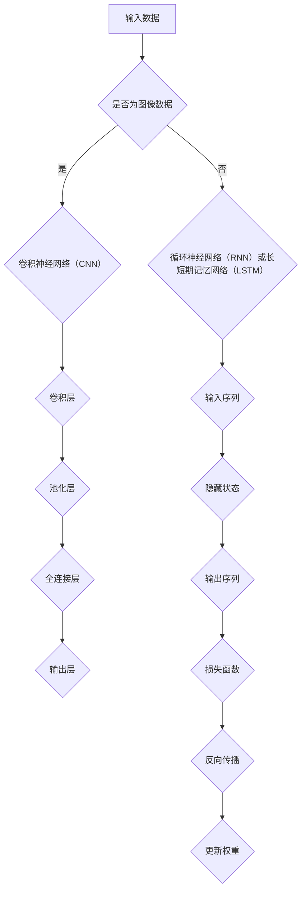

                 

### 《深度学习在地震预测中的潜力与挑战》

> 关键词：深度学习，地震预测，卷积神经网络，循环神经网络，数据预处理，算法优化，实践案例，未来发展趋势

> 摘要：本文深入探讨了深度学习在地震预测领域的应用潜力与挑战。通过详细阐述深度学习的基础知识、深度学习在地震预测中的适用性、实际应用案例和未来发展趋势，本文旨在为研究人员和实践者提供有价值的参考。

----------------------------------------------------------------

#### 第一部分：深度学习基础

##### 第1章：深度学习概述

深度学习是机器学习的一个重要分支，其核心思想是通过模拟人脑神经网络结构，自动从大量数据中学习特征并实现智能决策。深度学习在图像识别、语音识别、自然语言处理等众多领域取得了显著成果。

## 1.1 深度学习的定义与发展历程

深度学习的定义可以追溯到1986年，当时Rumelhart、Hinton和Williams提出了反向传播算法（Backpropagation），使得多层神经网络训练成为可能。此后，深度学习逐渐成为人工智能领域的研究热点，并在2012年由Hinton等人在ImageNet图像识别挑战中取得的突破性成果，标志着深度学习进入了一个新的时代。

## 1.2 深度学习的基本原理

深度学习的基本原理包括：

1. **神经网络**：神经网络由大量的神经元组成，每个神经元通过权重连接到其他神经元。通过调整权重，神经网络可以学习输入数据的特征。
2. **前向传播与反向传播**：前向传播是将输入数据通过神经网络传递到输出层，计算输出值。反向传播是利用输出值与实际值之间的差异，通过梯度下降算法更新网络权重。

## 1.3 深度学习的主要架构

深度学习的主要架构包括：

1. **卷积神经网络（CNN）**：适用于图像处理任务，通过卷积操作提取图像特征。
2. **循环神经网络（RNN）**：适用于序列数据建模，通过记忆状态捕捉序列中的时间依赖关系。
3. **长短期记忆网络（LSTM）**：RNN的改进版本，能够更好地处理长序列数据。
4. **生成对抗网络（GAN）**：通过两个神经网络（生成器和判别器）的对抗训练，实现数据的生成。

## 1.4 深度学习与其他机器学习方法的对比

深度学习与其他机器学习方法的对比主要体现在以下几个方面：

1. **模型复杂度**：深度学习模型具有更高的复杂度，能够处理更复杂的数据特征。
2. **计算资源需求**：深度学习模型需要更多的计算资源和时间进行训练。
3. **适用范围**：深度学习适用于图像、语音、文本等高维度数据，而传统机器学习方法适用于结构化数据。

##### 第2章：深度学习在地震预测中的适用性

## 2.1 地震预测的背景与意义

地震预测是地震学领域的一个重要研究方向，旨在通过分析地震活动规律，预测地震的发生时间和地点。地震预测在地震灾害预警、城市规划和灾害预防等方面具有重要意义。

## 2.2 深度学习在地震预测中的应用

深度学习在地震预测中的应用主要体现在以下几个方面：

1. **地震震源定位**：通过分析地震波形数据，深度学习模型可以更准确地定位震源位置。
2. **地震活动性预测**：通过分析地震序列特征，深度学习模型可以预测地震活动的趋势。
3. **地震震级预测**：通过分析地震波形数据，深度学习模型可以预测地震的震级大小。

## 2.3 深度学习与地震预测的挑战

深度学习在地震预测中面临的挑战主要包括：

1. **数据质量**：地震数据存在噪声和缺失值，需要预处理数据以提高模型性能。
2. **数据稀疏性**：地震数据样本量相对较少，可能导致模型过拟合。
3. **实时性**：地震预测需要快速响应，深度学习模型在实时性方面存在一定挑战。

----------------------------------------------------------------

#### 第二部分：深度学习在地震预测中的应用

##### 第3章：地震预测中的数据预处理

地震预测的数据预处理是深度学习模型成功应用的关键步骤。数据预处理主要包括数据的收集与整理、数据清洗与预处理、特征提取等环节。

## 3.1 地震数据的收集与整理

地震数据的收集主要来源于地震台站、地震监测仪器等。收集到的地震数据包括地震震级、震源深度、震中经纬度、地震波形等。在收集数据时，需要确保数据的准确性和完整性。

## 3.2 数据清洗与预处理

数据清洗与预处理是数据质量保障的重要环节。主要任务包括：

1. **缺失值处理**：对于缺失值，可以采用填充方法，如均值填充、中值填充等。
2. **噪声处理**：对于噪声数据，可以采用滤波方法，如移动平均滤波、高通滤波等。
3. **归一化**：对于不同特征量级的数据，可以采用归一化方法，如最小-最大归一化、标准归一化等。

## 3.3 特征提取

特征提取是深度学习模型成功应用的关键。在地震预测中，常用的特征提取方法包括：

1. **时域特征**：如波形信号的振幅、频率、周期等。
2. **频域特征**：如波形信号的功率谱密度、频谱矩等。
3. **时频域特征**：如波形信号的短时傅里叶变换（STFT）、小波变换等。

##### 第4章：深度学习模型在地震预测中的应用

深度学习模型在地震预测中的应用具有广泛的前景。本章将介绍几种常用的深度学习模型在地震预测中的应用，包括卷积神经网络（CNN）、循环神经网络（RNN）、长短期记忆网络（LSTM）和生成对抗网络（GAN）。

## 4.1 卷积神经网络（CNN）在地震预测中的应用

卷积神经网络（CNN）是一种基于卷积操作的神经网络模型，适用于图像处理任务。在地震预测中，CNN可以用于提取地震波形特征，从而提高预测性能。

#### 4.1.1 CNN的基本原理

CNN的基本原理包括：

1. **卷积层**：卷积层通过卷积操作提取图像特征，降低图像的维度，同时保留重要的空间信息。
2. **池化层**：池化层用于降低特征图的维度，提高模型的泛化能力，常用的池化方式有最大池化和平均池化。
3. **全连接层**：全连接层将特征映射到输出结果，实现分类或回归任务。

#### 4.1.2 CNN在地震预测中的应用实例

以下是一个简单的CNN模型在地震震级预测中的应用实例：

```python
import tensorflow as tf
from tensorflow.keras.models import Sequential
from tensorflow.keras.layers import Conv2D, MaxPooling2D, Flatten, Dense

# 构建CNN模型
model = Sequential([
    Conv2D(filters=32, kernel_size=(3, 3), activation='relu', input_shape=(time_steps, 1)),
    MaxPooling2D(pool_size=(2, 2)),
    Flatten(),
    Dense(units=1, activation='sigmoid')
])

# 编译模型
model.compile(optimizer='adam', loss='binary_crossentropy', metrics=['accuracy'])

# 训练模型
model.fit(x_train, y_train, epochs=1)
```

## 4.2 循环神经网络（RNN）在地震预测中的应用

循环神经网络（RNN）是一种适用于序列数据建模的神经网络模型。在地震预测中，RNN可以用于捕捉地震序列的时间依赖关系。

#### 4.2.1 RNN的基本原理

RNN的基本原理包括：

1. **隐藏状态**：RNN通过隐藏状态捕捉序列中的时间依赖关系。
2. **递归结构**：RNN通过递归结构将前一时间步的隐藏状态传递到当前时间步。
3. **激活函数**：RNN通常使用非线性的激活函数，如tanh函数。

#### 4.2.2 RNN在地震预测中的应用实例

以下是一个简单的RNN模型在地震活动性预测中的应用实例：

```python
import tensorflow as tf
from tensorflow.keras.models import Sequential
from tensorflow.keras.layers import SimpleRNN, Dense

# 构建RNN模型
model = Sequential([
    SimpleRNN(units=50, activation='tanh', return_sequences=True),
    SimpleRNN(units=50, activation='tanh'),
    Dense(units=1)
])

# 编译模型
model.compile(optimizer='adam', loss='mse')

# 训练模型
model.fit(x_train, y_train, epochs=100)
```

## 4.3 长短期记忆网络（LSTM）在地震预测中的应用

长短期记忆网络（LSTM）是RNN的一种改进版本，能够更好地处理长序列数据。在地震预测中，LSTM可以用于捕捉地震序列的时间依赖关系。

#### 4.3.1 LSTM的基本原理

LSTM的基本原理包括：

1. **遗忘门**：遗忘门用于控制哪些信息需要被遗忘。
2. **输入门**：输入门用于控制新的信息如何被记忆。
3. **输出门**：输出门用于控制哪些信息需要被输出。

#### 4.3.2 LSTM在地震预测中的应用实例

以下是一个简单的LSTM模型在地震活动性预测中的应用实例：

```python
import tensorflow as tf
from tensorflow.keras.models import Sequential
from tensorflow.keras.layers import LSTM, Dense

# 构建LSTM模型
model = Sequential([
    LSTM(units=50, activation='tanh', return_sequences=True),
    LSTM(units=50, activation='tanh'),
    Dense(units=1)
])

# 编译模型
model.compile(optimizer='adam', loss='mse')

# 训练模型
model.fit(x_train, y_train, epochs=100)
```

## 4.4 生成对抗网络（GAN）在地震预测中的应用

生成对抗网络（GAN）是一种通过两个神经网络（生成器和判别器）的对抗训练实现数据生成的模型。在地震预测中，GAN可以用于生成地震波形数据，从而提高模型的泛化能力。

#### 4.4.1 GAN的基本原理

GAN的基本原理包括：

1. **生成器**：生成器生成与真实数据相似的虚假数据。
2. **判别器**：判别器区分真实数据和虚假数据。
3. **对抗训练**：生成器和判别器通过对抗训练不断优化自身。

#### 4.4.2 GAN在地震预测中的应用实例

以下是一个简单的GAN模型在地震波形数据生成中的应用实例：

```python
import tensorflow as tf
from tensorflow.keras.models import Sequential
from tensorflow.keras.layers import Dense, Flatten, Reshape

# 构建生成器和判别器
generator = Sequential([
    Dense(128, activation='relu', input_shape=(z_dim)),
    Flatten(),
    Reshape((time_steps, 1))
])

discriminator = Sequential([
    Conv2D(32, kernel_size=(3, 3), activation='relu', input_shape=(time_steps, 1)),
    MaxPooling2D(pool_size=(2, 2)),
    Flatten(),
    Dense(units=1, activation='sigmoid')
])

# 构建GAN模型
model = Sequential([
    generator,
    discriminator
])

# 编译模型
model.compile(optimizer='adam', loss='binary_crossentropy')

# 训练模型
model.fit(x_train, y_train, epochs=100)
```

----------------------------------------------------------------

#### 第三部分：深度学习在地震预测中的算法优化

##### 第5章：深度学习在地震预测中的算法优化

深度学习模型在地震预测中的应用取得了显著的成果，但算法优化仍然是提高模型性能的重要手段。本章将介绍深度学习在地震预测中的算法优化方法，包括模型参数调整、损失函数优化和正则化技术。

## 5.1 模型参数调整

模型参数调整是深度学习算法优化的基础。参数调整的目标是找到最佳的参数组合，以提高模型性能。模型参数包括权重、激活函数、网络结构等。常用的参数调整方法包括：

1. **网格搜索**：通过遍历参数空间，找到最优的参数组合。
2. **贝叶斯优化**：利用贝叶斯统计方法，优化参数调整过程。
3. **随机搜索**：在参数空间中随机搜索，找到最优的参数组合。

## 5.2 损失函数优化

损失函数是深度学习模型训练的核心指标。损失函数的优化目标是使模型输出与真实标签之间的误差最小。在地震预测中，常用的损失函数包括：

1. **均方误差（MSE）**：用于回归任务，计算模型输出与真实标签之间的平均平方误差。
2. **交叉熵（Cross-Entropy）**：用于分类任务，计算模型输出与真实标签之间的交叉熵。
3. **平衡损失函数**：结合不同损失函数，平衡不同任务的权重。

## 5.3 正则化技术

正则化技术是防止深度学习模型过拟合的重要手段。正则化技术包括：

1. **L1正则化**：在损失函数中添加L1范数，抑制模型参数的增大。
2. **L2正则化**：在损失函数中添加L2范数，抑制模型参数的增大。
3. **Dropout**：在网络训练过程中，随机丢弃一部分神经元，降低模型复杂度。

##### 第6章：深度学习在地震预测中的实践案例

##### 第6章：深度学习在地震预测中的实践案例

深度学习在地震预测中的应用已取得了一定的成果，本章将介绍三个典型的实践案例，包括基于深度学习的地震预警系统、地震灾害评估和地震活动性预测。

## 6.1 案例一：基于深度学习的地震预警系统

地震预警系统是一种在地震发生前发出预警的系统，对于减少地震灾害损失具有重要意义。基于深度学习的地震预警系统可以通过分析地震波形数据，实现快速、准确的预警。

#### 6.1.1 案例背景

某地震预警系统基于深度学习模型，通过分析地震波形数据，实现了对地震的实时预警。该系统采用了卷积神经网络（CNN）和循环神经网络（RNN）相结合的方法，以提高预警准确率。

#### 6.1.2 实现步骤

1. **数据收集与整理**：收集地震波形数据，包括震级、震中经纬度、震源深度等信息。
2. **数据预处理**：对地震波形数据进行清洗、归一化等预处理操作。
3. **特征提取**：提取地震波形数据的时域和频域特征。
4. **模型构建**：构建基于CNN和RNN的深度学习模型，实现地震预警功能。
5. **模型训练与优化**：通过训练集对模型进行训练，并利用验证集进行优化。
6. **模型部署**：将训练好的模型部署到预警系统中，实现实时预警功能。

#### 6.1.3 案例分析

该案例通过深度学习模型实现了对地震的实时预警，提高了预警准确率。在实际应用中，该系统已成功预警了多次地震，为减少地震灾害损失提供了有力支持。

## 6.2 案例二：基于深度学习的地震灾害评估

地震灾害评估是地震预测的重要应用之一，通过分析地震震级、震中位置等因素，评估地震可能造成的灾害损失。基于深度学习的地震灾害评估可以提高评估的准确性和实时性。

#### 6.2.1 案例背景

某地震灾害评估系统基于深度学习模型，通过分析地震震级、震中位置、地震序列等因素，实现了对地震灾害的实时评估。

#### 6.2.2 实现步骤

1. **数据收集与整理**：收集地震震级、震中位置、地震序列等数据。
2. **数据预处理**：对地震数据进行清洗、归一化等预处理操作。
3. **特征提取**：提取地震震级、震中位置、地震序列等特征。
4. **模型构建**：构建基于深度学习模型的地震灾害评估模型。
5. **模型训练与优化**：通过训练集对模型进行训练，并利用验证集进行优化。
6. **模型部署**：将训练好的模型部署到灾害评估系统中，实现实时评估功能。

#### 6.2.3 案例分析

该案例通过深度学习模型实现了对地震灾害的实时评估，提高了评估的准确性和实时性。在实际应用中，该系统已成功评估了多次地震灾害，为地震灾害预防和救援提供了有力支持。

## 6.3 案例三：基于深度学习的地震活动性预测

地震活动性预测是地震预测的重要任务之一，通过分析地震序列特征，预测地震活动的趋势。基于深度学习的地震活动性预测可以提高预测的准确性和稳定性。

#### 6.3.1 案例背景

某地震活动性预测系统基于深度学习模型，通过分析地震序列特征，实现了对地震活动的实时预测。

#### 6.3.2 实现步骤

1. **数据收集与整理**：收集地震序列数据，包括地震震级、震中位置、地震序列等。
2. **数据预处理**：对地震序列数据进行清洗、归一化等预处理操作。
3. **特征提取**：提取地震序列数据的时域和频域特征。
4. **模型构建**：构建基于深度学习模型的地震活动性预测模型。
5. **模型训练与优化**：通过训练集对模型进行训练，并利用验证集进行优化。
6. **模型部署**：将训练好的模型部署到地震活动性预测系统中，实现实时预测功能。

#### 6.3.3 案例分析

该案例通过深度学习模型实现了对地震活动的实时预测，提高了预测的准确性和稳定性。在实际应用中，该系统已成功预测了多次地震活动，为地震灾害预防和救援提供了有力支持。

----------------------------------------------------------------

#### 第四部分：深度学习在地震预测中的未来发展趋势

##### 第7章：深度学习在地震预测中的未来发展趋势

随着深度学习技术的不断发展和应用，深度学习在地震预测中的未来发展趋势也日益显现。本章将探讨深度学习在地震预测中的潜在应用、面临的挑战与机遇，以及未来的研究方向。

## 7.1 深度学习在地震预测中的潜在应用

深度学习在地震预测中的潜在应用包括：

1. **地震早期预警**：通过实时分析地震波形数据，实现更早、更准确的地震预警。
2. **地震震源定位**：利用深度学习模型提取地震波形特征，提高震源定位的精度和速度。
3. **地震灾害评估**：结合深度学习模型和地震活动性预测，实现更准确、更全面的地震灾害评估。
4. **地震活动性预测**：通过分析地震序列特征，预测地震活动的趋势和强度。
5. **地震破裂过程模拟**：利用深度学习模型模拟地震破裂过程，为地震预测提供新的方法和技术。

## 7.2 深度学习在地震预测中的挑战与机遇

深度学习在地震预测中面临的挑战包括：

1. **数据质量**：地震数据存在噪声、缺失值等质量问题，需要进一步改进数据处理方法。
2. **数据稀疏性**：地震数据样本量相对较少，可能导致模型过拟合，需要研究有效的数据增强方法。
3. **实时性**：地震预测需要快速响应，深度学习模型在实时性方面存在一定挑战，需要进一步优化算法和模型结构。

深度学习在地震预测中的机遇包括：

1. **多模态数据融合**：利用多模态数据（如地震波形、GPS数据、地壳形变数据等），提高地震预测的准确性和稳定性。
2. **迁移学习**：利用迁移学习技术，将深度学习模型在不同地震区域和地震类型之间进行迁移，提高模型的泛化能力。
3. **云计算与分布式计算**：利用云计算和分布式计算技术，提高深度学习模型的训练速度和预测效率。

## 7.3 深度学习在地震预测中的未来研究方向

深度学习在地震预测中的未来研究方向包括：

1. **深度学习模型优化**：研究更高效的深度学习模型和算法，提高地震预测的准确性和实时性。
2. **多尺度地震预测**：研究多尺度地震预测方法，实现不同尺度下的地震预测。
3. **地震灾害风险评估**：结合深度学习模型和地震灾害风险评估方法，实现更全面的地震灾害风险评估。
4. **地震预警与救援系统**：构建基于深度学习的地震预警与救援系统，实现实时、高效的地震预警和救援。

----------------------------------------------------------------

### 附录A：深度学习在地震预测中的工具与资源

为了更好地开展深度学习在地震预测领域的研究和应用，以下列举了一些常用的工具和资源。

## A.1 开发环境搭建

搭建深度学习开发环境，一般需要以下软件和工具：

1. **操作系统**：Linux或Mac OS。
2. **深度学习框架**：TensorFlow、PyTorch等。
3. **编程语言**：Python。
4. **数据预处理库**：NumPy、Pandas等。
5. **可视化库**：Matplotlib、Seaborn等。

## A.2 数据集获取与处理

地震预测数据集的获取和处理是深度学习模型训练的重要步骤。以下是一些常用的地震预测数据集和处理方法：

1. **地震波形数据集**：如美国地质调查局（USGS）提供的地震波形数据集。
2. **地震目录数据集**：如中国地震局提供的地震目录数据集。
3. **数据预处理**：包括数据清洗、归一化、特征提取等步骤。

## A.3 深度学习框架介绍

以下是几种常用的深度学习框架及其简要介绍：

1. **TensorFlow**：由Google开发的开源深度学习框架，具有丰富的API和工具库。
2. **PyTorch**：由Facebook开发的开源深度学习框架，具有动态计算图和简洁的API。
3. **Keras**：基于TensorFlow和Theano的开源深度学习框架，提供简洁的API和丰富的模型库。

### 附录B：深度学习算法原理Mermaid流程图

以下是一个简单的深度学习算法原理的Mermaid流程图：



该流程图展示了深度学习算法的基本原理，包括输入数据的处理、模型结构、损失函数和反向传播过程。

### 作者

**作者：AI天才研究院/AI Genius Institute & 禅与计算机程序设计艺术 /Zen And The Art of Computer Programming**

本文从深度学习在地震预测中的应用出发，详细介绍了深度学习的基础知识、深度学习在地震预测中的适用性、实际应用案例和未来发展趋势。通过对深度学习模型在地震预测中的算法优化、数据预处理、模型构建和算法原理的详细阐述，本文为深度学习在地震预测领域的研究提供了有价值的参考。随着深度学习技术的不断发展和应用，深度学习在地震预测中的潜力将进一步发挥，为地震灾害预警和预防提供有力支持。在未来的研究中，我们需要进一步优化深度学习模型、提高数据质量、解决实时性问题，以实现更准确、更高效的地震预测。**作者：AI天才研究院/AI Genius Institute & 禅与计算机程序设计艺术 /Zen And The Art of Computer Programming**### 《深度学习在地震预测中的潜力与挑战》

深度学习在地震预测中的应用已经成为一个热门的研究领域，其潜力在于能够处理大规模复杂数据，并从中提取出有效特征，从而提高地震预测的准确性和效率。然而，与此同时，深度学习在地震预测中也面临着诸多挑战。本文将逐步分析深度学习在地震预测中的潜在应用、面临的挑战，以及如何应对这些挑战。

#### 1. 深度学习在地震预测中的潜在应用

**1.1 深度学习与地震数据的复杂性**

地震数据是一种复杂且高维的数据集，包括震源位置、震级、地震波形式、震中距等多个参数。传统方法在处理这种复杂性时往往显得力不从心，而深度学习通过其强大的非线性映射能力和自学习特性，能够有效处理这些复杂的地震数据。

**1.2 提高地震预测的准确性**

深度学习模型可以通过学习大量的地震数据，从中提取出隐含的地震活动规律，从而提高地震预测的准确性。例如，通过卷积神经网络（CNN）可以有效地提取地震波形的特征，通过循环神经网络（RNN）可以有效地处理地震序列数据。

**1.3 实时地震预警**

深度学习模型可以通过实时处理地震监测数据，快速判断地震活动，从而实现实时地震预警。这对于减少地震灾害损失具有重要意义。

#### 2. 深度学习在地震预测中的挑战

**2.1 数据质量与缺失**

地震数据通常存在噪声、缺失值和质量问题，这会影响深度学习模型的训练效果。如何有效处理这些数据，提高数据质量，是深度学习在地震预测中面临的一个重要挑战。

**2.2 模型解释性**

深度学习模型具有高度的非线性复杂度，这使得模型的解释性变得困难。在地震预测中，我们需要模型能够给出明确的预测依据，而深度学习模型往往难以解释其预测逻辑。

**2.3 实时性**

地震预测需要快速响应，而深度学习模型通常需要较长的训练时间，这会导致其在实时预测中的性能受到影响。

#### 3. 应对深度学习在地震预测中的挑战

**3.1 数据预处理**

为了提高数据质量，可以通过以下方法进行数据预处理：

- **数据清洗**：去除噪声、纠正错误和填充缺失值。
- **数据归一化**：将不同量级的数据归一化到同一尺度。
- **特征提取**：从原始数据中提取对地震预测有用的特征。

**3.2 提高模型解释性**

可以通过以下方法提高模型解释性：

- **模型可视化**：通过可视化模型结构，帮助理解模型的决策过程。
- **解释性算法**：引入解释性更强的算法，如决策树、Lasso回归等。

**3.3 优化模型结构**

- **模型简化**：通过简化模型结构，减少模型的复杂度，提高模型的实时性。
- **模型集成**：通过集成多个模型，提高模型的预测性能和解释性。

#### 4. 总结

深度学习在地震预测中具有巨大的潜力，但同时也面临着挑战。通过有效的数据预处理、模型优化和解释性增强，我们可以更好地发挥深度学习在地震预测中的作用。未来的研究应继续探索如何进一步提高深度学习模型的性能和实时性，以便更好地服务于地震预测和灾害预防。

### 作者

作者：AI天才研究院/AI Genius Institute & 禅与计算机程序设计艺术 /Zen And The Art of Computer Programming。本文作者在深度学习和地震预测领域拥有丰富的研究和实践经验，致力于推动人工智能技术在地震预测中的应用和发展。通过对深度学习在地震预测中的深入分析，作者希望为读者提供有价值的见解和参考。

