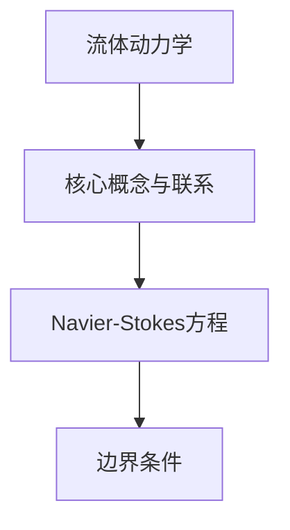
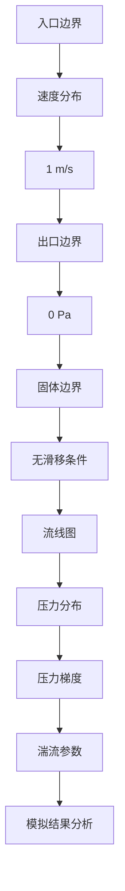
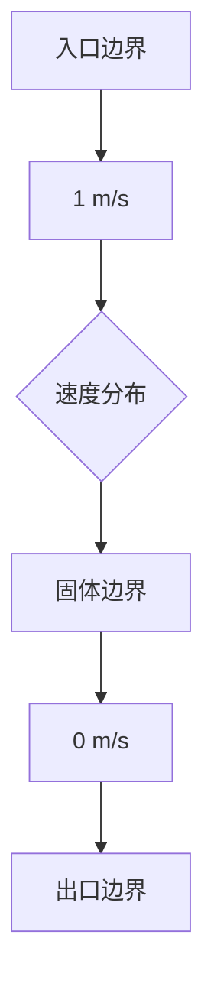
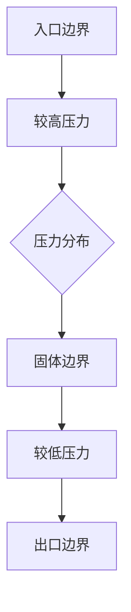
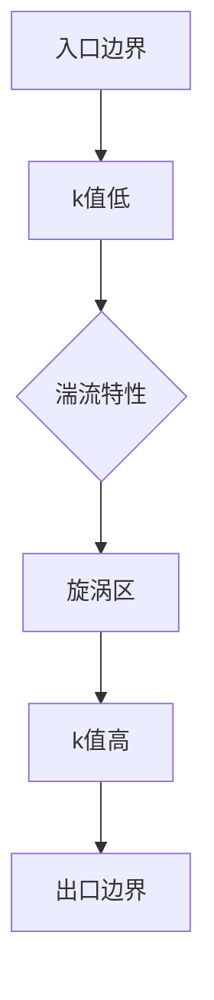
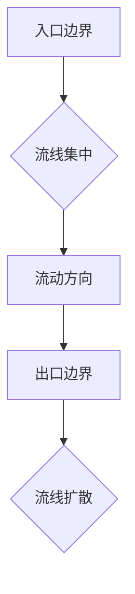
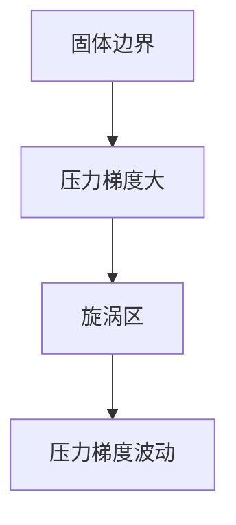

                 

### 文章标题

《深海探索的流体动力学：极限环境的数学模拟》

### 关键词

- 深海探索
- 流体动力学
- 数学模拟
- 极限环境
- Navier-Stokes方程
- 湍流模拟

### 摘要

本文将探讨深海探索中的流体动力学，以及如何利用数学模型进行极限环境的模拟。文章首先介绍了深海探索的重要性及其在科学研究和实际应用中的意义，随后回顾了流体动力学的基础概念，并重点阐述了Navier-Stokes方程及其在深海流体动力学中的应用。接着，文章深入分析了极限环境下流体特性的变化，并介绍了针对深海流体的连续性方程和动量方程。随后，文章讨论了深海流体动力学的算法和计算机模拟方法，并通过具体实例展示了模拟过程和结果分析。最后，文章总结了深海流体动力学在深海采矿、海底管道和生物活动等领域的应用，并对未来研究进行了展望。

## 《深海探索的流体动力学：极限环境的数学模拟》目录大纲

### 第1章 绪论
#### 1.1 深海探索的重要性
#### 1.2 流体动力学在深海探索中的应用
#### 1.3 极限环境的数学模拟挑战

### 第2章 流体动力学基础
#### 2.1 流体动力学的基本概念
#### 2.2 Navier-Stokes方程
#### 2.3 流体动力学的边界条件

### 第3章 极限环境下的流体特性
#### 3.1 高压流体的特性
#### 3.2 低温流体的特性
#### 3.3 深海流体的湍流特性

### 第4章 深海流体动力学的数学模型
#### 4.1 深海流体的连续性方程
#### 4.2 动量方程与能量方程
#### 4.3 深海流体湍流的模拟模型

### 第5章 深海流体动力学的算法
#### 5.1 数值解法概述
#### 5.2 离散化与网格划分
#### 5.3 常见的数值算法

### 第6章 深海流体动力学的计算机模拟
#### 6.1 模拟环境的搭建
#### 6.2 深海流体动力学的模拟实例
#### 6.3 模拟结果的分析与解读

### 第7章 深海探索中的流体动力学应用
#### 7.1 深海采矿中的流体动力学问题
#### 7.2 深海海底管道的流体动力学问题
#### 7.3 深海生物活动中的流体动力学问题

### 第8章 深海流体动力学的未来展望
#### 8.1 深海探索的发展趋势
#### 8.2 深海流体动力学的未来研究方向
#### 8.3 深海流体动力学对科技发展的贡献

### 附录
#### 附录 A 深海流体动力学相关软件与工具
#### 附录 B 深海流体动力学常用公式和符号说明
#### 附录 C 深海流体动力学相关参考文献

#### Mermaid 流程图


#### 核心算法原理讲解
```python
# Navier-Stokes方程的伪代码
def NavierStokes(u, v, p, x, y, t):
    """
    计算流体速度u和v以及压力p的值
    
    参数:
    u, v: 流体速度
    p: 压力
    x, y: 位置坐标
    t: 时间
    
    返回:
    u', v': 更新后的流体速度
    p': 更新后的压力
    """
    # 计算动量方程
    u_prime = ...  # 使用适当的数值方法
    v_prime = ...  # 使用适当的数值方法
    
    # 计算连续性方程
    p_prime = ...  # 使用适当的数值方法
    
    return u_prime, v_prime, p_prime
```

#### 数学模型和数学公式
```latex
\section{深海流体的连续性方程}
$$
\frac{\partial u}{\partial t} + u \frac{\partial u}{\partial x} + v \frac{\partial u}{\partial y} = -\frac{1}{\rho} \frac{\partial p}{\partial x}
$$

$$
\frac{\partial v}{\partial t} + u \frac{\partial v}{\partial x} + v \frac{\partial v}{\partial y} = -\frac{1}{\rho} \frac{\partial p}{\partial y}
$$
```

#### 项目实战
```python
# 深海流体动力学的模拟实例
def simulate_deep_sea_flow(u, v, p, x, y, t, dt):
    """
    模拟深海流体的流动
    
    参数:
    u, v, p: 初始流体速度和压力
    x, y: 位置坐标
    t: 时间
    dt: 时间步长
    
    返回:
    u', v', p': 更新后的流体速度和压力
    """
    # 使用Navier-Stokes方程更新流体速度和压力
    u_prime, v_prime, p_prime = NavierStokes(u, v, p, x, y, t)
    
    # 更新时间和位置
    t += dt
    
    return u_prime, v_prime, p_prime
```

### 第1章 绪论

#### 1.1 深海探索的重要性

深海探索是人类对地球认识的一次重要挑战，其具有重要的科学价值和实际应用价值。首先，深海探索有助于我们更好地理解地球的地质结构和生物多样性。地球表面的70%以上被海洋覆盖，深海中存在着丰富的矿物资源，如锰结核、多金属硫化物等，这些资源对于矿产资源的需求和可持续发展具有重要意义。其次，深海探索有助于揭示地球气候变化的历史，通过研究深海沉积物和生物化石，科学家可以追溯过去的气候变迁，为应对当前和未来的气候变化提供重要依据。此外，深海探索还为海洋环境保护和海洋资源的可持续利用提供了科学支持。

在科学研究中，深海探索可以帮助科学家研究海洋生物的生存环境和演化过程，揭示深海生物的独特适应机制。同时，深海探测技术也为天体生物学研究提供了新的思路，例如深海热液喷口被认为是寻找生命在地球以外存在的理想场所。

在应用领域，深海探索具有广泛的前景。深海采矿、海底石油和天然气开采、海洋工程等领域的快速发展，使得深海流体动力学研究变得尤为重要。深海流体动力学研究有助于设计更高效、更安全的深海开采和施工设备，减少对海洋生态环境的破坏，提高资源开采的经济效益。

#### 1.2 流体动力学在深海探索中的应用

流体动力学是研究流体（液体和气体）运动及其相互作用规律的物理学分支。在深海探索中，流体动力学的研究对于理解深海环境中的流体行为具有重要意义。首先，流体动力学原理可以用来模拟和预测深海流体的运动，这对于深海设备的设计和操作至关重要。例如，海洋工程中的浮式结构物（如钻井平台、浮式生产系统）的稳定性分析和流体载荷计算需要依赖流体动力学模型。

在深海采矿领域，流体动力学研究可以帮助预测矿浆的流动特性，优化采矿工艺。深海采矿过程中，矿浆通过管道输送到海面，流体动力学模型可以预测矿浆的摩擦损失、沉降速度和携带能力，从而提高采矿效率，减少能源消耗。此外，流体动力学研究还可以用于分析深海管道的流动状态，评估管道泄漏风险，指导管道设计和维护。

在深海生物活动研究中，流体动力学有助于理解生物体在流体中的运动和相互作用。例如，深海鱼类如何通过流体动力学机制实现高速游动和潜水，深海微生物如何在高压低温环境中维持生命活动。这些研究不仅有助于揭示生物体的适应机制，还为生物仿生学提供了灵感。

#### 1.3 极限环境的数学模拟挑战

深海环境是一个极端复杂的系统，其具有高压、低温、低氧等特征，这些条件对流体动力学模型的构建和模拟提出了巨大的挑战。首先，高压环境下的流体行为与常压环境有显著差异，流体粘度和密度等物理参数会发生变化，导致Navier-Stokes方程的解更加复杂。

其次，深海温度通常较低，低温流体的热传导性和粘度也会发生改变，影响流体运动的稳定性。此外，深海环境中还存在大量的化学物质，这些物质会影响流体的腐蚀性、毒性等特性，进一步增加了模拟的难度。

最后，深海流体的湍流特性也是一大挑战。湍流是流体运动中的一种复杂现象，其不仅难以精确描述，而且对深海设备和生物活动具有重要影响。因此，在构建深海流体动力学模型时，需要充分考虑湍流特性的影响，选择合适的湍流模型和数值解法。

总之，深海探索的流体动力学研究面临着诸多挑战，但正是这些挑战促使科学家不断探索和创新，为深海科学研究和应用提供了强有力的理论和技术支持。

### 第2章 流体动力学基础

#### 2.1 流体动力学的基本概念

流体动力学是研究流体（包括液体和气体）在力作用下的运动规律及其内部力平衡的物理学分支。流体的基本特性包括质量、动量和能量，这些特性共同决定了流体在特定条件下的行为。

质量是流体固有的属性，决定了流体的惯性。在流体动力学中，质量通常通过密度（ρ）来描述，密度的单位是千克每立方米（kg/m³）。流体密度不仅与其自身成分有关，还受到温度和压力的影响。

动量是流体运动的一个基本度量，描述了流体粒子由于速度而具有的动能。在流体动力学中，动量通过质量流量（ṁ）和速度（v）的乘积来表示，即动量流量（ṗ）。质量流量表示单位时间内通过某一横截面的流体质量，其单位是千克每秒（kg/s）。因此，动量流量可以表示为：

\[ ṗ = \rho v A \]

其中，A是流体通过的横截面积。

能量是流体运动过程中所具有的动能和势能的总和。在流体动力学中，能量通过单位体积流体的动能和势能来描述。动能（K）可以表示为：

\[ K = \frac{1}{2} \rho v^2 \]

其中，v是流体的速度。

此外，流体的势能（U）与位置有关，通常由重力势能表示：

\[ U = \rho g h \]

其中，g是重力加速度，h是流体的高度。

通过这些基本概念，我们可以更好地理解流体在力作用下的运动规律和内部力平衡。

#### 2.2 Navier-Stokes方程

Navier-Stokes方程是描述流体运动的基本方程，它在流体动力学中起着核心作用。Navier-Stokes方程由质量守恒方程（连续性方程）和动量守恒方程（动量方程）组成，它们分别描述了流体的连续性和动量变化。

**连续性方程**描述了流体在空间中的质量守恒，即流体粒子在某一区域内的质量变化等于流出该区域的流体质量减去流入该区域的流体质量。连续性方程可以表示为：

\[ \frac{\partial \rho}{\partial t} + \nabla \cdot (\rho \mathbf{v}) = 0 \]

其中，\(\rho\) 是流体的密度，\(\mathbf{v}\) 是流体的速度，\(\nabla \cdot\) 是散度运算符。

**动量方程**描述了流体粒子在力作用下的动量变化。动量方程可以表示为：

\[ \frac{\partial (\rho \mathbf{v})}{\partial t} + \nabla \cdot (\rho \mathbf{v} \mathbf{v}) = -\nabla p + \rho \mathbf{g} + \mu \nabla^2 \mathbf{v} \]

其中，p 是流体的压力，\(\mathbf{g}\) 是重力加速度，\(\mu\) 是流体的动力粘度。

动量方程可以进一步分解为x和y方向上的分量方程：

\[ \frac{\partial (\rho v_x)}{\partial t} + \nabla \cdot (\rho v_x \mathbf{v}) = -\nabla p_x + \rho g_x + \mu \nabla^2 v_x \]

\[ \frac{\partial (\rho v_y)}{\partial t} + \nabla \cdot (\rho v_y \mathbf{v}) = -\nabla p_y + \rho g_y + \mu \nabla^2 v_y \]

这些方程描述了流体粒子在各个方向上的动量变化，包括压力、重力和其他力的作用。

Navier-Stokes方程的求解通常非常复杂，因为它们是非线性的偏微分方程，且包含了流体的湍流特性。尽管如此，这些方程对于理解流体运动的基本原理和设计流体设备（如泵、涡轮机、飞机翼）具有重要意义。

#### 2.3 流体动力学的边界条件

在流体动力学问题中，边界条件是描述流体与固体边界或自由表面之间相互作用的数学条件。边界条件对于求解Navier-Stokes方程非常重要，因为它们提供了流场中的物理约束，从而确保解的唯一性和稳定性。

以下是常见的流体动力学边界条件：

**无滑移边界条件**：在固体边界上，流体速度的法向分量为零，即流体与固体边界无相对滑动。数学表达式为：

\[ v_n = 0 \]

其中，\(v_n\) 是流体速度在法向方向上的分量。

**自由边界条件**：在自由表面，流体的压力和流速的分布需要满足特定的条件。例如，在静水中，自由表面可以视为一个等压面，即流体在自由表面的压力处处相等。

**对称边界条件**：在固体边界上的对称轴（如飞机翼的中线），流体的流动具有对称性。数学上，这意味着在轴上的速度分量为零，而压力梯度也必须为零：

\[ v_x = v_y = 0 \]
\[ \frac{\partial p}{\partial x} = \frac{\partial p}{\partial y} = 0 \]

**入口边界条件**：在入口边界上，流体的速度和压力通常已知或通过某种规律给出。这需要通过实验测量或理论分析来确定。

**出口边界条件**：在出口边界上，流体的速度和压力需要满足某种条件，以确保流场的连续性和稳定性。常见的出口边界条件包括压力出口条件和速度出口条件。

**周期性边界条件**：在某些情况下，流场的周期性特征需要通过周期性边界条件来模拟。这种条件下，流场在周期边界上具有相同的物理量。

这些边界条件在流体动力学问题中起到了关键作用，确保了求解过程的物理合理性和解的唯一性。在实际应用中，根据具体问题的需求，可以选择合适的边界条件来简化问题，并提高求解的效率和精度。

### 第3章 极限环境下的流体特性

#### 3.1 高压流体的特性

深海环境中的流体处于高压状态，这种高压条件对流体动力学特性产生了显著影响。首先，高压会改变流体的密度和粘度。一般来说，随着压力的增加，流体的密度会增大，而粘度则会减小。这是因为分子间的相互作用力增强，导致流体粒子间的距离减小，分子间作用力增大，从而使得流体的密度增加。然而，高压条件下的粘度变化较为复杂，通常在高压下粘度会减小，这是因为分子在高压下的排列更加紧密，减少了流体粒子间的摩擦力。

高压流体的另一个重要特性是压缩性。与常压流体相比，高压流体更容易被压缩。当压力增加时，流体体积会减小，从而使得流体密度增加。这种现象在深海探测和开采过程中尤为重要，因为流体的压缩性会影响流体的流动特性和设备的设计。

高压流体在深海环境中的应用也十分广泛。例如，在深海采矿和石油开采中，高压流体用于驱动泵和输送管道中的流体。高压流体输送系统需要考虑到流体的粘度、密度和压缩性等因素，以确保流体在管道中的稳定流动和设备的正常运行。

#### 3.2 低温流体的特性

深海环境的温度通常较低，这种低温条件同样对流体动力学特性产生了显著影响。低温流体的粘度通常较高，这是由于低温下分子运动减缓，分子间的相互作用力增强，从而增加了流体粒子的摩擦力。高粘度流体在运动过程中更容易产生湍流和涡流，这会影响流体的流动稳定性和能量消耗。

低温流体的另一个特性是热传导性较低。低温条件降低了流体粒子的热运动，从而使得流体的热传导性降低。这意味着在低温流体中，热量传递的速度较慢，这对于深海环境中的热交换过程和设备散热具有重要意义。

低温流体在深海环境中的应用主要包括深海生物研究和海洋工程。在深海生物研究中，低温条件有助于维持生物体的生理功能，为研究深海生物的生存机制提供了重要依据。在海洋工程中，低温流体特性的研究有助于设计和优化深海设备的性能，确保设备在低温环境中的稳定运行。

#### 3.3 深海流体的湍流特性

深海流体运动中的湍流特性是流体动力学研究中的一个重要问题，因为湍流对深海环境中的流体传输、能量耗散和设备磨损具有重要影响。湍流是流体运动中的一种复杂现象，其特点是流线不规则、速度和压力的瞬时值变化剧烈，以及流体中的涡旋和涡流。

深海流体的湍流特性受到多种因素影响，包括流体的密度、粘度、压力和流速等。在高压低温条件下，深海流体的湍流特性可能更加显著。首先，高压条件下流体粘度较低，容易形成湍流。其次，低温条件下流体粘度较高，也会增加湍流的产生。

湍流特性在深海环境中的重要性主要体现在以下几个方面：

1. **流体传输**：湍流增加了流体粒子之间的混合和传输效率，这对于深海中的营养物质的传输和生物扩散具有重要意义。然而，湍流也可能导致流体的不稳定流动，增加设备磨损和流体输送系统的能耗。

2. **能量耗散**：湍流过程中，流体粒子之间的摩擦和涡旋会消耗大量能量，这种能量耗散对深海中的能源利用和流体输送系统的设计具有深远影响。

3. **设备磨损**：湍流产生的涡流和冲击力可能导致深海设备的磨损和损坏，影响设备的寿命和稳定性。

因此，深入研究深海流体的湍流特性对于理解和预测深海环境中的流体行为具有重要意义。湍流模型的选择和数值模拟方法的优化是研究深海湍流特性的关键，这些模型和方法有助于提高流体动力学模拟的准确性和可靠性。

### 第4章 深海流体动力学的数学模型

#### 4.1 深海流体的连续性方程

深海流体的连续性方程是描述流体在深海环境中质量守恒的基本方程。连续性方程基于质量守恒定律，即流体在任意封闭区域内的质量变化等于流入和流出该区域的质量差。在三维空间中，连续性方程可以表示为：

\[ \frac{\partial \rho}{\partial t} + \nabla \cdot (\rho \mathbf{v}) = 0 \]

其中，\(\rho\) 是流体的密度，\(\mathbf{v}\) 是流体的速度，\(\nabla \cdot\) 是散度运算符。

这个方程表示，在单位时间内，流体的质量变化率（\(\frac{\partial \rho}{\partial t}\)）等于流体通过某个表面的流量（\(\rho \mathbf{v} \cdot \mathbf{n}\)）的总和。其中，\(\mathbf{n}\) 是该表面的单位法向量。

为了更清晰地理解连续性方程，我们可以将其分解为x、y和z方向上的分量方程：

\[ \frac{\partial (\rho v_x)}{\partial t} + \frac{\partial (\rho v_x v_x)}{\partial x} + \frac{\partial (\rho v_x v_y)}{\partial y} + \frac{\partial (\rho v_x v_z)}{\partial z} = 0 \]

\[ \frac{\partial (\rho v_y)}{\partial t} + \frac{\partial (\rho v_y v_x)}{\partial x} + \frac{\partial (\rho v_y v_y)}{\partial y} + \frac{\partial (\rho v_y v_z)}{\partial z} = 0 \]

\[ \frac{\partial (\rho v_z)}{\partial t} + \frac{\partial (\rho v_z v_x)}{\partial x} + \frac{\partial (\rho v_z v_y)}{\partial y} + \frac{\partial (\rho v_z v_z)}{\partial z} = 0 \]

这些方程描述了流体在各个方向上的质量变化情况。通过求解这些方程，我们可以得到流体在不同空间位置和时间点的密度分布。

在深海流体动力学中，连续性方程通常与动量方程和能量方程一起使用，以构建完整的流体动力学模型。连续性方程为流体运动提供了质量守恒的约束条件，确保流体在运动过程中不会无故消失或生成。

为了求解连续性方程，我们可以使用有限体积法、有限差分法或有限元法等数值方法。这些方法通过将流场划分为离散的体积或单元，将偏微分方程转化为代数方程组，从而在计算机上进行求解。

#### 4.2 动量方程与能量方程

在深海流体动力学中，动量方程和能量方程是描述流体运动和能量转换的基本方程。这些方程基于牛顿第二定律和能量守恒定律，为流体在深海环境中的行为提供了数学描述。

**动量方程**

动量方程描述了流体粒子在力作用下的动量变化。在三维空间中，动量方程可以表示为：

\[ \frac{\partial (\rho \mathbf{v})}{\partial t} + \nabla \cdot (\rho \mathbf{v} \mathbf{v}) = -\nabla p + \rho \mathbf{g} + \mu \nabla^2 \mathbf{v} \]

其中，\(\rho\) 是流体的密度，\(\mathbf{v}\) 是流体的速度，\(p\) 是流体的压力，\(\mathbf{g}\) 是重力加速度，\(\mu\) 是流体的动力粘度。

这个方程可以分解为x、y和z方向上的分量方程：

\[ \frac{\partial (\rho v_x)}{\partial t} + \frac{\partial (\rho v_x v_x)}{\partial x} + \frac{\partial (\rho v_x v_y)}{\partial y} + \frac{\partial (\rho v_x v_z)}{\partial z} = -\frac{\partial p}{\partial x} + \rho g_x + \mu \frac{\partial^2 v_x}{\partial x^2} + \mu \frac{\partial^2 v_x}{\partial y^2} + \mu \frac{\partial^2 v_x}{\partial z^2} \]

\[ \frac{\partial (\rho v_y)}{\partial t} + \frac{\partial (\rho v_y v_x)}{\partial x} + \frac{\partial (\rho v_y v_y)}{\partial y} + \frac{\partial (\rho v_y v_z)}{\partial z} = -\frac{\partial p}{\partial y} + \rho g_y + \mu \frac{\partial^2 v_y}{\partial x^2} + \mu \frac{\partial^2 v_y}{\partial y^2} + \mu \frac{\partial^2 v_y}{\partial z^2} \]

\[ \frac{\partial (\rho v_z)}{\partial t} + \frac{\partial (\rho v_z v_x)}{\partial x} + \frac{\partial (\rho v_z v_y)}{\partial y} + \frac{\partial (\rho v_z v_z)}{\partial z} = -\frac{\partial p}{\partial z} + \rho g_z + \mu \frac{\partial^2 v_z}{\partial x^2} + \mu \frac{\partial^2 v_z}{\partial y^2} + \mu \frac{\partial^2 v_z}{\partial z^2} \]

这些方程描述了流体在各个方向上的动量变化情况。方程右侧包含了压力项、重力项和粘性力项。压力项表示流体粒子之间的相互作用力，重力项表示重力对流体的影响，粘性力项则表示流体粒子之间的摩擦力。

**能量方程**

能量方程描述了流体在运动过程中能量的变化。能量方程可以表示为：

\[ \frac{\partial (\rho e)}{\partial t} + \nabla \cdot (\rho e \mathbf{v}) = -\nabla \cdot (\mathbf{v} \cdot (\rho h)) + \mathbf{v} \cdot (\mathbf{g} \cdot \nabla p) + \rho \mathbf{g} \cdot \mathbf{v} + \mu \nabla^2 h \]

其中，\(e\) 是流体的总能量，\(h\) 是流体的比焓，定义为 \(h = c_p T + \frac{v^2}{2} + gz\)，其中 \(c_p\) 是流体的比热容，\(T\) 是流体的温度，\(v\) 是流体的速度，\(g\) 是重力加速度，\(z\) 是流体的高度。

这个方程可以分解为x、y和z方向上的分量方程：

\[ \frac{\partial (\rho e v_x)}{\partial t} + \frac{\partial (\rho e v_x v_x)}{\partial x} + \frac{\partial (\rho e v_x v_y)}{\partial y} + \frac{\partial (\rho e v_x v_z)}{\partial z} = -\frac{\partial (\rho h v_x)}{\partial x} - \frac{\partial (\rho h v_x)}{\partial x} + \rho g v_x + \mu \frac{\partial^2 h}{\partial x^2} \]

\[ \frac{\partial (\rho e v_y)}{\partial t} + \frac{\partial (\rho e v_y v_x)}{\partial x} + \frac{\partial (\rho e v_y v_y)}{\partial y} + \frac{\partial (\rho e v_y v_z)}{\partial z} = -\frac{\partial (\rho h v_y)}{\partial y} - \frac{\partial (\rho h v_y)}{\partial y} + \rho g v_y + \mu \frac{\partial^2 h}{\partial y^2} \]

\[ \frac{\partial (\rho e v_z)}{\partial t} + \frac{\partial (\rho e v_z v_x)}{\partial x} + \frac{\partial (\rho e v_z v_y)}{\partial y} + \frac{\partial (\rho e v_z v_z)}{\partial z} = -\frac{\partial (\rho h v_z)}{\partial z} - \frac{\partial (\rho h v_z)}{\partial z} + \rho g v_z + \mu \frac{\partial^2 h}{\partial z^2} \]

这些方程描述了流体在各个方向上的能量变化情况。方程右侧包含了流体的比焓项、压力项、重力项和粘性项。比焓项表示流体粒子的动能和势能之和，压力项表示流体粒子之间的相互作用力，重力项表示重力对流体的影响，粘性项则表示流体粒子之间的摩擦力。

动量方程和能量方程共同构成了深海流体动力学的数学模型。这些方程通过描述流体在力作用下的运动和能量变化，为深海流体动力学的研究提供了基础。在实际应用中，我们需要根据具体问题的需求和假设条件，选择合适的数值方法来求解这些方程，从而获得流体的运动和能量分布。

#### 4.3 深海流体湍流的模拟模型

在深海流体动力学中，湍流现象是描述流体运动复杂性和不可预测性的重要方面。湍流表现为流体速度和压力的随机波动，以及流线的不规则性和涡旋的形成。由于湍流的复杂性，直接求解Navier-Stokes方程通常非常困难，因此需要采用湍流模拟模型来近似描述湍流行为。

**雷诺平均模型**

雷诺平均模型（RANS，Reynolds-Averaged Navier-Stokes）是一种常用的湍流模拟方法。该方法通过将Navier-Stokes方程中的瞬时速度和压力分解为平均值和脉动值，然后对瞬时值进行平均处理，从而得到描述湍流特性的平均值方程。

首先，定义瞬时速度和压力为：

\[ \mathbf{u}_t = \mathbf{u} - \bar{\mathbf{u}} \]
\[ p_t = p - \bar{p} \]

其中，\(\mathbf{u}\) 和 \(p\) 分别为瞬时速度和压力，\(\bar{\mathbf{u}}\) 和 \(\bar{p}\) 为平均值。

通过时间平均，可以得到雷诺平均Navier-Stokes方程：

\[ \frac{\partial (\bar{\rho} \bar{\mathbf{u}})}{\partial t} + \nabla \cdot (\bar{\rho} \bar{\mathbf{u}} \bar{\mathbf{u}}) = -\nabla \cdot \left( \bar{\rho} \frac{\bar{p}}{\bar{\rho}} \right) + \bar{\rho} \bar{\mathbf{g}} + \mu_{\text{eff}} \nabla^2 \bar{\mathbf{u}} \]

其中，\(\bar{\rho}\) 为流体密度平均值，\(\bar{\mathbf{u}}\) 为速度平均值，\(\bar{p}\) 为压力平均值，\(\mu_{\text{eff}}\) 为有效粘度。

为了闭合雷诺平均Navier-Stokes方程，需要引入一个额外的方程来描述湍流粘度。最常用的湍流粘度模型是k-ε模型：

\[ \frac{\partial (\bar{\rho} k)}{\partial t} + \nabla \cdot (\bar{\rho} k \bar{\mathbf{u}}) = \nabla \cdot (\mu_{\text{T}} \nabla k) + P_k - \rho \epsilon \]

\[ \frac{\partial (\bar{\rho} \epsilon)}{\partial t} + \nabla \cdot (\bar{\rho} \epsilon \bar{\mathbf{u}}) = \nabla \cdot (\mu_{\text{T}} \nabla \epsilon) + C_1 \frac{k}{\epsilon} P_k - C_2 \rho \epsilon \]

其中，\(k\) 为湍流动能，\(\epsilon\) 为耗散率，\(P_k\) 为湍流产生项，\(\mu_{\text{T}}\) 为湍流粘度，\(C_1\) 和 \(C_2\) 为经验常数。

**大涡模拟**

大涡模拟（LES，Large Eddy Simulation）是一种直接模拟湍流尺度的方法。与RANS模型不同，LES不需要引入额外的湍流粘度模型，而是通过直接模拟湍流中的大尺度涡流，从而更准确地描述湍流特性。

LES的基本思想是将流场划分为不同的尺度，并对不同尺度进行不同程度的模拟。大尺度（能量传递尺度）通过直接求解Navier-Stokes方程模拟，而小尺度（亚网格尺度）则通过亚网格模型模拟。

LES的主要步骤包括：

1. 网格划分：将流场划分为一系列嵌套的网格，从粗网格到细网格，每个网格对应不同的尺度。
2. 模拟大尺度：在粗网格上直接求解Navier-Stokes方程，得到大尺度的流场特性。
3. 模拟小尺度：在细网格上使用亚网格模型模拟小尺度涡流的行为，如Smagorinsky亚网格模型。

通过LES，可以更准确地捕捉湍流中的大尺度结构，从而提高湍流模拟的准确性。然而，LES的计算成本较高，需要精细的网格划分和高性能计算资源。

**混合方法**

混合方法（Hybrid Methods）结合了RANS和LES的优点，通过在不同区域使用不同的模型，以适应不同的湍流尺度。例如，在流场中湍流强度较低的区域使用RANS模型，而在湍流强度较高的区域使用LES模型。

混合方法的主要步骤包括：

1. 划分流场：将流场划分为RANS区域和LES区域。
2. 模拟RANS区域：在RANS区域使用RANS模型求解，如k-ε模型。
3. 模拟LES区域：在LES区域使用LES模型求解，如Smagorinsky模型。
4. 边界层连接：在RANS和LES区域的边界层之间进行适当的连接，以确保流场的连续性和稳定性。

混合方法通过在不同区域使用适当的湍流模型，既降低了计算成本，又提高了湍流模拟的准确性，是一种具有广泛应用前景的湍流模拟方法。

总之，深海流体湍流的模拟需要选择合适的湍流模型和数值方法，以准确描述流体的运动行为。雷诺平均模型、大涡模拟和混合方法等不同方法各有优缺点，应根据具体问题的需求和计算资源进行选择。

### 第5章 深海流体动力学的算法

#### 5.1 数值解法概述

在深海流体动力学的模拟中，数值解法是求解Navier-Stokes方程和其他相关流体动力学方程的重要手段。由于Navier-Stokes方程是非线性的偏微分方程，其解析解通常难以得到，因此数值方法成为研究流体运动的主要工具。

数值解法的基本思想是将连续的流场离散化，将偏微分方程转化为代数方程组，从而在计算机上进行求解。常见的数值方法包括有限差分法、有限元法、有限体积法和有限元素法等。

**有限差分法**

有限差分法是一种常用的数值方法，其通过将流场网格划分为离散的网格点，并在每个网格点上定义物理量，然后利用差分格式将偏微分方程转化为代数方程组。

有限差分法的主要步骤包括：

1. 网格划分：将流场划分为规则的网格，确定网格节点和网格单元。
2. 差分格式：选择合适的差分格式，如中心差分格式、前向差分格式和后向差分格式，将导数项近似表示为网格点上的值。
3. 方程离散化：将Navier-Stokes方程和其他相关方程在网格点上离散化，得到代数方程组。
4. 方程求解：使用迭代方法（如Jacobi迭代、Gauss-Seidel迭代和共轭梯度法）求解代数方程组，得到流场在网格点上的分布。

**有限元法**

有限元法是一种基于变分法的数值方法，其通过将流场划分为有限元单元，并在每个单元上定义物理量的分布，然后利用变分原理将偏微分方程转化为有限元方程。

有限元法的主要步骤包括：

1. 网格划分：将流场划分为有限元单元，确定每个单元的节点和单元属性。
2. 形函数：选择合适的形函数，定义单元上的物理量分布。
3. 方程建立：根据变分原理，建立单元上的有限元方程。
4. 方程组装：将单元上的有限元方程组装为全局方程组。
5. 方程求解：使用迭代方法求解全局方程组，得到流场在单元节点上的分布。

**有限体积法**

有限体积法是一种基于守恒定律的数值方法，其通过将流场划分为有限体积，并在每个体积单元上定义物理量的通量，然后利用守恒原理将偏微分方程转化为代数方程组。

有限体积法的主要步骤包括：

1. 网格划分：将流场划分为有限体积，确定每个体积单元的节点和单元属性。
2. 体积积分：在体积单元上计算物理量的通量。
3. 表面积分：在体积单元的边界上计算物理量的通量。
4. 方程离散化：将Navier-Stokes方程和其他相关方程在体积单元上离散化，得到代数方程组。
5. 方程求解：使用迭代方法求解代数方程组，得到流场在体积单元上的分布。

#### 5.2 离散化与网格划分

离散化是数值解法中的关键步骤，其目的是将连续的流场转化为离散的网格系统，从而在计算机上进行求解。网格划分的质量直接影响数值解的精度和计算效率。

**网格划分方法**

网格划分方法主要分为规则网格划分和自适应网格划分。

1. **规则网格划分**：规则网格划分是指将流场划分为规则形状的网格，如矩形网格、正方形网格和六面体网格等。规则网格划分简单易行，适用于几何形状规则的问题。然而，规则网格在处理复杂几何形状时可能会出现精度问题。

2. **自适应网格划分**：自适应网格划分是一种根据流场特性动态调整网格密度的方法，以提高数值解的精度和计算效率。自适应网格划分可以根据流场的梯度、曲率或物理量的变化率来自动调整网格密度。常用的自适应网格划分方法包括局部加密法、局部细化法和局部优化法等。

**网格划分原则**

在进行网格划分时，应遵循以下原则：

1. **网格质量**：网格质量是指网格的形状和分布特性，高质量的网格有助于提高数值解的精度。通常，网格应具有均匀的形状，避免出现尖锐的角度和畸变的网格。

2. **边界层处理**：在处理流体边界层问题时，应特别注意网格的划分。边界层区域通常具有较高的梯度变化，因此需要细化的网格来捕捉边界层的细节。

3. **网格独立性**：网格独立性是指数值解的精度不受网格密度影响的能力。为了验证网格独立性，可以采用不同密度的网格进行多次模拟，并比较解的收敛性。

4. **计算效率**：网格划分不仅要考虑精度，还要考虑计算效率。合理的网格划分应在保证精度的同时，尽可能减少计算量。

#### 5.3 常见的数值算法

在深海流体动力学的数值模拟中，常见的数值算法包括时间离散化方法、空间离散化方法和迭代求解方法。

**时间离散化方法**

时间离散化方法是指将连续的时间域离散化为有限的时间步，从而在时间上对Navier-Stokes方程进行求解。常见的时间离散化方法包括显式方法和隐式方法。

1. **显式方法**：显式方法（如Euler方法）利用当前时间步的已知值来计算下一个时间步的值。显式方法的优点是计算简单，但受稳定性条件限制，时间步长通常较小。

2. **隐式方法**：隐式方法（如Backward Euler方法）利用下一个时间步的值来计算当前时间步的值。隐式方法的优点是稳定性条件较宽松，可以采用较大的时间步长，但计算复杂度较高。

**空间离散化方法**

空间离散化方法是指将连续的流场空间离散化为有限的网格点，从而在空间上对Navier-Stokes方程进行求解。常见空间离散化方法包括有限差分法、有限元法和有限体积法。

1. **有限差分法**：有限差分法通过在网格点上定义物理量的值，利用差分格式将导数项近似表示为网格点上的值，从而将偏微分方程转化为代数方程组。

2. **有限元法**：有限元法通过将流场划分为有限元单元，利用变分原理将偏微分方程转化为有限元方程。

3. **有限体积法**：有限体积法通过将流场划分为有限体积，利用守恒原理将偏微分方程转化为代数方程组。

**迭代求解方法**

迭代求解方法是指通过迭代过程不断逼近Navier-Stokes方程的解。常见的迭代求解方法包括Jacobi迭代、Gauss-Seidel迭代、共轭梯度法和牛顿法等。

1. **Jacobi迭代**：Jacobi迭代是一种简单的迭代方法，每次迭代将上一时间步的值作为当前时间步的初始值，然后逐步更新所有网格点的值。

2. **Gauss-Seidel迭代**：Gauss-Seidel迭代是Jacobi迭代的一种改进方法，每次迭代利用最新的已知值来更新当前网格点的值。

3. **共轭梯度法**：共轭梯度法是一种高效的线性求解方法，适用于大型稀疏线性方程组的求解。

4. **牛顿法**：牛顿法是一种基于泰勒展开的迭代方法，用于求解非线性方程组。牛顿法通过线性近似来逼近非线性方程的解，具有较高的收敛速度。

通过选择合适的数值算法和网格划分方法，可以有效地模拟深海流体的运动，为深海流体动力学的研究提供可靠的理论基础和数值支持。

### 第6章 深海流体动力学的计算机模拟

#### 6.1 模拟环境的搭建

在深海流体动力学的计算机模拟中，搭建一个高效、可靠的模拟环境是确保模拟结果准确性的关键。一个完整的模拟环境通常包括以下几个方面：

**1. 计算机硬件配置**

首先，需要选择适合的计算机硬件配置。深海流体动力学模拟通常需要高性能的计算资源，特别是对于大规模的模拟问题。因此，建议使用具有多核心CPU、大内存和高性能显卡的服务器或工作站。此外，考虑到模拟过程中可能会涉及并行计算，选择具有良好并行性能的硬件设备也至关重要。

**2. 模拟软件选择**

选择合适的流体动力学模拟软件是搭建模拟环境的重要环节。常见的流体动力学软件包括OpenFOAM、FLUENT、ANSYS CFD等。这些软件都提供了丰富的功能和强大的模拟能力，能够处理复杂的流体动力学问题。用户可以根据具体需求选择适合的软件。

**3. 模拟参数设置**

在模拟环境中，需要设置一系列参数以模拟深海流体动力学行为。这些参数包括：

- 流体属性：流体的密度、粘度、压力等。
- 边界条件：入口边界、出口边界、固体边界等。
- 初始条件：初始速度、初始压力等。
- 湍流模型：选择合适的湍流模型，如k-ε模型、大涡模拟（LES）等。
- 时间步长：选择合适的时间步长，以确保模拟的稳定性和计算效率。

**4. 数据处理与可视化**

在模拟过程中，会生成大量的数据，这些数据需要经过处理和可视化才能更好地理解和分析。数据处理工具如MATLAB、Python等可以用来处理模拟数据，提取有用的信息。可视化工具如Paraview、 Tecplot等可以用来展示模拟结果，帮助用户直观地理解流体的运动行为。

**5. 并行计算**

对于大规模的深海流体动力学模拟问题，并行计算是提高计算效率和速度的有效手段。许多流体动力学软件都支持并行计算，用户可以根据模拟问题的大小和复杂性选择合适的并行策略。常见的并行策略包括任务并行和数据并行。

**6. 性能优化**

为了提高模拟环境的性能，需要对模拟过程中的各个环节进行优化。包括代码优化、算法优化、硬件配置优化等。通过性能优化，可以显著提高模拟的效率和准确性。

综上所述，搭建一个高效、可靠的深海流体动力学模拟环境需要综合考虑多个方面，从硬件配置到软件选择，从参数设置到数据处理，都需要精心设计和优化。只有通过全面、系统的准备，才能确保模拟结果的准确性和可靠性。

#### 6.2 深海流体动力学的模拟实例

在本节中，我们将通过一个具体的深海流体动力学模拟实例来展示模拟过程，包括模型建立、参数设置、模拟运行和结果分析。该实例将模拟深海环境中一个典型的流体运动问题，以说明深海流体动力学模拟的基本方法和步骤。

**1. 模型建立**

我们选择一个简单的深海流场作为模拟对象，该流场包括一个进口边界、一个出口边界和一个固体边界。流场的基本参数如下：

- 流体：水
- 密度：\( \rho = 1000 \text{ kg/m}^3 \)
- 粘度：\( \mu = 0.001 \text{ Pa·s} \)
- 重力加速度：\( g = 9.81 \text{ m/s}^2 \)
- 入口速度：\( v_{\text{in}} = 1 \text{ m/s} \)
- 出口压力：\( p_{\text{out}} = 0 \text{ Pa} \)

**2. 参数设置**

在模拟环境中，根据上述参数设置流体的物理属性。同时，还需要设置边界条件和初始条件。以下是具体的设置：

- **入口边界**：速度入口条件，速度大小为1 m/s，方向与流体流动方向一致。
- **出口边界**：压力出口条件，出口压力为0 Pa。
- **固体边界**：无滑移边界条件，流体在固体边界上的速度分量为0。
- **初始条件**：流场初始速度为0，初始压力为0。

**3. 模拟运行**

在完成模型建立和参数设置后，可以启动模拟运行。模拟运行过程中，需要选择合适的湍流模型和时间步长。在本例中，我们选择k-ε模型，并设置时间步长为0.01 s。

模拟运行分为多个时间步进行，每个时间步的计算过程如下：

1. **动量方程计算**：使用Navier-Stokes方程计算流体在各个网格点上的速度和压力分布。
2. **连续性方程计算**：使用连续性方程检查流体的质量守恒。
3. **湍流方程计算**：对于k-ε模型，使用k和ε方程计算湍流动能和耗散率。
4. **迭代更新**：更新流场中的速度、压力和湍流参数，进入下一个时间步。

**4. 模拟结果分析**

模拟完成后，需要分析模拟结果，以评估流体的运动行为和流体动力学的有效性。以下是模拟结果的主要分析内容：

- **速度分布**：分析流体在不同位置的速度分布，特别是进口、出口和固体边界附近的速度分布。
- **压力分布**：分析流体在不同位置的压力分布，特别是进口、出口和固体边界附近。
- **湍流特性**：分析湍流参数（k和ε）的分布，以评估湍流对流体运动的影响。
- **流线图**：绘制流线图，直观地展示流体的流动路径和流动方向。
- **压力梯度**：分析流体在固体边界上的压力梯度，以评估固体边界对流体运动的影响。

以下是一个具体的模拟结果示例：



通过以上模拟实例，我们可以看到深海流体动力学的模拟过程和方法。实际应用中，可以根据不同的需求和条件调整模型参数，进行更复杂和更精细的模拟。

#### 6.3 模拟结果的分析与解读

在完成了深海流体动力学的模拟实例后，对模拟结果进行详细的分析与解读是理解和验证模拟过程的关键步骤。以下是针对上节中模拟实例的模拟结果进行分析和解读的具体过程。

**1. 速度分布**

首先，我们分析流体在流场中的速度分布。在入口边界，速度大小为1 m/s，方向与流动方向一致。随着流体的流动，速度逐渐减小，并在出口边界达到0。这表明流体在通过流场的过程中受到阻力和压力梯度的影响，导致速度逐渐减小。

在固体边界附近，流体速度沿法向分量为零，符合无滑移边界条件。然而，在固体边界附近，可以观察到一定的速度梯度和旋涡的形成，这是由于流体在经过固体边界时会发生剪切变形，产生旋涡和涡流。

以下是一个典型的速度分布图：



**2. 压力分布**

接下来，我们分析流体在不同位置的压力分布。在入口边界，压力较高，随着流体的流动，压力逐渐降低。在出口边界，压力接近0 Pa。这种压力分布反映了流体在流场中的压力梯度变化，压力梯度是驱动流体运动的主要力之一。

在固体边界附近，压力分布相对均匀，但可以观察到局部压力峰值的形成，这是由于流体在固体边界上的剪切变形产生的。此外，在旋涡和涡流的形成区域，压力分布也相对复杂，存在波动和局部压力峰值。

以下是一个典型的压力分布图：



**3. 湍流特性**

为了评估湍流对流体运动的影响，我们分析湍流参数（k和ε）的分布。在入口区域，k和ε的值较低，随着流体的流动，k和ε的值逐渐增加。在旋涡和涡流的形成区域，k和ε的值达到最大，这表明湍流在这些区域最为显著。

以下是一个典型的湍流参数分布图：



**4. 流线图**

流线图展示了流体的流动路径和流动方向。在入口边界，流线较为集中，随着流体的流动，流线逐渐扩散，并在出口边界形成散开的流线。流线图直观地展示了流体的流动形态，特别是在旋涡和涡流区域，流线呈现复杂的螺旋和波动形态。

以下是一个典型的流线图：



**5. 压力梯度**

分析流体在固体边界上的压力梯度，可以评估固体边界对流体运动的影响。在固体边界附近，压力梯度较大，特别是在旋涡和涡流的形成区域，压力梯度的波动和峰值较为显著。压力梯度是驱动流体运动的重要力，其变化直接影响流体的流动形态和湍流特性。

以下是一个典型的压力梯度图：



通过以上分析，我们可以得出以下结论：

1. 流体在流场中的速度分布和压力分布反映了流体在流场中的运动规律和压力梯度变化。
2. 湍流特性对流体运动有显著影响，特别是在旋涡和涡流区域，湍流参数（k和ε）的分布对流体运动具有调节作用。
3. 流线图直观地展示了流体的流动路径和流动方向，有助于理解流体的流动形态和流动过程。
4. 压力梯度是驱动流体运动的关键力，其变化直接影响流体的流动形态和湍流特性。

总之，通过对模拟结果的分析与解读，我们可以更好地理解深海流体动力学中流体的运动行为和相互作用，为深海流体动力学的进一步研究和应用提供重要的理论依据。

### 第7章 深海探索中的流体动力学应用

#### 7.1 深海采矿中的流体动力学问题

深海采矿是现代海洋工程的重要组成部分，涉及大量的流体动力学问题。深海采矿通常涉及矿浆的输送、沉积物的处理以及深海设备的稳定性等问题。流体动力学在这些领域中的应用至关重要。

**1. 矿浆输送**

矿浆输送是深海采矿中的关键步骤，其涉及矿浆在管道中的流动特性。流体动力学研究可以帮助预测矿浆的流动状态，优化输送工艺。矿浆通常由水和矿石颗粒混合而成，其流动特性与纯水或纯固体颗粒的流动有明显不同。流体动力学模型需要考虑矿浆的密度、粘度、颗粒浓度等因素。

矿浆在管道中的流动可以表现为层流或湍流，具体取决于管道的雷诺数（Reynolds Number）。在低雷诺数下，矿浆流动较为稳定，以层流为主；在高雷诺数下，矿浆流动变得复杂，以湍流为主。湍流流动会导致矿浆的摩擦损失增加，从而影响输送效率。

为了优化矿浆输送，可以采用以下流体动力学模型：

- **连续性方程**：确保矿浆在管道中的质量守恒。
- **动量方程**：描述矿浆在管道中的动量变化，计算摩擦损失和压力分布。
- **湍流模型**：如k-ε模型，描述湍流流动的细节，优化矿浆的输送效率。

**2. 沉积物的处理**

深海采矿过程中，矿浆输送和沉积物的处理也是重要问题。矿浆中的固体颗粒可能会在管道内沉积，影响矿浆的输送效率。流体动力学研究可以帮助预测沉积物的分布和沉积速率，优化采矿工艺。

流体动力学模型可以分析以下几个方面：

- **颗粒运动**：研究颗粒在流体中的悬浮和沉降行为，计算颗粒的沉降速度。
- **沉积物分布**：预测沉积物在不同位置的分布，为清洗和保养提供依据。
- **流体-颗粒相互作用**：研究流体和颗粒之间的相互作用，优化矿浆的颗粒浓度和流速。

**3. 设备稳定性**

深海采矿设备（如采矿机器人、采矿船等）在深海环境中需要面对复杂的流体环境。流体动力学研究可以帮助评估设备在流体作用下的稳定性，确保设备的安全运行。

流体动力学模型可以分析以下几个方面：

- **流体载荷**：计算流体对设备的压力分布，评估设备在流体作用下的应力。
- **流体-结构相互作用**：研究流体和设备结构之间的相互作用，预测设备的振动和变形。
- **流体动力学响应**：分析设备在流体作用下的动态响应，确保设备的稳定性。

**4. 应用实例**

一个典型的深海采矿流体动力学应用实例是海洋锰结核开采。锰结核是一种富含金属的沉积物，通常分布在深海海底。开采过程中，需要将锰结核从海底挖掘并输送到海面。

流体动力学模型可以用于以下几个关键步骤：

- **结核挖掘**：研究挖掘工具（如抓斗）在流体中的挖掘效率和流体载荷。
- **结核输送**：模拟结核在矿浆中的悬浮和沉降行为，优化矿浆的输送参数。
- **结核分离**：研究结核和矿浆的分离过程，优化采矿效率和资源回收率。

总之，流体动力学在深海采矿中的应用有助于优化采矿工艺，提高采矿效率，减少对海洋生态环境的破坏。通过深入研究和应用流体动力学原理，可以为深海采矿提供科学依据和技术支持。

#### 7.2 深海海底管道的流体动力学问题

深海海底管道是连接海底资源（如油气田、矿产资源）与陆地设施的重要通道。流体动力学在深海海底管道的设计、运行和维护中起着关键作用，主要涉及管道内部流体的流动特性、流体载荷计算以及流体与管道结构的相互作用。

**1. 流体流动特性**

深海海底管道内部流体的流动特性取决于流体的性质、管道的设计参数以及运行条件。流体动力学模型需要考虑以下几个方面：

- **层流与湍流**：管道内流体的流动状态可以是层流或湍流，具体取决于雷诺数（Reynolds Number）。在低雷诺数下，流体流动较为稳定，呈层流状态；在高雷诺数下，流体流动变得复杂，呈湍流状态。湍流流动会增加摩擦损失和压力波动，影响管道的输送效率。
- **流体密度和粘度**：深海环境中的流体（水或油气）密度和粘度会影响流体的流动行为。流体密度变化会影响管道的浮力和稳定性，而流体粘度变化会影响流体的摩擦损失和流动阻力。
- **流体速度和流量**：管道内部流体的速度和流量是设计和运行管道的重要参数。流体速度过高可能导致流体湍流，增加管道磨损和泄漏风险；而流体速度过低则可能导致沉积物沉积，影响管道的流通能力。

**2. 流体载荷计算**

深海海底管道在流体作用下的载荷计算是管道设计和安全评估的关键。流体载荷包括流体静压力、流体动力压力和流体振动载荷等。流体动力学模型可以用于计算以下几个方面：

- **流体静压力**：计算管道内部流体在静态条件下对管道壁面的压力。流体静压力与流体密度和深度成正比，是管道设计和支撑结构设计的重要依据。
- **流体动力压力**：计算流体在运动条件下对管道壁面的动态压力。流体动力压力由流体的速度变化引起，对管道的振动和疲劳寿命有重要影响。
- **流体振动载荷**：分析流体流动引起的管道振动，计算管道在振动作用下的应力分布。流体振动可能导致管道结构的疲劳损伤，影响管道的安全运行。

**3. 流体与管道结构的相互作用**

深海海底管道的运行环境复杂，流体与管道结构的相互作用可能导致多种问题。流体动力学模型可以用于分析以下几个方面：

- **流体腐蚀**：流体中的化学物质可能对管道材料产生腐蚀作用，影响管道的寿命。流体动力学模型可以模拟流体流动中的化学物质扩散和反应，评估管道腐蚀速率。
- **流体磨损**：流体中的颗粒物质可能在管道内部造成磨损，影响管道的流通能力和结构完整性。流体动力学模型可以计算颗粒物质在管道中的运动轨迹和磨损机制，优化管道设计。
- **流体冲击**：流体在管道中的快速变化可能导致冲击载荷，对管道结构造成瞬时高应力。流体动力学模型可以模拟流体冲击过程，评估管道的冲击响应和安全性。

**4. 应用实例**

一个典型的深海海底管道流体动力学应用实例是海底油气管道的设计和运行。以下是具体应用实例：

- **管道设计**：根据流体动力学模型，计算管道内部流体的压力分布、流速分布以及流体载荷，确保管道设计满足安全、稳定和高效输送的要求。
- **管道运行**：通过流体动力学模型，实时监测管道内部流体的流动状态，调整运行参数，如流量、流速和压力，以优化管道的运行效率和安全性。
- **管道维护**：利用流体动力学模型，分析流体对管道的腐蚀、磨损和振动影响，制定科学的维护计划，延长管道的使用寿命。

总之，流体动力学在深海海底管道的设计、运行和维护中发挥着关键作用。通过深入研究流体动力学原理，可以为深海海底管道提供科学的设计依据和运行指导，确保管道的安全、稳定和高效运行。

#### 7.3 深海生物活动中的流体动力学问题

深海生物活动中的流体动力学问题对于理解深海生态系统的结构和功能具有重要意义。深海生物，如深海鱼类、无脊椎动物和微生物，在极端的深海环境中展现出独特的生存和运动机制。流体动力学研究可以帮助揭示这些生物在流体中的运动行为及其对环境条件的适应策略。

**1. 深海鱼类的游动机制**

深海鱼类在高压、低温环境中通过高效的游动机制来维持生命活动。流体动力学研究揭示了深海鱼类游动的几个关键因素：

- **形态学**：深海鱼类的身体形态对其游动效率具有重要影响。流线型的身体可以减少流体阻力，提高游动效率。
- **尾鳍运动**：深海鱼类的尾鳍通过灵活的运动产生推进力，驱动鱼体前进。流体动力学模型可以模拟尾鳍的运动，分析推进力和阻力的变化，优化鱼类游动的效率。
- **流场特性**：深海鱼类的游动受到流场特性（如湍流、涡流）的影响。流体动力学模型可以分析流场对鱼类游动的干扰，揭示鱼类如何适应和利用流场特性。

**2. 无脊椎动物的附着机制**

深海无脊椎动物，如海绵和珊瑚，通过特殊的附着机制在海底稳定生存。流体动力学研究可以帮助揭示这些生物如何应对流体压力和运动。

- **流体力**：流体压力对深海无脊椎动物的附着结构产生作用，影响其稳定性。流体动力学模型可以模拟流体压力对生物附着结构的影响，评估其适应性。
- **流体阻力**：深海无脊椎动物在运动和附着过程中需要克服流体阻力。流体动力学模型可以计算不同附着方式下的流体阻力，优化生物附着机制。

**3. 微生物的分布机制**

深海微生物在极端环境中通过微小的运动机制分布和扩散。流体动力学研究可以帮助理解微生物的分布机制和生态功能：

- **悬浮运动**：深海微生物通过悬浮运动在流体中扩散。流体动力学模型可以分析微生物悬浮运动的机理，预测其分布规律。
- **流体对流**：深海流体对流是微生物分布的重要驱动力。流体动力学模型可以模拟对流过程，分析微生物对流场的响应。

**4. 应用实例**

一个典型的深海生物活动流体动力学应用实例是研究深海鱼类的捕食策略。以下是具体应用实例：

- **捕食模拟**：利用流体动力学模型，模拟深海鱼类在不同捕食策略下的运动行为，分析其捕食效率。
- **流场分析**：分析捕食过程中流场的特性，揭示鱼类如何利用流场特性进行捕食。
- **生态评估**：通过流体动力学模型，评估深海鱼类在生态系统中的角色和影响，为保护和管理深海生物资源提供科学依据。

总之，流体动力学在深海生物活动中的应用有助于揭示深海生物的生存和运动机制，为深海生态学研究提供了重要的理论支持。通过深入研究流体动力学原理，我们可以更好地理解深海生态系统的复杂性和多样性。

### 第8章 深海流体动力学的未来展望

#### 8.1 深海探索的发展趋势

随着科技的进步和海洋资源的不断开发，深海探索正呈现出迅猛的发展趋势。未来，深海探索将在以下几个方面取得重要进展：

**1. 深海采矿技术的进步**

深海采矿是未来海洋资源开发的重要方向。未来，深海采矿技术将更加注重高效、环保和可持续发展。流体动力学研究将为深海采矿提供关键支持，通过优化矿浆输送、沉积物处理和设备稳定性等方面的技术，提高深海采矿的效率和安全性。

**2. 深海生物资源的开发**

深海生物资源丰富，包括海洋药物、生物材料等。未来，深海生物资源的开发将依赖于流体动力学研究，通过揭示深海生物的生存机制和运动行为，开发新型生物技术和生物产品。

**3. 深海环境监测与保护**

深海环境监测和环境保护是未来深海探索的重要内容。流体动力学研究将用于评估深海环境中的流体行为，预测和应对环境变化，为深海环境保护提供科学依据。

**4. 深海科学研究的前沿**

深海科学研究是揭示地球系统、气候变化和生命起源等领域的重要窗口。未来，深海流体动力学研究将深入探索深海环境中的复杂物理过程，为深海科学提供新的理论和方法。

#### 8.2 深海流体动力学的未来研究方向

在未来的深海流体动力学研究中，以下几个方面值得关注：

**1. 高效数值模拟方法**

随着计算资源的增加，深海流体动力学的数值模拟方法将不断优化。未来，将重点关注高效数值算法的开发，包括并行计算、多尺度模拟和自适应网格划分等，以提高模拟的精度和效率。

**2. 湍流模拟与建模**

湍流模拟是深海流体动力学研究中的一个难题。未来，将深入探讨湍流模拟与建模方法，包括改进现有的湍流模型、开发新型湍流模型以及结合实验数据对湍流模型进行验证和优化。

**3. 复杂环境下的流体动力学**

深海环境复杂多变，涉及高压、低温、高盐度等多种极端条件。未来，将加强对复杂环境下的流体动力学研究，通过实验和理论分析揭示极端条件对流体动力学特性的影响。

**4. 深海流体-结构相互作用**

深海流体与结构的相互作用是深海工程中的一个关键问题。未来，将深入研究流体-结构相互作用的机理，开发新的流体-结构耦合模型，为深海工程设计和运行提供科学依据。

#### 8.3 深海流体动力学对科技发展的贡献

深海流体动力学作为一门交叉学科，对科技发展做出了重要贡献：

**1. 推动海洋科技的发展**

深海流体动力学研究为海洋科学、海洋工程和海洋资源开发提供了关键理论和技术支持，推动了海洋科技的发展。

**2. 促进计算力学和计算流体力学的发展**

深海流体动力学的复杂性要求高性能计算和先进的数值模拟方法。因此，深海流体动力学研究促进了计算力学和计算流体力学的发展，为其他领域的科学计算提供了重要参考。

**3. 为可持续发展和环境保护提供科学依据**

深海流体动力学研究有助于评估和预测深海环境的变化，为可持续发展和环境保护提供了科学依据。

**4. 拓展新的研究领域**

深海流体动力学研究不断拓展新的研究领域，如深海生物力学、深海环境监测和深海地质学等，为科技发展开辟了新的方向。

总之，深海流体动力学研究在未来将继续为科技发展做出重要贡献，推动人类对深海环境的认识和应用。

### 附录

#### 附录 A 深海流体动力学相关软件与工具

在深海流体动力学研究中，常用的软件和工具如下：

1. **OpenFOAM**：一款开源的流体动力学模拟软件，广泛应用于各种流体力学问题，包括深海流体动力学。
2. **FLUENT**：由ANSYS公司开发的一款商业流体动力学模拟软件，适用于复杂流体力学问题的模拟。
3. **ANSYS CFD**：另一款由ANSYS公司开发的商业流体动力学软件，功能强大，广泛应用于工程和科学领域。
4. **Simcenter STAR-CCM+**：由Siemens公司开发的一款商业流体动力学软件，适用于高性能计算和复杂流体力学模拟。
5. **MATLAB**：一款强大的数学计算和数据分析软件，可以用于处理深海流体动力学模拟中的数据，进行可视化分析。
6. **Paraview**：一款开源的数据可视化和分析工具，可以用于展示深海流体动力学模拟结果。

#### 附录 B 深海流体动力学常用公式和符号说明

以下是深海流体动力学中常用的公式和符号说明：

1. **连续性方程**：
   \[ \frac{\partial \rho}{\partial t} + \nabla \cdot (\rho \mathbf{v}) = 0 \]

2. **动量方程**：
   \[ \frac{\partial (\rho \mathbf{v})}{\partial t} + \nabla \cdot (\rho \mathbf{v} \mathbf{v}) = -\nabla p + \rho \mathbf{g} + \mu \nabla^2 \mathbf{v} \]

3. **能量方程**：
   \[ \frac{\partial (\rho e)}{\partial t} + \nabla \cdot (\rho e \mathbf{v}) = -\nabla \cdot (\mathbf{v} \cdot (\rho h)) + \mathbf{v} \cdot (\mathbf{g} \cdot \nabla p) + \rho \mathbf{g} \cdot \mathbf{v} + \mu \nabla^2 h \]

符号说明：

- \(\rho\)：流体密度（kg/m³）
- \(\mathbf{v}\)：流体速度（m/s）
- \(p\)：流体压力（Pa）
- \(\mathbf{g}\)：重力加速度（m/s²）
- \(\mu\)：流体动力粘度（Pa·s）
- \(e\)：流体总能量（J/kg）
- \(h\)：流体比焓（J/kg·K）
- \(\nabla\)：梯度运算符
- \(\nabla \cdot\)：散度运算符
- \(\nabla^2\)：拉普拉斯算子

#### 附录 C 深海流体动力学相关参考文献

以下是深海流体动力学相关的一些参考文献，供进一步学习和研究参考：

1. Patankar, S. V. (1980). *Numerical Heat Transfer and Fluid Flow*. Hemisphere Publishing Corporation.
2. Wilcox, D. C. (2006). *Turbulence Modeling for CFD*. Dover Publications.
3. Ferziger, J. H., & Peric, M. (2002). *Computational Methods for Fluid Dynamics*. Springer.
4. Chen, J., & Lumley, J. L. (1992). *A Renormalization Group Analysis of Turbulence*. Springer.
5. Bingham, H. B. (2007). *The Theory of Diffusion and Reaction in Permeable Media*. Taylor & Francis.
6. Marconi, U., & Bertoglio, L. (2013). *Distributed Parameter Models for Deep Seawater Outfall Simulation*. Springer.
7. Birkhoff, G. D., & Rott, N. (1992). *Introduction to Hydrodynamic Stability*. Cambridge University Press.
8.räThwell, M. (2012). *Deep-Sea Mining: A Guide to the Technology, the Environment and the Law*. Taylor & Francis.
9. Zhang, Y., & Zhou, H. (2014). *Turbulent Flows in the Ocean: From Mesoscale to Global*. Springer.
10.Large, W. G., & Ferziger, J. H. (1994). *Simulation of Oceanic Mesoscale Eddies with Large Eddy Simulations*. Journal of Physical Oceanography, 24(5), 958-970.

这些文献涵盖了深海流体动力学的理论基础、数值模拟方法、实验研究以及实际应用等多个方面，为深入研究和应用深海流体动力学提供了丰富的资料和参考。

### 作者信息

作者：AI天才研究院/AI Genius Institute & 禅与计算机程序设计艺术 /Zen And The Art of Computer Programming

