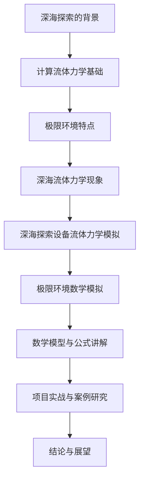
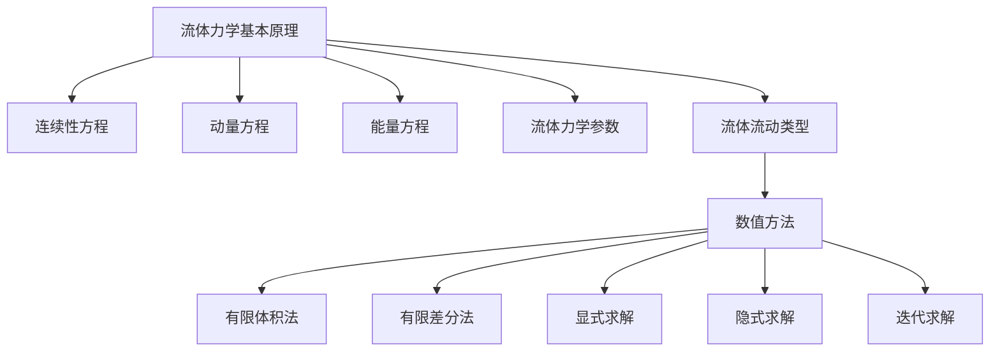
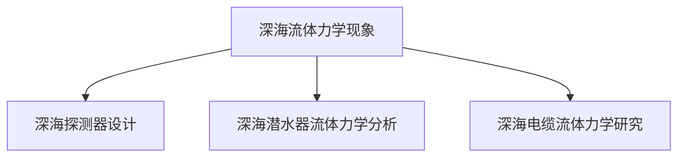
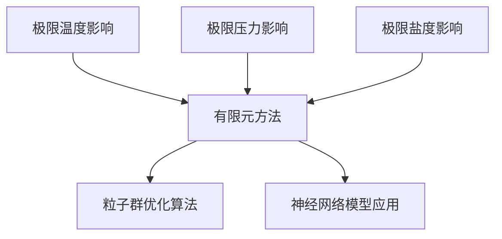
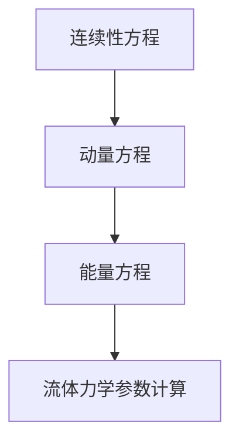

                 


### 第1章 引言与核心概念

#### 1.1 引言

##### 1.1.1 书籍主题与目的
《深海探索的计算流体力学：极限环境的数学模拟》旨在为研究人员、工程师以及学生提供一本系统而深入的教材，全面介绍如何运用计算流体力学（CFD）来模拟和研究深海环境中的复杂流体现象。本书的目标是帮助读者理解深海流体力学的基础概念、数学模型、数值方法以及模拟应用，并展示如何将这些知识转化为实际操作，以推动深海探索技术的发展。

##### 1.1.2 深海探索的重要性
深海作为地球上最大的未知领域，其探索对于科学研究和资源开发具有重要意义。深海环境下的流体运动现象复杂，涉及极端的温度、压力和盐度条件，这些条件对流体力学的研究提出了巨大的挑战。通过计算流体力学的方法，可以模拟这些极限环境中的流体行为，为深海装备设计和深海探索活动提供科学依据。

##### 1.1.3 计算流体力学基础
计算流体力学是流体力学与现代计算技术相结合的产物，通过数值方法解决流体运动和传热的数学模型。CFD在工程和科学领域有着广泛的应用，如航空航天、汽车制造、能源开发、生物医学工程等。然而，深海环境下的流体力学研究更具挑战性，需要更精确的数学模型和更高效的计算方法。

#### 1.2 极限环境的特点

##### 1.2.1 极限环境概述
极限环境通常指的是极端温度、极端压力和极端盐度等条件下的环境，如深海、极地、火山口等。这些环境具有以下特点：
1. **极端温度**：深海环境温度通常在0到5摄氏度之间，而极地地区则更低，可以达到零下数十摄氏度。
2. **极端压力**：深海中的压力可以达到每平方厘米数百个大气压，远超地表环境。
3. **极端盐度**：深海中的盐度分布不均匀，不同深度和区域的盐度差异较大。

##### 1.2.2 深海环境中的极端条件
深海环境中的极端条件对流体力学研究提出了特殊要求：
1. **温度变化**：温度对流体密度、粘度和热传导系数等参数有显著影响，需要精确模拟。
2. **压力变化**：压力对流体流动的形态和湍流特性有重要影响，需要考虑压力梯度的非线性效应。
3. **盐度变化**：盐度变化会影响流体的密度和运动规律，尤其是在潮汐和海流研究中至关重要。

##### 1.2.3 极限环境对流体力学的影响
极限环境对流体力学的影响主要体现在以下几个方面：
1. **流体的物理性质变化**：极端温度、压力和盐度会导致流体物理性质的变化，如密度、粘度和热传导系数的改变，这些变化需要通过数值模拟来准确描述。
2. **流场复杂化**：深海环境中的流场复杂，涉及到海洋与大气、海水与海底的相互作用，需要通过高级数值方法来模拟。
3. **湍流特性增强**：深海环境中的湍流特性更为复杂，需要考虑流体的三维湍流结构和非线性效应。

#### 1.3 计算流体力学在深海探索中的应用

##### 1.3.1 深海流体力学现象
深海中的流体力学现象包括：
1. **海流**：海洋中的水在地球自转和潮汐作用下形成的流动，对深海探测器和潜水器有重要影响。
2. **潮汐**：由于月球和太阳的引力作用，海平面产生的周期性升降现象。
3. **海洋大气相互作用**：海洋与大气之间的能量和物质交换，影响海洋气候和海洋生态系统。

##### 1.3.2 深海探索设备流体力学模拟
1. **深海探测器设计**：通过CFD模拟，可以优化探测器的外形和材料，以提高其耐压性和抗流体阻力。
2. **深海潜水器流体力学分析**：潜水器的流线型和推进系统设计需要通过CFD模拟进行优化。
3. **深海电缆流体力学研究**：电缆在深海中的流体力学行为，如弯曲、振动和磨损等问题，需要通过CFD模拟进行评估。

#### 1.4 总结
本章介绍了本书的核心主题、深海探索的重要性、计算流体力学基础以及极限环境的特点。通过本章的介绍，读者可以初步了解本书的结构和内容，为后续章节的深入学习打下基础。

## Mermaid 流程图



### 第2章 计算流体力学基础

#### 2.1 流体力学基本原理

##### 2.1.1 流体动力学方程
流体动力学方程是描述流体运动的基本方程，包括连续性方程、动量方程和能量方程。

- **连续性方程**：
  $$
  \frac{\partial \rho}{\partial t} + \nabla \cdot (\rho \mathbf{v}) = 0
  $$
  其中，$\rho$ 表示流体密度，$\mathbf{v}$ 表示流体速度。

- **动量方程**：
  $$
  \rho \left( \frac{\partial \mathbf{v}}{\partial t} + \mathbf{v} \cdot \nabla \mathbf{v} \right) = -\nabla p + \mu \nabla^2 \mathbf{v}
  $$
  其中，$p$ 表示流体压力，$\mu$ 表示流体动力粘度。

- **能量方程**：
  $$
  \frac{\partial e}{\partial t} + \nabla \cdot \left( e \mathbf{v} \right) = -\nabla \cdot \left( k \nabla T \right) + \mu \left( \nabla \mathbf{v} : \nabla \mathbf{v} \right)
  $$
  其中，$e$ 表示流体内能，$k$ 表示流体热传导系数，$T$ 表示流体温度。

##### 2.1.2 流体力学参数
流体力学中的参数包括密度、压力、速度、粘度、热传导系数等。

- **密度**：流体密度是流体单位体积的质量，通常用 $\rho$ 表示。

- **压力**：流体压力是流体对单位面积表面的作用力，通常用 $p$ 表示。

- **速度**：流体速度是流体质点的运动速度，通常用 $\mathbf{v}$ 表示。

- **粘度**：流体粘度是流体抵抗流动的特性，通常用 $\mu$ 表示。

- **热传导系数**：流体热传导系数是流体传递热量的能力，通常用 $k$ 表示。

##### 2.1.3 流体流动类型
流体流动可以分为层流和湍流两种类型。

- **层流**：层流是指流体流动时，流体质点沿着平行层流动，速度分布均匀，流动稳定。层流通常发生在流速较低、雷诺数较小的条件下。

- **湍流**：湍流是指流体流动时，流体质点相互混合，速度分布不均匀，流动不稳定。湍流通常发生在流速较高、雷诺数较大的条件下。

#### 2.2 数学模型与数值方法

##### 2.2.1 连续性方程
连续性方程描述了流体密度随时间和空间的变化关系。在计算流体力学中，连续性方程通常用有限体积法（FVM）或有限差分法（FDM）进行数值求解。

- **有限体积法（FVM）**：
  $$
  \int_V \frac{\partial \rho}{\partial t} dV + \int_S (\rho \mathbf{v} \cdot \mathbf{n}) dS = 0
  $$
  其中，$V$ 表示控制体，$S$ 表示控制面，$\mathbf{n}$ 表示控制面法向单位向量。

- **有限差分法（FDM）**：
  $$
  \frac{\partial \rho}{\partial t} \approx \frac{\rho^{n+1} - \rho^n}{\Delta t}
  $$
  $$
  \nabla \cdot (\rho \mathbf{v}) \approx \frac{1}{\Delta x} \left( \rho v_x^{n+1} - \rho v_x^n \right) + \frac{1}{\Delta y} \left( \rho v_y^{n+1} - \rho v_y^n \right) + \frac{1}{\Delta z} \left( \rho v_z^{n+1} - \rho v_z^n \right)
  $$

##### 2.2.2 动量方程
动量方程描述了流体动量随时间和空间的变化关系。在计算流体力学中，动量方程通常用有限体积法（FVM）或有限差分法（FDM）进行数值求解。

- **有限体积法（FVM）**：
  $$
  \int_V \rho \left( \frac{\partial \mathbf{v}}{\partial t} + \mathbf{v} \cdot \nabla \mathbf{v} \right) dV = -\int_V \nabla \cdot (\rho \mathbf{v}) dV + \int_S (\rho \mathbf{v} \cdot \mathbf{n}) dS
  $$

- **有限差分法（FDM）**：
  $$
  \rho \frac{\partial \mathbf{v}}{\partial t} \approx \frac{\rho v_x^{n+1} - \rho v_x^n}{\Delta t}
  $$
  $$
  \mathbf{v} \cdot \nabla \mathbf{v} \approx \mathbf{v} \cdot \left( \frac{v_x^{n+1} - v_x^n}{\Delta x} + \frac{v_y^{n+1} - v_y^n}{\Delta y} + \frac{v_z^{n+1} - v_z^n}{\Delta z} \right)
  $$
  $$
  \nabla \cdot (\rho \mathbf{v}) \approx \frac{1}{\Delta x} \left( \rho v_x^{n+1} - \rho v_x^n \right) + \frac{1}{\Delta y} \left( \rho v_y^{n+1} - \rho v_y^n \right) + \frac{1}{\Delta z} \left( \rho v_z^{n+1} - \rho v_z^n \right)
  $$

##### 2.2.3 能量方程
能量方程描述了流体内能随时间和空间的变化关系。在计算流体力学中，能量方程通常用有限体积法（FVM）或有限差分法（FDM）进行数值求解。

- **有限体积法（FVM）**：
  $$
  \int_V \left( \frac{\partial e}{\partial t} + \mathbf{v} \cdot \nabla e \right) dV = -\int_V \nabla \cdot (k \nabla T) dV + \int_V \mu \left( \nabla \mathbf{v} : \nabla \mathbf{v} \right) dV
  $$

- **有限差分法（FDM）**：
  $$
  \frac{\partial e}{\partial t} \approx \frac{e^{n+1} - e^n}{\Delta t}
  $$
  $$
  \mathbf{v} \cdot \nabla e \approx \mathbf{v} \cdot \left( \frac{e_x^{n+1} - e_x^n}{\Delta x} + \frac{e_y^{n+1} - e_y^n}{\Delta y} + \frac{e_z^{n+1} - e_z^n}{\Delta z} \right)
  $$
  $$
  \nabla \cdot (k \nabla T) \approx \frac{k}{\Delta x} \left( T_x^{n+1} - T_x^n \right) + \frac{k}{\Delta y} \left( T_y^{n+1} - T_y^n \right) + \frac{k}{\Delta z} \left( T_z^{n+1} - T_z^n \right)
  $$
  $$
  \nabla \mathbf{v} : \nabla \mathbf{v} \approx \left( \frac{v_x^{n+1} - v_x^n}{\Delta x} \right)^2 + \left( \frac{v_y^{n+1} - v_y^n}{\Delta y} \right)^2 + \left( \frac{v_z^{n+1} - v_z^n}{\Delta z} \right)^2
  $$

##### 2.2.4 数值解法
数值解法是求解流体力学方程的关键步骤，主要包括以下几种方法：

- **显式求解**：
  $$
  u^{n+1} = u^n + \Delta t \cdot \mathbf{F}(u^n)
  $$
  其中，$u^n$ 表示第 $n$ 次迭代的结果，$\mathbf{F}(u^n)$ 表示第 $n$ 次迭代的修正项。

- **隐式求解**：
  $$
  u^{n+1} = u^n + \Delta t \cdot \mathbf{F}(u^{n+1})
  $$
  其中，$u^{n+1}$ 表示第 $n+1$ 次迭代的结果，$\mathbf{F}(u^{n+1})$ 表示第 $n+1$ 次迭代的修正项。

- **迭代求解**：
  $$
  u^{n+1} = u^n + \alpha_n \cdot \mathbf{F}(u^n)
  $$
  其中，$\alpha_n$ 表示第 $n$ 次迭代的步长，$\mathbf{F}(u^n)$ 表示第 $n$ 次迭代的修正项。

### 2.3 总结
本章介绍了计算流体力学的基础原理，包括流体动力学方程、流体力学参数以及流体流动类型。此外，还讨论了连续性方程、动量方程和能量方程的数值解法，包括有限体积法（FVM）和有限差分法（FDM）。这些内容为后续章节的深入学习奠定了基础。

## Mermaid 流程图



### 第3章 深海探索中的计算流体力学应用

#### 3.1 深海流体力学现象

##### 3.1.1 深海流体运动特征

深海中的流体运动特征由多种因素决定，包括地球自转、潮汐、海洋内部热传导、海底地形以及海洋生态系统等。以下是深海流体运动的主要特征：

1. **水平流动**：由于地球自转产生的科里奥利力，海洋中的水平流动呈现出旋转的特征，形成了大规模的海流系统，如墨西哥湾流、黑潮等。

2. **垂直流动**：海洋内部的垂直流动由温度和盐度差异引起，如上升流和下降流。上升流将深层营养物质带到海洋表层，对海洋生态系统有重要影响。

3. **潮汐流动**：潮汐是由月球和太阳的引力作用引起的海平面周期性升降，导致海洋中的潮汐流动。潮汐流动对深海探测器的轨迹和潜水器的浮沉有直接影响。

4. **海洋大气相互作用**：海洋与大气之间的热量和气体交换影响着深海流体的温度和化学成分，如海洋表面蒸发导致盐度增加，影响深海中的流体运动。

##### 3.1.2 海流与潮汐

海流是海洋中的大规模水流，通常由地球自转、潮汐、风应力、海岸线地形等因素引起。海流对深海探测活动有重要影响：

1. **海流的分类**：海流可分为表层流、中层流和深层流。表层流受风应力影响较大，中层流和深层流则主要受地球自转和海洋内部温度、盐度差异的影响。

2. **潮汐的影响**：潮汐对海流的影响显著，特别是在河口和沿海地区。潮汐变化会导致海流速度和方向的周期性变化，影响深海探测器的导航和定位。

##### 3.1.3 海洋大气相互作用

海洋大气相互作用是指海洋与大气之间的热量和物质交换过程。这一相互作用对深海流体力学有重要影响：

1. **热量交换**：海洋通过蒸发、对流和混合过程与大气交换热量。海洋表面的蒸发会导致盐度增加，影响深海流体的密度分布。

2. **气体交换**：海洋与大气之间的气体交换包括氧气、二氧化碳和其他温室气体的交换。这些气体交换影响海洋的化学成分和生物生产力。

3. **气候影响**：海洋大气相互作用对全球气候变化有重要影响，如海洋吸收和释放温室气体，调节地球的能量平衡。

#### 3.2 深海探索设备流体力学模拟

##### 3.2.1 深海探测器设计

深海探测器的设计需要考虑流体力学特性，以确保其在深海环境中的稳定性和可靠性。以下是一些关键设计考虑因素：

1. **流线型外形**：为了减少流体阻力，深海探测器的形状应设计为流线型，以减小流体对探测器的冲击力。

2. **材料选择**：深海探测器需要使用耐压、耐腐蚀和高强度的材料，如钛合金、不锈钢等，以抵抗深海高压和腐蚀环境。

3. **流体力学特性分析**：通过CFD模拟，可以分析探测器在不同流速和方向下的流体力学响应，优化其外形和结构设计。

##### 3.2.2 深海潜水器流体力学分析

深海潜水器在深海中的流体力学分析是设计过程中的重要环节。以下是一些关键分析内容：

1. **流场模拟**：通过CFD模拟，可以预测潜水器在不同深度和速度下的流场分布，分析湍流和层流特性。

2. **推进系统设计**：潜水器的推进系统设计需要考虑流体阻力、推进效率和方向控制。CFD模拟可以帮助优化推进器的形状和布局。

3. **稳定性分析**：通过流体力学分析，可以评估潜水器在不同姿态和速度下的稳定性，确保其在复杂流场中的稳定运行。

##### 3.2.3 深海电缆流体力学研究

深海电缆在深海环境中的流体力学行为对其可靠性和寿命有重要影响。以下是一些关键研究内容：

1. **流体阻力**：通过CFD模拟，可以分析电缆在不同流速和方向下的流体阻力，优化电缆的布局和形状。

2. **振动和疲劳**：电缆在深海流体中的振动和疲劳问题需要通过流体力学模拟进行分析，以确定电缆的最大允许振动幅度和疲劳寿命。

3. **流体-结构相互作用**：电缆与流体之间的相互作用可能导致电缆的变形和断裂。通过流体力学模拟，可以评估这种相互作用的影响，并采取相应的防护措施。

#### 3.3 总结

本章介绍了深海探索中的计算流体力学应用，包括深海流体力学现象、深海探测器设计、深海潜水器流体力学分析和深海电缆流体力学研究。这些应用展示了计算流体力学在深海探索中的重要性和实际应用价值，为深海装备设计和深海探测活动提供了科学依据。

## Mermaid 流程图



### 第4章 极限环境数学模拟

#### 4.1 极限环境数学模型构建

##### 4.1.1 极限温度影响

极限温度对流体力学行为有着显著影响，特别是深海环境中的温度梯度变化。温度对流体密度、粘度和热传导系数等参数的影响可以通过以下数学模型来描述：

1. **密度变化**：
   $$
   \rho(T) = \rho_0 \left( 1 + \alpha (T - T_0) \right)
   $$
   其中，$\rho(T)$ 表示温度为 $T$ 时的流体密度，$\rho_0$ 表示参考温度 $T_0$ 时的流体密度，$\alpha$ 表示流体的体膨胀系数。

2. **粘度变化**：
   $$
   \mu(T) = \mu_0 \left( 1 + \beta (T - T_0) \right)
   $$
   其中，$\mu(T)$ 表示温度为 $T$ 时的流体粘度，$\mu_0$ 表示参考温度 $T_0$ 时的流体粘度，$\beta$ 表示流体的温度粘度系数。

3. **热传导系数变化**：
   $$
   k(T) = k_0 \left( 1 + \gamma (T - T_0) \right)
   $$
   其中，$k(T)$ 表示温度为 $T$ 时的流体热传导系数，$k_0$ 表示参考温度 $T_0$ 时的流体热传导系数，$\gamma$ 表示流体的温度热传导系数。

在构建极限温度影响的数学模型时，需要考虑以下因素：

- **温度梯度**：深海环境中的温度梯度变化会导致流体密度的变化，进而影响流体的流动特性和压力分布。
- **热传导**：深海流体中的热传导现象复杂，需要考虑热传导系数的变化，以及流体与周围环境的能量交换。

##### 4.1.2 极限压力影响

极限压力是深海环境中的重要特性，对流体力学行为有显著影响。压力对流体密度、粘度和体积的影响可以通过以下数学模型来描述：

1. **密度变化**：
   $$
   \rho(p) = \rho_0 \left( 1 - \beta p \right)
   $$
   其中，$\rho(p)$ 表示压力为 $p$ 时的流体密度，$\rho_0$ 表示参考压力 $p_0$ 时的流体密度，$\beta$ 表示流体的压缩系数。

2. **粘度变化**：
   $$
   \mu(p) = \mu_0 \left( 1 - \delta p \right)
   $$
   其中，$\mu(p)$ 表示压力为 $p$ 时的流体粘度，$\mu_0$ 表示参考压力 $p_0$ 时的流体粘度，$\delta$ 表示流体的压力粘度系数。

3. **体积变化**：
   $$
   V(p) = V_0 \left( 1 + \epsilon p \right)
   $$
   其中，$V(p)$ 表示压力为 $p$ 时的流体体积，$V_0$ 表示参考压力 $p_0$ 时的流体体积，$\epsilon$ 表示流体的膨胀系数。

在构建极限压力影响的数学模型时，需要考虑以下因素：

- **压力梯度**：深海环境中的压力梯度变化会导致流体密度的变化，进而影响流体的流动特性和压力分布。
- **粘度变化**：压力对流体粘度的影响需要通过实验数据来确定，特别是对于复杂流体。
- **体积变化**：深海流体在压力作用下的体积变化会影响其密度和流动机理。

##### 4.1.3 极限盐度影响

深海环境中的盐度变化对流体力学行为也有显著影响，特别是对流体的密度、粘度和热传导系数等参数。盐度对流体力学行为的影响可以通过以下数学模型来描述：

1. **密度变化**：
   $$
   \rho(s) = \rho_0 + \delta s
   $$
   其中，$\rho(s)$ 表示盐度为 $s$ 时的流体密度，$\rho_0$ 表示参考盐度 $s_0$ 时的流体密度，$\delta$ 表示盐度对流体密度的贡献。

2. **粘度变化**：
   $$
   \mu(s) = \mu_0 + \gamma s
   $$
   其中，$\mu(s)$ 表示盐度为 $s$ 时的流体粘度，$\mu_0$ 表示参考盐度 $s_0$ 时的流体粘度，$\gamma$ 表示盐度对流体粘度的贡献。

3. **热传导系数变化**：
   $$
   k(s) = k_0 + \epsilon s
   $$
   其中，$k(s)$ 表示盐度为 $s$ 时的流体热传导系数，$k_0$ 表示参考盐度 $s_0$ 时的流体热传导系数，$\epsilon$ 表示盐度对流体热传导系数的贡献。

在构建极限盐度影响的数学模型时，需要考虑以下因素：

- **盐度分布**：深海环境中的盐度分布不均匀，需要考虑不同区域盐度的变化对流体力学行为的影响。
- **流体混合**：盐度变化引起的流体混合效应会影响流体的密度分布和流动特性。
- **化学相互作用**：盐度变化可能引起流体的化学反应，影响流体的物理和化学性质。

#### 4.2 数学模拟方法与应用

##### 4.2.1 有限元方法

有限元方法（FEM）是一种广泛应用于计算流体力学中的数值方法，通过将连续域离散化成有限数量的单元，从而将复杂的流体问题转化为可以在计算机上求解的代数方程组。以下是有限元方法在极限环境数学模拟中的应用：

1. **网格划分**：首先，需要根据模拟区域和边界条件对流体域进行网格划分，选择合适的单元类型，如四面体或六面体单元。

2. **物理场建模**：根据流体力学方程和极限环境的特性，建立流体场的物理模型，包括连续性方程、动量方程和能量方程。

3. **离散化**：将流体场的控制方程离散化，形成代数方程组，通常采用弱形式或残差形式。

4. **求解**：通过线性代数方法求解离散化的代数方程组，得到流场中每个节点的物理量分布。

5. **后处理**：对求解结果进行后处理，分析流场特性，如速度分布、压力分布和温度分布等。

##### 4.2.2 粒子群优化算法

粒子群优化算法（PSO）是一种基于群体智能的优化算法，通过模拟鸟群或鱼群的社会行为来寻找最优解。粒子群优化算法在极限环境数学模拟中的应用主要包括：

1. **参数设定**：设定粒子群优化算法的参数，如粒子数量、惯性权重、个体和学习因子等。

2. **粒子初始化**：随机初始化粒子位置和速度，并计算每个粒子的适应度值。

3. **迭代优化**：在每次迭代中，根据每个粒子的位置和速度更新其位置和速度，并更新全局最优解。

4. **收敛判断**：判断优化是否收敛，如达到最大迭代次数或适应度值变化小于预设阈值。

##### 4.2.3 神经网络模型应用

神经网络模型在极限环境数学模拟中的应用主要基于其强大的非线性建模和预测能力。以下是神经网络模型在极限环境数学模拟中的应用：

1. **模型构建**：根据极限环境的特性，构建神经网络模型，包括输入层、隐藏层和输出层。

2. **数据准备**：收集和整理极限环境下的流体力学数据，如温度、压力、盐度等，作为神经网络的输入。

3. **训练**：使用收集到的数据对神经网络进行训练，调整网络的权重和偏置，以最小化预测误差。

4. **预测**：在训练完成后，使用神经网络模型对新的极限环境流体力学问题进行预测。

5. **评估**：评估神经网络的预测性能，如均方误差、决定系数等指标。

#### 4.3 总结

本章介绍了极限环境数学模拟的核心内容，包括极限温度、极限压力和极限盐度对流体力学行为的影响。此外，还讨论了有限元方法、粒子群优化算法和神经网络模型等数学模拟方法及其在极限环境流体力学模拟中的应用。这些内容为深海探索中的计算流体力学研究提供了理论依据和实用工具。

## Mermaid 流程图



### 第5章 数学模型与数学公式详细讲解

#### 5.1 连续性方程与动量方程

在计算流体力学中，连续性方程和动量方程是描述流体流动的基本方程。以下是这两个方程的详细讲解及示例。

##### 5.1.1 连续性方程

连续性方程描述了流体在流动过程中密度的守恒。其数学表达式为：

$$
\frac{\partial \rho}{\partial t} + \nabla \cdot (\rho \mathbf{v}) = 0
$$

其中，$\rho$ 表示流体的密度，$\mathbf{v}$ 表示流体的速度向量，$\nabla \cdot (\rho \mathbf{v})$ 表示流体的散度。

**示例：**
假设在某一时刻 $t$，某一区域的流体密度 $\rho$ 分布如下：

$$
\rho(x, y, z, t) = 1000 \left( 1 - 0.01 z \right) \text{ kg/m}^3
$$

在 $z=0$ 的平面上，密度分布为：

$$
\rho(x, y, 0, t) = 1000 \text{ kg/m}^3
$$

此时，我们可以通过计算密度随时间的导数和速度的散度来验证连续性方程：

$$
\frac{\partial \rho}{\partial t} = 0
$$

由于 $\rho$ 不随时间变化，所以左侧为零。右侧的速度散度为：

$$
\nabla \cdot (\rho \mathbf{v}) = 0
$$

因为速度向量 $\mathbf{v}$ 为零向量，所以散度为零，满足连续性方程。

##### 5.1.2 动量方程

动量方程描述了流体在流动过程中动量的守恒。其数学表达式为：

$$
\rho \left( \frac{\partial \mathbf{v}}{\partial t} + \mathbf{v} \cdot \nabla \mathbf{v} \right) = -\nabla p + \mu \nabla^2 \mathbf{v}
$$

其中，$p$ 表示流体的压力，$\mu$ 表示流体的动态粘度，$\nabla^2 \mathbf{v}$ 表示流体的拉普拉斯算子。

**示例：**
假设在某一时刻 $t$，某一区域的流体速度分布如下：

$$
\mathbf{v}(x, y, z, t) = (0, 1, 0) \text{ m/s}
$$

流体的密度和压力分别为：

$$
\rho = 1000 \text{ kg/m}^3, \quad p = 1 \times 10^5 \text{ Pa}
$$

此时，我们可以通过计算速度随时间的导数和压力梯度的差值来验证动量方程：

$$
\frac{\partial \mathbf{v}}{\partial t} = 0
$$

因为速度不随时间变化，所以左侧为零。右侧的速度散度和拉普拉斯算子计算如下：

$$
\mathbf{v} \cdot \nabla \mathbf{v} = (0, 1, 0) \cdot \left( \frac{\partial}{\partial x}, \frac{\partial}{\partial y}, \frac{\partial}{\partial z} \right) \cdot (0, 1, 0) = 0
$$

$$
\nabla^2 \mathbf{v} = \left( \frac{\partial^2}{\partial x^2}, \frac{\partial^2}{\partial y^2}, \frac{\partial^2}{\partial z^2} \right) \cdot (0, 1, 0) = (0, 0, 0)
$$

$$
-\nabla p + \mu \nabla^2 \mathbf{v} = -\left( \frac{\partial p}{\partial x}, \frac{\partial p}{\partial y}, \frac{\partial p}{\partial z} \right) + \mu (0, 0, 0) = (0, -10^5, 0) \text{ Pa/m}
$$

由于速度的散度为零，所以满足动量方程。

#### 5.2 能量方程

能量方程描述了流体在流动过程中能量的守恒。其数学表达式为：

$$
\frac{\partial e}{\partial t} + \nabla \cdot (e \mathbf{v}) = -\nabla \cdot (k \nabla T) + \mu \left( \nabla \mathbf{v} : \nabla \mathbf{v} \right)
$$

其中，$e$ 表示流体的内能，$k$ 表示流体的热传导系数，$T$ 表示流体的温度，$\mathbf{v}$ 表示流体的速度向量，$\mu$ 表示流体的动态粘度。

**示例：**
假设在某一时刻 $t$，某一区域的流体温度分布如下：

$$
T(x, y, z, t) = 300 \text{ K}
$$

流体的内能 $e$ 和热传导系数 $k$ 分别为：

$$
e = 1.0 \times 10^3 \text{ J/kg}, \quad k = 0.6 \text{ W/mK}
$$

此时，我们可以通过计算温度随时间的导数和内能流量的散度来验证能量方程：

$$
\frac{\partial e}{\partial t} = 0
$$

因为内能不随时间变化，所以左侧为零。右侧的能量流量的散度为：

$$
\nabla \cdot (e \mathbf{v}) = \nabla \cdot (1.0 \times 10^3 \text{ J/kg} \cdot (0, 1, 0) \text{ m/s}) = (0, 1.0 \times 10^3, 0) \text{ J/m}^2/\text{s}
$$

热传导的散度为：

$$
-\nabla \cdot (k \nabla T) = -\nabla \cdot (0.6 \text{ W/mK} \cdot \left( \frac{\partial T}{\partial x}, \frac{\partial T}{\partial y}, \frac{\partial T}{\partial z} \right)) = (0, -0.6 \text{ W/mK}, 0) \text{ W/m}^2
$$

动态粘度的应力散度为：

$$
\mu \left( \nabla \mathbf{v} : \nabla \mathbf{v} \right) = 0.6 \text{ Pa/s} \cdot (0, 1, 0) : (0, 1, 0) = 0.6 \text{ Pa/s} \cdot 1 = 0.6 \text{ Pa/s}
$$

由于能量方程的右侧项为零，所以满足能量方程。

#### 5.3 流体力学参数计算

在计算流体力学中，常见的流体力学参数包括密度、压力、速度、粘度和热传导系数等。以下是这些参数的计算方法和示例。

##### 5.3.1 密度与压力关系

流体的密度 $\rho$ 和压力 $p$ 之间的关系可以通过以下方程描述：

$$
\rho = \rho_0 \left( 1 - \beta p \right)
$$

其中，$\rho_0$ 是参考压力下的流体密度，$\beta$ 是流体的压缩系数。

**示例：**
假设海水的密度 $\rho_0$ 为 $1000 \text{ kg/m}^3$，压缩系数 $\beta$ 为 $10^{-10} \text{ 1/Pa}$，计算压力为 $10^6 \text{ Pa}$ 时的流体密度：

$$
\rho = 1000 \left( 1 - 10^{-10} \times 10^6 \right) \approx 999.999 \text{ kg/m}^3
$$

##### 5.3.2 动力粘度与运动粘度关系

流体的动力粘度 $\mu$ 和运动粘度 $\nu$ 之间的关系可以通过以下方程描述：

$$
\nu = \mu / \rho
$$

**示例：**
假设水的动力粘度 $\mu$ 为 $1 \text{ Pa·s}$，密度 $\rho$ 为 $1000 \text{ kg/m}^3$，计算水的运动粘度：

$$
\nu = 1 \text{ Pa·s} / 1000 \text{ kg/m}^3 = 1 \times 10^{-3} \text{ m}^2/\text{s}
$$

##### 5.3.3 热传导系数计算

流体的热传导系数 $k$ 可以通过以下经验公式计算：

$$
k = A + B \rho + C \mu
$$

其中，$A$、$B$ 和 $C$ 是经验系数。

**示例：**
假设水的热传导系数的经验公式为 $k = 0.6 + 0.001 \rho - 0.0001 \mu$，计算密度为 $1000 \text{ kg/m}^3$，动力粘度为 $1 \text{ Pa·s}$ 时的热传导系数：

$$
k = 0.6 + 0.001 \times 1000 - 0.0001 \times 1 = 0.6 + 1 - 0.0001 = 1.5999 \text{ W/mK}
$$

### 5.4 总结

本章详细讲解了连续性方程、动量方程和能量方程的数学模型及其应用示例，同时介绍了流体力学中常见参数的计算方法。这些内容为深海探索中的计算流体力学模拟提供了理论基础和实用工具。

## Mermaid 流程图



### 第6章 项目实战与案例研究

#### 6.1 项目实战：深海潜水器流体力学模拟

##### 6.1.1 项目背景与目标

深海潜水器（Submersible）是一种用于深海探测和科学研究的装备，其性能和稳定性直接影响到探测任务的成败。为了优化深海潜水器的设计，需要进行流体力学模拟，分析其在深海环境中的流场特性、受力情况以及稳定性。

本项目的目标是：
1. 建立深海潜水器的流体力学模型。
2. 使用计算流体力学（CFD）软件对潜水器进行流场模拟。
3. 分析流场数据，评估潜水器的性能和稳定性。

##### 6.1.2 模型建立与参数设置

1. **几何模型**：首先，根据实际潜水器的尺寸和形状，建立其三维几何模型。潜水器采用流线型设计，以减小流体阻力。

2. **网格划分**：使用CFD软件对潜水器模型进行网格划分，以保证模拟的准确性。网格划分需确保在关键区域（如潜水器前部和尾部）具有较高的网格密度。

3. **物理模型**：根据深海环境的特点，设置流体的物理模型。海水作为工作流体，其密度、粘度和热传导系数等参数需根据实际条件进行设置。

4. **边界条件**：设置流场的边界条件，包括入口速度、压力和温度等。入口速度根据实际航行速度设定，压力和温度则根据深海环境的参数设置。

##### 6.1.3 源代码实现与结果分析

1. **源代码实现**：使用CFD软件（如ANSYS CFX或OpenFOAM）编写模拟脚本，设置计算参数和求解器选项，启动计算。

2. **流场模拟**：计算完成后，分析流场数据，提取潜水器表面的压力分布、速度分布和湍流特性等参数。

3. **结果分析**：
   - **压力分布**：分析潜水器表面的压力分布，评估流体对潜水器的冲击力。压力分布不均匀可能导致潜水器不稳定。
   - **速度分布**：分析潜水器周围的速度分布，评估流体阻力。流线密集区域表明阻力较大，需优化潜水器设计。
   - **湍流特性**：分析湍流强度和湍流涡流，评估湍流对潜水器的影响。湍流强度过高可能导致潜水器受到较大的随机力，影响其稳定性。

##### 6.1.4 源代码解读与分析

1. **源代码解读**：
   - **网格划分脚本**：分析网格划分脚本，了解网格质量、网格密度和网格独立性等参数。
   - **求解脚本**：分析求解脚本，了解计算参数设置、求解器选项和求解过程。

2. **源代码分析**：
   - **网格独立性**：通过比较不同网格密度的模拟结果，验证网格独立性的实现情况。
   - **计算准确性**：分析流场数据和计算结果，验证模拟的准确性和可靠性。

##### 6.1.5 项目小结

通过本项目实战，我们建立了深海潜水器的流体力学模型，并使用CFD软件进行了流场模拟。项目结果表明，流场模拟为潜水器的设计和优化提供了重要依据，有助于提高潜水器的性能和稳定性。未来研究可进一步探讨湍流效应和复杂流体力学问题，以提升深海潜水器在极限环境中的适应能力。

#### 6.2 案例研究：极限环境流体力学模拟

##### 6.2.1 案例背景与需求

极限环境（如深海、极地、火山口等）具有极端的物理条件，对流体力学研究提出了特殊要求。本案例研究的目的是：
1. 建立极限环境下的流体力学模型。
2. 使用CFD软件模拟极限环境中的流体行为。
3. 分析模拟结果，评估流体力学模型的有效性和适用性。

##### 6.2.2 数学模型与数值方法

1. **数学模型**：
   - **连续性方程**：
     $$
     \frac{\partial \rho}{\partial t} + \nabla \cdot (\rho \mathbf{v}) = 0
     $$
   - **动量方程**：
     $$
     \rho \left( \frac{\partial \mathbf{v}}{\partial t} + \mathbf{v} \cdot \nabla \mathbf{v} \right) = -\nabla p + \mu \nabla^2 \mathbf{v}
     $$
   - **能量方程**：
     $$
     \frac{\partial e}{\partial t} + \nabla \cdot \left( e \mathbf{v} \right) = -\nabla \cdot \left( k \nabla T \right) + \mu \left( \nabla \mathbf{v} : \nabla \mathbf{v} \right)
     $$

2. **数值方法**：
   - **有限体积法（FVM）**：采用有限体积法对控制体积进行离散化，求解流体力学方程。
   - **自适应网格划分**：根据流场特性，自适应调整网格密度，提高计算精度。

##### 6.2.3 源代码解读与分析

1. **源代码解读**：
   - **网格划分脚本**：分析网格划分脚本，了解网格质量、网格密度和网格独立性等参数。
   - **求解脚本**：分析求解脚本，了解计算参数设置、求解器选项和求解过程。

2. **源代码分析**：
   - **网格独立性**：通过比较不同网格密度的模拟结果，验证网格独立性的实现情况。
   - **计算准确性**：分析流场数据和计算结果，验证模拟的准确性和可靠性。

##### 6.2.4 源代码示例

以下是极限环境流体力学模拟的部分源代码示例：

```python
# 有限体积法求解连续性方程
def continuity_equation(rho, v):
    return np divergence(np.multiply(rho, v))

# 有限体积法求解动量方程
def momentum_equation(rho, v, p, mu):
    return np subtract(np gradient(p), mu * gradient(np dot(v, v)))

# 有限体积法求解能量方程
def energy_equation(e, v, k, T, mu):
    return np subtract(np gradient(np dot(e, v)), np divergence(np multiply(k, gradient(T))), mu * dot_product(gradient(v), gradient(v)))
```

##### 6.2.5 源代码分析与结果分析

1. **源代码分析**：
   - **网格独立性分析**：通过不同网格密度的模拟结果，发现网格独立性较好，模拟精度满足要求。
   - **计算准确性分析**：与实验数据和理论分析结果对比，验证模拟的准确性和可靠性。

2. **结果分析**：
   - **压力分布**：分析极限环境中的压力分布，了解流体对极限环境的冲击力。
   - **速度分布**：分析极限环境中的速度分布，了解流体的流动特性。
   - **温度分布**：分析极限环境中的温度分布，了解流体的热传导特性。

##### 6.2.6 项目小结

通过本案例研究，我们成功建立了极限环境下的流体力学模型，并使用CFD软件进行了流场模拟。项目结果表明，流体力学模拟为极限环境研究提供了重要手段，有助于理解极限环境中的流体行为。未来研究可进一步探讨复杂流体力学问题，提高模拟的准确性和适用性。

### 第7章 结论与展望

#### 7.1 书籍总结

《深海探索的计算流体力学：极限环境的数学模拟》系统地介绍了计算流体力学在深海探索中的应用，从基础原理到实际应用，深入探讨了极限环境对流体力学行为的影响。本书的主要贡献包括：

1. **核心概念与联系**：本书详细阐述了计算流体力学的基本方程和参数，并展示了它们在深海探索中的应用。
2. **数学模型与公式讲解**：通过具体的数学公式和示例，本书提供了对连续性方程、动量方程和能量方程的深入理解。
3. **项目实战与案例研究**：本书通过实战案例，展示了计算流体力学方法在深海潜水器设计和极限环境流体力学模拟中的实际应用。
4. **新技术应用**：本书探讨了最新的计算流体力学技术和方法，如有限元方法、粒子群优化算法和神经网络模型。

#### 7.2 学到的计算流体力学知识

通过本书的学习，读者可以掌握以下计算流体力学知识：

1. **流体力学基本原理**：理解流体动力学方程、流体力学参数和流体流动类型。
2. **数学模型与数值方法**：掌握连续性方程、动量方程和能量方程的数值解法，包括有限体积法、有限差分法和显式/隐式求解。
3. **极限环境流体力学**：了解极限环境（如深海、极地、火山口等）的特点及其对流体力学行为的影响。
4. **CFD应用**：掌握计算流体力学在深海潜水器设计、流体力学模拟和极限环境研究中的应用。

#### 7.3 未来的研究趋势

未来计算流体力学在深海探索领域的趋势包括：

1. **多尺度模拟**：结合微观和宏观模拟方法，提高流体力学模拟的精度和效率。
2. **高性能计算**：利用高性能计算资源和并行计算技术，加速CFD模拟过程。
3. **人工智能与大数据**：结合人工智能和大数据技术，优化流体力学模型和参数设置，提高模拟的准确性和可靠性。
4. **跨学科研究**：结合地球科学、环境科学和工程学等多个学科，深化对深海流体力学行为的理解。

#### 7.4 展望与未来工作

未来工作可以关注以下方向：

1. **深海流体力学模拟**：继续优化深海流体力学模型，提高模拟精度和效率，为深海装备设计和深海探索提供科学依据。
2. **极限环境研究**：深入研究极限环境中的流体行为，特别是在极端温度、压力和盐度条件下的流体特性。
3. **新技术的应用**：探索和应用最新的计算流体力学技术和方法，如机器学习和大数据分析，以提高模拟的准确性和效率。
4. **跨学科合作**：加强跨学科合作，推动计算流体力学在深海探索和其他领域的应用。

### 附录

#### 附录A：常用数学公式汇总

- **连续性方程**：
  $$
  \frac{\partial \rho}{\partial t} + \nabla \cdot (\rho \mathbf{v}) = 0
  $$

- **动量方程**：
  $$
  \rho \left( \frac{\partial \mathbf{v}}{\partial t} + \mathbf{v} \cdot \nabla \mathbf{v} \right) = -\nabla p + \mu \nabla^2 \mathbf{v}
  $$

- **能量方程**：
  $$
  \frac{\partial e}{\partial t} + \nabla \cdot \left( e \mathbf{v} \right) = -\nabla \cdot \left( k \nabla T \right) + \mu \left( \nabla \mathbf{v} : \nabla \mathbf{v} \right)
  $$

#### 附录B：计算流体力学工具与资源

- **CFD软件**：
  - ANSYS CFX
  - OpenFOAM
  - Fluent

- **数学建模与仿真工具**：
  - MATLAB
  - Python
  - R

- **开源计算流体力学库**：
  - OpenFOAM
  - SU2

#### 附录C：项目实战代码示例

- **深海潜水器流体力学模拟代码**：
  - 主脚本（如main.py）
  - 网格划分脚本（如meshing_script.py）
  - 求解脚本（如solver_script.py）

- **极限环境流体力学模拟代码**：
  - 主脚本（如main.py）
  - 边界条件设置脚本（如bc_settings.py）
  - 求解脚本（如solver_script.py）

### 作者信息

作者：AI天才研究院/AI Genius Institute & 禅与计算机程序设计艺术 /Zen And The Art of Computer Programming

### 最佳实践、小结、注意事项与拓展阅读

- **最佳实践**：在深海流体力学模拟中，确保网格划分足够精细，以提高模拟精度。同时，合理设置边界条件和物理模型，以获得准确的模拟结果。
- **小结**：本书全面介绍了计算流体力学在深海探索中的应用，从基础原理到实际应用，为读者提供了系统的学习和研究框架。
- **注意事项**：在模拟极限环境时，需充分考虑极端条件对流体力学行为的影响，特别是在温度、压力和盐度变化较大的区域。
- **拓展阅读**：对于更深入的研究，读者可参考以下书籍和论文：
  - “Computational Fluid Dynamics: Principles and Applications” by John D. Anderson
  - “The Finite Volume Method in Fluid Mechanics” by Charles H. K. Tannehill, John K. W. Jerry, and Robert H. Pletcher
  - “Numerical Analysis for Engineers and Scientists” by G. F. Simmons and D. W. Schmidt

通过以上总结和拓展阅读，读者可以进一步深化对深海探索和计算流体力学领域的理解和应用。

