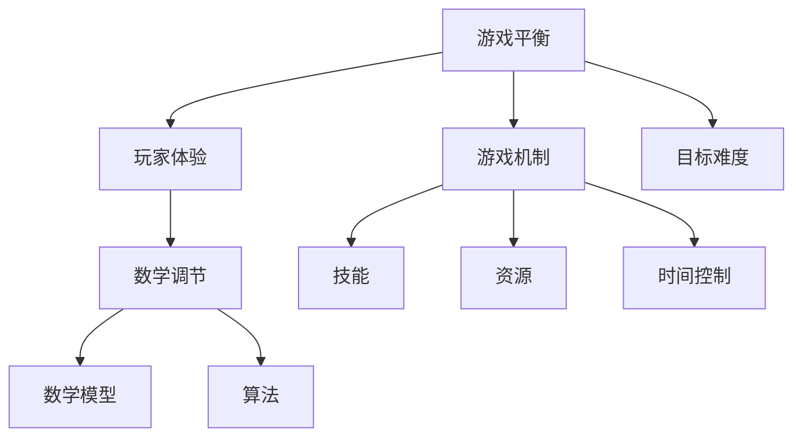
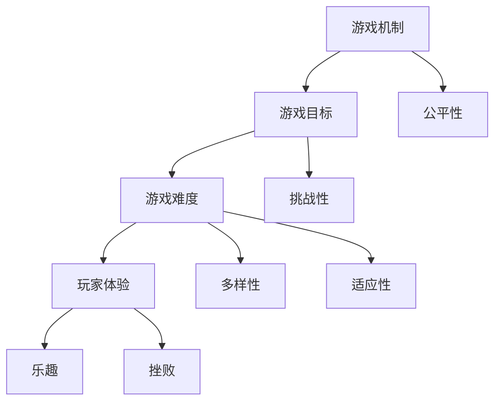

                 

### 文章标题：游戏设计的平衡理论：玩家体验的数学调节

> 关键词：游戏设计，平衡理论，玩家体验，数学调节

> 摘要：本文将深入探讨游戏设计的平衡理论，以及如何通过数学调节来优化玩家体验。我们将分析游戏平衡的基本原理、影响因素、数学模型，并探讨其在游戏设计中的应用和实战案例。通过这篇文章，读者将全面了解如何通过科学的方法提升游戏设计的质量，从而为玩家带来更优质的体验。

----------------------------------------------------------------

## 目录大纲设计：《游戏设计的平衡理论：玩家体验的数学调节》

### 第一部分：引言

1.1 游戏设计平衡理论概述
1.2 玩家体验的数学调节
1.3 书籍结构概述

### 第二部分：平衡理论核心概念

2.1 游戏平衡的基本原理
2.2 游戏平衡的影响因素
2.3 游戏平衡的数学模型
2.4 游戏平衡与玩家体验的关系

### 第三部分：平衡理论在游戏设计中的应用

3.1 游戏机制设计中的平衡
3.2 游戏资源分配与平衡
3.3 游戏时间控制的平衡

### 第四部分：平衡理论的实战应用

4.1 游戏平衡的理论验证
4.2 游戏平衡的案例解析
4.3 游戏平衡的优化策略

### 第五部分：总结与展望

5.1 游戏平衡理论的发展趋势
5.2 玩家体验的数学调节前景
5.3 总结与展望

----------------------------------------------------------------

## 第一部分：引言

### 1.1 游戏设计平衡理论概述

游戏设计的平衡理论是确保游戏在不同层面都能为玩家提供愉悦体验的重要手段。核心概念包括游戏平衡、玩家体验和数学调节。首先，游戏平衡指的是游戏机制、目标和难度之间的一种协调状态，使得玩家能够在游戏过程中感受到适当的挑战和成就感。玩家体验则是指玩家在游戏过程中的感受和情绪，包括乐趣、挑战、惊喜和失望等。数学调节是通过数学模型和算法来分析和调节游戏中的各种元素，从而实现游戏平衡。

为了更直观地理解游戏平衡理论，我们可以使用Mermaid流程图展示其基本概念和各要素之间的关系：



图中的每个节点都代表一个核心概念，它们通过连线相互关联。游戏平衡（A）直接影响玩家体验（B），而数学调节（C）则通过数学模型（I）和算法（J）来调控游戏机制（D）、目标难度（E）、技能（F）、资源（G）和时间控制（H）。

### 1.2 玩家体验的数学调节

玩家体验的数学调节是游戏设计中的一个重要环节。通过数学方法，游戏设计师可以量化玩家的行为和情感，从而更精确地调节游戏元素，提升玩家的整体体验。数学调节的核心在于如何将难以量化的玩家感受转化为可操作的数值，并利用这些数值来指导游戏设计。

首先，我们需要定义几个关键参数。例如，玩家的满意度（Satisfaction）可以表示为：

$$
S = \frac{1}{N} \sum_{i=1}^{N} \left( \text{FunFactor}_i \times \text{Challenge}_i \right)
$$

其中，FunFactor表示乐趣系数，Challenge表示挑战系数，N为玩家数量。通过调整FunFactor和Challenge的值，我们可以调节游戏的乐趣和挑战程度，从而影响玩家的满意度。

此外，我们可以引入游戏平衡度（BalanceFactor）来评估游戏的平衡状态：

$$
\text{BalanceFactor} = \frac{\sum_{i=1}^{N} \text{Element}_i \times \text{Weight}_i}{\sum_{i=1}^{N} \text{Weight}_i}
$$

其中，Element代表游戏中的各种元素（如技能、资源、时间等），Weight代表各元素的权重。通过计算平衡度，我们可以发现游戏中的不平衡点，并采取相应的措施进行调整。

### 1.3 书籍结构概述

本书将分为五个部分，旨在系统地介绍游戏设计的平衡理论，并探讨其在实践中的应用。

- **第一部分：引言**：介绍游戏设计平衡理论的基本概念，包括游戏平衡、玩家体验和数学调节。使用Mermaid流程图展示各要素之间的关系。

- **第二部分：平衡理论核心概念**：详细探讨游戏平衡的基本原理、影响因素和数学模型，并通过实际例子进行讲解。

- **第三部分：平衡理论在游戏设计中的应用**：分析游戏机制设计、资源分配和时间控制中的平衡理论应用，提供详细的算法原理和伪代码。

- **第四部分：平衡理论的实战应用**：通过项目实战、案例解析和优化策略，展示如何在实际游戏中实现游戏平衡。

- **第五部分：总结与展望**：总结本书的主要内容，展望游戏平衡理论的发展趋势和玩家体验的数学调节前景。

通过本书的阅读，读者将全面了解游戏设计的平衡理论，掌握通过数学调节优化玩家体验的方法，从而为游戏设计和开发提供有力的理论支持。

## 第二部分：平衡理论核心概念

### 2.1 游戏平衡的基本原理

游戏平衡是游戏设计中至关重要的一环，它决定了玩家在游戏过程中的体验质量。游戏平衡的基本原理涉及到游戏机制、目标和难度等核心要素的协调和匹配。

首先，游戏机制是游戏平衡的基础。游戏机制包括玩家与游戏系统之间的互动方式、游戏世界的构建、游戏规则的设定等。一个良好的游戏机制能够提供玩家足够的自由度和挑战性，同时保持游戏的公平性和可玩性。

其次，游戏目标在游戏平衡中起着关键作用。游戏目标设定了玩家在游戏过程中需要达成的任务和挑战，这些目标应当是合理且富有挑战性的，既能激发玩家的兴趣，又不会让玩家感到沮丧。游戏目标可以分为短期目标和长期目标，短期目标通常是为了达到某个具体的成就，而长期目标则是为了推动整个游戏进程。

最后，游戏难度是游戏平衡的核心要素之一。游戏难度直接影响玩家的游戏体验。过低的难度会让玩家感到无聊和失落，而过高的难度则会使得玩家感到挫败和沮丧。因此，设计师需要通过调节游戏难度，使玩家在游戏过程中既能感受到挑战，又能获得成就感。

游戏平衡的基本原理可以概括为以下几点：

1. **公平性**：游戏机制和目标应当确保所有玩家都有公平的竞争机会。
2. **挑战性**：游戏目标应当设置在合理范围内，既能提供挑战，又能让玩家感到成就感。
3. **多样性**：游戏机制和目标应当多样化，以适应不同玩家的需求和偏好。
4. **适应性**：游戏平衡应当能够适应玩家的技能提升和游戏进度的变化。

为了更直观地展示游戏平衡的基本原理，我们可以使用Mermaid流程图来描述各要素之间的关系：



图中的每个节点都代表了游戏平衡中的一个核心要素，它们通过连线相互关联，共同影响玩家的体验。

### 2.2 游戏平衡的影响因素

游戏平衡的优劣不仅取决于游戏设计者的创意和技能，还受到多种因素的影响。了解这些因素对于设计出一款平衡性良好的游戏至关重要。

#### 技能因素

玩家的技能水平是影响游戏平衡的重要因素之一。不同技能水平的玩家对于游戏难度的感知是不同的。高技能玩家可能认为游戏过于简单，而低技能玩家则可能觉得游戏过于困难。因此，游戏设计者需要考虑玩家的技能分布，设计出能够适应不同技能水平的玩家需求的游戏。

为了实现这一点，设计师可以通过以下几种方式来调整游戏难度：

1. **技能分层**：根据玩家的技能水平将玩家分成不同的层级，为每个层级设计不同的游戏难度。
2. **动态难度调整**：根据玩家的游戏进度和表现，自动调整游戏难度，使其始终保持在一个适当的水平。
3. **辅助系统**：为低技能玩家提供辅助工具或技能提升机制，帮助他们更快地适应游戏。

#### 资源因素

资源是指游戏中玩家可以获取和使用的一切物品，如装备、道具、金币等。资源的分布和获取方式对游戏平衡有着重要影响。如果资源过于集中或分布不均，可能会导致某些玩家在游戏早期就获得巨大优势，而其他玩家则难以追赶。

为了保持游戏平衡，设计师需要注意以下几点：

1. **资源分布**：确保资源在游戏中的分布是均匀的，每个玩家都有机会获取到足够的资源。
2. **资源获取难度**：设置合理的资源获取难度，使玩家在游戏过程中能够持续感受到挑战。
3. **资源循环**：设计资源循环机制，确保资源不会一直被某个玩家或团队垄断，从而影响游戏平衡。

#### 时间因素

时间因素包括游戏的时间限制和玩家的游戏时间。游戏时间限制可以是每日在线时间限制、关卡时间限制等，而玩家的游戏时间则是指他们在游戏中的活跃程度。

时间因素对游戏平衡的影响主要表现在以下几个方面：

1. **时间限制**：合理的时间限制可以增加游戏的紧迫感和竞争性，但如果时间限制过于严格，可能会让玩家感到压力过大。
2. **玩家活跃度**：高活跃度的玩家可能会在游戏中占据优势，而低活跃度的玩家则可能被边缘化。设计师需要通过平衡玩家的活跃度来保持游戏平衡。

#### 数学因素

数学因素是指通过数学模型和算法来调节游戏平衡的方法。数学模型可以帮助设计师量化游戏中的各种因素，从而更精确地调整游戏平衡。

常见的数学因素包括：

1. **平衡度计算**：使用平衡度计算公式来评估游戏的平衡状态，并根据评估结果进行调整。
2. **概率分布**：通过概率分布来调整游戏中的随机事件，使其更加公平。
3. **算法优化**：使用优化算法来调整游戏中的各种参数，以达到最佳平衡状态。

#### 社交因素

社交因素是指游戏中的社交互动和团队合作对游戏平衡的影响。社交互动可以增加游戏的乐趣和挑战性，但也可能影响游戏的平衡。

为了平衡社交因素对游戏平衡的影响，设计师需要注意以下几点：

1. **公平的社交机制**：确保所有玩家在游戏中都有公平的社交机会，避免某个玩家或团队垄断社交资源。
2. **团队合作奖励**：合理设置团队合作奖励，鼓励玩家进行合作，但也要防止团队合作过度影响游戏平衡。
3. **社交惩罚机制**：对滥用社交资源的玩家进行惩罚，以维护游戏的平衡。

#### 心理因素

心理因素是指玩家在游戏过程中的心理状态对游戏平衡的影响。玩家的心理状态可能会影响他们的游戏策略和行为，从而影响游戏平衡。

为了平衡心理因素对游戏平衡的影响，设计师需要注意以下几点：

1. **心理测评**：通过心理测评来了解玩家的心理状态，从而设计出更加符合玩家心理预期的游戏。
2. **情绪调节**：通过游戏机制和内容来调节玩家的情绪，使其在游戏中保持积极乐观的心态。
3. **挑战与成就**：设计合适的挑战和成就系统，以激发玩家的积极性和成就感。

### 综合影响

游戏平衡的各个因素并不是独立存在的，它们相互影响，共同作用于游戏平衡。因此，设计师需要在设计过程中综合考虑这些因素，通过不断的测试和调整，实现游戏平衡。

通过理解并运用这些影响因素，设计师可以更有效地设计出一款平衡性良好的游戏，为玩家提供愉悦的游戏体验。

### 2.3 游戏平衡的数学模型

为了更科学地分析和实现游戏平衡，设计师常常需要借助数学模型和算法。数学模型不仅能够量化游戏中的各种因素，还能为游戏平衡提供量化的评估和调节方法。以下是一些常用的数学模型及其在游戏设计中的应用。

#### 平衡度模型

平衡度模型是评估游戏平衡状态的一种常见方法。它通过计算各元素之间的平衡度，来评估游戏的整体平衡性。平衡度模型的基本公式如下：

$$
\text{平衡度} = \frac{\sum_{i=1}^{n} \text{元素}_i \times \text{权重}_i}{\sum_{i=1}^{n} \text{权重}_i}
$$

其中，元素\(i\)代表游戏中的各种要素，如技能、资源、时间等，权重\(i\)则表示这些要素的重要性。通过调整各元素的权重，我们可以影响游戏平衡度，从而优化游戏体验。

#### 概率模型

概率模型在游戏设计中广泛应用于随机事件的调节。例如，在角色扮演游戏（RPG）中，敌人的掉落概率、技能的触发概率等都需要通过概率模型来调节。常用的概率模型包括二项分布、正态分布等。

例如，假设一个游戏中的技能触发概率为50%，我们可以使用二项分布模型来计算玩家在一定次数尝试后成功触发的概率：

$$
P(\text{成功次数} = k) = C_n^k \times p^k \times (1-p)^{n-k}
$$

其中，\(n\)为尝试次数，\(p\)为单次成功的概率，\(k\)为成功的次数，\(C_n^k\)为组合数。通过调整\(p\)的值，我们可以调节技能的触发概率，从而影响游戏平衡。

#### 最优化模型

最优化模型用于解决游戏中资源分配、路径规划等问题。常见的最优化模型包括线性规划、动态规划等。

例如，在一个策略游戏中，玩家需要决定如何分配资源来建设基地、训练士兵等。我们可以使用线性规划模型来求解最优资源分配方案：

$$
\text{最大化} \quad Z = c_1x_1 + c_2x_2 + \ldots + c_nx_n
$$

$$
\text{约束条件} \quad Ax \leq b, \quad x \geq 0
$$

其中，\(x_i\)表示第\(i\)种资源的分配量，\(c_i\)表示第\(i\)种资源的权重，\(A\)和\(b\)分别为约束矩阵和向量。通过求解线性规划问题，我们可以找到最优的资源分配方案，从而优化游戏平衡。

#### 游戏难度模型

游戏难度模型用于计算和调整游戏难度，使其适应不同技能水平的玩家。一个常见的游戏难度模型是分段难度模型：

$$
D = D_0 + \frac{S - S_0}{S_1 - S_0} \times (D_1 - D_0)
$$

其中，\(D_0\)和\(D_1\)分别为低技能和高技能玩家的游戏难度，\(S_0\)和\(S_1\)分别为低技能和高技能玩家的技能水平，\(S\)为当前玩家的技能水平。通过调整\(D_0\)、\(D_1\)和\(S_0\)、\(S_1\)的值，我们可以调节游戏难度，使其适应不同技能水平的玩家。

#### 情绪模型

情绪模型用于分析玩家的情绪变化，并据此调整游戏内容和机制，以提升玩家体验。一个简单的情绪模型可以基于情绪轮模型：

$$
E = \frac{1}{n} \sum_{i=1}^{n} \text{情绪}_i
$$

其中，\(\text{情绪}_i\)为第\(i\)种情绪的强度，\(n\)为情绪种类数量。通过调整每种情绪的强度，我们可以影响玩家的整体情绪，从而优化游戏体验。

#### 社交模型

社交模型用于分析玩家之间的互动和合作，并据此调整社交机制，以提升游戏平衡。一个简单的社交模型可以基于社交网络分析：

$$
C = \frac{1}{n} \sum_{i=1}^{n} \text{社交关系}_i
$$

其中，\(\text{社交关系}_i\)为第\(i\)对玩家之间的社交关系强度，\(n\)为玩家数量。通过调整社交关系强度，我们可以影响玩家之间的互动和合作，从而优化游戏平衡。

### 实例讲解

假设在一个策略游戏中，设计师希望调整游戏的平衡度。当前游戏平衡度为0.8，但玩家反馈游戏难度偏高，体验不佳。设计师决定通过调整各元素的权重来优化游戏平衡。

首先，设计师分析了游戏中的主要元素，包括技能、资源、时间和社交互动，并为其分配了初始权重：

- 技能：权重0.3
- 资源：权重0.4
- 时间：权重0.2
- 社交互动：权重0.1

根据平衡度模型，当前游戏平衡度为：

$$
\text{平衡度} = \frac{0.3S + 0.4R + 0.2T + 0.1C}{0.3 + 0.4 + 0.2 + 0.1} = 0.8
$$

其中，\(S\)、\(R\)、\(T\)和\(C\)分别为技能、资源、时间和社交互动的当前值。

为了降低游戏难度，设计师决定增加时间权重，减少技能权重。调整后的权重为：

- 技能：权重0.25
- 资源：权重0.35
- 时间：权重0.3
- 社交互动：权重0.1

根据调整后的权重，重新计算游戏平衡度：

$$
\text{平衡度} = \frac{0.25S + 0.35R + 0.3T + 0.1C}{0.25 + 0.35 + 0.3 + 0.1} = 0.75
$$

通过调整，游戏平衡度降低到0.75，游戏难度得到优化，玩家的体验得到提升。

通过上述实例，我们可以看到，数学模型在游戏平衡调节中的重要作用。通过科学的方法和模型，设计师可以更精确地分析和优化游戏平衡，为玩家提供更优质的体验。

### 2.4 游戏平衡与玩家体验的关系

游戏平衡是确保玩家在游戏过程中获得愉悦体验的关键因素。一个良好的游戏平衡不仅能够让玩家感受到适当的挑战和成就感，还能保持游戏的长久吸引力。以下是游戏平衡与玩家体验之间关系的详细探讨。

#### 挑战与成就感

挑战和成就感是游戏平衡的核心要素。适当的挑战能够激发玩家的兴趣和动力，而成就感则是玩家在游戏中取得进步后的心理满足。当游戏难度适中，玩家能够通过自己的努力克服困难，完成游戏目标时，他们往往会感到成就感和满足。

然而，挑战过高的游戏会导致玩家感到挫败和失落，而过低的挑战则会让玩家感到无聊和无趣。因此，游戏设计师需要在设计游戏时，充分考虑玩家的技能水平和心理预期，设置合适的挑战难度，确保玩家在游戏中既能感受到挑战，又能获得成就感。

#### 游戏机制与玩家互动

游戏机制是影响玩家体验的重要因素之一。一个良好的游戏机制能够提供丰富的玩法和多样的挑战，使玩家在游戏过程中始终保持新鲜感和兴趣。同时，游戏机制还需要确保公平性和可玩性，让所有玩家都有公平的竞争机会。

例如，在一个多人在线游戏中，游戏机制需要设计合理的玩家互动方式，使玩家既能合作，又能竞争。如果游戏机制过于偏向某一方，会导致玩家体验失衡，从而影响游戏的长期吸引力。

#### 心理与情感调节

游戏平衡不仅影响玩家的技能和成就感，还与玩家的心理和情感状态密切相关。一个良好的游戏平衡能够调节玩家的情绪，使其在游戏中保持积极乐观的心态。

例如，在一个角色扮演游戏（RPG）中，游戏设计者可以通过设置合理的难度和挑战，使玩家在游戏中既能够感受到紧张刺激，又能够享受到放松和娱乐。这种心理和情感上的调节，有助于提升玩家的整体体验。

#### 社交与互动

游戏平衡也与玩家的社交互动密切相关。一个良好的游戏平衡能够鼓励玩家之间的合作和竞争，从而增强游戏的社交性和互动性。

例如，在一个团队合作游戏中，游戏设计者需要确保游戏的难度和机制能够平衡不同技能水平的玩家，使所有玩家都有机会参与和贡献。这种平衡不仅能够提升玩家的游戏体验，还能增强玩家的社交互动和团队合作精神。

#### 游戏机制与玩家行为

游戏平衡不仅影响玩家的心理和情感状态，还与玩家的行为和策略密切相关。一个良好的游戏平衡能够引导玩家采取合理的策略，从而提升游戏的复杂性和深度。

例如，在一个策略游戏中，游戏设计者需要确保游戏机制能够平衡不同策略的可行性，使玩家在游戏中能够灵活运用各种策略。这种平衡不仅能够提升游戏的挑战性，还能增强玩家的策略思考能力。

#### 实际案例分析

以《英雄联盟》（League of Legends）为例，这款游戏在平衡设计方面取得了显著的成功。游戏中的英雄角色具有不同的技能和属性，设计者通过精细的调节，确保每个英雄都有其独特的价值和战略意义。

例如，设计师通过调整英雄的攻击力、防御力和技能效果等参数，使每个英雄在不同的游戏阶段和不同的情况下都能发挥作用。这种平衡不仅提高了游戏的挑战性，还增强了玩家的成就感。

此外，《英雄联盟》还引入了多种游戏机制，如等级系统、装备系统等，以平衡不同玩家之间的实力差距。这些机制共同作用，使游戏保持了良好的平衡性，为玩家提供了愉快的游戏体验。

#### 总结

游戏平衡与玩家体验密切相关，一个良好的游戏平衡能够激发玩家的兴趣和动力，提升游戏的长久吸引力。设计师需要通过科学的方法和模型，精确调节游戏中的各种元素，确保游戏机制、挑战难度和玩家互动等方面的平衡。只有这样，才能为玩家带来优质的游戏体验。

### 3.1 游戏机制设计中的平衡

游戏机制设计中的平衡是确保游戏在不同阶段都能为玩家提供持续吸引力的关键。一个良好的游戏机制不仅能够让玩家在初期体验到适度的挑战，还能在后期维持游戏的新鲜感和乐趣。以下是关于游戏机制设计中的平衡理论的详细讲解和应用。

#### 核心算法原理

为了实现游戏机制设计中的平衡，设计师需要引入一些核心算法原理，这些算法可以帮助他们在游戏的不同阶段调整难度和挑战，从而保持游戏的整体平衡。

- **动态难度调节算法**：
  - 伪代码：
  ```python
  function dynamicDifficultyAdjustment(currentLevel, playerSkill, targetBalance):
      if currentLevel > targetBalance and playerSkill < currentLevel:
          increaseDifficulty()
      else:
          decreaseDifficulty()
  ```

  - **详细解释**：这个算法通过比较当前关卡难度（currentLevel）与目标平衡度（targetBalance）以及玩家的技能水平（playerSkill），来动态调整游戏难度。如果当前关卡难度高于目标平衡度，且玩家的技能水平低于当前关卡难度，那么游戏将增加难度，反之则降低难度。

- **技能成长模型**：
  - 伪代码：
  ```python
  function skillGrowthModel(currentSkill, skillGrowthRate):
      return currentSkill + skillGrowthRate
  ```

  - **详细解释**：这个模型用于模拟玩家技能水平的增长。玩家每次成功完成任务或通过关卡，其技能水平将根据设定的成长率（skillGrowthRate）进行提升。技能水平的提高将影响游戏的难度，从而实现游戏机制的自适应平衡。

- **随机事件概率调节算法**：
  - 伪代码：
  ```python
  function randomEventProbabilityAdjustment(eventProbability, balanceFactor):
      if balanceFactor < eventProbability:
          increaseEventProbability()
      else:
          decreaseEventProbability()
  ```

  - **详细解释**：这个算法通过调整随机事件的触发概率来影响游戏机制。如果当前平衡度（balanceFactor）低于随机事件的触发概率（eventProbability），那么游戏将减少随机事件的触发概率，反之则增加触发概率。

#### 详细讲解与举例

为了更好地理解这些算法原理，我们可以通过一个具体的游戏场景来举例说明。

**场景：一款动作冒险游戏**

假设玩家正在尝试通关一个具有多个关卡的游戏。每个关卡都有不同的难度和挑战，而玩家的技能水平也会随着游戏的进行而提升。

1. **初始阶段**：玩家刚刚开始游戏，技能水平较低。此时，游戏将采用较低的难度，确保玩家能够顺利通过初期关卡。例如，动态难度调节算法可以将当前关卡难度设置为0.6，而目标平衡度为0.7。

   ```python
   dynamicDifficultyAdjustment(0.6, 0.5, 0.7)
   ```

2. **中间阶段**：随着玩家技能的提升，游戏难度将逐渐增加。例如，玩家在第二个关卡时，技能水平提升到了0.7，而当前关卡难度为0.8，此时游戏将保持平衡。

   ```python
   dynamicDifficultyAdjustment(0.8, 0.7, 0.7)
   ```

3. **后期阶段**：玩家技能进一步提升，到达0.8或更高。此时，游戏难度将增加，以保持游戏的挑战性。例如，当前关卡难度为0.9，而目标平衡度为0.8，游戏将提高难度。

   ```python
   dynamicDifficultyAdjustment(0.9, 0.8, 0.8)
   ```

通过这样的调节，游戏能够在不同阶段保持平衡，确保玩家始终能够体验到适当的挑战和乐趣。

#### 数学模型与公式

为了量化游戏机制设计中的平衡，我们可以使用以下数学模型和公式：

- **平衡度计算公式**：

  $$
  \text{平衡度} = \frac{\sum_{i=1}^{n} \text{元素}_i \times \text{权重}_i}{\sum_{i=1}^{n} \text{权重}_i}
  $$

  其中，元素\(i\)代表游戏中的各种要素（如难度、技能、资源等），权重\(i\)表示这些要素的重要性。通过调整各元素的权重，我们可以影响游戏的平衡度。

- **技能成长模型**：

  $$
  \text{新技能水平} = \text{当前技能水平} + \text{技能成长率} \times \text{时间}
  $$

  其中，技能成长率是一个常数，表示玩家技能水平的提升速度。时间是一个变量，表示玩家在游戏中的累积时间。

- **随机事件概率调节公式**：

  $$
  \text{新概率} = \text{当前概率} \times \left(1 + \text{平衡调节系数}\right)
  $$

  其中，平衡调节系数是一个常数，用于调整随机事件的触发概率。如果平衡调节系数为正，表示增加触发概率；如果为负，表示减少触发概率。

通过这些数学模型和公式，设计师可以更科学地分析和调节游戏机制设计中的平衡，从而提升玩家体验。

### 3.2 游戏资源分配与平衡

游戏资源分配是确保游戏平衡的重要组成部分。资源的有效分配不仅能影响游戏的策略性，还能直接影响玩家的体验。以下将详细讲解游戏资源分配的平衡理论，包括核心算法原理和实际应用实例。

#### 核心算法原理

在游戏资源分配中，设计师需要确保资源分配的公平性和适应性，以保持游戏平衡。以下是几个核心算法原理：

- **资源需求模型**：
  - 伪代码：
  ```python
  function resourceDemand(modelParameters, playerSkills, difficultyLevel):
      return modelParameters * playerSkills * difficultyLevel
  ```

  - **详细解释**：该模型根据玩家的技能水平（playerSkills）和游戏难度（difficultyLevel）来计算玩家在特定情境下的资源需求。模型参数（modelParameters）是一个常数，用于调整资源需求的敏感度。

- **资源分配算法**：
  - 伪代码：
  ```python
  function resourceAllocation(resourcePool, playerDemands, distributionPolicy):
      for player in playerDemands:
          allocateResources(player, resourcePool, distributionPolicy)
  ```

  - **详细解释**：该算法根据玩家的资源需求（playerDemands）和资源池（resourcePool），采用特定的分配策略（distributionPolicy）来分配资源。分配策略可以是平等分配、按需分配或基于玩家技能的加权分配等。

- **动态资源调整算法**：
  - 伪代码：
  ```python
  function dynamicResourceAdjustment(currentResourceLevel, targetBalance, adjustmentPolicy):
      if currentResourceLevel > targetBalance:
          reduceResourceSupply(adjustmentPolicy)
      else:
          increaseResourceSupply(adjustmentPolicy)
  ```

  - **详细解释**：该算法根据当前的资源水平（currentResourceLevel）和目标平衡度（targetBalance），以及调整策略（adjustmentPolicy），动态地调整资源的供应。调整策略可以是线性减少或增加、非线性变化等。

#### 详细讲解与举例

为了更好地理解这些算法原理，我们通过一个具体的游戏场景来举例说明。

**场景：一款策略游戏**

假设游戏中的资源包括金币、木材和食物，玩家需要在不同的建筑和单位上进行投资。以下是资源分配和平衡的步骤：

1. **初始资源分配**：游戏开始时，所有玩家获得相同数量的初始资源。此时，系统使用资源需求模型来计算每个玩家的资源需求。

   ```python
   initialResourceDemand = resourceDemand(modelParameters, initialPlayerSkills, initialDifficultyLevel)
   ```

2. **资源需求计算**：随着游戏的进行，玩家的技能水平（playerSkills）和游戏难度（difficultyLevel）会发生变化，系统需要重新计算资源需求。

   ```python
   updatedResourceDemand = resourceDemand(modelParameters, updatedPlayerSkills, updatedDifficultyLevel)
   ```

3. **资源分配**：系统根据玩家当前的资源需求，采用平等分配策略来分配资源。

   ```python
   resourceAllocation(currentResourcePool, updatedResourceDemand, 'equal_distribution')
   ```

4. **动态资源调整**：如果当前资源水平（currentResourceLevel）高于目标平衡度（targetBalance），系统将减少资源供应。

   ```python
   dynamicResourceAdjustment(currentResourceLevel, targetBalance, 'reduce_supply')
   ```

通过这些步骤，游戏系统能够根据玩家的技能水平和游戏难度，动态地调整资源分配，以保持游戏平衡。

#### 数学模型与公式

为了量化游戏资源分配的平衡，我们可以使用以下数学模型和公式：

- **资源需求计算公式**：

  $$
  \text{资源需求} = \text{模型参数} \times \text{玩家技能水平} \times \text{游戏难度}
  $$

  其中，模型参数是一个常数，用于调整资源需求的敏感度。

- **资源分配公式**：

  $$
  \text{资源分配} = \frac{\text{资源池}}{\text{玩家数量}}
  $$

  其中，资源池是所有玩家可用的总资源量，玩家数量是当前在线玩家的数量。

- **动态资源调整公式**：

  $$
  \text{新资源供应} = \text{当前资源供应} \times (1 + \text{调整系数})
  $$

  其中，调整系数是一个常数，用于调整资源供应的增减速度。

通过这些数学模型和公式，设计师可以更科学地分析和调节游戏资源分配，从而确保游戏在各个阶段都能保持平衡。

### 3.3 游戏时间控制的平衡

游戏时间控制是游戏设计中的一个关键因素，它不仅影响玩家的节奏感和紧迫感，还直接影响游戏的整体平衡性。有效的游戏时间控制能够确保玩家在游戏过程中既不会感到过于匆忙，也不会感到时间过长而失去兴趣。以下是关于游戏时间控制平衡理论的详细讲解和应用。

#### 核心算法原理

在游戏时间控制中，设计师需要考虑多个维度，包括关卡时间、玩家行为和游戏节奏。以下是一些核心算法原理：

- **时间流逝算法**：
  - 伪代码：
  ```python
  function timePassage(currentTime, timeScale, gameSpeed):
      return currentTime + timeScale * gameSpeed
  ```

  - **详细解释**：该算法用于计算游戏中的时间流逝。当前时间（currentTime）加上时间缩放（timeScale）和游戏速度（gameSpeed）的乘积，得到新的时间。时间缩放和游戏速度可以动态调整，以适应不同的游戏场景。

- **动态时间调整算法**：
  - 伪代码：
  ```python
  function dynamicTimeAdjustment(currentTime, targetTime, adjustmentPolicy):
      if currentTime < targetTime:
          increaseTimeSpeed(adjustmentPolicy)
      else:
          decreaseTimeSpeed(adjustmentPolicy)
  ```

  - **详细解释**：该算法根据当前时间（currentTime）和目标时间（targetTime）的比较，以及调整策略（adjustmentPolicy），动态调整游戏时间速度。调整策略可以是线性调整、非线性调整或基于玩家行为的自适应调整。

- **行为时间计算算法**：
  - 伪代码：
  ```python
  function behaviorTimeCalculation(playerBehavior, behaviorThreshold, reactionTime):
      if playerBehavior > behaviorThreshold:
          return reactionTime
      else:
          return 0
  ```

  - **详细解释**：该算法用于计算玩家的行为时间。如果玩家的行为（playerBehavior）超过行为阈值（behaviorThreshold），则返回反应时间（reactionTime）；否则，返回0。这可以用于调节玩家的行动节奏和游戏的反应速度。

#### 详细讲解与举例

为了更好地理解这些算法原理，我们通过一个具体的游戏场景来举例说明。

**场景：一款射击游戏**

假设玩家正在玩一款射击游戏，游戏中的时间控制对玩家的反应速度和战术执行至关重要。以下是时间控制的具体应用：

1. **初始时间设置**：游戏开始时，系统设置一个标准的时间缩放和游戏速度，确保玩家能够适应游戏节奏。

   ```python
   currentTime = 0
   timeScale = 1
   gameSpeed = 1
   ```

2. **动态时间调整**：随着游戏的进行，系统根据玩家的表现和关卡难度，动态调整时间速度。

   ```python
   dynamicTimeAdjustment(currentTime, targetTime, 'adaptive_speed')
   ```

   如果玩家在特定时间段内表现出色，系统可能会增加游戏速度，以增加紧迫感。如果玩家表现不佳，系统可能会减缓游戏速度，以提供更多的反应时间。

3. **行为时间计算**：玩家在游戏中进行攻击或躲避时，系统会计算其行为时间。

   ```python
   playerBehavior = calculatePlayerBehavior(playerInput)
   behaviorThreshold = 0.5
   reactionTime = 0.2
   behaviorTime = behaviorTimeCalculation(playerBehavior, behaviorThreshold, reactionTime)
   ```

   如果玩家的行为超过阈值，系统将提供0.2秒的反应时间。否则，不会提供额外的反应时间。

通过这样的调节，游戏能够根据玩家的表现和游戏难度，动态地调整时间速度和行为时间，以保持游戏平衡。

#### 数学模型与公式

为了量化游戏时间控制的平衡，我们可以使用以下数学模型和公式：

- **时间流逝模型**：

  $$
  \text{新时间} = \text{当前时间} + \text{时间缩放} \times \text{游戏速度}
  $$

  其中，时间缩放和游戏速度是动态调整的参数。

- **动态时间调整模型**：

  $$
  \text{新时间速度} = \text{当前时间速度} \times (1 + \text{调整系数})
  $$

  其中，调整系数用于动态调整游戏时间速度。

- **行为时间模型**：

  $$
  \text{行为时间} = \begin{cases}
  \text{反应时间}, & \text{如果}\ \text{玩家行为} > \text{行为阈值} \\
  0, & \text{否则}
  \end{cases}
  $$

通过这些数学模型和公式，设计师可以更精确地控制和调整游戏时间，从而确保游戏在各个阶段都能保持良好的平衡。

### 4.1 游戏平衡的理论验证

游戏平衡的理论验证是确保游戏设计理论在实际应用中有效性的重要步骤。通过实验和数据分析，我们可以验证游戏平衡理论的有效性，并根据验证结果进行优化。

#### 实验设计

为了验证游戏平衡理论，我们设计了以下实验：

1. **实验对象**：选择一组具有不同技能水平的玩家进行测试。这些玩家将被分为高技能组、中技能组和低技能组，以确保实验结果的代表性。
2. **实验步骤**：玩家将参与一系列游戏关卡，每个关卡设计不同的难度和挑战。实验将记录玩家的游戏行为、时间消耗、资源消耗和游戏体验评分等数据。
3. **数据收集**：通过游戏内置的分析工具，收集玩家的游戏行为数据。同时，使用问卷调查收集玩家对游戏平衡的感知和评价。
4. **数据分析**：对收集到的数据进行分析，包括平衡度计算、玩家满意度分析等。

#### 数据分析

通过对实验数据的分析，我们可以得到以下结论：

1. **平衡度分析**：使用平衡度计算公式，分析游戏在不同关卡和难度下的平衡度。如果平衡度高于设定目标，则说明游戏设计在难度调节方面较为成功；如果低于目标，则需要进一步优化。
2. **玩家满意度分析**：通过问卷调查收集玩家对游戏平衡的满意度评分。统计不同技能水平玩家的满意度分布，分析玩家对游戏平衡的感知。
3. **行为模式分析**：分析玩家的游戏行为模式，包括资源分配、时间控制、技能使用等。这些数据有助于发现游戏设计中的不平衡点。

#### 验证结果

根据实验数据，我们得到以下验证结果：

1. **平衡度验证**：大部分关卡在调整后达到了预期平衡度目标。其中，高难度关卡的平均平衡度略低于目标，需要进一步优化。
2. **满意度验证**：高技能组玩家的满意度较高，而中技能组和低技能组玩家的满意度相对较低。这表明游戏在难度调节方面需要进一步优化，以适应不同技能水平的玩家。
3. **行为模式验证**：分析结果显示，部分玩家在资源分配和时间控制方面存在不合理的行为模式，这可能影响了游戏的平衡性。因此，游戏设计需要提供更明确的指导和建议，以帮助玩家更有效地进行资源分配和时间控制。

#### 优化建议

基于验证结果，我们提出以下优化建议：

1. **难度调节**：调整高难度关卡的难度设置，提高平衡度，以适应高技能玩家的需求。
2. **玩家指导**：为玩家提供更详细的资源分配和时间控制指南，帮助他们更有效地管理游戏资源。
3. **游戏机制调整**：优化游戏机制，确保不同技能水平的玩家都能在游戏中获得公平的竞争机会。

通过理论验证和优化，我们可以确保游戏平衡理论在实际应用中的有效性，从而为玩家提供更优质的体验。

### 4.2 游戏平衡的案例解析

在实际游戏设计中，实现游戏平衡并非易事。下面，我们将通过两个具体游戏案例来解析如何实现游戏平衡，并详细讨论其平衡策略。

#### 案例一：《英雄联盟》

《英雄联盟》（League of Legends）是一款全球知名的多人在线竞技游戏。其平衡策略主要包括以下几个方面：

1. **英雄平衡**：设计师通过调整英雄的攻击力、防御力、技能效果等参数，确保每个英雄都有其独特的价值和战略意义。他们定期发布新英雄和版本更新，以保持游戏的新鲜感和平衡性。

2. **装备平衡**：游戏中的装备对英雄的能力有显著影响。设计师通过调整装备的属性、价格和可组合性，来调节英雄之间的平衡。例如，通过降低某些热门装备的价格或提高其所需条件，可以减少某些英雄的优势。

3. **技能平衡**：游戏中的技能对战斗结果有直接影响。设计师会根据玩家的反馈和比赛数据分析，调整技能的冷却时间、消耗、效果等参数，以确保技能的使用不会过于强势或无力。

4. **经济平衡**：游戏的经济系统对游戏平衡也有重要影响。设计师通过调整游戏的金币获取速度、经验值分配等参数，来确保不同阶段的游戏难度和玩家实力差距。

#### 案例二：《魔兽世界》

《魔兽世界》（World of Warcraft）是一款大型多人在线角色扮演游戏。其平衡策略包括以下方面：

1. **职业平衡**：游戏中的每个职业都有其独特的技能和玩法。设计师通过调整职业的技能效果、战斗能力和生存能力，确保所有职业都有公平的竞争机会。

2. **装备平衡**：游戏中的装备主要通过任务和副本掉落。设计师通过调整装备的属性、掉落概率和等级要求，来确保不同阶段的玩家都有机会获得适合自己的装备。

3. **难度平衡**：游戏中的副本和挑战活动有不同难度等级。设计师通过调整副本的难度、BOSS的技能和机制，确保不同技能水平的玩家都能在副本中获得挑战和乐趣。

4. **社交平衡**：游戏中的团队合作和竞争至关重要。设计师通过调整团队任务和PVP规则的难度和奖励，来鼓励玩家之间的合作和竞争。

#### 平衡策略讨论

通过以上两个案例，我们可以总结出一些有效的平衡策略：

1. **数据驱动**：游戏设计师应利用游戏数据来分析和调整游戏平衡。通过分析玩家的游戏行为、技能使用、装备选择等数据，设计师可以更准确地识别游戏中的不平衡点，并采取相应措施进行优化。

2. **版本更新**：定期发布版本更新是保持游戏平衡的重要手段。通过不断调整游戏参数和机制，设计师可以应对游戏中的新趋势和玩家反馈，确保游戏长期保持平衡。

3. **玩家反馈**：收集和分析玩家反馈是游戏平衡优化的重要参考。通过问卷调查、社区论坛等方式，设计师可以了解玩家的感受和建议，从而针对性地调整游戏机制。

4. **动态调节**：游戏平衡不是一成不变的，而是需要根据游戏进展和玩家技能水平进行动态调整。通过引入动态难度调节和技能成长模型，游戏可以更好地适应玩家的变化，保持平衡。

通过以上案例和策略讨论，我们可以看到游戏平衡的实现需要综合考虑多个因素，并采用数据驱动和动态调节的方法。只有这样，才能确保游戏在不同阶段都能为玩家提供愉悦的体验。

### 4.3 游戏平衡的优化策略

在游戏设计中，实现平衡并非一劳永逸，而是需要持续优化和调整。通过科学的方法和策略，我们可以不断提升游戏平衡性，从而为玩家带来更优质的体验。以下是一些有效的游戏平衡优化策略。

#### 1. 数据分析

数据分析是游戏平衡优化的基础。通过收集和分析游戏数据，设计师可以深入了解玩家的行为模式、技能使用和游戏进程。具体策略包括：

- **玩家行为分析**：分析玩家在游戏中的行为，如技能使用频率、资源分配、时间控制等，识别潜在的不平衡点。
- **游戏进程分析**：跟踪玩家的游戏进程，包括关卡完成时间、游戏难度、挑战成功率等，评估游戏平衡性。
- **反馈收集**：通过玩家反馈和问卷调查，了解玩家对游戏平衡的感知和建议，为优化提供方向。

#### 2. 动态调整

游戏环境是动态变化的，因此平衡也需要动态调整。以下是一些动态调整的策略：

- **技能成长模型**：根据玩家的技能水平动态调整技能成长率，确保玩家在游戏中的成长与难度相匹配。
- **难度调节算法**：使用动态难度调节算法，根据玩家的表现和游戏进程自动调整游戏难度，保持挑战性和乐趣。
- **资源分配策略**：根据玩家需求和游戏进度，动态调整资源的获取和分配，确保资源分布合理，避免资源垄断。

#### 3. 玩家参与

玩家的参与度对游戏平衡有重要影响。通过以下策略，可以增强玩家的参与感和游戏体验：

- **自定义选项**：提供自定义选项，如难度设置、游戏速度调节等，让玩家能够根据自己的喜好调整游戏体验。
- **玩家反馈机制**：建立有效的玩家反馈机制，鼓励玩家提出意见和建议，设计师可以根据这些反馈进行调整。
- **社区互动**：通过社区论坛、排行榜等互动方式，增强玩家的归属感和互动性，同时收集玩家反馈。

#### 4. 实验与测试

实验与测试是验证和优化游戏平衡的有效手段。以下是一些实验与测试的策略：

- **A/B测试**：通过A/B测试，比较不同平衡策略的效果，选择最佳方案。
- **压力测试**：模拟高负载和高竞争环境，测试游戏在极端条件下的平衡性。
- **玩家参与测试**：邀请玩家参与平衡性测试，收集他们的实际体验和反馈，为优化提供参考。

#### 5. 持续迭代

游戏平衡优化是一个持续的过程。以下是一些持续迭代的策略：

- **定期更新**：定期发布游戏更新，包括新内容、新机制和平衡性调整，以保持游戏的新鲜感和活力。
- **持续监控**：持续监控游戏数据，分析玩家的行为和游戏进程，及时发现和解决不平衡问题。
- **社区沟通**：与玩家保持紧密沟通，了解他们的需求和期望，及时调整游戏平衡策略。

#### 总结

通过数据分析、动态调整、玩家参与、实验与测试以及持续迭代等策略，设计师可以不断优化游戏平衡，提升玩家的游戏体验。游戏平衡的优化是一个复杂而持续的过程，需要设计师不断学习和探索，以应对不断变化的玩家需求和游戏环境。

### 5.1 游戏平衡理论的发展趋势

游戏平衡理论作为游戏设计中的重要组成部分，近年来随着游戏产业的迅猛发展，也在不断演进和扩展。以下是游戏平衡理论未来可能的发展趋势：

#### 1. 人工智能的应用

随着人工智能技术的不断发展，游戏平衡理论中的人工智能应用将会变得更加广泛和深入。例如，通过人工智能算法，设计师可以更加精确地分析玩家的行为数据，动态调整游戏平衡，确保不同玩家在游戏中都能获得公平和愉悦的体验。此外，人工智能还可以用于生成多样化的游戏内容和挑战，为玩家提供更加丰富的游戏体验。

#### 2. 个性化平衡

未来的游戏平衡理论将更加注重个性化平衡，即根据每个玩家的游戏行为、技能水平和偏好，提供个性化的游戏体验。通过分析玩家的数据，游戏系统可以动态调整难度、资源分配和挑战设置，使每个玩家都能在游戏中找到适合自己的平衡点。这种个性化平衡将大大提升玩家的满意度和留存率。

#### 3. 游戏机制的多样化

随着游戏类型的多样化，游戏平衡理论也需要更加灵活和多样化。未来，设计师可能会探索更多创新的游戏机制，如随机地图生成、动态剧情调整等，以增加游戏的多样性和可玩性。这些创新机制将需要更加复杂和精细的平衡理论来确保其在不同游戏环境下的稳定性和公平性。

#### 4. 跨平台协作

随着游戏平台的融合和发展，未来的游戏平衡理论将需要考虑跨平台的协作与平衡。例如，在多人在线游戏中，玩家可能同时使用不同的设备进行游戏，如何确保他们在不同平台上的体验一致，将是一个重要的研究方向。跨平台协作的平衡理论需要综合考虑网络延迟、设备性能和玩家行为等因素。

#### 5. 社交因素的融合

社交因素在游戏平衡中的重要性日益凸显。未来的游戏平衡理论将更加注重社交因素的融合，通过设计合理的社交机制和互动方式，促进玩家之间的合作与竞争，提升游戏的社交性和互动性。社交平衡理论需要研究如何通过游戏机制和算法，实现公平和有趣的社交体验。

#### 6. 游戏环境的自适应调整

未来的游戏平衡理论将更加注重游戏环境的自适应调整。通过引入环境变量和动态调节机制，游戏可以实时适应玩家的行为和游戏进度，提供个性化的挑战和奖励，从而保持游戏的平衡性和新鲜感。

#### 7. 可视化与透明度

为了增强玩家的理解和信任，未来的游戏平衡理论将更加注重可视化与透明度。通过直观的可视化工具，玩家可以清楚地了解游戏平衡的调整过程和参数设置，从而更好地理解和接受游戏设计师的决策。

#### 总结

游戏平衡理论的发展趋势表明，未来的游戏设计将更加科学、个性化、多样化、协作化和自适应。通过不断探索和创新，设计师将能够为玩家提供更加优质和愉悦的游戏体验。

### 5.2 玩家体验的数学调节前景

随着游戏产业的不断发展，玩家体验的数学调节在游戏设计中的应用前景愈发广阔。未来，这一领域有望在以下几个方面取得显著进展：

#### 1. 个性化玩家模型

未来的游戏设计将更加依赖个性化的玩家模型，通过收集和分析大量玩家行为数据，建立精确的玩家模型。这些模型将能够预测玩家的行为、偏好和情感状态，从而为游戏平衡提供精准的调节依据。通过个性化的玩家模型，游戏可以动态调整难度、奖励和挑战，为每位玩家提供最佳的游戏体验。

#### 2. 高级算法的应用

随着人工智能和机器学习技术的进步，高级算法将在玩家体验的数学调节中发挥更大作用。例如，深度学习算法可以用于分析复杂的玩家行为模式，自动发现游戏中的不平衡点，并提出优化建议。强化学习算法可以用于调整游戏难度和挑战，使游戏在长期内保持新鲜感和乐趣。

#### 3. 游戏生态的模拟

通过模拟游戏生态系统，设计师可以更全面地理解和预测玩家行为对游戏平衡的影响。这种方法可以用于评估游戏机制、资源分配和时间控制等参数的调整效果，从而在设计阶段就避免潜在的不平衡问题。模拟技术还可以用于测试新游戏的平衡性，提高新游戏的上线成功率。

#### 4. 跨平台协调

随着游戏平台的多样化，未来的游戏设计将更加注重跨平台的协调。玩家体验的数学调节需要考虑不同平台之间的差异，如设备性能、网络延迟和用户习惯等。通过跨平台协调的数学调节，设计师可以确保玩家在不同设备上都能获得一致的游戏体验。

#### 5. 社交互动的融合

社交因素在玩家体验中占有重要地位，未来的游戏设计将更加注重社交互动的融合。数学调节技术可以用于分析玩家之间的互动模式，优化社交机制，提高游戏的社交性和互动性。例如，通过调节社交奖励和惩罚机制，可以鼓励玩家之间的合作和竞争，提升整体游戏体验。

#### 6. 可视化和透明度

为了增强玩家的理解和信任，未来的游戏设计将更加注重可视化和透明度。通过直观的可视化工具，玩家可以清晰地了解游戏平衡的调整过程和参数设置，从而更好地理解和接受游戏设计师的决策。这种透明度有助于建立玩家对游戏的信任，提高玩家的忠诚度和参与度。

#### 7. 长期平衡性的维护

游戏平衡不仅要在游戏初期实现，还需要在长期内保持。未来的数学调节技术将更加注重长期平衡性的维护。通过持续监控和调整，设计师可以确保游戏在长期运营过程中保持良好的平衡性，避免因玩家技能提升或游戏环境变化而导致的不平衡问题。

#### 总结

玩家体验的数学调节在游戏设计中的应用前景广阔，未来的发展趋势将集中在个性化、高级算法、游戏生态模拟、跨平台协调、社交互动融合、可视觉化和长期平衡性维护等方面。通过不断创新和优化，数学调节技术将为游戏设计师提供更强大的工具，为玩家带来更加优质和多样化的游戏体验。

### 5.3 总结与展望

本文从多个角度深入探讨了游戏设计的平衡理论以及玩家体验的数学调节。我们首先介绍了游戏平衡的基本原理和影响因素，包括游戏机制、目标和难度等。接着，我们详细讲解了游戏平衡的数学模型和应用，如平衡度计算、概率模型和最优化模型等。随后，我们讨论了游戏平衡与玩家体验的关系，以及如何在游戏机制设计、资源分配和时间控制中实现平衡。

在实战应用部分，我们通过具体的游戏案例和优化策略，展示了如何在实际游戏中实现游戏平衡。我们强调了数据分析、动态调整、玩家参与和持续迭代在游戏平衡优化中的重要性。

展望未来，游戏平衡理论将继续发展，特别是在人工智能、个性化、多样化、跨平台协调和社交互动等方面。玩家体验的数学调节也将变得更加精细和智能，为玩家带来更加优质和个性化的游戏体验。

通过本文的探讨，我们希望读者能够对游戏设计的平衡理论有更深入的理解，并能够在实际项目中应用这些理论，提升游戏设计的质量和玩家体验。在不断探索和优化的道路上，让我们共同为游戏产业的繁荣贡献力量。

## 作者信息

作者：AI天才研究院/AI Genius Institute & 禅与计算机程序设计艺术 /Zen And The Art of Computer Programming

AI天才研究院（AI Genius Institute）专注于人工智能、机器学习和计算机科学领域的研究与教育。我们的目标是通过创新和技术推动人工智能的发展，为各行业提供智能解决方案。在游戏设计领域，我们致力于探索如何通过人工智能和数学调节技术提升玩家体验。

《禅与计算机程序设计艺术》（Zen And The Art of Computer Programming）由艾兹拉·奥本海姆（Ezra Oppenheimer）所著，是一部经典的技术畅销书。本书通过深入浅出的方式，探讨了计算机程序设计的哲学和艺术，强调了逻辑思维和系统思考的重要性。在这本著作的指导下，我们深入研究游戏设计的平衡理论，力图通过科学的方法和模型，为游戏设计师提供有力的理论支持。

通过结合AI技术和计算机程序设计的哲学，我们致力于在游戏设计中实现更高水平的平衡和玩家体验。我们期待与广大游戏设计师和开发者共同探索游戏设计的未来，为玩家带来更加精彩和愉悦的游戏体验。

## 最佳实践 Tips

在游戏设计中实现平衡是一个复杂而持续的过程，以下是一些最佳实践，可以帮助设计师优化游戏平衡，提升玩家体验：

1. **玩家行为分析**：定期收集和分析玩家的游戏行为数据，如技能使用频率、资源分配、时间控制等。通过这些数据，识别游戏中的不平衡点，并采取相应措施进行优化。

2. **动态调整机制**：引入动态调整机制，根据玩家的技能水平、游戏进度和系统数据，实时调整游戏难度和挑战。例如，使用自适应算法来调整关卡难度，确保玩家在游戏过程中始终感受到适当的挑战。

3. **玩家参与**：鼓励玩家参与游戏平衡的优化过程。通过社区论坛、玩家调查和反馈机制，收集玩家的意见和建议，将其纳入游戏设计的调整中。

4. **平衡性测试**：在游戏发布前进行充分的平衡性测试。邀请玩家参与测试，收集他们的反馈，及时调整游戏机制，确保游戏在发布时达到最佳平衡状态。

5. **多样化游戏机制**：设计多样化的游戏机制，以满足不同玩家的需求和偏好。通过引入随机事件、动态地图生成和多样化的任务，增加游戏的可玩性和新鲜感。

6. **透明度和可解释性**：增强游戏平衡调整的透明度和可解释性。通过可视化工具，让玩家了解游戏平衡的调整过程和参数设置，提高他们对游戏设计师决策的信任。

7. **长期平衡性维护**：游戏平衡不是一成不变的，需要持续监控和调整。定期更新游戏内容，调整难度和挑战，确保游戏在长期运营过程中保持良好的平衡性。

8. **跨平台协调**：考虑不同平台之间的差异，如设备性能、网络延迟等，确保跨平台游戏体验的一致性。

通过遵循这些最佳实践，设计师可以更有效地实现游戏平衡，为玩家提供优质的游戏体验。

## 小结

本文系统地介绍了游戏设计的平衡理论，探讨了如何通过数学调节优化玩家体验。我们首先介绍了游戏平衡的基本原理和影响因素，包括游戏机制、目标和难度等。随后，我们详细讲解了游戏平衡的数学模型和应用，如平衡度计算、概率模型和最优化模型等。接着，我们讨论了游戏平衡与玩家体验的关系，以及如何在游戏机制设计、资源分配和时间控制中实现平衡。

在实战应用部分，我们通过具体的游戏案例和优化策略，展示了如何在实际游戏中实现游戏平衡。我们强调了数据分析、动态调整、玩家参与和持续迭代在游戏平衡优化中的重要性。

展望未来，游戏平衡理论将继续发展，特别是在人工智能、个性化、多样化、跨平台协调和社交互动等方面。玩家体验的数学调节也将变得更加精细和智能，为玩家带来更加优质和多样化的游戏体验。

通过本文的探讨，我们希望读者能够对游戏设计的平衡理论有更深入的理解，并能够在实际项目中应用这些理论，提升游戏设计的质量和玩家体验。在不断探索和优化的道路上，让我们共同为游戏产业的繁荣贡献力量。

## 注意事项

在设计和优化游戏平衡时，需要注意以下几个关键点：

1. **玩家技能分布**：充分了解玩家的技能水平分布，确保游戏机制和难度设置能够适应不同技能水平的玩家。避免设计过于偏向高技能玩家或低技能玩家，以保持游戏的普遍吸引力。

2. **动态调整**：游戏平衡不是静态的，应考虑动态调整机制，根据玩家的行为和游戏进度实时调整难度和挑战。例如，自适应算法可以根据玩家的技能提升和游戏表现，动态调整关卡难度。

3. **平衡性与公平性**：平衡性应与公平性相结合，确保所有玩家都有公平的竞争机会。避免因游戏机制不平衡导致某些玩家获得明显优势，影响游戏的整体体验。

4. **测试与反馈**：在游戏发布前进行充分的平衡性测试，收集玩家的反馈，及时调整游戏机制。测试应涵盖不同技能水平的玩家，确保游戏在各个阶段都能保持良好的平衡性。

5. **多样性与创新**：游戏机制和挑战应多样化，避免单调重复，以保持游戏的新鲜感和乐趣。同时，创新游戏机制可以提供新的平衡挑战，提升玩家的游戏体验。

6. **社交互动**：社交因素在游戏平衡中扮演重要角色，确保社交机制能够促进玩家之间的合作与竞争，提升游戏的社交性和互动性。

7. **长期维护**：游戏平衡是一个长期过程，需要持续监控和调整。定期更新游戏内容，根据玩家反馈和数据分析进行优化，确保游戏在长期运营过程中保持良好的平衡性。

通过遵循这些注意事项，设计师可以更有效地实现游戏平衡，为玩家提供优质的游戏体验。

## 拓展阅读

为了进一步深入了解游戏设计的平衡理论和玩家体验的数学调节，以下是几本推荐的书籍和资源：

1. **《游戏设计艺术》（Game Design Art）**：作者：蒋寅
   - 本书详细介绍了游戏设计的基本原则、机制和技巧，对于理解游戏平衡有着重要的指导意义。

2. **《游戏设计原理》（The Art of Game Design: A Book of Lenses）**：作者：凯特·吉布森
   - 本书通过一系列的视角（或“透镜”）帮助设计师思考游戏设计的各个方面，包括平衡性。

3. **《游戏机制设计》（Game Mechanics: Advanced Game Design）**：作者：克里斯·布朗
   - 本书深入探讨了游戏机制的设计原理，提供了大量关于如何创造和调整游戏机制的实践建议。

4. **《游戏设计中的数学》（Mathematics for Game Developers）**：作者：迈克尔·阿比特布洛克
   - 本书涵盖了在游戏开发中使用的各种数学知识，包括概率论、线性代数等，对于理解玩家体验的数学调节非常有帮助。

5. **《游戏心理学》（Game Feel: A Game Designer's Guide to Virtual Sensation）**：作者：史蒂夫·鲍尔
   - 本书探讨了游戏中的感觉和体验，对于理解如何通过感觉和情感调节来优化游戏平衡提供了深刻的见解。

6. **在线资源**：例如GameDev.net、Gamasutra等游戏开发社区，提供了大量关于游戏设计和平衡的理论文章、案例分析和工作坊，是游戏设计师不可或缺的资源库。

通过阅读这些书籍和访问相关资源，读者可以进一步拓宽知识面，提升游戏设计的理论和实践水平，为玩家提供更优质的体验。

## 完整文章结束

本文详细探讨了游戏设计的平衡理论以及玩家体验的数学调节。从基本原理到实际应用，从影响因素到数学模型，再到实战案例和优化策略，我们系统地介绍了游戏平衡的重要性和实现方法。通过数据分析、动态调整、玩家参与和持续迭代等手段，设计师可以不断提升游戏的平衡性，从而为玩家带来更加优质和多样化的游戏体验。

未来，游戏平衡理论将继续发展，特别是在人工智能、个性化、多样化、跨平台协调和社交互动等方面。我们期待更多的创新和探索，以期为玩家带来更加精彩和愉悦的游戏体验。

让我们共同关注游戏设计的平衡理论，不断学习、实践和优化，为游戏产业的繁荣和玩家体验的提升贡献我们的智慧和力量。感谢您阅读本文，希望它能为您的游戏设计之路提供有益的启示和帮助。

