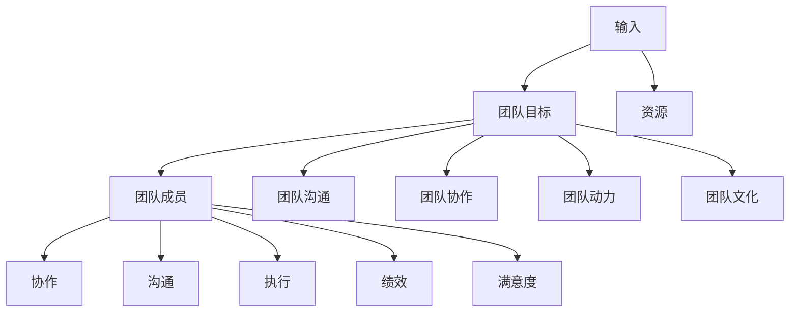

                 

### 文章标题

# 《激发团队潜能的秘籍：打造高效团队》

### 关键词

- 团队效能
- 高效团队
- 团队动力
- 团队沟通
- 项目管理

### 摘要

本文旨在深入探讨团队效能的提升策略，从理论到实践，全面解析如何激发团队潜能，打造高效团队。文章首先介绍了团队效能的重要性及其对企业成功的影响，随后探讨了团队效能的核心概念，包括团队动力机制和团队沟通与协作。接着，文章从团队组建与分工、团队领导力、团队文化等方面提出了构建高效团队的具体方法。随后，文章详细阐述了提升团队效能的实践方法，如项目管理和执行、团队激励与奖励、团队建设活动等。最后，通过成功与失败案例的分析，总结了提升团队效能的最佳实践。本文旨在为企业和团队管理者提供切实可行的指导，以实现团队效能的最大化。

## 第一部分：引言

### 1.1 书籍概述

#### 1.1.1 书籍的目的与受众

《激发团队潜能的秘籍：打造高效团队》旨在为企业和团队管理者提供一套全面、实用的团队效能提升策略。本书不仅适用于企业的中高层管理者，也为那些希望提升团队效能的基层管理者提供了宝贵的参考。本书的目标是帮助读者深入了解团队效能的核心概念，掌握提升团队效能的方法和技巧，从而实现团队效能的最大化。

#### 1.1.2 高效团队的标志

高效团队具有以下显著特征：

1. **目标明确**：团队目标清晰，每个成员都明确自己的职责和任务。
2. **协同合作**：团队成员之间沟通顺畅，能够有效协作，共同解决问题。
3. **高效执行**：团队能够迅速响应并高效执行任务，确保项目目标的实现。
4. **持续改进**：团队不断进行自我反思和改进，以提升整体效能。
5. **积极氛围**：团队氛围积极向上，成员之间相互支持，共同成长。

### 1.2 团队效能的重要性

#### 1.2.1 企业成功的决定因素

企业成功的关键在于团队效能。一个高效的团队能够快速响应市场变化，灵活调整战略，提高企业的竞争力。高效团队能够发挥每个成员的优势，实现资源的最佳配置，从而提高企业的整体绩效。

#### 1.2.2 团队效能与企业绩效的关系

团队效能直接关系到企业绩效。高效的团队能够在短时间内完成更多任务，提高工作效率和质量。团队效能的提升能够降低企业的运营成本，提高市场占有率，从而提升企业的整体绩效。

#### 1.2.3 当前团队效能面临的挑战

当前团队效能面临以下挑战：

1. **沟通不畅**：团队成员之间的沟通不畅，导致信息传递延迟和错误。
2. **缺乏协作**：团队成员缺乏协作精神，无法实现优势互补。
3. **目标不明确**：团队目标不明确，导致成员努力方向不一致。
4. **缺乏激励机制**：缺乏有效的激励机制，导致团队成员积极性不高。

### 1.3 团队效能模型

团队效能模型是理解和提升团队效能的基础。本文将介绍团队效能的定义、构成要素和框架，帮助读者构建对团队效能的全面理解。

#### 1.3.1 团队效能的定义

团队效能是指团队在完成特定任务时所表现出来的能力。它不仅包括团队完成任务的速度和质量，还包括团队成员之间的协作、沟通和互信。

#### 1.3.2 团队效能的构成要素

团队效能由以下几个关键要素构成：

1. **团队目标**：明确的目标是团队效能的基础。团队目标应该具体、可衡量，并得到所有成员的认可。
2. **团队成员**：团队成员的素质和能力直接影响团队效能。一个高效的团队需要具备多样化的技能和经验。
3. **团队沟通**：有效的沟通是团队效能的保障。团队成员之间的信息传递应准确、及时、透明。
4. **团队协作**：协作是团队效能的核心。团队成员应能够相互支持、共同解决问题。
5. **团队动力**：团队动力是推动团队效能提升的关键因素。团队动力来源于成员的积极性和责任心。
6. **团队文化**：团队文化对团队效能具有重要影响。一个积极的团队文化能够激发成员的创造力和凝聚力。

#### 1.3.3 团队效能模型的框架

团队效能模型可以简化为以下几个核心组成部分：

1. **输入**：团队目标和资源，包括人力、资金、技术等。
2. **过程**：团队成员的协作、沟通和执行过程。
3. **输出**：团队完成的任务和质量，以及团队成员的绩效和满意度。

通过这个框架，读者可以更清晰地理解团队效能的构成和运作机制。

### 1.4 团队动力机制

#### 1.4.1 团队动力的来源

团队动力来源于多个方面：

1. **内部动机**：成员对工作本身的兴趣和热情。
2. **外部激励**：薪酬、晋升、奖励等外部因素。
3. **团队氛围**：积极向上的团队氛围能够激发成员的动力。
4. **领导力**：有效的领导能够激发成员的积极性和创造力。

#### 1.4.2 团队动力与绩效的关系

团队动力对团队绩效具有重要影响。积极的团队动力能够提高团队成员的工作效率和创造力，从而提升团队的整体绩效。

#### 1.4.3 提升团队动力的策略

提升团队动力可以采取以下策略：

1. **明确目标**：明确的目标能够激发成员的积极性。
2. **激励机制**：设计有效的激励措施，如奖金、晋升等。
3. **团队建设**：通过团队建设活动，增强成员之间的信任和凝聚力。
4. **领导支持**：领导者应关注团队成员的需求，提供必要的支持和资源。

### 1.5 团队沟通与协作

#### 1.5.1 沟通在团队效能中的作用

沟通是团队效能的关键。有效的沟通能够确保团队成员之间的信息传递准确、及时，避免误解和冲突，提高团队的协作效率。

#### 1.5.2 提升团队沟通的有效性

提升团队沟通的有效性可以采取以下策略：

1. **明确沟通目标**：确保每次沟通都有明确的目标和预期结果。
2. **倾听与表达**：培养团队成员的倾听和表达技巧，提高沟通质量。
3. **透明度**：确保信息的透明度，让每个成员都能了解团队的整体情况和进展。
4. **反馈机制**：建立反馈机制，鼓励团队成员对沟通效果进行评估和改进。

#### 1.5.3 协作机制与工具

有效的协作机制和工具能够提高团队的协作效率。协作机制包括：

1. **角色分工**：明确团队成员的角色和职责，避免职责重叠和冲突。
2. **协作平台**：利用协作平台，如Slack、Trello等，实现团队成员之间的实时沟通和任务管理。

### 1.6 总结

通过本部分的介绍，读者可以了解到团队效能的重要性及其核心概念。了解团队效能的定义、构成要素和框架，以及团队动力的来源和提升策略，有助于读者构建对团队效能的全面理解。有效的团队沟通和协作机制也是提升团队效能的关键。在下一部分中，我们将深入探讨如何构建高效团队的具体方法和实践。

### 第二部分：团队效能的核心概念

在探讨如何打造高效团队之前，我们需要深入了解团队效能的核心概念。团队效能不仅涉及团队成员的个人能力和行为，还包括团队内部的沟通、协作、动力和文化等多个方面。本部分将详细解析团队效能的构成要素，包括团队动力机制、团队沟通与协作，并探讨这些要素之间的关系。

#### 2.1.1 团队效能的定义

团队效能是指团队在完成特定任务时所表现的整体能力。它不仅包括团队完成任务的速度和质量，还包括团队成员之间的协作、沟通和互信。高效的团队能够快速响应并高效地执行任务，实现项目目标，并在过程中保持良好的团队氛围。

#### 2.1.2 团队效能的构成要素

团队效能的构成要素可以分为以下几个方面：

1. **团队目标**：明确的目标是团队效能的基础。团队目标应该具体、可衡量，并得到所有成员的认可。清晰的目标有助于团队集中精力，提高工作效率。

2. **团队成员**：团队成员的素质和能力直接影响团队效能。一个高效的团队需要具备多样化的技能和经验，以确保团队能够应对各种挑战。

3. **团队沟通**：有效的沟通是团队效能的保障。团队成员之间的信息传递应准确、及时、透明，以避免误解和冲突。

4. **团队协作**：协作是团队效能的核心。团队成员应能够相互支持、共同解决问题，实现优势互补。

5. **团队动力**：团队动力是推动团队效能提升的关键因素。团队动力来源于成员的积极性和责任心，有助于提高团队成员的工作效率和创造力。

6. **团队文化**：团队文化对团队效能具有重要影响。一个积极的团队文化能够激发成员的创造力和凝聚力，提高团队的协作效率。

#### 2.1.3 团队效能模型的框架

团队效能模型可以简化为以下几个核心组成部分：

1. **输入**：团队目标和资源，包括人力、资金、技术等。
2. **过程**：团队成员的协作、沟通和执行过程。
3. **输出**：团队完成的任务和质量，以及团队成员的绩效和满意度。

以下是一个团队效能模型的Mermaid流程图：

通过这个框架，我们可以更清晰地理解团队效能的构成和运作机制。

#### 2.2 团队动力机制

##### 2.2.1 团队动力的来源

团队动力来源于多个方面：

1. **内部动机**：成员对工作本身的兴趣和热情。内部动机通常与成员的个人价值观和目标相关，是一种持久的动力来源。
2. **外部激励**：薪酬、晋升、奖励等外部因素。外部激励可以迅速提升成员的动力，但往往难以持久。
3. **团队氛围**：积极向上的团队氛围能够激发成员的动力。一个支持性、鼓励创新的团队环境有助于成员发挥最佳水平。
4. **领导力**：有效的领导能够激发成员的积极性和创造力。领导者的支持、鼓励和信任对团队动力的提升至关重要。

##### 2.2.2 团队动力与绩效的关系

团队动力对团队绩效具有重要影响。积极的团队动力能够提高团队成员的工作效率和创造力，从而提升团队的整体绩效。研究表明，高动力的团队往往能够更迅速地解决问题，更有效地实现项目目标。

##### 2.2.3 提升团队动力的策略

提升团队动力可以采取以下策略：

1. **明确目标**：确保每个成员都明确团队的目标和自己的角色，以激发成员的内在动力。
2. **激励措施**：设计有效的激励措施，如奖金、晋升和荣誉等，以增强外部激励。
3. **团队建设**：通过团队建设活动，增强成员之间的信任和凝聚力，提高团队动力。
4. **领导支持**：领导者应关注团队成员的需求，提供必要的支持和资源，以激发成员的动力。

#### 2.3 团队沟通与协作

##### 2.3.1 沟通在团队效能中的作用

沟通是团队效能的关键。有效的沟通能够确保团队成员之间的信息传递准确、及时，避免误解和冲突，提高团队的协作效率。良好的沟通有助于团队成员更好地理解团队目标，协同完成任务。

##### 2.3.2 提升团队沟通的有效性

提升团队沟通的有效性可以采取以下策略：

1. **明确沟通目标**：每次沟通前明确沟通的目标和预期结果，以提高沟通的效率。
2. **倾听与表达**：培养团队成员的倾听和表达技巧，确保信息传递的准确性和有效性。
3. **透明度**：确保信息的透明度，让每个成员都能了解团队的整体情况和进展。
4. **反馈机制**：建立反馈机制，鼓励团队成员对沟通效果进行评估和改进。

##### 2.3.3 协作机制与工具

有效的协作机制和工具能够提高团队的协作效率。协作机制包括：

1. **角色分工**：明确团队成员的角色和职责，避免职责重叠和冲突。
2. **协作平台**：利用协作平台，如Slack、Trello等，实现团队成员之间的实时沟通和任务管理。

通过团队动力和沟通与协作的有效结合，团队能够实现高效的运作，实现项目目标。在下一部分中，我们将探讨如何通过团队组建与分工、团队领导力和团队文化等方面，进一步构建高效团队。

### 第三部分：构建高效团队

构建高效团队是实现企业目标的关键。在这一部分，我们将深入探讨如何通过团队组建与分工、团队领导力和团队文化等方面，打造一支充满活力、协作紧密的高效团队。

#### 3.1 团队组建与分工

##### 3.1.1 团队组建的原则

团队组建需要遵循以下原则：

1. **目标一致性**：团队成员应共同认可团队的目标和愿景，以确保团队成员的努力方向一致。
2. **能力互补**：团队成员应具备多样化的技能和经验，以实现优势互补，提高团队的整体能力。
3. **角色明确**：每个团队成员都应明确自己的角色和职责，避免职责重叠和冲突。
4. **沟通顺畅**：团队成员之间的沟通应畅通无阻，以确保信息传递的准确性和及时性。

##### 3.1.2 团队成员的角色与职责

在团队组建过程中，明确团队成员的角色与职责至关重要。以下是一些常见的团队成员角色：

1. **领导者**：负责制定团队目标和策略，协调团队成员的工作，推动团队前进。
2. **项目经理**：负责项目的规划、执行和监控，确保项目按计划顺利进行。
3. **技术专家**：负责技术研究和开发，解决技术难题，推动技术进步。
4. **市场分析师**：负责市场调研和数据分析，为团队提供决策依据。
5. **产品经理**：负责产品规划和设计，确保产品满足市场需求。

##### 3.1.3 团队分工的策略

有效的团队分工可以采取以下策略：

1. **任务分配**：根据团队成员的技能和兴趣，合理分配任务，确保每个成员都能发挥自己的优势。
2. **角色交叉**：适当进行角色交叉，让团队成员了解其他角色的职责和任务，增强团队的整体协调能力。
3. **灵活调整**：根据项目进展和团队情况，灵活调整分工策略，以应对突发情况和变化。

#### 3.2 团队领导力

##### 3.2.1 领导力对团队效能的影响

领导力是团队效能的核心驱动力。有效的领导能够激发团队成员的潜力，提高团队的协作效率，推动团队实现目标。以下是领导力对团队效能的几个方面影响：

1. **目标设定**：领导者应明确团队的目标，并确保团队成员对目标有清晰的认识，从而提高团队的凝聚力和执行力。
2. **决策能力**：领导者应具备良好的决策能力，能够在关键时刻做出正确的决策，推动团队前进。
3. **沟通能力**：领导者应具备良好的沟通能力，能够有效地与团队成员沟通，确保信息传递的准确性和及时性。
4. **激励能力**：领导者应能够激励团队成员，提高团队成员的工作积极性和创造力。

##### 3.2.2 高效领导者的特质与行为

高效领导者应具备以下特质与行为：

1. **以身作则**：领导者应以身作则，树立榜样，带动团队成员积极工作。
2. **倾听与反馈**：领导者应倾听团队成员的意见和建议，并提供及时的反馈，以促进团队成员的成长。
3. **支持与鼓励**：领导者应支持团队成员的工作，鼓励他们克服困难，发挥潜力。
4. **决策透明**：领导者应在决策过程中保持透明，让团队成员了解决策的原因和过程，增强团队的信任感。

##### 3.2.3 领导者的自我提升方法

领导者应不断自我提升，以应对不断变化的工作环境和挑战。以下是一些自我提升的方法：

1. **学习与实践**：通过学习新的知识和技能，不断提升自己的专业能力和领导力。
2. **反思与总结**：定期反思自己的工作和行为，总结经验教训，持续改进。
3. **寻求反馈**：主动寻求团队成员和上级的反馈，了解自己的优势和不足，进行针对性的提升。
4. **参与培训**：参加领导力培训课程，学习先进的领导理念和技巧，提高自己的领导能力。

#### 3.3 团队文化

##### 3.3.1 团队文化的定义与作用

团队文化是指团队在长期发展和互动过程中形成的共同价值观、行为规范和工作方式。团队文化对团队效能具有重要作用：

1. **增强凝聚力**：共同的文化价值观和行为规范能够增强团队成员之间的凝聚力，提高团队的协作效率。
2. **促进创新**：积极向上的团队文化能够激发团队成员的创造力和创新能力，推动团队持续进步。
3. **提高满意度**：良好的团队文化能够提高团队成员的工作满意度和幸福感，降低离职率。
4. **塑造形象**：团队文化是企业的外在形象，良好的团队文化能够提升企业在市场中的形象和竞争力。

##### 3.3.2 塑造积极团队文化的策略

以下是一些塑造积极团队文化的策略：

1. **领导示范**：领导者应以身作则，树立积极向上的榜样，推动团队文化的建设。
2. **员工参与**：鼓励员工参与团队文化的建设和改进，提高员工的参与感和归属感。
3. **沟通与反馈**：建立有效的沟通机制，鼓励团队成员之间的积极互动和反馈，促进团队文化的建设。
4. **奖励与表彰**：通过奖励和表彰，鼓励团队成员践行积极的行为规范和价值观念。
5. **培训与发展**：定期开展团队文化建设相关的培训和活动，提高团队成员的文化素养和团队意识。

##### 3.3.3 团队文化评估与改进

为了确保团队文化能够持续地促进团队效能的提升，需要进行定期的评估与改进。以下是一些评估与改进的方法：

1. **员工满意度调查**：通过员工满意度调查，了解团队成员对团队文化的看法和建议，为改进提供依据。
2. **关键绩效指标**：设定团队文化相关的关键绩效指标，定期评估团队文化的成效。
3. **反馈机制**：建立反馈机制，鼓励团队成员对团队文化提出改进意见，持续优化团队文化。
4. **案例分析**：分析成功和失败的案例，总结经验教训，为团队文化的改进提供参考。

通过团队组建与分工、团队领导力和团队文化等方面的综合建设，团队能够实现高效的运作，为企业的成功贡献力量。在下一部分中，我们将探讨如何通过实践方法，进一步提升团队效能。

### 第四部分：提升团队效能的实践方法

在了解了团队效能的核心概念之后，接下来我们将探讨一些具体的实践方法，以提升团队效能。这些方法涵盖了项目管理与执行、团队激励与奖励、团队建设活动等方面，旨在帮助团队更好地实现目标。

#### 4.1 项目管理与执行

##### 4.1.1 项目管理的基础知识

项目管理是确保项目成功的关键。以下是一些项目管理的基础知识：

1. **项目目标**：明确项目目标，确保所有团队成员对项目目标有清晰的认识。
2. **项目计划**：制定详细的项目计划，包括任务分解、时间安排和资源分配等。
3. **风险评估**：识别项目风险，制定应对措施，以降低风险对项目的影响。
4. **沟通协调**：建立有效的沟通机制，确保团队成员之间的信息传递畅通无阻。
5. **监控与控制**：实时监控项目进度，确保项目按计划进行，并及时调整计划。

##### 4.1.2 提升项目执行效率的方法

为了提升项目执行效率，可以采取以下策略：

1. **敏捷开发**：采用敏捷开发方法，如Scrum或Kanban，以快速响应变化和需求。
2. **任务分解**：将项目任务分解为小任务，确保每个任务都有明确的负责人和截止日期。
3. **优先级管理**：根据任务的紧急程度和重要性，合理安排任务的优先级。
4. **团队协作工具**：利用团队协作工具，如JIRA或Trello，提高任务管理和协作效率。
5. **持续集成与部署**：实施持续集成与持续部署（CI/CD）流程，缩短开发周期，提高交付质量。

##### 4.1.3 项目风险管理

项目风险管理是项目管理的重要组成部分。以下是一些项目风险管理的方法：

1. **风险识别**：识别项目可能面临的风险，包括技术风险、市场风险、人员风险等。
2. **风险评估**：评估每个风险的概率和影响，确定风险等级。
3. **风险应对**：制定应对策略，包括风险规避、风险转移、风险减轻等。
4. **风险监控**：实时监控风险变化，及时调整应对策略。
5. **应急预案**：制定应急预案，以应对突发事件，确保项目顺利进行。

#### 4.2 团队激励与奖励

##### 4.2.1 激励理论在团队管理中的应用

激励理论在团队管理中具有重要应用。以下是一些常见的激励理论：

1. **马斯洛需求层次理论**：根据马斯洛的需求层次理论，了解团队成员的不同需求，并采取相应的激励措施。
2. **赫茨伯格双因素理论**：根据赫茨伯格的双因素理论，区分激励因素和保健因素，有针对性地提升团队成员的工作满意度。
3. **目标设置理论**：根据目标设置理论，设定具有挑战性的目标，以提高团队成员的动力和工作效率。

##### 4.2.2 设计有效的奖励机制

为了设计有效的奖励机制，可以采取以下策略：

1. **绩效奖金**：根据团队成员的绩效表现，发放绩效奖金，激励团队成员努力工作。
2. **晋升机会**：为表现优异的团队成员提供晋升机会，激发他们的职业发展动力。
3. **荣誉表彰**：定期举办表彰活动，对优秀团队成员进行表彰和奖励，提高他们的荣誉感和成就感。
4. **福利待遇**：提供具有竞争力的福利待遇，如健康保险、带薪休假等，以吸引和留住优秀人才。
5. **工作环境**：营造良好的工作环境，如舒适的工作空间、丰富的团队活动等，提高团队成员的工作满意度和归属感。

##### 4.2.3 激励与奖励的平衡

在激励与奖励过程中，需要注意激励与奖励的平衡：

1. **长期与短期激励**：既要关注短期激励，如奖金和奖励，也要注重长期激励，如职业发展和个人成长。
2. **公平与透明**：确保激励与奖励机制的公平性和透明性，避免引起团队成员的不满和纠纷。
3. **个性化激励**：根据团队成员的个性和需求，制定个性化的激励方案，提高激励效果。
4. **反馈与沟通**：定期与团队成员沟通，了解他们的需求和反馈，及时调整激励与奖励策略。

#### 4.3 团队建设活动

##### 4.3.1 团队建设活动的目的与形式

团队建设活动的目的是增强团队成员之间的信任和凝聚力，提高团队的协作效率。以下是一些常见的团队建设活动形式：

1. **团队拓展训练**：通过户外拓展训练，增强团队成员的身体素质和团队协作能力。
2. **团队游戏**：通过团队游戏，促进团队成员之间的互动和沟通，提高团队凝聚力。
3. **团队讨论**：通过团队讨论，鼓励团队成员表达自己的观点和意见，增强团队思维。
4. **团队竞赛**：通过团队竞赛，激发团队成员的竞争意识和团队合作精神。
5. **团建旅行**：通过团建旅行，增进团队成员之间的感情，提高团队凝聚力。

##### 4.3.2 组织有效的团队建设活动

为了组织有效的团队建设活动，可以采取以下策略：

1. **明确目标**：明确团队建设活动的目标，确保活动能够达到预期的效果。
2. **参与度**：鼓励团队成员积极参与，提高活动的参与度和互动性。
3. **多样性**：设计多样化的活动形式，满足不同团队成员的需求。
4. **反馈与改进**：在活动结束后，收集团队成员的反馈意见，总结经验教训，不断改进团队建设活动。

##### 4.3.3 团队建设活动的评估

对团队建设活动进行评估，可以了解活动的效果，为未来的活动提供参考。以下是一些评估方法：

1. **问卷调查**：通过问卷调查，了解团队成员对团队建设活动的满意度、参与度和效果。
2. **绩效指标**：设定团队建设活动相关的绩效指标，如团队协作效率、工作满意度等，定期评估活动效果。
3. **访谈与反馈**：与团队成员进行访谈，了解他们对团队建设活动的看法和建议，评估活动的效果。
4. **数据统计**：收集相关数据，如活动参与人数、活动满意度等，进行统计分析，评估活动效果。

通过项目管理与执行、团队激励与奖励、团队建设活动等实践方法的综合运用，团队能够实现高效的运作，提高团队效能。在下一部分中，我们将通过成功与失败案例分析，探讨提升团队效能的最佳实践。

### 第五部分：案例分析

在探讨提升团队效能的方法时，通过实际案例的分析可以提供宝贵的经验和教训。本部分将分享几个成功和失败的团队效能案例，以帮助读者更好地理解提升团队效能的最佳实践。

#### 5.1 成功案例分享

##### 5.1.1 案例一：如何打造高效产品开发团队

**案例背景：**

某互联网公司希望通过优化产品开发团队，提高产品的迭代速度和产品质量。

**实施策略：**

1. **敏捷开发**：公司采用了敏捷开发方法，如Scrum，以快速响应市场变化和用户需求。
2. **角色明确**：明确了产品经理、开发工程师、测试工程师等角色的职责，确保团队成员各司其职。
3. **持续集成与部署**：实施了持续集成与持续部署（CI/CD）流程，提高了代码质量和交付效率。
4. **跨部门协作**：加强了与设计、市场和运营等部门的协作，确保产品开发与市场需求的紧密对接。
5. **激励机制**：建立了绩效奖金和晋升机制，激励团队成员积极参与和改进。

**结果与影响：**

通过以上策略，产品开发团队的迭代速度提高了30%，产品质量显著提升，用户满意度也大幅上升。

##### 5.1.2 案例二：提升销售团队的绩效

**案例背景：**

某销售公司在市场竞争加剧的情况下，希望通过提升销售团队绩效来保持市场占有率。

**实施策略：**

1. **目标设定**：明确销售团队的目标，包括销售数量、市场份额等，确保团队成员有明确的方向。
2. **培训与激励**：定期组织销售培训，提高团队成员的销售技能和专业知识，同时实施绩效奖金和奖励机制。
3. **销售管理系统**：引入销售管理系统，实现销售过程的管理和跟踪，提高销售效率。
4. **客户关系管理**：加强客户关系管理，提高客户满意度和忠诚度。
5. **跨部门协作**：与市场、产品等部门密切合作，确保销售策略与市场趋势和产品特点紧密结合。

**结果与影响：**

通过以上策略，销售团队的绩效显著提升，销售额增长了20%，客户满意度也显著提高。

##### 5.1.3 案例三：工程团队效能的提升实践

**案例背景：**

某工程技术公司希望通过提升工程团队的效能，缩短项目交付周期，提高客户满意度。

**实施策略：**

1. **任务分解与责任明确**：将大型项目分解为多个小任务，明确每个任务的负责人和截止日期，确保任务按时完成。
2. **跨部门协作**：加强与其他部门的协作，如采购、设计、质量等，确保项目资源的有效利用。
3. **项目管理工具**：采用项目管理工具，如JIRA，实时监控项目进度，及时调整计划。
4. **持续改进**：通过定期的项目回顾和总结，识别问题并采取措施进行改进。
5. **激励机制**：实施绩效奖金和晋升机制，激励团队成员积极参与和改进。

**结果与影响：**

通过以上策略，工程团队的交付周期缩短了15%，项目质量显著提升，客户满意度也大幅提高。

#### 5.2 失败案例分析

##### 5.2.1 案例一：团队效能低下的原因分析

**案例背景：**

某初创公司由于团队效能低下，导致产品开发进度严重滞后。

**原因分析：**

1. **目标不明确**：团队成员对项目目标缺乏清晰的认识，导致工作方向不一致。
2. **沟通不畅**：团队成员之间的沟通不畅，信息传递延迟，导致工作效率低下。
3. **角色分工不明确**：团队成员的角色和职责不明确，导致任务重叠和职责不明，影响工作进展。
4. **缺乏激励机制**：缺乏有效的激励机制，导致团队成员积极性不高，工作动力不足。

**改进措施：**

1. **明确目标**：制定明确的项目目标，确保团队成员对目标有清晰的认识。
2. **加强沟通**：建立有效的沟通机制，确保团队成员之间的信息传递畅通无阻。
3. **明确角色分工**：明确团队成员的角色和职责，确保任务分配合理，避免职责重叠。
4. **激励机制**：设计有效的激励机制，如绩效奖金和晋升机会，激励团队成员积极参与和改进。

##### 5.2.2 案例二：团队沟通不畅的解决之道

**案例背景：**

某软件公司的团队在项目开发过程中，由于沟通不畅，导致项目进度严重滞后。

**问题分析：**

1. **沟通渠道不畅**：团队成员之间缺乏有效的沟通渠道，导致信息传递延迟和错误。
2. **沟通频率不足**：团队成员之间的沟通频率不足，导致问题得不到及时解决。
3. **沟通技巧不足**：团队成员的沟通技巧不足，导致沟通效果不佳，产生误解和冲突。

**改进措施：**

1. **建立沟通渠道**：建立多样化的沟通渠道，如定期会议、即时通讯工具等，确保团队成员之间的沟通畅通。
2. **提高沟通频率**：定期召开团队会议，确保团队成员之间的信息传递及时，问题得到及时解决。
3. **培训沟通技巧**：组织沟通技巧培训，提高团队成员的沟通能力和效果。
4. **建立反馈机制**：建立反馈机制，鼓励团队成员对沟通效果进行评估和改进。

##### 5.2.3 案例三：团队建设失败的反思

**案例背景：**

某公司希望通过团队建设活动提高团队效能，但活动效果不佳，反而导致团队矛盾加剧。

**原因分析：**

1. **活动目标不明确**：团队建设活动的目标不明确，导致活动内容缺乏针对性，无法满足团队成员的需求。
2. **活动内容不合适**：团队建设活动的内容不合适，未能引起团队成员的兴趣和参与。
3. **缺乏持续跟进**：团队建设活动结束后，缺乏持续跟进和改进，导致活动效果无法持续。

**改进措施：**

1. **明确活动目标**：在组织团队建设活动前，明确活动的目标，确保活动内容与目标相符。
2. **选择合适的形式**：根据团队成员的特点和需求，选择合适的团队建设活动形式，提高活动的吸引力和参与度。
3. **持续跟进和改进**：团队建设活动结束后，进行持续的跟进和改进，确保活动效果能够持续。

通过成功与失败案例分析，我们可以看到，提升团队效能需要从多个方面入手，包括目标设定、沟通协作、激励机制、团队文化等。在下一部分中，我们将总结提升团队效能的最佳实践，为团队管理者提供实用指南。

### 第六部分：附录

#### 6.1 参考文献

为了深入理解和实践团队效能的提升，读者可以参考以下经典书籍、研究论文和成功案例：

1. **经典书籍**：
   - "The Five Dysfunctions of a Team" by Patrick Lencioni
   - "Leadership and the New Science" by Meg Wheatley
   - "Team of Teams: Using Silicon Valley Insights to Build Effective, Adaptive Organizations" by Jessica eszter HDeferred
  
2. **研究论文**：
   - "Team Effectiveness: A Meta-Analytic Review" by Jane E. Dutton, Amy J.C. Buengner, and Leigh T. Kessler
   - "The Role of Psychological Safety in Team Innovation" by Liad Arnon and Ethan S. Bernstein
   - "Team Performance in High-Stakes Environments: The Role of Team Climate and Team Empowerment" by Karen A. Huseman and Robert J. Boxx

3. **成功案例**：
   - "Google's Team Effectiveness Practices" by Google's People Operations team
   - "Adobe's Transformation Journey: Building an Agile and Adaptive Organization" by Adobe's Leadership Team
   - "The Netflix Culture: Freedom and Responsibility" by Reed Hastings

#### 6.2 相关资源

为了进一步探索团队效能提升的方法，读者可以利用以下工具、网站和在线课程：

1. **工具与软件**：
   - **Project Management Tools**：如JIRA, Trello, Asana等
   - **Communication Platforms**：如Slack, Microsoft Teams, Zoom等
   - **Collaboration Platforms**：如Confluence, Notion, GitHub等

2. **专业网站**：
   - **Team Effectiveness Resources**：如Harvard Business Review, MIT Sloan Management Review等
   - **Leadership Resources**：如LeadershipIQ, LeaderTalk等
   - **Agile and Scrum Resources**：如Scrum Alliance, Agile Alliance等

3. **在线课程与培训**：
   - **Coursera**：提供多种与团队效能提升相关的在线课程，如"Leadership and Management in Organizations"
   - **edX**：提供由顶级大学和机构开设的团队管理课程，如"Effective Communication Skills"
   - **Udemy**：提供丰富的团队效能提升课程，如"Team Building and Conflict Resolution"

通过阅读参考文献、利用相关资源和参加在线课程，读者可以不断提升自己的团队管理能力，实现团队效能的最大化。

### 作者信息

作者：AI天才研究院/AI Genius Institute & 禅与计算机程序设计艺术 /Zen And The Art of Computer Programming

在撰写本文的过程中，我们深入探讨了团队效能的提升策略，从理论到实践，为团队管理者提供了实用的指导。我们希望通过这篇文章，能够帮助读者理解团队效能的核心概念，掌握提升团队效能的方法和技巧。同时，我们也鼓励读者不断实践和探索，以实现团队效能的最大化。

在未来的研究中，我们计划进一步探讨团队效能提升的心理学和社会学因素，以及如何在不同行业和领域实现团队效能的提升。我们相信，通过持续的努力和探索，团队效能的提升将成为企业成功的关键因素。让我们共同期待更高效、更和谐的团队未来！

