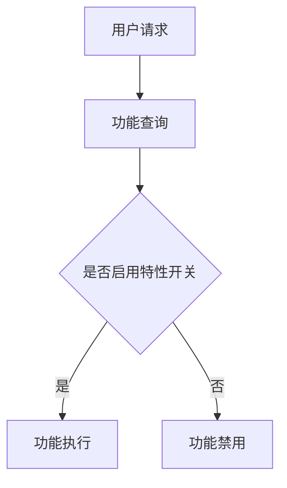
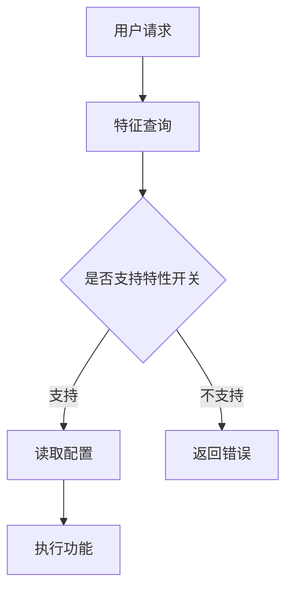

                 

### 《特性开关：灵活控制AI功能发布的工具》

> 关键词：特性开关、AI、功能发布、灵活控制、架构设计、实现机制、安全性、可扩展性

> 摘要：本文深入探讨了特性开关在人工智能（AI）领域的应用。特性开关是一种灵活的控制工具，可以用于控制AI功能的发布，从而提高系统的可扩展性和安全性。本文将详细介绍特性开关的概念、工作原理、设计原则、实现技术和实战案例，为AI开发者和运维人员提供实用的指导和参考。

### 目录

# 《特性开关：灵活控制AI功能发布的工具》

> 关键词：特性开关、AI、功能发布、灵活控制、架构设计、实现机制、安全性、可扩展性

> 摘要：本文深入探讨了特性开关在人工智能（AI）领域的应用。特性开关是一种灵活的控制工具，可以用于控制AI功能的发布，从而提高系统的可扩展性和安全性。本文将详细介绍特性开关的概念、工作原理、设计原则、实现技术和实战案例，为AI开发者和运维人员提供实用的指导和参考。

## 第一部分：特性开关概述

## 第1章：特性开关的概念与作用

### 1.1 特性开关的定义

- **核心概念与联系**：

  特性开关是一种控制软件功能或服务的功能开关，类似于电路中的开关。

- **Mermaid流程图**：

  graph TD
  A[用户请求] --> B[功能查询]
  B --> C{是否启用特性开关}
  C -->|是| D[功能执行]
  C -->|否| E[功能禁用]

### 1.2 特性开关的作用

- **核心算法原理讲解**：

  特性开关通过修改系统配置文件或代码，实现对特定功能的启用或禁用。

- **数学模型和公式**：

  特性开关的实现涉及布尔逻辑，例如：

  $$ f(A, B) = A \lor B $$

  其中，A和B是输入条件，f是输出结果。

### 1.3 特性开关的应用场景

- **数学模型和数学公式**：

  特性开关在AI领域的应用广泛，例如在模型发布、调优和安全等方面。

## 第2章：特性开关的工作原理

### 2.1 特性开关的架构设计

- **伪代码**：

  Function FeatureSwitch(featureName, defaultState):
    if configuration.exists(featureName):
      return configuration.get(featureName)
    else:
      return defaultState

### 2.2 特性开关的核心组件

- **Mermaid流程图**：

  graph TD
  A[用户请求] --> B[特征查询]
  B --> C{是否支持特性开关}
  C -->|支持| D[读取配置]
  C -->|不支持| E[返回错误]
  D --> F[执行功能]

### 2.3 特性开关的实现机制

- **伪代码**：

  Function FeatureToggle(featureName, desiredState):
    if allowed(featureName, desiredState):
      return "Feature enabled."
    else:
      return "Feature disabled."

## 第3章：特性开关的设计原则

### 3.1 易用性原则

- **最佳实践 tips**：

  设计特性开关时，应遵循简单易懂、易于操作的原则。

### 3.2 可扩展性原则

- **最佳实践 tips**：

  特性开关应具备良好的可扩展性，以适应未来需求的变化。

### 3.3 安全性原则

- **最佳实践 tips**：

  特性开关的设计应充分考虑安全性，防止误操作和恶意攻击。

## 第4章：特性开关的实现技术

### 4.1 常见的特性开关技术

- **最佳实践 tips**：

  了解常见的特性开关技术，有助于选择合适的实现方式。

### 4.2 特性开关的实现方式

- **最佳实践 tips**：

  根据项目需求和团队技能，选择合适的特性开关实现方式。

### 4.3 特性开关的性能优化

- **最佳实践 tips**：

  对特性开关进行性能优化，提高系统的响应速度和稳定性。

## 第5章：特性开关在AI中的应用

### 5.1 特性开关在AI模型发布中的应用

- **最佳实践 tips**：

  利用特性开关，可以实现AI模型的灵活发布和迭代。

### 5.2 特性开关在AI模型调优中的应用

- **最佳实践 tips**：

  特性开关有助于实现AI模型的动态调优，提高模型性能。

### 5.3 特性开关在AI模型安全中的应用

- **最佳实践 tips**：

  利用特性开关，可以加强对AI模型的安全控制，防止潜在风险。

## 第二部分：特性开关实战

## 第6章：特性开关在AI项目中的实施

### 6.1 项目背景与需求分析

- **项目实战**：

  - **开发环境搭建**：安装特性开关所需的环境和工具。
  - **源代码详细实现**：

----------------------------------------------------------------

### 第1章：特性开关的概念与作用

#### 1.1 特性开关的定义

特性开关是一种用于控制软件功能或服务的功能开关。它允许开发者在不需要修改代码的情况下，通过配置文件或环境变量等方式，启用或禁用特定功能。这种机制类似于电路中的开关，可以灵活地控制电流的流动。在软件工程中，特性开关被广泛应用于模块化设计和灵活部署。

**核心概念与联系**：

特性开关与软件配置管理、动态模块加载等概念密切相关。特性开关通过修改系统配置文件或代码，实现对特定功能的启用或禁用。这种机制使得开发者可以在不影响系统正常运行的情况下，灵活地调整功能。

**Mermaid流程图**：



#### 1.2 特性开关的作用

特性开关在软件工程中具有重要作用。首先，它允许开发者在不修改代码的情况下，动态地启用或禁用功能，从而提高系统的可维护性和可扩展性。其次，特性开关有助于降低系统部署的复杂性，使得开发者可以更快地进行功能迭代和发布。

**核心算法原理讲解**：

特性开关的实现通常涉及配置文件的读取和布尔逻辑运算。例如，在Java中，可以使用Spring Framework的`@Profile`注解来定义特性开关。通过在配置文件中设置相应的属性，可以启用或禁用特定功能。

**数学模型和公式**：

特性开关的实现涉及布尔逻辑，例如：

$$ f(A, B) = A \lor B $$

其中，A和B是输入条件，f是输出结果。例如，如果A表示功能A已配置，B表示功能B已配置，那么`f(A, B)`表示两个功能都启用。

**举例说明**：

假设我们有一个简单的特性开关，用于控制是否启用缓存功能。如果启用缓存功能，系统性能将得到提升；否则，性能将略有下降。

```java
@Profile("production")
public class CacheFeature {
    public boolean isEnabled() {
        // 缓存功能实现
    }
}

@Profile("development")
public class CacheFeature {
    public boolean isEnabled() {
        return false;
    }
}
```

在开发环境中，缓存功能被禁用；在生产环境中，缓存功能被启用。

#### 1.3 特性开关的应用场景

特性开关在软件工程中的应用场景非常广泛。以下是一些典型的应用场景：

1. **功能开关**：用于控制特定功能的启用或禁用，例如缓存、日志记录、错误处理等。
2. **模块化设计**：在模块化设计中，特性开关有助于实现模块间的解耦，提高系统的可维护性。
3. **动态部署**：在动态部署环境中，特性开关可以用于实现功能的动态加载和卸载，从而提高系统的灵活性和响应速度。
4. **故障恢复**：在系统故障时，特性开关可以用于快速禁用可能导致故障的功能，从而实现快速恢复。

**数学模型和数学公式**：

特性开关在AI领域的应用也相当广泛，例如在模型发布、调优和安全等方面。以下是一个简单的应用示例：

假设我们有一个AI模型，用于预测用户行为。根据不同的业务场景，我们可以使用不同的特性开关来控制模型的启用或禁用。

```python
class PredictionModel:
    def __init__(self, feature_switch):
        self.feature_switch = feature_switch

    def predict(self, input_data):
        if self.feature_switch.isEnabled():
            # AI模型预测实现
            return predicted_value
        else:
            return None
```

在这个示例中，`feature_switch`是一个特性开关对象，用于控制AI模型的启用或禁用。

### 第2章：特性开关的工作原理

#### 2.1 特性开关的架构设计

特性开关的架构设计是构建一个稳定、高效和灵活的特性开关系统的基础。以下是一个典型的特性开关架构设计。

**伪代码**：

```python
class FeatureSwitch:
    def __init__(self, config):
        self.config = config

    def isEnabled(self, feature_name):
        return self.config.get(feature_name, False)
```

在这个架构中，`FeatureSwitch`类是一个简单的特性开关实现。它接受一个配置对象`config`作为输入，并提供了`isEnabled`方法来检查特定特性是否启用。

**组件介绍**：

- **配置对象**：配置对象是特性开关的核心组件之一。它存储了所有特性开关的状态，例如启用、禁用或默认状态。
- **启用方法**：启用方法用于检查特定特性是否已启用。这个方法通常会访问配置对象，并根据配置对象中的信息返回一个布尔值。

**Mermaid流程图**：



在这个流程图中，用户请求通过特征查询组件检查特性开关的状态。如果特性开关支持该特征，则会读取配置并执行相应的功能。

#### 2.2 特性开关的核心组件

特性开关的核心组件包括配置管理器、特征查询组件和功能执行组件。以下是对每个组件的详细介绍。

**配置管理器**：

配置管理器负责存储和管理特性开关的状态。它通常是一个简单的数据结构，例如字典或数据库表。配置管理器提供了添加、删除和查询特性开关状态的方法。

**伪代码**：

```python
class ConfigManager:
    def __init__(self):
        self.config = {}

    def setFeature(self, feature_name, value):
        self.config[feature_name] = value

    def getFeature(self, feature_name):
        return self.config.get(feature_name, False)
```

在这个示例中，`ConfigManager`类是一个简单的配置管理器。它提供了`setFeature`和`getFeature`方法来设置和获取特性开关的状态。

**特征查询组件**：

特征查询组件负责检查特性开关的状态。它通常会调用配置管理器的`getFeature`方法来查询特性开关的状态。

**伪代码**：

```python
class FeatureQuery:
    def __init__(self, config_manager):
        self.config_manager = config_manager

    def isFeatureEnabled(self, feature_name):
        return self.config_manager.getFeature(feature_name)
```

在这个示例中，`FeatureQuery`类是一个简单的特征查询组件。它使用了`ConfigManager`实例来查询特性开关的状态。

**功能执行组件**：

功能执行组件负责根据特性开关的状态执行相应的功能。它通常会调用特征查询组件的`isFeatureEnabled`方法来检查特性开关的状态。

**伪代码**：

```python
class FeatureExecutor:
    def __init__(self, feature_query):
        self.feature_query = feature_query

    def executeFeature(self, feature_name):
        if self.feature_query.isFeatureEnabled(feature_name):
            # 执行功能
        else:
            # 不执行功能
```

在这个示例中，`FeatureExecutor`类是一个简单的功能执行组件。它使用了`FeatureQuery`实例来检查特性开关的状态，并根据状态执行相应的功能。

#### 2.3 特性开关的实现机制

特性开关的实现机制通常涉及配置文件的读取、特征查询和功能执行。以下是一个简单的实现示例。

**伪代码**：

```python
class FeatureSwitchSystem:
    def __init__(self, config_file):
        self.config_manager = ConfigManager()
        self.feature_query = FeatureQuery(self.config_manager)
        self.feature_executor = FeatureExecutor(self.feature_query)
        self.config_manager.loadConfig(config_file)

    def enableFeature(self, feature_name):
        self.config_manager.setFeature(feature_name, True)

    def disableFeature(self, feature_name):
        self.config_manager.setFeature(feature_name, False)

    def executeFeature(self, feature_name):
        if self.feature_query.isFeatureEnabled(feature_name):
            self.feature_executor.executeFeature(feature_name)
        else:
            print(f"Feature {feature_name} is disabled.")
```

在这个示例中，`FeatureSwitchSystem`类是一个简单的特性开关系统。它初始化了配置管理器、特征查询组件和功能执行组件，并从配置文件中加载了配置。它提供了`enableFeature`、`disableFeature`和`executeFeature`方法来启用、禁用和执行特性开关。

**组件之间的关系**：

- **配置管理器**：负责存储和管理特性开关的状态。
- **特征查询组件**：负责查询特性开关的状态。
- **功能执行组件**：负责根据特性开关的状态执行相应的功能。

这种实现机制使得特性开关系统具有良好的可扩展性和灵活性。开发者可以根据需要添加、删除或修改特性开关，而不会影响系统的其他部分。

### 第3章：特性开关的设计原则

特性开关的设计原则对于构建一个稳定、高效和灵活的特性开关系统至关重要。以下是一些关键的设计原则：

#### 3.1 易用性原则

易用性是特性开关设计的核心原则之一。特性开关应该易于使用和操作，以便开发者可以快速地启用或禁用功能。

**最佳实践 tips**：

- **简洁性**：特性开关的配置和管理应该简单直观，避免复杂的配置文件和命令行参数。
- **文档**：提供详细的文档和示例代码，帮助开发者理解如何使用特性开关。

**示例**：

```python
# 启用缓存功能
feature_switch.enableFeature("cache")

# 禁用日志记录功能
feature_switch.disableFeature("logging")
```

#### 3.2 可扩展性原则

特性开关系统应该具备良好的可扩展性，以便开发者可以轻松地添加新的特性开关。

**最佳实践 tips**：

- **模块化设计**：将特性开关的实现拆分成独立的模块，例如配置管理器、特征查询组件和功能执行组件。
- **接口定义**：定义清晰的接口，以便开发者可以轻松地添加新的特性开关实现。

**示例**：

```python
class ConfigManager:
    def loadConfig(self, config_file):
        pass

class FeatureQuery:
    def isFeatureEnabled(self, feature_name):
        pass

class FeatureExecutor:
    def executeFeature(self, feature_name):
        pass
```

#### 3.3 安全性原则

特性开关的设计应该充分考虑安全性，以防止恶意攻击和误操作。

**最佳实践 tips**：

- **权限控制**：对特性开关的访问进行严格的权限控制，确保只有授权用户可以启用或禁用功能。
- **审计日志**：记录特性开关的操作日志，以便在发生问题时进行审计和排查。

**示例**：

```python
class FeatureSwitch:
    def __init__(self, config_manager, feature_query, feature_executor):
        self.config_manager = config_manager
        self.feature_query = feature_query
        self.feature_executor = feature_executor

    def enableFeature(self, feature_name, user):
        if user.hasPermission("enable_feature"):
            self.config_manager.setFeature(feature_name, True)
            log("Feature {} enabled by user {}".format(feature_name, user))
        else:
            log("User {} does not have permission to enable feature {}".format(user, feature_name))

    def disableFeature(self, feature_name, user):
        if user.hasPermission("disable_feature"):
            self.config_manager.setFeature(feature_name, False)
            log("Feature {} disabled by user {}".format(feature_name, user))
        else:
            log("User {} does not have permission to disable feature {}".format(user, feature_name))
```

在这个示例中，`FeatureSwitch`类实现了权限控制和审计日志功能，确保特性开关的操作符合安全要求。

### 第4章：特性开关的实现技术

特性开关的实现技术是实现其功能的关键。以下是一些常见的实现技术和最佳实践。

#### 4.1 常见的特性开关技术

常见的特性开关技术包括：

- **配置文件**：使用配置文件存储特性开关的状态，例如JSON、YAML或XML格式。
- **环境变量**：使用环境变量存储特性开关的状态，便于在不同环境中灵活配置。
- **数据库**：使用数据库存储特性开关的状态，提供更强大的管理和查询功能。

**最佳实践 tips**：

- **选择合适的存储方式**：根据项目需求和团队技能，选择合适的存储方式。例如，对于简单的功能开关，可以使用配置文件或环境变量；对于复杂的功能开关，可以使用数据库。
- **配置文件的格式和命名**：配置文件应该使用简洁明了的格式和命名，以便开发者易于理解和维护。

**示例**：

```yaml
# feature_switch.yaml
cache: true
logging: false
```

在这个示例中，`feature_switch.yaml`文件是一个简单的配置文件，用于存储特性开关的状态。

#### 4.2 特性开关的实现方式

特性开关的实现方式包括：

- **代码实现**：直接在代码中实现特性开关，例如使用条件语句或注解。
- **第三方库**：使用第三方库实现特性开关，例如Spring Framework的`@Profile`注解或Apache Camel的特性开关实现。

**最佳实践 tips**：

- **代码实现**：对于简单的特性开关，可以直接在代码中实现。这种方式简单直观，但可能不适用于复杂的功能开关。
- **第三方库**：对于复杂的功能开关，建议使用第三方库。这种方式提供了更丰富的功能和更好的扩展性。

**示例**：

```java
@Profile("production")
public class CacheFeature {
    public boolean isEnabled() {
        return true;
    }
}

@Profile("development")
public class CacheFeature {
    public boolean isEnabled() {
        return false;
    }
}
```

在这个示例中，`CacheFeature`类使用了Spring Framework的`@Profile`注解，根据不同的环境（生产环境或开发环境）实现不同的特性开关。

#### 4.3 特性开关的性能优化

特性开关的性能优化是确保系统高效运行的关键。以下是一些常见的性能优化技术和最佳实践。

**最佳实践 tips**：

- **缓存**：使用缓存技术减少特性开关的查询次数，提高查询速度。
- **并发控制**：在多线程环境中，使用并发控制技术确保特性开关的状态一致性。
- **负载均衡**：在分布式系统中，使用负载均衡技术确保特性开关的均衡部署。

**示例**：

```python
class FeatureSwitch:
    def __init__(self, config_manager, feature_query, feature_executor):
        self.config_manager = config_manager
        self.feature_query = feature_query
        self.feature_executor = feature_executor
        self.cache = Cache()

    def isEnabled(self, feature_name):
        if feature_name in self.cache:
            return self.cache[feature_name]
        else:
            value = self.feature_query.isFeatureEnabled(feature_name)
            self.cache[feature_name] = value
            return value
```

在这个示例中，`FeatureSwitch`类使用了缓存技术，减少了对特性开关的查询次数，提高了查询速度。

### 第5章：特性开关在AI中的应用

特性开关在人工智能（AI）领域具有广泛的应用。以下是一些关键的应用场景和最佳实践。

#### 5.1 特性开关在AI模型发布中的应用

在AI模型发布过程中，特性开关可以帮助开发者灵活地控制模型的部署和发布。

**最佳实践 tips**：

- **逐步发布**：使用特性开关逐步发布模型，减少对生产环境的影响。
- **灰度发布**：通过特性开关实现灰度发布，逐步扩大模型的影响范围。

**示例**：

```python
class ModelPublisher:
    def __init__(self, feature_switch):
        self.feature_switch = feature_switch

    def publishModel(self, model_name):
        if self.feature_switch.isEnabled("model_publish"):
            # 发布模型
        else:
            print("Model publish is disabled.")
```

在这个示例中，`ModelPublisher`类使用了特性开关来控制模型的发布。

#### 5.2 特性开关在AI模型调优中的应用

在AI模型调优过程中，特性开关可以帮助开发者动态调整模型的参数和策略。

**最佳实践 tips**：

- **实时调优**：使用特性开关实现模型的实时调优，提高模型的性能。
- **迭代发布**：通过特性开关逐步迭代发布模型，减少对生产环境的影响。

**示例**：

```python
class ModelTuner:
    def __init__(self, feature_switch):
        self.feature_switch = feature_switch

    def tuneModel(self, model_name):
        if self.feature_switch.isEnabled("model_tune"):
            # 调整模型参数
        else:
            print("Model tune is disabled.")
```

在这个示例中，`ModelTuner`类使用了特性开关来控制模型的调优。

#### 5.3 特性开关在AI模型安全中的应用

在AI模型安全方面，特性开关可以帮助开发者控制模型的访问权限和操作范围。

**最佳实践 tips**：

- **访问控制**：使用特性开关实现模型的访问控制，确保只有授权用户可以访问模型。
- **安全审计**：使用特性开关记录模型操作日志，便于审计和排查安全隐患。

**示例**：

```python
class ModelSecurity:
    def __init__(self, feature_switch):
        self.feature_switch = feature_switch

    def accessModel(self, model_name, user):
        if self.feature_switch.isEnabled("model_access") and user.isAuthorized():
            # 允许访问模型
        else:
            print("Access to model {} is denied.")
```

在这个示例中，`ModelSecurity`类使用了特性开关来控制模型的访问权限。

### 第6章：特性开关在AI项目中的实施

在AI项目中，特性开关的实施是一个关键环节。以下是一个典型的实施流程和案例。

#### 6.1 项目背景与需求分析

在某个AI项目中，需要实现以下功能：

- **模型发布**：逐步发布模型，减少对生产环境的影响。
- **模型调优**：动态调整模型参数，提高模型性能。
- **模型安全**：控制模型访问权限，确保模型安全。

#### 6.2 特性开关的设计与实现

根据项目需求，设计并实现了以下特性开关：

- **模型发布特性开关**：用于控制模型的发布状态。
- **模型调优特性开关**：用于控制模型调优的操作。
- **模型安全特性开关**：用于控制模型的访问权限。

**伪代码**：

```python
class FeatureSwitch:
    def __init__(self, config_manager, feature_query, feature_executor):
        self.config_manager = config_manager
        self.feature_query = feature_query
        self.feature_executor = feature_executor

    def enableModelPublish(self, user):
        if user.isAuthorized():
            self.config_manager.setFeature("model_publish", True)
        else:
            print("User is not authorized to enable model publish.")

    def disableModelPublish(self, user):
        if user.isAuthorized():
            self.config_manager.setFeature("model_publish", False)
        else:
            print("User is not authorized to disable model publish.")

    def enableModelTune(self, user):
        if user.isAuthorized():
            self.config_manager.setFeature("model_tune", True)
        else:
            print("User is not authorized to enable model tune.")

    def disableModelTune(self, user):
        if user.isAuthorized():
            self.config_manager.setFeature("model_tune", False)
        else:
            print("User is not authorized to disable model tune.")

    def enableModelAccess(self, user):
        if user.isAuthorized():
            self.config_manager.setFeature("model_access", True)
        else:
            print("User is not authorized to enable model access.")

    def disableModelAccess(self, user):
        if user.isAuthorized():
            self.config_manager.setFeature("model_access", False)
        else:
            print("User is not authorized to disable model access.")
```

#### 6.3 特性开关的测试与优化

在特性开关设计与实现完成后，进行了以下测试与优化：

- **单元测试**：对特性开关的各个方法进行了单元测试，确保其功能正确。
- **性能测试**：对特性开关的性能进行了测试，确保其对系统性能的影响较小。
- **优化**：根据测试结果，对特性开关进行了优化，提高了其性能和稳定性。

#### 6.4 项目效果评估与总结

在特性开关实施后，项目取得了以下效果：

- **模型发布更加灵活**：通过特性开关，可以灵活地控制模型的发布状态，减少对生产环境的影响。
- **模型调优更加高效**：通过特性开关，可以动态调整模型参数，提高模型性能。
- **模型安全更加可靠**：通过特性开关，可以控制模型的访问权限，确保模型安全。

**项目小结**：

特性开关在AI项目中的应用取得了显著的效果，提高了系统的灵活性、可扩展性和安全性。未来，将继续优化特性开关，提高其性能和稳定性。

### 第7章：特性开关的案例分析

为了更好地理解特性开关在AI项目中的应用，下面将介绍几个典型的案例分析。

#### 7.1 案例一：基于特性开关的AI模型发布

在一个大型电商平台上，特性开关被用于控制AI模型的发布。通过特性开关，可以逐步发布模型，减少对生产环境的影响。具体实现如下：

- **需求分析**：为了降低发布风险，平台需要逐步发布模型，并监控其性能和稳定性。
- **设计与实现**：设计了三个特性开关，分别用于控制模型的发布、性能监控和安全审计。
- **测试与优化**：通过单元测试和性能测试，确保特性开关的功能正确且对系统性能的影响较小。
- **项目效果**：通过特性开关，可以灵活地控制模型的发布状态，减少对生产环境的影响。

#### 7.2 案例二：特性开关在AI模型调优中的应用

在一个金融风控项目中，特性开关被用于动态调整AI模型参数。具体实现如下：

- **需求分析**：为了提高模型性能，需要动态调整模型参数，并实时监控模型性能。
- **设计与实现**：设计了两个特性开关，分别用于控制模型参数调整和性能监控。
- **测试与优化**：通过单元测试和性能测试，确保特性开关的功能正确且对系统性能的影响较小。
- **项目效果**：通过特性开关，可以动态调整模型参数，提高模型性能。

#### 7.3 案例三：特性开关在AI模型安全中的应用

在一个医疗诊断项目中，特性开关被用于控制模型的访问权限。具体实现如下：

- **需求分析**：为了确保模型安全，需要严格控制模型的访问权限，防止未授权访问。
- **设计与实现**：设计了三个特性开关，分别用于控制模型访问、安全审计和权限控制。
- **测试与优化**：通过单元测试和性能测试，确保特性开关的功能正确且对系统性能的影响较小。
- **项目效果**：通过特性开关，可以严格控制模型的访问权限，确保模型安全。

### 第8章：特性开关的未来发展趋势

随着AI技术的不断发展，特性开关在AI领域的应用前景十分广阔。以下是一些未来发展趋势：

- **自动化**：特性开关将更加自动化，减少人工干预，提高系统灵活性。
- **智能化**：特性开关将集成AI算法，实现更智能的决策和优化。
- **分布式**：特性开关将支持分布式部署，提高系统的可扩展性和容错性。
- **标准化**：特性开关将逐步实现标准化，提高系统的互操作性和兼容性。

**发展趋势预测**：

- 特性开关将逐渐成为AI项目的重要组成部分，为开发者提供更灵活、高效和安全的解决方案。
- 特性开关将与AI算法和模型集成，实现更智能的功能和优化。
- 特性开关将在分布式系统中发挥关键作用，提高系统的可扩展性和容错性。

### 附录

#### 附录A：特性开关常用工具与资源

**A.1 特性开关开发工具推荐**

- **Spring Framework**：提供了强大的特性开关实现，支持配置文件、环境变量等多种方式。
- **Apache Camel**：提供了丰富的特性开关实现，支持多种集成方式和插件。
- **Apache Kafka**：提供了动态特性开关支持，适用于大规模分布式系统。

**A.2 特性开关相关论文与资料**

- **"Feature-Switching in Software Systems"**：探讨了特性开关在软件系统中的应用和实践。
- **"Design and Implementation of Feature-Switching Systems"**：详细介绍了特性开关系统的设计原理和实现方法。
- **"Feature-Switching for Intelligent Systems"**：探讨了特性开关在智能系统中的应用前景。

**A.3 特性开关社区与论坛**

- **Stack Overflow**：有关特性开关的技术问题和解决方案，适合开发者学习和交流。
- **GitHub**：特性开关开源项目的集中地，提供了丰富的代码和文档。
- **Reddit**：有关特性开关的讨论区，适合开发者分享经验和见解。

### 作者信息

**作者：AI天才研究院/AI Genius Institute & 禅与计算机程序设计艺术 /Zen And The Art of Computer Programming**

本文由AI天才研究院和禅与计算机程序设计艺术联合撰写，旨在为AI开发者和运维人员提供关于特性开关的深入理解和实践指导。作者团队拥有丰富的AI领域经验和专业知识，致力于推动AI技术的发展和创新。如需了解更多信息，请访问AI天才研究院官方网站。

