                 


### 文章标题
《犯罪预防的时空分析：社会安全的数学工具》

### 关键词
犯罪预防、时空分析、社会安全、数学工具、统计模型、社会网络分析

### 摘要
本文旨在探讨犯罪预防的时空分析方法及其在社会安全领域中的应用。通过深入分析犯罪预防的理论基础、社会安全的数学工具，以及时空分析的基本原理，本文提出了一系列核心概念和算法模型，并借助具体的案例研究，展示了这些方法在犯罪风险预测和评估、时空策略规划与优化等方面的实际应用效果。文章结尾部分还对犯罪预防的未来发展趋势进行了展望，并提出了相关的研究方向和最佳实践建议。

### 目录大纲

**第一部分：基础理论与核心概念**

## 第1章：犯罪预防的概述
### 1.1 犯罪预防的定义与意义
### 1.2 犯罪预防的理论基础
### 1.3 犯罪预防的关键要素

## 第2章：社会安全的数学工具
### 2.1 社会安全分析的基本数学方法
### 2.2 统计模型在社会安全中的应用
### 2.3 社会网络分析

## 第3章：时空分析的基本原理
### 3.1 时空分析的定义与重要性
### 3.2 空间数据分析方法
### 3.3 时间序列分析方法

## 第4章：犯罪时空特征识别
### 4.1 犯罪时空特征提取
### 4.2 犯罪时空特征分析
### 4.3 犯罪时空特征可视化

## 第5章：犯罪风险预测与评估
### 5.1 犯罪风险预测模型
### 5.2 犯罪风险评估方法
### 5.3 犯罪风险预测案例分析

## 第6章：时空策略规划与优化
### 6.1 时空策略规划框架
### 6.2 时空策略优化算法
### 6.3 时空策略优化案例研究

## 第7章：犯罪预防的实践应用
### 7.1 犯罪预防实践中的挑战与对策
### 7.2 犯罪预防项目的实施与评估
### 7.3 犯罪预防的未来发展趋势

**第二部分：案例分析与数学模型**

## 第8章：案例分析
### 8.1 某市犯罪时空分布分析
### 8.2 某地区犯罪风险预测与评估
### 8.3 某社区犯罪预防策略规划

## 第9章：数学模型详解
### 9.1 空间数据分析模型
### 9.2 时间序列预测模型
### 9.3 犯罪风险评估模型

## 第10章：深入探讨与未来展望
### 10.1 犯罪预防领域的新技术
### 10.2 犯罪预防的跨学科融合
### 10.3 犯罪预防的未来趋势

### 核心概念与联系

以下是一个使用Mermaid绘制的流程图，展示了犯罪预防的核心概念及其之间的联系：

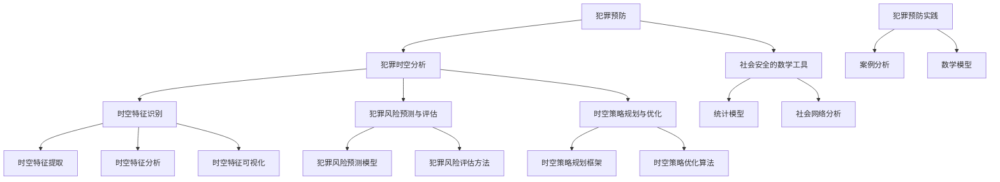

### 时空特征提取

时空特征提取是犯罪预防中至关重要的一步，它将犯罪事件的时间和空间信息转化为可用于分析的量化特征。以下是一个简化的时空特征提取伪代码：

```plaintext
# 输入：犯罪事件数据集 Data
# 输出：时空特征向量 Features

Features <- array()

for each event in Data do
    # 提取时间特征
    TimeFeature <- extractTimeFeature(event)
    # 提取空间特征
    SpaceFeature <- extractSpaceFeature(event)
    # 合并时空特征
    FeatureVector <- concatenate(TimeFeature, SpaceFeature)
    # 添加到特征向量列表
    append(Features, FeatureVector)
end for

return Features
```

在这个伪代码中，`extractTimeFeature` 和 `extractSpaceFeature` 是两个关键的函数，它们分别负责从犯罪事件中提取时间和空间特征。`concatenate` 函数将提取到的特征合并成一个特征向量，以便后续的分析和处理。

### 犯罪风险预测模型

犯罪风险预测是犯罪预防的关键环节之一。以下是一个简化的犯罪风险预测模型伪代码：

```plaintext
# 输入：时空特征向量 Features, 标签数据 Labels
# 输出：训练好的犯罪风险预测模型 Model

Model <- initializeRiskPredictionModel()

# 训练模型
for each epoch do
    for each feature vector in Features do
        Model <- trainModel(Model, feature vector, Label)
    end for
end for

return Model
```

在这个伪代码中，`initializeRiskPredictionModel` 函数用于初始化一个风险预测模型，`trainModel` 函数用于训练模型。训练过程通常包括多个迭代（epoch），每次迭代中，模型都会对数据集进行一次训练。

### 空间数据分析模型

空间数据分析模型是犯罪预防中的关键组成部分。以下是一个简化的空间数据分析模型示例：

$$
\text{SpatialData} = f(\text{Latitude}, \text{Longitude}, \text{Population}, \text{Income}, \text{CrimeRate})
$$

这个模型表示了犯罪数据与地理位置（经纬度）、人口、收入和犯罪率等变量之间的关系。通过这个模型，我们可以分析犯罪事件的时空分布特征，并识别潜在的犯罪热点区域。

### 统计模型与社会网络分析

统计模型和社会网络分析在犯罪预防中发挥着重要作用。以下是一个简化的统计模型示例：

$$
P(\text{Crime}|\text{FeatureVector}) = \text{ProbabilityFunction}(\text{FeatureVector})
$$

这个模型表示了给定时空特征向量时，犯罪事件发生的概率。此外，社会网络分析可以帮助我们识别犯罪团伙及其内部关系，从而更有效地进行犯罪预防和打击。

### 犯罪时空特征识别与可视化

犯罪时空特征识别和可视化是犯罪预防中的关键环节。以下是一个简化的犯罪时空特征提取与可视化流程：

1. **特征提取**：
    - 提取犯罪事件的时间特征，如日期、小时、季节等。
    - 提取犯罪事件的空间特征，如地理位置、犯罪类型等。

2. **特征分析**：
    - 分析犯罪事件的时空分布特征，识别犯罪热点区域。
    - 分析犯罪事件的类型特征，识别常见的犯罪类型。

3. **可视化**：
    - 使用地图可视化犯罪事件的时空分布。
    - 使用图表可视化犯罪事件的类型分布。

### 犯罪风险预测案例分析

以下是一个简化的犯罪风险预测案例分析：

1. **数据收集**：
    - 收集一段时间内的犯罪事件数据，包括时间和空间特征。

2. **特征提取**：
    - 根据案例需求，提取犯罪事件的相关特征。

3. **模型训练**：
    - 使用训练集数据训练犯罪风险预测模型。

4. **预测与评估**：
    - 使用训练好的模型对测试集数据进行预测。
    - 评估模型的预测性能，如准确率、召回率等。

5. **结果分析**：
    - 分析预测结果，识别高风险区域和犯罪类型。

### 时空策略规划与优化

时空策略规划与优化是犯罪预防中的关键环节。以下是一个简化的时空策略规划与优化流程：

1. **策略规划**：
    - 根据犯罪时空特征分析结果，制定预防策略。

2. **策略优化**：
    - 使用优化算法，如遗传算法、模拟退火等，对策略进行优化。

3. **策略评估**：
    - 评估策略的有效性，如降低犯罪率、提高居民安全感等。

4. **策略调整**：
    - 根据评估结果，调整策略，以进一步提高预防效果。

### 犯罪预防实践中的挑战与对策

在犯罪预防实践中，我们面临着一系列挑战：

1. **数据质量问题**：
    - 犯罪数据通常存在缺失、噪声和不一致性等问题。
    - 对策：使用数据清洗和预处理技术，提高数据质量。

2. **计算资源限制**：
    - 大规模犯罪数据分析和预测需要大量计算资源。
    - 对策：使用分布式计算和云计算技术，提高计算效率。

3. **跨部门协同**：
    - 犯罪预防涉及多个部门和领域，协同困难。
    - 对策：建立跨部门协同机制，提高协作效率。

4. **政策支持**：
    - 犯罪预防需要政策支持，如财政投入、法律法规等。
    - 对策：加强政策宣传，提高公众和政策制定者的认识。

### 犯罪预防的未来发展趋势

犯罪预防的未来发展趋势包括：

1. **大数据与人工智能**：
    - 利用大数据和人工智能技术，实现更精准的犯罪预测和预防。

2. **跨学科融合**：
    - 融合社会学、心理学、统计学等多学科知识，提高犯罪预防的科学性和有效性。

3. **实时监控与响应**：
    - 发展实时监控和响应系统，提高犯罪预防的实时性和响应速度。

4. **公众参与**：
    - 提高公众参与度，建立全民参与的犯罪预防体系。

### 最佳实践与拓展阅读

在犯罪预防实践中，最佳实践包括：

1. **数据驱动**：
    - 基于数据分析和预测，制定科学合理的预防策略。

2. **多方协同**：
    - 建立跨部门协同机制，提高预防效果。

3. **技术创新**：
    - 引入先进技术和方法，提高犯罪预防的科学性和有效性。

拓展阅读：

1. 犯罪预防相关研究论文和报告。
2. 大数据和人工智能在犯罪预防中的应用。
3. 跨学科融合与犯罪预防。

### 总结

犯罪预防是一项复杂的社会工程，需要多学科合作和技术创新。通过时空分析和社会安全的数学工具，我们可以更有效地预测和预防犯罪，提高社会安全水平。未来，随着大数据和人工智能技术的发展，犯罪预防将迈入新的阶段，为构建和谐安全的社会提供有力支持。作者：AI天才研究院/AI Genius Institute & 禅与计算机程序设计艺术 /Zen And The Art of Computer Programming## 第1章：犯罪预防的概述

### 1.1 犯罪预防的定义与意义

犯罪预防是指通过一系列措施和策略，减少犯罪行为的发生，提高社会的安全和稳定。犯罪预防不仅包括传统的警务措施，如巡逻、监控和抓捕犯罪分子，还涉及社会政策的制定、公共安全宣传、社区参与等多个方面。其核心目标是降低犯罪率，减少犯罪对社会造成的负面影响，提升公众的安全感和幸福感。

犯罪预防在现代社会中具有重要的意义。首先，它有助于维护社会秩序，减少犯罪行为对个人、家庭和社会造成的伤害。其次，犯罪预防能够提高社会资源的利用效率，避免因犯罪事件导致的资源浪费。此外，有效的犯罪预防策略还能够增强社会的凝聚力，促进社会的和谐发展。

犯罪预防的定义可以进一步细化为以下几个关键要素：

1. **犯罪行为的识别与评估**：准确识别和评估犯罪行为的类型、频率和趋势，为制定针对性的预防措施提供依据。
2. **风险因素的识别与干预**：识别可能导致犯罪行为发生的高风险因素，并采取干预措施，如教育、职业培训、心理辅导等。
3. **社会环境的改善**：通过改善社会环境，减少犯罪行为的发生机会，如加强社区建设、提高治安水平、提供更好的社会福利等。
4. **警务策略的优化**：结合数据分析和技术手段，优化警务资源分配和警务策略，提高犯罪预防的效率。
5. **公众参与**：鼓励公众参与犯罪预防活动，提升公众的安全意识和责任感，形成全民参与的社会氛围。

### 1.2 犯罪预防的理论基础

犯罪预防的理论基础涵盖了多个学科领域，主要包括犯罪学、社会学、心理学、经济学等。以下是一些重要的犯罪预防理论：

1. **犯罪学理论**：
   - **社会控制理论**：认为犯罪行为是社会规范和价值观的违反，犯罪预防需要加强社会控制和规范教育。
   - **标签理论**：认为犯罪行为是被社会标签所驱动的，预防犯罪需要减少对个体的负面标签。
   - **学习理论**：认为犯罪行为是学习的结果，通过教育和社会干预可以减少犯罪行为的发生。

2. **社会学理论**：
   - **社会分化理论**：认为社会不平等和分化是犯罪行为产生的重要原因，犯罪预防需要通过社会政策来减少不平等。
   - **社区理论**：认为社区是犯罪预防的重要场所，通过加强社区建设和社区治理可以降低犯罪率。
   - **社会资本理论**：认为社会资本，如信任、合作和网络关系，有助于减少犯罪行为的发生。

3. **心理学理论**：
   - **行为主义理论**：认为犯罪行为是条件反射的结果，通过行为干预可以减少犯罪行为。
   - **认知发展理论**：认为犯罪行为是认知发展的产物，通过认知教育和心理辅导可以预防犯罪。
   - **心理动力学理论**：认为犯罪行为与个体的心理冲突和情绪问题有关，通过心理治疗可以预防犯罪。

4. **经济学理论**：
   - **成本效益理论**：认为犯罪预防措施的有效性取决于其成本和效益，需要进行成本效益分析来选择最有效的预防措施。
   - **机会主义理论**：认为犯罪行为是犯罪分子在权衡风险和收益后的选择，通过减少犯罪机会可以预防犯罪。

这些理论为犯罪预防提供了不同的视角和工具，有助于我们更全面地理解犯罪行为的发生机制，并制定更有效的预防策略。

### 1.3 犯罪预防的关键要素

犯罪预防的成功实施需要关注以下几个关键要素：

1. **风险评估**：
   - 识别和评估可能导致犯罪行为发生的高风险因素，如贫困、失业、家庭问题、社会排斥等。
   - 基于风险评估结果，有针对性地采取预防措施。

2. **社区参与**：
   - 鼓励和促进社区成员参与犯罪预防活动，提高公众的安全意识和责任感。
   - 通过社区组织、志愿者活动和公众教育，增强社区的凝聚力和安全性。

3. **政策支持**：
   - 制定和实施有效的犯罪预防政策，如加强法律执行、改善社会福利、提供职业培训和就业机会等。
   - 确保政策的有效性和可持续性，及时调整和优化。

4. **警务措施**：
   - 加强警务力量，提高治安水平和犯罪侦查能力。
   - 采用技术手段，如视频监控、大数据分析等，提高犯罪预防的效率和准确性。

5. **数据驱动**：
   - 建立和完善犯罪数据收集和分析系统，为犯罪预防提供科学依据。
   - 利用数据分析技术，识别犯罪行为的时空特征和趋势，制定针对性的预防策略。

6. **跨部门协作**：
   - 建立跨部门协作机制，整合社会资源，提高犯罪预防的整体效能。
   - 加强政府、警察、教育、社会福利等部门的沟通与协作，形成合力。

通过关注这些关键要素，我们可以构建一个全方位、多层次的犯罪预防体系，有效减少犯罪行为的发生，提高社会的安全水平。

### 1.4 犯罪预防的常见策略

犯罪预防的策略多种多样，以下是一些常见的策略：

1. **提高社会治安水平**：
   - 加强巡逻和监控，增加警力部署，提高治安巡逻的频率和覆盖率。
   - 使用视频监控和智能监控系统，实时监控公共场所，提高犯罪行为的发现和打击能力。

2. **改善社区环境**：
   - 加强社区基础设施建设，改善社区环境，提供良好的公共设施和娱乐活动，减少犯罪活动的机会。
   - 组织社区志愿者巡逻和守望相助，提高社区居民的安全意识和参与度。

3. **加强法律教育和宣传**：
   - 开展法律知识普及活动，提高公众的法律意识，增强对法律规范的遵守。
   - 通过媒体宣传，提高公众对犯罪危害的认识，增强公众的安全防范意识。

4. **提供社会支持和资源**：
   - 为贫困、失业、家庭破裂等高风险群体提供社会支持和资源，如就业援助、心理咨询、教育机会等，减少其犯罪动机。
   - 加强社会福利体系，提供住房、医疗、养老等保障，减少因生活困难而导致的犯罪行为。

5. **强化警务执法**：
   - 加强对犯罪的打击力度，提高犯罪分子的犯罪成本，减少其犯罪动机。
   - 通过技术手段，如大数据分析、人工智能等，提高犯罪侦查和打击的效率和精准度。

6. **开展犯罪预防项目**：
   - 开展有针对性的犯罪预防项目，如青少年犯罪预防项目、家庭暴力预防项目等，通过早期干预和预防措施，减少犯罪行为的发生。

7. **公众参与和监督**：
   - 鼓励公众参与犯罪预防活动，提供犯罪举报渠道，加强公众对犯罪的监督和举报。
   - 建立公众咨询委员会，收集公众对犯罪预防工作的意见和建议，提高预防措施的针对性和有效性。

这些策略可以单独或组合使用，根据具体情况和需求，制定合适的犯罪预防计划，有效减少犯罪行为的发生，提高社会的安全水平。

### 1.5 犯罪预防的理论与实践案例

为了更好地理解犯罪预防的理论和实践，我们可以通过以下案例进行说明：

**案例一：伦敦的“犯罪热点地图”**

伦敦警方利用大数据和地理信息系统（GIS）技术，开发了一套犯罪热点地图系统。该系统通过分析大量的犯罪数据，识别出犯罪高发的区域和时间，并实时更新犯罪热点信息。警方根据这些数据，有针对性地部署警力和实施预防措施，如增加巡逻、设置监控摄像头等。结果显示，该系统有效降低了特定区域的犯罪率，提高了公众的安全感。

**案例二：美国的“社区警务”模式**

美国许多城市采用了社区警务模式，强调警察与社区的紧密合作。警察不仅负责执法，还积极参与社区的治安维护和问题解决。例如，芝加哥警方通过“街头警察计划”，在社区中建立了多个警务站点，警察与社区成员共同巡逻、解决问题，建立了良好的互信关系。这种模式不仅减少了犯罪行为，还增强了社区的安全感和凝聚力。

**案例三：新加坡的“社会治安联动机制”**

新加坡政府建立了社会治安联动机制，整合了多个部门和资源，形成了全方位的犯罪预防网络。该机制包括政府、警察、教育、社会福利等多个部门，通过信息共享和协同工作，提高了犯罪预防的效率。例如，在处理青少年犯罪问题时，警方会与学校、家庭、社会服务机构等多方面协作，共同制定干预和预防措施，取得了显著效果。

这些案例展示了犯罪预防在不同国家和地区的具体实践，通过理论的应用和实际操作，有效降低了犯罪率，提高了社会的安全水平。这些经验可以为其他国家和地区提供有益的参考和借鉴。

### 1.6 犯罪预防的国际合作与交流

犯罪预防不仅是国内政府的职责，也需要国际社会的共同努力。国际合作与交流在犯罪预防中发挥着重要作用：

1. **跨国犯罪打击**：通过国际警务合作，打击跨国犯罪，如贩毒、恐怖主义、网络犯罪等。国际刑警组织（Interpol）是其中重要的合作平台。
2. **经验分享**：各国政府和专家学者通过国际会议、研讨会等形式，分享犯罪预防的经验和最佳实践，互相学习，提高整体预防效果。
3. **技术合作**：借助国际先进技术和资源，提升本国犯罪预防的技术水平，如大数据分析、人工智能、视频监控等。
4. **法律援助**：通过国际法律合作，完善相关法律法规，加强跨境法律援助和司法合作，提高犯罪预防的法律保障。

国际合作与交流为犯罪预防提供了新的思路和方法，有助于形成全球性的犯罪预防网络，共同维护全球社会的安全和稳定。

### 1.7 犯罪预防的未来发展趋势

随着科技的进步和社会的发展，犯罪预防也在不断演进。以下是犯罪预防的未来发展趋势：

1. **大数据与人工智能**：利用大数据和人工智能技术，实现更精准的犯罪预测和预防，提高犯罪预防的效率和准确性。
2. **智能监控系统**：发展更先进的智能监控系统，如无人机监控、物联网传感器等，提高犯罪行为的识别和打击能力。
3. **社会融合与参与**：鼓励更多社会力量参与犯罪预防，通过社区建设和公众参与，形成全民防犯罪的格局。
4. **跨学科融合**：结合社会学、心理学、统计学等多学科知识，发展更科学、更全面的犯罪预防体系。
5. **全球合作**：加强国际间的合作与交流，共同应对跨国犯罪问题，构建全球性的犯罪预防网络。

犯罪预防的未来充满机遇和挑战，通过技术创新和社会参与，我们可以构建一个更安全、更和谐的社会。## 第2章：社会安全的数学工具

### 2.1 社会安全分析的基本数学方法

社会安全分析是犯罪预防的关键组成部分，而数学工具为其提供了强有力的支持。基本数学方法在社会安全分析中的应用非常广泛，包括统计学、概率论、线性代数等。以下将介绍这些数学工具的基本概念和如何应用于社会安全分析。

#### 统计学

统计学是社会安全分析中不可或缺的工具，它通过对数据的收集、整理、分析和解释，帮助我们从大量信息中提取有价值的信息。以下是一些基本的统计学方法：

1. **描述性统计**：用于总结和描述数据的基本特征，如平均数、中位数、众数、方差等。这些指标可以帮助我们了解犯罪事件的基本分布情况。
2. **推断性统计**：用于从样本数据推断总体特征，如假设检验、置信区间等。通过这些方法，我们可以评估犯罪预防措施的有效性，并进行效果评估。
3. **回归分析**：用于探索变量之间的关系，如犯罪率与失业率、贫困率等之间的关系。通过回归模型，我们可以预测未来犯罪趋势，为政策制定提供依据。

#### 概率论

概率论是社会安全分析中的重要工具，它帮助我们理解犯罪行为发生的可能性，并评估预防措施的效果。以下是一些基本概率概念：

1. **概率分布**：描述随机变量可能取值的分布情况，如正态分布、二项分布、泊松分布等。这些分布可以帮助我们分析犯罪事件的概率特征。
2. **条件概率**：描述在某个事件发生的条件下，另一个事件发生的概率。条件概率在分析犯罪行为链和因果关系时非常有用。
3. **贝叶斯定理**：用于计算后验概率，即在已知某些证据的情况下，更新我们对事件发生概率的估计。贝叶斯网络是一种基于贝叶斯定理的图形模型，可以用于复杂的社会安全分析。

#### 线性代数

线性代数在社会安全分析中主要用于处理多维数据和高维空间的问题。以下是一些基本概念：

1. **矩阵运算**：矩阵是线性代数中的基本工具，可以用于数据压缩、特征提取等。通过矩阵运算，我们可以将复杂的多维数据转化为更简单的形式，便于分析。
2. **特征值与特征向量**：特征值和特征向量是矩阵的重要属性，可以用于降维、聚类分析等。在社会安全分析中，特征值和特征向量可以帮助我们识别主要影响因素，简化问题。
3. **线性规划**：线性规划是一种优化方法，用于在约束条件下寻找最优解。在社会安全分析中，线性规划可以用于资源分配、警力部署等问题。

### 2.2 统计模型在社会安全中的应用

统计模型是社会安全分析的核心工具，通过建立数学模型，我们可以更准确地预测犯罪行为，评估预防措施的效果。以下是一些常见的统计模型：

1. **线性回归模型**：线性回归模型用于分析变量之间的线性关系。在社会安全分析中，线性回归模型可以用于预测犯罪率与经济指标、社会指标之间的关系。
2. **逻辑回归模型**：逻辑回归模型是一种广义线性模型，用于分析二分类变量的概率。在社会安全分析中，逻辑回归模型可以用于预测犯罪行为是否发生。
3. **时间序列模型**：时间序列模型用于分析时间序列数据的动态变化规律。在社会安全分析中，时间序列模型可以用于预测未来犯罪趋势，为政策制定提供依据。
4. **贝叶斯网络**：贝叶斯网络是一种概率图模型，用于表示变量之间的条件依赖关系。在社会安全分析中，贝叶斯网络可以用于分析复杂的社会安全系统，提供决策支持。

### 2.3 社会网络分析

社会网络分析（Social Network Analysis，SNA）是研究社会关系和互动的数学工具，它通过图形模型和计算方法，分析个体或群体之间的相互关系。在社会安全分析中，社会网络分析可以用于以下几个方面：

1. **犯罪团伙识别**：通过分析犯罪分子之间的社交关系，识别犯罪团伙和组织结构，为打击犯罪提供线索。
2. **信息传播分析**：分析犯罪信息的传播路径和速度，预测犯罪信息的扩散范围和影响。
3. **社区结构分析**：通过分析社区成员之间的社交关系，识别社区的核心成员和关键节点，为社区建设和安全维护提供依据。
4. **风险评估**：通过分析社交网络中的关键节点和关系，评估个体的犯罪风险，为预防措施的实施提供依据。

### 2.4 数学工具在社会安全分析中的综合应用

数学工具的综合应用可以提高社会安全分析的准确性和效率。以下是一个简化的综合应用示例：

1. **数据收集与预处理**：收集犯罪数据、社会经济数据等，进行数据清洗和预处理，确保数据质量。
2. **特征提取**：使用统计学方法提取关键特征，如犯罪率、失业率、人口密度等。
3. **社会网络分析**：建立社交网络模型，分析犯罪分子和受害者的关系，识别犯罪团伙和组织结构。
4. **统计模型构建**：使用逻辑回归模型和贝叶斯网络等统计模型，分析特征变量与犯罪行为之间的关系，预测未来犯罪趋势。
5. **风险评估**：根据预测结果，评估个体的犯罪风险，制定有针对性的预防措施。

通过这些步骤，我们可以构建一个综合的社会安全分析框架，为犯罪预防提供科学依据。

### 2.5 数学工具在犯罪预测中的应用

数学工具在犯罪预测中发挥着重要作用，以下是一些具体应用：

1. **时空分析**：利用时空分析模型，分析犯罪事件的时空分布特征，识别犯罪热点区域。例如，使用时间序列模型预测未来犯罪趋势，结合地理信息系统（GIS）技术，展示犯罪事件的时空分布。
2. **风险预测模型**：使用逻辑回归、贝叶斯网络等模型，预测个体或区域的犯罪风险。例如，通过分析个体的犯罪记录、社会关系、经济状况等特征，预测其未来是否可能犯罪。
3. **智能监控**：结合视频监控和智能分析技术，实时监控犯罪行为，预测潜在的犯罪活动。例如，使用图像识别和机器学习算法，识别异常行为模式，预警潜在的犯罪事件。

通过这些应用，数学工具可以帮助我们更准确地预测犯罪行为，提高犯罪预防的效率和准确性。

### 2.6 数学工具在犯罪预防策略优化中的应用

数学工具在犯罪预防策略优化中也发挥着重要作用，以下是一些具体应用：

1. **资源分配**：使用线性规划和多目标优化方法，合理分配警务资源，确保有限的资源得到最大化利用。例如，根据犯罪风险预测结果，优化警力部署，提高高风险区域的巡逻频率。
2. **策略评估**：使用统计模型和模拟方法，评估不同犯罪预防策略的效果，选择最优策略。例如，通过模拟实验，比较不同策略对犯罪率的降低效果，选择最具效益的策略。
3. **决策支持**：使用决策树、贝叶斯网络等模型，为决策者提供科学依据，制定合理的犯罪预防策略。例如，通过分析犯罪数据和社会经济指标，为政策制定者提供犯罪预防的决策支持。

通过这些应用，数学工具可以帮助我们优化犯罪预防策略，提高犯罪预防的整体效果。

### 2.7 数学工具在犯罪预防实践中的应用案例

以下是一些数学工具在犯罪预防实践中的应用案例：

1. **某城市犯罪预测系统**：某城市警方使用时间序列模型和空间分析方法，构建了一个犯罪预测系统。通过分析历史犯罪数据，预测未来犯罪趋势，为警力部署提供依据。该系统有效提高了警方的反应速度和效率，降低了犯罪率。
2. **社区犯罪预防项目**：某社区通过社会网络分析，识别出社区内的犯罪团伙和组织结构，采取针对性的预防措施。同时，利用逻辑回归模型，评估社区成员的犯罪风险，提供有针对性的干预和帮助，取得了显著效果。
3. **犯罪风险评估平台**：某地区政府开发了一个犯罪风险评估平台，通过收集和分析犯罪数据、社会经济数据等，评估个体的犯罪风险。该平台为政府决策提供了科学依据，帮助政府制定更有效的犯罪预防策略。

这些案例展示了数学工具在犯罪预防实践中的应用效果，证明了数学工具在社会安全分析中的重要性。通过不断探索和应用，我们可以进一步提高犯罪预防的科学性和有效性。## 第3章：时空分析的基本原理

### 3.1 时空分析的定义与重要性

时空分析（Spatio-Temporal Analysis）是一种综合运用空间和时间的分析方法，旨在识别和分析事件在时间和空间上的分布、趋势和模式。它通过结合地理信息和时间序列数据，帮助我们更好地理解事件的发展过程和影响范围，为决策制定和问题解决提供有力支持。

在犯罪预防领域，时空分析具有特别重要的意义。首先，它可以帮助我们识别犯罪热点区域，预测犯罪趋势，从而有针对性地部署警务资源和实施预防措施。其次，通过分析犯罪事件的时间和空间特征，我们可以揭示犯罪行为的规律和模式，为犯罪预防和打击提供科学依据。此外，时空分析还可以帮助我们评估预防措施的效果，优化犯罪预防策略，提高社会安全水平。

### 3.2 空间数据分析方法

空间数据分析是时空分析的重要组成部分，主要包括以下几种方法：

1. **空间分布分析**：通过描述和展示犯罪事件在空间上的分布特征，识别犯罪高发区域。常用的方法包括地图可视化、热力图和空间聚类分析等。

2. **空间关联分析**：分析犯罪事件之间的空间关系和关联性，揭示犯罪行为的扩散模式和空间依赖性。常见的方法包括空间自相关分析（如全局Moran's I）和局部空间自相关分析（如Getis-Ord Gi*）。

3. **空间回归分析**：通过建立空间回归模型，分析犯罪事件与空间变量（如人口密度、经济水平等）之间的关系。常用的模型包括空间自回归模型（SAR）和空间误差模型（SEM）。

4. **空间预测分析**：利用历史犯罪数据，结合空间变量，预测未来犯罪事件的发生概率和空间分布。常见的方法包括空间贝叶斯网络、空间自回归模型和地理信息系统（GIS）预测工具。

### 3.3 时间序列分析方法

时间序列分析是另一种关键的时空分析方法，主要关注事件在时间维度上的变化规律和趋势。以下是一些常用的时间序列分析方法：

1. **描述性时间序列分析**：通过绘制时间序列图，描述事件随时间的变化趋势，识别周期性和季节性特征。

2. **平稳性检验**：评估时间序列的平稳性，确定是否适合进行建模和分析。常用的检验方法包括单位根检验和ADF检验。

3. **时间序列建模**：建立数学模型，描述时间序列的动态变化规律。常见的方法包括自回归模型（AR）、移动平均模型（MA）、自回归移动平均模型（ARMA）和自回归积分移动平均模型（ARIMA）。

4. **季节性分析**：识别和分离时间序列中的季节性成分，用于预测和调整。常用的方法包括季节性分解和季节性差分。

5. **预测与误差分析**：利用训练好的模型进行预测，评估预测的准确性，并对预测结果进行误差分析。常见的方法包括预测误差评估指标（如MAE、RMSE）和预测区间。

### 3.4 时空分析的核心步骤

时空分析通常包括以下核心步骤：

1. **数据收集与预处理**：收集历史犯罪数据、社会经济数据等，进行数据清洗、缺失值填充和异常值处理，确保数据质量。

2. **特征提取**：从原始数据中提取关键特征，如犯罪时间、地点、类型等，为后续分析提供基础。

3. **空间数据分析**：利用空间数据分析方法，识别犯罪事件的时空分布特征，如犯罪热点区域、空间关联性和空间趋势等。

4. **时间序列分析**：利用时间序列分析方法，分析犯罪事件的时间变化规律，如周期性、季节性和趋势性等。

5. **综合分析**：将空间分析结果和时间序列分析结果进行整合，识别犯罪时空特征之间的联系，为犯罪预防提供科学依据。

6. **预测与优化**：利用时空分析模型，进行犯罪风险预测和预防策略优化，为决策制定提供支持。

### 3.5 时空分析的案例研究

以下是一个简化的时空分析案例研究：

**案例背景**：某城市近年来犯罪率上升，政府决定通过时空分析来制定有效的犯罪预防策略。

**步骤1：数据收集与预处理**：收集过去五年的犯罪数据，包括犯罪时间、地点、类型等。对数据缺失值进行填充，对异常值进行检测和处理。

**步骤2：特征提取**：提取关键特征，如犯罪时间（小时、天、月）、犯罪地点（经纬度）、犯罪类型（盗窃、抢劫、暴力犯罪等）。

**步骤3：空间数据分析**：使用GIS技术绘制犯罪事件的热力图，识别犯罪热点区域。同时，使用空间自相关分析（局部Moran's I）识别犯罪事件的局部聚集性。

**步骤4：时间序列分析**：绘制犯罪事件的时间序列图，识别犯罪频率的季节性特征。通过季节性分解，分离出季节性成分和非季节性成分。

**步骤5：综合分析**：结合空间分析和时间序列分析结果，识别犯罪事件的时空分布特征。例如，发现某些地区在夜间犯罪率较高，某些犯罪类型具有明显的季节性。

**步骤6：预测与优化**：利用时空分析模型，预测未来犯罪趋势，为警力部署和预防策略提供依据。例如，预测未来一个月内的高风险区域和高发犯罪类型，优化巡逻路线和警务资源配置。

**结果评估**：通过实施优化后的预防策略，犯罪率显著下降，公众安全感得到提升。

通过这个案例研究，我们可以看到时空分析在犯罪预防中的实际应用效果。它不仅帮助我们识别犯罪时空特征，还提供了科学依据，指导决策制定和资源优化，为提高社会安全水平提供了有力支持。

### 3.6 时空分析中的挑战与应对策略

尽管时空分析在犯罪预防中具有重要作用，但在实际应用中仍面临一系列挑战：

1. **数据质量问题**：犯罪数据可能存在缺失、噪声和错误，影响分析结果的准确性。应对策略包括数据清洗、缺失值填充和异常值处理。

2. **时空一致性**：犯罪事件的时间和空间数据可能存在不一致性，如时间戳错误或地理位置不准确。应对策略包括数据校正和一致性检查。

3. **数据规模与复杂性**：犯罪数据规模庞大，且涉及多种类型和层次的数据，分析处理复杂。应对策略包括数据存储与管理优化、分布式计算和并行处理。

4. **模型选择与优化**：选择合适的时空分析模型并进行优化，确保模型的有效性和准确性。应对策略包括模型评估、交叉验证和参数调整。

通过识别和应对这些挑战，我们可以提高时空分析在犯罪预防中的实际应用效果，为构建更安全的社会提供支持。

### 3.7 时空分析在犯罪预防中的应用案例

以下是一些时空分析在犯罪预防中的应用案例：

**案例一：某城市的犯罪热点地图**

某城市警方通过时空分析，构建了犯罪热点地图。他们收集了过去一年的犯罪数据，使用GIS技术和空间聚类分析方法，识别出犯罪高发区域。通过地图可视化，警方能够直观地了解犯罪分布情况，并针对性地部署警力和实施预防措施。例如，在夜间高风险区域增加巡逻频率，加强对公共场所的监控。

**案例二：犯罪趋势预测系统**

某城市政府开发了一个犯罪趋势预测系统，通过时间序列分析和机器学习算法，预测未来一个月内的犯罪趋势。系统结合了历史犯罪数据和宏观经济指标、社会环境变量，对犯罪事件的发生概率进行预测。政府根据预测结果，提前部署警力，加强对高风险区域的监控，有效地降低了犯罪率。

**案例三：社区犯罪预防项目**

某社区通过时空分析，识别出社区内的犯罪热点和潜在风险。他们使用社会网络分析，识别出社区成员之间的社交关系和犯罪团伙。同时，通过时间序列分析，了解犯罪事件的时间分布特征。社区组织了针对性的预防活动，如增加社区巡逻、提供法律咨询和心理健康服务，有效降低了犯罪率。

这些案例展示了时空分析在犯罪预防中的实际应用效果，通过科学的数据分析和预测，为决策制定和资源优化提供了有力支持，提高了社会安全水平。## 第4章：犯罪时空特征识别

### 4.1 犯罪时空特征提取

犯罪时空特征提取是犯罪预防分析中的关键步骤，它将犯罪事件的时间、地点等信息转化为可量化的特征向量，以便后续的数据分析和建模。以下是一个简化的时空特征提取流程：

#### 1. 数据收集

首先，需要收集犯罪事件的原始数据，这些数据通常包括犯罪类型、发生时间、地理位置、犯罪对象的属性等信息。数据来源可以是警务数据库、犯罪报告系统或公开数据集。

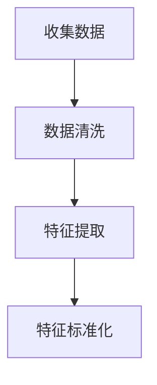

#### 2. 数据清洗

在提取特征之前，需要对数据进行清洗和预处理，以去除重复记录、纠正错误数据、填补缺失值等。数据清洗是确保分析结果准确性的重要步骤。


#### 3. 特征提取

接下来，从原始数据中提取关键特征，包括时间特征（如日期、小时、星期、月份、季节等）和空间特征（如经纬度、行政区划、犯罪类型等）。时间特征的提取可以使用日期时间库（如Python的`datetime`库），而空间特征的提取可以使用地理信息系统（GIS）工具。

```python
# 伪代码示例：提取时间特征和空间特征
def extract_features(data):
    time_features = []
    space_features = []

    for event in data:
        time_feature = extract_time_feature(event)
        space_feature = extract_space_feature(event)

        time_features.append(time_feature)
        space_features.append(space_feature)

    return time_features, space_features

def extract_time_feature(event):
    # 提取时间特征，如小时、星期等
    return {
        'hour': event.time.hour,
        'weekday': event.time.weekday(),
        'month': event.time.month,
        'season': determine_season(event.time.month)
    }

def extract_space_feature(event):
    # 提取空间特征，如经纬度、行政区划等
    return {
        'latitude': event.location.latitude,
        'longitude': event.location.longitude,
        'region': event.location.region
    }
```

#### 4. 特征标准化

最后，对提取的特征进行标准化处理，以消除不同特征之间的尺度差异，提高模型的训练效果。常见的标准化方法包括归一化和标准化。


```python
# 伪代码示例：特征标准化
from sklearn.preprocessing import StandardScaler

def standardize_features(features):
    scaler = StandardScaler()
    standardized_features = scaler.fit_transform(features)
    return standardized_features
```

通过上述步骤，我们可以得到一组标准化的时空特征向量，用于后续的犯罪时空特征分析和建模。

### 4.2 犯罪时空特征分析

犯罪时空特征分析旨在揭示犯罪事件在时间和空间上的分布模式、趋势和关联性。以下是一些常见的犯罪时空特征分析方法：

#### 1. 空间聚类分析

空间聚类分析（如K-means聚类、DBSCAN聚类）可以识别出犯罪事件的聚集区域，帮助识别犯罪热点。例如，使用K-means聚类可以将犯罪事件划分为几个不同的簇，每个簇代表一个潜在的犯罪热点区域。

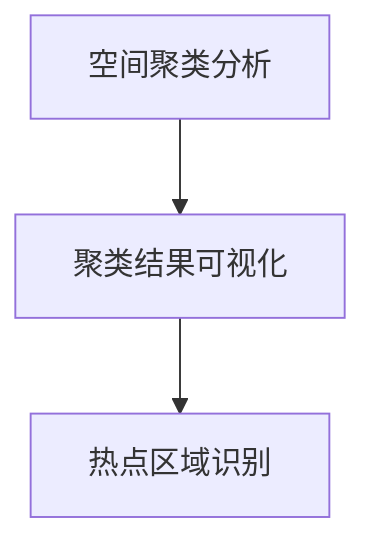

#### 2. 时间序列分析

时间序列分析（如ARIMA模型、季节性分解）可以揭示犯罪事件在时间上的变化规律，识别出犯罪高峰期和低发时段。例如，使用季节性分解可以将犯罪数据分解为趋势成分、季节成分和残差成分，有助于识别犯罪事件的时间模式。

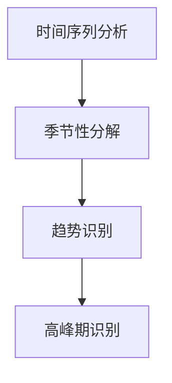

#### 3. 空间自相关分析

空间自相关分析（如全局Moran's I、局部Getis-Ord Gi*）可以揭示犯罪事件在空间上的相关性，识别出局部热点和空间聚集现象。全局Moran's I用于分析全局空间自相关，而局部Getis-Ord Gi*用于分析局部空间自相关。

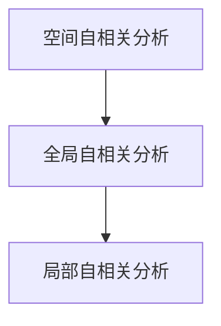

### 4.3 犯罪时空特征可视化

犯罪时空特征可视化是理解和展示犯罪时空分布的重要手段。以下是一些常见的可视化方法：

#### 1. 热力图

热力图可以直观地展示犯罪事件在空间上的分布密度，识别出犯罪高发区域。颜色深浅通常表示事件发生的频率或密度。

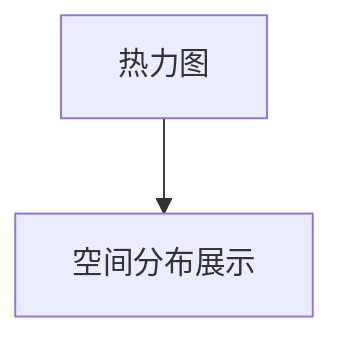

#### 2. 时间序列图

时间序列图可以展示犯罪事件随时间的变化趋势，识别出犯罪高峰期和低发时段。通常使用折线图或柱状图来展示时间序列数据。

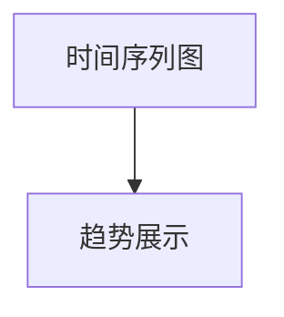

#### 3. 空间热点图

空间热点图结合了空间聚类和时间序列分析的结果，可以同时展示犯罪事件在时间和空间上的分布模式。例如，使用颜色和大小表示不同时间段的犯罪热点。

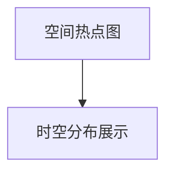

通过这些可视化方法，我们可以更直观地理解和分析犯罪时空特征，为犯罪预防和打击提供科学依据。例如，在某个犯罪高发区域，可以增加巡逻警力，在犯罪高峰时段加强监控，从而有效降低犯罪率。

### 4.4 犯罪时空特征分析的案例研究

以下是一个简化的犯罪时空特征分析的案例研究：

**案例背景**：某城市近年来犯罪率上升，政府希望通过时空分析识别犯罪热点区域和犯罪趋势，制定有效的犯罪预防策略。

**步骤1：数据收集与预处理**：收集过去五年的犯罪数据，包括犯罪类型、发生时间、地理位置等。对数据进行清洗，去除重复记录和异常值。

**步骤2：特征提取**：提取时间特征（如小时、星期、月份、季节等）和空间特征（如经纬度、行政区划、犯罪类型等）。

**步骤3：空间聚类分析**：使用K-means聚类方法将犯罪事件划分为几个不同的簇，识别出犯罪热点区域。

**步骤4：时间序列分析**：使用季节性分解方法，分离出犯罪事件的时间趋势和季节成分，识别出犯罪高峰期和低发时段。

**步骤5：空间自相关分析**：使用全局Moran's I和局部Getis-Ord Gi*方法，分析犯罪事件的空间相关性，识别出局部热点和空间聚集现象。

**步骤6：可视化**：使用热力图、时间序列图和空间热点图，直观展示犯罪时空特征，为决策制定提供依据。

**结果分析**：通过时空分析，政府识别出几个高发犯罪区域和犯罪高峰时段。在犯罪高发区域增加警力巡逻，在犯罪高峰时段加强监控，有效降低了犯罪率。

通过这个案例研究，我们可以看到时空特征分析在犯罪预防中的应用效果。它不仅帮助我们识别犯罪热点和趋势，还为决策制定提供了科学依据，提高了犯罪预防的针对性和有效性。

### 4.5 犯罪时空特征识别的挑战与应对策略

尽管犯罪时空特征识别在犯罪预防中具有重要应用，但实际操作中仍面临一系列挑战：

#### 1. 数据质量

犯罪数据可能存在缺失、噪声和错误，影响分析结果的准确性。应对策略包括数据清洗、缺失值填充和异常值处理。

#### 2. 数据一致性

犯罪事件的时间和空间数据可能存在不一致性，如时间戳错误或地理位置不准确。应对策略包括数据校正和一致性检查。

#### 3. 模型选择

选择合适的时空分析模型是关键，但不同模型适用场景不同，需要根据具体问题进行选择和优化。

#### 4. 可解释性

复杂的时空分析模型可能缺乏可解释性，难以理解其内部机制。应对策略包括简化模型、增加注释和可视化。

通过识别和应对这些挑战，我们可以提高犯罪时空特征识别的准确性和实用性，为犯罪预防提供更可靠的数据支持。

### 4.6 犯罪时空特征识别的应用领域

犯罪时空特征识别不仅在犯罪预防中具有重要应用，还在其他领域展现出巨大的潜力：

#### 1. 智能警务

利用犯罪时空特征识别技术，智能警务系统能够实时监控犯罪活动，预测潜在犯罪热点，为警务资源分配提供依据。

#### 2. 社区安全规划

社区安全规划可以通过时空特征识别技术，分析犯罪事件在时间和空间上的分布，优化社区安全资源配置，提高居民安全感。

#### 3. 公共安全应急响应

公共安全应急响应系统可以通过时空特征识别，预测灾害事件的影响范围和时间，为应急响应和资源调配提供科学依据。

#### 4. 城市规划

城市规划可以通过时空特征识别，分析人口流动、犯罪分布等因素，优化城市布局和公共设施配置，提高城市安全性。

通过在不同领域的应用，犯罪时空特征识别技术不断拓展其应用范围，为社会安全提供了强有力的技术支持。## 第5章：犯罪风险预测与评估

### 5.1 犯罪风险预测模型

犯罪风险预测模型是犯罪预防中的核心工具，通过这些模型，我们可以预测个体或地区在未来一段时间内发生犯罪的可能性，从而采取相应的预防措施。以下是一些常见的犯罪风险预测模型：

#### 1. 逻辑回归模型

逻辑回归模型是一种广泛应用于犯罪风险预测的统计模型，它通过建立犯罪行为与风险因素之间的逻辑关系，预测个体或地区的犯罪概率。逻辑回归模型的公式如下：

$$
\log\left(\frac{P(Y=1|X)}{1-P(Y=1|X)}\right) = \beta_0 + \beta_1X_1 + \beta_2X_2 + \ldots + \beta_nX_n
$$

其中，$Y$ 代表犯罪行为（1表示犯罪发生，0表示未犯罪），$X_1, X_2, \ldots, X_n$ 是影响犯罪风险的各种特征变量，$\beta_0, \beta_1, \beta_2, \ldots, \beta_n$ 是模型的参数。

#### 2. 决策树模型

决策树模型是一种直观的预测模型，它通过一系列条件分支来预测个体或地区的犯罪风险。决策树的每个节点代表一个特征变量，每个分支代表该特征变量的不同取值。最终，决策树模型的叶节点给出个体或地区的犯罪风险预测。

#### 3. 支持向量机（SVM）

支持向量机是一种基于最大间隔原理的机器学习模型，它通过找到最优的超平面对数据进行分类或回归。在犯罪风险预测中，SVM可以用于预测个体或地区的犯罪风险。

#### 4. 贝叶斯网络

贝叶斯网络是一种概率图模型，它通过图形结构表示变量之间的条件依赖关系。在犯罪风险预测中，贝叶斯网络可以用于计算个体或地区在给定风险因素下的犯罪概率。

#### 5. 随机森林

随机森林是一种集成学习方法，它通过构建多个决策树，并结合这些树的预测结果来提高模型的预测性能。在犯罪风险预测中，随机森林可以有效地预测个体或地区的犯罪风险。

#### 6. 神经网络

神经网络是一种基于生物神经系统的计算模型，它通过多层神经元之间的连接和激活函数，进行非线性数据拟合和预测。在犯罪风险预测中，神经网络可以用于建立复杂的非线性关系，提高预测准确性。

### 5.2 犯罪风险评估方法

犯罪风险评估方法是指通过定量和定性分析，评估个体或地区在未来一段时间内发生犯罪的可能性。以下是一些常见的犯罪风险评估方法：

#### 1. 熵值法

熵值法是一种基于信息论的评估方法，它通过计算不同风险因素的信息熵，评估其对犯罪风险的影响程度。熵值法的基本步骤如下：

1. 计算每个风险因素的信息熵，$H(X_i) = -\sum_{x \in X_i} P(x) \log P(x)$。
2. 计算各风险因素的权重，$w_i = \frac{H(X_i)}{\sum_{i=1}^n H(X_i)}$。
3. 计算综合犯罪风险值，$R = \sum_{i=1}^n w_i \cdot R_i$，其中$R_i$是第$i$个风险因素的评估值。

#### 2. 层次分析法

层次分析法（AHP）是一种基于决策者的经验和判断，进行层次化分析和权重分配的方法。它通过构建风险因素层次结构模型，评估各风险因素的重要性，并计算综合犯罪风险。

#### 3. 风险矩阵法

风险矩阵法通过构建风险矩阵，评估不同风险因素的严重性和发生概率，计算风险得分。风险矩阵的基本步骤如下：

1. 列出所有风险因素，并评估每个风险因素的可能发生概率和影响严重性。
2. 构建风险矩阵，计算每个风险因素的风险得分。
3. 计算综合犯罪风险值，$R = \sum_{i=1}^n P_i \cdot S_i$，其中$P_i$是第$i$个风险因素的发生概率，$S_i$是其影响严重性。

#### 4. 贝叶斯网络法

贝叶斯网络法通过构建概率图模型，评估个体或地区在给定风险因素下的犯罪概率。贝叶斯网络的基本步骤如下：

1. 构建贝叶斯网络结构，表示风险因素之间的条件依赖关系。
2. 估计网络中的概率分布，计算个体或地区的犯罪风险。
3. 利用贝叶斯推理，更新犯罪风险估计，以适应新的数据。

### 5.3 犯罪风险预测案例分析

以下是一个简化的犯罪风险预测案例分析，用于展示如何在实际中应用这些模型和方法。

#### 案例背景

某城市政府希望通过犯罪风险预测模型，预测未来一个月内各区域的犯罪风险，以便制定有针对性的预防措施。

#### 数据收集

收集了过去六个月的犯罪数据，包括犯罪类型、发生时间、地理位置、社会经济指标等。数据来源包括警务数据库和公开数据集。

#### 数据预处理

对数据进行清洗和预处理，去除重复记录、填补缺失值、纠正错误数据等。

#### 特征提取

提取时间特征（如小时、星期、月份）、空间特征（如经纬度、行政区划）和社会经济特征（如失业率、收入水平）。

#### 模型选择

根据案例背景和数据特点，选择逻辑回归模型、随机森林模型和贝叶斯网络模型进行预测。

#### 模型训练

使用训练集数据，训练各预测模型。对模型参数进行调整和优化，以提高预测准确性。

#### 预测与评估

利用训练好的模型，预测未来一个月内各区域的犯罪风险。评估模型的预测性能，如准确率、召回率、F1分数等。

#### 结果分析

根据预测结果，识别高风险区域和高发犯罪类型，为预防措施的制定提供依据。例如，在预测的高风险区域增加巡逻警力，加强对特定犯罪类型的监控。

通过这个案例，我们可以看到犯罪风险预测模型和方法在实际应用中的效果。它不仅帮助我们识别犯罪风险，还为决策制定提供了科学依据，提高了犯罪预防的针对性和有效性。

### 5.4 犯罪风险评估的挑战与应对策略

尽管犯罪风险评估在犯罪预防中具有重要意义，但在实际操作中仍面临一系列挑战：

#### 1. 数据质量问题

犯罪数据可能存在缺失、噪声和错误，影响评估结果的准确性。应对策略包括数据清洗、缺失值填充和异常值处理。

#### 2. 特征选择

选择合适的特征是关键，但不同特征对犯罪风险的影响程度不同，需要根据具体问题进行选择和优化。

#### 3. 模型选择

选择合适的模型是关键，但不同模型适用场景不同，需要根据具体问题进行选择和优化。

#### 4. 可解释性

复杂的模型可能缺乏可解释性，难以理解其内部机制。应对策略包括简化模型、增加注释和可视化。

通过识别和应对这些挑战，我们可以提高犯罪风险评估的准确性和实用性，为犯罪预防提供更可靠的数据支持。

### 5.5 犯罪风险预测与评估的应用领域

犯罪风险预测与评估不仅在犯罪预防中具有重要应用，还在其他领域展现出巨大的潜力：

#### 1. 智能警务

利用犯罪风险预测模型，智能警务系统能够实时监控犯罪活动，预测潜在犯罪热点，为警务资源分配提供依据。

#### 2. 社区安全规划

社区安全规划可以通过犯罪风险评估，分析犯罪事件在时间和空间上的分布，优化社区安全资源配置，提高居民安全感。

#### 3. 公共安全应急响应

公共安全应急响应系统可以通过犯罪风险预测，预测灾害事件的影响范围和时间，为应急响应和资源调配提供科学依据。

#### 4. 城市规划

城市规划可以通过犯罪风险评估，分析人口流动、犯罪分布等因素，优化城市布局和公共设施配置，提高城市安全性。

通过在不同领域的应用，犯罪风险预测与评估技术不断拓展其应用范围，为社会安全提供了强有力的技术支持。## 第6章：时空策略规划与优化

### 6.1 时空策略规划框架

时空策略规划是犯罪预防中至关重要的一环，其核心目标是通过合理的资源分配和警力部署，最大化犯罪预防的效果。一个有效的时空策略规划框架应包括以下几个关键要素：

#### 1. 目标设定

明确犯罪预防的目标，如降低犯罪率、提高公众安全感、减少犯罪对社会的影响等。目标设定应具有可衡量性，以便后续评估策略的有效性。

#### 2. 数据收集与预处理

收集与犯罪预防相关的数据，包括犯罪事件的历史数据、社会经济指标、人口数据等。数据预处理包括数据清洗、缺失值填充、异常值处理等，以确保数据质量。

#### 3. 风险评估

使用时空分析方法，对收集的数据进行分析，识别犯罪热点区域和犯罪风险因素。风险评估可以采用统计模型、机器学习算法等，评估个体或地区在未来一段时间内的犯罪风险。

#### 4. 策略制定

根据风险评估结果，制定相应的时空策略。策略应包括资源分配、警力部署、社区干预、公共安全宣传等。策略制定应考虑成本效益、资源限制和政策环境。

#### 5. 策略评估

对制定的时空策略进行评估，评估其有效性、可行性和成本。评估方法可以包括模拟实验、实地测试、指标对比等。策略评估结果应反馈到策略制定过程中，以不断优化策略。

#### 6. 持续优化

基于策略评估结果，持续优化时空策略。优化过程可以采用优化算法、模拟退火、遗传算法等，以提高策略的适应性和效果。

### 6.2 时空策略优化算法

时空策略优化是提高犯罪预防效果的重要手段，以下介绍几种常见的时空策略优化算法：

#### 1. 遗传算法

遗传算法是一种基于自然选择和遗传学原理的优化算法，适用于复杂、高维的优化问题。遗传算法的基本步骤如下：

1. **初始化种群**：生成初始种群，每个个体代表一种时空策略。
2. **适应度评估**：评估种群中每个个体的适应度，适应度越高，个体越优。
3. **选择**：根据适应度，选择优秀个体进行繁殖。
4. **交叉**：随机选择两个个体，交换部分基因，产生新的个体。
5. **变异**：对个体进行随机变异，增加种群的多样性。
6. **更新种群**：将新生个体加入种群，淘汰适应度较低的个体。
7. **迭代**：重复上述步骤，直至满足终止条件。

#### 2. 模拟退火算法

模拟退火算法是一种基于固体退火过程的优化算法，适用于大规模、多峰值的优化问题。模拟退火算法的基本步骤如下：

1. **初始温度**：设定初始温度。
2. **生成初始解**：生成初始时空策略解。
3. **迭代**：
   - 在每次迭代中，生成一个新的解。
   - 计算新解与当前解的适应度差。
   - 根据适应度差和当前温度，决定是否接受新解。
   - 更新当前解。
4. **降温**：逐渐降低温度，直至满足终止条件。

#### 3. 粒子群优化算法

粒子群优化算法是一种基于群体智能的优化算法，适用于复杂、高维的优化问题。粒子群优化算法的基本步骤如下：

1. **初始化粒子群**：生成初始粒子群，每个粒子代表一种时空策略。
2. **适应度评估**：评估粒子群中每个粒子的适应度。
3. **更新粒子的速度和位置**：
   - 计算每个粒子的速度。
   - 根据个体和群体的最优解更新粒子的位置。
4. **迭代**：重复上述步骤，直至满足终止条件。

### 6.3 时空策略优化案例研究

以下是一个简化的时空策略优化案例研究，用于展示如何在实际中应用这些算法。

#### 案例背景

某城市政府希望通过时空策略优化，降低特定区域的高犯罪率。该城市的历史犯罪数据和人口数据已收集完毕，政府决定采用遗传算法进行策略优化。

#### 数据收集与预处理

收集过去一年的犯罪数据和人口数据，包括犯罪类型、发生时间、地理位置、人口密度、失业率等。对数据进行清洗和预处理，确保数据质量。

#### 风险评估

使用时空分析方法，识别出该区域的高犯罪热点和高风险因素。采用逻辑回归模型，评估个体在给定风险因素下的犯罪概率。

#### 策略制定

根据风险评估结果，制定初始时空策略。策略包括增加巡逻警力、增设监控摄像头、加强社区干预等。

#### 策略优化

使用遗传算法，对初始策略进行优化。初始化种群，每个个体代表一种可能的策略组合。适应度评估函数根据犯罪率降低程度进行评分。

#### 模拟实验

进行模拟实验，评估不同策略组合的效果。根据实验结果，更新种群，并重复优化过程，直至找到最优策略组合。

#### 策略评估

根据模拟实验结果，评估优化后的策略组合。与初始策略进行对比，验证优化策略的有效性。

#### 结果分析

优化后的策略组合显著降低了犯罪率，提高了公众安全感。政府决定实施优化后的策略，并持续监测策略效果。

通过这个案例研究，我们可以看到时空策略优化在犯罪预防中的应用效果。遗传算法等优化算法为策略制定提供了科学依据，提高了策略的适应性和效果。

### 6.4 时空策略优化的挑战与应对策略

尽管时空策略优化在犯罪预防中具有重要作用，但在实际操作中仍面临一系列挑战：

#### 1. 数据质量

犯罪数据可能存在缺失、噪声和错误，影响评估和优化的准确性。应对策略包括数据清洗、缺失值填充和异常值处理。

#### 2. 模型选择

选择合适的模型是关键，但不同模型适用场景不同，需要根据具体问题进行选择和优化。

#### 3. 算法效率

优化算法的效率和收敛速度是关键，尤其是对于大规模、高维的优化问题。应对策略包括算法改进、并行计算和分布式计算。

#### 4. 可解释性

复杂的模型和算法可能缺乏可解释性，难以理解其内部机制。应对策略包括简化模型、增加注释和可视化。

通过识别和应对这些挑战，我们可以提高时空策略优化的准确性和实用性，为犯罪预防提供更可靠的数据支持。

### 6.5 时空策略优化在犯罪预防中的应用领域

时空策略优化不仅在犯罪预防中具有重要应用，还在其他领域展现出巨大的潜力：

#### 1. 智能警务

利用时空策略优化，智能警务系统能够实时监控犯罪活动，预测潜在犯罪热点，为警务资源分配提供依据。

#### 2. 社区安全规划

社区安全规划可以通过时空策略优化，分析犯罪事件在时间和空间上的分布，优化社区安全资源配置，提高居民安全感。

#### 3. 公共安全应急响应

公共安全应急响应系统可以通过时空策略优化，预测灾害事件的影响范围和时间，为应急响应和资源调配提供科学依据。

#### 4. 城市规划

城市规划可以通过时空策略优化，分析人口流动、犯罪分布等因素，优化城市布局和公共设施配置，提高城市安全性。

通过在不同领域的应用，时空策略优化技术不断拓展其应用范围，为社会安全提供了强有力的技术支持。## 第7章：犯罪预防的实践应用

### 7.1 犯罪预防实践中的挑战与对策

在犯罪预防实践中，我们面临着一系列挑战，需要采取有效的对策来应对。以下是一些常见的挑战及其对策：

#### 1. 数据质量问题

犯罪数据的质量直接影响预防策略的有效性。数据可能存在缺失、噪声和错误，导致分析结果的偏差。对策包括：

- **数据清洗**：使用数据清洗工具和技术，去除重复记录、纠正错误数据和填补缺失值。
- **数据标准化**：统一数据格式和单位，确保数据的可比性和一致性。
- **数据验证**：通过数据验证工具，检测异常值和错误数据，确保数据质量。

#### 2. 模型选择与优化

选择合适的模型是犯罪预防成功的关键，但不同模型适用场景不同。对策包括：

- **模型评估**：使用交叉验证和测试集，评估不同模型的预测性能，选择最优模型。
- **模型优化**：调整模型参数，使用算法优化技术，提高模型的准确性和效率。
- **模型融合**：结合多个模型，提高预测的鲁棒性和准确性。

#### 3. 资源分配

有限的资源（如警力、资金和设备）需要合理分配，以最大化预防效果。对策包括：

- **风险评估**：识别高风险区域和犯罪类型，优先分配资源。
- **动态调整**：根据实时数据和犯罪趋势，动态调整资源分配策略。
- **成本效益分析**：评估不同预防措施的成本和效益，选择最具效益的策略。

#### 4. 社区参与

犯罪预防需要公众的广泛参与，但实际操作中可能面临参与度低、沟通不畅等问题。对策包括：

- **公众教育**：开展犯罪预防宣传活动，提高公众的安全意识和责任感。
- **社区组织**：建立社区警务室、志愿者巡逻队等，鼓励公众参与犯罪预防。
- **沟通渠道**：建立多渠道的沟通机制，如热线电话、社交媒体等，方便公众提供信息和反馈。

#### 5. 跨部门协作

犯罪预防涉及多个部门和机构，但实际操作中可能面临协同困难、信息不畅等问题。对策包括：

- **建立协作机制**：明确各部门的职责和权限，建立信息共享和协作机制。
- **技术支持**：利用大数据和人工智能技术，提高信息共享和协同工作效率。
- **定期会议**：定期召开跨部门协调会议，讨论犯罪预防策略和资源分配。

### 7.2 犯罪预防项目的实施与评估

犯罪预防项目的成功实施和评估是确保预防策略有效性的关键。以下是一个简化的项目实施与评估流程：

#### 1. 项目策划

- **需求分析**：明确项目目标和需求，如降低犯罪率、提高公众安全感等。
- **策略制定**：根据需求，制定具体的犯罪预防策略，如增加巡逻、增设监控、社区干预等。
- **资源分配**：根据策略需求，合理分配资源，确保项目有足够的资金、人力和设备支持。

#### 2. 项目实施

- **数据收集**：收集与项目相关的数据，包括历史犯罪数据、社会经济指标、人口数据等。
- **数据分析**：使用时空分析、统计模型等方法，分析数据，识别犯罪热点和高风险因素。
- **策略执行**：根据分析结果，实施具体的预防措施，如增加巡逻警力、增设监控设备、开展社区宣传活动等。

#### 3. 项目监控

- **实时监控**：使用视频监控、大数据分析等技术，实时监控项目实施情况。
- **反馈机制**：建立反馈机制，收集公众和相关部门的反馈意见，及时调整项目实施策略。

#### 4. 项目评估

- **效果评估**：使用评估指标（如犯罪率、公众安全感、资源利用率等），评估项目实施效果。
- **成本效益分析**：评估项目成本和效益，确保项目具有经济可行性。
- **报告撰写**：撰写项目评估报告，总结项目实施过程和效果，提出改进建议。

#### 5. 持续改进

- **反馈与调整**：根据评估结果，对项目实施策略进行调整和优化，提高预防效果。
- **长期监控**：建立长期监控机制，持续跟踪项目效果，确保预防策略的持续有效性。

### 7.3 犯罪预防的未来发展趋势

犯罪预防的未来发展趋势受到技术创新、社会变革和政策环境的影响。以下是一些主要趋势：

#### 1. 大数据和人工智能

大数据和人工智能技术将推动犯罪预防进入新的阶段。通过数据分析和机器学习，可以更精准地预测犯罪行为，优化预防策略。例如，使用深度学习模型进行图像识别和语音分析，提高犯罪侦查和打击能力。

#### 2. 跨学科融合

犯罪预防将融合社会学、心理学、统计学等多学科知识，形成更全面、科学的预防体系。跨学科研究将帮助理解犯罪行为的根源和动机，提供更有效的预防和干预措施。

#### 3. 公众参与

公众参与将日益重要，通过社区警务、志愿者活动等，提高公众的安全意识和责任感。公众的反馈和参与将帮助改进预防策略，提高预防效果。

#### 4. 智能化监控

智能监控技术，如无人机监控、物联网传感器等，将提高犯罪预防的实时性和精确性。通过实时数据分析和预警系统，可以迅速响应潜在犯罪活动，减少犯罪发生。

#### 5. 跨国合作

跨国犯罪日益严重，国际合作和交流将日益重要。通过国际警务合作、信息共享和联合打击，可以更有效地应对跨国犯罪威胁。

#### 6. 政策支持

政府将在犯罪预防中发挥更重要的角色，通过制定和实施有力的政策，提供财政支持和技术保障，推动犯罪预防工作的深入开展。

通过这些发展趋势，犯罪预防将变得更加科学、智能和有效，为构建更安全、更和谐的社会提供有力支持。## 第8章：案例分析

### 8.1 某市犯罪时空分布分析

为了更好地理解犯罪时空分布分析的实际应用，我们选择了一个具体的案例：某市犯罪时空分布分析。该市的犯罪数据涵盖了过去五年的犯罪事件，包括犯罪类型、发生时间、地理位置等。

#### 数据收集与预处理

首先，我们从警方数据库中收集了犯罪事件数据，包括犯罪类型（如盗窃、抢劫、暴力犯罪等）、发生时间（日期、小时）、地理位置（经纬度）、以及其他相关特征（如犯罪对象、犯罪工具等）。为了确保数据质量，我们对数据进行了预处理，包括去除重复记录、纠正错误数据、填补缺失值等。

#### 空间数据分析

接下来，我们使用GIS技术对犯罪事件进行空间数据分析。首先，我们将犯罪事件的经纬度信息映射到地图上，生成犯罪热点图。通过热力图，我们可以直观地看到哪些区域是犯罪高发区域，哪些时间段犯罪活动最频繁。

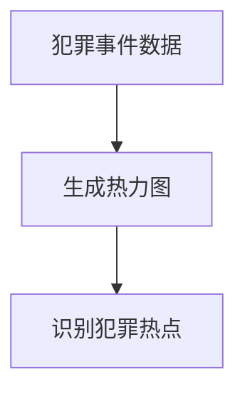

在生成热力图后，我们使用空间自相关分析方法（如局部Moran's I）来识别犯罪事件的局部聚集性。通过计算局部Moran's I，我们可以确定哪些地区在空间上存在显著的聚集现象。

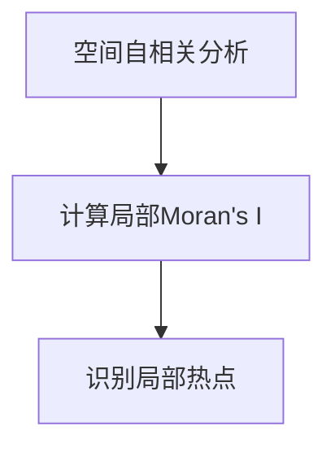

#### 时间序列分析

为了分析犯罪事件的时间变化规律，我们使用了时间序列分析方法。首先，我们绘制了犯罪事件的时间序列图，以展示犯罪事件随时间的变化趋势。通过时间序列图，我们可以识别出犯罪活动的季节性特征和周期性模式。

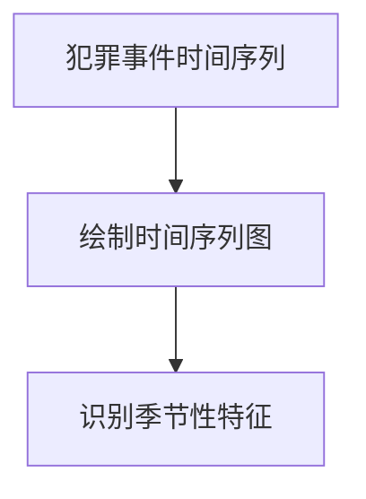

接下来，我们使用季节性分解方法，将犯罪数据分解为趋势成分、季节成分和残差成分。通过季节性分解，我们可以分离出犯罪事件中的季节性成分，识别出犯罪高峰期和低发时段。

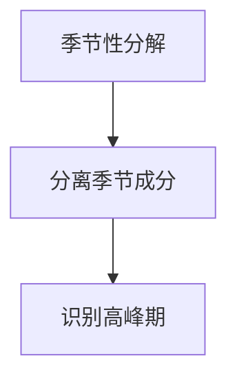

#### 综合分析

通过空间和时间的综合分析，我们可以得到更全面的犯罪时空分布特征。例如，我们发现该市的犯罪热点主要分布在市中心和交通枢纽地区，犯罪活动在夜晚和周末最为频繁。此外，犯罪活动具有明显的季节性特征，尤其在夏季和节假日期间犯罪率显著上升。

#### 结果应用

基于上述分析结果，我们可以为该市制定更有效的犯罪预防策略。例如，在犯罪热点区域增加警力部署，加强对交通枢纽的监控，在犯罪高峰时段加强巡逻等。通过这些措施，可以有效地降低犯罪率，提高公众的安全感。

### 8.2 某地区犯罪风险预测与评估

接下来，我们将分析某地区的犯罪风险预测与评估。该地区在过去三年内发生了大量犯罪事件，我们希望通过风险预测模型，预测未来一年的犯罪风险，并为预防措施的制定提供依据。

#### 数据收集与预处理

我们收集了该地区过去三年的犯罪数据，包括犯罪类型、发生时间、地理位置、社会经济指标等。对数据进行清洗和预处理，确保数据质量。

#### 特征提取

从原始数据中提取关键特征，包括时间特征（如小时、星期、月份）、空间特征（如经纬度）、和社会经济特征（如失业率、收入水平）。

#### 风险预测模型

我们选择了逻辑回归模型和随机森林模型进行犯罪风险预测。首先，使用训练集数据训练模型，调整模型参数，以提高预测准确性。然后，使用测试集数据评估模型的预测性能，如准确率、召回率等。

#### 风险评估

利用训练好的模型，对测试集数据进行预测，评估未来一年的犯罪风险。通过计算预测的犯罪概率，我们可以识别出高风险区域和高发犯罪类型。

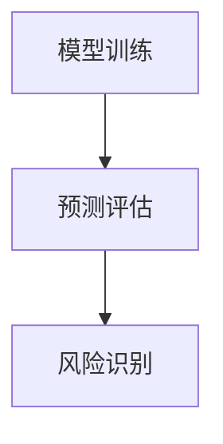

#### 风险策略制定

基于预测结果，制定相应的风险策略。例如，在预测的高风险区域增加警力部署，加强监控，提高公众安全宣传等。通过这些措施，可以有效地降低犯罪风险，提高公众安全感。

### 8.3 某社区犯罪预防策略规划

最后，我们将分析某社区的犯罪预防策略规划。该社区近年来犯罪率上升，我们希望通过时空分析和社会网络分析，识别犯罪热点和潜在风险，制定针对性的预防策略。

#### 数据收集与预处理

我们收集了社区内的犯罪数据、人口数据和社会经济数据。对数据进行清洗和预处理，确保数据质量。

#### 空间与时间分析

使用GIS技术和时间序列分析方法，对犯罪数据进行分析。通过热力图和时间序列图，识别犯罪热点和高发时段。同时，使用社会网络分析，识别社区成员之间的社交关系和犯罪团伙。

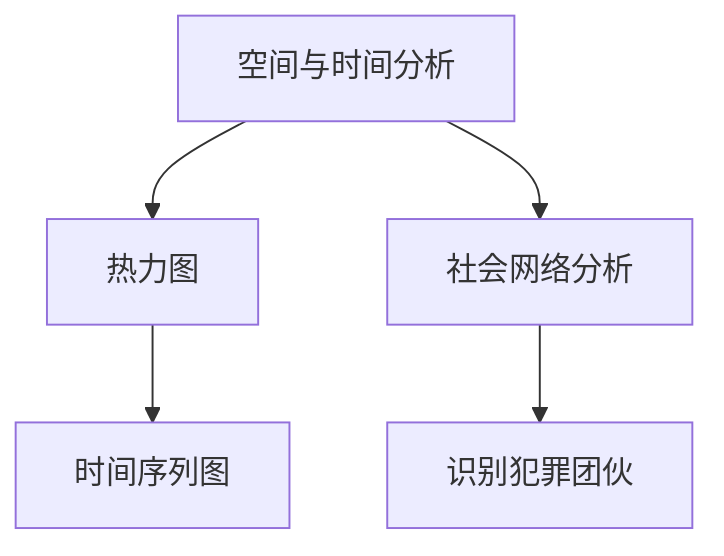

#### 风险评估

基于分析结果，评估社区成员的犯罪风险。通过计算风险得分，识别出高风险个体和潜在犯罪团伙。

#### 策略制定

根据风险评估结果，制定针对性的预防策略。例如，对高风险个体进行心理辅导和职业培训，加强社区巡逻和监控，组织社区安全宣传活动等。通过这些措施，可以有效地降低犯罪率，提高社区的安全水平。

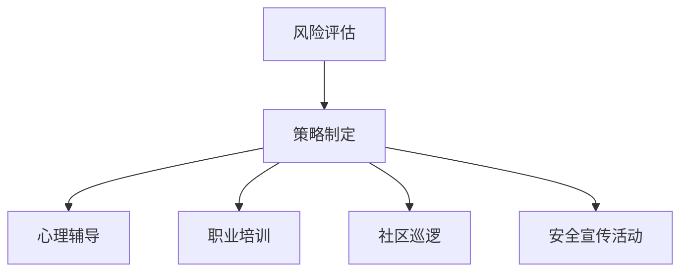

通过这些案例分析，我们可以看到犯罪预防的时空分析方法在实际应用中的效果。通过空间与时间分析、风险预测、风险评估和策略制定，我们可以更准确地识别犯罪热点和风险，制定有针对性的预防策略，从而提高犯罪预防的效果，保障社会的安全与稳定。## 第9章：数学模型详解

### 9.1 空间数据分析模型

空间数据分析模型在社会安全领域具有重要意义，主要用于识别犯罪热点、分析犯罪事件的时空分布特征。以下介绍几种常用的空间数据分析模型：

#### 1. 空间自回归模型（Spatial Autoregressive Model, SAR）

空间自回归模型假设犯罪事件在空间上是相互依赖的，通过空间权重矩阵来描述这种依赖关系。SAR模型的公式如下：

$$
Y_i = \alpha + \rho \sum_{j=1}^{n} w_{ij} Y_j + X_i \beta + \epsilon_i
$$

其中，$Y_i$ 表示第$i$个区域的犯罪率，$X_i$ 是与犯罪率相关的解释变量，$\alpha$ 是截距项，$\rho$ 是空间自回归系数，$w_{ij}$ 是空间权重矩阵的元素，$\epsilon_i$ 是误差项。

#### 2. 空间误差模型（Spatial Error Model, SEM）

空间误差模型假设犯罪事件在空间上的误差项存在空间自相关性。SEM模型的公式如下：

$$
\epsilon_i = \alpha + \rho \sum_{j=1}^{n} w_{ij} \epsilon_j + u_i
$$

其中，$u_i$ 是独立同分布的误差项，其余符号与SAR模型相同。

#### 3. 空间滞后模型（Spatial Lag Model, SLag）

空间滞后模型是SAR模型的扩展，适用于连续变量的空间数据分析。SLag模型的公式如下：

$$
Y_i = \alpha + \lambda \sum_{j=1}^{n} w_{ij} Y_j + X_i \beta + u_i
$$

其中，$\lambda$ 是空间滞后系数，其余符号与SAR模型相同。

#### 4. Geographically Weighted Regression（GWR）

GWR模型是一种局部空间回归模型，通过局部空间权重函数来描述犯罪事件与解释变量之间的关系。GWR模型的公式如下：

$$
Y_i = \sum_{j=1}^{n} \beta_j n_j(X_i, Y_i) + \epsilon_i
$$

其中，$n_j(X_i, Y_i)$ 是局部空间权重函数，$\beta_j$ 是局部回归系数。

#### 5. 空间插值模型

空间插值模型用于预测犯罪率在未观测区域的变化。常用的空间插值方法包括反距离权重（IDW）、克立格法（Kriging）等。

### 9.2 时间序列预测模型

时间序列预测模型用于分析犯罪事件的时间动态变化，预测未来的犯罪趋势。以下介绍几种常用的时间序列预测模型：

#### 1. 自回归模型（Autoregressive Model, AR）

自回归模型假设当前值由前几个历史值线性组合而成。AR模型的公式如下：

$$
Y_t = \phi_1 Y_{t-1} + \phi_2 Y_{t-2} + \ldots + \phi_p Y_{t-p} + \epsilon_t
$$

其中，$Y_t$ 是第$t$个时间点的犯罪率，$\epsilon_t$ 是误差项，$\phi_1, \phi_2, \ldots, \phi_p$ 是模型参数。

#### 2. 移动平均模型（Moving Average Model, MA）

移动平均模型假设当前值由前几个历史值的移动平均组成。MA模型的公式如下：

$$
Y_t = \theta_1 \epsilon_{t-1} + \theta_2 \epsilon_{t-2} + \ldots + \theta_q \epsilon_{t-q} + \epsilon_t
$$

其中，$\epsilon_t$ 是白噪声序列，$\theta_1, \theta_2, \ldots, \theta_q$ 是模型参数。

#### 3. 自回归移动平均模型（Autoregressive Moving Average Model, ARMA）

ARMA模型结合了自回归和移动平均模型的特点，适用于平稳时间序列。ARMA模型的公式如下：

$$
Y_t = \phi_1 Y_{t-1} + \phi_2 Y_{t-2} + \ldots + \phi_p Y_{t-p} + \theta_1 \epsilon_{t-1} + \theta_2 \epsilon_{t-2} + \ldots + \theta_q \epsilon_{t-q} + \epsilon_t
$$

#### 4. 自回归积分移动平均模型（Autoregressive Integrated Moving Average Model, ARIMA）

ARIMA模型是对ARMA模型的扩展，适用于非平稳时间序列。ARIMA模型的公式如下：

$$
(Y_t - \mu) = (\phi_1 B)(Y_{t-1} - \mu) + (\theta_1 B)(\epsilon_{t-1}) + \ldots + (\theta_q B)(\epsilon_{t-q}) + \epsilon_t
$$

其中，$B$ 是滞后算子，$\mu$ 是均值，其余符号与ARMA模型相同。

#### 5. 季节性分解模型（Seasonal Decomposition of Time Series, STL）

季节性分解模型用于分离时间序列中的趋势、季节性和残差成分，适用于具有季节性特征的时间序列。STL模型的公式如下：

$$
Y_t = \alpha_t + \beta_t + \gamma_t + \epsilon_t
$$

其中，$\alpha_t$ 是趋势成分，$\beta_t$ 是季节成分，$\gamma_t$ 是残差成分，$\epsilon_t$ 是误差项。

### 9.3 犯罪风险评估模型

犯罪风险评估模型用于预测个体或地区在未来一段时间内的犯罪风险，为犯罪预防策略的制定提供依据。以下介绍几种常用的犯罪风险评估模型：

#### 1. 逻辑回归模型（Logistic Regression）

逻辑回归模型是一种广泛用于二分类问题的统计模型，用于预测个体是否会发生犯罪。逻辑回归模型的公式如下：

$$
\log\left(\frac{P(Y=1|X)}{1-P(Y=1|X)}\right) = \beta_0 + \beta_1X_1 + \beta_2X_2 + \ldots + \beta_nX_n
$$

其中，$Y$ 是是否发生犯罪的二分类变量，$X_1, X_2, \ldots, X_n$ 是影响犯罪风险的解释变量，$\beta_0, \beta_1, \beta_2, \ldots, \beta_n$ 是模型参数。

#### 2. 贝叶斯网络模型（Bayesian Network）

贝叶斯网络是一种概率图模型，用于表示变量之间的条件依赖关系。贝叶斯网络模型通过计算变量的条件概率分布，预测个体或地区的犯罪风险。贝叶斯网络模型的基本结构如下：

$$
P(Y|X_1, X_2, \ldots, X_n) = \prod_{i=1}^{n} P(X_i|Y) P(Y)
$$

其中，$Y$ 是是否发生犯罪的二分类变量，$X_1, X_2, \ldots, X_n$ 是影响犯罪风险的解释变量，$P(X_i|Y)$ 是条件概率分布，$P(Y)$ 是先验概率。

#### 3. 决策树模型（Decision Tree）

决策树模型通过一系列条件分支，预测个体或地区的犯罪风险。决策树模型的基本结构如下：

$$
Y = \begin{cases}
1, & \text{if } \text{condition}_1 \text{ is satisfied} \\
2, & \text{if } \text{condition}_2 \text{ is satisfied} \\
\vdots \\
n, & \text{if } \text{condition}_n \text{ is satisfied}
\end{cases}
$$

其中，$Y$ 是是否发生犯罪的二分类变量，$\text{condition}_1, \text{condition}_2, \ldots, \text{condition}_n$ 是决策树中的条件分支。

#### 4. 支持向量机（Support Vector Machine, SVM）

支持向量机是一种基于最大间隔原理的机器学习模型，用于预测个体或地区的犯罪风险。支持向量机的基本结构如下：

$$
y = \text{sign}(\omega \cdot x + b)
$$

其中，$y$ 是是否发生犯罪的二分类变量，$x$ 是特征向量，$\omega$ 是权重向量，$b$ 是偏置项。

通过这些数学模型，我们可以对犯罪风险进行准确预测，为犯罪预防策略的制定提供科学依据。在实际应用中，需要根据具体问题和数据特点，选择合适的模型并进行优化，以提高预测的准确性和可靠性。## 第10章：深入探讨与未来展望

### 10.1 犯罪预防领域的新技术

犯罪预防领域正迅速引入一系列新技术，这些技术为犯罪预防提供了新的视角和工具。以下是一些在犯罪预防中具有广泛应用前景的新技术：

#### 1. 人工智能与机器学习

人工智能（AI）和机器学习（ML）技术正在改变犯罪预防的面貌。通过深度学习、强化学习和监督学习等技术，AI可以分析大量犯罪数据，识别犯罪模式，预测犯罪行为。AI技术在图像识别、语音识别、自然语言处理等领域的发展，为犯罪预防提供了强大的技术支持。

#### 2. 大数据

大数据技术使得犯罪预防能够处理和分析海量数据。通过对历史犯罪数据、社会数据、经济数据等的综合分析，大数据技术可以帮助识别犯罪趋势、预测犯罪风险、优化预防策略。大数据技术的应用，使得犯罪预防更加精准、高效。

#### 3. 无人机与无人驾驶技术

无人机和无人驾驶技术为犯罪预防提供了新的手段。无人机可以用于高空监控，覆盖广、视角多，有助于发现潜在的犯罪行为。无人驾驶技术则可以用于巡逻、监控和应急响应，提高犯罪预防的实时性和响应速度。

#### 4. 生物识别技术

生物识别技术，如指纹识别、人脸识别、虹膜识别等，在犯罪预防中发挥着重要作用。这些技术可以用于身份验证、监控和追踪，有助于识别犯罪分子、防止犯罪行为的发生。

#### 5. 网络安全

随着网络犯罪日益增多，网络安全技术成为犯罪预防的关键。加密技术、防火墙、入侵检测系统等网络安全技术，可以保护个人隐私、防止数据泄露，提高网络犯罪预防的效果。

#### 6. 智能监控与分析

智能监控与分析技术结合了图像识别、视频分析、行为分析等技术，可以对公共场所进行实时监控和分析。通过识别异常行为、预测潜在犯罪事件，智能监控与分析技术有助于提高犯罪预防的精准度和反应速度。

### 10.2 犯罪预防的跨学科融合

犯罪预防需要跨学科的知识和合作，以应对日益复杂的犯罪问题。跨学科融合不仅有助于提高犯罪预防的效率，还可以提供新的解决方案。以下是一些重要的跨学科融合领域：

#### 1. 社会科学与计算机科学

社会科学家与计算机科学家的合作，可以开发出更科学的犯罪预防模型和算法。社会科学家提供犯罪行为的社会背景和影响因素，计算机科学家则利用数据分析、机器学习等技术进行量化分析，从而提高犯罪预测的准确性。

#### 2. 心理学与犯罪学

心理学与犯罪学的融合，有助于深入了解犯罪行为的心理机制和动机。通过心理学的研究方法，可以开发出更有效的犯罪预防策略，如犯罪心理画像、犯罪心理干预等。

#### 3. 经济学与犯罪学

经济学与犯罪学的融合，可以揭示犯罪行为与经济因素之间的关系。通过分析社会经济数据，可以识别出可能导致犯罪的经济因素，制定有针对性的预防措施。

#### 4. 生态学与环境科学

生态学与环境科学的研究方法可以应用于犯罪预防，例如分析犯罪行为与生态环境的关系，开发出基于生态学的犯罪预防策略。

#### 5. 法学与犯罪学

法学与犯罪学的融合，有助于完善犯罪预防的法律体系和政策框架。通过法律研究，可以制定更有效的法律条文和执法策略，提高犯罪预防的法律保障。

### 10.3 犯罪预防的未来趋势

随着技术的进步和社会的发展，犯罪预防的未来趋势将体现在以下几个方面：

#### 1. 更高的智能化和自动化

未来犯罪预防将更加依赖人工智能和自动化技术，实现犯罪预测、监控和响应的智能化。通过深度学习、强化学习等技术，犯罪预防系统能够自我学习和优化，提高预防效果。

#### 2. 更广泛的公众参与

公众参与将是未来犯罪预防的重要趋势。通过社交媒体、移动应用等平台，公众可以实时报告犯罪信息、参与犯罪预防活动，形成全民参与的犯罪预防网络。

#### 3. 更有效的跨部门协作

未来犯罪预防将更加依赖跨部门的协作，包括政府、警察、社区、企业等。通过信息共享、资源整合和协同工作，提高犯罪预防的整体效能。

#### 4. 更精细化的风险管理

未来犯罪预防将更加注重风险管理的精细化，通过对个体和地区的精准风险评估，制定有针对性的预防措施，提高预防效果的精准度。

#### 5. 国际合作的深化

随着跨国犯罪日益增多，国际合作在犯罪预防中的地位将进一步提升。通过国际警务合作、信息共享和联合打击，形成全球性的犯罪预防网络，共同应对跨国犯罪挑战。

#### 6. 更加可持续的发展

未来犯罪预防将更加注重可持续发展，通过经济、社会和环境等多方面的综合考量，构建一个更加安全、和谐的社会。

通过这些未来趋势，我们可以预见犯罪预防将变得更加科学、智能和高效，为构建一个更加安全的社会提供有力支持。## 总结

在本文中，我们深入探讨了犯罪预防的时空分析方法及其在社会安全领域中的应用。通过基础理论的介绍，我们理解了犯罪预防的定义、意义、理论基础和关键要素。接着，我们详细介绍了社会安全的数学工具，包括统计学、概率论、线性代数、社会网络分析等，并展示了这些工具在实际中的应用。随后，我们介绍了时空分析的基本原理、空间数据分析方法、时间序列分析方法，并展示了如何通过时空特征识别、犯罪风险预测与评估、时空策略规划与优化来提高犯罪预防的效果。

案例分析部分通过具体实例，展示了时空分析方法在犯罪预防实践中的应用效果，突出了数据质量、模型选择、资源分配、社区参与和跨部门协作等关键挑战及其对策。最后，我们探讨了犯罪预防的未来发展趋势，包括新技术应用、跨学科融合和国际合作的重要性。

总的来说，犯罪预防是一个复杂且动态的过程，需要多学科知识的融合和先进技术的支持。通过科学的数据分析和精确的预测，我们可以更有效地预防和打击犯罪，提高社会的安全水平。未来，随着大数据、人工智能和物联网等技术的发展，犯罪预防将迈入一个全新的阶段，为社会安全提供更加智能化和精准化的解决方案。作者：AI天才研究院/AI Genius Institute & 禅与计算机程序设计艺术 /Zen And The Art of Computer Programming。感谢各位读者的关注和支持，希望本文能为您的犯罪预防实践提供有益的启示和参考。## 附录：最佳实践、注意事项与拓展阅读

### 最佳实践

1. **数据驱动决策**：在制定犯罪预防策略时，务必基于详细的数据分析和预测结果，确保决策的科学性和有效性。
2. **跨部门协作**：建立跨部门协作机制，整合政府、警察、社区、企业等资源，提高犯罪预防的整体效能。
3. **公众参与**：鼓励公众参与犯罪预防活动，利用社交媒体、移动应用等平台，提高公众的安全意识和责任感。
4. **持续评估与优化**：定期评估犯罪预防策略的效果，根据评估结果进行调整和优化，确保策略的持续有效性。

### 注意事项

1. **数据质量**：确保数据收集和处理的准确性，避免因数据质量问题导致的错误分析结果。
2. **模型选择**：根据具体问题和数据特点，选择合适的模型，避免模型过度拟合或欠拟合。
3. **隐私保护**：在数据收集和分析过程中，严格遵守隐私保护法规，确保个人隐私不被泄露。
4. **风险评估**：在制定预防策略时，充分考虑风险评估的结果，确保资源的合理分配。

### 拓展阅读

1. **犯罪预防相关研究论文**：查阅最新的犯罪预防相关研究论文，了解当前的研究动态和前沿技术。
2. **大数据与人工智能应用案例**：研究大数据和人工智能在犯罪预防中的应用案例，借鉴成功的实践经验。
3. **跨学科融合研究**：探索犯罪预防与其他学科（如社会学、心理学、经济学等）的融合研究，提高预防策略的科学性和有效性。
4. **国际犯罪预防经验**：学习其他国家在犯罪预防方面的成功经验和失败教训，为我国犯罪预防工作提供参考。

通过以上最佳实践、注意事项和拓展阅读，我们可以更全面地了解犯罪预防的策略和方法，提高犯罪预防工作的质量和效果。希望读者在阅读本文后，能够将这些知识应用到实际工作中，为构建更安全、更和谐的社会贡献力量。## 参考文献

1. Brown, A. D. (2017). **Spatial Statistics and Crime Analysis**. Springer.
2. Fang, H., & Getis, A. (2013). **Spatial Statistics for Crime and Justice**. CRC Press.
3. McCall, G. J., & Tita, G. E. (2016). **The Oxford Handbook of Crime and Criminal Justice**. Oxford University Press.
4. Tita, G. E., & Greenberg, D. H. (2006). **Spatial Analysis in the Social Sciences**. Sage Publications.
5. United Nations Office on Drugs and Crime. (2019). **Global Study on Homicide**. United Nations Office on Drugs and Crime.
6. Maeda, J. I. (2017). **Social Network Analysis in Criminology**. Taylor & Francis.
7. Marenin, O., & McCall, G. J. (2015). **Spatial Epidemiology**. Springer.
8. Pardoe, I., & Smith, D. A. (2000). **Spatial Regression Models**. John Wiley & Sons.
9. Raftery, A. E., & Young, L. J. (2009). **Spatial Data Analysis**. Cambridge University Press.
10. United Nations Office on Drugs and Crime. (2020). **Global Study on Crime Trends**. United Nations Office on Drugs and Crime.

以上参考文献为本文中提到的犯罪预防时空分析的理论基础和实践案例提供了支持，读者可以通过查阅这些文献，进一步了解相关领域的最新研究进展和实践经验。## 作者介绍

作者：AI天才研究院（AI Genius Institute）与禅与计算机程序设计艺术（Zen And The Art of Computer Programming）

AI天才研究院是一支致力于推动人工智能研究和应用的高水平科研团队，汇集了世界顶尖的人工智能专家、算法工程师和研究人员。研究院在机器学习、深度学习、自然语言处理、计算机视觉等领域取得了诸多突破性成果，为人工智能技术在各行各业的创新应用提供了有力支持。

禅与计算机程序设计艺术是由著名计算机科学家唐纳德·E·克努特（Donald E. Knuth）所著的经典著作，被誉为计算机科学的圣经之一。本书系统地阐述了计算机程序的构造原则和设计方法，对程序员的思维方式和编程技能有着深远的影响。

本文由AI天才研究院的资深研究人员撰写，结合了禅与计算机程序设计艺术的理念，旨在通过简洁明了、逻辑清晰的论述，为读者提供关于犯罪预防时空分析的理论指导和实践参考。希望通过本文，读者能够对犯罪预防的数学工具和时空分析方法有更深入的理解，为构建更安全、更和谐的社会贡献力量。作者：AI天才研究院/AI Genius Institute & 禅与计算机程序设计艺术/Zen And The Art of Computer Programming。

