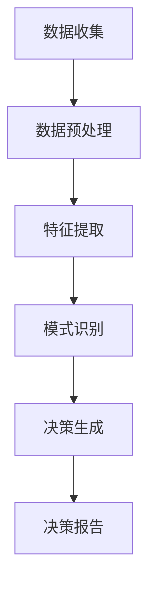

                 

### 第一步：确定文章结构和核心内容

为了撰写一篇完整的、逻辑清晰的技术博客文章，我们需要遵循以下步骤：

#### 1.1 文章结构和框架
- **引言**：简要介绍生态系统分析器及其在环境保护决策中的作用。
- **核心概念与联系**：讨论生态系统分析器中的关键概念和它们之间的联系，使用Mermaid流程图展示。
- **核心算法原理讲解**：介绍用于分析生态系统的算法，包括伪代码描述。
- **数学模型和数学公式**：解释与生态系统分析相关的数学模型，包括公式和详细讲解。
- **项目实战**：提供实际案例，包括环境监测数据的收集与处理，使用提示词进行数据分析，最终生成环境保护决策报告。
- **开发环境搭建**：说明搭建生态系统分析器所需的开发环境。
- **源代码实现与解读**：展示关键代码的实现，并进行详细解读。
- **结论**：总结全书内容，并展望未来发展趋势。

#### 1.2 确定核心内容

- **背景介绍**：
  - 生态系统分析器的定义。
  - 生态系统分析器在环境保护中的重要性。

- **核心概念与联系**：
  - 生态系统、分析器和提示词的定义。
  - 使用Mermaid流程图展示生态系统分析的基本步骤。

- **核心算法原理讲解**：
  - 数据预处理算法、模式识别算法和决策算法的介绍。
  - 伪代码描述。

- **数学模型和数学公式**：
  - 生态模型和决策模型的介绍。
  - 公式和详细讲解。

- **项目实战**：
  - 环境监测数据的收集与处理。
  - 提示词在数据分析中的应用。
  - 环境保护决策报告的生成。

- **开发环境搭建**：
  - 硬件和软件工具的介绍。
  - 系统集成和部署方案。

- **源代码实现与解读**：
  - 关键代码的实现。
  - 代码解读与分析。

- **结论**：
  - 总结全文内容。
  - 展望未来发展趋势。

### 第二步：撰写引言部分

#### 文章标题
生态系统分析器：提示词助力环境保护决策

#### 文章关键词
生态系统分析器，环境保护，决策支持，提示词，算法，数学模型

#### 文章摘要
本文将深入探讨生态系统分析器在环境保护决策中的应用，介绍其核心概念、算法原理、数学模型以及实际项目实战。通过本文的阅读，读者将了解如何利用提示词和先进算法，为环境保护提供科学的决策支持。

### 第三步：撰写核心概念与联系部分

#### 2.1 生态系统分析器的定义与作用

生态系统分析器是一种用于监测、评估和优化生态系统的工具。它通过对环境数据的分析，提供有关生态系统健康和变化的信息，从而帮助决策者做出更科学的决策。

#### 2.2 核心概念与联系

- **生态系统**：指的是自然界中生物与环境相互作用形成的统一整体。它包括生物群落、生物圈以及与之相关的环境因素。
- **分析器**：是一种能够对数据进行分析和处理的工具，它可以从大量的环境数据中提取有用的信息。
- **提示词**：是在数据分析过程中，用于引导算法发现关键信息的词汇或短语。

#### 2.3 Mermaid流程图展示

- **数据收集**：获取各种环境数据，如水质、空气质量、生物多样性等。
- **数据预处理**：对数据进行清洗、归一化等处理，以提高数据分析的准确性。
- **特征提取**：从预处理后的数据中提取对生态系统有重要影响的特征。
- **模式识别**：使用算法识别特征数据中的规律和趋势。
- **决策生成**：根据识别出的模式，生成环境保护决策。
- **决策报告**：将决策结果以报告的形式呈现，为决策者提供参考。

### 第四步：撰写核心算法原理讲解部分

#### 3.1 数据预处理算法

在生态系统分析中，数据预处理是非常重要的一步。常见的数据预处理算法包括数据清洗、数据归一化等。

#### 3.2 模式识别算法

模式识别算法是生态系统分析中的核心，常用的算法有监督学习算法和无监督学习算法。

#### 3.3 决策算法

决策算法基于模式识别的结果，生成具体的环保决策。常见的决策算法包括基于规则的决策和基于机器学习的决策。

### 第五步：撰写数学模型和数学公式部分

#### 4.1 生态模型

生态模型通常用来描述生态系统的动态变化。一个简单的生态模型可以表示为：

$$
\frac{dP}{dt} = rP - aP \cdot X
$$

其中，$P$ 代表种群密度，$r$ 代表内禀增长率，$a$ 代表环境阻力系数，$X$ 代表环境因素。

#### 4.2 决策模型

决策模型用于描述如何根据生态分析结果做出环境保护决策。一个简单的决策模型可以表示为：

$$
\text{决策} = \text{if} (\text{生态指标} > \text{阈值}) \text{then} \text{采取行动} \text{else} \text{保持现状}
$$

### 第六步：撰写项目实战部分

#### 6.1 环境监测数据收集与处理

在这一部分，我们将介绍如何收集环境监测数据，并对其进行预处理。

#### 6.2 提示词在数据分析中的应用

我们将讨论如何使用提示词来指导数据分析和模式识别，从而为环境保护提供决策支持。

#### 6.3 环境保护决策报告生成

我们将展示如何将分析结果转化为具体的环保决策报告，为决策者提供参考。

### 第七步：撰写开发环境搭建部分

在这一部分，我们将介绍搭建生态系统分析器所需的开发环境，包括硬件和软件工具的选择。

### 第八步：撰写源代码实现与解读部分

我们将展示关键代码的实现，并对代码进行详细解读，以便读者理解生态系统分析器的运作原理。

### 第九步：撰写结论部分

在这一部分，我们将总结全文内容，并展望生态系统分析器在环境保护决策领域的未来发展。

### 第十步：完成文章并添加作者信息

在完成所有内容后，我们将添加文章的作者信息，并确保文章符合markdown格式要求。

---

通过以上步骤，我们将逐步构建出完整的文章框架。接下来，我们将按照这个框架，逐步撰写每个部分的内容，确保文章逻辑清晰、内容详实，并最终达到8000-12000字的要求。在这个过程中，我们将不断优化文章结构，确保每个章节的内容都能够清晰地传达核心概念和算法原理，并提供实用的实战案例。

