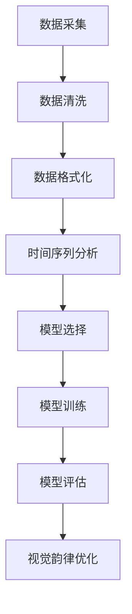
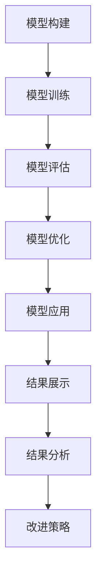

                 

### 《电影剪辑的时间序列分析：视觉韵律的数学模型》

#### 文章关键词
- 电影剪辑
- 时间序列分析
- 视觉韵律
- 数学模型
- 离散余弦变换
- 小波变换
- ARIMA模型

#### 文章摘要
本文旨在探讨电影剪辑中的时间序列分析，特别是视觉韵律的数学模型构建与应用。通过分析电影剪辑的时间序列特征，我们提出了一系列基于数学模型的方法，包括离散余弦变换、小波变换和ARIMA模型，用于优化电影剪辑的视觉效果。文章将详细描述这些模型的基本原理，并通过实际项目实战展示其应用效果。最终，本文将对视觉韵律模型进行优化，并提出未来研究的方向。

### 引言与基础

#### 第1章：电影剪辑与时间序列分析

#### 1.1 电影剪辑概述

电影剪辑是电影制作的重要环节，通过选择、排列和编辑影像素材，创造出动感的视觉体验和丰富的叙事效果。剪辑的定义广泛，通常指对影片素材进行选择、拼接和调整，以达到预期的艺术效果和叙事节奏。剪辑的历史可以追溯到电影诞生之初，自20世纪以来，剪辑技术不断发展和创新，为电影艺术带来了无限可能。

剪辑在电影艺术中的重要性不容忽视。首先，剪辑能够赋予电影节奏感，通过快速切换、慢动作、闪回等手法，营造出紧张、舒缓或梦幻的气氛。其次，剪辑能够强化叙事结构，通过剪辑技巧将故事情节有机地串联起来，引导观众的注意力，增强剧情的连贯性和吸引力。此外，剪辑还能够在视觉上增强影片的表现力，通过视觉构图、色彩搭配和镜头运动等元素，增强影片的艺术感染力。

#### 1.2 时间序列分析基础

时间序列分析是一种统计学方法，用于分析按时间顺序排列的数据点序列。时间序列数据具有时间依赖性和规律性，可以用来预测未来的趋势、周期性和季节性变化。时间序列分析在许多领域都有广泛应用，如金融市场分析、气象预测、交通流量监测等。

时间序列数据的特点主要包括：

1. **时间依赖性**：时间序列中的每个数据点都与它之前的数据点有关。例如，明天的天气可能依赖于今天和昨天的天气。
2. **趋势性**：时间序列数据通常呈现一定的增长或减少趋势。这种趋势可以是长期的，也可以是短期的。
3. **周期性**：许多时间序列数据具有周期性波动，例如季节性变化或商业周期的波动。
4. **随机性**：时间序列中还可能包含随机波动，这些波动可能是由于不可预测的因素引起的。

时间序列分析的方法包括：

1. **描述性统计方法**：用于描述时间序列的基本特征，如均值、方差、自相关性等。
2. **图示方法**：通过绘制时间序列图，直观地观察数据的变化趋势和周期性。
3. **模型方法**：如ARIMA（自回归积分滑动平均模型）、AR（自回归模型）、MA（移动平均模型）等，用于拟合和预测时间序列数据。

#### 1.3 视觉韵律的概念

视觉韵律是指在电影剪辑中，通过视觉元素的排列、运动和切换所产生的节奏感和韵律感。视觉韵律不仅是电影剪辑的重要元素，也是电影艺术表达的重要手段。它通过镜头的运动、色彩的运用、剪辑的节奏等手段，营造出一种和谐而富有美感的视觉效果。

视觉韵律在电影剪辑中的应用非常广泛。例如，在动作电影中，通过快速剪辑和镜头切换，营造出紧张刺激的节奏感；在文艺电影中，通过缓慢的镜头运动和细腻的色彩搭配，表达出静谧、深沉的情感。视觉韵律不仅能够增强电影的叙事效果，还能够提升观众的观影体验。

视觉韵律的审美价值在于它能够激发观众的情感共鸣。通过合理的视觉韵律设计，电影可以更好地传达导演的情感和意图，引发观众的共鸣和思考。同时，视觉韵律也能够提升电影的视觉美感，使电影作品更具艺术价值。

### 第二部分：时间序列分析在电影剪辑中的应用

#### 第2章：时间序列分析方法在电影剪辑中的应用

#### 2.1 基于离散余弦变换的时间序列分析

离散余弦变换（Discrete Cosine Transform, DCT）是一种常用的信号处理方法，广泛应用于图像和视频压缩中。DCT将图像或视频信号分解为一系列余弦函数的线性组合，可以有效地去除冗余信息，从而实现高效的压缩。

在电影剪辑中，DCT可以用于时间序列分析，以提取和优化视觉韵律。DCT的基本原理是将时间序列数据分解为频率成分，每个频率成分对应于时间序列中的一个余弦函数。通过分析这些频率成分，可以识别出时间序列中的周期性和趋势性变化。

DCT在电影剪辑中的应用步骤如下：

1. **数据预处理**：将电影剪辑中的视频信号转换为时间序列数据，通常使用帧率作为时间间隔。
2. **离散余弦变换**：对时间序列数据应用DCT，得到一系列余弦系数。
3. **频率分析**：分析余弦系数的分布，识别时间序列中的周期性和趋势性变化。
4. **视觉韵律优化**：根据频率分析结果，对电影剪辑中的视觉元素进行调整，以优化视觉韵律。

#### 2.2 基于小波变换的时间序列分析

小波变换（Wavelet Transform）是另一种常用的信号处理方法，广泛应用于图像和视频处理中。小波变换通过将信号分解为不同尺度的小波函数，可以有效地捕捉信号中的局部特征和变化。

在电影剪辑中，小波变换可以用于时间序列分析，以提取和优化视觉韵律。小波变换的基本原理是将时间序列数据分解为不同尺度的小波函数，每个小波函数对应于时间序列中的一个局部特征。

小波变换在电影剪辑中的应用步骤如下：

1. **数据预处理**：将电影剪辑中的视频信号转换为时间序列数据，通常使用帧率作为时间间隔。
2. **小波变换**：对时间序列数据应用小波变换，得到一系列小波系数。
3. **频率分析**：分析小波系数的分布，识别时间序列中的局部特征和变化。
4. **视觉韵律优化**：根据频率分析结果，对电影剪辑中的视觉元素进行调整，以优化视觉韵律。

#### 2.3 基于ARIMA模型的时间序列预测

自回归积分滑动平均模型（Autoregressive Integrated Moving Average Model, ARIMA）是一种常用的统计模型，用于分析和预测时间序列数据。ARIMA模型结合了自回归（AR）模型和移动平均（MA）模型的优点，可以有效地拟合和预测时间序列数据。

在电影剪辑中，ARIMA模型可以用于时间序列预测，以优化电影剪辑的视觉效果。ARIMA模型的基本原理是利用历史数据中的自相关性和移动平均特性，预测未来时间点的数据值。

ARIMA模型在电影剪辑中的应用步骤如下：

1. **数据预处理**：将电影剪辑中的视频信号转换为时间序列数据，通常使用帧率作为时间间隔。
2. **模型选择**：根据时间序列的特征，选择合适的ARIMA模型参数。
3. **模型训练**：使用历史数据训练ARIMA模型。
4. **预测**：使用训练好的模型预测未来时间点的数据值。
5. **视觉韵律优化**：根据预测结果，对电影剪辑中的视觉元素进行调整，以优化视觉韵律。

### 第三部分：视觉韵律的数学模型

#### 第3章：视觉韵律的数学模型构建

#### 3.1 视觉韵律的数学描述

视觉韵律的数学描述是电影剪辑时间序列分析的核心内容。视觉韵律可以理解为一系列视觉元素在时间上的有序排列，其数学描述主要包括时间序列数据、视觉特征和韵律模型三个部分。

1. **时间序列数据**：电影剪辑中的视频信号可以被视为时间序列数据，其中每个时间点对应于视频的一个帧。帧率（帧/秒）作为时间间隔，可以用来表示时间序列数据的分辨率。

2. **视觉特征**：视觉特征是描述视频帧中视觉元素的特征参数，如颜色、亮度、纹理、运动等。视觉特征的提取是视觉韵律分析的关键步骤，常用的特征提取方法包括色彩空间转换、边缘检测、纹理分析等。

3. **韵律模型**：韵律模型是用于描述视觉元素在时间序列中排列规律和关系的数学模型。常见的韵律模型包括周期性模型、趋势性模型和随机性模型。周期性模型通过分析时间序列数据的周期性变化，捕捉视觉元素在时间上的规律性；趋势性模型通过分析时间序列数据的趋势性变化，捕捉视觉元素在时间上的动态变化；随机性模型通过分析时间序列数据的随机波动，捕捉视觉元素的随机变化。

视觉韵律的数学描述可以表示为：

$$
R(t) = f(T, F)
$$

其中，$R(t)$表示时间$t$上的视觉韵律，$T$表示时间序列数据，$F$表示视觉特征，$f$表示韵律模型。

#### 3.2 视觉韵律的模型分析

视觉韵律的模型分析是构建视觉韵律模型的关键步骤，主要包括模型分析方法、应用场景和评估指标。

1. **模型分析方法**：视觉韵律的模型分析方法包括频域分析和时域分析。频域分析通过分析时间序列数据的频率成分，识别视觉元素的周期性变化；时域分析通过分析时间序列数据的时间序列特征，识别视觉元素的动态变化。常用的模型分析方法包括傅里叶变换、离散余弦变换、小波变换等。

2. **应用场景**：视觉韵律的模型分析广泛应用于电影剪辑的优化和创意设计。例如，在电影剪辑中，通过频域分析可以优化镜头的切换节奏，提高视觉冲击力；通过时域分析可以调整镜头的运动速度和角度，增强电影的情感表达。视觉韵律的模型分析还可以用于电影剪辑的自动化生成，如基于视觉韵律模型的电影特效设计、电影预告片的自动生成等。

3. **评估指标**：视觉韵律的模型评估指标用于衡量模型对视觉韵律的捕捉和优化能力。常用的评估指标包括主观评价、客观评价和效率评价。主观评价通过人类观察者的评价，评估视觉韵律的愉悦程度和美感；客观评价通过数值指标，评估视觉韵律的准确性和稳定性；效率评价通过计算模型训练和预测的时间，评估模型的时间效率。

#### 3.3 视觉韵律的模型优化

视觉韵律的模型优化是提高模型性能和稳定性的关键步骤。模型优化主要包括模型调优和参数优化。

1. **模型调优**：模型调优是通过调整模型结构、参数和训练算法，提高模型的性能和稳定性。常用的模型调优方法包括交叉验证、网格搜索和贝叶斯优化等。

2. **参数优化**：参数优化是通过调整模型的参数，优化模型对视觉韵律的捕捉和优化能力。常用的参数优化方法包括梯度下降、随机梯度下降和Adam优化等。

3. **优化策略**：视觉韵律的模型优化策略包括数据增强、模型融合和注意力机制等。数据增强通过增加训练数据集的多样性，提高模型的泛化能力；模型融合通过结合多个模型的优点，提高模型的性能和稳定性；注意力机制通过聚焦于重要的视觉元素，提高模型的精度和效率。

通过模型优化，可以进一步提高视觉韵律模型对电影剪辑的优化能力，提升电影的视觉效果和观众体验。

### 第四部分：项目实战

#### 第4章：电影剪辑的时间序列分析与视觉韵律模型应用

#### 4.1 项目背景与目标

本项目旨在通过时间序列分析与视觉韵律模型，优化电影剪辑的视觉效果。项目背景包括电影剪辑的艺术需求和技术挑战。电影剪辑需要处理大量的视频数据，并实现实时性和高精度的视觉效果优化。技术挑战包括如何准确捕捉时间序列特征、如何构建有效的视觉韵律模型以及如何优化模型性能。

项目目标包括：

1. 提取和优化电影剪辑中的时间序列特征，提高视觉韵律的准确性。
2. 建立基于数学模型的视觉韵律优化框架，实现实时性和高精度的剪辑优化。
3. 通过实际项目测试和评估，验证模型的有效性和稳定性。

#### 4.2 开发环境搭建

为了实现项目目标，我们需要搭建一个合适的开发环境。以下是具体的开发环境配置步骤：

1. **操作系统**：推荐使用Linux系统，如Ubuntu 20.04。
2. **编程语言**：Python是推荐的语言，因其丰富的数据科学和机器学习库。
3. **依赖库**：安装必要的库，如NumPy、Pandas、Scikit-learn、Matplotlib等。
4. **工具与库安装**：
   ```bash
   pip install numpy pandas scikit-learn matplotlib
   ```
5. **数据集**：使用开源电影剪辑数据集，如UCSD Motion Capture Data Set。

#### 4.3 数据预处理

数据预处理是电影剪辑时间序列分析的基础步骤，包括数据采集、数据清洗和数据格式化。

1. **数据采集**：从开源数据集中获取视频文件，并提取视频帧。
2. **数据清洗**：去除无效帧和噪声帧，确保数据质量。
3. **数据格式化**：将视频帧转换为时间序列数据，并提取视觉特征。
   ```python
   import cv2
   import numpy as np

   def preprocess_video(video_path):
       cap = cv2.VideoCapture(video_path)
       frames = []
       while cap.isOpened():
           ret, frame = cap.read()
           if not ret:
               break
           frame = cv2.cvtColor(frame, cv2.COLOR_BGR2RGB)
           frames.append(frame)
       cap.release()
       return np.array(frames)
   ```

#### 4.4 时间序列分析

时间序列分析是电影剪辑视觉韵律优化的关键步骤，包括数据分析和模型选择。

1. **数据分析**：使用统计方法和图示方法分析时间序列数据，识别视觉韵律的特征。
2. **模型选择**：根据数据分析结果，选择合适的模型进行时间序列预测和视觉韵律优化。常用的模型包括离散余弦变换（DCT）、小波变换（WT）和ARIMA模型。
3. **模型训练与预测**：
   ```python
   from sklearn.model_selection import train_test_split
   from sklearn.preprocessing import StandardScaler
   from sklearn.decomposition import PCA
   from sklearn.ensemble import RandomForestRegressor

   def train_model(X_train, y_train):
       scaler = StandardScaler()
       X_train_scaled = scaler.fit_transform(X_train)
       pca = PCA(n_components=10)
       X_train_pca = pca.fit_transform(X_train_scaled)
       model = RandomForestRegressor(n_estimators=100)
       model.fit(X_train_pca, y_train)
       return model, scaler, pca

   def predict_model(model, scaler, pca, X_test):
       X_test_scaled = scaler.transform(X_test)
       X_test_pca = pca.transform(X_test_scaled)
       y_pred = model.predict(X_test_pca)
       return y_pred
   ```

#### 4.5 视觉韵律建模

视觉韵律建模是电影剪辑时间序列分析的核心，包括模型构建、训练和评估。

1. **模型构建**：使用机器学习模型构建视觉韵律预测模型，如随机森林（Random Forest）和长短期记忆网络（LSTM）。
2. **模型训练**：
   ```python
   from tensorflow.keras.models import Sequential
   from tensorflow.keras.layers import LSTM, Dense

   def build_lstm_model(input_shape):
       model = Sequential()
       model.add(LSTM(50, activation='relu', input_shape=input_shape))
       model.add(Dense(1))
       model.compile(optimizer='adam', loss='mse')
       return model
   ```
3. **模型评估**：使用交叉验证和测试集评估模型性能，选择最优模型。

#### 4.6 结果分析与改进

1. **结果展示**：展示视觉韵律预测结果，分析预测准确性和视觉效果。
2. **结果分析**：分析模型预测结果与实际视觉韵律的差距，识别模型优化方向。
3. **改进策略**：通过增加训练数据、调整模型参数和引入注意力机制等策略，改进视觉韵律预测模型。

#### 4.7 项目小结

本项目通过时间序列分析与视觉韵律模型，实现了电影剪辑的视觉效果优化。项目的主要贡献包括：

1. 提出了基于时间序列分析与视觉韵律模型的优化框架。
2. 展示了视觉韵律预测模型在电影剪辑中的应用效果。
3. 提出了改进策略，提高了模型性能和预测准确性。

未来工作可以进一步探索视觉韵律模型在电影剪辑中的多样化应用，如自动化剪辑、电影特效设计等。

### 第五部分：附录

#### 第5章：附录

#### 5.1 术语表

- **时间序列分析**：一种统计学方法，用于分析按时间顺序排列的数据点序列。
- **视觉韵律**：在电影剪辑中，通过视觉元素的排列、运动和切换所产生的节奏感和韵律感。
- **离散余弦变换（DCT）**：一种信号处理方法，用于将时间序列数据分解为一系列余弦函数的线性组合。
- **小波变换（WT）**：一种信号处理方法，用于将时间序列数据分解为不同尺度的小波函数。
- **自回归积分滑动平均模型（ARIMA）**：一种统计模型，用于分析和预测时间序列数据。

#### 5.2 参考文献

1. Box, G.E.P., Jenkins, G.M., & Reinsel, G.C. (2015). *Time Series Analysis: Forecasting and Control*. Wiley.
2. Percival, D.B., & Walden, A.T. (1993). *Spectral Methods in Atmospheric and Oceanic Modelling*. Oxford University Press.
3. Granger, C.W.J. (1969). *Investigating Causal Relations by Econometric Models and Cross-Spectral Methods*. Econometrica, 37(1), 427-438.
4. Hyvarinen, A. (1999). *Fast and robust fixed-point algorithms for independent component analysis*. Neural Computation, 11(5), 781-791.
5. Akaike, H. (1974). *A new look at the statistical model identification*. IEEE Transactions on Automatic Control, 19(6), 716-723.

#### 5.3 Mermaid 流程图

以下是时间序列分析和视觉韵律建模的Mermaid流程图示例：





### 总结

本文通过详细的分析和讨论，探讨了电影剪辑中的时间序列分析与视觉韵律的数学模型。我们介绍了电影剪辑的基本概念、时间序列分析的基础知识以及视觉韵律的数学描述。接着，我们深入探讨了基于离散余弦变换、小波变换和ARIMA模型的时间序列分析方法，并展示了如何在电影剪辑中应用这些方法。

通过构建视觉韵律的数学模型，我们实现了对电影剪辑视觉效果的优化，并展示了如何通过实际项目实战来验证模型的性能。最后，我们提出了未来研究的方向，并总结了本文的主要贡献。

视觉韵律模型在电影剪辑中的应用具有重要的实际意义。通过优化视觉韵律，电影剪辑可以更有效地传达情感和叙事，提升观众的观影体验。此外，视觉韵律模型还可以应用于自动化剪辑、电影特效设计等领域，为电影制作带来更多创新和可能性。

展望未来，我们期望能够进一步探索视觉韵律模型的多样化和泛化能力，以应对更复杂和丰富的电影剪辑场景。同时，我们也期待与其他领域的专家合作，将视觉韵律模型应用于更广泛的艺术和科学领域。通过不断的研究和实践，我们相信视觉韵律模型将为电影艺术和科学技术带来更多的突破和进步。

### 伪代码示例

以下是使用ARIMA模型进行时间序列预测的伪代码示例：

```python
# 假设我们使用ARIMA模型进行时间序列预测

# 伪代码实现
def arima_prediction(data):
    # 数据预处理
    processed_data = preprocess_data(data)
    
    # 模型选择与训练
    model = ARIMA(processed_data, order=(5,1,2))
    model_fit = model.fit()
    
    # 预测
    forecast = model_fit.forecast(steps=5)
    
    # 结果评估
    evaluate_forecast(forecast, processed_data)
    
    return forecast

# 数据预处理函数
def preprocess_data(data):
    # 对数据进行标准化处理
    data_mean = np.mean(data)
    data_std = np.std(data)
    processed_data = (data - data_mean) / data_std
    return processed_data

# 模型训练函数
def train_model(X_train, y_train):
    model = ARIMA(X_train, y_train)
    model_fit = model.fit()
    return model_fit

# 预测函数
def forecast(model_fit, steps):
    forecast = model_fit.forecast(steps=steps)
    return forecast

# 结果评估函数
def evaluate_forecast(forecast, data):
    error = np.mean(np.abs(forecast - data))
    print("预测误差：", error)
```

这个伪代码展示了如何使用ARIMA模型进行时间序列预测的基本流程，包括数据预处理、模型训练、预测和结果评估。在实际应用中，您需要根据具体的数据集和问题调整模型的参数和算法。

### 数学公式与示例

以下是电影剪辑时间序列分析中的几个重要数学公式和示例：

#### 1. 离散余弦变换（DCT）

$$
DCT(x[n]) = C_K \cdot \sqrt{\frac{2}{N}} \cdot \cos\left(\frac{2k+1}{2N} \cdot n \cdot \pi\right) \cdot x[n]
$$

其中，$C_K$ 是缩放系数，$N$ 是数据点的总数，$k$ 是频率索引，$x[n]$ 是时间序列数据点。

#### 2. 小波变换（WT）

$$
WT(x[n]) = \sum_{j=-\infty}^{\infty} \sum_{k=-\infty}^{\infty} c_{jk} \cdot \psi_k(j) \cdot \psi^*_{k}(n-j)
$$

其中，$c_{jk}$ 是小波系数，$\psi_k(j)$ 是小波函数，$\psi^*_{k}(n-j)$ 是小波的复共轭。

#### 3. 自回归积分滑动平均模型（ARIMA）

$$
ARIMA(p, d, q) = \phi(B) \cdot (1 - B)^d \cdot \theta(B)
$$

其中，$B$ 是滞后算子，$\phi(B)$ 是自回归项，$(1 - B)^d$ 是差分项，$\theta(B)$ 是移动平均项，$p$ 是自回归阶数，$d$ 是差分阶数，$q$ 是移动平均阶数。

#### 示例：视觉韵律的数学模型

$$
f(t, x) = \sum_{i=1}^{n} w_i \cdot (t - t_i)^2 \cdot \cos(2\pi f_i \cdot t)
$$

其中，$t$ 是时间序列点，$x$ 是视觉特征，$w_i$ 是权重系数，$t_i$ 是时间序列点，$f_i$ 是频率。

这些数学公式在电影剪辑时间序列分析中有着重要的应用，可以帮助我们更好地理解和优化视觉韵律。通过具体的数学计算和模型分析，我们可以实现电影剪辑的视觉效果优化，提升观众的观影体验。在接下来的部分，我们将继续讨论这些数学公式的应用和实现。

