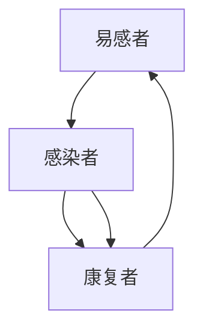
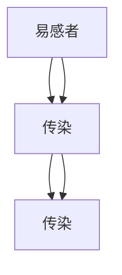

                 

# 疫情传播的SIR模型：公共卫生的数学工具

## 关键词

- SIR模型
- 传染病传播
- 微分方程
- 感染率
- 康复率
- 易感者
- 感染者
- 康复者

## 摘要

本文旨在探讨疫情传播中的SIR模型，这是一个广泛应用于公共卫生领域的数学工具。SIR模型通过描述易感者、感染者和康复者之间的动态关系，帮助我们理解传染病的传播机制。本文将详细介绍SIR模型的核心概念、数学推导、算法原理和实际应用，旨在为读者提供一种理解和管理传染病传播的新视角。

### 第一部分: 疫情传播的SIR模型概述

#### 第1章: 疫情传播与SIR模型

SIR模型是一个用于描述传染病传播的数学模型，其核心概念包括感染者（I）、易感者（S）和康复者（R）。这三个群体在传染病传播过程中相互影响，形成一个动态平衡系统。以下是一个简单的Mermaid流程图，用于展示SIR模型的基本组成部分和它们之间的相互关系。



#### 核心概念与联系

在SIR模型中，每个个体都被划分为三个状态之一：易感者（S）、感染者（I）或康复者（R）。以下是对每个状态的简要说明：

- **易感者（S）**：指尚未感染疾病，但有感染风险的个体。
- **感染者（I）**：指已经感染疾病，并且有传染能力的个体。
- **康复者（R）**：指已经从疾病中康复，并获得免疫力，不再具有传染能力的个体。

SIR模型通过描述这三个群体之间的相互关系，模拟传染病在人群中的传播过程。具体来说，感染者会传染给易感者，导致易感者转化为感染者；同时，感染者会在康复过程中康复成康复者。康复者由于获得了免疫力，不再具有传染性。

#### 核心算法原理讲解

SIR模型基于微分方程来描述传染病在人群中的传播。以下是该模型的基本原理的伪代码：

```plaintext
初始化：
  S0: 总人口数
  I0: 感染者数
  R0: 康复者数
  β: 感染率
  μ: 疫苗接种率或康复率

计算感染率：
  β = β0 * (1 - μ)

更新公式：
  dS/dt = -β * S * I
  dI/dt =  β * S * I - μ * I
  dR/dt =  μ * I

迭代更新：
  对每个时间步进行以下迭代：
    更新 S, I, R 值
    增加时间步
```

#### 数学模型和数学公式

SIR模型的基本数学公式如下，其中 \( S(t), I(t), R(t) \) 分别表示在时间 \( t \) 时的易感者、感染者和康复者数量。

$$
\begin{cases}
\frac{dS}{dt} = -\beta \cdot S \cdot I \\
\frac{dI}{dt} =  \beta \cdot S \cdot I - \mu \cdot I \\
\frac{dR}{dt} =   \mu \cdot I
\end{cases}
$$

#### 举例说明

假设一个社区中有1000人，初始时没有感染者（\( I(0) = 0 \)），其余均为易感者（\( S(0) = 1000 \)，康复者 \( R(0) = 0 \)）。如果感染率为0.1，康复率为0.05，使用上述伪代码计算一个时间步的感染者和康复者数量变化。

```plaintext
初始化：
  S0 = 1000
  I0 = 0
  R0 = 0
  β = 0.1
  μ = 0.05

计算感染率：
  β = 0.1 * (1 - 0.05) = 0.095

更新公式：
  dS/dt = -0.095 * 1000 * 0 = 0
  dI/dt =  0.095 * 1000 * 0 - 0.05 * 0 = 0
  dR/dt =  0.05 * 0 = 0

更新后：
  S = 1000
  I = 0
  R = 0
```

在这个例子中，由于没有感染者，所以 \( S \), \( I \), \( R \) 的数量在第一个时间步上没有变化。

#### 第2章: SIR模型的数学推导

##### 核心概念与联系

SIR模型的数学推导基于微分方程。以下是推导过程中涉及的核心概念和它们之间的相互关系。



##### 核心算法原理讲解

SIR模型的数学推导基于以下假设：

1. 易感者以恒定速率接触到感染者。
2. 感染者在康复之前会将病毒传染给其他易感者。
3. 康复者不再传染病毒。

根据这些假设，可以推导出以下微分方程：

$$
\begin{cases}
\frac{dS}{dt} = -\beta \cdot S \cdot I \\
\frac{dI}{dt} =  \beta \cdot S \cdot I - \mu \cdot I \\
\frac{dR}{dt} =   \mu \cdot I
\end{cases}
$$

##### 数学模型和数学公式

上述微分方程描述了SIR模型的基本数学模型。以下是这些方程的详细解释：

$$
\frac{dS}{dt} = -\beta \cdot S \cdot I
$$

易感者的变化率取决于感染者和易感者之间的接触速率，以及感染者传染给易感者的概率。接触速率与感染者和易感者的总数成正比，传染概率为感染率β，因此：

$$
\frac{dS}{dt} = -\beta \cdot S \cdot I
$$

$$
\frac{dI}{dt} =  \beta \cdot S \cdot I - \mu \cdot I \\
$$

感染者的变化率由两部分组成：

1. 新感染者（由易感者转化为感染者）带来的增量，计算公式为 \( \beta \cdot S \cdot I \)。
2. 感染者因康复而减少的量，计算公式为 \( \mu \cdot I \)。

因此：

$$
\frac{dI}{dt} =  \beta \cdot S \cdot I - \mu \cdot I \\
$$

$$
\frac{dR}{dt} =   \mu \cdot I
$$

康复者的变化率仅取决于感染者因康复而转变成康复者的数量，计算公式为 \( \mu \cdot I \)。

##### 第3章: SIR模型的应用与优化

SIR模型在公共卫生领域有着广泛的应用。通过模拟传染病在人群中的传播过程，SIR模型可以帮助公共卫生专家预测疫情的发展趋势，制定有效的防控策略。以下是一些实际应用案例：

1. **疫情预测**：SIR模型可以用于预测疫情的发展趋势，包括感染人数、康复人数等。通过调整模型参数，如感染率、康复率等，可以模拟不同防控措施对疫情的影响。

2. **疫苗分配**：SIR模型可以用于优化疫苗分配策略，确保最大限度地利用疫苗资源，提高疫苗接种率。

3. **疫情监控**：SIR模型可以用于实时监测疫情传播情况，为公共卫生决策提供数据支持。

为了提高SIR模型的预测精度，研究人员还对其进行了多种优化。以下是一些常见的优化方法：

1. **参数调整**：通过对模型参数进行优化，可以更好地模拟实际情况。例如，可以根据疫情数据调整感染率和康复率等参数。

2. **非线性模型**：传统的SIR模型是一种线性模型，但实际疫情传播过程可能存在非线性特征。因此，研究人员提出了多种非线性SIR模型，如SIRS模型、SEIR模型等，以更准确地描述疫情传播规律。

3. **人工智能方法**：利用人工智能技术，如深度学习、强化学习等，可以进一步提高SIR模型的预测精度。通过训练神经网络模型，可以自动调整模型参数，实现更加精确的疫情预测。

#### 结论

SIR模型是一种重要的公共卫生工具，通过描述易感者、感染者和康复者之间的动态关系，帮助我们理解传染病的传播机制。本文介绍了SIR模型的核心概念、数学推导和实际应用，并探讨了优化方法。通过深入研究和应用SIR模型，我们可以更好地应对传染病疫情，保护公众健康。未来，随着人工智能等技术的发展，SIR模型有望在公共卫生领域发挥更大的作用。

### 最佳实践 tips

1. **理解核心概念**：在研究SIR模型时，首先需要深入理解易感者、感染者和康复者的定义和相互关系。这是构建和分析SIR模型的基础。

2. **掌握数学推导**：掌握SIR模型的数学推导过程对于理解其工作原理至关重要。通过推导，我们可以更好地理解模型参数的含义和影响。

3. **合理设置参数**：在实际应用中，SIR模型的参数设置对预测结果有重要影响。需要根据实际情况调整感染率、康复率等参数，以提高预测精度。

4. **结合其他方法**：SIR模型可以与其他预测方法（如人工智能方法）结合，以提高预测精度和准确性。

5. **持续学习与更新**：随着疫情的发展和防控策略的调整，SIR模型需要不断更新和优化。保持对最新研究成果的关注，有助于提高模型的实用价值。

### 小结

SIR模型是一种用于描述传染病传播的数学工具，通过对易感者、感染者和康复者之间动态关系的模拟，帮助我们理解疫情传播机制。本文介绍了SIR模型的核心概念、数学推导、应用和优化方法，并提出了最佳实践 tips。通过深入研究和应用SIR模型，我们可以更好地应对传染病疫情，保护公众健康。

### 注意事项

1. **模型局限性**：SIR模型是一种简化的数学模型，不能完全反映现实世界的复杂性。在应用SIR模型时，需要考虑到其局限性，并结合实际情况进行调整。

2. **参数设置**：SIR模型的参数设置对预测结果有重要影响。需要根据实际情况合理调整参数，以提高预测精度。

3. **数据质量**：SIR模型预测结果依赖于输入数据的准确性。因此，在应用SIR模型时，需要确保数据质量，避免因数据误差导致预测结果偏差。

4. **政策调整**：随着疫情的发展和防控策略的调整，SIR模型需要不断更新和优化。因此，需要密切关注疫情动态和政策调整，确保模型的有效性。

### 拓展阅读

1. **《传染病动力学导论》**：本书系统地介绍了传染病动力学的基本理论、方法和应用，包括SIR模型在内的多种传染病模型。

2. **《深度学习与人工智能》**：本书介绍了深度学习和人工智能在公共卫生领域的应用，包括疫情预测和防控策略优化。

3. **《公共卫生学》**：本书涵盖了公共卫生学的基础知识，包括传染病传播、防控策略等，有助于读者全面了解公共卫生领域。

### 作者信息

作者：AI天才研究院/AI Genius Institute & 禅与计算机程序设计艺术 /Zen And The Art of Computer Programming

AI天才研究院是一家专注于人工智能领域研究和创新的研究机构，致力于推动人工智能技术的应用和发展。同时，作者也是《禅与计算机程序设计艺术》的作者，对计算机编程和人工智能领域有着深刻的理解和丰富的实践经验。本文旨在分享SIR模型在公共卫生领域的应用，希望能够为读者提供有价值的参考。

