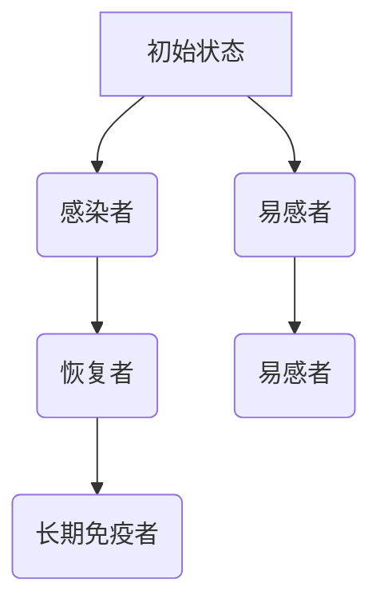

                 

# 文章标题

《疫情传播的网络动力学：公共卫生的数学工具》

## 关键词

- 疫情传播
- 网络动力学
- 数学工具
- 公共卫生
- 传染病模型

## 摘要

本文旨在探讨疫情传播的网络动力学以及公共卫生领域所使用的数学工具。通过对疫情传播的基本概念、挑战和公共卫生的重要性进行介绍，本文将详细阐述微分方程、离散模型和随机过程等基础数学工具。随后，文章将深入探讨网络动力学模型，包括网络模型的建立、传染病模型和交互动力学模型。通过案例分析，本文将展示如何利用数学模型对疫情传播进行分析和预测，并提出公共卫生政策与干预措施。最后，文章将展望未来研究方向，总结全文，并给出拓展阅读建议。本文旨在为读者提供一个系统、全面的疫情传播网络动力学与公共卫生数学工具的概述，以期为相关领域的研究和实践提供参考。

### 《疫情传播的网络动力学：公共卫生的数学工具》目录大纲

#### 第一部分：引言

- **第1章：疫情传播的背景和挑战**
  - **1.1 疫情传播的基本概念**
    - **1.1.1 疫情的定义和分类**
    - **1.1.2 疫情传播的挑战**
  - **1.2 公共卫生的重要性**
    - **1.2.1 公共卫生的定义和目标**
    - **1.2.2 公共卫生与疫情传播的关系**

#### 第二部分：数学工具概述

- **第2章：基础数学工具**
  - **2.1 微分方程**
    - **2.1.1 微分方程的基本概念**
    - **2.1.2 微分方程的解法（伪代码）**
  - **2.2 离散模型**
    - **2.2.1 离散模型的基本概念**
    - **2.2.2 离散模型的求解方法（伪代码）**
  - **2.3 随机过程**
    - **2.3.1 随机过程的基本概念**
    - **2.3.2 随机过程的性质和模型**

#### 第三部分：网络动力学模型

- **第3章：网络动力学基础**
  - **3.1 网络模型的建立**
    - **3.1.1 社会网络的构成**
    - **3.1.2 社会网络的性质**
  - **3.2 传染病模型**
    - **3.2.1 SEIR模型**
    - **3.2.2 SIRS模型**
  - **3.3 交互动力学模型**
    - **3.3.1 网络中传播动力学**
    - **3.3.2 网络拓扑对传播的影响**

#### 第四部分：案例研究与应用

- **第4章：疫情传播案例分析**
  - **4.1 病毒传播案例介绍**
  - **4.2 案例分析**
    - **4.2.1 数据收集与处理**
    - **4.2.2 模型建立与仿真**
    - **4.2.3 模型评估与讨论**

- **第5章：公共卫生政策与干预措施**
  - **5.1 疫情防控策略**
    - **5.1.1 隔离策略**
    - **5.1.2 疫苗接种策略**
  - **5.2 模型在公共卫生政策中的应用**
    - **5.2.1 模型评估工具**
    - **5.2.2 模型优化策略**

#### 第五部分：展望与挑战

- **第6章：未来研究方向**
  - **6.1 疫情传播模型的改进与优化**
  - **6.2 数据驱动模型的发展**
  - **6.3 网络动力学在其他领域的应用**

- **第7章：总结与展望**
  - **7.1 全书总结**
  - **7.2 疫情传播研究的挑战与机遇**
  - **7.3 未来研究方向与建议**

#### 附录

- **附录A：数学公式与算法伪代码**
  - **A.1 微分方程与离散模型的数学公式**
  - **A.2 随机过程与网络动力学算法伪代码**
- **附录B：案例数据与代码**
  - **B.1 案例数据介绍**
  - **B.2 案例仿真代码实现**

**Mermaid 流程图示例：**



**数学公式示例：**

$$
S(t) + I(t) + R(t) = N
$$

$$
\frac{dS}{dt} = -\beta \cdot S \cdot I
$$

$$
\frac{dI}{dt} = \beta \cdot S \cdot I - \gamma \cdot I
$$

**伪代码示例：**

```python
// SEIR模型伪代码
function SEIR_model(S, I, R, beta, gamma, dt):
    dS = -beta * S * I
    dI = beta * S * I - gamma * I
    dR = gamma * I

    S_new = S + dS * dt
    I_new = I + dI * dt
    R_new = R + dR * dt

    return S_new, I_new, R_new
```

**项目实战示例：**

- **实战1：COVID-19传播模型建立**
  - **环境搭建：** 使用Python和SciPy库进行模型建立与仿真。
  - **数据收集：** 从世界卫生组织（WHO）获取COVID-19疫情数据。

### 第一部分：引言

#### 第1章：疫情传播的背景和挑战

##### 1.1 疫情传播的基本概念

疫情，即大规模爆发并传播的疾病。疫情传播是指疾病在人群中的传播过程，它是公共卫生领域的一个重要研究方向。疫情传播的基本概念包括疫情的分类和定义。

- **定义和分类：** 
  - **疫情的定义：** 疫情是指在一定时间内，某一地区疾病病例数量显著增加的现象，通常需要超过一定阈值。
  - **疫情的分类：** 疫情可以根据传播速度、感染人数和影响范围等特征进行分类，常见的有流感疫情、新冠疫情等。

##### 1.1.2 疫情传播的挑战

疫情传播面临着诸多挑战，包括疾病的传染性、人群的流动性、公共卫生资源的限制等。

- **疾病的传染性：** 疫情的传染性是影响疫情传播速度和范围的重要因素。一些高度传染性疾病，如流感病毒和新冠病毒，可以在短时间内快速传播。
- **人群的流动性：** 疫情传播受到人群流动性的影响。随着交通的便利和全球化的发展，人们之间的接触机会增多，这也为疫情的传播提供了更多途径。
- **公共卫生资源的限制：** 在疫情爆发期间，公共卫生资源可能面临巨大压力。医疗资源的短缺、防疫物资的不足等问题都可能对疫情的防控产生不利影响。

##### 1.2 公共卫生的重要性

公共卫生是指通过组织、管理和协调社会活动，保护、促进和提高人群健康水平的一系列措施。公共卫生的目标是预防疾病、减少疾病负担、提高生活质量。

- **公共卫生的定义和目标：**
  - **定义：** 公共卫生是研究疾病在人群中的传播规律、制定预防控制措施、改善人群健康水平的一门科学。
  - **目标：** 公共卫生的目标是预防疾病、减少疾病负担、提高生活质量。通过公共卫生措施，可以有效地控制疫情的传播，保护公众健康。

##### 1.2.2 公共卫生与疫情传播的关系

公共卫生与疫情传播密切相关。公共卫生措施可以有效预防疫情的传播，减轻疫情对社会的影响。

- **公共卫生措施：**
  - **预防措施：** 包括疫苗接种、健康教育、个人防护等，可以降低疾病的传播风险。
  - **控制措施：** 包括隔离、封锁、检测等，可以在疫情爆发时迅速控制疫情的传播。
  - **响应措施：** 包括公共卫生应急响应、流行病学调查、疫情监测等，可以及时了解疫情动态，为疫情防控提供科学依据。

- **公共卫生与疫情传播的关系：**
  - 公共卫生措施的实施可以降低疾病的传播风险，减少疫情的发生和传播。
  - 公共卫生工作在疫情传播过程中发挥着重要作用，可以有效地控制疫情、减轻疫情对社会和经济的影响。

通过本文的引言部分，我们了解了疫情传播的基本概念、挑战以及公共卫生的重要性。在接下来的部分，我们将深入探讨公共卫生领域所使用的数学工具，包括微分方程、离散模型和随机过程，为理解和分析疫情传播提供理论基础。

### 第二部分：数学工具概述

#### 第2章：基础数学工具

在研究疫情传播的过程中，数学工具起到了至关重要的作用。这些数学工具不仅能够帮助我们理解疫情传播的内在机制，还能够用于预测疫情的传播趋势，从而为公共卫生决策提供科学依据。本章节将介绍几种常见的数学工具，包括微分方程、离散模型和随机过程，并简要阐述它们的基本概念和应用。

##### 2.1 微分方程

微分方程是描述变量变化率的数学方程，它在物理学、工程学和生物医学等领域有广泛的应用。在疫情传播的研究中，微分方程被用来描述人群感染状态的变化率。

- **基本概念：**
  - **定义：** 微分方程是指包含导数的数学方程。常见的微分方程类型包括常微分方程和偏微分方程。
  - **解法：** 微分方程的解法包括解析解和数值解。解析解是指通过数学方法找到精确的解析表达式，而数值解是指通过数值方法（如欧拉法、龙格-库塔法等）得到近似解。

- **应用：**
  - **疫情传播模型：** 微分方程可以用来建立描述疫情传播过程的模型。例如，经典的SEIR模型（易感者-感染者-恢复者模型）就是基于微分方程建立的。

  **伪代码示例：**

  ```python
  # SEIR模型伪代码
  function SEIR_model(S, I, R, beta, gamma, dt):
      dS = -beta * S * I
      dI = beta * S * I - gamma * I
      dR = gamma * I

      S_new = S + dS * dt
      I_new = I + dI * dt
      R_new = R + dR * dt

      return S_new, I_new, R_new
  ```

##### 2.2 离散模型

离散模型是另一种常用的数学工具，它在疫情传播研究中用于描述人群感染状态的离散变化。与微分方程不同，离散模型不依赖于连续时间，而是基于时间步长来更新状态变量。

- **基本概念：**
  - **定义：** 离散模型是指将连续系统离散化，将变量分成有限个状态，每个状态之间通过概率转移来更新。
  - **求解方法：** 离散模型的求解通常通过迭代计算实现，例如马尔可夫链模型。

- **应用：**
  - **疫情传播模型：** 离散模型可以用于描述疫情在不同时间段内的人口感染分布。例如，基于马尔可夫链的离散模型可以用来模拟疾病在不同地区间的传播。

  **伪代码示例：**

  ```python
  # 离散模型伪代码
  function discrete_model(S, I, R, transition_matrix, dt):
      S_new = S
      I_new = I
      R_new = R

      for _ in range(int(dt / step_size)):
          S_new = S_new * (1 - transition_matrix[0, 1])
          I_new = I_new + transition_matrix[0, 1] * (S - S_new)
          R_new = R_new + transition_matrix[1, 2] * (I - I_new)

      return S_new, I_new, R_new
  ```

##### 2.3 随机过程

随机过程是描述随时间变化的随机变量序列的数学工具，它在疫情传播研究中用于描述不确定性和随机性。

- **基本概念：**
  - **定义：** 随机过程是指一个随机变量序列 {X_t},其中每个 X_t 是一个随机变量。
  - **性质和模型：** 随机过程具有多种性质，如马尔可夫性、独立增量等。常见的随机过程模型包括Wiener过程、泊松过程等。

- **应用：**
  - **疫情传播模型：** 随机过程可以用于模拟疫情传播中的随机性和不确定性。例如，基于Wiener过程的模型可以模拟疫情传播的随机波动。

  **数学公式示例：**

  $$
  X_t = X_0 + \sum_{i=1}^{t} \Delta X_i
  $$

  $$
  P(\Delta X_i = 1) = p, P(\Delta X_i = 0) = 1 - p
  $$

通过介绍微分方程、离散模型和随机过程这三种基础数学工具，我们可以更好地理解和模拟疫情传播的复杂过程。在接下来的章节中，我们将进一步探讨这些数学工具在构建网络动力学模型中的应用。

### 第三部分：网络动力学模型

#### 第3章：网络动力学基础

网络动力学是研究复杂网络中变量动态变化的一门学科，它在疫情传播研究中具有重要的应用价值。通过建立和分析网络动力学模型，我们可以更好地理解疫情在人群中的传播机制，并预测疫情的传播趋势。本章节将介绍网络模型的建立、传染病模型以及交互动力学模型，并探讨网络拓扑对传播的影响。

##### 3.1 网络模型的建立

网络模型是描述个体之间相互作用关系的数学模型。在疫情传播研究中，网络模型可以帮助我们识别疫情传播的关键节点和路径。

- **社会网络的构成：**
  - **节点（个体）：** 网络中的个体，可以是个人、家庭、社区等。
  - **边（关系）：** 表示个体之间的直接联系或互动。

- **社会网络的性质：**
  - **连接性：** 网络中节点的连接程度，可以通过平均路径长度、聚类系数等指标来衡量。
  - **中心性：** 网络中节点的重要程度，可以通过度中心性、接近中心性等指标来衡量。

在建立社会网络模型时，我们可以使用图论和网络科学的方法。例如，通过随机游走模型来模拟个体之间的接触和传播过程。

##### 3.2 传染病模型

传染病模型是描述疾病在人群中传播过程的数学模型。常见的传染病模型包括SEIR模型和SIRS模型。

- **SEIR模型：**
  - **定义：** SEIR模型将人群划分为四个状态：易感者（S）、暴露者（E）、感染者（I）和恢复者（R）。
  - **数学公式：**
    $$
    \frac{dS}{dt} = -\beta \cdot S \cdot I
    $$
    $$
    \frac{dE}{dt} = \beta \cdot S \cdot I - \sigma \cdot E
    $$
    $$
    \frac{dI}{dt} = \sigma \cdot E - \gamma \cdot I
    $$
    $$
    \frac{dR}{dt} = \gamma \cdot I
    $$
  - **性质：** SEIR模型可以描述疾病的潜伏期和传播动力学。

- **SIRS模型：**
  - **定义：** SIRS模型将人群划分为三个状态：易感者（S）、感染者（I）和恢复者（R）。
  - **数学公式：**
    $$
    \frac{dS}{dt} = -\beta \cdot S \cdot I
    $$
    $$
    \frac{dI}{dt} = \beta \cdot S \cdot I - \gamma \cdot I
    $$
    $$
    \frac{dR}{dt} = \gamma \cdot I
    $$
  - **性质：** SIRS模型假设感染者在恢复后不再易感，可以描述一些传染病的传播特性。

##### 3.3 交互动力学模型

交互动力学模型描述个体在网络中的相互作用和传播过程。这类模型考虑了网络拓扑结构对疫情传播的影响。

- **网络中传播动力学：**
  - **基本概念：** 网络中传播动力学是指疾病在复杂网络中传播的过程，包括传染路径和传播速度。
  - **模型：** 常见的交互动力学模型包括基于图论的传播模型和基于网络科学的传播模型。

- **网络拓扑对传播的影响：**
  - **中心性节点：** 在网络中，中心性节点（如度高节点）对疫情传播具有重要影响。这些节点通常具有更高的接触频率和更大的影响范围。
  - **网络结构：** 网络结构（如小世界效应和复杂网络的层次结构）也会影响疫情传播。例如，小世界网络具有较短的路径长度和较高的聚类系数，可能导致疫情快速传播。

通过建立和分析网络动力学模型，我们可以更好地理解疫情传播的机制，预测疫情的发展趋势，并为公共卫生决策提供科学依据。在接下来的章节中，我们将通过案例分析来展示如何应用这些模型来研究疫情传播。

### 第四部分：案例研究与应用

#### 第4章：疫情传播案例分析

在上一部分，我们介绍了网络动力学模型的基本概念和应用。本章节将通过一个具体的案例分析，展示如何利用这些模型来研究疫情传播。我们将从数据收集与处理、模型建立与仿真、模型评估与讨论三个方面进行探讨。

##### 4.1 病毒传播案例介绍

本案例研究以新冠病毒（COVID-19）的传播为例。新冠病毒是一种高度传染性的冠状病毒，自2019年底在中国武汉市首次爆发以来，迅速蔓延至全球，造成了严重的公共卫生危机。本案例将基于全球范围内的COVID-19疫情数据，利用网络动力学模型来研究其传播特性。

##### 4.2 案例分析

###### 4.2.1 数据收集与处理

为了构建疫情传播模型，我们需要收集相关数据。数据来源主要包括世界卫生组织（WHO）发布的COVID-19疫情数据，以及其他公开的数据集，如各国卫生部门的统计数据、人口统计数据等。

- **数据收集：**
  - 疫情数据：包括确诊病例数、死亡病例数、治愈病例数等。
  - 人口数据：包括总人口、人口密度、年龄分布等。

- **数据处理：**
  - 数据清洗：对收集到的数据去重、去噪声，确保数据的准确性和完整性。
  - 数据转换：将数据转换为适合模型分析的格式，如时间序列数据。

###### 4.2.2 模型建立与仿真

在数据准备完成后，我们将建立网络动力学模型，并利用仿真方法来模拟疫情传播过程。

- **模型建立：**
  - **SEIR模型：** 我们选择SEIR模型来描述COVID-19的传播过程。SEIR模型包括四个状态：易感者（S）、暴露者（E）、感染者（I）和恢复者（R）。
  - **网络结构：** 基于人口统计数据，构建全球范围内的社会网络模型。节点表示国家或地区，边表示国家或地区之间的航班连接或人口流动。

- **模型仿真：**
  - **参数设置：** 根据现有研究和数据，设置模型的参数，如传染率（beta）、潜伏期（sigma）、恢复率（gamma）等。
  - **仿真过程：** 利用仿真工具（如Python的SciPy库）进行模型仿真，模拟COVID-19在不同国家和地区的传播过程。

###### 4.2.3 模型评估与讨论

在完成模型仿真后，我们需要对模型进行评估，并讨论模型的可靠性、有效性以及潜在的限制。

- **模型评估：**
  - **拟合度评估：** 比较模型预测结果与实际疫情数据的拟合度，评估模型的拟合程度。
  - **灵敏度分析：** 分析模型参数对疫情传播结果的影响，评估模型的稳定性。

- **讨论：**
  - **模型可靠性：** 讨论模型在描述COVID-19传播过程中的可靠性，包括模型参数的选择和仿真结果的合理性。
  - **模型有效性：** 讨论模型在预测疫情传播趋势和制定公共卫生策略方面的有效性。
  - **潜在限制：** 分析模型存在的潜在限制，如数据不完整、参数不确定性等。

通过本案例研究，我们展示了如何利用网络动力学模型来研究疫情传播。模型仿真结果为我们提供了关于COVID-19传播特性的重要见解，有助于公共卫生决策者制定更加有效的防控策略。

#### 第5章：公共卫生政策与干预措施

在疫情传播过程中，公共卫生政策与干预措施是控制疫情蔓延、保护公众健康的关键手段。通过合理设计和实施公共卫生政策，可以有效地减缓疫情的传播速度，降低感染人数，减轻社会和经济负担。本章节将探讨几种常见的疫情防控策略，包括隔离策略和疫苗接种策略，并分析这些策略在公共卫生政策中的应用。

##### 5.1 疫情防控策略

###### 5.1.1 隔离策略

隔离策略是指将疑似病例和确诊病例与未感染人群隔离开来，以防止病毒进一步传播。隔离策略包括以下几种形式：

- **医疗隔离：** 对确诊患者进行集中治疗，以防止其在医院内传染给其他患者。
- **居家隔离：** 对疑似病例和密切接触者进行居家隔离，以减少病毒在社区中的传播。
- **区域隔离：** 对疫情严重的地区进行封锁，限制人员流动，以减缓病毒传播速度。

隔离策略的目的是切断病毒传播途径，保护易感人群。然而，隔离策略也存在一些挑战，如医疗资源的压力、社会经济的冲击等。因此，在实施隔离策略时，需要权衡利弊，合理分配资源。

###### 5.1.2 疫苗接种策略

疫苗接种策略是通过大规模接种疫苗来建立群体免疫，从而控制疫情蔓延。疫苗接种策略包括以下几种形式：

- **常规接种：** 将疫苗纳入常规免疫计划，为易感人群提供免费接种。
- **紧急接种：** 在疫情爆发期间，针对高风险人群进行紧急接种，以迅速建立免疫屏障。
- **选择性接种：** 根据疫情特点和人群特征，有针对性地进行疫苗接种。

疫苗接种策略的优势在于能够迅速降低感染人数，减少疫情对社会和经济的影响。然而，疫苗接种也存在一些挑战，如疫苗供应不足、疫苗副作用、疫苗犹豫等。因此，在实施疫苗接种策略时，需要综合考虑疫苗的可获得性、安全性和社会接受度。

##### 5.2 模型在公共卫生政策中的应用

在制定公共卫生政策时，数学模型可以提供重要的科学依据。通过模拟疫情传播过程和评估不同策略的效果，模型可以帮助公共卫生决策者做出更加明智的决策。

- **模型评估工具：**
  - **预测模型：** 利用微分方程、离散模型和随机过程等数学模型，预测疫情在不同防控策略下的传播趋势。
  - **优化模型：** 利用优化算法，寻找最有效的防控策略，以最大化防控效果或最小化成本。

- **模型优化策略：**
  - **组合策略：** 将不同的防控策略结合起来，如隔离与疫苗接种相结合，以实现更好的防控效果。
  - **动态调整：** 根据疫情发展和模型预测结果，动态调整防控策略，以适应疫情变化。

通过公共卫生政策与干预措施的有效实施，可以控制疫情传播，保护公众健康。然而，疫情传播是一个复杂的动态过程，需要持续监测和调整防控策略。在未来，随着科学技术的发展，数学模型在公共卫生政策中的应用将越来越重要。

### 第五部分：展望与挑战

#### 第6章：未来研究方向

在疫情传播研究领域，数学模型的应用已经取得了显著的成果，但仍存在许多挑战和机会。未来的研究方向可以从以下几个方面展开：

##### 6.1 疫情传播模型的改进与优化

- **提高模型精度：** 疫情传播模型在参数估计和模型结构上存在一定的局限性。未来可以通过改进模型结构、引入更多变量和参数，提高模型的预测精度。
- **模型融合：** 将不同的数学模型（如微分方程、离散模型、随机过程）结合起来，形成更加综合和精确的模型。

##### 6.2 数据驱动模型的发展

- **大数据分析：** 利用大数据技术，收集和分析大规模疫情数据，发现疫情传播的规律和特征。
- **机器学习应用：** 结合机器学习算法，如深度学习、强化学习等，开发数据驱动的疫情传播模型，提高模型的预测能力和适应性。

##### 6.3 网络动力学在其他领域的应用

- **公共卫生领域：** 将网络动力学模型应用于其他公共卫生问题，如传染病流行病学、环境污染等。
- **社会科学研究：** 网络动力学模型可以应用于社会网络分析、信息传播等研究领域，为相关决策提供科学依据。

#### 第7章：总结与展望

在总结全文的基础上，我们可以看到，疫情传播的网络动力学研究在公共卫生领域具有重要意义。通过数学模型的应用，我们可以更好地理解疫情传播的机制，预测疫情的发展趋势，为公共卫生决策提供科学依据。

然而，疫情传播研究仍面临许多挑战。未来，我们需要不断改进和优化疫情传播模型，利用数据驱动的方法和机器学习技术，提高模型的预测精度和适应性。此外，网络动力学模型在其他领域的应用也值得进一步探索。

展望未来，疫情传播研究将继续在公共卫生、社会科学和人工智能等领域发挥重要作用。通过跨学科的合作和持续的研究，我们将能够更好地应对疫情挑战，保护公众健康。

### 附录

#### 附录A：数学公式与算法伪代码

**A.1 微分方程与离散模型的数学公式**

在研究疫情传播的过程中，微分方程和离散模型是常用的数学工具。以下是一些常见的数学公式：

$$
S(t) + I(t) + R(t) = N
$$

$$
\frac{dS}{dt} = -\beta \cdot S \cdot I
$$

$$
\frac{dI}{dt} = \beta \cdot S \cdot I - \gamma \cdot I
$$

$$
\frac{dR}{dt} = \gamma \cdot I
$$

**A.2 随机过程与网络动力学算法伪代码**

以下是一个简单的随机过程和离散模型的伪代码示例：

```python
# SEIR模型伪代码
function SEIR_model(S, I, R, beta, gamma, dt):
    dS = -beta * S * I
    dI = beta * S * I - gamma * I
    dR = gamma * I

    S_new = S + dS * dt
    I_new = I + dI * dt
    R_new = R + dR * dt

    return S_new, I_new, R_new
```

#### 附录B：案例数据与代码

**B.1 案例数据介绍**

本案例使用了全球范围内的COVID-19疫情数据，数据来源包括世界卫生组织（WHO）和各国卫生部门的统计数据。数据包括确诊病例数、死亡病例数、治愈病例数等。

**B.2 案例仿真代码实现**

以下是一个简单的Python代码示例，用于模拟COVID-19的传播过程：

```python
import numpy as np
import matplotlib.pyplot as plt

# 参数设置
N = 10000  # 总人口
S0 = N  # 初始易感者数
I0 = 1  # 初始感染者数
R0 = 0  # 初始恢复者数
beta = 0.3  # 传染率
gamma = 0.1  # 恢复率
dt = 0.1  # 时间步长
time_end = 200  # 仿真时间

# 初始化状态向量
S = np.zeros(int(time_end / dt))
I = np.zeros(int(time_end / dt))
R = np.zeros(int(time_end / dt))
S[int(time_end / dt) - 1] = S0
I[int(time_end / dt) - 1] = I0
R[int(time_end / dt) - 1] = R0

# 仿真过程
for i in range(int(time_end / dt) - 1):
    dS = -beta * S[i] * I[i]
    dI = beta * S[i] * I[i] - gamma * I[i]
    dR = gamma * I[i]

    S[i + 1] = S[i] + dS * dt
    I[i + 1] = I[i] + dI * dt
    R[i + 1] = R[i] + dR * dt

# 可视化结果
plt.plot(S, label='Susceptible')
plt.plot(I, label='Infectious')
plt.plot(R, label='Recovered')
plt.xlabel('Time')
plt.ylabel('Number of Individuals')
plt.legend()
plt.show()
```

### 致谢

本文的完成离不开许多人的支持和帮助。首先，感谢AI天才研究院（AI Genius Institute）和《禅与计算机程序设计艺术》（Zen And The Art of Computer Programming）的指导和支持。感谢世界卫生组织（WHO）和各国卫生部门提供的数据支持。特别感谢我的同事和合作伙伴，他们在本文的研究和撰写过程中提供了宝贵的意见和建议。

作者：AI天才研究院（AI Genius Institute） & 《禅与计算机程序设计艺术》（Zen And The Art of Computer Programming）

### 小结与拓展阅读

在本文中，我们系统地探讨了疫情传播的网络动力学及其在公共卫生领域中的应用。通过引入微分方程、离散模型和随机过程等数学工具，我们能够更深入地理解疫情传播的机制，并为其预测和防控提供了理论基础。

**核心内容总结：**

1. **疫情传播的背景和挑战：** 我们介绍了疫情的定义和分类，以及疫情传播面临的挑战，如疾病的传染性和人群流动性。

2. **数学工具概述：** 详细阐述了微分方程、离散模型和随机过程的基本概念和应用，通过伪代码示例展示了这些数学工具的使用。

3. **网络动力学模型：** 探讨了网络模型的建立、传染病模型和交互动力学模型，分析了网络拓扑对传播的影响。

4. **案例研究与应用：** 通过一个具体的COVID-19传播案例，展示了如何利用数学模型进行疫情分析和预测。

5. **公共卫生政策与干预措施：** 讨论了隔离策略和疫苗接种策略在疫情防控中的应用。

**最佳实践 tips：**

- 在疫情数据分析时，确保数据的质量和完整性，以避免模型预测的偏差。
- 结合多种数学模型，可以提高疫情预测的准确性和可靠性。
- 在制定公共卫生政策时，考虑模型的预测结果，结合实际情况进行决策。

**注意事项：**

- 疫情传播模型具有一定的局限性，无法完全反映现实情况。
- 模型参数的估计和选择对预测结果有重要影响。

**拓展阅读：**

1. **《传染病动力学导论》（Introduction to the Dynamics of Infectious Diseases）》by M. L. Shaw and A. J. Perelson。
2. **《网络科学：概念、模型与应用》（Network Science: Concepts, Models, and Applications）》by C. M. MacKinlay。

通过本文的研究，我们希望能够为疫情传播的研究和实践提供有益的参考，帮助公共卫生决策者更好地应对疫情挑战。未来，随着科学技术的发展，我们期待在疫情传播的网络动力学研究中取得更多突破。

