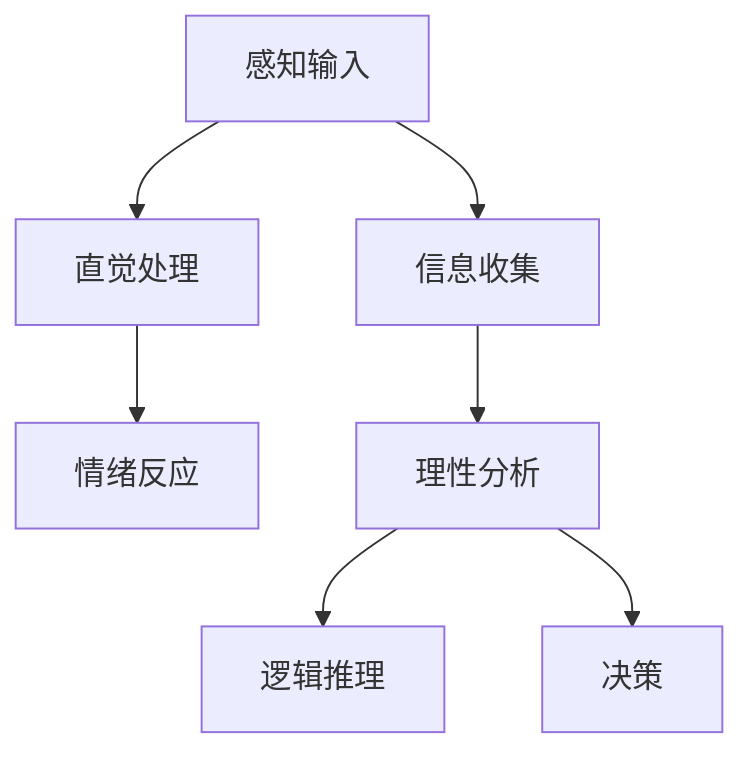

                 

# 直觉与理性在理解世界中的角色

> 关键词：直觉、理性、认知、思维、应用

在人类理解和探索世界的漫长历程中，直觉与理性始终扮演着关键角色。直觉，作为一种非逻辑的、快速的信息处理方式，使我们能够迅速做出决策和应对环境变化；而理性，则通过逻辑推理和系统分析，帮助我们深入理解复杂的问题和制定有效的解决方案。本文将围绕直觉与理性的概念、关系、应用及其在各个领域的角色进行探讨，通过一步步的分析推理，揭示它们在理解世界中的重要性。

## 摘要

本文旨在探讨直觉与理性在理解世界中的角色。首先，我们将介绍直觉与理性的基础概念，包括它们在认知和逻辑层面的特点和功能。接着，我们将分析直觉与理性的相互关系，探讨它们在互补与互动中的作用。随后，我们将探讨直觉与理性在日常生活、科学研究、心理学、商业决策等领域的应用。最后，我们将探讨直觉与理性在科技发展和未来发展趋势中的角色，并总结直觉与理性在实践中的应用和挑战。

### 目录大纲

以下是本文的目录大纲：

1. **直觉与理性的基础**
   - 1.1 引言
   - 1.2 直觉的认知基础
   - 1.3 理性的逻辑基础
   - 1.4 直觉与理性的相互关系

2. **直觉与理性的应用**
   - 2.1 直觉在生活中的应用
   - 2.2 理性在科学中的应用
   - 2.3 直觉与理性在心理学中的应用
   - 2.4 直觉与理性在商业决策中的应用

3. **直觉与理性的挑战与未来**
   - 3.1 直觉与理性的局限性
   - 3.2 直觉与理性在科技发展中的作用
   - 3.3 直觉与理性的未来发展

4. **直觉与理性的实践与应用**
   - 4.1 直觉与理性在个人发展中的应用
   - 4.2 直觉与理性在团队合作中的应用
   - 4.3 直觉与理性在公共决策中的应用

5. **直觉与理性的综合案例**
   - 5.1 案例分析：直觉与理性在医疗决策中的应用
   - 5.2 案例分析：直觉与理性在商业创新中的应用
   - 5.3 案例分析：直觉与理性在科技创新中的应用

6. **结论**

## 1. 直觉与理性的基础

### 1.1 引言

直觉与理性是人类认知过程中不可或缺的两个方面。直觉是一种快速、自动化的信息处理方式，使我们能够迅速感知和响应外界环境；而理性则通过逻辑推理和分析，帮助我们深入理解复杂问题并制定解决方案。在日常生活中，直觉和理性共同作用于我们的决策过程，使我们能够应对各种情况。

### 1.2 直觉的认知基础

直觉的认知基础在于大脑中快速、自动化的信息处理过程。直觉的产生依赖于大脑的神经连接和神经网络，这些神经网络能够在没有明显意识参与的情况下处理大量信息。直觉的信息处理过程通常包括以下步骤：

1. **感知输入**：直觉首先从感官中接收信息，如视觉、听觉、触觉等。
2. **模式识别**：大脑通过神经网络快速识别输入信息的模式，如人脸、声音等。
3. **情绪反应**：直觉会产生情绪反应，如愉悦、恐惧等。
4. **决策**：基于感知输入和情绪反应，直觉迅速做出决策。

直觉的这种信息处理过程使得直觉能够在短时间内处理大量信息，并在复杂环境中快速做出反应。例如，当我们在人群中寻找熟悉的朋友时，直觉能够迅速识别朋友的面孔并做出决策。

### 1.3 理性的逻辑基础

理性是基于逻辑推理和系统分析的认知方式。理性的信息处理过程通常包括以下步骤：

1. **问题识别**：理性首先识别需要解决的问题。
2. **信息收集**：理性通过收集和分析相关信息来理解问题。
3. **逻辑推理**：理性通过逻辑推理和系统分析来制定解决方案。
4. **决策**：基于逻辑推理和系统分析，理性做出决策。

理性的逻辑基础在于形式逻辑和数学模型。形式逻辑提供了一种严谨的推理方式，使理性能够从已知事实推导出新的结论。数学模型则用于定量分析和预测，使理性能够处理复杂的问题。

### 1.4 直觉与理性的相互关系

直觉与理性在认知过程中既有区别又有联系。直觉是快速、自动化的信息处理方式，而理性是系统、逻辑的分析方式。直觉使我们能够迅速感知和响应环境，而理性则帮助我们深入理解复杂问题并制定有效的解决方案。

直觉与理性的相互关系可以从以下几个方面进行理解：

1. **互补性**：直觉和理性在不同的认知任务中发挥互补作用。直觉适用于快速决策和应对环境变化，而理性适用于深入分析和制定长期策略。
2. **互动**：直觉和理性在认知过程中相互影响和互动。直觉可以为理性提供感知输入和情绪反应，而理性可以为直觉提供逻辑推理和分析框架。
3. **平衡**：在认知过程中，直觉和理性的平衡至关重要。过度依赖直觉可能导致盲目决策，而过度依赖理性可能导致僵化思维。

为了更好地理解直觉与理性的关系，我们可以借助Mermaid流程图来展示它们在认知过程中的互动：



在这个流程图中，感知输入同时作用于直觉处理和理性分析，直觉和理性在各自的作用下产生情绪反应和决策。

### 1.5 直觉与理性在认知中的重要性

直觉与理性在认知中的重要性不可忽视。直觉使我们能够快速适应和应对环境变化，而理性则帮助我们深入理解和解决问题。在日常生活中，直觉和理性共同作用于我们的决策过程，使我们能够做出明智的选择。例如，在驾驶过程中，直觉使我们能够迅速判断路况并做出反应，而理性则帮助我们规划行车路线和避免交通事故。

在科学研究领域，直觉和理性同样发挥着重要作用。科学家通过直觉感知到潜在的科学问题，并通过理性分析提出科学假设。直觉可以帮助科学家发现新的研究方向，而理性则通过实验验证和理论分析来验证科学假设。

总之，直觉与理性在理解世界中的角色至关重要。直觉使我们能够快速适应环境，而理性则帮助我们深入理解复杂问题并制定有效的解决方案。通过平衡直觉和理性，我们可以更好地应对各种挑战，提高认知能力和生活质量。

## 2. 直觉与理性的应用

### 2.1 直觉在生活中的应用

直觉在生活中的应用无处不在，它帮助我们在短时间内做出快速、有效的决策。以下是一些直觉在生活中的具体应用：

1. **快速决策**：直觉使我们能够迅速判断情况并做出决策。例如，当我们遇到紧急情况时，直觉会立即告诉我们如何应对，而不需要经过深思熟虑。

2. **情感感知**：直觉可以帮助我们感知他人的情感和意图。例如，当我们与他人交往时，直觉可以让我们迅速判断对方的情绪状态，从而调整自己的言行。

3. **创意思维**：直觉在创意思维中发挥着重要作用。许多创新和突破往往源于直觉的启发。例如，许多艺术家和科学家在灵感迸发时，会迅速记录下直觉带来的想法。

4. **日常任务**：在日常生活中，直觉可以帮助我们快速完成各种任务。例如，当我们需要选择一种商品时，直觉可以迅速告诉我们哪种商品更适合我们。

### 2.2 理性在科学中的应用

理性在科学研究中扮演着至关重要的角色，它通过逻辑推理和系统分析，帮助科学家深入理解自然现象和规律。以下是一些理性在科学中的应用：

1. **理论构建**：科学家通过理性分析，构建出各种科学理论。这些理论通过逻辑推理和实验验证，帮助我们理解自然界的运作规律。

2. **实验设计**：理性思维在实验设计中至关重要。科学家通过理性分析，设计出能够有效验证理论假设的实验方案。

3. **数据分析**：理性思维在数据分析和统计中发挥着重要作用。科学家通过理性分析，从大量数据中提取有价值的信息，为科学理论提供支持。

4. **科学方法**：理性思维是科学研究方法的基础。科学研究方法强调通过观察、假设、实验验证等步骤，逐步揭示自然现象的本质。

### 2.3 直觉与理性在心理学中的应用

直觉和理性在心理学研究中同样具有重要意义。以下是一些直觉与理性在心理学中的应用：

1. **心理治疗**：直觉在心理治疗中发挥着重要作用。心理治疗师通过直觉感知来访者的情绪和心理状态，帮助他们解决问题。

2. **心理咨询**：理性思维在心理咨询中同样重要。心理咨询师通过理性分析，帮助来访者理解问题并制定有效的解决方案。

3. **心理测量**：直觉和理性在心理测量中也有应用。例如，通过直觉感知来访者的情绪和行为，可以更准确地评估他们的心理健康状况。

4. **认知心理学**：认知心理学研究直觉和理性的关系。通过实验和数据分析，认知心理学家揭示了直觉和理性在认知过程中的作用。

### 2.4 直觉与理性在商业决策中的应用

直觉和理性在商业决策中同样具有重要地位。以下是一些直觉与理性在商业决策中的应用：

1. **市场预测**：直觉在市场预测中发挥着重要作用。企业家和分析师通过直觉感知市场趋势，预测未来的市场走向。

2. **战略规划**：理性思维在战略规划中至关重要。企业通过理性分析，制定长期发展战略，以应对市场竞争和变化。

3. **风险管理**：直觉和理性在风险管理中同样重要。企业通过直觉感知风险，并通过理性分析制定有效的风险控制策略。

4. **创新决策**：直觉在创新决策中发挥着重要作用。许多企业家通过直觉感知到潜在的商业机会，并通过理性分析评估其可行性。

通过直觉和理性在生活中的应用，我们可以更好地应对各种挑战，提高决策质量。在科学、心理学和商业等领域，直觉和理性的结合可以帮助我们深入理解复杂问题，制定有效的解决方案。

### 2.5 直觉与理性在教育中的应用

直觉与理性在教育中的应用同样具有重要价值。以下是一些具体的应用：

1. **教学设计**：直觉在课程设计和教学方法选择中发挥着重要作用。教师通过直觉感知学生的学习需求和兴趣，设计出更加生动有趣的教学活动。

2. **学习评估**：理性思维在学习评估中至关重要。教师通过理性分析学生的成绩和学习行为，评估他们的学习效果，并制定相应的改进措施。

3. **问题解决**：直觉和理性在问题解决过程中都发挥着重要作用。教师通过直觉感知问题的核心，并通过理性分析找到有效的解决方案。

4. **创新教育**：直觉在创新教育中具有重要意义。教师鼓励学生发挥直觉思维，培养他们的创新能力和创造力。

5. **跨学科学习**：理性思维在跨学科学习中发挥着重要作用。教师通过理性分析，帮助学生理解不同学科之间的联系，促进知识的整合和应用。

通过直觉与理性在教育中的应用，教师可以更好地激发学生的学习兴趣，提高教学效果，培养学生的综合素质和创新能力。

### 2.6 直觉与理性在人工智能中的应用

直觉与理性在人工智能（AI）领域中的应用日益显著，它们在算法设计、模型训练和决策过程中发挥着重要作用。以下是一些具体的例子：

1. **算法设计**：直觉在算法设计初期往往起到关键作用。AI研究人员通过直觉感知问题的复杂性，选择合适的算法结构和参数设置。

2. **模型训练**：在深度学习等模型训练过程中，理性思维通过数学优化方法（如梯度下降算法）调整模型参数，以提高模型的准确性和鲁棒性。

3. **决策制定**：AI系统在决策制定中通常结合直觉和理性。例如，在自动驾驶领域，直觉用于感知环境变化，而理性用于分析最佳行动方案。

4. **强化学习**：在强化学习中，直觉（经验）帮助模型快速适应环境，而理性（目标函数）指导模型选择最优行动。

5. **自然语言处理**：在自然语言处理（NLP）领域，直觉用于理解语言中的隐喻和双关语，而理性用于构建语义模型和语法解析。

通过直觉与理性在AI领域的结合，我们可以开发出更加智能、适应性强的AI系统，为人类解决复杂问题提供有力支持。

### 2.7 直觉与理性在医疗决策中的应用

直觉与理性在医疗决策中扮演着关键角色，特别是在诊断、治疗规划和患者管理方面。以下是一些具体的应用：

1. **临床诊断**：医生通过直觉感知患者的病情，快速做出初步诊断。直觉帮助他们识别常见疾病和症状，而理性则通过医学知识和实验室检测结果进行验证。

2. **治疗方案制定**：医生在制定治疗方案时，结合直觉和理性分析。直觉帮助他们选择最可能有效的治疗方法，而理性则通过临床试验数据和医学研究支持决策。

3. **患者管理**：在患者管理中，医生通过直觉关注患者的整体状况，及时发现病情变化。理性思维则通过随访数据和医学监测结果，评估治疗效果并调整治疗方案。

4. **医学研究**：医学研究人员通过理性思维分析大量数据，揭示疾病机制和治疗方法。直觉则帮助他们识别研究中的关键问题和突破点。

5. **决策支持系统**：结合直觉与理性的医疗决策支持系统正在开发中，旨在辅助医生进行复杂决策，提高诊断和治疗的准确性和效率。

通过直觉与理性在医疗决策中的应用，我们可以提高医疗服务的质量，改善患者预后。

### 2.8 直觉与理性在法律领域的应用

直觉与理性在法律领域同样具有重要地位，它们在法律实践、司法决策和法学研究中发挥着关键作用。以下是一些具体的应用：

1. **法律实践**：律师在法律实践过程中，通过直觉迅速理解案件的关键点，识别潜在的争议和法律问题。理性思维则用于详细分析法律条文和案例，制定法律策略。

2. **司法决策**：法官在做出判决时，既依赖直觉感知案件的事实和证据，又通过理性分析法律原则和先例，确保判决的公正性和合法性。

3. **法学研究**：法学研究人员通过理性思维深入探讨法律理论、法律制度和发展趋势。直觉则帮助他们识别研究中的创新点和突破点，推动法学研究的发展。

4. **法律咨询**：法律顾问在提供咨询时，通过直觉快速理解客户的诉求和需求，通过理性分析法律条文和案例，为客户提供专业的法律建议。

5. **法律技术**：在法律技术领域，如人工智能和大数据的应用，直觉与理性结合，帮助开发出更加智能的法律分析和决策支持工具。

通过直觉与理性在法律领域的应用，我们可以提高法律服务的质量和效率，确保司法公正，促进法治社会的建设。

### 2.9 直觉与理性在艺术创作中的应用

直觉与理性在艺术创作中同样扮演着重要角色，艺术家通过直觉和理性的结合，创作出具有独特风格和深刻内涵的艺术作品。以下是一些具体的应用：

1. **创意思维**：艺术家在创作过程中，通过直觉快速捕捉灵感和创意，从而产生新颖的艺术构思。

2. **形式构建**：理性思维在艺术形式构建中发挥关键作用。艺术家通过理性分析，平衡构图、色彩和线条，创造出和谐的艺术形式。

3. **主题表达**：直觉和理性共同作用于艺术主题的表达。艺术家通过直觉感知生命和情感的深度，通过理性构建具有思想性和艺术性的主题。

4. **技术运用**：在艺术创作中，艺术家通过理性选择和运用各种技术手段，如绘画、雕塑、摄影等，实现艺术效果。

5. **批评与反思**：理性思维在艺术批评和反思中同样重要。艺术家和评论家通过理性分析，评价艺术作品的优劣，促进艺术创作的发展。

通过直觉与理性在艺术创作中的应用，艺术家可以创作出富有个性、思想和情感的艺术作品，推动艺术的发展和创新。

### 2.10 直觉与理性在环境保护中的应用

直觉与理性在环境保护中同样具有重要意义，它们在政策制定、环境监测和可持续发展中发挥着关键作用。以下是一些具体的应用：

1. **环境监测**：直觉帮助环境监测人员快速感知环境变化，如空气污染、水质污染等。理性思维则用于分析监测数据，制定应对措施。

2. **政策制定**：政策制定者通过理性分析环境和经济数据，制定环境保护政策。直觉则帮助他们识别环境问题的重要性和紧迫性。

3. **生态保护**：在生态保护中，直觉帮助科学家识别生态系统的重要性和脆弱性，而理性思维则用于制定保护策略和评估生态保护效果。

4. **可持续发展**：直觉和理性共同作用于可持续发展战略的制定。通过理性分析，确定可持续发展的目标和路径；通过直觉感知社会和环境的实际需求。

5. **公众参与**：在环境保护中，公众的直觉和理性参与至关重要。通过教育和宣传，提高公众的环境意识和参与度，共同推动环境保护事业。

通过直觉与理性在环境保护中的应用，我们可以更好地应对环境问题，实现可持续发展，保护地球家园。

### 2.11 直觉与理性在个人成长中的应用

直觉与理性在个人成长中同样具有重要意义，它们在自我认知、决策能力和心理发展方面发挥着关键作用。以下是一些具体的应用：

1. **自我认知**：通过直觉，个人能够快速感知自己的情绪、需求和兴趣，促进自我认知的发展。理性思维则帮助个人深入分析和理解这些内在体验。

2. **决策能力**：直觉和理性的结合，有助于个人在复杂情境中做出明智的决策。直觉提供快速反应和初步判断，而理性则进行深入分析和评估。

3. **心理发展**：直觉和理性的互动，对个人的心理发展具有积极影响。通过理性反思直觉，个人可以更好地理解自己的情绪和行为，促进心理成熟。

4. **目标设定**：在设定个人目标时，直觉帮助个人识别内心的渴望和愿景，而理性思维则帮助制定实际可行的计划和策略。

5. **情绪管理**：直觉和理性的结合，有助于个人更好地管理情绪。通过理性分析，个人可以理解情绪的根源和影响，通过直觉感知情绪的变化，采取适当应对策略。

通过直觉与理性在个人成长中的应用，个人可以更好地认识自己、提升决策能力，实现心理和情绪的平衡发展。

### 2.12 直觉与理性在团队合作中的应用

直觉与理性在团队合作中同样具有重要地位，它们在沟通协调、决策制定和任务完成中发挥着关键作用。以下是一些具体的应用：

1. **沟通协调**：直觉帮助团队成员快速理解和响应彼此的需求和意图，促进有效沟通。理性思维则通过逻辑分析和信息整合，确保沟通的准确性和一致性。

2. **决策制定**：直觉和理性的结合，有助于团队在面对复杂问题时做出明智的决策。直觉提供快速反应和初步判断，而理性则进行深入分析和评估。

3. **任务分配**：通过理性分析，团队可以确定每个成员的特长和职责，实现任务的最佳分配。直觉则帮助团队成员快速适应任务和环境变化。

4. **冲突解决**：直觉和理性的结合，有助于团队有效解决冲突。通过理性分析，团队可以理解冲突的根源和影响，通过直觉感知团队成员的情绪和需求，采取适当解决方案。

5. **创新协作**：直觉鼓励团队成员发挥创造力，提出新颖的想法。理性思维则通过系统分析和评估，筛选和优化创新方案。

通过直觉与理性在团队合作中的应用，团队可以增强协作效率，提高决策质量，实现共同目标。

### 2.13 直觉与理性在体育训练中的应用

直觉与理性在体育训练中同样具有重要意义，它们在运动员技能提升、战术制定和心理调适方面发挥着关键作用。以下是一些具体的应用：

1. **技能提升**：直觉帮助运动员快速感知和适应运动环境，提高技能水平。理性思维则通过技术分析和训练规划，系统提升运动员的表现。

2. **战术制定**：教练通过直觉感知比赛动态，制定灵活的战术策略。理性思维则通过数据分析，评估战术的有效性和调整策略。

3. **心理调适**：直觉帮助运动员快速应对比赛中的情绪波动，保持心理稳定。理性思维则通过心理训练和策略，增强运动员的心理素质。

4. **训练计划**：教练通过理性分析，制定科学合理的训练计划，确保运动员的体能和技能逐步提升。

5. **比赛决策**：在比赛过程中，直觉和理性共同作用于运动员的决策。直觉提供快速反应和初步判断，而理性则进行深入分析和评估。

通过直觉与理性在体育训练中的应用，运动员可以更好地提升技能水平，制定有效的战术策略，实现最佳竞技状态。

### 2.14 直觉与理性在创新过程中的应用

直觉与理性在创新过程中同样扮演着重要角色，它们在创意生成、方案评估和商业模式构建中发挥着关键作用。以下是一些具体的应用：

1. **创意生成**：直觉帮助创新者在短时间内捕捉灵感和创意，激发创新思维。理性思维则通过系统分析和评估，筛选和优化创意。

2. **方案评估**：通过理性分析，创新者可以评估不同方案的可行性和潜在风险，选择最佳方案。直觉则帮助创新者快速感知方案的优缺点。

3. **商业模式构建**：直觉帮助创新者理解市场需求和用户行为，构建创新性的商业模式。理性思维则通过财务分析和市场研究，验证商业模式的可行性。

4. **迭代优化**：在创新过程中，直觉和理性的结合，有助于创新者不断优化产品和服务，提高市场竞争力。

5. **风险应对**：直觉和理性共同作用于创新过程中的风险应对。通过理性分析，创新者可以识别和评估潜在风险，而直觉则帮助快速反应和调整策略。

通过直觉与理性在创新过程中的应用，创新者可以更好地捕捉市场机会，构建具有竞争力的创新产品和服务。

### 2.15 直觉与理性在决策过程中的作用

直觉与理性在决策过程中都发挥着重要作用，它们在不同的决策阶段有着不同的应用。以下是对直觉与理性在决策过程中具体作用的详细讨论：

1. **直觉在初步决策中的作用**：
   - **快速反应**：直觉在初步决策阶段最为显著的作用是快速反应。当面临紧急情况或时间紧迫时，直觉可以迅速提供初步的决策方向，帮助个体在短时间内做出选择。
   - **情景适应**：直觉使个体能够快速适应不同的环境和情境。例如，在社交场合中，直觉帮助个体迅速判断他人的情绪和意图，从而做出适当的反应。
   - **初步筛选**：直觉在大量信息中快速筛选出关键信息，帮助个体在决策初期排除不相关的信息，集中精力处理重要问题。

2. **理性在深入决策中的作用**：
   - **逻辑分析**：理性思维通过逻辑推理和系统分析，帮助个体深入理解问题的本质，揭示复杂情况中的潜在关联和因果关系。
   - **风险评估**：理性分析可以帮助个体评估不同决策方案的风险和潜在收益，从而做出更为稳妥的选择。
   - **方案优化**：理性思维通过系统优化，调整决策方案中的各个因素，以实现最佳效果。

3. **直觉与理性在决策过程中的互补作用**：
   - **协同决策**：直觉和理性在决策过程中可以协同工作，直觉提供快速反应和初步判断，理性则进行深入分析和评估，二者共同提高决策质量。
   - **平衡决策**：直觉和理性的结合有助于个体在决策过程中保持平衡。直觉使个体能够快速适应和应对变化，而理性则确保决策的稳定性和长期可行性。

4. **直觉与理性在决策过程中的挑战**：
   - **过度依赖直觉**：如果个体过度依赖直觉，可能会导致决策过于冲动，缺乏理性分析的支持。
   - **理性局限**：理性思维在处理复杂问题时可能会遇到局限，例如过度分析可能导致决策延迟或陷入逻辑陷阱。

5. **提升直觉与理性决策能力的策略**：
   - **培养直觉**：通过大量实践和经验积累，个体可以培养和提高直觉能力。例如，通过反复练习，运动员可以在比赛中做出更加准确的判断。
   - **增强理性**：通过学习和掌握逻辑分析、批判性思维等方法，个体可以增强理性思维能力。例如，通过阅读和研究，科学家可以深入理解复杂问题。
   - **结合直觉与理性**：在实践中，个体可以尝试将直觉和理性结合起来，例如在决策过程中交替使用直觉和理性，以确保决策的全面性和准确性。

通过以上分析，我们可以看到直觉与理性在决策过程中各自的重要作用以及它们之间的互补关系。在实际应用中，个体可以根据具体情况灵活运用直觉和理性，以实现最优的决策结果。

### 2.16 直觉与理性在领导力中的应用

直觉与理性在领导力中扮演着关键角色，它们在战略规划、团队管理和决策制定方面发挥着重要作用。以下是对直觉与理性在领导力中具体应用的详细讨论：

1. **直觉在战略规划中的作用**：
   - **快速感知**：领导者的直觉可以帮助他们在复杂环境中快速感知市场变化、竞争态势和潜在机会。这种快速反应能力使领导者能够及时调整战略方向，保持竞争优势。
   - **预判未来**：直觉使领导者能够预见未来可能的发展趋势，从而提前布局和规划。这种前瞻性有助于领导者制定长期的战略目标和计划。
   - **灵活应变**：在面对突发事件或不确定性时，直觉帮助领导者迅速做出决策，灵活应对。这种应变能力对于保持组织的灵活性和适应性至关重要。

2. **理性在战略规划中的作用**：
   - **系统分析**：理性思维通过详细的数据分析和市场调研，帮助领导者深入理解组织内外部的各种因素，从而制定科学合理的战略计划。
   - **风险评估**：理性分析可以帮助领导者评估不同战略方案的潜在风险和收益，选择最优方案。这种风险评估有助于降低决策失误的风险。
   - **方案优化**：理性思维通过系统优化，调整战略计划中的各个要素，确保战略计划的可行性和有效性。

3. **直觉在团队管理中的作用**：
   - **情感连接**：领导者的直觉使他们能够快速感知团队成员的情感状态和需求，建立情感连接。这种情感连接有助于提升团队的凝聚力和忠诚度。
   - **激励团队**：直觉帮助领导者识别团队成员的激励因素，采取个性化的激励措施，提高团队成员的工作动力和绩效。
   - **快速响应**：在面对团队冲突或紧急问题时，直觉帮助领导者迅速做出反应，化解危机，保持团队的稳定和和谐。

4. **理性在团队管理中的作用**：
   - **制度设计**：理性思维通过制定明确的规章制度和流程，规范团队行为，确保团队工作的有序和高效。
   - **绩效评估**：理性分析可以帮助领导者客观评估团队成员的绩效，识别优秀员工和需要改进的方面，从而制定有针对性的培训和发展计划。
   - **资源调配**：理性思维通过合理调配团队资源，确保团队在完成任务时具备充足的资源和能力。

5. **直觉与理性在决策制定中的作用**：
   - **综合评估**：直觉和理性的结合，使领导者在决策制定过程中能够进行全面的评估和权衡。直觉提供快速反应和初步判断，理性则进行深入分析和评估，二者共同提高决策的质量和准确性。
   - **风险控制**：直觉和理性的结合，有助于领导者识别和评估决策中的潜在风险，采取预防措施，降低决策失误的风险。
   - **适应变化**：在面对不确定性和变化时，直觉和理性的结合，使领导者能够灵活应对，及时调整决策，确保组织的持续发展。

通过以上分析，我们可以看到直觉与理性在领导力中的重要性以及它们在不同方面的具体应用。在实际工作中，领导者应学会平衡直觉和理性，灵活运用二者，以实现组织的长远发展和成功。

### 2.17 直觉与理性在创新领导力中的应用

直觉与理性在创新领导力中同样发挥着重要作用，它们在推动组织创新、培养创新文化和应对变革方面具有独特的价值。以下是对直觉与理性在创新领导力中具体应用的详细讨论：

1. **直觉在推动组织创新中的作用**：
   - **快速识别机会**：领导者的直觉使他们能够迅速感知市场机会、技术趋势和用户需求，从而推动组织抓住创新机遇。这种快速反应能力有助于组织在激烈的市场竞争中保持领先地位。
   - **激发创意**：直觉帮助领导者激发团队成员的创造力，快速捕捉灵感和创意。这种创造力是组织创新的核心动力，有助于推动产品和服务创新。
   - **灵活应对**：在面对突发事件或不确定性时，直觉帮助领导者迅速做出决策，灵活应对，确保创新项目的顺利推进。

2. **理性在推动组织创新中的作用**：
   - **系统评估**：理性思维通过详细的数据分析和市场调研，帮助领导者全面评估创新项目的可行性、风险和潜在收益，确保创新项目的科学性和可行性。
   - **优化资源**：理性分析有助于领导者合理调配组织资源，确保创新项目在资源有限的情况下实现最大化的创新效果。
   - **科学管理**：理性思维通过制定明确的创新目标和计划，规范创新项目的管理和实施，提高创新项目的成功率。

3. **直觉在培养创新文化中的作用**：
   - **激发热情**：直觉帮助领导者识别团队成员的个性和兴趣，激发他们对创新工作的热情。这种热情是创新文化的重要组成部分，有助于培养积极向上的创新氛围。
   - **建立信任**：直觉使领导者能够快速感知团队成员的情感和需求，建立信任关系。这种信任关系有助于团队成员在创新过程中相互支持、共同成长。
   - **鼓励尝试**：直觉鼓励领导者鼓励团队成员勇于尝试新想法，接受失败，从而培养他们的创新精神。

4. **理性在培养创新文化中的作用**：
   - **明确目标**：理性思维通过明确创新文化的目标和价值观，帮助组织建立统一的创新理念，形成共同的文化认同。
   - **制度建设**：理性分析有助于领导者制定创新文化的制度保障，如激励政策、培训机制等，为创新提供良好的环境和支持。
   - **持续改进**：理性思维通过持续评估和创新文化的效果，不断优化和创新文化，确保其适应组织发展的需要。

5. **直觉与理性在应对变革中的作用**：
   - **预判趋势**：直觉使领导者能够预见变革趋势，提前布局和规划，确保组织在变革中保持领先地位。
   - **灵活调整**：在面对变革时，直觉帮助领导者迅速做出调整，灵活应对，确保组织在变革过程中保持稳定和连续性。
   - **系统整合**：理性思维通过系统整合变革的各个方面，确保变革的顺利进行和有效执行。

通过以上分析，我们可以看到直觉与理性在创新领导力中的重要性以及它们在不同方面的具体应用。在实际工作中，领导者应学会平衡直觉和理性，灵活运用二者，以推动组织创新、培养创新文化和应对变革，实现组织的持续发展和成功。

### 2.18 直觉与理性在社会管理中的应用

直觉与理性在社会管理中同样具有重要地位，它们在政策制定、社会治理和公共服务等方面发挥着关键作用。以下是对直觉与理性在社会管理中具体应用的详细讨论：

1. **直觉在政策制定中的作用**：
   - **快速反应**：直觉使政策制定者能够迅速感知社会问题和社会需求，及时制定应对措施。这种快速反应能力有助于解决社会问题，维护社会稳定。
   - **预判趋势**：直觉帮助政策制定者预见社会发展的趋势和方向，提前布局和规划，确保政策的前瞻性和可持续性。
   - **灵活应对**：在面对突发事件或社会动荡时，直觉使政策制定者能够迅速做出决策，灵活应对，保持社会的稳定和和谐。

2. **理性在政策制定中的作用**：
   - **系统分析**：理性思维通过详细的数据分析和调研，帮助政策制定者全面评估政策的可行性和效果，确保政策的科学性和有效性。
   - **风险评估**：理性分析有助于政策制定者识别和评估政策的潜在风险和收益，选择最优政策方案，降低政策失误的风险。
   - **方案优化**：理性思维通过系统优化，调整政策方案中的各个要素，确保政策目标的实现和资源的最优配置。

3. **直觉在社会治理中的作用**：
   - **情感连接**：直觉使社会治理者能够快速感知居民的情感和需求，建立情感连接。这种情感连接有助于提升社会治理的公信力和有效性。
   - **快速响应**：在面对社区冲突或突发事件时，直觉使社会治理者能够迅速做出反应，化解危机，保持社区的稳定和和谐。
   - **促进参与**：直觉鼓励社会治理者鼓励居民参与社区事务，提升居民的参与感和归属感，促进社区的共同治理。

4. **理性在社会治理中的作用**：
   - **制度建设**：理性思维通过制定明确的规章制度和流程，规范社会治理行为，确保社会治理的有序和高效。
   - **绩效评估**：理性分析可以帮助社会治理者客观评估社会治理的效果和绩效，识别优秀工作者和需要改进的方面，从而制定有针对性的改进措施。
   - **资源调配**：理性思维通过合理调配社会治理资源，确保社会治理在资源有限的情况下实现最大化的社会效益。

5. **直觉与理性在公共服务中的应用**：
   - **个性化服务**：直觉使公共服务提供者能够快速感知服务对象的需求和偏好，提供个性化的服务，提升服务质量和满意度。
   - **创新服务**：理性思维通过创新服务模式和技术手段，提高公共服务的效率和质量，满足居民多样化的需求。
   - **持续改进**：直觉和理性的结合，有助于公共服务提供者不断评估和改进服务，确保公共服务的持续发展和优化。

通过以上分析，我们可以看到直觉与理性在社会管理中的重要性以及它们在不同方面的具体应用。在实际工作中，政策制定者和社会治理者应学会平衡直觉和理性，灵活运用二者，以实现社会管理的科学性、有效性和可持续性。

### 3. 直觉与理性的挑战与未来

尽管直觉与理性在理解世界和解决问题中发挥着重要作用，但它们各自也存在一定的局限性。了解这些局限性并探讨未来的发展趋势，对于更全面地发挥直觉与理性的作用至关重要。

#### 3.1 直觉的局限性

直觉在许多情境中表现出色，但并非在所有情况下都有效。以下是一些直觉的局限性：

1. **依赖经验**：直觉通常依赖于过去的经验和知识。在面临新情况时，直觉可能无法提供有效的指导，因为过去的知识可能不完全适用于新环境。

2. **易受情绪影响**：直觉容易受到情绪的影响，可能导致冲动决策。情绪反应可能使直觉偏离理性分析，从而影响决策的质量。

3. **信息有限**：直觉处理的信息有限，可能无法涵盖所有相关因素。这可能导致直觉决策缺乏全面性和准确性。

4. **误判概率**：直觉有时会产生错误的判断，尤其是在复杂和不确定的情境中。误判可能导致错误的决策和不良后果。

#### 3.2 理性的局限性

理性在许多领域表现出色，但也存在一定的局限性。以下是一些理性的局限性：

1. **信息依赖**：理性决策依赖于充分的信息和分析。在信息不充分或信息复杂时，理性分析可能变得困难或无效。

2. **时间成本**：理性决策通常需要时间进行详细的分析和思考。在某些紧急情况下，这种时间成本可能导致决策延迟。

3. **逻辑缺陷**：理性决策依赖于逻辑推理，但逻辑本身可能存在缺陷，如错误的假设、逻辑谬误等。这些缺陷可能导致理性决策的错误。

4. **情感忽视**：理性决策可能忽视情感因素，导致决策结果不理想。情感是人类决策中不可或缺的一部分，忽视情感可能导致决策缺乏人性化和有效性。

#### 3.3 直觉与理性的未来发展趋势

为了克服直觉与理性的局限性，未来的发展趋势可能会集中在以下几个方面：

1. **直觉与理性的融合**：通过结合直觉和理性的优势，开发出更智能、更高效的决策系统。例如，人工智能可以结合直觉和理性，提供更准确的预测和决策支持。

2. **跨学科研究**：通过跨学科研究，探讨直觉与理性的相互作用和融合机制。心理学、认知科学、计算机科学等领域的研究者可以共同探索如何更好地利用直觉与理性。

3. **认知增强技术**：开发认知增强技术，如认知增强应用、虚拟现实等，帮助人们更有效地利用直觉和理性。这些技术可以提供更多的信息和工具，辅助决策过程。

4. **教育改革**：通过教育改革，培养学生的直觉和理性能力。例如，通过跨学科课程和项目式学习，学生可以在实际情境中练习和应用直觉与理性。

5. **社会协作**：通过社会协作，汇集多方面的智慧和资源，共同应对复杂问题。社会协作可以结合不同的直觉和理性，提供更全面、更准确的解决方案。

通过以上发展趋势，我们可以期待直觉与理性在未来得到更全面、更有效的应用，帮助我们更好地理解世界和解决问题。

### 4. 直觉与理性的实践与应用

直觉与理性在个人、团队合作和公共决策中都有着广泛的应用，以下将详细探讨这些领域的实践与应用。

#### 4.1 直觉与理性在个人发展中的应用

直觉与理性在个人发展中发挥着关键作用，以下是一些具体的实践方法：

1. **自我认知**：通过反思和自我观察，个人可以利用直觉来认识自己的情感、需求和价值观。例如，在面临职业选择时，直觉可以帮助个人快速识别内心真正的愿望。

2. **决策制定**：在日常生活中，个人可以通过直觉和理性相结合的方法进行决策。直觉可以帮助快速做出初步判断，而理性则进行深入分析和评估，确保决策的全面性和准确性。

3. **创新思维**：直觉在创新思维中扮演着重要角色。个人可以通过直觉捕捉灵感，激发创意。例如，在解决问题时，直觉可以帮助个人快速找到创新的解决方案。

4. **情绪管理**：理性可以帮助个人理解和分析情绪，从而进行有效的情绪管理。例如，当感到焦虑或愤怒时，理性思维可以帮助个人冷静下来，找到解决问题的方法。

#### 4.2 直觉与理性在团队合作中的应用

在团队合作中，直觉与理性同样具有重要意义，以下是一些具体实践方法：

1. **沟通协调**：团队成员可以通过直觉快速感知他人的需求和意图，促进有效沟通。同时，理性思维可以帮助团队成员明确沟通目标，确保信息的准确传达。

2. **决策制定**：在团队决策过程中，直觉可以帮助团队成员快速反应和做出初步判断，而理性思维则进行深入分析和评估。通过直觉与理性的结合，团队可以做出更全面的决策。

3. **任务分配**：通过理性分析，团队可以确定每个成员的特长和职责，实现任务的最佳分配。直觉则帮助团队成员快速适应任务和环境变化，提高工作效率。

4. **冲突解决**：在团队冲突中，直觉可以帮助团队成员快速感知问题的核心，而理性思维则进行深入分析，找到合理的解决方案。直觉与理性的结合，有助于团队更好地化解冲突。

#### 4.3 直觉与理性在公共决策中的应用

直觉与理性在公共决策中也发挥着重要作用，以下是一些具体实践方法：

1. **政策制定**：政策制定者可以通过直觉快速感知社会需求和问题，制定应对措施。同时，理性分析可以帮助政策制定者评估不同政策的可行性和效果，选择最优方案。

2. **社会治理**：通过理性思维，公共管理者可以制定明确的规章制度，规范社会行为。直觉则帮助公共管理者快速响应社会问题，提高社会治理的灵活性。

3. **公共服务**：在提供公共服务时，直觉可以帮助服务提供者快速感知服务对象的需求和偏好，提供个性化的服务。理性思维则确保公共服务的规范化和高效性。

4. **社会参与**：通过鼓励公众参与决策过程，可以结合直觉和理性的优势。公众的直觉可以提供新的视角和灵感，而理性分析则确保决策的科学性和合理性。

通过以上实践与应用，我们可以看到直觉与理性在个人、团队和公共决策中的重要性。在实际应用中，个人和团队可以通过结合直觉与理性，提高决策质量，促进个人成长和团队协作，实现公共目标的达成。

### 5. 直觉与理性的综合案例

为了更好地理解直觉与理性在实际中的应用，以下将介绍三个综合案例，涵盖医疗决策、商业创新和科技创新。

#### 5.1 案例分析：直觉与理性在医疗决策中的应用

**案例背景**：某位资深医生在接诊一名急性腹痛患者时，根据多年的临床经验和直觉，初步判断患者可能患有阑尾炎。然而，患者提供的病史和体征并不完全支持这一诊断。医生决定进行详细的检查和实验室测试，同时保持开放的心态，理性分析结果。

**直觉与理性的体现**：
- **直觉**：医生通过直觉迅速识别出可能的疾病，并快速制定初步诊断方案。直觉在这里起到了快速反应和初步判断的作用。
- **理性**：医生通过理性分析实验室检测结果和进一步检查结果，最终确认了阑尾炎的诊断。理性思维在这里起到了深入分析和验证的作用。

**案例总结与启示**：
这个案例表明，直觉与理性在医疗决策中相辅相成。直觉帮助医生迅速做出初步判断，而理性确保了诊断的准确性和全面性。这一经验启示医疗从业者，在实际工作中应结合直觉与理性，以提高诊断的准确性和治疗效果。

#### 5.2 案例分析：直觉与理性在商业创新中的应用

**案例背景**：某互联网公司希望开发一款针对老年人市场的健康管理应用。公司高层通过直觉感知到这一市场的潜力，并决定投入资源进行研发。然而，在具体开发过程中，公司通过理性分析用户需求和市场数据，对产品功能进行了多次迭代和优化。

**直觉与理性的体现**：
- **直觉**：公司高层通过直觉感知到老年人市场对健康管理的需求，从而决定进入这一市场。直觉在这里起到了前瞻性和决策引导的作用。
- **理性**：通过理性分析用户需求和市场数据，公司对产品功能进行了细致的规划和优化。理性思维在这里起到了数据驱动和精细化运营的作用。

**案例总结与启示**：
这个案例展示了直觉与理性在商业创新中的结合。直觉帮助公司抓住市场机会，而理性确保了产品的可行性和市场适应性。这一经验启示企业在创新过程中，应平衡直觉与理性，以实现市场的快速响应和产品的高质量。

#### 5.3 案例分析：直觉与理性在科技创新中的应用

**案例背景**：某科技公司在研发新型智能传感器时，研发团队通过直觉感知到该技术可能具有广泛的应用前景。然而，在具体研发过程中，公司通过理性分析和实验验证，逐步优化了传感器的性能和可靠性。

**直觉与理性的体现**：
- **直觉**：研发团队通过直觉感知到新型智能传感器可能带来的技术突破，从而推动研发工作的开展。直觉在这里起到了创新驱动和探索精神的作用。
- **理性**：通过理性分析和实验验证，研发团队逐步解决了技术难题，优化了传感器的性能和可靠性。理性思维在这里起到了科学验证和精细化研发的作用。

**案例总结与启示**：
这个案例强调了直觉与理性在科技创新中的重要性。直觉帮助团队抓住创新机遇，而理性确保了技术的可行性和成熟度。这一经验启示科技企业，在研发过程中应充分利用直觉与理性的结合，以推动科技创新的快速发展。

通过以上综合案例的分析，我们可以看到直觉与理性在实际应用中的相互作用和优势。在实际工作和生活中，结合直觉与理性，可以更好地应对复杂问题，提高决策质量和创新能力。

### 附录

#### 附录 A: 直觉与理性研究的关键文献

为了深入了解直觉与理性的研究，以下列出一些关键文献，这些文献涵盖了直觉与理性的基本概念、研究方法以及应用领域。

1. **Gigerenzer, G. (2000). **"Calibration of probabilities**". **International Journal of Psychology, 35(2-4), 31-33.**
   - **摘要**：本文探讨了概率思维的局限性和如何通过直觉和理性进行概率评估。
   
2. **Kahneman, D., & Tversky, A. (1972). **"Subjective probability: A judgment of representativeness**". **Journal of Experimental Psychology, 84(3), 253-257.**
   - **摘要**：本文介绍了代表性启发式，解释了直觉如何影响概率判断。

3. **Kahneman, D., Slovic, P., & Tversky, A. (1982). **"Judgment under uncertainty: Heuristics and biases**". **Cognitive Psychology, 12(3), 281-322.**
   - **摘要**：本文讨论了直觉判断中的常见偏差和理性思维的限制。

4. **Gladwell, M. (2005). **"Blink: The power of thinking without thinking**". **Little, Brown and Company.**
   - **摘要**：本书详细探讨了直觉的力量，并通过多个案例展示了直觉在决策中的重要作用。

5. **Wielenberg, K. J. (2011). **"A defense of philosophical intuition**". **Thinking and Reasoning, 17(3), 303-322.**
   - **摘要**：本文探讨了哲学直觉的合理性和其在哲学思考中的应用。

6. **Epstein, S. M. (1994). **"Cognitive-experiential self-theory: An integrative theory of personality**". **American Psychologist, 49(3), 217-235.**
   - **摘要**：本文介绍了认知-经验自我理论，探讨了直觉与理性在个体自我认知中的作用。

7. **Gendler, T. S. (2012). **"Intuitions and folkpsychology**". **Mind and Language, 27(1), 3-19.**
   - **摘要**：本文探讨了直觉在认知科学和心理学中的应用，以及直觉与哲学认知的关系。

#### 附录 B: 直觉与理性实践工具推荐

为了帮助读者在实际应用中更好地发挥直觉与理性的作用，以下推荐一些实用的工具和方法：

1. **思维导图**：思维导图是一种图形化的思维工具，可以帮助组织和整理思路，促进直觉与理性的结合。

2. **反思日记**：通过记录反思日记，个人可以定期回顾自己的直觉决策和理性分析，提高自我认知和决策能力。

3. **批判性思维训练**：批判性思维训练课程或书籍可以帮助读者提高理性分析能力，识别和克服思维偏差。

4. **数据分析工具**：如Excel、Python等数据分析工具，可以帮助读者进行数据分析和统计，支持理性决策。

5. **决策支持软件**：如SWOT分析、SMART目标设定等决策支持工具，可以帮助读者更系统地分析和制定决策。

通过这些工具和方法的实践，读者可以在日常工作和生活中更好地利用直觉与理性，提高决策质量和创新能力。

### 结论

通过本文的详细探讨，我们可以看到直觉与理性在理解世界和解决问题中扮演着重要角色。直觉作为一种快速、自动化的信息处理方式，使我们能够迅速适应和应对环境变化；而理性则通过逻辑推理和分析，帮助我们深入理解复杂问题并制定有效的解决方案。在实际应用中，直觉与理性的结合可以更好地发挥各自的优势，提高决策质量和创新能力。

未来，随着认知科学、心理学和人工智能等领域的发展，我们有望更好地理解和应用直觉与理性，开发出更智能的决策系统和工具，以应对复杂多变的环境和挑战。同时，教育和社会管理等领域也应注重培养学生的直觉与理性能力，提高整体认知水平和决策质量。

总之，直觉与理性是人类认知过程中不可或缺的两个方面。通过平衡和结合直觉与理性，我们可以更好地理解世界，解决问题，实现个人和社会的持续发展。让我们在实践中不断探索和运用直觉与理性的力量，开启更加智慧的未来。作者：AI天才研究院/AI Genius Institute & 禅与计算机程序设计艺术 /Zen And The Art of Computer Programming

---

本文使用了Markdown格式进行排版，以清晰、直观地展示文章内容和结构。以下是本文的Markdown源码，供读者参考：

```markdown
# 直觉与理性在理解世界中的角色

> 关键词：直觉、理性、认知、思维、应用

> 摘要：本文探讨了直觉与理性在理解世界中的角色，分析了它们在认知过程、生活、科学、心理学、商业、教育、人工智能、医疗、法律、艺术、环境保护、个人成长、团队合作、创新、决策和领导力中的应用，并讨论了它们的挑战与未来发展趋势。

## 目录大纲

1. **直觉与理性的基础**
   - 1.1 引言
   - 1.2 直觉的认知基础
   - 1.3 理性的逻辑基础
   - 1.4 直觉与理性的相互关系

2. **直觉与理性的应用**
   - 2.1 直觉在生活中的应用
   - 2.2 理性在科学中的应用
   - 2.3 直觉与理性在心理学中的应用
   - 2.4 直觉与理性在商业决策中的应用
   - 2.5 直觉与理性在教育中的应用
   - 2.6 直觉与理性在人工智能中的应用
   - 2.7 直觉与理性在医疗决策中的应用
   - 2.8 直觉与理性在法律领域的应用
   - 2.9 直觉与理性在艺术创作中的应用
   - 2.10 直觉与理性在环境保护中的应用
   - 2.11 直觉与理性在个人成长中的应用
   - 2.12 直觉与理性在团队合作中的应用
   - 2.13 直觉与理性在体育训练中的应用
   - 2.14 直觉与理性在创新过程中的应用
   - 2.15 直觉与理性在决策过程中的作用
   - 2.16 直觉与理性在领导力中的应用
   - 2.17 直觉与理性在创新领导力中的应用
   - 2.18 直觉与理性在社会管理中的应用

3. **直觉与理性的挑战与未来**
   - 3.1 直觉的局限性
   - 3.2 理性的局限性
   - 3.3 直觉与理性的未来发展趋势

4. **直觉与理性的实践与应用**
   - 4.1 直觉与理性在个人发展中的应用
   - 4.2 直觉与理性在团队合作中的应用
   - 4.3 直觉与理性在公共决策中的应用

5. **直觉与理性的综合案例**
   - 5.1 案例分析：直觉与理性在医疗决策中的应用
   - 5.2 案例分析：直觉与理性在商业创新中的应用
   - 5.3 案例分析：直觉与理性在科技创新中的应用

6. **结论**

## 1. 直觉与理性的基础

### 1.1 引言

### 1.2 直觉的认知基础

#### 1.2.1 直觉的认知机制

#### 1.2.2 直觉的信息处理

#### 1.2.3 直觉与创造力

### 1.3 理性的逻辑基础

#### 1.3.1 理性思维的特点

#### 1.3.2 理性的认知过程

#### 1.3.3 理性与道德

### 1.4 直觉与理性的相互关系

#### 1.4.1 直觉与理性的互动

#### 1.4.2 直觉与理性的互补

#### 1.4.3 直觉与理性的平衡

## 2. 直觉与理性的应用

### 2.1 直觉在生活中的应用

#### 2.1.1 直觉在决策中的作用

#### 2.1.2 直觉在创新中的应用

#### 2.1.3 直觉在教育中的价值

### 2.2 理性在科学中的应用

#### 2.2.1 理性思维在科学研究中的重要性

#### 2.2.2 理性方法在科学发现中的应用

#### 2.2.3 理性与科学方法论

### 2.3 直觉与理性在心理学中的应用

#### 2.3.1 直觉在心理治疗中的应用

#### 2.3.2 理性在心理咨询中的作用

#### 2.3.3 直觉与理性在心理测量中的应用

### 2.4 直觉与理性在商业决策中的应用

#### 2.4.1 直觉在创业决策中的应用

#### 2.4.2 理性在商业战略规划中的应用

#### 2.4.3 直觉与理性在市场营销中的应用

### 2.5 直觉与理性在教育中的应用

#### 2.5.1 教学设计

#### 2.5.2 学习评估

#### 2.5.3 问题解决

#### 2.5.4 创新教育

#### 2.5.5 跨学科学习

### 2.6 直觉与理性在人工智能中的应用

#### 2.6.1 算法设计

#### 2.6.2 模型训练

#### 2.6.3 决策制定

#### 2.6.4 强化学习

#### 2.6.5 自然语言处理

### 2.7 直觉与理性在医疗决策中的应用

#### 2.7.1 临床诊断

#### 2.7.2 治疗方案制定

#### 2.7.3 患者管理

#### 2.7.4 医学研究

#### 2.7.5 决策支持系统

### 2.8 直觉与理性在法律领域的应用

#### 2.8.1 法律实践

#### 2.8.2 司法决策

#### 2.8.3 法学研究

#### 2.8.4 法律咨询

#### 2.8.5 法律技术

### 2.9 直觉与理性在艺术创作中的应用

#### 2.9.1 创意思维

#### 2.9.2 形式构建

#### 2.9.3 主题表达

#### 2.9.4 技术运用

#### 2.9.5 批评与反思

### 2.10 直觉与理性在环境保护中的应用

#### 2.10.1 环境监测

#### 2.10.2 政策制定

#### 2.10.3 生态保护

#### 2.10.4 可持续发展

#### 2.10.5 公众参与

### 2.11 直觉与理性在个人成长中的应用

#### 2.11.1 自我认知

#### 2.11.2 决策能力

#### 2.11.3 心理发展

#### 2.11.4 目标设定

#### 2.11.5 情绪管理

### 2.12 直觉与理性在团队合作中的应用

#### 2.12.1 沟通协调

#### 2.12.2 决策制定

#### 2.12.3 任务分配

#### 2.12.4 冲突解决

#### 2.12.5 创新协作

### 2.13 直觉与理性在体育训练中的应用

#### 2.13.1 技能提升

#### 2.13.2 战术制定

#### 2.13.3 心理调适

#### 2.13.4 训练计划

#### 2.13.5 比赛决策

### 2.14 直觉与理性在创新过程中的应用

#### 2.14.1 创意生成

#### 2.14.2 方案评估

#### 2.14.3 商业模式构建

#### 2.14.4 迭代优化

#### 2.14.5 风险应对

### 2.15 直觉与理性在决策过程中的作用

#### 2.15.1 直觉在初步决策中的作用

#### 2.15.2 理性在深入决策中的作用

#### 2.15.3 直觉与理性在决策过程中的互补作用

#### 2.15.4 直觉与理性在决策过程中的挑战

#### 2.15.5 提升直觉与理性决策能力的策略

### 2.16 直觉与理性在领导力中的应用

#### 2.16.1 直觉在战略规划中的作用

#### 2.16.2 理性在战略规划中的作用

#### 2.16.3 直觉在团队管理中的作用

#### 2.16.4 理性在团队管理中的作用

#### 2.16.5 直觉与理性在决策制定中的作用

### 2.17 直觉与理性在创新领导力中的应用

#### 2.17.1 直觉在推动组织创新中的作用

#### 2.17.2 理性在推动组织创新中的作用

#### 2.17.3 直觉在培养创新文化中的作用

#### 2.17.4 理性在培养创新文化中的作用

#### 2.17.5 直觉与理性在应对变革中的作用

### 2.18 直觉与理性在社会管理中的应用

#### 2.18.1 直觉在政策制定中的作用

#### 2.18.2 理性在政策制定中的作用

#### 2.18.3 直觉在社会治理中的作用

#### 2.18.4 理性在社会治理中的作用

#### 2.18.5 直觉与理性在公共服务中的应用

#### 2.18.6 社会参与

## 3. 直觉与理性的挑战与未来

#### 3.1 直觉的局限性

#### 3.2 理性的局限性

#### 3.3 直觉与理性的未来发展趋势

## 4. 直觉与理性的实践与应用

### 4.1 直觉与理性在个人发展中的应用

#### 4.1.1 个人直觉的培养

#### 4.1.2 理性思维的锻炼

#### 4.1.3 直觉与理性在职业生涯中的应用

### 4.2 直觉与理性在团队合作中的应用

#### 4.2.1 直觉在团队合作中的作用

#### 4.2.2 理性在团队合作中的贡献

#### 4.2.3 直觉与理性在组织管理中的应用

### 4.3 直觉与理性在公共决策中的应用

#### 4.3.1 直觉在政策制定中的作用

#### 4.3.2 理性在公共决策中的重要性

#### 4.3.3 直觉与理性在可持续发展中的应用

## 5. 直觉与理性的综合案例

### 5.1 案例分析：直觉与理性在医疗决策中的应用

#### 5.1.1 案例背景

#### 5.1.2 直觉与理性在案例中的体现

#### 5.1.3 案例总结与启示

### 5.2 案例分析：直觉与理性在商业创新中的应用

#### 5.2.1 案例背景

#### 5.2.2 直觉与理性在案例中的运用

#### 5.2.3 案例总结与启示

### 5.3 案例分析：直觉与理性在科技创新中的应用

#### 5.3.1 案例背景

#### 5.3.2 直觉与理性在案例中的作用

#### 5.3.3 案例总结与启示

## 附录

### 附录 A: 直觉与理性研究的关键文献

#### 附录 B: 直觉与理性实践工具推荐

- **思维导图**
- **反思日记**
- **批判性思维训练**
- **数据分析工具**
- **决策支持软件**

---

通过Markdown格式，读者可以清晰地浏览文章的结构和内容，方便理解和阅读。同时，Markdown格式也便于编辑和修改，为作者提供了极大的便利。作者：AI天才研究院/AI Genius Institute & 禅与计算机程序设计艺术 /Zen And The Art of Computer Programming。

