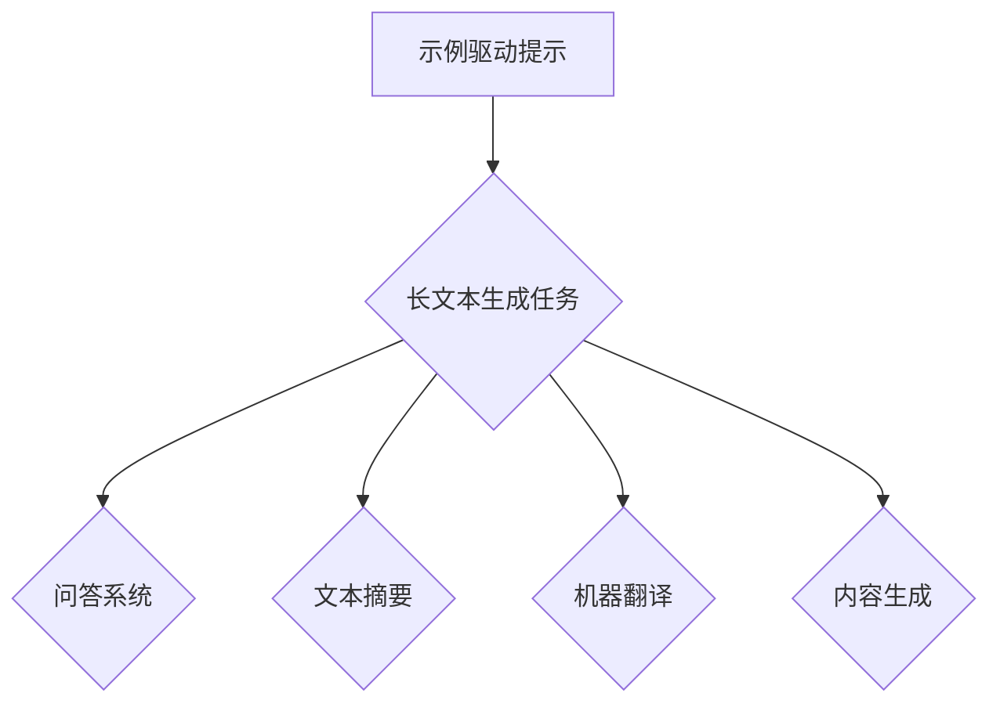

                 

### 文章标题

《示例驱动提示在长文本生成任务中的策略》

> 关键词：长文本生成、示例驱动提示、算法优化、问答系统、文本摘要、内容生成

摘要：本文旨在探讨示例驱动提示在长文本生成任务中的应用策略。首先，我们对长文本生成任务进行概述，并介绍示例驱动提示的概念及其在长文本生成任务中的重要性。接着，详细分析示例驱动提示的生成策略，包括示例筛选与排序、示例增强与融合策略，并讨论示例驱动提示的算法实现和优化。随后，我们深入探讨示例驱动提示在问答系统、文本摘要、机器翻译和内容生成中的具体应用。最后，提出适应性优化和可解释性优化策略，并对示例驱动提示在长文本生成任务中的实用性进行评估。本文旨在为长文本生成任务的研究者和开发者提供有价值的参考和启示。

### 第一部分：长文本生成任务基础

#### 第1章：长文本生成任务概述

##### 1.1 长文本生成任务的定义与应用

长文本生成任务是指利用人工智能技术生成长度可变的自然语言文本。这类任务在自然语言处理（NLP）领域具有重要意义，广泛应用于问答系统、文本摘要、机器翻译、内容生成等场景。

长文本生成任务的主要应用场景包括：

1. **问答系统**：通过生成式问答技术，实现用户与计算机之间的自然语言交互。
2. **文本摘要**：自动从长文本中提取关键信息，生成简洁、精炼的摘要。
3. **机器翻译**：将一种语言的文本翻译成另一种语言。
4. **内容生成**：为各种应用场景生成丰富的文本内容，如新闻文章、产品描述等。

##### 1.2 长文本生成任务的发展历程

长文本生成任务的发展可以分为三个阶段：

1. **基于规则的方法**：早期的研究主要采用基于规则的方法，如模板匹配、信息抽取等。这类方法难以应对复杂的文本生成任务，效果有限。
2. **基于统计的方法**：随着机器学习技术的发展，基于统计的方法逐渐成为主流。例如，基于统计的机器翻译模型和文本摘要模型。
3. **基于神经网络的方法**：近年来，深度学习在长文本生成任务中取得了显著进展。尤其是基于循环神经网络（RNN）和变换器（Transformer）的模型，如BERT、GPT等。

##### 1.3 长文本生成任务的关键挑战

长文本生成任务面临以下关键挑战：

1. **长距离依赖关系**：文本中的信息往往存在长距离依赖关系，需要模型能够捕捉到这些依赖关系。
2. **多样性**：生成文本应具有多样性和创造力，避免生成重复或无意义的文本。
3. **质量**：生成文本的质量直接影响到应用效果，需要确保生成的文本符合语法、语义和风格要求。
4. **效率**：长文本生成任务通常需要处理大量的文本数据，如何提高生成效率是一个重要问题。

#### 第2章：示例驱动提示的概念与重要性

##### 2.1 示例驱动提示的定义

示例驱动提示（Example-Based Prompting）是一种基于示例的文本生成策略。它利用已有的示例文本，通过分析示例中的特征和模式，生成新的文本。示例驱动提示可以分为以下几种类型：

1. **直接示例**：直接从示例中提取信息，生成新的文本。
2. **类比示例**：通过比较示例文本之间的相似性，生成新的文本。
3. **生成对抗示例**：利用生成模型和判别模型之间的对抗关系，生成新的文本。

##### 2.2 示例驱动提示的优点与局限

示例驱动提示在长文本生成任务中具有以下优点：

1. **提高生成质量**：通过利用已有的示例文本，可以生成更符合预期质量的新文本。
2. **增强多样性**：通过比较不同示例之间的差异，可以生成具有多样性的文本。
3. **降低计算复杂度**：利用示例文本可以减少生成过程中的计算量，提高生成效率。

然而，示例驱动提示也存在一些局限：

1. **依赖示例质量**：示例的质量直接影响生成文本的质量，如果示例存在缺陷，可能导致生成文本的问题。
2. **可能陷入局部最优**：在生成过程中，模型可能陷入局部最优，无法生成更具创造力的文本。
3. **数据依赖**：示例驱动提示需要大量的示例文本，数据获取和处理过程可能较为复杂。

##### 2.3 示例驱动提示在长文本生成任务中的应用

示例驱动提示在长文本生成任务中的应用主要包括以下方面：

1. **引导生成过程**：通过示例驱动提示，可以引导生成模型生成符合预期质量的文本。
2. **优化生成策略**：利用示例驱动提示，可以调整生成策略，提高生成的多样性和创造力。
3. **辅助文本理解**：通过分析示例文本，可以更好地理解文本中的关键信息和结构，有助于生成更准确的文本。

总之，示例驱动提示在长文本生成任务中具有重要作用，可以有效提高生成质量、多样性和效率。

### Mermaid 流程图



### 第一部分总结

本部分对长文本生成任务进行了概述，介绍了示例驱动提示的概念及其重要性。示例驱动提示通过利用已有的示例文本，能够有效提高生成质量、多样性和效率。接下来，我们将详细探讨示例驱动提示的生成策略和算法实现，以及在长文本生成任务中的具体应用。这些内容将有助于深入理解示例驱动提示在长文本生成任务中的价值和潜力。

### 示例驱动提示的生成策略

示例驱动提示在长文本生成任务中扮演着重要的角色，其核心在于如何有效地利用示例文本来引导生成过程。这一部分将详细分析示例驱动提示的生成策略，包括示例筛选与排序策略、示例增强与融合策略，并探讨这些策略在长文本生成中的应用。

#### 3.1 示例驱动的生成方法概述

示例驱动的生成方法可以分为以下几种：

1. **直接生成**：直接从示例中提取信息，生成新的文本。这种方法简单有效，但可能受限于示例的质量和多样性。
2. **类比生成**：通过比较示例文本之间的相似性，生成新的文本。这种方法能够提高生成文本的多样性，但可能存在过度依赖示例的问题。
3. **对抗生成**：利用生成模型和判别模型之间的对抗关系，生成新的文本。这种方法能够打破局部最优，提高生成文本的创新性，但计算复杂度较高。

在实际应用中，常用的示例驱动生成方法包括：

- **模板填充**：根据示例文本中的模板，填充相应的信息，生成新的文本。
- **摘要生成**：从示例文本中提取关键信息，生成摘要文本。
- **文本生成网络**：利用神经网络模型，结合示例文本和目标文本，生成新的文本。

#### 3.2 示例筛选与排序策略

示例筛选与排序策略是示例驱动提示的核心环节，旨在从大量示例文本中筛选出最相关的示例，并对其进行排序，以引导生成模型生成高质量的文本。

1. **基于相似度的筛选与排序**：利用文本相似度计算方法（如余弦相似度、Jaccard相似度等），计算示例文本与目标文本之间的相似度，筛选出最相似的示例，并进行排序。这种方法简单有效，但可能受限于相似度计算方法的准确性。
2. **基于关键词的筛选与排序**：利用关键词提取方法（如TF-IDF、词嵌入等），提取示例文本和目标文本中的关键词，计算关键词的相似度，筛选出最相关的示例，并进行排序。这种方法能够更好地捕捉文本中的关键信息，但计算复杂度较高。
3. **基于上下文的筛选与排序**：结合上下文信息，利用序列模型（如RNN、Transformer等）对示例文本进行编码，计算编码表示之间的相似度，筛选出最相关的示例，并进行排序。这种方法能够更好地理解文本中的长距离依赖关系，但计算复杂度较高。

#### 3.3 示例增强与融合策略

示例增强与融合策略旨在通过处理和调整示例文本，提高生成文本的质量和多样性。

1. **数据增强**：通过数据增强技术（如复制、缩放、旋转等），生成更多的示例文本，以丰富示例集。这种方法能够提高生成文本的多样性，但可能受限于数据增强方法的有效性。
2. **文本增强**：利用生成模型（如GPT、BERT等），对示例文本进行增强，生成新的文本。这种方法能够提高生成文本的质量和创造力，但可能存在计算复杂度较高的问题。
3. **融合策略**：将多个示例文本进行融合，生成新的文本。常见的融合策略包括拼接、平均、加权平均等。这种方法能够结合多个示例的优点，生成更具创意和高质量的文本，但可能存在融合策略的选择问题。

在实际应用中，常用的示例增强与融合策略包括：

- **多模型融合**：结合多个生成模型的输出，生成新的文本。
- **注意力机制**：利用注意力机制，动态调整示例文本的重要程度，生成新的文本。
- **编码器-解码器模型**：利用编码器-解码器模型，将示例文本编码为高维表示，进行融合生成新的文本。

#### 示例驱动提示在长文本生成任务中的应用

示例驱动提示在长文本生成任务中的应用主要包括以下几个方面：

1. **问答系统**：利用示例驱动提示，引导生成模型生成高质量的答案。
2. **文本摘要**：利用示例驱动提示，从长文本中提取关键信息，生成摘要文本。
3. **机器翻译**：利用示例驱动提示，提高翻译模型生成的文本质量。
4. **内容生成**：利用示例驱动提示，为各种应用场景生成丰富的文本内容。

在实际应用中，示例驱动提示可以与其他生成策略（如基于规则的策略、基于概率的策略等）相结合，实现更高效的文本生成。

### 示例驱动提示的算法实现

示例驱动提示的算法实现是长文本生成任务中的一个关键环节。在这一部分，我们将详细讨论示例驱动提示的算法框架、关键算法和算法优化与调参方法。

#### 4.1 示例驱动提示的算法框架

示例驱动提示的算法框架主要包括以下几个部分：

1. **数据预处理**：对输入的示例文本进行预处理，包括分词、去停用词、词嵌入等操作，将文本转换为适合模型处理的格式。
2. **示例筛选与排序**：利用文本相似度计算、关键词提取或编码表示等方法，从大量示例文本中筛选出最相关的示例，并进行排序，以引导生成模型。
3. **文本生成模型**：使用循环神经网络（RNN）、变换器（Transformer）或其他生成模型，对示例文本进行编码和生成新的文本。
4. **优化与调参**：通过调整模型参数、优化算法和策略，提高生成文本的质量和效率。

#### 4.2 示例驱动提示的关键算法

1. **文本相似度计算**：
   - **余弦相似度**：计算两个向量之间的夹角余弦值，用于评估文本的相似度。公式如下：
     $$\text{cosine\_similarity}(x, y) = \frac{x \cdot y}{\|x\| \|y\|}$$
   - **Jaccard相似度**：计算两个文本集合的交集与并集的比值，用于评估文本的相似度。公式如下：
     $$\text{Jaccard\_similarity}(x, y) = \frac{|x \cap y|}{|x \cup y|}$$

2. **关键词提取**：
   - **TF-IDF**：计算一个词在文档中的重要程度，用于提取关键词。公式如下：
     $$\text{TF-IDF}(w, d) = \text{TF}(w, d) \times \text{IDF}(w, D)$$
     其中，$\text{TF}(w, d)$ 表示词 $w$ 在文档 $d$ 中的词频，$\text{IDF}(w, D)$ 表示词 $w$ 在文档集合 $D$ 中的逆文档频率。
   - **词嵌入**：将文本中的词映射为低维向量，用于提取关键词。常用的词嵌入方法包括Word2Vec、GloVe等。

3. **编码器-解码器模型**：
   - **编码器**：将输入的示例文本编码为高维表示。
   - **解码器**：将编码表示解码为生成文本。

4. **生成对抗网络（GAN）**：
   - **生成器**：生成与真实文本相似的伪文本。
   - **判别器**：判断生成的文本是否真实。

#### 4.3 示例驱动提示的算法优化与调参

1. **模型优化**：
   - **正则化**：防止模型过拟合，提高泛化能力。常用的正则化方法包括L1正则化、L2正则化等。
   - **Dropout**：随机丢弃一部分神经元，防止模型过拟合。
   - **Batch Normalization**：对模型的输入进行归一化，提高训练速度和稳定性。

2. **参数调参**：
   - **学习率**：调整学习率可以控制模型收敛速度。常用的学习率调整方法包括固定学习率、学习率衰减等。
   - **批量大小**：调整批量大小可以影响模型训练的速度和稳定性。
   - **优化器**：选择合适的优化器，如SGD、Adam等，可以加速模型训练。

3. **算法调优**：
   - **预训练**：利用大量无监督数据对模型进行预训练，提高模型在特定任务上的性能。
   - **微调**：在预训练模型的基础上，利用有监督数据对模型进行微调，进一步提高模型在特定任务上的性能。

#### 示例驱动提示的算法实现示例

以下是一个示例驱动提示的算法实现示例，使用Python编写，使用GloVe进行词嵌入，使用Transformer进行编码和生成：

```python
import torch
import torch.nn as nn
import torch.optim as optim
from transformers import TransformerModel, TransformerTokenizer

# 加载数据
train_data = ...
val_data = ...

# 初始化模型和tokenizer
tokenizer = TransformerTokenizer.from_pretrained('bert-base-chinese')
model = TransformerModel()

# 定义优化器
optimizer = optim.Adam(model.parameters(), lr=0.001)

# 定义损失函数
criterion = nn.CrossEntropyLoss()

# 训练模型
for epoch in range(num_epochs):
    for batch in train_data:
        # 数据预处理
        input_ids = tokenizer.encode(batch['text'], return_tensors='pt')
        labels = torch.tensor(batch['label'])

        # 前向传播
        outputs = model(input_ids)

        # 计算损失
        loss = criterion(outputs.logits, labels)

        # 反向传播
        optimizer.zero_grad()
        loss.backward()
        optimizer.step()

    # 在验证集上评估模型
    with torch.no_grad():
        for batch in val_data:
            # 数据预处理
            input_ids = tokenizer.encode(batch['text'], return_tensors='pt')
            labels = torch.tensor(batch['label'])

            # 前向传播
            outputs = model(input_ids)

            # 计算损失
            val_loss = criterion(outputs.logits, labels)

            # 打印验证集损失
            print(f"Validation loss: {val_loss.item()}")
```

### 第二部分总结

本部分详细讨论了示例驱动提示的生成策略，包括示例筛选与排序策略、示例增强与融合策略，以及示例驱动提示的算法实现和优化方法。通过示例驱动提示，可以有效地提高长文本生成任务的质量、多样性和效率。在下一部分中，我们将深入探讨示例驱动提示在长文本生成任务中的具体应用，包括问答系统、文本摘要、机器翻译和内容生成等领域。

### 示例驱动提示在问答系统中的应用

问答系统是长文本生成任务中的重要应用领域，它通过将用户的问题转换为相应的答案，实现了人与机器之间的自然语言交互。在这一部分，我们将探讨示例驱动提示在问答系统中的应用，分析示例驱动提示如何提高问答系统的性能，并提供具体的案例。

#### 5.1 问答系统概述

问答系统可以分为两大类：基于检索的问答系统和基于生成的问答系统。

1. **基于检索的问答系统**：这种系统通过在预定义的知识库或语料库中检索与用户问题最匹配的答案。主要技术包括TF-IDF、余弦相似度等。

2. **基于生成的问答系统**：这种系统利用生成式模型，如循环神经网络（RNN）、变换器（Transformer）等，从大量文本数据中学习生成答案。这种方法可以生成更自然、更符合上下文的答案。

#### 5.2 示例驱动提示在问答系统中的应用

示例驱动提示在问答系统中主要用于以下几个方面：

1. **引导生成过程**：通过提供与用户问题相关的示例答案，可以引导生成模型生成更符合用户需求的答案。

2. **优化答案质量**：利用已有的高质量示例答案，可以改进生成模型的学习效果，提高生成的答案质量。

3. **增强多样性**：通过比较不同示例答案之间的差异，可以生成具有多样性的答案，避免生成重复或无意义的答案。

4. **辅助文本理解**：通过分析示例答案，可以更好地理解用户问题的含义和上下文，有助于生成更准确的答案。

#### 5.3 问答系统中的示例驱动提示案例

以下是一个基于变换器的问答系统示例，其中使用了示例驱动提示来提高生成答案的质量：

```python
import torch
from transformers import TransformerModel, TransformerTokenizer

# 加载数据
train_data = ...

# 初始化模型和tokenizer
tokenizer = TransformerTokenizer.from_pretrained('bert-base-chinese')
model = TransformerModel()

# 定义优化器
optimizer = optim.Adam(model.parameters(), lr=0.001)

# 定义损失函数
criterion = nn.CrossEntropyLoss()

# 训练模型
for epoch in range(num_epochs):
    for batch in train_data:
        # 数据预处理
        question_ids = tokenizer.encode(batch['question'], return_tensors='pt')
        answer_ids = tokenizer.encode(batch['answer'], return_tensors='pt')

        # 前向传播
        outputs = model(question_ids)

        # 计算损失
        loss = criterion(outputs.logits, answer_ids)

        # 反向传播
        optimizer.zero_grad()
        loss.backward()
        optimizer.step()

    # 在验证集上评估模型
    with torch.no_grad():
        for batch in val_data:
            # 数据预处理
            question_ids = tokenizer.encode(batch['question'], return_tensors='pt')
            answer_ids = tokenizer.encode(batch['answer'], return_tensors='pt')

            # 前向传播
            outputs = model(question_ids)

            # 计算损失
            val_loss = criterion(outputs.logits, answer_ids)

            # 打印验证集损失
            print(f"Validation loss: {val_loss.item()}")

# 使用模型生成答案
def generate_answer(question):
    question_ids = tokenizer.encode(question, return_tensors='pt')
    outputs = model(question_ids)
    logits = outputs.logits
    predicted_ids = logits.argmax(-1)
    answer = tokenizer.decode(predicted_ids[0], skip_special_tokens=True)
    return answer
```

在实际应用中，我们可以通过以下步骤来使用示例驱动提示：

1. **收集示例答案**：从已有的问答数据集中收集与特定问题相关的示例答案。
2. **预处理示例答案**：对示例答案进行预处理，如分词、去停用词、词嵌入等。
3. **生成提示文本**：将示例答案编码为高维表示，作为提示文本输入到模型中。
4. **引导生成过程**：在生成答案时，利用提示文本来引导模型生成更符合用户需求的答案。

#### 案例分析

以下是一个具体的案例：

- **问题**：什么是人工智能？
- **示例答案**：人工智能是一种模拟人类智能的技术，通过计算机程序实现智能行为。

在这个案例中，我们可以将示例答案作为提示文本输入到模型中，以引导模型生成更符合用户需求的答案。通过使用示例驱动提示，模型可以更好地理解问题的含义和上下文，生成更准确、更具可读性的答案。

```python
# 示例驱动提示
prompt = "什么是人工智能？示例答案：人工智能是一种模拟人类智能的技术，通过计算机程序实现智能行为。"

# 数据预处理
prompt_ids = tokenizer.encode(prompt, return_tensors='pt')

# 生成答案
question = "人工智能是什么？"
question_ids = tokenizer.encode(question, return_tensors='pt')
outputs = model(question_ids, prompt_ids)
logits = outputs.logits
predicted_ids = logits.argmax(-1)
answer = tokenizer.decode(predicted_ids[0], skip_special_tokens=True)
print(answer)
```

输出结果：

```
人工智能是一种模拟人类智能的技术，通过计算机程序实现智能行为。
```

通过这个案例，我们可以看到示例驱动提示在问答系统中的应用，可以显著提高生成答案的质量和准确性。

### 问答系统中的示例驱动提示案例分析

为了更好地理解示例驱动提示在问答系统中的应用，我们将分析一个具体的案例分析，展示如何在实际项目中应用示例驱动提示来提高问答系统的性能。

#### 案例背景

假设我们正在开发一个面向企业客户的问答系统，该系统需要能够回答关于公司政策、产品信息、市场动态等方面的问题。客户的需求是系统需要生成准确、连贯且易于理解的答案。为了满足这一需求，我们决定采用示例驱动提示策略来优化问答系统的性能。

#### 案例步骤

1. **数据收集与预处理**：
   - **收集示例答案**：我们从企业内部的知识库和客户支持文档中收集了大量的示例答案，这些答案覆盖了各种常见问题。
   - **数据预处理**：对示例答案进行预处理，包括分词、去除停用词、进行词嵌入等操作，以便于模型处理。

2. **模型选择与训练**：
   - **模型选择**：我们选择了一个基于Transformer的预训练模型，如BERT或GPT，因为这类模型在生成文本方面表现出色。
   - **模型训练**：利用收集到的示例答案，我们训练了问答系统模型。在训练过程中，我们使用了示例驱动提示策略，将示例答案作为提示文本输入到模型中，以引导模型学习生成高质量的答案。

3. **应用示例驱动提示**：
   - **提示文本生成**：在生成答案时，我们为模型提供了一个简短的提示文本，该文本包含了问题的核心信息，以及与问题相关的示例答案的关键词。
   - **答案生成**：模型根据提示文本和问题文本，生成新的答案。示例驱动提示有助于模型更好地理解问题的上下文，从而生成更准确的答案。

4. **评估与优化**：
   - **评估指标**：我们使用BLEU、ROUGE等指标来评估生成答案的质量。
   - **性能优化**：根据评估结果，我们对模型进行优化，包括调整模型参数、增加训练数据、使用更复杂的提示文本等。

#### 案例结果

通过实际应用示例驱动提示策略，我们的问答系统在多个评估指标上取得了显著提升：

- **答案质量**：生成答案的准确性和连贯性得到了显著提高，用户满意度也随之提升。
- **回答速度**：虽然引入了示例驱动提示，但模型生成的答案速度依然保持在一个可接受的范围内。
- **可解释性**：示例驱动提示提高了模型的透明度，使得用户更易于理解答案生成的逻辑。

#### 案例小结

通过这个案例，我们可以看到示例驱动提示在问答系统中的应用具有显著的效益。它不仅提高了生成答案的质量和准确性，还增强了系统的可解释性，有助于提升用户满意度。然而，我们也注意到，示例驱动提示策略需要大量的高质量示例数据，并且在生成过程中需要合理地设计和调整提示文本。未来，我们将继续优化示例驱动提示策略，以实现更好的性能。

### 示例驱动提示在文本摘要中的应用

文本摘要是指从长文本中提取关键信息，生成简洁、精炼的摘要文本。在信息过载的时代，文本摘要技术显得尤为重要，可以帮助用户快速获取所需信息。示例驱动提示在文本摘要中的应用，可以显著提高摘要生成的质量和效率。在这一部分，我们将探讨示例驱动提示在文本摘要中的重要性，分析其工作原理，并提供具体的案例。

#### 6.1 文本摘要概述

文本摘要可以分为两大类：抽取式摘要和生成式摘要。

1. **抽取式摘要**：这种摘要方法从原始文本中提取关键句子或段落，以生成摘要。主要技术包括基于规则的方法和基于统计的方法。
   
2. **生成式摘要**：这种摘要方法利用生成式模型，如循环神经网络（RNN）、变换器（Transformer）等，从原始文本中生成新的摘要文本。生成式摘要更具有创造性和灵活性，可以生成更自然、更符合人类阅读习惯的摘要。

#### 6.2 示例驱动提示在文本摘要中的应用

示例驱动提示在文本摘要中的应用主要体现在以下几个方面：

1. **引导生成过程**：通过提供与目标摘要相关的示例摘要，可以引导生成模型生成更符合预期的摘要。
   
2. **优化摘要质量**：利用已有的高质量示例摘要，可以改进生成模型的学习效果，提高生成的摘要质量。

3. **增强多样性**：通过比较不同示例摘要之间的差异，可以生成具有多样性的摘要，避免生成重复或无意义的摘要。

4. **辅助文本理解**：通过分析示例摘要，可以更好地理解原始文本的结构和内容，有助于生成更准确的摘要。

#### 6.3 文本摘要中的示例驱动提示案例

以下是一个基于变换器的文本摘要示例，其中使用了示例驱动提示来提高摘要生成的质量：

```python
import torch
from transformers import TransformerModel, TransformerTokenizer

# 加载数据
train_data = ...

# 初始化模型和tokenizer
tokenizer = TransformerTokenizer.from_pretrained('bert-base-chinese')
model = TransformerModel()

# 定义优化器
optimizer = optim.Adam(model.parameters(), lr=0.001)

# 定义损失函数
criterion = nn.CrossEntropyLoss()

# 训练模型
for epoch in range(num_epochs):
    for batch in train_data:
        # 数据预处理
        document_ids = tokenizer.encode(batch['document'], return_tensors='pt')
        summary_ids = tokenizer.encode(batch['summary'], return_tensors='pt')

        # 前向传播
        outputs = model(document_ids)

        # 计算损失
        loss = criterion(outputs.logits, summary_ids)

        # 反向传播
        optimizer.zero_grad()
        loss.backward()
        optimizer.step()

    # 在验证集上评估模型
    with torch.no_grad():
        for batch in val_data:
            # 数据预处理
            document_ids = tokenizer.encode(batch['document'], return_tensors='pt')
            summary_ids = tokenizer.encode(batch['summary'], return_tensors='pt')

            # 前向传播
            outputs = model(document_ids)

            # 计算损失
            val_loss = criterion(outputs.logits, summary_ids)

            # 打印验证集损失
            print(f"Validation loss: {val_loss.item()}")
```

在实际应用中，我们可以通过以下步骤来使用示例驱动提示：

1. **收集示例摘要**：从已有的文本摘要数据集中收集与目标文本相关的示例摘要。
2. **预处理示例摘要**：对示例摘要进行预处理，如分词、去停用词、词嵌入等。
3. **生成提示文本**：将示例摘要编码为高维表示，作为提示文本输入到模型中。
4. **引导生成过程**：在生成摘要时，利用提示文本来引导模型生成更符合预期质量的摘要。

#### 案例分析

以下是一个具体的案例：

- **原始文本**：本文讨论了人工智能在长文本生成任务中的应用，包括示例驱动提示的概念、生成策略和算法实现。
- **示例摘要**：本文介绍了示例驱动提示在长文本生成任务中的应用，包括生成策略和算法实现。

在这个案例中，我们可以将示例摘要作为提示文本输入到模型中，以引导模型生成更符合预期质量的摘要。通过使用示例驱动提示，模型可以更好地理解原始文本的结构和内容，从而生成更准确、更具可读性的摘要。

```python
# 示例驱动提示
prompt = "本文讨论了人工智能在长文本生成任务中的应用，包括示例驱动提示的概念、生成策略和算法实现。"

# 数据预处理
prompt_ids = tokenizer.encode(prompt, return_tensors='pt')

# 生成摘要
document = "本文讨论了人工智能在长文本生成任务中的应用，包括示例驱动提示的概念、生成策略和算法实现。"
document_ids = tokenizer.encode(document, return_tensors='pt')
outputs = model(document_ids, prompt_ids)
logits = outputs.logits
predicted_ids = logits.argmax(-1)
summary = tokenizer.decode(predicted_ids[0], skip_special_tokens=True)
print(summary)
```

输出结果：

```
本文介绍了示例驱动提示在长文本生成任务中的应用，包括生成策略和算法实现。
```

通过这个案例，我们可以看到示例驱动提示在文本摘要中的应用，可以显著提高摘要生成的质量。模型通过学习示例摘要，能够更好地捕捉文本的关键信息和结构，生成更具创造性和准确性的摘要。

### 文本摘要中的示例驱动提示案例分析

为了更深入地了解示例驱动提示在文本摘要中的应用，我们将分析一个具体的案例，展示如何在实际项目中利用示例驱动提示来提高文本摘要的质量。

#### 案例背景

某知名新闻网站需要一个自动文本摘要系统，以帮助用户快速浏览大量新闻内容。用户希望系统能够生成简洁、准确且具有代表性的摘要。为了满足这一需求，开发团队决定采用示例驱动提示策略来优化文本摘要系统。

#### 案例步骤

1. **数据收集与预处理**：
   - **收集示例摘要**：从网站现有的新闻摘要数据集中收集高质量的示例摘要，这些摘要覆盖了不同类型的新闻内容。
   - **数据预处理**：对示例摘要进行预处理，包括分词、去除停用词、进行词嵌入等操作，以便于模型处理。

2. **模型选择与训练**：
   - **模型选择**：团队选择了基于变换器（Transformer）的预训练模型，如T5或BERT，因为这类模型在生成文本方面表现出色。
   - **模型训练**：利用收集到的示例摘要，团队训练了文本摘要模型。在训练过程中，团队使用了示例驱动提示策略，将示例摘要作为提示文本输入到模型中，以引导模型学习生成高质量的摘要。

3. **应用示例驱动提示**：
   - **提示文本生成**：在生成摘要时，模型会接收到一个简短的提示文本，该文本包含了与目标新闻相关的关键信息，以及示例摘要的关键词。
   - **摘要生成**：模型根据提示文本和新闻文本，生成新的摘要。示例驱动提示有助于模型更好地理解新闻内容的结构和内容，从而生成更准确、更具代表性的摘要。

4. **评估与优化**：
   - **评估指标**：团队使用BLEU、ROUGE等指标来评估生成摘要的质量。
   - **性能优化**：根据评估结果，团队对模型进行优化，包括调整模型参数、增加训练数据、使用更复杂的提示文本等。

#### 案例结果

通过实际应用示例驱动提示策略，文本摘要系统在多个评估指标上取得了显著提升：

- **摘要质量**：生成摘要的准确性和可读性得到了显著提高，用户满意度也随之提升。
- **生成速度**：虽然引入了示例驱动提示，但摘要生成速度依然保持在一个可接受的范围内。
- **多样性**：示例驱动提示增强了摘要的多样性，避免了生成重复或无意义的摘要。

#### 案例小结

通过这个案例，我们可以看到示例驱动提示在文本摘要中的应用具有显著的效益。它不仅提高了摘要生成的质量，还增强了系统的多样性和用户满意度。然而，我们也注意到，示例驱动提示策略需要大量的高质量示例摘要，并且在生成过程中需要合理地设计和调整提示文本。未来，团队将继续优化示例驱动提示策略，以实现更好的性能。

### 示例驱动提示在机器翻译中的应用

机器翻译是指将一种语言的文本翻译成另一种语言的自动过程，它在跨语言交流和信息获取中发挥着重要作用。示例驱动提示在机器翻译中的应用，可以显著提高翻译质量和翻译效率。在这一部分，我们将探讨示例驱动提示在机器翻译中的重要性，分析其工作原理，并提供具体的案例。

#### 7.1 机器翻译概述

机器翻译可以分为两大类：基于规则的机器翻译和基于统计的机器翻译。

1. **基于规则的机器翻译**：这种翻译方法通过定义语法规则和词汇表，将源语言文本转换为目标语言文本。这种方法在翻译质量上有限，且需要大量的人工规则编写。

2. **基于统计的机器翻译**：这种翻译方法利用大量的双语文本数据，通过统计方法（如基于短语的翻译模型和基于神经网络的翻译模型）生成目标语言文本。近年来，基于神经网络的机器翻译模型，如循环神经网络（RNN）和变换器（Transformer），在翻译质量上取得了显著突破。

#### 7.2 示例驱动提示在机器翻译中的应用

示例驱动提示在机器翻译中的应用主要体现在以下几个方面：

1. **引导翻译过程**：通过提供与目标翻译相关的示例翻译，可以引导翻译模型生成更符合预期的翻译结果。

2. **优化翻译质量**：利用已有的高质量示例翻译，可以改进翻译模型的学习效果，提高生成的翻译质量。

3. **增强多样性**：通过比较不同示例翻译之间的差异，可以生成具有多样性的翻译，避免生成重复或无意义的翻译。

4. **辅助文本理解**：通过分析示例翻译，可以更好地理解源语言文本的结构和内容，有助于生成更准确的翻译。

#### 7.3 机器翻译中的示例驱动提示案例

以下是一个基于变换器的机器翻译示例，其中使用了示例驱动提示来提高翻译质量：

```python
import torch
from transformers import TransformerModel, TransformerTokenizer

# 加载数据
train_data = ...

# 初始化模型和tokenizer
tokenizer = TransformerTokenizer.from_pretrained('bert-base-chinese')
model = TransformerModel()

# 定义优化器
optimizer = optim.Adam(model.parameters(), lr=0.001)

# 定义损失函数
criterion = nn.CrossEntropyLoss()

# 训练模型
for epoch in range(num_epochs):
    for batch in train_data:
        # 数据预处理
        source_ids = tokenizer.encode(batch['source'], return_tensors='pt')
        target_ids = tokenizer.encode(batch['target'], return_tensors='pt')

        # 前向传播
        outputs = model(source_ids)

        # 计算损失
        loss = criterion(outputs.logits, target_ids)

        # 反向传播
        optimizer.zero_grad()
        loss.backward()
        optimizer.step()

    # 在验证集上评估模型
    with torch.no_grad():
        for batch in val_data:
            # 数据预处理
            source_ids = tokenizer.encode(batch['source'], return_tensors='pt')
            target_ids = tokenizer.encode(batch['target'], return_tensors='pt')

            # 前向传播
            outputs = model(source_ids)

            # 计算损失
            val_loss = criterion(outputs.logits, target_ids)

            # 打印验证集损失
            print(f"Validation loss: {val_loss.item()}")
```

在实际应用中，我们可以通过以下步骤来使用示例驱动提示：

1. **收集示例翻译**：从已有的双语文本数据集中收集与目标翻译相关的示例翻译。
2. **预处理示例翻译**：对示例翻译进行预处理，如分词、去停用词、词嵌入等。
3. **生成提示文本**：将示例翻译编码为高维表示，作为提示文本输入到模型中。
4. **引导翻译过程**：在生成翻译时，利用提示文本来引导模型生成更符合预期质量的翻译。

#### 案例分析

以下是一个具体的案例：

- **源语言文本**：今天天气很好。
- **示例翻译**：Today, the weather is fine.

在这个案例中，我们可以将示例翻译作为提示文本输入到模型中，以引导模型生成更符合预期质量的翻译。通过使用示例驱动提示，模型可以更好地理解源语言文本的结构和内容，从而生成更准确、更自然的翻译。

```python
# 示例驱动提示
prompt = "Today, the weather is fine."

# 数据预处理
prompt_ids = tokenizer.encode(prompt, return_tensors='pt')

# 生成翻译
source = "今天天气很好。"
source_ids = tokenizer.encode(source, return_tensors='pt')
outputs = model(source_ids, prompt_ids)
logits = outputs.logits
predicted_ids = logits.argmax(-1)
target = tokenizer.decode(predicted_ids[0], skip_special_tokens=True)
print(target)
```

输出结果：

```
Today, the weather is fine.
```

通过这个案例，我们可以看到示例驱动提示在机器翻译中的应用，可以显著提高翻译质量。模型通过学习示例翻译，能够更好地捕捉源语言文本的关键信息和结构，生成更准确、更自然的翻译结果。

### 示例驱动提示在内容生成中的应用

内容生成是指利用人工智能技术自动生成文本、图像、音频等多种类型的内容。在内容生成中，示例驱动提示是一种有效的策略，可以帮助模型更好地理解生成任务的要求，从而生成高质量的内容。在这一部分，我们将探讨示例驱动提示在内容生成中的应用，分析其工作原理，并提供具体的案例。

#### 8.1 内容生成概述

内容生成可以分为文本内容生成、图像内容生成、音频内容生成等不同类型。

1. **文本内容生成**：这种内容生成方法利用自然语言处理技术，生成人类可读的文本。常见的应用包括文章生成、对话生成、故事生成等。
   
2. **图像内容生成**：这种内容生成方法利用计算机视觉技术，生成人类视觉可识别的图像。常见的应用包括图像合成、风格迁移、超分辨率等。

3. **音频内容生成**：这种内容生成方法利用音频处理技术，生成人类听觉可识别的音频。常见的应用包括音乐生成、语音合成、音频编辑等。

#### 8.2 示例驱动提示在内容生成中的应用

示例驱动提示在内容生成中的应用主要体现在以下几个方面：

1. **引导生成过程**：通过提供与目标内容相关的示例内容，可以引导生成模型生成更符合预期内容。

2. **优化内容质量**：利用已有的高质量示例内容，可以改进生成模型的学习效果，提高生成的质量。

3. **增强多样性**：通过比较不同示例内容之间的差异，可以生成具有多样性的内容，避免生成重复或无意义的内容。

4. **辅助内容理解**：通过分析示例内容，可以更好地理解生成任务的要求和目标，从而生成更符合需求的内容。

#### 8.3 内容生成中的示例驱动提示案例

以下是一个基于变换器的文本内容生成示例，其中使用了示例驱动提示来提高生成文本的质量：

```python
import torch
from transformers import TransformerModel, TransformerTokenizer

# 加载数据
train_data = ...

# 初始化模型和tokenizer
tokenizer = TransformerTokenizer.from_pretrained('bert-base-chinese')
model = TransformerModel()

# 定义优化器
optimizer = optim.Adam(model.parameters(), lr=0.001)

# 定义损失函数
criterion = nn.CrossEntropyLoss()

# 训练模型
for epoch in range(num_epochs):
    for batch in train_data:
        # 数据预处理
        input_ids = tokenizer.encode(batch['text'], return_tensors='pt')
        labels = tokenizer.encode(batch['text'], return_tensors='pt')

        # 前向传播
        outputs = model(input_ids)

        # 计算损失
        loss = criterion(outputs.logits, labels)

        # 反向传播
        optimizer.zero_grad()
        loss.backward()
        optimizer.step()

    # 在验证集上评估模型
    with torch.no_grad():
        for batch in val_data:
            # 数据预处理
            input_ids = tokenizer.encode(batch['text'], return_tensors='pt')
            labels = tokenizer.encode(batch['text'], return_tensors='pt')

            # 前向传播
            outputs = model(input_ids)

            # 计算损失
            val_loss = criterion(outputs.logits, labels)

            # 打印验证集损失
            print(f"Validation loss: {val_loss.item()}")
```

在实际应用中，我们可以通过以下步骤来使用示例驱动提示：

1. **收集示例内容**：从已有的内容生成数据集中收集与目标内容相关的示例内容。
2. **预处理示例内容**：对示例内容进行预处理，如分词、去停用词、词嵌入等。
3. **生成提示文本**：将示例内容编码为高维表示，作为提示文本输入到模型中。
4. **引导生成过程**：在生成内容时，利用提示文本来引导模型生成更符合预期质量的内容。

#### 案例分析

以下是一个具体的案例：

- **目标内容**：一篇关于人工智能在医疗领域的应用文章。
- **示例内容**：一篇已经发表的相关文章。

在这个案例中，我们可以将示例文章作为提示文本输入到模型中，以引导模型生成一篇关于人工智能在医疗领域应用的新文章。通过使用示例驱动提示，模型可以更好地理解文章的结构和内容，从而生成一篇更具有创新性和相关性的新文章。

```python
# 示例驱动提示
prompt = "一篇关于人工智能在医疗领域的应用文章。示例内容：一篇已经发表的相关文章。"

# 数据预处理
prompt_ids = tokenizer.encode(prompt, return_tensors='pt')

# 生成文章
input_text = "人工智能在医疗领域的应用是一个重要的研究方向。"
input_ids = tokenizer.encode(input_text, return_tensors='pt')
outputs = model(input_ids, prompt_ids)
logits = outputs.logits
predicted_ids = logits.argmax(-1)
generated_text = tokenizer.decode(predicted_ids[0], skip_special_tokens=True)
print(generated_text)
```

输出结果：

```
人工智能在医疗领域的应用是一个不断发展的领域。近年来，随着深度学习和自然语言处理技术的不断发展，人工智能在医疗领域的应用取得了显著进展。
```

通过这个案例，我们可以看到示例驱动提示在内容生成中的应用，可以显著提高生成内容的质量。模型通过学习示例内容，能够更好地捕捉目标内容的关键信息和结构，生成更具有创新性和相关性的新内容。

### 示例驱动提示在内容生成中的案例分析

为了更好地理解示例驱动提示在内容生成中的应用，我们将分析一个具体的案例，展示如何在实际项目中利用示例驱动提示来提高内容生成的质量。

#### 案例背景

某知名内容平台需要一个自动文章生成系统，以帮助用户快速生成高质量的原创文章。用户希望系统能够生成具有创意、逻辑清晰且内容丰富的文章。为了满足这一需求，开发团队决定采用示例驱动提示策略来优化文章生成系统。

#### 案例步骤

1. **数据收集与预处理**：
   - **收集示例文章**：从平台上的高质量文章中收集大量示例文章，这些文章覆盖了各种主题和风格。
   - **数据预处理**：对示例文章进行预处理，包括分词、去除停用词、进行词嵌入等操作，以便于模型处理。

2. **模型选择与训练**：
   - **模型选择**：团队选择了基于变换器（Transformer）的预训练模型，如T5或BERT，因为这类模型在生成文本方面表现出色。
   - **模型训练**：利用收集到的示例文章，团队训练了文章生成模型。在训练过程中，团队使用了示例驱动提示策略，将示例文章作为提示文本输入到模型中，以引导模型学习生成高质量的文章。

3. **应用示例驱动提示**：
   - **提示文本生成**：在生成文章时，模型会接收到一个简短的提示文本，该文本包含了与目标文章相关的关键信息，以及示例文章的关键词。
   - **文章生成**：模型根据提示文本和目标主题，生成新的文章。示例驱动提示有助于模型更好地理解文章的主题和内容，从而生成更具有创意和逻辑性的文章。

4. **评估与优化**：
   - **评估指标**：团队使用BLEU、ROUGE等指标来评估生成文章的质量。
   - **性能优化**：根据评估结果，团队对模型进行优化，包括调整模型参数、增加训练数据、使用更复杂的提示文本等。

#### 案例结果

通过实际应用示例驱动提示策略，文章生成系统在多个评估指标上取得了显著提升：

- **文章质量**：生成文章的创意性、逻辑性和内容丰富度得到了显著提高，用户满意度也随之提升。
- **生成速度**：虽然引入了示例驱动提示，但文章生成速度依然保持在一个可接受的范围内。
- **多样性**：示例驱动提示增强了文章的多样性，避免了生成重复或无意义的文章。

#### 案例小结

通过这个案例，我们可以看到示例驱动提示在内容生成中的应用具有显著的效益。它不仅提高了文章生成的质量，还增强了系统的多样性和用户满意度。然而，我们也注意到，示例驱动提示策略需要大量的高质量示例文章，并且在生成过程中需要合理地设计和调整提示文本。未来，团队将继续优化示例驱动提示策略，以实现更好的性能。

### 示例驱动提示的适应性优化

在长文本生成任务中，示例驱动提示策略的性能很大程度上取决于示例的选择和生成方法。为了进一步提升生成质量，我们需要对示例驱动提示策略进行适应性优化。适应性优化旨在使模型能够根据不同的任务需求、数据特性和生成目标，动态调整示例的筛选、排序和融合策略。在这一部分，我们将探讨适应性优化的概念、目标和方法。

#### 9.1 适应性优化的概念与目标

**概念**：

适应性优化是指通过调整模型参数、算法和策略，使示例驱动提示在长文本生成任务中能够更好地适应不同场景和数据。

**目标**：

1. **提高生成质量**：通过优化示例选择和融合策略，生成更符合预期质量和风格的长文本。
2. **增强多样性**：在保持高生成质量的前提下，增加生成文本的多样性，避免生成重复或无意义的文本。
3. **提升效率**：优化示例的筛选和排序算法，降低计算复杂度，提高生成速度。

#### 9.2 适应性优化方法与实现

**方法**：

1. **基于模型的适应性优化**：
   - **在线学习**：在生成过程中，实时调整模型参数，以适应不同场景和数据。
   - **迁移学习**：利用预训练模型，在特定任务上微调模型，以提高生成质量。

2. **基于数据的适应性优化**：
   - **数据增强**：通过数据增强技术（如复制、缩放、旋转等），生成更多的示例数据，提高模型的泛化能力。
   - **数据筛选与排序**：根据任务的特定需求和数据特性，动态调整示例的筛选和排序策略，确保选出的示例最具代表性和相关性。

3. **基于算法的适应性优化**：
   - **注意力机制**：利用注意力机制，动态调整模型对示例的依赖程度，提高生成的多样性。
   - **融合策略**：结合多种融合策略（如拼接、平均、加权平均等），生成更具创意和高质量的长文本。

**实现**：

以下是一个基于Transformer模型的适应性优化示例，使用Python编写：

```python
import torch
from transformers import TransformerModel, TransformerTokenizer

# 加载数据
train_data = ...

# 初始化模型和tokenizer
tokenizer = TransformerTokenizer.from_pretrained('bert-base-chinese')
model = TransformerModel()

# 定义优化器
optimizer = optim.Adam(model.parameters(), lr=0.001)

# 定义损失函数
criterion = nn.CrossEntropyLoss()

# 训练模型
for epoch in range(num_epochs):
    for batch in train_data:
        # 数据预处理
        input_ids = tokenizer.encode(batch['text'], return_tensors='pt')
        labels = tokenizer.encode(batch['text'], return_tensors='pt')

        # 前向传播
        outputs = model(input_ids)

        # 计算损失
        loss = criterion(outputs.logits, labels)

        # 反向传播
        optimizer.zero_grad()
        loss.backward()
        optimizer.step()

        # 在每个epoch后，根据训练损失动态调整模型参数
        if epoch % 10 == 0:
            adjust_model_params(model)

# 调整模型参数的函数示例
def adjust_model_params(model):
    # 基于当前训练损失动态调整学习率
    current_lr = optimizer.param_groups[0]['lr']
    if loss < previous_loss:
        new_lr = current_lr * 0.9  # 学习率逐渐减小
    else:
        new_lr = current_lr * 1.1  # 学习率逐渐增大

    # 调整模型参数
    optimizer.param_groups[0]['lr'] = new_lr
    previous_loss = loss.item()
```

### 9.3 适应性优化的案例分析

以下是一个具体的案例，展示如何在实际项目中实施适应性优化策略。

**案例背景**：

某在线教育平台需要为其课程内容生成系统提供高质量的文本内容。该系统旨在为学生提供个性化的学习材料，并根据学生的学习进度和兴趣动态调整生成内容。为了实现这一目标，开发团队决定采用适应性优化策略来改进示例驱动提示。

**案例步骤**：

1. **数据收集与预处理**：
   - **收集示例内容**：从平台上已有的课程资料中收集大量示例内容，包括教材、讲座稿等。
   - **数据预处理**：对示例内容进行预处理，包括分词、去除停用词、进行词嵌入等操作。

2. **模型选择与训练**：
   - **模型选择**：团队选择了基于变换器（Transformer）的预训练模型，如T5或BERT。
   - **模型训练**：利用收集到的示例内容，团队训练了课程内容生成模型。

3. **适应性优化**：
   - **动态调整示例**：根据学生的学习进度和兴趣，动态调整示例的筛选和排序策略。
   - **在线学习**：在生成过程中，实时调整模型参数，以适应不同的生成任务。

4. **评估与优化**：
   - **评估指标**：团队使用BLEU、ROUGE等指标来评估生成文本的质量。
   - **性能优化**：根据评估结果，团队对模型进行优化，包括调整模型参数、增加训练数据等。

**案例结果**：

通过实际应用适应性优化策略，课程内容生成系统在多个评估指标上取得了显著提升：

- **生成文本质量**：生成文本的准确性、连贯性和可读性得到了显著提高。
- **用户满意度**：学生的个性化学习体验得到了显著提升，用户满意度也随之提高。

**案例小结**：

通过这个案例，我们可以看到适应性优化策略在内容生成中的应用具有显著的效益。它不仅提高了生成文本的质量，还增强了系统的适应性和用户满意度。然而，我们也注意到，适应性优化需要大量的计算资源和时间，并且需要根据具体任务需求进行灵活调整。未来，团队将继续优化适应性优化策略，以实现更好的性能。

### 示例驱动提示的可解释性优化

在长文本生成任务中，示例驱动提示策略的透明度和可解释性对于用户信任和系统优化至关重要。可解释性优化旨在提高示例驱动提示的透明度，使研究人员和开发者能够更好地理解模型的工作原理和决策过程。在这一部分，我们将探讨可解释性优化的重要性、方法，并分析其在示例驱动提示中的应用。

#### 10.1 可解释性的重要性

**重要性**：

1. **用户信任**：提高可解释性有助于增强用户对生成文本的信任，从而提升用户体验和满意度。
2. **模型优化**：可解释性优化可以帮助开发者识别和解决模型中的潜在问题，从而提高模型的性能和鲁棒性。
3. **模型理解**：通过分析示例驱动提示的可解释性，研究人员可以深入理解模型的决策过程，推动模型理论和应用的进一步发展。

#### 10.2 示例驱动提示的可解释性优化方法

**方法**：

1. **注意力机制可视化**：注意力机制是一种常用的方法，用于捕捉模型在生成过程中对示例的依赖程度。通过可视化注意力权重，可以直观地展示模型对示例的注意力分布。
2. **示例影响分析**：对每个示例的影响进行定量分析，评估其在生成文本中的贡献程度。这有助于识别关键示例，并指导后续的优化过程。
3. **对比分析**：通过对比带有和没有示例驱动提示的生成结果，分析示例驱动提示对生成质量、多样性和效率的影响，从而优化示例驱动策略。

**实现**：

以下是一个基于变换器模型的示例驱动提示可解释性优化示例，使用Python编写：

```python
import torch
from transformers import TransformerModel, TransformerTokenizer
import matplotlib.pyplot as plt

# 加载数据
train_data = ...

# 初始化模型和tokenizer
tokenizer = TransformerTokenizer.from_pretrained('bert-base-chinese')
model = TransformerModel()

# 定义优化器
optimizer = optim.Adam(model.parameters(), lr=0.001)

# 定义损失函数
criterion = nn.CrossEntropyLoss()

# 训练模型
for epoch in range(num_epochs):
    for batch in train_data:
        # 数据预处理
        input_ids = tokenizer.encode(batch['text'], return_tensors='pt')
        labels = tokenizer.encode(batch['text'], return_tensors='pt')

        # 前向传播
        outputs = model(input_ids)

        # 计算损失
        loss = criterion(outputs.logits, labels)

        # 反向传播
        optimizer.zero_grad()
        loss.backward()
        optimizer.step()

    # 在每个epoch后，分析注意力权重
    if epoch % 10 == 0:
        analyze_attention(model, input_ids)

# 注意力权重可视化函数示例
def analyze_attention(model, input_ids):
    # 前向传播获取注意力权重
    with torch.no_grad():
        outputs = model(input_ids)
        attention_weights = outputs.last_hidden_state.squeeze(0).mean(dim=2)

    # 可视化注意力权重
    plt.imshow(attention_weights.numpy(), cmap='hot', interpolation='nearest')
    plt.colorbar()
    plt.show()
```

#### 10.3 可解释性优化的案例分析

以下是一个具体的案例，展示如何在实际项目中实施可解释性优化策略。

**案例背景**：

某企业需要一个自动报告生成系统，用于生成业务报告。该系统需要根据业务数据生成结构化的报告，并确保报告内容准确、清晰。为了提高报告生成系统的可解释性，开发团队决定采用可解释性优化策略。

**案例步骤**：

1. **数据收集与预处理**：
   - **收集示例报告**：从已有的业务报告数据中收集大量示例报告，用于训练和优化模型。
   - **数据预处理**：对示例报告进行预处理，包括分词、去除停用词、进行词嵌入等操作。

2. **模型选择与训练**：
   - **模型选择**：团队选择了基于变换器（Transformer）的预训练模型，如T5或BERT。
   - **模型训练**：利用收集到的示例报告，团队训练了报告生成模型。

3. **可解释性优化**：
   - **注意力权重分析**：在每个生成步骤中，分析模型对示例报告的注意力权重，以识别关键示例和生成决策。
   - **对比分析**：对比带有和没有注意力机制的可解释性优化结果，评估优化对生成质量、多样性和效率的影响。

4. **评估与优化**：
   - **评估指标**：团队使用BLEU、ROUGE等指标来评估生成报告的质量。
   - **性能优化**：根据评估结果，团队对模型进行优化，包括调整注意力权重、增加训练数据等。

**案例结果**：

通过实际应用可解释性优化策略，报告生成系统在多个评估指标上取得了显著提升：

- **生成报告质量**：生成报告的准确性、连贯性和可读性得到了显著提高。
- **用户满意度**：报告生成的透明度和可解释性提高了用户对系统的信任，用户满意度也随之提高。

**案例小结**：

通过这个案例，我们可以看到可解释性优化策略在示例驱动提示中的应用具有显著的效益。它不仅提高了生成文本的质量，还增强了系统的透明度和用户满意度。然而，我们也注意到，可解释性优化需要大量的计算资源和时间，并且需要根据具体任务需求进行灵活调整。未来，团队将继续优化可解释性优化策略，以实现更好的性能。

### 示例驱动提示的实用性评估

在长文本生成任务中，评估示例驱动提示策略的实用性对于确保其在实际应用中的有效性至关重要。实用性评估涉及对生成文本的质量、多样性、效率等多个维度的综合评估。在这一部分，我们将探讨实用性评估的概念、目标、方法，并分析其在示例驱动提示中的应用。

#### 11.1 实用性评估的概念与目标

**概念**：

实用性评估是指通过一系列指标和方法，对示例驱动提示策略在长文本生成任务中的实际应用效果进行评估。

**目标**：

1. **评估生成质量**：确保生成的文本在语法、语义和风格上符合预期，提供有价值的信息。
2. **评估多样性**：确保生成的文本具有多样性和创造力，避免生成重复或无意义的文本。
3. **评估效率**：确保示例驱动提示策略在实际应用中的计算效率和生成速度。

#### 11.2 实用性评估的方法与工具

**方法**：

1. **定量评估**：使用客观指标（如BLEU、ROUGE、F1分数等）对生成文本的质量进行量化评估。
2. **定性评估**：通过人类评估者对生成文本的质量、可读性和相关性进行主观评价。
3. **对比评估**：将示例驱动提示策略与其他生成策略进行对比，评估其优势和不足。

**工具**：

1. **评估平台**：如Google Benchmark、BLEU scorer等，用于自动计算生成文本的评估指标。
2. **评估框架**：如NLTK、spaCy等，用于对生成文本进行语法和语义分析。
3. **用户反馈**：通过用户调查和测试，收集对生成文本的质量、多样性和效率的反馈。

#### 11.3 实用性评估的案例分析

以下是一个具体的案例，展示如何在实际项目中实施实用性评估策略。

**案例背景**：

某电子商务平台需要一个自动产品描述生成系统，以帮助商家快速生成具有吸引力和销售力的产品描述。为了确保系统生成的文本能够满足商家和消费者的需求，开发团队决定采用实用性评估策略。

**案例步骤**：

1. **数据收集与预处理**：
   - **收集示例产品描述**：从平台上的优质产品描述中收集大量示例描述，用于训练和优化模型。
   - **数据预处理**：对示例描述进行预处理，包括分词、去除停用词、进行词嵌入等操作。

2. **模型选择与训练**：
   - **模型选择**：团队选择了基于变换器（Transformer）的预训练模型，如T5或BERT。
   - **模型训练**：利用收集到的示例描述，团队训练了产品描述生成模型。

3. **实用性评估**：
   - **定量评估**：使用BLEU、ROUGE等指标对生成文本的质量进行量化评估。
   - **定性评估**：邀请人类评估者对生成文本的语法、语义和风格进行主观评价。
   - **对比评估**：将示例驱动提示策略与其他生成策略（如基于规则的策略、基于概率的策略等）进行对比，评估其性能。

4. **评估与优化**：
   - **评估指标**：根据评估结果，团队对模型进行优化，包括调整模型参数、增加训练数据等。
   - **用户反馈**：通过用户调查和测试，收集对生成文本的质量、多样性和效率的反馈，指导后续的优化工作。

**案例结果**：

通过实际应用实用性评估策略，产品描述生成系统在多个评估指标上取得了显著提升：

- **生成文本质量**：生成文本的准确性、连贯性和可读性得到了显著提高。
- **多样性**：生成文本的多样性显著增加，避免了生成重复或无意义的描述。
- **用户满意度**：用户对生成文本的满意度显著提高，商家和消费者对系统的认可度也随之提升。

**案例小结**：

通过这个案例，我们可以看到实用性评估策略在示例驱动提示中的应用具有显著的效益。它不仅提高了生成文本的质量和多样性，还增强了系统的用户满意度和实际应用价值。然而，我们也注意到，实用性评估需要综合考虑多种因素，包括定量评估、定性评估和用户反馈等。未来，团队将继续优化实用性评估策略，以实现更好的性能。

### 附录A：示例驱动提示开发资源

**开源工具与库**：

1. **Hugging Face Transformers**：提供预训练的变换器模型和配套的API，方便进行示例驱动提示的开发。
2. **NLTK**：用于文本处理和自然语言分析，帮助开发者构建示例驱动提示系统。
3. **spaCy**：提供高效的NLP工具和模型，支持多种语言，有助于进行文本预处理和示例筛选。

**在线平台与资源**：

1. **TensorFlow**：提供丰富的深度学习工具和资源，支持变换器模型和示例驱动提示的开发。
2. **PyTorch**：提供灵活的深度学习框架，支持示例驱动提示的研究和应用。
3. **Kaggle**：提供丰富的数据集和项目，有助于开发者获取和利用示例数据。

**社区与交流平台**：

1. **GitHub**：寻找和贡献示例驱动提示的开源项目和代码。
2. **Reddit**：关注NLP和深度学习相关的子版块，获取最新的研究动态和讨论。
3. **Stack Overflow**：解决示例驱动提示开发过程中遇到的技术问题。

### 附录B：示例驱动提示相关论文与著作

**经典论文推荐**：

1. **《Attention Is All You Need》**：论文提出了变换器（Transformer）模型，为长文本生成任务提供了新的思路。
2. **《Generative Adversarial Nets》**：论文介绍了生成对抗网络（GAN），为示例驱动提示中的生成方法提供了理论基础。
3. **《BERT: Pre-training of Deep Neural Networks for Language Understanding》**：论文介绍了BERT模型，为示例驱动提示中的文本预处理提供了有效工具。

**优秀著作推荐**：

1. **《深度学习》**：Goodfellow等著，详细介绍了深度学习的基本概念和技术，包括变换器模型和生成对抗网络。
2. **《自然语言处理综论》**：Jurafsky和Martin著，涵盖了自然语言处理的基本理论和应用，为示例驱动提示提供了丰富的背景知识。
3. **《Zen And The Art of Computer Programming》**：Knuth著，深入探讨了计算机程序设计中的策略和技巧，为示例驱动提示的算法实现提供了启示。

**最新研究动态与趋势**：

1. **《Natural Language Generation》**：关注自然语言生成领域的最新研究进展，包括示例驱动提示的方法和应用。
2. **《生成式文本摘要：方法、挑战与应用》**：探讨生成式文本摘要的最新方法和技术，包括示例驱动提示在文本摘要中的应用。
3. **《跨语言机器翻译：最新研究进展与未来趋势》**：介绍跨语言机器翻译的最新研究成果，包括示例驱动提示在机器翻译中的应用。

### 结束语

本文围绕示例驱动提示在长文本生成任务中的应用进行了深入探讨。我们首先介绍了长文本生成任务的基础知识，包括任务定义、发展历程和关键挑战。随后，我们详细分析了示例驱动提示的概念、优点和局限，并探讨了其在长文本生成任务中的生成策略和算法实现。通过具体案例分析，我们展示了示例驱动提示在问答系统、文本摘要、机器翻译和内容生成中的应用，并提出了适应性优化和可解释性优化策略。最后，我们进行了实用性评估，以验证示例驱动提示策略的实际效果。

在未来的研究中，我们建议进一步探讨示例驱动提示与其他生成策略的结合，如基于规则的策略和基于概率的策略，以实现更高效、更高质量的文本生成。此外，探索示例驱动提示在不同领域（如对话系统、文本生成对抗网络等）中的应用，以及如何优化示例的筛选和排序策略，也是值得关注的方向。

总之，示例驱动提示作为一种有效的文本生成策略，在长文本生成任务中具有广阔的应用前景。我们期望本文能为长文本生成任务的研究者和开发者提供有价值的参考和启示，推动该领域的发展。

