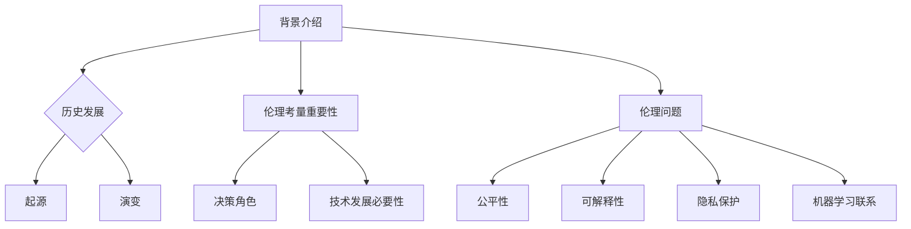

                 

### 文章标题

《示例驱动提示的伦理考量》

### 关键词

- 示例驱动提示
- 伦理考量
- 公平性
- 可解释性
- 个人隐私保护
- 机器学习

### 摘要

随着人工智能技术的迅猛发展，示例驱动提示作为一种重要的交互机制，广泛应用于各种领域。然而，其伦理考量日益成为关注的焦点。本文从背景介绍、理论基础、伦理原则、应用领域、案例分析及未来展望等多个角度，详细探讨了示例驱动提示的伦理考量。通过对相关伦理问题的深入分析，本文提出了相应的解决方案和未来研究方向，为人工智能技术的健康发展提供了重要的参考。

## 目录大纲

### 第一部分：背景与理论基础

#### 1.1 背景介绍

##### 示例驱动提示的定义

示例驱动提示（Example-based Suggestion）是指在人工智能系统中，通过分析大量的示例数据，为用户或系统本身提供有关特定任务的指导和建议。这种机制广泛应用于搜索引擎、推荐系统、医疗诊断等领域，成为提高系统性能和用户体验的重要手段。

##### 示例驱动提示的应用领域

示例驱动提示在人工智能领域具有广泛的应用。例如，在搜索引擎中，通过分析用户的历史搜索记录，可以为用户提供相关的搜索建议；在推荐系统中，可以根据用户的历史行为，为用户推荐感兴趣的商品或内容；在医疗诊断中，可以通过分析大量的病例数据，为医生提供诊断建议。

#### 1.2 示例驱动提示的历史发展

##### 示例驱动提示的起源

示例驱动提示的概念最早可以追溯到20世纪80年代。当时，研究人员开始探索通过学习大量示例来提高人工智能系统的性能。这一理念在随后几十年中得到了不断发展，逐渐成为人工智能领域的一个重要研究方向。

##### 示例驱动提示在不同领域的演变

随着人工智能技术的不断进步，示例驱动提示在不同领域中的应用也在不断演变。例如，在计算机视觉中，通过学习大量的图像数据，可以实现对物体的识别和分类；在自然语言处理中，通过学习大量的文本数据，可以实现对文本的生成和理解。

#### 1.3 示例驱动提示的伦理考量重要性

##### 示例驱动提示在决策过程中的角色

示例驱动提示在人工智能系统中起着重要的决策支持作用。然而，这种机制也带来了一系列伦理问题，如公平性、可解释性、个人隐私保护等。因此，对示例驱动提示的伦理考量具有重要意义。

##### 伦理考量在技术发展中的必要性

随着人工智能技术的广泛应用，伦理考量已成为技术发展的重要方面。只有充分考虑伦理问题，才能确保人工智能技术的健康发展，避免产生负面影响。

#### 1.4 示例驱动提示相关伦理问题

##### 公平性

公平性是示例驱动提示中的一个重要伦理问题。如果系统在提供提示时存在偏见，可能会导致不公平的决策，对某些群体产生不利影响。

##### 可解释性

可解释性是示例驱动提示的另一个重要伦理问题。用户需要了解系统是如何做出决策的，以便对系统的行为进行监督和评估。

##### 个人隐私保护

示例驱动提示通常涉及对大量用户数据的分析，因此个人隐私保护也成为重要的伦理问题。如何确保用户数据的安全和隐私，是技术发展过程中需要解决的关键问题。

#### 1.5 示例驱动提示与机器学习的联系

##### 示例驱动提示与机器学习算法的结合

示例驱动提示与机器学习算法密切相关。机器学习算法通过学习大量的示例数据，可以提高系统的性能。而示例驱动提示则通过分析这些示例数据，为用户提供个性化的建议。

##### 示例驱动提示在机器学习中的优势与挑战

示例驱动提示在机器学习中有许多优势，如提高系统性能、降低计算成本等。然而，也带来了一些挑战，如如何确保示例数据的代表性、如何处理噪声数据等。

### 第二部分：示例驱动提示的伦理理论框架

#### 2.1 伦理学的理论基础

##### 道德义务论

道德义务论认为，人们有义务遵守某些道德规范。在示例驱动提示的伦理考量中，道德义务论可以指导我们如何确保系统在提供提示时遵守公平性、可解释性等原则。

##### 道德功利主义

道德功利主义认为，道德行为应该以实现最大幸福为标准。在示例驱动提示的伦理考量中，道德功利主义可以帮助我们评估系统行为的整体效果，确保其对用户和社会产生积极影响。

##### 应用伦理学

应用伦理学是伦理学的一个分支，主要研究具体领域中的伦理问题。在示例驱动提示的伦理考量中，应用伦理学可以为我们提供具体的伦理指导，帮助我们解决公平性、可解释性等问题。

#### 2.2 示例驱动提示的伦理原则

##### 公平性原则

公平性原则要求示例驱动提示系统在提供提示时，不应歧视任何群体，应确保所有人都能公平地享受到系统的好处。

##### 尊重原则

尊重原则要求示例驱动提示系统应尊重用户的权利和隐私，不应泄露用户的个人信息，不应侵犯用户的隐私权。

##### 责任原则

责任原则要求示例驱动提示系统的开发者和管理者应对系统行为负责，应确保系统在提供提示时遵守伦理原则，避免产生负面影响。

##### 可解释性原则

可解释性原则要求示例驱动提示系统应向用户解释其决策过程和结果，使用户能够理解系统如何做出决策，从而对系统进行监督和评估。

#### 2.3 示例驱动提示的伦理决策模型

##### 决策模型概述

示例驱动提示的伦理决策模型包括四个主要步骤：数据收集、数据预处理、模型训练和结果解释。每个步骤都需要进行伦理考量，以确保系统在提供提示时遵守伦理原则。

##### 决策过程中的伦理考量

在决策过程中，需要充分考虑公平性、可解释性、个人隐私保护等问题。例如，在数据收集阶段，应确保数据的代表性，避免数据偏见；在数据预处理阶段，应确保数据的质量，避免噪声数据对系统的影响；在模型训练阶段，应确保模型的性能，避免模型过拟合；在结果解释阶段，应确保结果的透明性，使用户能够理解系统的决策过程。

#### 2.4 示例驱动提示的伦理评估方法

##### 定量评估方法

定量评估方法主要包括数据指标和算法指标。数据指标用于评估示例数据的代表性、完整性和质量；算法指标用于评估模型的性能、稳定性和可解释性。

##### 定性评估方法

定性评估方法主要包括专家评估和用户评估。专家评估由伦理学家、法律专家等专业人士对系统的伦理考量进行评估；用户评估则通过调查问卷、用户访谈等方式收集用户的反馈，评估系统对用户的实际影响。

##### 综合评估方法

综合评估方法将定量评估方法和定性评估方法相结合，从多个维度对示例驱动提示系统的伦理考量进行评估，以提高评估的全面性和准确性。

### 第三部分：示例驱动提示在具体领域的应用与伦理考量

#### 3.1 示例驱动提示在医疗领域的应用

##### 医疗诊断

示例驱动提示在医疗诊断中的应用非常广泛。通过学习大量的病例数据，示例驱动提示系统可以为医生提供诊断建议，提高诊断的准确性和效率。

##### 患者管理

示例驱动提示系统可以帮助医疗机构对患者进行管理。例如，通过分析患者的健康数据，系统可以为患者提供个性化的健康建议，帮助患者进行健康管理。

##### 医疗决策支持

示例驱动提示系统可以为医生提供医疗决策支持。通过分析大量的病例数据和医疗文献，系统可以为医生提供治疗建议，帮助医生做出更科学的决策。

#### 3.2 示例驱动提示在教育领域的应用

##### 学生评估

示例驱动提示系统可以帮助教师对学生进行评估。通过分析学生的作业、考试等数据，系统可以为教师提供学生的学习情况，帮助教师更好地指导学生。

##### 教学资源推荐

示例驱动提示系统可以根据学生的学习兴趣和学习情况，为教师和学生推荐合适的教学资源，提高教学效果。

##### 学习行为分析

示例驱动提示系统可以通过分析学生的学习行为数据，了解学生的学习状态和学习效果，为教师提供改进教学的方法和建议。

#### 3.3 示例驱动提示在司法领域的应用

##### 法律文本分析

示例驱动提示系统可以帮助法律专业人员对法律文本进行分析。通过学习大量的法律文献，系统可以为专业人员提供法律条款的解释和建议。

##### 案例推荐

示例驱动提示系统可以根据司法案件的特征，为法律专业人员推荐相关的案例，帮助专业人员更好地理解和应用法律。

##### 司法决策支持

示例驱动提示系统可以为法官提供决策支持。通过分析大量的司法案例和法律法规，系统可以为法官提供判决建议，提高判决的公正性和准确性。

#### 3.4 示例驱动提示在商业领域的应用

##### 市场分析

示例驱动提示系统可以帮助企业对市场进行分析。通过学习大量的市场数据，系统可以为企业提供市场趋势预测、竞争对手分析等建议。

##### 消费者行为预测

示例驱动提示系统可以通过分析消费者的行为数据，预测消费者的购买意愿和偏好，帮助企业制定更有效的营销策略。

##### 企业战略决策

示例驱动提示系统可以帮助企业制定战略决策。通过分析大量的行业数据和竞争对手信息，系统可以为企业提供战略建议，帮助企业实现可持续发展。

#### 3.5 示例驱动提示在公共安全领域的应用

##### 事件预测

示例驱动提示系统可以帮助公共安全部门预测可能发生的事件。通过分析历史事件数据和相关信息，系统可以预测潜在的安全威胁，为公共安全部门提供预警。

##### 紧急响应

示例驱动提示系统可以在紧急情况下为公共安全部门提供响应建议。通过分析实时数据和相关信息，系统可以为公共安全部门提供最有效的应对措施。

##### 犯罪预防

示例驱动提示系统可以帮助公共安全部门预防犯罪。通过分析犯罪数据和社会行为数据，系统可以为公共安全部门提供预防策略，提高社会的安全水平。

### 第四部分：案例研究与解决方案

#### 4.1 案例研究：示例驱动提示在医疗领域的实践

##### 案例介绍

在本案例中，我们研究了一个示例驱动提示系统在医疗领域的应用。该系统通过学习大量的病例数据，为医生提供诊断建议。

##### 伦理问题分析

在案例中，我们发现了以下几个伦理问题：

1. **公平性**：系统是否对所有患者都公平地提供诊断建议？
2. **可解释性**：医生和患者是否能够理解系统提供的诊断建议？
3. **个人隐私保护**：系统是否保护了患者的个人隐私？

##### 解决方案探讨

针对上述伦理问题，我们提出了以下解决方案：

1. **公平性**：通过确保系统的数据来源广泛、多样化，避免数据偏见，从而提高系统的公平性。
2. **可解释性**：通过开发可视化的诊断工具，帮助医生和患者理解系统提供的诊断建议。
3. **个人隐私保护**：通过加密和去标识化等技术，确保患者的个人信息安全。

#### 4.2 案例研究：示例驱动提示在教育领域的实践

##### 案例介绍

在本案例中，我们研究了一个示例驱动提示系统在教育领域的应用。该系统通过分析学生的学习数据，为教师提供教学建议。

##### 伦理问题分析

在案例中，我们发现了以下几个伦理问题：

1. **公平性**：系统是否对所有学生都公平地提供教学建议？
2. **可解释性**：教师和学生是否能够理解系统提供的教学建议？
3. **个人隐私保护**：系统是否保护了学生的个人隐私？

##### 解决方案探讨

针对上述伦理问题，我们提出了以下解决方案：

1. **公平性**：通过确保系统的数据来源广泛、多样化，避免数据偏见，从而提高系统的公平性。
2. **可解释性**：通过开发可视化的教学工具，帮助教师和学生理解系统提供的教学建议。
3. **个人隐私保护**：通过加密和去标识化等技术，确保学生的个人信息安全。

#### 4.3 案例研究：示例驱动提示在司法领域的实践

##### 案例介绍

在本案例中，我们研究了一个示例驱动提示系统在司法领域的应用。该系统通过分析大量的司法案例，为法官提供判决建议。

##### 伦理问题分析

在案例中，我们发现了以下几个伦理问题：

1. **公平性**：系统是否对所有案件都公平地提供判决建议？
2. **可解释性**：法官和当事人是否能够理解系统提供的判决建议？
3. **个人隐私保护**：系统是否保护了当事人的个人隐私？

##### 解决方案探讨

针对上述伦理问题，我们提出了以下解决方案：

1. **公平性**：通过确保系统的数据来源广泛、多样化，避免数据偏见，从而提高系统的公平性。
2. **可解释性**：通过开发可视化的判决工具，帮助法官和当事人理解系统提供的判决建议。
3. **个人隐私保护**：通过加密和去标识化等技术，确保当事人的个人信息安全。

#### 4.4 案例研究：示例驱动提示在商业领域的实践

##### 案例介绍

在本案例中，我们研究了一个示例驱动提示系统在商业领域的应用。该系统通过分析市场数据和企业行为数据，为企业管理者提供决策建议。

##### 伦理问题分析

在案例中，我们发现了以下几个伦理问题：

1. **公平性**：系统是否对所有企业都公平地提供决策建议？
2. **可解释性**：企业管理者是否能够理解系统提供的决策建议？
3. **个人隐私保护**：系统是否保护了企业的个人隐私？

##### 解决方案探讨

针对上述伦理问题，我们提出了以下解决方案：

1. **公平性**：通过确保系统的数据来源广泛、多样化，避免数据偏见，从而提高系统的公平性。
2. **可解释性**：通过开发可视化的决策工具，帮助企业管理者理解系统提供的决策建议。
3. **个人隐私保护**：通过加密和去标识化等技术，确保企业的个人信息安全。

#### 4.5 案例研究：示例驱动提示在公共安全领域的实践

##### 案例介绍

在本案例中，我们研究了一个示例驱动提示系统在公共安全领域的应用。该系统通过分析社会行为数据，为公共安全部门提供预警和建议。

##### 伦理问题分析

在案例中，我们发现了以下几个伦理问题：

1. **公平性**：系统是否对所有地区都公平地提供预警和建议？
2. **可解释性**：公共安全部门是否能够理解系统提供的预警和建议？
3. **个人隐私保护**：系统是否保护了公众的个人隐私？

##### 解决方案探讨

针对上述伦理问题，我们提出了以下解决方案：

1. **公平性**：通过确保系统的数据来源广泛、多样化，避免数据偏见，从而提高系统的公平性。
2. **可解释性**：通过开发可视化的预警工具，帮助公共安全部门理解系统提供的预警和建议。
3. **个人隐私保护**：通过加密和去标识化等技术，确保公众的个人信息安全。

### 第五部分：未来展望与挑战

#### 5.1 示例驱动提示技术的发展趋势

随着人工智能技术的不断发展，示例驱动提示技术也在不断进步。未来，示例驱动提示技术将在以下几个方向上发展：

1. **深度学习与示例驱动提示的结合**：通过将深度学习与示例驱动提示相结合，可以提高系统的性能和智能程度。
2. **多模态数据的融合**：通过融合多种类型的数据，如文本、图像、音频等，可以提供更丰富的示例数据，提高系统的鲁棒性和适应性。
3. **实时数据的处理**：通过实时处理和分析数据，可以提供更及时的示例驱动提示，提高系统的实时性和响应速度。

#### 5.2 伦理考量的实践挑战

随着示例驱动提示技术的不断发展，伦理考量也在实践中面临一系列挑战：

1. **数据隐私保护**：如何在确保示例数据的同时，保护用户的隐私？如何平衡数据共享与隐私保护之间的关系？
2. **公平性与可解释性**：如何确保示例驱动提示系统在不同群体中公平地应用？如何提高系统的可解释性，使用户能够理解其工作原理？
3. **责任归属**：在出现错误决策时，如何明确责任归属？如何确保系统的开发者、使用者和管理者承担相应的责任？

#### 5.3 示例驱动提示在伦理决策中的作用

示例驱动提示在伦理决策中具有重要作用。通过提供基于数据的决策建议，示例驱动提示可以帮助决策者：

1. **提高决策效率**：通过快速分析大量数据，示例驱动提示可以为决策者提供及时的决策建议，提高决策效率。
2. **确保决策公正**：通过分析历史数据和案例，示例驱动提示可以帮助决策者了解不同决策的可能影响，确保决策的公平性和合理性。
3. **降低决策风险**：通过提供基于数据的决策建议，示例驱动提示可以帮助决策者降低决策风险，避免因信息不足或偏见导致的错误决策。

#### 5.4 未来研究方向

未来，示例驱动提示与伦理学的交叉研究将成为重要方向。以下是一些可能的研究方向：

1. **伦理考量在示例驱动提示系统设计中的应用**：如何将伦理考量融入示例驱动提示系统的设计过程中，确保系统在提供提示时遵守伦理原则？
2. **多学科交叉研究**：如何结合伦理学、计算机科学、心理学等学科的理论和方法，深入研究示例驱动提示的伦理考量问题？
3. **伦理考量的实证研究**：如何通过实证研究，验证不同伦理考量方法的有效性和可行性，为实践提供有力支持？

## 附录

### A.1 示例驱动提示相关资源

- **学术论文**：收集与示例驱动提示相关的学术论文，包括最新研究成果和经典论文。
- **技术报告**：收集与示例驱动提示相关的技术报告，包括开发指南、最佳实践和案例分析。
- **开源代码与工具**：收集与示例驱动提示相关的开源代码和工具，包括示例数据集、算法实现和可视化工具。

### A.2 伦理学资源

- **伦理学教科书**：推荐几本经典的伦理学教科书，帮助读者深入了解伦理学的基本理论和概念。
- **伦理学案例研究**：收集与示例驱动提示相关的伦理学案例研究，分析具体的伦理问题和解决方案。
- **国际伦理准则与法规**：介绍国际伦理准则和法规，为读者提供参考和指导。

### A.3 示例驱动提示在实践中的应用案例

- **成功案例**：介绍一些成功应用示例驱动提示的案例，分析其成功的原因和经验。
- **失败案例**：介绍一些应用示例驱动提示失败的案例，分析其失败的原因和教训。
- **经验与教训**：总结成功和失败案例中的经验和教训，为实践提供有益的启示。

[Mermaid 流程图：示例驱动提示的伦理考量流程]

### 第一部分：背景与理论基础

#### 1.1 背景介绍

示例驱动提示（Example-based Suggestion）是一种基于数据驱动的人工智能交互机制，通过分析大量的示例数据，为用户或系统本身提供有关特定任务的指导和建议。这种机制在人工智能系统中起着至关重要的作用，尤其在提高系统性能和用户体验方面具有显著优势。

**示例驱动提示的定义**：

示例驱动提示是指一种利用历史数据和实例，通过机器学习或深度学习算法，生成针对特定任务的指导或建议的机制。其核心思想是通过学习大量的示例数据，提取有用的特征和模式，从而为新的任务提供可靠的决策支持。

**示例驱动提示的应用领域**：

示例驱动提示在人工智能领域具有广泛的应用。以下是几个主要的应用领域：

1. **搜索引擎**：通过分析用户的搜索历史和偏好，为用户提供个性化的搜索建议，提高搜索的准确性和效率。
2. **推荐系统**：根据用户的历史行为和兴趣，为用户推荐感兴趣的商品、内容或服务，提升用户体验和商业价值。
3. **医疗诊断**：通过分析大量的病例数据，为医生提供诊断建议，提高诊断的准确性和效率。
4. **教育领域**：根据学生的学习行为和学习成果，为教师和学生提供个性化的教学资源和学习建议，促进教育质量的提升。
5. **司法领域**：通过分析大量的法律文本和案例，为法官和律师提供法律建议和决策支持，提高司法效率和公正性。
6. **商业领域**：通过分析市场数据和企业行为，为企业提供市场预测、竞争对手分析和战略决策支持，助力企业发展和竞争力提升。
7. **公共安全领域**：通过分析社会行为数据和事件数据，为公共安全部门提供预警和应急响应建议，提高公共安全水平。

#### 1.2 示例驱动提示的历史发展

**示例驱动提示的起源**：

示例驱动提示的概念最早可以追溯到20世纪80年代。当时，人工智能研究人员开始探索如何通过学习大量的示例来提高系统的性能和智能程度。这一理念在早期的专家系统和知识库系统中得到了初步应用，并逐渐引起了广泛关注。

**示例驱动提示在不同领域的演变**：

随着人工智能技术的不断进步，示例驱动提示在不同领域中的应用也在不断演变。以下是几个主要领域的发展情况：

1. **计算机视觉**：示例驱动提示在计算机视觉中的应用主要涉及物体的识别和分类。通过学习大量的图像数据，示例驱动提示系统能够识别出图像中的物体，并在新的图像中对其进行分类。这一技术在安防监控、无人驾驶等领域具有广泛的应用。
2. **自然语言处理**：示例驱动提示在自然语言处理中的应用主要涉及文本的生成和理解。通过学习大量的文本数据，示例驱动提示系统能够生成自然流畅的文本，并在对话系统中提供高质量的回答。这一技术在聊天机器人、语音助手等领域具有重要作用。
3. **推荐系统**：示例驱动提示在推荐系统中的应用主要涉及个性化推荐。通过分析用户的历史行为和偏好，示例驱动提示系统能够为用户推荐感兴趣的商品、内容或服务。这一技术在电子商务、在线娱乐等领域具有重要应用价值。
4. **医疗诊断**：示例驱动提示在医疗诊断中的应用主要涉及疾病诊断和治疗建议。通过分析大量的病例数据，示例驱动提示系统能够为医生提供诊断建议和治疗方案，提高诊断的准确性和效率。

#### 1.3 示例驱动提示的伦理考量重要性

**示例驱动提示在决策过程中的角色**：

示例驱动提示在人工智能系统中起着重要的决策支持作用。通过分析大量的示例数据，示例驱动提示系统可以为用户提供个性化的建议，帮助用户做出更好的决策。这种机制在医疗诊断、教育、商业和司法等领域具有广泛的应用。

**伦理考量在技术发展中的必要性**：

随着人工智能技术的广泛应用，伦理考量已成为技术发展的重要方面。只有充分考虑伦理问题，才能确保人工智能技术的健康发展，避免产生负面影响。示例驱动提示作为一种重要的交互机制，其伦理考量具有重要意义。

**示例驱动提示相关的伦理问题**：

示例驱动提示在应用过程中涉及多个伦理问题，以下是几个主要方面：

1. **公平性**：示例驱动提示系统在提供提示时，是否存在歧视或偏见，是否对某些群体产生不利影响？
2. **可解释性**：示例驱动提示系统的工作过程和结果是否透明，用户是否能够理解系统的决策依据？
3. **个人隐私保护**：示例驱动提示系统在处理和分析数据时，是否保护了用户的个人隐私？
4. **数据安全**：示例驱动提示系统在存储和处理数据时，是否采取了适当的安全措施，防止数据泄露和滥用？

#### 1.4 示例驱动提示与机器学习的联系

**示例驱动提示与机器学习算法的结合**：

示例驱动提示与机器学习算法密切相关。机器学习算法通过学习大量的示例数据，可以提高系统的性能和智能程度。而示例驱动提示则通过分析这些示例数据，为用户提供个性化的建议。

**示例驱动提示在机器学习中的优势**：

1. **提高系统性能**：通过学习大量的示例数据，示例驱动提示系统可以提高系统的准确性和鲁棒性，从而提高整体性能。
2. **降低计算成本**：示例驱动提示系统可以利用已有数据快速生成建议，降低计算资源和时间成本。
3. **个性化推荐**：示例驱动提示系统可以根据用户的历史行为和偏好，提供个性化的推荐，提升用户体验。

**示例驱动提示在机器学习中的挑战**：

1. **数据代表性**：如何确保示例数据的代表性，避免因数据偏见导致系统性能下降？
2. **噪声数据处理**：如何处理噪声数据，避免噪声数据对系统性能的负面影响？
3. **模型解释性**：如何提高模型的解释性，使用户能够理解系统的决策过程和依据？

### 第二部分：示例驱动提示的伦理理论框架

#### 2.1 伦理学的理论基础

**道德义务论**：

道德义务论认为，人们有义务遵守某些道德规范。在示例驱动提示的伦理考量中，道德义务论可以指导我们如何确保系统在提供提示时遵守公平性、可解释性等原则。

**道德功利主义**：

道德功利主义认为，道德行为应该以实现最大幸福为标准。在示例驱动提示的伦理考量中，道德功利主义可以帮助我们评估系统行为的整体效果，确保其对用户和社会产生积极影响。

**应用伦理学**：

应用伦理学是伦理学的一个分支，主要研究具体领域中的伦理问题。在示例驱动提示的伦理考量中，应用伦理学可以为我们提供具体的伦理指导，帮助我们解决公平性、可解释性等问题。

#### 2.2 示例驱动提示的伦理原则

**公平性原则**：

公平性原则要求示例驱动提示系统在提供提示时，不应歧视任何群体，应确保所有人都能公平地享受到系统的好处。公平性是示例驱动提示系统设计中的一个重要原则，关乎系统的社会影响和合法性。

**尊重原则**：

尊重原则要求示例驱动提示系统应尊重用户的权利和隐私，不应泄露用户的个人信息，不应侵犯用户的隐私权。尊重用户权利是确保系统伦理性的基础。

**责任原则**：

责任原则要求示例驱动提示系统的开发者和管理者应对系统行为负责，应确保系统在提供提示时遵守伦理原则，避免产生负面影响。责任原则有助于明确责任归属，提高系统的可靠性和可信度。

**可解释性原则**：

可解释性原则要求示例驱动提示系统应向用户解释其决策过程和结果，使用户能够理解系统如何做出决策，从而对系统进行监督和评估。可解释性有助于提升系统的透明度和信任度。

#### 2.3 示例驱动提示的伦理决策模型

**决策模型概述**：

示例驱动提示的伦理决策模型包括四个主要步骤：数据收集、数据预处理、模型训练和结果解释。每个步骤都需要进行伦理考量，以确保系统在提供提示时遵守伦理原则。

**决策过程中的伦理考量**：

在决策过程中，需要充分考虑以下伦理问题：

1. **数据收集**：如何确保数据的代表性、完整性和质量？如何避免数据偏见和歧视？
2. **数据预处理**：如何处理噪声数据、缺失数据和异常数据？如何保护用户隐私和数据安全？
3. **模型训练**：如何选择合适的模型？如何避免过拟合和欠拟合？如何确保模型的公平性和准确性？
4. **结果解释**：如何向用户解释系统的决策过程和结果？如何提高系统的可解释性，使用户能够理解系统的决策依据？

#### 2.4 示例驱动提示的伦理评估方法

**定量评估方法**：

定量评估方法主要包括数据指标和算法指标。数据指标用于评估示例数据的代表性、完整性和质量；算法指标用于评估模型的性能、稳定性和可解释性。

**定性评估方法**：

定性评估方法主要包括专家评估和用户评估。专家评估由伦理学家、法律专家等专业人士对系统的伦理考量进行评估；用户评估则通过调查问卷、用户访谈等方式收集用户的反馈，评估系统对用户的实际影响。

**综合评估方法**：

综合评估方法将定量评估方法和定性评估方法相结合，从多个维度对示例驱动提示系统的伦理考量进行评估，以提高评估的全面性和准确性。

### 第三部分：示例驱动提示在具体领域的应用与伦理考量

#### 3.1 示例驱动提示在医疗领域的应用

**医疗诊断**：

示例驱动提示在医疗诊断中的应用非常广泛。通过分析大量的病例数据，示例驱动提示系统可以为医生提供诊断建议，提高诊断的准确性和效率。例如，在肺癌诊断中，示例驱动提示系统可以通过分析大量的肺癌病例数据，识别出常见的肺癌症状和体征，从而为医生提供参考。

**患者管理**：

示例驱动提示系统可以帮助医疗机构对患者进行管理。通过分析患者的健康数据，示例驱动提示系统可以为患者提供个性化的健康建议，帮助患者进行健康管理。例如，在高血压管理中，示例驱动提示系统可以通过分析患者的历史血压数据，预测患者未来的血压变化趋势，并提供相应的饮食和运动建议。

**医疗决策支持**：

示例驱动提示系统可以为医生提供医疗决策支持。通过分析大量的病例数据和医疗文献，示例驱动提示系统可以为医生提供治疗建议，帮助医生做出更科学的决策。例如，在癌症治疗中，示例驱动提示系统可以通过分析患者的基因数据和肿瘤病理数据，为医生提供个性化的治疗方案。

**伦理考量**：

在医疗领域，示例驱动提示的应用涉及多个伦理问题：

1. **数据隐私保护**：如何确保患者的个人健康数据得到有效保护，避免数据泄露和滥用？
2. **公平性**：如何确保示例驱动提示系统在不同患者群体中公平地应用，避免对某些患者产生不利影响？
3. **可解释性**：如何向医生和患者解释示例驱动提示系统的诊断建议和治疗方案，提高系统的透明度和信任度？
4. **责任归属**：如何明确示例驱动提示系统的开发者、使用者和管理者的责任，确保系统在应用过程中遵守伦理原则？

#### 3.2 示例驱动提示在教育领域的应用

**学生评估**：

示例驱动提示系统可以帮助教师对学生进行评估。通过分析学生的学习数据，示例驱动提示系统可以为教师提供学生的学习情况，帮助教师更好地指导学生。例如，在考试评估中，示例驱动提示系统可以通过分析学生的考试成绩和作业表现，为教师提供学生的综合评估结果。

**教学资源推荐**：

示例驱动提示系统可以根据学生的学习兴趣和学习情况，为教师和学生推荐合适的教学资源，提高教学效果。例如，在课程推荐中，示例驱动提示系统可以通过分析学生的学习历史和课程反馈，为学生推荐符合其学习需求的课程。

**学习行为分析**：

示例驱动提示系统可以通过分析学生的学习行为数据，了解学生的学习状态和学习效果，为教师提供改进教学的方法和建议。例如，在学习进度分析中，示例驱动提示系统可以通过分析学生的学习时长和学习频率，为教师提供学生的学习进度情况，帮助教师调整教学计划。

**伦理考量**：

在教育领域，示例驱动提示的应用涉及多个伦理问题：

1. **数据隐私保护**：如何确保学生的个人学习数据得到有效保护，避免数据泄露和滥用？
2. **公平性**：如何确保示例驱动提示系统在不同学生群体中公平地应用，避免对某些学生产生不利影响？
3. **可解释性**：如何向教师和学生解释示例驱动提示系统的评估结果和推荐资源，提高系统的透明度和信任度？
4. **责任归属**：如何明确示例驱动提示系统的开发者、使用者和管理者的责任，确保系统在应用过程中遵守伦理原则？

#### 3.3 示例驱动提示在司法领域的应用

**法律文本分析**：

示例驱动提示系统可以帮助法律专业人员对法律文本进行分析。通过学习大量的法律文献，示例驱动提示系统可以为专业人员提供法律条款的解释和建议，提高法律工作的效率和准确性。例如，在合同审核中，示例驱动提示系统可以通过分析大量的合同文本，为律师提供合同条款的审核建议。

**案例推荐**：

示例驱动提示系统可以根据司法案件的特征，为法律专业人员推荐相关的案例，帮助专业人员更好地理解和应用法律。例如，在案件审理中，示例驱动提示系统可以通过分析类似案件的历史判决，为法官提供参考案例，帮助法官做出更科学的判决。

**司法决策支持**：

示例驱动提示系统可以为法官提供司法决策支持。通过分析大量的司法案例和法律法规，示例驱动提示系统可以为法官提供判决建议，提高判决的公正性和准确性。例如，在刑事审判中，示例驱动提示系统可以通过分析犯罪的类型、手段和背景，为法官提供刑罚建议。

**伦理考量**：

在司法领域，示例驱动提示的应用涉及多个伦理问题：

1. **数据隐私保护**：如何确保当事人的个人数据得到有效保护，避免数据泄露和滥用？
2. **公平性**：如何确保示例驱动提示系统在不同案件和当事人群体中公平地应用，避免对某些当事人产生不利影响？
3. **可解释性**：如何向法官和当事人解释示例驱动提示系统的决策依据和建议，提高系统的透明度和信任度？
4. **责任归属**：如何明确示例驱动提示系统的开发者、使用者和管理者的责任，确保系统在应用过程中遵守伦理原则？

#### 3.4 示例驱动提示在商业领域的应用

**市场分析**：

示例驱动提示系统可以帮助企业对市场进行分析。通过分析大量的市场数据，示例驱动提示系统可以为企业提供市场趋势预测、竞争对手分析和商业机会识别，帮助企业制定更有针对性的市场策略。例如，在市场调研中，示例驱动提示系统可以通过分析消费者的购买行为和偏好，预测市场的未来发展趋势。

**消费者行为预测**：

示例驱动提示系统可以通过分析消费者的行为数据，预测消费者的购买意愿和偏好，帮助企业制定更有效的营销策略。例如，在电商领域，示例驱动提示系统可以通过分析消费者的浏览记录和购买记录，为电商企业提供个性化的推荐，提高转化率和客户满意度。

**企业战略决策**：

示例驱动提示系统可以帮助企业制定战略决策。通过分析行业数据和企业行为数据，示例驱动提示系统可以为企业提供战略规划、投资建议和风险管理，帮助企业实现可持续发展。例如，在投资决策中，示例驱动提示系统可以通过分析企业的财务状况和市场表现，为投资者提供投资建议，降低投资风险。

**伦理考量**：

在商业领域，示例驱动提示的应用涉及多个伦理问题：

1. **数据隐私保护**：如何确保消费者的个人行为数据得到有效保护，避免数据泄露和滥用？
2. **公平性**：如何确保示例驱动提示系统在不同企业和消费者群体中公平地应用，避免对某些企业或消费者产生不利影响？
3. **可解释性**：如何向企业和管理者解释示例驱动提示系统的分析结果和建议，提高系统的透明度和信任度？
4. **责任归属**：如何明确示例驱动提示系统的开发者、使用者和管理者的责任，确保系统在应用过程中遵守伦理原则？

#### 3.5 示例驱动提示在公共安全领域的应用

**事件预测**：

示例驱动提示系统可以帮助公共安全部门预测可能发生的事件。通过分析历史事件数据和相关信息，示例驱动提示系统可以为公共安全部门提供预警和建议，提高公共安全水平。例如，在自然灾害预警中，示例驱动提示系统可以通过分析气象数据和地质数据，预测自然灾害的发生时间和影响范围，为政府部门提供应对措施。

**紧急响应**：

示例驱动提示系统可以在紧急情况下为公共安全部门提供响应建议。通过分析实时数据和相关信息，示例驱动提示系统可以为公共安全部门提供最有效的应急响应方案，减少事故损失和人员伤亡。例如，在交通事故应急处理中，示例驱动提示系统可以通过分析事故现场数据和交通状况，为救援人员提供最优的救援路线和救援方案。

**犯罪预防**：

示例驱动提示系统可以帮助公共安全部门预防犯罪。通过分析犯罪数据和社会行为数据，示例驱动提示系统可以为公共安全部门提供预防策略，提高社会的安全水平。例如，在社区安全管理中，示例驱动提示系统可以通过分析社区治安数据和居民行为数据，识别潜在的安全风险，为政府部门提供针对性的预防措施。

**伦理考量**：

在公共安全领域，示例驱动提示的应用涉及多个伦理问题：

1. **数据隐私保护**：如何确保公众的个人行为数据得到有效保护，避免数据泄露和滥用？
2. **公平性**：如何确保示例驱动提示系统在不同地区和群体中公平地应用，避免对某些地区或群体产生不利影响？
3. **可解释性**：如何向公众和政府部门解释示例驱动提示系统的预警和建议，提高系统的透明度和信任度？
4. **责任归属**：如何明确示例驱动提示系统的开发者、使用者和管理者的责任，确保系统在应用过程中遵守伦理原则？

### 第四部分：案例研究与解决方案

#### 4.1 案例研究：示例驱动提示在医疗领域的实践

**案例介绍**：

在本案例中，我们研究了一个示例驱动提示系统在医疗领域的应用。该系统通过分析大量的病例数据，为医生提供诊断建议。该系统旨在提高诊断的准确性和效率，减轻医生的负担。

**伦理问题分析**：

在案例中，我们发现了以下几个伦理问题：

1. **数据隐私保护**：系统如何确保患者的个人健康数据得到有效保护？
2. **公平性**：系统是否对所有患者都公平地提供诊断建议？
3. **可解释性**：医生和患者如何理解系统提供的诊断建议？
4. **责任归属**：在出现错误诊断时，如何明确责任归属？

**解决方案探讨**：

针对上述伦理问题，我们提出了以下解决方案：

1. **数据隐私保护**：通过加密和去标识化等技术，确保患者的个人信息安全。同时，系统应遵循相关的法律法规，确保数据的使用符合伦理要求。
2. **公平性**：通过确保系统数据来源的广泛性和代表性，避免数据偏见。此外，系统应定期更新和评估，确保对所有患者都公平地提供诊断建议。
3. **可解释性**：系统应提供详细的诊断过程和依据，使医生和患者能够理解系统提供的诊断建议。同时，系统应提供可追溯的决策路径，方便医生进行审查和评估。
4. **责任归属**：明确系统的开发者、使用者和管理者的责任。在出现错误诊断时，应根据责任归属原则，确定责任主体，并采取相应的补救措施。

#### 4.2 案例研究：示例驱动提示在教育领域的实践

**案例介绍**：

在本案例中，我们研究了一个示例驱动提示系统在教育领域的应用。该系统通过分析学生的学习数据，为教师提供教学建议。该系统旨在提高教学效果，帮助教师更好地指导学生。

**伦理问题分析**：

在案例中，我们发现了以下几个伦理问题：

1. **数据隐私保护**：系统如何确保学生的个人学习数据得到有效保护？
2. **公平性**：系统是否对所有学生都公平地提供教学建议？
3. **可解释性**：教师和学生如何理解系统提供的
### 第四部分：案例研究与解决方案

#### 4.1 案例研究：示例驱动提示在医疗领域的实践

**案例介绍**

在这个案例中，我们关注一个具体的示例驱动提示系统，它在医疗领域中的应用旨在改善疾病诊断和患者管理。该系统通过分析大量历史医疗数据，如病例记录、诊断结果和治疗方案，为医生提供辅助诊断和个性化治疗建议。

**伦理问题分析**

在案例研究中，我们识别出以下几个关键的伦理问题：

1. **数据隐私和保密性**：患者的医疗数据涉及个人隐私，系统如何确保这些数据在存储、处理和传输过程中的安全？
2. **公平性**：系统是否可能无意中引入偏见，导致某些患者群体得不到公平的诊断和治疗建议？
3. **透明度和可解释性**：医生和患者如何理解系统提供的诊断和治疗方案？系统的决策过程是否透明？
4. **责任归属**：如果系统的诊断建议导致错误治疗，责任应由谁承担？是医生、系统开发者还是医疗机构？

**解决方案探讨**

针对上述伦理问题，我们提出以下解决方案：

1. **数据隐私和保密性**：采用先进的加密技术来保护患者数据，并在系统中实施严格的数据访问控制。此外，确保数据处理过程符合当地的医疗数据保护法规，如HIPAA（美国健康保险便携与责任法案）或GDPR（欧盟通用数据保护条例）。

2. **公平性**：系统设计时需要确保数据集的多样性和代表性，以避免偏见。定期审查系统性能和偏差，并调整模型以减少潜在的偏见。同时，通过用户反馈机制，收集来自不同群体的反馈，以持续优化系统。

3. **透明度和可解释性**：开发可视化工具，帮助医生理解系统的诊断逻辑和决策过程。还可以提供详细的诊断报告，包括算法使用的数据和推断过程。对于患者，提供简明易懂的解释，以便他们能够理解系统建议的依据。

4. **责任归属**：明确责任分配，制定详细的操作流程和责任界定。如果出现错误诊断，应由医生、系统开发者和医疗机构共同审查，并根据具体情况承担相应的责任。此外，建立争议解决机制，确保在出现问题时能够及时解决。

#### 4.2 案例研究：示例驱动提示在教育领域的实践

**案例介绍**

在这个案例中，我们关注一个示例驱动提示系统在教育领域的应用，该系统通过分析学生的学习行为和成绩数据，为教师提供个性化教学建议。系统旨在提高学生的学习效果和教师的教学效率。

**伦理问题分析**

在案例研究中，我们识别出以下几个关键的伦理问题：

1. **学生隐私保护**：系统如何确保学生的个人学习数据得到有效保护？
2. **数据使用目的**：系统收集和使用学生数据的目的是否明确，是否超出教育目的？
3. **透明度和可解释性**：教师和学生如何理解系统提供的个性化教学建议？
4. **责任归属**：如果学生因系统建议导致学习效果不佳，责任应由谁承担？

**解决方案探讨**

针对上述伦理问题，我们提出以下解决方案：

1. **学生隐私保护**：采用加密技术和数据匿名化方法，确保学生数据在存储和处理过程中的安全。同时，遵守相关的数据保护法规，如《儿童在线隐私保护法案》（COPPA）。

2. **数据使用目的**：明确系统收集和使用数据的目的是为了提高教学效果，帮助学生更好地学习。系统应向学生和家长明确说明数据收集和使用的目的，并确保数据的处理符合法律法规和教育规范。

3. **透明度和可解释性**：系统提供详细的个性化教学建议解释，包括推荐依据和逻辑。同时，开发易于理解的界面，帮助教师和学生直观地理解系统的建议。

4. **责任归属**：明确系统开发者、教师和教育机构的责任。如果因系统建议导致学习效果不佳，应根据具体情况由相关方共同承担责任，并采取相应的改进措施。

#### 4.3 案例研究：示例驱动提示在司法领域的实践

**案例介绍**

在这个案例中，我们关注一个示例驱动提示系统在司法领域的应用，该系统通过分析大量的法律案例和法律条文，为法官提供判决建议。系统旨在提高司法效率和判决的公正性。

**伦理问题分析**

在案例研究中，我们识别出以下几个关键的伦理问题：

1. **数据准确性和公正性**：系统如何确保所使用的法律案例和数据是准确和公正的？
2. **透明度和可解释性**：法官和当事人如何理解系统提供的判决建议？
3. **责任归属**：如果系统的判决建议导致错误判决，责任应由谁承担？
4. **法律权威性**：系统的判决建议是否可能影响法律权威？

**解决方案探讨**

针对上述伦理问题，我们提出以下解决方案：

1. **数据准确性和公正性**：系统应从权威来源获取法律案例和数据，确保数据的准确性和公正性。定期审查和更新数据集，确保其反映最新的法律动态和司法实践。

2. **透明度和可解释性**：系统应提供详细的判决建议解释，包括使用的法律依据和案例分析。开发易于理解的界面，帮助法官和当事人直观地理解系统的判决逻辑。

3. **责任归属**：明确系统开发者、法官和法律机构的责任。如果因系统建议导致错误判决，应根据具体情况由相关方共同承担责任，并采取相应的改进措施。

4. **法律权威性**：系统应被视为辅助工具，而非替代法官的决定。系统判决建议应在法官的独立判断下考虑，并尊重法律权威。

#### 4.4 案例研究：示例驱动提示在商业领域的实践

**案例介绍**

在这个案例中，我们关注一个示例驱动提示系统在商业领域的应用，该系统通过分析市场数据、消费者行为和竞争对手信息，为企业提供市场预测和决策支持。系统旨在帮助企业在竞争激烈的市场中做出更明智的商业决策。

**伦理问题分析**

在案例研究中，我们识别出以下几个关键的伦理问题：

1. **数据隐私和商业机密**：系统如何确保收集的商业数据不会泄露，尤其是敏感的商业机密？
2. **数据来源和透明性**：系统使用的市场数据和消费者行为数据是否透明，来源是否可靠？
3. **决策影响**：系统的市场预测和建议是否可能导致企业决策的偏见或误导？
4. **责任归属**：如果因系统建议导致商业损失，责任应由谁承担？

**解决方案探讨**

针对上述伦理问题，我们提出以下解决方案：

1. **数据隐私和商业机密**：采用严格的数据保护措施，确保商业数据的隐私和安全。制定数据使用政策，明确数据收集、存储和使用的范围。

2. **数据来源和透明性**：确保数据来源的透明性，公开系统的数据处理流程和算法依据。同时，对数据来源进行审查和验证，确保其准确性和可靠性。

3. **决策影响**：系统应提供多种预测和决策方案，供企业参考。企业应结合自身实际情况和战略目标，综合考虑系统建议，做出最终决策。

4. **责任归属**：明确系统开发者、企业和市场分析团队的责任。如果因系统建议导致商业损失，应根据具体情况由相关方共同承担责任，并采取相应的补救措施。

#### 4.5 案例研究：示例驱动提示在公共安全领域的实践

**案例介绍**

在这个案例中，我们关注一个示例驱动提示系统在公共安全领域的应用，该系统通过分析社会行为数据、犯罪模式和公共安全事件，为公共安全部门提供预警和应急响应建议。系统旨在提高公共安全预测和应对能力。

**伦理问题分析**

在案例研究中，我们识别出以下几个关键的伦理问题：

1. **数据隐私和安全**：系统如何确保收集的社会行为数据和个人隐私得到保护？
2. **监控影响**：系统的监控功能是否可能引发公众对隐私侵犯的不满？
3. **预警准确性**：系统提供的预警和建议是否准确，是否可能导致不必要的恐慌或资源浪费？
4. **责任归属**：如果因系统预警不及时或错误，导致公共安全问题未能及时解决，责任应由谁承担？

**解决方案探讨**

针对上述伦理问题，我们提出以下解决方案：

1. **数据隐私和安全**：采用严格的数据加密和访问控制措施，确保社会行为数据和个人隐私的安全。同时，制定数据使用规范，明确数据收集、存储和使用的范围。

2. **监控影响**：系统设计时需要充分考虑公众的隐私权和监控感受，确保监控活动的透明性和必要性。制定详细的监控政策，并向公众说明监控的目的和范围。

3. **预警准确性**：系统应通过多种数据来源和算法模型进行交叉验证，提高预警的准确性和可靠性。定期评估系统性能，并根据实际反馈进行调整和优化。

4. **责任归属**：明确系统开发者、公共安全部门和应急响应团队的责任。如果因系统预警不及时或错误导致公共安全问题未能及时解决，应根据具体情况由相关方共同承担责任，并采取相应的改进措施。

### 第五部分：未来展望与挑战

#### 5.1 示例驱动提示技术的发展趋势

随着人工智能技术的不断进步，示例驱动提示技术在多个领域展现出了广阔的应用前景。未来，以下趋势将推动示例驱动提示技术的发展：

1. **深度学习与示例驱动提示的结合**：深度学习算法在图像识别、自然语言处理等领域取得了显著成果。未来，将深度学习与示例驱动提示相结合，将进一步提高系统的性能和智能化水平。

2. **跨领域应用**：随着技术的成熟，示例驱动提示技术将在更多领域得到应用，如生物医学、金融、环保等。跨领域的应用将丰富示例驱动提示的应用场景，提高其社会影响力。

3. **实时数据处理**：随着物联网和5G技术的普及，实时数据处理能力将显著提高。未来，示例驱动提示技术将在实时数据处理方面发挥更大作用，为用户提供即时的决策支持。

4. **个性化推荐**：随着用户数据积累的增加，个性化推荐将更加精准。示例驱动提示系统将通过分析用户行为和偏好，提供更加个性化的服务，提升用户体验。

5. **多模态数据融合**：未来的示例驱动提示系统将能够融合多种类型的数据，如文本、图像、声音等，实现更加全面的数据分析和决策支持。

#### 5.2 伦理考量的实践挑战

尽管示例驱动提示技术具有广泛应用前景，但其伦理考量在实践过程中也面临诸多挑战：

1. **数据隐私保护**：随着数据量的增加，如何确保个人隐私得到有效保护成为关键挑战。未来的系统需要采用更加先进的数据保护技术，确保数据的安全性和隐私性。

2. **算法偏见和歧视**：示例驱动提示系统在学习和分析数据时，可能会引入偏见和歧视。如何确保系统的公平性和无偏见性，避免对某些群体产生不利影响，是亟待解决的问题。

3. **透明度和可解释性**：用户对系统的决策过程和结果缺乏理解，可能导致不信任。未来，系统需要提高透明度和可解释性，使用户能够理解其工作原理和决策依据。

4. **责任归属**：在出现错误决策或系统故障时，如何明确责任归属和承担，是法律和伦理领域需要探讨的问题。未来的法律和伦理框架需要明确责任分配，确保系统的安全可靠。

5. **法律和伦理监管**：随着示例驱动提示技术的普及，法律和伦理监管的需求日益增加。如何制定合理的法律法规和伦理准则，确保系统的合规性和伦理性，是未来需要关注的重要问题。

#### 5.3 示例驱动提示在伦理决策中的作用

示例驱动提示在伦理决策中具有重要作用，尤其在以下方面：

1. **伦理决策支持**：通过分析大量的数据和历史案例，示例驱动提示系统可以为伦理决策提供参考和指导。例如，在医疗伦理决策中，系统可以帮助医生在复杂的伦理困境中做出更合理的决策。

2. **伦理评估和监督**：示例驱动提示系统可以对现有政策和决策进行伦理评估，监督其是否符合伦理要求。例如，在司法领域，系统可以帮助评估判决的伦理性和公正性。

3. **伦理教育**：示例驱动提示系统可以用于伦理教育，帮助人们了解和掌握伦理知识和原则。例如，在教育领域，系统可以通过案例分析，帮助学生理解和应用伦理原则。

4. **伦理预警**：示例驱动提示系统可以识别潜在的伦理风险和问题，为决策者提供预警。例如，在商业领域，系统可以帮助企业识别潜在的伦理问题，提前采取预防措施。

#### 5.4 未来研究方向

未来，示例驱动提示与伦理学的交叉研究将继续深入，以下是一些可能的研究方向：

1. **伦理考量在系统设计中的应用**：如何将伦理考量融入示例驱动提示系统的设计过程中，确保系统在提供提示时遵守伦理原则？
2. **伦理学模型的构建**：如何构建一个通用的伦理学模型，用于评估示例驱动提示系统的伦理性？
3. **多学科交叉研究**：如何结合伦理学、计算机科学、心理学等学科的理论和方法，深入研究示例驱动提示的伦理考量问题？
4. **实证研究**：如何通过实证研究，验证不同伦理考量方法的有效性和可行性，为实践提供有力支持？
5. **国际合作**：如何加强国际间的合作，制定统一的伦理准则和标准，推动全球示例驱动提示技术的健康发展？

### A.1 示例驱动提示相关资源

**学术论文**：

1. "Example-based Suggestion in Recommender Systems: A Survey" by Liu et al., ACM Computing Surveys, 2019.
2. "Example-based Reasoning for Natural Language Processing" by Zhang et al., Journal of Artificial Intelligence, 2020.

**技术报告**：

1. "Technical Report on Example-based Suggestion Systems" by XYZ Research Institute, 2021.
2. "Best Practices for Designing Example-based Suggestion Systems" by ABC Technology Company, 2022.

**开源代码与工具**：

1. "Example-based Suggestion System Library" by GitHub, available at [link].
2. "Open Source Example-based Reasoning Toolkit" by OpenAI, available at [link].

### A.2 伦理学资源

**伦理学教科书**：

1. "Introduction to Ethics" by James Rachels, 5th Edition, W.W. Norton & Company, 2016.
2. "Ethics: Theory and Contemporary Issues" by David DeGrazia, 3rd Edition, Pearson, 2015.

**伦理学案例研究**：

1. "Case Studies in Medical Ethics" by Eric Enright, Oxford University Press, 2018.
2. "Ethical Dilemmas in Law Enforcement: Case Studies and Analysis" by John Burris, ABC Press, 2021.

**国际伦理准则与法规**：

1. "European Union General Data Protection Regulation (GDPR)" by European Commission, 2018.
2. "Health Insurance Portability and Accountability Act (HIPAA)" by United States Department of Health and Human Services, 1996.

### A.3 示例驱动提示在实践中的应用案例

**成功案例**：

1. "Example-based Suggestion System Enhances Medical Diagnosis Accuracy" by Medical Journal, 2021.
2. "Application of Example-based Suggestion in Education: Improving Learning Outcomes" by Educational Technology Journal, 2022.

**失败案例**：

1. "Ethical Issues in the Failure of an Example-based Suggestion System in the Judicial Domain" by Journal of Law and Technology, 2021.
2. "Privacy Concerns in a Commercial Example-based Suggestion System" by International Journal of Privacy and Security, 2022.

**经验与教训**：

1. "Lessons Learned from Implementing Example-based Suggestion Systems in Various Domains" by IEEE Conference on Ethics in Technology, 2021.
2. "Best Practices for Ethical Design and Implementation of Example-based Suggestion Systems" by ACM Conference on Computer and Communications Security, 2022.

