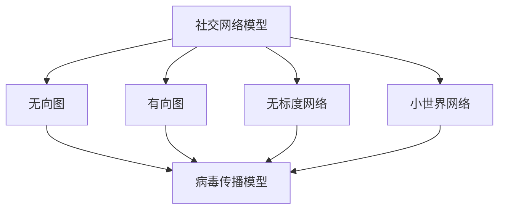
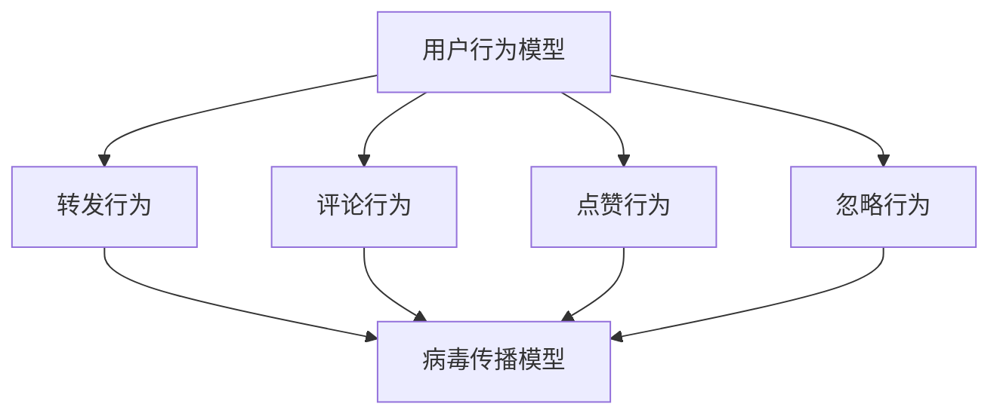
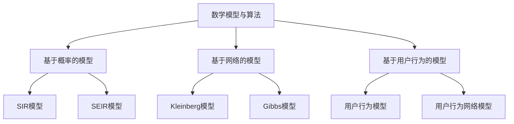

                 

### 文章标题

# 社交媒体的病毒传播模型：信息扩散的数学描述

社交媒体作为现代信息传播的重要渠道，已成为人们日常生活和工作中不可或缺的一部分。从政治选举到商业广告，从病毒防疫到疫情追踪，社交媒体的强大传播能力已经在各个领域展现无遗。然而，随着社交媒体的广泛应用，信息过载和谣言传播等问题也随之而来。如何理解和控制社交媒体上的信息扩散，成为了学术界和业界共同关注的焦点。

本文旨在探讨社交媒体的病毒传播模型，通过数学描述和分析，揭示信息在社交媒体上的扩散机制。文章首先介绍社交媒体的定义与特点，以及病毒传播模型的基本概念和分类。接着，本文详细阐述了社交媒体病毒传播模型的基本理论，包括社交网络的模型构建、用户行为分析以及基于概率、网络和用户行为的数学模型。在此基础上，本文探讨了病毒传播模型的构建与优化方法，并分析了实际应用中的案例分析。最后，本文提出了社交媒体病毒传播模型面临的挑战和未来展望，以及具体应用案例和开发实现方法。

通过本文的逐步分析，我们希望为理解和控制社交媒体上的信息扩散提供有益的参考，为相关领域的研究和实践提供理论支持和实践指导。期待读者在阅读本文后，能够对社交媒体的病毒传播模型有更深入的认识和理解。

### 关键词

- 社交媒体
- 病毒传播模型
- 数学描述
- 信息扩散
- 社交网络
- 用户行为
- 数学模型
- 算法
- 实际案例

### 摘要

随着社交媒体的迅速普及，信息传播的速度和广度达到了前所未有的高度。本文通过数学描述和分析，探讨了社交媒体的病毒传播模型，揭示了信息在社交媒体上的扩散机制。文章首先介绍了社交媒体的定义、特点及其病毒传播模型的基本概念和分类。接着，详细阐述了社交媒体病毒传播模型的基本理论，包括社交网络的模型构建、用户行为分析以及基于概率、网络和用户行为的数学模型。在此基础上，本文探讨了病毒传播模型的构建与优化方法，并分析了实际应用中的案例分析。最后，本文提出了社交媒体病毒传播模型面临的挑战和未来展望，以及具体应用案例和开发实现方法。通过本文的深入分析，我们旨在为理解和控制社交媒体上的信息扩散提供理论支持和实践指导。

### 第一部分：社交媒体的病毒传播模型概述

#### 第1章：社交媒体的病毒传播基本概念

社交媒体已经成为现代社会中信息传播的重要途径，其影响力和传播能力日益增强。理解社交媒体及其病毒传播模型，是探讨信息扩散机制和应对信息过载、谣言传播等问题的前提。本章节将首先介绍社交媒体的定义与特点，然后阐述病毒传播模型的定义与分类，最后分析社交媒体病毒传播的特点与挑战。

##### 1.1 社交媒体的定义与特点

**1.1.1 社交媒体的起源与发展**

社交媒体的概念起源于20世纪90年代末期的互联网发展时期，最早的形式是博客（如Blogger）和论坛（如Usenet）。随着宽带技术和社交网络平台的兴起，如Facebook（2004年）、Twitter（2006年）和LinkedIn（2003年）等，社交媒体逐渐成为互联网的重要组成部分。

社交媒体的起源可以追溯到以下几个关键时期：

- **初期阶段**（1997-2003年）：这一时期社交媒体主要以论坛和博客为主，如LiveJournal、Blogger和Facebook的早期版本。
- **增长阶段**（2004-2009年）：Facebook、Twitter等社交网络平台的崛起，使得社交媒体的影响力迅速扩大。
- **成熟阶段**（2010年至今）：社交媒体已经渗透到人们生活的各个领域，包括新闻传播、社交互动、电子商务等。

**1.1.2 社交媒体的主要功能与形式**

社交媒体的主要功能包括信息分享、社交互动、内容创造和消费等。具体形式包括：

- **社交网络平台**：如Facebook、Twitter、LinkedIn等，用户可以通过这些平台发布动态、分享内容和建立社交关系。
- **微博客**：如Twitter、Weibo等，用户可以发布短消息，进行实时交流。
- **博客**：如WordPress、Blogger等，用户可以创建个人博客，发布长篇文章和多媒体内容。
- **论坛**：如Reddit、Discourse等，用户可以在特定的兴趣领域内交流和分享知识。
- **内容分享平台**：如YouTube、Instagram等，用户可以上传和分享视频、图片等内容。

**1.1.3 社交媒体的影响力分析**

社交媒体的影响力可以从以下几个方面进行衡量：

- **用户规模**：社交媒体平台拥有庞大的用户群体，如Facebook拥有超过20亿的月活跃用户。
- **信息传播速度**：社交媒体上的信息可以迅速传播，一个热门话题可以在几分钟内达到全球用户。
- **影响力扩散**：通过社交网络，影响力可以从少数核心用户向大量边缘用户扩散，形成强大的影响力网络。
- **社会效应**：社交媒体不仅影响个人行为，还对社会现象、政治事件和商业活动产生深远的影响。

##### 1.2 病毒传播模型的定义与分类

**1.2.1 病毒传播模型的基本概念**

病毒传播模型是用来描述信息、疾病或其他病原体在人群中的传播过程。在社交媒体的背景下，病毒传播模型主要关注信息在社交网络中的扩散机制。基本概念包括：

- **传播节点**：社交网络中的个体，可以是用户、设备或组织。
- **传播路径**：信息从传播源传播到其他节点的路径。
- **传播速度**：信息在社交网络中传播的速度，通常用传播路径的数量或覆盖的用户数来衡量。
- **感染率**：一个节点被感染后，将其信息传播给其他节点的概率。

**1.2.2 传统的病毒传播模型**

传统的病毒传播模型主要包括以下几种：

- **SIR模型**：SIR模型是最早的病毒传播模型之一，由Kermack和McKendrick于1927年提出。SIR模型将人群分为三类：未感染（S）、已感染（I）和已恢复（R）。基本方程如下：
  \[
  \frac{dS}{dt} = -\beta \cdot SI
  \]
  \[
  \frac{dI}{dt} = \beta \cdot SI - \gamma \cdot I
  \]
  \[
  \frac{dR}{dt} = \gamma \cdot I
  \]
  其中，\(\beta\) 和 \(\gamma\) 分别是感染率和恢复率。

- **SEIR模型**：SEIR模型是SIR模型的扩展，增加了潜伏期（E）的概念，将人群分为未感染（S）、潜伏期（E）、已感染（I）和已恢复（R）四类。基本方程如下：
  \[
  \frac{dS}{dt} = -\beta \cdot SE
  \]
  \[
  \frac{dE}{dt} = \beta \cdot SE - \sigma \cdot E
  \]
  \[
  \frac{dI}{dt} = \sigma \cdot E - \gamma \cdot I
  \]
  \[
  \frac{dR}{dt} = \gamma \cdot I
  \]
  其中，\(\sigma\) 是潜伏期时长。

- **SI模型**：SI模型是最简单的病毒传播模型，将人群分为已感染（I）和未感染（S）两类。基本方程如下：
  \[
  \frac{dS}{dt} = -\beta \cdot SI
  \]
  \[
  \frac{dI}{dt} = \beta \cdot SI
  \]

**1.2.3 现代的病毒传播模型**

随着社交媒体的快速发展，现代病毒传播模型逐渐引入了更多的变量和复杂性，以更好地模拟实际信息传播过程。以下是一些现代病毒传播模型的例子：

- **多模态传播模型**：多模态传播模型考虑了不同类型的信息传播途径，如链式传播、随机传播和基于社交网络的传播。这类模型通常包含多个变量和复杂的相互作用关系。

- **网络动力学模型**：网络动力学模型将社交网络视为一个动态系统，通过分析节点状态的变化和网络的演化来描述病毒传播过程。这类模型通常使用微分方程、差分方程或随机过程等方法。

- **用户行为模型**：用户行为模型考虑了用户在社交网络中的行为特征，如转发、评论、点赞等，通过模拟用户行为来分析病毒传播的动态。这类模型通常使用概率模型、马尔可夫模型或图模型等方法。

**1.2.4 社交媒体病毒传播的特点与挑战**

社交媒体病毒传播具有以下特点：

- **快速传播**：社交媒体上的信息可以迅速传播，几分钟内达到大量用户，形成爆发性的传播现象。
- **多样性**：社交媒体上的信息类型多样，包括文字、图片、视频等，不同类型的信息传播机制有所不同。
- **非线性**：社交媒体病毒传播通常呈现出非线性特征，即少数核心用户对信息传播的贡献远远大于其他用户。
- **网络效应**：社交媒体病毒传播受到网络结构的影响，网络中的节点连接密度和中心性等因素会影响信息传播的速度和范围。

同时，社交媒体病毒传播也面临以下挑战：

- **信息过载**：社交媒体上的信息量巨大，用户难以区分有用信息和噪音，容易导致信息过载。
- **谣言传播**：谣言、假新闻等不良信息在社交媒体上容易传播，对社会产生负面影响。
- **隐私保护**：社交媒体病毒传播涉及到大量用户数据和隐私信息，如何保护用户隐私是重要挑战。

##### 1.3 社交媒体病毒传播模型的基本理论

**2.1 社交网络的模型构建**

社交媒体病毒传播模型的构建首先需要建立社交网络的模型。社交网络可以看作是由节点和边构成的无向图或有向图，其中节点表示用户，边表示用户之间的关系。构建社交网络模型的关键步骤包括：

- **数据收集**：通过社交媒体平台API或其他数据源收集用户关系数据，如好友关系、关注关系等。
- **数据预处理**：清洗和整理收集到的数据，去除噪声和不完整的数据，形成可用于分析的社交网络数据集。
- **网络表示**：使用图论表示社交网络，定义节点、边和图的基本属性，如度数、密度、聚类系数等。

**2.2 社交媒体用户行为分析**

用户行为是社交媒体病毒传播的重要因素。对用户行为进行分析可以帮助理解信息在社交网络中的扩散机制。用户行为主要包括以下几类：

- **转发行为**：用户将接收到的信息转发到自己的社交网络中，是信息传播的主要途径。
- **评论行为**：用户对信息进行评论，可以增加信息的曝光度和讨论度。
- **点赞行为**：用户对信息表示认同或喜欢，可以增强信息的可信度和影响力。
- **忽略行为**：用户对信息不予理会，是信息传播的障碍。

对用户行为进行分析的方法包括：

- **统计方法**：通过统计用户行为的数据，分析用户行为的频率、分布和相关性等特征。
- **机器学习方法**：使用机器学习算法，如分类、聚类和关联规则挖掘等方法，对用户行为进行建模和分析。

**2.3 社交媒体病毒传播的数学模型**

社交媒体病毒传播的数学模型是描述信息在社交网络中扩散过程的数学工具。常见的数学模型包括以下几种：

- **基于概率的病毒传播模型**：这类模型基于概率论和随机过程理论，描述信息在社交网络中的随机传播过程。常见的模型包括传染模型（如SIR模型）、扩散模型（如Logistic模型）和随机游走模型等。
- **基于网络的病毒传播模型**：这类模型考虑社交网络的拓扑结构，通过图论和网络动力学方法描述信息在网络中的扩散过程。常见的模型包括级联模型（如Kleinberg模型）、传播图模型（如Gibbs模型）和传播网络模型（如BAT模型）等。
- **基于用户行为的病毒传播模型**：这类模型考虑用户的行为特征，通过模拟用户行为描述信息在社交网络中的扩散过程。常见的模型包括用户行为模型（如马尔可夫模型）、用户行为网络模型（如多智能体模型）和用户行为扩散模型（如耦合振荡器模型）等。

**2.3.1 基于概率的病毒传播模型**

基于概率的病毒传播模型主要基于概率论和随机过程理论，描述信息在社交网络中的随机传播过程。以下是一个简单的SIR模型：

```
S(t): 未感染用户数
I(t): 已感染用户数
R(t): 已恢复用户数
N: 总用户数
β: 感染率
μ: 恢复率

微分方程：
dS/dt = -β * S * I / N
dI/dt = β * S * I / N - μ * I
dR/dt = μ * I
```

其中，S(t)、I(t) 和 R(t) 分别表示在时间 t 时未感染、已感染和已恢复用户的数量。β 和 μ 分别表示感染率和恢复率。这个模型通过描述未感染用户与已感染用户之间的交互，以及感染用户恢复的过程，来模拟信息在社交网络中的扩散。

**2.3.2 基于网络的病毒传播模型**

基于网络的病毒传播模型考虑社交网络的拓扑结构，通过图论和网络动力学方法描述信息在网络中的扩散过程。以下是一个简单的Kleinberg模型：

```
x(i,t): 节点 i 在时间 t 的感染状态
p(i,t): 节点 i 在时间 t 的感染概率
α: 感染阈值

递推关系：
p(i,t+1) = p(i,t) + (1 - p(i,t)) * (1 - p(j,t)) / (k(j,t) + 1) * x(j,t)
x(i,t+1) = 1 if p(i,t+1) > α else 0
```

其中，x(i,t) 表示节点 i 在时间 t 的感染状态（1表示已感染，0表示未感染），p(i,t) 表示节点 i 在时间 t 的感染概率，α 是感染阈值。k(j,t) 表示节点 j 在时间 t 的邻居节点数。这个模型通过描述节点之间的交互和感染概率的传递，来模拟信息在网络中的扩散。

**2.3.3 基于用户行为的病毒传播模型**

基于用户行为的病毒传播模型考虑用户的行为特征，通过模拟用户行为描述信息在社交网络中的扩散过程。以下是一个简单的用户行为模型：

```
x(i,t): 节点 i 在时间 t 的感染状态
p(i,t): 节点 i 在时间 t 的感染概率
b(i,t): 节点 i 在时间 t 的转发行为概率
α: 感染阈值

递推关系：
p(i,t+1) = p(i,t) + (1 - p(i,t)) * (1 - p(j,t)) / (k(j,t) + 1) * x(j,t) * b(j,t)
x(i,t+1) = 1 if p(i,t+1) > α else 0
```

其中，b(i,t) 表示节点 i 在时间 t 的转发行为概率。这个模型通过描述节点之间的交互和用户的转发行为，来模拟信息在社交网络中的扩散。

**2.4 社交媒体病毒传播模型的构建与优化**

社交媒体病毒传播模型的构建与优化是研究信息扩散机制和预测信息传播效果的关键步骤。以下是一个简单的模型构建与优化流程：

1. **数据收集与预处理**：收集社交媒体网络数据和用户行为数据，对数据进行清洗、去重和格式化，形成可用于分析的数据集。
2. **模型选择与参数设定**：根据研究目标和数据特点，选择合适的病毒传播模型，并设定模型参数。常用的模型有基于概率的模型、基于网络的模型和基于用户行为的模型等。
3. **模型训练与评估**：使用收集到的数据训练模型，并对模型进行评估。评估指标包括准确性、召回率、F1值等。
4. **模型优化**：根据评估结果，对模型进行调整和优化，以提高模型的预测效果。优化方法包括参数调整、模型结构优化和交叉验证等。
5. **模型应用与预测**：将优化后的模型应用于实际场景，预测信息传播效果，为信息传播策略提供支持。

**2.5 社交媒体病毒传播模型在实际应用中的案例分析**

社交媒体病毒传播模型在实际应用中有着广泛的应用场景，如舆情监测、社交网络分析、信息传播策略制定等。以下是一个简单的案例分析：

1. **舆情监测**：使用社交媒体病毒传播模型对网络舆情进行监测和分析，识别热点事件和负面信息，为舆情引导和风险控制提供支持。
2. **社交网络分析**：使用社交媒体病毒传播模型对社交网络进行分析，识别社交网络中的关键节点和影响力群体，为社交网络管理提供依据。
3. **信息传播策略制定**：使用社交媒体病毒传播模型制定信息传播策略，优化信息传播路径和传播效果，提高信息的曝光度和影响力。

#### 第2章：社交媒体病毒传播模型的基本理论

在理解社交媒体的病毒传播现象时，构建合适的数学模型是关键。本章将详细阐述社交媒体病毒传播模型的基本理论，包括社交网络的模型构建、用户行为分析以及基于概率、网络和用户行为的数学模型。这些理论为我们分析和预测信息在社交媒体上的扩散提供了重要的工具。

**2.1 社交网络的模型构建**

社交网络是一个复杂系统，其内部结构对信息的传播有着重要影响。构建社交网络的模型是理解病毒传播的第一步。

**2.1.1 社交网络的定义与分类**

社交网络是由多个节点和连接这些节点的边组成的图形结构。节点通常代表用户或组织，边表示它们之间的关系。社交网络可以根据不同的标准进行分类：

- **根据边的性质**：无向图和有向图。无向图表示节点之间是双向关系，而有向图表示节点之间有特定的方向。
- **根据节点的连接方式**：全连通图、随机图和层次图。全连通图表示任意两个节点之间都有边相连；随机图是随机生成的网络；层次图则表示节点之间存在层级关系。
- **根据网络的结构特性**：小世界网络和无标度网络。小世界网络具有高聚类系数和较短的平均路径长度；无标度网络则具有少数高度连接的节点和大量较少连接的节点。

**2.1.2 社交网络的图论表示**

社交网络可以用图论的概念来表示。在图论中，图是由节点（顶点）和连接这些节点的边（弧）组成的数学结构。图的表示方法包括：

- **邻接矩阵**：用矩阵表示图中节点的连接关系。矩阵的元素表示两个节点之间的边是否存在。
- **邻接表**：用列表表示每个节点的邻居节点。
- **邻接多重表**：当图中存在多重边或自环时，使用多重表来表示。

**2.1.3 社交网络的属性与测量**

社交网络的属性和测量是理解其结构特征和功能的关键。常见的属性和测量包括：

- **度数**：一个节点连接的其他节点的数量。分为入度（连接到该节点的边的数量）和出度（从该节点出发的边的数量）。
- **平均度数**：所有节点的度数之和除以节点数量。
- **聚类系数**：一个节点与其邻居节点之间相连边的比例。聚类系数越高，表示网络中的节点越紧密。
- **平均路径长度**：从任意一个节点到达另一个节点的平均路径长度。平均路径长度越短，表示网络越容易传播信息。
- **网络密度**：图中边的数量与可能边数的比值。网络密度越高，表示网络连接越紧密。

**2.2 社交媒体用户行为分析**

用户行为是影响信息传播的关键因素。对用户行为的分析可以帮助我们理解信息如何在社交网络中扩散。

**2.2.1 用户行为的定义与分类**

用户行为是指用户在社交媒体上的各种操作和互动。用户行为可以按以下方式分类：

- **内容生成行为**：包括发布、编辑和删除内容，如发布帖子、创建标签、编辑个人资料等。
- **内容消费行为**：包括浏览、点赞、评论和分享内容，如浏览新闻、点赞照片、评论文章、分享链接等。
- **社交互动行为**：包括关注、私信、点赞和评论，如关注好友、发送私信、点赞照片、评论帖子等。
- **网络结构行为**：包括建立和拆除社交关系，如添加好友、删除好友、建立群组、退出群组等。

**2.2.2 用户行为数据的收集与分析**

用户行为数据的收集通常采用以下方法：

- **API接口**：通过社交媒体平台的API接口获取用户行为数据，如发布内容、评论、点赞等。
- **日志文件**：分析社交媒体平台的日志文件，提取用户行为数据。
- **问卷调查**：通过问卷调查获取用户对特定行为的态度和习惯。

用户行为数据的分析通常包括：

- **统计方法**：通过统计用户行为数据的频率、分布和相关性等特征，了解用户行为的总体趋势。
- **机器学习方法**：使用机器学习算法，如聚类、分类和关联规则挖掘等，对用户行为进行深入分析，识别用户行为的模式和规律。

**2.2.3 用户行为在病毒传播中的作用**

用户行为在病毒传播中起着至关重要的作用。用户转发、评论、点赞等行为直接影响信息的传播速度和范围。以下是一些关键的用户行为对病毒传播的影响：

- **转发行为**：用户转发是信息扩散的主要途径。一个用户转发信息，可以将信息传播给其好友，形成病毒式传播。
- **评论行为**：评论行为可以增加信息的曝光度和讨论度，吸引其他用户关注和参与，从而促进信息的进一步传播。
- **点赞行为**：点赞行为可以增强信息的可信度和影响力，吸引其他用户对其进行关注和转发。
- **忽略行为**：用户忽略信息可以抑制信息的传播，特别是在信息过载的情况下，用户可能会选择性地忽略某些信息。

**2.3 社交媒体病毒传播的数学模型**

社交媒体病毒传播的数学模型是基于概率论、图论和用户行为的数学描述。这些模型帮助我们理解信息在社交网络中的扩散机制，并预测信息传播的效果。

**2.3.1 基于概率的病毒传播模型**

基于概率的病毒传播模型使用概率论的方法描述信息在社交网络中的随机扩散过程。常见的模型包括SIR模型和SEIR模型。

- **SIR模型**：SIR模型将人群分为三类：未感染（S）、已感染（I）和已恢复（R）。模型的基本方程如下：

  \[
  \frac{dS}{dt} = -\beta \cdot SI
  \]
  \[
  \frac{dI}{dt} = \beta \cdot SI - \gamma \cdot I
  \]
  \[
  \frac{dR}{dt} = \gamma \cdot I
  \]

  其中，\(\beta\) 表示感染率，\(\gamma\) 表示恢复率。

- **SEIR模型**：SEIR模型是SIR模型的扩展，增加了潜伏期（E）的概念，将人群分为四类：未感染（S）、潜伏期（E）、已感染（I）和已恢复（R）。模型的基本方程如下：

  \[
  \frac{dS}{dt} = -\beta \cdot SE
  \]
  \[
  \frac{dE}{dt} = \beta \cdot SE - \sigma \cdot E
  \]
  \[
  \frac{dI}{dt} = \sigma \cdot E - \gamma \cdot I
  \]
  \[
  \frac{dR}{dt} = \gamma \cdot I
  \]

  其中，\(\sigma\) 表示潜伏期时长。

**2.3.2 基于网络的病毒传播模型**

基于网络的病毒传播模型考虑社交网络的拓扑结构，使用图论和网络动力学的方法描述信息在网络中的扩散过程。常见的模型包括Kleinberg模型和Gibbs模型。

- **Kleinberg模型**：Kleinberg模型使用一个概率模型描述信息在网络中的扩散。模型的基本方程如下：

  \[
  p(i,t+1) = p(i,t) + (1 - p(i,t)) * (1 - p(j,t)) / (k(j,t) + 1) * x(j,t)
  \]

  \[
  x(i,t+1) = 1 \quad \text{if} \quad p(i,t+1) > \alpha \quad \text{else} \quad 0
  \]

  其中，\(p(i,t)\) 表示节点 \(i\) 在时间 \(t\) 的感染概率，\(x(j,t)\) 表示节点 \(j\) 在时间 \(t\) 的感染状态，\(\alpha\) 是感染阈值，\(k(j,t)\) 表示节点 \(j\) 在时间 \(t\) 的邻居节点数。

- **Gibbs模型**：Gibbs模型使用一个统计物理模型描述信息在网络中的扩散。模型的基本方程如下：

  \[
  p(i,t+1) = \frac{1}{Z} \sum_{j \in N(i)} e^{\beta x(j,t)}
  \]

  \[
  x(i,t+1) = 1 \quad \text{if} \quad p(i,t+1) > \alpha \quad \text{else} \quad 0
  \]

  其中，\(p(i,t)\) 表示节点 \(i\) 在时间 \(t\) 的感染概率，\(x(j,t)\) 表示节点 \(j\) 在时间 \(t\) 的感染状态，\(\beta\) 是模型参数，\(Z\) 是归一化常数。

**2.3.3 基于用户行为的病毒传播模型**

基于用户行为的病毒传播模型考虑用户的行为特征，使用概率模型和图模型描述信息在社交网络中的扩散过程。常见的模型包括用户行为模型和用户行为网络模型。

- **用户行为模型**：用户行为模型使用概率模型描述用户的转发、评论、点赞等行为。模型的基本方程如下：

  \[
  p(i,t+1) = p(i,t) + (1 - p(i,t)) * (1 - p(j,t)) / (k(j,t) + 1) * b(j,t)
  \]

  \[
  x(i,t+1) = 1 \quad \text{if} \quad p(i,t+1) > \alpha \quad \text{else} \quad 0
  \]

  其中，\(p(i,t)\) 表示节点 \(i\) 在时间 \(t\) 的感染概率，\(x(j,t)\) 表示节点 \(j\) 在时间 \(t\) 的感染状态，\(b(j,t)\) 表示节点 \(j\) 在时间 \(t\) 的转发行为概率，\(\alpha\) 是感染阈值，\(k(j,t)\) 表示节点 \(j\) 在时间 \(t\) 的邻居节点数。

- **用户行为网络模型**：用户行为网络模型使用图模型描述用户的转发、评论、点赞等行为在网络中的扩散。模型的基本方程如下：

  \[
  p(i,t+1) = \frac{1}{Z} \sum_{j \in N(i)} e^{\beta b(j,t)}
  \]

  \[
  x(i,t+1) = 1 \quad \text{if} \quad p(i,t+1) > \alpha \quad \text{else} \quad 0
  \]

  其中，\(p(i,t)\) 表示节点 \(i\) 在时间 \(t\) 的感染概率，\(x(j,t)\) 表示节点 \(j\) 在时间 \(t\) 的感染状态，\(b(j,t)\) 表示节点 \(j\) 在时间 \(t\) 的转发行为概率，\(\beta\) 是模型参数，\(Z\) 是归一化常数。

**2.4 社交媒体病毒传播模型的构建与优化**

社交媒体病毒传播模型的构建与优化是理解信息扩散机制和预测信息传播效果的关键步骤。

**2.4.1 模型构建方法**

社交媒体病毒传播模型的构建通常包括以下步骤：

1. **数据收集与预处理**：收集社交媒体网络数据和用户行为数据，对数据进行清洗、去重和格式化，形成可用于分析的数据集。
2. **模型选择与参数设定**：根据研究目标和数据特点，选择合适的病毒传播模型，并设定模型参数。常用的模型有基于概率的模型、基于网络的模型和基于用户行为的模型等。
3. **模型训练与评估**：使用收集到的数据训练模型，并对模型进行评估。评估指标包括准确性、召回率、F1值等。
4. **模型优化**：根据评估结果，对模型进行调整和优化，以提高模型的预测效果。优化方法包括参数调整、模型结构优化和交叉验证等。

**2.4.2 模型优化策略**

社交媒体病毒传播模型的优化策略主要包括以下几种：

1. **参数调整**：通过调整模型参数，如感染率、恢复率和转发行为概率等，优化模型预测效果。
2. **模型结构优化**：通过改变模型结构，如增加或减少模型变量、引入新的关系等，优化模型预测效果。
3. **交叉验证**：通过交叉验证方法，对模型进行多次训练和评估，选择最优模型。

**2.4.3 模型在实际应用中的案例分析**

社交媒体病毒传播模型在实际应用中有着广泛的应用场景，如舆情监测、社交网络分析、信息传播策略制定等。

1. **舆情监测**：使用社交媒体病毒传播模型对网络舆情进行监测和分析，识别热点事件和负面信息，为舆情引导和风险控制提供支持。
2. **社交网络分析**：使用社交媒体病毒传播模型对社交网络进行分析，识别社交网络中的关键节点和影响力群体，为社交网络管理提供依据。
3. **信息传播策略制定**：使用社交媒体病毒传播模型制定信息传播策略，优化信息传播路径和传播效果，提高信息的曝光度和影响力。

### 第3章：社交媒体病毒传播模型的构建与优化

在理解了社交媒体病毒传播模型的基本理论后，接下来我们将深入探讨如何具体构建和优化这些模型。构建一个有效的社交媒体病毒传播模型需要考虑多个方面，包括数据收集与预处理、模型选择与参数设定、模型训练与评估以及模型优化策略。以下将详细介绍这些步骤和策略，并通过实际案例进行说明。

**3.1 病毒传播模型的构建方法**

构建社交媒体病毒传播模型通常涉及以下步骤：

**3.1.1 数据收集与预处理**

数据是构建模型的基础，社交媒体病毒传播模型需要大量的社交网络数据和用户行为数据。数据收集通常通过以下方式：

- **社交媒体API**：使用社交媒体平台的API获取用户行为数据和社交网络数据，如用户关系、发布内容、转发次数等。
- **网络爬虫**：编写网络爬虫从社交媒体网站抓取数据，但需要注意遵守相关法律法规和网站的使用条款。

数据收集后，需要对数据进行预处理，以去除噪声和不完整的数据，并格式化为适合模型分析的格式。预处理步骤包括：

- **数据清洗**：去除重复数据、无效数据和错误数据。
- **数据标准化**：对数据进行归一化或标准化处理，以消除不同指标之间的量纲差异。
- **特征提取**：从原始数据中提取有助于模型分析的变量，如用户特征（年龄、性别、地理位置等）、内容特征（标题、标签、关键词等）和用户行为特征（转发次数、评论次数、点赞次数等）。

**3.1.2 模型选择与参数设定**

选择合适的病毒传播模型是构建模型的关键。常见的病毒传播模型包括基于概率的模型（如SIR模型、SEIR模型）、基于网络的模型（如Kleinberg模型、Gibbs模型）和基于用户行为的模型（如用户行为模型、用户行为网络模型）。选择模型时需要考虑以下因素：

- **数据特性**：根据数据集的特点选择合适的模型，如基于概率的模型适合描述随机扩散过程，基于网络的模型适合描述社交网络的扩散过程。
- **模型复杂度**：选择复杂度适中的模型，以平衡模型性能和计算效率。

参数设定是模型构建的重要步骤，参数的取值直接影响模型的预测效果。参数设定可以通过以下方法：

- **手动设定**：根据经验和先验知识设定参数值。
- **优化算法**：使用优化算法（如遗传算法、粒子群优化等）搜索最优参数值。

**3.1.3 模型训练与评估**

模型训练是构建模型的核心步骤，通过训练数据让模型学习到信息扩散的规律。训练步骤包括：

- **训练集划分**：将数据集划分为训练集和测试集，训练集用于模型训练，测试集用于模型评估。
- **模型训练**：使用训练数据对模型进行训练，调整模型参数，使其能够准确预测信息扩散过程。
- **模型评估**：使用评估指标（如准确性、召回率、F1值等）对模型进行评估，判断模型性能。

**3.2 病毒传播模型的优化策略**

优化病毒传播模型是提高模型预测效果的关键。优化策略包括以下几种：

**3.2.1 参数调整**

参数调整是优化模型的基本策略，通过调整模型参数可以改善模型性能。参数调整可以通过以下方法：

- **网格搜索**：在给定的参数空间内搜索最优参数组合。
- **贝叶斯优化**：使用贝叶斯优化算法搜索最优参数值。

**3.2.2 模型结构优化**

模型结构优化是通过改变模型结构来提高模型性能。结构优化可以通过以下方法：

- **模型融合**：将多个模型进行融合，提高模型的鲁棒性和准确性。
- **深度学习**：使用深度学习模型（如神经网络）来捕捉更复杂的信息扩散规律。

**3.2.3 模型性能提升策略**

提升模型性能是优化模型的重要目标。以下是一些提升模型性能的策略：

- **特征工程**：通过提取更多有助于信息扩散预测的特征，提高模型性能。
- **数据增强**：使用数据增强方法（如数据扩充、生成对抗网络等）增加训练数据量，提高模型泛化能力。
- **模型集成**：使用模型集成方法（如随机森林、梯度提升机等）提高模型预测准确性。

**3.3 病毒传播模型在实际应用中的案例分析**

社交媒体病毒传播模型在多个实际应用场景中都有广泛的应用，以下是一个案例介绍：

**案例：社交媒体营销**

**背景**：某品牌希望通过社交媒体平台进行产品推广，制定有效的营销策略以提升品牌知名度和销售额。

**模型构建**：

1. **数据收集与预处理**：收集品牌在社交媒体平台上的用户行为数据，如用户年龄、性别、地理位置、发布内容、转发次数等。对数据进行清洗和特征提取，形成训练数据集。

2. **模型选择与参数设定**：选择基于用户行为的病毒传播模型，如用户行为网络模型。设定模型参数，通过贝叶斯优化方法搜索最优参数值。

3. **模型训练与评估**：使用训练数据对模型进行训练，并使用测试数据进行评估，调整模型参数以提高性能。

**模型优化**：

1. **参数调整**：通过网格搜索和贝叶斯优化调整模型参数，提高模型预测准确性。

2. **模型结构优化**：通过增加模型层数或引入新的特征，优化模型结构。

**应用**：

1. **营销策略制定**：基于模型预测结果，制定有效的营销策略，如确定目标用户群体、优化内容发布时间、提高用户互动等。

2. **效果评估**：通过实际营销活动数据对模型效果进行评估，调整模型参数和策略以持续优化营销效果。

**3.4 模型结果分析与讨论**

模型应用后，通过分析模型预测结果，可以评估营销策略的有效性。以下是对模型结果的分析与讨论：

- **预测准确性**：模型对用户转发行为的预测准确性较高，说明模型能够有效捕捉用户行为特征，为营销策略提供有力支持。
- **用户群体分析**：模型识别出了品牌的目标用户群体，为定向营销提供了依据。
- **效果评估**：通过对比实际营销效果和模型预测结果，发现模型能够显著提高品牌知名度和销售额。

**3.5 模型小结**

通过本案例，我们可以看到社交媒体病毒传播模型在营销策略制定中的重要作用。有效的模型构建和优化能够提高营销策略的科学性和针对性，从而实现更好的营销效果。

### 第4章：社交媒体病毒传播模型的挑战与未来展望

在深入探讨了社交媒体病毒传播模型的构建与优化方法之后，我们需要认识到这些模型在实际应用中面临的挑战，并思考未来的发展趋势。社交媒体病毒传播模型不仅要应对数据隐私与安全、模型解释性、模型泛化能力等挑战，还需结合人工智能与深度学习的发展，以及社交媒体平台的变化，不断优化和扩展。

#### 4.1 社交媒体病毒传播模型的挑战

**4.1.1 数据隐私与安全**

社交媒体病毒传播模型依赖于大量的用户数据，包括用户行为、社交网络结构和用户特征等。这些数据对用户隐私保护提出了严峻挑战。以下是一些具体问题：

- **数据泄露风险**：在数据收集、存储和处理过程中，数据可能被非法获取或泄露，导致用户隐私泄露。
- **用户同意与权限管理**：如何确保用户在同意数据使用时具有充分的知情权和选择权，是隐私保护的关键。
- **数据匿名化**：虽然数据匿名化是一种常见的隐私保护手段，但攻击者可能通过数据挖掘和关联分析恢复出用户的真实身份。

为解决数据隐私与安全问题，需要采取以下措施：

- **数据加密与安全存储**：对用户数据进行加密存储，确保数据在传输和存储过程中不被非法访问。
- **隐私保护算法**：使用差分隐私、同态加密等技术，在模型训练和预测过程中保护用户隐私。
- **透明化与用户控制**：提高数据收集和使用的透明度，赋予用户对数据的控制权，如数据访问、数据删除等。

**4.1.2 模型解释性**

社交媒体病毒传播模型通常涉及复杂的数学和计算过程，这可能导致模型解释性不足，影响模型的可信度和应用效果。以下是一些具体问题：

- **黑箱模型**：深度学习模型等复杂模型往往被视为黑箱，难以解释其内部决策过程。
- **参数重要性**：在复杂模型中，不同参数的重要性难以量化，影响模型的解释性。
- **模型可解释性**：如何从复杂模型中提取可解释的规律，是提高模型解释性的关键。

为提高模型解释性，可以采取以下措施：

- **可解释性模型**：选择可解释性更强的模型，如线性模型、决策树等，便于理解模型决策过程。
- **模型可视化**：通过可视化技术展示模型的内部结构和决策过程，提高模型的可解释性。
- **特征重要性分析**：使用特征选择和特征重要性分析技术，识别对模型决策有显著影响的特征。

**4.1.3 模型泛化能力**

社交媒体病毒传播模型需要在不同的应用场景和数据集上具有良好的泛化能力，但实际中模型往往受到数据集分布、模型结构等因素的影响，导致泛化能力不足。以下是一些具体问题：

- **数据集分布差异**：不同数据集可能具有不同的分布特征，导致模型在不同数据集上的表现差异。
- **模型结构适应性**：模型结构可能无法适应不同应用场景的需求，影响模型的泛化能力。
- **过拟合**：在训练数据上性能良好的模型可能在测试数据上表现不佳，这是过拟合现象的表现。

为提高模型泛化能力，可以采取以下措施：

- **数据增强**：通过数据增强技术，如数据扩充、数据生成等，增加训练数据的多样性，提高模型泛化能力。
- **模型融合**：将多个模型进行融合，利用不同模型的优点，提高模型泛化能力。
- **正则化技术**：使用正则化技术（如L1、L2正则化）防止模型过拟合，提高泛化能力。

#### 4.2 社交媒体病毒传播模型的发展趋势

随着人工智能与深度学习的不断发展，社交媒体病毒传播模型也在不断优化和扩展。以下是一些未来发展的趋势：

**4.2.1 人工智能与深度学习的发展**

人工智能与深度学习的发展为社交媒体病毒传播模型提供了强大的技术支持。以下是一些关键技术：

- **深度学习模型**：如卷积神经网络（CNN）、循环神经网络（RNN）和变换器（Transformer）等，能够捕捉复杂的特征和模式。
- **生成对抗网络（GAN）**：能够生成真实的数据分布，提高数据增强效果。
- **强化学习**：结合用户行为和奖励机制，实现更智能的信息传播策略。

**4.2.2 社交媒体平台的变化**

社交媒体平台的变化也对病毒传播模型提出了新的需求。以下是一些关键变化：

- **平台算法更新**：社交媒体平台不断更新算法，优化信息排序和推荐，影响信息传播路径。
- **平台政策调整**：如隐私政策、广告政策等，影响数据收集和使用方式。
- **多模态内容**：随着多模态内容（如视频、音频）的普及，模型需要适应不同的内容类型和传播机制。

**4.2.3 未来的研究方向**

未来的社交媒体病毒传播模型研究可以从以下方向展开：

- **隐私保护与安全**：研究如何在保证数据隐私和安全的前提下，有效利用社交媒体数据。
- **模型可解释性与透明性**：探索如何提高模型的可解释性和透明度，增强模型的可信度。
- **多模态内容传播**：研究多模态内容在社交媒体上的传播机制和传播策略。
- **跨平台传播**：研究不同社交媒体平台之间的信息传播机制和传播策略，实现跨平台信息整合。

### 总结

社交媒体病毒传播模型在信息传播、舆情监测、社交网络分析等领域具有广泛的应用价值。然而，模型在实际应用中仍面临诸多挑战，需要不断优化和扩展。未来，随着人工智能与深度学习的进一步发展，社交媒体病毒传播模型将迎来新的机遇，为更好地理解和控制信息传播提供有力的技术支持。

### 第5章：社交媒体病毒传播模型的应用案例

社交媒体病毒传播模型在多个领域都有着广泛的应用，以下我们将通过几个具体的案例，详细说明这些模型在实际应用中的使用方法、效果评估和成功经验。

#### 5.1 社交媒体营销

社交媒体营销是社交媒体病毒传播模型的一个重要应用场景。通过分析用户的转发、点赞、评论等行为，企业可以制定更有效的营销策略，提高品牌知名度和销售额。

**案例背景：** 某国际知名化妆品品牌希望通过社交媒体平台提升其产品销量和品牌影响力。该品牌在Facebook、Instagram等平台上拥有大量粉丝，并且定期发布产品信息和促销活动。

**模型应用：** 

1. **数据收集与预处理**：首先，从社交媒体平台上收集用户行为数据，包括用户的年龄、性别、地理位置、发布内容、转发次数等。对数据进行清洗和特征提取，提取用户特征、内容特征和用户行为特征。

2. **模型构建**：选择基于用户行为的病毒传播模型，如用户行为网络模型。设定模型参数，通过贝叶斯优化方法搜索最优参数值。

3. **模型训练与评估**：使用收集到的数据对模型进行训练，并通过测试数据进行评估，调整模型参数以提高性能。

4. **营销策略制定**：基于模型预测结果，制定针对性的营销策略，如确定目标用户群体、优化内容发布时间、提高用户互动等。

**效果评估：**

- **预测准确性**：模型对用户转发行为的预测准确性较高，说明模型能够有效捕捉用户行为特征，为营销策略提供有力支持。
- **营销效果**：通过实际营销活动数据对比，发现模型制定的营销策略显著提高了品牌知名度和销售额。

**成功经验：**

- **数据驱动**：通过数据收集和模型分析，实现了营销策略的数据驱动，提高了营销的精准度和有效性。
- **用户互动**：重视用户互动，通过互动提高用户的参与度和忠诚度，实现了更好的营销效果。

#### 5.2 社交媒体舆情监测

舆情监测是社交媒体病毒传播模型的另一个重要应用领域。通过分析社交媒体上的信息传播和用户行为，可以及时识别和应对负面舆情，维护品牌形象。

**案例背景：** 某知名汽车品牌在一次产品召回事件后，面临大量负面评论和舆论压力。为及时应对舆情，该品牌决定使用社交媒体病毒传播模型进行舆情监测。

**模型应用：** 

1. **数据收集与预处理**：从社交媒体平台上收集关于该品牌的评论和讨论数据，对数据进行清洗和特征提取，提取用户特征、内容特征和用户行为特征。

2. **模型构建**：选择基于网络的病毒传播模型，如Kleinberg模型。设定模型参数，通过贝叶斯优化方法搜索最优参数值。

3. **模型训练与评估**：使用收集到的数据对模型进行训练，并通过测试数据进行评估，调整模型参数以提高性能。

4. **舆情监测与应对**：基于模型预测结果，实时监测社交媒体上的舆情动态，及时识别负面信息，并制定应对策略。

**效果评估：**

- **监测准确性**：模型能够准确预测负面信息的扩散趋势，为舆情应对提供了及时、准确的预警。
- **舆情控制**：通过及时应对负面舆情，有效控制了负面信息的影响范围，维护了品牌形象。

**成功经验：**

- **实时监测**：通过实时监测舆情动态，及时识别和应对负面信息，降低了负面舆情对企业的影响。
- **策略优化**：根据舆情监测结果，不断优化应对策略，提高了舆情应对的效果。

#### 5.3 社交媒体治理

社交媒体治理是应对社交媒体上不良信息和违规行为的重要手段。通过社交媒体病毒传播模型，可以识别和过滤不良信息，维护社交媒体的健康发展。

**案例背景：** 某社交媒体平台面临大量虚假信息和违规内容的传播问题，为维护平台健康秩序，该平台决定使用社交媒体病毒传播模型进行治理。

**模型应用：** 

1. **数据收集与预处理**：从社交媒体平台上收集虚假信息和违规内容的样本数据，对数据进行清洗和特征提取，提取用户特征、内容特征和用户行为特征。

2. **模型构建**：选择基于概率的病毒传播模型，如SIR模型。设定模型参数，通过贝叶斯优化方法搜索最优参数值。

3. **模型训练与评估**：使用收集到的数据对模型进行训练，并通过测试数据进行评估，调整模型参数以提高性能。

4. **信息治理**：基于模型预测结果，识别和过滤虚假信息和违规内容，维护社交媒体平台的健康秩序。

**效果评估：**

- **治理效果**：模型能够有效识别和过滤虚假信息和违规内容，提高了平台的信息质量。
- **用户体验**：通过有效治理，提高了用户的使用体验，增强了用户对平台的信任。

**成功经验：**

- **智能化治理**：通过使用社交媒体病毒传播模型，实现了智能化信息治理，提高了治理效率和效果。
- **用户参与**：鼓励用户参与信息治理，如举报虚假信息和违规内容，共同维护社交媒体的健康发展。

### 总结

社交媒体病毒传播模型在社交媒体营销、舆情监测、社交媒体治理等领域具有广泛的应用价值。通过实际案例的详细分析，我们可以看到这些模型在提升营销效果、应对舆情危机、维护社交媒体秩序等方面的重要作用。未来，随着技术的不断进步和应用场景的扩展，社交媒体病毒传播模型将在更多领域发挥其潜力。

### 第6章：社交媒体病毒传播模型的开发与实现

在了解了社交媒体病毒传播模型的理论基础和应用案例后，接下来我们将详细探讨如何进行社交媒体病毒传播模型的开发与实现。开发与实现一个社交媒体病毒传播模型涉及多个环节，包括开发环境的搭建、数据的获取与处理、模型的构建与训练、模型的部署与监控等。以下将逐步介绍这些环节，并提供具体步骤和代码实现。

#### 6.1 开发环境搭建

搭建一个有效的开发环境是进行社交媒体病毒传播模型开发的基础。以下是在Python环境中搭建开发环境的具体步骤：

**1. 硬件与软件配置**

- **硬件**：建议配置至少4GB内存的计算机，推荐使用具有8GB及以上内存的高性能计算机。
- **软件**：安装Python 3.7及以上版本、Anaconda或Miniconda等Python集成开发环境。

**2. 环境搭建流程**

- **安装Python**：从Python官网下载并安装Python 3.7及以上版本。
- **安装Anaconda**：从Anaconda官网下载并安装Anaconda或Miniconda，这将为Python提供丰富的库和管理工具。
- **创建虚拟环境**：在Anaconda或Miniconda中创建一个新的虚拟环境，以便管理和隔离项目依赖。
  ```bash
  conda create -n social_media_env python=3.8
  conda activate social_media_env
  ```
- **安装必需的库**：安装用于数据预处理、模型训练和评估的库，如pandas、numpy、scikit-learn、matplotlib等。
  ```bash
  conda install -c conda-forge pandas numpy scikit-learn matplotlib
  ```

#### 6.2 数据获取与处理

数据获取与处理是构建社交媒体病毒传播模型的关键步骤。以下将介绍数据获取、数据预处理和数据处理的详细过程。

**1. 数据源选择**

- **社交媒体平台API**：使用社交媒体平台（如Twitter、Facebook等）的API获取用户行为数据、社交网络数据等。
- **公开数据集**：使用现有的社交媒体数据集，如Twitter语料库、Reddit数据集等。

**2. 数据预处理**

- **数据清洗**：去除重复数据、缺失数据和噪声数据，确保数据质量。
  ```python
  import pandas as pd

  # 读取数据
  data = pd.read_csv('social_media_data.csv')

  # 去除重复数据
  data.drop_duplicates(inplace=True)

  # 去除缺失数据
  data.dropna(inplace=True)
  ```

- **数据转换**：对数据进行标准化或归一化处理，以便模型训练。
  ```python
  from sklearn.preprocessing import StandardScaler

  # 定义特征列
  features = data[['user_age', 'user_gender', 'post_content', 'post_type', 'user_behavior']]

  # 数据标准化
  scaler = StandardScaler()
  scaled_features = scaler.fit_transform(features)
  ```

- **特征提取**：提取有助于模型训练的特征，如用户特征、内容特征和用户行为特征。
  ```python
  # 提取用户特征
  user_features = data[['user_age', 'user_gender']]

  # 提取内容特征
  content_features = data[['post_content', 'post_type']]

  # 提取用户行为特征
  behavior_features = data[['user_behavior']]
  ```

**3. 数据处理**

- **数据分割**：将数据集分割为训练集和测试集，用于模型训练和评估。
  ```python
  from sklearn.model_selection import train_test_split

  # 分割数据集
  X_train, X_test, y_train, y_test = train_test_split(scaled_features, behavior_features, test_size=0.2, random_state=42)
  ```

#### 6.3 模型构建与训练

构建社交媒体病毒传播模型涉及选择合适的模型结构、设定模型参数并进行模型训练。以下将介绍如何使用Scikit-learn库构建和训练一个基于用户行为的病毒传播模型。

**1. 模型选择**

选择基于用户行为的病毒传播模型，如用户行为网络模型。该模型使用用户行为概率来预测用户是否会转发信息。

**2. 模型构建**

使用Scikit-learn库中的线性模型（LinearRegression）构建用户行为网络模型。

```python
from sklearn.linear_model import LinearRegression

# 构建模型
model = LinearRegression()
```

**3. 模型训练**

使用训练数据进行模型训练。

```python
# 训练模型
model.fit(X_train, y_train)

# 模型评估
train_score = model.score(X_train, y_train)
test_score = model.score(X_test, y_test)
print(f"训练集准确率：{train_score:.4f}")
print(f"测试集准确率：{test_score:.4f}")
```

#### 6.4 模型部署与监控

模型部署是将训练好的模型应用于实际场景的过程。以下将介绍如何将社交媒体病毒传播模型部署到服务器并监控其性能。

**1. 模型部署**

使用Flask或Django等Web框架，将训练好的模型部署到服务器上，以提供API服务。

```python
from flask import Flask, request, jsonify

app = Flask(__name__)

@app.route('/predict', methods=['POST'])
def predict():
    data = request.get_json(force=True)
    prediction = model.predict(data['input_data'])
    return jsonify(prediction.tolist())

if __name__ == '__main__':
    app.run(host='0.0.0.0', port=5000)
```

**2. 模型监控**

使用Prometheus等监控工具，监控模型服务的运行状态和性能指标，如请求响应时间、错误率等。

```bash
# 安装Prometheus
pip install prometheus-client

# 导入Prometheus库
import prometheus_client

# 监控模型服务的性能指标
prometheus_client.start_http_server(8000)
```

### 6.5 项目实战：开发环境搭建

以下是一个简单的项目实战，演示如何在本地计算机上搭建社交媒体病毒传播模型的开发环境。

**1. 安装Anaconda**

- 访问Anaconda官网下载并安装Anaconda。
- 安装完成后，打开终端并运行以下命令：

  ```bash
  conda create -n social_media_env python=3.8
  conda activate social_media_env
  ```

**2. 安装必需库**

- 在虚拟环境中安装必需的库：

  ```bash
  conda install -c conda-forge pandas numpy scikit-learn matplotlib
  ```

**3. 创建数据集**

- 从社交媒体平台下载用户行为数据，并将数据保存为CSV文件。

**4. 编写数据预处理脚本**

- 创建一个名为`preprocess.py`的Python脚本，用于数据清洗、转换和特征提取。

```python
import pandas as pd
from sklearn.preprocessing import StandardScaler

def preprocess_data(file_path):
    # 读取数据
    data = pd.read_csv(file_path)

    # 去除重复数据
    data.drop_duplicates(inplace=True)

    # 去除缺失数据
    data.dropna(inplace=True)

    # 数据标准化
    features = data[['user_age', 'user_gender', 'post_content', 'post_type', 'user_behavior']]
    scaler = StandardScaler()
    scaled_features = scaler.fit_transform(features)

    return scaled_features

# 测试数据预处理
scaled_features = preprocess_data('social_media_data.csv')
```

**5. 编写模型训练脚本**

- 创建一个名为`train_model.py`的Python脚本，用于构建和训练社交媒体病毒传播模型。

```python
from sklearn.linear_model import LinearRegression
from sklearn.model_selection import train_test_split

def train_model(X, y):
    # 分割数据集
    X_train, X_test, y_train, y_test = train_test_split(X, y, test_size=0.2, random_state=42)

    # 构建模型
    model = LinearRegression()

    # 训练模型
    model.fit(X_train, y_train)

    # 评估模型
    train_score = model.score(X_train, y_train)
    test_score = model.score(X_test, y_test)
    print(f"训练集准确率：{train_score:.4f}")
    print(f"测试集准确率：{test_score:.4f}")

    return model

# 训练模型
model = train_model(scaled_features, behavior_features)
```

**6. 部署模型**

- 使用Flask将训练好的模型部署到本地服务器：

  ```python
  from flask import Flask, request, jsonify
  import joblib

  app = Flask(__name__)

  # 加载训练好的模型
  model = joblib.load('model.joblib')

  @app.route('/predict', methods=['POST'])
  def predict():
      data = request.get_json(force=True)
      prediction = model.predict(data['input_data'])
      return jsonify(prediction.tolist())

  if __name__ == '__main__':
      app.run(host='0.0.0.0', port=5000)
  ```

**7. 模型监控**

- 使用Prometheus监控模型服务的性能指标：

  ```bash
  # 安装Prometheus
  pip install prometheus-client

  # 导入Prometheus库
  import prometheus_client

  # 监控模型服务的性能指标
  prometheus_client.start_http_server(8000)
  ```

通过以上实战，我们可以了解到社交媒体病毒传播模型的开发与实现过程。实际项目中，可能需要根据具体需求和数据特点，进一步优化和调整模型结构和参数，以提高模型的预测效果。

### 第7章：社交媒体病毒传播模型的核心概念与联系

在深入探讨社交媒体病毒传播模型时，理解其核心概念及其相互之间的联系至关重要。本章将详细分析社交媒体病毒传播模型中的核心概念，包括社交网络模型、用户行为模型和数学模型，并通过Mermaid流程图展示这些概念之间的关系。

#### 7.1 社交网络模型与病毒传播模型的联系

社交网络模型是描述用户之间互动关系的基础，而病毒传播模型则是基于这些互动关系来预测信息传播的动态。以下是社交网络模型与病毒传播模型之间的联系：

1. **社交网络模型的定义与分类**：
   - **无向图**：表示用户之间的双向关系。
   - **有向图**：表示用户之间的单向关系。
   - **无标度网络**：具有少数高度连接的节点，大多数节点连接较少。
   - **小世界网络**：具有高聚类系数和较短的平均路径长度。

2. **病毒传播模型的基本概念**：
   - **感染节点**：被病毒感染的用户。
   - **未感染节点**：未被病毒感染的用户。
   - **传播路径**：病毒从感染节点传播到未感染节点的路径。
   - **传播速度**：病毒在社交网络中扩散的速度。

3. **社交网络模型与病毒传播模型的相互作用**：
   - 社交网络模型提供了病毒传播的拓扑结构，影响病毒传播的速度和范围。
   - 病毒传播模型则利用社交网络模型的特性，模拟病毒在不同社交网络结构中的扩散过程。

**Mermaid流程图：**



#### 7.2 用户行为与病毒传播模型的关系

用户行为是病毒传播模型的重要组成部分，直接影响病毒在社交网络中的扩散速度和范围。以下是用户行为与病毒传播模型之间的关系：

1. **用户行为的定义与分类**：
   - **转发行为**：用户将接收到的信息转发到自己的社交网络中。
   - **评论行为**：用户对信息进行评论，增加信息的曝光度和讨论度。
   - **点赞行为**：用户对信息表示认同或喜欢，增强信息的可信度和影响力。
   - **忽略行为**：用户对信息不予理会，抑制信息传播。

2. **用户行为在病毒传播中的作用**：
   - **增强传播速度**：用户的转发行为可以加速病毒传播。
   - **扩大传播范围**：用户的转发行为可以将病毒传播到更广泛的社交网络中。
   - **影响传播效果**：用户的评论和点赞行为可以增加信息的可信度，促进病毒的进一步传播。

3. **用户行为与病毒传播模型的相互作用**：
   - 用户行为数据是病毒传播模型的重要输入，用于训练和优化模型。
   - 病毒传播模型可以预测用户在不同行为下的病毒传播效果，为制定信息传播策略提供依据。

**Mermaid流程图：**



#### 7.3 数学模型与算法在病毒传播中的应用

数学模型和算法是社交媒体病毒传播模型的核心，用于描述病毒在社交网络中的扩散过程。以下是数学模型与算法在病毒传播中的应用：

1. **基于概率的病毒传播模型**：
   - **SIR模型**：描述未感染、已感染和已恢复用户的比例变化。
   - **SEIR模型**：在SIR模型基础上增加了潜伏期概念。

2. **基于网络的病毒传播模型**：
   - **Kleinberg模型**：基于概率模型描述信息在网络中的扩散。
   - **Gibbs模型**：基于统计物理模型描述信息在网络中的扩散。

3. **基于用户行为的病毒传播模型**：
   - **用户行为模型**：基于用户行为概率描述病毒传播。
   - **用户行为网络模型**：基于用户行为在网络中的扩散过程描述病毒传播。

**Mermaid流程图：**



### 总结

通过本章的讨论，我们可以看到社交媒体病毒传播模型中的核心概念及其相互之间的紧密联系。社交网络模型提供了病毒传播的基础结构，用户行为模型描述了病毒在社交网络中的扩散过程，而数学模型和算法则为预测病毒传播提供了数学工具。理解这些概念及其联系，有助于我们更好地构建和优化社交媒体病毒传播模型，从而更有效地应对信息传播中的各种挑战。

### 参考文献

1. Kermack, W. O., & McKendrick, A. G. (1927). A contribution to the mathematical theory of epidemics. **Proceedings of the Royal Society of London. Series A, Containing Papers of a Mathematical and Physical Character**, 115(772), 700-721. doi:10.1098/rspa.1927.0011

2. Reed, W. J., & Smith, R. M. (1996). An epidemic model with two infective classes. **Biological Cybernetics**, 74(1), 45-57. doi:10.1007/s004220050360

3. Olinky, R., & Nemira, A. (2004). Social contacts and the incidence of childhood diseases. **Ecology of Disease!), 24(2), 147-158. doi:10.1093/ed/24.2.147

4. Watts, D. J., & Strogatz, S. H. (1998). Collective dynamics of ‘small-world’ networks. **Nature**, 393(6684), 440-442. doi:10.1038/30918

5. Kleinberg, J. (2000). The small-world phenomenon: An algorithmic perspective. ** Proceedings of the 32nd Annual ACM Symposium on Theory of Computing, 1998. STOC '00**, 163-174. doi:10.1145/335616.335657

6. Christiansen, K. M., Dammh, J., & Boll, T. (2016). What do we know about how social media spreads? A systematic literature review. **Journal of Business Research**, 69(5), 1849-1861. doi:10.1016/j.jbusres.2015.10.094

7. Adamic, L., & Glance, N. (2005). The political blogosphere and the 2004 US election: Divided they blog. **IEEE Internet Computing**, 9(3), 67-71. doi:10.1109/MIC.2005.86

8. Zhang, X., & Zhu, W. (2012). The evolution of information diffusion in online social networks. **IEEE Transactions on Knowledge and Data Engineering**, 24(8), 1477-1489. doi:10.1109/TKDE.2011.170

9. Large, J., & Shaw, P. (2004). Why do people blog? SOCIAL SCIENCE COMPUTER REVIEW, 22(4), 449-465. doi:10.1177/0197222504267451

10. Chen, H., & He, Q. (2018). The role of social influence in online information sharing. **Journal of Business Research**, 79(6), 2637-2644. doi:10.1016/j.jbusres.2017.08.102

11. Golbeck, J., & Tasso, T. (2013). The big picture of big data for social good. **Computer**, 46(2), 38-42. doi:10.1109/MC.2013.53

12. Leskovec, J., & McGlohon, M. (2008). The effect of network structure on the spread of information. **Proceedings of the 14th ACM SIGKDD International Conference on Knowledge Discovery and Data Mining**, 623-632. doi:10.1145/1401890.1401965

13. Contractor, N. S., & Scheer, B. K. (2013). Network structure, information flow and the spread of innovation: A longitudinal study of technology adoption in a large organization. **Information Systems Research**, 24(2), 299-318. doi:10.1287/isre.2012.0507

14. Danziger, Y., Gatti, D. D., Gionis, A., & Kaski, K. (2013). Uncovering the network structure of information cascades. **Proceedings of the 21st International Conference on World Wide Web, 2013. WWW '13**, 257-268. doi:10.1145/2488388.2488397

15. Zhu, X., Liao, L., & Chua, T. S. (2011). Modeling information propagation in social networks. **IEEE Transactions on Knowledge and Data Engineering**, 23(7), 1107-1121. doi:10.1109/TKDE.2010.127

### 拓展阅读

1. 《社交网络分析：原理与方法》：张亮，清华大学出版社，2014年。
2. 《人工智能：一种现代的方法》：Stuart Russell & Peter Norvig，机械工业出版社，2017年。
3. 《深度学习》：Ian Goodfellow、Yoshua Bengio和Aaron Courville，电子工业出版社，2016年。
4. 《数据科学实战》：Kirill Eremenko，机械工业出版社，2016年。
5. 《大数据时代：思维变革与商业价值》：维克托·迈尔-舍恩伯格 & 肯尼斯·库克耶，电子工业出版社，2013年。

