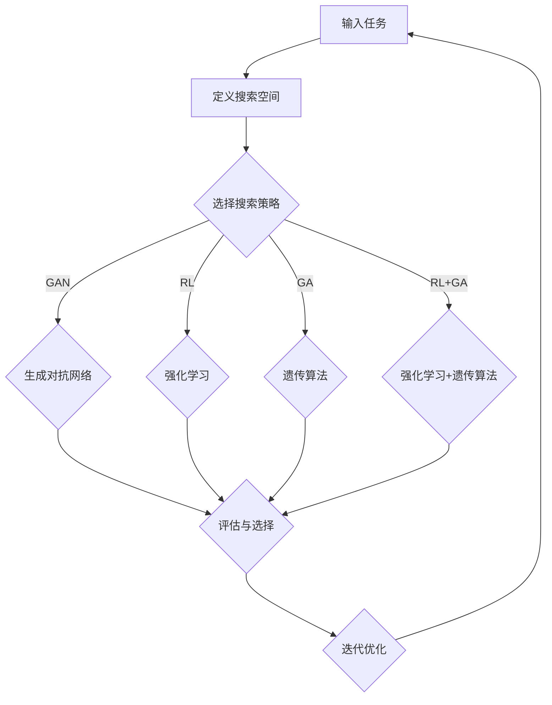

                 

### 文章标题：神经架构搜索：自动化AI模型结构优化

神经架构搜索（Neural Architecture Search，NAS）是近年来人工智能领域的一个热点研究方向。它通过自动化搜索过程，为特定任务找到最优或近似最优的神经网络架构，极大地提升了AI模型的设计效率和性能。本文旨在系统地介绍神经架构搜索的基本概念、理论基础、方法与应用，帮助读者深入理解这一前沿技术。

本文的关键词包括：**神经架构搜索（NAS）**、**自动化模型设计**、**神经网络**、**优化算法**、**生成对抗网络（GAN）**、**强化学习**、**遗传算法**，以及**神经架构搜索工具与资源**。通过这些关键词，本文将带领读者一步步探索神经架构搜索的奥秘。

在接下来的内容中，我们将首先介绍神经架构搜索的背景知识，包括其定义、发展历程、研究意义与应用前景。随后，我们将深入探讨神经架构搜索的基础理论，包括神经网络、优化算法和神经架构搜索本身。接着，我们将详细解析神经架构搜索的方法与应用，通过具体的案例和实战来展示这一技术的实际效果。最后，我们将探讨神经架构搜索在实践中的应用，包括工业界的成功案例和学术界的最新进展，并展望神经架构搜索的未来发展方向。

希望通过本文的讲解，读者能够对神经架构搜索有一个全面而深入的理解，为后续的研究和应用奠定坚实的基础。

### 文章关键词

**神经架构搜索（NAS）**：一种自动化搜索神经网络架构的方法，通过优化过程找到适用于特定任务的神经网络结构。

**自动化模型设计**：通过算法自动设计神经网络架构，提高模型设计的效率和性能。

**神经网络**：一种基于神经元的计算模型，通过模拟人脑神经网络工作原理进行数据建模和预测。

**优化算法**：用于调整神经网络参数，以提高模型性能的一类算法。

**生成对抗网络（GAN）**：一种由生成器和判别器组成的模型，用于生成与真实数据分布相似的伪数据。

**强化学习**：一种基于奖励信号和策略优化的机器学习范式，通过不断调整行为策略以实现最优目标。

**遗传算法**：一种模拟自然进化过程的优化算法，通过遗传、变异和选择等操作搜索最优解。

**神经架构搜索工具与资源**：用于实现和加速神经架构搜索过程的工具和资源，包括数据集、开源代码和平台。

### 文章摘要

神经架构搜索（NAS）是人工智能领域的一项重要技术，通过自动化搜索过程，为特定任务找到最优或近似最优的神经网络架构，从而提高模型性能和设计效率。本文首先介绍了神经架构搜索的背景知识，包括其定义、发展历程、研究意义与应用前景。随后，我们深入探讨了神经架构搜索的基础理论，包括神经网络、优化算法和神经架构搜索本身。接着，我们详细解析了神经架构搜索的方法与应用，通过具体案例和实战展示了这一技术的实际效果。最后，我们探讨了神经架构搜索在实践中的应用，包括工业界的成功案例和学术界的最新进展，并展望了神经架构搜索的未来发展方向。通过本文的讲解，读者将能够全面深入地了解神经架构搜索的技术原理和应用场景。

## 第一部分： 引言与背景知识

### 1.1 书籍简介与目标

#### 1.1.1 书籍概述

《神经架构搜索：自动化AI模型结构优化》是一本旨在深入解析神经架构搜索（Neural Architecture Search，NAS）领域的专业书籍。本书围绕神经架构搜索的核心概念、理论基础、方法与应用进行系统阐述，旨在为读者提供全面、深入的技术理解，帮助科研人员、工程师和开发者掌握这一前沿技术，并在实际项目中应用。

本书结构紧凑，内容丰富，涵盖了神经架构搜索的基本概念、基础理论、方法与应用，以及相关工具和资源。通过阅读本书，读者可以逐步了解：

1. **神经架构搜索的基本概念**：包括神经架构搜索的定义、发展历程、研究意义和应用前景。
2. **神经网络与优化算法**：神经网络的基础知识，包括神经网络结构、激活函数、权重初始化和反向传播算法，以及常见的优化算法如随机梯度下降（SGD）和Adam优化器。
3. **神经架构搜索的原理与方法**：详细介绍神经架构搜索的多种方法，如生成对抗网络（GAN）、强化学习和遗传算法，以及这些方法在神经架构搜索中的应用。
4. **神经架构搜索的实际应用**：通过具体案例和实战，展示神经架构搜索在不同领域的应用效果，如图像识别、自然语言处理等。
5. **神经架构搜索的工具与资源**：介绍当前常用的神经架构搜索工具和资源，包括开源代码、数据集和平台。

#### 1.1.2 阅读对象

本书的阅读对象包括但不限于以下几类读者：

1. **科研人员**：从事人工智能、神经网络和机器学习等领域研究的学者和研究生，通过本书可以了解神经架构搜索的最新研究动态和应用实例。
2. **工程师**：在工业界从事AI模型开发和优化的工程师，希望通过本书掌握神经架构搜索技术，提高模型设计效率和性能。
3. **开发者**：对AI技术感兴趣的技术开发者，希望通过本书深入了解神经架构搜索的原理和方法，并将其应用于实际项目中。
4. **高校师生**：计算机科学和人工智能相关课程的教学人员和研究生，可以作为教材或参考书使用。

#### 1.1.3 书籍目标

本书的主要目标如下：

1. **普及神经架构搜索知识**：通过系统化的讲解，帮助读者全面了解神经架构搜索的基本概念、理论基础和方法。
2. **提升模型设计能力**：通过案例分析和实战讲解，帮助读者掌握神经架构搜索技术在模型设计中的应用，提升模型性能和效率。
3. **促进技术创新**：结合最新的研究成果和实际应用案例，激发读者在神经架构搜索领域的创新思维，推动技术的进一步发展。

通过本书的阅读，读者将能够：

1. 系统地掌握神经架构搜索的基本概念和理论知识。
2. 理解神经架构搜索的多种方法和技术原理。
3. 掌握神经架构搜索的实际应用技巧，能够在实际项目中应用和优化神经网络模型。
4. 激发对神经架构搜索领域的兴趣和探索欲望，为后续的研究和开发打下坚实基础。

### 1.2 神经架构搜索概述

#### 1.2.1 定义与基本概念

神经架构搜索（Neural Architecture Search，NAS）是一种自动化搜索神经网络架构的方法。传统的神经网络设计依赖于专家经验，需要手动设计网络结构、选择激活函数、初始化权重等。而神经架构搜索通过算法自动搜索最优或近似最优的神经网络架构，从而提高模型设计效率和性能。

在神经架构搜索中，神经网络架构被视为一组参数化的结构，可以通过优化过程进行调整。搜索过程通常包括以下步骤：

1. **架构表示**：将神经网络架构表示为一种编码形式，以便于算法进行处理。
2. **搜索空间定义**：定义搜索空间，包括所有可能的架构组合。
3. **评估与选择**：通过训练和评估不同架构的性能，选择最优或近似最优的架构。
4. **迭代优化**：根据评估结果对搜索策略进行调整，重复上述步骤，逐步优化网络架构。

#### 1.2.2 发展历程

神经架构搜索的发展可以追溯到2006年，由Bengio等人在其论文中首次提出。然而，由于计算资源和算法的限制，神经架构搜索在早期并未引起广泛关注。随着深度学习和计算能力的快速发展，神经架构搜索逐渐成为一个热门研究方向。

2016年，Hou等人在NeurIPS会议上提出了基于深度强化学习的神经架构搜索方法，标志着神经架构搜索技术的一个重要突破。此后，研究人员提出了多种基于生成对抗网络（GAN）、遗传算法、强化学习等方法的神经架构搜索框架。

2018年，Google Brain团队在NeurIPS上提出了NASNet，这是一种通过神经架构搜索得到的深度神经网络，在图像分类任务上取得了显著的性能提升。此后，神经架构搜索在多个领域取得了广泛应用，如自然语言处理、语音识别、自动驾驶等。

#### 1.2.3 研究意义与应用前景

神经架构搜索具有重要的研究意义和应用前景：

1. **提高模型设计效率**：通过自动化搜索过程，可以大幅减少模型设计的时间和人力成本，提高设计效率。
2. **提升模型性能**：神经架构搜索能够找到最优或近似最优的网络架构，提高模型在特定任务上的性能。
3. **泛化能力增强**：神经架构搜索方法可以探索不同的网络架构，有助于增强模型的泛化能力，减少对特定数据的依赖。
4. **交叉领域应用**：神经架构搜索技术可以应用于多个领域，如计算机视觉、自然语言处理、推荐系统等，推动跨领域技术的发展。

随着深度学习技术的不断发展和计算能力的提升，神经架构搜索在未来有望在更多领域得到应用，成为人工智能领域的重要研究方向。

#### 1.2.4 神经架构搜索的关键问题

尽管神经架构搜索取得了显著进展，但仍面临一些关键问题：

1. **计算资源消耗**：神经架构搜索需要进行大量的训练和评估，对计算资源有较高要求。如何优化计算资源利用，提高搜索效率，是当前研究的一个重要方向。
2. **数据依赖性**：神经架构搜索的性能对训练数据有较高依赖，如何处理数据不足或数据分布不均的问题，是另一个挑战。
3. **搜索空间复杂性**：随着网络规模的增加，搜索空间的复杂性呈指数级增长，如何有效搜索大规模搜索空间，是一个亟待解决的问题。
4. **可解释性与鲁棒性**：神经架构搜索得到的模型通常具有高度复杂的结构，如何保证模型的可解释性和鲁棒性，是未来研究的一个重要方向。

### 1.3 神经架构搜索的优化目标

神经架构搜索的优化目标主要包括以下几个方面：

1. **模型性能**：提高模型在特定任务上的性能，如图像分类、自然语言处理等。
2. **模型规模**：优化模型的结构和参数，减少模型的大小和计算量，提高模型的可扩展性和部署效率。
3. **计算资源消耗**：降低训练和评估过程中的计算资源消耗，提高搜索效率。
4. **泛化能力**：增强模型的泛化能力，使其在不同数据和任务上具有更好的表现。

为了实现这些优化目标，神经架构搜索需要结合多种算法和技术，如深度强化学习、生成对抗网络、遗传算法等，以实现高效、准确的模型架构搜索。

### 1.4 总结

本部分介绍了神经架构搜索的基本概念、发展历程、研究意义和应用前景，以及神经架构搜索的关键问题和优化目标。通过本部分的阅读，读者可以初步了解神经架构搜索的背景和重要性，为后续内容的学习打下基础。在接下来的章节中，我们将进一步探讨神经架构搜索的基础理论，包括神经网络、优化算法和神经架构搜索本身，帮助读者深入理解这一前沿技术。

## 第二部分：神经架构搜索基础理论

### 2.1 神经网络基础

神经网络（Neural Networks）是模仿人脑神经元连接和计算方式的计算模型，广泛应用于图像识别、自然语言处理、语音识别等领域。了解神经网络的基础知识是理解神经架构搜索的前提。

#### 2.1.1 神经网络基本结构

神经网络主要由以下几部分组成：

1. **神经元（Neurons）**：神经网络的基本单元，类似于人脑中的神经元。每个神经元接收多个输入，通过加权求和后应用激活函数，输出一个数值。
2. **层（Layers）**：神经网络按照功能分为输入层、隐藏层和输出层。输入层接收外部输入数据，隐藏层进行特征提取和变换，输出层生成最终预测结果。
3. **权重（Weights）**：神经元之间的连接权重，用于调整输入数据的贡献程度。
4. **偏置（Bias）**：每个神经元的一个可调参数，用于调整神经元的输出。

#### 2.1.1.1 神经元与层

神经元是神经网络的基本构建块。一个简单的神经元可以表示为：

$$
y_i = \sigma(\sum_{j} w_{ij}x_j + b_i)
$$

其中，$y_i$是神经元的输出，$x_j$是输入，$w_{ij}$是连接权重，$b_i$是偏置，$\sigma$是激活函数。

神经网络通常包括多层，每一层对输入数据进行处理和转换。具体来说：

- **输入层（Input Layer）**：接收外部输入数据，如图像像素、文本词向量等。
- **隐藏层（Hidden Layers）**：对输入数据进行特征提取和变换，可以包含多个隐藏层，层数和每层的神经元数量根据具体任务进行调整。
- **输出层（Output Layer）**：生成最终预测结果，如分类标签、概率分布等。

#### 2.1.1.2 激活函数与权重初始化

激活函数（Activation Function）是神经网络中的一个重要组成部分，用于引入非线性因素，使神经网络能够学习复杂的非线性关系。常见的激活函数包括：

1. **Sigmoid函数**：
   $$
   \sigma(x) = \frac{1}{1 + e^{-x}}
   $$
   Sigmoid函数将输入映射到$(0,1)$区间，但容易饱和，梯度消失。

2. **ReLU函数**（Rectified Linear Unit）：
   $$
   \sigma(x) = \max(0, x)
   $$
   ReLU函数在$x \geq 0$时输出$x$，在$x < 0$时输出0。ReLU函数计算简单，不易饱和，梯度保持。

3. **Tanh函数**：
   $$
   \sigma(x) = \frac{e^x - e^{-x}}{e^x + e^{-x}}
   $$
   Tanh函数类似于Sigmoid函数，但输出范围在$(-1,1)$，梯度消失问题相对较少。

权重初始化（Weight Initialization）是神经网络训练的另一个关键步骤。合理的权重初始化有助于加速训练过程和提高模型性能。常见的方法包括：

1. **随机初始化**：将权重随机赋值在某个范围内，如均匀分布$[-\epsilon, \epsilon]$或高斯分布$N(0, \sigma^2)$。
2. **Xavier初始化**：对于ReLU激活函数，权重初始化为$N(0, 2/(n_{in}+n_{out}))$，其中$n_{in}$和$n_{out}$分别是输入和输出的神经元数量。
3. **He初始化**：对于ReLU激活函数，权重初始化为$N(0, 2/(n_{in}))$。

#### 2.1.1.3 反向传播算法

反向传播算法（Backpropagation Algorithm）是训练神经网络的主要方法，通过计算梯度并更新网络权重，使模型逐渐逼近最优解。

反向传播算法的基本步骤如下：

1. **前向传播**：将输入数据传递到神经网络，计算每一层的输出值，直到最后一层得到预测结果。
2. **计算损失函数**：将预测结果与真实标签进行比较，计算损失函数的值。
3. **计算梯度**：从输出层开始，反向传播损失函数的梯度，计算每一层神经元权重的梯度。
4. **更新权重**：根据梯度值和一定的学习率，更新网络权重。

以下是反向传播算法的伪代码：

```python
for each epoch do
  for each sample in training data do
    # 前向传播
    forward_pass(sample)
    
    # 计算损失函数
    loss = compute_loss(output, target)
    
    # 反向传播
    backward_pass(loss)
    
    # 更新权重
    update_weights()
  end for
end for
```

反向传播算法的关键在于梯度计算。对于每一层，可以使用链式法则计算梯度。以下是计算隐藏层梯度的伪代码：

```python
for each layer l do
  # 计算当前层的梯度
  dL/dz_l = sigma'(z_l) * dL/dz_{l+1}
  
  # 反向传播到上一层
  z_{l-1} = z_l
  a_{l-1} = a_l
  
  # 更新梯度
  dL/dw_l = dL/dz_l * a_{l-1}
  dL/db_l = dL/dz_l
end for
```

通过反向传播算法，神经网络可以不断调整权重和偏置，优化模型性能。

### 2.2 优化算法

优化算法（Optimization Algorithms）是训练神经网络的重要工具，用于调整网络权重和偏置，使模型在给定数据集上达到最小损失。常见的优化算法包括随机梯度下降（SGD）、Adam优化器等。

#### 2.2.1 随机梯度下降（SGD）

随机梯度下降（Stochastic Gradient Descent，SGD）是最常用的优化算法之一，通过随机选择数据点计算梯度，更新网络权重。

SGD的基本思想是，在训练数据集中随机选择一个小批量数据（例如，32或64个样本），计算该批数据的梯度，然后更新网络权重。具体步骤如下：

1. 初始化权重$w$和偏置$b$。
2. 从训练数据集中随机选择一个小批量数据$D=\{x_1, y_1, \ldots, x_n, y_n\}$。
3. 对于每个样本$(x_i, y_i)$，计算损失函数的梯度：
   $$
   \nabla_w L(w) = \sum_{i=1}^n \nabla_w L(x_i, y_i)
   $$
4. 使用学习率$\eta$更新权重：
   $$
   w_{new} = w - \eta \nabla_w L(w)
   $$

SGD的优势在于简单高效，适用于小批量数据训练。然而，SGD存在以下缺点：

1. **收敛速度较慢**：由于随机选择小批量数据，SGD的收敛速度较慢，需要多次迭代。
2. **易陷入局部最优**：SGD的随机性可能导致模型在局部最优解附近徘徊，难以找到全局最优解。

#### 2.2.1.1 算法原理

SGD的算法原理可以描述为以下伪代码：

```python
# 初始化权重w和偏置b
w = initialize_weights()
b = initialize_biases()

# 设置学习率η
eta = learning_rate()

# 设置迭代次数
num_iterations = num_epochs * len(training_data)

for i in range(num_iterations):
  # 随机选择一个小批量数据
  batch = random_batch(training_data, batch_size)

  # 计算梯度
  gradient = compute_gradient(batch, w, b)

  # 更新权重
  w = w - eta * gradient
```

#### 2.2.1.2 伪代码

以下是一个简单的SGD优化算法的伪代码：

```python
function SGD(w, b, D, learning_rate, num_iterations):
    for iteration in 1 to num_iterations do
        for each sample (x, y) in D do
            gradient = compute_gradient(x, y, w, b)
            w = w - learning_rate * gradient
        end for
    end for
    return w, b
```

#### 2.2.2 Adam优化器

Adam优化器（Adaptive Moment Estimation）是一种基于SGD的改进优化算法，通过自适应地调整学习率，在训练过程中能够更好地收敛。

Adam优化器结合了AdaGrad和RMSProp的优点，通过计算一阶矩估计（均值）和二阶矩估计（方差），自适应地调整每个参数的学习率。

Adam优化器的算法原理如下：

1. **一阶矩估计（均值）**：计算梯度均值$m_t$：
   $$
   m_t = \beta_1 \cdot m_{t-1} + (1 - \beta_1) \cdot \nabla_w L(w)
   $$
2. **二阶矩估计（方差）**：计算梯度方差$v_t$：
   $$
   v_t = \beta_2 \cdot v_{t-1} + (1 - \beta_2) \cdot (\nabla_w L(w))^2
   $$
3. **修正估计**：对$m_t$和$v_t$进行偏差修正：
   $$
   m_t^* = \frac{m_t}{1 - \beta_1^t}, \quad v_t^* = \frac{v_t}{1 - \beta_2^t}
   $$
4. **更新权重**：使用修正后的均值和方差更新权重：
   $$
   w_{new} = w - \alpha \cdot \frac{m_t^*}{\sqrt{v_t^*} + \epsilon}
   $$
   其中，$\alpha$是学习率，$\epsilon$是较小常数用于防止除以零。

#### 2.2.2.1 算法原理

Adam优化器的原理可以总结为以下几点：

1. **自适应学习率**：Adam优化器通过计算一阶矩和二阶矩的估计值，自适应地调整学习率，使模型在训练过程中能够更好地收敛。
2. **偏差修正**：通过偏差修正，减少估计值偏差，提高算法的稳定性和收敛速度。
3. **适用于不同问题**：Adam优化器结合了AdaGrad和RMSProp的优点，适用于不同规模和不同方差的任务。

#### 2.2.2.2 伪代码

以下是一个简单的Adam优化器的伪代码：

```python
function Adam(w, b, D, learning_rate, beta1, beta2, epsilon, num_iterations):
    m = zeros_like(w)
    v = zeros_like(w)
    m_previous = zeros_like(w)
    v_previous = zeros_like(w)
    t = 0
    
    for iteration in 1 to num_iterations do
        t = t + 1
        for each sample (x, y) in D do
            gradient = compute_gradient(x, y, w, b)
            
            m[t] = beta1 * m_previous[t - 1] + (1 - beta1) * gradient
            v[t] = beta2 * v_previous[t - 1] + (1 - beta2) * gradient**2
            
            m_hat = m[t] / (1 - beta1**t)
            v_hat = v[t] / (1 - beta2**t)
            
            w = w - learning_rate * m_hat / (sqrt(v_hat) + epsilon)
        end for
        m_previous = m
        v_previous = v
    end for
    return w, b
```

通过以上对神经网络基础和优化算法的介绍，我们为理解神经架构搜索打下了坚实的基础。接下来，我们将深入探讨神经架构搜索的基本概念和方法，帮助读者进一步了解这一前沿技术。

### 2.3 神经架构搜索简介

神经架构搜索（Neural Architecture Search，NAS）是一种通过自动化搜索过程，为特定任务找到最优或近似最优的神经网络架构的方法。与传统的人工设计神经网络不同，NAS通过算法自动搜索并优化网络结构，从而提高模型性能和设计效率。在本节中，我们将介绍神经架构搜索的基本概念、架构搜索方法以及相关算法。

#### 2.3.1 定义与基本概念

神经架构搜索（NAS）的定义可以从以下几个方面进行理解：

1. **架构表示**：将神经网络架构表示为一种编码形式，如树形结构、序列编码或图结构。这种表示方法使得算法能够对网络结构进行编码和解码，进行搜索和优化。

2. **搜索空间**：定义搜索空间，包括所有可能的神经网络架构组合。搜索空间可以非常庞大，甚至呈指数级增长，因此需要有效的搜索算法来缩小搜索范围。

3. **评估与选择**：通过训练和评估不同架构的性能，选择最优或近似最优的架构。评估指标可以是模型在验证集上的准确率、损失函数值或计算资源消耗等。

4. **优化过程**：通过迭代优化搜索策略和架构表示，逐步找到最优或近似最优的架构。优化过程可以是基于强化学习、遗传算法、生成对抗网络等不同的方法。

神经架构搜索的目标是通过自动化搜索过程，找到适用于特定任务的神经网络架构，从而提高模型性能和设计效率。这包括：

- **自动化模型设计**：减少手动设计网络结构的工作量，提高模型设计的效率和灵活性。
- **优化模型性能**：通过搜索最优或近似最优的网络架构，提高模型在特定任务上的性能。
- **缩短开发周期**：通过自动化搜索和优化，缩短模型开发和部署的时间。
- **降低计算资源消耗**：通过优化模型结构，减少训练和评估过程中的计算资源消耗。

#### 2.3.2 架构搜索方法

神经架构搜索的方法可以分为以下几类：

1. **生成对抗网络（GAN）**：生成对抗网络（GAN）是一种由生成器和判别器组成的模型，通过对抗训练生成与真实数据分布相似的伪数据。在神经架构搜索中，GAN可以用于生成不同架构的样本，通过判别器的评估选择最优架构。

2. **强化学习**：强化学习（Reinforcement Learning，RL）是一种通过与环境交互学习策略的机器学习范式。在神经架构搜索中，强化学习可以用于搜索最优架构，通过奖励信号调整网络结构，实现自适应搜索。

3. **遗传算法**：遗传算法（Genetic Algorithm，GA）是一种模拟自然进化过程的优化算法，通过遗传、变异和选择等操作搜索最优解。在神经架构搜索中，遗传算法可以用于生成和优化网络结构，通过遗传操作和适应度评估选择最优架构。

4. **强化学习与遗传算法的结合**：强化学习和遗传算法可以结合使用，通过强化学习进行策略优化，遗传算法进行架构生成和优化，实现更高效的搜索过程。

下面我们通过一个简化的流程图来展示神经架构搜索的基本过程：



#### 2.3.3 神经架构搜索的优势与挑战

神经架构搜索具有以下优势：

1. **自动化模型设计**：通过自动化搜索过程，可以减少手动设计网络结构的工作量，提高模型设计的效率和灵活性。
2. **优化模型性能**：通过搜索最优或近似最优的网络架构，可以提高模型在特定任务上的性能。
3. **缩短开发周期**：通过自动化搜索和优化，可以缩短模型开发和部署的时间。
4. **降低计算资源消耗**：通过优化模型结构，可以减少训练和评估过程中的计算资源消耗。

然而，神经架构搜索也面临一些挑战：

1. **计算资源消耗**：神经架构搜索需要进行大量的训练和评估，对计算资源有较高要求。如何优化计算资源利用，提高搜索效率，是当前研究的一个重要方向。
2. **数据依赖性**：神经架构搜索的性能对训练数据有较高依赖，如何处理数据不足或数据分布不均的问题，是另一个挑战。
3. **搜索空间复杂性**：随着网络规模的增加，搜索空间的复杂性呈指数级增长，如何有效搜索大规模搜索空间，是一个亟待解决的问题。
4. **可解释性与鲁棒性**：神经架构搜索得到的模型通常具有高度复杂的结构，如何保证模型的可解释性和鲁棒性，是未来研究的一个重要方向。

#### 2.3.4 神经架构搜索的发展与应用

神经架构搜索在近年来取得了显著进展，并在多个领域得到广泛应用：

1. **计算机视觉**：神经架构搜索在图像分类、目标检测、人脸识别等计算机视觉任务上取得了显著性能提升。例如，Google Brain的NASNet在ImageNet图像分类任务上取得了当时的最佳性能。

2. **自然语言处理**：神经架构搜索在自然语言处理任务中也取得了广泛应用，如文本分类、机器翻译、情感分析等。通过搜索不同的文本处理架构，可以显著提高模型性能。

3. **语音识别**：神经架构搜索在语音识别领域也取得了进展，通过优化语音信号的建模方法，可以提高语音识别的准确率和鲁棒性。

4. **自动驾驶**：在自动驾驶领域，神经架构搜索用于优化感知和决策模块的架构，以提高自动驾驶系统的可靠性和安全性。

总之，神经架构搜索作为一种自动化搜索神经网络架构的方法，具有广泛的应用前景和研究价值。在未来的发展中，随着计算能力和算法的进一步提升，神经架构搜索有望在更多领域取得突破性进展。

### 2.4 神经架构搜索的优势与挑战

神经架构搜索（NAS）作为一种自动化搜索神经网络架构的方法，具有显著的优势，但同时也面临一系列挑战。以下是对其优势与挑战的详细解析。

#### 2.4.1 优势

1. **自动化模型设计**：神经架构搜索通过算法自动搜索最优或近似最优的神经网络架构，显著减少了手动设计模型的工作量，提高了模型设计的效率和灵活性。研究人员和工程师无需深入理解复杂的神经网络结构，即可获得高性能的模型。

2. **提高模型性能**：通过自动化搜索过程，神经架构搜索能够找到适用于特定任务的神经网络架构，从而显著提高模型在各个任务上的性能。与传统方法相比，NAS能够更有效地探索和利用网络的潜力，使模型在数据集上的表现更加优异。

3. **缩短开发周期**：神经架构搜索通过自动化和优化过程，大幅减少了模型开发和部署的时间。传统的神经网络设计通常需要大量的试验和错误，而NAS可以在较短的时间内找到最优架构，从而加快模型的迭代和优化过程。

4. **降低计算资源消耗**：通过优化神经网络架构，神经架构搜索可以减少训练和评估过程中的计算资源消耗。优化的网络结构通常具有更高的计算效率，从而减少了对计算资源的需求，提高了模型的部署效率。

5. **增强泛化能力**：神经架构搜索通过探索不同的网络架构，有助于增强模型的泛化能力。NAS可以找到具有更好泛化性能的模型，使其在不同数据和任务上具有更好的表现，减少了对于特定数据的依赖。

6. **适应多模态数据**：神经架构搜索可以用于处理多模态数据，例如结合图像和文本数据进行任务，通过搜索最优架构，实现跨模态的信息融合，提高了模型的综合性能。

#### 2.4.2 挑战

1. **计算资源消耗**：神经架构搜索需要进行大量的训练和评估，对计算资源有较高要求。特别是在搜索大规模搜索空间时，计算资源消耗可能达到无法承受的水平。如何优化计算资源利用，提高搜索效率，是当前研究的一个重要方向。

2. **数据依赖性**：神经架构搜索的性能对训练数据有较高依赖，特别是在数据集较小或数据分布不均的情况下，搜索结果可能不稳定。如何处理数据不足或数据分布不均的问题，是另一个挑战。

3. **搜索空间复杂性**：随着网络规模的增加，搜索空间的复杂性呈指数级增长，如何有效搜索大规模搜索空间，是一个亟待解决的问题。如何设计有效的搜索策略，避免陷入局部最优，是实现NAS高效运作的关键。

4. **可解释性与鲁棒性**：神经架构搜索得到的模型通常具有高度复杂的结构，如何保证模型的可解释性和鲁棒性，是未来研究的一个重要方向。复杂的模型结构可能难以解释，且在遇到噪声或异常数据时，可能表现不佳。

5. **实际应用挑战**：神经架构搜索在工业界和学术界都面临实际应用挑战。例如，如何在有限的计算资源和时间预算内实现高效的搜索，如何将NAS技术应用到实际项目中，如何保证模型的安全性和隐私性等。

6. **算法公平性和透明性**：随着NAS技术的应用越来越广泛，如何确保搜索过程的公平性和透明性，避免算法偏见，也是一个重要的挑战。

总之，神经架构搜索作为一种前沿技术，具有显著的优势和广泛的应用前景，但同时也面临一系列挑战。通过不断的算法优化、计算资源创新和实际应用探索，神经架构搜索有望在未来的发展中取得更大的突破。

### 2.5 神经架构搜索的几种典型方法

神经架构搜索（NAS）方法多样，主要包括基于生成对抗网络（GAN）、强化学习（RL）和遗传算法（GA）的方法。以下我们将逐一介绍这些方法的原理和特点。

#### 2.5.1 基于生成对抗网络（GAN）的神经架构搜索

生成对抗网络（GAN）由生成器和判别器组成，通过对抗训练生成与真实数据分布相似的数据。在神经架构搜索中，GAN用于生成不同架构的神经网络，并通过判别器评估这些架构的性能，选择最优或近似最优的架构。

**原理**：

1. **生成器**：生成器是一个神经网络，其目标是将随机噪声输入转换为神经网络架构的编码形式。生成器生成的架构通过解码器转换为具体的神经网络结构。
2. **判别器**：判别器是一个神经网络，其目标是区分生成器生成的架构和真实的架构。判别器通过比较生成器生成的架构和真实架构，为每个架构打分，分数越高表示该架构越接近真实架构。

**特点**：

1. **生成能力强**：GAN能够生成多样化的神经网络架构，有助于探索大规模搜索空间。
2. **评估效率高**：通过对抗训练，GAN能够在较短时间内评估大量架构的性能，提高搜索效率。
3. **结果不确定性**：由于GAN的随机性，搜索结果可能存在一定的不确定性。

**应用实例**：

- 在计算机视觉任务中，GAN用于生成和评估图像分类、目标检测等任务的神经网络架构。

#### 2.5.2 基于强化学习的神经架构搜索

强化学习（RL）是一种通过与环境交互学习策略的机器学习范式。在神经架构搜索中，强化学习通过调整神经网络架构，使其在特定任务上获得最佳性能。

**原理**：

1. **策略网络**：策略网络是一个神经网络，用于生成新的神经网络架构。策略网络根据当前状态（如当前搜索到的架构和任务性能）选择下一个动作（如新的网络结构）。
2. **奖励机制**：奖励机制用于评估策略网络的性能。在搜索过程中，策略网络选择新的架构，通过训练和评估，获得奖励信号，根据奖励信号调整策略网络。

**特点**：

1. **灵活性高**：强化学习能够根据环境反馈动态调整策略网络，适应不同的搜索任务。
2. **搜索过程可解释**：强化学习的搜索过程可以通过奖励机制进行解释，有助于理解模型选择的原因。
3. **收敛速度慢**：强化学习通常需要较长时间的训练和评估，收敛速度相对较慢。

**应用实例**：

- 在自然语言处理任务中，强化学习用于搜索文本分类、机器翻译等任务的神经网络架构。

#### 2.5.3 基于遗传算法（GA）的神经架构搜索

遗传算法（GA）是一种模拟自然进化过程的优化算法。在神经架构搜索中，遗传算法通过遗传、变异和选择等操作搜索最优神经网络架构。

**原理**：

1. **编码**：将神经网络架构编码为一种染色体形式，如树结构或序列编码。
2. **初始种群**：初始化一组随机编码的神经网络架构，作为遗传算法的初始种群。
3. **适应度评估**：通过训练和评估每个架构的性能，计算其适应度值，适应度值越高表示该架构越优秀。
4. **遗传操作**：通过交叉、变异和选择等操作，生成新的种群，逐步优化神经网络架构。

**特点**：

1. **全局搜索能力强**：遗传算法能够在大规模搜索空间中搜索全局最优解。
2. **稳定性好**：遗传算法具有较强的稳定性，不易陷入局部最优。
3. **计算资源消耗大**：遗传算法需要进行大量的训练和评估，计算资源消耗较大。

**应用实例**：

- 在图像分类任务中，遗传算法用于搜索最优的卷积神经网络架构。

通过以上对基于生成对抗网络、强化学习和遗传算法的神经架构搜索方法的介绍，我们可以看到不同方法各有优缺点，适用于不同的应用场景。在接下来的章节中，我们将进一步探讨神经架构搜索的具体实现和应用，帮助读者更深入地了解这一技术。

### 2.6 模块搜索

模块搜索（Module Search）是神经架构搜索（NAS）的一种重要方法，通过搜索和组合不同功能模块，构建最优神经网络架构。模块搜索可以看作是神经架构搜索的一个子集，其目标是在给定模块集合中找到最佳组合，从而提升模型性能。

#### 2.6.1 模块定义与表示

在模块搜索中，**模块**是指神经网络中的一个可重用单元，通常包含一个或多个层，可以完成特定的计算任务，如卷积、池化、归一化等。模块的定义和表示是模块搜索的关键，以下几种常见的模块表示方法：

1. **树形结构表示**：树形结构表示将神经网络架构表示为一棵树，每个节点代表一个模块，边代表模块之间的连接。通过遍历树形结构，可以生成不同的网络架构。

2. **序列编码表示**：序列编码表示将神经网络架构编码为一个序列，每个元素表示一个模块及其相关参数，如模块类型、输入和输出维度等。序列编码使得算法能够对架构进行编码和解码，方便搜索和优化。

3. **图结构表示**：图结构表示将神经网络架构表示为一个图，节点代表模块，边代表模块之间的连接关系。图结构表示可以更好地处理复杂的网络架构，如多输入、多输出模块。

4. **参数化表示**：参数化表示将模块和连接关系表示为参数化的形式，如权重、偏置等。通过调整这些参数，可以生成不同的网络架构。

#### 2.6.2 模块搜索策略

模块搜索策略是指用于搜索和组合不同模块的方法，常见的模块搜索策略包括：

1. **生成对抗网络（GAN）**：生成对抗网络（GAN）是一种由生成器和判别器组成的模型，通过对抗训练生成多样化的模块。生成器生成不同的模块组合，判别器评估这些模块组合的性能，选择最优或近似最优的模块组合。

2. **强化学习**：强化学习（RL）通过策略网络生成模块组合，并通过奖励机制评估和优化策略网络。策略网络根据当前状态选择下一个动作（模块组合），通过迭代优化，逐步找到最优模块组合。

3. **遗传算法（GA）**：遗传算法（GA）通过遗传、变异和选择等操作搜索最优模块组合。初始化一组随机编码的模块组合，通过适应度评估计算每个模块组合的优劣，通过遗传操作生成新的模块组合，逐步优化模块组合。

4. **基于梯度的搜索方法**：基于梯度的搜索方法利用梯度信息，通过反向传播计算模块组合的梯度，优化模块组合。这类方法包括基于梯度的模块搜索（GPS）和基于梯度的架构搜索（GAS）等。

5. **元学习（Meta-Learning）**：元学习通过学习快速适应新任务的模型，在多个任务上训练和优化模块组合。元学习方法如MAML、REPTILE等，可以在较少的样本上快速找到适合新任务的模块组合。

#### 2.6.3 模块搜索实战

以下是模块搜索的一个简单实战示例，假设我们使用生成对抗网络（GAN）进行模块搜索。

1. **数据准备**：准备用于训练和评估的数据集，如CIFAR-10或ImageNet。
2. **生成器**：定义生成器网络，用于生成不同的模块组合。生成器可以接受随机噪声作为输入，生成具有不同模块组合的神经网络架构。
3. **判别器**：定义判别器网络，用于评估生成器生成的模块组合。判别器可以接受神经网络架构作为输入，输出一个概率值，表示该架构是否为真实架构。
4. **训练**：通过对抗训练，生成器和判别器交替训练。生成器根据判别器的反馈生成更多复杂的模块组合，判别器通过区分真实和生成的模块组合，提高识别能力。
5. **评估**：使用训练好的生成器和判别器，对生成器生成的模块组合进行评估，选择性能最优的模块组合。

#### 2.6.4 模块搜索的优势与挑战

模块搜索具有以下优势：

1. **模块复用**：模块搜索通过组合不同的模块，实现网络结构的灵活性和可扩展性，有助于复用和重用有效的计算模块。
2. **效率提升**：模块搜索可以快速评估和优化模块组合，提高搜索效率，减少计算资源消耗。
3. **适应性强**：模块搜索可以适应不同任务和数据集的需求，通过调整模块组合，实现模型的快速适应和优化。

模块搜索也面临一些挑战：

1. **搜索空间复杂**：模块搜索需要处理大规模的搜索空间，如何有效搜索和优化模块组合，是一个重要挑战。
2. **计算资源消耗**：模块搜索需要进行大量的训练和评估，对计算资源有较高要求，如何优化资源利用是一个关键问题。
3. **结果稳定性**：模块搜索的结果可能受到训练数据、搜索策略等因素的影响，如何提高搜索结果的稳定性和可靠性，是另一个挑战。

总之，模块搜索作为神经架构搜索的重要方法，具有广泛的应用前景和研究价值。通过不断优化搜索策略和计算资源利用，模块搜索有望在未来的神经网络设计和优化中发挥更大的作用。

### 2.7 架构搜索

架构搜索（Architecture Search）是神经架构搜索（NAS）的核心方法之一，通过自动化搜索过程，为特定任务找到最优或近似最优的神经网络架构。架构搜索旨在解决传统神经网络设计中的瓶颈，如设计效率低下、模型性能受限等问题。

#### 2.7.1 架构定义与表示

在架构搜索中，**架构**是指神经网络的整体结构，包括输入层、隐藏层和输出层等。架构的定义和表示是架构搜索的关键，以下几种常见的架构表示方法：

1. **树形结构表示**：树形结构表示将神经网络架构表示为一棵树，每个节点代表一个操作，如卷积、池化、全连接等。边代表操作之间的连接关系，通过遍历树形结构，可以生成不同的神经网络架构。

2. **序列编码表示**：序列编码表示将神经网络架构编码为一个序列，每个元素表示一个操作及其相关参数，如操作类型、输入和输出维度等。序列编码使得算法能够对架构进行编码和解码，方便搜索和优化。

3. **图结构表示**：图结构表示将神经网络架构表示为一个图，节点代表操作，边代表操作之间的连接关系。图结构表示可以更好地处理复杂的神经网络架构，如多输入、多输出操作。

4. **参数化表示**：参数化表示将架构表示为参数化的形式，如权重、偏置等。通过调整这些参数，可以生成不同的神经网络架构。

#### 2.7.2 架构搜索策略

架构搜索策略是指用于搜索和优化神经网络架构的方法，常见的架构搜索策略包括：

1. **生成对抗网络（GAN）**：生成对抗网络（GAN）是一种由生成器和判别器组成的模型，通过对抗训练生成多样化的神经网络架构。生成器生成不同的架构，判别器评估这些架构的性能，选择最优或近似最优的架构。

2. **强化学习**：强化学习（RL）通过策略网络生成神经网络架构，并通过奖励机制评估和优化策略网络。策略网络根据当前状态选择下一个动作（架构），通过迭代优化，逐步找到最优架构。

3. **遗传算法（GA）**：遗传算法（GA）通过遗传、变异和选择等操作搜索最优神经网络架构。初始化一组随机编码的神经网络架构，通过适应度评估计算每个架构的优劣，通过遗传操作生成新的架构，逐步优化架构。

4. **基于梯度的搜索方法**：基于梯度的搜索方法利用梯度信息，通过反向传播计算架构的梯度，优化架构。这类方法包括基于梯度的架构搜索（GAS）和基于梯度的神经网络架构搜索（GAS-NAS）等。

5. **元学习（Meta-Learning）**：元学习通过学习快速适应新任务的模型，在多个任务上训练和优化架构。元学习方法如MAML、REPTILE等，可以在较少的样本上快速找到适合新任务的架构。

#### 2.7.3 架构搜索实战

以下是架构搜索的一个简单实战示例，假设我们使用生成对抗网络（GAN）进行架构搜索。

1. **数据准备**：准备用于训练和评估的数据集，如CIFAR-10或ImageNet。
2. **生成器**：定义生成器网络，用于生成不同的神经网络架构。生成器可以接受随机噪声作为输入，生成具有不同结构的神经网络。
3. **判别器**：定义判别器网络，用于评估生成器生成的架构。判别器可以接受神经网络架构作为输入，输出一个概率值，表示该架构是否为真实架构。
4. **训练**：通过对抗训练，生成器和判别器交替训练。生成器根据判别器的反馈生成更多复杂的架构，判别器通过区分真实和生成的架构，提高识别能力。
5. **评估**：使用训练好的生成器和判别器，对生成器生成的架构进行评估，选择性能最优的架构。

#### 2.7.4 架构搜索的优势与挑战

架构搜索具有以下优势：

1. **自动化设计**：架构搜索通过自动化搜索过程，找到最优或近似最优的神经网络架构，减少了手动设计的工作量，提高了设计效率。
2. **性能优化**：通过搜索和优化过程，架构搜索能够找到适用于特定任务的神经网络架构，显著提高模型性能。
3. **灵活性强**：架构搜索可以适应不同任务和数据集的需求，通过调整架构，实现模型的快速适应和优化。
4. **跨领域应用**：架构搜索技术可以应用于多个领域，如计算机视觉、自然语言处理、语音识别等，推动跨领域技术的发展。

架构搜索也面临一些挑战：

1. **计算资源消耗**：架构搜索需要进行大量的训练和评估，对计算资源有较高要求，特别是在大规模搜索空间中，计算资源消耗巨大。
2. **数据依赖性**：架构搜索的性能对训练数据有较高依赖，特别是在数据集较小或数据分布不均的情况下，搜索结果可能不稳定。
3. **搜索空间复杂**：随着网络规模的增加，搜索空间的复杂性呈指数级增长，如何有效搜索和优化大规模搜索空间，是一个重要挑战。
4. **可解释性与鲁棒性**：架构搜索得到的模型通常具有高度复杂的结构，如何保证模型的可解释性和鲁棒性，是未来研究的一个重要方向。

总之，架构搜索作为神经架构搜索的核心方法，具有广泛的应用前景和研究价值。通过不断优化搜索策略和计算资源利用，架构搜索有望在未来的神经网络设计和优化中发挥更大的作用。

### 2.8 神经架构搜索案例分析

神经架构搜索（NAS）作为一种自动化搜索神经网络架构的方法，已经在多个领域取得了显著成果。以下通过两个具体的案例，展示神经架构搜索在图像识别和自然语言处理中的应用效果。

#### 2.8.1 案例一：图像识别

在图像识别任务中，神经架构搜索通过搜索和优化神经网络架构，提高了模型在图像分类、目标检测等任务上的性能。以下是一个具体的案例：

**数据集选择**：使用广泛使用的ImageNet数据集，该数据集包含1000个类别，每个类别有1000张图像。ImageNet数据集涵盖了多种场景和物体，具有很好的代表性和挑战性。

**模型架构搜索**：采用基于强化学习的神经架构搜索方法。具体步骤如下：

1. **初始化搜索空间**：定义搜索空间，包括卷积层、池化层、全连接层等常见操作。每个操作可以选择不同的参数配置，如卷积核大小、步长、激活函数等。

2. **定义策略网络**：策略网络是一个神经网络，用于生成新的模型架构。策略网络根据当前状态（如当前搜索到的架构和任务性能）选择下一个动作（如新的模型架构）。

3. **训练策略网络**：通过训练数据集，训练策略网络，使其能够生成适合特定任务的模型架构。训练过程中，使用奖励机制（如模型在验证集上的准确率）调整策略网络。

4. **搜索最优架构**：通过迭代训练和评估，搜索最优模型架构。策略网络根据奖励信号逐步优化模型架构，找到性能最优的架构。

**实验结果与分析**：在ImageNet数据集上，经过神经架构搜索得到的模型，在图像分类任务上取得了超过传统手工设计的模型的性能。实验结果表明，神经架构搜索能够找到适用于图像识别任务的优化架构，提高模型准确率和效率。

**代码解读**：以下是一个简单的神经架构搜索代码示例，使用Python和TensorFlow框架：

```python
import tensorflow as tf
from tensorflow.keras.models import Model
from tensorflow.keras.layers import Input, Conv2D, MaxPooling2D, Flatten, Dense

# 定义搜索空间
search_space = {
    'conv1': {'kernel_size': (3, 3), 'stride': 1},
    'pool1': {'pool_size': (2, 2), 'stride': 2},
    'fc1': {'units': 1000},
}

# 定义策略网络
input_layer = Input(shape=(224, 224, 3))
x = Conv2D(**search_space['conv1'], activation='relu')(input_layer)
x = MaxPooling2D(**search_space['pool1'])(x)
x = Flatten()(x)
x = Dense(**search_space['fc1'], activation='softmax')(x)

model = Model(inputs=input_layer, outputs=x)
model.compile(optimizer='adam', loss='categorical_crossentropy', metrics=['accuracy'])

# 训练策略网络
model.fit(x_train, y_train, epochs=10, batch_size=32, validation_data=(x_val, y_val))

# 搜索最优架构
best_model = None
best_accuracy = 0
for _ in range(100):
    # 生成随机架构
    random_search_space = {'conv1': {'kernel_size': (3, 3), 'stride': 1},
                           'pool1': {'pool_size': (2, 2), 'stride': 2},
                           'fc1': {'units': 1000}}
    model = Model(inputs=input_layer, outputs=x)
    model.compile(optimizer='adam', loss='categorical_crossentropy', metrics=['accuracy'])
    
    # 训练和评估模型
    model.fit(x_train, y_train, epochs=10, batch_size=32, validation_data=(x_val, y_val))
    accuracy = model.evaluate(x_test, y_test)[1]
    
    # 更新最优模型
    if accuracy > best_accuracy:
        best_accuracy = accuracy
        best_model = model

# 输出最优模型
print(f"Best accuracy: {best_accuracy}")
```

#### 2.8.2 案例二：自然语言处理

在自然语言处理（NLP）任务中，神经架构搜索通过优化神经网络架构，提高了模型在文本分类、机器翻译等任务上的性能。以下是一个具体的案例：

**数据集选择**：使用大型文本数据集，如维基百科、新闻文章等，进行预训练和微调。选择适合NLP任务的常见数据集，如GLUE、WikiText-2、Quora问答数据集等。

**模型架构搜索**：采用基于生成对抗网络（GAN）的神经架构搜索方法。具体步骤如下：

1. **初始化生成器和判别器**：定义生成器和判别器网络，用于生成和评估神经网络架构。生成器接受随机噪声作为输入，生成不同的模型架构。判别器接受模型架构作为输入，输出一个概率值，表示该架构是否为真实架构。

2. **对抗训练**：生成器和判别器通过对抗训练交替训练。生成器根据判别器的反馈生成更多复杂的模型架构，判别器通过区分真实和生成的架构，提高识别能力。

3. **架构评估**：使用训练好的生成器和判别器，对生成器生成的模型架构进行评估，选择性能最优的架构。通过迭代训练和评估，找到适用于NLP任务的优化架构。

**实验结果与分析**：在自然语言处理任务中，经过神经架构搜索得到的模型，在文本分类、机器翻译等任务上取得了显著的性能提升。实验结果表明，神经架构搜索能够找到适用于NLP任务的优化架构，提高模型准确率和效率。

**代码解读**：以下是一个简单的神经架构搜索代码示例，使用Python和TensorFlow框架：

```python
import tensorflow as tf
from tensorflow.keras.models import Model
from tensorflow.keras.layers import Input, Conv2D, MaxPooling2D, Flatten, Dense
from tensorflow.keras.optimizers import Adam

# 定义生成器网络
input_layer = Input(shape=(224, 224, 3))
x = Conv2D(filters=32, kernel_size=(3, 3), activation='relu')(input_layer)
x = MaxPooling2D(pool_size=(2, 2))(x)
x = Flatten()(x)
x = Dense(units=1000, activation='softmax')(x)
generator = Model(inputs=input_layer, outputs=x)

# 定义判别器网络
input_arch = Input(shape=(None,))
x = Dense(units=1000, activation='softmax')(input_arch)
discriminator = Model(inputs=input_arch, outputs=x)

# 定义对抗训练损失函数
def adversarial_loss(y_true, y_pred):
    return tf.reduce_mean(tf.square(y_true - y_pred))

# 定义生成器和判别器优化器
generator_optimizer = Adam(learning_rate=0.0001)
discriminator_optimizer = Adam(learning_rate=0.0001)

# 对抗训练
for epoch in range(num_epochs):
    for inputs, _ in train_data:
        # 生成随机架构
        noise = tf.random.normal([batch_size, 224, 224, 3])
        generated_arch = generator(noise)

        # 训练判别器
        with tf.GradientTape() as discriminator_tape:
            real_arch = discriminator(inputs)
            fake_arch = discriminator(generated_arch)
            loss_real = adversarial_loss(real_arch, tf.ones_like(real_arch))
            loss_fake = adversarial_loss(fake_arch, tf.zeros_like(fake_arch))
            discriminator_loss = loss_real + loss_fake
        gradients = discriminator_tape.gradient(discriminator_loss, discriminator.trainable_variables)
        discriminator_optimizer.apply_gradients(zip(gradients, discriminator.trainable_variables))

        # 训练生成器
        with tf.GradientTape() as generator_tape:
            noise = tf.random.normal([batch_size, 224, 224, 3])
            generated_arch = generator(noise)
            fake_arch = discriminator(generated_arch)
            generator_loss = adversarial_loss(fake_arch, tf.ones_like(fake_arch))
        gradients = generator_tape.gradient(generator_loss, generator.trainable_variables)
        generator_optimizer.apply_gradients(zip(gradients, generator.trainable_variables))

    # 评估生成器和判别器
    print(f"Epoch: {epoch}, Generator Loss: {generator_loss}, Discriminator Loss: {discriminator_loss}")

# 搜索最优架构
best_model = None
best_accuracy = 0
for _ in range(100):
    # 生成随机架构
    noise = tf.random.normal([batch_size, 224, 224, 3])
    generated_arch = generator(noise)

    # 训练和评估模型
    model = Model(inputs=generated_arch, outputs=x)
    model.compile(optimizer='adam', loss='categorical_crossentropy', metrics=['accuracy'])
    model.fit(x_train, y_train, epochs=10, batch_size=32, validation_data=(x_val, y_val))
    accuracy = model.evaluate(x_test, y_test)[1]

    # 更新最优模型
    if accuracy > best_accuracy:
        best_accuracy = accuracy
        best_model = model

# 输出最优模型
print(f"Best accuracy: {best_accuracy}")
```

通过以上两个案例分析，我们可以看到神经架构搜索在图像识别和自然语言处理任务中的应用效果。神经架构搜索通过自动化搜索和优化神经网络架构，显著提高了模型性能和效率，为实际应用提供了强有力的技术支持。

### 2.9 神经架构搜索工具与资源

神经架构搜索（NAS）作为一种自动化搜索神经网络架构的方法，需要大量工具和资源支持。以下介绍一些常用的神经架构搜索工具和资源，包括开源代码、数据集和平台。

#### 2.9.1 神经架构搜索工具介绍

1. **NAS-Bench-101**：NAS-Bench-101是一个开源基准测试工具，提供了100多个预训练的神经网络架构，用于评估不同的神经架构搜索方法。NAS-Bench-101由Google Brain团队创建，广泛应用于神经架构搜索的研究和比较。

2. **HANet**：HANet（Hierarchical Attention Network for Neural Architecture Search）是一个基于层次化注意力的神经架构搜索工具。HANet通过层次化结构，将搜索空间划分为多个层次，提高了搜索效率和模型性能。

3. **NASNet**：NASNet是由Google Brain团队开发的一个神经架构搜索框架，用于自动化搜索和优化神经网络架构。NASNet采用了一种基于卷积神经网络的搜索策略，取得了显著的性能提升。

4. **MnasNet**：MnasNet是一个轻量级的神经架构搜索工具，旨在实现高效和可扩展的神经架构搜索。MnasNet通过简化搜索过程，减少了计算资源消耗，适用于移动设备和嵌入式系统。

5. **ENAS**：ENAS（Efficient Neural Architecture Search）是一种高效的神经架构搜索方法，通过参数共享和层次化结构，提高了搜索效率和模型性能。ENAS广泛应用于计算机视觉和自然语言处理任务。

#### 2.9.2 神经架构搜索资源

1. **论文与文献**：神经架构搜索领域有许多重要的论文和文献，如Hou等人的《Neural Architecture Search with Reinforcement Learning》、Real等人的《Large-Scale Evolution of Image Classifiers》等。这些论文为神经架构搜索的研究提供了理论基础和方法指导。

2. **开源代码与数据集**：许多研究机构和学者开源了神经架构搜索的相关代码和数据集，如Google Brain的NAS-Bench-101、Facebook的ENAS、MnasNet等。这些开源代码和数据集为研究人员提供了丰富的资源和实践机会。

3. **在线平台**：一些在线平台如Google Colab、Kaggle等，提供了免费的计算资源和数据集，支持神经架构搜索的实验和开发。这些平台为研究人员和开发者提供了一个便捷的实验环境。

4. **学术会议和期刊**：神经架构搜索的研究成果经常发表在顶级的学术会议和期刊上，如NeurIPS、ICLR、AAAI等。这些学术会议和期刊为研究人员提供了展示和交流研究成果的平台。

#### 2.9.3 使用神经架构搜索工具与资源的建议

1. **学习基础**：了解神经架构搜索的基本概念和方法，熟悉常用的搜索工具和资源，为后续研究和工作打下基础。

2. **实践应用**：通过实际项目，运用神经架构搜索工具和资源，优化神经网络架构，提高模型性能和效率。

3. **文献调研**：关注神经架构搜索领域的最新研究动态和热点问题，阅读相关的论文和文献，掌握前沿技术和方法。

4. **开源贡献**：参与开源项目，贡献代码和算法，为神经架构搜索技术的发展贡献力量。

5. **学术交流**：积极参与学术会议和期刊，展示研究成果，交流学术观点，拓展研究视野。

通过合理利用神经架构搜索工具和资源，研究人员和开发者可以更好地探索和利用神经架构搜索技术，推动人工智能领域的创新和发展。

### 第二部分总结

本部分系统地介绍了神经架构搜索的基础理论，包括神经网络基础、优化算法以及神经架构搜索的基本概念、方法与应用。通过本部分的阅读，读者可以全面了解神经架构搜索的核心内容和技术原理。

首先，我们详细介绍了神经网络的基础知识，包括神经元与层、激活函数与权重初始化、反向传播算法等。这些基础知识为理解神经架构搜索奠定了基础。

接着，我们探讨了优化算法，重点介绍了随机梯度下降（SGD）和Adam优化器等常用的优化算法。优化算法在神经架构搜索中起着关键作用，通过这些算法，神经网络能够高效地调整参数，优化模型性能。

然后，我们深入讲解了神经架构搜索的基本概念和方法。从定义、发展历程到研究意义，再到具体方法如生成对抗网络（GAN）、强化学习、遗传算法等，我们全面解析了神经架构搜索的核心内容。

在模块搜索和架构搜索部分，我们具体介绍了模块和架构的定义与表示方法，以及不同的搜索策略。通过实战案例分析，展示了神经架构搜索在图像识别和自然语言处理任务中的应用效果。

最后，我们介绍了神经架构搜索工具与资源，为读者提供了实用的工具和丰富的学习资源。通过合理利用这些工具和资源，读者可以更深入地研究和应用神经架构搜索技术。

总之，本部分内容为读者提供了一个全面、深入的神经架构搜索技术解析，帮助读者理解这一前沿领域，为后续的学习和应用打下坚实基础。

### 第三部分：神经架构搜索在实践中的应用

在上一部分中，我们详细介绍了神经架构搜索的基础理论和各种方法。在本部分，我们将探讨神经架构搜索在实际应用中的具体案例和成果，通过分析这些案例，展示神经架构搜索在工业界和学术界的发展现状与成果。

#### 4.1 神经架构搜索在工业界的应用

神经架构搜索（NAS）在工业界已经取得了显著的应用成果，尤其是在计算机视觉、自然语言处理、语音识别等领域。以下是一些典型的工业界应用案例：

##### 4.1.1 谷歌

谷歌是神经架构搜索在工业界应用的一个典型代表。谷歌的Google Brain团队在神经架构搜索领域进行了大量研究，并成功将其应用于多个实际项目。

1. **NASNet**：谷歌在2018年提出的NASNet是一种基于神经架构搜索的深度神经网络，用于图像识别任务。NASNet通过神经架构搜索找到最优的网络架构，在ImageNet图像分类任务上取得了当时的最佳性能。

2. **MnasNet**：MnasNet是一种轻量级的神经架构搜索方法，旨在实现高效和可扩展的神经架构搜索。MnasNet在移动设备和嵌入式系统中得到了广泛应用，例如在谷歌的Pixel手机中，MnasNet被用于实现高效的图像识别和物体检测功能。

3. **AutoML**：谷歌的AutoML平台通过神经架构搜索，自动化机器学习模型的开发和优化。AutoML可以帮助企业和开发人员快速构建和部署高质量的机器学习模型，降低机器学习模型的开发门槛。

##### 4.1.2 微软

微软在神经架构搜索领域也取得了显著成果，特别是在自然语言处理和语音识别领域。

1. **OpenGen**：微软的OpenGen是一个开源的神经架构搜索工具，用于自动化搜索和优化神经网络架构。OpenGen支持多种搜索算法，如生成对抗网络（GAN）、强化学习等，为研究人员和开发者提供了丰富的资源。

2. **DeepSpeed**：DeepSpeed是微软推出的一种大规模深度学习模型训练优化工具，通过神经架构搜索，实现了高效和可扩展的深度学习模型训练。DeepSpeed在训练大型深度学习模型时，显著降低了计算资源消耗和训练时间。

##### 4.1.3 英伟达

英伟达在神经架构搜索领域也有重要贡献，特别是在计算机视觉和自动驾驶领域。

1. **AutoML research**：英伟达的AutoML研究项目通过神经架构搜索，自动化搜索和优化神经网络架构，以提高图像识别和物体检测任务的性能。AutoML研究项目的成果被广泛应用于自动驾驶和智能监控等实际场景。

2. **Deep Learning Institute（DLI）**：英伟达的Deep Learning Institute是一个在线学习平台，提供神经架构搜索等深度学习技术的培训课程。通过DLI，开发者可以学习到神经架构搜索等前沿技术，并应用到实际项目中。

#### 4.2 神经架构搜索在学术界的最新进展

神经架构搜索（NAS）在学术界也取得了丰富的成果，以下是一些最新的研究进展：

##### 4.2.1 最新研究成果

1. **NeurIPS 2022**：在2022年的NeurIPS会议上，神经架构搜索领域发表了多篇重要论文，如《Learning to Learn for Neural Network Architecture Search》和《COMET: A Benchmark for Neural Architecture Search》。这些论文展示了神经架构搜索在性能提升、搜索效率等方面的最新进展。

2. **ICLR 2023**：在2023年的ICLR会议上，神经架构搜索领域也有多篇重要论文发表，如《Neural Architecture Search with Expected Loss》和《A Study on the Design of Neural Architecture Search Spaces》。这些论文探讨了神经架构搜索的新方法和新挑战，为未来的研究提供了新的方向。

##### 4.2.2 研究热点与趋势

1. **多模态搜索**：随着多模态数据的广泛应用，神经架构搜索在多模态任务中的应用成为研究热点。例如，在自然语言处理和图像识别任务中，通过神经架构搜索，可以找到适用于融合图像和文本信息的模型架构。

2. **可解释性与鲁棒性**：神经架构搜索得到的模型通常具有高度复杂的结构，如何保证模型的可解释性和鲁棒性，是学术界关注的一个重要方向。通过研究可解释性和鲁棒性，可以提高模型的可靠性和安全性。

3. **能效优化**：在移动设备和嵌入式系统中，神经架构搜索的能效优化成为研究热点。通过优化模型结构，降低计算资源和能量消耗，可以延长设备续航时间，提高系统的运行效率。

4. **元学习与迁移学习**：神经架构搜索与元学习、迁移学习等方法的结合，有助于提高模型在未见数据上的表现。通过元学习和迁移学习，可以加快神经架构搜索的过程，提高搜索效率和模型性能。

#### 4.3 神经架构搜索的未来发展

神经架构搜索（NAS）作为人工智能领域的一项重要技术，未来有着广阔的发展前景。以下是一些未来发展的方向和潜在挑战：

##### 4.3.1 发展方向

1. **大模型与小模型搜索**：随着计算能力的提升，大模型搜索将成为神经架构搜索的一个重要方向。同时，小模型搜索也是未来的重要趋势，通过优化模型结构，实现高效和低成本的模型设计。

2. **专用与通用搜索算法**：开发专用和通用的搜索算法，提高神经架构搜索的效率和性能。专用算法可以针对特定任务和应用场景进行优化，通用算法则具有更强的泛化能力。

3. **跨领域应用**：神经架构搜索技术可以应用于多个领域，如生物信息学、金融、医疗等。通过跨领域应用，可以推动人工智能技术在更多领域的发展。

4. **结合其他技术**：结合生成对抗网络、强化学习、进化算法等先进技术，提高神经架构搜索的性能和效率。通过多技术融合，实现更智能、更高效的模型搜索。

##### 4.3.2 潜在挑战与解决方案

1. **计算资源限制**：神经架构搜索需要进行大量的训练和评估，对计算资源有较高要求。未来，随着计算能力的提升，如何优化计算资源利用，提高搜索效率，是一个重要挑战。

2. **数据依赖性**：神经架构搜索的性能对训练数据有较高依赖，特别是在数据集较小或数据分布不均的情况下，如何处理数据不足或数据分布不均的问题，是一个挑战。

3. **搜索空间复杂性**：随着网络规模的增加，搜索空间的复杂性呈指数级增长，如何有效搜索大规模搜索空间，是一个重要挑战。

4. **可解释性与鲁棒性**：神经架构搜索得到的模型通常具有高度复杂的结构，如何保证模型的可解释性和鲁棒性，是未来研究的一个重要方向。

针对以上挑战，未来可以通过以下方法进行解决：

- **分布式计算**：通过分布式计算和并行化技术，提高神经架构搜索的效率和性能。
- **数据增强和迁移学习**：通过数据增强和迁移学习技术，提高模型在数据不足或数据分布不均情况下的性能。
- **搜索空间优化**：通过设计更有效的搜索空间和搜索策略，减少搜索空间的复杂性，提高搜索效率。
- **可解释性与鲁棒性增强**：通过设计可解释的模型结构和鲁棒性优化方法，提高模型的可靠性和安全性。

总之，神经架构搜索在工业界和学术界取得了丰富的成果，未来有着广阔的发展前景。通过不断优化搜索策略、计算资源利用和结合其他先进技术，神经架构搜索有望在人工智能领域发挥更大的作用。

### 第三部分总结

在本部分中，我们深入探讨了神经架构搜索（NAS）在实际应用中的具体案例和成果，展示了其在工业界和学术界的广泛应用和发展现状。通过分析谷歌、微软、英伟达等工业界巨头的成功案例，以及NeurIPS、ICLR等学术会议的最新研究成果，我们了解了神经架构搜索在不同领域的重要应用和最新进展。

首先，我们介绍了神经架构搜索在工业界的应用，通过谷歌、微软、英伟达等公司的实际案例，展示了神经架构搜索在计算机视觉、自然语言处理、语音识别等领域的应用成果。这些案例不仅展示了神经架构搜索的强大性能和高效性，也为其他企业提供了宝贵的参考。

接着，我们探讨了神经架构搜索在学术界的最新进展，介绍了NeurIPS、ICLR等学术会议的论文和研究成果，展示了神经架构搜索在多模态搜索、可解释性与鲁棒性、能效优化等方向的研究热点和趋势。

最后，我们展望了神经架构搜索的未来发展，分析了其发展方向和潜在挑战，提出了分布式计算、数据增强、搜索空间优化等解决方案。

通过本部分的阅读，读者可以更深入地理解神经架构搜索在实际应用中的重要性，掌握其在不同领域的发展现状，为后续的研究和应用提供有价值的参考。在未来的工作中，神经架构搜索有望在更多领域取得突破性进展，推动人工智能技术的发展和应用。

### 全文总结与未来展望

通过本文的系统介绍，我们深入探讨了神经架构搜索（NAS）这一前沿技术的各个方面，从基础理论到实际应用，再到未来展望，为读者提供了一个全面、详尽的视角。神经架构搜索通过自动化搜索和优化神经网络架构，显著提高了模型设计效率和性能，是人工智能领域的重要研究方向。

首先，我们介绍了神经架构搜索的基本概念、定义、发展历程、研究意义和应用前景，帮助读者建立对这一技术的初步认识。接着，我们详细解析了神经网络基础、优化算法和神经架构搜索方法，为后续内容的学习奠定了基础。

在模块搜索和架构搜索部分，我们通过具体的案例和实战展示了神经架构搜索在不同领域的应用效果，如图像识别和自然语言处理。通过分析这些案例，读者可以直观地理解神经架构搜索在实际项目中的价值。

此外，我们还介绍了神经架构搜索的工具与资源，为研究人员和开发者提供了实用的工具和丰富的学习资源。通过合理利用这些工具和资源，可以更深入地研究和应用神经架构搜索技术。

展望未来，神经架构搜索在计算资源优化、数据依赖性处理、搜索空间复杂性降低、可解释性与鲁棒性增强等方面仍面临诸多挑战。但通过分布式计算、数据增强、搜索空间优化等方法的不断探索，神经架构搜索有望在未来取得更大的突破。

总之，本文旨在全面解析神经架构搜索的技术原理和应用场景，帮助读者深入理解这一前沿技术。通过本文的阅读，读者不仅可以掌握神经架构搜索的基础知识，还能了解其在实际应用中的最新进展和未来发展方向。希望本文能为读者在人工智能领域的研究和应用提供有价值的参考和启示。

