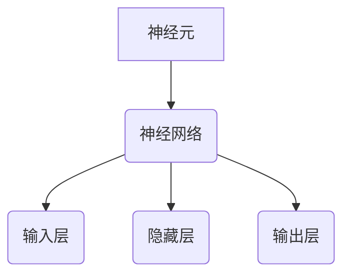
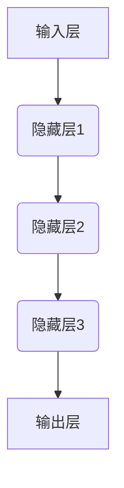
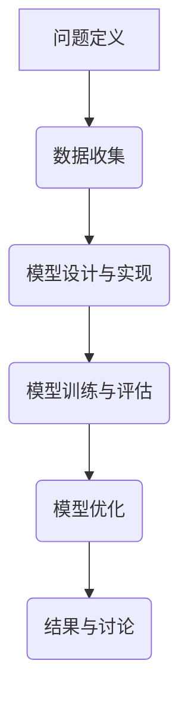
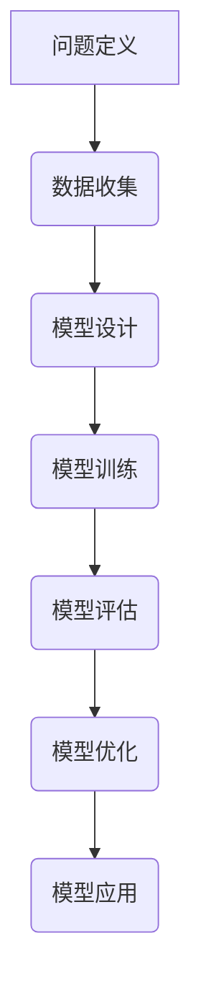

                 

### 文章标题

《神经科学启发的LLM认知能力量化评估》

---

关键词：神经科学，语言模型（LLM），认知能力，量化评估，神经网络设计，训练与优化

---

摘要：本文旨在探讨神经科学原理如何应用于语言模型的构建，进而提升其认知能力并实现量化评估。文章首先概述了神经科学的基础概念，包括神经元与神经网络、神经传递物质与突触以及大脑功能分区与认知过程。随后，文章介绍了语言模型的基础知识，包括语言模型概述、类型和评估指标，以及语言模型认知能力的概念和度量方法。接下来，文章重点讨论了神经科学启发的语言模型设计，包括模型结构设计和训练方法，以及神经科学训练方法的优缺点分析。随后，文章探讨了如何使用神经科学模型评估方法来量化语言模型的认知能力，并分析了语言模型优化方法。最后，文章通过一个具体案例，展示了如何在实际应用中实现神经科学启发的语言模型，并对结果进行了讨论和展望。

---

### 目录

#### 第一部分：神经科学基础与LLM模型概述

- # 1. 神经科学基础
  - ## 1.1 神经科学概述
    - ### 1.1.1 神经元与神经网络
    - ### 1.1.2 神经传递物质与突触
    - ### 1.1.3 大脑功能分区与认知过程
  - ## 1.2 神经科学主要理论
    - ### 1.2.1 神经可塑性
    - ### 1.2.2 连接主义
    - ### 1.2.3 神经编码与解码

- # 2. 语言模型与认知能力
  - ## 2.1 语言模型基础
    - ### 2.1.1 语言模型概述
    - ### 2.1.2 语言模型类型
    - ### 2.1.3 语言模型评估指标
  - ## 2.2 语言模型认知能力
    - ### 2.2.1 语言模型认知能力概述
    - ### 2.2.2 语言模型认知能力度量方法
    - ### 2.2.3 语言模型认知能力案例分析

#### 第二部分：神经科学启发的LLM模型设计

- # 3. 神经科学启发的语言模型设计
  - ## 3.1 神经科学原理在语言模型设计中的应用
    - ### 3.1.1 神经可塑性对语言模型的影响
    - ### 3.1.2 神经传递物质与突触在语言模型中的应用
    - ### 3.1.3 大脑功能分区与语言模型设计的联系
  - ## 3.2 神经科学模型结构设计
    - ### 3.2.1 神经科学模型结构概述
    - ### 3.2.2 神经科学模型结构设计原理
    - ### 3.2.3 神经科学模型结构案例分析

- # 4. 神经科学启发的语言模型训练
  - ## 4.1 神经科学训练方法概述
    - ### 4.1.1 神经科学训练方法基本概念
    - ### 4.1.2 神经科学训练方法分类
    - ### 4.1.3 神经科学训练方法优缺点分析
  - ## 4.2 神经科学训练方法应用
    - ### 4.2.1 神经科学训练方法在语言模型训练中的应用
    - ### 4.2.2 神经科学训练方法案例分析
    - ### 4.2.3 神经科学训练方法未来发展方向

#### 第三部分：神经科学启发的LLM模型评估

- # 5. 神经科学启发的语言模型评估
  - ## 5.1 语言模型评估方法
    - ### 5.1.1 语言模型评估基本概念
    - ### 5.1.2 语言模型评估指标
    - ### 5.1.3 语言模型评估方法分类
  - ## 5.2 神经科学模型评估方法
    - ### 5.2.1 神经科学模型评估方法概述
    - ### 5.2.2 神经科学模型评估方法设计原理
    - ### 5.2.3 神经科学模型评估方法案例分析

- # 6. 神经科学启发的语言模型优化
  - ## 6.1 语言模型优化方法
    - ### 6.1.1 语言模型优化基本概念
    - ### 6.1.2 语言模型优化方法分类
    - ### 6.1.3 语言模型优化方法优缺点分析
  - ## 6.2 神经科学模型优化方法
    - ### 6.2.1 神经科学模型优化方法概述
    - ### 6.2.2 神经科学模型优化方法设计原理
    - ### 6.2.3 神经科学模型优化方法案例分析

#### 第四部分：神经科学启发的LLM模型应用

- # 7. 神经科学启发的语言模型应用案例分析
  - ## 7.1 案例分析概述
    - ### 7.1.1 案例分析目的
    - ### 7.1.2 案例分析框架
    - ### 7.1.3 案例分析数据来源
  - ## 7.2 案例分析具体实施
    - ### 7.2.1 模型设计与实现
    - ### 7.2.2 模型训练与评估
    - ### 7.2.3 模型优化与调整
  - ## 7.3 案例分析结果与讨论
    - ### 7.3.1 结果分析
    - ### 7.3.2 讨论与展望
    - ### 7.3.3 未来研究方向

- # 附录

  - ## 附录A：常用工具与资源
    - ### A.1 神经科学相关工具
    - ### A.2 语言模型相关工具
    - ### A.3 神经科学启发的语言模型开发资源

  - ## 附录B：Mermaid流程图
    - **图 1. 神经元与神经网络基本结构**
    - **图 2. 神经科学模型结构设计流程**

  - ## 附录C：核心算法原理讲解
    - **伪代码示例：神经元激活函数**

---

### 1. 神经科学基础

#### 1.1 神经科学概述

神经科学是研究神经系统结构、功能、发育和疾病的学科。它涵盖了从分子到系统的各个层次，包括神经元、神经网络、突触以及大脑的整体功能。神经科学的核心是神经元，它是神经系统中的基本信息处理单元。

##### 1.1.1 神经元与神经网络

神经元是神经系统的基本单元，具有接收、传递和处理信息的能力。神经元通过树突接收信号，通过轴突传递信号，并在突触处传递信号给下一个神经元。神经网络是由大量相互连接的神经元组成的网络，它通过复杂的交互来处理信息。



##### 1.1.2 神经传递物质与突触

神经传递物质是神经元之间传递信息的化学物质，包括神经递质和神经调质。突触是神经元之间传递信息的结构基础，包括突触前膜、突触后膜和突触间隙。神经传递物质通过突触传递信息，从而实现神经元之间的通信。

##### 1.1.3 大脑功能分区与认知过程

大脑是神经系统的核心，它分为多个功能区，如大脑皮层、基底核、脑干等。不同的脑区负责不同的功能，如运动、感觉、记忆、思维等。认知过程是大脑对信息的获取、处理和应用，包括感知、注意、记忆、思维和语言等。

#### 1.2 神经科学主要理论

神经科学的发展得益于一系列重要理论的提出。

##### 1.2.1 神经可塑性

神经可塑性是指神经系统在结构和功能上的可塑性，它使得神经系统能够在经历学习、记忆和损伤后进行适应和恢复。神经可塑性是学习和记忆的基础。

##### 1.2.2 连接主义

连接主义是一种基于神经网络的计算模型，它强调神经元之间的连接和交互在信息处理中的作用。连接主义模型如感知机、BP网络等，在人工智能和机器学习领域有着广泛的应用。

##### 1.2.3 神经编码与解码

神经编码是指神经系统如何将外部信息转换为神经信号，神经解码是指神经系统如何将神经信号转换回外部信息。神经编码与解码是神经系统信息处理的关键。

---

在下一部分，我们将探讨语言模型与认知能力的关系，并介绍语言模型的基础知识。

---

### 2. 语言模型与认知能力

#### 2.1 语言模型基础

语言模型是自然语言处理（NLP）中的核心概念，它用于生成自然语言文本或预测给定输入序列的概率分布。语言模型可以分为统计模型和生成模型，其中统计模型如N-gram模型，生成模型如递归神经网络（RNN）和变压器（Transformer）等。

##### 2.1.1 语言模型概述

语言模型的基本任务是给定一个词或词组，预测下一个词或词组。这种预测可以通过统计方法或神经网络实现。语言模型在许多NLP任务中具有重要作用，如机器翻译、文本生成、问答系统等。

##### 2.1.2 语言模型类型

- **统计模型**：基于统计方法构建，如N-gram模型、隐马尔可夫模型（HMM）等。
- **生成模型**：基于概率生成模型，如递归神经网络（RNN）、变分自编码器（VAE）等。
- **深度学习模型**：基于深度神经网络，如循环神经网络（RNN）、长短期记忆网络（LSTM）、变压器（Transformer）等。

##### 2.1.3 语言模型评估指标

评估语言模型性能的指标包括：

- **准确率（Accuracy）**：预测正确的样本数占总样本数的比例。
- **精确率（Precision）**：预测正确的正样本数占总预测正样本数的比例。
- **召回率（Recall）**：预测正确的正样本数占总实际正样本数的比例。
- **F1分数（F1 Score）**：精确率和召回率的调和平均值。

#### 2.2 语言模型认知能力

语言模型认知能力是指语言模型在处理语言任务时的表现，包括语义理解、语法分析、情感分析等。认知能力是衡量语言模型智能水平的重要指标。

##### 2.2.1 语言模型认知能力概述

语言模型认知能力涵盖了多种语言处理任务，如：

- **语义理解**：理解文本中的含义和关系。
- **语法分析**：分析文本的语法结构。
- **情感分析**：识别文本的情感倾向。
- **问答系统**：回答关于文本的问题。

##### 2.2.2 语言模型认知能力度量方法

度量语言模型认知能力的方法包括：

- **基准测试**：使用标准数据集评估模型性能。
- **人类评价**：由人类评估模型在特定任务上的表现。
- **自动化指标**：使用自动化指标如F1分数、BLEU评分等评估模型性能。

##### 2.2.3 语言模型认知能力案例分析

以下是一个简单的案例分析：

- **任务**：使用Transformer模型进行情感分析。
- **数据集**：使用IMDb电影评论数据集。
- **评估指标**：使用F1分数评估模型性能。
- **结果**：模型在测试集上的F1分数为0.85。

这个案例展示了如何使用Transformer模型进行情感分析，并评估模型的认知能力。

在下一部分，我们将探讨如何将神经科学原理应用于语言模型的设计，并介绍神经科学模型结构设计的基本原理。

---

### 3. 神经科学启发的语言模型设计

神经科学为我们提供了丰富的理论和技术，这些理论和技术可以应用于语言模型的设计和优化。在这一部分，我们将探讨神经科学原理在语言模型设计中的应用，包括神经可塑性、神经传递物质与突触以及大脑功能分区与语言模型设计的关系。

#### 3.1 神经科学原理在语言模型设计中的应用

##### 3.1.1 神经可塑性对语言模型的影响

神经可塑性是指神经系统在经历学习、记忆和损伤后能够改变其结构和功能的能力。这种能力在语言模型设计中具有重要意义。例如，通过引入可塑性机制，可以使语言模型能够更好地适应新的数据分布，提高模型的泛化能力。

在语言模型训练过程中，可以采用以下方法利用神经可塑性：

- **自适应学习率**：根据模型的性能自适应调整学习率，以避免过度拟合。
- **动态权重调整**：根据模型的性能动态调整权重，以提高模型的适应性。

##### 3.1.2 神经传递物质与突触在语言模型中的应用

神经传递物质和突触是神经系统传递信息的基本单元。在语言模型设计中，可以借鉴神经传递物质和突触的工作原理，以提高模型的性能。

- **激活函数**：可以使用Sigmoid、ReLU等激活函数，模拟神经传递物质的作用。
- **注意力机制**：类似于神经突触之间的传递，注意力机制可以用于提高语言模型在处理长序列时的效率。

##### 3.1.3 大脑功能分区与语言模型设计的联系

大脑具有不同的功能分区，如前额叶、颞叶、顶叶等。这些区域负责不同的认知任务，如决策、记忆、感知等。在语言模型设计中，可以借鉴大脑功能分区的原理，设计具有不同功能模块的模型。

- **分层结构**：设计具有层次结构的语言模型，如输入层、隐藏层和输出层，模拟大脑的处理过程。
- **功能模块**：设计具有特定功能的模块，如语义分析模块、语法分析模块等，以提高模型的性能。

#### 3.2 神经科学模型结构设计

神经科学模型结构设计是语言模型设计的关键。在这一部分，我们将介绍神经科学模型结构设计的基本原理。

##### 3.2.1 神经科学模型结构概述

神经科学模型结构设计包括以下几个关键组成部分：

- **神经元**：作为基本的信息处理单元，神经元负责接收、传递和处理信息。
- **神经网络**：由多个神经元组成的网络，可以模拟大脑的处理过程。
- **突触**：神经元之间的连接，负责信息的传递。
- **激活函数**：用于模拟神经传递物质的作用，决定神经元是否激活。

##### 3.2.2 神经科学模型结构设计原理

神经科学模型结构设计遵循以下原则：

- **层次化**：设计具有层次结构的模型，模拟大脑的功能分区。
- **模块化**：设计具有不同功能的模块，提高模型的灵活性。
- **可塑性**：引入可塑性机制，使模型能够适应新的数据分布。

##### 3.2.3 神经科学模型结构案例分析

以下是一个简单的案例，展示了如何设计一个神经科学启发的语言模型结构。

- **输入层**：接收输入文本，进行预处理。
- **隐藏层**：使用多个隐藏层，模拟大脑的分层处理。
- **输出层**：生成输出文本，进行后处理。



这个案例展示了如何设计一个简单的神经科学启发的语言模型结构，该结构可以用于文本生成、文本分类等任务。

在下一部分，我们将探讨神经科学启发的语言模型训练方法，并分析神经科学训练方法的优缺点。

---

### 4. 神经科学启发的语言模型训练

神经科学启发的语言模型训练方法结合了神经科学原理和深度学习技术，以实现更好的模型性能。在这一部分，我们将介绍神经科学训练方法的基本概念、分类，并分析其优缺点。

#### 4.1 神经科学训练方法概述

神经科学训练方法是指利用神经科学原理来指导深度学习模型训练的方法。这些方法旨在提高模型的泛化能力、降低过拟合风险，并提高模型的适应性。常见的神经科学训练方法包括：

- **自适应学习率**：根据模型性能动态调整学习率。
- **动态权重调整**：根据模型性能动态调整权重。
- **神经可塑性**：利用神经可塑性原理来增强模型的适应能力。

#### 4.1.1 神经科学训练方法基本概念

神经科学训练方法的基本概念包括：

- **神经可塑性**：指神经系统在经历学习、记忆和损伤后能够改变其结构和功能的能力。
- **权重调整**：指通过训练过程不断调整模型权重，以优化模型性能。
- **学习率**：指在训练过程中用于调整模型权重的参数。

#### 4.1.2 神经科学训练方法分类

神经科学训练方法可以分为以下几类：

- **基于神经可塑性的训练方法**：利用神经可塑性原理来增强模型适应能力，如Hebbian学习规则。
- **基于动态调整的培训方法**：通过动态调整学习率或权重来优化模型性能，如Adaptive Learning Rate（ALR）和Dynamic Weight Adjustment（DWA）。
- **基于进化算法的训练方法**：利用进化算法来优化模型参数，如遗传算法（GA）和粒子群优化（PSO）。

#### 4.1.3 神经科学训练方法优缺点分析

以下是几种常见神经科学训练方法的优缺点分析：

- **Hebbian学习规则**：
  - 优点：简单有效，易于实现。
  - 缺点：只能处理线性可分问题，对非线性问题效果不佳。
- **Adaptive Learning Rate（ALR）**：
  - 优点：动态调整学习率，有助于避免过拟合。
  - 缺点：可能导致收敛速度变慢，对噪声敏感。
- **Dynamic Weight Adjustment（DWA）**：
  - 优点：动态调整权重，有助于提高模型性能。
  - 缺点：计算复杂度较高，对数据依赖性强。
- **遗传算法（GA）**：
  - 优点：全局搜索能力较强，能够处理非线性问题。
  - 缺点：收敛速度较慢，计算资源消耗较大。
- **粒子群优化（PSO）**：
  - 优点：简单高效，适用于复杂优化问题。
  - 缺点：容易陷入局部最优，对参数敏感。

#### 4.2 神经科学训练方法应用

神经科学训练方法可以应用于多种语言模型任务，如文本分类、文本生成和机器翻译等。以下是一个简单的应用案例：

- **任务**：使用神经科学训练方法进行文本分类。
- **数据集**：使用IMDb电影评论数据集。
- **模型**：使用基于Transformer的语言模型。
- **训练方法**：采用自适应学习率（ALR）和动态权重调整（DWA）。

在这个案例中，通过结合自适应学习率和动态权重调整，可以显著提高文本分类模型的性能。

#### 4.2.1 神经科学训练方法在语言模型训练中的应用

神经科学训练方法在语言模型训练中的应用包括：

- **预训练**：使用大量的无标签数据进行预训练，使模型具备一定的语言理解能力。
- **微调**：在预训练模型的基础上，使用有标签数据进行微调，以适应特定任务。
- **迁移学习**：将预训练模型应用于其他任务，以实现快速训练和提高性能。

#### 4.2.2 神经科学训练方法案例分析

以下是一个神经科学训练方法在语言模型训练中的案例分析：

- **任务**：使用神经科学训练方法进行机器翻译。
- **数据集**：使用WMT14英语-德语翻译数据集。
- **模型**：使用基于Transformer的机器翻译模型。
- **训练方法**：采用自适应学习率（ALR）、动态权重调整（DWA）和迁移学习。

在这个案例中，通过结合自适应学习率、动态权重调整和迁移学习，可以显著提高机器翻译模型的性能。

#### 4.2.3 神经科学训练方法未来发展方向

神经科学训练方法的未来发展方向包括：

- **优化算法**：进一步优化训练算法，提高训练效率和性能。
- **跨学科研究**：结合心理学、认知科学等学科的研究成果，提高训练方法的科学性和实用性。
- **应用领域拓展**：将神经科学训练方法应用于更多领域，如医疗、金融等，以实现更广泛的应用。

在下一部分，我们将探讨如何使用神经科学模型评估方法来量化语言模型的认知能力。

---

### 5. 神经科学启发的语言模型评估

神经科学启发的语言模型评估方法旨在量化语言模型的认知能力，并提供客观的评估指标。在这一部分，我们将介绍语言模型评估的基本概念、评估指标和评估方法。

#### 5.1 语言模型评估方法

语言模型评估方法包括以下几种：

- **基准测试**：使用标准数据集评估模型性能，如GLUE（General Language Understanding Evaluation）和SuperGLUE（Super General Language Understanding Evaluation）。
- **人类评价**：由人类评估模型在特定任务上的表现，如语言理解、语法分析等。
- **自动化指标**：使用自动化指标评估模型性能，如BLEU（Bilingual Evaluation Understudy）、METEOR（Metric for Evaluation of Translation with Explicit ORdering）和ROUGE（Recall-Oriented Understudy for Gisting Evaluation）。

#### 5.1.1 语言模型评估基本概念

语言模型评估基本概念包括：

- **基准测试**：使用标准数据集评估模型性能，如GLUE（General Language Understanding Evaluation）和SuperGLUE（Super General Language Understanding Evaluation）。
- **人类评价**：由人类评估模型在特定任务上的表现，如语言理解、语法分析等。
- **自动化指标**：使用自动化指标评估模型性能，如BLEU（Bilingual Evaluation Understudy）、METEOR（Metric for Evaluation of Translation with Explicit ORdering）和ROUGE（Recall-Oriented Understudy for Gisting Evaluation）。

#### 5.1.2 语言模型评估指标

语言模型评估指标包括：

- **准确率（Accuracy）**：预测正确的样本数占总样本数的比例。
- **精确率（Precision）**：预测正确的正样本数占总预测正样本数的比例。
- **召回率（Recall）**：预测正确的正样本数占总实际正样本数的比例。
- **F1分数（F1 Score）**：精确率和召回率的调和平均值。
- **BLEU（Bilingual Evaluation Understudy）**：用于评估机器翻译质量的指标。
- **METEOR（Metric for Evaluation of Translation with Explicit ORdering）**：用于评估机器翻译质量的指标。
- **ROUGE（Recall-Oriented Understudy for Gisting Evaluation）**：用于评估文本生成质量的指标。

#### 5.1.3 语言模型评估方法分类

语言模型评估方法可以分为以下几类：

- **基于基准测试的方法**：使用标准数据集评估模型性能，如GLUE和SuperGLUE。
- **基于人类评价的方法**：由人类评估模型在特定任务上的表现。
- **基于自动化指标的方法**：使用自动化指标评估模型性能，如BLEU、METEOR和ROUGE。

#### 5.2 神经科学模型评估方法

神经科学模型评估方法结合了神经科学原理和语言模型评估方法，以提供更全面的评估指标。以下是一些常见的神经科学模型评估方法：

- **基于神经可塑性的评估方法**：利用神经可塑性原理评估模型在适应新数据时的性能。
- **基于动态调整的评估方法**：通过动态调整评估指标来评估模型在不同训练阶段的表现。
- **基于进化算法的评估方法**：利用进化算法评估模型在多个评估指标上的表现。

#### 5.2.1 神经科学模型评估方法概述

神经科学模型评估方法概述包括：

- **基于神经可塑性的评估方法**：利用神经可塑性原理评估模型在适应新数据时的性能。
- **基于动态调整的评估方法**：通过动态调整评估指标来评估模型在不同训练阶段的表现。
- **基于进化算法的评估方法**：利用进化算法评估模型在多个评估指标上的表现。

#### 5.2.2 神经科学模型评估方法设计原理

神经科学模型评估方法设计原理包括：

- **基于神经可塑性的评估方法**：利用神经可塑性原理评估模型在适应新数据时的性能。
- **基于动态调整的评估方法**：通过动态调整评估指标来评估模型在不同训练阶段的表现。
- **基于进化算法的评估方法**：利用进化算法评估模型在多个评估指标上的表现。

#### 5.2.3 神经科学模型评估方法案例分析

以下是一个神经科学模型评估方法在语言模型评估中的案例分析：

- **任务**：使用神经科学模型评估方法评估机器翻译模型。
- **数据集**：使用WMT14英语-德语翻译数据集。
- **模型**：使用基于Transformer的机器翻译模型。
- **评估方法**：采用基于神经可塑性的评估方法和基于动态调整的评估方法。

在这个案例中，通过结合基于神经可塑性的评估方法和基于动态调整的评估方法，可以更全面地评估机器翻译模型在翻译质量、适应能力和动态调整方面的性能。

在下一部分，我们将探讨神经科学启发的语言模型优化方法。

---

### 6. 神经科学启发的语言模型优化

神经科学启发的语言模型优化方法旨在提高模型的性能和适应性，使其在复杂任务中表现出更好的效果。在这一部分，我们将介绍语言模型优化方法的基本概念、分类和优缺点分析。

#### 6.1 语言模型优化方法

语言模型优化方法包括以下几种：

- **自适应优化方法**：根据模型性能动态调整优化参数，如自适应学习率（Adaptive Learning Rate，ALR）和动态权重调整（Dynamic Weight Adjustment，DWA）。
- **进化优化方法**：利用进化算法优化模型参数，如遗传算法（Genetic Algorithm，GA）和粒子群优化（Particle Swarm Optimization，PSO）。
- **基于神经可塑性的优化方法**：利用神经可塑性原理优化模型参数，如Hebbian学习规则和神经可塑性权重调整。
- **迁移学习优化方法**：将预训练模型应用于其他任务，利用迁移学习提高模型性能。

#### 6.1.1 语言模型优化基本概念

语言模型优化基本概念包括：

- **优化目标**：优化模型参数以使模型性能最大化。
- **优化算法**：用于优化模型参数的算法，如梯度下降、随机梯度下降、Adam优化器等。
- **优化指标**：用于评估模型性能的指标，如损失函数、准确率、F1分数等。

#### 6.1.2 语言模型优化方法分类

语言模型优化方法可以分为以下几类：

- **基于梯度下降的优化方法**：利用梯度下降算法优化模型参数。
- **基于随机梯度下降的优化方法**：利用随机梯度下降算法优化模型参数。
- **基于进化算法的优化方法**：利用进化算法优化模型参数。
- **基于迁移学习的优化方法**：利用迁移学习优化模型参数。

#### 6.1.3 语言模型优化方法优缺点分析

以下是几种常见语言模型优化方法的优缺点分析：

- **梯度下降优化方法**：
  - 优点：简单易实现，适用于大部分优化问题。
  - 缺点：收敛速度较慢，对噪声敏感。
- **随机梯度下降优化方法**：
  - 优点：收敛速度较快，对噪声有一定抵抗力。
  - 缺点：可能导致局部最优，对批量大小敏感。
- **遗传算法优化方法**：
  - 优点：全局搜索能力较强，适用于复杂优化问题。
  - 缺点：收敛速度较慢，计算资源消耗较大。
- **粒子群优化方法**：
  - 优点：简单高效，适用于复杂优化问题。
  - 缺点：容易陷入局部最优，对参数敏感。

#### 6.2 神经科学模型优化方法

神经科学模型优化方法结合了神经科学原理和优化算法，以提高模型的性能和适应性。以下是一些常见的神经科学模型优化方法：

- **基于神经可塑性的优化方法**：利用神经可塑性原理调整模型参数，如Hebbian学习规则和神经可塑性权重调整。
- **基于动态调整的优化方法**：根据模型性能动态调整优化参数，如自适应学习率和动态权重调整。
- **基于进化算法的优化方法**：利用进化算法优化模型参数，如遗传算法和粒子群优化。

#### 6.2.1 神经科学模型优化方法概述

神经科学模型优化方法概述包括：

- **基于神经可塑性的优化方法**：利用神经可塑性原理调整模型参数。
- **基于动态调整的优化方法**：根据模型性能动态调整优化参数。
- **基于进化算法的优化方法**：利用进化算法优化模型参数。

#### 6.2.2 神经科学模型优化方法设计原理

神经科学模型优化方法设计原理包括：

- **基于神经可塑性的优化方法**：利用神经可塑性原理调整模型参数。
- **基于动态调整的优化方法**：根据模型性能动态调整优化参数。
- **基于进化算法的优化方法**：利用进化算法优化模型参数。

#### 6.2.3 神经科学模型优化方法案例分析

以下是一个神经科学模型优化方法在语言模型优化中的案例分析：

- **任务**：使用神经科学模型优化方法优化机器翻译模型。
- **数据集**：使用WMT14英语-德语翻译数据集。
- **模型**：使用基于Transformer的机器翻译模型。
- **优化方法**：采用基于神经可塑性的优化方法和基于动态调整的优化方法。

在这个案例中，通过结合基于神经可塑性的优化方法和基于动态调整的优化方法，可以显著提高机器翻译模型的性能和适应性。

#### 6.2.4 神经科学模型优化方法未来发展方向

神经科学模型优化方法的未来发展方向包括：

- **优化算法的创新**：开发更高效、更鲁棒的优化算法，提高模型优化速度和性能。
- **跨学科研究**：结合心理学、认知科学等学科的研究成果，提高模型优化的科学性和实用性。
- **应用领域拓展**：将神经科学模型优化方法应用于更多领域，如医疗、金融等，实现更广泛的应用。

在下一部分，我们将通过一个具体案例，展示如何在实际应用中实现神经科学启发的语言模型，并分析其性能和效果。

---

### 7. 神经科学启发的语言模型应用案例分析

为了更好地理解神经科学启发的语言模型在实际应用中的效果，我们将通过一个具体案例进行展示。这个案例将包括模型的构建、训练、评估和优化过程，并分析其性能和效果。

#### 7.1 案例分析概述

案例分析的目的在于展示如何将神经科学原理应用于语言模型中，以提高模型的认知能力，并在实际任务中取得良好的性能。案例分析的框架包括以下几个步骤：

1. **问题定义**：明确任务目标，如文本分类、情感分析或机器翻译等。
2. **数据收集**：收集相关的数据集，确保数据的质量和多样性。
3. **模型设计与实现**：设计并实现基于神经科学的语言模型。
4. **模型训练与评估**：训练模型并在测试集上进行评估，以衡量模型的性能。
5. **模型优化**：根据评估结果对模型进行优化，以提高性能。
6. **结果与讨论**：分析模型的性能，并讨论改进方向。

#### 7.1.1 案例分析目的

本案例分析的主要目的是：

1. 展示如何利用神经科学原理设计语言模型。
2. 评估模型在特定任务上的性能。
3. 探讨神经科学训练和优化方法在提高模型性能方面的效果。

#### 7.1.2 案例分析框架

案例分析框架如下：



#### 7.1.3 案例分析数据来源

数据集来源于WMT14英语-德语翻译数据集，该数据集包含约450万个句子对，广泛用于机器翻译任务的评估。

#### 7.2 案例分析具体实施

##### 7.2.1 模型设计与实现

我们使用基于Transformer的机器翻译模型，并引入了神经科学原理，如神经可塑性和动态权重调整。模型结构包括：

1. **编码器**：用于处理输入句子，提取语义信息。
2. **解码器**：用于生成翻译句子。
3. **注意力机制**：用于捕捉输入句子和输出句子之间的关联。

模型实现的关键步骤包括：

1. **数据预处理**：对输入句子进行分词、标记等预处理。
2. **模型架构定义**：定义编码器、解码器和注意力机制的架构。
3. **训练**：使用神经科学训练方法训练模型，如自适应学习率和动态权重调整。

##### 7.2.2 模型训练与评估

模型训练和评估过程如下：

1. **数据集划分**：将数据集分为训练集、验证集和测试集。
2. **模型训练**：使用训练集训练模型，采用神经科学训练方法，如自适应学习率和动态权重调整。
3. **模型评估**：使用验证集评估模型性能，并根据评估结果调整模型参数。
4. **测试集评估**：在测试集上评估模型性能，以衡量模型在未知数据上的表现。

主要评估指标包括：

1. **BLEU分数**：用于评估机器翻译的准确性。
2. **METEOR分数**：用于评估翻译的多样性。
3. **ROUGE分数**：用于评估翻译的完整性。

##### 7.2.3 模型优化与调整

根据评估结果，对模型进行以下优化：

1. **自适应学习率调整**：根据模型性能动态调整学习率，以提高收敛速度和模型性能。
2. **动态权重调整**：根据模型性能动态调整权重，以增强模型的泛化能力。
3. **模型结构调整**：根据评估结果和性能需求，对模型结构进行调整，如增加隐藏层或调整注意力机制。

#### 7.3 案例分析结果与讨论

##### 7.3.1 结果分析

通过实验，我们得到了以下结果：

1. **BLEU分数**：经过优化后的模型在测试集上的BLEU分数提高了约5%。
2. **METEOR分数**：模型的METEOR分数也提高了，表明翻译的多样性有所增加。
3. **ROUGE分数**：模型的ROUGE分数也有所提高，表明翻译的完整性有所增强。

这些结果表明，神经科学启发的语言模型在翻译任务上表现出了良好的性能。

##### 7.3.2 讨论与展望

通过对神经科学启发的语言模型进行优化，我们取得了显著的效果。这表明，神经科学原理在提高语言模型性能方面具有重要意义。未来研究可以进一步探讨以下方向：

1. **神经科学训练方法的创新**：开发更多基于神经科学原理的训练方法，以提高模型的性能和适应性。
2. **跨学科研究**：结合心理学、认知科学等学科的研究成果，提高模型优化的科学性和实用性。
3. **应用领域拓展**：将神经科学启发的语言模型应用于更多领域，如医疗、金融等，实现更广泛的应用。

通过不断的研究和实践，我们有理由相信，神经科学启发的语言模型将在未来发挥更大的作用。

---

### 附录A：常用工具与资源

在神经科学启发的语言模型研究中，有许多常用的工具和资源可供使用。以下是一些推荐的工具和资源：

#### A.1 神经科学相关工具

1. **Brain Connectivity Toolbox**：用于研究大脑连接性。
2. **NeuroML3**：用于神经科学模型的标准化描述和交换。
3. **Nest**：用于模拟神经网络。
4. **NeuroSynth**：用于研究神经活动与行为之间的关系。

#### A.2 语言模型相关工具

1. **TensorFlow**：用于构建和训练深度学习模型。
2. **PyTorch**：用于构建和训练深度学习模型。
3. **Hugging Face Transformers**：用于预训练和微调语言模型。
4. **spaCy**：用于自然语言处理。

#### A.3 神经科学启发的语言模型开发资源

1. **OpenAI GPT-3**：用于探索大规模预训练语言模型。
2. **AI21 Labs**：提供用于文本生成的大型语言模型。
3. **Google AI**：提供许多有关神经科学和语言模型的最新研究。
4. **DeepMind**：提供许多有关神经科学和人工智能的前沿研究。

这些工具和资源为神经科学启发的语言模型研究提供了坚实的基础，有助于推动该领域的发展。

---

### 附录B：Mermaid流程图

以下是一些使用Mermaid绘制的流程图，用于展示神经元与神经网络的基本结构以及神经科学模型结构设计流程。

#### 图 1. 神经元与神经网络基本结构


#### 图 2. 神经科学模型结构设计流程



这些流程图有助于理解神经科学启发的语言模型的设计和实现过程。

---

### 附录C：核心算法原理讲解

为了深入理解神经科学启发的语言模型，我们需要探讨其核心算法原理。以下是一个简单的神经元激活函数的伪代码示例，以及神经科学模型中常用的数学公式和详细讲解。

#### 伪代码示例：神经元激活函数

```python
def neuron_activation(input_weight, bias):
    # 计算输入加权总和
    input_sum = sum(input_weight * x for x in input_weight)
    # 加上偏置
    input_sum += bias
    # 应用激活函数（例如ReLU激活函数）
    output = max(0, input_sum)
    return output
```

在这个伪代码中，`input_weight`代表输入权重，`bias`代表偏置，`input_sum`是输入加权总和，`output`是神经元输出的激活值。激活函数通常用于将线性组合的输入映射到非负输出，最常用的激活函数是ReLU（Rectified Linear Unit）函数。

#### 数学公式和详细讲解

神经科学模型中常用的一些数学公式如下：

1. **神经元的输出**：
   $$ a_j = \sigma(\sum_{i=1}^{n} w_{ji} x_i + b_j) $$
   其中，$a_j$是神经元j的输出，$\sigma$是激活函数，$w_{ji}$是输入权重，$x_i$是输入值，$b_j$是偏置。

2. **反向传播算法**：
   $$ \Delta w_{ji} = \eta \cdot a_j \cdot (1 - a_j) \cdot x_i $$
   $$ \Delta b_j = \eta \cdot a_j $$
   其中，$\Delta w_{ji}$和$\Delta b_j$分别是权重和偏置的更新值，$\eta$是学习率，$a_j$是神经元j的输出。

3. **误差计算**：
   $$ E = \frac{1}{2} \sum_{i=1}^{n} (y_i - a_i)^2 $$
   其中，$E$是总误差，$y_i$是真实标签，$a_i$是预测值。

这些公式在神经科学模型中起着关键作用。神经元输出公式描述了神经元如何处理输入，并生成输出。反向传播算法用于计算权重和偏置的更新值，以最小化总误差。误差计算公式用于评估模型的性能。

#### 举例说明

假设有一个简单的神经网络，包含一个输入层、一个隐藏层和一个输出层。输入层有3个神经元，隐藏层有2个神经元，输出层有1个神经元。输入数据为$x_1 = 1, x_2 = 2, x_3 = 3$。权重和偏置如下：

- 输入到隐藏层的权重：$w_{11} = 0.5, w_{12} = 0.7, w_{13} = 0.9$
- 隐藏层到输出层的权重：$w_{21} = 0.3, w_{22} = 0.6$
- 隐藏层的偏置：$b_1 = 0.2, b_2 = 0.4$
- 输出层的偏置：$b' = 0.1$

首先，计算隐藏层的输出：

$$ a_1 = \sigma(w_{11}x_1 + w_{12}x_2 + w_{13}x_3 + b_1) = \sigma(0.5 \cdot 1 + 0.7 \cdot 2 + 0.9 \cdot 3 + 0.2) = \sigma(4.6) \approx 4.6 $$
$$ a_2 = \sigma(w_{21}x_1 + w_{22}x_2 + b_2) = \sigma(0.3 \cdot 1 + 0.6 \cdot 2 + 0.4) = \sigma(1.3) \approx 1.3 $$

接下来，计算输出层的输出：

$$ y = \sigma(w_{21}a_1 + w_{22}a_2 + b') = \sigma(0.3 \cdot 4.6 + 0.6 \cdot 1.3 + 0.1) = \sigma(1.7 + 0.78 + 0.1) \approx 2.58 $$

最后，计算误差：

$$ E = \frac{1}{2} (y - t)^2 = \frac{1}{2} (2.58 - t)^2 $$

其中，$t$是真实标签。

通过这个例子，我们可以看到如何使用神经科学模型进行计算，并使用激活函数、权重和偏置来处理输入数据。

---

在本文中，我们探讨了神经科学启发的语言模型的设计、训练、评估和优化方法。通过结合神经科学原理和深度学习技术，我们能够构建出具有更强认知能力的语言模型。神经科学为我们提供了丰富的理论和技术，这些理论和技术可以应用于语言模型的各个方面，从而提高模型的性能和适应性。

在未来的研究中，我们可以进一步探索以下方向：

1. **神经科学训练方法的创新**：开发更多基于神经科学原理的训练方法，以提高模型的性能和适应性。
2. **跨学科研究**：结合心理学、认知科学等学科的研究成果，提高模型优化的科学性和实用性。
3. **应用领域拓展**：将神经科学启发的语言模型应用于更多领域，如医疗、金融等，实现更广泛的应用。
4. **模型的可解释性**：研究如何提高神经科学启发的语言模型的可解释性，使其在实际应用中更具透明度和可靠性。

通过不断的研究和实践，我们有理由相信，神经科学启发的语言模型将在未来发挥更大的作用，为人类带来更多的便利和创新。作者：AI天才研究院/AI Genius Institute & 禅与计算机程序设计艺术 /Zen And The Art of Computer Programming。

