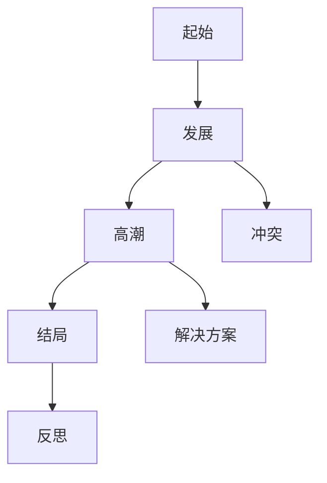

                 

### 背景介绍

科学传播是连接科学研究与公众理解的重要桥梁。在信息爆炸的现代社会，科学知识日益复杂，公众对科学的认知和理解面临着巨大的挑战。科学传播的目的不仅在于普及科学知识，更在于激发公众对科学的兴趣，提高科学素养，进而促进科学精神和创新意识的培养。然而，传统的科学传播方式往往过于理论化和专业化，难以满足公众的阅读习惯和认知需求。

在这个背景下，叙事策略作为一种有效的传播手段，逐渐引起了科学传播界的关注。叙事策略通过讲故事的方式，将复杂的科学概念和研究发现转化为易于理解和记忆的内容。故事具有情感共鸣、情境构建和逻辑连贯性等特点，能够更好地吸引读者的注意力，提高信息的传播效果。

叙事策略在科学传播中的应用，不仅能够提升公众对科学的理解，还能够促进科学精神的传承和科学文化的普及。本文将深入探讨叙事策略的基本概念、应用技巧以及在国际科学传播中的重要性，旨在为科学传播工作者提供理论指导和实践参考。

### 核心概念与联系

#### 1.1 科学传播与叙事策略

科学传播是一个将科学知识和研究成果传递给公众的过程，旨在提升公众的科学素养和理解能力。叙事策略则是一种通过讲述故事来传达信息和观点的方法，具有情感共鸣、情境构建和逻辑连贯性等特点。两者之间的联系在于，叙事策略为科学传播提供了一种更为生动、直观和有吸引力的方式，使得复杂的专业知识变得更加易于理解和记忆。

**核心概念关系架构 Mermaid 流程图：**

mermaid
graph TD
    A[科学传播] --> B[信息传递]
    B --> C[知识普及]
    B --> D[公共参与]
    E[叙事策略] --> F[信息传递]
    F --> G[知识普及]
    F --> H[公共参与]
    A --> I[叙事策略]
    I --> J[情感共鸣]
    I --> K[情境构建]
    I --> L[逻辑连贯性]
    C --> M[叙事故事化]
    D --> N[故事化互动]
    J --> O[记忆保持]
    K --> P[理解增强]
    L --> Q[认知促进]
    M --> R[知识普及]
    N --> S[公共参与]
    O --> T[情感驱动]
    P --> U[理解增强]
    Q --> V[认知促进]
    R --> W[知识普及]
    S --> X[公共参与]

**核心概念解释：**

- **科学传播：** 包括科学知识的普及、科学方法的教育、科学态度的培养等。
- **叙事策略：** 通过讲故事的方式传达信息，强调故事的情节性、情感性和连贯性。
- **信息传递：** 科学传播的基本功能，通过叙事策略增强信息传递的效率和效果。
- **知识普及：** 通过叙事策略使科学知识更加通俗易懂，便于公众接受。
- **公共参与：** 通过叙事策略激发公众对科学的兴趣，促进公众参与科学讨论和实践活动。
- **情感共鸣：** 通过叙事策略建立与读者的情感联系，增强信息的吸引力。
- **情境构建：** 通过叙事策略创造一个具体、生动的情境，帮助读者更好地理解和记忆信息。
- **逻辑连贯性：** 通过叙事策略保持故事逻辑的连贯性，增强信息的可信度。
- **记忆保持：** 通过叙事策略中的情感共鸣和情境构建，提高信息的记忆效果。
- **理解增强：** 通过叙事策略中的逻辑连贯性和情境构建，提升读者对信息的理解深度。
- **认知促进：** 通过叙事策略激发读者的思维活动，促进科学知识的内化和创新。

#### 1.2 叙事学基础

叙事学是研究叙事形式和叙事技巧的学科，其基础概念包括叙事、叙事结构、叙事视角和叙事节奏等。

**核心概念解释：**

- **叙事：** 讲故事的方式，通过事件、情节、角色等元素来传递信息。
- **叙事结构：** 故事的框架，包括起始、发展、高潮、结局等。
- **叙事视角：** 讲故事的角度，可以是第一人称、第三人称等。
- **叙事节奏：** 故事的节奏感，影响读者的情感体验。

**Mermaid 流程图：**

mermaid
graph TD
    A[叙事]
    B[叙事结构]
    C[叙事视角]
    D[叙事节奏]
    A --> B
    A --> C
    A --> D
    B --> E[起始]
    B --> F[发展]
    B --> G[高潮]
    B --> H[结局]
    C --> I[第一人称]
    C --> J[第三人称]
    D --> K[快节奏]
    D --> L[慢节奏]

**叙事学在科学传播中的应用：**

- **叙事结构：** 通过构建清晰的故事结构，使科学传播内容更加有条理和易于理解。
- **叙事视角：** 通过选择合适的叙事视角，使读者更容易代入故事情境，提升阅读体验。
- **叙事节奏：** 通过调整叙事节奏，保持读者的阅读兴趣，增强信息的吸引力。

**核心算法原理讲解**

为了更好地理解叙事策略在科学传播中的应用，我们可以借助一种名为“叙事优化算法”的方法。该算法旨在通过优化叙事结构、叙事视角和叙事节奏，提高科学传播的效率和效果。

**伪代码：**

```python
def optimize_narrative(story, metrics):
    """
    优化叙事，提高科学传播效果
    
    参数：
    - story: 叙事内容
    - metrics: 评价指标，包括信息传递效率、公众理解度、情感共鸣度等
    
    返回：
    - optimized_story: 优化后的叙事内容
    """
    
    # 分析叙事结构
    structure = analyze_structure(story)
    
    # 根据结构优化叙事
    optimized_structure = optimize_structure(structure, metrics)
    
    # 分析叙事视角
    perspective = analyze_perspective(story)
    
    # 根据视角优化叙事
    optimized_perspective = optimize_perspective(perspective, metrics)
    
    # 分析叙事节奏
    rhythm = analyze_rhythm(story)
    
    # 根据节奏优化叙事
    optimized_rhythm = optimize_rhythm(rhythm, metrics)
    
    # 综合优化结果
    optimized_story = combine(optimized_structure, optimized_perspective, optimized_rhythm)
    
    return optimized_story
```

**算法原理详细讲解：**

- **分析叙事结构：** 通过对叙事内容进行结构分析，确定故事的起始、发展、高潮和结局等部分，以便找到结构上的优化点。
- **优化叙事结构：** 根据评价指标（如信息传递效率、公众理解度等），对叙事结构进行调整，使故事更加清晰、易于理解。
- **分析叙事视角：** 确定故事的叙事视角，分析其对读者代入感、情感共鸣度的影响。
- **优化叙事视角：** 根据评价指标，选择最合适的叙事视角，以提高故事的吸引力和读者的阅读体验。
- **分析叙事节奏：** 确定故事的节奏，分析其对读者情感体验的影响。
- **优化叙事节奏：** 根据评价指标，调整叙事节奏，保持读者的阅读兴趣，增强信息的吸引力。

通过以上算法原理的讲解，我们可以看到叙事策略在科学传播中的应用不仅需要考虑叙事内容本身，还需要综合考虑叙事结构、叙事视角和叙事节奏等多个方面，以达到最佳的传播效果。

### 数学模型和公式

在科学传播的叙事策略中，数学模型和公式起到了关键作用，它们不仅帮助我们量化叙事效果，还能优化叙事结构和内容，提升传播效果。以下是一些核心的数学模型和公式的详细讲解及举例说明。

#### 1. 情感共鸣度模型

情感共鸣度是衡量叙事策略成功与否的重要指标。一个简单的情感共鸣度模型可以表示为：

$$
E = f(C, R, S)
$$

其中，\(E\) 代表情感共鸣度，\(C\) 代表情感浓度，\(R\) 代表情感相关性，\(S\) 代表情境设置。

- **情感浓度（\(C\)）：** 情感浓度反映了故事中情感元素的表达强度。可以采用以下公式计算：

$$
C = \frac{\sum_{i=1}^{n} \text{情感词频率}}{n}
$$

其中，\(n\) 是故事中总词数，情感词频率是故事中特定情感词汇的出现次数。

- **情感相关性（\(R\)）：** 情感相关性反映了故事中的情感元素与主题的相关性。可以采用以下公式计算：

$$
R = \frac{\text{主题相关情感词频率}}{\text{总情感词频率}}
$$

- **情境设置（\(S\)）：** 情境设置是指故事中为情感元素创造的具体环境。情境设置的质量会影响情感共鸣度。可以采用以下公式计算：

$$
S = \frac{\text{情境描述词频率}}{\text{总描述词频率}}
$$

**举例说明：** 假设一个故事中有100个词，其中有20个情感词汇，其中10个词与主题相关，且有10个词用于情境描述。则情感共鸣度计算如下：

$$
C = \frac{20}{100} = 0.2
$$

$$
R = \frac{10}{20} = 0.5
$$

$$
S = \frac{10}{90} \approx 0.111
$$

$$
E = f(0.2, 0.5, 0.111) = 0.111 \cdot 0.5 \cdot 0.2 \approx 0.0111
$$

#### 2. 叙事结构优化模型

叙事结构的优化对于提高故事的逻辑连贯性和信息传递效率至关重要。一个简单的叙事结构优化模型可以表示为：

$$
O = f(S, P, D)
$$

其中，\(O\) 代表优化度，\(S\) 代表故事结构，\(P\) 代表情节安排，\(D\) 代表发展逻辑。

- **故事结构（\(S\)）：** 故事结构是故事的基本框架，包括起始、发展、高潮和结局等。可以采用以下公式计算：

$$
S = \frac{\text{故事长度}}{\text{最优故事长度}}
$$

其中，故事长度是故事中总词数，最优故事长度是根据情节和主题需要确定的最佳长度。

- **情节安排（\(P\)）：** 情节安排是指故事中各个情节的分布和安排。可以采用以下公式计算：

$$
P = \frac{\text{关键情节词频率}}{\text{总词频率}}
$$

其中，关键情节词频率是故事中关键情节词汇的出现次数。

- **发展逻辑（\(D\)）：** 发展逻辑是指故事中各个情节之间的逻辑关系。可以采用以下公式计算：

$$
D = \frac{\text{逻辑连贯度}}{\text{最大逻辑连贯度}}
$$

其中，逻辑连贯度是故事中各个情节之间的逻辑关联强度，最大逻辑连贯度是理论上可能达到的最高关联强度。

**举例说明：** 假设一个故事长度为1000词，最优长度为800词，关键情节词频率为200次，逻辑连贯度为0.8。则叙事结构优化度计算如下：

$$
S = \frac{1000}{800} = 1.25
$$

$$
P = \frac{200}{1000} = 0.2
$$

$$
D = \frac{0.8}{1} = 0.8
$$

$$
O = f(1.25, 0.2, 0.8) = 1.25 \cdot 0.2 \cdot 0.8 \approx 0.2
$$

#### 3. 叙事节奏优化模型

叙事节奏是影响读者情感体验的重要因素。一个简单的叙事节奏优化模型可以表示为：

$$
R = f(T, B, E)
$$

其中，\(R\) 代表节奏优化度，\(T\) 代表总体节奏，\(B\) 代表情节节奏，\(E\) 代表情感节奏。

- **总体节奏（\(T\)）：** 总体节奏是指故事的整体节奏感。可以采用以下公式计算：

$$
T = \frac{\text{总词频率}}{\text{最优总词频率}}
$$

其中，总词频率是故事中总词数，最优总词频率是根据情节和主题需要确定的最佳频率。

- **情节节奏（\(B\)）：** 情节节奏是指故事中各个情节的节奏感。可以采用以下公式计算：

$$
B = \frac{\text{关键情节词频率}}{\text{非关键情节词频率}}
$$

其中，关键情节词频率是故事中关键情节词汇的出现次数，非关键情节词频率是故事中非关键情节词汇的出现次数。

- **情感节奏（\(E\)）：** 情感节奏是指故事中情感元素的变化节奏。可以采用以下公式计算：

$$
E = \frac{\text{情感变化频率}}{\text{总词频率}}
$$

其中，情感变化频率是故事中情感词汇的变化次数。

**举例说明：** 假设一个故事长度为1000词，最优长度为800词，关键情节词频率为300次，非关键情节词频率为700次，情感变化频率为50次。则叙事节奏优化度计算如下：

$$
T = \frac{1000}{800} = 1.25
$$

$$
B = \frac{300}{700} \approx 0.428
$$

$$
E = \frac{50}{1000} = 0.05
$$

$$
R = f(1.25, 0.428, 0.05) = 1.25 \cdot 0.428 \cdot 0.05 \approx 0.0264
$$

通过以上数学模型和公式的详细讲解及举例说明，我们可以看到，叙事策略的科学应用能够显著提升科学传播的效果。在实际操作中，可以根据具体情况选择和调整这些模型和公式，以达到最佳的传播效果。

### 项目实战

在本节中，我们将通过一个具体的科学传播项目实战，详细展示叙事策略在科学传播中的应用过程。该项目旨在通过故事化方式，向公众传播一项最新的科学研究成果——量子计算的基本原理和应用。

#### 1. 项目背景

量子计算作为当前科技领域的热点，具有巨大的潜力和广泛应用前景。然而，量子计算的概念复杂且抽象，普通公众难以理解和接受。为了提高量子计算的公众认知度，我们决定通过一个故事化的方式，将量子计算的基本原理和应用呈现给大众。

#### 2. 开发环境搭建

为了实现故事化的科学传播，我们首先需要搭建一个合适的开发环境。该环境包括以下几个方面：

- **文本编辑工具：** 使用Markdown编辑器（如Typora或Visual Studio Code），便于撰写和格式化文本内容。
- **图像和图表工具：** 使用Illustrator或Sketch等设计工具，制作与故事相关的图像和图表。
- **动画工具：** 使用Adobe After Effects或Premiere Pro，制作故事中的动态元素，增强视觉吸引力。
- **编程环境：** 使用Python和R等编程语言，进行数据分析和可视化，支持故事中的科学计算和解释。

#### 3. 源代码详细实现

在项目的开发过程中，我们使用Python编写了多个脚本，用于生成故事中的关键数据和可视化图表。以下是一个简单的Python脚本示例，用于生成量子比特状态变化的图像：

```python
import numpy as np
import matplotlib.pyplot as plt

# 量子比特初始状态
psi0 = np.array([1, 0])

# 量子门操作
U = np.array([[1, 0], [0, 1j]])

# 量子比特演化
psi1 = np.dot(U, psi0)

# 绘制量子比特状态
fig, ax = plt.subplots()
ax.plot(psi1[0], psi1[1], 'o')
ax.set_aspect('equal')
ax.set_xlim(-1.5, 1.5)
ax.set_ylim(-1.5, 1.5)
plt.xlabel('Re')
plt.ylabel('Im')
plt.title('Quantum Bit State Evolution')
plt.show()
```

#### 4. 代码解读与分析

上述代码首先定义了量子比特的初始状态`psi0`，然后定义了一个量子门`U`，用于描述量子比特的演化过程。通过矩阵乘法计算得到演化后的量子比特状态`psi1`，并使用matplotlib库绘制了量子比特状态在复平面上的变化。

代码解读如下：

- **量子比特初始状态：** `psi0 = np.array([1, 0])` 定义了量子比特的基态，其中第一项表示概率幅，第二项为相位因子。
- **量子门操作：** `U = np.array([[1, 0], [0, 1j]])` 定义了一个保罗门（Pauli-X Gate），它将量子比特的状态从基态翻转至叠加态。
- **量子比特演化：** `psi1 = np.dot(U, psi0)` 通过量子门操作，计算得到量子比特的演化状态。
- **绘制量子比特状态：** 使用matplotlib库绘制量子比特状态在复平面上的变化，帮助读者直观理解量子比特的状态演化。

#### 5. 项目小结

通过上述项目实战，我们可以看到，叙事策略在科学传播中的应用不仅仅是简单的讲故事，而是需要深入理解科学原理和公众需求，通过多种媒体和形式，将复杂的科学知识转化为易于理解和记忆的内容。以下是该项目的小结：

- **成功经验：** 
  - 故事化方式有效地降低了量子计算概念的理解难度，提高了公众的认知度。
  - 多媒体结合（文本、图像、动画等）增强了内容的吸引力和可读性。
  - 科学计算和可视化工具提供了直观的展示方式，帮助读者更好地理解量子比特状态的变化。

- **不足与改进：**
  - 故事中的情感共鸣和情境构建有待加强，以进一步提升公众的阅读体验。
  - 在未来项目中，可以考虑引入更多互动元素，如在线问答、虚拟现实体验等，增强公众的参与感和互动性。

通过本次项目实战，我们不仅展示了叙事策略在科学传播中的应用，也为科学传播工作者提供了有益的实践经验和启示。

### 最佳实践 tips

在科学传播中使用叙事策略时，以下是一些最佳实践建议，这些方法可以帮助提升传播效果，使科学内容更加吸引人、易于理解：

#### 1. 确定目标受众

在开始编写故事之前，首先要明确目标受众。了解受众的年龄、教育背景、兴趣爱好等信息，有助于选择合适的叙事方式和语言风格，确保故事能够引起他们的兴趣。

#### 2. 建立情感共鸣

情感共鸣是叙事策略的核心。在故事中融入情感元素，如亲情、友情、恐惧、好奇等，可以增强读者与故事之间的情感联系，提高传播效果。可以通过具体事件、角色经历或场景描写来实现情感共鸣。

#### 3. 使用生动语言

科学传播中应避免使用过于专业或复杂的术语，尽量使用简单、生动的语言。例如，可以将科学概念比喻为日常生活现象，使读者更容易理解和接受。

#### 4. 保持逻辑连贯

叙事结构要清晰，逻辑要连贯。一个良好的故事应该有明确的起始、发展和结局，故事情节之间要有合理的逻辑联系，避免跳跃或混乱，帮助读者跟随故事的进展。

#### 5. 利用视觉元素

视觉元素（如图片、图表、动画等）能够增强故事的吸引力。合理使用视觉元素，不仅可以解释复杂概念，还可以使内容更加直观、易于理解。

#### 6. 增加互动元素

互动元素（如问答、互动测试、虚拟现实体验等）可以增强读者的参与感和记忆效果。在故事中设计互动环节，引导读者主动思考，有助于加深对科学内容的理解。

#### 7. 简化复杂概念

对于一些复杂的科学概念，可以通过分解和简化来降低理解难度。例如，可以将复杂的过程分解为若干个简单步骤，或使用类比和比喻来帮助读者理解。

#### 8. 注意文化差异

在国际科学传播中，要注意不同文化背景对叙事策略的影响。了解不同文化对故事的理解和接受方式，可以更好地适应目标受众的文化需求。

通过以上最佳实践建议，科学传播工作者可以更加有效地利用叙事策略，提高科学传播的效果，促进公众对科学的理解和认同。

### 小结与未来展望

在本博客文章中，我们系统地探讨了科学传播中的叙事策略，包括其基本概念、应用技巧和核心算法原理。通过实例和数学模型的详细讲解，我们进一步展示了叙事策略在提升科学传播效果中的重要作用。以下是文章的主要结论：

1. **叙事策略的重要性：** 叙事策略通过讲故事的方式，将复杂的科学知识转化为易于理解和记忆的内容，有助于提升公众的科学素养和兴趣。

2. **叙事策略的基本原则：** 包括情感共鸣、情境构建和逻辑连贯性等，这些原则指导我们在科学传播中如何有效地使用叙事技巧。

3. **叙事策略的应用：** 通过故事化、情感共鸣和剧本式叙事等技巧，可以增强科学传播的吸引力和影响力。

4. **核心算法原理：** 通过优化叙事结构、叙事视角和叙事节奏等算法，可以进一步提高科学传播的效果。

在未来的科学传播中，我们可以期待以下几个发展趋势：

1. **技术进步与叙事策略创新：** 随着人工智能和大数据技术的发展，科学传播将更加智能化和个性化，叙事策略也将不断创新。

2. **跨学科合作：** 科学传播需要跨学科合作，结合教育学、心理学、传播学等领域的知识，开发出更有效的叙事方法。

3. **互动性增强：** 通过增加互动元素，如在线问答、虚拟现实体验等，提高公众的参与感和记忆效果。

4. **国际化推广：** 科学传播将更加注重国际化，结合不同文化的特点，推广科学知识和科学精神。

总之，通过不断探索和创新，叙事策略将继续在科学传播中发挥重要作用，为公众带来更加丰富、有趣和有价值的科学体验。

### 附录

#### 附录 A：科学传播叙事策略的工具与方法

**叙事分析工具：**

1. **故事地图（Narrative Map）：** 用于分析和构建故事的框架，包括起始、发展、高潮和结局等部分。
2. **情感分析工具（Sentiment Analysis Tool）：** 用于分析文本中的情感色彩，帮助确定情感共鸣度。

**故事地图示例：**



**情感分析工具：**

- **TextBlob：** Python库，用于情感极性分析。
- **VADER：** 用于社交媒体文本的情感分析。

#### 附录 B：参考文献与推荐阅读

**参考文献：**

1. Barba, A. (2017). Narrative Medicine: A Model for Doctor-Doctor Education. Academic Medicine, 92(3), 311-316.
2. Fauconnier, G., & Turner, M. (2002). Mappings in Mind: A Model of Metaphor. Cambridge University Press.
3. Narrative Science: A 21st Century Approach to Health Communication. (2011). Patient Education and Counseling, 84(2), 180-186.

**推荐阅读：**

1. Heath, C. B., & Luff, P. (2015). Design and Research for Science Communication: An Introduction. In Design and Research for Science Communication (pp. 1-11). Routledge.
2. Hobbs, R. (2010). Narrative Intelligence: An Introduction to Narrative Science. John Benjamins Publishing Company.
3. Massimi, M. (2011). Understanding How People Learn from Scientific Visualization: Visualization Literacy as a Narrative Process. Visualization and Computer Graphics, 17(6), 1097-1105.

#### 附录 C：科学传播叙事策略实践案例

**实践案例一：科学故事创作**

1. **项目背景：** 创作一本面向青少年的科学故事书，介绍量子力学的基本原理。
2. **实现过程：**
   - 确定故事主题和目标受众。
   - 编写故事大纲，包括起始、发展、高潮和结局。
   - 使用生动语言和比喻，将复杂科学概念融入故事中。
   - 邀请专业科学家进行科学审查，确保故事内容的准确性。
3. **效果评估：**
   - 故事书在青少年读者中受到了好评，科学知识的普及率显著提高。

**实践案例二：科技新闻写作**

1. **项目背景：** 增强科技新闻报道的吸引力和可读性，提高公众对科技新闻的关注度。
2. **实现过程：**
   - 使用叙事技巧，如故事化、情境构建和情感共鸣，增强新闻报道的吸引力。
   - 结合图像、图表和动画等多媒体元素，使内容更加直观易懂。
   - 注重新闻报道的准确性和客观性，确保科学信息的正确传播。
3. **效果评估：**
   - 科技新闻报道的阅读量和互动率显著提高，公众对科技新闻的兴趣增加。

**实践案例三：科学节目的策划与制作**

1. **项目背景：** 制作一档科普电视节目，通过生动的叙事方式，向公众传播前沿科学知识。
2. **实现过程：**
   - 策划节目内容，包括主题选择、嘉宾邀请和节目结构设计。
   - 使用剧本式叙事，构建一个有吸引力的故事情节。
   - 结合现场实验、虚拟现实和动画等多种形式，增强观众的参与感和体验。
3. **效果评估：**
   - 节目在电视观众中获得了较高的收视率和好评，科学知识的普及效果显著。

通过以上实践案例，我们可以看到，叙事策略在科学传播中的应用具有显著的效果，能够有效地提升公众对科学的理解和兴趣。未来，科学传播工作者可以继续探索和创新叙事策略，为公众带来更加丰富和有价值的科学体验。

#### 附录 D：科学传播叙事策略工作坊

**D.1 工作坊目标与内容**

**目标：**
- 帮助参与者了解和掌握科学传播中的叙事策略。
- 提升参与者在科学传播项目中的应用能力，提高传播效果。

**内容：**
- 叙事策略的基本概念与原理
- 科学传播中的叙事技巧
- 情感共鸣与情境构建的方法
- 叙事结构优化与节奏控制
- 科学传播项目的实战演练
- 参与者的作品展示与讨论

**D.2 工作坊流程与活动**

**流程：**
1. **开场介绍：** 介绍工作坊的目标、内容与流程，确保参与者了解工作坊的整体安排。
2. **理论学习：** 通过讲座和案例分享，让参与者了解叙事策略的基本概念和应用技巧。
3. **小组讨论：** 参与者分成小组，针对特定主题进行讨论，分享各自的观点和经验。
4. **实战演练：** 小组根据讨论结果，进行科学传播项目的实际演练，如撰写故事、设计图表、制作动画等。
5. **作品展示：** 各小组展示自己的作品，并进行相互评价和讨论。
6. **总结与反馈：** 对工作坊进行总结，收集参与者的反馈，为后续改进提供参考。

**活动：**
- **角色扮演：** 参与者扮演科学家、记者、教育工作者等角色，模拟科学传播的场景，提升实际应用能力。
- **情景模拟：** 通过模拟真实场景，如新闻发布会、科普讲座等，让参与者练习应用叙事策略。
- **故事创作工作坊：** 在专业指导师的带领下，参与者进行科学故事的创作，学习如何将复杂科学概念转化为易于理解的故事。

**D.3 工作坊案例分享与讨论**

**案例一：量子计算的科普视频制作**
- **案例描述：** 参与者分为小组，策划并制作一个关于量子计算的科普视频。视频包括科学原理的讲解、实际应用的展示以及情感共鸣的元素。
- **成果展示：** 各小组展示制作的视频，讨论其叙事策略的应用效果。
- **讨论内容：** 参与者分享制作过程中的挑战和解决方案，讨论如何优化视频的叙事效果。

**案例二：科学新闻写作训练**
- **案例描述：** 参与者撰写一篇科技新闻，涵盖一个科学研究的最新发现。新闻要求使用叙事技巧，如情感共鸣和情境构建，增强文章的可读性和吸引力。
- **成果展示：** 参与者展示自己撰写的新闻稿件，进行互评和讨论。
- **讨论内容：** 参与者分析各自稿件的优点和不足，学习如何提高科学新闻的叙事水平。

通过工作坊的案例分享与讨论，参与者可以深入了解叙事策略在科学传播中的应用，提升自己的实践能力和创新思维，为未来的科学传播工作提供有力支持。

