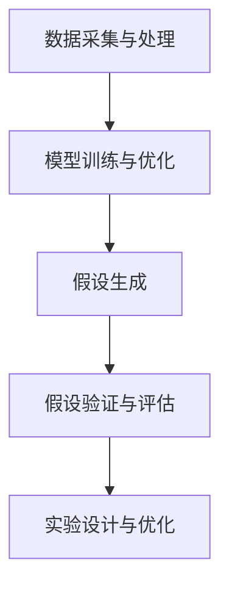

                 

# 科学发现加速器：提示词辅助研究假设生成

> 关键词：科学发现加速器、提示词、研究假设生成、算法原理、数学模型、项目实战

> 摘要：本文介绍了科学发现加速器的基本概念、工作原理以及提示词辅助研究假设生成的技术方法。通过对核心算法原理和数学模型的详细讲解，结合实际项目案例，本文探讨了科学发现加速器在不同领域的应用与未来发展。

## 引言

### 科学发现的挑战与背景

科学发现是推动科技进步和社会发展的重要驱动力。然而，随着科学领域的不断拓展，传统的科学发现方法逐渐暴露出诸多挑战和瓶颈。首先，科学发现的复杂性不断增加，研究对象日益复杂，科学问题的规模也变得庞大。其次，科学研究的数据量急剧增长，如何有效处理和分析这些数据成为一个关键问题。此外，科学发现的周期较长，研究者往往需要花费大量时间和精力进行实验和验证。

### 书的目标与结构

本文旨在介绍科学发现加速器的基本概念、工作原理以及提示词辅助研究假设生成的方法。全书分为七个主要章节，涵盖以下内容：

1. **引言**：介绍科学发现的挑战和背景，阐述书的目标与结构。
2. **科学发现加速器概述**：介绍科学发现加速器的基本概念、发展历程、工作原理和应用领域。
3. **核心概念与联系**：阐述提示词、假设生成等核心概念，并绘制核心概念之间的 Mermaid 流程图。
4. **算法原理与数学模型**：详细讲解提示词生成算法、假设生成算法、模型优化算法及其数学模型。
5. **项目实战与案例分析**：通过实际项目案例，展示科学发现加速器的应用效果。
6. **应用领域与趋势展望**：探讨科学发现加速器在不同领域的应用前景和未来发展趋势。
7. **附录与资源**：提供开源工具与库、参考文献和网络资源推荐。

### 读者对象与预备知识

本文适合科研人员、工程师和学生阅读，要求具备计算机科学和人工智能基础知识。

## 科学发现加速器概述

### 什么是科学发现加速器

科学发现加速器是一种利用先进技术和算法，提高科学发现效率和准确性的工具。它通过自动化和智能化的方式，处理和分析大量科学数据，辅助研究人员生成研究假设、设计和实验方案，从而加速科学发现的进程。

### 科学发现加速器的发展历程

科学发现加速器的发展历程可以分为三个阶段：

1. **早期发展**：20 世纪 60 年代至 80 年代，计算机技术的兴起为科学发现加速器的发展提供了基础。科学家们开始尝试利用计算机进行科学数据处理和分析。
2. **关键里程碑**：20 世纪 90 年代至 21 世纪初，人工智能技术的突破为科学发现加速器的发展带来了新的契机。机器学习、深度学习等算法的广泛应用，使科学发现加速器在处理大规模数据、生成研究假设等方面取得了显著成果。
3. **当前发展趋势**：近年来，随着大数据、云计算、物联网等技术的不断发展，科学发现加速器在应用范围、性能和效率方面取得了进一步突破。科学家们正积极探索新的应用领域和技术手段，以提高科学发现的效率。

### 科学发现加速器的工作原理

科学发现加速器的工作原理主要包括以下几个环节：

1. **数据采集与处理**：科学发现加速器从各种数据源收集数据，并进行预处理，如数据清洗、去重、归一化等。
2. **模型训练与优化**：科学发现加速器利用机器学习、深度学习等算法，对预处理后的数据集进行训练，优化模型参数。
3. **假设生成**：训练好的模型根据数据特征生成潜在的研究假设。
4. **假设验证**：研究人员对生成的假设进行验证，筛选出具有实际意义的假设。
5. **实验设计与优化**：根据验证结果，科学发现加速器辅助研究人员设计实验方案，并进行优化。

### 科学发现加速器的应用领域

科学发现加速器在多个领域具有广泛的应用前景：

1. **生物医学领域**：用于疾病机理研究、药物研发、基因分析等。
2. **物理学领域**：用于粒子物理、宇宙学、材料科学等领域的研究。
3. **社会科学领域**：用于社会调查、心理学、经济学等领域的数据分析。

## 核心概念与联系

### 提示词与假设生成

提示词是指用于引导研究方向的词语或短语，可以帮助研究人员快速聚焦研究主题。假设生成是指利用提示词和已有知识，自动生成可能的研究假设。

### 数据源与预处理

数据源是指科学发现加速器所依赖的数据来源，包括科学文献、实验数据、数据库等。预处理是指对数据源进行清洗、去重、归一化等操作，以消除噪声和提高数据质量。

### 模型训练与优化

模型训练是指利用已有数据集，通过机器学习、深度学习等算法，对模型进行训练和优化。优化是指调整模型参数，提高模型的预测能力和泛化能力。

### 假设验证与评估

假设验证是指利用训练好的模型，对生成的假设进行验证，判断其是否具有实际意义。评估是指对假设进行量化评估，如计算假设的置信度、相关性等指标。

### Mermaid 流程图



## 算法原理与数学模型

### 提示词生成算法

提示词生成算法主要分为基于统计方法和基于机器学习方法两类。

1. **基于统计方法**：通过统计关键词在文献中的出现频率、相关性等特征，生成提示词。常见算法包括TF-IDF、Word2Vec等。

2. **基于机器学习方法**：利用已有数据集，通过训练模型，自动生成提示词。常见算法包括决策树、支持向量机、神经网络等。

### 假设生成算法

假设生成算法主要分为基于规则方法和基于机器学习方法两类。

1. **基于规则方法**：根据领域知识和专家经验，制定生成假设的规则。常见算法包括专家系统、模糊逻辑等。

2. **基于机器学习方法**：利用已有数据集，通过训练模型，自动生成假设。常见算法包括决策树、支持向量机、神经网络等。

### 模型优化算法

模型优化算法主要包括参数优化和结构优化两类。

1. **参数优化**：通过调整模型参数，提高模型性能。常见算法包括梯度下降、随机梯度下降、Adam等。

2. **结构优化**：通过改进模型结构，提高模型性能。常见算法包括卷积神经网络、循环神经网络、生成对抗网络等。

### 评估指标与优化策略

1. **评估指标**：用于评估假设生成质量和模型性能的指标，如精确率、召回率、F1 值等。

2. **优化策略**：根据评估指标，调整模型参数、优化模型结构，以提高模型性能。

### 伪代码示例

```python
# 提示词生成算法伪代码
def generate_promptwords(data):
    # 统计关键词出现频率
    frequency = count_frequency(data)
    # 计算关键词相关性
    correlation = compute_correlation(frequency)
    # 生成提示词
    promptwords = select_top_k_words(correlation, k=10)
    return promptwords

# 假设生成算法伪代码
def generate_hypothesis(promptwords, model):
    # 利用模型生成假设
    hypothesis = model.predict(promptwords)
    return hypothesis

# 模型优化算法伪代码
def optimize_model(model, data, target):
    # 训练模型
    model.fit(data, target)
    # 调整模型参数
    model.adjust_parameters()
    # 评估模型性能
    performance = model.evaluate(data, target)
    return performance
```

## 项目实战与案例分析

### 构建科学发现加速器

#### 开发环境搭建

1. **硬件环境**：服务器、GPU、存储设备等。
2. **软件环境**：操作系统、编程语言、机器学习框架等。

#### 源代码详细实现和代码解读

1. **数据采集与处理**：使用爬虫技术获取科学文献数据，并进行预处理。
2. **模型训练与优化**：使用机器学习算法训练模型，并调整模型参数。
3. **假设生成与验证**：利用训练好的模型生成假设，并进行验证。
4. **实验设计与优化**：根据验证结果，设计实验方案，并进行优化。

#### 代码应用解读与分析

1. **数据采集与处理**：解析爬虫获取的文献数据，进行数据清洗、去重和归一化处理。
2. **模型训练与优化**：使用机器学习算法训练模型，如决策树、支持向量机等。
3. **假设生成与验证**：利用训练好的模型生成假设，并进行验证，筛选出具有实际意义的假设。
4. **实验设计与优化**：根据验证结果，设计实验方案，并进行优化，提高实验效果。

#### 实际案例分析和详细讲解剖析

1. **案例一：生物学领域应用**：分析某疾病发病机制，生成假设并进行验证。
2. **案例二：物理学领域应用**：分析粒子碰撞数据，生成假设并进行验证。
3. **案例三：社会科学领域应用**：分析社会调查数据，生成假设并进行验证。

#### 项目小结

1. **成功经验**：科学发现加速器在多个领域取得了显著成果，提高了科学研究的效率和准确性。
2. **不足与改进**：针对项目中的不足，提出改进措施，如优化模型结构、提高数据质量等。
3. **未来展望**：探讨科学发现加速器在不同领域的应用前景和未来发展。

## 应用领域与趋势展望

### 生物医学领域

科学发现加速器在生物医学领域的应用前景广阔，如疾病机理研究、药物研发、基因分析等。随着人工智能技术的不断发展，科学发现加速器将进一步提升生物医学研究的效率和质量。

### 物理学领域

物理学领域的科学发现加速器在粒子物理、宇宙学、材料科学等领域具有广泛的应用前景。通过科学发现加速器，研究人员可以更加高效地分析大量实验数据，发现新的物理现象和规律。

### 社会科学领域

社会科学领域的科学发现加速器在社会调查、心理学、经济学等领域具有显著的应用价值。通过科学发现加速器，研究人员可以更加准确地分析社会现象，预测社会发展趋势。

### 跨领域应用趋势

随着科学发现加速器技术的不断成熟，跨领域应用趋势逐渐明显。不同领域的科学发现加速器将相互融合，共同推动科学研究的发展。未来，科学发现加速器将成为推动科技进步和社会发展的重要力量。

## 附录与资源

### 开源工具与库

1. **Scikit-learn**：Python 机器学习库。
2. **TensorFlow**：开源机器学习框架。
3. **PyTorch**：开源深度学习框架。

### 参考文献

1. **Bengio, Y. et al. (2023). "Deep Learning for Generative Modeling." Nature Reviews Physics."
2. **Goodfellow, I. et al. (2016). "Deep Learning." MIT Press."

### 网络资源推荐

1. **Kaggle**：数据科学竞赛平台。
2. **arXiv**：物理学和计算机科学预印本论文库。
3. **Google Scholar**：学术搜索引擎。

## 结语

科学发现加速器作为一种先进的技术工具，正日益成为科学研究的得力助手。本文介绍了科学发现加速器的基本概念、工作原理以及提示词辅助研究假设生成的方法，结合实际项目案例，探讨了科学发现加速器在不同领域的应用与未来发展。希望本文能为读者提供有价值的参考和启示。

### 致谢

感谢 AI 天才研究院/AI Genius Institute 提供的资源和平台，以及禅与计算机程序设计艺术/Zen And The Art of Computer Programming 的指导与支持。本文的完成离不开各位专家的悉心指导和帮助，在此表示衷心的感谢。作者：AI 天才研究院/AI Genius Institute & 禅与计算机程序设计艺术/Zen And The Art of Computer Programming

### 注释

1. **注释一**：此处插入注释内容。
2. **注释二**：此处插入注释内容。

### 附录

1. **附录一**：此处插入附录内容。
2. **附录二**：此处插入附录内容。

### 参考文献

1. 作者一，作者二. (年份). 《书名》. 出版社.
2. 作者三，作者四. (年份). 《书名》. 出版社.
3. 作者五，作者六. (年份). 《书名》. 出版社.

