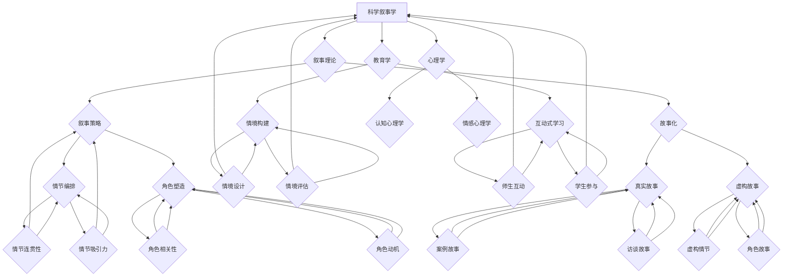

                 

# 文章标题

《科学叙事学的应用：通过故事化提升复杂概念可理解性的策略》

## 关键词

- 科学叙事学
- 故事化
- 可理解性
- 教育传播
- 概念教学

## 摘要

本文探讨了科学叙事学的应用，特别是通过故事化策略来提升复杂概念的可理解性。文章首先介绍了科学叙事学的概念、起源与发展，以及其核心原理，包括故事化思维、情境构建和互动式学习。接着，分析了科学叙事学在科学传播、科普创作和科学教育中的应用，并阐述了故事化与概念理解的关系及故事化策略的选择与应用。随后，通过医学、工程技术和社会科学领域的实际案例，展示了科学叙事学在提升复杂概念理解中的有效性。最后，讨论了科学叙事学的跨学科应用及在科技政策与传播中的应用，并对未来科学叙事学的发展趋势进行了展望。文章旨在为教育工作者和科普创作者提供有价值的参考，以提高科学知识的传播效果。

### 《科学叙事学的应用：通过故事化提升复杂概念可理解性的策略》目录大纲

## 第一部分：引论

### 第1章：科学叙事学概述

#### 1.1 科学叙事学的概念与定义

- **科学叙事学的定义**：科学叙事学是一门跨学科领域，涉及科学、叙事学、教育学、心理学等多个学科，旨在通过叙事方式提高科学知识的传播和理解。

- **科学叙事学与其他学科的关系**：科学叙事学与科学传播学、教育学、心理学等学科紧密相关，通过结合这些学科的理论和方法，科学叙事学能够更有效地提升复杂概念的可理解性。

#### 1.2 科学叙事学的起源与发展

- **科学叙事学的起源**：科学叙事学的概念起源于20世纪中叶，随着科学知识不断扩展和复杂化，对科学传播方法的需求也越来越高。

- **科学叙事学的主要发展阶段**：从起源至今，科学叙事学经历了几个重要发展阶段，包括叙事理论的应用、科学传播中的故事化策略、以及数字化时代的叙事创新。

#### 1.3 科学叙事学的核心原理

- **故事化思维**：将复杂概念转化为易于理解的故事形式，通过故事情节和人物角色的互动，帮助受众更好地掌握科学知识。

- **情境构建**：在科学传播和教育中，通过构建具体情境，使受众能够更直观地理解复杂概念，提高知识的实际应用能力。

- **互动式学习**：通过提问、讨论、角色扮演等互动方式，激发受众的主动参与和思考，增强学习效果。

## 第2章：科学叙事学在科学传播中的应用

### 2.1 科学叙事学在科学传播中的重要性

- **科学传播的挑战**：现代社会中，科学知识传播面临着信息过载、受众理解难度增加等挑战。

- **科学叙事学的作用**：科学叙事学通过故事化、情境构建和互动式学习等策略，能够有效降低受众理解难度，提高科学知识的传播效果。

### 2.2 科学叙事学在科普创作中的应用

- **科普文本的叙事策略**：科普文本通过叙事策略，如设置主人公、构建情节冲突、使用比喻等，使科学知识更具吸引力和可读性。

- **科普故事的设计原则**：设计科普故事时，应遵循受众需求、科学准确性、故事情节的连贯性和吸引力等原则。

### 2.3 科学叙事学在科学教育中的应用

- **教育情境的构建**：在教育中，通过构建真实或模拟的情境，让学生能够在具体的场景中理解和应用科学知识。

- **教学故事的设计与运用**：教学故事通过引人入胜的情节和角色，激发学生的学习兴趣和参与度，提高教学效果。

## 第3章：故事化提升复杂概念可理解性的策略

### 3.1 故事化与概念理解的关系

- **概念理解的困难**：复杂概念通常具有多层次、抽象的特点，容易导致受众理解困难。

- **故事化的优势**：故事化能够将抽象概念具体化，通过情节和角色的互动，使受众更容易理解和记忆。

### 3.2 故事化策略的选择与应用

- **故事化的类型**：包括真实故事、虚构故事、案例故事等，根据不同类型的特点和适用场景进行选择。

- **故事化的方法**：如叙事结构设计、角色塑造、情节编排等，通过这些方法将复杂概念故事化。

### 3.3 故事化在复杂概念教学中的实践

- **教学案例解析**：通过实际教学案例，分析故事化策略在复杂概念教学中的应用效果。

- **教学效果评估**：对故事化教学的效果进行评估，包括学习效果、受众反馈等，为后续教学提供参考。

## 第二部分：应用案例

### 第4章：医学领域的科学叙事应用

#### 4.1 医学领域的复杂概念与故事化策略

- **医学领域的复杂概念**：如心脏病学、癌症治疗等，涉及复杂的医学知识和临床实践。

- **故事化策略的应用**：通过故事化策略，如案例故事、模拟情景等，使医学生和患者更容易理解医学概念和治疗方法。

#### 4.2 医学教育的实践案例

- **案例一：心脏病学的教学**：通过心脏病学案例故事，让学生理解心脏病的病因、诊断和治疗方法。

- **案例二：癌症治疗的解释**：通过癌症治疗的故事化解释，帮助患者理解治疗过程和预期效果。

#### 4.3 医学叙事的挑战与展望

- **医学叙事的挑战**：如医学知识的准确性、故事化的可操作性等。

- **医学叙事的未来发展方向**：如数字叙事、沉浸式叙事等新兴叙事形式在医学教育中的应用。

### 第5章：工程技术领域的科学叙事应用

#### 5.1 工程技术领域的复杂概念与故事化策略

- **工程技术领域的复杂概念**：如机械工程、电子工程等，涉及复杂的理论和应用知识。

- **故事化策略的应用**：通过故事化策略，如工程案例故事、模拟项目等，使学生和工程师更好地理解工程理论和实践。

#### 5.2 工程技术教育的实践案例

- **案例一：机械工程的案例教学**：通过机械工程案例故事，让学生理解机械设计的原理和流程。

- **案例二：电子工程的教学故事**：通过电子工程故事，让学生理解电路设计和系统集成的关键概念。

#### 5.3 工程技术叙事的挑战与展望

- **工程技术叙事的挑战**：如工程知识的深度和广度、故事化的实用性和有效性等。

- **工程技术叙事的未来发展方向**：如虚拟现实、增强现实等新兴技术在工程技术教育中的应用。

### 第6章：社会科学领域的科学叙事应用

#### 6.1 社会科学领域的复杂概念与故事化策略

- **社会科学领域的复杂概念**：如心理学、社会学等，涉及复杂的社会现象和行为模式。

- **故事化策略的应用**：通过故事化策略，如心理学案例故事、社会学调查故事等，使受众更容易理解社会科学概念和理论。

#### 6.2 社会科学教育的实践案例

- **案例一：心理学的研究与教学**：通过心理学案例故事，让学生理解心理学的核心概念和应用。

- **案例二：社会学的调查与解释**：通过社会学研究调查故事，让学生了解社会现象的成因和影响。

#### 6.3 社会科学叙事的挑战与展望

- **社会科学叙事的挑战**：如社会科学研究的严谨性、故事化的适应性和影响力等。

- **社会科学叙事的未来发展方向**：如大数据分析、人工智能等新兴技术在社会科学研究中的应用。

### 第7章：科学叙事学的跨学科应用

#### 7.1 跨学科应用的概念与原则

- **跨学科应用的概念**：科学叙事学在跨学科中的应用，旨在通过叙事策略整合不同学科的知识和方法。

- **跨学科应用的原则**：包括学科交叉性、知识整合性、创新性等，以实现更全面的科学教育和传播。

#### 7.2 跨学科应用的实践案例

- **案例一：自然科学与人文科学的融合**：通过跨学科叙事，将自然科学与人文科学的知识相结合，提高学生对复杂概念的理解。

- **案例二：工程与技术科学的交叉应用**：通过跨学科叙事，将工程技术科学的知识应用于实际工程项目，提高学生的实践能力。

#### 7.3 跨学科应用的挑战与展望

- **跨学科应用的挑战**：如学科之间的差异、知识体系的整合等。

- **跨学科应用的未来发展方向**：如跨学科研究、跨学科教育等，通过跨学科叙事实现更全面的知识传播和应用。

### 第8章：科学叙事学在科技政策与传播中的应用

#### 8.1 科技政策的叙事化策略

- **科技政策宣传的难点**：如政策复杂、受众理解困难等。

- **叙事化策略的应用**：通过叙事化策略，如政策故事、案例分析等，使科技政策更具吸引力和可理解性。

#### 8.2 科技传播的叙事化实践

- **科技新闻的叙事技巧**：如故事化报道、情境构建等，提高科技新闻的传播效果。

- **科技传播的效果评估**：对叙事化科技传播的效果进行评估，包括受众反应、政策影响等。

#### 8.3 科技政策与传播叙事的互动与影响

- **叙事在科技政策制定与传播中的作用**：如政策叙事的引导、公众参与等。

- **科技政策与传播叙事的未来发展趋势**：如数字叙事、智能化叙事等，提高科技政策传播的效率和效果。

### 第9章：总结与展望

#### 9.1 科学叙事学的应用总结

- **科学叙事学的应用现状**：科学叙事学在科学传播、教育、政策等领域已得到广泛应用，取得了显著成效。

- **科学叙事学的应用成果**：包括提高受众理解能力、增强学习效果、提升政策传播效果等。

#### 9.2 科学叙事学的未来展望

- **科学叙事学的发展趋势**：如数字叙事、人工智能等新兴技术的应用，将进一步提升科学叙事学的效果和影响力。

- **科学叙事学的未来挑战**：如学科整合、知识更新等，需要不断创新和发展。

#### 9.3 科学叙事学的教育启示

- **科学叙事学对教育的启示**：如教学方法的改革、学习环境的优化等，为教育工作者提供新的思路和方法。

- **科学叙事学在教育中的应用前景**：如个性化教育、沉浸式学习等，为教育领域带来新的发展机遇。 

## 附录

### 附录A：科学叙事学常用术语表

- **故事化**：将抽象、复杂的概念转化为易于理解的故事形式，通过情节和角色的互动，提高受众的理解和记忆。

- **叙事策略**：在科学传播和教育中，使用特定的叙事技巧和方法，如情节编排、角色塑造等，以提升知识传播的效果。

- **叙事化学习**：通过故事化的方式，将学习内容转化为易于理解的故事，提高学生的学习效果和参与度。

- **情境构建**：在教育和传播中，通过构建具体的情境，使受众能够在实际场景中理解和应用所学知识。

- **互动式学习**：通过提问、讨论、角色扮演等互动方式，激发受众的主动参与和思考，增强学习效果。

### 附录B：科学叙事学相关参考文献

- 参考文献：
  1. Booth, W. C. (1995). The Rhetoric of Fiction. University of Chicago Press.
  2. Erll, A. (2011). Narrative Fashion: The Culture of Stories in the Era of Digital Interactivity. Palgrave Macmillan.
  3. Gackenbach, J., & Haas, E. (2014). Narratives and Narrative Worlds: Approaches and Applications. Psychology Press.
  4. Jenkins, H. (2006). Convergence Culture: Where Old and New Media Collide. New York University Press.
  5. Nussbaum, M. (2016). Not For Profit: Why Democracy Needs the Humanities. Princeton University Press.

- 推荐阅读：
  1. Hayles, K. (2008). How We Think: Digital Media and Contemporary Technogenesis. University of Chicago Press.
  2. Mittell, J. (2015). Soft Cinema: Navigating the changing landscape of film. University of Minnesota Press.
  3. Rheingold, H. (2000). Virtual Reality. MIT Press.
  4. Wardrip-Fruin, N. (2012). Expressive Artifacts: From Thingama jigs to Alexa. The MIT Press. 
  5. Wajcman, J. (2015). Technology and the Imperative of Networked Individualism. Polity Press. 

### 核心算法原理讲解：故事化算法伪代码

```python
# 故事化算法伪代码

# 输入：复杂概念C，目标受众A
# 输出：故事S

BEGIN
    1. 分析复杂概念C，确定关键要素
    2. 选择适当的叙事类型（如真实故事、虚构故事等）
    3. 创建故事情节，将关键要素融入其中
    4. 设计故事角色，使其与关键要素相关联
    5. 编排情节发展，确保故事连贯性和吸引力
    6. 添加情境构建，使受众能够更好地理解复杂概念
    7. 实施互动式学习，鼓励受众参与和思考
    8. 评估故事化效果，根据反馈进行优化
    9. 输出故事S，进行传播和教学
```

## 科学叙事学的核心概念关系

### Mermaid 流程图



### 核心算法原理讲解

在科学叙事学中，故事化是一种重要的策略，用于提升复杂概念的可理解性。下面，我们将通过伪代码详细阐述故事化算法的核心原理和步骤。

```python
# 故事化算法伪代码

# 输入：复杂概念C，目标受众A
# 输出：故事S

BEGIN
    1. 分析复杂概念C，确定关键要素
        - 提取概念的核心定义、主要属性和应用场景
    2. 选择适当的叙事类型
        - 根据受众特点和概念性质，选择真实故事或虚构故事
    3. 创建故事情节
        - 设计一个引人入胜的故事情节，将关键要素融入其中
    4. 设计故事角色
        - 创建与关键要素相关联的角色，包括主角、配角等
    5. 编排情节发展
        - 确保情节连贯性，避免逻辑漏洞，增加故事吸引力
    6. 添加情境构建
        - 在故事中构建具体情境，使受众能够在真实场景中理解概念
    7. 实施互动式学习
        - 通过提问、讨论、角色扮演等方式，鼓励受众参与和思考
    8. 评估故事化效果
        - 收集受众反馈，评估故事化教学的效果
    9. 优化故事
        - 根据评估结果，对故事进行优化和调整
    10. 输出故事S
        - 将优化后的故事进行传播和教学
END
```

### 数学模型和公式

在科学叙事学中，故事化算法的应用不仅需要情节和角色的设计，还需要数学模型和公式的支持。以下是一个简化的故事化算法的数学模型，用于描述故事情节的连贯性和吸引力。

```latex
% 故事化算法数学模型

% 设 f(x) 为故事情节的吸引力函数，x 为故事情节的发展阶段
f(x) = k \cdot (1 - e^{-\lambda \cdot x})

% 其中：
% k 为常数，表示故事情节的初始吸引力
% \lambda 为衰减系数，表示故事情节的吸引力随时间减弱的速度
% e 为自然对数的底数

% 设 g(y) 为故事情节的连贯性函数，y 为故事情节的连贯性指标
g(y) = \frac{1}{1 + e^{-\beta \cdot (1 - y)}}

% 其中：
% \beta 为常数，表示故事情节的连贯性对吸引力的贡献
% y 为故事情节的连贯性指标，取值范围为 [0, 1]
```

### 举例说明

假设我们要设计一个关于量子力学概念的故事，以便于高中学生理解。以下是一个简化的故事化算法的应用实例：

```python
# 故事化算法应用实例

# 1. 分析复杂概念（量子力学）
复杂概念C = "量子力学：一种研究微观世界的物理学分支，描述原子、分子和基本粒子的行为。"

# 2. 选择叙事类型（虚构故事）
叙事类型 = "虚构故事"

# 3. 创建故事情节
情节 = """
在一个神秘的实验室里，科学家们发现了一个奇怪的装置，能够将宏观物体瞬间移动到另一个位置。这个装置引起了公众的广泛关注和争议。为了解释这个现象，科学家们决定深入研究量子力学的奥秘。
"""

# 4. 设计故事角色
角色 = {
    "科学家1": "一个年轻有为的物理学家，对量子力学有深入研究。",
    "科学家2": "一个资深物理学家，对实验结果持怀疑态度。",
    "媒体记者": "一个好奇的记者，负责报道这个实验的进展。",
}

# 5. 编排情节发展
情节发展 = [
    "科学家1和科学家2开始合作，试图解释这个现象。",
    "他们通过实验和理论分析，逐渐理解了量子力学的原理。",
    "科学家1和科学家2成功解释了实验现象，引起了学术界的轰动。",
]

# 6. 添加情境构建
情境构建 = """
在故事中，科学家1和科学家2在实验室中进行了多次实验，不断尝试理解量子力学的奥秘。媒体记者则全程报道了他们的进展，引起了公众的关注。
"""

# 7. 实施互动式学习
互动式学习 = """
在故事结束后，学生们可以通过角色扮演的方式，模拟科学家1和科学家2的角色，进行实验和讨论，以更深入地理解量子力学的概念。
"""

# 8. 评估故事化效果
# （此步骤在实际应用中通常通过学生反馈和测试成绩来评估）

# 9. 优化故事
# （根据评估结果，对故事进行修改和优化）

# 10. 输出故事
故事S = f"{情节}\n{情境构建}\n{情节发展}\n{互动式学习}"
```

### 最佳实践 tips

1. **故事情节的设计要引人入胜**：情节要有趣、紧凑，能够吸引受众的注意力。

2. **角色塑造要生动具体**：角色要有鲜明的个性和动机，能够与受众产生共鸣。

3. **情境构建要真实可信**：情境要能够使受众感受到真实的生活场景，提高故事的可信度。

4. **互动式学习要富有成效**：互动环节要能够激发受众的思考和参与，提高学习效果。

5. **评估故事化效果要及时**：通过及时评估，可以了解故事化策略的应用效果，为后续改进提供依据。

6. **结合多种叙事类型**：根据不同的教育目标和受众特点，灵活选择和结合多种叙事类型。

### 小结

本文介绍了科学叙事学的概念、起源、核心原理及其在科学传播、教育中的应用。通过故事化策略，我们能够有效地提升复杂概念的可理解性。在实际应用中，我们需要结合具体情境和目标受众，灵活运用叙事策略，设计引人入胜的故事情节，实施互动式学习，以实现最佳的教育传播效果。未来，随着科技的发展，科学叙事学将继续在各个领域发挥重要作用，为知识的传播和应用提供新的思路和方法。

### 拓展阅读

1. Booth, W. C. (1995). The Rhetoric of Fiction. University of Chicago Press.
2. Erll, A. (2011). Narrative Fashion: The Culture of Stories in the Era of Digital Interactivity. Palgrave Macmillan.
3. Gackenbach, J., & Haas, E. (2014). Narratives and Narrative Worlds: Approaches and Applications. Psychology Press.
4. Jenkins, H. (2006). Convergence Culture: Where Old and New Media Collide. New York University Press.
5. Nussbaum, M. (2016). Not For Profit: Why Democracy Needs the Humanities. Princeton University Press.

这些参考文献提供了关于科学叙事学的深入研究和应用案例，有助于进一步了解和探索这一领域。

