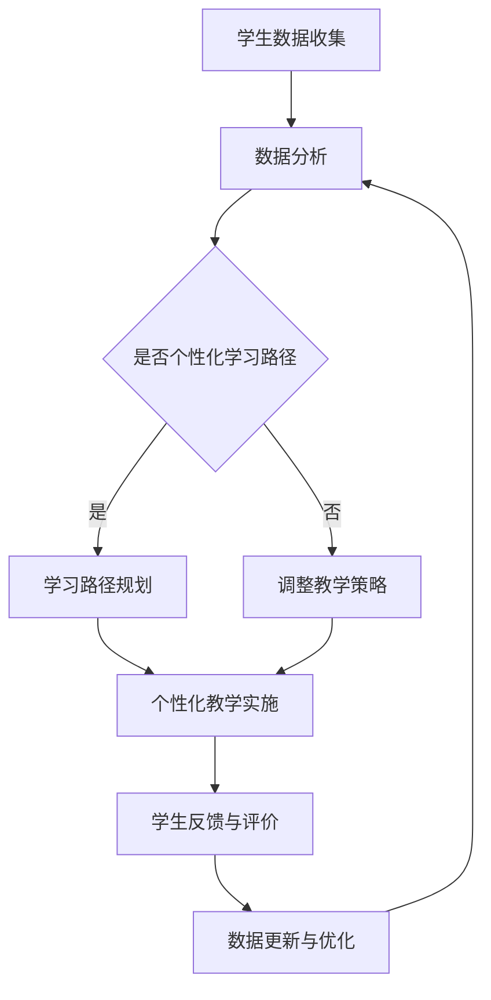

                 

# 科学教育的个性化：因材施教提升每个人的世界理解能力

## 关键词

- 个性化教育
- 因材施教
- 科学教育
- 世界理解能力
- 人工智能
- 教育技术

## 摘要

科学教育在现代社会中扮演着至关重要的角色，而个性化教育作为现代教育的发展趋势，旨在通过因材施教的方法，提升每个人的世界理解能力。本文将深入探讨科学教育的个性化需求与挑战，介绍个性化教育技术基础，探讨个性化教育的教学策略，分析个性化教育实践应用，并展望个性化教育的未来与发展。通过这一系列的探讨，旨在为教育工作者和学者提供有价值的参考，以推动个性化教育在科学领域的深入研究和广泛应用。

## 目录大纲

### 第一部分：科学教育个性化概述

#### 第1章：科学教育个性化需求与挑战

- **1.1** 科学教育个性化概述
- **1.2** 因材施教的历史与发展
- **1.3** 个性化教育的国际趋势与案例分析
- **1.4** 科学教育个性化的目标与意义

#### 第2章：个性化教育技术基础

- **2.1** 个性化教育技术的发展历程
- **2.2** 数据驱动教育分析
- **2.3** 人工智能与个性化教育的融合

#### 第3章：个性化教育的教学策略

- **3.1** 个性化学习环境的构建
- **3.2** 个性化学习路径的设计
- **3.3** 个性化评价与反馈机制

### 第二部分：个性化教育实践应用

#### 第4章：个性化学习工具与平台

- **4.1** 个性化学习工具概述
- **4.2** 主流个性化学习平台介绍
- **4.3** 个性化学习工具的应用案例

#### 第5章：个性化教学案例研究

- **5.1** 案例研究方法与流程
- **5.2** 个性化教学案例精选
- **5.3** 案例效果评估与反思

#### 第6章：个性化教育的政策与支持

- **6.1** 个性化教育的政策背景
- **6.2** 支持个性化教育的政策与实践
- **6.3** 个性化教育发展的未来展望

### 第三部分：个性化教育与未来

#### 第7章：个性化教育的挑战与解决方案

- **7.1** 个性化教育面临的挑战
- **7.2** 技术伦理与隐私保护
- **7.3** 个性化教育解决方案的探讨

#### 第8章：个性化教育与未来社会

- **8.1** 个性化教育与未来教育
- **8.2** 个性化教育对社会的影响
- **8.3** 个性化教育与可持续发展

### 附录

#### 附录A：个性化教育相关资源与工具

- **A.1** 个性化教育研究资源
- **A.2** 主流个性化学习工具与平台
- **A.3** 个性化教育相关研究论文与书籍

### 核心概念与联系

#### 个性化教育的 Mermaid 流�程图



### 核心算法原理讲解

#### 个性化推荐算法伪代码

```plaintext
function personalizedRecommendationAlgorithm(studentData, courseData):
    // 步骤1：数据预处理
    processedStudentData = preprocessStudentData(studentData)
    processedCourseData = preprocessCourseData(courseData)

    // 步骤2：特征提取
    studentFeatures = extractFeatures(processedStudentData)
    courseFeatures = extractFeatures(processedCourseData)

    // 步骤3：推荐模型训练
    model = trainModel(studentFeatures, courseFeatures)

    // 步骤4：生成推荐列表
    recommendationList = model.generateRecommendationList()

    // 步骤5：返回推荐结果
    return recommendationList
```

### 数学模型和数学公式

#### 马尔可夫决策过程（MDP）公式

$$
V(s, a) = \sum_{s'} p(s'|s, a) \cdot \sum_{r} r(s', a) \cdot \gamma^{s'-s}
$$

其中，$V(s, a)$ 表示在状态 $s$ 下采取动作 $a$ 的期望效用值，$p(s'|s, a)$ 表示在状态 $s$ 下采取动作 $a$ 后转移到状态 $s'$ 的概率，$r(s', a)$ 表示在状态 $s'$ 下采取动作 $a$ 的即时回报，$\gamma$ 是折扣因子。

### 引言

### 科学教育与个性化教育

科学教育是培养下一代理解自然现象、掌握科学方法和创新思维的重要途径。然而，传统的科学教育模式往往强调统一的教学内容和方法，忽视了个体的差异性和学习需求。随着社会的进步和科技的发展，个性化教育逐渐成为现代教育的重要趋势，旨在通过因材施教的方法，提升每个人的世界理解能力。

个性化教育不仅关注学生的学术成绩，更注重培养他们的个性化素质，包括批判性思维、创新能力和团队合作精神。通过个性化的教育方式，学生能够根据自己的兴趣、能力和需求，选择适合自己的学习内容和学习路径，从而最大化地发挥自己的潜能。

科学教育的个性化需求源于以下几个方面：

1. **学习差异**：每个学生都有不同的学习背景、知识结构和认知能力，传统的一刀切教育模式难以满足他们的个性化需求。

2. **科技进步**：信息技术和人工智能的发展为个性化教育提供了新的手段和工具，使得教育更加智能化和个性化。

3. **社会需求**：社会对创新人才的需求日益增加，个性化教育能够更好地培养具有独立思考和创新能力的人才。

科学教育个性化的挑战主要在于如何平衡个性化需求与教育资源有限之间的矛盾，如何在保证教育质量的前提下，实现因材施教。同时，个性化教育也需要面对技术伦理和隐私保护等问题。

本文将深入探讨科学教育的个性化需求与挑战，介绍个性化教育技术基础，探讨个性化教育的教学策略，分析个性化教育实践应用，并展望个性化教育的未来与发展。通过这一系列的探讨，旨在为教育工作者和学者提供有价值的参考，以推动个性化教育在科学领域的深入研究和广泛应用。

### 第一部分：科学教育个性化概述

#### 第1章：科学教育个性化需求与挑战

科学教育个性化需求与挑战是当前教育领域的一个热点话题。随着社会的发展，教育正在从以教师为中心的传统模式转向以学生为中心的个性化教育模式。个性化教育不仅注重学生的学术成绩，更强调培养学生的个性化素质，包括批判性思维、创新能力和团队合作精神。

### 1.1 科学教育个性化概述

科学教育个性化是指根据学生的兴趣、能力、学习习惯和需求，为他们提供个性化的学习内容和学习路径。这种教育模式旨在满足每个学生的个性化需求，帮助他们最大化地发挥自己的潜能。

科学教育个性化的核心在于因材施教。因材施教是指根据学生的实际情况，制定合适的教学目标和教学内容，采取不同的教学方法和策略，使每个学生都能在适合自己的学习环境中获得最佳的学习效果。

个性化教育的特点包括：

1. **个性化学习内容**：根据学生的兴趣和需求，提供多样化的学习内容。
2. **个性化学习路径**：根据学生的实际情况，设计不同的学习路径，使每个学生都能找到适合自己的学习节奏。
3. **个性化评价**：采用多样化的评价方法，全面评估学生的学业水平和个性化素质。
4. **个性化支持**：提供个性化的学习支持和指导，帮助学生解决学习中的困难和问题。

### 1.2 因材施教的历史与发展

因材施教的理念在我国有着悠久的历史。孔子是我国古代著名的教育家，他提出了“因材施教”的教育原则，认为每个学生都有自己的特点和优势，教育者应根据学生的实际情况，采取不同的教育方法和策略。

在国外，因材施教的理念也得到了广泛的应用。例如，美国教育心理学家布鲁姆提出了“掌握学习”理论，强调每个学生都有掌握学习的能力，只要给予足够的时间和适当的教学，每个学生都能达到预期的学习目标。

随着科技的发展，因材施教的理念得到了进一步的完善和发展。现代教育技术，如人工智能和大数据分析，为个性化教育提供了新的手段和工具。通过数据驱动教育分析，教育者可以更加精准地了解学生的学习情况，为每个学生制定个性化的学习方案。

### 1.3 个性化教育的国际趋势与案例分析

个性化教育已经成为全球教育改革的重要方向。许多国家都在探索和实践个性化教育模式，以提升教育质量和培养创新人才。

1. **美国**：美国教育强调学生的个性化发展，通过个性化课程和个性化评价，培养学生的批判性思维和创新能力。例如，美国的“翻转课堂”模式，通过将课堂内容前置，让学生在课前自主学习和掌握知识，课堂上则进行讨论和解决问题，实现了个性化学习。

2. **芬兰**：芬兰的教育以其高质量和个性化教育而闻名。芬兰的学校注重培养学生的自主学习能力和创造力，通过灵活的课程设置和个性化指导，让学生根据自己的兴趣和能力进行学习。

3. **中国**：我国在教育改革中也积极推动个性化教育。例如，上海等地的一些学校已经开始尝试个性化教育模式，通过大数据分析和人工智能技术，为每个学生提供个性化的学习方案。

### 1.4 科学教育个性化的目标与意义

科学教育个性化的目标是通过因材施教，提高每个学生的科学素养和创新能力，培养具有国际竞争力的优秀人才。

科学教育个性化的意义在于：

1. **提升教育质量**：个性化教育能够更好地满足学生的学习需求，提高学习效果，提升教育质量。
2. **培养创新人才**：个性化教育鼓励学生自主探索和创造，培养具有创新能力和批判性思维的人才。
3. **促进社会公平**：个性化教育能够更好地照顾到不同学生的学习差异，促进教育公平，让每个学生都有机会获得优质教育。

总之，科学教育个性化是当前教育改革的重要方向，对于提升学生的科学素养和创新能力具有深远的影响。通过深入研究和实践个性化教育，我们可以为每个学生提供更好的教育，培养出更多的优秀人才。

### 个性化教育技术基础

#### 第2章：个性化教育技术的发展历程

个性化教育技术的发展历程可以分为三个阶段：早期的传统个性化教育、中期的计算机辅助个性化教育、以及现代的大数据和人工智能个性化教育。

### 2.1 早期的传统个性化教育

早期的个性化教育主要依赖于教师对学生的了解和观察。教师通过课堂观察、与学生交流等方式，了解学生的兴趣、能力和学习习惯，然后根据这些信息制定个性化的教学计划和教学内容。这种方法虽然具有一定的效果，但受限于教师的时间和精力，难以大规模应用。

### 2.2 中期的计算机辅助个性化教育

随着计算机技术的发展，计算机辅助个性化教育开始出现。计算机辅助个性化教育通过计算机程序记录和分析学生的学习行为和成绩，根据分析结果提供个性化的学习建议和资源。这种方法大大提高了个性化教育的效率，使得个性化教育能够覆盖更多的学生。代表性的系统包括智能教学系统（ITS）和学习管理系统（LMS）。

### 2.3 现代的大数据和人工智能个性化教育

现代个性化教育技术主要依托大数据和人工智能。大数据技术能够收集和分析大量的学生数据，包括学习行为、考试成绩、兴趣爱好等，从而为个性化教育提供丰富的数据支持。人工智能技术，如机器学习和深度学习，能够通过分析这些数据，为学生推荐合适的学习内容和学习路径。

### 2.4 个性化教育技术的发展现状

当前，个性化教育技术已经取得了一些显著成果。例如，基于大数据和人工智能的学习推荐系统已经在许多学校和应用场景中得到应用，取得了良好的效果。然而，个性化教育技术仍然面临一些挑战，如数据隐私和安全问题、教育技术的普及和培训等。

### 2.5 个性化教育技术的未来趋势

未来的个性化教育技术将更加智能化和个性化。随着人工智能技术的不断进步，个性化教育将能够更加精准地满足每个学生的学习需求。同时，虚拟现实（VR）和增强现实（AR）等新技术也将为个性化教育提供更加丰富的学习体验。此外，区块链技术有望解决个性化教育中的数据隐私和安全问题，为个性化教育的发展提供更加可靠的保障。

总之，个性化教育技术的发展为科学教育个性化提供了强有力的支持。通过深入研究和应用个性化教育技术，我们可以更好地满足学生的个性化需求，提升科学教育的质量和效果。

#### 第2章：个性化教育技术基础

##### 2.1 个性化教育技术的发展历程

个性化教育技术的发展历程经历了从传统教育到现代科技的转变，这一过程不仅反映了教育理念的进步，也体现了技术的不断创新。以下是个性化教育技术发展的几个关键阶段：

**1. 早期教育理念的萌芽**

在20世纪初期，以约翰·杜威为代表的教育学家开始提出“以学生为中心”的教育理念，这一理念强调根据学生的个性、兴趣和能力进行教学，从而实现了教育初步的个性化。然而，由于技术和资源的限制，这一理念在当时并未得到广泛的应用。

**2. 计算机辅助教育的发展**

随着计算机技术的兴起，20世纪80年代，计算机辅助教育（CAI，Computer-Assisted Instruction）开始崭露头角。计算机辅助教育通过编程，提供有针对性的教学材料和学习路径，使得学生可以根据自己的学习进度进行学习。这一阶段，代表性的系统如SIMULPLAN和Harcourt Brace Jovanovich（HBJ）的计算机教材，标志着个性化教育技术的初步应用。

**3. 互联网和Web技术的发展**

进入21世纪，互联网和Web技术的发展极大地推动了个性化教育的发展。在线教育平台和资源如MOOC（大规模开放在线课程）使得学生可以随时随地访问个性化的学习内容。这一阶段，个性化教育技术开始融入大数据和数据分析，通过对学习行为的跟踪和分析，为学生提供个性化的学习建议。

**4. 大数据和人工智能的兴起**

近年来，大数据和人工智能技术的快速发展为个性化教育带来了新的契机。大数据技术能够收集和分析大量的学生数据，包括学习行为、兴趣爱好、学习能力等，从而为个性化教育提供丰富的数据支持。人工智能技术，如机器学习、深度学习和自然语言处理，能够通过这些数据为学生提供智能化的学习推荐和个性化指导。

**5. 虚拟现实和增强现实的应用**

虚拟现实（VR）和增强现实（AR）技术的应用为个性化教育带来了新的可能。通过虚拟现实技术，学生可以沉浸在一个高度仿真的学习环境中，进行实践操作和探索学习。增强现实技术则可以将虚拟内容与现实世界相结合，提供更加互动和丰富的学习体验。

##### 2.2 数据驱动教育分析

数据驱动教育分析是个性化教育技术的核心，它通过收集、处理和分析大量的学生数据，为学生提供个性化的学习建议和指导。以下是数据驱动教育分析的关键步骤：

**1. 数据收集**

数据收集是数据驱动教育分析的第一步。通过学习管理系统（LMS）、在线测试系统、学生互动平台等工具，可以收集到学生的行为数据、学习进度数据、成绩数据、兴趣爱好数据等。

**2. 数据处理**

收集到的数据通常是非常原始和复杂的，需要进行处理和清洗。数据处理包括数据清洗、数据整合、数据归一化等步骤，以确保数据的质量和一致性。

**3. 数据分析**

数据分析是数据驱动教育分析的核心。通过统计分析、机器学习算法等手段，可以从大量的学生数据中提取有用的信息，如学习趋势、学习效果、学习困难点等。

**4. 数据可视化**

数据可视化是将分析结果以图表、图形等形式呈现，使得教育者、学生和家长能够直观地理解数据分析的结果。数据可视化工具如Tableau、Power BI等，可以帮助教育者更好地进行数据分析和决策。

**5. 数据应用**

数据分析的结果可以应用于个性化学习路径的设计、学习资源的推荐、学习效果的评估等多个方面。通过数据应用，可以为学生提供更加精准和高效的学习体验。

##### 2.3 人工智能与个性化教育的融合

人工智能（AI）在个性化教育中的应用，使得个性化教育变得更加智能化和个性化。以下是人工智能在个性化教育中的几个关键应用：

**1. 智能推荐系统**

智能推荐系统通过分析学生的行为数据和学习历史，为学生推荐适合他们的学习内容和资源。例如，基于内容推荐的系统可以根据学生的学习兴趣和知识点，推荐相关的学习资料；基于协同过滤的系统能够根据其他学生的学习行为和偏好，为学生推荐相似的学习资源。

**2. 智能学习助手**

智能学习助手（如聊天机器人、虚拟教师等）通过自然语言处理技术，可以与学生进行实时互动，提供学习指导、解答疑问、反馈学习效果等。智能学习助手不仅可以模拟人类的交互方式，还能根据学生的反馈和学习行为，动态调整教学策略。

**3. 智能评估系统**

智能评估系统利用机器学习算法，自动分析和评估学生的学习效果。通过分析学生的学习行为、考试成绩、作业表现等数据，智能评估系统可以识别学生的学习难点和薄弱环节，为学生提供针对性的辅导和建议。

**4. 个性化学习路径规划**

个性化学习路径规划系统通过分析学生的兴趣、能力和学习目标，为学生制定个性化的学习计划。例如，系统可以根据学生的学习进度和考试成绩，自动调整学习路径，确保学生能够高效地达到学习目标。

**5. 智能教学反馈机制**

智能教学反馈机制利用数据分析和人工智能技术，对学生的学习行为和教学效果进行实时监控和反馈。通过分析学生的学习数据，智能反馈系统可以识别教学中的问题，提出改进建议，帮助教师优化教学方法和策略。

总之，人工智能与个性化教育的融合，为个性化教育的发展带来了新的机遇和挑战。通过利用人工智能技术，我们可以为学生提供更加个性化和高效的学习体验，进一步提升科学教育的质量和效果。

##### 第3章：个性化教育的教学策略

个性化教育强调因材施教，通过个性化的教学策略，满足每个学生的学习需求。以下将从个性化学习环境的构建、个性化学习路径的设计以及个性化评价与反馈机制三个方面，探讨个性化教育的教学策略。

### 3.1 个性化学习环境的构建

个性化学习环境的构建是实施个性化教育的基础。一个良好的个性化学习环境应具备以下几个特点：

**1. 灵活的学习空间**

个性化的学习环境应提供灵活的学习空间，允许学生根据自己的需求和兴趣选择学习地点。例如，图书馆、开放教室、休息区等不同类型的学习空间，以满足不同学生的偏好。

**2. 个性化的学习工具**

根据学生的需求和学习内容，提供多样化的学习工具，如电子设备、软件应用、实验器材等。这些工具应具有高度的可定制性，使学生能够根据自己的学习节奏和方式使用。

**3. 互动的学习氛围**

个性化学习环境应鼓励学生之间的互动和合作，通过讨论、分享、协作等方式，增强学生的学习体验。教师应作为引导者和促进者，创造一个开放、包容的学习氛围。

**4. 支持性服务**

个性化学习环境还应提供支持性服务，如学习辅导、心理咨询、技术支持等。这些服务有助于学生解决学习中的问题和困难，提高学习效果。

### 3.2 个性化学习路径的设计

个性化学习路径的设计是实施个性化教育的关键步骤。设计个性化学习路径时，应考虑以下因素：

**1. 学生的兴趣和需求**

根据学生的兴趣和需求，设计个性化的学习路径。教师可以通过问卷调查、访谈等方式，了解学生的兴趣点和学习需求，确保学习内容与学生实际需求相符。

**2. 学生的知识水平和能力**

个性化学习路径的设计应考虑学生的知识水平和能力。对于基础知识较为薄弱的学生，可以提供补充性学习内容，帮助他们夯实基础知识；对于能力较强的学生，可以提供拓展性学习内容，激发他们的潜能。

**3. 学习目标和评价标准**

明确每个阶段的学习目标和评价标准，使学生学习有方向、有目标。学习目标和评价标准应具有可操作性和可量化性，便于教师和学生的监督和评估。

**4. 学习资源和教学策略**

根据学习目标和内容，提供丰富的学习资源和教学策略。例如，通过在线课程、实验项目、讨论小组等多种形式，满足不同学生的学习需求。

### 3.3 个性化评价与反馈机制

个性化评价与反馈机制是保证个性化教育质量的重要手段。以下是构建个性化评价与反馈机制的几个关键步骤：

**1. 多元化的评价方法**

采用多元化的评价方法，如笔试、口试、项目展示、合作学习等，全面评估学生的学习效果。这些评价方法应能够反映学生的知识、能力、态度等多方面素质。

**2. 定期的反馈和指导**

教师应定期给予学生反馈和指导，帮助学生了解自己的学习进展和存在的问题。反馈应具有针对性、及时性和建设性，鼓励学生改进学习方法和策略。

**3. 个性化的评价标准**

根据学生的个性化学习路径和特点，制定个性化的评价标准。评价标准应关注学生的全面发展，不仅限于学术成绩，还包括思维能力、创新能力、团队合作能力等。

**4. 反馈机制的优化**

通过不断优化反馈机制，提高反馈的效果。例如，教师可以组织学习小组，让学生相互评价和反馈，促进学生的自我反思和自我提高。

总之，个性化教育的教学策略应围绕学生的学习需求和发展，构建灵活、多样的学习环境，设计个性化的学习路径，建立有效的评价与反馈机制。通过这些策略的实施，可以更好地满足学生的个性化需求，提升他们的学习效果和综合素质。

#### 第4章：个性化学习工具与平台

个性化学习工具与平台是实施个性化教育的重要载体。随着科技的进步，各种个性化学习工具和平台不断涌现，为教育工作者和学生提供了丰富的选择。以下是针对个性化学习工具与平台的主要类型、主流平台介绍及实际应用案例的探讨。

### 4.1 个性化学习工具的主要类型

个性化学习工具主要包括以下几类：

**1. 学习管理系统（LMS）**

学习管理系统是一种基于互联网的学习平台，它提供了课程管理、作业提交、成绩记录、在线测试等功能。LMS可以帮助教师轻松管理课程和学生学习进度，同时为学生提供个性化的学习资源。

**2. 个性化推荐系统**

个性化推荐系统利用大数据和人工智能技术，根据学生的兴趣、学习历史和表现，为学生推荐合适的学习资源。这类系统可以大大提高学生的学习效率和兴趣。

**3. 互动式学习工具**

互动式学习工具包括在线讨论区、虚拟实验室、游戏化学习平台等，它们通过互动和游戏化的方式，提高学生的学习积极性和参与度。

**4. 个性化评估工具**

个性化评估工具通过自动化的考试和评估，实时监测学生的学习效果和进步情况，为教师和学生提供个性化的反馈和指导。

### 4.2 主流个性化学习平台介绍

目前，市场上主流的个性化学习平台主要包括以下几种：

**1. Coursera**

Coursera是一个全球性的在线学习平台，提供大量由世界顶尖大学和机构开设的在线课程。Coursera利用其强大的推荐系统，根据学生的学习历史和兴趣，推荐相关的课程和学习资源。

**2. edX**

edX是由哈佛大学和麻省理工学院共同创办的在线学习平台，提供丰富的在线课程和学位项目。edX的平台同样具备强大的个性化推荐功能，可以帮助学生找到适合自己的学习路径。

**3. Khan Academy**

Khan Academy是一个非营利性的在线学习组织，提供免费的在线课程和学习资源。Khan Academy的个性化推荐系统能够根据学生的学习情况，推荐相应的课程和练习题，帮助学生巩固学习内容。

**4. Duolingo**

Duolingo是一个流行的语言学习平台，它通过游戏化的学习方式，帮助学生掌握新的语言技能。Duolingo的推荐系统能够根据学生的语言水平和学习进度，提供个性化的学习任务。

### 4.3 个性化学习工具的应用案例

以下是一些个性化学习工具在实际应用中的案例：

**1. Codecademy**

Codecademy是一个在线编程学习平台，它通过互动式教学和实时反馈，帮助学生掌握编程技能。Codecademy的个性化推荐系统能够根据学生的学习进度和表现，推荐适合的学习路径和练习题。

**2. Duolingo for Kids**

Duolingo for Kids是专为儿童设计的语言学习应用，它通过游戏化的方式，激发儿童学习外语的兴趣。Duolingo for Kids的个性化推荐系统能够根据儿童的年龄和学习水平，提供适当的学习内容。

**3. Khan Academy Schools**

Khan Academy Schools是一个面向学校的个性化学习平台，它提供了丰富的数学、科学、计算机科学等学科的学习资源。Khan Academy Schools的个性化评估工具可以帮助教师实时了解学生的学习情况，并提供针对性的辅导。

**4. Edmodo**

Edmodo是一个面向K-12教育的学习管理平台，它提供了作业提交、在线测试、课堂互动等功能。Edmodo的个性化推荐系统能够根据学生的学习行为和成绩，为学生推荐相关的学习资源和活动。

总之，个性化学习工具和平台的发展为科学教育个性化提供了强大的支持。通过这些工具和平台，教育工作者可以更好地满足学生的个性化需求，提高教学效果。同时，学生也能通过这些工具，自主选择学习内容和路径，提高学习效率和兴趣。

### 第5章：个性化教学案例研究

#### 5.1 案例研究方法与流程

个性化教学案例研究是探讨个性化教育在实际教学中的应用效果的重要途径。以下是进行个性化教学案例研究的具体方法和流程：

**1. 研究设计**

研究设计是案例研究的基础，需要明确研究的对象、目标、方法和数据收集方式。研究目标应具体、可操作，如提升学生的学习成绩、培养创新能力和批判性思维等。研究方法可以采用定量和定性相结合的方式，以确保研究的全面性和深度。

**2. 数据收集**

数据收集是案例研究的关键步骤，包括学生背景数据、学习行为数据、考试成绩和教师反馈等。数据收集方式可以采用问卷调查、观察记录、访谈和在线学习平台数据分析等。问卷调查和观察记录可以获取学生的主观体验和客观行为数据；访谈和在线学习平台数据分析可以深入了解学生的学习过程和教师的教学策略。

**3. 数据分析**

数据分析是对收集到的数据进行整理、分类和分析，以揭示数据背后的规律和趋势。数据分析方法包括统计分析、内容分析和案例研究法。统计分析用于量化分析学生的学习效果和变化趋势；内容分析用于分析学生的学习内容和学习路径；案例研究法则用于深入探讨个性化教育实践中的具体问题和解决方案。

**4. 结果展示**

结果展示是将分析结果以图表、文字和多媒体形式呈现，以便教育工作者、学生和研究人员理解和应用。结果展示应注重数据的可视化，如通过图表展示学生的成绩变化、学习行为分布等；同时，应结合实际案例，展示个性化教学策略的实施效果和学生的反馈。

**5. 案例讨论**

案例讨论是案例研究的总结和反思阶段，旨在通过分析案例中的成功经验和存在的问题，提出改进建议和未来研究方向。讨论内容应包括个性化教学策略的有效性、学生参与度和学习效果，以及教师和学生在个性化教育实践中的困惑和挑战。

#### 5.2 个性化教学案例精选

以下是几个典型的个性化教学案例，分别展示了个性化教育在数学、科学和语言学习中的应用：

**1. 案例一：数学个性化教学**

案例背景：某中学数学教师利用个性化学习平台，为不同水平的学生提供个性化的数学学习资源。

实施过程：

- **学生背景数据收集**：教师通过问卷调查和课堂观察，了解学生的数学基础、学习兴趣和学习习惯。
- **个性化学习路径设计**：根据学生的背景数据，教师为学生设计了不同的学习路径，如基础知识巩固、拓展性练习和高级问题解决。
- **学习资源推荐**：个性化学习平台根据学生的学习进度和兴趣，推荐相应的数学学习资源，包括视频讲解、练习题和在线讨论。
- **实时反馈与调整**：教师通过平台的数据分析功能，实时了解学生的学习情况，提供针对性的辅导和指导。

效果评估：

- **学生成绩提升**：通过个性化学习，学生的数学成绩显著提升，特别是基础较差的学生进步明显。
- **学习积极性提高**：学生反馈个性化学习使他们对数学学习产生了更大的兴趣，学习积极性显著提高。

**2. 案例二：科学个性化教学**

案例背景：某小学科学教师利用虚拟实验室和在线讨论平台，开展个性化科学探究活动。

实施过程：

- **探究主题选择**：教师根据学生的兴趣和科学课程要求，选择适合的探究主题，如环境保护、能源利用等。
- **个性化学习路径设计**：教师为学生设计了不同的探究路径，包括实验操作、数据分析和讨论交流等。
- **虚拟实验室应用**：学生通过虚拟实验室进行实验操作，模拟真实实验环境，提高实践能力。
- **在线讨论与分享**：学生通过在线讨论平台，分享探究心得和成果，促进互动和合作学习。

效果评估：

- **科学素养提升**：学生通过个性化科学探究，对科学知识和科学方法有了更深入的理解，科学素养显著提升。
- **创新能力培养**：学生在探究活动中展示出较强的创新思维和解决问题的能力，创新能力得到培养。

**3. 案例三：语言个性化教学**

案例背景：某中学英语教师利用在线学习平台和智能推荐系统，进行个性化英语学习。

实施过程：

- **学生兴趣和学习需求调查**：教师通过问卷调查和访谈，了解学生的英语学习兴趣和学习需求。
- **个性化学习资源推荐**：智能推荐系统根据学生的学习兴趣和需求，推荐相应的英语学习资源，如听力练习、口语交流和阅读材料。
- **互动式学习活动**：教师组织在线讨论、角色扮演和小组项目等活动，提高学生的英语实际运用能力。
- **学习效果评估**：通过在线测试和作业反馈，教师评估学生的学习效果，并提供个性化辅导。

效果评估：

- **英语水平提高**：学生通过个性化英语学习，英语听说读写能力显著提升，特别是口语和阅读能力。
- **学习兴趣增加**：学生反馈个性化学习使他们对英语学习产生了更大的兴趣，学习积极性明显提高。

#### 5.3 案例效果评估与反思

通过对上述个性化教学案例的评估与反思，我们可以总结出以下结论：

**1. 个性化教学的有效性**

个性化教学在提高学生学业成绩、培养创新能力和增强学习兴趣方面具有显著效果。尤其是对于学习基础较差的学生，个性化教学能够帮助他们克服困难，提高学习效果。

**2. 个性化教学的优势**

个性化教学的优势在于能够充分满足学生的个性化需求，提高教学效果和学生的学习体验。同时，个性化教学也促进了教师的专业发展和教学创新。

**3. 个性化教学的挑战**

个性化教学面临的主要挑战包括：个性化数据收集和分析的准确性、个性化学习资源的质量和可获取性，以及教师适应个性化教学的技能和培训。

**4. 未来展望**

未来个性化教学的发展将更加依赖于人工智能和大数据技术的应用，通过智能化推荐系统和个性化学习平台，为学生提供更加精准和高效的学习体验。同时，教育政策和社会支持也将对个性化教学的发展产生重要影响。

总之，个性化教学案例研究为我们展示了个性化教育在实践中的应用效果和优势，同时也揭示了其面临的挑战和未来发展方向。通过不断探索和完善个性化教学策略，我们可以更好地满足学生的个性化需求，提高科学教育的质量和效果。

### 第6章：个性化教育的政策与支持

个性化教育作为现代教育的重要趋势，不仅需要技术创新，还需要政策支持和实践探索。以下是针对个性化教育的政策背景、政策与实践，以及未来发展展望的探讨。

#### 6.1 个性化教育的政策背景

个性化教育的兴起与全球教育改革浪潮密切相关。随着全球化和信息化的发展，教育面临前所未有的挑战和机遇。为了适应新时代的需求，各国纷纷推进教育改革，个性化教育成为其中的重要方向。

在中国，教育部在《教育信息化2.0行动计划》中明确提出要推进教育现代化，发展智能化、个性化、网络化教育。同时，《国家教育事业发展“十三五”规划》也强调了要创新教育模式，推进个性化学习。

在国际上，美国、芬兰、新加坡等国家也在积极推动个性化教育。例如，美国通过《每个学生成功法案》（Every Student Succeeds Act）加强了对个性化教育的支持；芬兰则通过《学习环境中个性化学习的实施框架》推进个性化教育实践。

#### 6.2 支持个性化教育的政策与实践

为了支持个性化教育的发展，各国政府采取了一系列政策和措施：

**1. 资金支持**

政府通过增加教育投入，支持个性化教育的研究、试点和推广。例如，中国政府在《“十三五”国家教育信息化发展规划》中提出，到2020年教育信息化资金总投入要达到1500亿元。

**2. 政策法规**

制定相关政策和法规，为个性化教育的实施提供法律保障。例如，美国通过《每个学生成功法案》明确了个性化教育的目标和要求，芬兰则通过立法确保个性化教育的实施。

**3. 教育改革**

推进教育体制改革，鼓励学校探索个性化教育模式。例如，中国在一些地区开展了“基于大数据的个性化学习”试点项目，美国和芬兰等国家也在学校层面进行了个性化教育的探索和实践。

**4. 师资培训**

加强教师培训，提高教师实施个性化教育的能力。例如，芬兰通过“教师个性化培训计划”，为教师提供个性化的专业发展机会，美国则通过在线教育平台为教师提供个性化培训课程。

#### 6.3 个性化教育发展的未来展望

个性化教育的未来发展将受到以下因素的影响：

**1. 技术进步**

随着人工智能、大数据、区块链等技术的不断发展，个性化教育将更加智能化和精准化。这些技术将为个性化学习资源的开发和个性化教学策略的制定提供强有力的支持。

**2. 政策支持**

政府的政策支持将是推动个性化教育发展的重要动力。未来，各国政府将进一步完善相关政策，为个性化教育提供更加有力的支持。

**3. 社会参与**

社会各界的参与是推动个性化教育发展的重要保障。未来，企业、非政府组织和教育机构将共同参与个性化教育的研究和实践，推动个性化教育的普及和深化。

**4. 教育公平**

个性化教育的目标之一是实现教育公平。未来，个性化教育的发展将更加注重公平性，确保每个学生都能获得适合自己的教育机会。

总之，个性化教育作为现代教育的重要趋势，具有广阔的发展前景。通过政策支持、技术创新和社会参与，个性化教育将不断发展和完善，为培养具有国际竞争力的创新人才提供有力支持。

### 第7章：个性化教育的挑战与解决方案

个性化教育虽然在提升教育质量和培养学生个性化素质方面具有巨大潜力，但在实施过程中也面临诸多挑战。以下将探讨个性化教育面临的挑战，并提出相应的解决方案。

#### 7.1 个性化教育面临的挑战

**1. 数据隐私与安全问题**

个性化教育依赖于大量学生数据的收集和分析，因此数据隐私和安全成为一大挑战。学生个人信息泄露和数据滥用可能引发严重的伦理和法律问题。

**2. 教育资源的不均衡**

不同地区、学校和家庭的教育资源存在显著差异，这导致个性化教育的实施受到限制。经济条件较差的地区和学校可能无法获得足够的资金和技术支持，影响个性化教育的普及和质量。

**3. 教师专业发展的不足**

个性化教育对教师的专业素质提出了更高的要求，但很多教师在技术应用、教学方法和个人能力方面存在不足，难以有效实施个性化教育。

**4. 教育评价体系的改革**

传统的教育评价体系往往注重标准化测试和学术成绩，难以全面反映个性化教育的效果。改革评价体系以适应个性化教育需求是一个长期而复杂的任务。

#### 7.2 技术伦理与隐私保护

在个性化教育中，技术伦理和隐私保护是必须重视的问题。以下是几个关键方面：

**1. 数据使用规范**

明确数据使用规范，确保数据收集、存储和使用过程中的合法性和合规性。学校和教育机构应制定详细的数据管理政策，明确数据收集的目的、范围和用途。

**2. 数据加密与保护**

采用数据加密技术，确保学生数据的传输和存储安全。同时，建立数据保护机制，防止未经授权的访问和泄露。

**3. 学生知情同意**

在收集和使用学生数据时，应确保学生和家长知情并同意。通过透明的方式告知他们数据收集的目的、方法和使用情况，尊重他们的隐私权利。

**4. 数据匿名化**

在进行数据分析时，应尽量采用匿名化处理，减少对学生个人隐私的侵犯。例如，通过去除个人标识信息，仅保留与学习相关的基础数据。

#### 7.3 个性化教育解决方案的探讨

针对上述挑战，以下是一些可能的解决方案：

**1. 加强政策支持**

政府应加大对个性化教育的政策支持力度，通过立法和资金投入，保障个性化教育的实施。同时，建立跨部门的数据共享机制，促进教育资源的均衡配置。

**2. 提升教师培训**

通过系统化的培训项目，提升教师的专业能力和技术应用水平。例如，开展个性化教学技术研讨会、在线课程和工作坊，帮助教师掌握个性化教育的理论和实践技能。

**3. 引入第三方评估**

引入第三方专业机构对个性化教育的实施效果进行评估，确保评价的公正性和科学性。同时，建立反馈机制，根据评估结果不断优化个性化教育策略。

**4. 强化技术伦理教育**

在学生和教师中加强技术伦理教育，提高他们对数据隐私和安全问题的认识。通过案例分析和讨论，培养学生的数据保护意识和责任感。

**5. 开发多样化的教育技术**

鼓励企业、高校和科研机构开发多样化、高质量的个性化教育技术，如智能推荐系统、个性化学习平台和虚拟现实教学工具，为学生提供丰富、个性化的学习体验。

总之，个性化教育在发展过程中面临诸多挑战，但通过政策支持、技术保障和多方合作，可以逐步克服这些挑战，推动个性化教育的普及和发展，为培养具有国际竞争力的创新人才提供有力支持。

### 第8章：个性化教育与未来社会

个性化教育作为现代教育的发展趋势，不仅对教育领域产生了深远影响，还对整个社会产生了重要影响。本章节将探讨个性化教育与未来教育、个性化教育对社会的影响以及个性化教育与可持续发展之间的关系。

#### 8.1 个性化教育与未来教育

未来教育的发展方向将是高度个性化、智能化和可持续化。个性化教育作为其中的关键组成部分，将在以下几个方面推动未来教育的发展：

**1. 学习方式的变革**

个性化教育通过提供个性化的学习路径和资源，改变了传统的学习方式。未来的学习将更加灵活和自主，学生可以根据自己的兴趣和需求，随时随地选择学习内容和方式，实现真正的“按需学习”。

**2. 教育资源的共享**

个性化教育促进了教育资源的共享和优化。通过互联网和大数据技术，优质教育资源可以跨越地域限制，实现全球范围内的共享，从而提高教育的普及率和质量。

**3. 教育公平的实现**

个性化教育有助于缩小教育差距，实现教育公平。通过个性化教育，不同背景和条件的学生都能获得适合自己的教育资源，从而提高他们的学习机会和成就。

**4. 创新型人才的培养**

个性化教育注重培养学生的创新能力、批判性思维和团队合作能力，为未来社会培养具有国际竞争力的创新型人才。这种教育模式能够激发学生的潜能，促进他们的全面发展。

#### 8.2 个性化教育对社会的影响

个性化教育对社会产生了广泛而深远的影响，主要表现在以下几个方面：

**1. 促进社会公平**

个性化教育通过提供平等的学习机会，有助于实现社会公平。每个学生都能根据自己的能力和需求选择适合自己的学习路径，从而提高他们的学习成果和社会地位。

**2. 培养创新型人才**

个性化教育强调培养学生的创新能力和批判性思维，为社会输送具有创新精神的人才。这些创新型人才将成为社会进步和发展的驱动力，推动经济和社会的持续发展。

**3. 提升教育质量**

个性化教育通过提供个性化的学习资源和指导，有助于提高教育的质量。学生能够在适合自己的学习环境中学习，提高学习效果和满意度，从而提升整体教育质量。

**4. 改变就业市场**

个性化教育培养的学生具有更强的综合素质和创新能力，能够适应快速变化的就业市场。这种教育模式有助于提高就业率，促进社会的稳定和发展。

#### 8.3 个性化教育与可持续发展

个性化教育与可持续发展有着密切的联系，主要体现在以下几个方面：

**1. 环境教育的强化**

个性化教育可以通过提供个性化的环境教育资源和实践活动，提高学生对环境保护的认识和参与度，培养他们的环保意识，从而推动可持续发展。

**2. 跨学科教育的融合**

个性化教育强调跨学科教育，培养学生的综合能力和跨学科思维。这种教育模式有助于解决复杂的社会问题，推动可持续发展。

**3. 社区参与与互动**

个性化教育鼓励学生参与社区服务和互动，通过实际活动体验社会责任和可持续发展的重要性。这种教育模式有助于培养具有社会责任感和参与精神的公民。

**4. 持续学习与终身教育**

个性化教育强调终身学习和持续发展，鼓励学生在整个生命中不断学习和成长。这种教育模式有助于提高社会的整体素质和创新能力，推动可持续发展。

总之，个性化教育对未来的教育和社会发展具有深远的影响。通过个性化教育，我们可以培养具有创新能力、社会责任感和可持续发展意识的公民，为构建一个更加公平、繁荣和可持续的社会贡献力量。

### 附录A：个性化教育相关资源与工具

个性化教育的发展离不开丰富的资源和工具的支持。以下是一些个性化教育相关的研究资源、主流学习工具与平台，以及相关研究论文和书籍的推荐。

#### 附录A.1 个性化教育研究资源

1. **在线研究数据库：**

   - **ERIC（Educational Resources Information Center）**：ERIC提供了丰富的教育资源，包括教育研究报告、论文和期刊。

   - **JSTOR（Journal Storage）**：JSTOR收录了大量的学术期刊，涵盖了教育领域的众多研究论文。

   - **Google Scholar**：Google Scholar是一个强大的学术搜索引擎，可以帮助用户查找个性化教育相关的学术文献。

2. **政府与机构报告：**

   - **联合国教科文组织（UNESCO）**：UNESCO发布了关于教育发展的多个报告，包括个性化教育的相关内容。

   - **美国教育研究协会（AERA）**：AERA提供了关于个性化教育的政策和研究成果报告。

   - **中国教育技术协会**：中国教育技术协会发布了一系列关于个性化教育的政策文件和研究成果。

#### 附录A.2 主流个性化学习工具与平台

1. **学习管理系统（LMS）：**

   - **Moodle**：Moodle是一个开源的学习管理系统，提供了丰富的个性化学习功能。

   - **Canvas**：Canvas是一个功能强大的LMS，支持个性化课程设计和学生个性化反馈。

   - **Blackboard**：Blackboard是一个广泛使用的商业LMS，提供了丰富的学习工具和个性化推荐功能。

2. **个性化推荐系统：**

   - **Coursera**：Coursera提供了个性化课程推荐，根据学生的学习历史和兴趣推荐相关课程。

   - **edX**：edX同样提供了个性化的课程推荐功能，帮助学生找到适合自己的学习路径。

   - **Khan Academy**：Khan Academy利用个性化推荐系统，根据学生的表现和进度推荐练习题和视频。

3. **互动式学习工具：**

   - **Codecademy**：Codecademy提供了个性化的编程学习资源，通过互动式教学帮助学生学习编程。

   - **Duolingo**：Duolingo提供了个性化的语言学习工具，通过游戏化的方式帮助学生掌握新语言。

   - **Quizlet**：Quizlet是一个互动式学习平台，提供了多种学习工具，如闪卡、游戏等，帮助学生进行个性化学习。

#### 附录A.3 个性化教育相关研究论文与书籍

1. **论文推荐：**

   - **“Personalized Learning: A Systematic Literature Review”**：该论文系统综述了个性化教育的研究成果，提供了丰富的文献引用。

   - **“The Role of Technology in Personalized Learning”**：该论文探讨了技术在个性化教育中的应用，分析了人工智能和大数据在个性化教育中的作用。

   - **“Student-Centered Learning in the Age of Big Data”**：该论文探讨了大数据在个性化教育中的应用，强调了数据驱动的学习模式。

2. **书籍推荐：**

   - **《个性化学习：理论与实践》**：这本书详细介绍了个性化教育的概念、方法和实践，对教育工作者和研究者具有重要参考价值。

   - **《个性化教学：构建以学生为中心的教育体系》**：这本书从教学实践的角度出发，探讨了个性化教学的策略和方法。

   - **《数据驱动的教育创新》**：这本书探讨了大数据技术在教育中的应用，为个性化教育提供了理论基础和实践指导。

通过上述资源和工具，教育工作者和研究者可以深入了解个性化教育的理论和实践，为科学教育的个性化发展提供有力支持。希望这些推荐能够帮助读者在个性化教育的道路上取得更大的进步。

