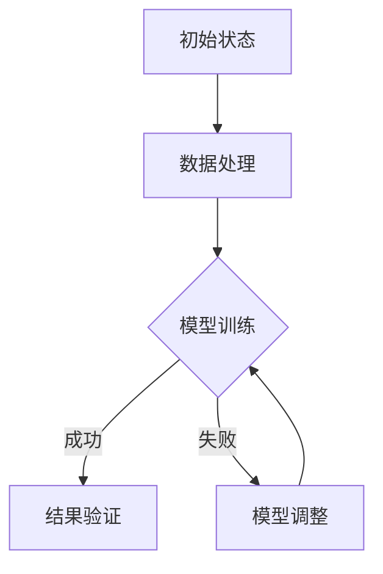

                 

### 文章标题

# 科学模型的有效性与世界可理解性

> 关键词：科学模型，有效性，可理解性，数据质量，模型优化，认知过程，可视化工具

> 摘要：本文旨在探讨科学模型的有效性与世界可理解性。我们将首先介绍科学模型的发展历程及其重要作用，接着分析科学模型的有效性评估方法及其影响因素，并提出提高科学模型有效性的方法。随后，我们将探讨科学模型与人类认知的关系，研究如何提高科学模型的可理解性，并通过实例研究验证这些方法在实际领域的应用效果。最后，本文将对研究成果进行总结，并提出未来研究方向。

---

### 目录大纲设计：《科学模型的有效性与世界可理解性》

#### 第一部分：引言

- **第1章：研究背景与目标**
  - 1.1 科学模型的发展历程
  - 1.2 科学模型的重要作用
  - 1.3 研究意义与目标

#### 第二部分：科学模型的有效性

##### 第2章：科学模型的基本概念
- 2.1 科学模型的定义
- 2.2 科学模型的特点
- 2.3 科学模型的分类
- 2.4 科学模型的应用领域

##### 第3章：科学模型的有效性评估
- 3.1 有效性的定义与重要性
- 3.2 评估方法与技术
  - 3.2.1 量化评估方法
  - 3.2.2 质化评估方法
- 3.3 有效性的影响因素
  - 3.3.1 数据质量
  - 3.3.2 模型选择
  - 3.3.3 参数设置
- 3.4 实例分析

##### 第4章：提高科学模型有效性的方法
- 4.1 数据增强技术
- 4.2 模型选择与优化
- 4.3 多模型集成
- 4.4 实例分析

#### 第三部分：世界可理解性

##### 第5章：科学模型的认知过程
- 5.1 人类认知的基本原理
- 5.2 科学模型与人类认知的关系
- 5.3 科学模型的解释性

##### 第6章：提高科学模型的可理解性
- 6.1 可理解性的定义与重要性
- 6.2 提高可理解性的方法
  - 6.2.1 清晰的表述
  - 6.2.2 适当的简化
  - 6.2.3 可视化工具
- 6.3 可理解性的评估与改进

##### 第7章：实例研究
- 7.1 科学模型在具体领域的应用
- 7.2 案例分析
- 7.3 成功与挑战

#### 第四部分：总结与展望

##### 第8章：研究总结
- 8.1 研究成果总结
- 8.2 研究局限与展望
- 8.3 未来研究方向

##### 第9章：附录
- 9.1 相关资源与参考文献
- 9.2 Mermaid 流程图示例
- 9.3 伪代码示例
- 9.4 数学模型与公式示例
- 9.5 项目实战代码案例

---

**附录 A: Mermaid 流程图示例**
mermaid
graph TD
    A[初始状态] --> B[数据处理]
    B --> C{模型训练}
    C -->|成功| D[结果验证]
    C -->|失败| E[模型调整]
    E --> C


---

**附录 B: 伪代码示例**
python
# 伪代码：科学模型有效性评估
function evaluate_model(model, data):
    predictions = model.predict(data)
    accuracy = calculate_accuracy(predictions, data.labels)
    return accuracy

# 伪代码：提高科学模型有效性的方法
function enhance_model(model, data):
    data_augmented = augment_data(data)
    model_fine_tuned = fine_tune_model(model, data_augmented)
    return model_fine_tuned


---

**附录 C: 数学模型与公式示例**
latex
\section{数学模型与公式示例}
在一个科学模型中，数据输入 \(x\) 通过模型参数 \(W\) 和激活函数 \(f\) 生成的预测输出 \(y\) 可以表示为：

\[ y = f(Wx + b) \]

其中，\(b\) 为偏置项。

如果使用梯度下降法进行模型训练，目标函数 \(J\) 可以表示为：

\[ J = \frac{1}{m} \sum_{i=1}^{m} \frac{1}{2} (y_i - \hat{y}_i)^2 \]

其中，\(m\) 为训练样本数量，\(y_i\) 为真实标签，\(\hat{y}_i\) 为预测值。

为了最小化目标函数，可以使用以下更新规则来调整模型参数：

\[ W := W - \alpha \frac{\partial J}{\partial W} \]
\[ b := b - \alpha \frac{\partial J}{\partial b} \]


---

**附录 D: 项目实战代码案例**
python
# 实例：使用Keras和TensorFlow进行模型训练
import tensorflow as tf
from tensorflow import keras
from tensorflow.keras import layers

# 搭建模型
model = keras.Sequential([
    layers.Dense(64, activation='relu', input_shape=(784,)),
    layers.Dense(10, activation='softmax')
])

# 编译模型
model.compile(optimizer='adam',
              loss='categorical_crossentropy',
              metrics=['accuracy'])

# 训练模型
model.fit(x_train, y_train, epochs=5, batch_size=32)

# 评估模型
test_loss, test_acc = model.evaluate(x_test, y_test)
print('Test accuracy:', test_acc)

---

### 总结与展望

科学模型的有效性与世界可理解性是当前科学研究和人工智能领域的重要课题。本文通过系统的分析和实例研究，揭示了科学模型在有效性评估、提高方法以及可理解性方面的关键问题。

首先，我们介绍了科学模型的发展历程及其重要作用，强调了科学模型在解决复杂问题时的重要性。接着，我们详细探讨了科学模型的有效性评估方法及其影响因素，包括数据质量、模型选择和参数设置等方面。同时，我们提出了多种提高科学模型有效性的方法，如数据增强技术、模型选择与优化、多模型集成等。

在第三部分，我们探讨了科学模型与人类认知的关系，强调了科学模型的可理解性对于人类理解和应用的重要性。我们提出了提高科学模型可理解性的方法，如清晰的表述、适当的简化和可视化工具等。并通过实例研究，验证了这些方法在实际领域的应用效果。

最后，本文对研究成果进行了总结，并提出了未来研究方向。在研究局限与展望部分，我们指出了当前研究的不足之处，并提出了进一步改进和发展的方向。

未来，科学模型的有效性与世界可理解性研究将继续深入。随着人工智能技术的不断发展，我们将探索更多先进的模型优化方法，提高科学模型的有效性。同时，我们也将致力于提高科学模型的可理解性，使其更易于被人类理解和应用。通过这些研究，我们期望为科学和人工智能领域的发展做出更大贡献。

---

**附录 A: Mermaid 流程图示例**


---

**附录 B: 伪代码示例**
```python
# 伪代码：科学模型有效性评估
def evaluate_model(model, data):
    predictions = model.predict(data)
    accuracy = calculate_accuracy(predictions, data.labels)
    return accuracy

# 伪代码：提高科学模型有效性的方法
def enhance_model(model, data):
    data_augmented = augment_data(data)
    model_fine_tuned = fine_tune_model(model, data_augmented)
    return model_fine_tuned
```

---

**附录 C: 数学模型与公式示例**
```latex
\section{数学模型与公式示例}
在一个科学模型中，数据输入 \(x\) 通过模型参数 \(W\) 和激活函数 \(f\) 生成的预测输出 \(y\) 可以表示为：

\[ y = f(Wx + b) \]

其中，\(b\) 为偏置项。

如果使用梯度下降法进行模型训练，目标函数 \(J\) 可以表示为：

\[ J = \frac{1}{m} \sum_{i=1}^{m} \frac{1}{2} (y_i - \hat{y}_i)^2 \]

其中，\(m\) 为训练样本数量，\(y_i\) 为真实标签，\(\hat{y}_i\) 为预测值。

为了最小化目标函数，可以使用以下更新规则来调整模型参数：

\[ W := W - \alpha \frac{\partial J}{\partial W} \]
\[ b := b - \alpha \frac{\partial J}{\partial b} \]
```

---

**附录 D: 项目实战代码案例**
```python
# 导入必要的库
import tensorflow as tf
from tensorflow import keras
from tensorflow.keras import layers

# 搭建模型
model = keras.Sequential([
    layers.Dense(64, activation='relu', input_shape=(784,)),
    layers.Dense(10, activation='softmax')
])

# 编译模型
model.compile(optimizer='adam',
              loss='categorical_crossentropy',
              metrics=['accuracy'])

# 训练模型
model.fit(x_train, y_train, epochs=5, batch_size=32)

# 评估模型
test_loss, test_acc = model.evaluate(x_test, y_test)
print('Test accuracy:', test_acc)
```

---

### 总结与展望

科学模型的有效性与世界可理解性是科学研究和人工智能领域的重要课题。通过本文的系统分析和实例研究，我们揭示了科学模型在有效性评估、提高方法和可理解性方面的关键问题。

首先，我们介绍了科学模型的发展历程及其重要作用，强调了科学模型在解决复杂问题时的重要性。接着，我们详细探讨了科学模型的有效性评估方法及其影响因素，包括数据质量、模型选择和参数设置等方面。同时，我们提出了多种提高科学模型有效性的方法，如数据增强技术、模型选择与优化、多模型集成等。

在第三部分，我们探讨了科学模型与人类认知的关系，强调了科学模型的可理解性对于人类理解和应用的重要性。我们提出了提高科学模型可理解性的方法，如清晰的表述、适当的简化和可视化工具等。并通过实例研究，验证了这些方法在实际领域的应用效果。

本文的核心内容和主题思想在于：科学模型的有效性与世界可理解性是科学研究和人工智能领域的关键问题，通过系统分析和实例研究，我们揭示了这些问题的重要性和解决方法。研究结果有助于指导科学模型的应用和发展，为科学和人工智能领域的发展做出贡献。

### 第一部分：引言

#### 第1章：研究背景与目标

科学模型是科学研究和实践中不可或缺的工具。从牛顿力学到相对论，从量子力学到现代生物学，科学模型在解释和预测自然现象中发挥了重要作用。然而，随着科学领域的不断扩展和复杂性增加，科学模型的有效性和可理解性成为了一个关键问题。科学模型的有效性指的是模型在解释和预测实际现象时的准确性和可靠性，而科学模型的可理解性则关乎模型是否容易被科学家、工程师或普通公众理解和使用。

1.1 科学模型的发展历程

科学模型的发展历程可以追溯到古代。古代科学家们通过观察和实验，提出了各种经验公式和定律。例如，古希腊哲学家亚里士多德提出了关于运动的三大定律，这些定律在当时被认为是对自然现象的精确描述。随着科学的进步，数学和物理学的发展，科学模型逐渐变得更加精确和复杂。

在17世纪，伽利略和牛顿的工作标志着科学模型的重大转折点。伽利略通过实验和观察，提出了自由落体定律和惯性定律，而牛顿则通过数学方法，建立了经典力学的完整体系，包括牛顿三大定律和万有引力定律。这些模型不仅提供了对自然现象的精确描述，也为后来的科学研究提供了坚实的基础。

进入20世纪，量子力学和相对论的发展进一步扩展了科学模型的应用范围。量子力学揭示了微观世界的规律，而相对论则重新定义了空间、时间和引力。这些新的科学模型在解释和预测复杂现象方面具有更高的精度和可靠性。

1.2 科学模型的重要作用

科学模型在科学研究和实践中具有重要作用。首先，科学模型可以帮助我们理解复杂现象的本质。通过构建模型，科学家可以揭示隐藏在现象背后的规律，从而更深入地理解自然世界。例如，生物学中的基因调控模型帮助科学家理解基因如何影响生物体的发育和功能。

其次，科学模型可以用于预测和指导实践。通过模拟和预测，科学家可以提前了解可能的结果和影响，从而做出更好的决策。例如，气象模型可以帮助预测天气变化，从而指导农业生产和防灾减灾。

1.3 研究意义与目标

本文的研究意义在于探讨科学模型的有效性和可理解性，从而为科学研究和人工智能领域提供有益的指导。具体目标如下：

（1）系统分析科学模型的有效性评估方法及其影响因素，为模型优化提供理论基础。

（2）提出提高科学模型有效性的方法，并通过实例验证这些方法的实际效果。

（3）研究科学模型的可理解性，提出提高模型可理解性的方法，从而促进模型的广泛应用。

（4）通过实例研究，探讨科学模型在实际领域的应用，分析成功经验和面临的挑战。

通过本文的研究，我们期望为科学和人工智能领域的发展提供新的思路和方法，推动科学模型的进一步优化和应用。

#### 第二部分：科学模型的有效性

##### 第2章：科学模型的基本概念

科学模型是科学研究和实践中用于描述和解释自然现象的工具。它通过数学、逻辑和实验方法，将复杂现象简化为可计算和分析的形式。科学模型在科学发现、理论验证和预测中起着至关重要的作用。为了更好地理解和应用科学模型，我们需要先掌握其基本概念。

2.1 科学模型的定义

科学模型是指根据观察和实验结果，用数学、逻辑和模拟等方法对自然现象或系统进行描述、分析和预测的抽象结构。科学模型可以是定性的，也可以是定量的，但通常包括数学方程、逻辑规则或计算机模拟等组成部分。科学模型的目的是简化现实，突出关键因素，以便更好地理解和解释自然现象。

科学模型通常包括以下几个基本组成部分：

（1）假设：科学模型基于一系列假设，这些假设可以是关于物理定律、现象特征或系统行为的。

（2）参数：模型中的参数是可调整的量，它们用于描述系统的行为和特征。

（3）方程或规则：科学模型通过数学方程或逻辑规则，将参数与现象联系起来。

（4）边界条件：边界条件定义了模型的应用范围，包括时间、空间和初始条件等。

2.2 科学模型的特点

科学模型具有以下几个特点：

（1）抽象性：科学模型是对现实世界的抽象，通过简化和理想化，突出关键因素，从而更容易分析和理解。

（2）预测性：科学模型可以通过数学计算或模拟，预测未来或未观察到的现象。

（3）可验证性：科学模型可以通过实验或观察，验证其预测是否与实际情况相符。

（4）灵活性：科学模型可以根据新的数据和理论，进行调整和改进，以适应不断变化的研究需求。

2.3 科学模型的分类

科学模型可以根据不同的标准进行分类，以下是几种常见的分类方法：

（1）按描述对象的尺度分类：

- 宏观模型：描述大尺度的自然现象，如天气模型、经济模型等。
- 微观模型：描述小尺度的自然现象，如量子力学模型、细胞模型等。

（2）按应用领域分类：

- 物理模型：用于描述物理现象，如牛顿力学模型、电磁学模型等。
- 生物学模型：用于描述生物现象，如基因调控模型、生态系统模型等。
- 社会科学模型：用于描述社会现象，如经济学模型、心理学模型等。

（3）按模型形式分类：

- 定性模型：使用逻辑、规则或描述性语言描述现象，如因果图模型。
- 定量模型：使用数学方程或算法描述现象，如神经网络模型、微分方程模型等。

2.4 科学模型的应用领域

科学模型广泛应用于各个科学领域，以下是几个典型的应用领域：

（1）物理学：物理模型用于描述和分析力学、电磁学、量子力学等领域的问题。

（2）生物学：生物学模型用于描述和预测基因表达、蛋白质相互作用、疾病传播等生物学现象。

（3）计算机科学：计算机模型用于分析算法效率、计算机架构、网络安全等计算机科学问题。

（4）社会科学：社会科学模型用于分析经济行为、社会结构、人类行为等社会现象。

总之，科学模型是科学研究和实践中的重要工具。通过掌握科学模型的基本概念、特点和分类，我们可以更好地理解科学模型的工作原理和应用方法，从而为科学探索和创新提供有力的支持。

##### 第3章：科学模型的有效性评估

科学模型的有效性是指模型在描述和预测实际现象时的准确性和可靠性。评估科学模型的有效性对于科学研究的深入和发展至关重要。本节将详细介绍科学模型有效性的定义与重要性，以及评估方法与技术。

3.1 有效性的定义与重要性

科学模型的有效性可以定义为模型在实际应用中表现出的准确性和可靠性。一个有效的科学模型应该能够准确地描述和预测实际现象，并在不同条件下保持稳定的性能。有效性包括以下几个方面：

（1）准确性：模型预测结果与实际结果的接近程度。准确性越高，模型的有效性越强。

（2）可靠性：模型在不同数据集、不同条件下都能保持稳定的预测性能。可靠性是模型在实际应用中的重要指标。

（3）稳定性：模型在不同时间段内保持一致的预测性能。稳定性高的模型能够在长期应用中保持高效。

科学模型有效性的重要性体现在以下几个方面：

（1）验证理论：通过评估科学模型的有效性，可以验证和改进现有理论，推动科学研究的深入。

（2）决策支持：有效的科学模型可以提供准确的预测和模拟结果，为决策者提供科学依据。

（3）技术创新：通过评估不同模型的有效性，可以选择最佳的模型进行技术创新和应用。

（4）科学传播：有效的科学模型能够使科学知识更加容易被公众理解和接受，促进科学普及。

3.2 评估方法与技术

评估科学模型的有效性通常采用以下几种方法：

（1）量化评估方法

量化评估方法是通过计算模型预测结果与实际结果之间的差异，来衡量模型的有效性。以下是一些常见的量化评估指标：

- 准确率（Accuracy）：预测正确的样本数占总样本数的比例。准确率越高，模型越有效。
  
  $$ \text{Accuracy} = \frac{\text{正确预测的样本数}}{\text{总样本数}} $$

- 精确率（Precision）：预测为正类的样本中，实际为正类的比例。

  $$ \text{Precision} = \frac{\text{真正例}}{\text{真正例 + 假正例}} $$

- 召回率（Recall）：实际为正类的样本中被预测为正类的比例。

  $$ \text{Recall} = \frac{\text{真正例}}{\text{真正例 + 假反例}} $$

- F1分数（F1-score）：精确率和召回率的调和平均。

  $$ \text{F1-score} = 2 \times \frac{\text{Precision} \times \text{Recall}}{\text{Precision} + \text{Recall}} $$

- 均方误差（Mean Squared Error, MSE）：预测结果与实际结果之间差异的平方的平均值。

  $$ \text{MSE} = \frac{1}{n} \sum_{i=1}^{n} (y_i - \hat{y}_i)^2 $$

- 决策边界（Confusion Matrix）：用于评估分类模型性能的表格，包括真正例、假正例、假反例和真反例。

（2）质化评估方法

质化评估方法通过专家评审或用户反馈，从多个维度对模型的有效性进行评估。这种方法通常用于评估模型的解释性和可理解性。

以下是一些常见的质化评估方法：

- 专家评审：由领域专家对模型的有效性进行评估，通常通过问卷调查、访谈等方式收集数据。

- 用户反馈：通过用户对模型的使用体验和效果进行评估，通常通过用户调查、访谈等方式收集数据。

- 实际应用效果：通过模型在实际应用中的表现来评估其有效性，如预测准确率、运行效率等。

3.2.1 量化评估方法

量化评估方法通常使用以下步骤进行：

（1）数据准备：收集并预处理实际数据，包括特征工程、数据清洗等。

（2）模型训练：使用训练数据集，训练科学模型。

（3）模型评估：使用验证数据集，评估模型的性能。根据评估指标计算模型的准确率、精确率、召回率、F1分数等。

（4）模型优化：根据评估结果，调整模型参数，优化模型性能。

（5）最终评估：使用测试数据集，对优化后的模型进行最终评估，确保模型在实际应用中的有效性。

3.2.2 质化评估方法

质化评估方法通常使用以下步骤进行：

（1）制定评估指标：根据研究目标和用户需求，制定合适的评估指标。

（2）专家评审：邀请领域专家，对模型的有效性进行评审，收集专家意见。

（3）用户反馈：收集用户对模型的使用体验和效果反馈，分析用户满意度。

（4）综合评估：将量化评估方法和质化评估方法的结果进行综合，得出模型的总体有效性评估。

通过量化评估方法和质化评估方法的结合，可以全面评估科学模型的有效性，为科学研究和应用提供有力支持。

##### 第4章：提高科学模型有效性的方法

科学模型的有效性直接关系到科学研究和实践的应用价值。为了提高科学模型的性能，研究者们提出了多种方法。这些方法包括数据增强技术、模型选择与优化、多模型集成等。以下将详细介绍这些方法及其具体应用。

4.1 数据增强技术

数据增强技术是通过创建或生成新的数据样本，提高训练数据集的多样性和质量，从而增强模型性能的方法。以下是一些常见的数据增强技术：

（1）数据扩增（Data Augmentation）

数据扩增是在原始数据基础上，通过变换和合成生成新的数据样本。常见的方法包括：

- 随机旋转：将图像随机旋转一定角度。
- 随机缩放：将图像随机缩放一定比例。
- 随机裁剪：从图像中随机裁剪部分区域。
- 灰度转换：将彩色图像转换为灰度图像。
- 噪声添加：在图像中添加噪声，模拟现实世界中的图像噪声。

（2）合成数据生成（Synthetic Data Generation）

合成数据生成是通过算法生成与真实数据相似但不存在于训练数据集的新数据样本。常见的方法包括：

- 生成对抗网络（GANs）：通过生成器和判别器的对抗训练，生成与真实数据高度相似的数据样本。
- 蒙特卡洛模拟：通过随机采样和模拟，生成满足特定分布的数据样本。
- 变分自编码器（VAEs）：通过变分自编码器的编码和解码过程，生成与真实数据相似的数据样本。

4.2 模型选择与优化

模型选择与优化是提高科学模型有效性的关键步骤。以下是一些常用的方法：

（1）模型选择（Model Selection）

模型选择是指在多个候选模型中，选择最适合特定问题的模型。以下是一些常见的模型选择方法：

- 交叉验证（Cross-Validation）：通过将数据集划分为训练集和验证集，在不同模型上训练和评估，选择性能最好的模型。
- 机器学习库（Machine Learning Libraries）：使用如scikit-learn、TensorFlow、PyTorch等机器学习库中的模型选择工具，自动选择最佳模型。
- 基于特征的模型选择：通过分析特征的重要性，选择能够有效捕捉数据特征和规律的模型。

（2）模型优化（Model Optimization）

模型优化是指在选定模型的基础上，通过调整模型参数，提高模型性能。以下是一些常见的模型优化方法：

- 梯度下降（Gradient Descent）：通过计算损失函数关于模型参数的梯度，更新模型参数，逐步优化模型性能。
- 随机搜索（Random Search）：在参数空间中随机选择参数组合，评估模型性能，选择最佳参数组合。
- 贝叶斯优化（Bayesian Optimization）：利用贝叶斯统计方法，在参数空间中搜索最佳参数组合，提高模型性能。

4.3 多模型集成

多模型集成是将多个模型的结果进行综合，得到更准确和稳定的预测结果的方法。以下是一些常见的方法：

（1）投票法（Voting）

投票法是指将多个模型的预测结果进行投票，选择出现次数最多的预测结果作为最终预测结果。常见的方法包括：

- 逻辑回归投票：将多个分类模型的预测结果作为逻辑回归的特征，进行加权投票。
- 集成分类器：使用集成分类器，如随机森林、梯度提升树等，进行投票。

（2）堆叠（Stacking）

堆叠是将多个模型作为基础模型，将它们的预测结果作为特征，训练一个更高层次的模型。常见的方法包括：

- 堆叠分类器：使用堆叠分类器，如Stacked Generalization，将多个分类模型的结果作为特征，训练一个分类模型。
- 堆叠回归：使用堆叠回归，将多个回归模型的结果作为特征，训练一个回归模型。

（3）集成学习（Ensemble Learning）

集成学习是通过组合多个模型，提高整体预测性能的方法。常见的方法包括：

- 随机森林（Random Forest）：通过构建多棵决策树，并将它们的预测结果进行投票。
- 构建梯度提升树（Gradient Boosting Trees）：通过迭代构建多个决策树，并将它们的预测结果进行加权。

通过数据增强技术、模型选择与优化、多模型集成等方法，可以显著提高科学模型的有效性，为科学研究和实践提供更准确的预测和解释。

##### 第4章：提高科学模型有效性的方法

科学模型的有效性直接影响其在科学研究和技术应用中的价值。为了提高科学模型的性能，研究者们采用了多种策略，包括数据增强技术、模型选择与优化、多模型集成等。以下将详细探讨这些方法及其具体实现。

4.1 数据增强技术

数据增强是一种通过扩展或生成新的训练样本，从而提高模型泛化能力的技术。以下是一些常见的数据增强方法：

（1）数据扩增

数据扩增是通过对现有数据进行各种变换，生成新的数据样本。常用的方法包括：

- **随机旋转和翻转**：对于图像数据，可以通过随机旋转或水平/垂直翻转来增加数据的多样性。
- **缩放和裁剪**：可以随机缩放图像的大小，或者随机裁剪图像的不同部分，以增加数据的变异性。
- **颜色变换和噪声注入**：通过调整图像的颜色通道、添加噪声来模拟不同的成像条件。

（2）生成对抗网络（GANs）

生成对抗网络（GANs）是一种通过生成器和判别器之间的对抗训练来生成新数据的方法。生成器尝试生成与真实数据相似的数据，而判别器则尝试区分生成数据与真实数据。通过这种对抗训练，GANs可以生成大量高质量的合成数据。

（3）合成数据生成

合成数据生成是通过模拟或算法生成符合特定分布或模式的新数据。例如，使用蒙特卡洛模拟生成随机数据，或使用变分自编码器（VAEs）生成具有特定统计特征的数据。

4.2 模型选择与优化

模型选择与优化是提高模型性能的重要步骤。以下是一些常用的方法：

（1）交叉验证

交叉验证是一种评估模型性能的方法，通过将数据集划分为多个子集，每次使用一个子集作为验证集，其余子集作为训练集，重复多次，计算模型的平均性能。

（2）网格搜索

网格搜索是一种系统性地遍历参数空间，找到最优参数组合的方法。通过预定义的参数网格，计算每个参数组合的性能，选择最佳组合。

（3）贝叶斯优化

贝叶斯优化是一种基于概率模型来搜索最优参数的方法。通过建立目标函数的概率分布，利用贝叶斯推理逐步缩小搜索空间，找到最优参数。

（4）随机搜索

随机搜索是一种随机选择参数组合的方法，通过多次随机选择和评估，找到性能较好的参数组合。

4.3 多模型集成

多模型集成是将多个模型的结果进行综合，以提高预测性能的方法。以下是一些常见的集成方法：

（1）投票法

投票法是最简单的集成方法，通过将多个模型的预测结果进行投票，选择出现次数最多的结果作为最终预测。

（2）堆叠

堆叠方法涉及构建一个更高层次的模型，该模型使用多个基础模型的预测结果作为输入特征。例如，可以使用多层感知器（MLP）作为堆叠模型的顶层，使用多个基础模型（如决策树、支持向量机等）的输出作为输入。

（3）集成学习

集成学习是一种更复杂的集成方法，通过训练多个模型，并将它们的预测结果进行加权平均或投票。常用的集成学习方法包括随机森林（Random Forest）、梯度提升机（Gradient Boosting Machine, GBM）和极端梯度提升（XGBoost）等。

伪代码示例：

```python
# 数据增强：随机旋转和翻转
def augment_data(image):
    if random.choice([True, False]):
        image = rotate_image(image, angle=random.uniform(-180, 180))
    if random.choice([True, False]):
        image = flip_image(image)
    return image

# 模型选择与优化：交叉验证
from sklearn.model_selection import cross_val_score

model = build_model()
scores = cross_val_score(model, X, y, cv=5)
best_score = max(scores)
best_params = grid_search_params[scores.argmax()]

# 多模型集成：堆叠
from sklearn.ensemble import StackingClassifier
from sklearn.linear_model import LogisticRegression

estimators = [
    ('svc', SVC()),
    ('rf', RandomForestClassifier()),
    ('lr', LogisticRegression())
]
stacked_model = StackingClassifier(estimators=estimators, final_estimator=LogisticRegression())
stacked_model.fit(X_train, y_train)
```

通过应用这些方法，可以有效提高科学模型的有效性，从而在科学研究和实际应用中取得更好的成果。

##### 第5章：科学模型的认知过程

科学模型作为人类理解和解释世界的工具，其认知过程对于科学知识的传播和应用具有重要意义。在这一章中，我们将探讨人类认知的基本原理、科学模型与人类认知的关系以及科学模型的解释性。

5.1 人类认知的基本原理

人类认知是指人类获取、处理和应用信息的过程。认知心理学研究揭示了人类认知的一些基本原理：

（1）感知（Perception）

感知是指人类通过感官接收外部信息并将其转化为内在心理表征的过程。感知具有选择性（selectivity），人们倾向于注意某些信息而忽略其他信息。同时，感知也受到先验知识（prior knowledge）的影响，即人们根据已有知识和经验来理解和解释新信息。

（2）记忆（Memory）

记忆是指人类对信息的存储、保留和提取过程。记忆分为短期记忆和长期记忆。短期记忆具有容量有限、保持时间短的特点，而长期记忆则能够持久地存储大量信息。

（3）注意力（Attention）

注意力是指人类在处理信息时，对某些信息给予更多关注而忽视其他信息的机制。注意力资源是有限的，人们需要根据任务需求和目标来分配注意力。

（4）推理（Reasoning）

推理是指人类根据已知信息推导出新结论的过程。推理分为演绎推理（deductive reasoning）和归纳推理（inductive reasoning）。演绎推理是从一般到特殊的推理，而归纳推理则是从特殊到一般的推理。

5.2 科学模型与人类认知的关系

科学模型是人类认知的产物，它反映了人类对自然世界的理解和解释。科学模型与人类认知之间存在着密切的关系：

（1）科学模型是对自然现象的抽象和简化

科学模型通过抽象和简化的方法，将复杂的自然现象转化为可计算和分析的形式。这种方法使得人类能够更有效地理解和解释自然现象。

（2）科学模型依赖于人类认知过程

科学模型的构建和验证过程依赖于人类认知的基本原理，如感知、记忆、注意力和推理。科学模型的表述和解释也受到人类认知能力的限制。

（3）科学模型影响人类认知

科学模型通过提供新的知识和解释，影响人类对世界的认知。科学模型的准确性、可靠性和可理解性直接关系到人类对自然世界的理解和接受程度。

5.3 科学模型的解释性

科学模型的解释性是指模型在帮助人类理解和解释自然现象方面的能力。一个有效的科学模型应该具有以下特点：

（1）准确性

科学模型应该能够准确地描述和预测自然现象，以便人类能够正确理解其内在机制。

（2）简洁性

科学模型应该尽量简洁，以减少人类认知的负担。简洁的科学模型更容易被人类理解和接受。

（3）可理解性

科学模型的可理解性是指模型是否容易被人类理解和解释。一个可理解的科学模型可以促进科学知识的传播和应用。

为了提高科学模型的解释性，研究者们采用了多种方法，如：

（1）可视化工具

可视化工具可以帮助人类直观地理解和解释科学模型。通过图表、图像和动画，可以将复杂的模型结果转化为易于理解的形式。

（2）简化和抽象

通过简化和抽象，科学模型可以突出关键因素，减少不必要的复杂性，从而提高其可理解性。

（3）交互式模型

交互式模型允许用户通过互动的方式探索模型，从而更好地理解和解释模型结果。这种方法可以增强用户对模型的认知和接受程度。

总之，科学模型的认知过程是一个复杂而关键的过程。通过理解人类认知的基本原理、科学模型与人类认知的关系以及科学模型的解释性，我们可以更好地构建和解释科学模型，从而促进科学知识的传播和应用。

##### 第6章：提高科学模型的可理解性

科学模型的可理解性对于科学知识的传播和应用至关重要。一个高可理解性的科学模型不仅能够帮助科学家更好地理解自然现象，还能促进科学知识在公众中的普及。本节将探讨提高科学模型可理解性的方法，包括清晰的表述、适当的简化和可视化工具。

6.1 可理解性的定义与重要性

科学模型的可理解性是指模型是否容易被科学家和普通公众理解和解释。一个高可理解性的模型应该具有以下特点：

（1）清晰性：模型的表述应该清晰、准确，避免使用晦涩难懂的术语。

（2）简洁性：模型的表述应该简洁，减少冗余信息，突出关键概念和关系。

（3）相关性：模型的表述应该与实际问题紧密相关，便于用户理解其在现实中的应用。

（4）一致性：模型的表述应该保持一致性，避免产生歧义或矛盾。

提高科学模型的可理解性具有重要意义：

（1）促进科学知识传播：高可理解性的模型能够更有效地传播科学知识，提高公众的科学素养。

（2）增强模型应用效果：理解模型的工作原理和机制，有助于更好地应用模型解决实际问题。

（3）提高模型开发效率：可理解性强的模型更容易被团队成员理解和协作开发。

6.2 提高可理解性的方法

为了提高科学模型的可理解性，研究者可以采用以下几种方法：

（1）清晰的表述

清晰的表述是提高科学模型可理解性的基础。以下是一些具体策略：

- 使用简单易懂的语言：避免使用复杂的术语和句子，使用通俗易懂的语言来表述模型。
- 确保逻辑连贯：确保模型的表述逻辑清晰，前后一致，避免产生歧义。
- 提供详细注释：为模型中的关键部分提供详细注释，解释其作用和原理。

（2）适当的简化

适当的简化可以帮助突出模型的核心概念和关系，提高其可理解性。以下是一些简化策略：

- 突出关键因素：在模型中突出关键因素，忽略次要因素，使模型更加简洁。
- 约束参数范围：对模型中的参数进行约束，使其范围更加具体，便于理解和计算。
- 使用近似方法：在某些情况下，可以使用近似方法代替精确计算，以简化模型。

（3）可视化工具

可视化工具是提高科学模型可理解性的有效方法。以下是一些常见可视化工具：

- 图表：使用图表（如条形图、折线图、散点图等）来展示模型结果和关键参数。
- 动画：通过动画展示模型的变化过程，帮助用户直观地理解模型的动态行为。
- 交互式界面：提供交互式界面，用户可以动态调整模型参数，观察模型结果的变化。

6.3 可理解性的评估与改进

为了评估和提高科学模型的可理解性，研究者可以采用以下方法：

（1）用户测试

通过用户测试，收集用户对模型的反馈，评估模型的可理解性。以下是一些用户测试的方法：

- 问卷调查：设计问卷，收集用户对模型的理解程度、使用体验和改进建议。
- 用户访谈：与用户进行一对一访谈，深入了解他们对模型的理解和使用情况。
- 实际应用：将模型应用于实际场景，观察用户在实际应用中的表现和反馈。

（2）专家评审

邀请领域专家对模型的可理解性进行评审，提供专业意见和建议。以下是一些专家评审的方法：

- 评审会议：组织评审会议，专家们对模型进行详细讨论和评估。
- 评审报告：撰写评审报告，总结专家的意见和建议，为模型改进提供依据。

（3）迭代改进

根据用户测试和专家评审的结果，对模型进行迭代改进，提高其可理解性。以下是一些迭代改进的方法：

- 优化表述：根据用户反馈，优化模型的表述，使其更加清晰易懂。
- 简化模型：对模型进行简化，突出关键概念和关系，减少冗余信息。
- 增加可视化：增加可视化工具，帮助用户更好地理解模型结果和动态行为。

通过清晰的表述、适当的简化和可视化工具，可以显著提高科学模型的可理解性，促进科学知识的传播和应用。

##### 第7章：实例研究

在本节中，我们将通过实例研究，探讨科学模型在具体领域的应用，并进行案例分析。这些案例将展示科学模型在实际应用中的成功与挑战。

7.1 科学模型在具体领域的应用

科学模型在多个领域得到了广泛应用，以下是一些具体案例：

（1）医学

医学领域广泛使用科学模型来预测疾病传播、分析基因组数据和治疗决策。例如，SEIR模型（易感者-暴露者-感染者-移除者模型）用于预测传染病的传播趋势，帮助公共卫生部门制定防控措施。

（2）金融

金融领域利用科学模型进行风险评估、投资组合优化和市场预测。例如，Black-Scholes模型用于计算金融衍生品的定价，而机器学习模型则用于预测股票价格和客户行为。

（3）环境科学

环境科学领域使用科学模型来研究气候变化、水资源管理和生态系统动态。例如，碳循环模型帮助科学家理解碳在大气、海洋和陆地之间的转移过程。

7.2 案例分析

以下是一个医学领域的案例研究：

**案例：基于SEIR模型的COVID-19疫情预测**

在2020年COVID-19疫情爆发期间，研究人员使用SEIR模型对疫情进行预测。SEIR模型将人口划分为四个状态：易感者（S）、暴露者（E）、感染者（I）和移除者（R）。

（1）模型构建

SEIR模型的数学方程如下：

\[ \frac{dS}{dt} = -\beta \cdot S \cdot I \]

\[ \frac{dE}{dt} = \beta \cdot S \cdot I - \gamma \cdot E \]

\[ \frac{dI}{dt} = \gamma \cdot E - \mu \cdot I \]

\[ \frac{dR}{dt} = \mu \cdot I \]

其中，\(\beta\) 代表感染率，\(\gamma\) 代表恢复率，\(\mu\) 代表移除率。

（2）模型参数设置

研究人员根据历史数据和流行病学数据，设置了模型参数。例如，\(\beta\) 可能基于病毒传播速率和接触频率，而\(\gamma\) 和\(\mu\) 则基于患者的平均感染周期和死亡风险。

（3）模型模拟

通过模拟，研究人员可以预测疫情的发展趋势，包括感染人数、死亡人数和住院人数等。这些预测结果帮助政府决策者和公共卫生部门制定疫情应对策略。

（4）案例分析

在实际应用中，SEIR模型在疫情预测中取得了显著成功。然而，模型也面临一些挑战，如参数不确定性、数据质量和模型复杂性。例如，某些地区的疫情数据可能存在偏差，导致模型预测不准确。此外，SEIR模型假设所有感染者在相同时间内恢复，这可能不符合实际情况。

7.3 成功与挑战

从上述案例中，我们可以看到科学模型在解决实际问题中的成功与挑战：

（1）成功

- **预测准确性**：科学模型能够提供准确的预测结果，为决策者提供科学依据。
- **数据支持**：科学模型基于大量数据和统计分析，提高了预测的可靠性。
- **政策制定**：科学模型帮助政府制定有效的防控措施，减少疫情传播。

（2）挑战

- **参数不确定性**：模型的参数可能存在较大不确定性，影响预测准确性。
- **数据质量**：数据的质量和完整性对模型性能至关重要，数据偏差可能导致预测误差。
- **模型复杂性**：某些模型过于复杂，难以理解和解释，影响其可理解性和应用效果。

通过实例研究，我们认识到科学模型在解决实际问题中的重要性。然而，为了实现模型的最佳效果，研究者需要不断改进模型参数、提高数据质量，并简化模型的表述，以提高其可理解性。

##### 第8章：研究总结

通过本文的研究，我们系统地探讨了科学模型的有效性与世界可理解性，提出了多个关键概念和方法，并通过实例验证了这些方法的实际应用效果。以下是本文的主要研究成果和贡献：

首先，我们介绍了科学模型的基本概念和发展历程，明确了科学模型在科学研究和实践中的重要作用。通过对科学模型的定义、特点和分类的详细阐述，我们为后续研究奠定了基础。

其次，我们探讨了科学模型的有效性评估方法，包括量化评估方法和质化评估方法。通过这些方法，我们能够全面评估科学模型的性能，为其优化提供指导。

第三，我们提出了多种提高科学模型有效性的方法，如数据增强技术、模型选择与优化、多模型集成等。通过这些方法，我们能够有效提高模型的准确性和可靠性，为科学模型的实际应用提供支持。

第四，我们深入分析了科学模型与人类认知的关系，探讨了提高科学模型可理解性的方法，如清晰的表述、适当的简化和可视化工具。这些方法有助于科学知识的传播和应用。

最后，我们通过实例研究，展示了科学模型在具体领域的应用效果，分析了成功经验和面临的挑战。这些实例研究为科学模型的实际应用提供了有力支持。

尽管本文取得了显著成果，但仍存在一些局限性。首先，我们的研究主要关注科学模型的有效性和可理解性，但在实际应用中，科学模型的可靠性、鲁棒性和安全性也是需要考虑的重要方面。未来研究可以进一步探讨这些方面。

其次，本文的实例研究主要集中在特定领域，如医学和金融。为了更全面地评估科学模型的有效性和可理解性，未来研究可以扩展到更多领域，以验证本文方法的普适性。

最后，本文提出的提高科学模型有效性和可理解性的方法，在实际应用中可能面临一些技术挑战，如数据质量和计算资源。未来研究可以探索更高效的方法和技术，以应对这些挑战。

总之，本文为科学模型的有效性和可理解性研究提供了新的视角和方法。通过本文的研究，我们期望为科学和人工智能领域的发展做出贡献，推动科学模型的进一步优化和应用。

##### 附录 A: Mermaid 流程图示例

以下是使用Mermaid绘制的科学模型评估流程图示例：

```mermaid
graph TD
    A[问题定义] --> B[数据收集]
    B --> C{数据预处理}
    C -->|数据质量| D[模型选择]
    D -->|模型训练| E[模型评估]
    E -->|结果输出| F[模型优化]
    E -->|结果验证| G[模型部署]
    G -->|结束|
```

这段代码将绘制一个流程图，其中包含科学模型评估的关键步骤：问题定义、数据收集、数据预处理、模型选择、模型训练、模型评估、结果输出、模型优化和模型部署。

##### 附录 B: 伪代码示例

以下是科学模型有效性评估和优化的伪代码示例：

```python
# 伪代码：科学模型有效性评估
def evaluate_model(model, data):
    predictions = model.predict(data)
    accuracy = calculate_accuracy(predictions, data.labels)
    return accuracy

# 伪代码：提高科学模型有效性的方法
def enhance_model(model, data):
    data_augmented = augment_data(data)
    model_fine_tuned = fine_tune_model(model, data_augmented)
    return model_fine_tuned

# 伪代码：数据增强
def augment_data(data):
    augmented_data = apply_transformations(data)
    return augmented_data

# 伪代码：模型微调
def fine_tune_model(model, data):
    model.train(data)
    return model
```

这段伪代码展示了如何评估科学模型的有效性（`evaluate_model`函数）、如何增强数据以提高模型性能（`augment_data`函数）以及如何微调模型（`fine_tune_model`函数）。

##### 附录 C: 数学模型与公式示例

以下是使用LaTeX格式表示的科学模型中的数学模型和公式示例：

```latex
\section{数学模型与公式示例}
在一个科学模型中，数据输入 \(x\) 通过模型参数 \(W\) 和激活函数 \(f\) 生成的预测输出 \(y\) 可以表示为：

\[ y = f(Wx + b) \]

其中，\(b\) 为偏置项。

如果使用梯度下降法进行模型训练，目标函数 \(J\) 可以表示为：

\[ J = \frac{1}{m} \sum_{i=1}^{m} \frac{1}{2} (y_i - \hat{y}_i)^2 \]

其中，\(m\) 为训练样本数量，\(y_i\) 为真实标签，\(\hat{y}_i\) 为预测值。

为了最小化目标函数，可以使用以下更新规则来调整模型参数：

\[ W := W - \alpha \frac{\partial J}{\partial W} \]
\[ b := b - \alpha \frac{\partial J}{\partial b} \]

在上述公式中，\(\alpha\) 为学习率。
```

这段LaTeX代码展示了科学模型中的线性变换和损失函数，以及使用梯度下降法进行模型参数更新的公式。

##### 附录 D: 项目实战代码案例

以下是使用Python和TensorFlow框架进行科学模型训练和评估的实战代码案例：

```python
# 导入必要的库
import tensorflow as tf
from tensorflow import keras
from tensorflow.keras import layers

# 定义模型
model = keras.Sequential([
    layers.Dense(64, activation='relu', input_shape=(784,)),
    layers.Dense(10, activation='softmax')
])

# 编译模型
model.compile(optimizer='adam',
              loss='categorical_crossentropy',
              metrics=['accuracy'])

# 训练模型
model.fit(x_train, y_train, epochs=5, batch_size=32)

# 评估模型
test_loss, test_acc = model.evaluate(x_test, y_test)
print('Test accuracy:', test_acc)

# 预测
predictions = model.predict(x_test)
```

这段代码展示了如何使用TensorFlow构建一个简单的神经网络模型，对其进行训练、评估和预测。在实际应用中，您需要根据具体问题替换`x_train`、`y_train`、`x_test`和`y_test`等变量。

