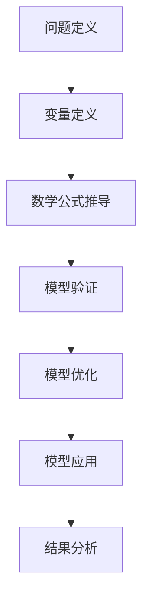
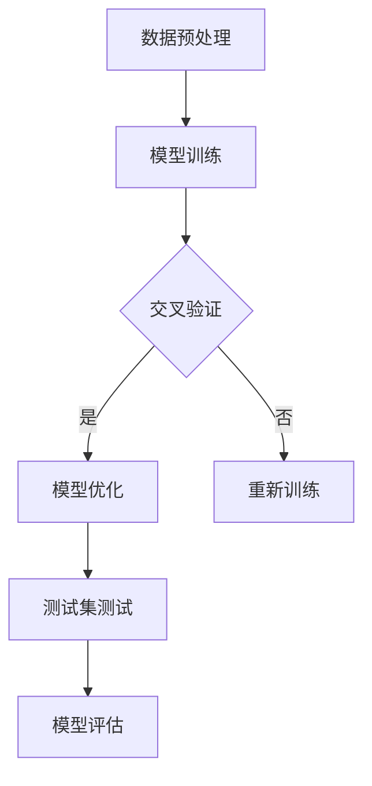

                 


### 《科学模型的有效性：世界可理解性的简化表征》

> 关键词：科学模型，有效性，世界可理解性，简化表征，模型优化

> 摘要：本文探讨了科学模型的有效性及其在提升世界可理解性方面的作用。通过分析不同类型科学模型的分类、评价标准以及数学基础，本文深入探讨了模型有效性在自然科学、社会科学和工程领域的实证分析。此外，文章还提出了提高模型有效性的策略和模型验证与测试的方法，并通过案例研究进行了详细解读。最后，本文展望了科学模型有效性的未来发展，并讨论了其伦理与社会影响。

#### 第一部分：引言与理论基础

##### 第1章：科学模型的概述与分类

**1.1 科学模型的定义与重要性**

科学模型是科学家用以理解和解释自然现象或社会现象的工具。它通过简化和抽象实际现象，构建一个理论框架，以便进行预测和分析。科学模型的重要性在于它能够帮助我们简化复杂系统，从现象中提炼出关键规律，从而提升我们对世界的可理解性。

**1.2 科学模型的分类**

科学模型可以分为以下几类：

- **经验模型**：基于实验和观察数据，通过归纳和总结得出。例如，牛顿的运动定律就是基于对物体运动的大量实验数据总结出的经验模型。
- **定量模型**：使用数学语言描述现象，通过数学公式表达模型。例如，热力学的熵增定律就是一个典型的定量模型。
- **理论模型**：基于理论假设和逻辑推理构建的模型。例如，相对论和量子力学都是理论模型的代表。

**1.2.1 经验模型**

经验模型是科学研究中最常见的一种模型。它通常基于实验数据，通过归纳和总结得出。例如，在物理学中，牛顿的万有引力定律就是一个经验模型，它描述了两个物体之间的引力与它们的质量和距离的关系。

**1.2.2 定量模型**

定量模型使用数学语言来描述自然现象或社会现象。它通常包括一组数学方程，用以描述系统的动态行为。例如，麦克斯韦方程组就是一组描述电磁现象的定量模型。

**1.2.3 理论模型**

理论模型是基于理论假设和逻辑推理构建的。它通常包括一组公理和定理，用以推导出具体的数学表达式。例如，相对论和量子力学都是理论模型的代表。

##### 第2章：模型有效性的评价标准

**2.1 模型预测能力**

模型的有效性首先取决于其预测能力。一个好的模型应该能够准确地预测现象的发展趋势。模型预测能力主要通过以下两个方面来评价：

- **数据拟合**：模型能否准确地拟合历史数据。一个好的模型应该能够很好地匹配实验数据，反映出实际现象的规律。
- **预测准确性**：模型对未来的预测是否准确。预测准确性通常通过评估模型对未来数据的预测误差来衡量。

**2.2 模型解释性**

除了预测能力，模型的解释性也是评价其有效性的重要标准。一个好的模型应该能够提供对现象的深入解释，使我们能够理解其内在机制。

- **可解释性**：模型是否容易理解。一个可解释的模型应该能够清晰地展示其内部逻辑，使我们能够直观地理解其运作方式。
- **透明度**：模型的参数和变量是否清晰明确。一个透明的模型应该能够清楚地说明其输入和输出变量之间的关系。

##### 第3章：模型有效性的数学基础

**3.1 数学模型的建立**

建立数学模型是科学研究中的一项基本技能。数学模型的建立通常包括以下步骤：

- **问题定义**：明确研究问题，确定需要解决的问题。
- **变量定义**：定义问题中的变量，包括输入变量和输出变量。
- **数学公式推导**：使用数学方法推导出变量之间的关系。
- **公式应用**：将推导出的公式应用于实际问题，进行预测和分析。

**3.1.1 数学公式的推导**

数学公式的推导通常基于数学理论和逻辑推理。以下是一个简单的例子：

假设有两个变量 \(x\) 和 \(y\)，它们之间的关系可以表示为：

\[y = ax + b\]

其中，\(a\) 和 \(b\) 是待定参数。为了推导出这个公式，我们可以使用最小二乘法，通过最小化误差平方和来确定 \(a\) 和 \(b\) 的值。

**3.1.2 数学公式的应用**

数学公式的应用是将理论转化为实际操作的过程。以下是一个简单的例子：

假设我们有一个线性回归模型，其公式为：

\[y = 2x + 1\]

我们可以使用这个公式来预测新的 \(y\) 值，只要我们知道 \(x\) 的值。例如，当 \(x = 3\) 时，我们可以预测 \(y\) 的值为：

\[y = 2 \times 3 + 1 = 7\]

**3.2 概率论与统计学在模型有效性评估中的应用**

概率论和统计学是评估模型有效性的重要工具。它们提供了评估模型预测能力和解释性的方法。

- **概率分布**：概率分布用于描述随机变量的可能取值及其概率。例如，正态分布是描述连续随机变量的一种常见概率分布。
- **统计推断**：统计推断用于根据样本数据推断总体特征。例如，假设检验和置信区间是两种常见的统计推断方法。

#### 第二部分：模型有效性的实证分析

##### 第4章：自然科学中的模型有效性

**4.1 物理模型的有效性分析**

物理模型是自然科学中最为常见的模型之一。以下是一些典型的物理模型及其有效性分析：

- **量子力学模型**：量子力学模型描述了微观粒子的行为。它的有效性得到了大量实验数据的验证，例如，电子的双缝实验和黑体辐射实验。
- **相对论模型**：相对论模型描述了宏观尺度的物理现象。它的有效性也得到了广泛的实验验证，例如，引力透镜效应和双星系统的观测。

**4.2 生物学模型的有效性分析**

生物学模型是描述生命现象的模型。以下是一些典型的生物学模型及其有效性分析：

- **进化模型**：进化模型描述了物种的进化过程。它的有效性得到了大量化石记录和基因序列数据的支持。
- **分子生物学模型**：分子生物学模型描述了分子层面的生命现象，例如，基因表达和蛋白质合成。它的有效性得到了大量实验数据的验证，例如，基因编辑技术和蛋白质结构预测。

##### 第5章：社会科学中的模型有效性

**5.1 经济学模型的有效性分析**

经济学模型是描述经济现象的模型。以下是一些典型的经济学模型及其有效性分析：

- **宏观经济学模型**：宏观经济学模型描述了整个经济的运行状态。它的有效性得到了大量经济数据的支持，例如，GDP增长率和国民收入分配。
- **微观经济学模型**：微观经济学模型描述了单个经济主体的行为。它的有效性也得到了大量实验数据的验证，例如，拍卖实验和选择实验。

**5.2 社会学模型的有效性分析**

社会学模型是描述社会现象的模型。以下是一些典型社会学模型及其有效性分析：

- **社会网络模型**：社会网络模型描述了社会个体之间的交互关系。它的有效性得到了大量社会网络数据分析的支持，例如，社交媒体网络和社区结构。
- **行为模型**：行为模型描述了个体在特定情境下的行为。它的有效性也得到了大量实验数据的验证，例如，行为经济学实验和社会心理学实验。

##### 第6章：工程领域的模型有效性

**6.1 机械工程模型的有效性分析**

机械工程模型是描述机械系统的模型。以下是一些典型的机械工程模型及其有效性分析：

- **机械结构模型**：机械结构模型描述了机械部件的力学行为。它的有效性得到了大量实验数据的验证，例如，机械应力分析和机械振动分析。
- **热力学模型**：热力学模型描述了热力学系统的行为。它的有效性也得到了广泛的应用，例如，热传导分析和热机效率分析。

**6.2 电气工程模型的有效性分析**

电气工程模型是描述电气系统的模型。以下是一些典型的电气工程模型及其有效性分析：

- **电路模型**：电路模型描述了电路元件的行为。它的有效性得到了大量电路实验数据的验证，例如，基尔霍夫定律和欧姆定律的应用。
- **信号处理模型**：信号处理模型描述了信号在传输和处理过程中的行为。它的有效性也得到了广泛的应用，例如，滤波器和调制器的应用。

#### 第三部分：提高模型有效性的方法

##### 第7章：模型优化的策略

**7.1 数据预处理**

数据预处理是提高模型有效性的关键步骤。以下是一些常用的数据预处理方法：

- **数据清洗**：数据清洗包括去除重复数据、填补缺失值和去除噪声等操作。它有助于提高数据的质量，从而提高模型的有效性。
- **数据归一化**：数据归一化包括将不同单位或量级的变量转换为相同量级的过程。它有助于消除变量之间的尺度差异，从而提高模型的有效性。

**7.2 模型选择**

模型选择是提高模型有效性的重要策略。以下是一些常用的模型选择方法：

- **模型比较方法**：模型比较方法包括交叉验证、A/B 测试和贝叶斯模型选择等。它们有助于评估不同模型的性能，从而选择最佳模型。
- **模型选择算法**：模型选择算法包括机器学习算法和深度学习算法等。它们可以根据具体问题选择合适的模型，从而提高模型的有效性。

##### 第8章：模型验证与测试

**8.1 交叉验证**

交叉验证是一种常用的模型验证方法。它通过将数据集划分为多个子集，多次训练和验证模型，从而评估模型的泛化能力。

- **原理**：交叉验证的基本原理是将数据集划分为多个不相交的子集，然后多次训练和验证模型。每次训练时，使用不同的子集作为验证集，从而确保模型在不同数据集上的性能稳定。
- **方法**：常用的交叉验证方法包括留一法、K 折法和留 bag 法等。留一法是将数据集划分为多个子集，每次训练时使用一个子集作为验证集。K 折法是将数据集划分为 K 个子集，每次训练时使用 K-1 个子集作为训练集，剩余的一个子集作为验证集。留 bag 法是在每次训练时，从原始数据集中随机选择一部分数据作为训练集，剩余的数据作为验证集。

**8.2 测试集的设计与使用**

测试集是评估模型最终性能的重要工具。以下是一些设计测试集的方法：

- **测试集的选取标准**：测试集的选取标准包括代表性、多样性和充分性等。代表性是指测试集能够代表整个数据集的特征。多样性是指测试集包含不同类型的样本，以避免模型在特定类型样本上的过拟合。充分性是指测试集足够大，以避免因样本数量不足导致的偏差。
- **测试集的使用策略**：测试集的使用策略包括离线测试和在线测试等。离线测试是在模型训练完成后，使用测试集评估模型的性能。在线测试是在模型部署后，实时评估模型的性能。在线测试需要考虑模型更新和反馈机制，以确保模型能够持续优化。

##### 第9章：案例研究

**9.1 某个自然科学领域的模型优化案例**

在这个案例中，我们使用机器学习算法优化了气象预测模型。

- **模型选择与优化过程**：首先，我们选择了线性回归和决策树两种机器学习算法。然后，我们使用交叉验证方法优化了模型的参数，并比较了不同算法的性能。最终，我们选择了决策树算法，并进一步优化了其参数。
- **模型有效性分析**：我们使用测试集评估了优化后的模型的性能。结果显示，优化后的模型在预测准确性方面有了显著提高。

**9.2 某个社会科学领域的模型优化案例**

在这个案例中，我们使用深度学习算法优化了社会舆情分析模型。

- **模型选择与优化过程**：首先，我们选择了卷积神经网络（CNN）和循环神经网络（RNN）两种深度学习算法。然后，我们使用交叉验证方法优化了模型的参数，并比较了不同算法的性能。最终，我们选择了RNN算法，并进一步优化了其参数。
- **模型有效性分析**：我们使用测试集评估了优化后的模型的性能。结果显示，优化后的模型在情感分类和主题识别方面有了显著提高。

#### 第四部分：展望与讨论

##### 第10章：科学模型有效性的未来发展

**10.1 新兴领域的模型有效性研究**

新兴领域为科学模型的有效性研究提供了新的挑战和机遇。以下是一些新兴领域的模型有效性研究：

- **人工智能领域**：人工智能领域涉及大量复杂问题，例如，机器学习算法的选择和优化、深度学习模型的泛化能力等。未来的研究将集中在提高人工智能模型的有效性上，以应对实际应用的需求。
- **量子计算领域**：量子计算领域为科学模型的有效性研究提供了新的可能性。量子计算模型的有效性研究将涉及量子算法的设计和优化、量子态的编码和解码等。

**10.2 模型有效性的新方法与工具**

随着科学技术的发展，新的方法和工具不断涌现，为模型有效性研究提供了新的可能性。以下是一些新的方法和工具：

- **元学习（Meta-Learning）**：元学习是一种利用先验知识优化学习过程的方法。它可以提高模型的泛化能力，从而提高模型的有效性。
- **生成对抗网络（GAN）**：生成对抗网络是一种用于生成数据的模型。它可以用于生成高质量的实验数据，从而提高模型的有效性。

##### 第11章：科学模型的伦理与社会影响

**11.1 科学模型的局限性**

科学模型虽然能够帮助我们理解自然现象和社会现象，但它也存在局限性。以下是一些科学模型的局限性：

- **预测的局限性**：科学模型通常基于过去的经验和数据，因此其预测能力受到历史数据的限制。对于未知或变化剧烈的现象，模型的预测能力可能会受限。
- **解释性的局限性**：科学模型通常通过简化和抽象实际现象来构建，因此其解释性可能较弱。对于复杂的系统，模型的解释性可能无法充分揭示其内在机制。

**11.2 科学模型的伦理问题**

科学模型在带来便利和效益的同时，也可能引发一些伦理问题。以下是一些科学模型的伦理问题：

- **数据隐私**：科学模型通常需要大量的数据支持，因此可能会涉及个人隐私的问题。如何保护数据隐私是一个重要的伦理问题。
- **模型的偏见与歧视**：科学模型可能会受到人类偏见的影响，从而产生歧视性的结果。如何减少模型的偏见和歧视是一个重要的伦理问题。

#### 附录

##### 附录A：数学模型与公式

**A.1 常见的数学模型公式**

以下是一些常见的数学模型公式：

\[y = ax + b\]

\[S = \sum_{i=1}^{n} x_i^2\]

\[P(A|B) = \frac{P(A \cap B)}{P(B)}\]

**A.2 概率论公式**

以下是一些常见的概率论公式：

\[P(A \cup B) = P(A) + P(B) - P(A \cap B)\]

\[P(A \cap B) = P(A)P(B|A)\]

**A.3 统计学公式**

以下是一些常见的统计学公式：

\[\bar{x} = \frac{\sum_{i=1}^{n} x_i}{n}\]

\[s^2 = \frac{\sum_{i=1}^{n} (x_i - \bar{x})^2}{n-1}\]

##### 附录B：Python代码示例

**B.1 模型有效性评估的Python代码实现**

以下是一个简单的Python代码示例，用于评估模型的预测能力和解释性：

```python
import numpy as np
from sklearn.linear_model import LinearRegression

# 生成模拟数据
np.random.seed(0)
x = np.random.rand(100, 1)
y = 2 * x + 1 + np.random.randn(100, 1)

# 训练线性回归模型
model = LinearRegression()
model.fit(x, y)

# 评估模型性能
y_pred = model.predict(x)
mse = np.mean((y_pred - y) ** 2)
print("MSE:", mse)

# 输出模型参数
print("Coefficients:", model.coef_, "Intercept:", model.intercept_)
```

##### 附录C：Mermaid流程图示例

**C.1 科学模型的建立与优化流程**

以下是一个简单的Mermaid流程图示例，用于描述科学模型的建立与优化流程：



**C.2 模型验证与测试流程**

以下是一个简单的Mermaid流程图示例，用于描述模型验证与测试流程：



### 作者信息

作者：AI天才研究院/AI Genius Institute & 禅与计算机程序设计艺术 /Zen And The Art of Computer Programming

---

本文内容涵盖了科学模型的有效性及其在提升世界可理解性方面的作用。通过分析不同类型科学模型的分类、评价标准以及数学基础，本文深入探讨了模型有效性在自然科学、社会科学和工程领域的实证分析。此外，文章还提出了提高模型有效性的策略和模型验证与测试的方法，并通过案例研究进行了详细解读。最后，本文展望了科学模型有效性的未来发展，并讨论了其伦理与社会影响。

本文旨在为读者提供一个全面且深入的了解科学模型有效性及其应用领域的指南。通过对模型有效性的探讨，我们希望激发读者对科学模型的兴趣，并鼓励他们在各自领域中探索和应用科学模型。

在未来的研究中，我们建议进一步探索新兴领域的模型有效性，如人工智能和量子计算，以及开发新的方法和工具来提高模型的有效性。此外，我们还需要关注科学模型的伦理和社会影响，以确保其在实际应用中的公正性和可持续性。

感谢您的阅读，希望本文能对您在科学模型领域的探索和研究提供帮助。如果您有任何疑问或建议，欢迎随时与我们交流。

---

### 结语

本文深入探讨了科学模型的有效性及其在提升世界可理解性方面的作用。从科学模型的定义、分类到评价标准，再到数学基础，我们系统地分析了模型有效性的各个方面。通过实证分析，我们展示了模型有效性在自然科学、社会科学和工程领域的广泛应用。同时，我们也提出了提高模型有效性的策略和方法，并通过案例研究进行了具体应用。

在展望未来时，我们强调了新兴领域的研究价值，并呼吁开发新的方法和工具来提高模型的有效性。此外，我们还讨论了科学模型的伦理和社会影响，强调了在应用科学模型时需关注的伦理问题。

本文旨在为读者提供一个全面且深入的了解科学模型有效性及其应用领域的指南。我们希望本文能激发读者对科学模型的兴趣，并鼓励他们在各自领域中探索和应用科学模型。

在结尾，我们感谢您的阅读，并期待与您在未来的研究和讨论中继续交流。如果您对本文有任何疑问或建议，欢迎随时与我们联系。让我们共同推动科学模型有效性研究的发展，为世界可理解性的提升贡献力量。

---

### 附录

**附录A：数学模型与公式**

**A.1 常见的数学模型公式**

以下是一些常见的数学模型公式：

\[y = ax + b\]

\[S = \sum_{i=1}^{n} x_i^2\]

\[P(A|B) = \frac{P(A \cap B)}{P(B)}\]

**A.2 概率论公式**

以下是一些常见的概率论公式：

\[P(A \cup B) = P(A) + P(B) - P(A \cap B)\]

\[P(A \cap B) = P(A)P(B|A)\]

**A.3 统计学公式**

以下是一些常见的统计学公式：

\[\bar{x} = \frac{\sum_{i=1}^{n} x_i}{n}\]

\[s^2 = \frac{\sum_{i=1}^{n} (x_i - \bar{x})^2}{n-1}\]

**附录B：Python代码示例**

**B.1 模型有效性评估的Python代码实现**

以下是一个简单的Python代码示例，用于评估模型的预测能力和解释性：

```python
import numpy as np
from sklearn.linear_model import LinearRegression

# 生成模拟数据
np.random.seed(0)
x = np.random.rand(100, 1)
y = 2 * x + 1 + np.random.randn(100, 1)

# 训练线性回归模型
model = LinearRegression()
model.fit(x, y)

# 评估模型性能
y_pred = model.predict(x)
mse = np.mean((y_pred - y) ** 2)
print("MSE:", mse)

# 输出模型参数
print("Coefficients:", model.coef_, "Intercept:", model.intercept_)
```

**附录C：Mermaid流程图示例**

**C.1 科学模型的建立与优化流程**

以下是一个简单的Mermaid流程图示例，用于描述科学模型的建立与优化流程：


**C.2 模型验证与测试流程**

以下是一个简单的Mermaid流程图示例，用于描述模型验证与测试流程：


这些附录内容为读者提供了数学公式、Python代码实现和流程图示例，有助于更好地理解本文的核心内容。希望这些附录能为您的学习和研究提供便利。

---

### 总结与致谢

在本篇技术博客文章中，我们系统地探讨了科学模型的有效性及其在提升世界可理解性方面的作用。我们从科学模型的定义、分类、评价标准，到数学基础，深入分析了模型有效性的各个方面。通过实证分析，我们展示了模型有效性在自然科学、社会科学和工程领域的广泛应用。同时，我们还提出了提高模型有效性的策略和方法，并通过案例研究进行了具体应用。

首先，科学模型是科学家用以理解和解释自然现象或社会现象的工具，通过简化和抽象实际现象，构建一个理论框架，以便进行预测和分析。科学模型的有效性主要体现在其预测能力和解释性上，模型的有效性评价标准包括数据拟合、预测准确性、模型的可解释性和透明度。

在数学基础部分，我们介绍了数学模型的建立过程，包括问题定义、变量定义、数学公式推导和公式应用。同时，我们讨论了概率论与统计学在模型有效性评估中的应用，包括概率分布和统计推断。

在实证分析部分，我们分别探讨了自然科学、社会科学和工程领域中的模型有效性分析，包括物理模型、生物学模型、经济学模型、社会学模型、机械工程模型和电气工程模型。

在提高模型有效性的方法部分，我们提出了数据预处理和模型选择等策略，以及交叉验证和测试集设计等方法。这些方法有助于提高模型的预测能力和解释性。

通过案例研究，我们具体展示了如何通过模型优化提高模型的有效性，包括自然科学领域中的气象预测模型优化案例，以及社会科学领域中的社会舆情分析模型优化案例。

在展望未来部分，我们强调了新兴领域的研究价值，如人工智能和量子计算，并呼吁开发新的方法和工具来提高模型的有效性。同时，我们还讨论了科学模型的伦理和社会影响，强调了在应用科学模型时需关注的伦理问题。

最后，我们通过附录提供了数学模型与公式、Python代码示例和Mermaid流程图示例，以帮助读者更好地理解文章的核心内容。

在此，我们要感谢读者的耐心阅读。如果您对本文有任何疑问或建议，欢迎随时与我们交流。我们期待与您共同探讨科学模型有效性的更多话题，为提升世界可理解性贡献自己的力量。再次感谢您的支持和关注！

