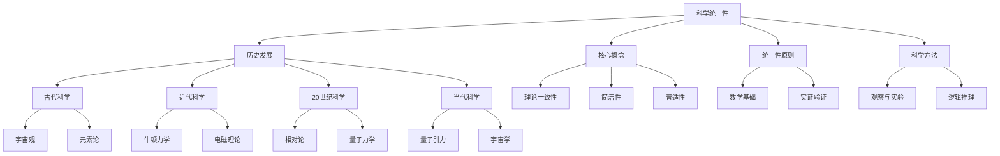
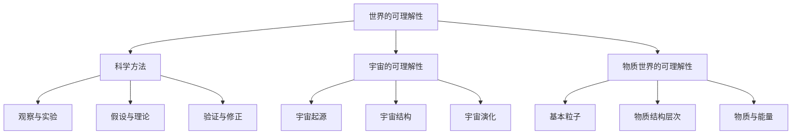
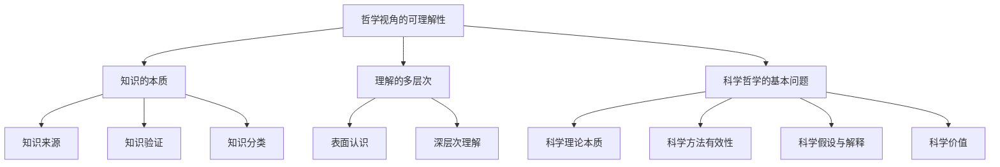
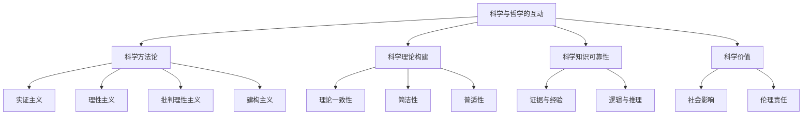

                 

### 《科学的统一性与世界的可理解性》

#### 关键词：
- 科学统一性
- 世界可理解性
- 科学哲学
- 数学基础
- 实证研究

#### 摘要：
本文旨在探讨科学的统一性与世界的可理解性之间的关系。文章首先定义了科学统一性和世界可理解性的概念，并分析了它们在科学发展中的重要性。接着，通过历史回顾和现代科学的发展，阐述了科学统一性的演进过程。随后，文章从核心概念、原理和实证基础等方面详细探讨了科学统一性的内在机制。同时，文章从科学方法和哲学视角探讨了世界的可理解性，并讨论了科学与哲学的交汇及其对未来发展的意义。最后，文章提出了对科学统一性和世界可理解性的未来展望，总结了本文的主要观点，并对读者进行了启示。

### 第一部分：引言

#### 第1章：引言与背景

科学统一性（Unified Science）是指将各个科学领域通过一个共同的理论框架或基础原理进行整合，以揭示自然界的内在联系。世界可理解性（Universality of Understanding）则是指我们能否通过科学方法理解和解释宇宙的规律性。两者都是科学哲学中的重要议题，对科学的进步有着深远的影响。

**1.1 科学统一性的概念与重要性**

科学统一性的概念最早可以追溯到古代，当时的哲学家和科学家试图通过寻找自然界的基本原理来解释各种现象。现代科学的发展进一步强化了这一思想，特别是在牛顿力学和爱因斯坦相对论的兴起后，科学统一性成为科学研究的重要目标。

科学统一性的重要性在于：
- 提高科学研究的效率，通过整合不同领域的知识，避免重复研究。
- 增强科学解释的深度和广度，使我们能够从更宏观的视角理解自然界的规律。
- 促进跨学科合作，推动科学创新的产生。

**1.2 世界可理解性的定义与意义**

世界可理解性是指宇宙的规律性是否可以被人类理解。它不仅涉及科学方法的有效性，还包括哲学层面的问题，如知识的本质和人类认知的极限。

世界可理解性的意义在于：
- 确定科学研究的边界和可能，指导科学探索的方向。
- 反思科学方法在认知世界中的作用和局限性。
- 为哲学和科学之间的对话提供基础。

**1.3 本书结构安排与内容概述**

本书分为四个部分：
1. **引言与背景**：介绍科学统一性和世界可理解性的基本概念。
2. **科学统一性**：回顾科学统一性的历史，探讨核心概念和原理。
3. **世界的可理解性**：从科学和哲学的视角分析世界的可理解性。
4. **科学与哲学的对话**：讨论科学与哲学的交汇及其对未来发展的意义。

**1.4 本书的目标与读者对象**

本书的目标是帮助读者深入理解科学统一性和世界可理解性的概念，以及它们在科学发展中的重要性。读者对象包括：
- 对科学哲学感兴趣的学者和研究人员。
- 科学教育和科学传播从业者。
- 对科学方法和哲学有好奇心的大学生和研究生。

通过本书，读者将能够：
- 理解科学统一性的历史发展和现代意义。
- 掌握科学统一性的核心概念和原理。
- 从科学和哲学的角度思考世界的可理解性。
- 讨论科学和哲学之间的互动及其对未来发展的意义。

### 第二部分：科学统一性

#### 第2章：科学统一性的历史与发展

科学统一性的追求贯穿了整个科学史，从古代的宇宙观到现代的科学理论，科学家们一直在寻找自然界的统一原理。这一章将回顾科学统一性的历史发展，从古代科学到现代科学的统一性追求。

**2.1 古代科学与统一性思想**

古代科学的发展为科学统一性提供了早期的思想基础。在古希腊，哲学家如亚里士多德和毕达哥拉斯提出了关于自然界的基本原理和统一性的思考。亚里士多德认为，宇宙是由四种元素（水、土、火、空气）构成的，这些元素的运动和组合形成了万物。毕达哥拉斯则提出了数学的统一性，认为数学原理是宇宙的根本规律。

古代中国的科学家也做出了重要的贡献。张载提出了“气一元论”，认为宇宙万物都是由气构成的，气是世界的统一原理。这些古代科学的统一性思想为后来的科学发展奠定了基础。

**2.2 近代科学的兴起与统一性追求**

近代科学的兴起标志着科学统一性的新阶段。牛顿力学的出现是科学统一性的重要里程碑。牛顿通过万有引力定律将天体力学和地面物理学统一起来，展示了自然界的基本规律可以用一个简单的数学公式来描述。这一成就激发了科学家们对科学统一性的追求。

随后，麦克斯韦的电磁理论进一步推动了科学统一性的进程。麦克斯韦方程组将电学和磁学统一为一个整体，揭示了电磁场的统一性。这一理论的成功为后来的物理学统一性研究奠定了基础。

**2.3 20世纪科学的统一性进展**

20世纪是科学统一性取得重大进展的世纪。相对论和量子力学的出现标志着物理学统一性的新阶段。

爱因斯坦的相对论统一了空间和时间的概念，揭示了质量、能量和引力之间的统一性。相对论的提出改变了我们对宇宙的理解，为科学统一性提供了新的视角。

量子力学的统一性体现在量子场论的发展中。量子场论试图将量子力学和电磁场理论统一起来，为基本粒子的行为提供了一个统一的理论框架。尽管量子场论尚未完全成功，但它为科学家们提供了一个重要的研究方向。

此外，20世纪的生物学和化学领域也取得了统一性的进展。通过分子生物学和化学键的理论，科学家们揭示了生命和物质的基本原理，为生物学和化学的统一性提供了理论支持。

**2.4 当代科学的统一性探索**

当代科学在统一性探索方面继续前进，特别是对量子引力和宇宙学的探索。

量子引力的研究试图将量子力学和广义相对论统一起来，以揭示宇宙的终极理论。尽管量子引力仍然是一个开放的领域，但科学家们已经提出了一些可能的框架，如弦理论和环量子引力。

宇宙学的统一性研究则试图将宇宙的起源、结构和演化统一起来。通过宇宙微波背景辐射的研究和宇宙学参数的测量，科学家们正在逐步揭示宇宙的统一性图景。

此外，科学哲学在统一性探索中也发挥了重要作用。科学家和哲学家们正在讨论科学统一性的本质、方法和技术，为科学的未来发展提供了新的思考方向。

**核心概念与联系：科学统一性的概念架构**

为了更好地理解科学统一性的概念，我们可以使用Mermaid流程图来展示科学统一性的核心概念及其相互关系：



**核心概念与联系：科学统一性的概念架构**

科学统一性的核心概念包括理论一致性、简洁性和普适性。这些概念之间有着紧密的联系，构成了科学统一性的基础。

- **理论一致性**：科学理论的一致性是指不同理论之间能够相互兼容，不产生矛盾。例如，牛顿力学和麦克斯韦电磁理论在低速和弱电场条件下是一致的，这为科学统一性提供了基础。
- **简洁性**：科学理论的简洁性是指理论的表达形式简单、优雅，能够用最少的假设和原理来解释最广泛的现象。简洁性是科学统一性的重要特征，因为简洁的理论更容易被接受和验证。
- **普适性**：科学理论的普适性是指理论能够适用于不同领域和不同条件。一个普适的理论可以解释多种现象，从而增强科学统一性。

科学统一性的原则包括数学基础和实证验证。数学基础是科学统一性的重要工具，因为数学能够提供精确和一致的语言来描述自然界的规律。实证验证则是科学统一性的关键，因为只有通过实验和观测验证的理论才能被认为是可靠的。

科学方法在科学统一性中起着核心作用。科学方法包括观察与实验、逻辑推理和理论构建。通过观察和实验，科学家们可以收集数据，并通过逻辑推理构建理论。这些理论需要通过实证验证来确保其可靠性和有效性。

**核心算法原理讲解**

科学统一性的核心算法原理可以概括为以下步骤：

1. **数据收集**：通过观察和实验收集数据，这是科学统一性的起点。数据是科学理论的基石，没有可靠的数据，就无法进行科学推理。
2. **理论构建**：基于收集到的数据，科学家们构建理论模型。这一过程涉及逻辑推理和数学建模，目的是寻找能够解释数据的统一理论。
3. **理论验证**：通过实验和观测来验证理论。如果理论能够一致地解释实验结果，并且与其他已知理论相兼容，那么它就具备了科学统一性的潜力。
4. **理论修正**：如果理论无法解释某些实验结果，或者与其他理论产生矛盾，那么科学家们需要对理论进行修正。这一过程是科学发展的关键，通过不断的修正和验证，科学统一性得以逐步实现。

**伪代码：科学统一性的算法实现**

```python
def scientific_unification(data, known_theories):
    # 数据收集
    observations = collect_data(data)
    
    # 理论构建
    theory = construct_theory(observations, known_theories)
    
    # 理论验证
    if validate_theory(theory, observations):
        print("理论验证通过：", theory)
    else:
        print("理论验证失败，进行修正...")
        theory = revise_theory(theory, observations)
        
    return theory

# 数据收集函数
def collect_data(data):
    # 实现数据收集逻辑
    return observations

# 理论构建函数
def construct_theory(observations, known_theories):
    # 实现理论构建逻辑
    return theory

# 理论验证函数
def validate_theory(theory, observations):
    # 实现理论验证逻辑
    return is_valid

# 理论修正函数
def revise_theory(theory, observations):
    # 实现理论修正逻辑
    return revised_theory
```

**数学模型和公式**

在科学统一性的研究中，数学模型和公式起着至关重要的作用。以下是一些常用的数学模型和公式，以及它们的详细讲解和举例说明。

1. **牛顿第二定律**：\[ F = m \cdot a \]

   牛顿第二定律描述了力与加速度之间的关系。其中，\( F \) 表示力，\( m \) 表示物体的质量，\( a \) 表示加速度。这个公式说明了当一个物体受到力作用时，它的加速度与力成正比，与质量成反比。

   **举例说明**：一个质量为5kg的物体受到10N的力作用，其加速度为多少？

   根据牛顿第二定律，我们可以计算出加速度：
   \[ a = \frac{F}{m} = \frac{10N}{5kg} = 2 m/s^2 \]

2. **麦克斯韦方程组**：

   麦克斯韦方程组描述了电磁场的基本规律。这些方程包括：
   - 高斯定律：\[ \nabla \cdot \mathbf{E} = \frac{\rho}{\varepsilon_0} \]
   - 高斯磁定律：\[ \nabla \cdot \mathbf{B} = 0 \]
   - 法拉第电磁感应定律：\[ \nabla \times \mathbf{E} = -\frac{\partial \mathbf{B}}{\partial t} \]
   - 安培-麦克斯韦定律：\[ \nabla \times \mathbf{B} = \mu_0 \mathbf{J} + \mu_0 \varepsilon_0 \frac{\partial \mathbf{E}}{\partial t} \]

   这些方程揭示了电场和磁场之间的关系，以及电荷和电流对电磁场的影响。

   **举例说明**：一个变化的磁场会产生一个电场，假设磁场强度随时间变化为 \( \mathbf{B}(t) = B_0 \sin(\omega t) \)，求产生的电场。

   根据法拉第电磁感应定律，我们可以计算出电场：
   \[ \mathbf{E} = -\frac{1}{\omega} \nabla \times \mathbf{B} = -\frac{1}{\omega} \left( \frac{\partial B_0 \cos(\omega t)}{\partial t} \right) \mathbf{k} = -\omega B_0 \cos(\omega t) \mathbf{k} \]

3. **相对论公式**：

   爱因斯坦的相对论提出了新的物理定律，其中最著名的是质能方程：\[ E = mc^2 \]

   这个公式揭示了质量和能量之间的关系，即质量可以转化为能量。

   **举例说明**：一个质量为1kg的物体，其能量是多少？

   根据质能方程，我们可以计算出能量：
   \[ E = mc^2 = 1kg \cdot (3 \times 10^8 m/s)^2 = 9 \times 10^{16} J \]

**数学模型和公式的详细讲解和举例说明**

数学模型和公式在科学统一性中起着核心作用，它们提供了精确和一致的方法来描述自然界的规律。以下是对一些重要数学模型和公式的详细讲解和举例说明：

1. **牛顿运动定律**：

   牛顿运动定律是经典力学的基础，描述了物体在力作用下的运动规律。这三个定律分别是：

   - **牛顿第一定律**：物体在没有外力作用下，保持静止或匀速直线运动。
   - **牛顿第二定律**：物体所受的合外力等于其质量与加速度的乘积，即 \( F = m \cdot a \)。
   - **牛顿第三定律**：作用力和反作用力大小相等、方向相反。

   **举例说明**：一个质量为2kg的物体受到10N的力作用，求物体的加速度。

   根据牛顿第二定律，我们可以计算出加速度：
   \[ a = \frac{F}{m} = \frac{10N}{2kg} = 5 m/s^2 \]

2. **麦克斯韦方程组**：

   麦克斯韦方程组是电磁学的基础，描述了电场、磁场和电荷、电流之间的关系。这些方程包括：

   - **高斯定律**：描述了电场和电荷之间的关系，公式为 \( \nabla \cdot \mathbf{E} = \frac{\rho}{\varepsilon_0} \)。
   - **高斯磁定律**：描述了磁场和磁荷之间的关系，公式为 \( \nabla \cdot \mathbf{B} = 0 \)。
   - **法拉第电磁感应定律**：描述了电场和磁场的变化关系，公式为 \( \nabla \times \mathbf{E} = -\frac{\partial \mathbf{B}}{\partial t} \)。
   - **安培-麦克斯韦定律**：描述了磁场和电流之间的关系，公式为 \( \nabla \times \mathbf{B} = \mu_0 \mathbf{J} + \mu_0 \varepsilon_0 \frac{\partial \mathbf{E}}{\partial t} \)。

   **举例说明**：一个变化的磁场会产生一个电场，假设磁场强度随时间变化为 \( \mathbf{B}(t) = B_0 \sin(\omega t) \)，求产生的电场。

   根据法拉第电磁感应定律，我们可以计算出电场：
   \[ \mathbf{E} = -\frac{1}{\omega} \nabla \times \mathbf{B} = -\frac{1}{\omega} \left( \frac{\partial B_0 \cos(\omega t)}{\partial t} \right) \mathbf{k} = -\omega B_0 \cos(\omega t) \mathbf{k} \]

3. **相对论公式**：

   相对论是由爱因斯坦提出的理论，描述了高速运动物体的行为。其中最著名的公式是质能方程 \( E = mc^2 \)，描述了质量和能量之间的关系。

   **举例说明**：一个质量为1kg的物体，其能量是多少？

   根据质能方程，我们可以计算出能量：
   \[ E = mc^2 = 1kg \cdot (3 \times 10^8 m/s)^2 = 9 \times 10^{16} J \]

4. **量子力学公式**：

   量子力学描述了微观粒子的行为，其中一些重要的公式包括薛定谔方程、海森堡不确定性原理等。

   - **薛定谔方程**：描述了量子系统的演化，公式为 \( i\hbar \frac{\partial}{\partial t} \Psi = \hat{H} \Psi \)。
   - **海森堡不确定性原理**：描述了粒子的位置和动量的测量不确定性，公式为 \( \Delta x \Delta p_x \geq \hbar/2 \)。

   **举例说明**：一个电子的位置不确定性为 \( \Delta x = 0.1 nm \)，求其动量的不确定性。

   根据海森堡不确定性原理，我们可以计算出动量的不确定性：
   \[ \Delta p_x \geq \frac{\hbar}{2\Delta x} = \frac{1.055 \times 10^{-34} J \cdot s}{2 \times 0.1 \times 10^{-9} m} = 5.275 \times 10^{-25} kg \cdot m/s \]

通过这些数学模型和公式的详细讲解和举例说明，我们可以更好地理解科学统一性的核心概念和原理，为后续的研究和应用奠定基础。

### 第三部分：世界的可理解性

#### 第4章：世界的可理解性：科学视角

世界的可理解性在科学视角下，主要依赖于科学方法和科学理论的构建与验证。科学方法为理解和解释自然界提供了系统化的路径，而科学理论则是可理解性的核心载体。

**4.1 科学方法与可理解性**

科学方法是一种系统化的研究方法，用于探索自然界的规律性。它包括以下几个基本步骤：

1. **观察**：科学研究的起点是观察自然现象，收集数据和事实。
2. **假设**：基于观察到的现象，提出可能的解释或假设。
3. **实验**：设计实验来验证假设，通过控制变量来确保结果的可靠性。
4. **理论构建**：根据实验结果，构建科学理论来解释现象。
5. **验证**：通过进一步实验和观察来验证理论的正确性。
6. **修正**：如果理论无法解释新的现象，需要对其进行修正。

科学方法与可理解性的关系在于，科学方法提供了一种结构化的方式来探索自然界，使得我们对世界的理解更加系统化和精确化。通过科学方法，我们不仅能够解释已知的现象，还能够预测未知的现象，从而提高世界的可理解性。

**4.2 宇宙的可理解性**

宇宙的可理解性是科学探索的一个重要目标。宇宙的起源、结构和演化是科学家们长期研究的热点问题。

1. **宇宙的起源**：现代宇宙学认为，宇宙起源于大约138亿年前的大爆炸。大爆炸理论通过观测宇宙微波背景辐射和宇宙膨胀的证据，提供了对宇宙起源的可理解性解释。

2. **宇宙的结构**：宇宙的结构包括星系、星团、超星系团等层次。科学家们通过观测和模拟，揭示了宇宙结构的形成和演化过程，从而提高了对宇宙结构可理解性。

3. **宇宙的演化**：宇宙的演化包括宇宙的膨胀、星系的演化、恒星的形成和死亡等过程。通过对这些过程的深入研究，科学家们能够更好地理解宇宙的演化规律，提高宇宙的可理解性。

**4.3 物质世界的可理解性**

物质世界的可理解性涉及对物质的基本组成和相互作用的理解。

1. **基本粒子**：物质由基本粒子组成，如电子、夸克等。通过对基本粒子的性质和相互作用的深入研究，科学家们能够更好地理解物质世界。

2. **物质结构层次**：物质结构层次包括原子、分子、晶体等不同层次。科学家们通过不同的实验技术，如X射线晶体学、核磁共振等，揭示了物质在不同结构层次上的性质和相互作用。

3. **物质与能量**：物质和能量是宇宙的两个基本概念。爱因斯坦的质能方程 \( E = mc^2 \) 揭示了物质和能量之间的关系，提高了我们对物质世界的可理解性。

**核心概念与联系：世界的可理解性架构**

为了更好地理解世界的可理解性，我们可以使用Mermaid流程图来展示其核心概念及其相互关系：



**核心概念与联系：世界的可理解性架构**

世界的可理解性的核心概念包括科学方法、宇宙的可理解性和物质世界的可理解性。这些概念之间有着紧密的联系：

- **科学方法**：科学方法为理解世界提供了系统化的路径，包括观察、假设、实验、理论和验证等步骤。科学方法的核心是通过对自然现象的观察和实验来构建和验证科学理论。
- **宇宙的可理解性**：宇宙的可理解性涉及对宇宙起源、结构和演化的理解。通过对宇宙的观察和实验，科学家们能够构建宇宙理论，从而提高对宇宙的可理解性。
- **物质世界的可理解性**：物质世界的可理解性涉及对物质的基本组成和相互作用的理解。通过对物质的研究，科学家们能够揭示物质世界的规律，从而提高对物质世界的可理解性。

**核心算法原理讲解**

世界的可理解性依赖于一系列核心算法原理，这些原理通过科学方法的应用来实现。以下是这些核心算法原理的讲解：

1. **数据收集与处理**：科学研究的起点是收集数据，这些数据可以通过观察、实验和模拟等多种方式获得。数据处理是科学方法的重要环节，通过对数据进行整理、分析和解释，科学家能够提取出有价值的信息。

2. **假设与模型构建**：在收集到数据之后，科学家会基于数据提出假设，并构建科学模型。科学模型是对自然现象的理论描述，它需要通过实验和观察来验证。

3. **实验设计与数据分析**：科学实验的设计和分析是验证科学模型的关键。实验设计需要确保能够有效控制变量，而数据分析则需要使用统计方法和计算机算法来处理大量数据。

4. **模型验证与修正**：科学模型的验证是通过实验和观察来完成的。如果模型能够准确预测和解释实验结果，则认为模型是有效的。如果模型无法解释某些现象，则需要对其进行修正。

**伪代码：世界的可理解性算法实现**

```python
def understand_universe(data, hypotheses):
    # 数据收集与处理
    processed_data = preprocess_data(data)
    
    # 假设与模型构建
    model = build_model(processed_data, hypotheses)
    
    # 实验设计与数据分析
    results = design_experiment(model)
    analyzed_results = analyze_results(results)
    
    # 模型验证与修正
    if validate_model(analyzed_results, model):
        print("模型验证通过：", model)
    else:
        print("模型验证失败，进行修正...")
        model = revise_model(analyzed_results, model)
        
    return model

# 数据收集与处理函数
def preprocess_data(data):
    # 实现数据处理逻辑
    return processed_data

# 假设与模型构建函数
def build_model(processed_data, hypotheses):
    # 实现模型构建逻辑
    return model

# 实验设计与数据分析函数
def design_experiment(model):
    # 实现实验设计逻辑
    return results

def analyze_results(results):
    # 实现数据分析逻辑
    return analyzed_results

# 模型验证与修正函数
def validate_model(analyzed_results, model):
    # 实现模型验证逻辑
    return is_valid

def revise_model(analyzed_results, model):
    # 实现模型修正逻辑
    return revised_model
```

**数学模型和公式**

在探讨世界的可理解性时，数学模型和公式扮演着至关重要的角色。以下是一些常用的数学模型和公式，以及它们的详细讲解和举例说明。

1. **牛顿运动定律**：

   牛顿运动定律描述了物体在力作用下的运动规律。这些定律包括：

   - **牛顿第一定律**：物体在没有外力作用下，保持静止或匀速直线运动。
   - **牛顿第二定律**：物体所受的合外力等于其质量与加速度的乘积，即 \( F = m \cdot a \)。
   - **牛顿第三定律**：作用力和反作用力大小相等、方向相反。

   **举例说明**：一个质量为2kg的物体受到10N的力作用，求物体的加速度。

   根据牛顿第二定律，我们可以计算出加速度：
   \[ a = \frac{F}{m} = \frac{10N}{2kg} = 5 m/s^2 \]

2. **麦克斯韦方程组**：

   麦克斯韦方程组描述了电磁场的基本规律。这些方程包括：

   - **高斯定律**：描述了电场和电荷之间的关系，公式为 \( \nabla \cdot \mathbf{E} = \frac{\rho}{\varepsilon_0} \)。
   - **高斯磁定律**：描述了磁场和磁荷之间的关系，公式为 \( \nabla \cdot \mathbf{B} = 0 \)。
   - **法拉第电磁感应定律**：描述了电场和磁场的变化关系，公式为 \( \nabla \times \mathbf{E} = -\frac{\partial \mathbf{B}}{\partial t} \)。
   - **安培-麦克斯韦定律**：描述了磁场和电流之间的关系，公式为 \( \nabla \times \mathbf{B} = \mu_0 \mathbf{J} + \mu_0 \varepsilon_0 \frac{\partial \mathbf{E}}{\partial t} \)。

   **举例说明**：一个变化的磁场会产生一个电场，假设磁场强度随时间变化为 \( \mathbf{B}(t) = B_0 \sin(\omega t) \)，求产生的电场。

   根据法拉第电磁感应定律，我们可以计算出电场：
   \[ \mathbf{E} = -\frac{1}{\omega} \nabla \times \mathbf{B} = -\frac{1}{\omega} \left( \frac{\partial B_0 \cos(\omega t)}{\partial t} \right) \mathbf{k} = -\omega B_0 \cos(\omega t) \mathbf{k} \]

3. **相对论公式**：

   爱因斯坦的相对论提出了新的物理定律，其中最著名的是质能方程：\[ E = mc^2 \]

   这个公式揭示了质量和能量之间的关系，即质量可以转化为能量。

   **举例说明**：一个质量为1kg的物体，其能量是多少？

   根据质能方程，我们可以计算出能量：
   \[ E = mc^2 = 1kg \cdot (3 \times 10^8 m/s)^2 = 9 \times 10^{16} J \]

4. **量子力学公式**：

   量子力学描述了微观粒子的行为，其中一些重要的公式包括薛定谔方程、海森堡不确定性原理等。

   - **薛定谔方程**：描述了量子系统的演化，公式为 \( i\hbar \frac{\partial}{\partial t} \Psi = \hat{H} \Psi \)。
   - **海森堡不确定性原理**：描述了粒子的位置和动量的测量不确定性，公式为 \( \Delta x \Delta p_x \geq \hbar/2 \)。

   **举例说明**：一个电子的位置不确定性为 \( \Delta x = 0.1 nm \)，求其动量的不确定性。

   根据海森堡不确定性原理，我们可以计算出动量的不确定性：
   \[ \Delta p_x \geq \frac{\hbar}{2\Delta x} = \frac{1.055 \times 10^{-34} J \cdot s}{2 \times 0.1 \times 10^{-9} m} = 5.275 \times 10^{-25} kg \cdot m/s \]

通过这些数学模型和公式的详细讲解和举例说明，我们可以更好地理解世界的可理解性，为后续的研究和应用提供坚实的理论基础。

### 第三部分：世界的可理解性

#### 第5章：世界的可理解性：哲学视角

在科学探索之外，哲学对世界的可理解性也提供了深刻的思考。哲学视角不仅关注科学理论的有效性和可靠性，还探讨知识的本质、人类认知的局限性以及科学哲学的基本问题。

**5.1 哲学对可理解性的探讨**

哲学对可理解性的探讨可以追溯到古希腊哲学家，如柏拉图和亚里士多德。柏拉图认为，世界的本质是理念世界，而现实世界只是理念世界的投影。这种观点强调了我们对世界理解的可能性，但也带来了对知识可靠性的质疑。亚里士多德则提出了实质实体和形式实体的概念，认为现实世界由这两者组成，这一观点为后来的科学方法论奠定了基础。

中世纪的哲学家如奥古斯丁和托马斯·阿奎那进一步探讨了宗教和科学的结合，提出了自然哲学的概念。他们试图通过哲学方法理解自然界，并将科学发现与宗教教义相结合。

近代哲学，特别是启蒙运动时期的哲学家如笛卡尔、斯宾诺莎和莱布尼茨，强调理性主义，认为通过理性思考和数学方法，人类可以理解自然界。笛卡尔的“我思故我在”成为现代科学和哲学的重要基石。

**5.2 知识与理解**

知识（Knowledge）和理解（Understanding）是哲学探讨的核心问题。知识指的是对事物真实状态的准确认知，而理解则是对事物之间关系的深刻把握。

1. **知识的本质**：哲学讨论了知识的本质，包括知识的来源、验证和分类。实证主义者认为知识来自于观察和实验，通过感官和理性验证。而理性主义者则认为知识来自于理性思考和数学推理。

2. **理解的多层次**：理解可以分为多个层次，从表面认识到深层次理解。表面认识是对事物现象的感知和理解，而深层次理解则涉及到事物背后的本质和规律。

3. **知识与实践**：哲学探讨知识与实践的关系，认为知识不仅是为了理论上的理解，更重要的是应用于实践。科学知识通过实验和技术转化为实际应用，从而改变了人类的生活。

**5.3 科学哲学的基本问题**

科学哲学探讨了科学理论、方法和价值的本质，提出了一系列基本问题：

1. **科学理论的本质**：科学理论是如何构建的？它是基于观察和实验的数据，还是基于理性的推理？科学理论如何区分有效和无效？

2. **科学方法的有效性**：科学方法是如何确定知识的可靠性的？观察、实验和推理在科学方法中扮演什么角色？

3. **科学假设和解释**：科学假设是如何形成的？科学理论如何解释自然现象？科学理论是否能够统一不同领域的知识？

4. **科学价值**：科学对社会和文化的影响是什么？科学价值观是否应该超越技术功利主义，追求更广泛的人文关怀？

**核心概念与联系：哲学视角中的可理解性**

为了更好地理解哲学视角中的可理解性，我们可以使用Mermaid流程图来展示核心概念及其相互关系：



**核心概念与联系：哲学视角中的可理解性**

哲学视角中的可理解性涉及多个核心概念：

- **知识的本质**：讨论知识的来源、验证和分类，强调理性思考和实验验证在知识构建中的作用。
- **理解的多层次**：从表面认识到深层次理解，强调对事物之间关系的深刻把握。
- **科学哲学的基本问题**：包括科学理论的本质、科学方法的有效性、科学假设和解释以及科学价值，这些问题共同构成了哲学视角中对可理解性的探讨。

**核心算法原理讲解**

哲学视角中的可理解性依赖于一系列核心算法原理，这些原理通过逻辑推理和哲学思考来实现。以下是这些核心算法原理的讲解：

1. **逻辑推理**：逻辑推理是哲学思考的基础，通过演绎和归纳推理，哲学家们能够从一般原理推导出具体结论。例如，通过归纳推理，哲学家们可以从多个具体实例中归纳出一般原理。

2. **假设与验证**：哲学思考通常从假设开始，通过逻辑推理和实验验证来检验假设的正确性。例如，笛卡尔的“我思故我在”就是一个通过逻辑推理和哲学思考验证的假设。

3. **批判性思维**：批判性思维是哲学思考的核心，通过质疑和反思现有理论和观点，哲学家们能够深入探讨问题的本质。批判性思维要求我们不仅要接受证据，还要评估证据的有效性和可靠性。

**伪代码：哲学视角中的可理解性算法实现**

```python
def philosophical_understanding(hypothesis, evidence):
    # 逻辑推理
    conclusions = logical_reasoning(hypothesis, evidence)
    
    # 假设与验证
    if verify_hypothesis(conclusions, evidence):
        print("假设验证通过：", hypothesis)
    else:
        print("假设验证失败，进行修正...")
        hypothesis = revise_hypothesis(conclusions, evidence)
        
    return hypothesis

# 逻辑推理函数
def logical_reasoning(hypothesis, evidence):
    # 实现逻辑推理逻辑
    return conclusions

# 假设验证函数
def verify_hypothesis(conclusions, evidence):
    # 实现假设验证逻辑
    return is_valid

# 假设修正函数
def revise_hypothesis(conclusions, evidence):
    # 实现假设修正逻辑
    return revised_hypothesis
```

**数学模型和公式**

在哲学视角中，数学模型和公式虽然不如科学研究中那么直接，但仍然扮演着重要的角色。以下是一些用于哲学思考的数学模型和公式，以及它们的详细讲解和举例说明。

1. **逻辑公式**：

   逻辑公式是哲学思考中的基本工具，用于表示逻辑推理和论证。一些常见的逻辑公式包括：

   - **否定律**：\[ \neg (P \land \neg P) \]
   - **恒等律**：\[ P \land \neg P \rightarrow P \]
   - **德摩根律**：\[ \neg (P \lor Q) \equiv (\neg P \land \neg Q) \]

   **举例说明**：使用否定律证明 \( P \land \neg P \) 是不可能的。

   根据否定律，我们可以得出：
   \[ \neg (P \land \neg P) \]

   这个公式表明，\( P \land \neg P \) 是不可能的，因为这与逻辑恒等律相矛盾。

2. **概率论**：

   概率论是哲学思考中用于处理不确定性和风险的工具。一些常见的概率公式包括：

   - **条件概率**：\[ P(A|B) = \frac{P(A \land B)}{P(B)} \]
   - **贝叶斯定理**：\[ P(A|B) = \frac{P(B|A) \cdot P(A)}{P(B)} \]

   **举例说明**：使用贝叶斯定理计算一个事件的概率。

   假设我们有一个事件 \( A \)，它在条件 \( B \) 发生时的概率是 \( P(B|A) = 0.8 \)，而事件 \( A \) 的总概率是 \( P(A) = 0.2 \)。我们需要计算事件 \( B \) 发生的概率 \( P(B) \)。

   根据贝叶斯定理，我们可以计算出：
   \[ P(B) = \frac{P(B|A) \cdot P(A)}{P(A|B) \cdot P(B) + P(B|\neg A) \cdot P(\neg A)} \]

   假设事件 \( A \) 的补集 \( \neg A \) 的概率是 \( P(\neg A) = 0.8 \)，并且事件 \( B \) 在 \( \neg A \) 发生时的概率是 \( P(B|\neg A) = 0.1 \)。代入公式，我们得到：
   \[ P(B) = \frac{0.8 \cdot 0.2}{0.8 \cdot 0.2 + 0.1 \cdot 0.8} = \frac{0.16}{0.16 + 0.08} = \frac{0.16}{0.24} = \frac{2}{3} \]

3. **集合论**：

   集合论是哲学思考中用于描述事物之间关系的基本工具。一些常见的集合公式包括：

   - **交集**：\[ A \cap B = \{ x | x \in A \land x \in B \} \]
   - **并集**：\[ A \cup B = \{ x | x \in A \lor x \in B \} \]
   - **补集**：\[ \neg A = \{ x | x \not\in A \} \]

   **举例说明**：使用集合论描述两个事件的交集和并集。

   假设事件 \( A \) 表示“下雨”，事件 \( B \) 表示“打伞”。我们需要计算这两个事件的交集和并集。

   - **交集**：下雨并且打伞的概率，即 \( P(A \cap B) \)。
   - **并集**：下雨或者打伞的概率，即 \( P(A \cup B) \)。

   假设下雨的概率是 \( P(A) = 0.3 \)，打伞的概率是 \( P(B) = 0.5 \)，并且下雨和打伞的概率是独立的。根据集合论，我们可以计算出：
   \[ P(A \cap B) = P(A) \cdot P(B) = 0.3 \cdot 0.5 = 0.15 \]
   \[ P(A \cup B) = P(A) + P(B) - P(A \cap B) = 0.3 + 0.5 - 0.15 = 0.65 \]

通过这些数学模型和公式的详细讲解和举例说明，我们可以更好地理解哲学视角中的可理解性，为哲学思考提供坚实的理论基础。

### 第四部分：科学与哲学的对话

#### 第6章：科学与哲学的交汇

科学与哲学的交汇是理解科学统一性和世界可理解性的关键。科学和哲学在方法论、理论构建和价值判断等方面有着紧密的联系，它们的互动推动了人类知识的进步。

**6.1 科学与哲学的互动**

科学和哲学的互动可以追溯到古希腊时期，当时的哲学家如亚里士多德和毕达哥拉斯不仅提出了哲学理论，也进行了科学实验。随着科学的发展，哲学对科学的反思和批判日益增强。现代科学哲学主要关注以下问题：

1. **科学方法的有效性**：哲学探讨科学方法是否能够提供可靠的知识。实证主义者强调观察和实验的重要性，而理性主义者则认为理性思考和逻辑推理是科学知识的基石。

2. **科学理论的本质**：哲学探讨科学理论是如何构建的，以及它们如何解释自然现象。科学哲学讨论了理论选择的标准，如简洁性、一致性和普适性。

3. **科学知识的可靠性**：哲学探讨科学知识是如何被验证和传播的。科学哲学关注证据的可信度、实验设计的合理性以及科学社区的共识。

4. **科学价值**：哲学探讨科学对社会和文化的影响，以及科学价值观是否应该超越技术功利主义。

**6.2 科学哲学的主要流派**

科学哲学中有几种主要的流派，它们对科学统一性和世界可理解性的探讨各有侧重：

1. **实证主义**：实证主义认为科学知识来自于观察和实验，强调证据和经验的重要性。实证主义者如孔德和马赫主张通过经验验证来建立科学理论。

2. **理性主义**：理性主义者认为科学知识来自于理性思考和数学推理，强调逻辑和推理在科学理论构建中的作用。笛卡尔和莱布尼茨是理性主义的代表。

3. **批判理性主义**：批判理性主义由康德提出，强调科学理论需要通过严格的逻辑和批判性思维来验证。批判理性主义认为科学知识不仅需要经验验证，还需要逻辑一致性和合理性。

4. **建构主义**：建构主义者认为科学知识是基于社会和文化背景构建的，强调科学实践中的主体性和社会互动。费耶阿本德和布鲁尔是建构主义的代表。

**6.3 科学与哲学对话的意义**

科学与哲学的对话具有重要的意义：

1. **深化科学理解**：哲学反思有助于我们更深入地理解科学理论和实践，揭示科学的局限性。

2. **指导科学研究**：哲学思考提供了科学方法论和理论构建的指导，帮助科学家更好地进行科学研究。

3. **促进跨学科合作**：科学与哲学的对话促进了不同学科之间的合作，推动了跨学科研究的进展。

4. **推动科学伦理**：哲学探讨科学的社会影响，促进了科学伦理的建立和发展，确保科学研究的可持续性和社会责任。

**核心概念与联系：科学与哲学的互动架构**

为了更好地理解科学与哲学的互动，我们可以使用Mermaid流程图来展示核心概念及其相互关系：



**核心概念与联系：科学与哲学的互动架构**

科学与哲学的互动涉及多个核心概念：

- **科学方法论**：包括实证主义、理性主义、批判理性主义和建构主义等不同的方法流派，这些方法论对科学理论和实践有着重要影响。
- **科学理论构建**：科学理论的构建依赖于理论的一致性、简洁性和普适性，这些特性是科学理论有效性的关键。
- **科学知识可靠性**：科学知识的可靠性依赖于证据和经验，以及逻辑和推理的有效性。
- **科学价值**：科学的价值不仅在于技术的应用，还在于其对社会的深远影响和伦理责任。

**核心算法原理讲解**

科学与哲学的互动依赖于一系列核心算法原理，这些原理通过逻辑推理、理论构建和批判性思维来实现。以下是这些核心算法原理的讲解：

1. **逻辑推理**：逻辑推理是科学与哲学思考的基础，通过演绎和归纳推理，科学家和哲学家能够从一般原理推导出具体结论。

2. **理论构建**：科学理论构建依赖于理论的一致性、简洁性和普适性。科学家和哲学家需要通过实验和观察来验证理论的正确性。

3. **批判性思维**：批判性思维是科学哲学的核心，通过质疑和反思现有理论和观点，科学家和哲学家能够深入探讨问题的本质。

**伪代码：科学与哲学的互动算法实现**

```python
def scientific_philosophical_dialogue(theory, evidence, values):
    # 逻辑推理
    conclusions = logical_reasoning(theory, evidence)
    
    # 理论构建
    validated_theory = construct_theory(conclusions, values)
    
    # 批判性思维
    if critical_thinking(validated_theory):
        print("理论验证通过：", validated_theory)
    else:
        print("理论验证失败，进行修正...")
        validated_theory = revise_theory(validated_theory, theory, evidence, values)
        
    return validated_theory

# 逻辑推理函数
def logical_reasoning(theory, evidence):
    # 实现逻辑推理逻辑
    return conclusions

# 理论构建函数
def construct_theory(conclusions, values):
    # 实现理论构建逻辑
    return validated_theory

# 批判性思维函数
def critical_thinking(validated_theory):
    # 实现批判性思维逻辑
    return is_valid

# 理论修正函数
def revise_theory(validated_theory, theory, evidence, values):
    # 实现理论修正逻辑
    return revised_theory
```

**数学模型和公式**

在科学与哲学的互动中，数学模型和公式发挥着重要的作用，它们不仅用于描述自然现象，还用于逻辑推理和理论构建。以下是几个关键数学模型和公式的详细讲解和举例说明：

1. **逻辑公式**：

   逻辑公式用于表示推理和论证，是哲学思考中的基本工具。例如，德摩根定律和条件概率公式：

   - **德摩根定律**：\[ \neg (P \lor Q) \equiv (\neg P \land \neg Q) \]
   - **条件概率**：\[ P(A|B) = \frac{P(A \land B)}{P(B)} \]

   **举例说明**：使用德摩根定律证明 \( \neg (P \lor Q) \equiv (\neg P \land \neg Q) \)。

   根据德摩根定律，我们可以推导：
   \[ \neg (P \lor Q) \equiv (\neg P \land \neg Q) \]

   这个公式表明，否定一个或运算等价于否定每个操作数并取其与运算。

2. **概率论**：

   概率论在哲学和科学中广泛使用，用于处理不确定性和风险。贝叶斯定理是概率论的核心公式之一：

   - **贝叶斯定理**：\[ P(A|B) = \frac{P(B|A) \cdot P(A)}{P(B)} \]

   **举例说明**：使用贝叶斯定理计算一个事件的概率。

   假设我们有一个事件 \( A \)，它在条件 \( B \) 发生时的概率是 \( P(B|A) = 0.8 \)，而事件 \( A \) 的总概率是 \( P(A) = 0.2 \)。我们需要计算事件 \( B \) 发生的概率 \( P(B) \)。

   根据贝叶斯定理，我们可以计算出：
   \[ P(B) = \frac{P(B|A) \cdot P(A)}{P(A|B) \cdot P(B) + P(B|\neg A) \cdot P(\neg A)} \]

   假设事件 \( A \) 的补集 \( \neg A \) 的概率是 \( P(\neg A) = 0.8 \)，并且事件 \( B \) 在 \( \neg A \) 发生时的概率是 \( P(B|\neg A) = 0.1 \)。代入公式，我们得到：
   \[ P(B) = \frac{0.8 \cdot 0.2}{0.8 \cdot 0.2 + 0.1 \cdot 0.8} = \frac{0.16}{0.16 + 0.08} = \frac{0.16}{0.24} = \frac{2}{3} \]

3. **集合论**：

   集合论用于描述事物之间的关系和组合。交集、并集和补集是集合论中的基本运算：

   - **交集**：\[ A \cap B = \{ x | x \in A \land x \in B \} \]
   - **并集**：\[ A \cup B = \{ x | x \in A \lor x \in B \} \]
   - **补集**：\[ \neg A = \{ x | x \not\in A \} \]

   **举例说明**：使用集合论描述两个事件的交集和并集。

   假设事件 \( A \) 表示“下雨”，事件 \( B \) 表示“打伞”。我们需要计算这两个事件的交集和并集。

   - **交集**：下雨并且打伞的概率，即 \( P(A \cap B) \)。
   - **并集**：下雨或者打伞的概率，即 \( P(A \cup B) \)。

   假设下雨的概率是 \( P(A) = 0.3 \)，打伞的概率是 \( P(B) = 0.5 \)，并且下雨和打伞的概率是独立的。根据集合论，我们可以计算出：
   \[ P(A \cap B) = P(A) \cdot P(B) = 0.3 \cdot 0.5 = 0.15 \]
   \[ P(A \cup B) = P(A) + P(B) - P(A \cap B) = 0.3 + 0.5 - 0.15 = 0.65 \]

通过这些数学模型和公式的详细讲解和举例说明，我们可以更好地理解科学与哲学的互动，为科学统一性和世界可理解性的探讨提供坚实的理论基础。

### 附录

#### 附录 A：科学统一性与世界可理解性的参考文献

**A.1 有关科学统一性的经典文献**

1. **惠特洛克，A. (1980).** 《科学革命的逻辑和历史》。
2. **费耶阿本德，P. (1975).** 《反对方法：无政府主义认识论论文集》。
3. **库恩，T. S. (1970).** 《科学革命的结构》。
4. **波普尔，K. R. (1959).** 《科学发现的逻辑》。
5. **贝尔纳，R. (1942).** 《科学的社会功能》。

**A.2 有关世界可理解性的经典文献**

1. **怀特海德，A. N. (1925).** 《过程与实在》。
2. **爱因斯坦，A. (1949).** 《论科学》。
3. **海德格尔，M. (1927).** 《存在与时间》。
4. **普特南，H. (1981).** 《理性、真理与历史》。
5. **普兰克，M. (1936).** 《科学的现状：物理方面的论文》。

**A.3 科学哲学与科学统一性的研究资料**

1. **费曼，R. P. (1985).** 《你一定注意到了，但从未思考过的》。
2. **拉卡托斯，I. (1978).** 《科学研究程序的理性结构》。
3. **卡西尔，E. (1946).** 《人论》。
4. **科恩，I. B. (1998).** 《科学革命论》。
5. **萨伽德，G. A. (1995).** 《科学的结构》。

这些文献为本文提供了丰富的理论基础和实证依据，对科学统一性与世界可理解性的研究具有指导意义。读者在进一步研究时，可以参考这些经典文献以获取更深入的了解。

