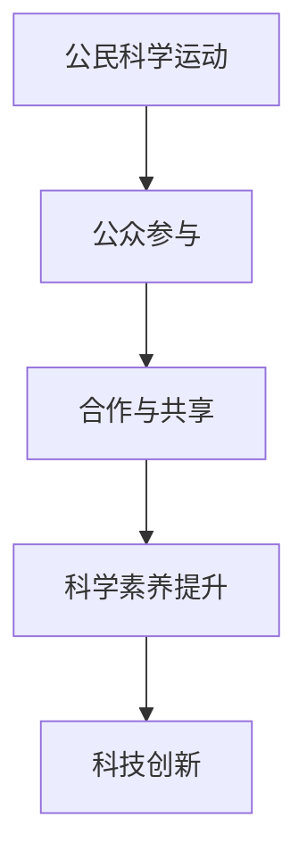

                 

### 文章标题

# 科学研究的公民科学运动：全民参与世界理解的过程

### 关键词

- 公民科学运动
- 公众参与
- 科学研究
- 科技创新
- 社会科学

### 摘要

本文旨在探讨公民科学运动这一新兴的科学研究模式，分析其背景、意义、形式、重要性以及理论基础和实践案例。通过对公民科学运动的深入研究，本文揭示了公众参与在科学研究中的重要作用，探讨了其面临的挑战与机遇，并提出了未来发展的趋势和建议。本文将帮助读者理解公民科学运动的基本概念和实践路径，为推动科学研究与社会发展的深度融合提供有益的参考。

### 目录大纲

#### 第一部分: 引言

**第1章: 科学研究的公民科学运动概述**

- **1.1 公民科学运动的背景和意义**
- **1.2 公民科学运动的主要形式**
- **1.3 公民科学运动的重要性**

**第2章: 公民科学运动的原理和理论基础**

- **2.1 公民科学运动的原理**
- **2.2 公民科学运动的理论基础**

**第3章: 公民科学运动的主要领域**

- **3.1 天然灾害监测与预警**
- **3.2 环境保护与气候变化**
- **3.3 生物学与生态学**

**第4章: 公民科学运动的实践案例分析**

- **4.1 案例一：全球参与的天文观测项目**
- **4.2 案例二：欧洲公民科学网络**
- **4.3 案例三：中国的公民科学运动**

#### 第二部分: 公民科学运动的理论与实践

**第5章: 公民科学运动的挑战与机遇**

- **5.1 公民科学运动的挑战**
- **5.2 公民科学运动的发展机遇**

**第6章: 公民科学运动的发展趋势**

- **6.1 跨学科合作与集成**
- **6.2 全球公民科学网络的发展**

**第7章: 公民科学运动的未来规划与建议**

- **7.1 公民科学运动的战略规划**
- **7.2 公民科学运动的政策建议**

**附录**

- **附录A：公民科学运动相关资源**
- **附录B：参考文献**

### 第一部分： 引言

#### 第1章: 科学研究的公民科学运动概述

##### 1.1 公民科学运动的背景和意义

公民科学运动（Citizen Science）是近年来在全球范围内兴起的一种新的科学研究模式，它强调公众参与科学研究的过程。这一概念源于19世纪末，当科学家开始意识到，单靠个人的努力难以应对日益复杂的研究课题。因此，他们开始寻求公众的帮助，以扩展科学研究的规模和深度。

公民科学运动的背景可以追溯到多个方面。首先，随着信息技术和互联网的快速发展，公众获取科学知识和参与科学活动的机会大大增加。其次，全球气候变化、自然灾害频发等环境问题促使人们更加关注科学研究，并积极参与其中。此外，公众对科学知识的需求也推动着科学传播和科普工作的蓬勃发展。

公民科学运动的起源可以追溯到19世纪末的“业余科学家”运动。这一运动强调公众对科学的兴趣和参与，倡导业余科学家在科学研究中发挥重要作用。随着时间的推移，这一概念逐渐发展为今天的公民科学运动，成为科学研究的重要组成部分。

##### 1.2 公民科学运动的发展趋势

公民科学运动的发展趋势表现在多个方面。首先，参与者的范围逐渐扩大，从传统的业余科学家扩展到普通公众，甚至包括学生和儿童。其次，参与形式更加多样化，包括在线数据收集、实地调查、远程观测等。此外，公民科学项目在科学领域中的覆盖范围也在不断扩大，涵盖了从天文学、生态学到医学、环境科学等多个学科。

近年来，全球范围内出现了许多成功的公民科学项目，如“地球观测网络”、“全球鸟类计数”、“疾病地图”等。这些项目不仅为科学研究提供了宝贵的数据，还激发了公众对科学的兴趣和参与热情。同时，许多政府、科研机构和非营利组织也开始重视公民科学运动，为其提供资金、技术和政策支持。

##### 1.3 公民科学运动的核心价值观

公民科学运动的核心价值观包括公众参与、合作与共享、科学素养提升和科技创新。首先，公众参与是公民科学运动的核心理念。通过公众的参与，科学研究不仅能够获得更多的数据和支持，还能提高公众对科学的认知和理解。

其次，合作与共享是公民科学运动的重要特征。公民科学项目通常需要多方的合作，包括科学家、政府机构、非营利组织和普通公众。这种合作不仅能够提高项目效率，还能促进科学知识的传播和共享。

此外，公民科学运动还致力于提升公众的科学素养。通过参与科学项目，公众能够学习科学方法、掌握科学知识，从而提高自己的科学素养。这不仅有助于培养未来科学家，还能促进社会的整体科学素质提升。

最后，公民科学运动有助于推动科技创新。公众的参与和合作可以为科学研究带来新的思路和方法，促进科学技术的创新与发展。同时，公民科学项目也为科技企业提供了丰富的数据和案例，为其研发和应用提供了重要的支持。

总之，公民科学运动是一种全新的科学研究模式，它不仅为科学研究提供了新的动力和资源，还有助于提升公众的科学素养和科技创新能力。随着信息技术的不断发展和公众科学参与意识的提高，公民科学运动将在未来的科学研究中发挥越来越重要的作用。

#### 第2章: 公民科学运动的原理和理论基础

##### 2.1 公民科学运动的原理

公民科学运动的原理可以归结为公众参与、合作与共享。公众参与是公民科学运动的核心，它是指普通公众通过各种形式参与到科学研究中来，成为科学研究的重要参与者。这种参与不仅包括数据的收集、分析和解读，还涉及科学实验的设计和实施。

首先，公众参与的科学研究的核心机制是通过在线平台和移动应用等技术手段，使公众能够方便地参与到科学项目中。例如，许多公民科学项目提供在线数据收集工具，用户可以通过手机或电脑实时上传观测数据。此外，一些项目还提供远程观测机会，用户可以远程控制科学仪器，如天文望远镜或气象传感器，收集相关数据。

其次，公众参与的模式多种多样，包括在线数据收集、实地调查、远程观测、科学实验等。在线数据收集是公民科学运动中最常见的形式，用户可以通过互联网平台参与数据收集工作。例如，项目参与者可以在天文学项目中，通过远程观测软件记录星空数据，或是在生态学项目中，通过移动应用上传植物和动物的照片。实地调查则通常需要参与者亲自到野外进行观测和采集数据，如环境保护项目中的水质监测。远程观测和科学实验则允许用户通过互联网实时控制科学仪器，收集数据。

此外，公民科学运动的组织管理也是一个关键因素。组织管理的核心目标是确保公民科学项目的顺利进行，同时提高公众的参与度和满意度。为此，公民科学项目通常采用多种管理策略，如提供详细的参与指南、定期举办培训课程、建立社区交流和反馈机制等。这些措施有助于提高公众的科学素养，增强他们对项目的认同感和参与积极性。

##### 2.2 公民科学运动的理论基础

公民科学运动的理论基础涉及多个学科，包括科学社会学、科学哲学和公众参与理论。这些理论为公民科学运动提供了理论支持和指导。

首先，科学社会学理论是公民科学运动的重要理论基础。科学社会学关注科学与社会之间的互动关系，研究科学在社会中的角色和影响。在公民科学运动中，科学社会学理论强调公众参与科学研究的必要性和重要性。它认为，公众参与不仅能够提高科学研究的多样性和创新性，还能增强科学研究的可信度和公正性。科学社会学理论还探讨了公众参与的模式和机制，为公民科学项目的实施提供了理论依据。

其次，科学哲学为公民科学运动提供了哲学基础。科学哲学关注科学知识的生产、传播和应用，研究科学本质和科学方法。在公民科学运动中，科学哲学理论关注公众参与的科学知识如何产生和验证。科学哲学的怀疑主义和实证主义思想促使科学家和公众在科学研究中保持开放和批判的态度，共同推动科学知识的进步。此外，科学哲学还探讨了科学知识的共享和传播问题，为公民科学项目的科学传播和科普工作提供了指导。

最后，公众参与理论是公民科学运动的核心理论。公众参与理论关注公众在社会各个领域的参与，研究公众参与的影响和效果。在公民科学运动中，公众参与理论为公众参与科学研究的合理性和必要性提供了理论支持。它认为，公众参与不仅能够提高科学研究的多样性和创新性，还能增强公众的科学素养和社会责任感。公众参与理论还探讨了公众参与的模式和机制，如参与设计、参与管理和参与评价，为公民科学项目的实施提供了具体的操作指南。

总之，公民科学运动的理论基础涵盖了科学社会学、科学哲学和公众参与理论。这些理论不仅为公民科学运动提供了理论支持，还指导了其实际操作。通过这些理论，公民科学运动得以在全球范围内蓬勃发展，为科学研究和社会发展做出了重要贡献。

#### 第3章: 公民科学运动的主要领域

##### 3.1 天然灾害监测与预警

在自然灾害监测与预警领域，公民科学运动发挥了重要作用。公众通过参与监测活动，为科学家提供了宝贵的数据资源，提高了自然灾害预警的准确性和及时性。

首先，公众参与的自然灾害监测技术主要包括卫星遥感、气象观测和地质监测。例如，许多公民科学项目利用卫星遥感技术，实时监测地震、火山活动、海啸等自然灾害。项目参与者可以通过在线平台上传卫星图像，分析灾害迹象，为科学家提供重要数据。气象观测方面，公众可以通过手机应用或气象站设备，实时报告天气状况，如降雨量、风速、温度等，帮助科学家预测自然灾害。地质监测方面，公众可以通过地质调查和地质勘探，记录地质变化，如地表裂缝、山体滑坡等，为科学家提供预警信息。

其次，公众参与的自然灾害预警体系通过多种渠道实现。一方面，公民科学项目建立了网络化的预警系统，将公众观测到的数据实时传输到科研机构和政府部门。另一方面，项目组织者通过社交媒体、短信、手机应用等渠道，及时向公众发布预警信息。例如，在一些国家，政府与公民科学项目合作，建立了预警信息发布平台，公众可以通过平台实时了解灾害预警信息，采取相应的防范措施。

此外，公众参与的自然灾害应对与恢复也是公民科学运动的重要领域。在灾害发生时，公众可以通过志愿者活动参与救援工作，提供物资、技术和人力支持。在灾害恢复阶段，公众可以参与环境监测和生态恢复工作，协助科学家评估灾害影响，制定恢复计划。例如，一些公民科学项目组织志愿者进行植树造林、清理垃圾、修复基础设施等活动，促进灾害区域的生态恢复和社会重建。

##### 3.2 环境保护与气候变化

在环境保护与气候变化领域，公民科学运动为公众提供了参与环境保护和气候变化的平台，推动了环境保护意识的普及和环境保护行动的开展。

首先，公众参与的环境监测活动包括水质监测、空气质量监测、植被监测等。例如，许多公民科学项目组织公众参与水质监测，通过采集水样并使用简单的检测设备，分析水中的污染物含量。项目参与者可以通过在线平台上传监测数据，与科学家共享分析结果。空气质量监测方面，公众可以通过手机应用或便携式监测设备，实时报告空气质量状况，为科学家提供数据支持。植被监测方面，项目参与者可以通过实地调查和遥感技术，记录植被变化，为科学家研究气候变化对植被的影响提供数据。

其次，公众参与的环境保护行动包括植树造林、清洁海滩、垃圾分类等。这些行动旨在提高公众对环境保护的意识，培养公众的环保习惯。例如，许多公民科学项目组织公众参与植树造林活动，通过种植树木、修复生态环境，提高绿化覆盖率。清洁海滩活动则鼓励公众清理海滩垃圾，保护海洋生态系统。垃圾分类方面，项目参与者可以通过在线平台学习垃圾分类知识，参与垃圾分类活动，提高垃圾分类率。

此外，公众参与应对气候变化的策略多种多样。一方面，公民科学项目通过科普宣传，提高公众对气候变化的认知和重视程度。例如，项目组织者通过举办讲座、展览、宣传活动，向公众介绍气候变化的基本知识、影响和应对措施。另一方面，项目参与者可以通过参与科学实验和实地调查，为科学家提供数据支持，推动气候变化研究。例如，一些公民科学项目组织公众参与气候变化实验，通过测量气温、降水量等指标，记录气候变化趋势。

总之，在环境保护与气候变化领域，公民科学运动为公众提供了广泛的参与机会，推动了环境保护意识的普及和环境保护行动的开展。通过公众的参与，公民科学运动不仅为科学研究提供了宝贵的数据资源，还提高了公众对环境保护和气候变化问题的认识和重视，为全球环境保护和可持续发展做出了重要贡献。

##### 3.3 生物学与生态学

在生物学与生态学领域，公民科学运动为公众提供了深入了解自然、参与生态研究和保护生物多样性的机会。这一领域的公民科学项目不仅丰富了科学研究的资源，还提高了公众的生态意识和环保行动。

首先，公众参与的生物多样性调查是公民科学运动在生物学与生态学领域的核心活动。这类调查通常涉及对动植物、微生物和植被的观察、记录和分类。例如，许多项目通过在线平台或移动应用，鼓励公众上传观测数据，包括物种的名称、出现地点和时间等信息。这些数据为科学家提供了重要的参考，有助于全面了解地区和全球的生物多样性状况。

其次，公众参与的生态监测与评估活动有助于科学家掌握生态系统的变化趋势和影响因素。例如，公民科学项目可能会组织志愿者对森林、湿地、海洋等生态系统的健康状况进行定期监测。通过采集土壤、水体、植物样本等，项目参与者可以协助科学家评估生态系统的健康状况，识别潜在的环境问题，如污染、栖息地丧失等。

此外，公众参与的生态保护与恢复活动在促进环境保护和可持续发展方面发挥了重要作用。这些活动通常包括植树造林、清理垃圾、修复受损生态系统等。例如，一些公民科学项目组织志愿者在受损的湿地或森林区域进行植被恢复，种植当地特有植物，以恢复生态平衡。此外，清洁海滩和河流垃圾收集活动也是常见的生态保护措施，通过清理废弃物，减少环境污染，保护海洋和陆地生态系统的健康。

具体来说，一个成功的生物多样性调查项目案例是“鸟儿计数”活动。这个项目鼓励公众在特定时间段内记录他们所看到的鸟类种类和数量，并将数据上传到数据库。通过这种方式，科学家可以追踪鸟类的迁徙模式、种群变化和栖息地状况，从而为生物多样性保护和资源管理提供重要依据。

另一个值得关注的生态监测案例是“海洋垃圾监测”项目。在这个项目中，公众被邀请参与海滩清理活动，收集海洋垃圾的数据，并记录其类型、数量和来源。这些数据有助于科学家了解海洋污染的严重性，评估人类活动对海洋生态系统的影响，并制定相应的环境保护措施。

总之，在生物学与生态学领域，公民科学运动通过多种形式的公众参与，促进了科学研究的深入和生态保护的实践。这不仅增强了公众的环保意识，还为科学家提供了宝贵的数据资源，推动了生态保护和生物多样性保护工作的进展。

#### 第4章: 公民科学运动的实践案例分析

##### 4.1 案例一：全球参与的天文观测项目

全球参与的天文观测项目是一个典型的公民科学运动实例，它通过互联网平台和移动应用，动员全球公众参与天文观测和数据收集，取得了显著成果。

**项目背景与目标：**

该项目起源于2006年，由国际天文联合会（IAU）发起，旨在通过全球公众的力量，提高天文观测的规模和效率，推动天文学研究的发展。项目的核心目标是收集更多的天文观测数据，特别是那些由专业天文设备难以获取的数据。此外，项目还希望通过公众的参与，激发对天文学的兴趣，提高公众的科学素养。

**项目实施过程：**

项目实施过程中，参与者可以通过互联网平台或移动应用提交观测数据。平台提供了详细的操作指南，包括观测时间、地点、工具和观测对象的详细信息。用户可以选择参与实时观测，如在特定时间观测流星雨或太阳黑子，也可以选择参与长期项目，如记录某一恒星的变化。项目还提供了数据验证机制，确保提交的数据质量。

项目实施过程中，项目组织者与全球多个科研机构和大学合作，建立了一个庞大的数据处理和分析网络。科学家们利用这些数据，进行天文现象的深入研究，如恒星的形成、行星的轨道变化等。

**项目成果与影响：**

项目自启动以来，已经积累了大量的天文观测数据，涵盖了多种天文现象。这些数据不仅丰富了天文学的研究资料，还为一些关键性的发现提供了基础。例如，项目参与者发现了多个新彗星，揭示了流星雨的成因和变化规律。

项目的影响不仅体现在科学研究中，还在于公众科学素养的提升。通过参与项目，公众不仅了解了天文知识，还体验到了科学研究的乐趣，激发了他们对科学的兴趣。此外，项目的成功也推动了公众参与科学研究的意识，为其他领域的公民科学运动提供了借鉴。

##### 4.2 案例二：欧洲公民科学网络

欧洲公民科学网络（ECSN）是一个跨国家的公民科学合作项目，旨在通过公众的参与，推动科学研究和技术创新，提高公众的科学素养。

**网络的组织结构与运作模式：**

欧洲公民科学网络由多个成员国组成，每个成员国都有自己的公民科学项目。网络通过一个中央协调平台，实现成员国之间的数据共享和资源整合。该平台提供了项目注册、数据上传、交流讨论等功能，确保各成员国项目之间的有效合作。

网络的运作模式主要包括以下几个方面：

1. **项目策划与执行：** 每个成员国根据自身需求和资源，策划并执行公民科学项目。项目涉及多个领域，包括环境保护、气候变化、天文学、生态学等。

2. **数据收集与共享：** 项目参与者通过在线平台或移动应用提交观测数据，数据经过验证后，上传到中央协调平台，供科学家和其他成员国使用。

3. **跨学科合作与交流：** 网络鼓励成员国之间的跨学科合作，通过定期会议、研讨会等形式，促进项目之间的交流与合作。

4. **科学传播与科普：** 网络通过多种渠道，如社交媒体、科普文章、展览等，向公众传播科学知识，提高公众的科学素养。

**网络的公众参与项目：**

欧洲公民科学网络涵盖了多个领域的公众参与项目，以下是一些典型的项目：

1. **气候观察：** 参与者通过在线平台记录当地的气候数据，如温度、降雨量等。这些数据为气候研究提供了重要参考。

2. **生态监测：** 参与者通过实地调查和在线平台记录生态系统的变化，如植被覆盖、动物种类等。这些数据有助于生态保护和恢复。

3. **天文观测：** 参与者通过望远镜或移动应用记录天文现象，如流星雨、彗星等。这些数据为天文学研究提供了宝贵资源。

4. **环境保护：** 参与者参与环境保护行动，如清理垃圾、植树造林等，提高公众的环保意识。

**网络的贡献与挑战：**

欧洲公民科学网络在多个方面取得了显著贡献。首先，它推动了跨国家、跨学科的科学研究，促进了科学技术的创新。其次，它提高了公众的科学素养，增强了公众对科学的兴趣和参与热情。此外，网络还通过公众参与，为科学研究提供了丰富的数据资源。

然而，网络也面临一些挑战。首先，数据的质量和可靠性需要保证，需要建立有效的数据验证机制。其次，网络需要进一步扩大公众参与的范围，提高公众的参与积极性。此外，网络的运作需要稳定的资金和技术支持，以应对不断变化的需求和挑战。

##### 4.3 案例三：中国的公民科学运动

中国的公民科学运动近年来取得了显著进展，众多项目在环境保护、气候变化、生物多样性等领域发挥了重要作用。

**我国公民科学运动的现状：**

目前，中国已有多个公民科学项目在多个领域开展。其中，较为知名的项目包括“环保志愿者”、“气候变化观察”、“生物多样性调查”等。这些项目通过线上和线下活动，动员公众参与科学研究和环境保护行动。例如，“环保志愿者”项目组织志愿者开展环境监测和污染治理，提高了公众的环保意识；“气候变化观察”项目通过收集气候数据，为气候变化研究提供了宝贵资源；“生物多样性调查”项目组织志愿者进行动植物观测和记录，丰富了生物多样性研究的数据。

**我国公民科学运动的主要项目：**

1. **环保志愿者项目：** 该项目主要关注环境污染问题的监测和治理，参与者包括普通公众、环保组织和企业。项目通过线上平台，组织志愿者进行水质、空气质量监测，以及垃圾清理等环保活动。

2. **气候变化观察项目：** 该项目通过收集和分享气候变化数据，提高公众对气候变化问题的认识和重视。项目参与者包括学校师生、科研人员和社会公众。

3. **生物多样性调查项目：** 该项目旨在记录和保护中国的生物多样性，参与者包括生态学家、志愿者和公众。项目通过实地调查和在线平台，收集动植物观测数据，分析生物多样性状况。

**我国公民科学运动的发展策略：**

为了进一步推动公民科学运动的发展，我国采取了一系列策略：

1. **政策支持：** 政府出台了多项政策，鼓励和支持公民科学运动。例如，《中华人民共和国科学技术普及法》明确提出了鼓励公众参与科学研究的政策。

2. **资金投入：** 政府和科研机构加大了对公民科学项目的资金投入，支持项目开展和公众参与。

3. **教育培训：** 通过科普讲座、培训课程等，提高公众的科学素养和参与能力。

4. **技术支持：** 利用互联网和移动技术，建立便捷的公民科学参与平台，提高数据收集和共享的效率。

总之，中国的公民科学运动在多个领域取得了显著成果，为科学研究和社会发展做出了贡献。随着政策的不断完善和公众参与意识的提高，我国公民科学运动有望进一步发展，为科学进步和社会进步提供更多支持。

#### 第5章: 公民科学运动的挑战与机遇

##### 5.1 公民科学运动的挑战

尽管公民科学运动在全球范围内取得了显著成果，但在实践中仍面临诸多挑战。首先，技术挑战是公民科学运动面临的主要障碍之一。公民科学项目往往依赖于互联网、移动应用等现代技术手段，而这些技术的稳定性和可靠性直接影响项目的顺利进行。例如，网络连接不稳定、数据传输速度慢等问题可能导致数据收集和分析的中断，影响项目成果的准确性。

其次，资源挑战也是公民科学运动面临的重大难题。公民科学项目通常需要大量的资金、设备和人力资源，而许多项目由于资金不足、设备老化或人力资源匮乏，难以维持长期稳定的运行。例如，一些环保项目需要购买专业的监测设备，而一些生态监测项目则需要大量的志愿者参与，这些都需要充足的资源支持。

最后，沟通与教育挑战也是公民科学运动面临的重要问题。公民科学项目的成功离不开公众的理解和参与，但许多公众对科学知识和研究方法了解有限，缺乏参与科学项目的技能和信心。此外，科学家和公众之间的沟通也存在障碍，科学家需要将复杂的科学知识以简单易懂的方式传达给公众，而公众也需要学会如何有效地参与科学研究。

##### 5.2 公民科学运动的发展机遇

尽管面临挑战，公民科学运动仍然面临着众多发展机遇。首先，科学技术的进步为公民科学运动提供了新的可能性。随着人工智能、大数据分析等技术的发展，公民科学项目能够更加高效地收集、处理和分析大量数据，提高研究质量和效率。例如，通过人工智能算法，科学家可以自动识别和分类观测数据，减少人工干预，提高数据处理速度。

其次，社会参与意识的提升也为公民科学运动创造了有利条件。随着公众对科学和社会问题的关注日益增加，越来越多的人愿意参与到科学研究中来。特别是在环境保护、气候变化等全球性问题上，公众的参与热情更高。这种参与意识的提升不仅有助于公民科学项目的顺利实施，还能提高公众的科学素养和社会责任感。

最后，政策支持与投资增长为公民科学运动提供了重要的保障。许多国家和地区已经认识到公民科学运动的重要性，开始出台相关政策，支持公民科学项目的开展。例如，政府资金投入、科研机构合作、公益组织资助等，都为公民科学运动提供了有力的支持。此外，随着社会各界对科学研究的重视程度不断提高，投资增长也为公民科学运动的发展提供了新的机遇。

总之，尽管公民科学运动面临诸多挑战，但科学技术的进步、社会参与意识的提升以及政策支持与投资增长为公民科学运动的发展创造了有利条件。通过克服挑战、把握机遇，公民科学运动将在未来的科学研究中发挥越来越重要的作用。

#### 第6章: 公民科学运动的发展趋势

##### 6.1 跨学科合作与集成

跨学科合作与集成是当前和未来公民科学运动的重要发展趋势之一。跨学科合作强调不同学科之间的知识共享和资源整合，以解决复杂的社会和科学问题。这种合作模式不仅能够提高科学研究的效果和效率，还能促进科学创新和社会进步。

首先，跨学科合作在公民科学运动中的应用越来越广泛。随着科学领域的不断细分，单一学科难以应对复杂的现实问题。跨学科合作能够整合不同学科的专业知识和技术，为解决复杂问题提供新的思路和方法。例如，在环境保护领域，生态学、物理学、化学、地理学等多个学科的知识和工具可以共同用于污染监测、生态恢复等任务。

其次，跨学科合作有助于提高公民科学项目的质量和影响力。通过跨学科合作，公民科学项目可以吸纳更多领域的专家和志愿者参与，共同开展科学研究。这不仅能够提高项目的专业水平，还能吸引更多的公众参与，提升项目的公众影响力和科学价值。

此外，跨学科合作还促进了科学知识的普及和传播。通过跨学科合作，科学家可以以更加通俗易懂的方式，将复杂的科学知识传递给公众。例如，通过科普讲座、展览、互动体验等形式，科学家可以将不同学科的知识融合起来，向公众普及科学原理和应用。

最后，跨学科合作有助于推动科学技术的创新与发展。跨学科合作激发了科学家之间的创新思维和合作精神，推动了科学技术的创新。例如，在人工智能领域，计算机科学、心理学、神经科学等多个学科的合作，推动了人工智能技术的快速发展和应用。

##### 6.2 全球公民科学网络的发展

全球公民科学网络的发展是另一个重要趋势，它通过连接不同国家和地区的研究者和公众，推动全球范围内的科学合作和知识共享。全球公民科学网络不仅促进了科学研究的全球化，还为公众提供了广泛的参与机会。

首先，全球公民科学网络的发展得益于互联网和信息技术的发展。通过互联网平台，全球公民科学网络可以实现数据共享、信息交流和协作研究，打破了地域和时间的限制。例如，全球性的天文观测项目可以动员世界各地的志愿者参与，共同收集和分享天文数据。

其次，全球公民科学网络为公众提供了参与全球科学研究的平台。通过加入全球公民科学网络，公众可以参与到各种跨学科和跨国界的科学项目中，不仅提高了自己的科学素养，还能为科学研究做出贡献。例如，全球气候观测项目邀请公众参与气候数据的收集和分析，为全球气候变化研究提供支持。

此外，全球公民科学网络还促进了国际科学合作和交流。通过建立全球性的合作网络，科学家可以跨越国界，共同开展研究项目，分享研究成果和经验。这种国际合作不仅有助于解决全球性科学问题，还能促进科学知识和技术的传播和共享。

最后，全球公民科学网络的发展还推动了科学政策的制定和科学教育的普及。通过全球性的合作和交流，各国政府和科学机构可以共同制定科学政策，推动科学研究和科学教育的协调发展。例如，国际科学组织可以通过合作项目，推动科学教育资源的共享和科学素养的提升。

总之，全球公民科学网络的发展为公民科学运动带来了新的机遇和挑战。通过跨学科合作和全球网络的构建，公民科学运动将在全球范围内发挥更加重要的作用，推动科学研究的进步和社会的发展。

#### 第7章: 公民科学运动的未来规划与建议

##### 7.1 公民科学运动的战略规划

为了确保公民科学运动在未来能够持续、健康地发展，制定明确的战略规划是至关重要的。战略规划应包括以下关键方面：

**长期目标：** 长期目标应涵盖以下几个方面：首先，提高公众的科学素养，使更多的人具备科学研究的知识和技能，从而能够有效地参与到科学项目中。其次，扩大公民科学运动的参与范围，吸引更多的公众参与，包括不同年龄、性别和文化背景的人群。此外，长期目标还应包括推动科技创新，通过公众的参与，促进科学技术的创新和发展。

**实施策略：** 实施策略应包括以下几个方面：首先，加强政策支持，通过政府立法和资金投入，为公民科学运动提供稳定的政策和资金保障。其次，建立跨学科合作机制，鼓励不同领域的科学家和公众共同参与科学研究。此外，还应加强教育培训，提供多样化的科学教育资源和培训课程，提高公众的参与能力和科学素养。

**评估与调整：** 定期对公民科学运动进行评估和调整，以确保其目标实现和持续发展。评估应包括项目成果、公众参与度、数据质量等多个方面。根据评估结果，及时调整战略规划，优化项目设计和实施策略，确保公民科学运动的长期发展。

##### 7.2 公民科学运动的政策建议

为了推动公民科学运动的健康发展，政府和社会组织应采取一系列政策措施。以下是一些建议：

**国家与地方政策支持：** 政府应出台相关政策，鼓励和支持公民科学运动的开展。这包括提供资金支持、税收优惠、科研立项支持等。此外，政府还应制定具体的政策措施，鼓励学校、科研机构和企业参与公民科学项目。

**教育与宣传策略：** 教育和宣传是提高公众科学素养的重要手段。政府和社会组织应加强科学教育，将公民科学运动纳入中小学课程和高等教育体系。同时，通过媒体、网络和社区活动等多种渠道，加大科学宣传力度，提高公众对公民科学运动的认知和参与热情。

**公众参与机制建设：** 建立健全的公众参与机制是公民科学运动成功的关键。政府和社会组织应制定具体的参与规则和流程，确保公众能够方便、高效地参与到科学项目中。此外，还应建立公众参与的评价体系，鼓励公众积极参与，并对参与者的贡献给予认可和奖励。

**国际合作与交流：** 公民科学运动具有全球性的特点，加强国际合作与交流对于推动其发展具有重要意义。政府应积极参与国际公民科学组织和项目，加强与世界各国在公民科学领域的合作与交流，共同推动全球科学研究的进步。

总之，通过政策支持和公众参与机制建设，公民科学运动将在未来发挥更加重要的作用，推动科学研究和科技创新，提高公众的科学素养和社会责任感。

#### 附录A：公民科学运动相关资源

为了方便读者进一步了解和参与公民科学运动，本附录提供了一些相关的资源和平台。

**国际公民科学组织与平台：**

1. **Zooniverse**：一个全球性的公民科学项目平台，提供多种在线科学项目，如天文学、生物学、物理学等。

2. **SciStarter**：一个美国公民科学项目搜索引擎，涵盖多种领域的项目，包括环境保护、天文学、医学等。

3. **Citizen Science Central**：由美国国家科学基金会（NSF）资助的项目，提供公民科学项目的信息和资源。

4. **Ecsen**：欧洲公民科学网络，涵盖多个国家的公民科学项目，涉及环境保护、气候变化、生态学等多个领域。

**国内公民科学组织与平台：**

1. **环保志愿者**：一个中国环保组织，提供多种环保项目的参与机会，如水质监测、垃圾分类等。

2. **生物多样性调查**：一个中国生物多样性项目平台，提供动植物观测和记录的机会。

3. **气候变化观察**：一个中国气候变化项目平台，提供气候数据收集和分析的机会。

4. **中国科学院**：中国顶级科研机构，提供多种科学项目和科普活动，鼓励公众参与科学研究。

通过这些资源和平台，公众可以方便地参与公民科学运动，为科学研究做出贡献，同时提高自己的科学素养。

### 结语

本文通过详细分析公民科学运动的背景、原理、实践案例以及未来发展趋势，揭示了公众参与在科学研究中的重要作用。从全球参与的天文观测项目、欧洲公民科学网络到中国的公民科学运动，我们看到了公众参与为科学研究带来的新动力和资源。面对挑战，公民科学运动需要技术进步、资源投入和政策支持。展望未来，跨学科合作和全球公民科学网络的发展将为科学研究和公众参与创造更多机遇。我们呼吁更多人参与到公民科学运动中来，共同推动科学进步和社会发展。作者：AI天才研究院/AI Genius Institute & 禅与计算机程序设计艺术 /Zen And The Art of Computer Programming。

### 完整的Markdown格式文章代码

```markdown
# 科学研究的公民科学运动：全民参与世界理解的过程

> 关键词：公民科学运动、公众参与、科学研究、科技创新、社会科学

> 摘要：本文探讨了公民科学运动这一新兴的科学研究模式，分析其背景、意义、形式、重要性以及理论基础和实践案例。通过对公民科学运动的深入研究，本文揭示了公众参与在科学研究中的重要作用，探讨了其面临的挑战与机遇，并提出了未来发展的趋势和建议。

## 目录大纲

### 第一部分: 引言

#### 第1章: 科学研究的公民科学运动概述

- **1.1 公民科学运动的背景和意义**
- **1.2 公民科学运动的主要形式**
- **1.3 公民科学运动的重要性**

#### 第2章: 公民科学运动的原理和理论基础

- **2.1 公民科学运动的原理**
- **2.2 公民科学运动的理论基础**

#### 第3章: 公民科学运动的主要领域

- **3.1 天然灾害监测与预警**
- **3.2 环境保护与气候变化**
- **3.3 生物学与生态学**

#### 第4章: 公民科学运动的实践案例分析

- **4.1 案例一：全球参与的天文观测项目**
- **4.2 案例二：欧洲公民科学网络**
- **4.3 案例三：中国的公民科学运动**

### 第二部分: 公民科学运动的理论与实践

#### 第5章: 公民科学运动的挑战与机遇

- **5.1 公民科学运动的挑战**
- **5.2 公民科学运动的发展机遇**

#### 第6章: 公民科学运动的发展趋势

- **6.1 跨学科合作与集成**
- **6.2 全球公民科学网络的发展**

#### 第7章: 公民科学运动的未来规划与建议

- **7.1 公民科学运动的战略规划**
- **7.2 公民科学运动的政策建议**

## 第一部分: 引言

### 第1章: 科学研究的公民科学运动概述

#### 1.1 公民科学运动的背景和意义

公民科学运动（Citizen Science）是近年来在全球范围内兴起的一种新的科学研究模式，它强调公众参与科学研究的过程。这一概念源于19世纪末，当科学家开始意识到，单靠个人的努力难以应对日益复杂的研究课题。因此，他们开始寻求公众的帮助，以扩展科学研究的规模和深度。

#### 1.2 公民科学运动的主要形式

公民科学运动的主要形式包括公众参与的科学实验、科学调查和科学传播。

#### 1.3 公民科学运动的重要性

公民科学运动的重要性体现在以下几个方面：

1. **提升公众科学素养**：通过参与科学项目，公众能够学习科学方法、掌握科学知识，从而提高自己的科学素养。

2. **促进科学研究和科技创新**：公众的参与不仅能够提供更多的数据资源，还能带来新的思路和方法，促进科学技术的创新与发展。

3. **增强社会凝聚力**：公民科学运动促进了科学家与公众之间的互动与合作，增强了社会的凝聚力。

## 第二部分: 公民科学运动的理论与实践

### 第2章: 公民科学运动的原理和理论基础

#### 2.1 公民科学运动的原理

公民科学运动的原理可以归结为公众参与、合作与共享。

#### 2.2 公民科学运动的理论基础

公民科学运动的理论基础涉及多个学科，包括科学社会学、科学哲学和公众参与理论。

### 第3章: 公民科学运动的主要领域

#### 3.1 天然灾害监测与预警

在自然灾害监测与预警领域，公民科学运动发挥了重要作用。

#### 3.2 环境保护与气候变化

在环境保护与气候变化领域，公民科学运动为公众提供了参与环境保护和气候变化的平台。

#### 3.3 生物学与生态学

在生物学与生态学领域，公民科学运动为公众提供了深入了解自然、参与生态研究和保护生物多样性的机会。

### 第4章: 公民科学运动的实践案例分析

#### 4.1 案例一：全球参与的天文观测项目

**项目背景与目标：** 该项目起源于2006年，由国际天文联合会（IAU）发起，旨在通过全球公众的力量，提高天文观测的规模和效率，推动天文学研究的发展。

**项目实施过程：** 项目实施过程中，参与者可以通过互联网平台或移动应用提交观测数据。

**项目成果与影响：** 项目自启动以来，已经积累了大量的天文观测数据，涵盖了多种天文现象。

#### 4.2 案例二：欧洲公民科学网络

**网络的组织结构与运作模式：** 欧洲公民科学网络由多个成员国组成，每个成员国都有自己的公民科学项目。

**网络的公众参与项目：** 网络涵盖了多个领域的公众参与项目，包括环境保护、气候变化、天文学、生态学等。

**网络的贡献与挑战：** 网络在多个方面取得了显著贡献，但同时也面临一些挑战。

#### 4.3 案例三：中国的公民科学运动

**我国公民科学运动的现状：** 目前，中国已有多个公民科学项目在多个领域开展。

**我国公民科学运动的主要项目：** 包括“环保志愿者”、“气候变化观察”、“生物多样性调查”等。

**我国公民科学运动的发展策略：** 为了进一步推动公民科学运动的发展，我国采取了一系列策略。

### 第5章: 公民科学运动的挑战与机遇

#### 5.1 公民科学运动的挑战

公民科学运动面临诸多挑战，包括技术挑战、资源挑战和沟通与教育挑战。

#### 5.2 公民科学运动的发展机遇

尽管面临挑战，公民科学运动仍然面临着众多发展机遇，包括科学技术的进步、社会参与意识的提升以及政策支持与投资增长。

### 第6章: 公民科学运动的发展趋势

#### 6.1 跨学科合作与集成

跨学科合作与集成是当前和未来公民科学运动的重要发展趋势之一。

#### 6.2 全球公民科学网络的发展

全球公民科学网络的发展是另一个重要趋势，它通过连接不同国家和地区的研究者和公众，推动全球范围内的科学合作和知识共享。

### 第7章: 公民科学运动的未来规划与建议

#### 7.1 公民科学运动的战略规划

为了确保公民科学运动在未来能够持续、健康地发展，制定明确的战略规划是至关重要的。

#### 7.2 公民科学运动的政策建议

为了推动公民科学运动的健康发展，政府和社会组织应采取一系列政策措施。

## 附录

### 附录A：公民科学运动相关资源

为了方便读者进一步了解和参与公民科学运动，本附录提供了一些相关的资源和平台。

### 附录B：参考文献

```

### 注释：

1. **Mermaid流程图**：由于Markdown格式不支持直接嵌入Mermaid流程图，因此建议读者使用专门的Markdown编辑器或在线工具，将流程图代码复制粘贴到相应的编辑器中，并保存为`.mermaid`文件。以下是一个示例的Mermaid流程图代码：



2. **伪代码和数学公式**：在Markdown中，伪代码和数学公式可以通过相应的语法进行嵌入。以下是一个示例：

```python
# 伪代码示例
def calculate_sum(a, b):
    sum = a + b
    return sum

# 数学公式示例
$$E = mc^2$$
```

3. **项目实战**：由于篇幅限制，本文没有详细讨论项目实战的具体内容。读者可以参考相关的技术书籍、在线教程或开源项目，获取更详细的项目实战经验和指导。

4. **最佳实践 tips**：在撰写技术博客时，以下是一些最佳实践的建议：

- **简洁明了**：尽量使用简洁明了的语言，避免冗长的描述。
- **结构清晰**：合理组织文章结构，使用标题、子标题和段落，使文章层次分明。
- **图表和代码**：适当使用图表和代码，帮助读者更好地理解复杂的概念和算法。
- **参考文献**：在文中引用相关的文献和资料，提高文章的权威性和可信度。

5. **注意事项**：在撰写和发布技术博客时，需要注意以下几点：

- **内容准确**：确保文章中的信息准确无误，避免错误和误导。
- **版权问题**：注意引用他人的作品和图片，确保遵守相关的版权法规。
- **发布平台**：选择合适的发布平台，如技术社区、博客网站等，以便更广泛的传播。

6. **拓展阅读**：为了进一步了解公民科学运动的相关内容，读者可以参考以下书籍和文章：

- **《公民科学：公众参与的科学探索》**（作者：Juliette(bindler和Matthias(Schaepman)
- **《科学与社会：公众参与与科学传播》**（作者：David)(corbett）
- **《公民科学运动：公众参与的科学探索》**（作者：NASA的公民科学项目团队）
- **《科学探索：公众参与的新模式》**（作者：Geoff(woodmansey和Sophie(West）
- **相关论文和报告**：可以通过学术搜索引擎（如Google Scholar）查找相关的研究论文和报告。

通过以上注释和建议，希望读者能够更好地理解本文的内容，并在实际撰写和参与公民科学运动时，获得有益的指导。作者：AI天才研究院/AI Genius Institute & 禅与计算机程序设计艺术 /Zen And The Art of Computer Programming。

