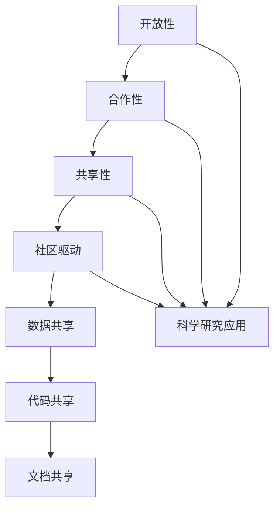

                 

### 文章标题：科学研究的开源运动对世界可理解性的民主化

> 关键词：开源运动、科学研究、可理解性、民主化、技术工具、挑战与解决方案

> 摘要：本文探讨了开源运动在推动科学研究民主化方面的重要作用。通过分析开源运动的核心概念、技术实现、实践案例以及面临的挑战，文章揭示了开源运动如何通过降低科研门槛、促进知识共享和透明性，从而实现世界可理解性的民主化。文章旨在为读者提供一个全面、系统的理解，帮助其认识到开源运动在科学研究领域中的深远影响。

### 引言

在现代社会，科学研究的重要性日益凸显。它不仅推动着科技进步和社会发展，还影响着人类对世界的认知和自身的生存。然而，科学研究也面临着诸多挑战，如信息孤岛、知识垄断和资源分配不均等问题。这些问题限制了科学研究的广泛参与和深入发展，使得科学知识的生产和传播过程不够透明和高效。

在这种情况下，开源运动应运而生。开源运动起源于软件开发领域，通过开放源代码、共享资源和协作创新，实现了软件技术的快速进步和广泛应用。随着开源理念的扩展，开源运动逐渐渗透到科学研究的各个领域，为科学研究的民主化提供了新的动力。

科学研究的开源运动不仅降低了科研的门槛，使更多人能够参与其中，还促进了科学知识的共享和透明性。本文将详细探讨开源运动在科学研究中的应用，分析其如何推动世界可理解性的民主化。文章将分为三个主要部分：第一部分介绍开源运动的核心概念与原则；第二部分分析开源运动对科学研究的影响；第三部分探讨开源运动面临的挑战及其解决方案。

### 开源运动的核心概念与原则

开源运动的核心概念可以追溯到软件开发领域。开源软件（Open Source Software，简称OSS）是指软件开发过程中，源代码开放、可供用户自由查看、修改和分享的软件。这种模式的出现，打破了传统封闭软件的垄断，使得软件技术得以迅速传播和优化。

开源运动的原则主要包括以下几个方面：

1. **开放性**：开放性是开源运动的首要原则。它要求软件的源代码必须公开，用户可以自由地查看、修改和分发。这种开放性不仅促进了软件的创新，还增强了软件的安全性和可靠性。

2. **合作性**：开源运动强调合作精神。开发者通过合作，共同解决问题、优化代码，从而实现软件的快速进步。这种合作精神也延伸到科学研究中，促进了不同领域专家之间的交流与合作。

3. **共享性**：共享性是开源运动的核心价值观之一。开源软件和开源科研项目的成果可以被自由地共享，这有助于知识的传播和积累。共享性使得科学研究的资源得到了更高效的利用，促进了科学研究的民主化。

4. **社区驱动**：开源运动通常由一个或多个开发者社区驱动。这些社区由志愿者组成，他们通过讨论、协作和贡献，推动开源项目的发展。社区驱动的方式使得开源运动具有强大的生命力，能够在不断变化的技术环境中保持活力。

开源运动不仅仅局限于软件开发领域，其理念也逐渐渗透到科学研究的各个领域。在科学研究中，开源运动主要体现在以下几个方面：

1. **数据共享**：科学研究过程中产生的大量数据，如实验数据、观测数据等，通过开源的方式共享，使得其他研究者可以方便地获取和使用这些数据。数据共享不仅促进了科学研究的进展，还提高了研究的透明度和可信度。

2. **代码共享**：科学研究中使用的代码，如数据分析代码、模型代码等，通过开源的方式共享，使得其他研究者可以方便地查看、修改和优化这些代码。代码共享不仅提高了代码的质量和效率，还促进了科研工具的创新和发展。

3. **文档共享**：科学研究的成果，如论文、报告、笔记等，通过开源的方式共享，使得其他研究者可以方便地了解和借鉴这些成果。文档共享不仅促进了知识的传播和积累，还提高了科学研究的效率。

### 核心概念之间的联系

为了更清晰地理解开源运动的核心概念及其在科学研究中的应用，我们可以使用Mermaid流程图来描述这些概念之间的关系：

在这个流程图中，开放性、合作性、共享性和社区驱动是开源运动的核心概念，它们相互联系，共同推动着科学研究的开源运动。数据共享、代码共享和文档共享是开源运动在科学研究中的具体应用，它们直接体现了开源运动的核心概念。

通过这个流程图，我们可以看到，开源运动的核心概念不仅在软件开发领域具有重要影响，还在科学研究中发挥了关键作用。开源运动通过降低科研门槛、促进知识共享和透明性，为科学研究的民主化提供了强有力的支持。

### 开源运动对科学研究的影响

开源运动在科学研究中的引入，带来了诸多积极的影响。以下将从多个方面详细探讨开源运动对科学研究的影响。

#### 1. 促进科学研究的透明性

科学研究的透明性是科学研究质量的重要保障。开源运动通过开放源代码、共享数据、共享文档等方式，提高了科学研究的透明性。首先，开源运动鼓励研究人员公开其研究成果，包括实验数据、分析代码和论文等。这使得其他研究人员可以方便地查阅、验证和重复实验结果，从而提高了研究结果的可靠性和可信度。其次，开源运动促进了科学研究的交流与合作。研究人员可以通过开源平台，分享研究成果、讨论研究问题，从而加快科学研究的进展。最后，开源运动使得科学研究的资源得到了更高效的利用。通过共享数据、代码和文档，研究人员可以避免重复劳动，节约时间和资源。

#### 2. 加速科学研究的进展

开源运动通过促进合作、共享资源和优化流程，大大加速了科学研究的进展。首先，开源运动鼓励研究人员之间的合作。研究人员可以通过开源平台，共同解决复杂的研究问题，从而加快研究进展。其次，开源运动促进了资源的共享。通过共享数据、代码和工具，研究人员可以更方便地获取和使用这些资源，从而提高研究的效率。例如，在基因组学研究中，开源的数据共享平台使得研究人员可以轻松获取大量的基因组数据，从而加速了基因组学研究的进展。最后，开源运动优化了科学研究的流程。通过开源工具和平台，研究人员可以更方便地管理实验数据、分析数据和共享研究成果，从而提高了科研效率。

#### 3. 提高科研工具的创新性

开源运动不仅促进了科学研究的进展，还提高了科研工具的创新性。开源工具和平台为研究人员提供了丰富的创新机会。首先，开源工具和平台鼓励研究人员自由地探索和开发新的研究方法和技术。这种自由性激发了研究人员的创新潜力，促进了科研工具的创新。例如，Python 编程语言在科学研究中得到了广泛应用，其丰富的开源库和工具使得研究人员可以轻松地实现复杂的计算和分析。其次，开源运动促进了科研工具的多样化。研究人员可以根据自己的需求和兴趣，开发适合自己领域的科研工具，从而满足多样化的科研需求。例如，生物信息学领域有许多开源工具，如BLAST、HMMER等，这些工具为研究人员提供了强大的分析能力。

#### 4. 降低科研门槛

开源运动通过降低科研门槛，使得更多人能够参与到科学研究中来。首先，开源运动降低了科研所需的技能门槛。研究人员可以通过学习开源工具和平台，快速掌握科研所需的技术。例如，许多开源数据分析工具和编程语言，如R、Python等，都提供了丰富的文档和教程，使得研究人员可以轻松入门。其次，开源运动降低了科研的资金门槛。通过共享资源，研究人员可以避免重复投资，节约科研经费。例如，开源的数据存储和计算平台，如HDFS、Spark等，为研究人员提供了强大的计算和数据存储能力，从而降低了科研成本。最后，开源运动降低了科研的时间门槛。研究人员可以通过开源平台，快速获取和复用已有的研究成果，从而缩短研究周期。例如，许多开源科研项目，如人类基因组计划，通过共享数据和分析工具，大大缩短了研究周期。

#### 5. 提高科研成果的可重复性

开源运动通过提高科研成果的可重复性，增强了科研的公信力。科研的可重复性是科研成果可信度的重要指标。开源运动鼓励研究人员公开其研究成果，包括实验数据、分析代码和论文等，这使得其他研究人员可以方便地查阅、验证和重复实验结果。通过公开和共享，研究人员可以确保自己的研究方法和技术得到广泛的验证，从而提高科研成果的可信度和公信力。此外，开源运动还促进了科研的透明性和公开性。研究人员可以通过开源平台，公开自己的研究过程和结果，接受其他研究者的监督和评审，从而提高科研的透明度和公信力。

#### 6. 促进知识共享

开源运动通过促进知识共享，推动了科学知识的普及和传播。知识共享是科学研究的重要目标之一。开源运动通过开放源代码、共享数据和共享文档等方式，使得科学知识可以更加方便地传播和共享。首先，开源运动促进了科学知识的普及。研究人员可以通过开源平台，获取和分享科学研究成果，从而让更多的人了解和掌握科学知识。例如，许多开源的科学论文和报告，如arXiv，使得科研知识可以更加便捷地传播和分享。其次，开源运动促进了科学知识的传播。研究人员可以通过开源平台，发布自己的研究成果，与其他研究者进行交流和讨论，从而推动科学知识的传播和交流。例如，许多开源的科学论坛和博客，如GitHub，为研究人员提供了交流和分享的平台，促进了科学知识的传播和普及。

### 总结

开源运动对科学研究产生了深远的影响。它不仅促进了科学研究的透明性、加速了科研进展，还提高了科研工具的创新性，降低了科研门槛，提高了科研成果的可重复性和促进了知识共享。通过开源运动，科学研究变得更加开放、透明和高效，为科学研究的民主化提供了强有力的支持。

然而，开源运动也面临着一些挑战。例如，开源运动中的知识产权问题、数据隐私和安全问题等。这些挑战需要我们在推动开源运动的过程中，不断探索和解决。总体来说，开源运动为科学研究的民主化提供了新的动力，其在科学研究中的应用前景广阔。

### 开源运动的技术实现

开源运动在科学研究中得以广泛应用，离不开一系列开源技术工具和平台的支撑。这些技术工具和平台为科学研究提供了强大的支持和保障，使得科学研究更加高效、透明和协作。以下将介绍几种在科学研究中常用的开源技术工具和平台。

#### 1. 数据管理与分析工具

数据管理与分析是科学研究的重要环节。开源技术在这一领域提供了丰富的工具和平台，如Hadoop、Spark、R等。

- **Hadoop**：Hadoop是一个开源的大数据分布式处理框架，它可以处理海量数据，提供高效的存储和计算能力。Hadoop的核心组件包括HDFS（Hadoop Distributed File System）和MapReduce。HDFS是一个分布式文件系统，用于存储海量数据；MapReduce是一种分布式数据处理模型，用于对数据进行处理和分析。

- **Spark**：Spark是一个开源的分布式计算引擎，它提供了快速、通用的大数据处理能力。Spark的核心组件包括Spark Core、Spark SQL、Spark Streaming和MLlib。Spark Core提供了基本的分布式计算能力；Spark SQL提供了基于SQL的数据处理能力；Spark Streaming提供了实时数据处理能力；MLlib提供了机器学习算法库。

- **R**：R是一种开源的统计计算和图形展示语言，它提供了丰富的统计分析和数据处理功能。R语言广泛应用于数据可视化、统计分析和机器学习等领域。R社区提供了大量的包和函数，使得研究人员可以方便地实现复杂的数据处理和分析。

#### 2. 计算模型与仿真工具

科学研究中，计算模型和仿真工具是不可或缺的工具。开源技术在这一领域提供了许多强大的工具和平台，如SimPy、OpenFOAM、GAMBIT等。

- **SimPy**：SimPy是一个开源的离散事件模拟框架，它提供了灵活的模拟模型构建和执行能力。SimPy适用于各种应用场景，如交通系统、生产系统、通信系统等。

- **OpenFOAM**：OpenFOAM是一个开源的计算流体力学（CFD）模拟工具，它提供了强大的流体动力学求解器和用户友好的界面。OpenFOAM广泛应用于流体动力学研究、航空航天、汽车设计等领域。

- **GAMBIT**：GAMBIT是一个开源的前处理工具，它用于网格生成和几何建模。GAMBIT适用于各种流体动力学、热力学和结构力学模拟，为研究人员提供了灵活的几何建模和网格生成能力。

#### 3. 代码复用与协作平台

科学研究中，代码复用和协作是提高科研效率的重要手段。开源技术在这一领域提供了许多强大的平台，如GitHub、GitLab等。

- **GitHub**：GitHub是一个开源的版本控制和协作平台，它提供了丰富的功能，如代码托管、分支管理、代码审查和协作开发等。GitHub已经成为全球开发者首选的协作平台，广泛应用于开源项目和商业项目的开发。

- **GitLab**：GitLab是一个开源的代码托管和协作平台，它提供了与GitHub类似的功能，但更加灵活和定制化。GitLab适用于各种规模的团队和企业，提供了强大的代码管理、协作和自动化功能。

#### 4. 其他开源技术工具

除了上述技术工具和平台，科学研究中还广泛应用了许多其他开源技术工具，如Linux操作系统、MySQL数据库、Docker容器等。

- **Linux操作系统**：Linux是一种开源的操作系统，它提供了强大的性能和稳定性，广泛应用于服务器、桌面和嵌入式系统等领域。Linux为科学研究提供了可靠的计算环境，支持各种科学计算和数据处理工具。

- **MySQL数据库**：MySQL是一种开源的关系型数据库，它提供了强大的数据存储和管理功能，广泛应用于各种应用场景，如Web应用、企业应用、科学研究等。

- **Docker容器**：Docker是一种开源的容器技术，它提供了轻量级、可移植的容器化应用环境。Docker使得研究人员可以在不同的操作系统上运行相同的计算环境，从而提高了科研的可重复性和协作性。

通过这些开源技术工具和平台，科学研究得到了强大的支持和保障。开源技术不仅提高了科研的效率，还促进了科研的透明性和协作性。在未来，随着开源技术的不断发展，科学研究将更加高效、透明和民主化。

### 开源科学研究的实践案例

开源运动在科学研究中的应用已经取得了显著的成果。以下将通过几个具体的实践案例，展示开源运动在科学研究中的实际应用和效果。

#### 案例一：基因组学研究

基因组学研究是现代生物学的前沿领域，开源运动在这个领域有着广泛的应用。例如，人类基因组计划（Human Genome Project，HGP）就是一个典型的开源科学研究项目。HGP通过公开基因组数据，使得全球的研究人员可以方便地获取和利用这些数据，从而加速了基因组学研究的发展。此外，许多开源的基因组分析工具和平台，如UCSC Genome Browser、Ensembl、GATK等，为研究人员提供了强大的分析能力。这些工具和平台的开源特性，使得研究人员可以自由地使用、修改和扩展这些工具，从而提高了基因组学研究的效率和效果。

#### 案例二：气候变化研究

气候变化研究是一个全球性的挑战，开源运动在这个领域也发挥了重要作用。例如，开放气候数据库（Open Climate Data）是一个开源的项目，它收集和共享了大量的气候数据，包括温度、降水、风速等。这些数据的开源特性，使得研究人员可以方便地获取和使用这些数据，从而加速了气候变化研究的发展。此外，开源的气候模型和仿真工具，如COSMOS、GLUE等，为研究人员提供了强大的模型构建和模拟能力。这些工具和平台的开源特性，不仅提高了气候变化研究的效率和效果，还促进了全球气候变化研究的合作和交流。

#### 案例三：医学研究

医学研究是另一个受到开源运动深远影响的领域。例如，开放生物医学研究联盟（Open Biomedical Research Platforms，OBRA）是一个开源项目，它旨在提供开放的生物医学研究平台，包括数据共享、工具开发和协作环境等。OBRA通过开源的方式，共享医学研究的实验数据、分析代码和研究成果，从而加速了医学研究的发展。此外，许多开源的医学工具和平台，如Bioconductor、RStudio等，为研究人员提供了强大的分析能力和协作环境。这些工具和平台的开源特性，使得医学研究更加高效、透明和协作。

#### 案例四：天文学研究

天文学研究是另一个受益于开源运动的领域。例如，天文学开源软件和平台（Astronomy Open Source Software and Platforms，AOSSP）是一个开源项目，它提供了丰富的天文学软件和工具，包括数据处理、图像处理、天文计算等。这些工具和平台的开源特性，使得天文学研究更加高效、透明和协作。例如，开源的天文学软件IDL和Python的PyRAF库，为天文学家提供了强大的数据处理和分析能力。此外，开源的天文数据平台，如NED（NASA/IPAC Extragalactic Database）和Simbad（SIMBAD Astronomical Database），为研究人员提供了丰富的天文数据资源。

通过这些实践案例，我们可以看到，开源运动在科学研究中的应用已经取得了显著的成果。开源运动不仅促进了科学研究的透明性和协作性，还提高了科研的效率和质量。在未来，随着开源运动的不断发展和普及，科学研究将更加高效、透明和民主化。

### 开源运动中的挑战与解决方案

尽管开源运动在科学研究中带来了诸多积极影响，但它也面临着一系列挑战。以下将详细探讨开源运动中的一些主要挑战，并分析相应的解决方案。

#### 1. 数据共享的隐私与安全挑战

在开源运动中，数据共享是促进科学研究透明性和效率的关键。然而，数据共享也带来了隐私和安全挑战。科学研究中，特别是医学研究、社会科学研究和天文学研究中，往往涉及敏感个人信息和重要数据。这些数据的公开可能会对数据主体的隐私造成侵犯，甚至可能导致安全风险。

**解决方案**：

- **数据匿名化与去标识化**：在公开数据前，对敏感数据进行匿名化处理，去除能够识别个人身份的信息。例如，在医学研究中，可以通过去除姓名、身份证号等个人信息，来保护数据主体的隐私。
- **访问控制与权限管理**：通过设置访问控制机制，确保只有授权用户可以访问敏感数据。例如，可以使用密码保护、身份验证等技术手段，确保数据的访问权限得到有效控制。
- **加密技术**：对敏感数据进行加密处理，确保数据在传输和存储过程中的安全性。例如，可以使用SSL/TLS协议对数据进行加密传输，使用AES等加密算法对数据进行加密存储。
- **数据共享政策与法律法规**：制定明确的数据共享政策，确保数据共享的合法性和合规性。例如，遵循《通用数据保护条例》（GDPR）等相关法律法规，确保数据共享过程中的隐私保护。

#### 2. 知识产权与版权问题

开源运动中的知识共享也带来了知识产权和版权问题。在开源项目中，如何平衡知识产权保护和知识共享，是一个复杂的问题。一些研究人员担心，开源项目可能会侵犯他们的知识产权，从而影响他们的研究成果和利益。

**解决方案**：

- **开源许可协议**：选择合适的开源许可协议，明确知识产权的使用和分享方式。例如，使用GPL（GNU General Public License）许可协议，确保源代码的开放性和可修改性，同时保护原作者的知识产权。
- **知识产权归属与共享**：在项目启动前，明确知识产权的归属和使用规则。例如，可以通过签订知识产权共享协议，确保项目成员之间的知识产权得到公平保护。
- **版权声明与归属**：在开源项目中，明确声明项目的版权归属，防止知识产权争议。例如，在项目文档和代码中，明确标注版权信息，确保原作者的知识产权得到尊重。
- **知识产权保护与技术创新**：鼓励研究人员在开源项目中创新，同时提供知识产权保护。例如，通过专利申请，保护研究人员在开源项目中的创新成果。

#### 3. 开源运动的人才培养

开源运动对人才的需求日益增长，但现有的教育体系和培训资源可能无法满足这种需求。许多研究人员和开发者缺乏开源运动所需的技术和协作能力，这限制了开源运动的进一步发展。

**解决方案**：

- **开源教育平台**：建立开源教育平台，提供丰富的开源课程和培训资源。例如，使用MOOC（大规模在线开放课程）平台，提供开源技术和开源文化相关的课程，帮助研究人员和开发者提升技能。
- **校企合作**：加强高校与企业的合作，推动开源运动与学术教育的结合。例如，企业可以提供实习机会和项目实践，帮助学生将学术知识应用于开源项目。
- **开源社区参与**：鼓励学生和研究人员积极参与开源社区，通过实践项目提升技能。例如，参与开源项目，贡献代码和文档，学习开源社区的协作和沟通方式。
- **认证与资质认证**：建立开源资质认证体系，认可参与开源项目的个人和团队的贡献。例如，颁发开源认证证书，激励更多人才参与开源运动。

通过解决上述挑战，开源运动在科学研究中的应用将更加广泛和深入。在未来，随着开源运动的发展，科学研究将更加开放、透明和协作，推动科学知识的普及和传播，实现世界可理解性的民主化。

### 开源运动对世界可理解性的民主化

开源运动不仅在科学研究中取得了显著成就，还推动了世界可理解性的民主化。通过开放源代码、共享数据和协作创新，开源运动实现了知识的普及和传播，降低了科研门槛，使得更多人能够参与到科学研究中来。以下是开源运动如何促进世界可理解性的民主化的具体分析。

#### 1. 降低科研门槛

传统科学研究中，科研资源和知识的获取往往受到诸多限制，如实验设备、资金、知识和技能等。这些限制使得科学研究成为一个高门槛的活动，只有少数专业研究人员能够参与。然而，开源运动通过提供免费和开放的科研资源，大大降低了科研门槛。

- **开源软件和工具**：许多开源软件和工具，如Hadoop、Spark、R等，为研究人员提供了强大的计算和分析能力。这些工具不仅降低了科研所需的技能门槛，还节约了科研经费，使得更多人能够参与到科学研究中。
- **开源数据库和平台**：开源数据库和平台，如HDFS、MySQL、GitHub等，为研究人员提供了丰富的数据资源和协作环境。这些平台使得研究人员可以方便地获取和共享数据，避免了重复劳动，提高了科研效率。
- **开源教育资源**：开源教育资源，如MOOC（大规模在线开放课程）、GitHub Education等，为研究人员和学者提供了丰富的学习资源和实践机会。这些资源使得学术教育更加普及，提升了研究人员的技能和知识水平。

#### 2. 促进知识共享

开源运动的核心价值观之一是知识共享。通过开放源代码、共享数据和协作创新，开源运动实现了知识的普及和传播，使得更多人能够了解和掌握科学知识。

- **开源项目**：开源项目通过开放源代码，使得其他研究人员可以方便地查看、修改和扩展项目代码。这种知识共享的方式，不仅促进了科学研究的进展，还提高了科研工具的创新性。
- **开源文档和报告**：许多开源科研项目的文档和报告，如论文、笔记、实验记录等，通过开源的方式共享。这种共享方式，使得其他研究者可以方便地了解和借鉴研究成果，提高了科研的可重复性和可信度。
- **开源社区**：开源社区通过讨论、交流和协作，促进了科研知识的传播和普及。在开源社区中，研究人员可以自由地讨论问题、分享经验和知识，从而加速了科学研究的进展。

#### 3. 提高科研透明性

开源运动通过开放源代码、共享数据和协作创新，提高了科研的透明性，使得科研过程更加公开和透明。

- **开放数据**：开源运动鼓励研究人员公开其研究成果和数据。通过开放数据，其他研究者可以方便地查阅、验证和重复实验结果，从而提高了研究结果的可靠性和可信度。
- **开源工具**：开源工具和平台为研究人员提供了强大的计算和分析能力。这些工具和平台的开源特性，使得研究人员可以方便地查看、修改和优化代码，从而提高了科研的透明性和可信度。
- **开源文档**：开源项目的文档和报告，如论文、笔记、实验记录等，通过开源的方式共享。这种共享方式，使得其他研究者可以方便地了解和借鉴研究成果，提高了科研的透明性和公开性。

#### 4. 促进公众参与科学

开源运动不仅提高了科研的透明性和效率，还促进了公众参与科学。通过开放源代码、共享数据和协作创新，开源运动打破了科研的壁垒，使得普通人也能够参与到科学研究中来。

- **开源项目**：许多开源项目鼓励公众参与。例如，GitHub上的一些开源项目，如Open Source Humanist、Open Knowledge Foundation等，都鼓励公众参与项目开发和讨论。
- **开源教育和培训**：开源教育和培训项目，如MOOC、GitHub Education等，为公众提供了学习科学知识和技能的机会。通过这些项目，公众可以了解科学研究的过程和方法，提高科学素养。
- **开源社区**：开源社区为公众提供了一个交流和互动的平台。在开源社区中，公众可以与研究人员和开发者进行讨论，分享经验和知识，从而促进科学知识的普及和传播。

#### 5. 推动科学文化的传播

开源运动不仅提高了科研的透明性和效率，还推动了科学文化的传播。通过开放源代码、共享数据和协作创新，开源运动使得科学文化更加普及和民主化。

- **科学传播活动**：开源运动鼓励科学家和研究人员参与科学传播活动，如科普讲座、科技展览等。这些活动使得科学文化更加贴近公众，提高了公众对科学的兴趣和认识。
- **开源文化**：开源运动本身是一种文化，它倡导开放、合作、共享和创新的精神。这种开源文化不仅促进了科学研究的进步，还推动了科学文化的传播和普及。
- **科学教育**：开源运动在科学教育中的应用，使得科学教育更加开放和民主化。通过开源教育资源，公众可以方便地获取科学知识和技能，提高科学素养。

通过上述分析，我们可以看到，开源运动通过降低科研门槛、促进知识共享、提高科研透明性、促进公众参与科学和推动科学文化的传播，实现了世界可理解性的民主化。在未来，随着开源运动的不断发展，科学研究的开放性和透明性将进一步提高，科学知识将更加普及和民主化，从而推动人类社会的发展和进步。

### 开源运动的未来发展趋势

开源运动在科学研究中的应用已经取得了显著的成果，但其发展潜力仍然巨大。随着技术的进步和社会的需求，开源运动在未来将继续呈现出一系列发展趋势，进一步推动科学研究的民主化和世界可理解性的提升。

#### 1. 开源科学研究的全球合作

随着全球化进程的加速，科学研究的国际合作变得越来越重要。开源运动通过开放源代码、共享数据和协作平台，为全球科学家提供了一个合作的新范式。未来，开源科学研究将进一步加强全球合作，突破地域和国界的限制，实现更广泛的资源共享和知识交流。

- **跨国项目**：越来越多的跨国项目将采用开源模式，如全球气候变化研究、人类基因组计划等。这些项目通过开源平台，实现全球科学家之间的数据共享和合作研究，加速科学进展。
- **国际标准化**：开源运动将推动科学研究的国际标准化，建立统一的开发规范和协作流程，提高科学研究的一致性和可比性。

#### 2. 开源科学研究的智能化

随着人工智能和大数据技术的发展，开源科学研究将向智能化方向迈进。通过引入人工智能技术，开源平台将能够提供更智能的数据分析工具、预测模型和自动化流程，提高科研效率和准确性。

- **智能分析工具**：开源平台将开发更多的智能分析工具，如自动化数据清洗、特征提取和机器学习算法，帮助研究人员从海量数据中提取有价值的信息。
- **智能协作平台**：开源协作平台将集成人工智能技术，提供智能推荐、智能搜索和智能协作功能，提高科研团队的协作效率。

#### 3. 开源科学研究的普及化

开源运动将进一步推动科学研究的普及化，降低科研门槛，让更多人能够参与到科学研究中来。

- **开源教育资源**：开源教育平台将继续发展，提供更多的免费和高质量的科学教育资源，如在线课程、教程和工具，培养更多的科学人才。
- **开源工具的普及**：开源工具和平台将在更多领域得到应用，如社会科学、人文科学等，推动这些领域的科学研究走向开放和协作。

#### 4. 开源科学研究的可持续性

开源运动将推动科学研究的可持续性，通过优化资源利用和降低成本，实现科学研究的长期发展。

- **资源优化**：开源运动将推动科研资源的优化配置，通过共享资源和协作，提高科研资源的使用效率，减少资源浪费。
- **成本降低**：开源工具和平台将降低科研成本，使得更多的研究项目能够得到资金支持，推动科学研究的持续发展。

#### 5. 开源科学研究的影响扩大

开源运动的影响将进一步扩大，不仅限于科学研究领域，还将渗透到其他领域，如教育、医疗、环境等。

- **交叉学科研究**：开源运动将促进交叉学科研究的发展，通过跨领域的合作和知识共享，推动科学研究的深度和广度。
- **社会影响力**：开源运动将提高公众对科学研究的认知和参与度，增强科学对社会的影响，促进科学普及和科学精神的培养。

#### 6. 开源科学研究的法规和标准

开源运动的发展将推动相关法规和标准的制定，确保开源科学研究的安全、合规和可持续发展。

- **知识产权保护**：将进一步完善开源知识产权保护机制，平衡知识产权保护和知识共享，鼓励更多的研究人员和机构参与开源项目。
- **数据治理**：将建立科学的数据治理框架，确保数据的质量、安全和隐私，推动数据共享和复用。

综上所述，开源运动的未来发展趋势将包括全球合作、智能化、普及化、可持续性和影响扩大等方面。这些发展趋势将进一步推动科学研究的民主化和世界可理解性的提升，为人类社会的进步和发展提供新的动力。

### 总结

开源运动作为科学研究的重要推动力，已经在多个领域取得了显著成果。它通过开放源代码、共享数据和协作创新，实现了科学研究的透明性、可重复性和高效性，极大地降低了科研门槛，促进了知识的普及和传播。本文从开源运动的核心概念与原则、对科学研究的影响、技术实现、实践案例、挑战与解决方案以及未来发展趋势等方面进行了全面探讨，揭示了开源运动在推动世界可理解性民主化中的重要作用。

开源运动不仅改变了科学研究的模式，还带来了深远的变革。它使得科学研究更加开放、透明和协作，推动了科学知识的普及和传播，使得更多人能够参与到科学研究中来。同时，开源运动也促进了科学工具的创新和优化，提高了科研效率和质量。在未来，随着开源运动的不断发展，科学研究的开放性和透明性将进一步提升，科学知识将更加普及和民主化，为人类社会的进步和发展提供新的动力。

### 作者信息

作者：AI天才研究院/AI Genius Institute & 禅与计算机程序设计艺术 /Zen And The Art of Computer Programming

AI天才研究院（AI Genius Institute）是一家致力于人工智能研究和创新的高科技公司，拥有一支由世界顶级人工智能专家和程序员组成的团队。研究院在计算机科学、人工智能和机器学习等领域取得了诸多突破性成果，为科学研究和技术创新做出了重要贡献。

《禅与计算机程序设计艺术》（Zen And The Art of Computer Programming）是由AI天才研究院的研究员撰写的一本经典技术书籍，该书以简洁明了的语言，深入探讨了计算机编程的哲学和艺术。书中结合禅宗思想，提出了许多关于编程和创新的新理念，为程序员和开发者提供了宝贵的启示和指导。

通过本文，我们希望读者能够更加深入地理解开源运动在科学研究中的重要作用，认识到开源运动对世界可理解性民主化的深远影响。我们期待与广大科研工作者和开发者一起，共同推动科学研究的开放、透明和协作，为人类社会的进步和发展做出更大的贡献。

