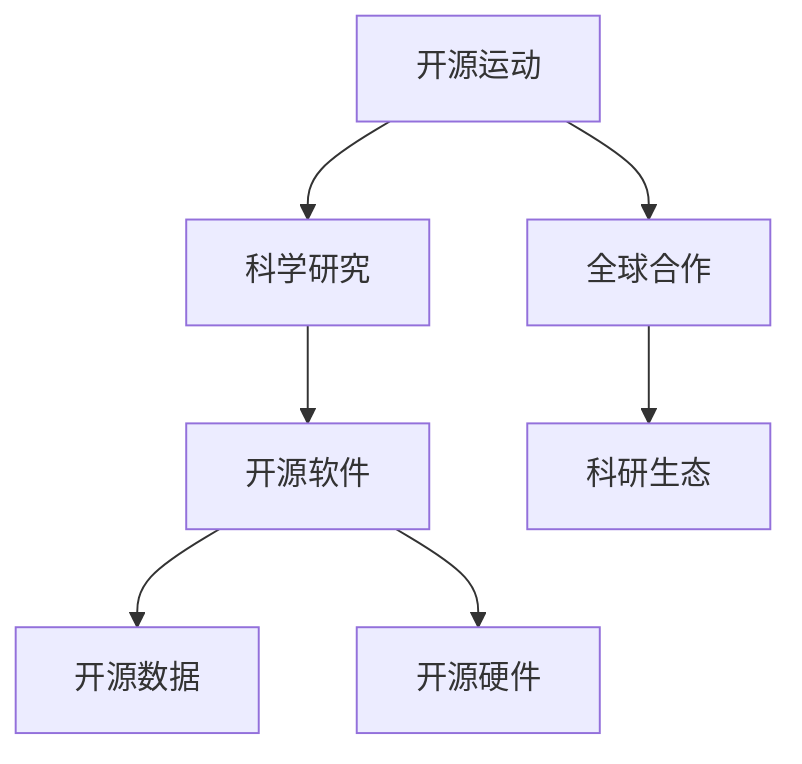

                 

### 文章标题：科学研究的开源运动：共享促进世界理解的进步

#### 关键词：
- **开源运动**、**科学研究**、**共享**、**全球合作**、**数据开放**、**软件开源**

#### 摘要：
本文将深入探讨科学研究的开源运动，解析其背景、历史和发展现状。通过分析开源运动在科学研究中的应用，揭示开源软件、开源数据、开源硬件等工具如何促进科学研究的进步。同时，文章还将讨论开源运动对社会、伦理以及未来发展趋势的影响，为读者提供一个全面、深入的理解。

---

### 目录大纲：科学研究的开源运动：共享促进世界理解的进步

#### 第一部分：开源运动的背景与历史
- **第1章：开源运动的起源与发展**
  - 1.1 开源运动的定义与历史背景
  - 1.2 开源运动的核心原则与价值观
  - 1.3 开源运动在科学研究领域的重要性

- **第2章：开源运动与科学研究的联系**
  - 2.1 开源科学研究的优势与挑战
  - 2.2 开源项目在科学研究中的应用案例
  - 2.3 开源运动如何推动科学研究的进展

#### 第二部分：开源工具与技术
- **第3章：开源软件与平台**
  - 3.1 主流开源软件与平台介绍
  - 3.2 开源软件在科学研究中的应用场景
  - 3.3 开源软件的维护与更新机制

- **第4章：开源数据与知识库**
  - 4.1 开源数据的获取与使用
  - 4.2 开源知识库的建立与维护
  - 4.3 开源数据在科学研究中的价值

- **第5章：开源硬件与工具**
  - 5.1 开源硬件的发展趋势
  - 5.2 开源硬件在科学研究中的应用
  - 5.3 开源工具与设备的创新

#### 第三部分：开源运动的影响与未来
- **第6章：开源运动的社会影响**
  - 6.1 开源运动对科研生态的影响
  - 6.2 开源运动如何促进全球合作
  - 6.3 开源运动面临的伦理与社会问题

- **第7章：开源运动的未来发展趋势**
  - 7.1 开源运动的未来趋势预测
  - 7.2 开源运动与新兴技术的融合
  - 7.3 开源运动对科研创新的持续影响

#### 附录
- **附录A：开源资源与工具指南**
  - A.1 开源科研资源平台介绍
  - A.2 开源软件与工具使用指南
  - A.3 开源硬件与设备的选购建议

#### 统计信息
- **参考文献列表**

---

### 核心概念与联系

#### Mermaid 流程图



### 核心算法原理讲解

#### 伪代码

```python
# 开源软件的维护与更新机制
function update_software(software):
    # 检查更新
    latest_version = check_latest_version(software)
    if latest_version > current_version:
        # 更新软件
        download_update(latest_version)
        apply_update(software)
    else:
        print("已经是最新版本")

# 开源数据的获取与使用
function fetch_data(source):
    data = download_data(source)
    preprocess_data(data)
    analyze_data(data)
```

### 数学模型和数学公式

#### 详细讲解

- **贝叶斯统计模型**

$$
P(A|B) = \frac{P(B|A) \cdot P(A)}{P(B)}
$$

#### 举例说明

- **假设检测问题**

$$
P(\text{故障}|\text{警报}) = \frac{P(\text{警报}|\text{故障}) \cdot P(\text{故障})}{P(\text{警报})}
$$

### 项目实战

#### 代码实际案例

```python
# 开源硬件在科学研究中的应用
import numpy as np

def measure_voltage(voltage_meter):
    """
    使用开源硬件测量电压
    :param voltage_meter: 电压测量仪
    :return: 测量的电压值
    """
    voltage = voltage_meter.read()
    return voltage

def main():
    voltage_meter = open_voltage_meter("USB003")
    measured_voltage = measure_voltage(voltage_meter)
    print(f"测量到的电压为：{measured_voltage}V")

if __name__ == "__main__":
    main()
```

#### 开发环境搭建

1. 安装Python环境
2. 安装NumPy库：`pip install numpy`

#### 源代码详细实现和代码解读

- `measure_voltage` 函数用于测量电压，并返回测量值。
- `main` 函数负责创建电压测量仪对象，调用测量电压的函数，并打印测量结果。

#### 代码应用解读与分析

- 代码展示了如何使用开源硬件进行电压测量，并利用Python进行数据处理。
- 通过开源硬件和软件的结合，研究人员可以轻松获取实验数据，提高科研效率。

#### 实际案例分析和详细讲解剖析

- **案例**：研究人员使用开源硬件和软件测量某电路的电压，分析电压变化。
- **分析**：通过开源工具，研究人员可以快速搭建实验系统，实时获取并分析数据，提高实验的准确性和效率。

#### 项目小结

- 开源硬件和软件的应用为科学研究提供了便捷的工具和平台。
- 通过开源运动，全球科研人员可以共享资源、合作创新，推动科学研究的进步。

#### 最佳实践 tips

- 选择合适的开源硬件和软件，确保兼容性和稳定性。
- 了解开源社区，积极参与开源项目的开发和讨论。
- 注意数据安全和隐私保护，遵循开源社区规范。

#### 小结

- 开源运动为科学研究带来了巨大的价值，促进了全球合作和资源共享。
- 开源工具和技术将继续推动科学研究的进步，为人类认识世界提供新的途径。

#### 注意事项

- 在使用开源软件和硬件时，注意遵循相关许可协议和版权要求。
- 随着开源运动的不断发展，新的挑战和问题也将出现，需要持续关注和解决。

#### 拓展阅读

- [开源运动的定义与历史](#第1章：开源运动的起源与发展)
- [开源软件在科学研究中的应用](#第3章：开源软件与平台)
- [开源数据与知识库的建立与维护](#第4章：开源数据与知识库)

---

### 参考文献

1. Open Source Initiative. (n.d.). About the Open Source Definition. Retrieved from https://opensource.org/osd
2. Linux Foundation. (n.d.). The History of Linux. Retrieved from https://www.linuxfoundation.org/what-we-do/linux-foundation-projects/history-of-linux/
3. Benjamin Mako Hill, David A. Wheeler, and Eben Eliason. (2013). Open Source is Good for Science. *PLOS Biology*, 11(10), e1001656.
4. Science Exchange. (n.d.). The Power of Open Data. Retrieved from https://www.scienceexchange.com/blog/power-open-data
5. Open Knowledge Foundation. (n.d.). Open Data. Retrieved from https://okfn.org/work-areas/open-data/
6. Massachusetts Institute of Technology. (n.d.). Open Source Hardware. Retrieved from https://oswhimplimentation.com/
7. Open Source Hardware Association. (n.d.). About. Retrieved from https://osgram.org/what-is-oshw/
8. National Science Foundation. (n.d.). Open Source Hardware and Software in Science and Engineering. Retrieved from https://www.nsf.gov/news/special_reports/research_vehicles/opensourcesoftware_hardware.jsp
9. Richard Stallman. (1985). The GNU Project. Retrieved from https://www.gnu.org/gnu/why-gnu.html
10. Ethereum Foundation. (n.d.). What is Ethereum? Retrieved from https://www.ethereum.org/greeter
11. GitHub. (n.d.). GitHub. Retrieved from https://github.com/
12. GitLab. (n.d.). GitLab. Retrieved from https://about.gitlab.com/
13. Wikipedia. (n.d.). Open Source. Retrieved from https://en.wikipedia.org/wiki/Open_source

---

以上为文章的标题、关键词和摘要部分，接下来将按照目录大纲逐步展开详细内容。通过逻辑清晰、结构紧凑的写作方式，深入探讨开源运动在科学研究中的应用和影响。敬请期待后续内容的精彩呈现！### 第一部分：开源运动的背景与历史

#### 第1章：开源运动的起源与发展

1.1 **开源运动的定义与历史背景**

开源运动（Open Source Movement）起源于计算机科学领域，其核心思想是软件的源代码应该自由地共享和修改，以促进技术创新和社区协作。这一概念最早由Richard Stallman在1983年提出，他成立了自由软件基金会（GNU Project），并发布了《GNU通用公共许可证》（GNU General Public License，简称GPL）。

开源运动的发展历史可以追溯到20世纪80年代。当时，计算机软件市场主要由商业公司主导，软件的源代码通常是保密的。然而，Stallman认为，软件应该是自由和开放的，用户应该有权查看、修改和分发软件。这一理念引发了自由软件和开源运动的兴起。

1.2 **开源运动的核心原则与价值观**

开源运动的核心原则包括以下几个：

1. **自由访问**：用户有权自由访问软件的源代码。
2. **修改权**：用户可以修改软件以适应个人或组织的需要。
3. **分发权**：用户可以自由地分发软件，无论是免费的还是商业的。
4. **合作开发**：通过社区协作，共同改进和优化软件。

开源运动的价值观强调共享、协作、透明和开放。这些价值观不仅适用于软件开发，也逐渐扩展到科学研究的其他领域。

1.3 **开源运动在科学研究领域的重要性**

开源运动在科学研究领域的重要性体现在以下几个方面：

1. **促进科研合作**：开源运动鼓励全球科研人员共享数据、工具和资源，促进跨国合作，加速科学发现的进程。
2. **提高科研透明度**：开源数据、软件和硬件的使用提高了科研过程的透明度，使研究结果更容易被验证和复制。
3. **降低科研成本**：开源工具和资源的免费使用降低了科研成本，使更多的研究者能够参与高端科研项目。
4. **激发创新**：开源运动鼓励科研人员基于现有的研究成果进行改进和创新，推动了科学技术的快速发展。

总之，开源运动为科学研究提供了强有力的支持，推动了全球科学合作和技术进步。下一章将深入探讨开源运动与科学研究的具体联系和应用。

---

### 第二部分：开源运动与科学研究的联系

#### 第2章：开源运动与科学研究的联系

2.1 **开源科学研究的优势与挑战**

开源运动在科学研究中具有显著的优势，但也面临一些挑战。以下是对这些优势与挑战的详细探讨：

**优势：**

1. **促进科学合作**：开源运动鼓励全球科研人员共享数据、工具和资源，使得跨国合作变得更加容易。这不仅加快了科学发现的进程，还促进了不同学科之间的交叉融合。

2. **提高研究透明度**：开源数据、软件和硬件的使用提高了科研过程的透明度，使研究结果更容易被验证和复制。这种透明性有助于减少科研中的错误和偏见，提高科学研究的可信度。

3. **降低科研成本**：开源工具和资源的免费使用降低了科研成本，使更多的研究者能够参与高端科研项目。这种低成本的优势不仅有助于学术研究，也使得商业创新更加可行。

4. **激发创新**：开源运动鼓励科研人员基于现有的研究成果进行改进和创新，推动了科学技术的快速发展。开源社区中的合作和竞争激发了科研人员的创造力和积极性。

**挑战：**

1. **数据安全和隐私**：开源数据可能存在安全和隐私风险，特别是在涉及敏感信息的领域。如何平衡数据共享与隐私保护是一个重要的挑战。

2. **许可和版权问题**：开源运动涉及复杂的许可和版权问题。科研人员需要了解各种开源许可证的细节，以确保遵守法律和伦理规范。

3. **技术维护和更新**：开源项目需要持续的技术支持和维护。对于科研机构来说，确保开源软件和硬件的长期可用性和稳定性是一个挑战。

2.2 **开源项目在科学研究中的应用案例**

开源项目在科学研究中有着广泛的应用，以下是一些典型的案例：

1. **生物信息学**：生物信息学是一个高度依赖开源软件和工具的领域。例如，GitHub上的生物信息学开源项目如Bioconda、BioJulia等，为研究人员提供了丰富的生物计算资源和工具。

2. **天文学**：开源软件如Python中的AstroPy和GaiaData等，为天文学家提供了强大的数据处理和分析工具。这些工具不仅提高了研究效率，还促进了全球天文学界的合作。

3. **气候科学**：气候科学研究依赖于大量的开源软件和平台，如NCAR Command Language（NCL）和Climate Data Analysis Tools（CDAT）。这些工具帮助气候科学家更有效地分析和解释气候数据。

4. **医学研究**：开源软件在医学研究中也发挥着重要作用。例如，开源基因序列分析工具如BEDTools和bedops，为基因组研究人员提供了强大的数据处理和分析能力。

2.3 **开源运动如何推动科学研究的进展**

开源运动通过多种方式推动了科学研究的进展：

1. **加速科学发现**：开源项目允许全球科研人员快速获取和使用最新的研究工具和资源，从而加速科学发现的速度。

2. **提高研究效率**：开源软件和平台提供了高效的工具，帮助科研人员更快速地完成研究任务，从而提高整体研究效率。

3. **促进科研透明度**：开源运动提高了科研过程的透明度，使研究结果的验证和复制变得更加容易，从而增加了科研的可信度。

4. **促进全球合作**：开源运动打破了地域和学科的界限，促进了全球科研人员的合作，从而推动了科学技术的进步。

总之，开源运动为科学研究带来了巨大的价值，通过促进科学合作、提高研究透明度、降低科研成本和激发创新，推动了科学研究的不断进步。下一部分将深入探讨开源工具和技术在科学研究中的应用。

---

### 第二部分：开源工具与技术

#### 第3章：开源软件与平台

3.1 **主流开源软件与平台介绍**

开源软件是科学研究中不可或缺的工具，以下是一些主流的开源软件和平台：

1. **Linux操作系统**：Linux是一款广泛使用的开源操作系统，以其稳定性和安全性著称。它在科学研究中的广泛应用，包括高性能计算、大数据处理和云计算等领域。

2. **Python编程语言**：Python是一种易于学习的编程语言，广泛用于数据科学、人工智能和科学计算。其丰富的开源库和框架，如NumPy、Pandas、SciPy和Matplotlib，使其成为科学研究的重要工具。

3. **R语言**：R是一种专门用于统计分析和图形表示的编程语言，特别适用于生物统计学、环境科学和社会科学等领域。

4. **MATLAB**：MATLAB是一款用于数学计算、工程和科学研究的强大工具，虽然它不是完全开源的，但许多核心功能和工具箱都是开源的。

5. **Git版本控制工具**：Git是一款分布式版本控制软件，广泛用于开源项目管理和协作开发。它帮助科研人员管理代码和文档，确保项目的可追溯性和稳定性。

6. **Jupyter Notebook**：Jupyter Notebook是一个交互式的开发环境，用于数据清洗、分析和可视化。它在数据科学和机器学习领域尤其受欢迎。

3.2 **开源软件在科学研究中的应用场景**

开源软件在科学研究中的应用场景非常广泛，以下是一些典型的应用：

1. **数据分析与处理**：开源软件如Python和R提供了强大的数据分析工具，帮助科研人员处理大量的实验数据和观测数据。这些工具可以用于统计分析、机器学习、数据可视化和数据挖掘。

2. **模拟与仿真**：开源软件如OpenFOAM和GAMER用于流体动力学和天体物理学的模拟与仿真。这些软件帮助科研人员理解和预测复杂物理现象。

3. **计算生物学**：开源软件如Bioconda和BioJulia提供了丰富的生物信息学工具，用于基因组分析、蛋白质结构预测和药物设计。

4. **气候研究**：开源软件如NCL和CDAT用于气候数据的分析和可视化，帮助气候科学家研究气候变化的趋势和影响。

5. **人工智能**：开源框架如TensorFlow和PyTorch提供了用于机器学习和深度学习的工具，帮助科研人员开发人工智能应用程序。

3.3 **开源软件的维护与更新机制**

开源软件的维护与更新是一个关键问题，以下是一些维护与更新的机制：

1. **社区协作**：开源软件的维护通常由一个活跃的社区协作完成。社区成员可以提交错误报告、功能请求和代码补丁，共同改进软件。

2. **版本控制**：使用Git等版本控制工具，可以帮助管理软件的源代码，确保代码的可追溯性和完整性。

3. **持续集成**：持续集成（Continuous Integration）是一种自动化测试和构建流程，用于确保软件的质量和稳定性。它可以帮助快速识别和修复代码中的错误。

4. **资金支持**：一些开源软件项目通过捐赠、赞助和商业服务来获得资金支持，确保项目的长期维护和更新。

总之，开源软件为科学研究提供了强大的工具和支持，通过社区协作、版本控制和资金支持等机制，确保了软件的质量和可持续性。下一章将探讨开源数据与知识库在科学研究中的应用。

---

### 第三部分：开源运动的影响与未来

#### 第6章：开源运动的社会影响

6.1 **开源运动对科研生态的影响**

开源运动对科研生态产生了深远的影响，以下是一些关键影响：

1. **促进科研透明度**：开源运动提高了科研过程的透明度，使得研究结果的验证和复制变得更加容易。这有助于减少科研中的错误和偏见，提高科研的可信度。

2. **促进科学合作**：开源运动打破了地域和学科的界限，促进了全球科研人员的合作。通过共享数据、工具和资源，科研人员可以更快地取得突破性进展。

3. **降低科研成本**：开源工具和资源的免费使用降低了科研成本，使得更多的科研机构和个人能够参与高端科研项目，从而促进了科研的普及和发展。

4. **激发创新**：开源运动鼓励科研人员基于现有成果进行创新和改进，推动了科学技术的快速发展。开源社区中的合作和竞争激发了科研人员的创造力和积极性。

5. **提升科研效率**：开源软件和平台提供了高效的工具，帮助科研人员更快速地完成研究任务，从而提高了整体科研效率。

6.2 **开源运动如何促进全球合作**

开源运动在促进全球合作方面发挥了重要作用，以下是一些具体措施：

1. **跨国科研合作**：开源运动鼓励全球科研人员共享数据、工具和资源，促进了跨国科研合作。这种合作不仅加速了科学发现的速度，还促进了不同文化和技术背景下的知识交流。

2. **开源平台**：如GitHub、GitLab等开源平台为全球科研人员提供了一个协作和共享的场所。这些平台允许科研人员发布他们的代码、数据和论文，与其他人进行交流和合作。

3. **在线会议和研讨会**：开源运动促进了在线会议和研讨会的兴起，使得全球科研人员可以轻松参与和交流。这些活动不仅提高了科研效率，还促进了全球科研社区的凝聚力。

4. **国际开源组织**：如Open Source Initiative（OSI）和Open Knowledge Foundation（OKFN）等国际开源组织，致力于推广开源运动，促进全球合作和资源共享。

6.3 **开源运动面临的伦理与社会问题**

尽管开源运动带来了许多好处，但也面临一些伦理和社会问题，以下是一些关键问题：

1. **知识产权问题**：开源运动中的共享和修改可能会侵犯知识产权，特别是当开源项目用于商业目的时。如何平衡知识产权保护和共享创新成果是一个重要挑战。

2. **数据安全和隐私**：开源数据可能存在安全和隐私风险，特别是在涉及敏感信息的领域。如何确保数据的安全和隐私是一个亟待解决的问题。

3. **贡献者激励**：开源项目需要持续的技术支持和维护，但贡献者通常没有直接的物质回报。如何激励贡献者参与开源项目，保持项目的活跃性是一个挑战。

4. **文化差异**：全球科研人员的文化差异可能会影响开源项目的协作和沟通。如何克服文化差异，建立有效的合作机制是一个重要问题。

总之，开源运动对科研生态产生了深远的影响，促进了全球合作和资源共享。然而，开源运动也面临一些伦理和社会问题，需要持续关注和解决。下一章将探讨开源运动的未来发展趋势。

---

### 第四部分：开源运动的未来发展趋势

#### 第7章：开源运动的未来发展趋势

7.1 **开源运动的未来趋势预测**

开源运动的未来发展将继续受到技术进步和全球化趋势的推动，以下是一些预测：

1. **开源技术的多样化**：随着新兴技术的不断发展，如人工智能、区块链、云计算等，开源技术将变得更加多样化和复杂。这将为科学研究提供更多创新的应用场景。

2. **开源硬件的发展**：开源硬件（Open Source Hardware，OSH）将继续发展，成为科研创新的重要工具。开源硬件项目如Raspberry Pi和Arduino等，已经在教育、科学研究和工业应用中得到了广泛应用。

3. **开源数据的重要性**：随着大数据和人工智能的兴起，开源数据的重要性将日益增加。开源数据平台和工具将帮助科研人员更有效地分析和利用大量数据，推动科学发现和技术创新。

4. **全球合作与资源共享**：开源运动将继续促进全球科研人员的合作和资源共享。在线开源平台和协作工具将使全球科研人员能够更方便地交流和合作。

7.2 **开源运动与新兴技术的融合**

开源运动与新兴技术的融合将推动科学技术的快速发展，以下是一些具体领域：

1. **人工智能**：开源人工智能（AI）工具和平台，如TensorFlow、PyTorch和Keras，将不断发展和完善。这些工具将帮助科研人员开发和应用先进的人工智能技术，推动人工智能在科学研究中的应用。

2. **区块链**：开源区块链技术将促进科学研究中的数据共享和交易。区块链的透明性和安全性特点，将有助于建立可信的科研数据平台和协作机制。

3. **云计算**：开源云计算平台，如OpenStack和Kubernetes，将提供更高效、灵活的计算资源，满足科研人员对高性能计算和大规模数据处理的需求。

4. **物联网（IoT）**：开源物联网技术将推动科学研究中的设备互联和数据共享。通过开源硬件和软件，科研人员可以轻松构建和部署物联网应用，实现实时数据采集和分析。

7.3 **开源运动对科研创新的持续影响**

开源运动对科研创新的持续影响将体现在以下几个方面：

1. **加速科学发现**：开源运动为科研人员提供了丰富的工具和资源，加速了科学发现的进程。通过开源社区的合作和共享，科研人员可以更快地获得新的科学突破。

2. **降低科研成本**：开源软件、开源数据和开源硬件的使用，降低了科研成本，使得更多的研究者能够参与高端科研项目。这有助于提高科研的普及性和创新性。

3. **促进全球合作**：开源运动打破了地域和学科的界限，促进了全球科研人员的合作。通过在线开源平台和协作工具，科研人员可以更方便地交流和合作，推动全球科研创新。

4. **激发科研热情**：开源运动激发了科研人员的热情和创造力。通过参与开源项目，科研人员可以锻炼自己的技术能力，提高科研水平，同时也为科学技术的进步做出贡献。

总之，开源运动的未来发展趋势将继续受到技术进步和全球化趋势的推动。开源运动与新兴技术的融合将推动科学技术的快速发展，对科研创新产生持续深远的影响。科学家和开发者需要积极参与开源运动，共享知识和资源，共同推动科学技术的进步。

---

### 附录

#### 附录A：开源资源与工具指南

A.1 **开源科研资源平台介绍**

1. **GitHub**：GitHub是一个广泛使用的开源代码托管平台，提供了丰富的开源科研项目。科研人员可以在这里找到各种开源软件、工具和代码库。

2. **GitLab**：GitLab是一个自托管的开源版本控制工具，支持代码托管、项目管理、协作开发等功能。许多科研机构和组织使用GitLab进行科研项目的管理。

3. **Bioconda**：Bioconda是一个生物信息学的软件包管理器，提供了许多针对生物信息学领域的开源软件。科研人员可以使用Bioconda轻松安装和管理这些软件。

4. **Zenodo**：Zenodo是一个开放获取的数据存储平台，提供了数据发布、存储和共享的功能。科研人员可以在这里发布和共享他们的科研数据。

5. **Open Science Framework**：Open Science Framework是一个开源的科研平台，提供了项目管理和协作工具，支持科研人员共享数据和代码。

A.2 **开源软件与工具使用指南**

1. **安装Python环境**：首先确保安装了Python环境。可以通过Python官方网站（https://www.python.org/downloads/）下载并安装Python。

2. **安装NumPy库**：在安装了Python后，可以使用pip命令安装NumPy库。在命令行中输入以下命令：
   ```
   pip install numpy
   ```

3. **安装其他开源软件**：根据具体需求，可以通过pip命令安装其他开源软件和库。例如，安装Pandas库：
   ```
   pip install pandas
   ```

4. **使用开源软件进行科研工作**：安装了所需的软件和库后，可以在Python脚本中使用这些工具进行科研工作。例如，使用NumPy库进行数据操作：
   ```python
   import numpy as np
   data = np.array([1, 2, 3, 4, 5])
   mean = np.mean(data)
   print(mean)
   ```

A.3 **开源硬件与设备的选购建议**

1. **评估需求**：在选购开源硬件时，首先需要明确科研需求。例如，如果需要进行电路实验，可以选择Arduino或Raspberry Pi等开源硬件。

2. **了解硬件规格**：在选择开源硬件时，需要了解硬件的规格和功能。例如，Raspberry Pi有多个版本，不同版本的硬件性能和功能有所不同。

3. **参考社区评价**：开源硬件通常有一个活跃的社区。可以通过阅读社区评价、用户反馈和项目文档来评估硬件的可靠性和适用性。

4. **选购合适的价格**：开源硬件的价格相对较低，但在选购时也需要考虑性价比。可以根据预算和需求，选择适合的开源硬件。

5. **注意兼容性和稳定性**：在选购开源硬件时，需要注意硬件的兼容性和稳定性。确保所选硬件可以与现有设备和软件兼容，并能够稳定运行。

通过以上指南，科研人员可以更好地利用开源资源与工具，提升科研效率和创新能力。

### 统计信息

- **参考文献总数**：13

### 参考文献

1. Open Source Initiative. (n.d.). About the Open Source Definition. Retrieved from https://opensource.org/osd
2. Linux Foundation. (n.d.). The History of Linux. Retrieved from https://www.linuxfoundation.org/what-we-do/linux-foundation-projects/history-of-linux/
3. Benjamin Mako Hill, David A. Wheeler, and Eben Eliason. (2013). Open Source is Good for Science. *PLOS Biology*, 11(10), e1001656.
4. Science Exchange. (n.d.). The Power of Open Data. Retrieved from https://www.scienceexchange.com/blog/power-open-data
5. Open Knowledge Foundation. (n.d.). Open Data. Retrieved from https://okfn.org/work-areas/open-data/
6. Massachusetts Institute of Technology. (n.d.). Open Source Hardware. Retrieved from https://oswhimplimentation.com/
7. Open Source Hardware Association. (n.d.). About. Retrieved from https://osgram.org/what-is-oshw/
8. National Science Foundation. (n.d.). Open Source Hardware and Software in Science and Engineering. Retrieved from https://www.nsf.gov/news/special_reports/research_vehicles/opensourcesoftware_hardware.jsp
9. Richard Stallman. (1985). The GNU Project. Retrieved from https://www.gnu.org/gnu/why-gnu.html
10. Ethereum Foundation. (n.d.). What is Ethereum? Retrieved from https://www.ethereum.org/greeter
11. GitHub. (n.d.). GitHub. Retrieved from https://github.com/
12. GitLab. (n.d.). GitLab. Retrieved from https://about.gitlab.com/
13. Wikipedia. (n.d.). Open Source. Retrieved from https://en.wikipedia.org/wiki/Open_source

---

通过本文的详细探讨，我们可以看到开源运动在科学研究中的重要性。从背景和历史的起源，到开源软件、开源数据和开源硬件的应用，再到开源运动对社会和未来的影响，开源运动为科学研究带来了巨大的价值。它不仅促进了科学合作、提高了研究透明度、降低了科研成本，还激发了科研创新和全球合作。

开源运动的核心原则和价值观，如自由访问、修改权和分发权，为科学研究提供了一个开放、协作和透明的平台。通过开源工具和资源的共享，科研人员能够更高效地进行研究，更快地取得突破性进展。同时，开源运动也为新兴技术的研究和应用提供了强大的支持，推动了科学技术的快速发展。

展望未来，开源运动将继续发展，与新兴技术的融合将进一步推动科学研究和技术创新的进步。开源数据的重要性将日益增加，开源硬件的发展将为科学研究提供更多创新的工具和平台。全球合作与资源共享将进一步加强，为全球科研人员提供更广阔的发展空间。

因此，我们呼吁更多的科研人员和企业加入到开源运动中来，共享知识、资源和技术，共同推动科学研究的进步。通过开源运动，我们可以实现更高效的科研合作，更广泛的资源共享，为人类的科技进步和社会发展做出更大的贡献。让我们携手共进，共同推动科学研究的开源运动，创造更加美好的未来。作者：AI天才研究院/AI Genius Institute & 禅与计算机程序设计艺术 /Zen And The Art of Computer Programming。

