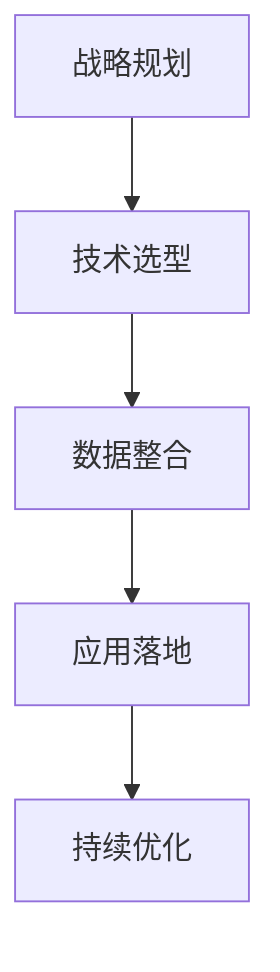
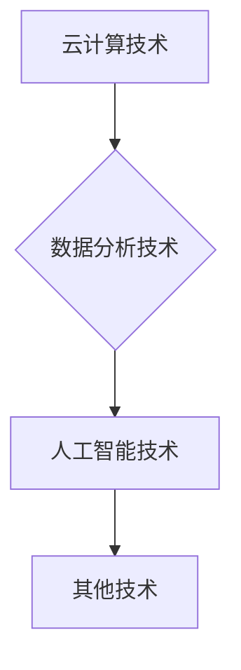
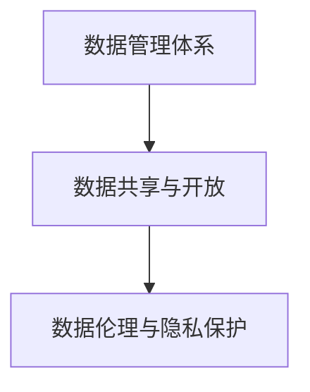
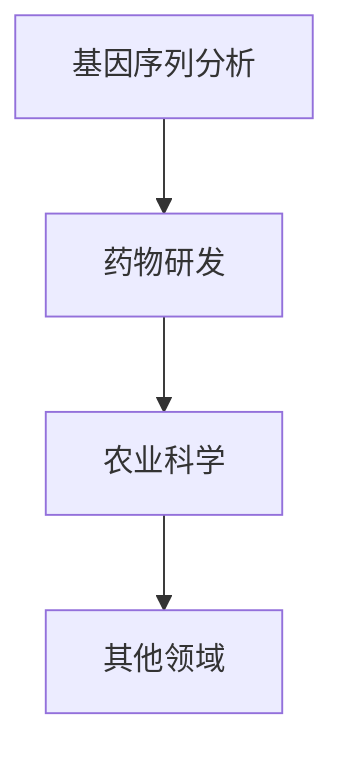
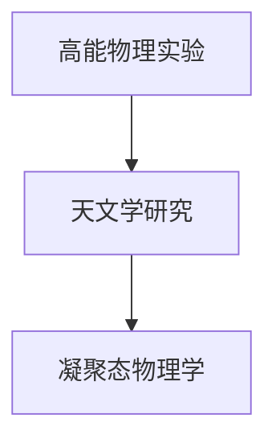
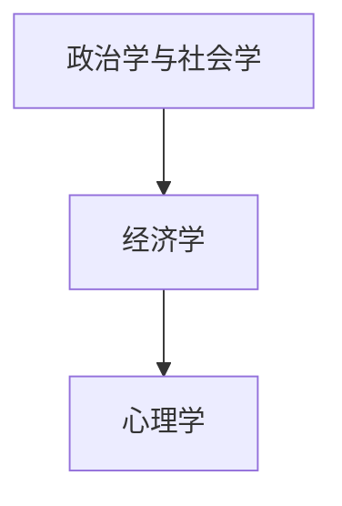
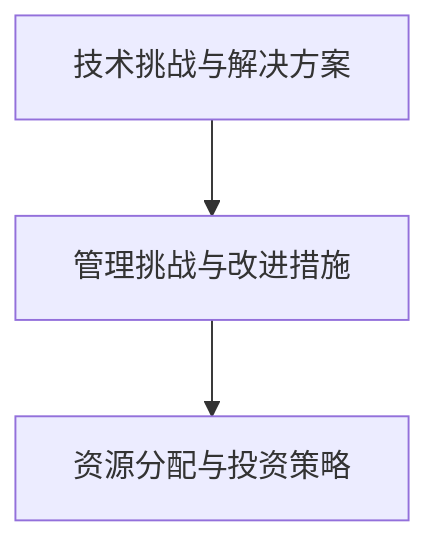
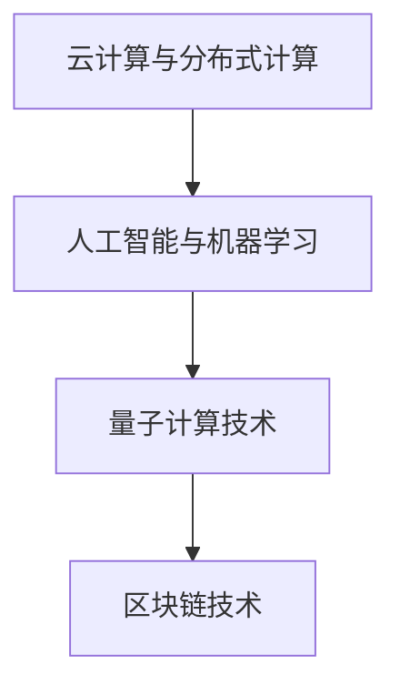

                 

### 文章标题

《科学研究的数字化转型：大数据时代的世界理解方式》

#### 关键词：
- 科学研究数字化转型
- 大数据
- 云计算
- 人工智能
- 数据分析
- 数据共享与隐私保护

#### 摘要：
本文深入探讨了大数据时代科学研究的数字化转型，分析了数字化转型对科学研究的影响和推动力。首先，文章介绍了大数据时代科学研究的背景和特性，然后详细阐述了数字化转型中的关键技术和基础工具，如云计算、大数据分析、人工智能等。接着，文章探讨了数字化转型中的数据管理与共享，以及数据伦理与隐私保护问题。随后，文章通过具体案例展示了数字化转型在生物科学、物理学、社会科学等领域的应用。最后，文章总结了数字化转型中的挑战与未来发展，提出了相应的策略和建议。

---

## 第一部分：科学研究的数字化转型概述

### 第1章：科学研究的数字化转型概念与背景

#### 1.1 大数据时代的科学研究

##### 1.1.1 大数据的定义与特性

大数据（Big Data）是指数据量巨大、数据类型多样、数据生成速度快的数据集。具体来说，大数据具有4V特性：Volume（大量）、Velocity（高速）、Variety（多样）和Veracity（真实性）。

- **Volume**：数据量巨大，通常以TB或PB为单位。
- **Velocity**：数据生成和流动速度快，需要实时处理。
- **Variety**：数据类型多样，包括结构化、半结构化和非结构化数据。
- **Veracity**：数据真实性，需要确保数据的准确性和可靠性。

##### 1.1.2 大数据在科学研究中的应用

大数据在科学研究中的应用越来越广泛，为科学发现提供了新的工具和方法。以下是大数据在科学研究中的应用场景：

- **天文学**：利用大数据分析宇宙中的天体运动和星系演化。
- **生物科学**：通过基因测序和分析，探索生命的奥秘。
- **物理学**：使用大数据进行高能物理实验和宇宙观测。
- **社会科学**：分析社会行为、人口流动和经济发展趋势。

##### 1.1.3 大数据时代的挑战与机遇

大数据时代给科学研究带来了巨大的挑战和机遇：

- **挑战**：
  - **数据存储与处理**：需要大规模存储和处理能力。
  - **数据质量**：确保数据的准确性和完整性。
  - **数据隐私**：如何保护个人隐私和数据安全。
  - **数据分析**：如何有效地从海量数据中提取有价值的信息。

- **机遇**：
  - **科学发现**：大数据使得科学发现变得更加容易和高效。
  - **跨学科研究**：大数据促进了不同学科之间的交叉融合。
  - **创新应用**：大数据推动了新技术、新业务模式的诞生。

### 1.2 科学研究的数字化转型

##### 1.2.1 数字化转型的概念与意义

数字化转型是指利用数字技术（如云计算、大数据、人工智能等）对传统业务模式进行重构和升级，以实现更高效、更智能的运营和服务。

在科学研究领域，数字化转型意味着：

- **数据驱动的决策**：通过大数据分析，为科学研究提供更科学的决策支持。
- **协同研究**：利用云计算和大数据平台，实现跨地域、跨机构的协同研究。
- **智能化实验**：利用人工智能技术，自动化和智能化实验流程。
- **创新应用**：利用新技术，探索新的科学问题和解决方案。

##### 1.2.2 数字化转型在科学研究中的实施

数字化转型的实施需要以下几个步骤：

1. **战略规划**：明确数字化转型的目标和方向，制定详细的实施计划。
2. **技术选型**：选择合适的技术平台和工具，如云计算、大数据平台等。
3. **数据整合**：整合现有数据资源，建立统一的数据管理体系。
4. **应用落地**：将数字化转型应用到具体的科学研究项目中。
5. **持续优化**：根据实践反馈，不断优化和调整数字化转型方案。

##### 1.2.3 数字化转型对科学研究的影响

数字化转型对科学研究产生了深远的影响：

- **效率提升**：通过自动化和智能化手段，提高科研效率和准确性。
- **协同创新**：促进跨学科、跨机构的合作，推动科学研究的创新。
- **数据驱动**：使科学研究更加数据驱动，更加科学和精准。
- **开放共享**：推动数据资源的开放共享，促进科学研究的透明和可信。

### Mermaid 流程图

通过上述流程图，可以清晰地看到数字化转型在科学研究中的实施步骤和关键环节。

---

在接下来的章节中，我们将进一步探讨数字化转型的基础技术、数据管理与共享、以及数字化转型在各个领域的具体应用案例。敬请期待！

---

## 第二部分：数字化转型的基础技术

### 第2章：数字化转型的基础技术

#### 2.1 云计算技术

##### 2.1.1 云计算的基本概念

云计算（Cloud Computing）是一种通过互联网提供计算资源（如服务器、存储、网络、应用程序等）的服务模式。它使得用户可以按需获取和使用计算资源，而无需拥有和管理这些资源。

云计算的关键概念包括：

- **基础设施即服务（IaaS）**：提供虚拟化的基础设施资源，如虚拟机、存储和网络。
- **平台即服务（PaaS）**：提供开发平台和工具，使得开发者可以快速构建和部署应用程序。
- **软件即服务（SaaS）**：提供完整的软件应用程序，用户可以通过互联网访问和使用。

##### 2.1.2 云计算在科学研究中的应用

云计算在科学研究中的应用主要体现在以下几个方面：

- **数据存储与处理**：利用云存储和云计算资源，实现海量数据的存储和处理。
- **分布式计算**：利用云计算平台，实现大规模的分布式计算任务。
- **协作研究**：通过云平台，实现跨地域、跨机构的科研协作。
- **高性能计算**：利用云计算平台，实现高性能计算任务，如物理模拟、生物信息学分析等。

##### 2.1.3 云计算平台与工具

目前市场上主流的云计算平台和工具包括：

- **亚马逊AWS**：提供全面的云计算服务，包括IaaS、PaaS和SaaS。
- **微软Azure**：提供丰富的云计算服务和开发工具。
- **谷歌云**：提供高性能的云计算平台和大数据分析工具。
- **阿里云**：提供广泛的云计算服务和解决方案。

这些云计算平台和工具为科学研究提供了强大的基础设施支持，使得科学家可以专注于科学研究本身，而无需担心计算资源的限制。

### 2.2 大数据分析技术

##### 2.2.1 数据分析的基本概念

数据分析（Data Analysis）是指从数据中提取有价值信息的过程。它包括以下几个关键步骤：

- **数据预处理**：清洗、整合和转换原始数据，使其适合分析和建模。
- **数据探索**：使用统计方法和可视化工具，对数据进行初步探索，发现数据中的模式、趋势和异常。
- **特征工程**：选择和构造有助于预测或分类的特征。
- **模型构建**：选择合适的统计模型或机器学习算法，对数据进行建模和预测。

##### 2.2.2 数据分析在科学研究中的应用

数据分析在科学研究中的应用非常广泛，以下是一些典型的应用场景：

- **生物科学**：通过数据分析，探索基因和蛋白质之间的相互作用，发现新的生物标记和药物靶点。
- **物理学**：利用数据分析，处理实验数据，发现新的物理现象和规律。
- **社会科学**：通过数据分析，研究社会行为、人口流动和经济发展趋势。

##### 2.2.3 大数据分析的关键技术和工具

大数据分析的关键技术和工具包括：

- **Hadoop**：一个分布式数据存储和处理的框架，适用于处理大规模数据集。
- **Spark**：一个快速的分布式数据处理引擎，适用于实时数据分析和机器学习。
- **R**：一个统计分析和图形展示工具，广泛应用于数据科学和生物科学等领域。
- **Python**：一种通用编程语言，广泛应用于科学计算和数据可视化。

这些技术和工具为科学研究提供了强大的数据分析能力，使得科学家可以更加深入地探索数据背后的规律和模式。

### 2.3 人工智能技术

##### 2.3.1 人工智能的基本概念

人工智能（Artificial Intelligence，简称AI）是指通过计算机模拟人类智能的技术。它包括以下几个核心概念：

- **机器学习**：通过训练算法，使计算机能够从数据中学习并做出决策。
- **深度学习**：一种特殊的机器学习方法，通过多层神经网络进行数据建模。
- **自然语言处理**：使计算机能够理解和生成自然语言。
- **计算机视觉**：使计算机能够理解和处理图像和视频。

##### 2.3.2 人工智能在科学研究中的应用

人工智能在科学研究中的应用非常广泛，以下是一些典型的应用场景：

- **药物研发**：通过人工智能预测药物分子的活性，加速新药的发现和开发。
- **生物信息学**：通过人工智能分析基因序列，发现新的生物标记和疾病关联。
- **环境监测**：通过人工智能分析环境数据，预测污染和气候变化。
- **科学发现**：通过人工智能自动化科学实验，提高科研效率。

##### 2.3.3 人工智能的关键技术和工具

人工智能的关键技术和工具包括：

- **TensorFlow**：一个开源的机器学习框架，适用于构建和训练深度神经网络。
- **PyTorch**：一个开源的机器学习框架，适用于快速原型设计和实验。
- **Keras**：一个基于TensorFlow和Theano的开源深度学习库，适用于快速构建和训练深度学习模型。
- **OpenCV**：一个开源的计算机视觉库，适用于图像和视频处理。

这些技术和工具为科学研究提供了强大的人工智能支持，使得科学家可以更加高效地解决复杂的科学研究问题。

### Mermaid 流程图

通过上述流程图，可以清晰地看到数字化转型中的基础技术架构和关键环节。

---

在下一章中，我们将探讨数字化转型中的数据管理与共享，以及数据伦理与隐私保护问题。敬请期待！

---

## 第三部分：数字化转型中的数据管理与共享

### 第3章：数字化转型中的数据管理与共享

#### 3.1 数据管理体系

##### 3.1.1 数据管理的基本原则

数据管理是指组织、维护和使用数据的一系列活动和过程。在数字化转型中，数据管理尤为重要，它确保了数据的完整性、一致性和可用性。以下是数据管理的基本原则：

- **数据质量**：确保数据准确性、完整性和一致性。
- **数据安全**：保护数据免受未授权访问、篡改和泄露。
- **数据隐私**：遵守数据隐私法规，保护个人隐私。
- **数据可用性**：确保数据能够被有效检索和使用。
- **数据治理**：建立数据治理框架，确保数据管理策略的执行和持续改进。

##### 3.1.2 数据管理的实践案例

以下是一些数据管理的实践案例：

- **生物科学领域**：在生物科学研究中，数据管理的关键在于基因序列、蛋白质结构和实验数据的存储和管理。许多研究机构采用了统一的数据管理平台，实现了数据的高效存储、共享和访问。
- **社会科学领域**：在社会科学研究中，数据管理涉及到大量问卷调查数据、社会网络数据和地理空间数据。通过建立统一的数据管理平台，可以实现数据的集中管理和跨学科共享，提高研究的效率和准确性。

##### 3.1.3 数据管理工具与应用

数据管理工具包括数据库管理系统（如MySQL、PostgreSQL）、数据仓库（如Snowflake、Google BigQuery）和元数据管理工具（如Talend、Informatica）。以下是一些常用的数据管理工具和应用：

- **数据库管理系统**：用于存储和管理结构化数据。例如，MySQL和PostgreSQL被广泛用于生物科学、社会科学和物理学研究。
- **数据仓库**：用于存储和管理大规模的半结构化和非结构化数据。例如，Snowflake和Google BigQuery被用于存储和分析科研数据。
- **元数据管理工具**：用于管理和维护元数据，如数据定义、数据源和数据流程。例如，Talend和Informatica用于实现数据治理和元数据管理。

### 3.2 数据共享与开放

##### 3.2.1 数据共享的重要性

数据共享在数字化转型中具有重要意义。通过数据共享，可以：

- **促进科研协作**：研究人员可以共享数据，实现跨学科、跨机构的合作。
- **加速科学发现**：共享数据可以加速科学研究的进展，提高科研效率。
- **提高研究透明度**：共享数据可以提高科研结果的透明度，增强公众对科研的信任。

##### 3.2.2 数据共享的实践挑战与解决方案

数据共享在实践中面临以下挑战：

- **数据隐私**：如何保护个人隐私和数据安全。
- **数据格式**：不同研究机构可能使用不同的数据格式，导致数据共享困难。
- **数据标准化**：如何确保共享数据的标准化和一致性。

解决方案包括：

- **数据加密**：使用数据加密技术，保护共享数据的安全性。
- **数据格式转换**：开发数据格式转换工具，实现不同格式数据之间的互操作。
- **数据标准化**：制定统一的数据标准，确保共享数据的一致性和可用性。

##### 3.2.3 数据共享平台与工具

以下是一些常用的数据共享平台和工具：

- **数据共享平台**：例如，NCBI的GenBank、DOE的ESnet、社交媒体平台如Twitter和LinkedIn。
- **数据共享协议**：例如，CC0协议、ODC PDDL协议。
- **数据共享工具**：例如，数据仓库工具如Snowflake、数据转换工具如ETL工具。

### 3.3 数据伦理与隐私保护

##### 3.3.1 数据伦理的基本原则

数据伦理涉及在数据收集、处理和使用过程中的道德和行为规范。以下是数据伦理的基本原则：

- **尊重个人隐私**：在收集和使用个人数据时，必须尊重个人隐私，不得泄露个人隐私。
- **数据透明度**：确保数据的收集、处理和使用过程透明，使个人了解其数据的使用情况。
- **数据安全**：确保数据的安全存储和保护，防止数据泄露和未授权访问。
- **责任承担**：数据所有者和数据处理者应对数据安全和隐私保护承担责任。

##### 3.3.2 数据隐私保护的法律与政策

数据隐私保护的法律与政策包括：

- **GDPR**：欧盟的通用数据保护条例，规定了数据收集、处理和使用的规则和标准。
- **CCPA**：加州消费者隐私法案，规定了个人数据的收集、使用和共享规则。
- **个人信息保护法**：中国个人信息保护法，规定了个人信息的收集、处理和使用的规则。

##### 3.3.3 数据隐私保护的技术手段与实践

数据隐私保护的技术手段包括：

- **数据加密**：使用数据加密技术，保护数据在传输和存储过程中的安全性。
- **访问控制**：通过访问控制机制，限制对数据的访问权限，确保数据安全。
- **匿名化**：通过匿名化技术，消除数据中的个人识别信息，保护个人隐私。
- **数据脱敏**：对敏感数据进行脱敏处理，使其无法被直接识别。

实践中的数据隐私保护措施包括：

- **建立数据隐私保护政策**：制定明确的数据隐私保护政策和流程。
- **开展隐私影响评估**：在数据收集和处理前，进行隐私影响评估，确保隐私保护措施得到实施。
- **培训员工**：对员工进行数据隐私保护培训，提高员工的隐私保护意识。

### Mermaid 流程图

通过上述流程图，可以清晰地看到数字化转型中的数据管理与共享、以及数据伦理与隐私保护的关键环节。

---

在下一部分，我们将通过具体案例展示数字化转型在生物科学、物理学、社会科学等领域的应用。敬请期待！

---

## 第四部分：数字化转型中的具体应用案例

### 第4章：生物科学研究中的数字化转型

#### 4.1 生物信息学在大数据时代的发展

##### 4.1.1 生物信息学的基本概念

生物信息学（Bioinformatics）是生物学和计算机科学的交叉学科，主要研究如何使用计算机技术来存储、管理和分析生物数据。生物信息学的发展可以分为以下几个阶段：

1. **早期阶段**：生物信息学的主要任务是处理基因序列数据和蛋白质结构数据。
2. **发展阶段**：随着基因组学和蛋白质组学的兴起，生物信息学开始专注于大规模数据分析，如基因表达谱、蛋白质相互作用网络等。
3. **现代阶段**：生物信息学结合了人工智能和机器学习技术，实现了更高效、更精准的数据分析，如药物发现、疾病诊断等。

##### 4.1.2 生物信息学在大数据时代的作用

在大数据时代，生物信息学发挥了重要作用，主要体现在以下几个方面：

- **基因序列分析**：通过大数据分析，发现新的基因功能、疾病关联和药物靶点。
- **药物研发**：利用生物信息学技术，预测药物分子的活性、毒性和相互作用，加速新药研发。
- **个性化医疗**：基于患者的基因信息，实现个性化治疗方案，提高治疗效果。
- **疾病预测与预防**：通过大数据分析，预测疾病的发病风险，实现早期预防和干预。

##### 4.1.3 生物信息学的主要应用领域

生物信息学的主要应用领域包括：

- **基因组学**：研究基因的组成、结构和功能，如基因组测序、基因表达分析等。
- **蛋白质组学**：研究蛋白质的表达、修饰和相互作用，如蛋白质谱分析、蛋白质结构预测等。
- **代谢组学**：研究细胞内外的代谢物质，如代谢物分析、代谢网络建模等。
- **转录组学**：研究基因表达谱，如RNA测序、基因芯片分析等。

#### 4.2 生物科学研究中的数字化转型案例

##### 4.2.1 癌症基因组学的数字化转型

癌症基因组学是生物信息学的一个重要分支，通过分析癌症患者的基因组和转录组数据，发现癌症的发生、发展和治疗的关键基因和分子机制。

数字化转型在癌症基因组学中的应用主要体现在以下几个方面：

- **大规模数据处理**：利用云计算和大数据技术，处理和分析大规模的基因组数据。
- **数据共享与协作**：通过建立癌症基因组数据库，实现全球范围内的数据共享和协作。
- **人工智能应用**：利用人工智能技术，如深度学习和机器学习，进行大规模数据分析，发现新的癌症生物标志物和药物靶点。

案例：The Cancer Genome Atlas（TCGA）项目

TCGA项目是一个全球性的癌症基因组学研究项目，通过收集和分析数千名癌症患者的基因组数据，旨在揭示癌症的发生、发展和治疗机制。该项目的数字化转型体现在：

- **数据存储与处理**：利用云计算平台，如Google Cloud和AWS，存储和处理庞大的基因组数据。
- **数据共享与协作**：通过建立统一的数据共享平台，实现全球范围内的数据共享和协作。
- **人工智能应用**：利用人工智能技术，如TensorFlow和PyTorch，进行大规模数据分析，发现新的癌症生物标志物和药物靶点。

##### 4.2.2 药物研发中的数字化转型

数字化转型在药物研发中的应用极大地提高了药物研发的效率，缩短了药物上市的时间。以下是一些具体的数字化转型案例：

- **计算机辅助药物设计**：利用人工智能和分子模拟技术，预测药物分子的活性、毒性和相互作用，加速药物筛选和设计。
- **高通量筛选**：利用自动化和高通量技术，大规模筛选潜在的药物分子，提高药物研发的成功率。
- **生物信息学分析**：利用大数据分析技术，从大量生物数据中挖掘潜在的药物靶点和生物标志物。

案例：Gilead Sciences的Sovaldi药物研发

Gilead Sciences开发的Sovaldi是一种治疗丙型肝炎的药物，其研发过程充分体现了数字化转型的优势。以下是Sovaldi药物研发中的数字化转型案例：

- **计算机辅助药物设计**：利用人工智能和分子模拟技术，筛选和优化潜在的药物分子。
- **高通量筛选**：利用自动化和高通量技术，快速筛选和验证药物分子。
- **生物信息学分析**：利用大数据分析技术，挖掘丙型肝炎的潜在治疗靶点和生物标志物。

##### 4.2.3 农业科学中的数字化转型

数字化转型在农业科学中的应用正在改变农业生产的方式，提高农业生产的效率和可持续性。以下是一些具体的数字化转型案例：

- **智能农业**：利用物联网、大数据和人工智能技术，实现农业生产的自动化和智能化。
- **精准农业**：利用卫星遥感、传感器和大数据分析，实现农田管理的精准化和智能化。
- **生物信息学分析**：利用生物信息学技术，研究农作物的基因表达、生长环境和病虫害防治。

案例：Syngenta的精准农业解决方案

Syngenta开发的精准农业解决方案通过物联网、大数据和人工智能技术，为农民提供精准的农业管理建议。以下是该解决方案的数字化转型案例：

- **智能农业**：通过传感器和物联网技术，实时监测农田的环境参数，如土壤湿度、温度、光照等。
- **精准农业**：通过大数据分析，为农民提供精准的灌溉、施肥和病虫害防治建议。
- **生物信息学分析**：利用生物信息学技术，研究农作物的基因表达和抗病性，为育种和病虫害防治提供科学依据。

### 4.3 数字化转型对生物科学研究的影响

数字化转型对生物科学研究产生了深远的影响，主要表现在以下几个方面：

- **数据驱动**：数字化转型使得生物科学研究更加数据驱动，从数据中发现新的科学规律和生物标志物。
- **跨学科合作**：数字化转型促进了跨学科合作，如生物信息学、计算机科学、物理学等，推动了科学研究的创新。
- **效率提升**：数字化转型提高了科研效率，缩短了科研周期，降低了科研成本。
- **开放共享**：数字化转型推动了数据资源的开放共享，促进了科学研究的透明和可信。

### Mermaid 流程图

通过上述流程图，可以清晰地看到数字化转型在生物科学研究中的主要应用领域和相互关系。

---

在下一章，我们将探讨数字化转型在物理学研究中的应用案例。敬请期待！

---

## 第5章：物理学研究中的数字化转型

### 5.1 物理学研究中的大数据应用

#### 5.1.1 大数据在物理学研究中的重要性

在大数据时代，物理学研究正经历着深刻的变革。大数据在物理学研究中的重要性体现在以下几个方面：

1. **实验数据的增长**：随着实验技术的进步，物理学家能够收集和处理的海量数据量急剧增加。例如，粒子物理学实验中产生的数据量每年都在以惊人的速度增长。

2. **复杂性的提升**：物理学的许多研究问题，如高能物理、宇宙学、凝聚态物理等，涉及的数据类型复杂，包含多维度、多尺度和多层次的实验数据。

3. **数据驱动的研究方法**：大数据使得物理学研究从传统的理论推导和实验验证模式，逐渐转向数据驱动的方法。通过分析大量数据，物理学家能够发现新的物理现象、规律和预测。

#### 5.1.2 大数据在物理学研究中的应用案例

大数据在物理学研究中的应用案例包括：

1. **高能物理**：例如，大型强子对撞机（LHC）产生的数据量每年超过10PB。物理学家使用大数据分析技术，如Hadoop和Spark，来处理这些海量数据，寻找新的粒子物理现象。

2. **宇宙学**：宇宙微波背景辐射（CMB）数据集包含了大量关于宇宙早期状态的信息。天文学家通过大数据分析方法，如机器学习和深度学习，揭示了宇宙的结构和演化。

3. **凝聚态物理**：在材料科学研究中，大数据技术用于分析材料的电子结构、晶体结构和相变行为。通过计算模拟和实验数据的结合，物理学家能够预测新材料的性能和应用。

#### 5.1.3 物理学研究中的大数据分析技术

物理学研究中的大数据分析技术包括：

1. **分布式计算**：分布式计算技术，如Hadoop和Spark，用于处理和分析大规模的数据集。这些技术能够在多个节点上并行处理数据，提高分析效率。

2. **机器学习**：机器学习算法，如神经网络和支持向量机，用于从大量数据中提取模式和规律。这些算法在粒子物理、材料科学和天文学等领域得到了广泛应用。

3. **数据可视化**：数据可视化技术用于展示复杂的数据结构和分析结果。例如，使用交互式图表和地图，物理学家能够更直观地理解实验数据和理论模型。

### 5.2 物理学研究中的数字化转型实践

#### 5.2.1 高能物理实验中的数字化转型

高能物理实验，如大型强子对撞机（LHC）的运行，是数字化转型在物理学研究中的重要应用领域。以下是数字化转型在高能物理实验中的具体实践：

1. **数据存储与处理**：LHC实验产生的数据量非常大，需要使用大规模的分布式存储和处理系统。例如，LHC的分布式存储系统使用全球多个分布式数据中心，实现数据的高效存储和处理。

2. **云计算技术**：云计算技术，如AWS和Google Cloud，用于处理和分析LHC产生的海量数据。物理学家通过云计算平台，利用分布式计算和大数据分析技术，快速处理实验数据。

3. **数据共享与协作**：LHC实验数据在科研社区中高度共享。通过数据共享平台，如LHC的Open Data Portal，物理学家可以访问和使用全球范围内的实验数据，实现跨机构的合作。

#### 5.2.2 天文学研究中的数字化转型

天文学研究中的数字化转型主要体现在以下几个方面：

1. **大数据处理**：天文学家使用大数据分析技术，如Hadoop和Spark，处理和分析来自地面和空间望远镜的海量天文数据。这些数据包括宇宙微波背景辐射、星系分布、星系形成等。

2. **机器学习**：机器学习算法，如深度学习和神经网络，用于分析天文数据，识别新的天文现象和规律。例如，机器学习技术被用于识别引力透镜效应、探测脉冲星和发现新的行星系统。

3. **数据可视化**：数据可视化技术，如天体可视化软件，用于展示天文数据和分析结果。通过交互式图表和地图，天文学家能够更直观地理解宇宙的复杂结构和演化过程。

#### 5.2.3 凝聚态物理学中的数字化转型

凝聚态物理学研究中的数字化转型主要体现在以下几个方面：

1. **计算模拟**：利用高性能计算和云计算平台，凝聚态物理学家进行大规模的计算模拟，研究材料的电子结构、晶体结构和相变行为。

2. **数据存储与共享**：凝聚态物理研究产生的实验和模拟数据量巨大，需要高效的存储和共享机制。例如，通过数据库系统和云存储服务，研究人员可以访问和共享全球范围内的实验和模拟数据。

3. **数据驱动的研究方法**：数字化转型推动了凝聚态物理学研究中的数据驱动方法。物理学家通过大数据分析和机器学习算法，从实验和模拟数据中提取有用的信息，指导材料设计和优化。

### Mermaid 流程图

通过上述流程图，可以清晰地看到数字化转型在物理学研究中的主要应用领域和相互关系。

---

在下一章，我们将探讨数字化转型在社会科学研究中的应用案例。敬请期待！

---

## 第6章：社会科学研究中的数字化转型

### 6.1 社会科学研究中的大数据应用

#### 6.1.1 大数据在社会科学研究中的作用

大数据在社会科学研究中扮演着越来越重要的角色，它为社会科学研究带来了新的方法和工具，使得研究者能够更加全面、深入地探索社会现象和社会问题。以下是大数据在社会科学研究中的主要作用：

1. **数据来源的丰富性**：大数据提供了丰富多样的数据来源，包括社交媒体、网络平台、政府数据库、商业数据等，这些数据涵盖了社会生活的各个方面，为社会科学研究提供了广泛的数据基础。

2. **研究方法的创新**：大数据使得社会科学研究从传统的定性研究转向定量研究和数据驱动研究。通过大数据分析技术，如机器学习和深度学习，研究者能够从海量数据中提取有价值的信息和模式。

3. **研究效率的提升**：大数据分析技术能够快速处理大量数据，提高了研究效率。研究者不再需要手动整理和分析数据，而是可以专注于数据分析和结果解读。

4. **研究深度的增强**：大数据使得研究者能够探索更细粒度、更深入的社会现象。通过分析大量的社交网络数据，研究者能够揭示社交关系的复杂性、群体的行为模式等。

#### 6.1.2 大数据在社会科学研究中的应用案例

大数据在社会科学研究中的应用案例非常广泛，以下是一些典型的应用：

1. **社会学**：通过分析社交媒体数据，研究者能够研究社会行为、网络结构和群体动态。例如，通过Twitter数据，研究者揭示了社会运动和公众情绪的变化。

2. **经济学**：大数据分析被用于研究市场趋势、消费者行为和经济预测。例如，通过分析电子商务平台的数据，研究者能够预测未来的市场需求和价格变化。

3. **政治学**：大数据分析被用于研究选举行为、政策影响和公共舆论。例如，通过分析互联网论坛和新闻网站的数据，研究者能够了解公众对政策的看法和反应。

4. **心理学**：大数据分析被用于研究人类行为、心理状态和心理健康。例如，通过分析社交媒体数据和在线问卷调查，研究者能够发现心理疾病的风险因素和行为模式。

#### 6.1.3 社会科学研究中的大数据分析技术

大数据分析技术在社会科学研究中扮演着关键角色，以下是一些主要的技术：

1. **机器学习**：机器学习算法能够自动从数据中学习和提取模式，用于分类、预测和聚类等任务。例如，通过机器学习算法，研究者能够预测选举结果、分析社会运动的发展趋势。

2. **深度学习**：深度学习是一种特殊的机器学习算法，通过多层神经网络进行数据建模。深度学习在图像识别、自然语言处理等领域取得了显著成果，也被广泛应用于社会科学研究。

3. **文本分析**：文本分析技术用于处理和分析文本数据，包括情感分析、主题建模和关键词提取等。这些技术使得研究者能够从大量的文本数据中提取有价值的信息和洞察。

4. **网络分析**：网络分析技术用于研究社交网络、信息网络和知识网络等。通过网络分析，研究者能够揭示网络的结构特性、节点的重要性和网络传播机制。

### 6.2 社会科学研究中的数字化转型实践

#### 6.2.1 政治学与社会学中的数字化转型

数字化转型在政治学和社会学中的应用主要体现在数据收集、分析和决策支持等方面：

1. **数据收集**：政治学家和社会学家通过在线调查、社交媒体数据采集和公共记录查询等方式，收集大量的数据。这些数据为研究提供了丰富的素材。

2. **数据分析**：研究者利用大数据分析技术，对收集到的数据进行分析，揭示社会和政治现象的规律和趋势。例如，通过分析社交媒体数据，研究者能够了解公众对政治事件的态度和情绪变化。

3. **决策支持**：数字化转型为政治决策提供了强大的数据支持。通过大数据分析，政府和社会组织能够更准确地了解公众需求和社会问题，制定更有效的政策和措施。

案例：美国的“大数据政治”项目

“大数据政治”项目是一个利用大数据分析技术进行政治研究的案例。该项目通过分析社交媒体数据、公共记录和在线调查数据，研究选民行为、选举策略和公共政策。以下是该项目的数字化转型实践：

- **数据收集**：通过社交媒体数据采集工具，如Twitter API，收集大量选民评论和讨论数据。
- **数据分析**：利用机器学习和文本分析技术，分析选民情绪、讨论主题和社交网络结构。
- **决策支持**：通过数据分析结果，为政治候选人提供选战策略和政策建议。

#### 6.2.2 经济学中的数字化转型

数字化转型在经济学中的应用体现在数据驱动的经济分析和预测方面：

1. **经济数据收集**：经济学家通过互联网、商业数据库和政府统计数据等渠道，收集大量的经济数据。

2. **数据驱动的研究**：研究者利用大数据分析技术，如机器学习和深度学习，对经济数据进行建模和预测。例如，通过分析电子商务数据，研究者能够预测未来的经济趋势和市场需求。

3. **实时经济监测**：数字化转型使得经济学家能够实时监测经济指标的变化，快速响应经济事件，提供即时的经济分析。

案例：中国宏观经济数据监测系统

中国宏观经济数据监测系统是一个利用大数据分析技术进行经济监测和预测的系统。该系统通过收集和处理海量的经济数据，如工业生产数据、零售数据、就业数据等，对中国的宏观经济运行进行实时监测和预测。以下是该系统的数字化转型实践：

- **数据收集**：通过互联网和政府数据库，收集大量的宏观经济数据。
- **数据分析**：利用机器学习和深度学习算法，对经济数据进行建模和预测。
- **实时监测**：通过可视化技术，实时展示经济指标的变化和预测结果。

#### 6.2.3 心理学中的数字化转型

数字化转型在心理学中的应用主要体现在心理数据的收集、分析和应用方面：

1. **心理数据收集**：心理学家通过在线问卷调查、社交媒体数据采集和生理信号监测等方式，收集大量的心理数据。

2. **数据分析**：研究者利用大数据分析技术，如文本分析、情感分析和机器学习，对心理数据进行处理和分析，揭示心理现象的规律和机制。

3. **心理干预**：数字化转型使得心理干预更加个性化、科学化。通过大数据分析，心理学家能够为个体提供针对性的心理干预方案。

案例：抑郁症智能诊断系统

抑郁症智能诊断系统是一个利用大数据分析技术进行心理诊断的系统。该系统通过分析患者的社交媒体数据、在线问卷调查数据和生理信号数据，评估患者的抑郁程度和心理健康状况。以下是该系统的数字化转型实践：

- **数据收集**：通过在线问卷调查和生理信号监测，收集患者的心理数据。
- **数据分析**：利用文本分析和机器学习算法，分析患者的心理数据，评估抑郁程度。
- **心理干预**：根据分析结果，为患者提供个性化的心理干预方案。

### Mermaid 流程图

通过上述流程图，可以清晰地看到数字化转型在社会科学研究中的主要应用领域和相互关系。

---

在下一章，我们将探讨数字化转型中的挑战与未来发展。敬请期待！

---

## 第五部分：数字化转型中的挑战与未来发展

### 第7章：数字化转型中的挑战与应对策略

#### 7.1 技术挑战与解决方案

数字化转型带来了许多技术挑战，这些挑战需要通过创新和优化技术来解决。

##### 7.1.1 技术架构与基础设施

**挑战**：大规模数据处理需要强大的计算能力和存储资源。现有的基础设施可能无法满足需求，导致数据处理缓慢和效率低下。

**解决方案**：
- **分布式计算**：通过分布式计算架构，如Hadoop和Spark，实现数据的高效处理和分析。
- **云计算**：利用云计算平台，如AWS、Azure和Google Cloud，提供弹性计算和存储资源，根据需求动态调整资源。

##### 7.1.2 技术更新与适应性

**挑战**：技术更新速度快，科学研究需要不断适应新的技术和工具。

**解决方案**：
- **持续学习与培训**：定期组织技术培训，帮助科研人员了解和掌握最新的技术。
- **技术评估与选型**：对现有技术进行定期评估，选择最合适的技术和工具，确保系统的稳定性和适应性。

##### 7.1.3 技术安全与隐私保护

**挑战**：数字化转型带来了数据安全和个人隐私的挑战。如何确保数据在传输和存储过程中的安全性，如何保护个人隐私？

**解决方案**：
- **数据加密**：使用加密技术，保护数据在传输和存储过程中的安全性。
- **隐私保护技术**：采用匿名化、数据脱敏等技术，保护个人隐私。
- **安全审计与监控**：建立安全审计和监控机制，确保系统的安全性和数据的完整性。

### 7.2 管理挑战与改进措施

数字化转型不仅需要技术上的支持，还需要管理上的变革和创新。

##### 7.2.1 管理模式与组织架构

**挑战**：传统的管理模式和组织架构可能无法适应数字化转型的需求。如何构建适应数字化转型的新型管理模式和组织架构？

**解决方案**：
- **扁平化组织**：通过扁平化组织结构，减少层级和沟通障碍，提高决策效率。
- **跨部门合作**：建立跨部门的合作机制，促进不同部门和团队之间的协作和创新。

##### 7.2.2 管理流程与效率

**挑战**：数字化转型需要优化管理流程，提高工作效率。如何优化管理流程，减少不必要的环节和流程瓶颈？

**解决方案**：
- **流程优化**：通过流程再造和流程优化，消除冗余环节，提高流程效率。
- **自动化与智能化**：利用自动化和智能化工具，如RPA（机器人流程自动化），实现管理流程的自动化和智能化。

##### 7.2.3 管理创新与变革

**挑战**：数字化转型要求管理创新和变革。如何推动管理创新，适应新的技术和管理模式？

**解决方案**：
- **创新文化**：建立创新文化，鼓励科研人员和员工提出创新想法和建议。
- **试点项目**：通过试点项目，探索新的管理方法和模式，积累经验和教训。

### 7.3 资源分配与投资策略

数字化转型需要大量的资源投入，如何合理分配资源，确保投资回报，是一个重要的挑战。

##### 7.3.1 资源配置与优化

**挑战**：资源分配不合理，可能导致资源浪费或效率低下。

**解决方案**：
- **资源需求预测**：通过数据分析，预测未来的资源需求，合理规划资源分配。
- **资源优化**：通过优化资源配置，如资源调度和共享，提高资源利用效率。

##### 7.3.2 投资回报与风险管理

**挑战**：数字化转型投资回报周期长，存在一定的风险。

**解决方案**：
- **投资评估**：对数字化转型项目进行详细评估，分析投资回报和风险。
- **风险管理**：建立风险管理机制，识别和管理潜在的风险。

##### 7.3.3 公共资源与共享机制

**挑战**：科研机构之间的资源分配不均，共享机制不完善。

**解决方案**：
- **公共资源平台**：建立公共资源平台，实现科研资源的共享和合理分配。
- **共享机制**：制定共享机制和规则，确保资源共享的公平和透明。

### Mermaid 流程图

通过上述流程图，可以清晰地看到数字化转型中的主要挑战和相应的解决方案。

---

在下一章中，我们将探讨科学研究数字化转型的发展趋势。敬请期待！

---

## 第8章：科学研究数字化转型的发展趋势

### 8.1 数字化转型的未来趋势

数字化转型正在迅速改变科学研究的方式，未来几年，以下几个趋势将对科学研究产生深远影响：

##### 8.1.1 云计算与分布式计算的发展

云计算和分布式计算技术将继续发展，提供更高效、更灵活的计算资源。以下是其具体影响：

- **计算能力的提升**：随着云计算和分布式计算技术的发展，科学家将能够访问更强大的计算资源，进行复杂的数据分析和模拟计算。
- **灵活的资源分配**：科学家可以根据需要动态调整计算资源，降低计算成本，提高资源利用效率。
- **全球协作**：云计算和分布式计算使得全球范围内的科研协作更加容易，科学家可以实时共享数据和计算资源，加速科学发现。

##### 8.1.2 人工智能与机器学习技术的应用

人工智能和机器学习技术将在科学研究各个领域得到更广泛的应用。以下是其具体影响：

- **数据分析**：人工智能和机器学习技术将大幅提升数据分析和处理能力，帮助科学家从大量数据中提取有价值的信息。
- **自动化实验**：利用人工智能技术，科学家可以自动化实验流程，提高实验的效率和准确性。
- **智能决策**：人工智能技术将为科学家提供智能决策支持，帮助他们更好地理解科学现象，预测科学结果。

##### 8.1.3 量子计算技术的突破

量子计算技术的突破将使科学研究进入新的阶段。以下是其具体影响：

- **复杂计算**：量子计算具有强大的计算能力，可以解决传统计算机无法处理的复杂问题，如量子化学模拟、生物信息学分析等。
- **新科学发现**：量子计算技术将为科学家提供新的工具和方法，探索量子物理、量子生物学等新兴科学领域。
- **技术革新**：量子计算技术的突破将推动相关技术的革新，如量子传感器、量子通信等。

##### 8.1.4 区块链技术的应用

区块链技术在科学研究中的应用将带来数据共享和安全性的提升。以下是其具体影响：

- **数据共享**：区块链技术可以确保科研数据的安全和不可篡改性，促进数据共享和开放。
- **透明度提升**：区块链技术可以记录科研过程中的所有操作和决策，提高科研的透明度和可追溯性。
- **知识产权保护**：区块链技术可以帮助科学家保护自己的知识产权，确保科研成果的归属和利益分配。

### 8.2 科学研究数字化转型中的关键技术和工具

随着数字化转型的深入，科学家将依赖一系列关键技术和工具来推动科学研究的发展。以下是其中一些重要的技术和工具：

- **Hadoop和Spark**：用于大规模数据存储和处理的分布式计算框架，适用于大数据分析。
- **TensorFlow和PyTorch**：用于构建和训练深度学习模型的机器学习框架，广泛应用于图像识别、自然语言处理等应用。
- **R和Python**：用于数据分析和统计的编程语言，提供了丰富的数据分析和可视化工具。
- **OpenCV**：用于计算机视觉的开源库，提供了丰富的图像处理和机器学习算法。
- **Blockchain**：用于数据存储和传输的分布式数据库，提供了安全、透明和去中心化的解决方案。

### 8.3 科学研究数字化转型的影响

数字化转型将对科学研究产生深远的影响，主要表现在以下几个方面：

- **研究效率提升**：数字化转型将提高科研效率，缩短科研周期，降低科研成本。
- **数据驱动的研究方法**：数字化转型将推动科学研究从经验驱动转向数据驱动，使科学研究更加科学和精准。
- **跨学科合作**：数字化转型将促进跨学科合作，推动科学研究的创新和进步。
- **开放共享**：数字化转型将推动数据资源的开放共享，促进科学研究的透明和可信。

### 8.4 科学研究数字化转型中的注意事项

在推动科学研究数字化转型过程中，需要注意以下几个方面：

- **数据安全与隐私保护**：确保数据在传输和存储过程中的安全性和隐私性，遵守相关法律法规。
- **技术选型和培训**：选择合适的技术和工具，对科研人员进行技术培训，提高他们的技术能力和应用水平。
- **持续改进**：数字化转型是一个持续的过程，需要不断评估和优化技术和管理流程，确保数字化转型的顺利进行。

### Mermaid 流程图

通过上述流程图，可以清晰地看到科学研究数字化转型的主要技术和未来发展趋势。

---

在未来的日子里，随着技术的不断进步和应用的深入，科学研究数字化转型将继续推动科学的发展和进步。让我们共同期待这一激动人心的未来！

